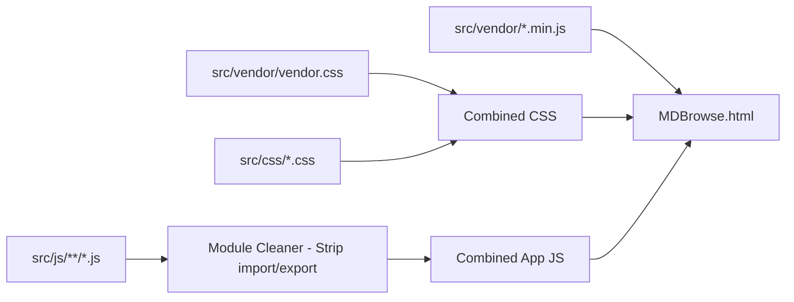

# คู่มือเชิงเทคนิค MDBrowse (Technical Manual & AI Agent Guide)

เอกสารนี้จัดทำขึ้นสำหรับ **นักพัฒนา (Developers)** และ **AI Agents** ที่จะเข้ามาดูแล พัฒนาต่อ หรือแก้ไขโค้ดของโครงการ **MDBrowse** ในอนาคต

---

## 1. ปรัชญาการออกแบบและข้อจำกัดทางสภาพแวดล้อม (Design Philosophy & Constraints)

### 1.1 สภาพแวดล้อมการทำงาน (Runtime Environment)
- **แพลตฟอร์ม**: Google Chrome บนระบบปฏิบัติการ Windows (หรือ OS อื่นที่รองรับ Chromium)
- **โปรโตคอล**: รันผ่าน `file:///` (Local File Protocol) โดยตรง
- **การเชื่อมต่อ**: **100% ออฟไลน์ (Zero External Network Requests)** ห้ามพึ่งพา CDN, Remote API หรือภายนอกเครื่องเด็ดขาด
- **การติดตั้ง**: ไม่ต้องลง Web Server ไม่ต้องพึ่งพา Node.js ในขณะใช้งานจริงของผู้ใช้ (ต้องการเพียงเบราว์เซอร์ Chrome เท่านั้น)

### 1.2 ข้อจำกัดด้านความปลอดภัยของ Chrome บน `file:///` (Security Sandbox Constraints)
1. **Origin เป็น `null`**: การสร้าง Web Worker ผ่าน `new Worker(blobUrl)` อาจถูกบล็อกโดย Chrome Security Policy บน `file:///` ดังนั้น PDF.js และ Worker ทุกตัวต้องสามารถทำงานแบบ **In-Memory / Main-Thread Worker** (`globalThis.pdfjsWorker`) ได้เสมอ
2. **การฝัง PDF ใน `<iframe>` / `<embed>` ถูกจำกัด**: Chrome ปิดกั้น PDF Plugin ภายใน sub-frame ของ `file:///` จึงจำเป็นต้องใช้ **HTML5 Canvas Rendering (Mozilla PDF.js)** วาดพิกเซลโดยตรง
3. **การเข้าถึงไฟล์ในเครื่อง**: ต้องใช้ **File System Access API** (`window.showDirectoryPicker`) และบันทึก `FileSystemDirectoryHandle` ลงใน **IndexedDB** เพื่อขอสิทธิ์การอ่านต่อเนื่อง

---

## 2. โครงสร้างสถาปัตยกรรมและโมดูล (Module Architecture)

### 2.1 แผนผังการทำงานของระบบ (Architecture Diagram)


---

## 3. รายละเอียดเชิงลึกของแต่ละโมดูล (Deep-Dive Module Specifications)

### 3.1 Core Subsystem (`src/js/core/`)
- **`store.js`**:
  - **สถาปัตยกรรม Dual-Storage Engine**: ครอบ IndexedDB ฐานข้อมูลชื่อ `mdbrowse_v2` อ็อบเจกต์สโตร์ `kv` ควบคู่กับระบบสำรองข้อมูลอัตโนมัติลงใน **LocalStorage JSON Backup** (`mdbrowse_workspace_meta`, `mdbrowse_ui`, `mdbrowse_filters`, `mdbrowse_lastFile`)
  - ฟังก์ชันทั้งหมดทำงานแบบ Asynchronous Promise 100% พร้อม `console.warn` ในทุก Error Path เพื่อช่วยในการ Debug
  - มีฟังก์ชัน `exportJson()` สำหรับดึงข้อมูลคอนฟิกทั้งหมดออกมาเป็น JSON
  - คีย์หลัก:
    - `workspace`: เก็บอาเรย์ของ Workspace Handles ทั้งหมดโดยไม่ตัดทิ้ง (`roots`), รายการโฟลเดอร์ที่ขยาย (`expanded`) และพับ (`collapsed`)
    - `ui`: เก็บสถานะไซด์บาร์ (`sbClosed`, `sbWidth`), ธีม (`theme`), ตัวคูณฟอนต์ (`fscale`), สีตัวอักษร (`tx`), ระยะขอบซ้าย-ขวา (`padLeft`, `padRight`)
    - `lastFile`: เก็บ path ของไฟล์ล่าสุดที่เปิดอ่าน เพื่อกู้คืนสถานะอัตโนมัติเมื่อเปิดโปรแกรมใหม่
- **`state.js`**:
  - ตัวแปร State กลาง (Singleton Container) เก็บ `roots` (พร้อมสถานะ `isLocked`, `permission`), `flat` (รายการโหนดทั้งหมด), `byPath` (Map ค้นหาโหนดด้วย path), `current` (โหนดปัจจุบัน), `blobUrls` (แคช Object URL เพื่อลด Memory Leak), สถานะการค้นหา, สถานะ PDF และสถานะ UI
- **`fs.js`**:
  - `checkRootPermission(rootObj)`: ตรวจสอบสถานะสิทธิ์การเข้าถึงของ Root Handle (`granted`, `prompt`, `denied`)
  - `requestRootPermission(rootIdx)`: ขอสิทธิ์การเข้าถึงโฟลเดอร์จากเบราว์เซอร์ผ่าน User Gesture
  - `walkDirectory(dir, base, depth, out, rootIdx)`: เดินวนสแกนไฟล์และโฟลเดอร์แบบ Recursive (จำกัดความลึกสูงสุด 16 ชั้น)
  - `rescanWorkspaces()`: สแกนทุก root workspace ใหม่และสร้างความสัมพันธ์ลำดับชั้น `parent` / `kids` พร้อมรองรับโหนดที่ติดสถานะ Locked
  - `resolvePath(fromPath, rel)`: แปลง Relative Path ใน Markdown (เช่น `../img/pic.png`) ให้กลายเป็น Canonical Workspace Path ที่ถูกต้อง
  - `ensurePermission(node)`: ตรวจสอบและร้องขอสิทธิ์การอ่านไฟล์ซ้ำกรณี Chrome หมดสิทธิ์ชั่วคราว

---

### 3.2 Tree Subsystem (`src/js/tree/`)
- **`tree-node.js`**:
  - นิยามชนิดไฟล์: `isMd(n)`, `isPdf(n)`, `isImg(n)`, `isDoc(n)`
  - แผนผัง MIME Type: `mimeByExt`
  - ฟังก์ชันจัดเรียง: `cmpNodes(a, b)` ให้โฟลเดอร์ขึ้นก่อนไฟล์ และเรียงชื่อตามพจนานุกรมไทย (`Intl.Collator`)
- **`tree-exp.js`**:
  - **อัลกอริทึม Auto-Expand 'final'**:
    ```javascript
    // สแกนหาโหนดโฟลเดอร์ทั้งหมดที่ชื่อ 'final'
    const finalNodes = State.flat.filter(n => (n.kind === 'directory' || n.kind === 'root') && n.name.toLowerCase() === 'final');
    // เพิ่มเส้นทางของ final และบรรพบุรุษทุกระดับขึ้นไปจนถึง root เข้าสู่ State.expanded
    ```
  - `collapseAllTruly()`: พับโฟลเดอร์ย่อยทั้งหมดให้เหลือขยายเฉพาะระดับ Root 1 ระดับ (โฟลเดอร์ย่อยข้างในถูกพับเก็บทั้งหมด)
- **`tree-ui.js`**:
  - เรนเดอร์ DOM ของ Tree View แสดงไอคอน SVG เฉพาะตัวสำหรับ Markdown, PDF, Image และโฟลเดอร์ พร้อมการเยื้องระดับความลึกตามลำดับชั้น (`depth * 14px`)

---

### 3.3 Reader Subsystem (`src/js/reader/`)
- **`markdown.js`**:
  - Pipeline การเรนเดอร์:
    1. ตัด Frontmatter (`---`) ออกจากส่วนหัวข้อความ
    2. ประมวลผลเชิงอรรถผ่าน `preprocessFootnotes(text)`
    3. แปลงเป็น HTML ด้วย `marked.js` (เปิดโหมด GFM + breaks)
    4. ฆ่าเชื้อโค้ดไม่ปลอดภัยด้วย `DOMPurify` — **หาก DOMPurify ไม่พร้อมใช้งาน จะ fallback เป็น Plain Text โดยอัตโนมัติเพื่อป้องกัน XSS** (`console.warn` แจ้งเตือน)
    5. ไฮไลต์ไวยากรณ์บล็อกโค้ดด้วย `highlight.js`
    6. คำนวณ Heading IDs และสร้างสารบัญ (`buildToc`)
    7. เรนเดอร์สมการคณิตศาสตร์ด้วย `KaTeX auto-render` (รองรับ `$$`, `$`, `\[`, `\(`)
    8. โหลดรูปภาพ Relative Path ภายในเครื่องอัตโนมัติผ่าน Blob URL แคช
  - **Code Viewer** (`renderCodeContent`): ตรวจจับภาษาผ่าน `LANG_MAP` (Map lookup) รองรับ 16 นามสกุล (json, xml, html, py, js, ts, css, yaml, ttl, csv, tsv, txt ฯลฯ) พร้อม JSON pretty-print อัตโนมัติ
- **`footnotes.js`**:
  - รองรับรูปแบบเชิงอรรถทั้ง `[1]`, `[01]`, `[^1]`, `[xx]: ข้อความ` และ `[xx] ข้อความ`
  - แทรก Tag `<sup>` พร้อม ID อ้างอิง `fnref-xx` ในเนื้อหา
  - สร้างส่วน `<section class="footnotes">` ด้านล่างเอกสาร พร้อมปุ่มย้อนกลับ `↩`
  - ระบบ `enhanceFootnotes()`: ดักจับคลิกแล้วเลื่อนหน้าจอแบบ Smooth Scroll ไปยังตำแหน่งเป้าหมาย พร้อมเล่น Animation ไฟกระพริบ (`fn-flash`)
- **`pdf-engine.js`**:
  - ใช้ **Mozilla PDF.js v3.11.174** เรนเดอร์ลง HTML5 `<canvas>`
  - รับข้อมูลในรูปแบบ `new Uint8Array(arrayBuffer)`
  - ทำงานร่วมกับ In-Memory Worker (`pdf.worker.min.js`) 100% ไม่ต้องผ่าน Blob Worker URL
  - แสดงผลหลายหน้าแบบต่อเนื่อง (Continuous Multi-Page Container)
  - แถบเครื่องมือ: เปลี่ยนหน้า (`‹`, `›`, กล่องตัวเลขหน้า), ย่อ-ขยาย (`-`, `+`, `100%`), และปรับพอดีหน้าจอ (`Fit Width`)
  - มีระบบ `cancelAllRenders()` ป้องกัน `RenderingCancelledException` เมื่อผู้ใช้ซูมหรือเปลี่ยนหน้าอย่างรวดเร็ว
- **`img-engine.js`**:
  - แสดงผลรูปภาพกึ่งกลางจออย่างสวยงาม
  - แถบข้อมูล Metadata: แสดงชื่อไฟล์, ขนาดพิกเซลจริง (`Width × Height px`), และขนาดไฟล์ (`KB / MB`)
  - สลับโหมดซูมระหว่าง Fit-to-screen และ 100% Original Size ด้วยการคลิก
- **`toc.js`**:
  - ดึงหัวข้อ H1-H6 มาสร้างรายการสารบัญด้านซ้าย
  - ระบบ **Scroll-Spy**: ตรวจจับตำแหน่ง Scroll ในบทความและไฮไลต์หัวข้อปัจจุบันในสารบัญแบบเรียลไทม์

---

### 3.4 UI & Interaction Subsystem (`src/js/ui/`)
- **`ruler.js` (ไม้บรรทัดและเส้นกำหนดขอบเขตเนื้อหา)**:
  - วาดสเกลพิกเซลด้วย SVG (`drawScale`) ปรับความกว้างตามหน้าจออัตโนมัติ
  - ควบคุมระยะขอบผ่าน CSS Variables: `--md-pad-left` และ `--md-pad-right`
  - มีตัวจับแบบแท่งทึบ (`ruler-bar-handle`) ซ้ายและขวา
  - **Auto-Fading**: ในสถานะปกติ แถบไม้บรรทัดจะโปร่งใส 18% และเส้นนำสายตาจะซ่อนตัว (`opacity: 0`) เมื่อชี้เมาส์หรือกำลังลากจึงจะสว่างขึ้น 100%
  - **Double-click Reset**: ดับเบิลคลิกที่ตัวจับฝั่งใด จะคืนค่าขอบฝั่งนั้นเป็นค่ามาตรฐาน (`60px`)
- **`resizer.js`**:
  - ลากปรับความกว้างไซด์บาร์ได้อิสระ (ขอบเขต 200px – 65vw)
  - บันทึกความกว้างลง IndexedDB
- **`theme.js`**:
  - รองรับ 10 ธีม: `light` (สว่าง), `softcream` (ครีมนวล), `cream` (ถนอมสายตา), `sunflower` (สดใสทุ่งดอกทานตะวัน), `freshgreen` (เขียวสดใส), `bananaleaf` (เขียวใบตองใบไม้ในป่า), `oceangreen` (เขียวน้ำทะเล), `rainbow` (สายรุ้ง สนุกสนาน), `deepblue` (น้ำเงินเข้ม), `dark` (มืด)
  - รองรับการปรับขนาดตัวอักษร (`--fscale` 0.7x – 1.8x)
  - รองรับการเลือกสีตัวอักษรเฉพาะ (`--tx`) ผ่าน Color Picker

---

### 3.5 Search Engine Subsystem (`src/js/search/`)
- **`search.js`**:
  - ค้นหาแบบ Real-time พร้อมกลไก Debounce 220ms
  - โหมด 1 (ค่าเริ่มต้น): ค้นหาเฉพาะชื่อไฟล์ (เร็วมาก ไม่กิน RAM)
  - โหมด 2 ("ในเนื้อหา"): ค้นหา Full-Text ในเนื้อหาไฟล์ `.md`, Code files และ PDF ทั้งหมดใน Workspace
  - **Text Cache**: แคชเนื้อหาไฟล์ที่เคยอ่านสูงสุด **200 รายการ** พร้อมกลไก FIFO Eviction เพื่อป้องกัน Memory Leak (`MAX_TEXT_CACHE`)
  - ไฮไลต์คำค้นหาในเนื้อหาบทความด้วย `<mark>` และกด `Enter` / `Shift+Enter` เพื่อกระโดดไปยังตำแหน่งถัดไป/ก่อนหน้า
  - สำหรับ PDF: แสดงรายการหน้าที่พบคำค้นหา และกด `Enter` เพื่อข้ามไปยังหน้าถัดไป

---

## 4. ระบบการคอมไพล์ (Build Pipeline - `build.js`)

ไฟล์ `build.js` มีหน้าที่รวมโค้ดทั้งหมดใน `src/` ให้เป็นไฟล์ `MDBrowse.html` ไฟล์เดียว:



### ลำดับการทำงานของ `build.js`:
1. อ่าน CSS ทุกไฟล์จาก `src/vendor/` และ `src/css/` แล้วรวมเข้าด้วยกัน
2. อ่าน Vendor JS: `marked.min.js`, `purify.min.js`, `highlight.min.js`, `katex.min.js`, `katex-auto-render.min.js`, `pdf.worker.min.js`, `pdf.min.js`
3. แปลง ES Modules ใน `src/js/` ให้เป็น Plain Script (ตัด `import` / `export` ออก และเรียงลำดับการโหลดจาก Dependency ต่ำไปสูง)
4. ประกอบเป็นโครงสร้าง HTML เดี่ยว และเขียนลง `D:/01_APP/Markdown/MDBrowse.html`

---

## 5. กฎและข้อพึงระวังสำหรับนักพัฒนาและ AI Agent ในอนาคต (Invariants & Best Practices)

> [!IMPORTANT]
> **1. ห้ามเพิ่ม External URL หรือ Network Dependencies**
> โปรแกรมนี้ถูกออกแบบมาให้อ่านเอกสารลับ/ออฟไลน์ ห้ามใส่แท็ก `<script src="https://...">` หรือ `<link href="https://...">` เด็ดขาด ทรัพยากรทุกอย่างต้องอยู่ในเครื่องและถูก Bundled ลง `MDBrowse.html`

> [!WARNING]
> **2. ห้ามใช้ Blob URL กับ Web Worker ใน PDF.js**
> บน Chrome `file:///` ตัว Worker จาก Blob URL จะถูกบล็อกความปลอดภัยเสมอ ต้องรักษาโครงสร้างการโหลด `pdf.worker.min.js` แบบ In-Memory ผ่านสคริปต์หลักไว้เสมอ

> [!TIP]
> **3. เมื่อแก้ไขโค้ด ให้แก้ไขที่ `src/` แล้วสั่งรัน `node build.js` เสมอ**
> ห้ามแก้ไข `MDBrowse.html` โดยตรง เพราะจะถูกทับเมื่อสั่งบิลด์ ให้แก้ไขในไฟล์โมดูลย่อยที่เกี่ยวข้องใน `src/` เสมอ

> [!NOTE]
> **4. การจัดการหน่วยความจำของ Blob URLs**
> เมื่อมีการสร้าง Object URL (`URL.createObjectURL`) สำหรับรูปภาพหรือไฟล์ ให้เก็บแคชไว้ใน `State.blobUrls` เพื่อป้องกันการสร้าง URL ซ้ำซ้อนซึ่งจะทำให้เกิด Memory Leak

> [!CAUTION]
> **5. ห้ามกลืน Error โดยไม่บันทึก**
> ทุก `catch` block ต้องมี `console.warn('[module] context:', e.message)` เสมอ — ห้ามใช้ `catch (e) {}` ว่างเปล่าเด็ดขาด เพราะจะทำให้ Debug ไม่ได้ ให้ระบุ `[module-name]` prefix กำกับเพื่อระบุจุดที่เกิด Error ได้ทันที

> [!IMPORTANT]
> **6. DOMPurify ต้องพร้อมก่อน Render HTML**
> การเรนเดอร์ Markdown เป็น HTML ต้องผ่าน DOMPurify เสมอ หาก DOMPurify ไม่พร้อมให้ fallback เป็น `textContent` (Plain Text) เท่านั้น ห้ามใส่ raw HTML ลง `innerHTML` โดยเด็ดขาด

> [!TIP]
> **7. CSS Transition: ระบุ Property เจาะจง**
> ห้ามใช้ `transition: all` เพราะเบราว์เซอร์ต้องตรวจสอบทุก property ทุกเฟรม ให้ระบุเฉพาะ property ที่เปลี่ยนจริง เช่น `transition: background-color .15s ease, color .15s ease;` — สำหรับ Animation ที่เกี่ยวกับการเลื่อนตำแหน่ง ใช้ `transform` แทน `margin` หรือ `left`/`top` เพื่อ GPU Acceleration

> [!NOTE]
> **8. Responsive Design**
> มี `@media (max-width: 768px)` ใน `base.css` สำหรับจอเล็ก — Sidebar จะกลายเป็น Full-width Overlay โดยอัตโนมัติ หากเพิ่ม UI Element ใหม่ควรตรวจสอบให้แน่ใจว่าแสดงผลถูกต้องในจอแคบด้วย
