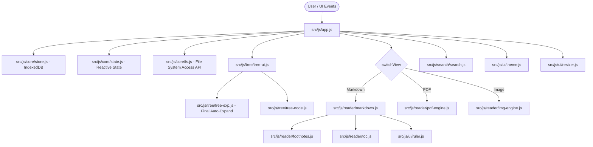
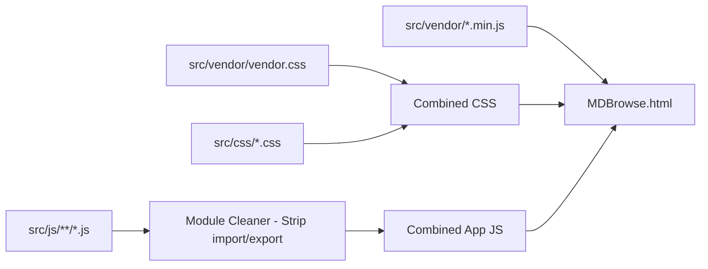

# คู่มือเชิงเทคนิค MDBrowse (Technical Manual & AI Agent Guide)

เอกสารนี้จัดทำขึ้นสำหรับ **นักพัฒนา (Developers)** และ **AI Agents** ที่จะเข้ามาดูแล พัฒนาต่อ หรือแก้ไขโค้ดของโครงการ **MDBrowse** ในอนาคต

---

## 1. ปรัชญาการออกแบบและข้อจำกัดทางสภาพแวดล้อม (Design Philosophy & Constraints)

### 1.1 สภาพแวดล้อมการทำงาน (Runtime Environment)
- **แพลตฟอร์ม**: Google Chrome บนระบบปฏิบัติการ Windows (หรือ OS อื่นที่รองรับ Chromium)
- **โปรโตคอล**: รันผ่าน `file:///` (Local File Protocol) โดยตรง
- **การเชื่อมต่อ**: **100% ออฟไลน์ (Zero External Network Requests)** ห้ามพึ่งพา CDN, Remote API หรือภายนอกเครื่องเด็ดขาด
- **การติดตั้ง**: ไม่ต้องลง Web Server ไม่ต้องพึ่งพา Node.js ในขณะใช้งานจริงของผู้ใช้ (ต้องการเพียงเบราว์เซอร์ Chrome เท่านั้น)

### 1.2 ข้อจำกัดด้านความปลอดภัยของ Chrome บน `file:///` (Security Sandbox Constraints)
1. **Origin เป็น `null`**: การสร้าง Web Worker ผ่าน `new Worker(blobUrl)` อาจถูกบล็อกโดย Chrome Security Policy บน `file:///` ดังนั้น PDF.js และ Worker ทุกตัวต้องสามารถทำงานแบบ **In-Memory / Main-Thread Worker** (`globalThis.pdfjsWorker`) ได้เสมอ
2. **การฝัง PDF ใน `<iframe>` / `<embed>` ถูกจำกัด**: Chrome ปิดกั้น PDF Plugin ภายใน sub-frame ของ `file:///` จึงจำเป็นต้องใช้ **HTML5 Canvas Rendering (Mozilla PDF.js)** วาดพิกเซลโดยตรง
3. **การเข้าถึงไฟล์ในเครื่อง**: ต้องใช้ **File System Access API** (`window.showDirectoryPicker`) และบันทึก `FileSystemDirectoryHandle` ลงใน **IndexedDB** เพื่อขอสิทธิ์การอ่านต่อเนื่อง

---

## 2. โครงสร้างสถาปัตยกรรมและโมดูล (Module Architecture)

### 2.1 แผนผังการทำงานของระบบ (Architecture Diagram)


---

## 3. รายละเอียดเชิงลึกของแต่ละโมดูล (Deep-Dive Module Specifications)

### 3.1 Core Subsystem (`src/js/core/`)
- **`store.js`**:
  - **สถาปัตยกรรม Dual-Storage Engine**: ครอบ IndexedDB ฐานข้อมูลชื่อ `mdbrowse_v2` อ็อบเจกต์สโตร์ `kv` ควบคู่กับระบบสำรองข้อมูลอัตโนมัติลงใน **LocalStorage JSON Backup** (`mdbrowse_workspace_meta`, `mdbrowse_ui`, `mdbrowse_filters`, `mdbrowse_lastFile`)
  - ฟังก์ชันทั้งหมดทำงานแบบ Asynchronous Promise 100% พร้อม `console.warn` ในทุก Error Path เพื่อช่วยในการ Debug
  - มีฟังก์ชัน `exportJson()` สำหรับดึงข้อมูลคอนฟิกทั้งหมดออกมาเป็น JSON
  - คีย์หลัก:
    - `workspace`: เก็บอาเรย์ของ Workspace Handles ทั้งหมดโดยไม่ตัดทิ้ง (`roots`), รายการโฟลเดอร์ที่ขยาย (`expanded`) และพับ (`collapsed`)
    - `ui`: เก็บสถานะไซด์บาร์ (`sbClosed`, `sbWidth`), ธีม (`theme`), ตัวคูณฟอนต์ (`fscale`), สีตัวอักษร (`tx`), ระยะขอบซ้าย-ขวา (`padLeft`, `padRight`)
    - `lastFile`: เก็บ path ของไฟล์ล่าสุดที่เปิดอ่าน เพื่อกู้คืนสถานะอัตโนมัติเมื่อเปิดโปรแกรมใหม่
- **`state.js`**:
  - ตัวแปร State กลาง (Singleton Container) เก็บ `roots` (พร้อมสถานะ `isLocked`, `permission`), `flat` (รายการโหนดทั้งหมด), `byPath` (Map ค้นหาโหนดด้วย path), `current` (โหนดปัจจุบัน), `blobUrls` (แคช Object URL เพื่อลด Memory Leak), สถานะการค้นหา, สถานะ PDF และสถานะ UI
- **`fs.js`**:
  - `checkRootPermission(rootObj)`: ตรวจสอบสถานะสิทธิ์การเข้าถึงของ Root Handle (`granted`, `prompt`, `denied`)
  - `requestRootPermission(rootIdx)`: ขอสิทธิ์การเข้าถึงโฟลเดอร์จากเบราว์เซอร์ผ่าน User Gesture
  - `walkDirectory(dir, base, depth, out, rootIdx)`: เดินวนสแกนไฟล์และโฟลเดอร์แบบ Recursive (จำกัดความลึกสูงสุด 16 ชั้น)
  - `rescanWorkspaces()`: สแกนทุก root workspace ใหม่และสร้างความสัมพันธ์ลำดับชั้น `parent` / `kids` พร้อมรองรับโหนดที่ติดสถานะ Locked
  - `resolvePath(fromPath, rel)`: แปลง Relative Path ใน Markdown (เช่น `../img/pic.png`) ให้กลายเป็น Canonical Workspace Path ที่ถูกต้อง
  - `ensurePermission(node)`: ตรวจสอบและร้องขอสิทธิ์การอ่านไฟล์ซ้ำกรณี Chrome หมดสิทธิ์ชั่วคราว

---

### 3.2 Tree Subsystem (`src/js/tree/`)
- **`tree-node.js`**:
  - นิยามชนิดไฟล์: `isMd(n)`, `isPdf(n)`, `isImg(n)`, `isDoc(n)`
  - แผนผัง MIME Type: `mimeByExt`
  - ฟังก์ชันจัดเรียง: `cmpNodes(a, b)` ให้โฟลเดอร์ขึ้นก่อนไฟล์ และเรียงชื่อตามพจนานุกรมไทย (`Intl.Collator`)
- **`tree-exp.js`**:
  - **อัลกอริทึม Auto-Expand 'final'**:
    ```javascript
    // สแกนหาโหนดโฟลเดอร์ทั้งหมดที่ชื่อ 'final'
    const finalNodes = State.flat.filter(n => (n.kind === 'directory' || n.kind === 'root') && n.name.toLowerCase() === 'final');
    // เพิ่มเส้นทางของ final และบรรพบุรุษทุกระดับขึ้นไปจนถึง root เข้าสู่ State.expanded
    ```
  - `collapseAllTruly()`: พับโฟลเดอร์ย่อยทั้งหมดให้เหลือขยายเฉพาะระดับ Root 1 ระดับ (โฟลเดอร์ย่อยข้างในถูกพับเก็บทั้งหมด)
- **`tree-ui.js`**:
  - เรนเดอร์ DOM ของ Tree View แสดงไอคอน SVG เฉพาะตัวสำหรับ Markdown, PDF, Image และโฟลเดอร์ พร้อมการเยื้องระดับความลึกตามลำดับชั้น (`depth * 14px`)

---

### 3.3 Reader Subsystem (`src/js/reader/`)
- **`markdown.js`**:
  - Pipeline การเรนเดอร์:
    1. ตัด Frontmatter (`---`) ออกจากส่วนหัวข้อความ
    2. ประมวลผลเชิงอรรถผ่าน `preprocessFootnotes(text)`
    3. แปลงเป็น HTML ด้วย `marked.js` (เปิดโหมด GFM + breaks)
    4. ฆ่าเชื้อโค้ดไม่ปลอดภัยด้วย `DOMPurify` — **หาก DOMPurify ไม่พร้อมใช้งาน จะ fallback เป็น Plain Text โดยอัตโนมัติเพื่อป้องกัน XSS** (`console.warn` แจ้งเตือน)
    5. ไฮไลต์ไวยากรณ์บล็อกโค้ดด้วย `highlight.js`
    6. คำนวณ Heading IDs และสร้างสารบัญ (`buildToc`)
    7. เรนเดอร์สมการคณิตศาสตร์ด้วย `KaTeX auto-render` (รองรับ `$$`, `$`, `\[`, `\(`)
    8. โหลดรูปภาพ Relative Path ภายในเครื่องอัตโนมัติผ่าน Blob URL แคช
  - **Code Viewer** (`renderCodeContent`): ตรวจจับภาษาผ่าน `LANG_MAP` (Map lookup) รองรับ 16 นามสกุล (json, xml, html, py, js, ts, css, yaml, ttl, csv, tsv, txt ฯลฯ) พร้อม JSON pretty-print อัตโนมัติ
- **`footnotes.js`**:
  - รองรับรูปแบบเชิงอรรถทั้ง `[1]`, `[01]`, `[^1]`, `[xx]: ข้อความ` และ `[xx] ข้อความ`
  - แทรก Tag `<sup>` พร้อม ID อ้างอิง `fnref-xx` ในเนื้อหา
  - สร้างส่วน `<section class="footnotes">` ด้านล่างเอกสาร พร้อมปุ่มย้อนกลับ `↩`
  - ระบบ `enhanceFootnotes()`: ดักจับคลิกแล้วเลื่อนหน้าจอแบบ Smooth Scroll ไปยังตำแหน่งเป้าหมาย พร้อมเล่น Animation ไฟกระพริบ (`fn-flash`)
- **`pdf-engine.js`**:
  - ใช้ **Mozilla PDF.js v3.11.174** เรนเดอร์ลง HTML5 `<canvas>`
  - รับข้อมูลในรูปแบบ `new Uint8Array(arrayBuffer)`
  - ทำงานร่วมกับ In-Memory Worker (`pdf.worker.min.js`) 100% ไม่ต้องผ่าน Blob Worker URL
  - แสดงผลหลายหน้าแบบต่อเนื่อง (Continuous Multi-Page Container)
  - แถบเครื่องมือ: เปลี่ยนหน้า (`‹`, `›`, กล่องตัวเลขหน้า), ย่อ-ขยาย (`-`, `+`, `100%`), และปรับพอดีหน้าจอ (`Fit Width`)
  - มีระบบ `cancelAllRenders()` ป้องกัน `RenderingCancelledException` เมื่อผู้ใช้ซูมหรือเปลี่ยนหน้าอย่างรวดเร็ว
- **`img-engine.js`**:
  - แสดงผลรูปภาพกึ่งกลางจออย่างสวยงาม
  - แถบข้อมูล Metadata: แสดงชื่อไฟล์, ขนาดพิกเซลจริง (`Width × Height px`), และขนาดไฟล์ (`KB / MB`)
  - สลับโหมดซูมระหว่าง Fit-to-screen และ 100% Original Size ด้วยการคลิก
- **`toc.js`**:
  - ดึงหัวข้อ H1-H6 มาสร้างรายการสารบัญด้านซ้าย
  - ระบบ **Scroll-Spy**: ตรวจจับตำแหน่ง Scroll ในบทความและไฮไลต์หัวข้อปัจจุบันในสารบัญแบบเรียลไทม์

---

### 3.4 UI & Interaction Subsystem (`src/js/ui/`)
- **`ruler.js` (ไม้บรรทัดและเส้นกำหนดขอบเขตเนื้อหา)**:
  - วาดสเกลพิกเซลด้วย SVG (`drawScale`) ปรับความกว้างตามหน้าจออัตโนมัติ
  - ควบคุมระยะขอบผ่าน CSS Variables: `--md-pad-left` และ `--md-pad-right`
  - มีตัวจับแบบแท่งทึบ (`ruler-bar-handle`) ซ้ายและขวา
  - **Auto-Fading**: ในสถานะปกติ แถบไม้บรรทัดจะโปร่งใส 18% และเส้นนำสายตาจะซ่อนตัว (`opacity: 0`) เมื่อชี้เมาส์หรือกำลังลากจึงจะสว่างขึ้น 100%
  - **Double-click Reset**: ดับเบิลคลิกที่ตัวจับฝั่งใด จะคืนค่าขอบฝั่งนั้นเป็นค่ามาตรฐาน (`60px`)
- **`resizer.js`**:
  - ลากปรับความกว้างไซด์บาร์ได้อิสระ (ขอบเขต 200px – 65vw)
  - บันทึกความกว้างลง IndexedDB
- **`theme.js`**:
  - รองรับ 13 ธีม: `light` (สว่าง), `softcream` (ครีมนวล), `cream` (ถนอมสายตา), `sunflower` (สดใสทุ่งดอกทานตะวัน), `freshgreen` (เขียวสดใส), `bananaleaf` (เขียวใบตองใบไม้ในป่า), `oceangreen` (เขียวน้ำทะเล), `rainbow` (สายรุ้ง สนุกสนาน), `twilight` (สนธยาพลบค่ำ), `deepblue` (น้ำเงินเข้ม), `starlight` (ท่ามกลางดวงดาว), `charcoal` (ถ่านชาโคล), `dark` (มืด)
  - รองรับการปรับขนาดตัวอักษร (`--fscale` 0.7x – 1.8x)
  - รองรับการเลือกสีตัวอักษรเฉพาะ (`--tx`) ผ่าน Color Picker

---

### 3.5 Search Engine Subsystem (`src/js/search/`)
- **`search.js`**:
  - ค้นหาแบบ Real-time พร้อมกลไก Debounce 220ms
  - โหมด 1 (ค่าเริ่มต้น): ค้นหาเฉพาะชื่อไฟล์ (เร็วมาก ไม่กิน RAM)
  - โหมด 2 ("ในเนื้อหา"): ค้นหา Full-Text ในเนื้อหาไฟล์ `.md`, Code files และ PDF ทั้งหมดใน Workspace
  - **Text Cache**: แคชเนื้อหาไฟล์ที่เคยอ่านสูงสุด **200 รายการ** พร้อมกลไก FIFO Eviction เพื่อป้องกัน Memory Leak (`MAX_TEXT_CACHE`)
  - ไฮไลต์คำค้นหาในเนื้อหาบทความด้วย `<mark>` และกด `Enter` / `Shift+Enter` เพื่อกระโดดไปยังตำแหน่งถัดไป/ก่อนหน้า
  - สำหรับ PDF: แสดงรายการหน้าที่พบคำค้นหา และกด `Enter` เพื่อข้ามไปยังหน้าถัดไป

---

### 3.6 Desktop Pets Subsystem (`src/js/pet/`)
- **`pet-render.js`**:
  - สร้าง Vector SVG Rigging แบบ 100% In-Memory สำหรับ **6 สายพันธุ์แมวอ้วน**: สก๊อตติชบลูพอยต์ (`scottish_bluepoint`), สีสวาด/โคราช (`sisawat`), ลายสลิด (`tabby`), แมวส้ม (`orange`), วิเชียรมาศ (`siamese`), และแมวดำ (`black`)
  - รองรับมากกว่า 15 ท่าทางและอิริยาบถ: `stand`, `sit`, `walk`, `run`, `sleep_loaf`, `sleep_curl`, `sleep_belly`, `groom`, `pounce`, `eating`, `carry_fish`, `derpy_yawn`, `derpy_stare`, `derpy_wiggle`, `dragged`, `block_screen`
  - เรนเดอร์ผีเสื้อ (`pet-butterfly`), จิ้งจก (`pet-gecko`), ปลาทู และชามอาหาร
- **`pet-dialogues.js`**:
  - คลังบทสนทนาภาษาไทยบริบทอัจฉริยะ **มากกว่า 210 ข้อความ** แบ่งเป็น 9 หมวดหมู่: บริบทชื่อเอกสาร (`{doc}`), เตือนสุขภาพและพักสายตาเมื่ออ่านนาน, ช่วงเวลา (เช้า/บ่าย/เย็น/ดึก), ความคิดแมวกวน ๆ, การเกาคาง/จั๊กจี้, การให้อาหาร, การถูกลาก, การคุยกันระหว่างแมว (`{name}`, `{other}`), และชนิดไฟล์ (.md, .pdf, .img, code)
- **`pet-manager.js`**:
  - ตัวควบคุม State Machine หลัก, การจำลองฟิสิกส์การลากวาง (Drag & Drop) แบบลื่นไหล
  - ระบบตรวจจับระยะห่างเพื่อเล่นกันเองระหว่างแมวหลายตัว (Multi-Pet Social System)
  - ระบบจับเวลาอ่านต่อเนื่อง (Active Reading Fatigue) เพื่อเดินมานอนทับกลางหน้าจอ
  - เมนูคลิกขวา (Context Menu) และหน้าต่างจัดการบ้านแมว (Cat Management Modal)
  - บันทึกสถานะชื่อ, สายพันธุ์, พิกัด และการตั้งค่าลง IndexedDB & LocalStorage ผ่าน `Store.set('pets', ...)`

---

## 4. ระบบการคอมไพล์ (Build Pipeline - `build.js`)

ไฟล์ `build.js` มีหน้าที่รวมโค้ดทั้งหมดใน `src/` ให้เป็นไฟล์ `MDBrowse.html` ไฟล์เดียว:



### ลำดับการทำงานของ `build.js`:
1. อ่าน CSS ทุกไฟล์จาก `src/vendor/` และ `src/css/` แล้วรวมเข้าด้วยกัน
2. อ่าน Vendor JS: `marked.min.js`, `purify.min.js`, `highlight.min.js`, `katex.min.js`, `katex-auto-render.min.js`, `pdf.worker.min.js`, `pdf.min.js`
3. แปลง ES Modules ใน `src/js/` ให้เป็น Plain Script (ตัด `import` / `export` ออก และเรียงลำดับการโหลดจาก Dependency ต่ำไปสูง)
4. ประกอบเป็นโครงสร้าง HTML เดี่ยว และเขียนลง `D:/01_APP/Markdown/MDBrowse.html`

---

## 5. กฎและข้อพึงระวังสำหรับนักพัฒนาและ AI Agent ในอนาคต (Invariants & Best Practices)

> [!IMPORTANT]
> **1. ห้ามเพิ่ม External URL หรือ Network Dependencies**
> โปรแกรมนี้ถูกออกแบบมาให้อ่านเอกสารลับ/ออฟไลน์ ห้ามใส่แท็ก `<script src="https://...">` หรือ `<link href="https://...">` เด็ดขาด ทรัพยากรทุกอย่างต้องอยู่ในเครื่องและถูก Bundled ลง `MDBrowse.html`

> [!WARNING]
> **2. ห้ามใช้ Blob URL กับ Web Worker ใน PDF.js**
> บน Chrome `file:///` ตัว Worker จาก Blob URL จะถูกบล็อกความปลอดภัยเสมอ ต้องรักษาโครงสร้างการโหลด `pdf.worker.min.js` แบบ In-Memory ผ่านสคริปต์หลักไว้เสมอ

> [!TIP]
> **3. เมื่อแก้ไขโค้ด ให้แก้ไขที่ `src/` แล้วสั่งรัน `node build.js` เสมอ**
> ห้ามแก้ไข `MDBrowse.html` โดยตรง เพราะจะถูกทับเมื่อสั่งบิลด์ ให้แก้ไขในไฟล์โมดูลย่อยที่เกี่ยวข้องใน `src/` เสมอ

> [!NOTE]
> **4. การจัดการหน่วยความจำของ Blob URLs**
> เมื่อมีการสร้าง Object URL (`URL.createObjectURL`) สำหรับรูปภาพหรือไฟล์ ให้เก็บแคชไว้ใน `State.blobUrls` เพื่อป้องกันการสร้าง URL ซ้ำซ้อนซึ่งจะทำให้เกิด Memory Leak

> [!CAUTION]
> **5. ห้ามกลืน Error โดยไม่บันทึก**
> ทุก `catch` block ต้องมี `console.warn('[module] context:', e.message)` เสมอ — ห้ามใช้ `catch (e) {}` ว่างเปล่าเด็ดขาด เพราะจะทำให้ Debug ไม่ได้ ให้ระบุ `[module-name]` prefix กำกับเพื่อระบุจุดที่เกิด Error ได้ทันที

> [!IMPORTANT]
> **6. DOMPurify ต้องพร้อมก่อน Render HTML**
> การเรนเดอร์ Markdown เป็น HTML ต้องผ่าน DOMPurify เสมอ หาก DOMPurify ไม่พร้อมให้ fallback เป็น `textContent` (Plain Text) เท่านั้น ห้ามใส่ raw HTML ลง `innerHTML` โดยเด็ดขาด

> [!TIP]
> **7. CSS Transition: ระบุ Property เจาะจง**
> ห้ามใช้ `transition: all` เพราะเบราว์เซอร์ต้องตรวจสอบทุก property ทุกเฟรม ให้ระบุเฉพาะ property ที่เปลี่ยนจริง เช่น `transition: background-color .15s ease, color .15s ease;` — สำหรับ Animation ที่เกี่ยวกับการเลื่อนตำแหน่ง ใช้ `transform` แทน `margin` หรือ `left`/`top` เพื่อ GPU Acceleration

> [!NOTE]
> **8. Responsive Design**
> มี `@media (max-width: 768px)` ใน `base.css` สำหรับจอเล็ก — Sidebar จะกลายเป็น Full-width Overlay โดยอัตโนมัติ หากเพิ่ม UI Element ใหม่ควรตรวจสอบให้แน่ใจว่าแสดงผลถูกต้องในจอแคบด้วย

---

## 6. สถาปัตยกรรมคลาวด์และการนำขึ้น Cloudflare Pages (Cloud Architecture & Live Deployment)

- **URL ใช้งานจริง (Live Production):** [https://markmakk.pages.dev/](https://markmakk.pages.dev/)
- **แพลตฟอร์มโฮสติ้ง:** Cloudflare Pages (Free Tier)
- **ไปป์ไลน์การ Deploy:** เชื่อมต่อ GitHub Webhook อัตโนมัติจาก Repository `vesinah/Markdown` (Branch `master`) เมื่อมีการสั่ง `git push` ระบบ Cloudflare จะทำการบิลด์และเผยแพร่อัตโนมัติภายใน 30–45 วินาที
- **สถาปัตยกรรม Dual-Mode (Online & Offline):**
  - **Online Cloud Mode:** เมื่อเปิดผ่านเว็บ (หรือตรวจพบ `docs/catalog.json`) ระบบจะแปลงดัชนีเป็น Virtual Tree Nodes ใน `State.roots[0]` ในชื่อ "คลังงานวิจัย (Research Archive)" และดึงเนื้อหาเอกสารผ่าน Remote HTTP `fetch()` พร้อมฟังก์ชันแปลงลิงก์ `file:///d:/01_APP/Research/output/...` ให้คลิกข้ามเอกสารบนเว็บได้ 100%
  - **Offline Local Mode:** หากเปิดใช้งานบนเครื่องผ่าน `file:///` หรือต้องการเปิดโฟลเดอร์ส่วนตัว ผู้ใช้ยังคงสามารถคลิกปุ่ม `+` ("เพิ่มโฟลเดอร์") เพื่อเปิดโฟลเดอร์ในเครื่องผ่าน File System Access API ได้ตามปกติ
- **ระบบซิงค์เอกสาร (Incremental Research Sync):**
  - ไฟล์สคริปต์: `scripts/sync_research.js`
  - คัดลอกเอกสารใหม่จาก `D:\01_APP\Research\output` มายัง `docs/` เฉพาะไฟล์ Markdown, ข้อความ และรูปภาพ (จำกัดขนาดไม่เกิน 24MB และเว้น PDF ตามข้อกำหนด)
  - สร้างไฟล์ดัชนีต้นไม้ `docs/catalog.json`
  - ชอร์ตคัต 1-Click: `อัปเดตเอกสาร_และขึ้นคลาวด์.bat` สำหรับซิงค์และ `git push` ในคลิกเดียว

---

## 7. สถาปัตยกรรมโหมดสมาร์ทโฟน (Mobile Architecture & Smartphone UX/UI Ergonomics)

ระบบรองรับการใช้งานบนสมาร์ทโฟนแนวตั้ง (Smartphone Portrait Mode ~360px–430px) ได้อย่างสมบูรณ์แบบ ภายใต้หลักการ **Zero Desktop Regression** (หน้าจอเดสก์ท็อปคงฟังก์ชันและการแสดงผลเดิม 100%):

### 7.1 แถบนำทางด้านล่างถนัดมือนิ้วโป้ง (Mobile Bottom Navigation Bar — "Thumb-Zone Dock")
- โครงสร้าง: `#mobile-bottom-bar` สไตล์ **Glassmorphism Frosted Dock** (`backdrop-filter: blur(20px)`) ลอยตัวเหนือขอบล่างหน้าจอ
- การจัดวาง 5 เมนูหลักตามการเอื้อมนิ้วโป้งมือเดียว:
  1. 📁 **ไฟล์ (Files)**: เปิด-ปิด Drawer รายการเอกสารและคลังงานวิจัย
  2. 📑 **สารบัญ (TOC)**: เปิด-ปิด Drawer สารบัญหัวข้อของบทความที่กำลังอ่าน
  3. 🎨 **ธีม/อักษร (Theme/Font)**: เปิด Bottom Sheet Card ปรับธีมสีและขนาดตัวอักษร
  4. 🔖 **บุ๊คมาร์ค (Bookmarks)**: เปิด Drawer รายการที่คั่นหน้าและคอมเมนต์
  5. 🐾 **บ้านแมว (Pet Sanctuary)**: สลับเปิด-ปิดโมดัลจัดการสัตว์เลี้ยง
- **Smart Auto-Hide**: ตรวจจับ Scroll Position ใน `#md-scroll-pane`:
  - เมื่อผู้ใช้เลื่อนหน้าจอลง (`scroll delta > 10px`) แถบจะสไลด์ซ่อนตัวลงด้านล่างอัตโนมัติ (`transform: translateY(100%)`) เพื่อคืนพื้นที่อ่านหนังสือเต็มจอ (Full Immersion)
  - เมื่อผู้ใช้เลื่อนหน้าจอขึ้น (`scroll delta < -10px`) แถบจะสไลด์กลับขึ้นมาทันที

### 7.2 ระบบ Mobile Drawers & Backdrop Overlay
- **Universal Backdrop (`#mobile-backdrop`)**: 
  - ฉากหลังทึบโปร่งแสงสีดำพร้อมเบลอ (`rgba(0, 0, 0, 0.45)` + `backdrop-filter: blur(4px)`)
  - ค่า `z-index: 105` แสดงผลเมื่อมี Drawer ใดเปิดอยู่ แตะที่ใดก็ได้เพื่อปิด Drawer ทั้งหมดทันที
- **Sidebar Drawer (`#sidebar`)**:
  - กำหนดเป็น `position: fixed !important; top: 0; bottom: 0; left: 0; width: min(350px, 88vw) !important; z-index: 125 !important;`
  - สไลด์เข้า-ออกจากซ้ายด้วย `transform: translateX(-100%)` และ `translateX(0)`
  - **ข้อพึงระวังสำคัญทางเทคนิค**: ห้ามใช้ `margin-left` ติดลบแบบเดสก์ท็อปในโหมดมือถือเด็ดขาด เพราะจะดึงคอนเทนเนอร์ `#main` และ `.menubar` หลุดออกนอกขอบจอทางซ้าย (-87px Layout Shift)
- **TOC Drawer (`#toc-panel`)**:
  - กำหนดเป็น `position: fixed !important; top: 0; right: 0; bottom: 0; left: auto; width: min(340px, 86vw) !important; z-index: 125 !important;`
  - สไลด์เข้า-ออกจากขวาด้วย `transform: translateX(100%)` และ `translateX(0)`
  - บังคับ `#toc-header` และ `#toc-full-view` ให้เป็น `display: flex !important;` เพื่อ override คลาส `.toc-mini` จากเดสก์ท็อป ป้องกันปัญหาเนื้อหาสารบัญหดหาย
- **Theme & Font Controls**:
  - แปลงจากแถบแนวนอนยาวบนเดสก์ท็อป เป็น **Bottom Sheet Card Modal** ลอยตัวเหนือแถบล่าง แสดงพาเล็ตต์สี 13 ธีมแบบวงกลม 30px จัดเรียง 2 แถว และปุ่ม `A-`, `A`, `A+` ขนาดสัมผัสง่าย

### 7.3 การ์ดส่วนหัวคลังงานวิจัย (Research Archive Two-Tier Root Card)
- ในไซด์บาร์ไฟล์ ส่วนหัวของคลังงานวิจัย (`คลังงานวิจัย (Research Archive)` มี 6,066 ไฟล์ และ 1,223 โฟลเดอร์) ถูกออกแบบเป็น **Two-Tier Root Card** บนมือถือ:
  - **Tier 1 (แถวบน)**: แสดงไอคอนสมุด 📖 และชื่อเต็ม `คลังงานวิจัย (Research Archive)` แบบ 100% ไม่ถูกตัดทอน (Zero Truncation)
  - **Tier 2 (แถวล่าง)**: แสดงชิปสถิติ `[📁 1,223]` และ `[📄 6,066]` เป็นรูปแคปซูลสวยงาม พร้อมจัดวางปุ่มรีเฟรช `⟳` และปุ่มปิด `✕` ไว้ชิดขวา
- เมื่อแตะที่เอกสารงานวิจัยใดๆ ในคลัง ระบบจะเปิดอ่านเนื้อหาและปิดไซด์บาร์อัตโนมัติ (`closeAllMobileDrawers()`)

### 7.4 การป้องกันปัญหาเบราว์เซอร์สมาร์ทโฟน (Mobile Browser Hardening)
- **iOS Safari Auto-Zoom Prevention**: กำหนดช่องค้นหา `.sb-search-input` ให้มี `font-size: 16px` เสมอ เพื่อป้องกัน Mobile Safari ซูมหน้าจอขณะแตะพิมพ์
- **Dynamic Viewport Height (`100dvh`)**: ใช้ `100dvh` แทน `100vh` เพื่อปรับความสูงตาม Address Bar และ Toolbars ของ Safari/Chrome ที่ยืดหดได้
- **Safe Area Insets**: รองรับขอบจอโค้ง, รอยบาก (Notch), Dynamic Island และแถบ Home Indicator ผ่าน `env(safe-area-inset-top)` และ `env(safe-area-inset-bottom)`
- **FOUC Prevention**: ฝังคำสั่งในส่วน `<head>` สั่งเพิ่มคลาส `sb-closed` ทันทีตั้งแต่เฟรมแรกหากหน้าจอกว้าง `<= 768px` เพื่อป้องกันภาพกระตุก

---

## 8. ประวัติการพัฒนาและบันทึกการเปลี่ยนแปลง (Development History & Version Changelog)

| เวอร์ชัน | วันที่ / ยุคสมัย | ขอบเขตการพัฒนา | รายละเอียดสำคัญ |
|---|:---:|---|---|
| **v1.0** | เริ่มต้น | Monolithic Local Reader | แอปพลิเคชันอ่าน Markdown ไฟล์เดี่ยว (`MDBrowse.html`) ทำงานแบบออฟไลน์ 100% บน Google Chrome รองรับการเลือกโฟลเดอร์ในเครื่องผ่าน File System Access API |
| **v2.0** | ก.ย. 2026 | Modular Architecture Refactoring | - แตกซอร์สโค้ดจาก Monolith 6,000+ บรรทัด ออกเป็นโมดูลย่อยใน `src/` (core, tree, reader, ui, search, bookmark, vendor)<br>- สร้างไปป์ไลน์บิลด์อัตโนมัติ `build.js`<br>- ติดตั้ง Mozilla PDF.js Canvas Engine รองรับ PDF แบบ In-Memory Worker ปลอดภัยบน `file:///`<br>- รองรับ KaTeX Math, Code Viewer 16 ภาษา, เชิงอรรถสองทิศทาง, และ Bookmark & Highlights |
| **v2.1** | ก.ย. 2026 | Desktop Pet Sanctuary System | - เพิ่มระบบสัตว์เลี้ยงบนหน้าจอ (Cat Sanctuary) ครบ 4 Milestones (M1–M4)<br>- 6 สายพันธุ์แมว, 15+ ท่าทาง, ระบบสุขอนามัย (Poop & Fly Swarm Physics)<br>- 6-Axis AI Personality Engine และบทสนทนาภาษาไทยบริบทอัจฉริยะ 210+ ข้อความ<br>- ผ่านชุดทดสอบ Opaque-Box E2E Suite ทั้ง 300/300 เคส (100%) |
| **v2.2** | ก.ย. 2026 | Cloudflare Pages & Research Sync | - ติดตั้งระบบคลาวด์ Dual-Mode รองรับการเปิดอ่านทั้งออฟไลน์และออนไลน์ผ่าน [https://markmakk.pages.dev/](https://markmakk.pages.dev/)<br>- เชื่อมโยงดัชนี "คลังงานวิจัย (Research Archive)" 6,066 รายการ ผ่าน `docs/catalog.json`<br>- แปลงลิงก์อ้างอิงข้ามเอกสารอัตโนมัติ และสร้างสคริปต์ 1-Click Sync & Deploy |
| **v2.3** | ก.ย. 2026 | Smartphone UI/UX Overhaul & Hotfixes | - **Mobile Bottom Navigation Dock**: แถบควบคุม 5 เมนูด้านล่างสไตล์ Frosted Glass พร้อม Smart Auto-Hide<br>- **Mobile Drawers**: แปลง Sidebar, TOC, Bookmarks, Theme ให้เป็น Slide-in Drawers และ Bottom Sheet<br>- **Hotfix Layout Shift**: แก้ไขบั๊กหน้าจอซ้ายตกขอบ และเมนูบาร์เลื่อนหาย โดยยกเลิกการใช้ `margin-left` ติดลบบนมือถือและบังคับใช้ `transform: translateX(-100%)`<br>- **Hotfix TOC Drawer**: แก้ไขปัญหาสารบัญตกขอบ/หดหาย โดย override คลาส `.toc-mini` บังคับแสดงผลเต็ม<br>- **Research Archive Root Card**: ปรับแต่งการ์ดคลังงานวิจัย 6,066 รายการ เป็นระบบ 2 แถว แสดงชื่อเต็ม 100% พร้อมขยายความกว้างไซด์บาร์เป็น 350px (88vw) |

---


