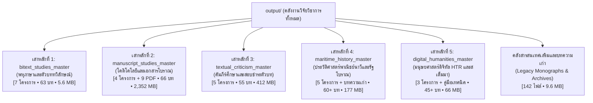

# สารบรรณและแผนที่นำทางแม่บทศูนย์กลาง (Global Master Research Directory)

> **ฐานข้อมูลปฏิบัติการ:** `d:\01_APP\Research\output\`  
> **ผู้รับผิดชอบระบบ:** Senior Research Agent (นักวิจัยอาวุโส)  
> **สถานะ:** สถาปัตยกรรมสารสนเทศแม่บทบูรณาการ (Master Knowledge Hub Architecture)  
> **ระบบอ้างอิง:** มาตรฐาน Chicago Manual of Style (17th Edition, Notes-Bibliography System)

---

## 1. บทนำและปรัชญาสถาปัตยกรรมระบบ (System Architecture Overview)

คลังงานวิจัยในโฟลเดอร์ `output/` เป็นแหล่งรวมผลงานการวิจัยเชิงลึก (Deep Research) ด้านเอกสารโบราณ คัมภีร์ศึกษา ประวัติศาสตร์พาณิชย์นาวี มนุษยศาสตร์ดิจิทัล และวัฒนธรรมตัวเขียนข้ามอารยธรรม เพื่อขจัดปัญหาความกระจัดกระจายของข้อมูลและยกระดับสู่มาตรฐานเดียวกัน โครงการทั้งหมดจึงถูกจัดโครงสร้างออกเป็น **5 เสาหลักทางปัญญา (5 Master Pillars)** โดยยึดมาตรฐานสถาปัตยกรรมสารสนเทศตามรอยโครงการนำร่อง [`output/2026-09-03_แม่บทตัวบทสองภาษา`](file:///d:/01_APP/Research/output/2026-09-03_แม่บทตัวบทสองภาษา)

ทุกเสาหลักมีสถานะเป็น **"Master Knowledge Hub"** ที่ทำหน้าที่สังเคราะห์เนื้อหา จัดทำทะเบียนเอกสาร (Corpus Inventory) จัดทำตารางเทียบเคียงประเด็น (Master Concordance Matrix) รวบรวมอภิธานศัพท์ (Unified Glossary) และทำหน้าที่เป็นสารบัญนำทางเชื่อมโยงตรง (Clickable Links) สู่บทวิจัยย่อยทุกบท 100%

---

## 2. สรุปภาพรวมสถิติคลังข้อมูลทั้ง 5 เสาหลัก

| เสาหลักวิจัย | โฟลเดอร์แม่บท (Master Hub) | ขอบเขตโครงการย่อยในกำกับ | จำนวนบทรวม | ปริมาณข้อมูล | สถานะ |
|:---|:---|:---|:---:|:---:|:---:|
| **เสาหลักที่ 1** | [`bitext_studies_master`](file:///d:/01_APP/Research/output/2026-09-03_แม่บทตัวบทสองภาษา) | พหุภาษา, ตัวบททวิลักษณ์ (Bitexts), คัมภีร์นิสสัย, ตัวเกษียนใบลาน | 63 ไฟล์ | ~5.6 MB | ฉบับสมบูรณ์ (นำร่อง) |
| **เสาหลักที่ 2** | [`manuscript_studies_master`](file:///d:/01_APP/Research/output/2026-09-03_แม่บทเอกสารโบราณและโคดิโคโลยี) | โคดิโคโลยี, ใบลานสยาม-อินเดีย-เนปาล, การสืบทอดมุขปาฐะสู่ลายลักษณ์ | 66 ไฟล์ | ~2,352 MB | ฉบับสมบูรณ์ |
| **เสาหลักที่ 3** | [`textual_criticism_master`](file:///d:/01_APP/Research/output/2026-09-03_แม่บทการสอบชำระคัมภีร์) | ชินบัญชร, คุรุปัญจาสิกา, สมันตปาสาทิกา, พระวินัยมูลสรรวาสติวาท, พระเวทในพุทธพจน์ | 55 ไฟล์ | ~412 MB | ฉบับสมบูรณ์ |
| **เสาหลักที่ 4** | [`maritime_history_master`](file:///d:/01_APP/Research/output/2026-09-03_แม่บทประวัติศาสตร์พาณิชย์นาวี) | อิสลามนูซันตารา, สุลต่านสงขลา, ตามพรลิงค์, ทวีปานตระ-สุวรรณภูมิ, บันทึกยุโรปสยาม | 60+ ไฟล์ | ~177 MB | ฉบับสมบูรณ์ |
| **เสาหลักที่ 5** | [`digital_humanities_master`](file:///d:/01_APP/Research/output/2026-09-03_แม่บทมนุษยศาสตร์ดิจิทัล) | ระบบ Kraken HTR, eScriptorium, PAGE/ALTO XML, Phylogenetic Stemmatology | 45+ ไฟล์ | ~66 MB | ฉบับสมบูรณ์ |
| **คลังเสริม** | [`บทความเก่า`](file:///d:/01_APP/Research/output/2026-08-31_คลังบทความวิจัยเดิม) | มหากาพย์บทความวิจัยประวัติศาสตร์และภาษาศาสตร์ 12 ชุดหัวข้อ | 142 ไฟล์ | ~9.6 MB | จัดหมวดหมู่แล้ว |

---

## 3. สารบัญจำแนกรายละเอียดรายเสาหลัก

### 3.1 เสาหลักที่ 1: พหุภาษาและตัวบททวิลักษณ์ (Multilingual Bitexts & Vernacular Hermeneutics)
- **โฟลเดอร์แม่บท:** [`output/2026-09-03_แม่บทตัวบทสองภาษา/`](file:///d:/01_APP/Research/output/2026-09-03_แม่บทตัวบทสองภาษา/)
- **เอกสารแม่บทหลัก:**
  - แผนงานแม่บท: [`project-plan.md`](file:///d:/01_APP/Research/output/2026-09-03_แม่บทตัวบทสองภาษา/project-plan.md)
  - ทะเบียนคลังข้อมูล: [`research-notes/corpus-inventory.md`](file:///d:/01_APP/Research/output/2026-09-03_แม่บทตัวบทสองภาษา/research-notes/corpus-inventory.md)
  - เมทริกซ์เทียบเคียง: [`research-notes/master-concordance-matrix.md`](file:///d:/01_APP/Research/output/2026-09-03_แม่บทตัวบทสองภาษา/research-notes/master-concordance-matrix.md)
  - อภิธานศัพท์แม่บท: [`research-notes/unified-glossary.md`](file:///d:/01_APP/Research/output/2026-09-03_แม่บทตัวบทสองภาษา/research-notes/unified-glossary.md)
  - สารบัญและคู่มือนำทางแม่บท: [`final/00-สารบัญและคู่มือนำทางแม่บท.md`](file:///d:/01_APP/Research/output/2026-09-03_แม่บทตัวบทสองภาษา/final/00-สารบัญและคู่มือนำทางแม่บท.md)
- **โครงการย่อยในเครือข่าย:**
  1. [`output/2026-09-03_ทุนวิชาการเทรนต์วอล์กเกอร์`](file:///d:/01_APP/Research/output/2026-09-03_ทุนวิชาการเทรนต์วอล์กเกอร์/final/00-master-bibliography-and-access-table.md) — ทฤษฎีตัวบททวิลักษณ์ (Bitexts), พืชอิงอาศัย, และโสตทัศน์พุทธศาสน์ (7 ไฟล์)
  2. [`output/2026-08-26_คัมภีร์นิสสัย`](file:///d:/01_APP/Research/output/2026-08-26_คัมภีร์นิสสัย/final/01-บทนำ.md) — สถานภาพการศึกษาคัมภีร์นิสสัย 12 บท (พม่า ไทย ล้านนา ลาว เขมร ลังกา อินเดีย ยุโรป) (13 ไฟล์)
  3. [`output/2026-09-01_ตัวเกษียนใบลาน`](file:///d:/01_APP/Research/output/2026-09-01_ตัวเกษียนใบลาน/final/00-บทที่0-สถานการณ์การศึกษาทั่วโลกและระเบียบวิธีวิจัย.md) — วัฒนธรรมตัวเกษียนใบลานสยามและอุษาคเนย์ (6 ไฟล์)
  4. [`output/2026-08-25_คำแปลแทรกโบราณสากล`](file:///d:/01_APP/Research/output/2026-08-25_คำแปลแทรกโบราณสากล/final/00-สารบัญ.md) — การสำรวจ Interlinear Gloss ทั่วโลก 12 อารยธรรมโบราณ (14 ไฟล์)
  5. [`output/2026-08-25_คำแปลแทรกสิบแปดบท`](file:///d:/01_APP/Research/output/2026-08-25_คำแปลแทรกสิบแปดบท/final/00-สารบัญ.md) — กลอสส์ยุโรปยุคกลาง ไบแซนไทน์ ฮีบรู และโลกอิสลาม (8 ไฟล์)
  6. [`output/2026-08-25_คำแปลแทรกคัมภีร์พุทธ`](file:///d:/01_APP/Research/output/2026-08-25_คำแปลแทรกคัมภีร์พุทธ/final/00-สารบัญ.md) — การรักษาความศักดิ์สิทธิ์ของต้นฉบับพุทธศาสนาเปรียบเทียบ (9 ไฟล์)
  7. [`output/2026-08-26_การแปลสลับคำคัมภีร์ศักดิ์สิทธิ์`](file:///d:/01_APP/Research/output/2026-08-26_การแปลสลับคำคัมภีร์ศักดิ์สิทธิ์/final/00-สารบัญ.md) — กรอบวิเคราะห์ 6 มิติว่าด้วยความศักดิ์สิทธิ์ของการแปลสลับคำ (9 ไฟล์)

---

### 3.2 เสาหลักที่ 2: โคดิโคโลยี วิทยาการเอกสารโบราณ และการสืบทอดตัวเขียน (Codicology & Manuscript Cultures)
- **โฟลเดอร์แม่บท:** [`output/2026-09-03_แม่บทเอกสารโบราณและโคดิโคโลยี/`](file:///d:/01_APP/Research/output/2026-09-03_แม่บทเอกสารโบราณและโคดิโคโลยี/)
- **จุดเน้น:** ศาสตร์แห่งเอกสารตัวเขียน กายวิภาคของวัสดุ (ใบลาน สมุดไทย ภูรชบัตร) เทคนิคการจดจาร เครื่องเขียน อักษรพราหมี และการเปลี่ยนผ่านจากมุขปาฐะสู่ลายลักษณ์อักษร
- **โครงการย่อยในเครือข่าย:**
  1. [`output/2026-08-26_คัมภีร์ใบลานพุทธ`](file:///d:/01_APP/Research/output/2026-08-26_คัมภีร์ใบลานพุทธ/final/00-สารบัญ.md) — พฤกษศาสตร์ วัสดุศาสตร์ เทคนิคการจาร และตระกูลอักษรพราหมี (22 บท)
  2. [`output/2026-08-30_ใบลานอินเดียเนปาล`](file:///d:/01_APP/Research/output/2026-08-30_ใบลานอินเดียเนปาล/final/00-สารบัญ.md) — คัมภีร์ใบลานและภูรชบัตรในอินเดียและเนปาล คลังสะสม หมึก และการเก็บรักษา (23 บท)
  3. [`output/2026-06-27_การสืบทอดมุขปาฐะสู่ลายลักษณ์`](file:///d:/01_APP/Research/output/2026-06-27_การสืบทอดมุขปาฐะสู่ลายลักษณ์/final/00-สารบัญ.md) — ออนโทโลยีของเสียงและตัวอักษร การสืบทอดพระเวทและพระไตรปิฎก (13 บท)
  4. [`output/2026-08-25_ทฤษฎีเอกสารตัวเขียน`](file:///d:/01_APP/Research/output/2026-08-25_ทฤษฎีเอกสารตัวเขียน/final/00-สารบัญ.md) — ระเบียบวิธีสเต็มมาโทโลยี การสอบเทียบพหุฉบับ และฉบับแปลเป็นพยานหลักฐาน (8 บท)
  5. **คลังเอกสารปฐมภูมิวิชาการ (Root PDF Collection 9 ไฟล์):**
     - [`1983_Oldest_Pali_Manuscript_Von_Hinueber.pdf`](file:///d:/01_APP/Research/documents/1983_Oldest_Pali_Manuscript_Von_Hinueber.pdf) — คัมภีร์บาลีที่เก่าแก่ที่สุดในโลก (O. von Hinüber)
     - [`1984_English_Glosses_British_Library_Add_MS_37075.pdf`](file:///d:/01_APP/Research/documents/1984_English_Glosses_British_Library_Add_MS_37075.pdf) — ตัวเขียนกลอสส์ภาษาอังกฤษหอสมุดบริติช
     - [`1994_Ethics_of_Reading_Glossing_Libro_De_Buen_Amor.pdf`](file:///d:/01_APP/Research/documents/1994_Ethics_of_Reading_Glossing_Libro_De_Buen_Amor.pdf) — วัฒนธรรมกลอสส์ยุโรปยุคกลาง
     - [`2002_Sri_Lankan_Temple_Manuscript_Collections_JPTS_XXVII.pdf`](file:///d:/01_APP/Research/documents/2002_Sri_Lankan_Temple_Manuscript_Collections_JPTS_XXVII.pdf) — คอลเลกชันเอกสารใบลานวัดลังกา (JPTS)
     - [`2007_Intertextuality_Thai_Lao_Buddhism_Gavampatisutta_Kourilsky.pdf`](file:///d:/01_APP/Research/documents/2007_Intertextuality_Thai_Lao_Buddhism_Gavampatisutta_Kourilsky.pdf) — ตัวบทข้ามสำนวนไทย-ลาว คัมภีร์ควัมปติสูตร
     - [`2010_Thai_Manuscript_Studies_Fulltext_1.pdf`](file:///d:/01_APP/Research/documents/2010_Thai_Manuscript_Studies_Fulltext_1.pdf) & [`2.pdf`](file:///d:/01_APP/Research/documents/2010_Thai_Manuscript_Studies_Fulltext_2.pdf) — ตำราวิจัยเอกสารตัวเขียนไทยฉบับสมบูรณ์
     - [`2014_Mahapratiharyasutra_Gilgit_Manuscripts.pdf`](file:///d:/01_APP/Research/documents/2014_Mahapratiharyasutra_Gilgit_Manuscripts.pdf) — เอกสารกิลกิตมหาปาฏิหาริยสูตรฉบับใบลานโบราณ
     - [`2015_Diverting_Authorities_Experimental_Glossing_Practices.pdf`](file:///d:/01_APP/Research/documents/2015_Diverting_Authorities_Experimental_Glossing_Practices.pdf) — จารีตการกลอสส์เชิงทดลอง

---

### 3.3 เสาหลักที่ 3: พุทธศาสน์ศึกษา นิรุกติศาสตร์ และการสอบชำระคัมภีร์ (Textual Criticism & Buddhist Philology)
- **โฟลเดอร์แม่บท:** [`output/2026-09-03_แม่บทการสอบชำระคัมภีร์/`](file:///d:/01_APP/Research/output/2026-09-03_แม่บทการสอบชำระคัมภีร์/)
- **จุดเน้น:** การสอบทานและชำระคัมภีร์พุทธศาสน์ข้ามภาษา (บาลี สันสกฤต จีน ทิเบต) นิรุกติศาสตร์ ฉันทลักษณ์ และประวัติศาสตร์การสังคายนา
- **โครงการย่อยในเครือข่าย:**
  1. [`output/2026-08-31_ชำระพระคาถาชินบัญชร`](file:///d:/01_APP/Research/output/2026-08-31_ชำระพระคาถาชินบัญชร/final/00-สารบัญ.md) — การสอบเทียบพระคาถาชินบัญชร 4 สายธารตัวเขียน ฉันทลักษณ์วุตโตทัย และนิรุกติศาสตร์ 6 ชั้น (8 บท)
  2. [`output/2026-08-25_คัมภีร์คุรุปัญจาสิกา`](file:///d:/01_APP/Research/output/2026-08-25_คัมภีร์คุรุปัญจาสิกา/final/00-สารบัญ.md) — คัมภีร์คุรุปัญจาสิกา อรรถกถา พิธีกรรมตันตระ และบทแปลเทียบ 3 ภาษา สันสกฤต-จีน-ทิเบต (17 บท)
  3. [`output/2026-07-13_วิจัยช่านเจี้ยนลี่ผีผัวซา`](file:///d:/01_APP/Research/output/2026-07-13_วิจัยช่านเจี้ยนลี่ผีผัวซา/drafts/01-บทนำและประวัติความเป็นมา.md) — การสอบเทียบวินัยปิฎกข้ามภาษาจีน-บาลี: 《善見律毘婆沙》 กับ Samantapāsādikā (14 บท)
  4. [`output/2026-07-12_วินัยมูลสรรวาสติวาทตราประทับ`](file:///d:/01_APP/Research/output/2026-07-12_วินัยมูลสรรวาสติวาทตราประทับ/final/00-สารบัญ.md) — การวิจัยพระวินัยนิกายมูลสรรวาสติวาทว่าด้วยแหวนตราประทับและคติสัญลักษณ์ (7 บท)
  5. [`output/2026-06-05_ร่องรอยพระเวทในพระสูตร`](file:///d:/01_APP/Research/output/2026-06-05_ร่องรอยพระเวทในพระสูตร/final/00-สารบัญ.md) — ร่องรอยพระเวทและอุปนิษัทในพระสุตตันตปิฎก และการวิพากษ์อภิปรัชญาพราหมณ์ (9 บท)

---

### 3.4 เสาหลักที่ 4: ประวัติศาสตร์พาณิชย์นาวี รัฐโบราณ และเครือข่ายอุษาคเนย์ (Maritime Silk Road & Southeast Asian Polities)
- **โฟลเดอร์แม่บท:** [`output/2026-09-03_แม่บทประวัติศาสตร์พาณิชย์นาวี/`](file:///d:/01_APP/Research/output/2026-09-03_แม่บทประวัติศาสตร์พาณิชย์นาวี/)
- **จุดเน้น:** เส้นทางการค้าทางทะเล พลวัตการแพร่กระจายทางศาสนา (พุทธ-พราหมณ์-อิสลาม) โบราณคดีเมืองท่า และหลักฐานบันทึกต่างชาติ
- **โครงการย่อยในเครือข่าย:**
  1. [`output/2026-06-28_อิสลามนูซันตารา`](file:///d:/01_APP/Research/output/2026-06-28_อิสลามนูซันตารา/final/00-สารบัญ.md) — การเข้ามาของอิสลามในนูซันตารา ชวา มลายู บอร์เนียว และเครือข่ายการค้าทางทะเล (22 บท)
  2. [`output/2026-06-27_รัฐสุลต่านสงขลา`](file:///d:/01_APP/Research/output/2026-06-27_รัฐสุลต่านสงขลา/final/00-สารบัญ.md) — ประวัติศาสตร์รัฐสุลต่านสงขลา สุลต่านสุไลมาน และการค้าอ่าวไทย (8 บท)
  3. [`output/2026-06-05_รายงานตามพรลิงค์`](file:///d:/01_APP/Research/output/2026-06-05_รายงานตามพรลิงค์/Chapter_01_Historiography.md) (ร่วมกับ [`งานวิจัยตามพรลิงค์`](file:///d:/01_APP/Research/output/2026-05-30_ประวัติการวิจัยตามพรลิงค์)) — อาณาจักรตามพรลิงค์ ปันปัน จื้อถู และเกอลัว ในเอกสารราชวงศ์จีน 9 สมัย (10 บท)
  4. [`output/2026-05-28_งานวิจัยทวีปานตระ`](file:///d:/01_APP/Research/output/2026-05-28_งานวิจัยทวีปานตระ/00/01_introduction.md) (ร่วมกับ `dvipantara_report`) — ทวีปานตระ สุวรรณภูมิ และสุวรรณทวีป ในบันทึกสันสกฤต ทมิฬ จีน และอาหรับ (48 ไฟล์)
  5. [`output/2026-06-05_หลักฐานยุโรปเรื่องสยาม`](file:///d:/01_APP/Research/output/2026-06-05_หลักฐานยุโรปเรื่องสยาม/Master_Timeline_Siam_Sources.md) — บันทึกชาวตะวันตกเกี่ยวกับสยาม ดัตช์ ฝรั่งเศส ละติน โปรตุเกส สเปน (11 ไฟล์)
  6. **คลังบทความประวัติศาสตร์ทางทะเลในบทความเก่า:** ชุด Maritime History 32 บท, การขยายตัวของโปรตุเกสและดัตช์, การค้าอินเดีย-เมดิเตอร์เรเนียน

---

### 3.5 เสาหลักที่ 5: มนุษยศาสตร์ดิจิทัล การรู้จำอักขระโบราณ และสายวิวัฒนาการข้อความ (Digital Philology & Computational Stemmatology)
- **โฟลเดอร์แม่บท:** [`output/2026-09-03_แม่บทมนุษยศาสตร์ดิจิทัล/`](file:///d:/01_APP/Research/output/2026-09-03_แม่บทมนุษยศาสตร์ดิจิทัล/)
- **จุดเน้น:** เทคโนโลยีปัญญาประดิษฐ์เพื่อการอ่านตัวเขียนโบราณ (HTR/OCR), การสร้าง Ground Truth, มาตรฐานโครงสร้างข้อมูล XML และการประยุกต์พันธุศาสตร์วิวัฒนาการในการศึกษาเอกสารโบราณ
- **โครงการย่อยในเครือข่าย:**
  1. [`output/2026-06-05_วิจัยระบบเอชทีอาร์`](file:///d:/01_APP/Research/output/2026-06-05_วิจัยระบบเอชทีอาร์/final/00_สารบัญแกนกลาง_Master_Index.md) — การพัฒนาระบบ Kraken HTR, eScriptorium, และแบบจำลองอักษรขอมไทย-ธรรมล้านนา (27 บท)
  2. [`output/2026-06-05_คู่มือมาตรฐานเอ็กซ์เอ็มแอล`](file:///d:/01_APP/Research/output/2026-06-05_คู่มือมาตรฐานเอ็กซ์เอ็มแอล/01_พื้นฐาน_XML_สำหรับ_OCR_HTR.md) — คู่มือมาตรฐาน PAGE XML, ALTO XML, METS XML, และ TEI XML สำหรับเอกสารเอเชีย (14+ บท)
  3. [`output/2026-06-05_พันธุศาสตร์คัมภีร์วิเคราะห์`](file:///d:/01_APP/Research/output/2026-06-05_พันธุศาสตร์คัมภีร์วิเคราะห์/drafts/Chapter_3_Phylogenetic_Stemmatology.md) — พันธุศาสตร์คัมภีร์วิเคราะห์ (Phylogenetic Stemmatology) และการจัดสายวิวัฒนาการเหรียญกษาปณ์ (Evolutionary Numismatics)
  4. **คลังคู่มือ HTR ในบทความเก่า:** Khmer-Thai HTR Handbook (9 ตอน) และ Historical HTR Guide (14 ตอน)

---

## 4. ทะเบียนดัชนีจำแนกบทความวิจัยใน `output/2026-08-31_คลังบทความวิจัยเดิม` (142 ไฟล์)

ในโฟลเดอร์ [`output/2026-08-31_คลังบทความวิจัยเดิม`](file:///d:/01_APP/Research/output/2026-08-31_คลังบทความวิจัยเดิม) เป็นคลังบทความวิจัยรุ่นแรกที่มีคุณค่าทางวิชาการสูง ได้รับการจัดหมวดหมู่ออกเป็น 12 กลุ่มสาระวิชาการ ดังนี้:

| ลำดับ | ชุดบทความ | ขอบเขตเนื้อหา | จำนวนไฟล์ | ไฟล์ตัวอย่าง |
|:---:|:---|:---|:---:|:---|
| 1 | `maritime-history-book` | ประวัติศาสตร์พาณิชย์นาวี มหาสมุทร และการค้าข้ามทวีป 32 บทบริบูรณ์ | 33 ไฟล์ | `maritime-history-book-01` ถึง `-32.md` |
| 2 | `historical-htr-guide` | คู่มือการวิจัยและประยุกต์เทคโนโลยี HTR กับเอกสารประวัติศาสตร์ | 15 ไฟล์ | `historical-htr-guide-01` ถึง `-14.md` |
| 3 | `khmer-thai-htr-handbook` | คู่มือการฝึกฝนโมเดล HTR สำหรับอักษรขอมไทยและเอกสารตัวเขียน | 10 ไฟล์ | `khmer-thai-htr-handbook-01` ถึง `-09.md` |
| 4 | `portuguese-expansion-sea` | ประวัติศาสตร์การแผ่อิทธิพลทางทะเลของโปรตุเกสในเอเชียตะวันออกเฉียงใต้ | 9 ไฟล์ | `portuguese-expansion-sea-01` ถึง `-08.md` |
| 5 | `dutch-maritime-expansion` | บริษัท VOC และการแผ่อำนาจการค้าทางทะเลของเนเธอร์แลนด์ในอุษาคเนย์ | 7 ไฟล์ | `dutch-maritime-expansion-01` ถึง `-06.md` |
| 6 | `india-mediterranean-trade` | เส้นทางการค้าโบราณระหว่างอินเดียกับโลกเมดิเตอร์เรเนียนและจักรวรรดิโรมัน | 10 ไฟล์ | `india-mediterranean-trade-01` ถึง `-10.md` |
| 7 | `earliest-buddhist-texts` | การศึกษาพระไตรปิฎกยุคต้นและพุทธพจน์ชั้นปฐมภูมิ | 6 ไฟล์ | `earliest-buddhist-texts-01` ถึง `-05.md` |
| 8 | `sutta-nipata-study` | การวิเคราะห์ขุนคลังคัมภีร์สุตตนิบาตเชิงภาษาศาสตร์ สังคมวิทยา และโบราณคดี | 7 ไฟล์ | `sutta-nipata-study-segment-00` ถึง `-05.md` |
| 9 | `indo-european-inflection` | ภาษาศาสตร์เปรียบเทียบและการผันคำในตระกูลภาษาอินโด-ยูโรเปียน | 9 ไฟล์ | `indo-european-inflection-01` ถึง `-09.md` |
| 10 | `pali-vedic-grammar-study` | ไวยากรณ์ประวัติศาสตร์เปรียบเทียบบาลีและสันสกฤตพระเวท | 2 ไฟล์ | `pali-vedic-grammar-study-01.md` |
| 11 | `mesopotamian-cosmology` | จักรวาลวิทยาและเอกสารรูปลิ่มในอารยธรรมเมโสโปเตเมีย | 8 ไฟล์ | `mesopotamian-cosmology-01` ถึง `-07.md` |
| 12 | `seafarers-sexuality` | มานุษยวิทยาประวัติศาสตร์ว่าด้วยชีวิต วัฒนธรรม และเพศสภาวะของกะลาสีเรือ | 6 ไฟล์ | `seafarers-sexuality-01` ถึง `-05.md` |

---

## 5. ทะเบียนการกำกับดูแลโฟลเดอร์สำรองและงานคัดลอกรอบการทำงาน (Data Governance Register)

เพื่อรักษาความปลอดภัยของข้อมูลสูงสุด ไม่มีการลบไฟล์ใดๆ โดยมีการบันทึกสถานะและความเชื่อมโยงทางเทคนิคไว้ดังนี้:

1. **`dvipantara_report` (0 ไบต์ / โฟลเดอร์ว่าง):** เนื้อหาและข้อมูลการวิจัยทั้งหมดของหัวข้อนี้ได้รับการจัดเก็บอย่างสมบูรณ์ใน [`output/2026-05-28_งานวิจัยทวีปานตระ`](file:///d:/01_APP/Research/output/2026-05-28_งานวิจัยทวีปานตระ) (มี 7 โฟลเดอร์ย่อย รวม 48 ไฟล์)
2. **`Tambralinga_Report` เทียบกับ `งานวิจัยตามพรลิงค์`:** 
   - `Tambralinga_Report` คือชุดรายงาน 10 บทที่สมบูรณ์และจัดรูปเล่มอย่างเป็นทางการ
   - `งานวิจัยตามพรลิงค์` คือประวัติการทำงานรอบที่ 01, 02, 03 ที่เก็บรักษาไว้เพื่อการตรวจสอบย้อนกลับ (Audit Trail)
3. **`gurupancasika` เทียบกับ `gurupancasika_report` และ `_recovery`:**
   - `gurupancasika` คือโครงการหลักที่สมบูรณ์ที่สุด (17 บทใน final พร้อมบทแปล 3 ภาษา)
   - `gurupancasika_report_recovery` (11 บท) และ `gurupancasika_report` (7 บท) เป็นชุดการทำงานและกู้คืนคู่ขนานที่เก็บรักษาไว้เป็นหลักฐานการค้นคว้า
4. **`interlinear_gloss_18ch_recovery`:** เป็นชุดข้อมูลการกู้คืนของ [`output/2026-08-25_คำแปลแทรกสิบแปดบท`](file:///d:/01_APP/Research/output/2026-08-25_คำแปลแทรกสิบแปดบท) จัดเก็บไว้เพื่อความปลอดภัยของข้อมูลดิบ
5. **`nissaya_studies_backup_20260827_001314`:** โฟลเดอร์สำรองข้อมูลของ [`output/2026-08-26_คัมภีร์นิสสัย`](file:///d:/01_APP/Research/output/2026-08-26_คัมภีร์นิสสัย) ที่สร้างขึ้นตามระบบความปลอดภัย
6. **`exports` และ `metadata`:** คลังไฟล์ผลการสืบค้นข้อมูล (Search Results JSON/CSV) และเมทาดาทา JSON จากภายนอก
