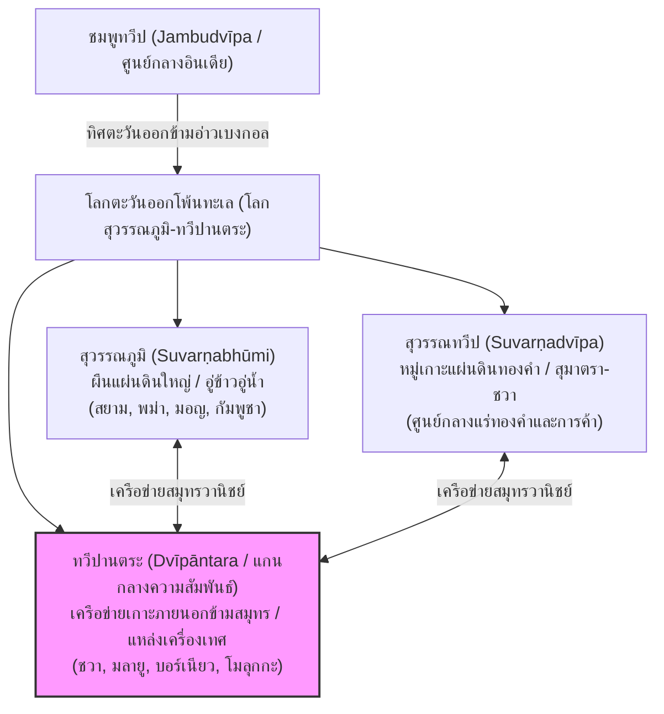

# บทนำ: "ทวีปานตระ" (Dvīpāntara) ในคติโบราณและเครือข่ายความสัมพันธ์ข้ามสมุทร

---

## 1. นิรุกติศาสตร์และรากศัพท์ภาษาสันสกฤตเชิงลึกของ "ทวีปานตระ"

การศึกษาร่องรอยทางประวัติศาสตร์และอารยธรรมโบราณในภูมิภาคเอเชียตะวันออกเฉียงใต้ผ่านอิทธิพลของกระบวนการอินเดียภิวัตน์ (Indianization) จำเป็นต้องเริ่มต้นด้วยการวิเคราะห์คำศัพท์สำคัญที่สะท้อนถึงมุมมองทางคติภูมิศาสตร์ของชาวอินเดียโบราณต่อดินแดนโพ้นทะเล คำว่า **"ทวีปานตระ"** หรือในรูปภาษาสันสกฤตดั้งเดิมคือ **"ทฺวีปานฺตร" (Dvīpāntara / द्वीपान्तर)** เป็นคำสมาสที่เกิดจากการรวมกันของคำศัพท์สองคำในภาษาสันสกฤตคลาสสิก ได้แก่คำว่า **"ทฺวีป" (Dvīpa / द्वीप)** และ **"อนฺตร" (Antara / अन्तर)** [^1] ซึ่งการสืบค้นความหมายจำต้องจำแนกออกเป็นมิติเชิงภาษาศาสตร์และประวัติศาสตร์ศาสตร์เพื่อให้เห็นโครงสร้างความคิดดั้งเดิมของชมพูทวีป

### 1.1 นัยยะของคำว่า "ทฺวีป" (Dvīpa)
ตามหลักนิรุกติศาสตร์ของภาษาสันสกฤตคลาสสิกและการวิเคราะห์ไวยากรณ์ปาณินิ (Aṣṭādhyāyī) คำว่า "ทฺวีป" (Dvīpa) มีรากศัพท์ดั้งเดิมมาจากภาษาพระเวทโบราณคือ **"ทฺวิ" (dvi / द्वि - สอง)** ประสานสอดแทรกเข้ากับคำว่า **"อปฺ" (ap / अप् - น้ำ)** โดยมีการแปลงรูปสระและเสียงตามกฎสนธิวิทยาภายในภาษาสันสกฤตเป็น *dvi-ap-a* แปลความหมายตรงตามอักษรได้ว่า **"ผืนแผ่นดินที่มีน้ำล้อมรอบสองด้าน"** (Land surrounded by two waters) [^2] 

ด้วยโครงสร้างภาษาศาสตร์ดังกล่าว ในคตินิยมภูมิศาสตร์โบราณของชมพูทวีป คำว่า "ทฺวีป" จึงไม่ได้ถูกจำกัดวงหรือมีนิยามที่แคบอยู่เพียง "เกาะ" (Island) ในความหมายทางภูมิศาสตร์กายภาพและธรณีวิทยาปฐพีร่วมสมัยเท่านั้น ทว่ายังมีขอบข่ายครอบคลุมลักษณะภูมิสัณฐานอื่น ๆ อีกหลายประการ:
* **คาบสมุทร (Peninsula):** แผ่นดินที่ยื่นยาวออกไปในมหาสมุทรและมีผืนน้ำขนาบโอบล้อมอยู่ทั้งสองฝั่ง ดังเช่นผืนแผ่นดินคาบสมุทรมลายู-ไทยตอนล่าง หรือแหลมเดกกันของอินเดียใต้
* **ที่ราบลุ่มแม่น้ำหรือจะงอยแผ่นดิน (Doab):** ผืนแผ่นดินอินเตอร์ลูเวียล (Interluvial land) ที่ตั้งอยู่ระหว่างจุดบรรจบของแม่น้ำสองสายหลักที่ไหลมาปะทะกัน
* **ทวีปหรืออนุทวีป (Continent / Subcontinent):** ผืนแผ่นดินขนาดใหญ่ที่มีมหาสมุทรปิดล้อมรอบด้าน ดังปรากฏในคัมภีร์ปุราณะที่ขนานนามผืนแผ่นดินอินเดียทั้งหมดว่า *ชมพูทวีป* (Jambudvīpa) [^3]

### 1.2 นัยยะของคำว่า "อนฺตร" (Antara)
คำศัพท์ประสมตัวที่สองคือ "อนฺตร" (Antara) เป็นคำคุณศัพท์ที่มีความหมายลึกซึ้งและมีมิติการตีความที่หลากหลายในเชิงภาษาศาสตร์ โดยในคัมภีร์ไวยากรณ์ภาษาสันสกฤตสามารถจำแนกออกเป็น 4 มิติสำคัญดังนี้:
1. **"ระหว่าง" (In-between / Intermediate):** บ่งชี้ถึงพื้นที่ทางภูมิศาสตร์ที่ตั้งอยู่กึ่งกลางหรือทำหน้าที่เป็นสะพานเชื่อมต่อในทางกายภาพและการค้าขายระหว่างมหาดินแดนสองฝั่งมหาสมุทร
2. **"ภายใน" (Inner / Within):** สะท้อนถึงมิติพื้นที่ส่วนลึก พื้นที่ปิดล้อม หรือน่านน้ำภายในที่ต้องเดินทางลึกก้าวล่วงเข้าไปจึงจะค้นพบ
3. **"อื่น ๆ" (Other / Different):** ในทางกฎไวยากรณ์ภาษาสันสกฤต มักใช้คำนี้ประกอบท้ายคำนามเพื่อระบุถึงความแตกต่างข้ามขอบเขต เช่น *เทศานตร* (Deśāntara - ประเทศอื่น/ต่างประเทศ) หรือ *ภาษานตร* (Bhāṣāntara - ภาษาอื่น/ต่างภาษา) ดังนั้น *ทวีปานตระ* จึงแปลว่า **"บรรดาเกาะอื่น ๆ"** หรือ **"ทวีปต่างแดนที่อยู่ภายนอกออกไป"** [^4]
4. **"ภายนอก/ห่างไกลออกไป" (Outer / Distant):** สื่อถึงพื้นที่ที่อยู่นอกขอบเขตปริมณฑลศูนย์กลางทางอารยธรรมดั้งเดิม (ชมพูทวีป) แต่ยังคงเชื่อมต่อสัมพันธ์ถึงกันด้วยมรกตแห่งเกลียวคลื่น

เมื่อนำรากศัพท์อันอุดมสมบูรณ์ทั้งสองนี้มารวมกันภายใต้กฎการสนธิคำภาษาสันสกฤต (*dvīpa + antara* กลายเป็น **dvīpāntara**) คำว่า **"ทวีปานตระ"** จึงไม่ใช่คำเรียกภูมิศาสตร์กายภาพที่แห้งแล้ง ทว่ามโนทัศน์นี้บ่งชี้อย่างประณีตถึง **"เครือข่ายกลุ่มเกาะหรือคาบสมุทรอื่นที่ตั้งอยู่ห่างไกลออกไปข้ามสมุทร"** หรือ **"หมู่เกาะในระหว่างเส้นทางเดินเรือค้าขายโบราณ"** ซึ่งในแผนที่ประวัติศาสตร์จริงย่อมหมายถึงน่านน้ำหมู่เกาะอินโดนีเซียและคาบสมุทรมลายูทั้งหมดในปัจจุบัน [^5]

---

## 2. นิเวศวิทยาเปรียบเทียบและการจำแนกแยกแยะ: สุวรรณภูมิ, สุวรรณทวีป และทวีปานตระ

เพื่อความแจ่มแจ้งในทางวิชาการและประวัติศาสตร์นิพนธ์โบราณ การศึกษาเรื่องราวของเอเชียอุษาคเนย์จำเป็นต้องอาศัยการทวิวิเคราะห์เชิงอรรถศาสตร์และการจำแนกแยกแยะระบบพื้นที่เชิงหน้าที่ (Spatial-Functional Analysis) ระหว่างสามคำศัพท์สำคัญที่ปรากฏเคียงคู่กันในเอกสารคลาสสิกของอินเดีย ได้แก่ **สุวรรณภูมิ (Suvarṇabhūmi)**, **สุวรรณทวีป (Suvarṇadvīpa)** และ **ทวีปานตระ (Dvīpāntara)** ซึ่งมักมีความสับสนปนเปอยู่เสมอในประวัติศาสตร์ร่วมสมัย



### 2.1 สุวรรณภูมิ (Suvarṇabhūmi): แผ่นดินใหญ่แห่งความมั่งคั่งและปฐพีวิทยา
คำว่า **"สุวรรณภูมิ"** หรือในรูปภาษาบาลีคือ **"สุวณฺณภูมิ" (Suvaṇṇabhūmi)** แปลตรงตัวว่า **"ดินแดนแห่งทองคำ"** ปรากฏอย่างเด่นชัดในวรรณกรรมทางพุทธศาสนา เช่น *มหาชนกชาดก*, *สมันตปาสาทิกา*, และจารึกราชโองการของพระเจ้าอโศกมหาราช (ศตวรรษที่ 3 ก่อนคริสตกาล) ที่ส่งพระโสณเถระและพระอุตตรเถระมาเผยแผ่พระพุทธศาสนา 

ในทางภูมิศาสตร์และการวิเคราะห์เชิงนิเวศประวัติศาสตร์ สุวรรณภูมิมักมุ่งระบุถึง **"ผืนแผ่นดินใหญ่ของเอเชียตะวันออกเฉียงใต้"** (Mainland Southeast Asia) ซึ่งครอบคลุมที่ราบลุ่มแม่น้ำหลัก ได้แก่ แม่น้ำอิรวดี (พม่า), แม่น้ำสาละวิน, แม่น้ำเจ้าพระยา (ไทย), และแม่น้ำโขง (กัมพูชา-เวียดนาม) ดินแดนผืนใหญ่แห่งนี้อุดมสมบูรณ์ไปด้วยเกษตรกรรม ป่าไม้ และทรัพยากรบนบก ทำหน้าที่เป็น "อู่ข้าวอู่น้ำ" และ "แหล่งผลิตวัตถุดิบปฐมภูมิ" ของโลกโบราณ [^6]

### 2.2 สุวรรณทวีป (Suvarṇadvīpa): เกาะแห่งแร่ทองคำและการคลังมหาอุปราช
ในทางกลับกัน คำว่า **"สุวรรณทวีป" (Suvarṇadvīpa)** ซึ่งแปลว่า **"เกาะทองคำ"** มักถูกใช้ในวรรณกรรมสันสกฤตและการบันทึกเชิงภูมิรัฐศาสตร์เพื่อเจาะจงระบุถึง **"ดินแดนส่วนที่เป็นหมู่เกาะและคาบสมุทรตอนล่าง"** โดยเฉพาะอย่างยิ่งเกาะสุมาตรา (Sumatra) และบางช่วงเวลาอาจควบรวมเกาะชวา (Java) ด้วย 

ศิลาจารึกโลหะที่นาลันทา (Nalanda Copper Plate) ได้แสดงหลักฐานเชิงประจักษ์โดยขนานนามกษัตริย์พลาบุตรเทวะแห่งราชวงศ์ไศเลนทร์ผู้ปกครองดินแดนสุมาตราว่าเป็นกษัตริย์แห่ง "สุวรรณทวีป" ดินแดนแห่งนี้มีความโดดเด่นในฐานะแหล่งแร่ทองคำธรรมชาติจากเทือกเขาบารีซัน (Barisan Mountains) และเป็นศูนย์กลางการคลังและอำนาจการบริหารจัดการเมืองท่าที่เข้มแข็งข้ามสมุทร [^7]

### 2.3 ทวีปานตระ (Dvīpāntara): แกนกลางเครือข่ายข้ามสมุทรและโลกทัศน์พื้นที่เสรี (The Core Hub)
ท่ามกลางคำนิยามทั้งสอง **"ทวีปานตระ" (Dvīpāntara)** ทำหน้าที่เปรียบเสมือน **"มโนทัศน์เชิงระบบและเครือข่ายการขนส่งข้ามสมุทร"** ที่ไม่ถูกจำกัดด้วยดินแดนกายภาพเดี่ยว ทวีปานตระไม่ใช่เพียงชื่อสถานที่ แต่เป็นชื่อของ "ปฏิสัมพันธ์ข้ามอารยธรรม" และระบบนิเวศการเดินเรือที่เชื่อมต่อหมู่เกาะน้อยใหญ่ทั้งหมดในเอเชียอุษาคเนย์ตอนล่าง (รวมถึงชวา, สุมาตรา, บอร์เนียว, คาบสมุทรมลายู, และลึกเข้าไปถึงหมู่เกาะโมลุกกะ) เข้ามาเป็นหนึ่งเดียวกันภายใต้โครงสร้างการค้าเครื่องเทศ

ทวีปานตระจึงเป็นหัวใจหรือแกนกลาง (Core Hub) ของการค้าโลกยุคโบราณที่แท้จริง เพราะเป็นดินแดนที่ส่งผ่านสินค้าวิเศษที่โลกภายนอกไม่มีวันผลิตได้เอง นั่นคือ **เครื่องเทศเปลี่ยนโลก** โดยเฉพาะกานพลู จันทน์เทศ และการบูร หากไม่มีเครือข่ายทวีปานตระ สุวรรณภูมิและสุวรรณทวีปย่อมขาดสะพานเชื่อมต่อวัฒนธรรมและการค้าที่นำพาอารยธรรมข้ามสมุทรจากโลกตะวันตก (อินเดีย, กรีก, โรมัน, เปอร์เซีย, อาหรับ) ไปสู่โลกตะวันออก (จีน) [^8]

---

## 3. ดินแดนกานพลู (Lavaṅgadvīpa): ป่าเครื่องเทศศักดิ์สิทธิ์และนิเวศวิทยาทางทะเล

มิติความสำคัญอันลึกซึ้งที่สุดที่ทำให้ "ทวีปานตระ" กลายเป็นแผ่นดินศักดิ์สิทธิ์ที่ถูกไขว่คว้าโดยผู้คนทั่วโลกโบราณ คือฐานะของการเป็น **"ลวังกทวีป" (Lavaṅgadvīpa / लवङ्गद्वीप) หรือ "ดินแดนแห่งกานพลู" (The Clove Country)** 

กานพลู (*Syzygium aromaticum* ในชื่อภาษาสันสกฤตว่า **"ลวังก" / Lavaṅga / लवङ्ग**) เป็นพืชเครื่องเทศยืนต้นพื้นเมืองดั้งเดิมเฉพาะถิ่น (Endemic Species) ที่เจริญเติบโตได้ดีเฉพาะบนหมู่เกาะภูเขาไฟขนาดเล็กของแคว้นโมลุกกะ (Moluccas / Maluku) ทางทิศตะวันออกไกลของประเทศอินโดนีเซีย ได้แก่ เกาะเตอร์นาเต (Ternate), ติโดเร (Tidore), โมตี (Moti), มากิยัน (Makian) และบาจัน (Bacan) เท่านั้น [^9]

```
[ มรกตน่านน้ำทวีปานตระ ]
 🚢  (ชมพูทวีป) <=============> (คาบสมุทรมลายู / Kedah) <=============> (เกาะสุมาตรา / ชวา) <=============> (หมู่เกาะโมลุกกะ)
      [นำเข้ากานพลู]         [จุดผ่านและเปลี่ยนถ่ายสินค้า]          [จักรวาฬมณฑลทวีปานตระ]         [ลวังกทวีป / แหล่งเพาะปลูก]
```

การค้นพบกลิ่นหอมของกานพลูโดยสังคมอินเดียโบราณตั้งแต่สมัยราชวงศ์เมารยะและราชวงศ์คุปตะ ก่อให้เกิดโครงสร้างการค้าข้ามสมุทรที่ยิ่งใหญ่ที่สุดเส้นทางหนึ่งของมนุษยชาติ ชาวอินเดียจำต้องแล่นเรือข้ามอ่าวเบงกอลผ่านช่องแคบมะละกาหรือช่องแคบซุนดาเพื่อมุ่งหน้าไปยังทวีปานตระเพื่อจัดหาผลผลิตสมุนไพรอันล้ำค่านี้ นัยยะของ "กานพลู" ในคติชนอินเดียจึงถูกใช้เปรียบเปรยถึงสายลมอ่อนโยนและหอมสดชื่นจากทะเลใต้ ดังบทกวีของกาลิทาสในเรื่อง *รฆุวงศ์* 

ระบบนิเวศวิทยาทางทะเลของทวีปานตระจึงได้รับการขับเคลื่อนด้วยวงจรชีวิตของป่ากานพลูโบราณและการแสวงหาเครื่องเทศป่าศักดิ์สิทธิ์ พลังงานขับเคลื่อนนี้ทำให้เกิดการสร้างรัฐท่าเรือข้ามเกาะ การแลกเปลี่ยนเทคโนโลยีต่อเรือสำเภาโบราณ และการหยั่งรากลึกของคติความเชื่อและพจนานุกรมประเมินภูมิศาสตร์ที่ทำให้ความรู้เรื่องพิกัดดินแดนกานพลูมีพัฒนาการเคียงคู่กับแผนที่โลกคลาสสิก [^10]

---

## 4. วิวัฒนาการจากภาษาสันสกฤตโบราณสู่คำว่า "นูษานตระ" (Nusantara)

วิถีอารยธรรมข้ามสมุทรของ "ทวีปานตระ" ไม่เคยยุติบทบาทลงเพียงการเป็นจดหมายเหตุของชาวต่างชาติ แต่ได้ฝังรากลึกและวิวัฒนาการเข้าสู่อัตลักษณ์ของคนในท้องถิ่นอย่างสง่างาม โดยเฉพาะการส่งผ่านทางภาษาและแนวคิดภูมิรัฐศาสตร์จากภาษาสันสกฤตไปสู่ภาษาชวาโบราณ (Kawi) ซึ่งให้กำเนิดคำว่า **"นูษานตระ" (Nusantara)** คำศัพท์หลักที่เป็นศูนย์รวมวิญญาณแห่งชาติอินโดนีเซียในปัจจุบัน

คำว่า **"Nusantara"** แท้จริงแล้วคือ **การแปลศัพท์ตรงตัวแบบสัญญะวิทยาเชิงระบบ** (Calque / Loan translation) จากคำภาษาสันสกฤตว่า *Dvīpāntara* สู่โครงสร้างคำภาษาชวาโบราณ โดยจำแนกออกได้ดังนี้:
* **Nusa (นูซา / นูษะ):** สืบทอดนัยยะความหมายเดียวกับภาษาสันสกฤตว่า **Dvīpa** คือหมายถึงเกาะ คาบสมุทร หรือดินแดนที่มีน้ำล้อมรอบ
* **Antara (อันตารา / อนฺตร):** รับคำยืมมาจากภาษาสันสกฤตโดยตรง คงนัยยะแห่งคำว่า "ระหว่าง" "ภายนอก" หรือ "ต่างกันออกไป" 

ด้วยเหตุนี้ คำชวาโบราณว่า *Nusantara* จึงคงความหมายดั้งเดิมของ *Dvīpāntara* ไว้อย่างครบถ้วนรอบด้าน คือหมายถึง **"บรรดาเกาะอื่น ๆ ที่อยู่นอกศูนย์กลางเกาะชวา"** หรือ **"หมู่เกาะที่ตั้งประดับคั่นกลางระหว่างขอบมหาสมุทร"** [^11]

ในศตวรรษที่ 14 ยุคทองของจักรวรรดิมัชปาหิต (Majapahit Empire) มโนทัศน์ "นูษานตระ" ได้รับการยกระดับขึ้นสู่ **อุดมการณ์ภูมิรัฐศาสตร์ระดับจักรวรรดิ** อย่างเป็นรูปธรรมสูงสุดผ่านการประกาศคำสัตยาธิษฐานปาลาปา (Sumpah Palapa) ของมหาอุปราชคชา มาดา (Gajah Mada) ในปี ค.ศ. 1336 โดยคำว่านูษานตระในบริบทราชสำนักมัชปาหิตถูกใช้เพื่อกำหนดนโยบายความมั่นคงและการสร้างเครือข่ายอธิปไตยทางทะเลข้ามหมู่เกาะ เพื่อปกป้องดินแดนรอบนอกทั้งหมดจากภัยคุกคามของจักรวรรดิมองโกล ซึ่งเป็นการสืบทอดวิสัยทัศน์ทางทฤษฎีจากแนวคิด **"จักรวาฬมณฑลทวีปานตระ" (Cakravala Mandala Dvipantara)** ของพระเจ้าเกียรตินครแห่งสิงหะส่าหรีนั่นเอง [^12]

---

## 5. มิติจักรวาลวิทยาเปรียบเทียบและภูมิประวัติศาสตร์ทางทะเล

ความเข้าใจอันถ่องแท้ในมโนทัศน์ "ทวีปานตระ" จำต้องพิจารณาร่วมกับคติจักรวาลวิทยาโบราณของอินเดีย ซึ่งทำหน้าที่จัดระเบียบพื้นที่ในโลกมนุษย์ให้สอดคล้องประสานกับระเบียบแห่งสรวงสวรรค์และจักรวาลภาพ

### 5.1 คติภูมิศาสตร์ตามคัมภีร์ปุราณะ (Puranic Cosmography)
ตามคัมภีร์ปุราณะและคัมภีร์ดาราศาสตร์อินเดียโบราณ (อาทิ *Sūryasiddhānta*) โลกได้รับการสร้างโครงสร้างแผนที่แบบ **"สัปตทวีป"** (Saptadvīpa) หรือระบบเจ็ดทวีปวงแหวน ซึ่งมีลักษณะเป็นวงแผ่นดินกลมล้อมรอบภูเขาสิเนรุ (Mount Meru) สลับซับซ้อนสลับกับมหาสมุทรทั้งเจ็ดชนิด ได้แก่ น้ำเค็ม, น้ำอ้อย, สุรา, เนยใส, นมส้ม, นม และน้ำจืด โดยมี **ชมพูทวีป** (Jambudvīpa) ตั้งประดิษฐานอยู่ที่จุดศูนย์กลางแห่งแผนที่จักรวาลนี้ [^13]

อย่างไรก็ตาม เมื่อชาวอินเดียเริ่มทำอุตสาหกรรมการเดินเรือและสมุทรวานิชย์จริงข้ามผ่านอ่าวเบงกอลและน่านน้ำมหาสมุทรอินเดียตอนใต้ตั้งแต่ศตวรรษที่ 3 ก่อนคริสตกาลเป็นต้นมา พวกเขาพบพิกัดที่ตั้งของหมู่เกาะขนาดใหญ่จำนวนมากที่มีลักษณะโอบล้อมน่านน้ำทะเลใต้ แหล่งข้อมูลปุราณะในยุคต่อมาจึงเริ่มปรับมุมมองและอัปเดตแผนที่ภูมิศาสตร์ของตน โดยปรากฏการกล่าวถึงเกาะและคาบสมุทรต่าง ๆ ทางทิศตะวันออกและทิศใต้ในนาม **"ทวีปภายนอก"** หรือ **"ทวีปานตระ"** [^14]

ในคัมภีร์ *Vāyu Purāṇa* และ *Brahmāṇḍa Purāṇa* มีการจัดระบบหมู่เกาะในมหาสมุทรใต้และทะเลตะวันออกออกเป็นเกาะย่อยต่าง ๆ ซึ่งสะท้อนถึงเกาะและภูมิภาคจริงในเอเชียตะวันออกเฉียงใต้:
* **ยมทวีป (Yamadvīpa):** ดินแดนทางตะวันออกอันไกลโพ้น
* **สารทวีป (Śaṅkhadvīpa):** เกาะหอยสังข์
* **สุวรรณทวีป (Suvarṇadvīpa) / กนกทวีป (Kanakadvīpa):** เกาะทองคำ (สุมาตรา)
* **ยวทวีป (Yavadvīpa):** เกาะข้าวบาร์เลย์ (ชวา)
* **การปูรทวีป (Karpūradvīpa):** เกาะแห่งการบูร (เกาะบอร์เนียว หรือบริเวณบารุสในสุมาตรา) [^15]

### 5.2 ความประสานสอดคล้องระหว่างจักรวาลวิทยาและการพาณิชย์ข้ามสมุทร
ในขณะที่ตำราทางศาสนาของพราหมณ์และพุทธวาดภาพดินแดนเหล่านี้ด้วยภาษาเชิงสัญลักษณ์ของจักรวาลภาพศักดิ์สิทธิ์ แต่ในความเป็นจริงประวัติศาสตร์โลก "ทวีปานตระ" คือเครือข่ายอันรุ่งเรืองของอู่เรือ อู่ต่อเรือสำเภาโบราณ และสถานีการค้าเครื่อง Spice ระดับนานาชาติที่เชื่อมโยงโลกโบราณข้ามทวีป ลมมรสุมตะวันออกเฉียงเหนือและลมมรสุมตะวันตกเฉียงใต้คือกฎเกณฑ์ธรรมชาติเชิงนิเวศน์วิทยาที่เป็นผู้ควบคุมลมหายใจและจังหวะก้าวเดินของทุกผู้คนในทวีปานตระ 

พ่อค้าทมิฬ นักปราชญ์และภิกษุชาวจีน สมณะชาวชมพูทวีป และราษฎรชาวชวาและชาวศรีวิชัยท้องถิ่นไม่ได้มองน่านน้ำทะเลว่าคือดินแดนแห่งความน่าสะพรึงกลัวหรืออุปสรรคอันตราย หากแต่มองว่าเป็น "ทางหลวงเชื่อมปฏิสัมพันธ์" (Maritime Silk Road Highway) ที่พัดพานำมาซึ่งความมั่งคั่งมหาศาลและปัญญาญาณของมนุษยชาติ การเดินทางไปสู่ทวีปานตระจึงผสมผสานเป้าหมายของการแสวงหาทางโลกีย์ (กานพลู, จันทน์เทศ, ทองคำ, การบูร) และการเดินทางแสวงหาทางจิตวิญญาณธรรมอันเป็นอมตะ (พระไตรปิฎกมหายาน ลัทธิไศวะนิกายตันตระ และอายุรเวทแพทย์ศาสตร์) [^16] 

บทนำทางประวัติศาสตร์วิทยานี้จะทำหน้าที่เป็นสะพานเชื่อมโยงเชิงสติปัญญาที่ทรงพลัง เพื่อพาท่านผู้อ่านก้าวล่วงเข้าไปตรวจสอบ รื้อสร้าง และวิเคราะห์หลักฐานโบราณระดับปฐมภูมิในตระกูลภาษาต่าง ๆ ทั่วโลกประวัติศาสตร์ในบทต่อ ๆ ไป เพื่อให้ประเด็นเชิงลึกของดินแดน "ทวีปานตระ" ปรากฏเด่นชัด คมชัด และเพียบพร้อมสมบูรณ์แบบที่สุดในฐานะพื้นที่ประสานรอยเท้าอารยธรรมข้ามสมุทรที่ไม่มีสิ่งใดสามารถบดบังได้

---

## 📌 เชิงอรรถอ้างอิงบทนำ

[^1]: Monier-Williams, M. (1899). *A Sanskrit-English Dictionary*. Oxford: Clarendon Press, p. 487.
[^2]: Macdonell, A. A. (1929). *A Practical Sanskrit Dictionary*. London: Oxford University Press, p. 121.
[^3]: Sircar, D. C. (1971). *Studies in the Geography of Ancient and Medieval India*. Delhi: Motilal Banarsidass, pp. 38-42.
[^4]: Gonda, J. (1952). *Sanskrit in Indonesia*. New Delhi: International Academy of Indian Culture, pp. 218-220.
[^5]: Lévi, S. (1931). "Kouen-Louen et Dvīpāntara". *Bijdragen tot de Taal-, Land- en Volkenkunde*, 88(1), p. 624.
[^6]: Ray, H. P. (1994). *The Winds of Change: Buddhism and the Maritime Links of Early South Asia*. Delhi: Oxford University Press, pp. 112-115.
[^7]: Coedès, G. (1968). *The Indianized States of Southeast Asia*. Honolulu: East-West Center Press, pp. 14-16.
[^8]: Hall, K. R. (1985). *Maritime Trade and State Development in Early Southeast Asia*. Honolulu: University of Hawaii Press, pp. 45-52.
[^9]: Donkin, R. A. (2003). *Between East and West: The Moluccas and the Traffic in Spices*. Philadelphia: American Philosophical Society, pp. 98-102.
[^10]: หุตางกูร, ตรงใจ. (2022). *แดนกานพลูของคอสมัส: การคิดใหม่เรื่องเส้นทางทางทะเลเริ่มแรกสู่เอเชียตะวันออกเฉียงใต้*. กรุงเทพฯ: ศูนย์มานุษยวิทยาสิรินธร, หน้า 14-38.
[^11]: Zoetmulder, P. J. (1982). *Old Javanese-English Dictionary*. 's-Gravenhage: Martinus Nijhoff, Vol. 1, p. 1198.
[^12]: Munandar, A. A. (2011). *Candravalamandala Dvipantara: Gagasan Kertanegara*. Jakarta: Wedatama Widya Sastra, pp. 45-48.
[^13]: Ali, S. M. (1966). *The Geography of the Puranas*. New Delhi: People's Publishing House, pp. 12-16.
[^14]: Ray, H. P. (1994). เรื่องเดียวกัน, หน้า 120-125.
[^15]: Wheatley, P. (1961). *The Golden Khersonese: Studies in the Historical Geography of the Malay Peninsula before A.D. 1500*. Kuala Lumpur: University of Malaya Press, pp. 177-180.
[^16]: Coedès, G. (1968). เรื่องเดียวกัน, หน้า 24-28.

---

## 🗂️ แผนการนำทางโครงการวิจัย (Research Navigation Menu)
* **บทนำ (Introduction):** [01_introduction.md](01_introduction.md) - สุวรรณภูมิ สุวรรณทวีป ทวีปานตระ แดนกานพลู และนิรุกติศาสตร์เชิงประวัติศาสตร์วิทยา
* **บทที่ 1 (Sanskrit Sources):** [02_classical_sanskrit_sources.md](02_classical_sanskrit_sources.md) - รฆุวงศ์ 6.57 ปุราณะ อายุรเวทภาวประกาศ และจารึกกูไต/ตารุมานคร/นาลันทา
* **บทที่ 2 (Tamil Sources):** [03_classical_tamil_sources.md](03_classical_tamil_sources.md) - ปัตตินัปปาลัย มณีเมขไล จารึกตานโจร์ 1025 และแผ่นจารึกเลย์เดน
* **บทที่ 3 (Sino-Sanskrit Sources):** [04_sino_sanskrit_monk_records.md](04_sino_sanskrit_monk_records.md) - Sylvain Lévi (1931) พจนานุกรมฝานยวี่จ๋าหมิง และจดหมายเหตุอี้จิง/ฟ่าเสียน
* **บทที่ 4 (Greco-Roman & Arabic Sources):** [05_classical_western_and_arabic_sources.md](05_classical_western_and_arabic_sources.md) - Periplus, Ptolemy, Pliny, Ibn Khordadbeh, Al-Masudi และ Zābaj
* **บทที่ 5 (Javanese & Western Historiography):** [06_javanese_and_western_historiography.md](06_javanese_and_western_historiography.md) - จักรวาฬมณฑลทวีปานตระ คำปฏิญาณปาลาปา และประวัติศาสตร์นิพนธ์ตะวันตก
* **สารบบบรรณานุกรม (Annotated Bibliography):** [07_annotated_bibliography.md](07_annotated_bibliography.md) - คลังข้อมูลอ้างอิงเชิงวิเคราะห์ 160+ รายการ

