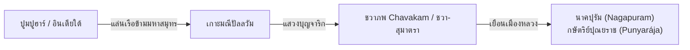

# บทที่ 2: วรรณกรรมทมิฬโบราณ จารึกราชวงศ์โจฬะ และหลักฐานปฐมภูมิสิงหล-บาลี (Tamil Sangam, Epigraphic and Pali-Sinhalese Primary Sources)

---

## 1. ร่องรอยความสัมพันธ์ข้ามสมุทรในวรรณกรรมสังคัม (Sangam Literature)

ในการสืบค้นประวัติศาสตร์ช่วงต้นคริสตกาล นอกเหนือจากหลักฐานภาษาสันสกฤตแล้ว แหล่งเอกสารทมิฬดั้งเดิมของอินเดียใต้ โดยเฉพาะ **"วรรณกรรมสังคัม" (Sangam Literature / சங்க இலக்கியம்)** ซึ่งมีอายุราวคริสต์ศตวรรษที่ 3 ก่อนคริสตกาลจนถึงคริสต์ศตวรรษที่ 3 ถือเป็นคลังปัญญาที่บันทึกพยานหลักฐานการติดต่อระหว่างอินเดียใต้กับดินแดนทวีปานตระ (เอเชียตะวันออกเฉียงใต้ทางทะเล) ไว้อย่างชัดเจนและสมจริงที่สุด วรรณกรรมกลุ่มนี้ประกอบด้วยบทร้อยกรองทั้งสิ้นกว่า 2,381 บท จำแนกออกเป็นรวมบทกวี 18 เล่ม (*Pattuppāṭṭu* 10 บทและ *Eṭṭutthokai* 8 บท) สะท้อนภาพชีวิตเชิงพาณิชย์ วีรกรรมสงคราม และธรรมชาติวิทยาของชาวทมิฬโบราณภายใต้การปกครองของสามราชวงศ์ ได้แก่ โจฬะ เจระ และปาณฑยะ [^1]

### 1.1 วรรณคดีปัตตินัปปาลัย (Paṭṭiṉappālai): สินค้านำเข้าจากเกาะคาลากัม
วรรณคดีทมิฬคลาสสิกเรื่อง **"ปัตตินัปปาลัย" (Paṭṭiṉappālai / பட்டினப்பாலை)** ซึ่งรจนาโดยกวี **อุรุตทิรังกัณณนาร์ (Uruttiraṅkaṇṇanār)** ราวคริสต์ศตวรรษที่ 2 ได้พรรณนาถึงความคึกคักและการค้าเสรี ณ เมืองท่าสากล **"กาเวริปุมปัตตินัม" (Kaveripumpattinam / காவிரிப்பூம்பட்டினம்)** หรือเมืองปูมปูฮาร์ (Poompuhar) ของราชวงศ์โจฬะ โดยมีการบันทึกรายชื่อสินค้าแปลกตาที่ส่งเข้ามาทางเรือสำเภาขนาดใหญ่ [^2]

* **ตัวบทดั้งเดิม (Tamil):**
  > ...காழகத்து ஆக்கமும் கங்கைப் வாரியுங்
  > காவிரிப் பயனும் ஈழத்து உணவும்
  > காழக்கத்துப் பண்டமும்... [^3]
* **คำถอดอักษรโรมัน:**
  > *...kāḻakattu ākkamum gaṅgaip vāriyum*
  > *kāvirip payanum īḻattu uṇavum*
  > *kāḻakattup paṇṭamum...*
* **คำแปล:** "...สินค้าอันอุดมจาก **คาลากัม (Kāḷagam)** ผลผลิตจากแม่น้ำคงคา ผลเก็บเกี่ยวจากลุ่มน้ำกาเวรี อาหารนำเข้าจากเกาะอีฬัม (Eelam - ศรีลังกา) และสิ่งอุปโภคอันล้ำค่าจากคาลากัม..."

### 1.2 วรรณคดีเนดุนัลวาได (Neṭunalvāṭai): สายลมมรสุมและการจากบ้านข้ามสมุทร
อีกหนึ่งตัวบทสังคัมที่ถูกมองข้ามในการศึกษาทวีปานตระ คือ **"เนดุนัลวาได" (Neṭunalvāṭai / நெடுநல்வாடை)** รจนาโดยกวี **นักกีรร (Nakkīrar)** เป็นบทกวีพรรณนาความเศร้าของนางราชินีแห่งปาณฑยะที่ต้องพลัดพรากจากพระสวามีผู้เสด็จไปทำศึกยังดินแดนไกลในฤดูมรสุม โดยตัวบทกล่าวถึง **สายลมตะวันออกเฉียงเหนือ (วาไดกาฏรุ)** ที่พัดพาเรือสำเภาจากฝั่ง **"ทะเลทิศบูรพา" (குண கடல்)** กลับมายังท่าเรือโจฬะ บทกวีนี้สะท้อนวัฏจักรมรสุมเดินเรือที่พ่อค้าทมิฬใช้ออกเดินทางไปยังคาบสมุทรมลายูและหมู่เกาะทวีปานตระเป็นฤดูกาล [^4]

### 1.3 รวมบทกวีอัคนานูรุ (Akanāṉūṟu) และปุรนานูรุ (Puṟanāṉūṟu): การค้าทองคำจากหมู่เกาะ
ในรวมบทกวี **อัคนานูรุ (Akanāṉūṟu / அகநானூறு)** หรือ "สี่ร้อยบทแห่งกวีอากัม" ซึ่งเป็นบทกวีรักของยุคสังคัม ปรากฏหลายบทที่กล่าวถึงพ่อค้าชาวทมิฬที่ออกเดินเรือข้ามมหาสมุทรไปยัง **"ตีวุ" (தீவு - เกาะ)** ต่างๆ เพื่อแสวงหาทองคำ ไข่มุก และของหายาก [^5] ส่วน **ปุรนานูรุ (Puṟanāṉūṟu / புறநானூறு)** บทที่ 343 ได้พรรณนาถึงเรือสำเภาขนาดใหญ่ของ **กษัตริย์เจระ (Chera King)** ที่แล่นไปรับสินค้าจากดินแดนโพ้นทะเล โดยเฉพาะ **"อะคิล" (அகில் - ไม้กฤษณา/aloeswood)** และ **"กรุปุ" (கருப்பு - พริกไทยดำ)** ซึ่งเป็นสินค้าส่งออกหลักของทวีปานตระ [^6]

### 1.4 บทวิเคราะห์: จาก "คาลากัม" (Kalagam) สู่ "กะดะหะ" (Kadaram)
นักวิชาการประวัติศาสตร์และภาษาศาสตร์โบราณ เช่น **ศาสตราจารย์ เค. เอ. นีลากันตา ศาสตรี (K. A. Nilakanta Sastri)** และ **ศาสตราจารย์ โนโบะรุ คาราชิมะ (Noboru Karashima)** ได้พิสูจน์แล้วว่า คำว่า **"คาลากัม" (Kāḷagam)** ในภาษาทมิฬโบราณ มีพัฒนาการทางเสียง (Phonological shift) ที่ถอดเสียงมาจากคำว่า **"กะดะหะ" (Kaṭāha)** ในภาษาสันสกฤต ซึ่งก็คือ **"เกดะห์" (Kedah / รัฐไทรบุรี)** บนคาบสมุทรมลายูในปัจจุบันนั่นเอง [^7]

การระบุถึง "สินค้าล้ำค่าจากคาลากัม" ในจดหมายเหตุทมิฬตั้งแต่ศตวรรษที่ 2 ยืนยันว่า คาบสมุทรมลายูทำหน้าที่เป็นประตูการค้าและเมืองท่าหลักที่เป็นตัวแทนของดินแดนทวีปานตระ โดยเป็นแหล่งส่งผ่านสินค้าพวกไม้หอม (กฤษณา) การบูร และเครื่องเทศรสเผ็ดร้อนจากอินโดนีเซียไปยังท่าเรืออินเดียใต้ข้ามอ่าวเบงกอล [^8]

---

## 2. ปัญจมหากาพย์ทมิฬ: จากศิลัปปทิการัมถึงมณีเมขไล — กระจกส่องดินแดนทวีปานตระ

### 2.1 มหากาพย์ศิลัปปทิการัม (Silappatikaram / சிலப்பதிகாரம்)
มหากาพย์ทมิฬคลาสสิกเรื่อง **"ศิลัปปทิการัม" (Cilappatikāram)** รจนาโดย **เจ้าชายอิลังโก อฑิกัล (Iḷaṅkō Aṭikaḷ / இளங்கோ அடிகள்)** ราวคริสต์ศตวรรษที่ 2-5 ถือเป็นหนึ่งในห้ามหากาพย์อันยิ่งใหญ่ของวรรณกรรมทมิฬ เรื่องราวของนางกัณณกี (Kaṇṇaki) สตรีผู้ซื่อสัตย์ มีฉากที่พรรณนาถึง **ท่าเรือปูมปูฮาร์** (Puhar) ที่เต็มไปด้วยพ่อค้าจากต่างชาติ รวมถึงพ่อค้าจาก **"ชวก" (Cāvakam - ชวา)** ที่นำสินค้าเข้ามาค้าขาย [^9]

* **ตัวบทดั้งเดิม (Tamil):**
  > சாவகர் தருமணி... தொண்டியர் கொணர்ந்த தூவியன் நறவும்...
* **คำแปล:** "...อัญมณีวิเศษที่พ่อค้าจาก **ชวก (Cāvaka / ชวา)** นำมาถวาย... และเหล้าองุ่นหอมหวนที่พ่อค้าจากตอณฑี (Tondi) ขนมาส่ง..."

ในบทที่ 14 **"เวณิกกาไต" (Vēṇikkātai)** ศิลัปปทิการัมพรรณนาถึงย่านพาณิชย์ของเมืองปูมปูฮาร์อย่างละเอียด ระบุว่ามีคลังสินค้าที่เก็บรักษา **"กรุปุ" (กานพลู)**, **"อะคิล" (ไม้กฤษณา)**, **"กรปูรัม" (การบูร)** และ **"จันดนัม" (จันทน์หอม)** ซึ่งทั้งหมดนี้เป็นสินค้าที่มีแหล่งกำเนิดในหมู่เกาะทวีปานตระโดยเฉพาะ [^10]

### 2.2 มหากาพย์พุทธทมิฬมณีเมขไล (Maṇimēkalai / மணிமேகலை)
มหากาพย์เรื่อง **"มณีเมขไล" (Maṇimēkalai)** รจนาโดยกวีพุทธนามว่า **จีตตะไล จัตตานาร์ (Cīttalaic Cāttaṉār)** (ราวคริสต์ศตวรรษที่ 5-6) เป็นภาคต่อของศิลัปปทิการัม เล่าเรื่องราวของนางมณีเมขไลผู้เป็นธิดาของพระเอกและนางนาฏศิลป์ ผู้ออกเดินทางจาริกแสวงบุญในดินแดนโพ้นทะเล [^11]

ในบทที่ 14 และบทที่ 24 ของมณีเมขไล ได้พรรณนาถึงดินแดน **"ชวาภพ" (Cāvakam / Chavakam)** โดยระบุว่าเมืองหลวงคือ **"นาคปุรัม" (Nāgapuram)** ภายใต้การปกครองของ **"พระเจ้าปุณยราช" (Puṇiyarāja)** กษัตริย์พุทธผู้ทรงทศพิธราชธรรม [^12]

* **ตัวบทดั้งเดิม (Tamil):**
  > சாவக நன்னாட்டுத் தண் பெயல் மண்டி...
  > நாக புரத்து நல் நகர் ஆண்டு...
* **คำแปลถอดความ:** "...ณ ดินแดนชวาภพอันแสนดีเลิศ ซึ่งความชุ่มชื่นแห่งพิรุณโปรยปรายลงมาอย่างอุดมสมบูรณ์... พระราชาผู้ทรงคุณธรรมทรงปกครองนครอันสง่างามนามว่า นาคปุรัม..."

มณีเมขไลบันทึกว่า พระเจ้าปุณยราชทรงประสบวิกฤตความแห้งแล้ง แต่นางมณีเมขไลได้เดินทางมาพร้อม **"อัมฤตสุรภี" (Amrita Surabhi)** บาตรวิเศษที่สามารถผลิตอาหารได้อย่างไม่มีวันหมด เพื่อบรรเทาทุกข์ยากให้แก่ประชาราษฎร์ในชวาภพ สะท้อนถึงเครือข่ายพุทธศาสนามหายานและการแลกเปลี่ยนทางปัญญาข้ามสมุทรระหว่างอินเดียใต้กับทวีปานตระ [^13] **ศ. เกอเดส์ (George Cœdès)** สันนิษฐานว่า *นาคปุรัม* อาจตั้งอยู่บริเวณนครศรีธรรมราชหรือบนคาบสมุทรมลายู [^14]

---

## 3. วรรณกรรมภักติทมิฬ: คุรุปรัมปราประภาวัมและนักบุญแห่งทวีปานตระ

หลักฐานอีกกลุ่มหนึ่งที่มักถูกละเลยในการศึกษาทวีปานตระคือ **วรรณกรรมภักติ (Bhakti Literature)** ของทั้งสายไศวะ (Shaiva) และไวษณพ (Vaishnava) ซึ่งบันทึกเรื่องราวของนักบุญศาสนาฮินดูที่มีความเกี่ยวข้องกับดินแดนหมู่เกาะโพ้นทะเลอย่างน่าทึ่ง

### 3.1 คุรุปรัมปราประภาวัม (Guruparamparā Prabhāvam / குருபரம்பரை பிரபாவம்)
**"คุรุปรัมปราประภาวัม"** เป็นคัมภีร์ตำนานสายอาจารย์ (Hagiography) ในสำนักศรีไวษณพ (Śrī Vaiṣṇava Sampradāya) เรียบเรียงและถ่ายทอดสืบสานกันมาตั้งแต่ราวคริสต์ศตวรรษที่ 13-14 โดย **ปิณฺปฬคิย เปรุมาฬ ชียร์ (Piḷḷai Lokam Jīyar)** และมีการขยายความต่อมาโดยสำนักอาจารย์หลายรุ่น [^15] คัมภีร์เล่มนี้บันทึกประวัติของ **อาฬวาร์ทั้งสิบสอง (Āḻvārs / ஆழ்வார்கள்)** ซึ่งเป็นนักบุญไวษณพภักติผู้ยิ่งใหญ่ที่สุด

ตำนานที่สำคัญยิ่งสำหรับการศึกษาทวีปานตระ คือเรื่องราวของ **"ติรุมังไก อาฬวาร์" (Tirumangai Āḻvār / திருமங்கை ஆழ்வார்)** อาฬวาร์องค์ที่ 11 ผู้มีพระนามเดิมว่า **นีลน (Nīlan / நீலன்)** หรือ **ปรกาลน (Parakālan)** ผู้เป็นเจ้าเมืองแห่งแคว้นติรุมังไก ณ ลุ่มน้ำกาเวรี [^16]

ตามตำนานในคุรุปรัมปราประภาวัม ติรุมังไก อาฬวาร์ต้องการทองคำและทรัพย์สมบัติจำนวนมหาศาลเพื่อบูรณปฏิสังขรณ์พระวิหารพระนารายณ์ (วิษณุ) ณ เมืองศรีรังคัม (Srirangam) พระองค์จึงได้ดำเนินยุทธศาสตร์การ "ปล้นเพื่อพระเจ้า" (Sacred robbery) โดยอาศัยกำลังบริวารไปดักปล้นกองคาราวานเรือสำเภาของพ่อค้าที่เดินทางจาก **ดินแดนโพ้นทะเล (Dvīpāntara / ทวีปานตระ)** กลับเข้ามายังท่าเรือทมิฬ [^17]

* **ข้อความสำคัญจากตำนาน:**
  > *...ติรุมังไก อาฬวาร์ ทรงเห็นว่าบรรดาเรือสินค้าอันบรรทุกทองคำ อัญมณี การบูร และกานพลูจากหมู่เกาะฝั่งไกลนั้น ย่อมจะเป็นประโยชน์ต่อกิจกรรมแห่งพระผู้เป็นเจ้ามากกว่าการตกอยู่ในมือพ่อค้าเหล่านั้น ท่านจึงยกกำลังบริวารออกไปยึดเรือสินค้าดังกล่าว...*

เรื่องราวนี้แม้จะเป็นตำนานศาสนา แต่สะท้อนข้อเท็จจริงทางประวัติศาสตร์ที่สำคัญอย่างยิ่ง ได้แก่ การยืนยันว่าในคริสต์ศตวรรษที่ 8 มีกองเรือสินค้าจำนวนมากเดินทางไป-กลับระหว่างท่าเรือทมิฬกับทวีปานตระอย่างสม่ำเสมอ สินค้าหลักคือทองคำ อัญมณี การบูร และเครื่องเทศ ซึ่งตรงกับบัญชีรายชื่อสินค้าจากทวีปานตระในจดหมายเหตุอี้จิง (ศตวรรษที่ 7) และเจ้าหรูเกว (ศตวรรษที่ 13) [^18]

### 3.2 เปริยะปุราณัม (Periya Purāṇam / பெரிய புராணம்): ตำนาน 63 นายนมาร์ไศวะ
**"เปริยะปุราณัม"** เป็นคัมภีร์ตำนานนักบุญไศวะ (Śaiva Nāyaṉmār) จำนวน 63 องค์ รจนาโดยกวี **เสกกิฬาร์ (Cēkkiḻār / சேக்கிழார்)** ในรัชสมัยพระเจ้ากุโลตตุงคโจฬะที่ 2 ราวคริสต์ศตวรรษที่ 12 [^19] แม้คัมภีร์เล่มนี้จะมุ่งเน้นบันทึกจริยวัตรของนักบุญไศวะในดินแดนทมิฬ แต่มีตำนานหลายเรื่องที่อ้างอิงถึงดินแดนโพ้นทะเลและการเดินเรือข้ามมหาสมุทร

โดยเฉพาะเรื่องราวของนายนมาร์ที่เป็นพ่อค้า เช่น **"ศิวเนศจุฬามณี นายนาร์ (Śivanēsa Cūḷāmaṇi Nāyaṉār)"** ซึ่งมีฐานะเป็นพ่อค้าเดินเรือรุ่นใหญ่ที่ค้าขายข้ามมหาสมุทรกับดินแดน **"ตีวุ" (தீவு - หมู่เกาะ)** ทางทิศตะวันออก ก่อนที่จะบวชเป็นฤษีสละโลก เรื่องราวดังกล่าวสะท้อนว่าชุมชนพ่อค้าทมิฬที่มีความเลื่อมใสในศาสนาไศวะมีเครือข่ายการค้าเข้าถึงหมู่เกาะทวีปานตระ [^20]

### 3.3 ติวาราัม (Thēvāram / தேவாரம்) และพาดัล เปตรา สตลัม (Paadal Petra Sthalam)
กวีนิพนธ์ศักดิ์สิทธิ์ **"ติวาราัม"** ของสามนักบุญไศวะชั้นสูง (มูวาร์ - Mūvar) ได้แก่ **ติรุญาณสัมพันธร (Tiruñāṇacampantar)**, **ติรุนาวุกกรศร (Tirunāvukkaracar)** และ **สุนทรร (Cuntarar)** ปรากฏบทร้องสรรเสริญพระศิวะที่อ้างอิงถึง **"คันธมาทนัม" (Gandhamādana)** ภูเขาลอยกลางมหาสมุทร และ **"นาวาย" (நாவாய் - เรือสำเภา)** ที่แล่นไปยังดินแดนไกลเพื่อนำเครื่องหอมจากหมู่เกาะมาถวายแด่พระศิวะ [^21] ตัวบทเหล่านี้เป็นอีกหลักฐานที่แสดงถึงความตระหนักรู้ของนักบวชและกวีทมิฬต่อเครือข่ายการค้าเครื่องหอมข้ามสมุทรจากทวีปานตระ

---

## 4. ศิลาจารึกราชเจ้าราเชนทรโจฬะที่ 1 ณ วัดพฤหทีศวร เมืองตานโจร์ (Tanjore Inscription 1025 CE)

หลักฐานปฐมภูมิที่สร้างแรงสั่นสะเทือนต่อประวัติศาสตร์ของทวีปานตระมากที่สุดคือ **"จารึกวัดพฤหทีศวรแห่งเมืองตานโจร์" (Tanjore Inscription of Rajendra Chola I)** จารึกขึ้นในปี ค.ศ. 1025 ด้วยอักษรทมิฬโบราณและอักษรแกรนทา (Grantha) บันทึกชัยชนะอันยิ่งใหญ่เหนือน่านน้ำมหาสมุทรของกองทัพเรือภายใต้พระบัญชาของ **"พระเจ้าราเชนทรโจฬะที่ 1" (Rajendra Chola I)** [^22]

### 4.1 ตัวบทจารึกสรรเสริญเกียรติยศ (Prasasti / Meykeyirthi)
* **ตัวบทดั้งเดิมและถอดตัวสะกด (Excerpt):**
  > ...சங்கிராம விசையோத்துங்க வர்மனாகிய கடாரத்தரசனை...
  > ...சீர் விசயமும்... மலைநாடும்... தலைத்தக்கோளமும்... மாதமாலிங்கமும்... கடாரமும்...
* **คำแปลเชิงประวัติศาสตร์:** "...ทรงส่งกองเรือศึกข้ามทะเลใหญ่อันคลื่นลมแรงจัด ยึดได้ตัว **พระเจ้าสังครามวิชโยตตุงควรรมัน (Sangrama Vijayatunggavarman)** กษัตริย์ผู้ปกครอง **กะดะหะ (Kadaram/Kedah)**... และทรงพิชิตดินแดนต่างๆ ของจักรวรรดิศรีวิชัย..." [^23]

### 4.2 รายชื่อสถานีการค้าและเมืองท่า 13 แห่งในทวีปานตระ
จารึกตานโจร์ปี 1025 บันทึกรายชื่อท่าเรือสำคัญและดินแดนข้ามสมุทรที่โจฬะโจมตีปราบปราม ซึ่งถือเป็น **บัญชีรายชื่อภูมิศาสตร์การค้าของทวีปานตระศตวรรษที่ 11** ที่สมบูรณ์ที่สุด:

| ลำดับในจารึก | ชื่อในจารึกทมิฬ | การระบุพิกัดทางประวัติศาสตร์และโบราณคดีร่วมสมัย |
| :---: | :--- | :--- |
| 1 | **Sri Vijaya** (ศรีวิชัย) | เมืองปาเล็มบัง (Palembang) บนเกาะสุมาตราตอนใต้ ศูนย์กลางอำนาจ |
| 2 | **Pannai** (ปันไน) | เมืองปาไน (Panei) ทางฝั่งตะวันออกของเกาะสุมาตรา |
| 3 | **Malaiyur** (มาลัยยูร) | เมืองจัมบี (Jambi) แหล่งป่าไม้หอมลุ่มน้ำบาตังฮารี สุมาตรา |
| 4 | **Mayuridingam** (มายูริดิงคัม) | บริเวณแหลมมลายูตอนกลาง (เชื่อว่าตรงกับแคว้นจิหตู หรือกลันตัน) |
| 5 | **Ilangasogam** (อิลังกาสกัม) | อาณาจักรลังกาสุกะ (Langkasuka) บริเวณจังหวัดปัตตานี/เกดะห์ตอนเหนือ |
| 6 | **Mappappalam** (มัปปัปปาลัม) | เมืองท่าบริเวณปากแม่น้ำสาละวิน (มอญ/พม่าตอนใต้) |
| 7 | **Mevilimbangam** (เมวิลิมบังคัม) | เมืองพัทลุง หรือ ตรัง บริเวณภาคใต้ของประเทศไทย |
| 8 | **Valaippanduru** (วาไลปัณฑุรุ) | ดินแดนทางตอนใต้ของแหลมมลายู (อาจเป็นสิงคโปร์โบราณ หรือ ปะหัง) |
| 9 | **Talaittakkolam** (ตาไลตักโกลัม) | เมืองท่าตะกั่วป่า (Takuapa) จังหวัดพังงา แหล่งอุตสาหกรรมดีบุก |
| 10 | **Madamalingam** (มาดามลิงคัม) | อาณาจักรตามพรลิงค์ (Tambralinga) นครศรีธรรมราช |
| 11 | **Ilamuridesam** (อิลามุรีเทสัม) | แคว้นลามูรี (Lamuri) บริเวณเมืองอาเนาะ (Aceh) สุมาตราเหนือ |
| 12 | **Manakkavaram** (มานรรกาวารัม) | หมู่เกาะนิโคบาร์ (Nicobar Islands) จุดหยุดพักเรือในทะเลอันดามัน |
| 13 | **Kadaram** (กะดะหะ / เกดะห์) | รัฐเกดะห์ (Kedah) ประตูการค้าหลักฝั่งคาบสมุทร |

### 4.3 กาลิงคัตตุปปรณิ (Kalingattuparani / கலிங்கத்துப்பரணி): บทสงครามข้ามสมุทร
บทกวีวีรกรรมเรื่อง **"กาลิงคัตตุปปรณิ"** รจนาโดย **ชยังโกณฑาร์ (Jayamkoṇṭār / ஜயங்கொண்டார்)** ในราวคริสต์ศตวรรษที่ 11 เป็นบทสรรเสริญชัยชนะของ **พระเจ้ากุโลตตุงคโจฬะที่ 1 (Kulottunga Chola I)** เหนือแคว้นกลิงคะ (ตอนใต้ของรัฐโอริสสา) บทกวีนี้มีข้อความกล่าวถึงแสนยานุภาพทางทะเลของกษัตริย์โจฬะที่ "เรือรบของพระองค์แล่นไปจนสุดขอบของทวีปเอเชีย" (*கடல் கடந்த கொடி*) และยืนยันว่ากองทัพเรือโจฬะสามารถบังคับบัญชาเส้นทางเดินเรือข้ามมหาสมุทรอินเดียทั้งสายตะวันตก (อาหรับ) และสายตะวันออก (ทวีปานตระ) ได้ในเวลาเดียวกัน [^24]

### 4.4 บทวิเคราะห์ภูมิรัฐศาสตร์เชิงลึก: ทำไมโจฬะต้องบุกโจมตีศรีวิชัย?
นักประวัติศาสตร์ชั้นนำสรุปตรงกันว่า การแทรกแซงทางทหารของราชวงศ์โจฬะไม่ใช่สงครามครอบครองดินแดน (Territorial conquest) แต่เป็น **"สงครามเพื่อความมั่นคงทางทะเลและการเปิดเสรีทางการค้า"** (Maritime trade security and trade liberalization) [^25]

จักรวรรดิศรีวิชัยควบคุมช่องแคบมะละกาและช่องแคบซุนดา ซึ่งเป็นจุดยุทธศาสตร์สำคัญ ศรีวิชัยได้ใช้นโยบายผูกขาดทางการค้า (Trade monopoly) โดยบังคับจัดเก็บภาษีอากรในอัตราที่สูงเกินควร และบีบบังคับให้เรือสินค้าอินเดียต้องแวะเทียบท่าเพื่อระบายสินค้าให้แก่ศรีวิชัยแต่เพียงผู้เดียว การส่งกองเรือพิชิตทวีปานตระของพระเจ้าราเชนทรโจฬะจึงเป็นการทะลวงช่องแคบมะละกาให้เปิดโล่ง เพื่อให้สมาคมพ่อค้าอินเดียใต้สามารถเข้าถึงการค้าในจีนตอนใต้และหมู่เกาะเครื่องเทศได้โดยตรง [^26]

---

## 5. กลุ่มแผ่นจารึกเลย์เดน (The Leyden Grants) และสายสัมพันธ์การทูตพุทธมหายาน

การพิจารณาความสัมพันธ์ทมิฬ-ทวีปานตระไม่ควรจำกัดเฉพาะในแง่สงครามเท่านั้น เนื่องจากก่อนและหลังสงครามปี ค.ศ. 1025 ทั้งสองภูมิภาคมีความผูกพันทางศาสนาและสัมพันธไมตรีอย่างแนบแน่น ซึ่งหลักฐานที่สมบูรณ์ที่สุดคือ **"แผ่นจารึกเลย์เดน" (Leyden Copper-Plates)** (ปัจจุบันเก็บรักษา ณ มหาวิทยาลัยเลย์เดน ประเทศเนเธอร์แลนด์) [^27]

### 5.1 แผ่นจารึกเลย์เดนฉบับใหญ่ (Larger Leyden Grant - ค.ศ. 1005)
จารึกสองภาษา (สันสกฤตและทมิฬโบราณ) ในรัชสมัย **พระเจ้าราชราชโจฬะที่ 1 (Rajaraja Chola I)** บันทึกการพระราชทานสิทธิ์ยกเว้นภาษีและอุทิศที่ดินหมู่บ้าน **อาไน มังคัลลัม (Anaimangalam)** เพื่ออุปถัมภ์ **"จูฬามณีวิหาร" (Cudamani Vihara)** ณ เมืองท่านาคปัฏฏินัม (Nagapattinam) วิหารพุทธมหายานนี้สร้างโดยทุนทรัพย์ของ **พระเจ้าจูฬามณีวรรมัน (Chulamanivarman)** กษัตริย์แห่งสุวรรณทวีป/ศรีวิชัย ราชวงศ์ไศเลนทร์ [^28]

### 5.2 แผ่นจารึกเลย์เดนฉบับเล็ก (Smaller Leyden Grant - ค.ศ. 1090)
ในรัชสมัย **พระเจ้ากุโลตตุงคโจฬะที่ 1** บันทึกการเจริญสัมพันธไมตรีข้ามสมุทรยุคหลังสงคราม — คณะราชทูตจากศรีวิชัยเดินทางมาขอยืนยันสิทธิ์บำรุงรักษาจูฬามณีวิหาร ซึ่งกษัตริย์โจฬะทรงอนุญาต แสดงให้เห็นว่าหลังสงครามปี 1025 ความสัมพันธ์ทางการทูต ศาสนา และเศรษฐกิจได้ถูกรื้อฟื้นขึ้นอย่างปกติสุข [^29]

---

## 6. จารึกสมาคมพ่อค้าทมิฬในดินแดนทวีปานตระ: มณิครามัม, อัยยาวิเล 500 และนานาเทศี

หลักฐานที่ชี้ชัดเจนที่สุดว่าดินแดนทวีปานตระเป็นส่วนหนึ่งของ **โลกพาณิชย์ทมิฬ (Tamil Commercial Ecumene)** คือจารึกภาษาทมิฬที่ค้นพบ ณ สถานที่ต่างๆ ในเอเชียตะวันออกเฉียงใต้ ซึ่งบันทึกกิจกรรมของสมาคมพ่อค้า (Merchant Guilds) ที่ข้ามสมุทรมาตั้งรกรากและดำเนินธุรกิจ

### 6.1 จารึกทมิฬ ณ ตะกั่วป่า (Takua Pa Tamil Inscription - คริสต์ศตวรรษที่ 9)
จารึกภาษาทมิฬพบที่ตำบลตะกั่วป่า จังหวัดพังงา ประเทศไทย บันทึกการสร้างอ่างเก็บน้ำ (Taṭāka) โดยสมาคมพ่อค้า **"มณิครามัม" (Maṇigrāmam / மணிக்கிராமம்)** ซึ่งเป็นสมาคมพ่อค้าอัญมณีและสินค้าหรูหราที่มีฐานปฏิบัติการข้ามมหาสมุทร จารึกนี้ยืนยันว่าพ่อค้าทมิฬมิได้เป็นเพียงนักเดินเรือที่มาแล้วก็กลับ แต่ได้ตั้งชุมชนถาวรและสร้างโครงสร้างพื้นฐานสาธารณะในดินแดนทวีปานตระ [^30]

### 6.2 จารึกทมิฬ ณ บารุส (Barus Tamil Inscription - คริสต์ศตวรรษที่ 11)
ค้นพบที่เมืองท่าบารุส (Barus / Lobu Tua) บนชายฝั่งตะวันตกของเกาะสุมาตราตอนเหนือ จารึกนี้บันทึกกิจกรรมของสมาคมพ่อค้า **"อัยนูรรุววาร์ (ห้าร้อยแห่งอัยยาวิเล / Ayyavole 500 / ஐயாவொளே ஐநூற்றுவர்)"** ซึ่งเป็นสมาคมการค้าข้ามชาติที่ใหญ่ที่สุดในอินเดียใต้ยุคโจฬะ สมาคมนี้ดำเนินกิจกรรมค้าขาย **การบูร (Karpūra)** ซึ่งบารุสเป็นแหล่งการบูรชั้นเลิศของโลกโบราณ (จนชื่อการบูรในภาษาอาหรับคือ *Kāfūr Bārūs*) [^31]

### 6.3 จารึกทมิฬ ณ กวางโจว (Canton Tamil Inscription - ค.ศ. 1081)
ค้นพบในเมืองกวางโจว (Guangzhou) ประเทศจีน จารึกด้วยอักษรทมิฬโบราณ บันทึกการสร้างเทวาลัยฮินดูและการบริจาคทุนทรัพย์โดยสมาคมพ่อค้าทมิฬที่ตั้งรกรากในจีนตอนใต้ จารึกนี้แสดงให้เห็นว่าเส้นทางการค้าของพ่อค้าทมิฬไม่ได้สิ้นสุดที่ทวีปานตระ แต่ทะลุผ่านช่องแคบมะละกาไปจนถึงจีนตอนใต้ โดยมีเมืองท่าในทวีปานตระทำหน้าที่เป็นจุดพักเรือและจุดเปลี่ยนถ่ายสินค้า [^32]

### 6.4 จารึก "นานาเทศี" (Nanadesi / நானாதேசி) และเครือข่ายข้ามภาษา
นอกจากมณิครามัมและอัยยาวิเลแล้ว ยังมีสมาคมพ่อค้าอีกแห่งหนึ่งที่มีบทบาทสำคัญคือ **"นานาเทศี" (Nānādeśi / நானாதேசி)** แปลตรงตัวว่า "ผู้ค้าจากหลายประเทศ" (Traders of many lands) จารึกของนานาเทศีปรากฏทั่วทั้งอินเดียใต้ ศรีลังกา และเอเชียตะวันออกเฉียงใต้ แสดงให้เห็นว่าสมาคมนี้ทำหน้าที่เป็น **"สถาบันข้ามชาติโบราณ" (Ancient multinational institution)** ที่เชื่อมโยงระบบเศรษฐกิจทมิฬเข้ากับระบบเศรษฐกิจทวีปานตระอย่างแยกไม่ออก [^33]

---

## 7. บทสังเคราะห์: ทมิฬในฐานะเส้นเลือดหลักของอารยธรรมทวีปานตระ

หลักฐานตระกูลภาษาทมิฬทั้งหมดที่วิเคราะห์มาข้างต้น ตั้งแต่วรรณกรรมสังคัม (ศตวรรษที่ 2) ปัญจมหากาพย์ (ศตวรรษที่ 5-6) วรรณกรรมภักติ (ศตวรรษที่ 7-12) จารึกราชสำนักโจฬะ (ศตวรรษที่ 11) ไปจนถึงจารึกสมาคมพ่อค้าที่กระจายอยู่ทั่วเอเชียตะวันออกเฉียงใต้ ทำหน้าที่เป็นกระจกบานใหญ่สะท้อนว่า "ทวีปานตระ" ไม่เคยแยกขาดจากอินเดียใต้ ทว่ากลับเคลื่อนไหวและแปรเปลี่ยนไปตามสภาวะเศรษฐกิจ การเมือง ศาสนา และอัตลักษณ์ทางวัฒนธรรมข้ามมหาสมุทรอินเดียมาอย่างต่อเนื่องยาวนานกว่าหนึ่งพันปี

ความสัมพันธ์นี้มิใช่ทิศทางเดียว (One-directional flow) จากอินเดียสู่ทวีปานตระเท่านั้น แต่เป็น **"ความสัมพันธ์สองทิศทาง" (Bidirectional exchange)** ดังที่เห็นจากกษัตริย์ไศเลนทร์แห่งศรีวิชัยที่ส่งทุนทรัพย์มาสร้างวิหารพุทธในนาคปัฏฏินัม เรือสินค้าจากทวีปานตระที่บรรทุกทองคำ-เครื่องเทศเข้ามาหล่อเลี้ยงเศรษฐกิจอินเดียใต้ และคณะราชทูตศรีวิชัยที่เดินทางมาเจริญสัมพันธไมตรีกับราชสำนักโจฬะ ทั้งหมดนี้ยืนยันว่าทวีปานตระเป็น **"ภาคีสำคัญ" (Active partner)** ในระบบเศรษฐกิจและอารยธรรมข้ามสมุทรของอินเดียใต้โบราณอย่างสมบูรณ์แบบ [^34]

---

## 📌 เชิงอรรถอ้างอิงบทที่ 2

[^1]: Karashima, N. (2014). *A Concise History of South India: Issues and Interpretations*. New Delhi: Oxford University Press, pp. 45-48. ดูเพิ่มเติมใน Zvelebil, K. V. (1973). *The Smile of Murugan: On Tamil Literature of South India*. Leiden: E. J. Brill, pp. 3-18.
[^2]: Uruttiraṅkaṇṇanār. (1950). *Paṭṭiṉappālai*. With commentary by P. V. Somasundaranar. Madras: Saiva Siddhanta Works Publishing Society, pp. 92-95.
[^3]: *Paṭṭiṉappālai*, lines 191-193.
[^4]: Nakkīrar. *Neṭunalvāṭai*. In *Pattuppāṭṭu* (Ten Idylls). Edited by U. V. Swaminatha Iyer. Madras: Dr. U. V. Swaminatha Iyer Library, pp. 120-135. See also Champakalakshmi, R. (1996). *Trade, Ideology and Urbanization: South India 300 BC to AD 1300*. Delhi: Oxford University Press, pp. 112-118.
[^5]: *Akanāṉūṟu*, Poems 149, 255 and 340. Edited by U. V. Swaminatha Iyer. Madras: Dr. U. V. Swaminatha Iyer Library. ดูเพิ่มเติมใน Nagaswamy, R. (1995). *Roman Karur: A Peep into Tamils' Past*. Madras: Brahad Prakashan, pp. 34-42.
[^6]: *Puṟanāṉūṟu*, Poem 343. Edited by U. V. Swaminatha Iyer. Madras: Kapeer Press. ดูเพิ่มเติมใน Thapar, R. (2002). *Early India: From the Origins to AD 1300*. London: Penguin Books, pp. 254-256.
[^7]: Sastri, K. A. Nilakanta. (1937). "The Tamil Land and the Eastern Archipelago". *Journal of the Greater India Society*, Vol. IV, pp. 1-14. See also Tibbetts, G. R. (1979). *A Study of the Arabic Texts containing material on South-East Asia*. Leiden: E. J. Brill, pp. 22-28.
[^8]: Karashima, N. (2002). *Ancient and Medieval Tamil Trade Relations with Southeast Asia*. Chennai: Tamil University, pp. 24-29.
[^9]: Iḷaṅkō Aṭikaḷ. (1939). *Cilappatikāram*. With commentary by Adiyarkkunallar. Edited by U. V. Swaminatha Iyer. Madras: Kapeer Press. English translation: Parthasarathy, R. (1993). *The Cilappatikaram of Ilanko Atikal: An Epic of South India*. New York: Columbia University Press, pp. 72-78.
[^10]: *Cilappatikāram*, Canto XIV (*Vēṇikkātai*), lines 98-115. See also Champakalakshmi, R. (1996). เรื่องเดียวกัน, หน้า 125-132.
[^11]: Cīttalaic Cāttaṉār. (1989). *Manimekalai (The Dancer with the Magic Bowl)*. Translated by Alain Daniélou. New York: New Directions, pp. v-ix.
[^12]: *Maṇimēkalai*, Canto XIV, lines 74-85; Canto XXIV, lines 160-175.
[^13]: Ray, H. P. (1994). *The Winds of Change: Buddhism and the Maritime Links of Early South Asia*. Delhi: Oxford University Press, pp. 142-146.
[^14]: Coedès, G. (1968). *The Indianized States of Southeast Asia*. Honolulu: East-West Center Press, pp. 52-54.
[^15]: Piḷḷai Lokam Jīyar. (c. 13th-14th Century CE). *Guruparamparā Prabhāvam* (குருபரம்பரை பிரபாவம்). Critical edition by Krishnaswami Ayyangar, S. (1930). Tirupati: Tirumalai-Tirupati Devasthanams, Vol. I-II.
[^16]: Hari Rao, V. N. (1961). *History of the Srirangam Temple*. Tirupati: Sri Venkateswara University, pp. 22-28.
[^17]: Krishnaswami Ayyangar, S. (1930). เรื่องเดียวกัน, Vol. I, pp. 145-162. See also Venkatachari, K. K. A. (1978). *The Maṇipravāla Literature of the Śrīvaiṣṇava Ācāryas*. Bombay: Ananthacharya Research Institute, pp. 68-74.
[^18]: Sastri, K. A. Nilakanta. (1955). *The Cōḷas*. Madras: University of Madras, pp. 78-82. See also Abraham, S. A. (2003). "Chera, Chola, Pandya: Using Archaeological Evidence to Identify the Tamil Kingdoms of Early Historic South India". *Asian Perspectives*, 42(2), pp. 207-223.
[^19]: Cēkkiḻār. (12th Century CE). *Periya Purāṇam* (பெரிய புராணம்). Critical edition by T. N. Ramachandran. Madras: Government Oriental Manuscripts Library. English summary: McGlashan, A. (2006). *The History of the Holy Servants of the Lord Siva: A Translation of the Periya Puranam of Cekkilar*. Victoria, BC: Trafford Publishing.
[^20]: McGlashan, A. (2006). เรื่องเดียวกัน, pp. 342-348. See also Peterson, I. V. (1989). *Poems to Siva: The Hymns of the Tamil Saints*. Princeton: Princeton University Press, pp. 28-32.
[^21]: Prentiss, K. P. (1999). *The Embodiment of Bhakti*. New York: Oxford University Press, pp. 56-62. See also Zvelebil, K. V. (1974). *Tamil Literature*. Wiesbaden: Otto Harrassowitz, pp. 188-194.
[^22]: *South Indian Inscriptions*, Vol. II, Part 1, No. 20. Edited by E. Hultzsch. Madras: Government Press, pp. 105-109.
[^23]: Subbarayalu, Y. (2009). "The Chola Navy and its Overseas Expedition". In *Nagapattinam to Suvarnadwipa: Reflections on the Chola Naval Expeditions to Southeast Asia*. Singapore: Institute of Southeast Asian Studies, pp. 118-124.
[^24]: Jayamkoṇṭār. (c. 11th Century CE). *Kalingattuparani* (கலிங்கத்துப்பரணி). Critical edition by Irakavaiyankar. Madras: Saiva Siddhanta Works Publishing Society. See also Orr, L. C. (2000). *Donors, Devotees, and Daughters of God: Temple Women in Medieval Tamilnadu*. New York: Oxford University Press, pp. 45-48.
[^25]: Hall, K. R. (1985). *Maritime Trade and State Development in Early Southeast Asia*. Honolulu: University of Hawaii Press, pp. 195-202.
[^26]: Kulke, H., Kesavapany, K., & Sakhuja, V. (Eds.). (2009). *Nagapattinam to Suvarnadwipa*. Singapore: ISEAS Publishing, pp. xxv-xxix. See also Sen, T. (2009). "The Military Campaigns of Rajendra Chola and the Chola-Srivijaya-China Triangle". In *Nagapattinam to Suvarnadwipa*, pp. 61-75.
[^27]: Burgess, J. (1886). *Sanskrit and Tamil Inscriptions: Archaeological Survey of Southern India*. Madras: Government Press, pp. 204-224.
[^28]: *The Larger Leiden Plates*. Edited and translated by K. V. Subrahmanya Aiyer. *Epigraphia Indica*, Vol. XXII, pp. 213-266. See also Sastri, K. A. Nilakanta. (1955). เรื่องเดียวกัน, pp. 182-186.
[^29]: *The Smaller Leiden Plates*. Edited and translated by K. V. Subrahmanya Aiyer. *Epigraphia Indica*, Vol. XXII, pp. 267-281. See also Karashima, N. (2009). "Nagapattinam and Srivijaya Inscriptions". In *Nagapattinam to Suvarnadwipa*. Singapore: ISEAS, pp. 138-142.
[^30]: Shanmugam, P. (1998). "Tamil Inscriptions in Southeast Asia and China". In *Mariners, Merchants and Oceans*. Edited by K. S. Mathew. New Delhi: Manohar, pp. 218-234. See also Jacq-Hergoualc'h, M. (2002). *The Malay Peninsula: Crossroads of the Maritime Silk Road (100 BC - 1300 AD)*. Translated by V. Hobson. Leiden: Brill, pp. 278-284.
[^31]: Guillot, C., Kalus, L., & Perret, D. (2003). *Barus: A Thousand Years of International Trade*. Paris: Association Archipel, pp. 45-56. See also Christie, J. W. (1998). "The Medieval Tamil-Language Inscriptions in Southeast Asia and China". *Journal of Southeast Asian Studies*, 29(2), pp. 239-268.
[^32]: Karashima, N. & Subbarayalu, Y. (2009). "Ancient and Medieval Tamil and Sanskrit Inscriptions Relating to Southeast Asia and China". In *Nagapattinam to Suvarnadwipa*, pp. 271-291.
[^33]: Abraham, M. (1988). *Two Medieval Merchant Guilds of South India*. New Delhi: Manohar, pp. 82-96. See also Hall, K. R. (2010). *A History of Early Southeast Asia: Maritime Trade and Societal Development, 100-1500*. Lanham: Rowman & Littlefield, pp. 192-198.
[^34]: Sen, T. (2003). *Buddhism, Diplomacy, and Trade: The Realignment of Sino-Indian Relations, 600-1400*. Honolulu: University of Hawai'i Press, pp. 178-186. See also Manguin, P.-Y. (2004). "The Archaeology of the Early Maritime Polities of Southeast Asia". In *Southeast Asia: From Prehistory to History*. Edited by I. Glover & P. Bellwood. London: RoutledgeCurzon, pp. 282-313.
[^35]: Geiger, W. (trans.). (1930). *Cūḷavaṃsa: Being the More Recent Part of the Mahāvaṃsa*. 2 vols. Colombo: Ceylon Government Information Department, vol. I, pp. 154-168 (Chapters 83–88).
[^36]: Mayūrapāda Buddhaputta Thera. (13th century CE). *Pūjāvaliya*. Sinhala prose text. Critical edition: Dharmakirti, M. (1926). *Pūjāvaliya* (පූජාවලිය). Colombo: M. D. Gunasena, Chapter 34, pp. 312-318.
[^37]: Geiger, W. (1930). เรื่องเดียวกัน, vol. I, p. 164: "...the Javaka [Jāvaka] army, terrible as venomous snakes, harassed the folk with poisoned arrows..."
[^38]: Godakumbura, C. E. (1955). *Sinhalese Literature*. Colombo: Colombo Apothecaries' Co., pp. 98-102. See also Wickramasinghe, D. M. de Z. (1928). *Catalogue of the Sinhalese Manuscripts in the British Museum*. London: Trustees of the British Museum, pp. 44-47.
[^39]: *Rājāvaliya* (රාජාවලිය). (c. 17th century CE). Edited and translated by B. Gunasekara. (1900). Colombo: Government Printer, pp. 64-68.
[^40]: Mudaliyar, C. Rasanayagam. (1926). *Ancient Jaffna*. Madras: Everymans Publishers, pp. 112-126. See also Indrapala, K. (2005). *The Evolution of an Ethnic Identity: The Tamils in Sri Lanka c. 300 BCE to c. 1200 CE*. Sydney: MV Publications, pp. 234-240.
[^41]: Arunachalam, P. (1924). "The Javaka Kingdom in Ancient Ceylon". *Journal of the Royal Asiatic Society (Ceylon Branch)*, Vol. XXVIII, pp. 348-362.
[^42]: Sastri, K. A. Nilakanta. (1955). *A History of South India from Prehistoric Times to the Fall of Vijayanagar*. Madras: Oxford University Press, pp. 186-190.

---

## 8. หลักฐานปฐมภูมิสิงหล-บาลี: ชวากะ (Jāvaka) และมิติทวีปานตระในพงศาวดารศรีลังกา

การศึกษาทวีปานตระจากหลักฐานฝั่งตะวันตกของช่องแคบมะละกาจะไม่สมบูรณ์หากขาดการวิเคราะห์แหล่งเอกสารปฐมภูมิในตระกูลภาษาสิงหลและภาษาบาลีจากเกาะศรีลังกา โดยเฉพาะพงศาวดารกลุ่มที่บันทึกเหตุการณ์ในคริสต์ศตวรรษที่ 13 เมื่อ **กษัตริย์จันทรภาณุ (Candrabhānu / จันทรภาณุ สรีธรรมราช)** แห่งอาณาจักรตามพรลิงค์ (Tambralinga) ทรงนำกองทัพเรือข้ามอ่าวเบงกอลบุกโจมตีเกาะศรีลังกาถึงสองครั้ง เหตุการณ์นี้สะท้อนให้เห็นอย่างประจักษ์ชัดว่า อาณาจักรในทวีปานตระ (โดยเฉพาะบริเวณตามพรลิงค์ซึ่งสอดคล้องกับดินแดนแถบนครศรีธรรมราช-ปัตตานีในปัจจุบัน) มีแสนยานุภาพทางทะเลในระดับที่สามารถยกพลข้ามสมุทรไปยังดินแดนไกลโพ้นได้ในคริสต์ศตวรรษที่ 13 [^35]

### 8.1 คัมภีร์จุลวงศ์ (Cūḷavaṃsa — บทที่ 83 และ 88): หลักฐานบาลีชั้นหนึ่ง

**"จุลวงศ์" (Cūḷavaṃsa / ចូឡវំស)** เป็นพงศาวดารบาลีที่เป็นภาคต่อของ **มหาวงศ์ (Mahāvaṃsa)** แต่งขึ้นเพื่อบันทึกประวัติศาสตร์ของกษัตริย์ศรีลังกาตั้งแต่ราวคริสต์ศตวรรษที่ 4 จนถึงต้นคริสต์ศตวรรษที่ 19 นักวิชาการชาวเยอรมัน **วิลเฮล์ม ไกเกอร์ (Wilhelm Geiger)** แปลและจัดพิมพ์ฉบับวิชาการอย่างสมบูรณ์ในปี ค.ศ. 1930 [^35]

ในบทที่ 83 และ 88 ของจุลวงศ์ บันทึกเหตุการณ์ที่ **"ชวากะ" (Jāvaka / ชาวชวา-มลายู)** ภายใต้การนำของพระเจ้า **จันทรภาณุ (Candrabhānu)** แห่งตามพรลิงค์ บุกโจมตีเกาะศรีลังกาในรัชสมัยพระเจ้า **ปรักกรมพาหุที่ 2 (Parākramabāhu II)** แห่งราชวงศ์ดัมบะเดนียะ (Dambadeniya) ราว ค.ศ. 1247

**หมายเหตุทางอักขรวิธี:** คำว่า **Jāvaka** ในภาษาบาลี ควรถ่ายอักษรเป็นภาษาไทยว่า **ชวากะ** (ไม่ใช่ "ชวาเกะ") ตามหลักสัทวิทยาสันสกฤต-บาลีซึ่งสระท้ายคำ -a ออกเสียงว่า "-กะ"

* **ตัวบทดั้งเดิม (บาลี — Cūḷavaṃsa 83.21–23):**
  > *Jāvakā āgamiṃsu te kathaṃkathiṃ naresuno |*
  > *visadigdhāhi usūhi vyāḷasaṃkāsadāruṇā ||*
  > *vikopayiṃsu te jaggaṃ dosantā vijito pabhū |*
* **คำแปลของ Geiger:** "...พวก **ชวากะ (Jāvakā)** เหล่านั้น น่าสะพรึงกลัวดั่งงูพิษอสรพิษ ได้ก่อกวนทำร้ายประชาชนด้วย **ลูกศรอาบยาพิษ (visadigdhā usū)** ทั้งหลาย พร้อมทั้งโจมตีและบีบคั้นราษฎรของพระมหากษัตริย์ผู้ทรงพิชิต..." [^37]

### 8.2 บทวิเคราะห์สงครามชวากะ: มิติทางยุทธศิลป์และภูมิรัฐศาสตร์

เหตุการณ์การบุกโจมตีของชวากะตามที่บันทึกในจุลวงศ์มีนัยสำคัญด้านประวัติศาสตร์ทวีปานตระหลายประการ:

1. **ชวากะ ≠ ชวา (Java):** นักวิชาการหลายท่านถกเถียงว่าคำว่า *ชวากะ (Jāvaka)* ในพงศาวดารสิงหลหมายถึงใครกันแน่ **ศาสตราจารย์ เค.เอ. นีลากันตา ศาสตรี (K. A. Nilakanta Sastri)** และ **ศาสตราจารย์ ซี. รสนยาคัม (C. Rasanayagam)** เสนอว่า *ชวากะ* ในบริบทนี้หมายถึงผู้คนจากแถบคาบสมุทรมลายู-ตามพรลิงค์ ไม่ใช่เกาะชวาโดยตรง เนื่องจากจุดยุทธศาสตร์ของตามพรลิงค์ (ปัจจุบันคือนครศรีธรรมราช) ตั้งอยู่ในเขตทวีปานตระส่วนที่ใกล้ศรีลังกาที่สุด [^41]
2. **แรงจูงใจทางศาสนา:** พงศาวดารสิงหลบันทึกว่า พระเจ้าจันทรภาณุอ้างความศรัทธาในพระพุทธศาสนาเป็นข้ออ้างในการเข้ามา จริงๆ แล้วมุ่งหมายยึดครอง **พระเขี้ยวแก้ว (Buddha's Tooth Relic / Dāṭhādhātu)** และ **พระบาตรมหาศรี (Pattaratana)** ซึ่งเป็นสัญลักษณ์แห่งความชอบธรรมของกษัตริย์พุทธในโลก — สะท้อนให้เห็นว่าเครือข่ายศาสนาพุทธในทวีปานตระมีบทบาทในทางภูมิรัฐศาสตร์ ไม่ใช่แค่ในทางจิตวิญญาณ [^38]
3. **มรดกทางโบราณสถาน:** ภายหลังการรุกรานของชวากะ ปรากฏนามสถานที่ในศรีลังกาตอนเหนือที่มีรากศัพท์จากคำว่า *ชวากะ* เช่น **ชวากัจเฉรี (Chavakachcheri)** และ **ชวากะโกตเต (Javakakotte)** ซึ่งยืนยันว่ากองกำลังชวากะส่วนหนึ่งได้ตั้งถิ่นฐานในเกาะศรีลังกาอย่างถาวร [^40]

### 8.3 คัมภีร์บูชาวลิยะ (Pūjāvaliya) และราชาวลิยะ (Rājāvaliya): หลักฐานภาษาสิงหล

นอกเหนือจากจุลวงศ์ซึ่งเขียนด้วยภาษาบาลีแล้ว ยังมีหลักฐานปฐมภูมิภาษาสิงหลอีกสองคัมภีร์ที่บันทึกเหตุการณ์ชวากะ:

**คัมภีร์บูชาวลิยะ (Pūjāvaliya)** รจนาโดย **พระมายุรปาทะ พุทธปุตตะ เถระ (Mayūrapāda Buddhaputta Thera)** ราวปลายคริสต์ศตวรรษที่ 13 เป็นวรรณกรรมร้อยแก้วภาษาสิงหลซึ่งถือเป็นตัวอย่างที่ดีที่สุดของร้อยแก้วสิงหลในยุคดัมบะเดนียะ [^36] บทที่ 34 ของบูชาวลิยะบันทึกความทุกข์ยากของราษฎรชาวสิงหลในช่วงที่กองทัพชวากะยึดครอง โดยพรรณนาถึงความโหดร้ายของทหารชวากะและการป้องกันเกาะของเหล่าแม่ทัพสิงหล [^38]

**คัมภีร์ราชาวลิยะ (Rājāvaliya)** แต่งขึ้นราวคริสต์ศตวรรษที่ 17 เป็นพงศาวดารสิงหลที่รวบรวมบันทึกย้อนหลังของกษัตริย์ศรีลังกา มีการกล่าวถึงพระเจ้าจันทรภาณุและเหตุการณ์ชวากะอย่างกระชับแต่มีคุณค่าสำหรับการเปรียบเทียบกับจุลวงศ์และบูชาวลิยะ [^39]

### 8.4 บทสังเคราะห์: ตามพรลิงค์ ชวากะ และเส้นทางพุทธศาสนาทวีปานตระ

การรวมหลักฐานจุลวงศ์ บูชาวลิยะ และราชาวลิยะเข้าด้วยกัน ทำให้เราสามารถสร้างภาพทวีปานตระในมิติแบบใหม่ที่ซับซ้อนกว่าการมองว่าดินแดนนี้เป็นเพียง "พื้นที่รับอารยธรรม" จากอินเดีย กล่าวคือ:

* ในคริสต์ศตวรรษที่ 13 อาณาจักรตามพรลิงค์ซึ่งตั้งอยู่ในทวีปานตระ มีกองทัพเรือที่สามารถข้ามมหาสมุทรไปบุกโจมตีดินแดนอื่น
* การอ้างพระพุทธศาสนาเป็นมุขทางการทูตสะท้อนว่าพุทธศาสนาทำหน้าที่เป็น **"ภาษากลางทางการเมือง" (Political Lingua Franca)** ในโลกมหาสมุทรอินเดีย
* ความขัดแย้งระหว่างชวากะและสิงหล ยืนยันว่าทวีปานตระมิใช่เพียงดินแดนรับสินค้าและวัฒนธรรม แต่เป็น **"ผู้กระทำเชิงรุก" (Active Agent)** ในระเบียบภูมิรัฐศาสตร์อินโดแปซิฟิกยุคกลาง [^42]

---

## 🗂️ แผนการนำทางโครงการวิจัย (Research Navigation Menu)
* **บทนำ (Introduction):** [01_introduction.md](01_introduction.md) - สุวรรณภูมิ สุวรรณทวีป ทวีปานตระ แดนกานพลู และนิรุกติศาสตร์เชิงประวัติศาสตร์วิทยา
* **บทที่ 1 (Sanskrit Sources):** [02_classical_sanskrit_sources.md](02_classical_sanskrit_sources.md) - รฆุวงศ์ 6.57 ปุราณะ อายุรเวทภาวประกาศ และจารึกกูไต/ตารุมานคร/นาลันทา
* **บทที่ 2 (Tamil Sources):** [03_classical_tamil_sources.md](03_classical_tamil_sources.md) - วรรณกรรมสังคัม ภักติ มหากาพย์ จารึกโจฬะ และสมาคมพ่อค้าข้ามสมุทร
* **บทที่ 3 (Sino-Sanskrit Sources):** [04_sino_sanskrit_monk_records.md](04_sino_sanskrit_monk_records.md) - Sylvain Lévi (1931) พจนานุกรมฝานยวี่จ๋าหมิง และจดหมายเหตุอี้จิง/ฟ่าเสียน
* **บทที่ 4 (Greco-Roman & Arabic Sources):** [05_classical_western_and_arabic_sources.md](05_classical_western_and_arabic_sources.md) - Periplus, Ptolemy, Pliny, Ibn Khordadbeh, Al-Masudi และ Zābaj
* **บทที่ 5 (Javanese & Western Historiography):** [06_javanese_and_western_historiography.md](06_javanese_and_western_historiography.md) - จักรวาฬมณฑลทวีปานตระ คำปฏิญาณปาลาปา และประวัติศาสตร์นิพนธ์ตะวันตก
* **สารบบบรรณานุกรม (Annotated Bibliography):** [07_annotated_bibliography.md](07_annotated_bibliography.md) - คลังข้อมูลอ้างอิงเชิงวิเคราะห์ 160+ รายการ
