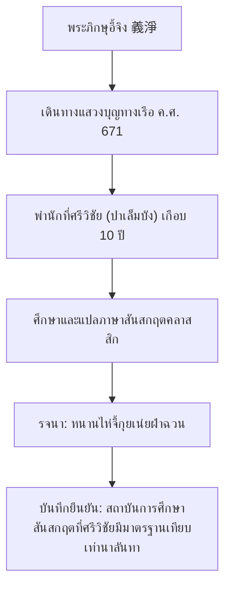
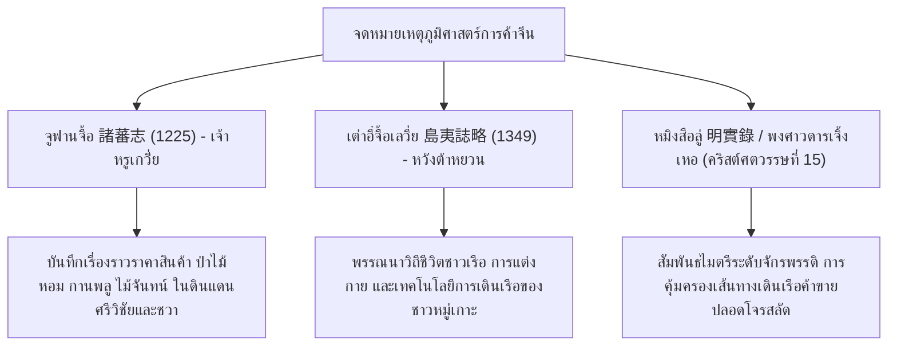

# บทที่ 3: รอยตัดผ่านประวัติศาสตร์จีน-อินเดีย: บันทึกธรรมยาตราและพจนานุกรมจีน-สันสกฤต (Sino-Sanskrit Buddhist Chronicles)

---

## 1. การค้นพบล้ำค่าทางวรรณคดีเปรียบเทียบ: บทงานวิจัยของ Sylvain Lévi (1931)

ในบรรดาผลงานวิชาการที่ถือเป็นทางแยกสำคัญทางระเบียบวิธีวิจัยประวัติศาสตร์เอเชียตะวันออกเฉียงใต้ ไม่มีผลงานชิ้นใดที่ทรงอิทธิพลมากไปกว่าบทความวิจัยชิ้นประวัติศาสตร์ของ **ซิลแว็ง เลวี (Sylvain Lévi)** นักบูรพาคดีศึกษาชาวฝรั่งเศสผู้ยิ่งใหญ่ ตีพิมพ์เมื่อปี ค.ศ. 1931 ในหัวข้อ **"Kouen-Louen et Dvīpāntara"** (คุณหลุน และทวีปานตระ) [^1]

ก่อนหน้าการศึกษาของเลวี นักประวัติศาสตร์ประสบความมืดมนในการระบุความเชื่อมโยงระหว่าง "บันทึกประวัติศาสตร์จีน" ซึ่งกล่าวถึงดินแดนและผู้คนในหนานหยาง (ทะเลใต้) ด้วยคำว่า **"คุณหลุน" (崑崙 / Kouen-Louen)** กับ "จารึกและวรรณกรรมสันสกฤต" ที่ใช้คำว่า **"ทวีปานตระ" (Dvīpāntara)**

เลวีได้ทำการปลดล็อกปริศนานี้โดยการขุดค้นพจนานุกรมแปลภาษาสองภาษาเล่มประวัติศาสตร์ชื่อ **"ฝานยวี่จ๋าหมิง" (梵語雜名 / Fan Yu Tsa Ming - พจนานุกรมสันสกฤต-จีน)** ซึ่งรวบรวมโดยภิกษุชาวเอเชียกลางชื่อ **หลี่เหยียน (Li-yen / 禮言)** ในช่วงปลายคริสต์ศตวรรษที่ 8 ถึงต้นศตวรรษที่ 9 (ยุคราชวงศ์ถัง) [^2]

ในพจนานุกรมดังกล่าว หลี่เหยียนได้ทำการแปลศัพท์คู่อารยธรรมไว้อย่างแจ่มแจ้งปราศจากความคลุมเครือ:

* **ตัวบทดั้งเดิมอักษรจีน-สันสกฤต (Fan Yu Tsa Ming):**
  > द्वीपान्तर (Dvīpāntara) ─── 崑崙 (Kun-lun) [^3]

### 1.1 นัยสำคัญของการจับคู่คำ
การค้นพบว่า **Dvīpāntara = Kun-lun** ส่งผลต่อการตีความประวัติศาสตร์เอเชียตะวันออกเฉียงใต้อย่างมหาศาล:
1. **คุนหลุน (Kun-lun) ในฐานะคำนิยามพื้นที่ทางวัฒนธรรม:** ในพงศาวดารจีนโบราณ คำว่า "คนคุนหลุน" ถูกใช้เรียกประชากรผิวคล้ำ ผมหยิก ที่อาศัยอยู่ทางทะเลใต้ รวมถึงภาษาของพวกเขาก็เรียกว่า "ภาษาคุนหลุน" และเรือสำเภาขนาดใหญ่ที่ใช้เดินสมุทรก็เรียกว่า "เรือคุนหลุน" (*Kun-lun Bo*) การจับคู่นี้แสดงว่า ในโลกทัศน์ของจีนและอินเดียโบราณ ต่างรับรู้ว่าผู้คน ดินแดน และอารยธรรมข้ามสมุทรนี้มี "เอกภาพทางภูมิศาสตร์วัฒนธรรม" เดียวกัน โดยจีนเรียกว่า *คุนหลุน* ส่วนอินเดียเรียกว่า *ทวีปานตระ* [^4]
2. **การก้าวข้ามขอบเขตตำนาน:** ทำให้เราสามารถนำบันทึกทางประวัติศาสตร์ของจีนที่เป็นบันทึกเหตุการณ์จริง (Chronicles) มาตรวจสอบและทานน้ำหนักร่วมกับวรรณกรรมสันสกฤตและจารึกโบราณได้อย่างเป็นวิทยาศาสตร์ประวัติศาสตร์ [^5]

---

## 2. จดหมายเหตุพระอี้จิง (Yijing): พุทธศาสนามหายานและมาตรฐานสันสกฤต ณ ศรีวิชัย

หลักฐานปฐมภูมิที่อธิบายถึงชีวิตทางปัญญา สังคม และศาสนาในน่านน้ำทวีปานตระที่สมบูรณ์ที่สุด ปรากฏในบันทึกการเดินทางธรรมยาตราของ **"พระภิกษุอี้จิง" (Yijing / 義淨)** ภิกษุราชวงศ์ถังผู้เดินทางโดยเรือสำเภาจีนโบราณข้ามทะเลใต้ไปยังอินเดียใน พ.ศ. 1214 (ค.ศ. 671) และได้พำนักศึกษาวิชาการแปลคัมภีร์ที่ **ศรีวิชัย (Shih-li-fo-shih / 室利佛逝)** ณ เมืองปาเล็มบัง เป็นเวลารวมกว่า 10 ปี [^6]

งานรจนาระดับมรดกโลกของท่านมีสองเล่มคือ **"หนานไห่จี้กุยเน่ยฝ่าฉวน" (南海寄歸內法傳 / Record of Buddhist Religion as Practiced in the Southern Archipelago)** และ **"ต้าถังซียี่ฉิวฝ่าเกาสังฉวน" (大唐西域求法高僧傳)** [^7]

### 2.1 บันทึกความรุ่งเรืองของภาษาสันสกฤตและพุทธธรรม
ภิกษุอี้จิงได้บันทึกข้อความเชิงพยานที่น่าทึ่งเกี่ยวกับบรรยากาศการศึกษาในทวีปานตระดังนี้:
* **ตัวบทดั้งเดิมอักษรจีนดั้งเดิม (Classical Chinese):**
  > ...南海諸洲，咸多信佛，咸用梵文，法教流布，與西天無異。佛逝城中，僧眾千餘，學問為懷，並與中國無別。若華僧欲往西天，宜在此留一二年，學習梵語，方可西行... [^8]
* **คำแปลภาษาไทยเชิงวิเคราะห์:**
  > "...ในหมู่เกาะแห่งทะเลใต้ (หนานไห่) นั้น ประชาชนโดยส่วนใหญ่ล้วนเลื่อมใสศรัทธาในพระพุทธศาสนา **พวกเขาต่างนิยมใช้ภาษาสันสกฤต (梵文 - ฝานเหวิน) ในการศึกษาเล่าเรียน** พระธรรมวินัยได้เผยแผ่ไปทั่วดินแดนนี้โดยไม่มีความแตกต่างจากชมพูทวีป (西天) เลย... ณ นครโฟชือ (ศรีวิชัย) มีพระภิกษุจำพรรษาอยู่กว่าหนึ่งพันรูป ทุกรูปมุ่งมั่นศึกษาพระธรรมวินัยและคัมภีร์วิชาการต่างๆ โดยปฏิบัติกิจไม่ต่างจากภิกษุในแผ่นดินอินเดียเลย **หากภิกษุชาวจีนรูปใดประสงค์จะเดินทางไปแสวงบุญ ณ ชมพูทวีป สมควรที่จะพำนักศึกษาเล่าเรียนภาษาสันสกฤต ณ นครศรีวิชัยนี้เป็นเวลา 1-2 ปีเสียก่อน เพื่อความพร้อมก่อนเดินทางต่อไปยังตะวันตก**..." [^9]

### 2.2 บทวิเคราะห์ความลึกซึ้งทางวัฒนธรรม
บันทึกของอี้จิงทำหน้าที่ยืนยันประเด็นประวัติศาสตร์ที่สำคัญยิ่งยวด:
1. **ศักยภาพด้านวิชาการของทวีปานตระ:** ทวีปานตระไม่ใช่เพียงผู้รับวัฒนธรรมปลายน้ำ (Passive recipient) แต่เป็น **"สถาบันอุดมศึกษาภาษาสันสกฤตและศาสนวิทยา"** ที่มีคุณภาพระดับนานาชาติเทียบเท่าสถาบันการศึกษาชั้นนำในอินเดีย เช่น สถาบันนาลันทา ภิกษุชาวอินเดีย เช่น **พระศากยกีรติ (Śākyakīrti)** ปราชญ์พุทธมหายานชื่อดัง ก็พำนักและรจนางานในศรีวิชัย [^10]
2. **ความเชื่อมโยงสองทาง:** แสดงให้เห็นว่าน่านน้ำเอเชียตะวันออกเฉียงใต้ในคริสต์ศตวรรษที่ 7 เป็นศูนย์รวมวิชาการระดับโลกที่เชื่อมประสานเส้นทางธรรมยาตราระหว่างจีน อินเดีย และหมู่เกาะเข้าด้วยกัน

---

## 3. บันทึกการเดินทางในยุคเริ่มแรก: จดหมายเหตุภิกษุฟ่าเสียน (Faxian)

ก่อนหน้าพระอี้จิงกว่าสองศตวรรษ **"พระภิกษุฟ่าเสียน" (Faxian / 法顯)** ได้จารึกร่องรอยประวัติศาสตร์ในขากลับจากการจาริกแสวงบุญในอินเดียทางเรือ โดยเรือสำเภาของท่านประสบภัยมรสุมจนต้องแวะพักหลบภัย ณ ดินแดนเกาะชวาหรือสุมาตรา ซึ่งท่านเรียกว่า **"เหย่ผอ提" (Ye-po-ti - ตรงกับ ยวทวีป / Yavadvīpa)** ในปี ค.ศ. 414 เป็นเวลา 5 เดือน [^11]

ในบันทึก **"ฝอจว๋อจี้" (佛國記 / A Record of Buddhistic Kingdoms)** ฟ่าเสียนได้บันทึกสภาพสังคมของชวาโบราณไว้ว่า:
> "...ในดินแดนแห่งนี้ ศาสนาพราหมณ์แบบฮินดูและลัทธิความเชื่อดั้งเดิมมีความรุ่งเรืองและหยั่งรากลึกอย่างยิ่ง ทว่าพระพุทธศาสนายังไม่เป็นที่เผยแผ่และแพร่หลายเท่าใดนัก..." [^12]

ข้อความสั้นๆ นี้มีคุณค่ามหาศาลในเชิงประวัติศาสตร์พัฒนาการทางศาสนา เนื่องจากยืนยันว่าศาสนาพราหมณ์คลาสสิก (ไศวะและไวษณพ) คือคลื่นวัฒนธรรมก้อนแรกจากอินเดียที่หยั่งรากในทวีปานตระตั้งแต่ช่วงคริสต์ศตวรรษที่ 4-5 (ซึ่งสอดคล้องตรงกันอย่างสมบูรณ์แบบกับช่วงเวลาการสร้างจารึกกูไตของพระเจ้ามูลวรมันในกาลีมันตัน และจารึกตูกูของพระเจ้าปูรณวรมันในชวาตะวันตก) ก่อนที่พุทธศาสนามหายานจะเข้ามามีบทบาทนำในศตวรรษที่ 7-8 [^13]

---

## 4. บันทึกเศรษฐกิจการค้าและเครื่อง Spice ในสมัยซ่ง หยวน และหมิง

เมื่อประวัติศาสตร์เคลื่อนเข้าสู่ยุคกลางของจีน (คริสต์ศตวรรษที่ 10-15) บันทึกของจีนต่อทวีปานตระได้แปรเปลี่ยนจากบันทึกศาสนาไปสู่ **"จดหมายเหตุเศรษฐกิจการเดินเรือและภูมิศาสตร์การค้า"** ที่มีความสมบูรณ์อย่างลึกซึ้ง

### 4.1 จดหมายเหตุจูฟานจื้อ (Zhū Fān Zhì - 諸蕃志) ของเจ้าหรูเกวี่่ย (ค.ศ. 1225)
แต่งขึ้นโดย **เจ้าหรูเกวี่่ย (Zhao Rugua)** ข้าราชการด่านศุลกากรเมืองเฉวียนโจว (Quanzhou) ในสมัยราชวงศ์ซ่งใต้ บันทึกเล่มนี้รวบรวมรายละเอียดของอาณาจักรต่างชาติ สินค้านำเข้า และภูมิศาสตร์ทางทะเล [^14]

* **รายละเอียดการอ้างอิงเครื่องเทศ:** เจ้าหรูเกวี่่ยบันทึกรายชื่อประเทศต่างๆ ในหมู่เกาะ ได้แก่ **ซานฝอฉี (San-fo-qi - ศรีวิชัย)** และ **เศอผอ (She-po - ชวา)** โดยพรรณนาถึงระบบการแลกเปลี่ยนสินค้าที่มีกานพลู จันทน์เทศ การบูร และยาจีนนำเข้าอย่างหัวยาข้าวเย็น (*Chopachini*) ซึ่งแสดงให้เห็นว่าระบบนิเวศน์ทางเศรษฐกิจของทวีปานตระยังคงทำหน้าที่ส่งออกเครื่อง spice และป่าไม้หอมหล่อเลี้ยงตลาดจีนอย่างต่อเนื่อง [^15]

### 4.2 จดหมายเหตุเต่าอี๋จื้อเลวี่ย (Daoyi Zhilue - 島夷誌略) ของหวังต้าหยวน (ค.ศ. 1349)
เขียนขึ้นโดยพ่อค้าเดินเรือชาวจีนชื่อ **หวังต้าหยวน (Wang Dayuan)** ในสมัยราชวงศ์หยวน ซึ่งท่านได้เดินทางโดยเรือสำเภาไปเห็นสถานที่จริงในเอเชียตะวันออกเฉียงใต้และมหาสมุทรอินเดีย [^16]

* **ภาพสะท้อนชาติพันธุ์วรรณนาโบราณ:** หวังต้าหยวนพรรณนาวิถีชีวิตผู้คนในน่านน้ำชวา-มลายูตอนปลายยุคศรีวิชัย-ต้นมัชปาหิต บันทึกเรื่องการทำนาเกลือ การทอผ้าจากใยพืชดั้งเดิม และความชำนาญของกลาสีเรือชาวเกาะในการนำร่องฝ่าพายุมรสุมใต้ สะท้อนว่าโครงสร้างสังคมภายในทวีปานตระมีความซับซ้อนและมีกำลังการผลิตทางเศรษฐกิจที่มั่นคง [^17]

### 4.3 พงศาวดารราชวงศ์หมิง (Ming Shi-lu - 明實錄) และกองเรืออภิมหาอำนาจของเจิ้งเหอ
ในช่วงต้นคริสต์ศตวรรษที่ 15 กองเรือขนาดใหญ่ภายใต้การนำของ **"แม่ทัพเจิ้งเหอ" (Zheng He / 鄭和)** ได้เดินทางมาเยือนน่านน้ำทวีปานตระถึง 7 ครั้ง บันทึกในพงศาวดารราชวงศ์หมิงและบันทึกของอาลักษณ์กลาสีเรือ เช่น **หม่าฮวน (Ma Huan)** ในหนังสือ *หยิงไห่เซิ่นหลาน* (Yingya Shenglan - 瀛涯勝覽) ได้ให้ข้อมูลรายละเอียดสูงสุดเกี่ยวกับโครงสร้างการปกครอง คดีกฎหมาย การชั่งตวงวัด และพืชพรรณธรรมชาติของเกาะชวายุคมัชปาหิตตอนปลาย ซึ่งเป็นการปิดฉากและสืบสานมรดกความทรงจำของจีนต่อดินแดนทวีปานตระในฐานะพื้นที่ข้ามสมุทรที่สลักสำคัญที่สุดของโลกตะวันออก [^18]

หลักฐาน Sino-Sanskrit ทั้งหมดนี้จึงเป็นเครื่องชี้วัดอันแจ่มชัดว่า "ทวีปานตระ" คือประจักษ์พยานแห่งการไหลบ่าและหลอมรวมกันระหว่างภูมิปัญญาจากฝั่งอินเดียและระบบเศรษฐกิจบันทึกจากฝั่งจีน โดยมีน่านน้ำและผู้คนชาวเอเชียใต้ทำหน้าที่เป็นทั้งสะพานและเบ้าหลอมแห่งอารยธรรมข้ามคาบสมุทรนี้ให้เติบโตอย่างมั่นคงสืบไป

---

## 📌 เชิงอรรถอ้างอิงบทที่ 3

[^1]: Lévi, S. (1931). "Kouen-Louen et Dvīpāntara". *Bijdragen tot de Taal-, Land- en Volkenkunde*, 88(1), pp. 621-627.
[^2]: Bagchi, P. C. (1929). *Deux lexiques sanskrit-chinois: Fan Yu Tsa Ming de Li-yen*. Paris: Librairie Orientaliste Paul Geuthner, Tome I, pp. 12-18.
[^3]: Li-yen. (c. 800 CE). *Fān Yǔ Zá Míng* (梵語雜名). Manuscript recovered from Dunhuang. Section on Geographical Names, Entry 43.
[^4]: Pelliot, P. (1904). "Deux itinéraires de Chine en Inde à la fin du VIIIe siècle". *Bulletin de l'École française d'Extrême-Orient*, 4(1), pp. 131-385.
[^5]: Wheatley, P. (1961). *The Golden Khersonese*. Kuala Lumpur: University of Malaya Press, pp. 268-272.
[^6]: Yijing. (1896). *A Record of the Buddhist Religion as Practiced in India and the Malay Archipelago (A.D. 671-695)*. Translated by J. Takakusu. Oxford: Clarendon Press, pp. xvii-xxii.
[^7]: Yijing. (1986). *Biographies of Eminent Monks in the Tang Dynasty Who Went to the Western Regions to Seek the Law*. Translated by Latika Lahiri. New Delhi: Munshiram Manoharlal, pp. 45-52.
[^8]: Yijing. (713 CE). *Nānhǎi Jìguī Nèifǎ Chuán* (南海寄歸內法傳). Taisho Tripitaka, Vol. 54, No. 2125, Canto I.
[^9]: translation based on Takakusu, J. (1896). Ibid, p. 34.
[^10]: Seno, S. (1975). "The Chinese accounts of Srivijaya". *Journal of Southeast Asian History*, 6(2), pp. 112-118.
[^11]: Faxian. (1886). *A Record of Buddhistic Kingdoms: Being an Account by the Chinese Monk Fâ-Hien of his Travels in India and Ceylon (A.D. 399-414)*. Translated by James Legge. Oxford: Clarendon Press, pp. 111-115.
[^12]: Faxian. (1886). Ibid, Chapter XL, p. 113.
[^13]: Coedès, G. (1968). *The Indianized States of Southeast Asia*. Honolulu: East-West Center Press, pp. 50-51.
[^14]: Hirth, F., & Rockhill, W. W. (1911). *Chau Ju-Kua: His work on the Chinese and Arab Trade in the twelfth and thirteenth Centuries, entitled Chu-fan-chï*. St. Petersburg: Imperial Academy of Sciences, pp. 1-10.
[^15]: Hirth, F., & Rockhill, W. W. (1911). Ibid, pp. 60-64.
[^16]: Rockhill, W. W. (1915). "Notes on the Relations and Trade of China with the Eastern Archipelago and the Coast of the Indian Ocean during the Fourteenth Century". *T'oung Pao*, Second Series, Vol. 16, No. 1, pp. 61-159.
[^17]: Wang Dayuan. (1349). *Dǎoyí Zhìlüè* (島夷誌略). Annotated translation by Geoff Wade. Singapore: NUS Press (forthcoming).
[^18]: Wade, G. (2005). *Southeast Asia in the Ming Shi-lu: An Open Access Resource*. Singapore: Asia Research Institute, National University of Singapore.

---

## 🗂️ แผนการนำทางโครงการวิจัย (Research Navigation Menu)
* **บทนำ (Introduction):** [01_introduction.md](01_introduction.md) - สุวรรณภูมิ สุวรรณทวีป ทวีปานตระ แดนกานพลู และนิรุกติศาสตร์เชิงประวัติศาสตร์วิทยา
* **บทที่ 1 (Sanskrit Sources):** [02_classical_sanskrit_sources.md](02_classical_sanskrit_sources.md) - รฆุวงศ์ 6.57 ปุราณะ อายุรเวทภาวประกาศ และจารึกกูไต/ตารุมานคร/นาลันทา
* **บทที่ 2 (Tamil Sources):** [03_classical_tamil_sources.md](03_classical_tamil_sources.md) - ปัตตินัปปาลัย มณีเมขไล จารึกตานโจร์ 1025 และแผ่นจารึกเลย์เดน
* **บทที่ 3 (Sino-Sanskrit Sources):** [04_sino_sanskrit_monk_records.md](04_sino_sanskrit_monk_records.md) - Sylvain Lévi (1931) พจนานุกรมฝานยวี่จ๋าหมิง และจดหมายเหตุอี้จิง/ฟ่าเสียน
* **บทที่ 4 (Greco-Roman & Arabic Sources):** [05_classical_western_and_arabic_sources.md](05_classical_western_and_arabic_sources.md) - Periplus, Ptolemy, Pliny, Ibn Khordadbeh, Al-Masudi และ Zābaj
* **บทที่ 5 (Javanese & Western Historiography):** [06_javanese_and_western_historiography.md](06_javanese_and_western_historiography.md) - จักรวาฬมณฑลทวีปานตระ คำปฏิญาณปาลาปา และประวัติศาสตร์นิพนธ์ตะวันตก
* **สารบบบรรณานุกรม (Annotated Bibliography):** [07_annotated_bibliography.md](07_annotated_bibliography.md) - คลังข้อมูลอ้างอิงเชิงวิเคราะห์ 160+ รายการ

