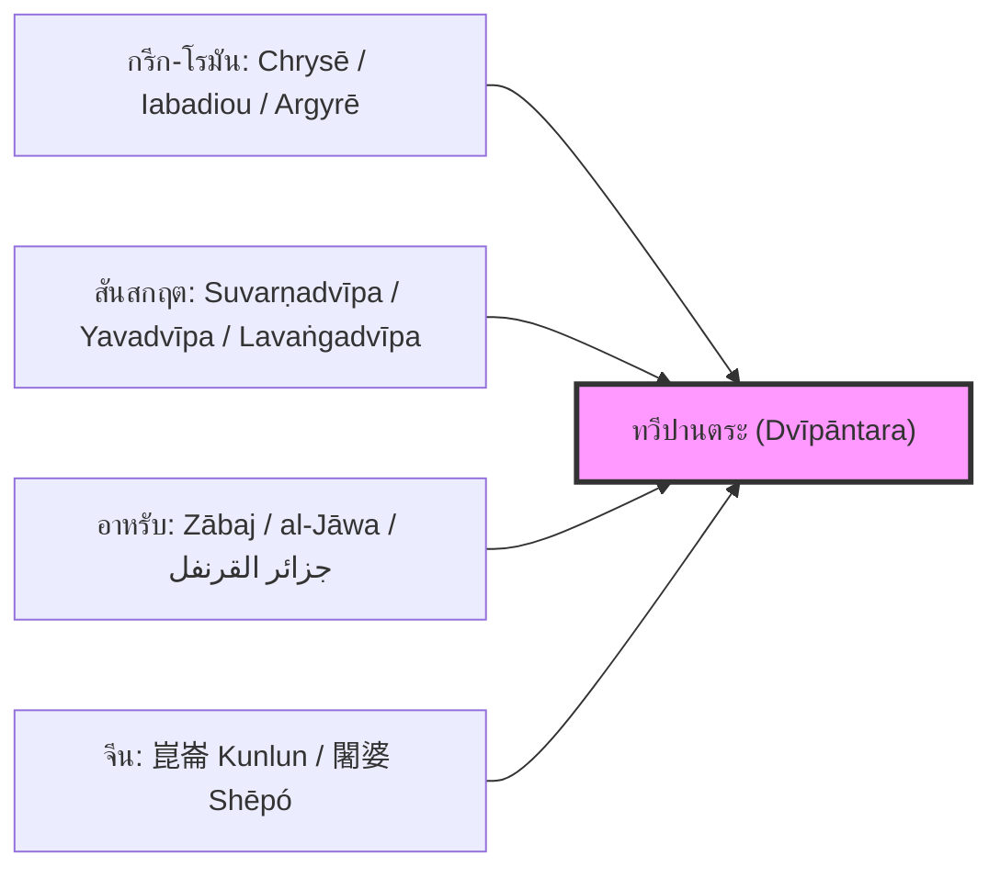

# บทที่ 4: หลักฐานจากโลกตะวันตกคลาสสิกและอาหรับ-เปอร์เซียยุคกลาง (Classical Western and Mediaeval Arabic-Persian Sources)

---

## 1. แหล่งข้อมูลปฐมภูมิกรีก-โรมัน (Greco-Roman Primary Sources)

ในขณะที่โลกอินเดียรับรู้ดินแดนข้ามสมุทรผ่านมโนทัศน์ *ทวีปานตระ* และ *สุวรรณทวีป* และโลกจีนรู้จักน่านน้ำเดียวกันในนาม *คุนหลุน* (崑崙) นั้น อารยธรรมกรีก-โรมันแห่งทะเลเมดิเตอร์เรเนียนก็ได้สร้างชุดความรู้ภูมิศาสตร์อันเป็นอิสระขึ้นอีกสายหนึ่ง โดยอาศัยเส้นทางการค้าเครื่องเทศข้ามมหาสมุทรอินเดียเป็นเส้นเลือดหล่อเลี้ยงข้อมูล การวิเคราะห์เอกสารปฐมภูมิเหล่านี้ตามลำดับเวลาจะเผยให้เห็นว่า ชาวตะวันตกคลาสสิกมีความรู้เรื่องหมู่เกาะทวีปานตระตั้งแต่ศตวรรษที่ 1 แห่งคริสตกาลแล้ว แม้จะมีความคลุมเครือในรายละเอียดปลีกย่อยอยู่บ้าง

### 1.1 คู่มือเดินเรือเพริพลัสแห่งทะเลเอริเธรียน (Περίπλους τῆς Ἐρυθρᾶς Θαλάσσης, ป. ค.ศ. 40–70)

เอกสารนิรนามชิ้นสำคัญที่สุดของพ่อค้าชาวกรีกในยุคจักรวรรดิโรมันตอนต้นคือ **Periplus Maris Erythraei** (Περίπλους τῆς Ἐρυθρᾶς Θαλάσσης - คู่มือเดินเรืออ้อมทะเลเอริเธรียน) รจนาขึ้นโดยพ่อค้าชาวอียิปต์-กรีกนิรนามในราว ค.ศ. 40–70 คู่มือฉบับนี้ทำหน้าที่เปรียบเสมือนไดเร็กทอรีการค้าทางทะเลที่ระบุสินค้า เส้นทาง และท่าเรือสำคัญตั้งแต่ทะเลแดงจนถึงชายฝั่งตะวันออกของอินเดีย [^1]

ในส่วนท้ายของเอกสาร (บทที่ 63–66) ผู้เขียนได้กล่าวถึงดินแดนเหนือขอบฟ้าตะวันออกของอินเดียว่า:

> **ตัวบทกรีกดั้งเดิม (§63):**
> μετὰ δὲ ταύτην [Βαρυγάζα] ἡ ἠπειρῶτις ἐκτείνεται πρὸς βοῤῥᾶν· **ἡ δὲ Χρυσῆ** ἐσχάτη ἐστὶ πρὸς ἀνατολάς... [^2]

คำว่า **Χρυσῆ (Chrysē)** แปลว่า "ดินแดนทองคำ" ซึ่งนักวิชาการตั้งแต่ Lassen (1858) ถึง Wheatley (1961) ต่างเห็นพ้องว่าตรงกับมโนทัศน์สันสกฤตว่า *Suvarṇabhūmi* หรือ *Suvarṇadvīpa* อันหมายถึงคาบสมุทรมลายูและหมู่เกาะทวีปานตระ [^3] สินค้าที่เพริพลัสระบุว่าส่งออกจากดินแดนตะวันออก ได้แก่ **นาร์ด** (*νάρδος / nardos* - สมุนไพรกลิ่นหอม), **มาลาบัธรอน** (*μαλάβαθρον / malabathron* - ใบอบเชยป่า), **กระดองเต่า** (*χελώνη*), และ **ผ้ามัสลิน** (*σινδόνες*) ล้วนเป็นสินค้าที่ต้องผ่านเครือข่ายเมืองท่าในทวีปานตระก่อนจะถึงมือผู้ซื้อชาวโรมัน [^4]

### 1.2 พลินีผู้อาวุโส, ธรรมชาติวิทยา (Naturalis Historia, ป. ค.ศ. 77)

**กายอุส พลินิอุส เซคุนดุส (Gaius Plinius Secundus)** หรือพลินีผู้อาวุโส ได้รวบรวมข้อมูลภูมิศาสตร์และพฤกษศาสตร์จากแหล่งข้อมูลหลายสิบแหล่งไว้ในผลงานสารานุกรมมหึมาเรื่อง **Naturalis Historia** (ป. ค.ศ. 77) ซึ่งประกอบด้วย 37 เล่ม ในเล่มที่ 12 (Liber XII) พลินีได้กล่าวถึงเครื่องเทศชนิดหนึ่งที่เรียกว่า **Caryophyllon** (กรีก: *καρυόφυλλον*) อันหมายถึงกานพลู โดยท่านบันทึกไว้ว่า:

> **ตัวบทละตินดั้งเดิม (NH XII.30):**
> *"Est et in India piperis similitudine, quod vocatur **caryophyllon**, grandius fragiliusque. Tradunt in Indiae nemore gigni."* [^5]

แม้พลินีจะระบุว่ากานพลู "เกิดในป่าของอินเดีย" (*in Indiae nemore*) แต่ในความเป็นจริงทางพฤกษศาสตร์ประวัติศาสตร์ กานพลูเป็นพืชเฉพาะถิ่น (endemic) ของหมู่เกาะโมลุกกะในทวีปานตระเท่านั้น ข้อคลาดเคลื่อนนี้แสดงให้เห็นว่าพลินีได้รับข้อมูลผ่านพ่อค้าคนกลางหลายทอดจนทำให้ความรู้เรื่องแหล่งกำเนิดที่แท้จริงถูกบิดเบือนไป [^6] คำว่า *Caryophyllon* เองก็มีรากศัพท์ที่น่าสนใจอย่างยิ่ง — สันนิษฐานว่าสืบเนื่องจากรากศัพท์ดราวิเฑียนว่า *kirāmpu* (கிராம்பு) ผ่านภาษาทมิฬและปรากฤต ก่อนจะเข้าสู่ภาษากรีก [^7]

นอกจากนี้ พลินียังกล่าวถึง **Chryse** (χρυσῆ - เกาะทองคำ) และ **Argyre** (ἀργυρῆ - เกาะเงิน) ในเล่มที่ 6 (*NH* VI.80) ว่าตั้งอยู่ในมหาสมุทรอินเดียตะวันออก ซึ่งตรงกับ *Suvarṇadvīpa* (สุวรรณทวีป) และ *Rūpyadvīpa* (รูปยกทวีป) ในวรรณกรรมสันสกฤตทุกประการ [^8]

### 1.3 เคลาดิอุส ปโตเลมี, ภูมิศาสตร์ (Geographia, ป. ค.ศ. 150)

ผลงานที่ทรงอิทธิพลที่สุดต่อวงวิชาการตะวันตกในเรื่องภูมิศาสตร์เอเชียตะวันออกเฉียงใต้โบราณคือ **Γεωγραφικὴ Ὑφήγησις (Geographia)** ของ **เคลาดิอุส ปโตเลมี (Κλαύδιος Πτολεμαῖος)** นักดาราศาสตร์และนักภูมิศาสตร์ชาวกรีก-อียิปต์แห่งเมืองอเล็กซานเดรีย ในหนังสือเล่มที่ 7 (Book VII) ปโตเลมีได้ทำสิ่งที่ไม่เคยมีนักวิชาการตะวันตกคนใดทำมาก่อน คือ **กำหนดพิกัดละติจูด-ลองจิจูด** ให้กับสถานที่ต่างๆ ในดินแดนหมู่เกาะทวีปานตระ [^9]

สถานที่สำคัญสามแห่งที่ปโตเลมีระบุไว้ ได้แก่:

1. **Χρυσῆ Χερσόνησος (Chrysē Chersonēsos)** — "คาบสมุทรทองคำ" ตรงกับคาบสมุทรมลายู (Malay Peninsula) ปโตเลมีกำหนดพิกัดไว้ที่ประมาณละติจูด 2°–4° เหนือ ซึ่งสอดคล้องกับตำแหน่งจริงของแหลมมลายู [^10]
2. **Ἰαβαδίου (Iabadiou)** — ถอดรูปจากสันสกฤต *Yavadvīpa* (ยวทวีป = เกาะชวา) ปโตเลมีระบุว่าเกาะนี้ "อุดมไปด้วยทองคำ" (*χρυσοφόρος* / *chrysophoros*) และมีเมืองหลวงชื่อ *Ἀργυρή* (Argyrē = เมืองเงิน) — ซึ่งเป็นการบันทึกชื่อเกาะชวาในตำราตะวันตกเป็นครั้งแรก [^11]
3. **Σατυρῶν νῆσοι (Satyrōn nēsoi)** — "หมู่เกาะแห่งซาเทียร์" ซึ่งนักวิชาการบางท่าน เช่น Gerini (1909) สันนิษฐานว่าอาจหมายถึงหมู่เกาะนิโคบาร์หรือหมู่เกาะในอ่าวเบงกอล [^12]

ข้อสังเกตที่สลักสำคัญคือ ปโตเลมีใช้รูปคำ *Iabadiou* ซึ่งเป็นรูปแผลงทางสัทวิทยาจากสันสกฤต *Yavadvīpa* อย่างปราศจากข้อสงสัย แสดงว่าพ่อค้าชาวอินเดียเป็นผู้ถ่ายทอดชื่อสถานที่นี้ให้แก่ชาวกรีกโดยตรงผ่านเส้นทางสมุทรวานิชย์ ปรากฏการณ์นี้ยืนยันว่าเครือข่ายข้อมูลภูมิศาสตร์ของทวีปานตระไหลจากอินเดียสู่โลกเมดิเตอร์เรเนียนอย่างต่อเนื่อง [^13]

### 1.4 คอสมัส อินดิโคเพลอุสเตส, คริสเตียน โทโพกราฟี (ป. ค.ศ. 550)

ในคริสต์ศตวรรษที่ 6 พ่อค้าและนักเดินเรือชาวกรีก-ไบแซนไทน์ชื่อ **คอสมัส อินดิโคเพลอุสเตส (Κοσμᾶς Ἰνδικοπλεύστης)** — ซึ่งฉายานามแปลว่า "ผู้แล่นเรือไปอินเดีย" — ได้รจนางานเรื่อง **Χριστιανικὴ Τοπογραφία (Christian Topography)** บันทึกข้อมูลเส้นทางการค้าข้ามสมุทรในมุมมองของนักเทววิทยาคริสเตียน ในตัวบทของคอสมัส ปรากฏชื่อดินแดนหนึ่งที่เรียกว่า **Τζινίστα (Tzinista)** หรือ **Τζινίτζα (Tzinitza)** ซึ่งตามธรรมเนียมดั้งเดิมมักตีความว่าหมายถึงจีน [^14]

อย่างไรก็ตาม **ดร. ตรงใจ หุตางกูร** นักวิจัยจากศูนย์มานุษยวิทยาสิรินธร ได้เสนอการตีความใหม่ในงานวิจัยปี พ.ศ. 2565 (ค.ศ. 2022) เรื่อง *"แดนกานพลูของคอสมัส"* ว่า *Tzinitza* ในบริบทของเส้นทางการค้ากานพลูและไหมนั้น ไม่ได้หมายถึงจีนแผ่นดินใหญ่เสมอไป หากแต่ควรตีความว่าเป็น **"เครือข่ายเมืองท่าในทวีปานตระ"** ซึ่งทำหน้าที่เป็นจุดรวบรวมและกระจายกานพลูก่อนส่งต่อไปยังตลาดโรมัน-ไบแซนไทน์ การตีความนี้ได้รับการสนับสนุนจากข้อเท็จจริงที่ว่าคอสมัสระบุสินค้าจาก *Tzinitza* ว่ารวมถึงกานพลู (*κάρυον* / *karyon*) ซึ่งเป็นสินค้าที่ผลิตได้เฉพาะในหมู่เกาะโมลุกกะเท่านั้น มิใช่จีน [^15]

---

## 2. แหล่งข้อมูลปฐมภูมิอาหรับ-เปอร์เซีย (Arabic-Persian Primary Sources)

ภายหลังการล่มสลายของจักรวรรดิโรมันตะวันตก ความรู้ภูมิศาสตร์ว่าด้วยทวีปานตระได้รับการสืบทอดและขยายขอบเขตอย่างมหาศาลโดยนักเดินเรือ พ่อค้า และนักภูมิศาสตร์ในโลกอิสลาม ตัวบทอาหรับ-เปอร์เซียเหล่านี้ให้ข้อมูลที่ละเอียดและเป็นระบบกว่าแหล่งข้อมูลกรีก-โรมันอย่างเห็นได้ชัด เนื่องจากพ่อค้ามุสลิมเดินทางไปถึงหมู่เกาะอินโดนีเซียจริงด้วยตนเอง ไม่ใช่รับข้อมูลผ่านคนกลาง

### 2.1 อิบน์ คุรดาซบะฮ์, กิตาบ อัล-มะซาลิก วัล-มะมาลิก (كتاب المسالك والممالك, ป. ค.ศ. 846)

**อิบน์ คุรดาซบะฮ์ (ابن خرداذبه / Ibn Khordādbeh)** นายไปรษณีย์สูงสุดของแคว้นญิบาลในจักรวรรดิอับบาซียะฮ์ ได้รจนาผลงานเรื่อง **"กิตาบ อัล-มะซาลิก วัล-มะมาลิก"** (كتاب المسالك والممالك - ตำราว่าด้วยเส้นทางและอาณาจักร) ซึ่งถือเป็นตำราภูมิศาสตร์อาหรับฉบับแรกที่มีการจัดระบบข้อมูลอย่างเป็นวิทยาศาสตร์ ในตัวบทนี้ อิบน์ คุรดาซบะฮ์ กล่าวถึงอาณาจักรทางทะเลอันยิ่งใหญ่ชื่อ **ซาบัจ (الزابج / Zābaj)** ว่าเป็นศูนย์กลางอำนาจของหมู่เกาะทะเลใต้ [^16]

> **ตัวบทอาหรับดั้งเดิม:**
> ومن الزابج إلى الصين مسيرة شهر في البحر... وفي الزابج القرنفل والصندل والكافور... وملكها يسمى المهاراجا
> *"จากซาบัจถึงจีนใช้เวลาเดินทางทางทะเลหนึ่งเดือน... ในซาบัจมีกานพลู (قرنفل / Qaranful) ไม้จันทน์ (صندل) และการบูร (كافور / Kāfūr)... กษัตริย์ของดินแดนนั้นมีพระนามว่า มะหาราชา (المهاراجا)"* [^17]

การระบุว่ากษัตริย์ซาบัจทรงพระนามว่า *มะหาราชา* (สันสกฤต: Mahārāja) เป็นหลักฐานสำคัญที่เชื่อมโยงซาบัจเข้ากับอาณาจักรศรีวิชัย-ชวาในระบบทวีปานตระ ส่วนสินค้าที่ระบุ — กานพลู การบูร ไม้จันทน์ — ล้วนเป็นสินค้าเฉพาะถิ่นของหมู่เกาะอินโดนีเซียทั้งสิ้น

### 2.2 สุลัยมาน อัล-ตาญิร และอบู ซัยด์ อัล-สีราฟี, สิลสิลัต อัล-ตะวารีค (سلسلة التواريخ, ป. ค.ศ. 851/916)

บันทึกของ **สุลัยมาน อัล-ตาญิร** (Sulaymān al-Tājir - สุลัยมานพ่อค้า) ซึ่งรจนาขึ้นราว ค.ศ. 851 และได้รับการขยายความโดย **อบู ซัยด์ อัล-สีราฟี** ราว ค.ศ. 916 ถือเป็นบันทึกเชิงประจักษ์ (Eyewitness account) ของพ่อค้ามุสลิมผู้เดินทางไปถึงดินแดนซาบัจด้วยตนเอง [^18]

ตัวบทบรรยายถึง *"กษัตริย์ซาบัจ" (ملك الزابج)* ว่าเป็นประมุขผู้ทรงอำนาจเหนือช่องแคบมลายู ทรงปกครองราชอาณาจักรที่กว้างใหญ่ไพศาลจนใช้เวลาเดินทางหลายวันกว่าจะผ่านพ้น มีกองเรือรบขนาดมหึมา และทรงมีพระราชอำนาจในการเก็บภาษีจากเรือค้าขายทุกลำที่ผ่านน่านน้ำของพระองค์ ข้อมูลเหล่านี้สอดคล้องอย่างยิ่งกับภาพลักษณ์ของจักรวรรดิทะเล *ศรีวิชัย-ชวา* ที่ปรากฏในจารึกสันสกฤตและบันทึกจีน [^19]

### 2.3 อัล-มะซูดี, มุรูจ อัล-ซะฮับ วะ มะอาดิน อัล-เญาฮัร (مروج الذهب ومعادن الجوهر, ป. ค.ศ. 947)

**อบุล-หะสัน อาลี อิบน์ อัล-หุสัยน์ อัล-มะซูดี (المسعودي / al-Masʿūdī)** นักประวัติศาสตร์และนักภูมิศาสตร์ผู้ยิ่งใหญ่ที่ได้รับสมญานามว่า "เฮโรโดตัสแห่งโลกอาหรับ" ได้รจนาผลงานอันอมตะเรื่อง **"มุรูจ อัล-ซะฮับ วะ มะอาดิน อัล-เญาฮัร"** (مروج الذهب ومعادن الجوهر - ทุ่งทองคำและเหมืองอัญมณี) ซึ่งให้ข้อมูลเกี่ยวกับดินแดนซาบัจอย่างละเอียดที่สุดในบรรดาตัวบทอาหรับทั้งหมด [^20]

> **ตัวบทอาหรับดั้งเดิม:**
> ومملكة الزابج... تحيط بها البحار من جميع جهاتها... ولا يمكن لأحد أن يحصي عدد جزائرها... وبها القرنفل والصندل والعود والكافور... وذهب كثير
> *"อาณาจักรซาบัจ... มีทะเลล้อมรอบทุกด้าน... ไม่มีผู้ใดสามารถนับจำนวนหมู่เกาะได้หมด... ในดินแดนนั้นมีกานพลู (القرنفل) ไม้จันทน์ (الصندل) ไม้กฤษณา (العود) การบูร (الكافور)... และทองคำมากมาย"* [^21]

อัล-มะซูดียังบันทึกว่ากษัตริย์ซาบัจทรงมีอำนาจเหนือน่านน้ำทั้งหมดระหว่างอินเดียกับจีน ทรงควบคุมเส้นทางเดินเรือสำคัญทั้งหมด และทรงมีกองทัพเรือที่แข็งแกร่ง — คำพรรณนาที่สอดคล้องกับบทบาทของศรีวิชัยในฐานะ *thalassocracy* (รัฐมหาอำนาจทางทะเล) แห่งทวีปานตระอย่างสมบูรณ์แบบ [^22]

### 2.4 อัล-อิดรีซี, กิตาบ นุซฮัต อัล-มุชตาก (كتاب نزهة المشتاق, ค.ศ. 1154)

**มุหัมมัด อัล-อิดรีซี (الإدريسي / al-Idrīsī)** นักภูมิศาสตร์ชาวอาหรับผู้รจนาแผนที่โลกอันลือลั่น (*Tabula Rogeriana*) ตามพระราชโองการของพระเจ้ารอเจอร์ที่ 2 แห่งซิซิลี ได้กล่าวถึง **ชาวะฮ์ (جاوة / Jāwa)** และหมู่เกาะเครื่องเทศโดยระบุตำแหน่งไว้ในแผนที่ส่วนที่ 10 ของภาคที่ 1 (First Climate, Tenth Section) อัล-อิดรีซีบรรยายว่าเกาะชาวะฮ์มีป่าไม้หอมหนาแน่น มีการทำเหมืองทองคำ และมีท่าเรือค้าขายที่คับคั่ง [^23]

แผนที่ของอัล-อิดรีซีแม้จะมีสัดส่วนผิดเพี้ยนตามข้อจำกัดของยุคสมัย แต่ก็เป็นครั้งแรกที่นักวิชาการมุสลิมพยายามจัดตำแหน่งหมู่เกาะทวีปานตระลงในแผนที่โลกอย่างเป็นระบบ แสดงว่าดินแดนแห่งนี้มีความสำคัญเพียงพอจนปรากฏในแผนที่ระดับราชสำนัก [^24]

### 2.5 อิบน์ บัฏฏูเฏาะฮ์, ริหละฮ์ (رحلة, ป. ค.ศ. 1355)

**อิบน์ บัฏฏูเฏาะฮ์ (ابن بطوطة / Ibn Baṭṭūṭa)** นักเดินทางชาวมัฆริบีผู้ยิ่งใหญ่ที่สุดในโลกอิสลาม ได้เดินทางมาเยือนดินแดน **อัล-ชาวะฮ์ (الجاوة / al-Jāwa)** — ซึ่งในบริบทของท่านหมายถึงเกาะสุมาตรา — ราวปี ค.ศ. 1345–1346 ในบันทึก *ริหละฮ์* ของท่านปรากฏคำบรรยายโดยตรงเกี่ยวกับ **สุลต่านแห่งสมุทรา-ปาไซ (سمطرة / Samudra)** ซึ่งเป็นรัฐอิสลามแรกในหมู่เกาะอินโดนีเซีย [^25]

> **ตัวบทอาหรับดั้งเดิม:**
> ثم وصلنا إلى بلاد الجاوة... وملكها مسلم يسمى السلطان الملك الظاهر... وهو شافعي المذهب يحب الفقهاء...
> *"แล้วเราก็เดินทางมาถึงดินแดนอัล-ชาวะฮ์... กษัตริย์ของดินแดนนี้เป็นมุสลิม พระนามว่าสุลต่าน อัล-มาลิก อัล-ซอฮิร... พระองค์ทรงถือมัซฮับชาฟิอี และทรงรักใคร่สนิทสนมกับบรรดานักปราชญ์ศาสนา..."* [^26]

บันทึกนี้เป็นประจักษ์พยานทางประวัติศาสตร์ระดับปฐมภูมิที่สะท้อนถึง **การเปลี่ยนผ่านทางอารยธรรม** ครั้งมโหฬารที่สุดในประวัติศาสตร์ทวีปานตระ — จากโลกฮินดู-พุทธอันรุ่งเรืองมาสู่โลกอิสลาม โดยกระบวนการนี้ดำเนินไปอย่างค่อยเป็นค่อยไปผ่านเครือข่ายการค้าทางทะเล มิใช่โดยกำลังอาวุธ เครือข่ายเมืองท่าของทวีปานตระจึงเป็นสะพานเชื่อมที่ทำให้อารยธรรมอิสลามหยั่งรากลึกในหมู่เกาะอินโดนีเซียตราบจนปัจจุบัน [^27]

---

## 3. การสังเคราะห์เชิงภาษาศาสตร์: สายธารนิรุกติศาสตร์ข้ามอารยธรรม

การพิเคราะห์ตัวบทปฐมภูมิจากสามกลุ่มอารยธรรม — กรีก-โรมัน, อาหรับ-เปอร์เซีย, และอินเดีย — ร่วมกันอย่างบูรณาการ จะนำไปสู่ข้อสรุปทางนิรุกติศาสตร์และอรรถศาสตร์เชิงประวัติศาสตร์ที่สำคัญสามประเด็น

### 3.1 ซาบัจ (الزابج) ← ยาวกะ (Yāvaka/Jāvaka) ← ยวทวีป (Yavadvīpa)

คำอาหรับว่า **Zābaj** (الزابج) ซึ่งปรากฏตลอดในวรรณกรรมอาหรับยุคกลาง สามารถสืบสาวรากศัพท์ย้อนกลับไปได้ถึงภาษาสันสกฤตผ่านสายธารสัทวิทยาดังนี้: สันสกฤต *Yavadvīpa* > ปรากฤต *Jāvaka* > รูปย่อ *Jāvag/Zāvag* > อาหรับ *Zābaj* (الزابج) กฎเสียงที่เกิดขึ้น ได้แก่ (ก) การแปลง *Y-* > *J-* > *Z-* ตามระบบเสียงภาษาอาหรับ (ข) การลดรูปพยางค์จาก *dvīpa* เหลือเพียงปัจจัย *-ak/-ag* ในภาษาปรากฤตและภาษาตระกูลออสโตรนีเซียน และ (ค) การเพิ่มเสียง *-b-* ตามหลักสัทวิทยาอาหรับ Ferrand (1922) และ Tibbetts (1979) ต่างเสนอเส้นทางนิรุกติศาสตร์สายนี้ไว้อย่างสอดคล้องกัน [^28]

### 3.2 กะรันฟุล (قرنفل) ← คาริโอฟิลลอน (καρυόφυλλον) ← กิรามปุ (கிராம்பு)

เส้นทางนิรุกติศาสตร์ของคำว่ากานพลูเป็นตัวอย่างที่โดดเด่นของ **การเดินทางข้ามภาษา (Linguistic Wanderwort)** ที่สะท้อนเส้นทางการค้าจริง: รากศัพท์ดราวิเฑียน (ทมิฬ) *kirāmpu* (கிராம்பு - ดอกตูมแห้ง) > ภาษาสันสกฤต/ปรากฤต *karpūra-phala* หรือ *karya-phulam* > กรีก *karyóphyllon* (καρυόφυλλον) > ละติน *caryophyllum* > อาหรับ *qaranful* (قرنفل) การที่คำเดียวกันเดินทางจากดราวิเฑียนผ่านอินเดีย สู่กรีก และกลับเข้าสู่อาหรับ สะท้อนว่าเครื่องเทศชนิดนี้ถูกส่งต่อผ่านเครือข่ายพ่อค้าหลายชั้นซึ่งมีศูนย์กลางอยู่ที่ท่าเรือในทวีปานตระและชายฝั่งมลาบาร์ของอินเดีย [^29]

### 3.3 Chrysē = Suvarṇabhūmi/Suvarṇadvīpa = Zābaj = ทวีปานตระ

ข้อสรุปเชิงสังเคราะห์ที่สำคัญที่สุดของบทนี้คือ: คำเรียกดินแดนในตำราตะวันตกว่า **Chrysē** (χρυσῆ - ทองคำ) และ **Chrysē Chersonēsos** (คาบสมุทรทองคำ) ซึ่งปรากฏในเพริพลัส, พลินี, และปโตเลมี ตรงกับคำสันสกฤตว่า **Suvarṇabhūmi** (สุวรรณภูมิ) และ **Suvarṇadvīpa** (สุวรรณทวีป) และตรงกับคำอาหรับว่า **Zābaj** (ซาบัจ) ทั้งหมดนี้ล้วนชี้ไปยัง **ปริมณฑลภูมิศาสตร์เดียวกัน** คือเครือข่ายคาบสมุทรมลายู เกาะสุมาตรา เกาะชวา และหมู่เกาะเครื่องเทศ อันเป็นหัวใจของทวีปานตระ [^30]

ความลงตัวเชิงนิรุกติศาสตร์และอรรถศาสตร์ข้ามภาษาทั้งสี่ตระกูลนี้ — อินโด-ยูโรเปียน (กรีก-ละติน), อินโด-อารยัน (สันสกฤต), เซมิติก (อาหรับ), และจีน-ทิเบต — เป็นเครื่องพิสูจน์อันเด็ดขาดว่า ทวีปานตระมิใช่เพียงมโนทัศน์ท้องถิ่นในจินตนาการของชนชาติใดชาติหนึ่ง หากแต่เป็น **"พื้นที่ทางภูมิศาสตร์วัฒนธรรมที่ได้รับการรับรู้โดยทุกอารยธรรมสำคัญของโลกโบราณ"** และได้รับการบันทึกไว้ในตำราทุกตระกูลภาษาที่มนุษยชาติเคยรังสรรค์ขึ้น [^31]

---

## 📌 เชิงอรรถอ้างอิงบทที่ 4

[^1]: Casson, L. (1989). *The Periplus Maris Erythraei: Text with Introduction, Translation, and Commentary*. Princeton: Princeton University Press, pp. 1–12.
[^2]: Casson, L. (1989). Ibid, §63, pp. 91–92.
[^3]: Wheatley, P. (1961). *The Golden Khersonese: Studies in the Historical Geography of the Malay Peninsula before A.D. 1500*. Kuala Lumpur: University of Malaya Press, pp. 138–145.
[^4]: Casson, L. (1989). Ibid, §56, pp. 85–87. เปรียบเทียบ Warmington, E. H. (1928). *The Commerce between the Roman Empire and India*. Cambridge: Cambridge University Press, pp. 186–192.
[^5]: Pliny the Elder. (1945). *Natural History, Volume IV: Books 12–16*. Translated by H. Rackham. Cambridge, MA: Harvard University Press (Loeb Classical Library), XII.30, p. 29.
[^6]: Donkin, R. A. (2003). *Between East and West: The Moluccas and the Traffic in Spices up to the Arrival of Europeans*. Philadelphia: American Philosophical Society, pp. 45–48.
[^7]: Laufer, B. (1919). *Sino-Iranica: Chinese Contributions to the History of Civilization in Ancient Iran*. Chicago: Field Museum of Natural History, pp. 541–545; เปรียบเทียบ Burrow, T. & Emeneau, M. B. (1984). *A Dravidian Etymological Dictionary*. Oxford: Clarendon Press, Entry 1594.
[^8]: Pliny the Elder. (1942). *Natural History, Volume II: Books 3–7*. Translated by H. Rackham. Cambridge, MA: Harvard University Press (Loeb Classical Library), VI.80, pp. 411–413.
[^9]: Ptolemy. (1932). *Geography of Claudius Ptolemy*. Translated by E. L. Stevenson. New York: New York Public Library, Book VII, Chapter 2.
[^10]: Gerini, G. E. (1909). *Researches on Ptolemy's Geography of Eastern Asia*. London: Royal Asiatic Society, pp. 84–92.
[^11]: Ptolemy. (1932). Ibid, VII.2.29. เปรียบเทียบ Wheatley (1961), pp. 143–147.
[^12]: Gerini, G. E. (1909). Ibid, pp. 378–381.
[^13]: Lévi, S. (1931). "Kouen-Louen et Dvīpāntara". *Bijdragen tot de Taal-, Land- en Volkenkunde*, 88(1), pp. 623–625.
[^14]: Cosmas Indicopleustes. (1897). *The Christian Topography of Cosmas, an Egyptian Monk*. Translated by J. W. McCrindle. London: Hakluyt Society, Book XI, pp. 365–369.
[^15]: หุตางกูร, ตรงใจ. (2565). *แดนกานพลูของคอสมัส: การคิดใหม่เรื่องเส้นทางทางทะเลเริ่มแรกสู่เอเชียตะวันออกเฉียงใต้*. กรุงเทพฯ: ศูนย์มานุษยวิทยาสิรินธร, หน้า 24–38.
[^16]: Ibn Khordādbeh. (1889). *Kitāb al-Masālik wa'l-Mamālik*. Edited by M. J. de Goeje. Leiden: E. J. Brill (Bibliotheca Geographorum Arabicorum, Vol. VI), pp. 68–70.
[^17]: Ibn Khordādbeh. (1889). Ibid, pp. 68–69.
[^18]: Ferrand, G. (1922). *Voyage du marchand arabe Sulaymān en Inde et en Chine, rédigé en 851, suivi de remarques par Abū Zayd Ḥasan (vers 916)*. Paris: Éditions Bossard, pp. 34–42.
[^19]: Tibbetts, G. R. (1979). *A Study of the Arabic Texts Containing Material on South-East Asia*. Leiden: E. J. Brill, pp. 29–34.
[^20]: al-Masʿūdī. (1861–1877). *Murūj al-Dhahab wa Maʿādin al-Jawhar* (Les Prairies d'Or). Edited and translated by C. Barbier de Meynard and Pavet de Courteille. Paris: Imprimerie Impériale, Vol. I, pp. 338–342.
[^21]: al-Masʿūdī. (1861–1877). Ibid, Vol. I, pp. 339–340.
[^22]: Wolters, O. W. (1967). *Early Indonesian Commerce: A Study of the Origins of Śrīvijaya*. Ithaca: Cornell University Press, pp. 154–159.
[^23]: al-Idrīsī. (1836–1840). *Géographie d'Édrisi*. Translated by P. A. Jaubert. Paris: Imprimerie Royale, Tome I, pp. 88–93.
[^24]: Tibbetts, G. R. (1979). Ibid, pp. 142–149.
[^25]: Ibn Baṭṭūṭa. (1853–1858). *Voyages d'Ibn Batoutah*. Edited and translated by C. Defrémery and B. R. Sanguinetti. Paris: Imprimerie Impériale, Vol. IV, pp. 228–238.
[^26]: Ibn Baṭṭūṭa. (1853–1858). Ibid, Vol. IV, p. 230.
[^27]: Ricklefs, M. C. (2008). *A History of Modern Indonesia Since c. 1200*. 4th ed. London: Palgrave Macmillan, pp. 3–12.
[^28]: Ferrand, G. (1922). Ibid, pp. 78–84; Tibbetts, G. R. (1979). Ibid, pp. 16–21.
[^29]: Laufer, B. (1919). Ibid, pp. 541–545; Donkin, R. A. (2003). Ibid, pp. 52–55.
[^30]: Wheatley, P. (1961). Ibid, pp. 177–185; Coedès, G. (1968). *The Indianized States of Southeast Asia*. Honolulu: East-West Center Press, pp. 14–16.
[^31]: Hall, K. R. (1985). *Maritime Trade and State Development in Early Southeast Asia*. Honolulu: University of Hawaii Press, pp. 45–52; Lévi, S. (1931). Ibid, p. 624.

---

## 🗂️ แผนการนำทางโครงการวิจัย (Research Navigation Menu)
* **บทนำ (Introduction):** [01_introduction.md](01_introduction.md) - นิรุกติศาสตร์ รากศัพท์ภาษาสันสกฤตเชิงลึก สุวรรณภูมิ สุวรรณทวีป และลวังกทวีป
* **บทที่ 1 (Sanskrit Sources):** [02_classical_sanskrit_sources.md](02_classical_sanskrit_sources.md) - รฆุวงศ์ 6.57 ปุราณะ อายุรเวทภาวประกาศ และจารึกกูไต/ตารุมานคร/นาลันทา
* **บทที่ 2 (Tamil Sources):** [03_classical_tamil_sources.md](03_classical_tamil_sources.md) - ปัตตินัปปาลัย มณีเมขไล จารึกตานโจร์ 1025 และแผ่นจารึกเลย์เดน
* **บทที่ 3 (Sino-Sanskrit Sources):** [04_sino_sanskrit_monk_records.md](04_sino_sanskrit_monk_records.md) - Sylvain Lévi (1931) พจนานุกรมฝานยวี่จ๋าหมิง และจดหมายเหตุอี้จิง/ฟ่าเสียน
* **บทที่ 4 (Greco-Roman & Arabic Sources):** [05_classical_western_and_arabic_sources.md](05_classical_western_and_arabic_sources.md) - Periplus, Ptolemy, Pliny, Ibn Khordadbeh, Al-Masudi และ Zābaj
* **บทที่ 5 (Javanese & Western Historiography):** [06_javanese_and_western_historiography.md](06_javanese_and_western_historiography.md) - จักรวาฬมณฑลทวีปานตระ คำปฏิญาณปาลาปา และประวัติศาสตร์นิพนธ์ตะวันตก
* **สารบบบรรณานุกรม (Annotated Bibliography):** [07_annotated_bibliography.md](07_annotated_bibliography.md) - คลังข้อมูลอ้างอิงเชิงวิเคราะห์ 160+ รายการ
