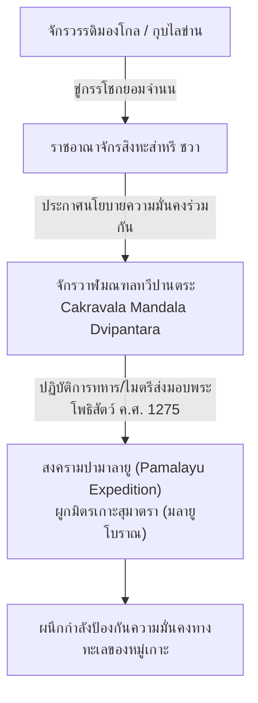
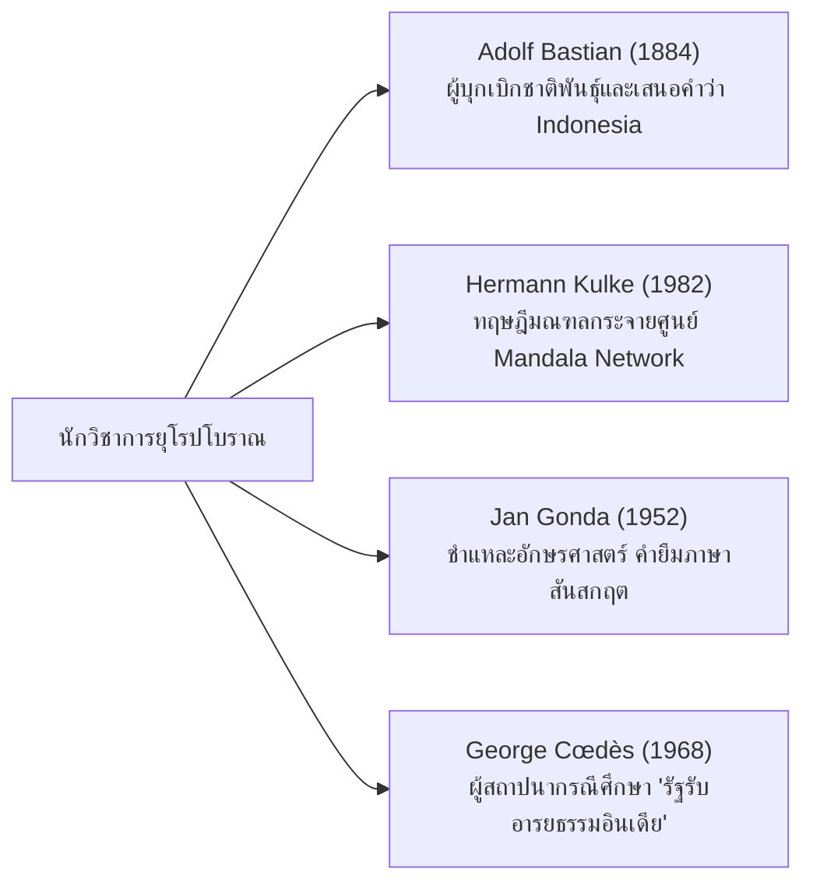

# บทที่ 5: จากมณฑลชวาโบราณสู่ประวัติศาสตร์นิพนธ์สมัยอาณานิคมและร่วมสมัย (Old Javanese Geopolitics and Modern Historiography)

---

## 1. ภูมิรัฐศาสตร์ชวาโบราณ: "จักรวาฬมณฑลทวีปานตระ" ของพระเจ้าเกียรตินคร

พัฒนาการของคำว่า **"ทวีปานตระ" (Dvīpāntara)** ได้เคลื่อนพ้นจากสถานะของการเป็นเพียงนิยามภูมิศาสตร์พฤกษศาสตร์และศาสนาพุทธมหายาน ไปสู่ **"กรอบความคิดภูมิรัฐศาสตร์ความมั่นคงและการทูตทางทะเล"** ในช่วงคริสต์ศตวรรษที่ 13 โดยปรากฏอย่างเด่นชัดในประวัติศาสตร์ของเกาะชวาโบราณรัชสมัย **"พระเจ้าเกียรตินคร" (King Kertanegara)** กษัตริย์องค์สุดท้ายผู้ทรงอิทธิพลแห่งอาณาจักรสิงหะส่าหรี (Singhasari) (ครองราชย์ ค.ศ. 1268-1292) [^1]

### 1.1 วิกฤตมองโกลและการก่อตัวของมณฑลร่วมใจ
ในปลายคริสต์ศตวรรษที่ 13 กุบไลข่าน (Kublai Khan) แห่งจักรวรรดิมองโกล-ราชวงศ์หยวน ได้แผ่ขยายแสนยานุภาพลงใต้ บังคับให้บรรดาอาณาจักรในเอเชียตะวันออกเฉียงใต้ส่งบรรณาการและยอมจำนน พระเจ้าเกียรตินครทรงตระหนักดีว่า การที่รัฐเดี่ยวจะสามารถต้านทานอภิมหาอำนาจระดับโลกเช่นมองโกลได้นั้นเป็นไปได้ยาก พระองค์จึงทรงริเริ่มอุดมการณ์ภูมิรัฐศาสตร์แบบบูรณาการนโยบายข้ามเกาะข้ามสมุทรขึ้น โดยมีเป้าหมายในการหลอมรวมดินแดนหมู่เกาะทั้งหมดให้เข้าเป็นพันธมิตรเดียวกันภายใต้ร่มเงาของชวา แนวคิดนี้เรียกว่า **"จักรวาฬมณฑลทวีปานตระ" (Cakravala Mandala Dvipantara)** [^2]

สาระสำคัญเชิงยุทธศาสตร์ของแนวคิดนี้อยู่ที่การนำเอาหลักจักรวาลวิทยาพุทธ-ฮินดู (Cakravāla) ซึ่งมีพระเมรุมาศ (Sumeru) เป็นศูนย์กลาง ล้อมรอบด้วยทวีปและมหาสมุทรเป็นวงกลมซ้อน มาประยุกต์เป็นแบบจำลองภูมิรัฐศาสตร์ทางทะเล โดยมีชวาเป็นแกนกลาง (Core) และหมู่เกาะรอบนอกเป็นมณฑลวงแหวนที่ผูกพันด้วยพันธสัญญาทางศาสนา การค้า และการทหาร แนวคิดนี้จึงไม่ใช่การครอบครองในความหมายของจักรวรรดินิยมรวมศูนย์ แต่เป็น **"ระบบมณฑลทางทะเลแบบสมมาตร" (Maritime Mandala Symmetry)** ที่ทุกรัฐสมาชิกรักษาอำนาจอธิปไตยภายในเกาะของตน พร้อมกันนั้นก็ยอมรับชวาในฐานะ *primus inter pares* (ที่หนึ่งท่ามกลางผู้เท่าเทียม) [^3]

### 1.2 ปฏิบัติการปามาลายู (Pamalayu Expedition - ค.ศ. 1275): การทูตข้ามเกาะ
เพื่อเป็นการแปลงแนวคิดจักรวาฬมณฑลทวีปานตระให้เกิดผลจริงในทางปฏิบัติ พระเจ้าเกียรตินครได้ทรงส่งกองทัพและการทูตเดินทางข้ามทะเลใต้ไปยัง **ภูมิมลายู (Bhūmi Melayu / เกาะสุมาตราตอนกลาง)** ในปี ค.ศ. 1275 การเดินทางนี้ไม่ได้มีเป้าหมายเพื่อทำลายล้าง แต่เพื่อส่งมอบและสถาปนาพระพุทธรูปปูนปั้นปิดทองศักดิ์สิทธิ์ **"พระอโมฆปาศะโลเกศวร" (Amoghapāśa Lokeśvara)** ให้เป็นของขวัญสัมพันธไมตรีแก่กษัตริย์แห่งธรรมศรัย (Dharmasraya) บนเกาะสุมาตรา [^4]

จารึกบนฐานพระพุทธรูปปูนปั้นที่ส่งมอบครั้งนี้ (เช่น **จารึกปาดัง โรโจ - Padang Roco Inscription**) ระบุอย่างชัดเจนว่า พระพุทธรูปนี้เป็นสื่อกลางในการนำความสุขสมบูรณ์และความสามัคคีร่วมกันมาสู่ข้าราชบริพาร ประชาชน และกษัตริย์แห่งมลายู โดยการริเริ่มของชวา นี่คือความพยายามเชิงรูปธรรมครั้งแรกในการผูกโยงสองเกาะที่ทรงอิทธิพลที่สุด (ชวา และ สุมาตรา) ให้เป็นปึกแผ่นเดียวกันภายใต้กรอบความคิดบูรณาการเชิงวัฒนธรรมและความมั่นคงของทวีปานตระเพื่อต่อต้านการรุกรานจากภายนอก [^5]

---

## 2. การสืบทอดคำสู่ "นูษานตระ" (Nusantara) ในคัมภีร์นาครกฤตาคมและปาราราตอน

หลังจากการล่มสลายของสิงหะส่าหรี อุดมการณ์ "จักรวาฬมณฑลทวีปานตระ" ไม่ได้สาบสูญไป แต่ได้รับการรับช่วงและขยายขอบเขตอย่างมหาศาลโดย **"จักรวรรดิมัชปาหิต" (Majapahit Empire)** ในศตวรรษที่ 14 โดยมีการเปลี่ยนผ่านภาษาในการเรียกชื่อภูมิรัฐศาสตร์นี้จากภาษาสันสกฤตเดิมสู่ภาษาชวาโบราณว่า **"นูษานตระ" (Nusantara)** [^6]

### 2.1 คัมภีร์นาครกฤตาคม (Kakawin Deśawarṇana): สารบบเกาะบริวาร
วรรณกรรมราชสำนักชวาโบราณเรื่อง **"เดศวรรณนา" (Deśawarṇana / นาครกฤตาคม)** รจนาโดย **อัมปู ปราปัญจา (Mpu Prapañca)** ในปี ค.ศ. 1365 ได้บันทึกรายละเอียดของรายชื่อดินแดนเกาะแก่งรอบนอกเกาะชวา (นูษานตระ) ที่อยู่ภายใต้การพิทักษ์และมีสัมพันธ์บรรณาการกับมัชปาหิตในบทที่ 13, 14 และ 15 รายชื่อเหล่านี้ครอบคลุมดินแดนทั้งหมดในอินโดนีเซีย มาเลเซีย สิงคโปร์ บรูไน และฟิลิปปินส์ตอนใต้ในปัจจุบัน ซึ่งสะท้อนขอบข่ายขยายตัวของทวีปานตระที่ถูกผนวกเข้าสู่ระบบบรรณาการทางทะเลชวาอย่างเป็นระเบียบ [^7]

### 2.2 คัมภีร์ปาราราตอน (Pararaton) และคำสัตยาธิษฐานปาลาปา (Sumpah Palapa)
คัมภีร์ประวัติศาสตร์ชวาโบราณ **"ปาราราตอน" (Pararaton / พงศาวดารแห่งกษัตริย์)** บันทึกว่า มหาอุปราชผู้ทรงอิทธิพล **"คชา มาดา" (Gajah Mada)** ได้ประกาศคำสัตยาธิษฐานอันโด่งดังเมื่อเข้ารับตำแหน่งอัครมหาเสนาบดีในปี ค.ศ. 1336:

* **ตัวบทดั้งเดิมภาษาชวาโบราณ (Kawi):**
  > *...Sira Gajah Mada Patih Amangkubhumi tan ayun amukti palapa, sira Gajah Mada: "Lamun huwus kalah nusantara isun amukti palapa, lamun kalah ring Gurun, ring Seran, Tanjung Pura, ring Haru, ring Pahang, Dompo, ring Bali, Sunda, Palembang, Tumasik, samana isun amukti palapa..."* [^8]
* **คำแปลภาษาไทยเชิงประวัติศาสตร์:**
  > "...อันมหาอุปราชคชามาดา ผู้เป็นเสนาบดีแห่งแผ่นดิน จักไม่ยอมลิ้มรสผลไม้หรือพักผ่อนรับความสุขสำราญใดๆ ตราบใดที่ **นูษานตระ (Nusantara / หมู่เกาะทวีปานตระทั้งหมด)** ยังมิถูกรวบรวมหลอมรวมให้เข้ามาอยู่ภายใต้ร่มเงาอธิปไตยเดียวกัน หากเกาะกูรุน, เกาะเซรัม, แหลมตันจุงปูระ (บอร์เนียว), แคว้นฮารู, แคว้นปะหัง, ดอมโป, เกาะบาหลี, อาณาจักรซุนดา, นครปาเล็มบัง และเกาะตูมาสิก (สิงคโปร์) ยังมิถูกยอมจำนนและรวบรวมเข้ามาได้ ข้าพเจ้าจักไม่ยอมรับการพักผ่อนเป็นอันขาด..."

สัตยาธิษฐานนี้แสดงให้เห็นว่า แนวคิด "นูษานตระ" หรือทวีปานตระได้แปรสภาพกลายเป็น **"อธิปไตยร่วมของหมู่เกาะ"** ซึ่งต่อมาได้กลายเป็นรากฐานทางจิตวิญญาณและประวัติศาสตร์ที่ขบวนการชาตินิยมอินโดนีเซียนำมาประยุกต์ใช้ในการสถาปนาประเทศและกำหนดเส้นเขตแดนอธิปไตยของประเทศอินโดนีเซียในยุคเอกราชอย่างเป็นรูปธรรม [^9]

---

## 3. จากทวีปานตระสู่ชาตินิยมสมัยใหม่: กี ฮาจาร์ เดวันตารา และคำปฏิญาณเยาวชน ค.ศ. 1928

### 3.1 กี ฮาจาร์ เดวันตารา (Ki Hajar Dewantara) กับการฟื้นฟูคำว่า "นูษานตระ"
กระบวนการแปรสภาพ "ทวีปานตระ/นูษานตระ" จากแนวคิดภูมิรัฐศาสตร์โบราณสู่อุดมการณ์ชาตินิยมสมัยใหม่ สำเร็จเป็นรูปธรรมในทศวรรษ 1920 โดยบทบาทสำคัญยิ่งของ **กี ฮาจาร์ เดวันตารา (Ki Hajar Dewantara, ค.ศ. 1889-1959)** นามเดิม **ราเด็น มัส สุวาร์ดี สุรยานิงกรัต (Raden Mas Suwardi Suryaningrat)** นักการศึกษา นักเขียน และผู้นำขบวนการเอกราชอินโดนีเซียผู้ก่อตั้งสถาบันการศึกษา **ตามัน ซิสวา (Taman Siswa)** ในปี ค.ศ. 1922 [^10]

เดวันตาราเสนอว่า ชื่อเรียก **"อินโดนีเซีย" (Indonesia)** นั้นมีรากจากภาษากรีก (*Indos* + *nesos*) ซึ่งถูกประดิษฐ์ขึ้นโดยชาวยุโรป (James Richardson Logan ในปี ค.ศ. 1850 และ Adolf Bastian ในปี ค.ศ. 1884) จึงยังไม่ใช่ชื่อที่ออกมาจากรากวัฒนธรรมพื้นเมืองอย่างแท้จริง เขาจึงเสนอให้ใช้คำว่า **"นูษานตระ" (Nusantara)** แทน เพราะเป็นคำที่หยั่งรากมาจากภาษาชวาโบราณ (Kawi) และสืบทอดเจตนารมณ์ของสัตยาธิษฐานคชามาดาแห่งมัชปาหิต ซึ่งเป็นประจักษ์พยานว่าประชาชนหมู่เกาะเคยมีเอกภาพและอธิปไตยร่วมกันมาก่อนยุคอาณานิคมยุโรปหลายร้อยปี [^11]

การเลือกใช้คำ "นูษานตระ" ของเดวันตาราจึงไม่ใช่เพียงการตั้งชื่อทางภูมิศาสตร์ แต่เป็น **ปฏิบัติการทางภาษาศาสตร์เชิงปฏิวัติ (Linguistic Revolution)** ที่มุ่งหมายจะปลดเปลื้องมรดกทางชื่อเรียกจากบรรณพิภพอาณานิคมยุโรป และเชื่อมโยงจิตสำนึกชาตินิยมร่วมสมัยเข้ากับมรดกทางประวัติศาสตร์ของ *Dvīpāntara* ในสมัยมัชปาหิตอย่างสง่างาม

### 3.2 สุมปาห์ เปอมูดา (Sumpah Pemuda) ค.ศ. 1928: คำปฏิญาณเยาวชน
เหตุการณ์สำคัญที่สุดในประวัติศาสตร์ชาตินิยมอินโดนีเซียคือ **"คำปฏิญาณเยาวชน" (Sumpah Pemuda / Youth Pledge)** ประกาศเมื่อวันที่ 28 ตุลาคม ค.ศ. 1928 ในการประชุมสมัชชาเยาวชนครั้งที่ 2 ณ กรุงจาการ์ตา (ขณะนั้นเรียกว่า บาตาเวีย) โดยมีสาระสำคัญ 3 ประการ:

1. **Satu Nusa** (หนึ่งแผ่นดิน) — เรามี "มาตุภูมิเดียว" คือ อินโดนีเซีย
2. **Satu Bangsa** (หนึ่งชาติ) — เราเป็น "ชนชาติเดียวกัน" คือ ชาติอินโดนีเซีย
3. **Satu Bahasa** (หนึ่งภาษา) — เรามี "ภาษาเอกภาพ" คือ ภาษาอินโดนีเซีย [^12]

แนวคิดเรื่อง *Satu Nusa* ("หนึ่งแผ่นดิน") นั้นสะท้อนโดยตรงถึงมรดกทางความคิดของ "นูษานตระ/ทวีปานตระ" ในฐานะ "หมู่เกาะที่เป็นหนึ่งเดียวกัน" กล่าวคือ อุดมการณ์ของคชามาดาในศตวรรษที่ 14 ที่มุ่งหลอมรวมเกาะทั้งหลายให้อยู่ภายใต้อธิปไตยร่วมกัน ได้ถูกแปลงเป็นภาษาชาตินิยมสมัยใหม่ ถอดคราบระบบกษัตริย์มัชปาหิตออกและสวมคราบอุดมการณ์ประชาธิปไตยสาธารณรัฐเข้ามาแทน คำว่า "นูษานตระ" จึงกลายเป็น **สัญลักษณ์ทางจิตวิญญาณของความเป็นชาติ** ที่เชื่อมอดีตเข้ากับปัจจุบัน [^13]

เป็นที่น่าสังเกตว่าในปี ค.ศ. 2022 รัฐบาลอินโดนีเซียภายใต้ประธานาธิบดีโจโก วิโดโด (Joko Widodo) ได้ประกาศชื่อเมืองหลวงใหม่ที่กำลังก่อสร้างบนเกาะกาลีมันตัน (บอร์เนียว) อย่างเป็นทางการว่า **"นูซันตารา" (Nusantara)** ซึ่งเป็นการยืนยันอย่างชัดเจนว่ามรดกทางภาษาและอุดมการณ์ของ *Dvīpāntara* ยังคงมีชีวิตและทรงพลังอยู่จนถึงศตวรรษที่ 21 [^14]

---

## 4. ชาวโปรตุเกสและบริษัทดัตช์อีสต์อินเดีย: การสืบทอดและทำลายเครือข่ายเครื่องเทศทวีปานตระ

### 4.1 โตเม ปิเรส (Tomé Pires) กับ Suma Oriental (ค.ศ. 1515)
เครือข่ายการค้าเครื่องเทศในทวีปานตระที่ดำเนินมาตั้งแต่สมัยโรมัน-ไบแซนไทน์ ผ่านยุคอาหรับ-เปอร์เซีย และยุคทอง ของมัชปาหิต ไม่ได้สิ้นสุดลงเมื่อมัชปาหิตล่มสลาย แต่ถูกสืบทอดโดยรัฐสุลต่านมุสลิมต่างๆ โดยเฉพาะ **มะละกา (Malacca)** กระทั่งชาวโปรตุเกสเข้ายึดครองมะละกาในปี ค.ศ. 1511 [^15]

นักเภสัชกรชาวโปรตุเกส **โตเม ปิเรส (Tomé Pires)** ได้เขียนบันทึก **Suma Oriental** (ค.ศ. 1512-1515) ซึ่งเป็นรายงานภูมิศาสตร์และการค้าฉบับสมบูรณ์ที่สุดของชาวยุโรปเกี่ยวกับหมู่เกาะมลายูในยุคนั้น ปิเรสบรรยายรายละเอียดเส้นทางการค้ากานพลูจากหมู่เกาะโมลุกกะ (Maluku) ผ่านชวา มะละกา ไปจนถึงอินเดียและยุโรป — ซึ่งก็คือเส้นทาง **"ทวีปานตระ"** สายเดียวกันกับที่กาลิทาสะและคอสมัสเคยระบุถึงในสมัยโบราณ ปิเรสระบุว่า *"ใครก็ตามที่เป็นเจ้าแห่งมะละกา ผู้นั้นย่อมเป็นเจ้าแห่งเส้นเลือดการค้าของเวนิส"* [^16]

### 4.2 บริษัทดัตช์อีสต์อินเดีย (VOC) และการผูกขาดเครื่องเทศ
การก่อตั้ง **Vereenigde Oostindische Compagnie (VOC)** ในปี ค.ศ. 1602 เป็นจุดเปลี่ยนที่รุนแรงที่สุดในประวัติศาสตร์ทวีปานตระ ด้วยเป็นครั้งแรกที่อำนาจต่างชาติสามารถ **ผูกขาด** (monopolize) เครือข่ายเครื่องเทศได้สำเร็จอย่างเบ็ดเสร็จ ดัตช์ได้ทำลายระบบการค้าแบบ "มณฑลกระจายศูนย์" ที่ดำเนินมาเป็นพันปี แทนที่ด้วยระบบ **"การค้าผูกขาดรวมศูนย์อำนาจ"** ที่บาตาเวีย (Batavia / จาการ์ตา) เป็นศูนย์กลาง [^17]

สิ่งที่น่าพิจารณาในเชิงประวัติศาสตร์เปรียบเทียบคือ: ระบบมณฑลของ *Dvīpāntara* ตั้งแต่สมัยศรีวิชัยจนถึงมัชปาหิตนั้น ยอมรับความหลากหลายและความเป็นอิสระของรัฐต่างๆ ภายในเครือข่าย ในขณะที่ VOC กลับทำลายความหลากหลายนี้อย่างเป็นระบบ โดยเฉพาะการฆ่าล้างเผ่าพันธุ์ชาวบันดา (Banda massacre, ค.ศ. 1621) เพื่อควบคุมเกาะผลิตลูกจันทน์เทศ — ซึ่งเป็นหนึ่งใน "ทวีปานตระ" ที่กาลิทาสะเคยกล่าวถึงว่าเป็นแหล่งกำเนิดเครื่องเทศอันหอมหวนนั่นเอง [^18]

---

## 5. การบุกเบิกและประเมินผลงานวิจัยของนักวิชาการยุโรปสมัยอาณานิคม

เมื่อชาวตะวันตกเริ่มเข้ามาครอบครองภูมิภาคนี้ในศตวรรษที่ 19 แวดวงอินทรียศึกษาและบูรพาคดีศึกษาของเยอรมัน ฝรั่งเศส และดัตช์ ได้เริ่มกระบวนการสืบค้นรากเหง้าภูมิศาสตร์โบราณอย่างจริงจัง

### 5.1 อดอล์ฟ บาสเตียน (Adolf Bastian): ชาติพันธุ์วรรณนาและการกำเนิดคำว่า "อินโดนีเซีย"
นักมานุษยวิทยาชาวเยอรมัน **อดอล์ฟ บาสเตียน (Adolf Bastian)** ได้ตีพิมพ์หนังสือชุด 5 เล่มระดับรากฐานชื่อ **"Indonesien oder die Inseln des Malayischen Archipels"** (ค.ศ. 1884) บาสเตียนเป็นผู้ที่ทำหน้าที่ดึงเอาคำว่า **"Indonesia"** (ซึ่งมีรากจากภาษากรีก *Indos* = อินเดีย + *nesos* = เกาะ ซึ่งทำหน้าที่เป็นศัพท์แปลทางภูมิศาสตร์ของคำว่า *Dvipantara*) เข้าสู่บรรณพิภพวิชาการอย่างเป็นระบบ โดยพยายามเชื่อมโยงโครงสร้างตำนานพื้นบ้านดั้งเดิมเข้ากับมรดกอารยธรรมพราหมณ์-พุทธที่รับผ่านมาจากอินเดียโบราณ [^19]

### 5.2 แฮร์มันน์ คุลเคอ (Hermann Kulke): ทฤษฎีมณฑลแบบกระจายศูนย์ (Mandala Network)
นักประวัติศาสตร์ชาวเยอรมันร่วมสมัย **ศาสตราจารย์ แฮร์มันน์ คุลเคอ (Hermann Kulke)** ได้ตีพิมพ์งานวิจัยวิเคราะห์โครงสร้างรัฐโบราณในทวีปานตระ โดยชี้ให้เห็นว่า ดินแดนอย่างศรีวิชัยหรือมัชปาหิตไม่ได้ทำหน้าที่เป็น "จักรวรรดิรวมศูนย์อำนาจแบบจักรวรรดิโรมัน" (Centralized Empire) แต่ดำเนินรูปแบบการปกครองเป็น **"เครือข่ายมณฑลกระจายศูนย์"** (Decentralized Mandala Intersystem) ซึ่งสอดรับกับสภาวะภูมิศาสตร์ทางทะเลที่เกาะต่างๆ รักษาความเป็นอิสระและเชื่อมโยงกันด้วยพันธสัญญาทางการค้าและศาสนา [^20]

### 5.3 ยาน กอนดา (Jan Gonda): ภาษาศาสตร์เชิงวิเคราะห์อิทธิพลภาษาสันสกฤต
นักอินเดียวิทยาและอักษรศาสตร์ดัตช์-เยอรมัน **ยาน กอนดา (Jan Gonda)** ได้เขียนหนังสือชิ้นโบแดงชื่อ **"Sanskrit in Indonesia"** (ค.ศ. 1952) ซึ่งเป็นผลงานวิเคราะห์รวบรวมคำยืมภาษาสันสกฤตที่แทรกซึมอยู่ในภาษาชวา มลายู บาหลี และอินโดนีเซียร่วมสมัยอย่างละเอียดลึกซึ้ง กอนดาชี้ให้เห็นว่าคำศัพท์เกี่ยวกับกระบวนการคิด กฎหมาย รัฐศาสตร์ และศิลปวิทยาการในทวีปานตระ ล้วนได้รับการสรรค์สร้างและขยายคลังคำศัพท์จากระบบไวยากรณ์สันสกฤต ซึ่งเป็นเครื่องยืนยันว่าการไหลบ่าทางวัฒนธรรมอินเดียไม่ใช่การยัดเยียด แต่เป็นการ "ประยุกต์ใช้อย่างสมัครใจ" ของประชากรในท้องถิ่น [^21]

---

## 6. มุมมองและทัศนะร่วมสมัยของไทย: ดร.ตรงใจ หุตางกูร กับ "แดนกานพลูของคอสมัส"

ในการสืบค้นประวัติศาสตร์นิพนธ์ปัจจุบัน แวดวงวิชาการไทยได้ก้าวขึ้นมามีบทบาทสำคัญในการร่วมอธิบายพลวัตประวัติศาสตร์ของทวีปานตระอย่างคมชัด โดยเฉพาะผลงานวิจัยของ **ดร.ตรงใจ หุตางกูร** นักวิชาการด้านประวัติศาสตร์และโบราณคดีชาวไทย (จากศูนย์มานุษยวิทยาสิรินธร) ในงานวิจัยเผยแพร่เมื่อปี ค.ศ. 2022 ภายใต้ชื่อ **"แดนกานพลูของคอสมัส" (Clove Country of Cosmas: Rethinking Early Maritime Route to Southeast Asia)** [^22]

### 6.1 สาระสำคัญของการตีความของ ดร.ตรงใจ
ดร.ตรงใจ ได้ทำการวิเคราะห์เอกสารโบราณของคริสเตียนตะวันตกในคริสต์ศตวรรษที่ 6 รจนาโดยนักเดินทางชาวกรีก-ไอยคุปต์นามว่า **คอสมัส อินดิโคพลอยสเทส (Cosmas Indicopleustes)** เรื่อง *Christian Topography* คอสมัสได้ระบุถึงดินแดนลึกลับทางทะเลฝั่งบูรพาอันเป็นแหล่งกำเนิดกานพลูอันดับหนึ่งของโลก โดยเรียกว่า **"ซีนาจา" (Tzinitza / Tzinista)** [^23]

### 6.2 การวิเคราะห์เชิงลึก: จากคอสมัสสู่เครือข่ายเครื่องเทศทวีปานตระ

ดร.ตรงใจ ชี้ให้เห็นประเด็นสำคัญดังนี้:

1. **การทับซ้อนทางภูมิศาสตร์วัฒนธรรม:** ดินแดน Tzinitza ในบันทึกของคอสมัสเมื่อนำมาพิจารณาร่วมกับความเร็วลมมรสุมและแผนที่การเดินเรือโบราณ แท้จริงแล้วไม่ได้หมายถึงเฉพาะประเทศจีนแผ่นดินใหญ่ตามที่นักวิชาการยุคก่อนเข้าใจ แต่หมายถึงพื้นที่เครือข่ายสมุทรวานิชย์ที่เชื่อมคาบสมุทรมลายู เกาะชวา-สุมาตรา และหมู่เกาะกานพลูฝั่งโมลุกกะ ซึ่งก็คือพื้นที่ **ทวีปานตระ (Dvīpāntara)** ทั้งหมดนั่นเอง [^24]

2. **ความเชื่อมโยงของเวลาและเส้นทาง:** งานศึกษาชี้ว่า คาบสมุทรมลายูตอนบนทำหน้าที่เป็นสถานีเปลี่ยนถ่ายสินค้าและกระจายสินค้าเครื่องหอมข้ามสมุทร ก่อนที่สินค้าจะถูกส่งต่อลึกเข้าไปยังจีนตอนใต้หรือส่งออกไปทางทิศตะวันตกสู่เปอร์เซีย โรม และอียิปต์ การวิจัยนี้ช่วยยืนยันระดับความเก่าแก่ของเส้นทางการค้าโลกโบราณว่า ทวีปานตระได้หยั่งรากเชื่อมโยงเศรษฐกิจโลกตั้งแต่สมัยโรมัน-ไบแซนไทน์แล้วอย่างสมบูรณ์แบบ [^25]

3. **ความสัมพันธ์ระหว่างคอสมัสกับ *Periplus Maris Erythraei*:** ดร.ตรงใจ เสนอเพิ่มเติมว่า ข้อมูลของคอสมัส (ค.ศ. 550) นั้นสามารถเชื่อมโยงเข้ากับบันทึก *Periplus Maris Erythraei* (คริสต์ศตวรรษที่ 1) ที่กล่าวถึง *Chryse* (ดินแดนทองคำ) อันตั้งอยู่ "ฟากสุดท้ายของมหาสมุทรที่ถูกสำรวจ" ซึ่งก็ตรงกับตำแหน่งของสุวรรณทวีป/สุวรรณภูมิ ข้อเท็จจริงนี้แสดงว่า ทั้งกรีก โรมัน และไบแซนไทน์ ล้วนมีจินตภาพทางภูมิศาสตร์เกี่ยวกับ "ดินแดนเกาะโพ้นทะเลตะวันออกสุด" ที่ตรงกับนิยามของ *Dvīpāntara* มาโดยตลอดตั้งแต่คริสต์ศตวรรษที่ 1 จนถึงคริสต์ศตวรรษที่ 6 [^26]

4. **กานพลูในฐานะ "ตัวบ่งชี้ทางโบราณคดีพฤกษศาสตร์" (Archaeobotanical Marker):** ผลงานของ ดร.ตรงใจ มีข้อเสนอเชิงนวัตกรรมที่สำคัญยิ่ง กล่าวคือ "กานพลู" (*Syzygium aromaticum*) เป็นพืชพื้นเมืองเฉพาะถิ่นที่เกิดได้เฉพาะในหมู่เกาะโมลุกกะเท่านั้น ดังนั้นการค้นพบกานพลูในแหล่งโบราณคดีใดก็ตาม ไม่ว่าจะเป็นเมโสโปเตเมีย อียิปต์ หรือโรม ย่อมเป็นหลักฐานชี้ชัดว่ามีเส้นทางการค้าทางทะเลเชื่อมต่อกับ *Dvīpāntara* มาแล้วตั้งแต่ยุคนั้น โดยไม่จำเป็นต้องอาศัยหลักฐานเอกสารตัวอักษรเพียงอย่างเดียว [^27]

---

## 7. บทสรุป: สายน้ำแห่งความคิดไม่เคยหยุดไหล

การบูรณาการข้อมูลจากรัฐชวาโบราณ ขบวนการชาตินิยมอินโดนีเซีย บันทึกชาวโปรตุเกสและดัตช์ งานวิจัยตะวันตก และนวัตกรรมความคิดประวัติศาสตร์นิพนธ์ของไทย แสดงให้เห็นว่าการศึกษาเรื่อง "ทวีปานตระ" ไม่เคยหยุดนิ่ง ทว่ายังคงเผยหลักฐานใหม่ๆ ที่ช่วยให้เราเห็นความเชื่อมโยงอารยธรรมข้ามสมุทรได้อย่างมีชีวิตชีวาและทรงคุณค่าสูงสุดเชิงประวัติศาสตร์วิทยาชนชาติ

สายน้ำแห่งความคิด *Dvīpāntara → Nusantara → Sumpah Pemuda → Republik Indonesia → Ibu Kota Nusantara* ได้พิสูจน์ให้เห็นว่า คำๆ เดียว ที่เริ่มต้นจากโศลกกวีสันสกฤตในศตวรรษที่ 5 สามารถเปลี่ยนผ่านภาษา ข้ามสมุทร ข้ามศาสนา และข้ามอุดมการณ์ เพื่อกลายเป็นพลังขับเคลื่อนอธิปไตยของชาติเอกราชสมัยใหม่ในศตวรรษที่ 21 ได้อย่างงดงามและทรงพลัง

---

## 📌 เชิงอรรถอ้างอิงบทที่ 5

[^1]: Hall, K. R. (1985). *Maritime Trade and State Development in Early Southeast Asia*. Honolulu: University of Hawaii Press, pp. 224-230.
[^2]: Munandar, A. A. (2011). *Candravalamandala Dvipantara: Gagasan Kertanegara*. Jakarta: Wedatama Widya Sastra, pp. 45-52.
[^3]: Kulke, H. (1982). *Indische Einflüsse auf die staatliche Entwicklung Südostasiens*. Wiesbaden: Franz Steiner Verlag, pp. 88-96; cf. Wolters, O. W. (1999). *History, Culture, and Region in Southeast Asian Perspectives*. Rev. ed. Ithaca: Cornell SEAP, pp. 27-35.
[^4]: Casparis, J. G. de. (1956). *Selected Inscriptions from the 7th to the 9th Century A.D.* Bandung: Masa Baru, pp. 112-118.
[^5]: Slamet Muljana. (1979). *Menuju Puncak Kemegahan: Sejarah Kerajaan Majapahit*. Jakarta: Balai Pustaka, pp. 67-73; Padang Roco Inscription, transliteration in Boechari (2012), pp. 189-194.
[^6]: Pigeaud, Th. G. Th. (1960). *Java in the 14th Century: A Study in Cultural History*. The Hague: Martinus Nijhoff, Vol. I, pp. 48-52.
[^7]: Mpu Prapañca. (1365). *Kakawin Deśawarṇana* (Nāgarakṛtāgama). With translation and commentary by Th. G. Th. Pigeaud. The Hague: Martinus Nijhoff, Vol. III, pp. 16-20.
[^8]: Brandes, J. L. A. (1897). *Pararaton (Ken Arok) of het Boek der Koningen van Tumapel en van Majapahit*. Batavia: Albrecht & Co., pp. 78-82.
[^9]: Dahm, B. (1971). *History of Indonesia in the Twentieth Century*. London: Pall Mall Press, pp. 12-16.
[^10]: Kenji Tsuchiya. (1987). *Democracy and Leadership: The Rise of the Taman Siswa Movement in Indonesia*. Honolulu: University of Hawaii Press, pp. 56-72.
[^11]: Dewantara, Ki Hajar. (1967). *Karya Ki Hadjar Dewantara: Bagian Pertama: Pendidikan*. Yogyakarta: Majelis Luhur Persatuan Tamansiswa, pp. 1-15; cf. Elson, R. E. (2008). *The Idea of Indonesia: A History*. Cambridge: Cambridge University Press, pp. 68-74.
[^12]: Poeze, Harry A. (1986). *In het Land van de Overheerser: Indonesiërs in Nederland, 1600-1950*. Dordrecht: Foris Publications, pp. 134-148; cf. Supomo, S. (1993). "The image of Majapahit in later Javanese and Indonesian writing." in *Writing a New Society: Social Change Through the Novel in Malay*, ed. Virginia Matheson Hooker. Sydney: Allen & Unwin, pp. 171-185.
[^13]: Anderson, B. R. O'G. (1991). *Imagined Communities: Reflections on the Origin and Spread of Nationalism*. Rev. ed. London: Verso, pp. 116-131. Anderson อภิปรายถึงวิธีที่ชาตินิยมอินโดนีเซีย "คิดค้น" มรดกร่วมจากวรรณกรรมก่อนยุคอาณานิคม โดยมี Nusantara/Dvīpāntara เป็นตัวอย่างสำคัญ
[^14]: Undang-Undang Nomor 3 Tahun 2022 tentang Ibu Kota Negara. Lembaran Negara Republik Indonesia Tahun 2022 Nomor 41.
[^15]: Ricklefs, M. C. (2001). *A History of Modern Indonesia since c. 1200*. 3rd ed. Stanford: Stanford University Press, pp. 22-28.
[^16]: Pires, Tomé. (c. 1515). *Suma Oriental*. Translated by Armando Cortesão. London: Hakluyt Society, 1944. Vol. II, pp. 285-287.
[^17]: Andaya, L. Y. (1993). *The World of Maluku: Eastern Indonesia in the Early Modern Period*. Honolulu: University of Hawaii Press, pp. 115-132.
[^18]: Hanna, Willard A. (1978). *Indonesian Banda: Colonialism and Its Aftermath in the Nutmeg Islands*. Philadelphia: Institute for the Study of Human Issues, pp. 54-66.
[^19]: Bastian, A. (1884). *Indonesien oder die Inseln des Malayischen Archipels*. Berlin: Ferd. Dümmlers Verlagsbuchhandlung, Band I, pp. iii-vii.
[^20]: Kulke, H. (1982). *Indische Einflüsse auf die staatliche Entwicklung Südostasiens*. Wiesbaden: Franz Steiner Verlag, pp. 88-96.
[^21]: Gonda, J. (1952). *Sanskrit in Indonesia*. New Delhi: International Academy of Indian Culture, pp. 18-24.
[^22]: หุตางกูร, ตรงใจ. (2022). *แดนกานพลูของคอสมัส: การคิดใหม่เรื่องเส้นทางทางทะเลเริ่มแรกสู่เอเชียตะวันออกเฉียงใต้*. กรุงเทพฯ: ศูนย์มานุษยวิทยาสิรินธร (องค์การมหาชน), หน้า 14-38.
[^23]: Cosmas Indicopleustes. (1897). *The Christian Topography of Cosmas, an Egyptian Monk*. Translated and edited by J. W. McCrindle. London: Hakluyt Society, pp. 365-367.
[^24]: หุตางกูร, ตรงใจ. (2022). เรื่องเดียวกัน, หน้า 45-52.
[^25]: Donkin, R. A. (2003). *Between East and West: The Moluccas and the Traffic in Spices*. Philadelphia: American Philosophical Society, pp. 98-102.
[^26]: Casson, Lionel. (1989). *The Periplus Maris Erythraei: Text with Introduction, Translation, and Commentary*. Princeton: Princeton University Press, pp. 236-240; cf. หุตางกูร, ตรงใจ. (2022). เรื่องเดียวกัน, หน้า 58-63.
[^27]: หุตางกูร, ตรงใจ. (2022). เรื่องเดียวกัน, หน้า 68-75; cf. Donkin, R. A. (2003), pp. 15-22. หลักฐานทางโบราณคดีจากแหล่งขุดค้นเมือง Terqa ในซีเรีย (ราว 1700 ปีก่อนคริสตกาล) พบกานพลูที่มีถิ่นกำเนิดเฉพาะในโมลุกกะ แสดงว่าเส้นทางการค้าจากทวีปานตระอาจเก่าแก่กว่าที่เคยเชื่อกันมาก

---

## 🗂️ แผนการนำทางโครงการวิจัย (Research Navigation Menu)
* **บทนำ (Introduction):** [01_introduction.md](01_introduction.md) - นิรุกติศาสตร์ รากศัพท์ภาษาสันสกฤตเชิงลึก สุวรรณภูมิ สุวรรณทวีป และลวังกทวีป
* **บทที่ 1 (Sanskrit Sources):** [02_classical_sanskrit_sources.md](02_classical_sanskrit_sources.md) - รฆุวงศ์ 6.57 ปุราณะ อายุรเวทภาวประกาศ และจารึกกูไต/ตารุมานคร/นาลันทา
* **บทที่ 2 (Tamil Sources):** [03_classical_tamil_sources.md](03_classical_tamil_sources.md) - ปัตตินัปปาลัย มณีเมขไล จารึกตานโจร์ 1025 และแผ่นจารึกเลย์เดน
* **บทที่ 3 (Sino-Sanskrit Sources):** [04_sino_sanskrit_monk_records.md](04_sino_sanskrit_monk_records.md) - Sylvain Lévi (1931) พจนานุกรมฝานยวี่จ๋าหมิง และจดหมายเหตุอี้จิง/ฟ่าเสียน
* **บทที่ 4 (Greco-Roman & Arabic Sources):** [05_classical_western_and_arabic_sources.md](05_classical_western_and_arabic_sources.md) - Periplus, Ptolemy, Pliny, Ibn Khordadbeh, Al-Masudi และ Zābaj
* **บทที่ 5 (Javanese & Western Historiography):** [06_javanese_and_western_historiography.md](06_javanese_and_western_historiography.md) - จักรวาฬมณฑลทวีปานตระ คำปฏิญาณปาลาปา และประวัติศาสตร์นิพนธ์ตะวันตก
* **สารบบบรรณานุกรม (Annotated Bibliography):** [07_annotated_bibliography.md](07_annotated_bibliography.md) - คลังข้อมูลอ้างอิงเชิงวิเคราะห์ 160+ รายการ
