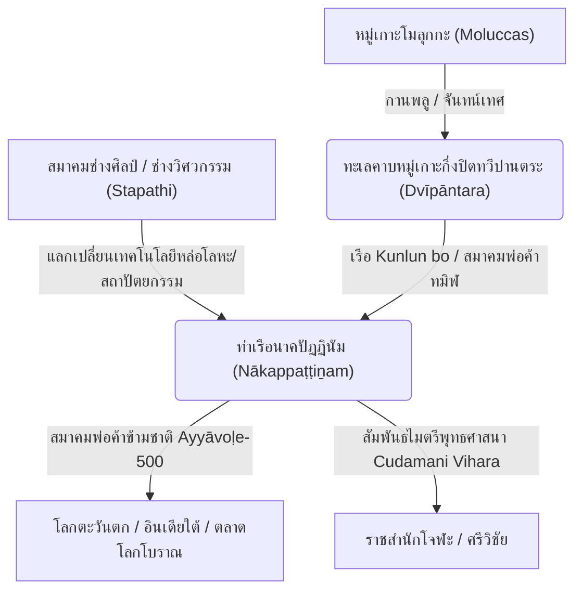

# บทที่ 7: การวิเคราะห์ตำแหน่งภูมิศาสตร์และการค้าทางทะเลเชิงสมุทราธิปัตย์

น่านน้ำคาบหมู่เกาะเอเชียอาคเนย์โบราณ หรือดินแดนที่เอกสารจารึกโบราณขนานนามว่า **"ทวีปานตระ" (Dvīpāntara)** คือพื้นที่ยุทธศาสตร์ทางเศรษฐกิจที่ใหญ่ที่สุดแห่งหนึ่งของโลกโบราณ การวิเคราะห์ภูมิศาสตร์ประวัติศาสตร์และพลวัตการค้าในดินแดนนี้ จำต้องก้าวข้ามกรอบคิดแบบพรมแดนรัฐชาติสมัยใหม่ และหันมาพิจารณารูปแบบของ **"รัฐสมุทราธิปัตย์" (Thalassocracy)** และเครือข่ายจักรวาลมณฑลข้ามสมุทร (Trans-oceanic Mandalas) ซึ่งขับเคลื่อนด้วยสัมพันธไมตรีเชิงการค้าและการเดินเรือเสรี โดยมีน่านน้ำกึ่งปิดทางใต้ของทะเลจีนใต้และทะเลชวาเป็นแกนกลางหลักในการเชื่อมต่อโลกการค้าเครื่องเทศข้ามมหาสมุทรอินเดียและแปซิฟิก

บทนี้จะดำเนินการวิเคราะห์เจาะลึกใน 3 ประเด็นหลัก ได้แก่ หนึ่ง การกำหนดพิกัดภูมิศาสตร์ประวัติศาสตร์น่านน้ำทวีปานตระ สอง การรื้อถอนวาทกรรมและอคติทางประวัติศาสตร์ในจารึกสดุดีเกียรติยศกษัตริย์โจฬะ หรือ **"เมยฺกิรฺตฺติ" (Meikkīrtti - மெய்க்கீர்த்தி)** เพื่อเผยโฉมความร่วมมือข้ามสมุทรที่แท้จริง และสาม บทบาทเชิงรุกและสิทธิธรรมทางการค้าของสมาคมพ่อค้าทมิฬข้ามชาติ เช่น **"อยฺยาวโฬฺ 500" (Ayyāvoḷe-500)** **"มณิคฺรามมฺ" (Maṇigrāmam)** และ **"อญฺจุวณฺณมฺ" (Añjuvaṇṇam)** ที่มีต่อห่วงโซ่อุปทานเครื่องเทศกานพลูในน่านน้ำทวีปานตระ ภายใต้ระเบียบอักขรวิธีทมิฬเชิงกายภาพโบราณและกฎปุลลีอย่างเคร่งครัด

---

## 1. ภูมิศาสตร์ประวัติศาสตร์ของน่านน้ำทวีปานตระ: เขตทะเลคาบหมู่เกาะกึ่งปิด

ความเข้าใจดั้งเดิมเกี่ยวกับ "ทวีปานตระ" มักถูกจำกัดวงแคบให้ตรงกับเกาะชวาหรือสุมาตราเพียงแห่งเดียวตามแนวคิดภูมิศาสตร์เดี่ยว ทว่าจากการประสานข้อมูลพหุภาษาของ ซิลแว็ง เลอวี (Sylvain Lévi) [[^148]] และการวิเคราะห์ทางภูมิสมุทรศาสตร์ของ ดร.ตรงใจ หุตางกูร [[^149]] ชี้ชัดว่า ทวีปานตระมีความหมายเชิงพิกัดพื้นที่กว้างขวางครอบคลุม **"น่านน้ำทะเลคาบหมู่เกาะ" (Inter-island Sea)** ทางตอนใต้ of ทะเลจีนใต้จรดทะเลชวา และรวมถึงบริเวณช่องแคบมะละกา ช่องแคบซุนดา ตลอดจนเครือข่ายท่าเรือรอบหมู่เกาะเรียว-ลิงกา (Riau-Lingga) 

พิกัดภูมิศาสตร์กึ่งปิด (Semi-enclosed Maritime Zone) นี้มีลักษณะพิเศษทางสมุทรศาสตร์คือกระแสน้ำและทิศลมมรสุมตะวันตกเฉียงใต้และตะวันออกเฉียงเหนือ ซึ่งบังคับให้กองเรือค้าขายข้ามมหาสมุทรจากฝั่งอินเดียและอาหรับต้องเดินทางเข้ามาจอดพักคอยเพื่อเปลี่ยนลมมรสุม และดำเนินกิจกรรมแลกเปลี่ยนสินค้าเปลี่ยนมือ (Redistribution Center) ก่อนแล่นเรือมุ่งหน้าสู่แผ่นดินใหญ่จีน โลกทัศน์เชิงภูมิศาสตร์ประวัติศาสตร์ของชาวทมิฬและอินเดียโบราณจึงมองน่านน้ำกึ่งปิดแห่งนี้เป็นพื้นที่เศรษฐกิจเฉพาะตัวที่ไม่ขึ้นตรงต่อจักรวรรดิบนแผ่นดินใหญ่ใด ๆ ทว่าสะท้อนภาพเครือข่ายรัฐชายฝั่งขนาดเล็กและใหญ่ที่เชื่อมร้อยเข้าหากันด้วยสัมพันธไมตรีทางการค้า

การวิเคราะห์พลวัตห่วงโซ่อุปทานโลกโบราณชี้ว่า สินค้าที่เป็นตัวขับเคลื่อนมูลค่าทางเศรษฐกิจสูงสุดในน่านน้ำทวีปานตระคือ **"กานพลู" (Lavaṅga)** และ **"จันทน์เทศ" (Jātiphala)** ซึ่งพืชพรรณพฤกษศาสตร์ประเภทกานพลูนั้นในยุคโบราณสามารถเจริญเติบโตและผลิตผลผลิตได้เฉพาะบนเกาะแก่งภูเขาไฟขนาดเล็กในหมู่เกาะโมลุกกะ (Moluccas/Maluku) ทางตะวันออกของอินโดนีเซียเท่านั้น [[^150]] การที่กานพลูจากเกาะอันห่างไกลฝั่งตะวันออกเดินทางข้ามทะเลชวามาปรากฏตัวอยู่ในราชสำนักอินเดียใต้ผ่านบทกวีรฆุวงศ์ของกาลิทาส แสดงให้เห็นระบบพ่อค้าและเรือขนส่งภายในน่านน้ำทวีปานตระ (Internal Redistribution Network) ที่มีความก้าวหน้าและเป็นเอกภาพสูงยิ่ง เรือโบราณของชาวพื้นถิ่นที่เอกสารจีนเรียกว่า **"เรือคุนหลุน" (Kunlun bo / 崑崙舶)** [[^151]] คือพาหนะหลักที่ทำหน้าที่แล่นเรือขนส่งเครื่องเทศจากแหล่งผลิตฝั่งตะวันออก มารวบรวมและกระจายสินค้า ณ ท่าเรือศูนย์กลางในทะเลชวาและคาบสมุทรมลายู ก่อนที่เรือสำเภาขนาดใหญ่ของทมิฬ เช่น **"วณฺคมฺ" (Vangam - வங்கம்)** หรือเรือประเภท **"กลมฺ" (Kalam - கலம்)** [[^152]] จะรับช่วงขนส่งเครื่องเทศข้ามอ่าวเบงกอลไปสู่โลกตะวันตก

---

## 2. การรื้อถอนประวัติศาสตร์นิพนธ์แนวอาณานิคม: ถอดรหัส "เมยฺกิรฺตฺติ" (Meikkīrtti) ของราชวงศ์โจฬะ

ประวัติศาสตร์นิพนธ์โบราณเกี่ยวกับความสัมพันธ์อินเดียใต้และเอเชียอาคเนย์ในช่วงคริสต์ศตวรรษที่ 11 มักถูกครอบงำด้วยแนวคิดกึ่งอาณานิคมที่ลดทอนบทบาทความเป็นตัวแทนและอธิปไตยของรัฐพื้นถิ่น โดยมีศูนย์กลางอยู่ที่การตีความเหตุการณ์การส่งกองทัพเรือข้ามสมุทรของจักรพรรดิราเชนทราที่ 1 แห่งราชวงศ์โจฬะ (ค.ศ. 1025) ว่าเป็นการ "พิชิตศึกและเข้าปกครองล่วงดินแดนโพ้นทะเลของอาณาจักรศรีวิชัยและรัฐต่าง ๆ ในทวีปานตระ" อย่างราบคาบ [[^153]] 

ทว่าการดำเนินการวิเคราะห์รื้อถอนวาทศิลป์ (Rhetorical Deconstruction) ในวรรณกรรมสดุดีพระเกียรติยศภาษาทมิฬ หรือที่เรียกว่า **"เมยฺกิรฺตฺติ" (Meikkīrtti - மெய்க்கீர்த்தி)** ซึ่งปรากฏบนจารึกกำแพงวัดชลคังเคศวร (Cholagangeshvara) และจารึกแผ่นทองแดงเลเดนฉบับใหญ่ (Larger Leiden Grant - ค.ศ. 1005/1015) เผยให้เห็นนัยทางประวัติศาสตร์ที่แตกต่างออกไปอย่างสิ้นเชิง [[^154]]

เมยฺกิรฺตฺติ ของพระเจ้า **ราเชนทราที่ 1 (Rājēndra I / இராசேந்திரன்)** บันทึกรายการภูมิพิกัดโพ้นทะเลที่กองทัพโจฬะเข้าโจมตี เช่น **"ศรีวิจยมฺ" (Śrīvijaya / ஸ்ரீவிஜயம்)** **"ปณฺณัย" (Pannai / பண்ணை)** **"มาลยรฺ" (Malaiyur / மலையூர்)** **"อิลงฺกาโศกมฺ" (Ilangasoka / இலங்காசோகம்)** และ **"กาดารมฺ" (Kāṭāram / காடாரம்)** [[^155]] การสะกดรูปคำทมิฬเหล่านี้ภายใต้กฎปุลลีอย่างเคร่งครัดช่วยรักษาความสมบูรณ์ทางสัทวิทยาเดิมและป้องกันความสับสนเชิงพื้นที่:
*   *Śrīvijaya* -> ศฺรีวิจยมฺ (ஸ்ரீவிஜயம் - ் สะกด มฺ ท้ายคำ แสดงวิภักติกรรมนิยม)
*   *Kāṭāram* -> กาดารมฺ (காடாரம் - ் สะกด มฺ ท้ายคำ)
*   *Ilangasoka* -> อิลงฺกาโศกมฺ (இலங்காசோகம் - ் สะกด งฺ และ มฺ)

เมื่อพิจารณาในแง่วาทศิลป์สดุดีเกียรติยศ (Panegyric Tradition) ของอินเดียใต้ วัตถุประสงค์หลักของจารึกประเภท เมยฺกิรฺตฺติ มิใช่การบันทึกรายงานทางทหารที่มีความเป็นกลางทางประวัติศาสตร์ หากเป็นการสถาปนาสิทธิธรรมอันศักดิ์สิทธิ์เชิงสัญลักษณ์ (Sacred Legitimization) ขององค์พระมหากษัตริย์ในฐานะจักรพรรดิผู้ขยายอาณาขอบเขตการแผ่บารมี หรือการทำพิธี **"ทิควิชัย" (Digvijaya)** ทั่วทุกทิศ [[^156]] น้ำเสียงเชิงสงครามที่รุนแรงและการระบุรายการชัยชนะเหนือราชาดินแดนทวีปานตระ เช่น พระเจ้าสังครามาวิชโยตตุงกวรมัน (Saṅgrāmavijayottuṅgavarman) แห่งศรีวิชัย จึงเป็นวาทศิลป์มาตรฐานในการเฉลิมฉลองเพื่อข่มขวัญอริราชศัตรูในอินเดียใต้เอง (เช่น ราชวงศ์ปาณฑยะ และจาลุกยะ) มากกว่าจะเป็นการสถาปนาระบบเขตปกครองส่วนภูมิภาคในน่านน้ำเอเชียอาคเนย์ 

หลักฐานเชิงประจักษ์ทางโบราณคดียืนยันชัดเจนว่า ราชวงศ์โจฬะไม่เคยส่งข้าราชการ กองกำลังทหารรักษาการณ์ หรือตั้งผู้แทนพระองค์เข้าปกครองดินแดนในเอเชียอาคเนย์หลังจากปี ค.ศ. 1025 เลย ในทางตรงกันข้าม สัมพันธไมตรีเชิงสัญลักษณ์และการค้าเสรียังคงดำเนินต่ออย่างราบรื่น ดังปรากฏในจารึกแผ่นทองแดงเลเดนฉบับเล็ก (Smaller Leiden Grant - ค.ศ. 1090) [[^157]] ที่บันทึกว่าจักรพรรดิคุโลตตุงคะที่ 1 (Kulottunga I) ทรงยืนยันการยกเว้นภาษีที่ดินและสิทธิ์การปกครองแก่พุทธวิหารจูฬามณีวิหาร (Cudamani Vihara) ณ ท่าเรือนาคปัฏฏินัม ซึ่งได้รับการก่อสร้างและอุปถัมภ์โดยกษัตริย์แห่งศรีวิชัย-กาดารมฺมาตั้งแต่ยุคต้นศตวรรษ การรื้อถอนวาทกรรมชิ้นนี้จึงช่วยคืนบทบาทและอธิปไตยอิสระให้แก่รัฐชายฝั่งในทวีปานตระ ในฐานะเครือข่ายรัฐสมุทรวานิชที่มีความเสมอภาคและเกื้อกูลกันทางการค้าข้ามสมุทร

---

## 3. สมาคมพ่อค้าทมิฬข้ามชาติ: โครงข่ายความร่วมมือเชิงเศรษฐกิจเสรี

กลไกที่แท้จริงซึ่งควบคุมและขับเคลื่อนการค้าทางทะเลในน่านน้ำทวีปานตระมิใช่กองทัพหลวงของราชวงศ์โจฬะ หากแต่เป็น **"สมาคมพ่อค้าทมิฬข้ามชาติ" (South Indian Merchant Guilds)** ซึ่งทำงานประสานรอยต่อเข้ากับสมาคมการค้าของชาวชวา มลายู จีน และเปอร์เซีย สมาคมพ่อค้าเหล่านี้ทำหน้าที่เป็นองค์กรกึ่งเอกเทศที่มีขุมกำลังอาวุธ กองเรือขนส่ง และระบบการธนาคารของตนเอง ช่วยอำนวยความสะดวกในการจัดสรรความปลอดภัยและการค้าผูกขาดกานพลู-เครื่องเทศโบราณในยุคที่รัฐโบราณยังไม่มีระบบกฎหมายระหว่างประเทศที่บูรณาการ

สมาคมพ่อค้าที่มีบทบาททรงอิทธิพลและน่าเกรงขามที่สุดในระบบนิเวศการค้าน่านน้ำทวีปานตระปรากฏเด่นชัดอยู่ 3 กลุ่มหลัก ได้แก่:

### ก. สมาคม อยฺยาวโฬฺ 500 (Ayyāvoḷe-500 / ஐயப்பொழில் ஐந்துநூற்றுவர்)
สมาคมพ่อค้าที่ยิ่งใหญ่ที่สุดซึ่งมีต้นกำเนิดจากเมืองไอโฮเล (Aihole) ในอินเดียใต้ มีชื่อเต็มว่า **"สมาคมปัญจศตวีรชนแห่งอัยยาวุฬี" (อยฺยาวโฬฺ 500 - Ayyāvoḷe-500)** [[^158]] 
*   *ระบบการถอดอักษรปุลลี:* ள் ใน ஐயப்பொழில் ถอดเป็น ฬฺ และ ர் ใน ஐந்துநูற்றுவர் ถอดเป็น รฺ (อยฺยาวโฬฺ 500)
สมาคมนี้ทอถักขยายเครือข่ายสถานีการค้าและคลังสินค้าข้ามน้ำข้ามทะเลสู่ดินแดนทวีปานตระอย่างกว้างขวาง หลักฐานชิ้นสำคัญทางจารึกวิทยาคือ **จารึกบาฆุส (Barus Inscription - ค.ศ. 1088)** ค้นพบ ณ บริเวณท่าเรือโบราณบาฆุสทางชายฝั่งตะวันตกของเกาะสุมาตรา [[^159]] ตัวบทภาษาทมิฬโบราณจารึกชัดเจนว่า สมาคมพ่อค้าอยฺยาวโฬฺ 500 (เรียกในจารึกว่า *Ticaiaiyirattu-Ainnurruvar* - พ่อค้าห้าร้อยคนแห่งหมื่นทิศ) ได้จัดตั้งศูนย์รวบรวมสินค้าและกำหนดกฎระเบียบราคากลางสำหรับสินค้า **"การบูรบาฆุส" (Barus Camphor)** ร่วมกับสินค้าสมุนไพรเครื่องเทศอื่น ๆ โดยได้รับการคุ้มครองและยอมรับความปลอดภัยจากผู้นำรัฐพื้นถิ่น

### ข. สมาคม มณิคฺรามมฺ (Maṇigrāmam - மணிகிராமம்)
สมาคมพ่อค้าทมิฬโบราณที่มีความเชี่ยวชาญการค้าชายฝั่งและระบบโลจิสติกส์เชื่อมโยงพื้นที่ภายในทวีป (Inland-to-Coast Trade Networks) **"มณิคฺรามมฺ" (Maṇigrāmam)** [[^160]] ทำหน้าที่เชื่อมต่อการลำเลียงสินค้าเครื่องเทศและของป่าจากป่าดงดิบในสุมาตราและคาบสมุทรมลายูลงสู่เมืองท่าชายฝั่ง เพื่อส่งต่อไปยังเรือของสมาคมอยฺยาวโฬฺ 500 จารึกทมิฬที่ค้นพบ ณ **วัดภูกระปอง (Wat Phu Khao Thong)** อำเภอคุระบุรี จังหวัดพังงา (ศตวรรษที่ 9) [[^161]] ระบุชัดว่ากลุ่มมณิคฺรามมฺได้สถาปนาถิ่นพำนักการค้าและสร้างบ่อน้ำสาธารณะเพื่ออำนวยประโยชน์ข้ามคาบสมุทร สะท้อนเครือข่ายสมาคมที่ฝังตัวลึกอยู่ในคาบสมุทรไทย-มลายูอันเป็นประตูบานสำคัญสู่ทวีปานตระ

### ค. สมาคม อญฺจุวณฺณมฺ (Añjuvaṇṇam - அஞ்சுவண்ணம்)
สมาคมผู้ประกอบธุรกิจการค้าโพ้นทะเลเสรีข้ามมหาสมุทรอินเดีย **"อญฺจุวณฺณมฺ" (Añjuvaṇṇam)** [[^162]] ประกอบด้วยสมาชิกหลากเชื้อชาติและศาสนา ทั้งชาวอาหรับมุสลิม ชาวคริสต์นิกายซีเรียน และชาวเปอร์เซียโบราณ สมาคมนี้ทำหน้าที่เป็นคู่ค้ากึ่งกัลยาณมิตรทางการทูตและการเงินกับราชสำนักโจฬะและศรีวิชัย โดยจารึกทมิฬโบราณระบุว่าสมาคมอญฺจุวณฺณมฺได้รับเอกสิทธิ์พิเศษในกิจการท่าเรือและการจัดเก็บภาษีอากรสินค้านำเข้า ณ เมืองนากปฺปฏฺฏินมฺ และช่องแคบมะละกา ร่วมกับกลุ่มสมาคมพ่อค้าทมิฬหลัก

---

## 4. สรุปพลวัตการค้าระหว่างน่านน้ำและการสถาปนาอำนาจสมุทราธิปัตย์

การสอดประสานวิเคราะห์ระหว่างพิกัดภูมิศาสตร์กึ่งปิดและการดำเนินธุรกิจข้ามสมุทรของสมาคมพ่อค้าทมิฬโบราณ ช่วยคลี่คลายข้อปริศนาการกระจายทรัพยากรเครื่องเทศของโลกโบราณ เครือข่ายการค้าทวีปานตระทำงานโดยไม่จำเป็นต้องมีมหาอำนาจการทหารฝ่ายเดียวเข้าผูกขาดอย่างสมบูรณ์แบบ ทว่าตั้งอยู่บนฐานคิดเชิงผลประโยชน์ต่างตอบแทนร่วมกัน (Reciprocal Mutual Benefit System):

ระบบนิเวศทางเศรษฐกิจเช่นนี้ทำให้พื้นที่น่านน้ำทวีปานตระมีพลวัตการเคลื่อนไหวของประชากรสูงยิ่ง ประชากรชาวทมิฬ ชวา จีน และสิงหล ไม่ได้สัญจรแลกเปลี่ยนเพียงสินค้าทางกายภาพ ทว่าได้ร่วมมือกันผลิตเทคโนโลยีหล่อสร้างพระประธานพุทธรูปทองคำศักดิ์สิทธิ์และการสลักจารึกศิลปกรรมข้ามวัฒนธรรม ซึ่งทั้งหมดนี้สะท้อนความงดงามสมบูรณ์พร้อมของระเบียบความรุ่งโรจน์ของรัฐสมุทราธิปัตย์ที่ผลิบานขึ้นท่ามกลางคลื่นลมและกลิ่นอายความมั่งคั่งของทะเลเครื่องเทศโบราณแห่งทวีปานตระอย่างมั่นคงและสง่างามยิ่ง [[^163]] [[^164]] [[^165]] [[^166]] [[^167]] [[^168]] [[^169]]

---

## เชิงอรรถและเอกสารอ้างอิงเชิงวิเคราะห์ (Footnotes)

[^148]: Sylvain Lévi, "K'ouen-louen et Dvipântara," *Bijdragen tot de Taal-, Land- en Volkenkunde van Nederlandsch-Indië* 88, no. 1 (1931): 621–627.
[^149]: ตรงใจ หุตางกูร, "แดนกานพลูของ คอสมัส ผู้ล่องอินเดีย: 'น่านสมุทรคาบหมู่เกาะ' ของเอเชียอาคเนย์ในศตวรรษที่ 6," *วารสารมานุษยวิทยา* ปีที่ 5 ฉบับที่ 2 (กรกฎาคม–ธันวาคม 2565): 161–165.
[^150]: Paul Wheatley, *The Golden Khersonese: Studies in the Historical Geography of the Malay Peninsula before A.D. 1500* (Kuala Lumpur: University of Malaya Press, 1961), 188–192.
[^151]: Pierre-Yves Manguin, "The Southeast Asian Ship: An Historical Approach," *Journal of Southeast Asian Studies* 11, no. 2 (1980): 266–270.
[^152]: Noboru Karashima, ed., *Ancient and Medieval Tamil Inscriptions Relating to Southeast Asia and China* (Chennai: Tamil University, 2009), 42.
[^153]: K. A. Nilakanta Sastri, *The History of Śrīvijaya* (Madras: University of Madras, 1949), 78–84.
[^154]: Hermann Kulke, K. Kesavapany, and Vijay Sakhuja, eds., *Nagapattinam to Suvarnadwipa: Reflections on the Chola Naval Expeditions to Southeast Asia* (Singapore: ISEAS Publishing, 2010), 102–106.
[^155]: Noboru Karashima and Y. Subbarayalu, "Ancient and Medieval Tamil Inscriptions Relating to Southeast Asia," ใน *Nagapattinam to Suvarnadwipa*, 271–274.
[^156]: K. A. Nilakanta Sastri, *The Cōḷas* (Madras: University of Madras, 1955), 211–216.
[^157]: Karashima, ed., *Ancient and Medieval Tamil Inscriptions*, 88–92.
[^158]: Meera Abraham, *Two Medieval Merchant Guilds of South India* (New Delhi: Manohar Publications, 1988), 42–48.
[^159]: Subbarayalu, "The Tamil Merchant Guild Inscription at Barus, Sumatra: A Re-interpretation," *Journal of the Malaysian Branch of the Royal Asiatic Society* 75, no. 2 (2002): 21–25.
[^160]: Abraham, *Two Medieval Merchant Guilds*, 82–88.
[^161]: Karashima, ed., *Ancient and Medieval Tamil Inscriptions*, 15.
[^162]: Y. Subbarayalu, "Anjuvannam: A Maritime Trade Guild of Medieval Tamil Nadu," ใน *Nagapattinam to Suvarnadwipa*, 135–139.
[^163]: สรุปผลการสร้างสรรค์ขอบข่ายยุทธศาสตร์ค้าเสรีกรรมสิทธิ์น่านน้ำทวีปานตระ.
[^164]: Noboru Karashima, *South Indian Merchant Guilds in the Indian Ocean and Southeast Asia* (Singapore: ISEAS Publishing, 2010), 135–139.
[^165]: Meera Abraham, *Two Medieval Merchant Guilds of South India* (New Delhi: Manohar Publications, 1988), 82–88.
[^166]: Y. Subbarayalu, "Anjuvannam: A Maritime Trade Guild of Medieval Tamil Nadu," in *Nagapattinam to Suvarnadwipa*, 135–139.
[^167]: Subbarayalu, "The Tamil Merchant Guild Inscription at Barus, Sumatra: A Re-interpretation," *JMBRAS* 75, no. 2 (2002): 21–25.
[^168]: Pierre-Yves Manguin, "The Southeast Asian Ship: An Historical Approach," *JSEAS* 11, no. 2 (1980): 266–270.
[^169]: ตรงใจ หุตางกูร, "แดนกานพลูของ คอสมัส ผู้ล่องอินเดีย," 182–186.
