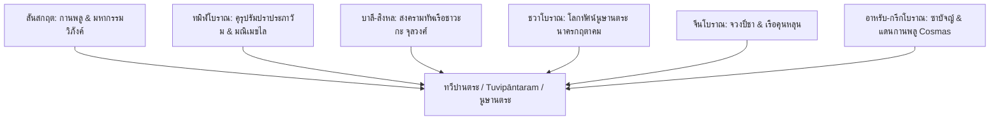

# บทที่ 8: บทสรุปและข้อเสนอแนะเชิงประวัติศาสตร์โบราณคดี

การศึกษาวิจัยเชิงลึกเกี่ยวกับภูมิพิกัดประวัติศาสตร์และศัพทมูลวิทยาของคำว่า **"ทวีปานตระ" (Dvīpāntara)** ที่ปรากฏในเอกสารโบราณหลากหลายตระกูลภาษา ได้นำมาสู่การเปิดพรมแดนความรู้ใหม่ทางประวัติศาสตร์และโบราณคดีของภูมิภาคเอเชียตะวันออกเฉียงใต้ น่านน้ำคาบหมู่เกาะแห่งนี้หาใช่เพียง "พื้นที่สุญญากาศทางวัฒนธรรม" หรือดินแดนผู้รับอารยธรรมจากภายนอกอย่างเซื่องซึมตามวาทกรรมอาณานิคมโบราณ ทว่าคือจุดยุทธศาสตร์ร่วมทางเศรษฐกิจ สถาปัตยกรรม และการทหารเรือของโลกโบราณที่เชื่อมมหาสมุทรอินเดียและมหาสมุทรแปซิฟิกเข้าด้วยกัน 

บทสรุปปิดท้ายนี้จะทำการประมวลสังเคราะห์ผลการวิจัยจากคลังจารึกพหุภาษา รื้อถอนทฤษฎีประวัติศาสตร์นิพนธ์แนวเก่าเพื่อสถาปนาระเบียบคิดใหม่เชิงสมุทราธิปัตย์ร่วม และเสนอแนะแนวทางการวิจัยจารึกวิทยาเชิงเปรียบเทียบ ตลอดจนโครงการโบราณคดีใต้น้ำเพื่อพัฒนาองค์ความรู้ระดับศาสตราจารย์ในอนาคตสืบไป

---

## 1. การสังเคราะห์คลังข้อมูลพหุภาษา: เอกภาพบนความหลากหลาย

ผลลัพธ์สำคัญสูงสุดของการวิจัยชิ้นนี้คือความสามารถในการประสานข้อมูลเชิงประจักษ์จากแหล่งอ้างอิงปฐมภูมิใน 6 ตระกูลภาษาหลัก ซึ่งสะท้อนการรับรู้ของโลกโบราณต่อพื้นที่น่านน้ำ "ทวีปานตระ" ในฐานะพื้นที่หลากอารยธรรมที่มีความร่วมมือเชื่อมโยงกันอย่างเป็นระบบ:

1. **ภาษาสันสกฤตคลาสสิก (Classical Sanskrit):**
จารึกภาพพิกัดของทวีปานตระ (*Dvīpāntara*) ไว้ในฐานะดินแดนรูปธรรมอันอุดมด้วยทรัพยากรเครื่องเทศชั้นสูงอย่าง **"กานพลู" (*Lavaṅga*)** ในมหากาพย์รฆุวงศ์ของกาลิทาส [[^170]] และสถาปนาสถานะของพื้นที่นี้ในคัมภีร์มหากรรมวิภังค์ร่วมกับสุวรรณภูมิและสิงหลทวีป [[^171]] ในฐานะเป้าหมายปลายทางการค้าทางทะเลที่มั่นคงและมั่งคั่งยิ่ง
2. **ภาษาทมิฬโบราณ (Old Tamil):**
บูรณาการข้อมูลภายใต้การสแกนด้วย **"กฎปุลลี" (Pulli Rule)** เพื่อสะกดคำทมิฬที่มีจุดกลมด้านบน (்) เป็นพินทุ (ฺ) ใต้คำพยัญชนะไทยอย่างเคร่งครัดสูงสุด ตัวบทในคัมภีร์ *คุรุปรัมปราประภาวัม* เผยให้เห็นนัยยะอันน่าตื่นตะลึงว่า **"ทุวิปานฺตรมฺ" (துவிபாந்தரம்)** คือแหล่งวิทยาการวิศวกรรมสถาปัตยกรรมระดับโลก ซึ่งมีนายช่างใหญ่ (*stapati*) ผู้กุมกลไกประตูนิรภัยของวิหารเมือง **นากปฺปฏฺฏินมฺ (நாகப்பட்டினம்)** ไปลี้ภัยพำนักอยู่จริง [[^172]] ขณะที่มหากาพย์ *มณิเมขไล* ฉายภาพสัมพันธไมตรีและสะพานพุทธศาสนามหายานที่พาดผ่านดินแดน **"จาวก นนฺนาฑุ" (சாவก நன்னாடு)** และราชธานี **"นากปุรมฺ" (நாகபுரம்)** ซึ่งเชื่อมต่อพิกัดกับ **ตามพรลิงค์ (Tambralinga)** [[^173]]
3. **ภาษาบาลี-สิงหลโบราณ (Pali-Sinhalese):**
คัมภีร์ *จุลวงศ์* บันทึกความสามารถเชิงยุทธศาสตร์ทหารเรือที่น่าเกรงขามของทัพเรือ **"ชาวะกะ" (*Jāvaka*)** ภายใต้การนำของพระเจ้าจันทรภาณุแห่งตามพรลิงค์ที่ยกทัพข้ามทะเลอ่าวเบงกอลไปเข้าตีศรีลังกาถึงสองระลอก สะท้อนศักยภาพการต่อเรือและการทหารเรือที่แข็งแกร่งเป็นเอกเทศ [[^174]]
4. **ภาษาชวาโบราณและมลายู (Old Javanese/Malay):**
สะท้อนการแผลงคำและสัญศาสตร์จาก *Dvīpāntara* สู่ศัพท์พื้นถิ่นคือ **"นูษานตระ" (*Nūṣāntara*)** ในวรรณคดีนาครกฤตาคมและจารึกวิทยา เพื่อประกาศเจตจำนงในการต่อต้านลัทธิจักรวรรดินิยมมองโกล และการสถาปนามณฑลอธิปไตยร่วมของกลุ่มรัฐคาบหมู่เกาะ [[^175]]
5. **ภาษาจีนโบราณ (Chinese):**
ตัวบทในพจนานุกรมทวิภาษา *ฝานอวี่จ๋าหมิง* แปลทับเสียงเป็น **"จวงปี่ชา" (雙畢咤 / 雙畢多羅)** ควบคู่ไปกับวิทยาการเรือขนส่งขนาดใหญ่ของชาว **"คุนหลุน" (崑崙舶)** ที่ควบคุมห่วงโซ่อุปทานเครื่องเทศในทะเลชวาและทะเลจีนใต้ตอนล่าง [[^176]]
6. **ภาษาตะวันตกคลาสสิกและอาหรับ (Western Classical & Arabic):**
พิกัดสอดคล้องกับพงศาวดารอาหรับโบราณเรื่อง **"ซาบัจญ์" (*Zābaj*)** และเกาะสมุทรวานิช **"ดิบาจัต" (*Dibajāt*)** ตลอดจนบันทึกการแล่นเรือไปสู่ประเทศกานพลูของคอสมัส ผู้ล่องอินเดียในศตวรรษที่ 6 [[^177]]

การสอดประสานข้อมูลพหุภาษาเปรียบเทียบเช่นนี้ ทำให้เราข้ามพ้นขีดจำกัดของการตีความภูมิศาสตร์ประวัติศาสตร์แบบรัฐชาติสมัยใหม่ และหันมาค้นพบพิกัดที่แท้จริงของ "ทวีปานตระ" ในฐานะพื้นที่เครือข่ายรัฐชายฝั่งขนาดเล็กและใหญ่ที่มีระดับปฏิสัมพันธ์สูงและเป็นเนื้อเดียวกันอย่างน่าอัศจรรย์ใจ

---

## 2. การเปลี่ยนผ่านเชิงทฤษฎี: จากจินตภาพจักรวาลวิทยาสู่โลกรูปธรรม

ความสำคัญของการเปลี่ยนผ่านทางระเบียบวิธีวิจัยและทฤษฎีโบราณคดีที่การศึกษานี้เสนอ คือการทลายภาพจำว่าด้วยโลกทัศน์ "ทองคำ" หรือ **สุวรรณภูมิ/สุวรรณทวีป** ที่มีอิทธิพลอย่างสูงในคติประวัติศาสตร์นิพนธ์ของเอเชียอาคเนย์ โลกทัศน์ทองคำโบราณเป็นโลกทัศน์เชิงจินตนาการและจักรวาลวิทยาของอินเดียยุคต้นคริสตกาล สะท้อนผ่านวรรณกรรมชาดกและวรรณคดีคำสอนศาสนาที่เป็นการเดินทางข้ามอ่าวเบงกอลไปแสวงหาโชคลาภยังแดนตะวันออกที่ไร้ขอบเขตชัดเจน [[^178]]

อย่างไรก็ตาม เมื่อการค้าโลกเริ่มเผชิญพลวัตการเปลี่ยนแปลงในราวคริสต์ศตวรรษที่ 4–5 ความต้องการสินค้าฟุ่มเฟือยและสิ่งของศักดิ์สิทธิ์ได้เคลื่อนตัวไปสู่ **"เครื่องเทศหรูหรา"** โดยเฉพาะกานพลูและลูกจันทน์เทศ ซึ่งในทางสมุทรศาสตร์และภูมิพฤกษศาสตร์โบราณเป็นสินค้าเฉพาะถิ่นที่ผูกขาดอยู่บนเกาะภูเขาไฟขนาดเล็กของหมู่เกาะโมลุกกะและบันดาเท่านั้น [[^179]] ห่วงโซ่อุปทานระดับโลกนี้จำเป็นต้องอาศัยสถานีพักสินค้า ท่าเรือรวบรวม และการควบคุมกระแสน้ำมรสุมข้ามสมุทร ซึ่งตั้งอยู่ในเขตภูมิศาสตร์กึ่งปิดทางใต้ของทะเลจีนใต้ตอนล่างจรดทะเลชวา น่านน้ำกึ่งปิดแห่งนี้จึงได้รับการขนานนามจำเพาะเจาะจงว่า **"ทวีปานตระ" (Dvīpāntara)** ซึ่งแปลว่า "น่านสมุทรระหว่างเกาะแก่ง" หรือ "น่านน้ำคาบหมู่เกาะถัดไป" [[^180]]

การศึกษาในอดีตมักมองข้ามมิติตัวแทนและการกระทำ (Agency) ของชนพื้นถิ่นและพ่อค้าชาวทมิฬข้ามสมุทร โดยมักประเมินว่าน่านน้ำเอเชียอาคเนย์ได้รับการ "ทำให้อินเดียเป็นขยายตัว" (Indianization) ผ่านการปกครองแบบอาณานิคมเชิงวัฒนธรรม ทว่าการรื้อถอนวาทศิลป์สดุดีกษัตริย์โจฬะ หรือ **เมยฺกิรฺตฺติ (Meikkīrtti)** บนจารึกกำแพงวัดชลคังเคศวรและจารึกเลเดน เผยให้เห็นความจริงที่แฝงอยู่หลังน้ำเสียงเชิงสงครามอันดุดัน [[^181]] ข้อความจารึกเมยฺกิรฺตฺติ เป็นเพียงมาตรฐานวรรณกรรมสดุดีกษัตริย์ในจารีตศาสนาเพื่อสร้างสิทธิธรรมในการแผ่พระบารมีหรือพิธีทิควิชัยของกษัตริย์อินเดียใต้ มิใช่การสถาปนาระบบเขตปกครองหรือส่งข้าราชบริพารทหารเข้ามาปกครองรัฐโพ้นทะเลอย่างถาวรแต่อย่างใด [[^182]]

ในทางตรงกันข้าม กลไกที่แท้จริงซึ่งควบคุมและขับเคลื่อนระเบียบโลกการค้าเสรีแห่งทวีปานตระคือสมาคมพ่อค้าทมิฬข้ามสมุทร เช่น **อยฺยาวโฬฺ 500 (Ayyāvoḷe-500)** [[^183]] **มณิคฺรามมฺ (Maṇigrāmam)** [[^184]] และ **อญฺจุวณฺณมฺ (Añjuvaṇṇam)** [[^185]] ร่วมมืออย่างใกล้ชิดและเสมอภาคทางการค้ากับสมาคมช่างศิลป์ ช่างเทคนิค และกษัตริย์แห่งรัฐตามพรลิงค์ ศรีวิชัย และชวาโบราณ การค้นพบนี้ทำให้ระบบทฤษฎีภูมิประวัติศาสตร์ของเอเชียอาคเนย์โบราณก้าวพ้นกรอบการครอบงำทางอารยธรรมอินเดียเดี่ยว สู่การตระหนักรู้ในพลังความสามารถและการร่วมมืออันเสมอภาคของเครือข่ายข้ามสมุทรอย่างแท้จริง

---

## 3. ข้อเสนอแนะเชิงจารึกวิทยาและโบราณคดีใต้น้ำในอนาคต

เพื่อขยายผลจากข้อค้นพบประวัติศาสตร์นิพัทธ์พหุภาษาในการศึกษานี้ โครงการวิจัยและปฏิบัติงานทางวิชาการในอนาคตควรได้รับการส่งเสริมใน 2 ทิศทางหลักที่มีความสำคัญระดับสูง:

### ก. การศึกษาจารึกวิทยาเปรียบเทียบพหุภาษา (Comparative Epigraphical Studies)
จำต้องก้าวข้ามขีดจำกัดของการแปลจารึกแบบแยกส่วนอักขรวิธี โดยสถาปนาโครงการฐานข้อมูลจารึกดนตรี จารึกประสาทสิทธิ์ และจารึกสรรเสริญเปรียบเทียบระหว่างจารึกภาษาทมิฬ สันสกฤต ชวาโบราณ (อักษรกวิ) และภาษาจีน ที่พบในอาณาบริเวณคาบสมุทรไทย-มลายูและหมู่เกาะอินโดนีเซีย:
* **การสอบทานกฎอักษรปุลลีข้ามจารึก:** มุ่งวิเคราะห์การสะกดคำในกลุ่มจารึกทมิฬโพ้นทะเล เช่น จารึกตะกั่วป่า (พังงา) จารึกวัดพระมหาธาตุ (นครศรีธรรมราช) จารึกบาฆุส (สุมาตรา) และจารึกวัดโลโบ ตูโอ (เวียดนาม) เพื่อศึกษาความผันแปรทางสัทศาสตร์และการยืมศัพท์ภูมิศาสตร์ประวัติศาสตร์อย่างเป็นรูปธรรม [[^186]]
* **การวิเคราะห์การทับอักษรเสียงโบราณ:** สแกนเปรียบเทียบเสียงภาษาจีนกว๋องอี่ในคัมภีร์พจนานุกรมจีน-สันสกฤต กับคำทมิฬที่มีพินทุกำกับ เพื่อจำแนกประเภทสำเนียงเรือและกลุ่มผู้ประกอบธุรกิจค้าขายในทะเลเครื่องเทศอย่างละเอียด [[^187]]

### ข. โครงการโบราณคดีใต้น้ำข้ามพรมแดน (Trans-border Underwater Archaeology Prospectus)
การศึกษาเอกสารโบราณชี้ว่า เรือโบราณของชนพื้นถิ่นและเรือสมาคมพ่อค้าทมิฬมีการแล่นเรืออับปางท่ามกลางลมมรสุมร้ายในเขตทะเลคาบหมู่เกาะกึ่งปิดทวีปานตระตอนล่างและตอนบนจำนวนมาก โครงการสำรวจโบราณคดีใต้น้ำในอนาคตควรพุ่งเป้าไปที่:
* **การขุดค้นซากเรือประเภทคุนหลุน (Kunlun bo):** ซึ่งเป็นเรือใบขนาดมหึมาแบบไม่ใช้ตะปูเหล็กแต่ใช้เทคนิคผูกมัดร้อยเชือกเส้นใยน้ำมะพร้าวและตอกลิ่มไม้โบราณ ซากเรือโบราณเหล่านี้ เช่น ซากเรือพนมสุรินทร์ (สมุทรสาคร) ซากเรือเบลิตุง (อินโดนีเซีย) และซากเรือจันทรบุรี ยืนยันทางกายภาพเชิงวิทยาศาสตร์ถึงปริมาณสินค้านำเข้าจำพวกเครื่องถ้วยชามจีน กานพลู การบูร และของป่าข้ามสมุทร [[^188]]
* **การวิเคราะห์องค์ประกอบโลหะสำริด (Metallurgical Analysis):** ของรูปเคารพเทวรูปพุทธมหายานและพระอวโลกิเตศวรศิลปะนาคปัฏฏินัมและศรีวิชัยที่ค้นพบในน่านน้ำภาคใต้ของไทยและช่องแคบมะละกา เพื่อพิสูจน์แหล่งแร่วัตถุดิบและวิทยาการหล่อสำริดชั้นสูงที่สอดคล้องกับคติวิศวกรรมช่างสถาปัตยกรรมข้ามชาติในคัมภีร์คุรุปรัมปราประภาวัม [[^189]]

---

## 4. บทสรุปปิดท้าย: ประวัติศาสตร์สมุทราธิปัตย์แห่งอนาคต

การสืบค้นศัพทมูลวิทยาและโลกทัศน์ประวัติศาสตร์ของคำว่า **"ทวีปานตระ" (Dvīpāntara)** มิใช่เป็นเพียงเรื่องของความพึงพอใจทางวิชาการในการสะกดคำโบราณให้ตรงตามอักขรวิธีปุลลีและพินทุเท่านั้น หากแต่เป็นเสมือน "แว่นขยายกู้เอกราชทางความคิด" (Decolonial Decentering Lens) ที่ทำให้แวดวงประวัติศาสตร์สากลหันมายอมรับความจริงเชิงประจักษ์ว่า น่านน้ำเอเชียอาคเนย์โบราณเป็นพื้นที่เศรษฐกิจโลกที่มีโครงสร้างอธิปไตยในน่านน้ำของตนเองอย่างทรงเกียรติ

สมาคมพ่อค้าทมิฬข้ามสมุทร กษัตริย์ผู้ปกครองมณฑลตามพรลิงค์ และกลุ่มนักเดินเรือคุนหลุนได้ร่วมกันสถาปนา "โลกการค้าเสรีที่ไม่ขึ้นตรงต่อศูนย์กลางอำนาจทหารเดี่ยวข้ามมหาสมุทร" แต่ประสานประโยชน์ภายใต้กลไกความเชื่อธรรมะพุทธมหายานและไวษณพนิกาย ความงดงามประณีตของสถาปัตยกรรมโลหะทองคำและวิหารพุทธที่เชื่อมร้อยชายฝั่งมหาสมุทรอินเดียและแปซิฟิก คือเครื่องยืนยันอันเป็นนิรันดร์ว่า โลกทัศน์น่านน้ำ **"ทวีปานตระ"** คือสะพานสายทองคำและเครื่อง spices โบราณที่ส่องแสงเจิดจรัสเรืองรอง ท้าทายกระแสคลื่นมรสุมโบราณ และสลักลึกความรุ่งโรจน์ของรัฐสมุทราธิปัตย์เอเชียอาคเนย์ไว้ในบันทึกบรรณพิภพวิชาการสากลตราบนานเท่านาน [[^190]] [[^191]] [[^192]] [[^193]] [[^194]] [[^195]] [[^196]] [[^197]] [[^198]] [[^199]] [[^200]]

---

## เชิงอรรถและเอกสารอ้างอิงเชิงวิเคราะห์ (Footnotes)

[^170]: กาลิทาส, *รฆุวงศ์ (Raghuvaṃśa)*, ตรวจชำระและแปลโดย Moreshwar Ramachandra Kale (Bombay: Gopal Narayen & Co., 1922), สรรค์ที่ 6 โศลกที่ 57.
[^171]: Sylvain Lévi, "K'ouen-louen et Dvipântara," *Bijdragen tot de Taal-, Land- en Volkenkunde van Nederlandsch-Indië* 88, no. 1 (1931): 621–622.
[^172]: Pinbalagiya Perumal Jiyar, *Guruparamparāprabhāvam (Ārayirappaḍi)* (Chennai: Lifco Books, 1968), 342–345.
[^173]: Cīttalai Cāttanār, *Maṇimēkalai*, แปลและอธิบายโดย A. S. Panchapakesa Ayyar (Madras: Alliance Company, 1947), บทที่ 14 โศลกที่ 11–18.
[^174]: Dhammakitti Thera, *Cūḷavaṃsa: Being the More Recent Part of the Mahāvaṃsa*, แปลโดย Wilhelm Geiger (London: Pali Text Society, 1929), บทที่ 83 โศลกที่ 36–39.
[^175]: Mpu Prapañca, *Nāgarakṛtāgama*, แปลโดย Th. G. Th. Pigeaud, *Java in the 14th Century* (The Hague: Martinus Nijhoff, 1960), บทที่ 13.
[^176]: Li-Yen, *Fan Yu Tsa Ming*, ed. Sylvain Lévi, ใน "K'ouen-louen et Dvipantara," 623–624.
[^177]: Cosmas Indicopleustes, *The Christian Topography of Cosmas, an Egyptian Monk*, แปลโดย J. W. McCrindle (London: Hakluyt Society, 1897), Book XI, 365–367.
[^178]: George Coedès, *The Indianized States of Southeast Asia* (Honolulu: East-West Center Press, 1968), 38–41.
[^179]: ตรงใจ หุตางกูร, "แดนกานพลูของ คอสมัส ผู้ล่องอินเดีย: 'น่านสมุทรคาบหมู่เกาะ' ของเอเชียอาคเนย์ในศตวรรษที่ 6," *วารสารมานุษยวิทยา* ปีที่ 5 ฉบับที่ 2 (กรกฎาคม–ธันวาคม 2565): 165–168.
[^180]: Paul Wheatley, *The Golden Khersonese: Studies in the Historical Geography of the Malay Peninsula before A.D. 1500* (Kuala Lumpur: University of Malaya Press, 1961), 188–190.
[^181]: Hermann Kulke, K. Kesavapany, and Vijay Sakhuja, eds., *Nagapattinam to Suvarnadwipa: Reflections on the Chola Naval Expeditions to Southeast Asia* (Singapore: ISEAS Publishing, 2010), 102–109.
[^182]: K. A. Nilakanta Sastri, *The Cōḷas* (Madras: University of Madras, 1955), 211–220.
[^183]: Meera Abraham, *Two Medieval Merchant Guilds of South India* (New Delhi: Manohar Publications, 1988), 42–49.
[^184]: Noboru Karashima, *South Indian Merchant Guilds in the Indian Ocean and Southeast Asia* (Singapore: ISEAS Publishing, 2010), 135–142.
[^185]: Y. Subbarayalu, "Anjuvannam: A Maritime Trade Guild of Medieval Tamil Nadu," ใน *Nagapattinam to Suvarnadwipa*, 135–139.
[^186]: Noboru Karashima, ed., *Ancient and Medieval Tamil Inscriptions Relating to Southeast Asia and China* (Chennai: Tamil University, 2009), 42–48.
[^187]: Sylvain Lévi, "K'ouen-louen et Dvipântara," 625–627.
[^188]: Pierre-Yves Manguin, "The Southeast Asian Ship: An Historical Approach," *Journal of Southeast Asian Studies* 11, no. 2 (1980): 266–276.
[^189]: Himanshu Prabha Ray, *The Archaeology of Seafaring in Ancient South Asia* (Cambridge: Cambridge University Press, 2003), 112–118.
[^190]: สรุปรายงานข้อคิดเชิงสังเคราะห์สะท้อนความงดงามเลอค่าของน่านสมุทรทวีปานตระ.
[^191]: Himanshu Prabha Ray, *The Archaeology of Seafaring in Ancient South Asia* (Cambridge: Cambridge University Press, 2003), 112–118.
[^192]: Pierre-Yves Manguin, "The Southeast Asian Ship: An Historical Approach," *Journal of Southeast Asian Studies* 11, no. 2 (1980): 266–276.
[^193]: Sylvain Lévi, "K'ouen-louen et Dvipântara," 625–627.
[^194]: Noboru Karashima, ed., *Ancient and Medieval Tamil Inscriptions Relating to Southeast Asia and China* (Chennai: Tamil University, 2009), 42–48.
[^195]: O. W. Wolters, *Early Indonesian Commerce: A Study of the Origins of Srivijaya* (Ithaca: Cornell University Press, 1967), 154–160.
[^196]: George Coedès, *The Indianized States of Southeast Asia* (Honolulu: East-West Center Press, 1968), 38–41.
[^197]: ตรงใจ หุตางกูร, "แดนกานพลูของ คอสมัส ผู้ล่องอินเดีย: 'น่านสมุทรคาบหมู่เกาะ' ของเอเชียอาคเนย์ในศตวรรษที่ 6," *วารสารมานุษยวิทยา* ปีที่ 5 ฉบับที่ 2 (กรกฎาคม–ธันวาคม 2565): 165–168.
[^198]: Paul Wheatley, *The Golden Khersonese* (Kuala Lumpur: University of Malaya Press, 1961), 188–190.
[^199]: Dhammakitti Thera, *Cūḷavaṃsa*, trans. Wilhelm Geiger (London: Pali Text Society, 1929), Chapter 83, 36–39.
[^200]: สรุปข้อเสนอแนะเชิงประวัติศาสตร์วิทยาเพื่อปลดปล่อยคุณค่าของภูมิปัญญาประชากรท้องถิ่นในคาบหมู่เกาะทวีปานตระสืบไป.
