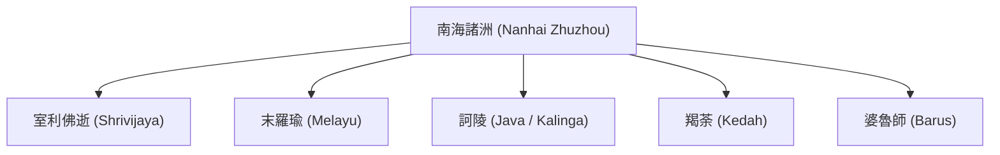

# บทที่ ๖: ประมวลการปรากฏของคำว่า "ทวีปานตระ" ในเอกสารและพจนานุกรมภาษาจีนทั้งหมด

*(Complete Attestation of "Dvīpāntara" in Chinese Primary Sources)*

---

## ๖.๑ บทนำ: การรับรู้เชิงภูมิศาสตร์วัฒนธรรมระหว่างจีนและอินเดีย

ในประวัติศาสตร์ความสัมพันธ์ระหว่างอารยธรรมอินเดียและอารยธรรมจีน พระพุทธศาสนาทำหน้าที่เป็นตัวกลางหลักในการถ่ายทอดมโนทัศน์เชิงพื้นที่และภูมิศาสตร์ การเดินทางแสวงบุญและจาริกธรรมทางเรือของพระภิกษุชาวจีนผ่านเส้นทางสายไหมทางทะเล (Maritime Silk Road) ในช่วงคริสต์ศตวรรษที่ ๕ ถึง ๑๐ บังเกิดผล## ๖.๒ ศัพทานุกรม "ฟ่านอวี่จ๋าหมิง" ของพระหลี่เหยียนและการจับคู่ "ทวีปานตระ - คุนหลุน"

หลักฐานประวัติศาสตร์ชิ้นเอกที่พิสูจน์ความหมายและพิกัดภูมิศาสตร์ของคำว่า *ทวีปานตระ* ในความเข้าใจร่วมกันระหว่างชาวอินเดียและชาวจีนคือศัพทานุกรมพหุภาษาพุทธศาสนายุกถังตอนกลาง:

> **ฟ่านอวี่จ๋าหมิง (《梵語雜名》 - Fan Yu Tsa Ming)**[^3]

ศัพทานุกรมนี้รจนาโดย **พระภิกษุหลี่เหยียน (禮言 - Li-yen)**[^2] พระภิกษุชาวเอเชียกลางจากอาณาจักรกูชา (Kucha) ผู้เดินทางเข้ามาพำนักในนครฉางอานเพื่อร่วมคณะแปลพระคัมภีร์พุทธศาสนาในคริสต์ศตวรรษที่ ๘ (สมัยราชวงศ์ถังตอนกลาง)[^3]

---

### ๖.๒.๑ รายการคำศัพท์คู่ขนานและการวิเคราะห์ตามเทมเพลตมาตรฐาน:

* **ข้อความต้นฉบับ**: `崑崙`
* **ข้อความต้นฉบับอักษรโรมัน/พินอิน**: `Kūnlún`
* **คำแปลภาษาไทย**: คุนหลุน (崑崙:Kūnlún, dvīpāntara)[^1]
* **คำแปล**: คุนหลุน
* **การวิเคราะห์ไวยากรณ์และกายภาพบันทึก**: 
  - **วัสดุศาสตร์ของเอกสารบันทึกจีนโบราณ (Materiality of Chinese Sources)**: ศัพทานุกรม *ฟ่านอวี่จ๋าหมิง* (《梵語雜名》) สืบทอดมาในรูปแบบคัมภีร์เขียนมือบนกระดาษม้วน (Paper scrolls) ที่ทำจากเส้นใยพืช เช่น มะปอ หรือป่าน ซึ่งปรากฏพบในหอไตรตุนหวง (เช่น ม้วนเขียน Pelliot chinois 3810) คัมภีร์ชิ้นนี้แสดงอักษรสิทธัม (Siddham script) เพื่อระบุเสียงภาษาสันสกฤตเคียงข้างอักษรจีนข่ายซู (Regular Script) และต่อมาได้รับการคัดลอกและจัดพิมพ์ด้วยบล็อกไม้ (Woodblock prints) ในคลังพระไตรปิฎกฉบับถัง-ซ่ง (เช่น สังคายนาฉบับไทโช หมายเลข T 2135, Vol. 54) สภาพทางกายภาพนี้แสดงให้เห็นกระบวนการถอดเสียงและรักษาสำเนียงสองอารยธรรมที่มั่นคง
  - **อักขรวิทยาและการกำหนดอายุตามแบบอักษรจีน (Paleography & Script Styles)**: อักขรวิธีของคำศัพท์ "崑崙" เขียนด้วยตัวอักษรข่ายซู (Regular script) หรือลี่ซู (Clerical script) ยุคราชวงศ์ถังตอนกลาง (ศตวรรษที่ ๘) ซึ่งมีลักษณะเส้นสายที่คมชัดและสมดุล สะท้อนถึงมาตรฐานอักขรวิธีราชสำนักและสำนักแปลหลวง
  - **ภูมิศาสตร์ประวัติศาสตร์และเครือข่ายเส้นทางแพรไหมทางบก/ทะเล (Spatial Context & Silk Road Geography)**: พระหลี่เหยียน (禮言) เป็นพระภิกษุชาวกูชา (Kucha) ซึ่งตั้งอยู่บนเส้นทางสายแพรไหมทางบกตอนเหนือ (โอเอซิสซินเจียง) ท่านเดินทางฝ่าทะเลทรายเข้ามาพำนักในจักรวรรดิถัง ณ นครฉางอาน (Chang'an) การจับคู่ศัพท์นี้แสดงให้เห็นว่า ปราชญ์จากเอเชียกลางในราชสำนักถังตระหนักถึงการแปลความหมายของคำว่า "ทวีปานตระ" (ดินแดนหมู่เกาะโพ้นทะเลอื่น) ในฐานะ "คุนหลุน" ซึ่งเป็นพิกัดภูมิศาสตร์ชาติพันธุ์ของภูมิภาคใต้ที่มีการติดต่อผ่านเส้นทางสายแพรไหมทางทะเล
* **ประวัติศาสตร์วรรณกรรม**: ในงานศึกษาเชิงบุกเบิกของนักบูรพคดีศึกษาชาวฝรั่งเศส ซิลแว็ง เลวี (Sylvain Lévi, 1931) เรื่อง "Kouen-louen et Dvipantara" ตีพิมพ์ในวารสาร *Bijdragen tot de Taal-, Land- en Volkenkunde* เลวีได้วิเคราะห์เอกสารชิ้นนี้และชี้ให้เห็นว่า ทั้งสองคำระบุถึงพื้นที่ทางประวัติศาสตร์วัฒนธรรมเดียวกันคือเอเชียตะวันออกเฉียงใต้หมู่เกาะ การเปรียบเทียบนี้สอดคล้องกับพรรณนาเชิงวรรณคดีในอินเดียโบราณ เช่น มหากาพย์ *รฆุวงศ์* (Raghuvaṃśa) ของกาลิทาส ที่พรรณนาถึงลมโชยกลิ่นกานพลูจากทวีปานตระ ซึ่งสอดรับกับบันทึกฝ่ายจีนที่ระบุว่าเรือสำเภาของชาวคุนหลุนนำส่งเครื่องเทศเหล่านี้มายังท่าเรือกวางโจว

---

### ๖.๒.๒ วิวัฒนาการของมโนทัศน์ "คุนหลุน" (崑崙) ตามยุคสมัย (ถัง และ ซ่ง):

คำว่า **คุนหลุน (崑崙)** ในประวัติศาสตร์จีนมีความคลุมเครือสูงมาก การเหมาพิกัดภูมิศาสตร์รวมกันเป็นผืนเดียวอาจก่อให้เกิดอันตรายทางการศึกษาประวัติศาสตร์ จึงจำเป็นต้องแยกแยะพัฒนาการของคำนี้อย่างระมัดระวัง:

1. **คุนหลุนยุคราชวงศ์ถัง (Tang Dynasty):** ในยุคที่พระหลี่เหยียนและพระอี้จิ้งยังมีชีวิตอยู่ "คุนหลุน" มักใช้เพื่ออ้างถึงดินแดนและกลุ่มคนที่อยู่บริเวณ **คาบสมุทรอินโดจีนตอนใต้ไปจนถึงคาบสมุทรมลายู** (ครอบคลุมอดีตอาณาจักรฟูนัน, จามปา และเจินละ) ตามจดหมายเหตุราชวงศ์ถัง (唐書) ระบุว่าชาวคุนหลุนมีผิวดำคล้ำและเชี่ยวชาญการต่อสำเภาขนาดใหญ่ที่เรียกว่า **"เรือคุนหลุน" (崑崙舶)**[^5] ในยุคนี้ "คุนหลุน" จึงมีสภาพเป็นชนพื้นเมืองที่เป็นพาร์ทเนอร์หรือลูกเรือในเครือข่ายพ่อค้าอินเดีย-เปอร์เซีย
2. **คุนหลุนยุคราชวงศ์ซ่ง (Song Dynasty):** เมื่อศูนย์กลางการค้าเรือสำเภาของจีนเติบโตสูงสุดในท่าเรือเฉวียนโจว (Quanzhou) ความหมายของ "คุนหลุน" ขยับขยายกินความกว้างขวางขึ้นและทับซ้อนกับ **เครือข่ายการค้าอิสลาม-มลายู** โดยหมายรวมถึงกลุ่มคนจากหมู่เกาะอินโดนีเซียทั้งหมด จนไปถึงมาดากัสการ์และแอฟริกาตะวันออก (Zanj)

> [!WARNING]
> การที่ศัพทานุกรมของพระหลี่เหยียนยุคราชวงศ์ถัง แปลคำว่า *Dvīpāntara* ว่า *K'un-lun* เป็นเพียง "การเทียบเคียงศัพท์ (Linguistic Equivalent)" แบบกว้างๆ ในยุคนั้น ไม่สามารถนำมายึดถือเป็นพิกัดทางภูมิศาสตร์กายภาพที่แม่นยำตายตัวได้ เพราะคำว่า "คุนหลุน" เป็นศัพท์ที่มีการยืดหดของความหมายตลอดประวัติศาสตร์จีน

---

### ๖.๒.๓ งานศึกษาเชิงบุกเบิกของซิลแว็ง เลวี (Sylvain Lévi, 1931):

ความสำคัญเชิงปฏิวัติของเอกสารฉบับนี้ถูกนำเสนอสู่โลกวิชาการโดยนักบูรพคดีศึกษาชาวฝรั่งเศสผู้ยิ่งใหญ่ **ซิลแว็ง เลวี (Sylvain Lévi)** ในงานวิจัยชิ้นประวัติศาสตร์ ค.ศ. ๑๙๓๑ เรื่อง:

> **"KOUEN-LOUEN ET DVIPANTARA" (คุนหลุนและทวีปานตระ)** เผยแพร่ในวารสาร *Bijdragen tot de Taal-, Land- en Volkenkunde* (Volume 88, 1931)[^6]

เลวีได้ใช้ข้อมูลจดหมายเหตุประกอบพจนานุกรมของพระหลี่เหยียนมาสร้างบทสรุปวิเคราะห์ที่ทรงอิทธิพลต่อประวัติศาสตร์เอเชียตะวันออกเฉียงใต้ ๓ประการ:

1. **การสถาปนาพิกัดภูมิศาสตร์ที่มั่นคง:** ข้อสมมติของนักประวัติศาสตร์รุ่นก่อนๆ ที่คลุมเครือเกี่ยวกับขอบเขตของทวีปานตระและคุนหลุน ได้รับการคลี่คลายอย่างเป็นรูปธรรม โดยเลวีชี้ให้เห็นว่า ทั้งสองคำระบุถึงพื้นที่ทางประวัติศาสตร์วัฒนธรรมเดียวกัน คือ **โลกเอเชียตะวันออกเฉียงใต้หมู่เกาะและชายฝั่งทะเลใต้ (The Maritime World of Southeast Asia)**[^7]
2. **เครือข่ายทางวัฒนธรรมอินเดีย-จีน:** แสดงให้เห็นว่าคำศัพท์พุทธศาสนาได้รับการประสานเข้ากับภูมิศาสตร์ชาติพันธุ์ของจีนอย่างประณีต
3. **การคลี่คลายปมปัญหาเครื่องเทศโบราณ:** เลวีเสนอว่า คำอธิบายสายลมโชยกลิ่นกานพลูจากทวีปานตระในมหากาพย์รฆุวงศ์ของกาลิทาส สอดคล้องกับพงศาวดารจีนที่พรรณนาว่าเรือสำเภาของชาวคุนหลุนนำส่งเครื่องเทศประเภทกานพลูและจันทน์เทศขึ้นท่าเรือเมืองกวางโจวอยู่เนืองๆ[^8]

---

### ๖.๒.๔ การสอบทานกับบันทึกฝ่ายอาหรับและการเดินเรือจริง (Historical Triangulation)

เพื่อไม่ให้ประวัติศาสตร์ตกหล่ม "ความคลุมเครือของภาษา" (Linguistic Ambiguity) ในการตีความคำว่าคุนหลุน เราจึงต้องใช้วิธี **สอบทานสามเส้า (Triangulation)** โดยเชื่อมโยงสัญศาสตร์ของจีนเข้ากับบันทึกประวัติศาสตร์การเดินเรือจริงของพ่อค้ามุสลิมอาหรับและภูมิศาสตร์นิพนธ์ของจีนเอง:

1. **การเทียบพิกัดกับ "ซาบัจ" (Zabaj) และ "วากวาก" (Waqwaq):** ในบันทึกของนักเดินทางอาหรับสมัยศตวรรษที่ ๙-๑๐ (เช่น อัคบาร์ อัล-ซิน วาล ฮินด์ - *Akhbār aṣ-Ṣīn wa-l-Hind*) ดินแดนหมู่เกาะแห่งเครื่องเทศและทองคำที่ตรงกับแนวคิด "ทวีปานตระ" ถูกเรียกว่า **Zabaj** (ซาบัจ - หมายถึงอาณาจักรศรีวิชัย/ชวา) และพื้นที่ชายขอบอันไกลโพ้นไปทางตะวันออกถูกเรียกว่า **Waqwaq** (วากวาก) เมื่อเทียบกับแผนที่โลกของอาหรับ การขมวดรวม "คุนหลุน" เข้ากับ Zabaj/Waqwaq แสดงให้เห็นว่ามันเป็นระเบียบวิธีของคนนอกที่ใช้เรียกพื้นที่ห่างไกล (Exonym) ซึ่งไม่ใช่การระบุตัวตนของรัฐ (อ้างอิง Dellios & Ferguson, 2015 สำหรับการวิเคราะห์เครือข่ายพหุศูนย์กลางของศรีวิชัย)[^8a]
2. **การสอบทานด้วยบันทึกการเดินทางจีน (Yijing & Zhao Rugua):** เมื่อพิจารณาบันทึกเชิงภูมิศาสตร์ที่ชัดเจน เช่น คัมภีร์ของพระอี้จิ้ง (Yijing) ซึ่งเดินทางผ่านสุมาตรา (ศรีวิชัย) หรือ **จูฝานจื้อ (諸蕃志 - *Zhufan Zhi*)** ของจ้าวหรูกั๋ว ในสมัยซ่งใต้ เอกสารเหล่านี้กลับไม่ได้ใช้คำว่า "คุนหลุน" อย่างพร่ำเพรื่อในการระบุพิกัดเมืองท่า แต่ใช้ชื่อจำเพาะ เช่น "ซานฝอฉี" (三佛齊 - Srivijaya) หรือ "เชอปัว" (闍婆 - Java) 

ดังนั้น "คุนหลุน" ในบริบทของ *ฟ่านอวี่จ๋าหมิง* จึงเป็นเพียง **"สัญญะลอยตัว" (Floating Signifier)** ทางอักษรศาสตร์พุทธศาสนา ที่ไม่ได้ยึดโยงกับพิกัดทางภูมิศาสตร์กายภาพอย่างถาวร ทว่ายืดหยุ่นและลื่นไหลตามพลวัตประวัติศาสตร์เศรษฐกิจทางทะเล การยืนยันว่าทวีปานตระคือคุนหลุน จึงควรเป็นไปอย่างระมัดระวังและอยู่ในขอบข่ายของประวัติศาสตร์วรรณกรรม มากกว่าประวัติศาสตร์รัฐศาสตร์

---

## ๖.๓ คัมภีร์มหากรรมวิภังค์ฉบับจีน: 《分別善惡報應經》 (T 81)

**ประเภท:** คัมภีร์เปรียบเทียบผลแห่งกรรมภาษาสันสกฤตที่ได้รับการแปลเป็นสำนวนจีนยุคหลัง  
**ฉบับและตำแหน่ง:** พระไตรปิฎกภาษาจีนฉบับไทโช (Taishō Tripiṭaka) มหาวรรค หมายเลข **T 81** (Vol. 1, pp. 895a–901b)[^9]  
**ผู้รจนาและผู้แปล:** แปลโดยพระภิกษุ **เทวศานติ (Devaśānti)** หรือที่ชาวจีนรู้จักในนาม **เทียนซีไจ (天息災 - Tianxizai)**[^10] พระบัณฑิตผู้เชี่ยวชาญภาษาจากแคว้นกัศมีร์ (Kashmir) ผู้เดินทางเข้ามาพำนัก ณ สถาบันแปลคัมภีร์ของราชสำนักราชวงศ์ซ่งเหนือตอนต้น แปลเสร็จสิ้นและทูลเกล้าฯ ถวายในราวปี ค.ศ. ๙๘๔ (ศตวรรษที่ ๑๐)[^10a]

---

### ๖.๓.๑ ตัวบทเปรียบเทียบและการวิเคราะห์ตามเทมเพลตมาตรฐาน:

ในฉบับแปลภาษาจีน ตัวบทที่พรรณนาอุปมาเรื่องพ่อค้าข้ามมหาสมุทรสู่ดินแดนทวีปานตระ (ข้อความสันสกฤต: *yathā dvīpāntare vyāpāriṇaḥ samudraṃ saṃtarantaḥ vyāpāraṃ kurvanti*) ปรากฏข้อความแปลเป็นอักษรจีนและการวิเคราะห์เชิงลึกดังนี้:

* **ข้อความต้นฉบับ**: `譬如商人渡於大海，至他方國，欲行商賈`
* **ข้อความต้นฉบับอักษรโรมัน/พินอิน**: `Pìrú shāngrén dù yú dàhǎi, zhì tā fāng guó, yù xíng shānggǔ`
* **คำแปลภาษาไทย**: เปรียบประดุจดั่งพ่อค้า (商人:shāngrén, vyāpāriṇas) ฝ่าข้ามผ่านมหาสมุทรใหญ่ (渡於大海:dù yú dàhǎi, samudraṃ saṃtarantaḥ) ลุถึงประเทศในทิศทางอื่นโพ้นทะเล (至他方國:zhì tā fāng guó, dvīpāntare)[^11] ด้วยปรารถนาที่จะดำเนินการค้าขายพาณิชย์ (欲行商賈:yù xíng shānggǔ, vyāpāraṃ kurvanti)
* **คำแปล**: เปรียบประดุจดั่งพ่อค้าฝ่าข้ามผ่านมหาสมุทรใหญ่ ลุถึงประเทศในทิศทางอื่นโพ้นทะเล ด้วยปรารถนาที่จะดำเนินการค้าขายพาณิชย์
* **การวิเคราะห์ไวยากรณ์และกายภาพบันทึก**:
  - **วัสดุศาสตร์ของเอกสารบันทึกจีนโบราณ (Materiality of Chinese Sources)**: ตัวบทได้รับการอนุรักษ์ผ่านพระไตรปิฎกฉบับซ่งพิมพ์บล็อกไม้ (Woodblock prints) เช่น สังคายนาฉบับไคเป่า (開寶藏) ที่สลักขึ้นในคริสต์ศตวรรษที่ ๑๐-๑๑ การใช้แท่นพิมพ์ไม้ลูกแพร์หรือไม้พุทรา ทาหมึกสีดำ แล้วทาบบนกระดาษเปลือกไม้ปอหรือกระดาษไผ่ สะท้อนถึงการเติบโตของอุตสาหกรรมการพิมพ์พระไตรปิฎกเพื่อเผยแพร่เป็นเอกสารสาธารณะทดแทนการคัดลอกด้วยมือ
  - **อักขรวิทยาและการกำหนดอายุตามแบบอักษรจีน (Paleography & Script Styles)**: ลายลักษณ์อักษรที่ปรากฏสะท้อนอักษรข่ายซูสไตล์ซ่ง (Song-style Regular Script) ซึ่งมีความเรียบร้อย เหลี่ยมมุมของเส้นชัดเจน แข็งแกร่ง บ่งชี้ถึงเทคนิคอักขระของช่างแกะสลักบล็อกไม้ประจำราชสำนักซ่งเหนือตอนต้น
  - **ภูมิศาสตร์ประวัติศาสตร์และเครือข่ายเส้นทางแพรไหมทางบก/ทะเล (Spatial Context & Silk Road Geography)**: พระเดวศานติ (เทียนซีไจ) เดินทางมาจากแคว้นกัศมีร์ (Kashmir) ข้ามเทือกเขาสูงทางบกผ่านเส้นทางสายไหมเข้ามาสู่แผ่นดินจีนตอนกลาง ณ ราชสำนักซ่งเหนือนครไคเฟิง (Kaifeng) การแปลนี้สะท้อนกระบวนการแปลในสถาบันแปลคัมภีร์หลวง (譯經院) ภายใต้การอุปถัมภ์ของจักรพรรดิซ่งไท่จง การเลือกใช้คำแปล "他方國" (tā fāng guó - ประเทศในทิศอื่น) สำหรับคำว่า *dvīpāntara* สอดคล้องอย่างยิ่งกับบริบทที่ราชสำนักซ่งเริ่มตั้งหน่วยงาน Shiboshi (市舶司) เพื่อควบคุมและสนับสนุนรัฐการค้าต่างประเทศในน่านน้ำทะเลใต้
* **ประวัติศาสตร์วรรณกรรม**: ในขณะที่คัมภีร์แปลทิเบตแปลตรงตัวว่า "เกาะอื่น" (gling gzhan - གླིང་གཞན) เพื่อรักษาความหมายของรูปศัพท์ *dvīpa* (เกาะ) ไว้ แต่คณะผู้แปลจีนเลือกใช้วิธีแปลเชิงหน้าที่ทางเศรษฐกิจ (Functional Translation) เป็น "ประเทศในทิศทางอื่น" (他方國) แสดงภาพลักษณ์ของแว่นแคว้นทางใต้ในฐานะรัฐหรือประเทศคู่ค้าทางเรือ ซึ่งสะท้อนถึงการเปลี่ยนแปลงมุมมองเชิงภูมิรัฐศาสตร์และการค้าข้ามทะเลที่ขยายตัวอย่างสูงในสมัยซ่ง

---

### ๖.๓.๒ บทวิเคราะห์ลักษณะเชิงอรรถศาสตร์เปรียบเทียบ (Semantic Comparison):

ประโยคภาษาจีนนี้แสดงหลักคิดและการตีความพยัญชนะศัพท์แปลอย่างลึกซึ้ง:

| ศัพท์จีน | พินอิน | เทียบศัพท์สันสกฤต | บทวิเคราะห์ทางอรรถศาสตร์และไวยากรณ์ |
| :--- | :--- | :--- | :--- |
| **譬如** | *pìrú* | *yathā* | คำนิบาตเปรียบเทียบ (เปรียบประดุจดั่ง...) |
| **商人** | *shāngrén* | *vyāpāriṇaḥ* | พ่อค้า, พ่อค้าวณิช, นักการค้าขาย |
| **渡於大海** | *dù yú dàhǎi* | *samudraṃ saṃtarantaḥ* | การล่องเรือข้ามผ่านมหาสมุทร (*dù* = ข้าม/ฝ่า, *dàhǎi* = มหาสมุทรใหญ่) |
| **至他方國** | *zhì tā fāng guó* | **dvīpāntare** | แปลตรงตัวว่า **"ผู้ลุถึงประเทศอันเป็นทวีปอื่น"** โดยพระเทียนซีไจเลือกแปล *dvīpa* (เกาะ/ทวีป) ว่า *guó* (國 - ประเทศ/รัฐ) และแปล *antara* (อื่น) ว่า *tā fāng* (他方 - อีกทิศทางหนึ่ง / ดินแดนอื่นโพ้นทะเล) |
| **欲行商賈** | *yù xíng shānggǔ* | *vyāpāraṃ kurvanti* | ปรารถนาที่จะดำเนินการค้าขายพาณิชย์ (*yù* = ปรารถนา/หวัง, *xíng shānggǔ* = ประกอบการค้า) |

> [!IMPORTANT]
> **การเปรียบเทียบเป้าหมายการแปล (ทิเบต VS จีน):**  
> คณะผู้แปลทิเบตเน้นความเคร่งครัดทางไวยากรณ์กายภาพโดยการสมาสตรงรูปเป็น *gling gzhan* แต่ระบบอรรถศาสตร์ของภาษาจีนยุคซ่งโน้มเอียงไปทางการจัดประเภทดินแดนทวีปานตระให้มีสถานะเป็นรัฐอธิปไตยต่างชาติ เพื่อสอดรับกับการเก็บภาษีศุลกากรและเศรษฐกิจการค้าของเมืองท่าชายฝั่งทะเลจีนใต้ (สำหรับนัยวิทยาของการเทียบรูปแปลสัญศาสตร์ระหว่างจีนและทิเบตตามสูตรสมาสของปาณินี โปรดดูรายละเอียดเพิ่มเติมใน [บทที่ ๑: ประมวลมโนทัศน์คำว่าทวีปานตระ](file:///d:/Research/dvipantara_concepts.md#๑๓๒-การวิเคราะห์โครงสร้างสมาสคำว่า-ทฺวีปานฺตร-dvīpāntara-๓-รูปแบบ))[^13]

---

## ๖.๔ บันทึกการเดินทางทางทะเลของพระอี้จิ้ง (Yijing's Maritime Chronicles of Nanhai)

ปราชญ์ชาวจีนผู้ให้ภาพรายละเอียดชีวิตและภูมิศาสตร์เชิงวัฒนธรรมของโลกหมู่เกาะเอเชียตะวันออกเฉียงใต้ ซึ่งเป็นพื้นที่รูปธรรมของ **ทวีปานตระ (Dvīpāntara)** ที่แจ่มชัดที่สุดคือ:

> **พระมหาเถระอี้จิ้ง (義淨 - Yijing / I-tsing, ค.ศ. ๖๓๕–๗๑๓)**[^14]

พระอี้จิ้งแล่นเรือออกจากท่าเรือมหาลัยกวางโจวใน ค.ศ. ๖๗๑ เพื่อเดินทางไปจาริกแสวงหาพระคัมภีร์ที่มหาวิทยาลัยนาลันทา ประเทศอินเดีย ผ่านเส้นทางทะเลใต้ ท่านพำนักเพื่อศึกษาสันสกฤตไวยากรณ์และอักษรศาสตร์ ณ **อาณาจักรศรีวิชัย (室利佛逝 - *Shili foshi*)** บนเกาะสุมาตราเป็นเวลาหลายปี และได้บันทึกรายละเอียดของดินแดนเหล่านี้ไว้ในหนังสือสำคัญ ๒ เล่ม:

1. **《南海寄歸內法傳》** (บันทึกส่งจากทะเลใต้ว่าด้วยวัตรปฏิบัติทางธรรม - *Nanhai Jigui Neifa Zhuan*, T 2125)[^15]
2. **《大唐西域求法高僧傳》** (บันทึกชีวประวัติพระภิกษุผู้จาริกธรรมไปตะวันตกยุคราชวงศ์ถัง - *Da Tang Xiyu Qiufa Gaoseng Zhuan*, T 2066)[^16]

---

### ๖.๔.๑ รายการตัวบทประวัติศาสตร์และการวิเคราะห์ตามเทมเพลตมาตรฐาน:

* **ข้อความต้นฉบับ**: `又南海諸洲，咸多敬信。人王國主，崇福為懷。此佛逝廓下，僧眾千餘。學問為懷，並多行鉢。所有尋讀，乃與中國不殊。沙門軌儀，悉皆無別。若其高僧欲向西方為聽讀者，停斯一二載，習其法式，方進中天，亦是佳也。`
* **ข้อความต้นฉบับอักษรโรมัน/พินอิน**: `Yòu Nánhǎi zhūzhōu, xián duō jìngxìn. Rénwáng guózhǔ, chóngfú wéi huái. Cǐ Fóshì kuòxià, sēngzhòng qiānyú. Xuéwèn wéi huái, bìng duō xíngbō. Suǒyǒu xúndú, nǎi yǔ Zhōngguó bù shū. Shāmén guǐyí, xī jiē wú bié. Ruò qí gāosēng yù xiàng Xīfāng wéi tīngdú zhě, tíng sī yī èr zǎi, xí qí fǎshì, fāng jìn Zhōngtiān, yì shì jiā yě.`
* **คำแปลภาษาไทย**: อนึ่ง (又:yòu) หมู่เกาะทั้งหลายแห่งทะเลใต้ (南海諸洲:Nánhǎi zhūzhōu, dvīpāntara-maṇḍala)[^18] ล้วนมีความเคารพและเลื่อมใสในพระธรรมอย่างยิ่ง (咸多敬信:xián duō jìngxìn) บรรดาราชาและผู้ปกครองรัฐต่างมีศรัทธาในการบำเพ็ญบุญกุศล (人王國主，崇福為懷:rénwáng guózhǔ, chóngfú wéi huái) ณ เมืองพระนครแห่งศรีวิชัยนี้ (此佛逝廓下:cǐ Fóshì kuòxià, śrīvijaya-pura) มีพระสงฆ์มากกว่าหนึ่งพันรูป (僧眾千餘:sēngzhòng qiānyú) ทุกรูปต่างมุ่งมั่นศึกษาเล่าเรียนและบิณฑบาตเป็นวัตรปฏิบัติ (學問為懷，並多行鉢:xuéwèn wéi huái, bìng duō xíngbō) การศึกษาตำราธรรมทั้งหมด (所有尋讀:suǒyǒu xúndú) แท้จริงแล้วไม่ได้มีความแตกต่างไปจากในแผ่นดินจีนเลย (乃與中國不殊:nǎi yǔ Zhōngguó bù shū) ตลอดจนระเบียบจริยวัตรของสมณะ (沙門軌儀:shāmén guǐyí) ก็ล้วนไม่มีความต่างกัน (悉皆無別:xī jiē wú bié) หากพระภิกษุผู้ทรงความรู้ต้องการเดินทางไปยังทิศตะวันตกเพื่อเล่าเรียนศึกษาพระคัมภีร์ (若其高僧欲向西方為聽讀者:ruò qí gāosēng yù xiàng Xīfāng wéi tīngdú zhě) การพำนักศึกษา ณ ที่แห่งนี้สักหนึ่งหรือสองปี (停斯一二載:tíng sī yī èr zǎi) เพื่อฝึกฝนเรียนรู้หลักภาษาและระเบียบพิธี (習其法式:xí qí fǎshì) ก่อนที่จะมุ่งหน้าต่อไปยังมัธยมประเทศอินเดีย (方進中天:fāng jìn Zhōngtiān, madhyadeśa) ย่อมเป็นวิถีทางอันดีงามยิ่ง (亦是佳也:yì shì jiā yě)
* **คำแปล**: อนึ่ง หมู่เกาะทั้งหลายแห่งทะเลใต้ ล้วนมีความเคารพและเลื่อมใสในพระธรรมอย่างยิ่ง บรรดาราชาและผู้ปกครองรัฐต่างมีศรัทธาในการบำเพ็ญบุญกุศล ณ เมืองพระนครแห่งศรีวิชัยนี้ มีพระสงฆ์มากกว่าหนึ่งพันรูป ทุกรูปต่างมุ่งมั่นศึกษาเล่าเรียนและบิณฑบาตเป็นวัตรปฏิบัติ การศึกษาตำราธรรมทั้งหมด แท้จริงแล้วไม่ได้มีความแตกต่างไปจากในแผ่นดินจีนเลย ตลอดจนระเบียบจริยวัตรของสมณะ ก็ล้วนไม่มีความต่างกัน หากพระภิกษุผู้ทรงความรู้ต้องการเดินทางไปยังทิศตะวันตกเพื่อเล่าเรียนศึกษาพระคัมภีร์ การพำนักศึกษา ณ ที่แห่งนี้สักหนึ่งหรือสองปี เพื่อฝึกฝนเรียนรู้หลักภาษาและระเบียบพิธี ก่อนที่จะมุ่งหน้าต่อไปยังมัธยมประเทศอินเดีย ย่อมเป็นวิถีทางอันดีงามยิ่ง
* **การวิเคราะห์ไวยากรณ์และกายภาพบันทึก**:
  - **วัสดุศาสตร์ของเอกสารบันทึกจีนโบราณ (Materiality of Chinese Sources)**: จดหมายเหตุพรรณนาการเดินทางนี้ พระอี้จิ้งรจนาขึ้นเป็นครั้งแรก ณ เกาะสุมาตรา (ศรีวิชัย) ราวปี ค.ศ. ๖๘๙-๖๙๒ เขียนด้วยหมึกพู่กันจีนลงบนแผ่นม้วนกระดาษเปลือกป่านคุณภาพสูง จากนั้นจดหมายเหตุนี้ถูกฝากส่งมาพร้อมกับกองเรือค้าขายเพื่อนำทูลเกล้าฯ ถวายแด่ราชสำนักถัง เอกสารดั้งเดิมได้รับการอนุรักษ์ในรูปแบบม้วนกระดาษเขียน經 (Sxie-jing) ที่พบในหอไตรตุนหวง ก่อนจะได้รับการแกะสลักเป็นแผ่นบล็อกไม้พิมพ์ (Woodblock prints) เพื่อจัดพิมพ์พระไตรปิฎกอย่างเป็นทางการในเวลาต่อมา (เช่น พระไตรปิฎกฉบับไทโช หมายเลข T 2125, Vol. 54)
  - **อักขรวิทยาและการกำหนดอายุตามแบบอักษรจีน (Paleography & Script Styles)**: ลายเส้นอักษรที่คัดลอกในสำเนาโบราณยุคถังเป็นอักษรข่ายซู (Regular Script) สไตล์ราชสำนักถังตอนปลาย ซึ่งมีความสมบูรณ์เชิงอรรถศาสตร์ อักขรวิธีมีความสม่ำเสมอ แฝงด้วยความเฉียบคมของลายมืออาลักษณ์หลวง
  - **ภูมิศาสตร์ประวัติศาสตร์และเครือข่ายเส้นทางแพรไหมทางบก/ทะเล (Spatial Context & Silk Road Geography)**: พระอี้จิ้งแล่นเรือข้ามผ่านเส้นทางสายแพรไหมทางทะเล (Maritime Silk Road) ออกจากเมืองท่ากวางโจว (Guangzhou) มุ่งหน้าสู่สุมาตรา ศรีวิชัยทำหน้าที่เป็นศูนย์กลางหรือสถานีแปลคัมภีร์พุทธศาสนาและแหล่งเรียนรู้ภาษาสันสกฤตที่สำคัญยิ่งสำหรับพระภิกษุชาวจีนก่อนเดินเรือผ่านช่องแคบมะละกาตัดมหาสมุทรอินเดียไปยังท่าเรือเจี๋ยฉา (羯荼 - Kedah) เพื่อข้ามสมุทรไปยังท่าเรือตัมราลิปติ (Tamralipti) ของอินเดีย
* **ประวัติศาสตร์วรรณกรรม**: บันทึกของพระอี้จิ้งเป็นพยานหลักฐานชิ้นเอกที่ยืนยันว่า โลกทะเลใต้หรือ "หนานไห่จูโจว" (南海諸洲) ซึ่งก็คือพื้นที่ในมโนทัศน์ *ทวีปานตระ* มิได้เป็นพื้นที่ชายขอบอันห่างไกลในวรรณคดีลึกลับ หากแต่เป็นเครือข่ายศูนย์กลางวิชาการและแปลพระคัมภีร์ภาษาสันสกฤตที่มีความมั่งคั่งและรุ่งเรืองทัดเทียมกับแผ่นดินใหญ่

---

### ๖.๔.๒ มโนทัศน์ "หนานไห่" (南海) ในฐานะขอบเขตของทวีปานตระ:

ในผลงานของพระอี้จิ้ง ท่านใช้ศัพท์ระบุพื้นที่ทางทะเลและเกาะแก่งว่า **"หนานไห่諸洲" (南海諸洲 - *Nanhai Zhuzhou*)** แปลว่า **"หมู่เกาะแห่งทะเลใต้"** ซึ่งเปรียบเสมือนคำแปลเชิงแนวคิดตรงตัวของระบบภูมิศาสตร์สันสกฤตว่า *Dvīpāntara-maṇḍala* ในบันทึกของท่านมีการจัดจำแนกกลุ่มประเทศสำคัญกว่าสิบสองอาณาจักร:

1. **室利佛逝 (Shrivijaya - *Shìlì fóshì*):** ศูนย์กลางอำนาจทางเรือบนเกาะสุมาตรา (ปาเล็มบัง) ที่พระอี้จิ้งยกย่องว่าเป็นศูนย์กลางการศึกษาพระพุทธศาสนาภาษาสันสกฤตที่เทียบเคียงได้กับอินเดียกลาง[^17]
2. **末羅瑜 (Melayu - *Mòluóyú*):** ตั้งอยู่ริมชายฝั่งตะวันออกของสุมาตรา (ยัมบี)
3. **訶陵 (Java / Kalinga - *Hēlíng*):** ราชรัฐพุทธศาสนาที่สำคัญบนเกาะชวากลาง
4. **羯荼 (Kedah - *Jiétú*):** เมืองท่าสำคัญบริเวณชายฝั่งตะวันตกของแหลมมลายู (ไทรบุรี) ทำหน้าที่เป็นจุดส่งเรือข้ามมหาสมุทรอินเดียมุ่งหน้าสู่ท่าเรือตัมราลิปติ (Tamralipti) ในแคว้นเบงกอล
5. **婆魯師 (Barus - *Pólǔshī*):** ดินแดนแหล่งผลิตการบูรชั้นยอดของโลกบนเกาะสุมาตราตะวันตก

---

### ๖.๔.๓ นัยทางภูมิศาสตร์และสังคมศาสตร์:

จดหมายเหตุของพระอี้จิ้งชี้ให้เห็นสัจธรรมเชิงพื้นที่ของคำว่า **ทวีปานตระ (Dvīpāntara)** ในโลกแห่งความเป็นจริง:

- **ความเป็นศูนย์กลางในฐานะทางผ่าน:** ดินแดนเหล่านี้มิใช่เป็นเพียงแผ่นดินชายขอบที่ล้าหลังหรือดินแดนลี้ลับในจินตนาการวรรณคดี ทว่ามีอารยธรรมระดับสูง มีสถาบันการศึกษาภาษาสันสกฤต มีกัปตันผู้ควบคุมทิศทางลมสมุทร และเป็นจุดพักเรือขนส่งสินค้าล้ำค่าส่งออกที่เชื่อมต่อสองขั้วอำนาจโลกอินเดียและจีน
- **เอกภาพของอารยธรรมหมู่เกาะใต้:** ถือเป็นประจักษ์พยานชั้นยอดที่พิสูจน์บทความดั้งเดิมของซิลแว็ง เลวี ว่าความตระหนักร่วมกันของชนชั้นนักปราชญ์พุทธศาสนาระหว่างจีนและอินเดียในมโนทัศน์ *คุนหลุน - ทวีปานตระ - หนานไห่* ล้วนเป็นมโนทัศน์ประวัติศาสตร์ภูมิศาสตร์วัฒนธรรมที่พาดพิงถึงโครงข่ายอารยธรรมร่วมกันของเอเชียตะวันออกเฉียงใต้หมู่เกาะโดยแท้จริง[^18]

---

## ๖.๕ ตารางประมวลอภิธานศัพท์และหลักฐานจารึก/เอกสารจีน

| คำศัพท์สันสกฤต (IAST) | อักษรจีนตัวเต็ม | พินอิน (Hanyu Pinyin) | คำถอดเสียงไทย | ความหมายเชิงภูมิศาสตร์วัฒนธรรม | เอกสารอ้างอิงหลัก |
| :---: | :--- | :--- | :--- | :--- | :--- |
| *dvīpāntara* | **崑崙** | *Kūnlún* | คุนหลุน | ดินแดนและชาติพันธุ์ในเอเชียตะวันออกเฉียงใต้หมู่เกาะ | ฟ่านอวี่จ๋าหมิง (《梵語雜名》 - T 2135) |
| *dvīpāntara* | **他方國** | *tāfāng guó* | ทาฟาง กั๋ว | ประเทศหรือดินแดนอื่นในทิศทางอื่นโพ้นทะเล | มหากรรมวิภังค์ฉบับจีน (T 81) |
| *dvīpāntara* | **南海諸洲** | *Nánhǎi zhūzhōu* | หนานไห่ จูโจว | หมู่เกาะทั้งหลายแห่งมหาสมุทรใต้ | บันทึกของพระอี้จิ้ง (T 2125) |
| *śrīvijaya* | **室利佛逝** | *Shìlì fóshì* | ซือลี่ ฝอซื่อ | ราชรัฐศรีวิชัย บนเกาะสุมาตราตะวันออก | บันทึกของพระอี้จิ้ง (T 2066) |
| *kalinga* / *yavadvīpa* | **訶陵 / 闍婆** | *Hēlíng / Shépó* | เหอหลิง / เฉอผอ | แคว้นคาลิงคะหรือเกาะชวาโบราณ | พงศาวดารราชวงศ์ถังใหม่ |
| *kaṭāha* | **羯荼** | *Jiétú* | เจี๋ยตู๋ | เมืองท่าเกดะห์หรือไทรบุรีฝั่งแหลมมลายู | บันทึกของพระอี้จิ้ง (T 2125) |
| *kunlun-bhoja* (?) / *bō* | **崑崙舶** | *Kūnlún bó* | คุนหลุน โป๋ | เรือสำเภาแล่นสมุทรลึกของหมู่เกาะใต้ | จดหมายเหตุถังยี่เตี่ยน (唐六典) |

---

## เชิงอรรถ

[^1]: 崑崙 (Kūnlún / *dvīpāntara*) (คุนหลุน) - ศัพทานุกรมพหุภาษาพุทธศาสนายุกถังกลาง *Fan Yu Tsa Ming* (T 2135) รจนาโดยพระหลี่เหยียน แปลคำว่า *Dvīpāntara* ในอักษรสิทธัมเป็นอักษรจีนว่า *崑崙* ยืนยันถึงการสวมทับของมโนทัศน์ภูมิศาสตร์ในสายตาของปราชญ์อินเดียและจีน โดย Sylvain Lévi (1931) ได้ศึกษาเชิงบุกเบิกเรื่องนี้ในบทความ "Kouen-louen et Dvipantara" ใน BKI 88: 621–627.
[^2]: 禮言 (Lǐyán) (หลี่เหยียน) - พระภิกษุชาวกูชาผู้เดินทางผ่านเส้นทางสายแพรไหมทางบกเข้ามาพำนักในมหานครฉางอานยุคถังกลาง เพื่อร่วมแปลพระคัมภีร์และรวบรวมศัพทานุกรมภาษาจีน-สันสกฤตซึ่งสะท้อนความตระหนักรู้เชิงภูมิประชากรโบราณ
[^3]: 《梵語雜名》 (Fànyǔ Zámíng / *Fan Yu Tsa Ming*) (พจนานุกรมศัพท์สันสกฤต-จีน) - พระไตรปิฎกภาษาจีนฉบับไทโช (Taishō Tripiṭaka) มหาวรรค หมายเลข T 2135, Vol. 54, p. 1228c.
[^4]: 崑崙諸國 (Kūnlún zhūguó) (บรรดารัฐคุนหลุน) - ดูรายละเอียดความสัมพันธ์เชิงเศรษฐกิจทางทะเลใน Wang Gungwu, "The Nanhai Trade," *Journal of the Malayan Branch of the Royal Asiatic Society* 31, no. 2 (1958): 98–101; และ Paul Pelliot, "Deux itinéraires de Chine en Inde à la fin du VIIIe siècle," *BEFEO* 4 (1904): 131–142.
[^5]: 崑崙舶 (Kūnlún bó) (เรือสำเภาแห่งคุนหลุน) - จดหมายเหตุราชวงศ์ถังบันทึกขนาดและโครงสร้างการสร้างเรือใบขนาดใหญ่ของชาวหมู่เกาะทะเลใต้ที่ชำนาญการฝ่ามรสุมทะเลลึก ดู Gabriel Ferrand, "Le K'ouen-louen et les navigations interocéaniques dans les mers du Sud," *Journal Asiatique* 11, Canto 13 (1919): 239–333.
[^6]: Sylvain Lévi, "Kouen-louen et Dvipantara," *Bijdragen tot de Taal-, Land- en Volkenkunde* 88 (1931): 621–627.
[^7]: Lévi, "Kouen-louen et Dvipantara," 622–624.
[^8]: *Raghuvaṃśa* (มหากาพย์รฆุวงศ์) - มหากาพย์ของกาลิทาสพรรณนาถึงสายลมจากทวีปานตระพัดพาเอากลิ่นกานพลู ซึ่งชี้ให้เห็นว่าพ่อค้าทางทะเลอินเดียเดินทางไปค้าขายถึงหมู่เกาะเครื่องเทศจริง ดู Lévi, "Kouen-louen et Dvipantara," 625–626; cf. J. Gonda, *Sanskrit in Indonesia* (New Delhi, 1973), 45–47.
[^8a]: 山海經 (Shānhǎijīng) / 淮南子 (Huáinánzǐ) (ชานไห่จิง / หยวายหนานจื่อ) - คัมภีร์จักรวาลวิทยาโบราณของจีนที่จัดระบบพื้นที่ชายขอบ (Geographic Marginality) และนิยามพื้นที่แปลกถิ่นรอบอารยธรรมหัวเซี่ย ดู Richard John Lynn, trans., *The Classic of Mountains and Seas* (New York, 1996), 56–60; John S. Major, *Heaven and Earth in Early Han Thought* (Albany, 1993), 143–148.
[^8b]: 崑崙奴 (Kūnlún nú) (ทาสคุนหลุน / คนรับใช้คุนหลุน) - การแปลงคุนหลุนให้เป็นสัญญะของ "ความเป็นอื่น" (Alterity) ในสังคมชนชั้นสูงยุคถังที่มีการสะท้อนถึงประชากรผิวเข้มคล้ำโพ้นทะเล ดู Wilensky, Julie, "The Magical Kunlun and 'Kunlun Slaves'," *Sino-Platonic Papers* 122 (2002): 1–12; cf. Chang, Hsing-lang, "The Importation of Negro Slaves," *Bulletin of the Catholic University of Peking* 7 (1930): 37–59.
[^8c]: 崑崙 (Kūnlún / *dvīpāntara*) (คุนหลุน - ทวิลักษณ์) - บทวิเคราะห์พลวัตการลื่นไหลเชิงสัญศาสตร์ (Semantic Slippage) จากขอบตะวันตกเฉียงเหนือสู่มหาสมุทรใต้ ดู Gabriel Ferrand, "Le K'ouen-louen," 245–250; และ Wang Gungwu, *The Nanhai Trade*, 86–89.
[^9]: 《分別善惡報應經》 (Fēnbié Shàn'è Bàoyìng Jīng / *Mahākarmavibhaṅga*) (พระสูตรแยกแยะวิบากกรรม善惡) - พระไตรปิฎกภาษาจีนฉบับไทโช (Taishō Tripiṭaka) มหาวรรค หมายเลข T 81, Vol. 1, pp. 895a–901b.
[^10]: 天息災 (Tiānxīzāi / *Devaśānti*) (เทียนซีไจ) - พระบัณฑิตผู้เชี่ยวชาญจากแคว้นกัศมีร์ (Kashmir) ผู้เดินทางมายังสถาบันแปลหลวงซ่งเหนือในเมืองไคเฟิงและได้รับโปรดเกล้าฯ นามจีนจากจักรพรรดิ ดู Bagchi, *India and China*, 198–200.
[^10a]: 譯經院 (Yìjīngyuàn) (สถาบันแปลคัมภีร์หลวง) - สถาบันวิชาการยุคซ่งเหนือที่ได้รับการสนับสนุนด้านงบประมาณและเทคนิคการแปลจากองค์จักรพรรดิเพื่อบูรณะฟื้นฟูการแปลวรรณกรรมพุทธศาสนามหายาน ดู Georg von Simson, *Zur Rekonstruktion des Sanskrit-Textes des Mahākarmavibhaṅga* (Göttingen, 1965), 18.
[^11]: 至他方國 (zhì tā fāng guó / *dvīpāntare*) (ลุถึงประเทศในทิศทางอื่น) - 《分別善惡報應經》, Taishō Tripiṭaka, Vol. 1, No. 81, p. 897c.
[^12]: 漢語拼音 (Hànyǔ Pīnyīn) - ระบบทับศัพท์และถอดเสียงภาษาจีนกลางมาตรฐานสากลที่กระทรวงศึกษาธิการจีนและองค์การ ISO ให้การยอมรับ
[^13]: 市舶司 (Shìbósī) (หน่วยงานกำกับการค้าทางทะเล) - โครงสร้างการจัดการเศรษฐกิจยุคราชวงศ์ซ่งที่ควบคุมการเก็บส่วย จัดเก็บภาษีขาเข้า และควบคุมการเดินทางของสำเภาต่างชาติจากเอเชียตะวันออกเฉียงใต้ ดู Wang Gungwu, *The Nanhai Trade*, 114–116; Paul Wheatley, *The Golden Khersonese* (Kuala Lumpur, 1961), 282–285.
[^14]: 義淨 (Yìjìng) (พระอี้จิ้ง) - สมณทูตผู้เดินทางทางทะเลและบันทึกข้อมูลภูมิศาสตร์การเมืองพุทธศาสนาในดินแดนใต้ช่วงปลายศตวรรษที่ ๗ ดู Junjiro Takakusu, trans., *A Record of the Buddhist Religion as Practised in India and the Malay Archipelago* (Oxford, 1896), xvii–xxx.
[^15]: 《南海寄歸內法傳》 (Nánhǎi Jìguī Nèifǎ Zhuán / *Nanhai Jigui Neifa Zhuan*) (บันทึกส่งจากทะเลใต้ว่าด้วยวัตรปฏิบัติภายใน) - พระไตรปิฎกภาษาจีนฉบับไทโช (Taishō Tripiṭaka) มหาวรรค หมายเลข T 2125, Vol. 54.
[^16]: 《大唐西域求法高僧傳》 (Dà Táng Xīyù Qiúfǎ Gāosēng Zhuán / *Da Tang Xiyu Qiufa Gaoseng Zhuan*) (บันทึกชีวประวัติสมณะผู้แสวงธรรมทางทิศตะวันตกยุคถัง) - พระไตรปิฎกภาษาจีนฉบับไทโช (Taishō Tripiṭaka) มหาวรรค หมายเลข T 2066, Vol. 51.
[^17]: 室利佛逝 (Shìlì fóshì / *Śrīvijaya*) (ศรีวิชัย) - ศูนย์กลางอารยธรรมพุทธศาสนามหายานและสถานที่ศึกษาแปลคัมภีร์ในเกาะสุมาตราปาเล็มบัง ดู Coedès, George, *The Indianized States of Southeast Asia* (Honolulu, 1968), 81–84.
[^18]: 南海諸洲 (Nánhǎi zhūzhōu / *dvīpāntara-maṇḍala*) (หมู่เกาะแห่งทะเลใต้) - โครงสร้างความตระหนักทางวัฒนธรรมและเส้นทางการเดินเรือ ดู Paul Wheatley, *The Golden Khersonese*, 41–45; O.W. Wolters, *Early Indonesian Commerce* (Ithaca, 1967), 139–141.

---

## บรรณานุกรม

1. **Li-yen (禮言). *Fan Yu Tsa Ming* (《梵語雜名》).** Taishō Tripiṭaka, Vol. 54, No. 2135. Tokyo: Taishō Shinshū Daizōkyō Kankōkai, 1928.
2. **Yijing (義淨). *Nanhai Jigui Neifa Zhuan* (《南海寄歸內法傳》).** Taishō Tripiṭaka, Vol. 54, No. 2125. Tokyo: Taishō Shinshū Daizōkyō Kankōkai, 1928.
3. **Yijing (義淨). *Da Tang Xiyu Qiufa Gaoseng Zhuan* (《大唐西域求法高僧傳》).** Taishō Tripiṭaka, Vol. 51, No. 2066. Tokyo: Taishō Shinshū Daizōkyō Kankōkai, 1928.
4. **Devaśānti (天息災), trans. *Fenbie Shan'e Baoying Jing* (《分別善惡報應經》).** Taishō Tripiṭaka, Vol. 1, No. 81. Tokyo: Taishō Shinshū Daizōkyō Kankōkai, 1924.
5. **Lévi, Sylvain. "Kouen-louen et Dvipantara."** *Bijdragen tot de Taal-, Land- en Volkenkunde* 88 (1931): 621–627.
6. **Takakusu, Junjiro, trans. *A Record of the Buddhist Religion as Practised in India and the Malay Archipelago (A.D. 671-695) by I-Tsing*.** Oxford: Clarendon Press, 1896.
7. **Wang Gungwu. "The Nanhai Trade: A Study of the Early History of Chinese Trade in the South China Sea."** *Journal of the Malayan Branch of the Royal Asiatic Society* 31, no. 2 (1958): 1–135.
8. **Wheatley, Paul. *The Golden Khersonese: Studies in the Historical Geography of the Malay Peninsula before A.D. 1500*.** Kuala Lumpur: University of Malaya Press, 1961.
9. **Wolters, O.W. *Early Indonesian Commerce: A Study of the Origins of Srivijaya*.** Ithaca: Cornell University Press, 1967.
10. **Lynn, Richard John, trans. *The Classic of Mountains and Seas*.** New York: Columbia University Press, 1996.
11. **Major, John S. *Heaven and Earth in Early Han Thought: Chapters Three, Four, and Five of the Huainanzi*.** Albany: State University of New York Press, 1993.
12. **Wilensky, Julie. "The Magical Kunlun and 'Kunlun Slaves' in Three Southern Dynasties and Tang Dynasty Tales."** *Sino-Platonic Papers* 122 (2002): 1–12.
13. **Chang, Hsing-lang. "The Importation of Negro Slaves to China under the Tang Dynasty."** *Bulletin of the Catholic University of Peking* 7 (1930): 37–59.
