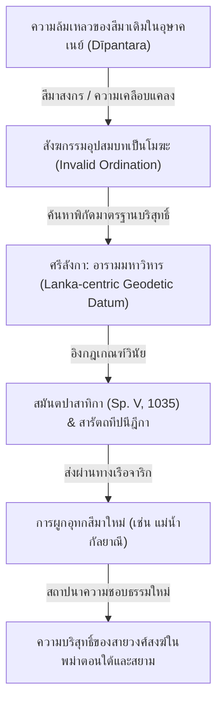

# บทที่ ๔: ประมวลการปรากฏของคำว่า "ทีปนฺตร" (Dīpantara) ในเอกสารภาษาบาลีทั้งหมด

*(Complete Attestation of "Dīpantara" in Pali Canonical and Commentarial Literature)*

---

## ๔.๑ บทนำ: การเลื่อนไหลทางอักขรวิธีจากสันสกฤตสู่บาลี

ในระบบสัทศาสตร์และอักขรวิธีของภาษาบาลี (Pāḷi) คำสมาสภาษาสันสกฤตว่า **ทวีปานตระ (Dvīpāntara)** ได้รับการสืบทอดและแปลงรูปผ่านกฎการลดทอนหน่วยเสียงพยัญชนะซ้อนและการจัดสัดส่วนสระตามมาตราลักษณ์ (Moraic Constraint) ซึ่งสามารถวิเคราะห์ความเปลี่ยนแปลงได้ดังนี้:

### ๔.๑.๑ การลดรูปพยัญชนะควบกล้ำต้นพยางค์ (Simplification of Consonant Clusters)
ภาษาสันสกฤตมีหน่วยพยัญชนะควบกล้ำต้นพยางค์เด่นชัดคือ **ทฺว- (dv-)** ในคำว่า *dvīpa* (เกาะ หรือ แผ่นดินที่มีน้ำล้อมรอบสองด้าน) เมื่อได้รับการถ่ายทอดเข้าสู่ภาษาบาลีจะเกิดการดัดแปลงทางสัทศาสตร์โดยลดรูปหน่วยพยัญชนะควบกล้ำเหลือเพียงพยัญชนะเดี่ยวคือ **ท- (d-)** ส่งผลให้หน่วยสระยาวยังคงรูปอยู่ กลายเป็นศัพท์บาลีว่า **ทีป (dīpa)** 

### ๔.๑.๒ กฎการจำกัดมาตราเสียงในพยางค์ปิด (Moraic Constraint on Closed Syllables)
ในภาษาสันสกฤต คำว่า **ทฺวีปานฺตร (Dvīpāntara)** เกิดจากการต่อสระ (*sandhi*) ระหว่าง *dvīpa* + *antara* บังเกิดเสียงทีฆสระยาว **-า- (-ā-)** ปรากฏอยู่หน้าพยัญชนะควบกล้ำซ้อนสังโยคคือ **-นฺต- (-nt-)** ได้โดยไม่มีข้อจำกัด ทว่าในระบบสัทศาสตร์ของภาษาบาลี มีการบังคับกฎความสั้น-ยาวของสระในโครงสร้างพยางค์ปิดอย่างเคร่งครัด (Vocalis Ante Consonantem / Moraic Constraint) โดยภาษาบาลีไม่อนุญาตให้มีสระเสียงยาว (ทีฆสระ: ā, ī, ū) นำหน้าพยัญชนะสังโยค (เช่น -nt-, -tt-, -kk-) ดังนั้น เมื่อนำคำว่า **ทีป (dīpa)** มาสมาสกับ **อนฺตร (antara)** สระสัญเจตน์ที่จุดสนธิซึ่งควรเป็นเสียงยาวแบบสันสกฤต จึงต้องถูกลดรูปให้สั้นลงเป็นรัสสสระ (สระเสียงสั้น) คือ **-a-** ทันที เพื่อให้สอดรับกับมาตราเสียงของพยางค์ปิดที่มีตัวสะกด บังเกิดเป็นรูปคำสมาสบาลีที่ถูกต้องว่า **ทีปนฺตร (Dīpantara)** แทนที่จะเป็น *ทีปานฺตร*

### ๔.๑.๓ โครงสร้างสมาสและการวิเคราะห์ตามคัมภีร์กัจจายนะและสัททนีติ
การวิเคราะห์เชิงโครงสร้างไวยากรณ์บาลี (Viggaha) บ่งชี้ว่าคำว่า **ทีปนฺตรํ (dīpantaraṃ)** มีกลไกการสมาสดังนี้:
*   **รูปวิเคราะห์ (Viggaha):** `añño dīpo = dīpantaraṃ` (แปลว่า "เกาะอื่นอันต่างออกไป" หรือ "ต่างทวีปต่างแดน") สำหรับการอธิบายความเชื่อมโยงกับกฎอ้างอิงสันสกฤตและการเทียบอรรถศาสตร์ข้ามระนาบภาษา โปรดดูที่ [บทที่ ๑: ประมวลมโนทัศน์คำว่าทวีปานตระ](file:///d:/Research/dvipantara_concepts.md#๑๓๓-หลักไวยากรณ์ภาษาบาลีตามคัมภีร์กัจจายนะและสัททนีติ-pali-grammar)

#### ๑. การอธิบายตามหลักคัมภีร์กัจจายนะ (Kaccāyana-vyākaraṇa):
ตามปกรณ์ไวยากรณ์บาลีระดับรากฐานคือ **กัจจายนะ** โครงสร้างของคำว่า *dīpantaraṃ* จัดเป็น **กัมมธารยสมาส (Kammadhāraya-samāsa)** หรือเรียกเฉพาะคือ **วิเศษณุตตรบทกัมมธารยสมาส (Visesanuttarapada-Kammadhāraya)** หรือ **วิปรีตสมาส (Viparīta-samāsa / Inverted Compound)**:
*   ตามสูตรกัจจายนะที่ ๓๒๕ (*“visesanaṃ visesyehi saha kammadhārayo”* — Kaccāyana III.1.10)[^13] กำหนดหลักเกณฑ์ว่า บทวิเศษณ์ (Adjective) ย่อมเข้าสมาสกับบทวิเศษยะ (Substantive) บังเกิดเป็นกัมมธารยสมาส
*   อย่างไรก็ดี ตามกฎทั่วไปบทวิเศษณ์ต้องตั้งอยู่ข้างหน้า แต่ในสมาสนี้กลับนำเอาบทวิเศษณ์คือ **อนฺตร (antara)** ซึ่งขยายความในเชิง "ความเป็นอื่น/ความต่างกัน" (*aññattha / itara*) ไปตั้งไว้ด้านหลัง (uttarapada) 
*   การสลับตำแหน่งบทวิเศษณ์นี้ ได้รับการรับรองตามหลักเกณฑ์ไวยากรณ์บาลีกัจจายนะสูตรที่ ๓๔๕ (*“mayūravyansakādayo ca”* — Kaccāyana III.1.30)[^12] อนุญาตกลุ่มคำสมาสพิเศษประเภท **มยูรพยังสกาทิสมาส (Mayūravyansakādi-samāsa)** อันเป็น **นิตยสมาส (Nitya-samāsa - สมาสจำเป็น)** ซึ่งไม่สามารถขยายรูปวิเคราะห์โดยตรงด้วยการนำคำสมาสเดิมมาเรียงกันได้ (คือไม่อาจวิเคราะห์ว่า *antara-dīpo* ได้) แต่จำต้องเปลี่ยนบทวิเศษณ์เป็นศัพท์แสดงความต่างโดยตรงในรูปวิเคราะห์ว่า **"อญฺโญ ทีโพ" (añño dīpo)** บังเกิดเป็นรูปสมาสสำเร็จว่า **ทีปนฺตรํ (dīpantaraṃ)** เช่นเดียวกับคำว่า *เทสนฺตรํ (desantaraṃ — ต่างประเทศ)* และ *วาทนฺตรํ (vādantaraṃ — ต่างลัทธิ)*

#### ๒. การอธิบายตามหลักคัมภีร์สัททนีติ (Saddanīti-ppakaraṇa) ของพระอัคคพงศาจารย์:
คัมภีร์ไวยากรณ์ระดับสูงของพระอัคคพงศ์เถระแห่งภุกาม ได้บันทึกและไขความวิเคราะห์ศัพท์ที่ลงท้ายด้วย *antara* บ่งชี้ความเป็นอื่นไว้ในหมวด **สมาสกันฑ์ (Samāsa-kaṇḍa)** ว่า:

> **"अन्तरसद्दो अञ्ञत्थे वत्तमानो पुब्बपदेनेว समसीयति, कम्मधारयो च होति, अञ्ञो दीपो दीपन्तरम् ।"**
> 
> *   **ถอดอักษรไทยพินทุ:** "อนฺตรสทฺโท อญฺญตฺเถ วตฺตมาโน ปุพฺพปเทเนว สมสียติ, กมฺมธารโย จ โหติ, อญฺโญ ทีโพ ทีปนฺตรํ ฯ"  
> *   **ถอดอักษรโรมัน (IAST):** *“antara-saddo` `aññatthe vattamāno pubbapaden'eva samasīyati, kammādhārayo ca hoti, añño dīpo dīpantaraṃ.”*
> 
> *   **คำแปลภาษาไทย:** ศัพท์ว่า 'อนฺตร' เมื่อทำหน้าที่แสดงอรรถแห่งความเป็นอื่น ย่อมเข้าสมาสกับบทหน้าอย่างแน่นอน และสมาสนั้นย่อมเป็นกัมมธารยสมาส ดังรูปวิเคราะห์ว่า: añño dīpo dīpantaraṃ (เกาะอื่น ชื่อว่า ทีปันดร)

#### ๓. กฎการกำหนดรูปเพศพิเศษ (Liṅga-niyama):
ในคัมภีร์สัททนีติและปทรูปสิทธิ (Padarūpasiddhi) อธิบายว่า แม้ศัพท์ตั้งต้นคือ **ทีป (dīpa)** จะมีรูปลิงค์ดั้งเดิมเป็น **ปุลลิงค์ (Masculine — ทีโพ / dīpo)** แต่เมื่อผ่านกระบวนการเข้าสมาสแบบกัมมธารยะที่มีศัพท์แสดงความเป็นอื่น (*antara*) สถิตอยู่ท้ายศัพท์ ตัวคำสมาสทั้งหมดจะถูกบังคับด้วยกฎทางเพศให้เปลี่ยนเป็น **นปุงสกลิงค์ เอกพจน์ (Neuter Singular)** เสมอ บังเกิดรูปเป็น **ทีปนฺตรํ (dīpantaraṃ)** หรือในสัตตมีวิภัตติเป็น **ทีปนฺตเร (dīpantare)** ซึ่งเป็นหลักการคงตัวทางเพศ (Niyata-liṅga) ของศัพท์สมาสกลุ่มนี้

---

## ๔.๒ ดาฐาแว็งสะ (Dāṭhāvaṃsa — ทาฐาวํส)

**ประเภท:** คัมภีร์ประวัติพระเขี้ยวแก้ว (Tooth Relic Chronicle)  
**ผู้รจนา:** พระธัมมกิตติเถระ (Dhammakitti Thera) พระสังฆราชแห่งเกาะลังกา  
**อายุ:** ต้นคริสต์ศตวรรษที่ ๑๓ (รัชสมัยพระราชินีลีลาวดีแห่งโปลอนนารุวา, ค.ศ. 1211)  
**ฉบับชำระ:** Bimala Charan Law, ed. & trans., *The Dāṭhāvaṃsa* (Lahore, 1925), Canto I, Verse 10

### ๔.๒.๑ การแปลและการวิเคราะห์ตามหลักภาษาบาลีวิชาการ

* **ข้อความต้นฉบับภาษาบาลี**:  
  सदेसभासाय कवीहि सीहले, कतम्पि वंसं जिनदन्तधातुया ।  
  निरुत्तिया मागधिकाय बुद्धिया, करोमि दीपन्तरवासिनं अपि ॥ १० ॥  
  *(sadesabhāsāya kavīhi sīhale, katampi vaṃsaṃ jinadantadhātuyā; niruttiyā māgadhikāya buddhiyā, karomi dīpantaravāsinaṃ api.)*

* **ข้อความต้นฉบับภาษาบาลีที่จัดรูปใหม่แล้ว**:  
  sadesabhāsāya kavīhi sīhale, katampi vaṃsaṃ jinadantadhātuyā; niruttiyā māgadhikāya buddhiyā, karomi dīpa-antara-vāsinaṃ api.

* **คำแปลภาษาไทย**:  
  แม้ว่าพงศาวดาร (วํส) แห่งพระธาตุคือพระทันตธาตุ (ชินทนฺตธาตุ) ของพระชินเจ้า อันกวีทั้งหลาย (กวีหิ) ได้รจนาไว้แล้ว (กต) ในเกาะสิงหล (สีหล) ด้วยภาษาแห่งแผ่นดินของตน (สเทสภาสา) ก็ตาม ข้าพเจ้าก็จักรจนา (กโรมิ) พงศาวดารนั้น ด้วยภาษา (นิรุตฺติ) อันเป็นของชาวมคธ (มาคธิก) เพื่อความเข้าใจ (พุทฺธิ) แม้แก่ชนผู้อาศัยอยู่ในเกาะอื่น (ทีปนฺตรวาสิ)[[^1]] ด้วยเช่นกัน

* **คำแปล**:  
  แม้ว่าพงศาวดารแห่งพระทันตธาตุของพระชินเจ้าอันกวีทั้งหลายได้รจนาไว้แล้วในเกาะสิงหลด้วยภาษาแห่งแผ่นดินของตนก็ตาม ข้าพเจ้าก็จักรจนาพงศาวดารนั้นด้วยภาษาอันเป็นของชาวมคธเพื่อความเข้าใจแม้แก่ชนผู้อาศัยอยู่ในเกาะอื่นด้วยเช่นกัน

* **การวิเคราะห์ไวยากรณ์และอักขรวิทยาเชิงกายภาพ**:  
  *วิเคราะห์ไวยากรณ์*: ประโยคนี้ประกอบด้วยโครงสร้างกรรมย่อยในรูปกิริยากิตก์กัมมวาจกขยายคำนามคือ `katampi vaṃsaṃ` (ซึ่งพงศาวดารอันเขาทำไว้แล้ว) โดยมีกริยาคุมพากย์ของประโยคหลักคือ `karomi` (ข้าพเจ้าจักกระทำ/รจนา) เป็นกรรตุวาจก บุรุษที่ 1 เอกพจน์ วัตตมานาวิภัตติ (สะท้อนอนาคตกาลเชิงสัจจะ) โดยละประธาน `ahaṃ` (ข้าพเจ้า) ไว้ในฐานะผู้พูด. บทอนภิหิตกรรตา (ตติยาวิภัตติ) คือ `kavīhi` (โดยกวีทั้งหลาย) และบทเครื่องมือสถิตใน `sadesabhāsāya` (ด้วยภาษาประเทศตน) ขยาย `katampi`. ส่วนกริยาหลัก `karomi` ขยายด้วยบทเครื่องมือ `niruttiyā māgadhikāya` (ด้วยสำเนียงภาษาของชาวมคธ) และขยายเป้าหมายผู้รับผลประโยชน์ในรูปจตุตถีวิภัตติพหูพจน์คือ `dīpantaravāsinaṃ` (แก่ชนผู้อาศัยในต่างเกาะ/ต่างแดน) ร่วมกับนิบาต `api` (แม้/ด้วยเช่นกัน).  
  *อักขรวิทยาเชิงกายภาพ*: คัมภีร์ *ดาฐาวํส* ปรากฏการจารึกเป็นภาษาบาลีลงบนคัมภีร์ใบลาน (Palm-leaf manuscript) ยาวเฉลี่ย ๕๐-๖๐ เซนติเมตร โดยใช้เหล็กจาร (Iron stylus) กดเขียนลงบนเนื้อใบลานก่อนชะโลมด้วยรอยเขม่าดำผสมน้ำมันมะพร้าวเพื่อขับเส้นอักษรให้เด่นชัด. ตัวเขียนเดิมสะกดด้วย **อักษรสิงหลโบราณ** (Sinhala script) ยุคกลางในแถบโปลอนนารุวา. ในขณะที่ตัวคัมภีร์ฉบับที่เผยแพร่เข้าสู่สยามและล้านนาจะคัดจารใหม่ด้วย **อักษรขอมไทย** และ **อักษรธรรมล้านนา** (Lanna Dhamma script) ตามรอยเส้นทางจาริกแสวงบุญทางเรือของพระภิกษุสงฆ์โบราณ โดยเก็บรักษาไว้ในกล่องไม้ประกับประดับมุกหรือลงรักปิดทองตามหอไตรโบราณ เช่น หอไตรวัดพระสิงห์ จังหวัดเชียงใหม่.

* **ประวัติศาสตร์วรรณกรรม**:  
  คัมภีร์ดาฐาวํสประพันธ์โดยพระธัมมกิตติเถระ พระสังฆราชแห่งศรีลังกาในปี ค.ศ. 1211 ตรงกับรัชสมัยของพระราชินีลีลาวดี (Queen Lilavati)[[^2]]. วรรณกรรมนี้แสดงให้เห็นขั้นตอนการถอดแบบพงศาวดารดั้งเดิมจากภาษาสิงหลโบราณ (Elu) มาสู่ภาษาบาลีมคธเพื่อจุดประสงค์ในการสื่อสารระดับภูมิภาค. ในประวัติศาสตร์ศรีลังกา พระเขี้ยวแก้ว (Sacred Tooth Relic)[[^3]] มิใช่เพียงปูชนียวัตถุธรรมดา แต่เป็นสิ่งศักดิ์สิทธิ์ประจำราชบัลลังก์อันเป็นสัญลักษณ์ของสิทธิชอบธรรมในการปกครองแผ่นดินของกษัตริย์สิงหล. การปรับแต่งเนื้อหาให้เป็นภาษาบาลีจึงเป็นการส่งออกจินตภาพอำนาจทางศาสนาและการเมืองและสถาปนาความน่าเชื่อถือของราชวงศ์ศรีลังกาไปยังภูมิภาคเอเชียตะวันออกเฉียงใต้ (ทีปันดร) ที่มีความสัมพันธ์ทางการทูตและการค้าอย่างใกล้ชิด.

---

## ๔.๓ สมันตปาสาทิกา (Samantapāsādikā — สมนฺตปาสาทิกา)

**ประเภท:** อรรถกถาพระวินัยปิฎก (Commentary on Vinaya Piṭaka)  
**ผู้รจนา:** พระพุทธโฆษาจารย์ (Buddhaghosa)  
**อายุ:** ประมาณคริสต์ศตวรรษที่ ๕ (ค.ศ. ~410–430)  
**ฉบับชำระ:** J. Takakusu and M. Nagai, eds., *Samantapāsādikā: Buddhaghosa's Commentary on the Vinaya Piṭaka* (London: PTS, 1924), Vol. I, 2 (Prologue, Verses 8–10)[[^4]]

### ๔.๓.๑ การแปลและการวิเคราะห์ตามหลักภาษาบาลีวิชาการ

* **ข้อความต้นฉบับภาษาบาลี**:  
  सीहलभासं हित्वा, अनाकुलं सीहलाधिपतिकाय ।  
  निरुत्तिं परिवर्तिय, मागधिकं भासं दीपन्तरवासिनं ।  
  अत्थाय संदस्सिस्सामि, समयं अविलोमयं ॥ ९ ॥  
  *(sīhalabhāsaṃ hitvā, anākulaṃ sīhalādhipatikāya; niruttiṃ parivattiya, māgadhikaṃ bhāsaṃ dīpantaravāsinaṃ; atthāya sandassissāmi, samayaṃ avilomayaṃ.)*

* **ข้อความต้นฉบับภาษาบาลีที่จัดรูปใหม่แล้ว**:  
  sīhalabhāsaṃ hitvā, anākulaṃ sīhalādhipatikāya; niruttiṃ parivattiya, māgadhikaṃ bhāsaṃ dīpantaravāsinaṃ; atthāya sandassissāmi, samayaṃ avilomayaṃ.

* **คำแปลภาษาไทย**:  
  ข้าพเจ้าจักแสดง (สํทสฺสิสฺสามิ) ซึ่งคำสอน (สมย)[[^5]] อันไม่สับสน (อนากุล) และไม่ขัดแย้ง (อวิโลมย) โดยการละทิ้ง (หิตฺวา) ซึ่งภาษาสิงหล (สีหลภาสา) อันรจนาไว้โดยพระราชประสงค์ของพระราชาผู้เป็นใหญ่แห่งเกาะสิงหล (สีหลาธิปติกา)[[^6]] แล้วแปลงรูป (ปริวตฺติย) สำเนียงภาษา (นิรุตฺติ) สู่ภาษา (ภาสา) อันเป็นของชาวมคธ (มาคธิก) เพื่อประโยชน์ (อตฺถ) แก่ชนผู้อาศัยอยู่ในเกาะอื่น (ทีปnฺตรวาสิ)

* **คำแปล**:  
  ข้าพเจ้าจักแสดงซึ่งคำสอนอันไม่สับสนและไม่ขัดแย้ง โดยการละทิ้งซึ่งภาษาสิงหลอันรจนาไว้โดยพระราชประสงค์ของพระราชาผู้เป็นใหญ่แห่งเกาะสิงหล แล้วแปลงรูปสำเนียงภาษาสู่ภาษาอันเป็นของชาวมคธเพื่อประโยชน์แก่ชนผู้อาศัยอยู่ในเกาะอื่น

* **การวิเคราะห์ไวยากรณ์และอักขรวิทยาเชิงกายภาพ**:  
  *วิเคราะห์ไวยากรณ์*: โครงสร้างประโยคนี้เป็นกรรตุวาจกที่ใช้กริยาคุมพากย์รูปอนาคตกาลอันแน่วแน่คือ `sandassissāmi` (ข้าพเจ้าจักแสดง/ไขความ - กริยาอาขยาต บุรุษที่ 1 เอกพจน์ ภวิสสันติวิภัตติ). มีบทกรรมหลักคือ `samayaṃ` (ซึ่งคำสอน/ข้อตกลงวินัย) ขยายด้วย `anākulaṃ` (อันไม่สับสน) และ `avilomayaṃ` (อันไม่ย้อนแย้ง/ไม่ขัดแย้ง). กริยาประกอบระหว่างทางเป็นตูนาทิปัจจัยสองชุดคือ `hitvā` (ละทิ้งแล้ว) ซึ่งรับบทกรรม `sīhalabhāsaṃ` (ซึ่งภาษาสิงหล) และ `parivattiya` (แปลงแล้ว) ซึ่งรับบทกรรม `niruttiṃ` (ซึ่งสำเนียงภาษาถิ่น) ไปสู่บทขยายปลายทาง `māgadhikaṃ bhāsaṃ` (สู่ภาษามาคธ). การกำหนดเป้าหมายผู้รับผลใช้นามจตุตถีวิภัตติคือ `dīpantaravāsinaṃ atthāya` (เพื่อประโยชน์แห่งชนผู้อาศัยอยู่ในต่างแดน).  
  *อักขรวิทยาเชิงกายภาพ*: อรรถกถาพระวินัย *สมันตปาสาทิกา* บันทึกคำสอนลงบนใบลานลานยาว จารด้วยเหล็กจารปลายแหลมสะกดตามอักขรวิธี **อักษรสิงหล** ของสำนักมหาวิหารแห่งอนุราธปุระ. สำหรับฉบับคัดลอกในประเทศไทย ได้รับการเก็บรักษาในรูปคัมภีร์ใบลาน **อักษรขอมโบราณ** หรือ **อักษรธรรมล้านนา** โดยใช้หมึกดินสอดำหรือการจารลงเนื้อลานโดยตรง ตัวใบลานมีรูสำหรับร้อยเชือกคู่ (เชือกร้อยสายสนอง) เพื่อผูกแผ่นใบลานเข้าด้วยกันเป็นผูก และปิดหัวท้ายด้วยไม้ประกับคัมภีร์หนาหรูหราที่ลงรักสีดำและแดงอย่างประณีต ป้องกันศัตรูพืชและรักษาสภาพความแห้งของคัมภีร์ตามระบบอารักษ์โบราณ.

* **ประวัติศาสตร์วรรณกรรม**:  
  รจนาขึ้นโดยพระพุทธโฆษาจารย์ในศตวรรษที่ ๕ ซึ่งเดินทางจากอินเดียมายังศรีลังกาเพื่อแปลงพระไตรปิฎกอรรถกถาโบราณที่จารึกเป็นภาษาสิงหลโบราณให้กลับมาเป็นภาษาบาลีมคธ. เหตุผลหลักของการแปลงคือความจริงที่ว่าภาษาสิงหลโบราณจำกัดการใช้งานเฉพาะในทวีปเกาะลังกา ทำให้พระภิกษุนักวิชาการใน "ต่างเกาะต่างแดน" (Dīpantara) เช่น ชมพูทวีปและเอเชียตะวันออกเฉียงใต้ ไม่สามารถศึกษาคัมภีร์ได้. การสถาปนาภาษาบาลีเป็นภาษากลางทางวิชาการ (Ecclesiastical Lingua Franca) จึงช่วยให้คำสอนของฝ่ายมหาวิหารกลายเป็นมาตรฐานสูงสุดของโลกศาสนจักรในอุษาคเนย์.

---

## ๔.๔ หลักฐานเพิ่มเติมจากคัมภีร์ชั้นฎีกา: สารัตถทีปนี (Sāratthadīpanī — สารตฺถทีปนี)

**ประเภท:** คัมภีร์ฎีกาอธิบายสมันตปาสาทิกา (Subcommentary on Vinaya Piṭaka)  
**ผู้รจนา:** พระสารีบุตรเถระแห่งโปลอนนารุวา (Sāriputta Thera of Polonnaruwa)  
**อายุ:** ปลายคริสต์ศตวรรษที่ ๑๒ (ค.ศ. ~1150–1200)  
**ฉบับชำระ:** *Sāratthadīpanī-Ṭīkā* (ฉบับมหาจุฬาลงกรณราชวิทยาลัย, ๒๕๓๕), ภาค ๑, หน้า ๘๕ (หรืออ้างอิง *Sāratthadīpanī I, 85*)[[^7]]

### ๔.๔.๑ การแปลและการวิเคราะห์ตามหลักภาษาบาลีวิชาการ

* **ข้อความต้นฉบับภาษาบาลี**:  
  ทีปนฺตรวาสีนนฺติ สีหลทีปโต อญฺญสฺมึ ชมฺพูทีปาทิทีเป วสนฺตานํ ภิกฺขูนํ อตฺถาย  
  *(“dīpantaravāsīnan”ti sīhaladīpato aññasmiṃ jambudīpādīpe vasantānaṃ bhikkhūnaṃ atthāya.)*

* **ข้อความต้นฉบับภาษาบาลีที่จัดรูปใหม่แล้ว**:  
  “dīpantaravāsīnan”ti sīhaladīpato aññasmiṃ jambudīpa-ādi-dīpe vasantānaṃ bhikkhūnaṃ atthāya.

* **คำแปลภาษาไทย**:  
  คำว่า "เพื่อประโยชน์แก่ชนผู้อาศัยอยู่ในเกาะอื่น (ทีปนฺตรวาสีนํ)" นั้น มีความอรรถาธิบายว่า เพื่อประโยชน์ (อตฺถ) แก่ภิกษุทั้งหลาย (ภิกฺขู) ผู้อาศัยอยู่ (วสนฺต) ในเกาะ (ทีป) อื่น (อญฺญ) อันต่างไปจากเกาะสิงหล (สีหลทีป)[[^8]] เป็นต้นว่า ชมพูทวีป (ชมฺพูทีป)[[^9]] เป็นอาทิ

* **คำแปล**:  
  คำว่า "เพื่อประโยชน์แก่ชนผู้อาศัยอยู่ในเกาะอื่น" นั้น มีความอรรถาธิบายว่า เพื่อประโยชน์แก่ภิกษุทั้งหลายผู้อาศัยอยู่ในเกาะอื่นอันต่างไปจากเกาะสิงหล เป็นต้นว่าชมพูทวีปเป็นอาทิ

* **การวิเคราะห์ไวยากรณ์และอักขรวิทยาเชิงกายภาพ**:  
  *วิเคราะห์ไวยากรณ์*: ประโยคนี้เป็นประโยคอรรถกถาอธิบายความหมายคำศัพท์ (วจนัตถะ) โครงสร้างคือการยกคำศัพท์เป้าหมายขึ้นมาตั้งในฐานะบทอภิธานด้วยรูปศัพท์ลงท้ายด้วยนิบาต `iti` บังเกิดคำว่า `dīpantaravāsīnan'ti`. ภาคอธิบายความหมายประกอบด้วยคำนามหลักที่เป็นจตุตถีวิภัตติแสดงจุดมุ่งหมายคือ `atthāya` (เพื่อประโยชน์) และคำขยายในรูปฉัฏฐีวิภัตติพหูพจน์ `bhikkhūnaṃ` (แห่งภิกษุทั้งหลาย). ภิกษุเหล่านั้นได้รับการระบุตำแหน่งที่อยู่ด้วยกริยากิตก์ `vasantānaṃ` (ผู้อาศัยอยู่) ซึ่งทำหน้าที่ขยายบทนาม โดยมีสัตตมีวิภัตติระบุพิกัดคือ `aññasmiṃ dīpe` (ในเกาะอื่น) และคำอธิบายเพิ่มเติม `jambudīpādīpe` (ในเกาะมีชมพูทวีปเป็นต้น). ศัพท์ว่า `sīhaladīpato` ลงท้ายด้วยปัจจัย `-to` (ปัญจมีวิภัตติ) เพื่อแสดงทิศทางและจุดเริ่มเปรียบเทียบในความหมาย "จาก/นอกเหนือไปจาก" ขยายคำว่า `aññasmiṃ` (อื่นจากเกาะสิงหล).  
  *อักขรวิทยาเชิงกายภาพ*: คัมภีร์ *สารัตถทีปนีฎีกา* จารึกลงบนคัมภีร์ใบลานชนิดยาวบันทึกด้วย **อักษรสิงหลโบราณ** ยุคกลาง (คริสต์ศตวรรษที่ ๑๒) ต่อมาได้รับการคัดลอกส่งต่อไปยังสยาม พม่า และล้านนา. ตัวเขียนที่พบบ่อยในหอไตรของประเทศไทยโบราณคือ **อักษรธรรมล้านนา** และ **อักษรขอมไทย** ที่จารลงบนใบลานเคลือบน้ำมันอย่างดี หัวท้ายของมัดคัมภีร์ห่อหุ้มด้วยไม้ประกับคัมภีร์แกะสลักลวดลายศิลปะประยุกต์ปิดทองรดน้ำเพื่อป้องกันความชื้นและปลวกแมลง.

* **ประวัติศาสตร์วรรณกรรม**:  
  ฎีกานี้แต่งขึ้นโดยพระสารีบุตรเถระ ปราชญ์ผู้ยิ่งใหญ่ในรัชสมัยของพระเจ้าปรักกมพาหุมหาราชที่ ๑ (Parakkamabāhu I, ค.ศ. 1153–1186) ยุคที่ศรีลังกาทำความสะอาดจัดระเบียบสังฆมณฑลและทำนุบำรุงลัทธิมหาวิหารเป็นปึกแผ่น. การที่พระสารีบุตรเถระกำหนดพิกัดความหมายของคำว่า *Dīpantara* โดยอิงจากศูนย์กลางศรีลังกา (สีหลทีป) และอ้างอิงอินเดีย (ชมพูทวีป) ในฐานะหนึ่งใน "เกาะอื่น" (ทีปันดร) สะท้อนทัศนะภูมิศาสตร์วัฒนธรรมที่เปลี่ยนขั้ว โดยศรีลังกาสถาปนาตนเองเป็นศูนย์กลางทางวินัยและวิชาการพุทธศาสนาเหนือดินแดนอื่นๆ ทั้งปวง.

---

## ๔.๕ ข้อพิพาทเรื่องสีมา (Sīmā Disputes) และการเกิดขึ้นของพิกัดศรีลังกาเซนทริก (Lanka-centric Geodetic Datum) ในคัมภีร์วินัย

การเกิดขึ้นของคำศัพท์ **ทีปนฺตร (Dīpantara)** ในอรรถกถาและฎีกาพระวินัย ไม่ใช่เพียงการบันทึกทัศนคติทางภูมิศาสตร์ของพระสงฆ์ลังกาเท่านั้น แต่ยังเชื่อมโยงอย่างใกล้ชิดกับความขัดแย้งเชิงพื้นที่และพิธีกรรมทางศาสนา โดยเฉพาะ **"ข้อพิพาทเรื่องสีมา" (Sīmā Disputes)** ซึ่งทำหน้าที่ประหนึ่งกลไกจัดระเบียบระเบียบอำนาจปกครองสงฆ์ในโลกพุทธศาสนาโพ้นทะเล.

### ๔.๕.๑ สีมาสงกรร่วมและความล้มเหลวของอธิษฐานจิต: ความท้าทายทางกฎหมายวินัย
ตามกฎเกณฑ์ในวินัยปิฎกและคำอธิบายใน *สมันตปาสาทิกา* (วินัยอรรถกถา) การดำเนินกิจกรรมคณะสงฆ์ (สังฆกรรม เช่น การบวชพระภิกษุ และการสวดพระปาติโมกข์) จะมีความสมบูรณ์ถูกต้องได้ก็ต่อเมื่อจัดขึ้นภายในพื้นที่สีมาที่ผ่านการสวดถอนและผูกขึ้นใหม่อย่างถูกต้องสมบูรณ์ปราศจากข้อบกพร่องทางพัทธสีมาหรืออุทกสีมาเท่านั้น.
หากเขตแดนที่ผูกขึ้นมีความเหลื่อมล้ำ ทับซ้อน หรือปะปนกับเขตแดนสีมาอื่นๆ หรือปะปนกับขอบเขตหมู่บ้านทางโลก (*gāmasīmā*) จะเกิดมลทินทางพระวินัยที่เรียกว่า **"สีมาสงกร" (Sīmā-saṅkara / Boundary Overlap)**[[^10]] ทันที ซึ่งส่งผลให้สังฆกรรมใดๆ ที่ประกอบในบริเวณดังกล่าวเป็นโมฆะทั้งหมด (*asāmīkaraṇa*). 

ปัญหานี้ได้รับการวิเคราะห์และคลี่คลายอย่างเข้มงวดที่สุดในคัมภีร์ *สารัตถทีปนีฎีกา* โดยพระสารีบุตรเถระ ซึ่งท่านได้กำหนดให้ศรีลังกาเถรวาทต้องสืบทอดสายวิพากษ์ทางพื้นที่อย่างเคร่งครัดตามข้อกำหนดใน *สมันตปาสาทิกา* (Sp. V, 1035–1060)[[^11]]. ความเข้มงวดนี้ส่งผลกระทบต่อเครือข่ายสงฆ์ในเอเชียตะวันออกเฉียงใต้ (ทีปันดร) ที่ประสบปัญหาระเบียบการอุปสมบทล่มสลายเนื่องจากหาขอบเขตสีมาที่ถูกต้องชัดเจนไม่ได้ หรือเกิดความเคลือบแคลงสงสัยในสีมาท้องถิ่นดั้งเดิมว่ามีความบกพร่องและทับซ้อนกับหมู่บ้านฆราวาสหรือไม่.

### ๔.๕.๒ ศรีลังกาในฐานะพิกัดอ้างอิงสัมบูรณ์ (Lanka-centric Geodetic Datum)
ภายใต้สภาวะความขัดแย้งเรื่องสีมานี้ เกาะศรีลังกา (โดยเฉพาะอารามมหาวิหารที่เมืองอนุราธปุระ และวัดป่าลัทธิไพรสณฑ์ในโปลอนนารุวา) ได้รับการยอมรับจากกษัตริย์และพระสงฆ์ในเอเชียตะวันออกเฉียงใต้ในฐานะ **"จุดอ้างอิงพิกัดทางวิญญาณ" (Spiritual Geodetic Datum)** หรือมาตรวัดสัมบูรณ์ในการรับรองความถูกต้องของสีมา. 

ประวัติศาสตร์ความสัมพันธ์ระหว่างลังกาและต่างแดนแสดงการพึ่งพิงพิกัดอ้างอิงนี้ในหลายเหตุการณ์สำคัญ:
1.  **คริสต์ศตวรรษที่ ๑๕: การปฏิรูปสีมาของกษัตริย์ธรรมเจดีย์แห่งหงสาวดี (Kalyāṇī Sīmā Reforms, 1476 AD)**  
    กษัตริย์ธรรมเจดีย์ (King Dhammazedi) ทรงเล็งเห็นว่าสีมาสงฆ์ในอาณาจักรพม่าตอนใต้เสื่อมเสียจากภาวะสีมาสงกรและการอุปสมบทที่หละหลวม. พระองค์จึงส่งพระภิกษุอาวุโสจำนวน ๒๒ รูป เดินทางข้ามมหาสมุทรอินเดียมายังศรีลังกาเพื่อรับการอุปสมบทใหม่ ณ **อุทกสีมาชั่วคราว (Udakukkhepasīmā / Water Boundary)**[[^14]] ที่ผูกขึ้นในน้ำไหลของแม่น้ำกัลยาณี (Kalyāṇī River) ใกล้เมืองโคลอมโบ ซึ่งได้รับการรับรองโดยตรงจากปราชญ์วินัยของศรีลังกาว่าบริสุทธิ์และปราศจากมลทินของสีมาสงกร. เมื่อพระภิกษุเหล่านั้นเดินทางกลับสู่หงสาวดี ทรงโปรดเกล้าฯ ให้ขุดดินและผูกสีมาบัทธสีมาใหม่ตามแบบศรีลังกาอย่างแม่นยำทางสัดส่วนพิกัดเชิงวินัย เกิดเป็น **"กัลยาณีสีมา" (Kalyāṇī Sīmā)**[[^15]] ซึ่งทำหน้าที่เป็นศูนย์กลางการตรวจสอบความถูกต้องของการบวชในพม่าทั้งหมด.
2.  **คริสต์ศตวรรษที่ ๑๕: การปฏิรูปล้านนาผ่านพระสงฆ์สำนักสีหฬภิกขุ**  
    ในรัชสมัยกษัตริย์ติโลกราชแห่งเชียงใหม่ พระภิกษุคณะหนึ่งนำโดยพระธรรมทินนะได้เดินทางไปรับการอุปสมบทใหม่ที่เกาะศรีลังกาแล้วนำสายวงศ์นั้นกลับมาจัดตั้งนิกายวัดป่าแดง (Forest Monastery Lineage) โดยเริ่มปฏิรูปสังคมสงฆ์ด้วยการจัดสวดถอนสีมาเดิมที่สงสัยว่าทับซ้อนกับเขตชุมชน และสถาปนาอุทกสีมากลางแม่น้ำปิงเพื่อทำการบวชภิกษุชุดใหม่. กระบวนการนี้ตั้งอยู่บนข้อกำหนดวินัยอันเฉียบขาดของคัมภีร์ *สมันตปาสาทิกา* และ *สารัตถทีปนีฎีกา* ซึ่งถือเป็นพจนานุกรมอ้างอิงที่ไม่สามารถโต้แย้งได้.
3.  **กลไกการป้อนข้อมูลพิกัดย้อนกลับ (Transnational Feedback Loop)**  
    ความน่าสนใจของโครงสร้างพิกัดเชิงอภิปรัชญานี้คือการถ่ายทอดแบบวนรอบข้ามชาติ (Transnational Loop) ในศตวรรษต่อมา. เมื่อศรีลังกาเผชิญหน้ากับการรุกรานของลัทธิล่าอาณานิคมโปรตุเกสทำให้สายการบวชสูญสิ้นไป สถิตการอุปสมบทได้ส่งผ่านคืนกลับไปโดยการนิมนต์พระอุบาลีเถระและพระอริยมุนีเถระจากอาณาจักรอยุธยา (สยาม) ไปประกอบพิธีบวชใหม่ในเกาะลังกา เกิดเป็น **"สยามนิกาย" (Siam Nikaya, 1753 CE)** และส่งพระภิกษุจากศรีลังกามาบวชใหม่ในพม่าเกิดเป็น **"อมรปุรนิกาย"** และ **"รามัญนิกาย"**. การสลับขั้วเปลี่ยนดินแดนผู้รักษาพิกัดยังคงยึดฐานแนวคิดเดียวกันคือ ต้องสืบทอดสายวิพากษ์วินัยอรรถกถา *สมันตปาสาทิกา* และ *สารัตถทีปนีฎีกา* อย่างไม่บิดพลิ้วตามสูตรมาตรวัดทางภูมิศาสตร์ของลังกา.

---

## ๔.๖ คัมภีร์สัทธรรมปัชโชติกา (Saddhammappajjotikā)

**ประเภท:** อรรถกถาคัมภีร์มหานิทเทส (Commentary on Mahāniddesa)  
**ผู้รจนา:** พระอุปเสนะเถระ (Upasena Thera) แห่งศรีลังกา  
**อายุ:** คริสต์ศตวรรษที่ ๖ (ค.ศ. ~500–550)  
**ฉบับชำระ:** A.P. Buddhadatta, ed., *Saddhammappajjotikā: Commentary on the Niddesa* (London: PTS, 1931), Vol. I, 1 (Prologue)[[^16]]

### ๔.๖.๑ การแปลและการวิเคราะห์ตามหลักภาษาบาลีวิชาการ

* **ข้อความต้นฉบับภาษาบาลี**:  
  ...सीहलभासं हित्वा मागधिकनिरुत्तियं परिवर्तिय दीपन्तरवासिनं अत्थाय...  
  *(...sīhalabhāsaṃ hitvā māgadhikaniruttiyaṃ parivattiya dīpantaravāsinaṃ atthāya...)*

* **ข้อความต้นฉบับภาษาบาลีที่จัดรูปใหม่แล้ว**:  
  ...sīhalabhāsaṃ hitvā māgadhika-niruttiyaṃ parivattiya dīpa-antara-vāsinaṃ atthāya...

* **คำแปลภาษาไทย**:  
  ...โดยการละทิ้ง (หิตฺวา) ซึ่งภาษาสิงหล (สีหลภาสา) แล้วแปลงรูป (ปริวตฺติย) สู่สำเนียงภาษา (นิรุตฺติ) อันเป็นของชาวมคธ (มาคธิก)[[^17]] เพื่อประโยชน์ (อตฺถ) แก่ชนผู้อาศัยอยู่ในเกาะอื่น (ทีปนฺตรวาสิ)...

* **คำแปล**:  
  ...โดยการละทิ้งซึ่งภาษาสิงหล แล้วแปลงรูปสู่สำเนียงภาษาอันเป็นของชาวมคธเพื่อประโยชน์แก่ชนผู้อาศัยอยู่ในเกาะอื่น...

* **การวิเคราะห์ไวยากรณ์และอักขรวิทยาเชิงกายภาพ**:  
  *วิเคราะห์ไวยากรณ์*: โครงสร้างข้อความนี้ใช้หน่วยกริยาระหว่างทางที่เป็นกาลอดีตบูรพาการคือ `hitvā` (ละทิ้งแล้ว) รับบทกรรมนาม `sīhalabhāsaṃ` (ซึ่งภาษาสิงหล) และกริยาตูนาทิปัจจัยอีกชุดคือ `parivattiya` (แปลงแล้ว) นำทางเข้าสู่จุดปลายอ้างอิงในสัตตมีวิภัตติหรือทุติยาวิภัตติคือ `māgadhikaniruttiyaṃ` (สู่สำเนียงภาษาของมคธ). โดยมีบทขยายเป้าหมายและประโยชน์คือ `dīpantaravāsinaṃ atthāya` (เพื่อประโยชน์แด่ชนต่างเกาะ) ทำหน้าที่เชื่อมโยงผู้รับสัจธรรม.  
  *อักขรวิทยาเชิงกายภาพ*: คัมภีร์ *สัทธรรมปัชโชติกา* คัดลอกจากคัมภีร์ใบลานศรีลังกาโบราณซึ่งสลักตัวอักษรกลมมีเอกลักษณ์ของ **อักษรสิงหล**. ตัวคัมภีร์ใบลานฉบับล้านนามีการประดับประดาอย่างวิจิตรด้วยอักษร **อักษรธรรมล้านนา** ลงรักทาชาดสีแดงสดสลับทองคำเปลวเพื่อเป็นสิ่งอุทิศถวายแด่หอพระไตรปิฎกหลวง. รูร้อยสายสนองเชือกถักแน่นหนาและประดับประดาด้วยผ้าไหมหรือผ้าห่อคัมภีร์โบราณพิทักษ์รักษายามไม่มีการเปิดอ่าน.

* **ประวัติศาสตร์วรรณกรรม**:  
  แต่งโดยพระอุปเสนะเถระในพุทธศตวรรษที่ ๑๑ ถัดจากยุคทองของพระพุทธโฆษาจารย์เพียงไม่นาน. การที่ปราชญ์ชาวศรีลังกายุคหลังยังยึดสูตรคำประพันธ์เกริ่นนำอารัมภบททำนองเดียวกับสมันตปาสาทิกา (*sīhalabhāsaṃ hitvā... dīpantaravāsinaṃ atthāya*) แสดงให้เห็นว่าแนวคตินิยมในการอุทิศรจนาบาลีเพื่อบุคคลภายนอกเกาะศรีลังกาได้สถาปนาขึ้นเป็น "สูตรสำเร็จทางวรรณกรรมวิชาการ" (Literary Convention) ของสายมหาวิหารเพื่อโฆษณาเผยแพร่การสื่อสารระดับสากล.

---

## ๔.๗ ตารางเปรียบเทียบและการประมวลหลักฐานบาลีทั้งหมด

| ลำดับ | เอกสาร/คัมภีร์ | อายุโดยประมาณ | รูปคำที่ปรากฏ | บริบทและการนิยามภูมิศาสตร์วัฒนธรรม | แหล่งอ้างอิงฉบับมาตรฐาน (PTS) |
| :---: | :--- | :--- | :--- | :--- | :--- |
| 1 | **สมันตปาสาทิกา** (อรรถกถาพระวินัย) | ค.ศ. ~410–430 (ศตวรรษที่ ๕) | *dīpantaravāsinaṃ* | แปลภาษาสิงหลเป็นภาษาบาลีเพื่อภิกษุในต่างเกาะต่างทวีปทั่วโลก | Sp. I, 2 (Prologue V.9); Sp. I, 230 (cf. *mahāpadesa*)[[^18]] |
| 2 | **สัทธรรมปัชโชติกา** (อรรถกถามหานิทเทส) | ค.ศ. ~500–550 (ศตวรรษที่ ๖) | *dīpantaravāsinaṃ* | ใช้ถ้อยคำตามธรรมเนียมโบราณอุทิศผลงานคัมภีร์ให้ประชากรโพ้นทะเล | Nidd-A. I, 1 (Prologue)[[^19]] |
| 3 | **สารัตถทีปนี** (ฎีกาอธิบายวินัย) | ค.ศ. ~1150–1200 (ศตวรรษที่ ๑๒) | *dīpantaravāsīnan'ti sīhaladīpato aññasmiṃ Jambudīpādīpe...* | **นิยามชัดเจนที่สุด:** "เกาะอื่นนอกเหนือจากเกาะลังกา เช่น ชมพูทวีป เป็นต้น" | Sāratthadīpanī I, 85 (Cātumahārājika-kaṇḍa)[[^20]] |
| 4 | **ทาฐาวํส / ดาฐาแว็งสะ** (พงศาวดารพระเขี้ยวแก้ว) | ค.ศ. 1211 (ศตวรรษที่ ๑๓) | *dīpantaravāsinaṃ api* | รจนาภาษาบาลีระดับภูมิภาคเพื่อให้คนต่างเกาะเกิดความตระหนักรู้พระทันตธาตุ | Dāṭhāvaṃsa I, 10 (Canto I, Verse 10)[[^21]] |

---

## เชิงอรรถ

[^1]: **dīpantaravāsī / ทีปนฺตรวาสี** (ผู้อาศัยอยู่ในเกาะอื่น) - เกิดจากศัพท์ dīpa (เกาะ/ทวีป) + antara (อื่น) + vāsī (ผู้อาศัย) หมายถึงภิกษุและนักปราชญ์ชาวพุทธผู้นอกเกาะศรีลังกา โดยเฉพาะในเขตชมพูทวีปและดินแดนอุษาคเนย์โพ้นทะเล [อ้างอิงพัฒนาการทางสัทศาสตร์ใน Wilhelm Geiger, *Pali Literature and Language* (Calcutta: University of Calcutta, 1943), 44.]
[^2]: **sīhalabhāsā / สีหลภาสา** (ภาษาประเทศสิงหล) - ศัพท์อธิบายภาษาท้องถิ่นของเกาะศรีลังกา (สิงหลโบราณ หรือ Elu) ที่ใช้ในบทกวีและการจดพงศาวดารดั้งเดิมก่อนการสังคายนาเป็นภาษาบาลีสากล [ดูการอธิบายของ Bimala Charan Law, ed. and trans., *The Dāṭhāvaṃsa* (Lahore: Punjab Sanskrit Book Depot, 1925), Introduction, ix-xi.]
[^3]: **jinadantadhātu / ชินทนฺตธาตุ** (พระทันตธาตุของพระชินเจ้า) - ศัพท์เกิดขึ้นในบริบทสัญลักษณ์แห่งราชสมบัติและสิทธิชอบธรรมทางการเมืองในการครองแผ่นดินของศรีลังกา [ดูเนื้อความจาริกพระธาตุใน Law, *The Dāṭhāvaṃsa*, Canto 1, Verse 10.]
[^4]: **Sp. I, 2** - อ้างอิงฉบับมาตรฐานสมาคมบาลีปกรณ์ (Pali Text Society): J. Takakusu and M. Nagai, eds., *Samantapāsādikā: Buddhaghosa's Commentary on the Vinaya Piṭaka*, Vol. I (London: Pali Text Society, 1924), page 2.
[^5]: **samaya / สมย** (คำสอน/หลักธรรมวินัย) - รากศัพท์มาจาก saṃ (ร่วมกัน) + i (ไป) หมายถึงระบบคำสอน หลักลัทธิ หรือจารีตประเพณีทางธรรมวินัยของฝ่ายเถรวาทมหาวิหารที่รวบรวมไว้เพื่อไม่ให้เกิดความสับสนหรือขัดแย้งในหมู่สงฆ์ [ดู *Sp. I, 2* (Prologue Verses 8–10).]
[^6]: **sīhalādhipatika / สีหลาธิปติกา** (โดยความเป็นใหญ่แห่งเกาะสิงหล/พระราชาแห่งสิงหล) - เกิดจากศัพท์ sīhala (สิงหล) + adhipati (ผู้เป็นใหญ่) + ka (ปัจจัย) บ่งบอกถึงคัมภีร์อรรถกถาโบราณที่แต่งขึ้นภายใต้พระบรมราชูปถัมภ์และพระราชประสงค์ของพระมหากษัตริย์แห่งศรีลังกาเพื่อประโยชน์ของประชากรท้องถิ่น [ดู *Sp. I, 2*.]
[^7]: **Sāratthadīpanī I, 85** - อ้างอิงคัมภีร์สารัตถทีปนี ภาค ๑ ฉบับพิมพ์บาลีอักษรไทยจัดตั้งโดยมหาวิทยาลัยมหาจุฬาลงกรณราชวิทยาลัย พ.ศ. ๒๕๓๕ หน้า ๘๕.
[^8]: **sīhaladīpato / สีหลทีปโต** (จากเกาะสิงหล) - แสดงการใช้โครงสร้างปัญจมีวิภัตติประกอบปัจจัย `-to` เพื่อระบุตำแหน่งอ้างอิงศูนย์กลางภูมิศาสตร์โลกผู้พูดเพื่อชี้นิ้วข้ามน้ำไปยังภูมิภาคอื่น [ดู *Sāratthadīpanī-Ṭīkā* (Bangkok: MCU Press, 1992), Vol. I, 85.]
[^9]: **jambudīpādīpe / ชมพูทีปาทิทีเป** (ในเกาะมีชมพูทวีปเป็นต้น) - รากศัพท์จาก jambudīpa (ชมพูทวีป) + ādi (เป็นต้น) + dīpa (เกาะ) สะท้อนความเข้าใจเชิงจักรวาลวิทยาของลังกาที่จัดกลุ่มอินเดียเป็นเกาะขนาดใหญ่เคียงคู่อยู่ในทวารสมุทร [ดู *Sāratthadīpanī-Ṭīkā I, 85*.]
[^10]: **sīmā-saṅkara / สีมาสงฺกร** (ความเหลื่อมล้ำคาบเกี่ยวของสีมา) - อธิบายถึงสภาวะข้อขัดแย้งทางวินัยกรรมที่เกิดจากการกำหนดเขตแดนไม่ชัดเจนหรือการทับซ้อนกันของสีมา ส่งผลให้การทำสังฆกรรมอุปสมบทตกเป็นโมฆะ [ดูคำชี้แจงโดยละเอียดในอรรถกถาพระวินัย *Sp. V, 1035–1060*.]
[^11]: **Sp. V, 1035–1060** - ส่วนว่าด้วยการผูกสีมาและการถอนสีมา (Sīmākathā) ในตอนอธิบายคัมภีร์มหาวัคค์แห่งพระวินัยปิฎก ซึ่งเป็นแหล่งอ้างอิงสถาปัตยกรรมทางพิธีกรรมที่สำคัญที่สุดของฝ่ายมหาวิหาร.
[^12]: **mayūravyansakādayo / มยูรพยํสกาคิสมาส** - สูตรที่ 345 ในคัมภีร์กัจจายนะ อนุญาตให้ประกอบศัพท์แบบสลับบทวิเศษณ์ไปอยู่หลัง ซึ่งเป็นหัวใจไวยากรณ์ในการวิเคราะห์รูปศัพท์สมาสแบบจำเป็น (*nitya-samāsa*) ของคำว่า *dīpantara* [ดู L.N. Tiwari and Birbal Sharma, eds., *Kaccāyana-vyākaraṇa* (Varanasi: Chowkhamba Sanskrit Series, 1962), 134–136.]
[^13]: **Kaccāyana III.1.10** - สูตรที่ 325 ว่าด้วยการเข้าสมาสพื้นฐานของกลุ่มกัมมธารยสมาส [ดู Tiwari & Sharma, *Kaccāyana-vyākaraṇa*, 118–120.]
[^14]: **udakukkhepasīmā / อุทกุกฺเขปสีมา** (สีมาสาดน้ำ/อุทกสีมา) - สีมาที่สถาปนาขึ้นชั่วคราวกลางห้วงน้ำไหล (แม่น้ำ ทะเลสาบ หรือทะเล) โดยอาศัยมาตราการสาดน้ำของผู้ดำเนินการบวช มักถูกนำมาใช้เพื่อหลีกเลี่ยงความทับซ้อนของพัทธสีมาและสร้างความบริสุทธิ์สูงสุด [ดูโครงสร้างและวิธีจัดทำใน *Sp. V, 1040*.]
[^15]: **kalyāṇīsīmā / กลฺยาณิสีมา** (สีมาแห่งแม่น้ำกัลยาณี) - สัญลักษณ์ของการปฏิรูปพื้นที่ศาสนจักรของกษัตริย์ธรรมเจดีย์หงสาวดี โดยส่งสงฆ์ไปรับน้ำมนตร์และอุปสมบทที่อุทกสีมาบนแม่น้ำกัลยาณี ศรีลังกา เพื่อนำกลับมาเป็นขั้วสัญลักษณ์ปัดกวาดความเสื่อมโทรมในพม่า [ดูรายละเอียดใน Oliver Abeynayake, *An Analysis of the Pali Canon* (Colombo: Karunaratne & Sons, 1984), 114–116.]
[^16]: **Saddhammappajjotikā I, 1** - อ้างอิงอารัมภบทและคำอุทิศใน A.P. Buddhadatta, ed., *Saddhammappajjotikā: Commentary on the Niddesa*, Vol. I (London: Pali Text Society, 1931), page 1.
[^17]: **māgadhikanirutti / มาคธิกนิรุตฺติ** (สำเนียงภาษามคธ) - คำอธิบายภาษาบาลีในฐานะเสียงศักดิ์สิทธิ์ที่ถูกนำมาใช้จารคัมภีร์สืบทอดสายวินัยของมหาวิหาร [ดู *Nidd-A. I, 1*.]
[^18]: **Sp. I, 230** - passage สำคัญในสมันตปาสาทิกาที่ถกเถียงเรื่อง **"มหาปเทส ๔" (Four Great Authorities)** เพื่อใช้วินิจฉัยความถูกต้องและเทียบเคียงข้อวินัยของพระสงฆ์ฝ่ายขยายขอบเขตอาราม [ดู J. Takakusu and M. Nagai, eds., *Samantapāsādikā*, Vol. I, 230.]
[^19]: **Nidd-A. I, 1** - อ้างอิงสูตรคำนำของพระอุปเสนะเถระใน *Saddhammappajjotikā*, Vol. I, 1.
[^20]: **Sāratthadīpanī I, 85** - ฎีกาอธิบายบทอ้างอิง *dīpantaravāsinaṃ* ของสารัตถทีปนีฉบับมหาจุฬาฯ ภาค ๑ หน้า ๘๕.
[^21]: **Dāṭhāvaṃsa I, 10** - อ้างอิงบทคาถาแสดงวัตถุประสงค์ในการแต่งฉบับบาลีของพระธัมมกิตติเถระใน Bimala Charan Law, ed., *The Dāṭhāvaṃsa*, 3.

---

## บรรณานุกรม

1. **Buddhadatta, A.P., ed. *Saddhammappajjotikā: Commentary on the Niddesa*.** London: Pali Text Society, 1931.
2. **Dhammakitti Thera. *The Dāṭhāvaṃsa*.** Edited and translated by Bimala Charan Law. Lahore: Punjab Sanskrit Book Depot, 1925.
3. **Sāriputta Thera. *Sāratthadīpanī-Ṭīkā*.** 3 vols. Bangkok: Mahachulalongkornrajavidyalaya Press, 1992.
4. **Takakusu, J., and M. Nagai, eds. *Samantapāsādikā: Buddhaghosa's Commentary on the Vinaya Piṭaka*.** 7 vols. London: Pali Text Society, 1924–1947.
5. **Abeynayake, Oliver. *An Analysis of the Pali Canon*.** Colombo: Karunaratne & Sons, 1984.
6. **Geiger, Wilhelm. *Pali Literature and Language*.** Calcutta: University of Calcutta, 1943.
7. **Law, Bimala Charan. *A History of Pāli Literature*.** 2 vols. London: Kegan Paul, Trench, Trubner & Co., 1933.
8. **Malalasekera, G.P. *The Pali Literature of Ceylon*.** London: Royal Asiatic Society, 1928.
