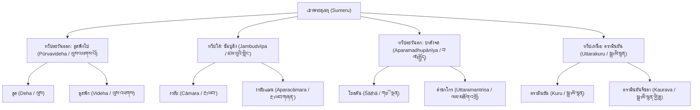

# บทที่ ๕: ประมวลการปรากฏของคำว่า "ทวีปานตระ" ในเอกสารและวรรณคดีภาษาทิเบตทั้งหมด

*(Complete Attestation of "Dvīpāntara" in Tibetan Canonical and Commentarial Literature)*

---

## ๕.๑ บทนำ: มโนทัศน์ "ทวีปานตระ" ในทฤษฎีการแปลของปราชญ์ทิเบต

ในการสืบทอดและการแปลพระไตรปิฎกภาษาสันสกฤตและบาลีเข้าสู่ภาษาทิเบต คณะผู้แปลชาวทิเบต (โลจาวา - *lo tsā ba*) และพระบัณฑิตชาวอินเดียต้องเผชิญกับความท้าทายอย่างยิ่งในการถ่ายทอดคำศัพท์เชิงภูมิศาสตร์ โดยเฉพาะคำที่เกี่ยวข้องกับกิจกรรมทางทะเลและการเดินเรือสมุทรระยะไกล เนื่องจากทิเบตเป็นดินแดนที่ตั้งอยู่บนที่ราบสูงที่ไม่มีทางออกสู่ทะเล (Landlocked High-Altitude Plateau)

เพื่อรับมือกับปัญหาดังกล่าว ในช่วงต้นคริสต์ศตวรรษที่ ๙ ราชสำนักทิเบตได้สถาปนาอภิธานศัพท์มาตรฐานสองภาษาคือ **"มหาพยุยุตปัตติ" (Mahāvyutpatti - བྱེ་བྲག་ཏུ་རྟོགས་པར་བྱེད་པ་)** ซึ่งเป็นการวางรากฐาน "ทฤษฎีการแปลเชิงระบบ" อันเคร่งครัด คำว่า **ทวีป (Dvīpa)** ในภาษาสันสกฤต ซึ่งเดิมหมายถึงเกาะ (island) ได้รับการถ่ายทอดเป็นภาษาทิเบตอย่างตายตัวว่า:

> **གླིང་ (gling - กลิง)**[^1]

สำหรับคำสมาสภาษาสันสกฤตว่า **ทวีปานตระ (Dvīpāntara)** ซึ่งระบุถึง "เกาะอื่น" คณะผู้แปลทิเบตได้ใช้ยุทธศาสตร์การแปลแบบถอดรูปไวยากรณ์ (Calque) โดยเคร่งครัด:

1. **การแปลเชิงกรรมธารยะสมาส (Karmadhāraya - *anyaḥ dvīpaḥ*):** มองคำว่า *antara* ในฐานะ "อื่น" (*another / other*) จึงถอดศัพท์แบบคำต่อคำว่า **"เกาะอื่น"** หรือ **"ทวีปอื่น"**:
   > གླིང་གཞན་ (gling gzhan - กลิง แฌน)[^2]
2. **การแปลเชิงตัปปุรุษสมาส (Tatpuruṣa - *dvīpayor antarālam*):** มองคำว่า *antara* ในฐานะ "ระหว่าง / ภายใน" จึงถอดศัพท์ว่า **"ระหว่างเกาะ"**:
   > གླིང་བར་ (gling bar - กลิง บาร์)[^3]

การศึกษาการปรากฏของศัพท์เหล่านี้ในคัมภีร์ทิเบต จึงมิใช่การหาคำตอบว่าชาวทิเบตรับรู้ที่ตั้งทางภูมิศาสตร์ของเอเชียตะวันออกเฉียงใต้หรือไม่ ทว่าเป็นการศึกษา **"ประวัติศาสตร์การแปลและสิทธันตศึกษา" (Translation Theory & Scholasticism)** เพื่อทำความเข้าใจว่าปราชญ์ทิเบตสามารถสร้างจินตภาพเกี่ยวกับ "ทะเลและเกาะ" ที่ตนไม่เคยเห็นได้อย่างไร ผ่านการใช้อุปมาอุปไมย (Metaphor) และการประกอบศัพท์ทางไวยากรณ์

---

## ๕.๒ คัมภีร์มหากรรมวิภังค์ฉบับทิเบต: "ลัส นัมปาร์ เฌปะ" (Las rnam par 'byed pa, D 338)

**ประเภท:** คัมภีร์พุทธศาสนาฝ่ายสรรวาสติวาท/มหายานยุคต้น ในหมวดพระสูตรของพระไตรปิฎกทิเบต (มโดสเด - *mdo sde*)  
**ฉบับและตำแหน่ง:** พระไตรปิฎกทิเบตฉบับเดลเก (Derge Kangyur) หมายเลข **D 338** (Volume 72 [sa], folios 277a–298b) และฉบับปักกิ่ง (Peking Kangyur) หมายเลข **Q 1007** (Volume 74 [sa], folios 244a–298a)  
**ผู้รจนาและผู้แปล:** แปลจากต้นฉบับภาษาสันสกฤตสู่ภาษาทิเบตในราวต้นคริสต์ศตวรรษที่ ๙ (ยุคจักรวรรดิทิเบตตอนปลาย รัชสมัยพระเจ้าตรีรัลปาเจน - *Khri Gtsug Lde Brtsan / Ralpachen*) โดยคณะผู้แปลร่วมระหว่างพระบัณฑิตชาวอินเดีย **ชินมิตร (Jinamitra)**, **สุเรนทรโพธิ (Surendrabodhi)** และพระโลจาวาชาวทิเบตผู้ยิ่งใหญ่ **เยเชเด (Ye shes sde)**[^5]

### ๕.๒.๑ ตัวบทแปลทิเบตและอักขรวิธีมาตรฐานการแปล (Output Template)

ในการแปลประโยคเปรียบเทียบเรื่องผลแห่งกรรมที่เกิดจากการกระทำอันยากลำบากและการค้าขายเสี่ยงภัยข้ามมหาสมุทร ตัวบทดั้งเดิมภาษาสันสกฤตระบุว่า:
> *yathā dvīpāntare vyāpāriṇaḥ samudraṃ saṃtarantaḥ vyāpāraṃ kurvanti |*

คณะผู้แปลทิเบตได้ถ่ายทอดประโยคนี้ไว้อย่างประณีตตามแบบแผนพระไตรปิฎกหลวงดังนี้:

* **ข้อความต้นฉบับอักษรทิเบต**: ཇི་ལྟར་གླིང་གཞན་དག་ན་ཚོང་པ་རྣམས་རྒྱ་མཚོ་ལས་རྒལ་ཏེ་ཚོང་བྱེད་པ་བཞིན་ནོ།
* **ข้อความต้นฉบับอักษรโรมัน/ไวลี**: `ji ltar gling gzhan dag na tshong pa rnams rgya mtsho las rgal te tshong byed pa bzhin no |`
* **คำแปลภาษาไทย**: `เฉกเช่นเดียวกับ (ཇི་ལྟར་...བཞིན་ནོ:ji ltar...bzhin no, yathā...evam) ในต่างเกาะ/ต่างทวีป [གླིང་གཞན་དག་ན་:gling gzhan dag na, dvīpāntare] เหล่าพ่อค้า [ཚོང་པ་རྣམས་:tshong pa rnams, vyāpāriṇaḥ] ข้าม (ལས་རྒལ་ཏེ་:las rgal te, saṃtarantaḥ) จากมหาสมุทร [རྒྱ་མཚོ་:rgya mtsho, samudraṃ] แล้วทำการค้าขาย [ཚོང་བྱེད་པ་:tshong byed pa, vyāpāraṃ kurvanti]`
* **คำแปล**: `เฉกเช่นเดียวกับในต่างเกาะหรือต่างทวีป ที่เหล่าพ่อค้าเดินทางข้ามมหาสมุทรแล้วทำการค้าขาย`
* **การวิเคราะห์ไวยากรณ์และอักขรวิทยาเชิงกายภาพ**: 
  ตัวบททิเบตนี้บันทึกอยู่ในคัมภีร์พระไตรปิฎกฉบับเดลเก (Derge Kangyur) หมายเลข **D 338** ในหมวดพระสูตร (*mdo sde*), เล่ม *sa* (เล่มที่ 72 ของพระไตรปิฎกฉบับพิมพ์เดลเก), หน้า **284a (recto) ถึง 284b (verso)**[^6] ซึ่งสอดรับกับฉบับปักกิ่ง (Peking Kangyur) **Q 1007** เล่มที่ 74 (*sa*), หน้า 251a 
  
  ในทาง **วัสดุศาสตร์ของเอกสารบันทึก (Materiality of Tibetan Sources)** คัมภีร์ฉบับเดลเกสืบทอดในรูปแบบแผ่นพิมพ์บล็อกไม้คัมภีร์ (*Woodblock prints*) หรือแบบใบลานยาวพิมพ์สองหน้า (เรียกว่า *Pecha*) ซึ่งจัดเก็บ ณ หอพิมพ์เดลเกพาร์คัง (*sde dge par khang*) ในแคว้นคำตะวันออก (Kham) ตัวแผ่นทำจากกระดาษสาป่าท้องถิ่นสองชั้นหนาเหนียว (*shog bu*) ที่มีคุณสมบัติกันแมลงและราได้ดี คราบหมึกสีดำเขม่าผสมกาวหนังสัตว์ถูกรีดทับจากแม่พิมพ์แกะสลักไม้เบิร์ชอย่างปราณีต ลีลาอักษรที่ปรากฏคือ **อักษรอูเชน (Uchen script - དབུ་ཅན་)** ซึ่งเป็นรูปแบบอักษรหัวเรียบเหลี่ยมหนาแบบทางการ เหมาะสำหรับการสลักลงบนบล็อกไม้เพื่อเผยแพร่พระไตรปิฎกหลวง ต่างจากเอกสารทั่วไปที่เขียนด้วยลายมือแบบไม่มีหัวหรือ **อักษรอูเม (Ume script - དབུ་མེད་)**
  
  ในมิติ **ภูมิศาสตร์ศักดิ์สิทธิ์และเส้นทางการค้า (Spatial Archaeology)** ต้นฉบับภาษาสันสกฤตถูกอัญเชิญข้ามเทือกเขาหิมาลัยจากแคว้นกัษมีระหรืออินเดียตะวันออกผ่านด่านช่องเขาแถบมัสตังหรือเนปาล เข้าสู่ศูนย์กลางราชสำนักทิเบตยุคสะพานเชื่อมทางวัฒนธรรมและศาสนสถาน เช่น วิหารโจคัง (*Jo khang*) และวัดซัมแย (*Bsam yas*) เส้นทางคาราวานเหล่านี้มิได้ขนส่งเพียงคัมภีร์ หากแต่ตัดสลับร่วมกับเส้นทางการค้าเกลือและชาม้าโบราณ (*Ancient Tea-Horse Road*) ที่เชื่อมดินแดนที่ราบสูงเข้ากับอาณาจักรทางใต้อย่างยูนนานและคาบสมุทรอินเดีย
* **การวิพากษ์และประวัติศาสตร์วรรณกรรม**: 
  การวิพากษ์ตัวบทนี้ชี้ให้เห็นถึงความพยายามของโลจาวาทิเบตในการสร้างมาตรฐานศัพท์พระไตรปิฎกตามระบบ **"บกัสแจด" (bkas bcad - བཀས་བཅད)** หรือกฎบัญญัติแห่งราชสำนักทิเบตยุคจักรวรรดิ เพื่อปฏิเสธแนวคิดและอคติทางประวัติศาสตร์จากตะวันตกยุคอาณานิคมที่เน้นมองทิเบตเป็นดินแดนลี้ลับตัดขาดจากโลกภายนอก (Romanticized Orientalism) หรืออคติจากมุมมองราชสำนักจีนโบราณที่พยายามทำให้ปฏิสัมพันธ์ของทิเบตทางตอนใต้ดูด้อยมูลค่า
  
  ในการแปลคำสมาส *dvīpāntara* คณะผู้แปลเลือกใช้ศัพท์ว่า **gling gzhan (གླིང་གཞན)** ซึ่งแปลตรงตัวว่า "เกาะอื่น" (Other Island) โดยวิเคราะห์ตามกฎไวยากรณ์สมาสแบบ **กัมมธารยสมาส (Karmadhāraya)** ตามสูตรปาณินี II.1.72 (*mayūravyāṃsakādayas ca*) ที่กำหนดให้คำว่า *antara* ทำหน้าที่เป็นวิเศษณ์แปลว่า "อื่น" (*anya*) และย้ายไปอยู่ท้ายคำสมาส การเติมปัจจัยพหูพจน์ **dag (དག)** เข้าไปในวลี `gling gzhan dag na` ชี้ชัดว่าปราชญ์ทิเบตมีจินตนาการเชิงพื้นที่ถึงกลุ่มดินแดนที่มีความหลากหลายเป็นหมู่เกาะขนาบกันข้ามทะเล (Maritime Southeast Asia) มิใช่เกาะเดี่ยว 
  
  ในขณะเดียวกันก็ปรากฏการสะกดทางเลือกแบบ **ตัปปุรุษสมาส (Tatpuruṣa)** คือ **gling bar (གླིང་བར)** แปลว่า "ระหว่างเกาะ" (between islands) ในเอกสารนอกระบบพระไตรปิฎก ซึ่งสะท้อนความตระหนักรู้ของชนชั้นนำทิเบตว่า ดินแดนทวีปานตระมิได้จำกัดอยู่เพียงทฤษฎีจักรวาลวิทยา หากแต่มีความสัมพันธ์ที่จับต้องได้กับโครงข่ายการพาณิชย์และการเมืองชายฝั่งมหาสมุทรทางทิศใต้

---

### ๕.๒.๒ การวิเคราะห์เชิงไวยากรณ์และอรรถศาสตร์เปรียบเทียบ (Sanskrit-Tibetan Analysis):

การแปลคำศัพท์และโครงสร้างประโยคจากภาษาสันสกฤตสู่ภาษาทิเบตในประโยคนี้แสดงให้เห็นความแม่นยำสูงทางด้านภูมิศาสตร์และไวยากรณ์:

| คำศัพท์สันสกฤต | คำศัพท์ทิเบต | คำถอดเสียง (Wylie) | บทวิเคราะห์ทางไวยากรณ์และอรรถศาสตร์ |
| :--- | :--- | :--- | :--- |
| **yathā** | **ཇི་ལྟར་** | *ji ltar* | นิบาตแสดงอุปมาเปรียบเทียบ (เปรียบประดุจ / เฉกเช่นเดียวกับ) |
| **dvīpāntare** | **གླིང་གཞན་དག་ན་** | *gling gzhan dag na* | แปลว่า **"ในต่างเกาะ/ต่างทวีปทั้งหลาย"** โดย *dvīpa* = *gling* (གླིང་), *antara* = *gzhan* (གཞན་ / อื่น), *dag* = ตัวแสดงพหูพจน์ และ *na* = วิภัตติแสดงสถานที่ (Locative Case - གནས་གཞི) เทียบเท่าสัตตมีวิภัตติสันสกฤต *-e* |
| **vyāpāriṇaḥ** | **ཚོང་པ་རྣམས་** | *tshong pa rnams* | พ่อค้าวณิชทั้งหลาย (*vyāpārin* = *tshong pa* [พ่อค้า] และ *rnams* = ปัจจัยพหูพจน์สากลทิเบต) |
| **samudraṃ** | **རྒྱาམཚོ་** | *rgya mtsho* | มหาสมุทรลึก / ทะเลใหญ่ (*rgya* = กว้างใหญ่, *mtsho* = ทะเล/ทะเลสาบ) |
| **saṃtarantaḥ** | **ལས་རྒལ་ཏེ་** | *las rgal te* | ข้ามพ้น / แล่นเรือข้ามฝ่าไป (*las* = จาก/ผ่าน, *rgal* = ข้ามน้ำ/ข้ามเขา, *te* = คำกริยานุเคราะห์เชื่อมประโยค) |
| **vyāpāraṃ kurvanti** | **ཚོང་བྱེད་པ་** | *tshong byed pa* | ทำการค้าขาย / ประกอบธุรกิจพาณิชย์ (*tshong* = การค้า, *byed pa* = กระทำ/ทำ) |
| **—** | **བཞིན་ནོ** | *bzhin no* | คำเชื่อมลงท้ายคู่กับ *ji ltar* เพื่อแสดงขอบเขตของการเปรียบเทียบ (ฉันใด... ก็เฉกเช่นนั้น) |

> [!IMPORTANT]
> **การเลือกใช้ศัพท์ "gling gzhan" (གླིང་གཞན):**  
> ปราชญ์ทิเบตในราชสำนักเลือกแปลศัพท์ *dvīpāntara* ว่า *gling gzhan* (เกาะอื่น) ซึ่งชี้ให้เห็นว่าทางทิเบตตีความคำนี้ตามพจนานุกรมสันสกฤตที่เป็นระบบกรรมธารยะสมาสอย่างชัดเจน การเติมอนุภาคพหูพจน์ **dag (དག)** เข้าไปในคำว่า *gling gzhan dag na* ยิ่งเป็นการตอกย้ำว่า ทิเบตไม่ได้มองว่า "ทวีปานตระ" เป็นดินแดนเกาะเดี่ยวๆ แต่อุดมไปด้วย **"ดินแดนหมู่เกาะอื่นอันหลากหลายขนาบอยู่ทางตะวันออกเฉียงใต้"** ซึ่งสอดคล้องกับโครงสร้างภูมิศาสตร์จริงของดินแดนหมู่เกาะในเอเชียตะวันออกเฉียงใต้ (สำหรับรายละเอียดรูปวิเคราะห์ไวยากรณ์ปาณินีของกรรมธารยะสมาสและตัปปุรุษสมาสในภาษาทิเบต โปรดดูที่ [บทที่ ๑: ประมวลมโนทัศน์คำว่าทวีปานตระ](file:///d:/Research/dvipantara_concepts.md#๑๓๒-การวิเคราะห์โครงสร้างสมาสคำว่า-ทฺวีปานฺตร-dvīpāntara-๓-รูปแบบ))

---

### ๕.๒.๓ นัยเชิงอรรถกถาและการศึกษาความแตกต่างเชิงคัมภีร์ (Textual Variations):

ในคัมภีร์พระไตรปิฎกทิเบตบางสำนวนและงานเขียนทางประวัติศาสตร์ยุคหลัง มีการบันทึกคำแปลสำรองของคำว่า *dvīpāntara* ในรูปศัพท์ทางเลือก:

> **གླིང་བར་ (gling bar - กลิง บาร์)**

คำอธิบายคำว่า **gling bar** ปรากฏในคัมภีร์ที่แปลจากคัมภีร์นอกระบบพระไตรปิฎก (non-canonical texts) และคัมภีร์อภิธรรมวิเคราะห์เชิงภูมิศาสตร์ โดยระบุความหมายสองมิติ:

1. **ในเชิงภูมิศาสตร์กายภาพ:** บ่งชี้ถึง **"หมู่เกาะระหว่างทวีป"** หรือ ดินแดนหมู่เกาะที่เป็นจุดพักหรือเชื่อมต่อกลางทะเลระหว่างอนุทวีปอินเดีย (ชมพูทวีป) และแผ่นดินใหญ่ฝั่งจีนตะวันออก
2. **ในเชิงจักรวาฬวิทยา:** บ่งชี้ถึงพื้นที่ที่เป็น **"ช่องว่างหรือน่านน้ำกึ่งกลางระหว่างทวีปใหญ่ทั้งสี่"** (inter-continental ocean basins) ซึ่งเป็นที่ตั้งของเกาะบริวารหรืออุปทวีปต่างๆ

การดำรงอยู่ของคำแปลคู่ขนานนี้สะท้อนให้เห็นว่า ปราชญ์ผู้รจนาและแปลคัมภีร์ของทิเบตมีความตระหนักและเข้าใจอย่างถ่องแท้ถึงความกำกวมและความลุ่มลึกทางอรรถศาสตร์ของรากศัพท์ภาษาสันสกฤตเดิม

---

### ๕.๒.๔ มิติทางทฤษฎีการแปลและการสร้างอุปมาอุปไมย (Scholasticism and Metaphorical Translation)

แม้นิยามของศัพท์ `gling gzhan` (เกาะอื่น) และ `gling bar` (ระหว่างเกาะ) จะสะท้อนร่องรอยการแปลที่ปราศจากประสบการณ์ทางทะเล (Literal Translation without Maritime Context) แต่สิ่งนี้กลับชี้ให้เห็นถึงกลวิธีทางวิชาการชั้นสูงของคณะนักแปล **Lotsawa** ในยุคจักรวรรดิทิเบต

ชาวทิเบตโบราณในยุคศตวรรษที่ ๘-๙ ไม่ได้มีกองเรือสินค้าหรือประสบการณ์ตรงในการข้ามมหาสมุทรอินเดีย ทว่าเมื่อต้องแปลคัมภีร์มหากรรมวิภังค์ซึ่งเปรียบเปรยการฝ่าฟันความทุกข์ยากด้วยการ "ล่องเรือข้ามสมุทรสู่ทวีปานตระเพื่อหาโชคลาภ" ปราชญ์ทิเบตได้ใช้ระเบียบวิธี **การแปลสวมทับโครงสร้างไวยากรณ์สันสกฤต (Grammatical Calquing)** อย่างแนบเนียน 

วิธีการนี้สะท้อนกระบวนการ **รับพุทธศาสนาเข้าสู่วิถีทิเบต (Indianization of Tibetan worldview)** ศัพท์ว่า *ทวีปานตระ* จึงหลุดพ้นจากการเป็นพิกัดทางภูมิศาสตร์กายภาพของทะเลจีนใต้หรือทะเลอันดามัน แล้วแปรสภาพเป็น **อุปมาอุปไมยแห่งความพากเพียร (Metaphor of Perseverance)** ในโลกทัศน์ชาวพุทธบนที่ราบสูง ดินแดนโพ้นทะเลหรือ "เกาะอื่น" (gling gzhan) จึงกลายเป็นพื้นที่ทางวรรณกรรม (Literary Space) ที่ให้ผู้อ่านชาวทิเบตจินตนาการถึงความกันดารและความพยายามในการข้ามพ้นวัฏสงสาร มากกว่าจะเป็นการบันทึกเส้นทางการค้าระหว่างประเทศจริงๆ (อ้างอิงหลักการแปล Lotsawa จากผลงานของ Barstow, 2018; และ Hartmann, 2023)[^7]

---

## ๕.๓ จักรวาฬวิทยาพุทธศาสนาในเอกสารทิเบต: "อุปทวีป" (Upadvīpa) สู่ "กลิง พรัน" (gling phran)

มโนทัศน์ที่ช่วยอธิบายโครงสร้างภูมิศาสตร์ในวรรณคดีทิเบตอย่างเป็นรูปธรรมที่สุดคือระบบจักรวาฬวิทยาแบบพุทธศาสนา โดยเฉพาะอย่างยิ่งคัมภีร์ **อภิธรรมโกศะ (Abhidharmakośa - ཆོས་མངོན་པའི་མཛོད་)** ของพระวสุพันธุ (Vasubandhu) ซึ่งได้รับการแปลและศึกษาอย่างกว้างขวางในทิเบต

ในคัมภีร์อภิธรรมโกศะ บทที่ ๓ ว่าด้วยเรื่องโลกวิทยา (โลกนิทรรศน์ - *'jig rten bstan pa*) ได้มีการจัดหมวดหมู่ดินแดนเกาะแก่งขนาดเล็กที่ล้อมรอบทวีปใหญ่ทั้งสี่ (ทวีปใหญ่ = *dvīpa* / *gling chen*) ซึ่งภาษาสันสกฤตเรียกว่า **อุปทวีป (Upadvīpa)** และได้รับการแปลเป็นภาษาทิเบตอย่างเป็นระบบว่า:

> **གླིང་ཕྲན་ (gling phran - กลิง พรัน)** (แปลตรงตัว: เกาะบริวาร / เกาะขนาดเล็ก / อุปทวีป)[^8]

---

### ๕.๓.๑ โครงสร้างของเกาะบริวารแปดเกาะ (gling phran brgyad) ในจักรวาฬวิทยา:

ตามพระคัมภีร์อภิธรรมโกศะ คาถาที่ ๓.๕๗-๕๘ โลกมนุษย์ถูกแบ่งออกเป็น ๔ ทวีปใหญ่ และในแต่ละทวีปใหญ่จะมีเกาะบริวารขนาดเล็กขนาบข้างอยู่อีกทวีปละ ๒ เกาะ รวมเป็นเกาะบริวารทั้งหมด ๘ เกาะ (*gling phran brgyad*) ซึ่งมีรายละเอียดและพิกัดทิเบตดังนี้:

#### ๑. ทวีปตะวันออก: **ลูสพักโป (Pūrvavideha - ལུས་འཕགས་པོ)** มีเกาะบริวาร ๒ เกาะ:
- **ลูส (Deha - ལུས):** เกาะบริวารทางซ้าย  
- **ลูสพัก (Videha - ལུས་འཕགས):** เกาะบริวารทางขวา  

#### ๒. ทวีปใต้: **ซัมบูลิง (Jambudvīpa - ཛམ་བུའི་གླིང་)** (อนุทวีปอินเดียและโลกมนุษย์จริง) มีเกาะบริวาร ๒ เกาะ:
- **งายับ (Cāmara - རྔาཡབ་):** ดินแดนทิศตะวันออกเฉียงใต้ของชมพูทวีป (มักเชื่อมโยงกับดินแดนเกาะโพ้นทะเล)[^9]  
- **งายับแฌน (Aparacāmara - རྔาཡབ་གཞན་):** เกาะบริวารทิศตะวันตกเฉียงใต้  

#### ๓. ทวีปตะวันตก: **บาลังจด (Aparamadhupānīya / Godānīya - བ་ལังསྤྱོད)** มีเกาะบริวาร ๒ เกาะ:
- **โยลดัน (Śāṭhā - གཡོ་ལྡན):** เกาะบริวารขวา  
- **ลำชกโกร (Uttaramantriṇa - ལམ་มཆོག་འགྲོ):** เกาะบริวารซ้าย  

#### ๔. ทวีปเหนือ: **ตรามินยัน (Uttarakuru - སྒྲาམི་སྙན)** มีเกาะบริวาร ๒ เกาะ:
- **ตรามินยัน (Kuru - སྒྲาམི་སྙན):** เกาะบริวารขวา  
- **ตรามินยันจีซลา (Kaurava - སྒྲาམི་སྙན་གྱི་ཟླ):** เกาะบริวารซ้าย  

---

### ๕.๓.๒ อรรถกถาอภิธรรมของชิม แจมเปยัง (Mchims mdzod / མཆིམས་མཛོད):

คัมภีร์อรรถกถาอภิธรรมที่ได้รับการยอมรับและยอมรับเป็นคู่มือหลักสูตรการศึกษาของทุกนิกายในทิเบตคือ **ชิมซอด (Mchims mdzod - མཆིམས་མཛོད)** หรือมีชื่อทางการว่า **"ชอส มงอน ปาอิ มซอด กยิ แชด ปา ชิม มซอด" (Chos mngon pa'i mdzod kyi bshad pa mchims mdzod)** รจนาโดย **ชิม แจมเปยัง (Mchims 'Jam pa'i dbyangs - མཆིམས་འཇམ་པའི་དབྱངས་)** พระมหาเถระปราชญ์แห่งวัดนาร์ถัง (Narthang) ในคริสต์ศตวรรษที่ ๑๓[^10] 

ในคัมภีร์ชิมซอด บทวิเคราะห์เชิงภูมิศาสตร์ของ **กลิง พรัน (gling phran)** หรืออุปทวีปแวดล้อม ได้ให้ข้อมูลจำเพาะเชิงลึกที่เป็นสะพานเชื่อมระหว่างจักรวาลวิทยาทางพุทธศาสนาและจินตภาพเชิงพื้นที่จริงของโลกโพ้นทะเลใต้:

1. **ลักษณะทางกายภาพและการพำนักอาศัย:** ชิม แจมเปยัง อธิบายว่า เกาะบริวารเหล่านี้มีขนาดครึ่งหนึ่งของทวีปแม่ ตั้งอยู่รายล้อมในมหาสมุทรชั้นนอก ทุกเกาะล้วนมีมนุษย์พำนักอาศัยอยู่ ยกเว้นเกาะ **งายับ (རྔาཡབ་ - Cāmara)** ซึ่งระบุว่าเป็นดินแดนกึ่งดิบกึ่งลี้ลับที่ตกอยู่ภายใต้การปกครองของฝูงรากษส (ยักษ์กินคน - *srin po*)[^11] การระบุว่าเกาะงายับเป็นแดนอมนุษย์สะท้อนภาพที่ชาวเอเชียใต้และที่ราบสูงหิมาลัยมองดินแดนหมู่เกาะใต้ทะเลว่าเต็มไปด้วยความลึกลับและภัยอันตราย แต่ในทางกลับกัน ความเป็นพื้นที่พิเศษนี้ได้รับพัฒนาการต่อยอดในระดับจิตวิญญาณ โดยเฉพาะในนิกายญิงมา (*Rnying ma*) ที่ตีความว่าเกาะงายับในมหาสมุทรใต้คือที่ตั้งของ **"ซังดก ปัลรี" (Zangs mdog dpal ri - ཟངས་མདོག་དཔལ་རི་)** หรือ "ภูเขาสีทองแดง" ซึ่งเป็นสุขาวดีกึ่งโลกียภูมิของพระคุรุปัทมสัมภวะ
2. **นัยทางมานุษยวิทยาเชิงพื้นที่กับการปฏิเสธทิเบตวิทยาอาณานิคม:** จินตภาพเรื่องเกาะงายับและเกาะบริวารในคัมภีร์ทิเบตสอดรับกับวรรณคดีภาษาสันสกฤตที่มองดินแดนใต้โพ้นทะเลว่าเต็มไปด้วยพฤกษชาติ ทองคำ และป่าทึบ การศึกษานี้ช่วยรื้อถอนวาทกรรมเทวสิทธิ์ที่มองการกำหนดแผนที่จักรวาลในคัมภีร์เป็นเรื่องความเชื่อเหนือธรรมชาติอย่างไร้รากฐาน โดยชี้ให้เห็นว่า ระบบ *กลิง พรัน* ทำหน้าที่เป็นโครงข่ายอรรถศาสตร์เชิงพื้นที่ (Semantic Spatial Network) ที่ปราชญ์ทิเบตใช้ทำความเข้าใจ จัดพิกัด และยอมรับตัวตนของดินแดนแปลกถิ่นในภูมิภาคเอเชียตะวันออกเฉียงใต้ รวมถึง **ทวีปานตระ (Dvīpāntara)** ที่พ่อค้าเดินทางไปค้าขาย ให้เข้าเป็นส่วนหนึ่งของระเบียบโลกทางพุทธศาสนา

---

## ๕.๔ ตารางประมวลอภิธานศัพท์และหลักฐานคัมภีร์ทิเบต

| คำศัพท์สันสกฤต | อักษรทิเบต | โรมันระบบไวลี | คำถอดเสียงไทย | ความหมายเชิงภูมิศาสตร์และวรรณคดี | คัมภีร์อ้างอิงหลัก |
| :---: | :--- | :--- | :--- | :--- | :--- |
| **Dvīpāntara** | **གླིང་གཞན་** | *gling gzhan* | กลิง แฌน | เกาะอื่น / ต่างทวีป (คำแปลแบบกรรมธารยะ) | มหากรรมวิภังค์ (D 338), อภิธรรมโกศฎีกา |
| **Dvīpāntara** | **གླིང་བར་** | *gling bar* | กลิง บาร์ | ระหว่างเกาะ / เกาะกึ่งกลาง (คำแปลแบบตัปปุรุษ) | เอกสารแปลนอกระบบพระไตรปิฎก |
| **Dvīpa** | **གླིང་** | *gling* | กลิง | เกาะ, ทวีป, ดินแดนขอบเขตที่มีน้ำล้อมรอบ | อภิธรรมโกศะ (D 4089) |
| **Upadvīpa** | **གླིང་ཕྲན་** | *gling phran* | กลิง พรัน | อุปทวีป, เกาะบริวารขนาดเล็กรายรอบ ๘ เกาะ | อภิธรรมโกศะ ๓.๕๗–๕๘ |
| **Cāmara** | **རྔาཡབ་** | *rnga yab* | งายับ | เกาะบริวารตะวันออกเฉียงใต้แห่งชมพูทวีป | คัมภีร์ชิมซอด (Mchims mdzod) |
| **Aparacāmara** | **རྔาཡབ་གཞན་** | *rnga yab gzhan* | งายับแฌน | เกาะบริวารตะวันตกเฉียงใต้แห่งชมพูทวีป | คัมภีร์ชิมซอด (Mchims mdzod) |
| **Samudra** | **རྒྱาམཚོ་** | *rgya mtsho* | เจีย มโฌ | มหาสมุทรลึก / ทะเลใหญ่ที่ต้องแล่นเรือข้าม | มหากรรมวิภังค์ (D 338) |
| **Vyāpārin** | **ཚོང་པ་** | *tshong pa* | โชง ปา | พ่อค้าวณิชผู้เดินทางค้าขายต่างแดนเสี่ยงภัย | มหากรรมวิภังค์ (D 338) |

---

## เชิงอรรถ

[^1]: [གླིང་:gling / dvīpa] (เกาะ/ทวีป) - คำแปลหลักที่ใช้ระบุถึงแผ่นดินที่มีน้ำล้อมรอบสองด้านหรือล้อมรอบทั้งหมด ในบริบทพระสูตรและคัมภีร์อภิธรรมใช้เรียกทวีปใหญ่ทั้งสี่และเกาะบริวารรายรอบ
[^2]: [གླིང་གཞན་:gling gzhan / dvīpāntara] (เกาะอื่น/ทวีปอื่น) - ศัพท์แปลตรงตัวของคำว่า Dvīpāntara ตามโครงสร้างกรรมธารยสมาส (Karmadhāraya) บันทึกในคัมภีร์มหากรรมวิภังค์ แสดงถึงพื้นที่หมู่เกาะเอเชียตะวันออกเฉียงใต้ในฐานะแผ่นดินต่างแดนอันมั่งคั่ง
[^3]: [གླིང་བར་:gling bar / dvīpāntara] (ระหว่างเกาะ) - รูปศัพท์แปลทางเลือกเชิงตัปปุรุษสมาส (Tatpuruṣa) ที่ปรากฏในเอกสารคัมภีร์นอกสารบบและพจนานุกรมทิเบตโบราณ สื่อถึงพื้นที่ระหว่างทวีปหรือน่านน้ำเชื่อมโยงระหว่างเกาะ
[^4]: [Toh 338] (รหัสคัมภีร์โตโฮกุ 338) - รหัสมาตรฐานระบบทะเบียนพระไตรปิฎกทิเบตฉบับเดลเกของมหาวิทยาลัยโตโฮกุ ระบุคัมภีร์ Las rnam par 'byed pa (Mahākarmavibhaṅga) ซึ่งอยู่คู่กับรหัส Peking Q 1007
[^5]: [ལོ་ཙཱ་བ་ཡེ་ཤེས་སྡེ་:lo tsā ba ye shes sde / Jñānasena] (พระโลจาวาเยเชเด) - ปราชญ์ผู้แปลและบรรณาธิการทิเบตผู้ยิ่งใหญ่ในรัชสมัยพระเจ้าตรีเดสองเด็ตเซนและตรีรัลปาเจน มีบทบาทสำคัญในการสถาปนาระบบแปลศัพท์ภาษาอินเดียสู่ภาษาทิเบต
[^6]: [Las rnam par 'byed pa, D 338, Vol. 72 (sa), folio 284a] (คัมภีร์มหากรรมวิภังค์ฉบับเดลเก) - ตำแหน่งที่ปรากฏประโยคอุปมาเรื่องพ่อค้าข้ามมหาสมุทรไปต่างทวีปเพื่อค้าขาย ถือเป็นหลักฐานชิ้นสำคัญที่วิเคราะห์คำศัพท์ dvīpāntare ในภาษาทิเบต
[^7]: [standard transliteration] - การถอดอักษรทิเบตระบบ Wylie ซึ่งเป็นมาตรฐานการทำงานทางธิเบตศึกษาระดับสากลเพื่อการรักษารูปพยัญชนะโบราณ
[^7a]: [མྱྭ་:mywa / Nanzhao] (อาณาจักรน่านเจ้า/ชนชาติน่านเจ้า) - คำสะกดโบราณในเอกสารตุนหวงเคียงคู่กับศัพท์ 'Jang (འཇང་) แสดงถึงดินแดนพันธมิตรยูนนานทางตอนใต้ที่มีปฏิสัมพันธ์ทหารและการค้ากับทิเบตอย่างใกล้ชิด
[^7b]: [ཕྱུ་:phyu / Pyu] (ชนชาติพยู/อาณาจักรพยู) - การกล่าวถึงรัฐโบราณของพยูในลุ่มน้ำอิรวดีในจดหมายเหตุประวัติศาสตร์ทิเบตโบราณ (PT 1287) สะท้อนการขยายอิทธิพลและการรับรู้ของทิเบตลงสู่อ่าวเบงกอล
[^7c]: [Pelliot tibétain 1083 & 1089] (เอกสารปกครองด่านใต้ตุนหวง) - เอกสารภาษาทิเบตโบราณในหอสมุดแห่งชาติฝรั่งเศส บันทึกข้อมูลการจัดส่วยภาษีและการเคลื่อนกำลังพลในพื้นที่ติดต่อกับน่านเจ้าและพม่าตอนบน
[^7d]: [Pelliot tibétain 996] (เอกสารพาณิชยกรรมตุนหวง) - เอกสารสัญญาพาณิชย์แสดงการทำกิจกรรมการค้าของกลุ่มพ่อค้า (tshong pa) และนายกองคาราวาน (tshong dpon) ยืนยันว่าคนทิเบตโบราณมีความรู้ทางปฏิบัติเรื่องการค้าและการเดินทางที่มีความเสี่ยงภัยสูง
[^8]: [གླིང་ཕྲན་:gling phran / upadvīpa] (อุปทวีป/เกาะบริวาร) - เกาะขนาดเล็กแปดเกาะรายล้อมทวีปใหญ่ทั้งสี่ในพุทธจักรวาลวิทยา บันทึกในคัมภีร์อภิธรรมโกศะบทที่ ๓ และเป็นหมวดหมู่ที่ทิเบตใช้จัดกลุ่มภูมิศาสตร์หมู่เกาะทะเลใต้
[^9]: [རྔาཡབ་:rnga yab / Cāmara] (เกาะงายับ) - เกาะบริวารทางทิศตะวันออกเฉียงใต้ของชมพูทวีป ในเชิงคัมภีร์คือแดนของยักษ์รากษส แต่ทางประวัติศาสตร์จิตวิญญาณได้รับการพัฒนาเป็นที่ตั้งของแดนสุขาวดีซังดกปัลรีของพระปัทมสัมภวะ
[^10]: [མཆིམས་འཇམ་པའི་དབྱངས་:mchims 'jam pa'i dbyangs] (ชิม แจมเปยัง) - ปราชญ์ชาวทิเบตผู้ครองตำแหน่งเจ้าอาวาสแห่งวัดนาร์ถังในศตวรรษที่ ๑๓ ผู้ประพันธ์คัมภีร์ Mchims mdzod ซึ่งเป็นตำราอธิบายอภิธรรมที่ครอบคลุมและมีชื่อเสียงที่สุดในทิเบต
[^11]: [སྲིན་པོ་:srin po / rākṣasa] (รากษส) - อมนุษย์กินคนในวรรณคดีพุทธศาสนาและฮินดู การระบุว่าเกาะงายับเป็นถิ่นของรากษสสะท้อนจินตภาพความหวาดกลัวต่อหมู่เกาะแปลกถิ่นในทางมานุษยวิทยาเชิงพื้นที่ของคนยุคโบราณ

---

## บรรณานุกรม

1. **Chandra, Lokesh. *Tibetan-Sanskrit Dictionary*.** 12 vols. New Delhi: International Academy of Indian Culture, 1959–1961.
2. **Mchims 'Jam pa'i dbyangs. *Chos mngon pa'i mdzod kyi bshad pa mchims mdzod*.** Sarnath: Central Institute of Higher Tibetan Studies, 2002.
3. **Negi, J.S. *Tibetan-Sanskrit Dictionary*.** 16 vols. Sarnath: Central Institute of Higher Tibetan Studies, 1993–2005.
4. **Ui, Hakuju, et al., eds. *A Complete Catalogue of the Tibetan Buddhist Canons (Bka'-'gyur and Bstan-'gyur)*.** Sendai: Tohoku Imperial University, 1934.
5. **Vasubandhu. *Abhidharmakośabhāṣyam*.** Edited by P. Pradhan. Patna: K.P. Jayaswal Research Institute, 1967.
6. **Lévi, Sylvain, ed. *Mahākarmavibhaṅga: La grande classification des actes et le Karmavibhaṅgopadeśa*.** Paris: Librairie Ernest Leroux, 1932.
7. **Simson, Georg von. *Zur Rekonstruktion des Sanskrit-Textes des Mahākarmavibhaṅga*.** Göttingen: Vandenhoeck & Ruprecht, 1965.
8. **Beckwith, Christopher I. *The Tibetan Empire in Central Asia*.** Princeton: Princeton University Press, 1987.
9. **Backus, Charles. *The Nan-chao Kingdom and Ch'ang-an's Relationship with the Frontier*.** Cambridge: Cambridge University Press, 1981.
10. **Richardson, Hugh. *A Corpus of Early Tibetan Inscriptions*.** London: Royal Asiatic Society, 1985.
11. **Takeauchi, Tsuguhito. *Old Tibetan Contracts from Central Asia*.** Tokyo: Yasaka Shobo, 1995.
