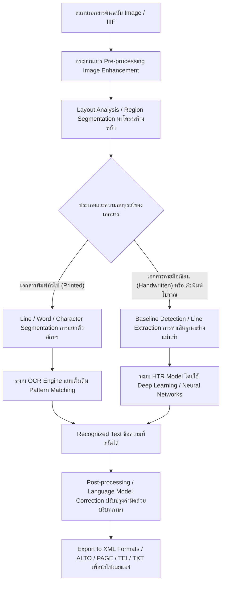

# พื้นฐาน XML สำหรับงาน OCR/HTR — คู่มือฉบับภาษาไทย

## สารบัญ

- [1. XML คืออะไร?](#1-xml-คืออะไร)
  - [1.1 ความแตกต่างระหว่าง XML กับ HTML](#11-ความแตกต่างระหว่าง-xml-กับ-html)
  - [1.2 ทำไม XML ถึงถูกเลือกใช้ในงานวิชาการและ Digitization?](#12-ทำไม-xml-ถึงถูกเลือกใช้ในงานวิชาการและ-digitization)
  - [1.3 ประวัติและต้นกำเนิดของ XML](#13-ประวัติและต้นกำเนิดของ-xml)
  - [1.4 ตัวอย่าง XML ง่ายๆ พร้อมอธิบายทีละบรรทัด](#14-ตัวอย่าง-xml-ง่ายๆ-พร้อมอธิบายทีละบรรทัด)
- [2. องค์ประกอบพื้นฐานของ XML](#2-องค์ประกอบพื้นฐานของ-xml)
  - [2.1 Element (อิลิเมนต์)](#21-element-อิลิเมนต์)
  - [2.2 Attribute (แอตทริบิวต์)](#22-attribute-แอตทริบิวต์)
  - [2.3 Namespace (เนมสเปซ)](#23-namespace-เนมสเปซ)
  - [2.4 Schema / XSD (XML Schema Definition)](#24-schema--xsd-xml-schema-definition)
  - [2.5 Encoding (การเข้ารหัสอักขระ)](#25-encoding-การเข้ารหัสอักขระ)
- [3. OCR vs HTR — ความแตกต่างพื้นฐาน](#3-ocr-vs-htr--ความแตกต่างพื้นฐาน)
  - [3.1 OCR (Optical Character Recognition)](#31-ocr-optical-character-recognition)
  - [3.2 HTR (Handwritten Text Recognition)](#32-htr-handwritten-text-recognition)
  - [3.3 ความท้าทายของ HTR เทียบกับ OCR](#33-ความท้าทายของ-htr-เทียบกับ-ocr)
  - [3.4 ตารางความแตกต่างทาง Workflow และความแม่นยำ](#34-ตารางความแตกต่างทาง-workflow-และความแม่นยำ)
  - [3.5 Diagram แสดง Pipeline ของ OCR vs HTR](#35-diagram-แสดง-pipeline-ของ-ocr-vs-htr)
- [4. Workflow การแปลงเอกสารเป็นดิจิทัล](#4-workflow-การแปลงเอกสารเป็นดิจิทัล)
  - [ขั้นตอนที่ 1: การสแกนภาพและจัดหา (Image Acquisition)](#ขั้นตอนที่-1-การสแกนภาพและจัดหา-image-acquisition)
  - [ขั้นตอนที่ 2: Pre-processing (การเตรียมภาพล่วงหน้าก่อนวิเคราะห์)](#ขั้นตอนที่-2-pre-processing-การเตรียมภาพล่วงหน้าก่อนวิเคราะห์)
  - [ขั้นตอนที่ 3: Layout Analysis / Segmentation (การวิเคราะห์และแบ่งโครงสร้างหน้า)](#ขั้นตอนที่-3-layout-analysis--segmentation-การวิเคราะห์และแบ่งโครงสร้างหน้า)
  - [ขั้นตอนที่ 4: Text Recognition (กระบวนการรู้จำข้อความ)](#ขั้นตอนที่-4-text-recognition-กระบวนการรู้จำข้อความ)
  - [ขั้นตอนที่ 5: Post-processing (การปรับปรุงผลลัพธ์และแก้ไข)](#ขั้นตอนที่-5-post-processing-การปรับปรุงผลลัพธ์และแก้ไข)
  - [ขั้นตอนที่ 6: Export / Archive (การส่งออกและจัดเก็บ)](#ขั้นตอนที่-6-export--archive-การส่งออกและจัดเก็บ)
- [5. มาตรฐาน XML ในวงการ Digitization — ภาพรวม](#5-มาตรฐาน-xml-ในวงการ-digitization--ภาพรวม)
  - [5.1 ALTO XML](#51-alto-xml)
  - [5.2 PAGE XML](#52-page-xml)
  - [5.3 hOCR](#53-hocr)
  - [5.4 METS](#54-mets)
  - [5.5 TEI](#55-tei)
  - [5.6 ABBYY XML](#56-abbyy-xml)
  - [5.7 ตารางเปรียบเทียบรวมภาพรวมของมาตรฐานที่สำคัญ](#57-ตารางเปรียบเทียบรวมภาพรวมของมาตรฐานที่สำคัญ)
- [6. กรณีศึกษาและการประยุกต์ใช้งานจริง (Use Cases)](#6-กรณีศึกษาและการประยุกต์ใช้งานจริง-use-cases)
  - [6.1 โครงการอนุรักษ์หนังสือพิมพ์แห่งชาติ (National Newspaper Archives)](#61-โครงการอนุรักษ์หนังสือพิมพ์แห่งชาติ-national-newspaper-archives)
  - [6.2 โครงการวิจัยและถอดความเอกสารโบราณ (Historical Manuscripts Transcription)](#62-โครงการวิจัยและถอดความเอกสารโบราณ-historical-manuscripts-transcription)
  - [6.3 การพัฒนาระบบ AI สำหรับภาษาท้องถิ่น (Local Language AI Development)](#63-การพัฒนาระบบ-ai-สำหรับภาษาท้องถิ่น-local-language-ai-development)
- [7. ระบบนิเวศซอฟต์แวร์และเครื่องมือ (Software Ecosystem)](#7-ระบบนิเวศซอฟต์แวร์และเครื่องมือ-software-ecosystem)
  - [7.1 Transkribus](#71-transkribus)
  - [7.2 eScriptorium / Kraken](#72-escriptorium--kraken)
  - [7.3 OCR-D](#73-ocr-d)
  - [7.4 Tesseract OCR](#74-tesseract-ocr)
- [8. พจนานุกรมศัพท์เฉพาะทาง (Glossary)](#8-พจนานุกรมศัพท์เฉพาะทาง-glossary)
- [แหล่งอ้างอิง](#แหล่งอ้างอิง)

---

## 1. XML คืออะไร?

XML ย่อมาจาก **eXtensible Markup Language** เป็นภาษามาร์กอัป (Markup Language) ที่มีบทบาทอย่างมากในระบบเทคโนโลยีสารสนเทศปัจจุบัน โดยถูกออกแบบมาเพื่อหน้าที่หลักในการ "จัดเก็บและรับส่งข้อมูล" เป็นสำคัญ โครงสร้างของไฟล์ XML เป็นรูปแบบข้อความธรรมดา (Plain Text) ที่สามารถอ่านเข้าใจได้ง่ายทั้งสำหรับมนุษย์ (Human-readable) และมีความเป็นโครงสร้างที่ชัดเจนจนเครื่องคอมพิวเตอร์สามารถนำไปประมวลผลต่อได้อย่างมีประสิทธิภาพ (Machine-readable) 

ในบริบทของการแปลงเอกสารกระดาษให้เป็นรูปแบบดิจิทัล (Digitization) โดยเฉพาะงานระบบการรู้จำอักขระ (Optical Character Recognition - OCR) และระบบการรู้จำลายมือเขียน (Handwritten Text Recognition - HTR) ไฟล์ XML เข้ามามีบทบาทสำคัญในฐานะ "ตัวกลางมาตรฐาน" สำหรับการเก็บรวบรวมข้อมูลอันหลากหลายที่ได้จากการประมวลผลภาพเอกสาร ไม่ว่าจะเป็น ตัวหนังสือที่สกัดได้, ตำแหน่งพิกัดต่างๆ (Coordinate), โครงสร้างและเค้าโครงของหน้า (Layout), ไปจนถึงข้อมูลอภิมาน (Metadata) เช่น ซอฟต์แวร์เวอร์ชันอะไรเป็นผู้ประมวลผล หรือความมั่นใจของผลลัพธ์เป็นอย่างไร

### 1.1 ความแตกต่างระหว่าง XML กับ HTML

เมื่อพูดถึงภาษามาร์กอัป หลายคนอาจคุ้นเคยกับ HTML (HyperText Markup Language) ซึ่งใช้สำหรับสร้างหน้าเว็บ แม้ว่า XML และ HTML จะมีบรรพบุรุษร่วมกันมาจากภาษาตระกูล SGML (Standard Generalized Markup Language) และมีหน้าตาโค้ดที่ดูคล้ายคลึงกัน คือการใช้ Tag แบบมีวงเล็บมุม `< >` แต่ในความเป็นจริงแล้ว ทั้งสองภาษามีจุดประสงค์หลักในการใช้งานที่แตกต่างกันอย่างสิ้นเชิง ดังตารางเปรียบเทียบต่อไปนี้:

| คุณสมบัติ | XML (eXtensible Markup Language) | HTML (HyperText Markup Language) |
| :--- | :--- | :--- |
| **จุดประสงค์หลัก** | ออกแบบมาเพื่อ **จัดเก็บ บรรยาย และรับส่งข้อมูล** (Data Transport & Description) | ออกแบบมาเพื่อ **แสดงผลข้อมูล** (Data Presentation) บนหน้าจอของเว็บเบราว์เซอร์ |
| **การกำหนด Tags** | เป็นอิสระ (Extensible) ไม่มี Tag กำหนดไว้ล่วงหน้า ผู้ใช้สามารถสร้าง Tag เองได้ตามโครงสร้างข้อมูล | มี Tag มาตรฐานที่กำหนดไว้ตายตัว เช่น `<p>` (ย่อหน้า), `<h1>` (หัวเรื่องระดับ 1), `<div>`, `<table>` |
| **ความเข้มงวดของไวยากรณ์** | เข้มงวดมาก (Strict) หากลืมปิด Tag หรือมีข้อผิดพลาดทางไวยากรณ์ โปรแกรมที่อ่านจะหยุดและแจ้งเตือน Error ทันที | ยืดหยุ่นกว่า (Forgiving) เบราว์เซอร์จะพยายามคาดเดาและเรนเดอร์เนื้อหาให้ได้มากที่สุดแม้ว่าโค้ดจะไม่สมบูรณ์ |
| **การให้ความหมายของข้อมูล** | มุ่งเน้นที่ความหมายของข้อมูล ว่าข้อมูลใน Tag นั้น "คืออะไร" (Semantic Content) เช่น `<ราคา>`, `<ผู้เขียน>` | มุ่งเน้นที่รูปลักษณ์ภายนอก ว่าข้อมูลนั้น "ควรแสดงผลอย่างไร" (Visual Format) เช่น เป็นตัวหนา หรือเป็นตาราง |

> [!NOTE]
> **ทำไม HTML จึงไม่เหมาะกับงาน OCR?**
> ในงาน OCR และ HTR เราไม่ได้ต้องการเพียงแค่เอากลุ่มก้อนข้อความมาโชว์บนหน้าจอคอมพิวเตอร์ แต่เราต้องการบรรจุโครงสร้างเชิงกายภาพที่ซับซ้อน เช่น ข้อความบรรทัดที่ 1 อยู่ที่ตำแหน่งพิกัด X/Y ใดบนภาพต้นฉบับ สไตล์ตัวอักษรตั้งต้นมีความหนาหรือบางแค่ไหน เป็นต้น เราต้องการอิสระเต็มที่ในการสร้าง Tags ที่บ่งบอกความหมายเฉพาะเจาะจงทางเรขาคณิตและการจัดหน้า ซึ่งความยืดหยุ่นของ XML ตอบโจทย์เรื่องนี้ได้อย่างสมบูรณ์แบบ

### 1.2 ทำไม XML ถึงถูกเลือกใช้ในงานวิชาการและ Digitization?

การที่โปรเจกต์ Digitization ทั่วโลกเลือกใช้ XML มีเหตุผลหลักที่สำคัญ 4 ประการ ดังนี้:

1. **Human-readable (อ่านง่ายด้วยตาเปล่า)**: โครงสร้างไฟล์ XML อาศัยข้อความธรรมดา (Plain Text) หากมีข้อผิดพลาด ผู้ดูแลระบบสามารถใช้ Text Editor พื้นฐาน เช่น Notepad, VS Code เปิดไฟล์ขึ้นมาอ่านทำความเข้าใจและแก้ไขได้ทันทีโดยไม่ต้องใช้โปรแกรมถอดรหัสพิเศษ
2. **Machine-readable (คอมพิวเตอร์ประมวลผลได้ง่าย)**: XML มีโครงสร้างแบบต้นไม้ (Tree Structure) ที่ชัดเจนและมีกฎระเบียบที่เคร่งครัด ทำให้โปรแกรมซอฟต์แวร์ หรือ Script ต่างๆ (เช่น Python, Java) สามารถทำการแยกวิเคราะห์ (Parse) ได้อย่างมีประสิทธิภาพ แม่นยำ และรวดเร็ว
3. **Extensible (ความสามารถในการขยายรูปแบบ)**: การที่อนุญาตให้ผู้เชี่ยวชาญร่วมกันกำหนด Tag ขึ้นใหม่ได้ นำไปสู่การสร้างมาตรฐานที่เจาะจงเฉพาะทาง เช่น ชุมชนวิจัยสร้างมาตรฐาน ALTO หรือ PAGE ขึ้นมาเพื่ออธิบายเรื่อง Layout Analysis โดยเฉพาะ
4. **Platform Independent (ไม่ยึดติดกับแพลตฟอร์ม)**: ไฟล์ XML ทำงานข้ามระบบปฏิบัติการต่างๆ ได้ ไม่ว่าจะเป็น Windows, Linux, หรือ macOS ทำให้การแบ่งปันข้อมูลระหว่างสถาบันทั่วโลก (Interoperability) ไร้รอยต่อ

### 1.3 ประวัติและต้นกำเนิดของ XML

XML ถือกำเนิดขึ้นภายใต้การพัฒนาของ World Wide Web Consortium (W3C) ซึ่งเป็นหน่วยงานหลักในการกำหนดมาตรฐานของเทคโนโลยีเวิลด์ไวด์เว็บ เวอร์ชัน 1.0 (XML 1.0) ได้รับการอนุมัติและประกาศให้เป็น W3C Recommendation อย่างเป็นทางการในเดือนกุมภาพันธ์ ปี 1998 

ก่อนหน้าที่จะมี XML วงการคอมพิวเตอร์ใช้ SGML (Standard Generalized Markup Language) ซึ่งเป็นภาษามาร์กอัปที่ครอบคลุมและทรงพลังมาก แต่มีข้อเสียคือความซับซ้อนที่มากเกินไป ทำให้การพัฒนาโปรแกรมมาอ่าน SGML ทำได้ยากและมีต้นทุนสูง ในขณะเดียวกัน HTML ที่ถูกสร้างให้เรียบง่ายก็มีข้อจำกัดตรงที่ไม่สามารถปรับแต่งเพิ่ม Tag ใหม่ๆ นอกเหนือจากที่เบราว์เซอร์รู้จักได้
ด้วยเหตุนี้ XML จึงถูกพัฒนาขึ้นเพื่อนำเอาจุดเด่นของทั้งสองมารวมกัน คือ คงความสามารถในการปรับแต่งและโครงสร้างเชิงลึกของ SGML ไว้ แต่ตัดความซับซ้อนที่ไม่จำเป็นออก เพื่อให้สามารถทำงานผ่านอินเทอร์เน็ตได้อย่างรวดเร็ว

### 1.4 ตัวอย่าง XML ง่ายๆ พร้อมอธิบายทีละบรรทัด

เพื่อให้เห็นภาพที่ชัดเจน ด้านล่างนี้คือตัวอย่างไฟล์ XML ทั่วไปที่ไม่ได้ซับซ้อนมาก ซึ่งถูกสร้างขึ้นเพื่อจัดเก็บข้อมูลแคตตาล็อกหนังสือในห้องสมุดดิจิทัล:

```xml
<?xml version="1.0" encoding="UTF-8"?>
<library>
    <!-- รายการหนังสือเล่มที่ 1 -->
    <book id="bk101">
        <title>พื้นฐาน XML สำหรับ OCR</title>
        <author>John Doe</author>
        <year>2023</year>
        <language>Thai</language>
    </book>
    
    <!-- รายการหนังสือเล่มที่ 2 -->
    <book id="bk102">
        <title>HTR in the Modern Era</title>
        <author>Jane Smith</author>
        <year>2024</year>
        <language>English</language>
    </book>
</library>
```

**คำอธิบายโค้ดทีละบรรทัด:**
- `<?xml version="1.0" encoding="UTF-8"?>` : นี่คือบรรทัดแรกสุดของไฟล์ เรียกว่า **XML Declaration** ซึ่งทำหน้าที่ประกาศให้โปรแกรมรับทราบว่า ไฟล์เอกสารนี้ปฏิบัติตามมาตรฐาน XML เวอร์ชัน 1.0 และใช้ระบบการเข้ารหัสอักขระ (Encoding) รูปแบบ UTF-8 ซึ่งเป็นระบบที่รองรับภาษาต่างประเทศต่างๆ ได้ทั่วโลก
- `<library>` : อิลิเมนต์แรกสุดที่ครอบคลุมเนื้อหาทั้งหมดเรียกว่า **Root Element (อิลิเมนต์ราก)** ซึ่งเป็นจุดเริ่มต้นของโครงสร้างต้นไม้ข้อมูล กฎของ XML บังคับว่า ทุกอย่างในไฟล์จะต้องอยู่ภายใต้ Root Element อันเดียวเท่านั้น (หากสร้าง Root Element หลายอันจะผิดกฎ)
- `<!-- รายการหนังสือเล่มที่ 1 -->` : นี่คือ Comment หรือคำอธิบายโค้ด ซึ่งโปรแกรมจะข้ามไปไม่อ่าน
- `<book id="bk101">` : นี่คือ Element ลูก (Child Element) ลำดับแรกที่อยู่ภายใต้ `<library>` นอกจากนี้ ภายในแท็กเปิดยังมีการเพิ่มข้อมูลประกอบที่เรียกว่า Attribute คือ `id="bk101"` เพื่อระบุรหัสอ้างอิงเฉพาะของหนังสือเล่มนี้
- `<title>พื้นฐาน XML สำหรับ OCR</title>` : เป็น Element ระดับหลานที่เก็บเนื้อหาจริงๆ คือชื่อหนังสือ สังเกตว่าองค์ประกอบจะสมบูรณ์ได้ต้องมี Tag เปิด `<title>` และมี Tag ปิด `</title>` ประกบหน้าหลังข้อมูลเสมอ
- `<author>...` `<year>...` `<language>...` : Element อื่นๆ ที่ใช้เก็บข้อมูลผู้เขียน ปีพิมพ์ และภาษา ตามลำดับ
- `</book>` : เป็น Tag ปิดสำหรับ Element `book` รายการแรก เพื่อบอกว่าจบข้อมูลของหนังสือเล่มที่ 1 แล้ว
- `<book id="bk102"> ... </book>` : ข้อมูลหนังสือเล่มที่ 2 ซึ่งมีโครงสร้างแบบเดียวกัน
- `</library>` : ในบรรทัดสุดท้ายคือ Tag ปิดสำหรับ Root Element เป็นการส่งสัญญาณสิ้นสุดไฟล์ XML อย่างสมบูรณ์

---

## 2. องค์ประกอบพื้นฐานของ XML

การจะก้าวไปทำความเข้าใจโครงสร้างไฟล์ระดับลึกที่มีความซับซ้อนอย่าง ALTO XML หรือ PAGE XML ผู้ใช้งานและนักพัฒนาโปรแกรมมีความจำเป็นต้องเข้าใจองค์ประกอบพื้นฐานของ XML จำนวน 5 ประการให้ถ่องแท้เสียก่อน:

### 2.1 Element (อิลิเมนต์)

Element ถือเป็นหน่วยโครงสร้างพื้นฐานที่สุดของการเขียน XML มันเปรียบเสมือนกล่องเก็บข้อมูล โดยองค์ประกอบที่สมบูรณ์ของหนึ่ง Element จะประกอบไปด้วย:
1. **Opening Tag (แท็กเปิด)**: ส่วนเริ่มต้น เช่น `<TextLine>`
2. **Content (เนื้อหา)**: สิ่งที่ถูกบรรจุอยู่ระหว่างแท็ก อาจเป็นข้อความธรรมดา (Text) หรือ Element ลูกอื่นๆ ที่ซ้อนเข้าไปอีก
3. **Closing Tag (แท็กปิด)**: ส่วนสิ้นสุด เช่น `</TextLine>` (สิ่งที่ต่างจากแท็กเปิดคือต้องมีเครื่องหมาย Forward slash `/` เสมอ)

**ตัวอย่างปกติ:**
```xml
<String CONTENT="Hello" />
```

**กรณีพิเศษ: Self-closing Tag (แท็กปิดตัวเอง)**
หาก Element นั้นไม่มีเนื้อหาใดๆ ซ่อนอยู่ข้างในเลย แต่ใช้ประโยชน์จากการเก็บข้อมูลไว้ที่ตัวแปร (Attribute) เท่านั้น เราสามารถเขียนรวบรัดให้เป็นรูปแบบ Self-closing Tag ได้ 
เช่น `<String CONTENT="Hello" />` จะมีความหมายและคุณค่าทางโครงสร้างเท่ากับ `<String CONTENT="Hello"></String>` ทุกประการ (ในไฟล์มาตรฐานของห้องสมุดอย่าง ALTO XML เราจะพบเจอเทคนิค Self-closing tags อยู่เต็มไปหมด เช่น `SP`, `HYP` ล้วนเป็น self-closing ทั้งสิ้น)

### 2.2 Attribute (แอตทริบิวต์)

Attribute คือ "ข้อมูลเพิ่มเติม" (Metadata) ที่ถูกนำมาใช้อธิบายคุณสมบัติหรือคุณลักษณะของ Element นั้นๆ 
- Attribute จะต้องถูกเขียนฝังอยู่ภายใน **แท็กเปิด (Opening Tag) เท่านั้น**
- โครงสร้างไวยากรณ์คือ `name="value"` (มีชื่อ Attribute ตามด้วยเครื่องหมายเท่ากับ และ **ค่าของ Attribute จะต้องอยู่ในเครื่องหมายคำพูด (Quotes) เสมอ** ซึ่งจะใช้ Double quotes `""` หรือ Single quote `''` ก็ได้)

**ใช้เมื่อไร?**
กฎทั่วไปในการออกแบบ XML คือ เรามักใช้ Attribute สำหรับเก็บข้อมูลที่ "ใช้อธิบายตัวข้อมูลหลัก" หรือ "คุณสมบัติแฝง" แต่ไม่ใช่ตัวเนื้อหาหลักที่ต้องการสื่อสาร ตัวอย่างเช่น ไอดีระบุตัวตนที่ไม่ซ้ำกัน, พิกัด (Coordinates) ของมุมภาพ, ความมั่นใจในการเดาข้อความ (Confidence Score) ของ AI เป็นต้น

**ตัวอย่างจากงาน Digitization:**
```xml
<TextRegion id="region_1" type="paragraph">
   <Coords points="120,450 680,450 680,820 120,820"/>
   <TextEquiv conf="0.95">
       <Unicode>สวัสดีชาวโลก</Unicode>
   </TextEquiv>
</TextRegion>
```
จากตัวอย่างด้านบน ในแท็ก `<TextRegion>` จะมี Attribute `id` (ใช้เพื่ออ้างอิง) และ `type` (บอกประเภทว่าเป็นย่อหน้า) และในแท็ก `<Coords>` จะมี Attribute `points` ที่บันทึกพิกัดของกรอบสี่เหลี่ยม ส่วนแท็ก `<TextEquiv>` มี Attribute `conf` (Confidence score)

### 2.3 Namespace (เนมสเปซ)

ในระบบงานจริง ไฟล์ XML ขนาดใหญ่มักถูกประมวลผลควบรวมกับระบบอื่น หรือผสานมาจากหลายแหล่ง การทำเช่นนี้อาจก่อให้เกิดปัญหา "ชื่อ Element ซ้ำซ้อนกัน" (Name Collision) 

เพื่อให้เห็นภาพ สมมติว่าไฟล์ XML หนึ่งมีการผสมข้อมูลของ 2 เรื่องเข้าด้วยกันคือ "การจัดหน้า" และ "เฟอร์นิเจอร์"
- `<table/>` ของทีมจัดหน้า อาจหมายถึง โครงสร้างตาราง (Table Grid) บนกระดาษ
- `<table/>` ของทีมเฟอร์นิเจอร์ อาจหมายถึง ตู้โต๊ะเครื่องเรือน (Table Furniture) ในร้าน

หากโปรแกรมต้องอ่านไฟล์นี้ มันจะไม่รู้เลยว่า `<table/>` อันไหนมีความหมายว่าอะไร
**Namespace** จึงถูกคิดค้นขึ้นมาเพื่อแก้ปัญหานี้ โดยเป็นการระบุ "ต้นสังกัด" หรือ "บริบทความหมาย" ของ Element นั้นๆ มักจะถูกเขียนอยู่ในรูปของ URI (Uniform Resource Identifier) คล้ายกับลิงก์ URL เพื่อประกันความไม่ซ้ำกันระดับโลก

**ทำไมเนมสเปซถึงสำคัญ?**
ซอฟต์แวร์สำหรับประมวลผล (XML Parser) ต้องพึ่งพา Namespace เพื่อแยกแยะว่า มันกำลังจัดการและอ่านข้อมูลโครงสร้างใด ตามมาตรฐานเวอร์ชันไหนอยู่ หาก Namespace ผิด ซอฟต์แวร์จะไม่ประมวลผลไฟล์นั้น

**ตัวอย่างการประยุกต์ใช้ในมาตรฐานจริง:**

ตัวอย่างจาก ALTO XML (เวอร์ชัน 4.4):
```xml
<alto xmlns="http://www.loc.gov/standards/alto/ns-v4#">
    <!-- เนมสเปซหลักตั้งต้นคือ ALTO v4.4 เนื้อหาทั้งหมดจะยึดตามมาตรฐานนี้ -->
</alto>
```

ตัวอย่างจาก PAGE XML (เวอร์ชัน 2019-07-15):
```xml
<PcGts xmlns="http://schema.primaresearch.org/PAGE/gts/pagecontent/2019-07-15">
    <!-- เนมสเปซหลักคือ PAGE XML เวอร์ชันกรกฎาคม ปี 2019 -->
</PcGts>
```
การระบุ `xmlns=` แบบนี้คือการประกาศ Default Namespace ให้กับ Root Element เพื่อส่งต่อสิทธิให้ Element ลูกๆ ได้สืบทอดบริบทนี้ไปใช้งาน

### 2.4 Schema / XSD (XML Schema Definition)

แม้ว่าเราจะสามารถเขียน XML ในโครงสร้างและ Tag ใดก็ได้ตามใจชอบอย่างอิสระ แต่ในอุตสาหกรรม หรือระบบงานขนาดใหญ่ การยอมรับความอิสระมากเกินไปจะสร้างความโกลาหล โปรแกรมปลายทางจะไม่สามารถคาดหวังหรือรับรองความถูกต้องของข้อมูลได้เลย

**Schema** หรือเรียกเจาะจงว่า **XSD (XML Schema Definition)** จึงเข้ามามีบทบาทในฐานะ "พิมพ์เขียว" (Blueprint) หรือ "กฎเกณฑ์" ที่กำหนดอย่างตายตัวว่า ไฟล์ XML เพื่อการใช้งานเฉพาะด้านนั้นๆ จะต้องมีโครงสร้างเป็นอย่างไร กฎที่ XSD สามารถตรวจสอบได้ ได้แก่:
- Element ประเภทใดบ้างที่ถูกอนุญาตให้มีอยู่ในเอกสาร?
- Element ลูกประเภทใดสามารถซ้อนอยู่ภายใต้ Element แม่ประเภทใดได้บ้าง? (เช่น `<TextLine>` ต้องอยู่ใต้ `<TextBlock>` เสมอ)
- Attribute ตัวไหนจำเป็นต้องปรากฏ (Required) หรือถ้าไม่ใส่ก็ไม่เป็นไร (Optional)?
- ค่า (Values) ของ Attribute ต้องเป็นชนิดข้อมูลรูปแบบใด (Data Types)? เช่น ต้องเป็นตัวเลขจำนวณเต็มเท่านั้น, เป็นวันที่, หรือเป็นสตริงที่มีความยาวไม่เกินจำกัด

**ทำไมต้องมี Schema?**
เพื่อนำไปสู่กระบวนการ **ตรวจสอบความถูกต้อง (Validation)** หากไฟล์ XML ใดถูกสร้างขึ้นมาแล้วสามารถปฏิบัติตามกฎของไฟล์ XSD ได้อย่างครบถ้วนทุกประการ เราจะยกย่องให้ไฟล์นั้นมีสถานะเป็น **Valid XML**
สถานะ Valid XML นี่เองที่เป็นกุญแจสำคัญทำให้ซอฟต์แวร์เครื่องมือต่างๆ (เช่น ระบบ Transkribus, eScriptorium, หรือแพลตฟอร์ม OCR-D) สามารถอ่าน นำเข้า (Import) และประมวลผลไฟล์เอกสารดิจิทัลนับหมื่นหน้าได้อย่างไร้ข้อผิดพลาดและเสถียรที่สุด

**วิธี Validate เบื้องต้นด้วย Command Line:**
นักพัฒนาข้อมูลมักใช้เครื่องมือตรวจสอบแบบอัตโนมัติก่อนนำไฟล์เข้าระบบ ตัวอย่างเช่นเครื่องมือ `xmllint` จาก libxml2:
```bash
# ตรวจสอบไฟล์ example_alto.xml ด้วย Schema ออฟฟิเชียลเวอร์ชัน 4.4 จากเว็บ LoC
xmllint --noout --schema http://www.loc.gov/standards/alto/v4/alto-4-4.xsd example_alto.xml
```

### 2.5 Encoding (การเข้ารหัสอักขระ)

Encoding คือระเบียบวิธีในการจับคู่รหัสตัวเลข (ซึ่งคอมพิวเตอร์ที่ใช้ระบบเลขฐานสองเข้าใจ) ให้กลายเป็นตัวอักษรแต่ละตัวบนหน้าจอมาตรฐานสากลปัจจุบันที่ได้รับความนิยมจนกลายเป็นแกนหลักของเทคโนโลยีเว็บและอาร์ไคฟ์คือ **UTF-8**

**ทำไม UTF-8 ถึงสำคัญมากสำหรับภาษาที่ไม่ใช่ภาษาละติน (Non-Latin)?**
สำหรับภาษาตระกูลยุโรป หรือภาษาอังกฤษ การใช้การเข้ารหัสแบบ ASCII หรือ ISO พื้นฐานอาจเพียงพอต่อการแสดงตัวอักษรพื้นฐาน แต่สำหรับภาษาที่ซับซ้อน เช่น ภาษาไทย ที่มีตัวอักษรพยัญชนะ สระหน้า สระหลัง สระบน และวรรณยุกต์ซ้อนกัน หรือภาษาอาหรับ และภาษาจีนที่มีตัวอักษรนับหมื่นตัว การประกาศใช้มาตรฐาน UTF-8 ทำให้ระบบสามารถแสดงผล บันทึก และถ่ายโอนอักขระพิเศษทุกตัวบนโลกได้อย่างถูกต้องสมบูรณ์โดยปราศจากการกลายรูป หรือที่มักเรียกกันว่า "ภาษาต่างดาว" หรือไฟล์พัง (Corrupted File)

```xml
<?xml version="1.0" encoding="UTF-8"?>
```
บรรทัดแรกสุดของไฟล์ XML (XML Declaration) นี้ คือการบอกให้โปรแกรมวิเคราะห์ข้อมูล (Parser) ทราบอย่างเป็นทางการและชัดเจนว่า "จงอ่านข้อความทั้งหมดในไฟล์นี้ด้วยระบบถอดรหัสรูปแบบ UTF-8 เท่านั้น"

> [!CAUTION]
> **ระวังการสูญเสียข้อมูลสำคัญ (Data Loss)**
> ในระบบปฏิบัติการรุ่นเก่าบน Windows บางครั้งเครื่องมือสกัดข้อความอาจทำการบันทึกไฟล์ (Save as) เป็น ANSI หรือ Windows-1252 โดยอัตโนมัติ ซึ่งหากเป็นเอกสารภาษาท้องถิ่น หรือตำราประวัติศาสตร์ที่มีอักขระโบราณ เมื่อนำไฟล์นี้ไปเข้ากระบวนการฝึกสอนโมเดล AI สิ่งที่ระบบจะอ่านเจอก็คือเครื่องหมายคำถาม (?) หรือตัวอักษรสี่เหลี่ยมเต็มไปหมด ส่งผลให้กระบวนการ HTR พังครืนตั้งแต่ยังไม่เริ่มต้น

---

## 3. OCR vs HTR — ความแตกต่างพื้นฐาน

ก่อนที่จะก้าวเข้าสู่การเจาะลึกมาตรฐานไฟล์ XML แต่ละรูปแบบ เราจำเป็นต้องทำความเข้าใจเทคโนโลยีแกนกลางที่มีหน้าที่สกัดข้อความ (Text Extraction) ออกมาจากภาพกระดาษเสียก่อน ซึ่งในโลกวิชาการยุคปัจจุบันได้แบ่งเครื่องมือเหล่านี้ออกเป็น 2 แนวทางหลักตามคุณลักษณะชนิดของเอกสาร ได้แก่ เทคโนโลยี **OCR** และเทคโนโลยี **HTR**

### 3.1 OCR (Optical Character Recognition)

OCR คือเทคโนโลยีสำหรับการ **"รู้จำตัวพิมพ์" (Printed Text)** ซึ่งมีประวัติการพัฒนามาอย่างยาวนานกว่าหลายสิบปี เป้าหมายหลักคือการดึงข้อความจากภาพสแกนเอกสารที่ถูกพิมพ์ด้วยเครื่องจักร หรือคอมพิวเตอร์ เช่น หนังสือพิมพ์เก่า, นิตยสาร, เอกสารราชการแบบฟอร์มพิมพ์, และหนังสือตำราทั่วไป

- **ลักษณะเด่นของตัวพิมพ์:** ตัวอักษรมีรูปแบบ รูปร่าง และเค้าโครงที่ชัดเจนและแน่นอนมาก (เช่น เมื่อใช้ฟอนต์ Times New Roman, ก ข ค หรือ Angsana New รูปแบบจะตายตัวเสมอ) ระยะห่างระหว่างตัวอักษรต่อตัวอักษร (Kerning) และระยะห่างระหว่างบรรทัด (Leading) ค่อนข้างสม่ำเสมอเป็นระเบียบตามเครื่องพิมพ์
- **วิธีการประมวลผลดั้งเดิม:** ระบบ OCR มักใช้เทคนิคการจับคู่รูปแบบ (Pattern Matching หรือ Matrix Matching) โดยคอมพิวเตอร์จะตัดแบ่งภาพไปจนถึง **ระดับตัวอักษรเดี่ยวๆ (Glyph หรือ Character Level)** จากนั้นนำรูปตัวอักษรนั้นไปเปรียบเทียบกับแม่แบบที่มันรู้จัก ว่ามีความเหมือนกับอักษร ก. หรือ A. มากกว่ากัน
- **เครื่องมือที่ได้รับความนิยมสูง:** Tesseract (โอเพนซอร์สของ Google), ABBYY FineReader, OCRopus, Amazon Textract

### 3.2 HTR (Handwritten Text Recognition)

HTR คือเทคโนโลยีขั้นสูงที่ถูกพัฒนาต่อยอดขึ้นมาในช่วงหลังสำหรับการ **"รู้จำลายมือเขียน" (Handwritten Text)** หรือแม้กระทั่งเอกสารพิมพ์โบราณที่เกิดจากแท่นพิมพ์รุ่นเก่าซึ่งตัวอักษรไม่ได้เป็นมาตรฐานเดียวกันและมีความสึกหรอสูง

- **ลักษณะเด่นของลายมือเขียน:** ลายมือคนมีความหลากหลายและแปรปรวนสูงมาก (แม้แต่ลายมือคนเดียวกันเขียนสองครั้งก็ยังไม่เหมือนกันเป๊ะ) ตัวอักษรมักจะถูกลากเส้นเชื่อมติดกัน (Cursive Writing), องศาความเอียงไม่เท่ากัน, หมึกอาจซีดจาง เลอะเทอะ หรือมีสัญญาณรบกวน (Noise) บนหน้ากระดาษสูง
- **วิธีการประมวลผลที่เปลี่ยนไป:** ความแปรปรวนนี้ทำให้ระบบคอมพิวเตอร์ **ไม่สามารถตัดแบ่งภาพเพื่อรู้จำทีละตัวอักษรเดี่ยวๆ ได้อีกต่อไป** เทคโนโลยี HTR จึงเปลี่ยนสถาปัตยกรรมมาอาศัยกระบวนการเรียนรู้เชิงลึก (Deep Learning) และเครือข่ายประสาทเทียม (Recurrent Neural Networks - RNN, LSTM, หรือ Transformer) แทนการจับคู่รูปภาพ 
- การวิเคราะห์จะถูกยกระดับจากการมองระดับตัวอักษร ไปมองที่ **ระดับบรรทัด (Line Level Sequence)** ตัวโมเดลจะพิจารณาภาพทั้งบรรทัดเป็นซีรีส์ต่อเนื่อง คาดเดาบริบทของข้อความว่าลายเส้นแบบนี้น่าจะเป็นกลุ่มคำอะไร (Sequence-to-Sequence processing)
- **เครื่องมือที่ได้รับความนิยมสูง:** Kraken, Calamari, Transkribus, PyLaia, eScriptorium platform

### 3.3 ความท้าทายของ HTR เทียบกับ OCR

การทำ HTR มีความท้าทายมากกว่า OCR ในหลายมิติ:
1. **การหา Baseline:** ใน OCR ตัวอักษรจะเรียงตรงกันอย่างสวยงาม แต่ในเอกสารลายมือ ตัวอักษรอาจเขียนเฉียงขึ้นหรือลง ทำให้การหาเส้นฐาน (Baseline Detection) ทำได้ยากมาก หากหาเส้นนี้พลาด HTR จะอ่านไม่ออกเลย
2. **ตัวอักษรที่ติดกัน (Ligatures/Cursive):** การเขียนแบบต่อเนื่องทำให้ไม่รู้ว่าตัวอักษรหนึ่งจบที่ตรงไหนและอีกตัวเริ่มที่ตรงไหน โมเดล AI จึงต้องคาดเดาจากบริบทรอบข้าง
3. **การขาดแคลนข้อมูลสำหรับเทรน (Data Scarcity):** โมเดล HTR ต้องการภาพGround Truth ของลายมือแบบเฉพาะเจาะจงจำนวนมากเพื่อสอนโมเดล ต่างจาก OCR ที่มีโมเดลสำเร็จรูปครอบคลุมทุกภาษาหลักแล้ว

### 3.4 ตารางความแตกต่างทาง Workflow และความแม่นยำ

เพื่อให้เห็นภาพรวมและเข้าใจว่าทำไมระบบจัดเก็บหรือโปรเจกต์ Digitization จึงเลือกใช้มาตรฐานที่แตกต่างกัน ลองดูตารางเปรียบเทียบมิติต่างๆ ดังนี้:

| คุณสมบัติพิจารณา | OCR (ระบบรู้จำตัวพิมพ์) | HTR (ระบบรู้จำลายมือ) |
| :--- | :--- | :--- |
| **ระดับความซับซ้อน/ความยาก** | ปานกลาง - ต่ำ (หากคุณภาพของภาพถ่ายอยู่ในเกณฑ์ดีและชัดเจน) | สูงมาก (ต้องจัดการกับสไตล์ลายมือที่ไม่แน่นอนของมนุษย์ หรือการเขียนทับเส้น) |
| **ระดับโครงสร้างที่ใช้รู้จำ** | ระดับภาพตัวอักษรเดี่ยว (Character Level / Segmented Glyphs) | ระดับภาพเต็มบรรทัด (Line Level) อาศัยบริบทของเพื่อนบ้าน |
| **ความคาดหวังเรื่องความแม่นยำ** | 95% - 99%+ เป็นเรื่องปกติในเอกสารทั่วไปที่ไม่ได้ชำรุด | มีความผันผวน ขึ้นอยู่กับโมเดลการฝึกสอน (Training Model) และขนาดของ Ground Truth (GT) ที่มีคุณภาพ บางครั้งอาจได้ต่ำกว่า 80% |
| **Workflow / Pre-requisite** | ต้องการเพียงการทำ Layout Analysis ขั้นเบื้องต้น เพื่อหา Bounding Box กล่องข้อความก็เพียงพอแล้ว | ต้องการ Line Segmentation (การแบ่งบรรทัด) หรือ Baseline Detection (หาเส้นฐานตัวอักษร) ที่ **แม่นยำอย่างยิ่งยวด** หากตีเส้นผิด HTR จะอ่านไม่ออกเลย |
| **การฝึกสอนโมเดล (Model Training)** | มักมีโมเดลสำเร็จรูปรองรับหลากหลายภาษาทั่วโลกแกะกล่องใช้งานได้ทันที (Out-of-the-box) | จำเป็นต้องมีการทำ Fine-tuning (ฝึกฝนต่อยอด) หรือสร้างโมเดลฝึกด้วย Ground Truth เฉพาะชุดข้อมูลนั้นๆ ทุกครั้งที่เริ่มโครงการใหม่ |

> [!WARNING]
> **การใช้เครื่องมือผิดประเภทนำไปสู่ความล้มเหลว**
> หากเรานำภาพสแกนจดหมายลายมือที่เขียนติดกันไปป้อนให้ Tesseract (ในฐานะ OCR) ระบบจะพยายามตีกรอบล้อมรอบอักษรแต่ละตัว ซึ่งมันจะตัดแบ่งภาพพลาดตั้งแต่ต้น ส่งผลให้ผลลัพธ์เป็นข้อความไร้ความหมาย ในขณะที่ถ้านำไปป้อนให้ HTR Engine อย่าง Kraken ร่วมกับการใช้ PAGE XML เป็นตัวนำทางเส้น Baseline ผลลัพธ์จะออกมาแม่นยำอย่างไม่น่าเชื่อ

### 3.5 Diagram แสดง Pipeline ของ OCR vs HTR

แผนภาพด้านล่างจำลองภาพรวมกระบวนการประมวลผล (Pipeline) เพื่อเปรียบเทียบเส้นทางระหว่าง OCR และ HTR ซึ่งในท้ายที่สุด ทั้งคู่ก็จะมุ่งไปสู่ขั้นตอน Export และบรรจุลงใน XML



---

## 4. Workflow การแปลงเอกสารเป็นดิจิทัล

การนำเอกสารกระดาษ หรือวัตถุทางประวัติศาสตร์มาทำเป็นรูปแบบดิจิทัล (Digitization) ไม่ใช่เพียงแค่การนำกระดาษเข้าเครื่องสแกนแล้วให้ซอฟต์แวร์เสกข้อความออกมาได้ในคลิกเดียว แต่แท้จริงแล้วมันคือกระบวนการเชิงวิศวกรรมที่ซับซ้อน ซึ่งในระดับวิชาการเรียกว่า **Document Image Analysis (DIA) Pipeline** โดยปกติจะประกอบไปด้วยขั้นตอนสำคัญ 6 ขั้นตอน ดังต่อไปนี้:

### ขั้นตอนที่ 1: การสแกนภาพและจัดหา (Image Acquisition)
จุดเริ่มต้นที่สำคัญที่สุด เพราะหากคุณภาพของภาพไม่ดีตั้งแต่แรก การวิเคราะห์ด้วย AI ก็ย่อมให้ผลลัพธ์ที่ย่ำแย่
- จุดเริ่มต้นคือการสแกนเอกสารจริงให้กลายเป็นภาพดิจิทัล นิยมจัดเก็บแบบคุณภาพสูงสูญเสียน้อย (Lossless) เช่น ตระกูล TIFF, JPEG2000, หรือ PNG
- ในงานจดหมายเหตุระดับชาติ จะต้องควบคุมคุณภาพความละเอียด (DPI) อย่างเคร่งครัด (มักจะ 300 หรือ 400 DPI ขึ้นไป) ตรวจสอบแสงสว่าง ปรับเทียบสี (Color Profile) เพื่อให้ภาพที่ได้สะท้อนสภาพจริงของกระดาษได้ถูกต้องที่สุดก่อนถูกประมวลผล

### ขั้นตอนที่ 2: Pre-processing (การเตรียมภาพล่วงหน้าก่อนวิเคราะห์)
เนื่องจากภาพที่สแกนมามักมีตำหนิจากการจัดเก็บของเอกสารต้นฉบับ กระบวนการนี้ทำหน้าที่ปรับแต่งภาพเพื่อให้คอมพิวเตอร์ "มองเห็น" อักษรได้ชัดเจนขึ้น กระบวนการย่อยได้แก่:
- **Binarization (การทำภาพขาวดำ):** การแปลงภาพสีหรือภาพระดับเทา (Grayscale) ให้หลงเหลือเพียง 2 สี คือ ดำ (Foreground) และ ขาว (Background) การทำขั้นตอนนี้จะช่วยตัดเงารบกวนหลังกระดาษ กระดาษที่เหลืองกรอบ หรือรอยเปื้อนหมึกจางๆ ออกไปได้
- **Deskewing (การแก้ความเอียง):** หากวางหน้ากระดาษเอียงระหว่างสแกน อัลกอริทึมจะช่วยหมุนภาพให้ตรงระนาบ (Horizontal) เพื่อให้การหางแนวบรรทัดง่ายขึ้น
- **Noise Removal (การลบจุดรบกวน):** ขจัดสิ่งแปลกปลอม เช่น รอยเปื้อนขนาดเล็ก หรือรอยพับของกระดาษที่ไม่ใช่ตัวหนังสือ ซึ่งอาจทำให้ OCR/HTR สับสนว่าเป็นตัวอักษรหรือเครื่องหมายวรรคตอนได้

### ขั้นตอนที่ 3: Layout Analysis / Segmentation (การวิเคราะห์และแบ่งโครงสร้างหน้า)
ขั้นตอนนี้เปรียบเสมือนการวาดแผนที่ให้กับหน้าเอกสาร ประกอบด้วย:
- **Region Segmentation:** ทำการแบ่งส่วนภาพออกเป็นบล็อกพื้นที่ต่างๆ (Regions) เพื่อแยกประเภทเนื้อหา เช่น บริเวณนี้คือ TextRegion (ข้อความเนื้อหา), ตรงนั้นคือ ImageRegion (รูปภาพ), ขอบขวาคือ TableRegion (ตาราง)
- **Reading Order Detection:** อัลกอริทึมจะทำการพิจารณาลำดับการอ่าน ว่าหลังจากอ่านบล็อกนี้จบแล้ว มนุษย์ควรจะไปอ่านบล็อกคอลัมน์ไหนต่อ
- **Line/Baseline Extraction:** ส่วนที่สำคัญที่สุดสำหรับ HTR คือการหาตำแหน่งเส้นฐานบรรทัด (Baseline Detection) และตีเส้นแบ่งขอบเขตบรรทัด (Line Segmentation) สำหรับป้อนให้โมเดลอ่านข้อความ

### ขั้นตอนที่ 4: Text Recognition (กระบวนการรู้จำข้อความ)
- ระบบจะทยอยส่งภาพแต่ละบรรทัดที่ตัดมาได้ (Text Line Image) จากขั้นตอนที่ 3 เข้าสู่กระบวนการหลักคือ **OCR** (สำหรับตัวพิมพ์) หรือ **HTR** (สำหรับลายมือ)
- โมเดล AI จะทำการทำนายค่า (Predict) ข้อมูลในภาพ และคืนค่าผลลัพธ์ออกมาเป็นสตริงข้อความ (Text String)
- พร้อมกันนั้น ระบบมักจะให้คะแนน "ความมั่นใจ" (Confidence Score) ติดมาด้วยทุกๆ ตัวอักษร เพื่อใช้ในการแจ้งเตือนมนุษย์ว่าควรเข้ามาตรวจทานหรือไม่ หากมั่นใจน้อย

### ขั้นตอนที่ 5: Post-processing (การปรับปรุงผลลัพธ์และแก้ไข)
- อาศัยพจนานุกรมเฉพาะทาง หรือโมเดลภาษาที่มีสถิติขั้นสูง (Language Model) เพื่อแก้ไขคำผิดอัตโนมัติที่เกิดจากการวิเคราะห์ภาพผิดพลาด (เช่น แก้จากคำว่า 'rn' เป็น 'm' หรือ แก้ '0' เป็น 'O')
- ปรับแก้ข้อมูล metadata เชิงโครงสร้างต่างๆ ให้อยู่ในรูปแบบที่เป็นมาตรฐานมากขึ้น และช่วยจัดการคำที่ถูกตัดครึ่งบรรทัดด้วยยัติภังค์ (Hyphenation) ให้เชื่อมต่อกัน

### ขั้นตอนที่ 6: Export / Archive (การส่งออกและจัดเก็บ)
- ขั้นตอนสุดท้ายคือการรวบรวมองค์ประกอบทั้งหมดที่กระจัดกระจาย ทั้งรูปภาพต้นฉบับ, พิกัดตำแหน่งข้อความ, รูปทรงเรขาคณิตของบล็อก, ลำดับการอ่าน, ข้อความที่ถอดความสำเร็จ, และข้อมูลเวอร์ชันซอฟต์แวร์ 
- นำมารวมและบันทึกลงในไฟล์รูปแบบโครงสร้างมาตรฐาน เช่น XML เพื่อพร้อมที่จะเผยแพร่ให้สาธารณชน หรือนำเข้าสู่ระบบค้นหา (Search Engine) ต่อไป

> [!TIP]
> **XML เข้ามามีบทบาทสำคัญในขั้นตอนไหน?**
> คำตอบคือ XML จะทำหน้าที่เป็น "หัวใจหลัก" คอยบันทึกความคืบหน้าตลอดขั้นตอนที่ 3 ไปจนถึงขั้นตอนที่ 6 
> 
> ในทางปฏิบัติ เมื่อระบบทำ Layout Analysis (ขั้น 3) เสร็จสิ้น มันจะสถาปนาไฟล์ XML ขึ้นมา 1 ไฟล์เพื่อจดพิกัดเส้น Polygon ของ TextRegion และ Baseline เตรียมรอไว้ก่อน จากนั้นเมื่อเข้าสู่กระบวนการทำ HTR (ขั้น 4) เสร็จสิ้น โปรแกรมจะเอาข้อความผลลัพธ์ที่ถอดได้ กลับไปยัดใส่ (Inject) ในไฟล์ XML เดิม ตรงตามตำแหน่งพิกัดบรรทัด TextLine ที่ถูกต้อง
> การใช้โครงสร้าง XML ยอดนิยมอย่าง PAGE หรือ ALTO ทำให้ระบบของนักวิจัยสามารถบันทึกข้อมูลทุกอย่างนี้ไว้ในไฟล์เดียวได้อย่างสมบูรณ์แบบ ทั้งยังเปิดโอกาสให้มนุษย์เข้ามาแก้ไข (Manual correction) ผ่านโปรแกรม GUI ได้ทุกเมื่อ

---

## 5. มาตรฐาน XML ในวงการ Digitization — ภาพรวม

ด้วยความต้องการที่หลากหลายของโปรเจกต์ Digitization ทั่วโลก ทำให้วงการวิจัย ห้องสมุดระดับชาติ และบริษัทเทคโนโลยี ได้มีการพัฒนามาตรฐาน XML หลายรูปแบบเพื่อนำมาใช้จัดเก็บข้อมูลที่ได้จากกระบวนการ OCR และ DIA ซึ่งแต่ละมาตรฐานมีจุดประสงค์ ปรัชญาการออกแบบ และกลุ่มผู้สนับสนุนที่แตกต่างกัน ดังต่อไปนี้:

### 5.1 ALTO XML (Analyzed Layout and Text Object)
ALTO เป็นมาตรฐาน XML Schema เก่าแก่ที่ได้รับการพัฒนาขึ้นครั้งแรกในช่วงปี 2001-2003 ในแถบยุโรปจากโครงการ METAe ปัจจุบันลิขสิทธิ์และการดูแลถูกโอนไปให้ **Library of Congress (สหรัฐอเมริกา)** และ ALTO Editorial Board
มาตรฐาน ALTO ออกแบบมาอย่างพิถีพิถันเพื่อจัดเก็บผลลัพธ์จากการทำ OCR และ Layout โดยให้ความสำคัญอย่างลึกซึ้งกับ "โครงสร้างทางกายภาพ" (Physical Structure) ของเอกสาร เช่น การตีกรอบกล่องข้อความ (Text Block) สไตล์และฟอนต์ตัวอักษร เป็นที่นิยมอย่างมากในโครงการแปลงหนังสือพิมพ์และวารสารประวัติศาสตร์เป็นดิจิทัล (เช่น โครงการ Chronicling America) (เวอร์ชันล่าสุด ณ ปัจจุบันคือ **เวอร์ชัน 4.4**, เผยแพร่เมื่อเมษายน 2023 ซึ่งรองรับฟีเจอร์สมัยใหม่มากมาย)

### 5.2 PAGE XML (Page Analysis and Ground-truth Elements)
PAGE หรือที่อ้างอิงเป็น PcGts (Page Content Ground Truth and Storage) ถูกพัฒนาขึ้นโดย **PRImA Research Lab** แห่งมหาวิทยาลัยซัลฟอร์ด สหราชอาณาจักร ในช่วงประมาณปี 2008-2010 
มาตรฐาน PAGE ถูกออกแบบมาเพื่อวงการวิจัย HTR และงาน Document Analysis โดยเฉพาะ โดยมีจุดเด่นเรื่องความเป็นเลิศในการทำ **Ground Truth** สาเหตุเพราะมันสนับสนุนระบบพิกัดที่ใช้ "รูปทรงหลายเหลี่ยม (Polygon Boundary)" อย่างจริงจัง ทำให้การตีกรอบเอกสารรูปร่างประหลาดๆ หรือเอกสารที่บิดเบี้ยวได้แม่นยำกว่าระบบกรอบสี่เหลี่ยมปกติ PAGE จึงกลายเป็นพระเอกและเป็นที่นิยมอย่างมากในแพลตฟอร์ม HTR ชั้นนำ เช่น **Transkribus, eScriptorium, และ OCR-D framework** ของเยอรมนี (เวอร์ชันของ Schema ที่ได้รับการใช้งานอย่างแพร่หลายที่สุดในปัจจุบันคือเวอร์ชันอัปเดต **2019-07-15** และล่าสุดคือ 2024-07-15)

### 5.3 hOCR (HTML-based OCR Output)
ในขณะที่ PAGE และ ALTO เป็น XML แท้ แต่ hOCR ใช้แนวทางที่ต่างออกไป hOCR เป็นรูปแบบข้อมูลที่ใช้โครงสร้างพื้นฐานจาก HTML โดยผสานร่วมกับเทคนิค microformat (การใส่คลาสสไตล์ที่เจาะจง) เพื่อใช้ฝังข้อมูลโครงสร้างและตำแหน่งพิกัด Bounding Box ลงใน HTML element (เช่น `span class="ocrx_word"`)
hOCR เป็นรูปแบบส่งออกเริ่มต้น (Default) ของระบบ **Tesseract OCR engine** ยอดนิยม จุดเด่นที่สุดของมันคือ "ความง่าย" เพราะเนื่องจากพื้นฐานเป็น HTML มันจึงสามารถเปิดอ่านและแสดงผลพิกัดพร้อมสไตล์เบื้องต้นบนเว็บเบราว์เซอร์ได้ทันทีโดยไม่ต้องเขียนโปรแกรมแปลง อย่างไรก็ดี หากโครงสร้างหน้าเอกสารมีความซับซ้อนมาก เช่น งานวิจัยโบราณคดี hOCR อาจไม่มีความยืดหยุ่นเพียงพอเมื่อเทียบกับ ALTO หรือ PAGE

### 5.4 METS (Metadata Encoding and Transmission Standard)
METS ไม่ใช่คู่แข่งของ ALTO แต่เป็น "คู่หู" ที่ขาดกันไม่ได้ METS คือมาตรฐานระดับมหึมาสำหรับการเข้ารหัสเมตาดาต้าของวัตถุดิจิทัล ควบคุมดูแลโดย Library of Congress โดยครอบคลุมทั้งข้อมูลเชิงบริหาร (Administrative) เชิงพรรณนา (Descriptive) และเชิงโครงสร้าง (Structural) ของชิ้นงาน
METS จะไม่ลงไปยุ่งกับข้อความ OCR ในแต่ละบรรทัด หรือพิกัดรายคำโดยตรง แต่มันมักจะถูกใช้งานร่วมกับ ALTO XML เสมอ เกิดเป็นคำศัพท์ในวงการว่าแพ็กเกจ **METS/ALTO** โดย METS ทำหน้าที่เสมือน "สันปกหนังสือ" ที่คอยร้อยเรียงหน้ากระดาษไฟล์ภาพต่างๆ เข้าเป็นหนังสือเล่มเดียว และปล่อยให้ไฟล์ ALTO 1 ไฟล์ทำหน้าที่เก็บรายละเอียดลึกลงไปของแต่ละหน้า (1 Page = 1 ALTO)

### 5.5 TEI (Text Encoding Initiative)
TEI เป็นมาตรฐานการเข้ารหัสข้อความระดับสูงที่มีอิทธิพลอย่างมากสำหรับงานวิชาการสายมนุษยศาสตร์ดิจิทัล (Digital Humanities - DH) กลุ่มนักประวัติศาสตร์ และงานเอกสารโบราณ
ปรัชญาของ TEI จะเน้นหนักไปที่ **โครงสร้างเชิงความหมาย (Semantic Structure)** และการปริวรรต (Transcription) มากกว่าตำแหน่งทางกายภาพ หรือ Layout Analysis หมายความว่า TEI ไม่ค่อยเก็บข้อมูลว่ากล่องข้อความอยู่พิกัดแกน X แกน Y ใด แต่ TEI จะเก็บบันทึกข้อมูลความหมายว่า คำว่า 'ลอนดอน' ในประโยคคือชื่อสถานที่, คำว่า 'จอห์น' คือชื่อบุคคล, หรือประโยคนี้เป็นบทกวีหรือคำพูดตรงจากใคร ซึ่งช่วยให้นักวิชาการทำเหมืองข้อความ (Text Mining) ได้อย่างทรงพลัง

### 5.6 ABBYY XML (Proprietary Format)
ABBYY XML เป็นรูปแบบเอกสารส่วนบุคคล (Proprietary Format) ที่พัฒนาโดยบริษัทเชิงพาณิชย์ ABBYY (ผู้ผลิตซอฟต์แวร์ FineReader ชื่อดัง) 
มันมีโครงสร้างเฉพาะตัวที่มีความลึกลับและซับซ้อนเพื่อรองรับฟีเจอร์การวิเคราะห์เอกสารทางธุรกิจของ FineReader (เช่น ตระหนักรู้ตารางธุรกิจชั้นสูง รหัสบาร์โค้ด) แม้ว่าจะมีชุมชนพัฒนาเครื่องมือโอเพนซอร์สเพื่อใช้แปลง ABBYY XML ให้กลายเป็น ALTO/PAGE ได้สำเร็จบ้าง แต่เนื่องจากมันเป็นรูปแบบระบบปิด (Closed Standard) จึงมักไม่ได้รับการสนับสนุนระยะยาว และไม่ได้รับความนิยมในโปรเจกต์งานวิจัยเชิงสาธารณะ

### 5.7 ตารางเปรียบเทียบรวมภาพรวมของมาตรฐานที่สำคัญ

เพื่อให้ผู้อ่านสามารถนำข้อมูลไปใช้ตัดสินใจในโครงการวิจัยหรือระบบดิจิทัลของตนเอง นี่คือตารางสรุปเปรียบเทียบมาตรฐาน XML ที่เกี่ยวข้องกับการ Digitization:

| ชื่อมาตรฐาน (Format) | ผู้พัฒนา / ผู้ดูแลหลัก | ใช้กับงานประเภทใดเป็นหลัก | จุดเด่น (Key Features & Strengths) |
| :--- | :--- | :--- | :--- |
| **ALTO XML** | METAe / CCS / Library of Congress (ปัจจุบัน) | การจัดเก็บผล OCR เชิงอาร์ไคฟ์, หอจดหมายเหตุดิจิทัลระดับชาติ | ใช้งานแพร่หลายคู่กับ METS, มีระบบ Stylesheet จัดการฟอนต์, เก็บโครงสร้างทางกายภาพเป็นระบบ มีเอกสารรับรองชัดเจน |
| **PAGE XML** | PRImA Research Lab | โปรเจกต์วิจัย HTR, ซอฟต์แวร์วิเคราะห์เอกสารโบราณ, การสร้าง Ground Truth | รองรับการวาดเส้นพิกัดขอบเขตแบบเรขาคณิต Polygon แม่นยำ, แยกแยะ Region types ได้ละเอียดมากกว่า 15 ชนิด, เป็นมิตรกับระบบ AI |
| **hOCR** | ชุมชนนักพัฒนา Tesseract | การใช้งาน OCR ทั่วไปด้วย Tesseract บนเอกสารสมัยใหม่ | ใช้เทคนิค HTML microformat ทำให้แสดงผลและ Preview บนเว็บเบราว์เซอร์ได้เลยโดยตรง ใช้งานง่ายกับนักพัฒนาเว็บ |
| **METS** | Library of Congress | จัดระเบียบ Digital Object, ระบบจัดการคอลเล็กชันหนังสือขนาดใหญ่ | เป็นตัวหุ้ม (Wrapper) สำหรับเมตาดาต้า ใช้ร้อยเรียงไฟล์ภาพความละเอียดสูงและไฟล์ข้อความ XML ทุกๆ หน้าเข้าเป็นระบบเดียวกัน |
| **TEI** | Text Encoding Initiative Consortium | งานวิชาการมนุษยศาสตร์ (Digital Humanities), วรรณคดีศึกษา | มุ่งเน้นไปที่โครงสร้างเชิงความหมาย (Semantics) ของเนื้อหา การวิเคราะห์บุคคลและสถานที่ มากกว่ารูปทรงกายภาพของหน้ากระดาษ |
| **ABBYY XML** | บริษัท ABBYY | ใช้ภายในซอฟต์แวร์ FineReader หรือกระบวนการเอกสารธุรกิจ | เป็นระบบ Proprietary มีความสามารถจัดการตารางและการจดจำเค้าโครงเอกสารแบบฟอร์มธุรกิจได้อย่างดีเยี่ยม |

---

## 6. กรณีศึกษาและการประยุกต์ใช้งานจริง (Use Cases)

เพื่อให้เห็นภาพการนำมาตรฐาน XML เหล่านี้ไปใช้งานในโลกความเป็นจริง เราจะมาพิจารณากรณีศึกษาที่สะท้อนให้เห็นถึงการตัดสินใจเลือกใช้เทคโนโลยีที่เหมาะสมกับบริบทของแต่ละโครงการ:

### 6.1 โครงการอนุรักษ์หนังสือพิมพ์แห่งชาติ (National Newspaper Archives)
- **โจทย์ปัญหา:** หนังสือพิมพ์เก่ามีเค้าโครงที่ซับซ้อนมาก (หลายคอลัมน์, มีรูปภาพแทรก, มีเส้นกั้น) แต่อักษรเป็นตัวพิมพ์ (Printed Text)
- **เทคโนโลยีที่เลือกใช้:** OCR Engine ควบคู่กับ **ALTO XML** (และ METS)
- **เหตุผล:** ALTO ถูกออกแบบมาเพื่อจัดการกับเลย์เอาต์ระดับบล็อกและคอลัมน์ได้ดีเยี่ยม ห้องสมุดชาติทั่วโลก (เช่น Chronicling America ของสหรัฐฯ, Trove ของออสเตรเลีย) ใช้ ALTO เพื่อเก็บโครงสร้างเหล่านั้น ทำให้ผู้ใช้สามารถค้นหาคำ และระบบจะไฮไลต์คำนั้นบนรูปภาพหนังสือพิมพ์บนหน้าเว็บได้ตรงเป๊ะ

### 6.2 โครงการวิจัยและถอดความเอกสารโบราณ (Historical Manuscripts Transcription)
- **โจทย์ปัญหา:** จดหมายเหตุ หรือบันทึกส่วนตัวในสมัยโบราณที่เขียนด้วยลายมือแบบหวัด (Cursive) กระดาษมีรอยยับและบิดเบี้ยว ตัวอักษรเอียงไปมา
- **เทคโนโลยีที่เลือกใช้:** HTR Engine (เช่น Kraken) ควบคู่กับ **PAGE XML**
- **เหตุผล:** เค้าโครงเอกสารไม่ได้เป็นทรงสี่เหลี่ยมเป๊ะๆ การใช้ระบบ Polygon ของ PAGE XML ช่วยให้สามารถตีกรอบรอบรอยหมึกที่ตวัดไปมาได้อย่างรัดกุม การใช้ PAGE XML ยังเอื้อต่อการสร้าง Ground Truth เพื่อฝึกโมเดล AI ให้เข้าใจสไตล์ลายมือเฉพาะของบุคคลในประวัติศาสตร์นั้นๆ ด้วย

### 6.3 การพัฒนาระบบ AI สำหรับภาษาท้องถิ่น (Local Language AI Development)
- **โจทย์ปัญหา:** ทีมวิจัยในไทยต้องการพัฒนา AI ให้อ่านอักษรธรรมล้านนา หรืออักษรขอม บนใบลาน
- **เทคโนโลยีที่เลือกใช้:** แพลตฟอร์ม eScriptorium ร่วมกับ **PAGE XML**
- **เหตุผล:** ใบลานมักมีเส้นบรรทัดที่โค้งงอ และมีรอยแตกของใบไม้ PAGE XML รองรับการขีดเส้น Baseline ที่โค้งงอได้อย่างอิสระ เมื่อทีมวิจัยสร้างข้อมูล GT เป็นไฟล์ PAGE XML เสร็จสิ้น ก็สามารถนำไฟล์เหล่านั้นไปเปิดเผย (Open Data) ให้ทีมวิจัยทั่วโลกนำไปพัฒนาต่อได้ง่าย

---

## 7. ระบบนิเวศซอฟต์แวร์และเครื่องมือ (Software Ecosystem)

การทำงานกับ XML ในสายงานนี้ มักไม่ต้องเขียนโค้ด XML ด้วยมือเปล่า แต่จะใช้ซอฟต์แวร์ระดับโลกเหล่านี้เป็นตัวจัดการ:

### 7.1 Transkribus
- **อธิบาย:** แพลตฟอร์มอันดับหนึ่งสำหรับการทำ HTR พัฒนาในยุโรป มี UI ที่ใช้งานง่าย เหมาะกับนักประวัติศาสตร์ที่ไม่ได้เป็นโปรแกรมเมอร์
- **มาตรฐานหลัก:** ใช้ **PAGE XML** เป็นหลักในการทำงานเบื้องหลัง ทั้งการนำเข้า ส่งออก และสร้างโมเดล

### 7.2 eScriptorium / Kraken
- **อธิบาย:** eScriptorium เป็นหน้าเว็บ (Interface) แบบโอเพนซอร์ส ส่วน Kraken เป็นเครื่องยนต์ (Engine) AI ที่อยู่เบื้องหลัง เน้นสำหรับงานภาษาที่ไม่ใช่ละติน (เช่น อารบิก, ฮีบรู, ทิเบต)
- **มาตรฐานหลัก:** รองรับทั้ง **ALTO** และ **PAGE XML** แต่นิยมใช้ PAGE XML ในการสร้าง Baseline Ground Truth

### 7.3 OCR-D
- **อธิบาย:** เป็นกรอบการทำงาน (Framework) ระดับชาติของประเทศเยอรมนีที่พยายามสร้างมาตรฐานให้ซอฟต์แวร์วิเคราะห์เอกสารทุกตัวคุยกันรู้เรื่องผ่าน Command Line
- **มาตรฐานหลัก:** ยกย่องให้ **PAGE XML** เป็นหัวใจหลัก (Hub Format) ซอฟต์แวร์ทุกตัวในไปป์ไลน์จะต้องอ่านและเขียน PAGE XML ได้

### 7.4 Tesseract OCR
- **อธิบาย:** เอนจิ้น OCR ชื่อดังของ Google นิยมใช้สำหรับเอกสารพิมพ์สมัยใหม่
- **มาตรฐานหลัก:** ส่งออกเป็น **hOCR** โดยปริยาย (Default) แต่มีปลั๊กอินให้ส่งออกเป็น ALTO XML ได้เช่นกัน

---

## 8. พจนานุกรมศัพท์เฉพาะทาง (Glossary)

เพื่อสร้างความเข้าใจที่ตรงกันในกระบวนการทำงาน การเขียนโปรแกรม และการศึกษามาตรฐานไฟล์ XML ของสายงาน Digitization ต่อไปนี้คือพจนานุกรมศัพท์เทคนิคสำคัญจำนวนกว่า 40 คำ ที่ผู้ปฏิบัติงานมักจะพบบ่อยที่สุด:

| คำศัพท์ (English Term) | คำแปล / คำอธิบายโดยละเอียด (Thai Explanation) | ตัวอย่างการใช้งานในบริบทจริง (Example Context) |
| :--- | :--- | :--- |
| **ALTO** | Analyzed Layout and Text Object เป็นมาตรฐาน XML กายภาพสำหรับเก็บผลลัพธ์ OCR มี LoC เป็นผู้ดูแล | "Library of Congress ตัดสินใจใช้ ALTO ในโปรเจกต์จัดเก็บหนังสือพิมพ์ทั่วประเทศ" |
| **Annotation** | การทำเครื่องหมาย การอธิบายประกอบ การตีกรอบและกำหนดป้ายกำกับให้เอกสาร (ติด Label) เพื่อบอกว่าส่วนนี้คืออะไร | "เจ้าหน้าที่ต้องทำการวาดกล่อง Annotation เพื่อบอกระบบ AI ว่าตรงนี้คือย่อหน้าหรือรูปภาพ" |
| **Baseline** | เส้นฐานของตัวอักษร เป็นเส้นขีดสมมติที่จุดต่ำสุดของตัวอักษรส่วนใหญ่วางแนบอยู่ (ยกเว้นส่วนหางที่ตกลงไป เช่น y, g, p) | "ในระบบ HTR การวาดเส้น Baseline อย่างแม่นยำมีความสำคัญสูงสุดต่อการสกัดข้อความลายมือ" |
| **Binarization** | กระบวนการลดทอนสี แปลงภาพระดับเทา (Grayscale) ให้เหลือเพียง 2 ค่า คือ สีดำ (ข้อความ) และ สีขาว (พื้นหลัง) | "การทำ Binarization ช่วยแก้ปัญหาความสกปรกและเงารบกวนจากกระดาษโบราณ" |
| **Bounding Box** | กรอบสี่เหลี่ยมที่ครอบล้อมรอบวัตถุหรือข้อความ มักระบุด้วยจุดมุม (x,y) ขอบซ้ายบน และขนาด กว้างยาว | "ALTO XML นิยมใช้ Bounding Box โดยเก็บผ่านคุณสมบัติ HPOS, VPOS, WIDTH, HEIGHT" |
| **Composed Block** | กลุ่มของบล็อกข้อความ (Text Block) นำพื้นที่ที่เกี่ยวข้องกันมาจับกลุ่มรวมกันเพื่อประโยชน์ในการอธิบายโครงสร้างใหญ่ | "ในหน้าหนังสือพิมพ์ ALTO สามารถใช้ Composed Block จับกลุ่มคอลัมน์บทความเรื่องเดียวกันได้" |
| **Confidence Score** | คะแนนระดับความมั่นใจ (มักเป็นเลขทศนิยม 0.0 - 1.0) ที่ระบบคอมพิวเตอร์คาดเดาความถูกต้องของอักษร หรือข้อความ | "หากคำนี้ได้ Confidence score 0.95 แปลว่าระบบมีความมั่นใจมากว่ามันอ่านถูก" |
| **Coordinate** | พิกัดหรือตัวเลขแสดงตำแหน่งบนรูปภาพ ส่วนใหญ่ใช้แกน x (แนวนอน) และ y (แนวตั้ง) | "ทุก Element เชิงโครงสร้างใน PAGE XML จะต้องมีแท็ก Coordinate พ่วงท้ายเพื่อบอกพิกัดเสมอ" |
| **Digitization** | กระบวนการวิศวกรรมเพื่อเปลี่ยนวัตถุกายภาพในโลกจริง (เช่น เอกสารกระดาษ, ไมโครฟิล์ม) ให้เป็นข้อมูลไฟล์ดิจิทัล | "หอสมุดแห่งชาติกำลังเร่งทำกระบวนการ Digitization เพื่ออนุรักษ์หนังสือเก่าให้ประชาชนค้นได้ออนไลน์" |
| **Fine-tuning** | การปรับแต่งและฝึกสอนต่อยอดโมเดล AI ที่มีความรู้พื้นฐานอยู่แล้ว ให้ทำงานเก่งขึ้นในเอกสารชุดที่มีลักษณะเฉพาะทาง | "เราต้องทำ Fine-tuning โมเดล HTR ของภาษาไทยมาตรฐาน เพื่อให้มันสามารถอ่านภาษาล้านนาได้" |
| **Glossary** | พจนานุกรมศัพท์เฉพาะทาง หรืออภิธานศัพท์อธิบายความหมาย (คือส่วนของตารางที่คุณกำลังอ่านอยู่นี้) | "เมื่อนักศึกษาใหม่สับสนคำศัพท์ โปรดแนะนำให้เขาศึกษาหมวดหมู่ Glossary ด้านท้ายเอกสาร" |
| **Glyph** | อักขระเดี่ยวๆ ตัวอักษรเดี่ยวๆ ที่ปรากฎบนหน้ากระดาษ หรือรูปสัญลักษณ์ที่เป็นตัวแทนของการพิมพ์หนึ่งหน่วย | "โครงสร้างล่างสุด (Child Element เล็กที่สุด) ของทั้งระบบ PAGE และ ALTO คือระดับ Glyph" |
| **Graphical Element** | องค์ประกอบภาพบนกระดาษที่เป็นเพียงภาพกราฟิกตกแต่ง หรือโลโก้ (ไม่ใช่เนื้อหาข้อมูลหลัก) | "กรอบลายไทยลวดลายรอบๆ ขอบหนังสือถูกระบบแยกแยะและจำแนกเป็นส่วน Graphical Element" |
| **Ground Truth (GT)** | ข้อมูลต้นแบบอ้างอิงที่มั่นใจว่า "ถูกต้อง 100%" (มักมาจากการตรวจและพิมพ์ตามด้วยแรงงานมนุษย์) ใช้ฝึกสอนโมเดลหรือวัดผล | "เรามีความจำเป็นต้องสร้างข้อมูล Ground Truth คุณภาพสูงอย่างน้อย 100 หน้า เพื่อเทรนโมเดล HTR ให้สำเร็จ" |
| **hOCR** | มาตรฐานไฟล์ผลลัพธ์การรู้จำอักษรที่นำเอาโครงสร้างของ HTML มาประยุกต์ใช้เพื่อบันทึกข้อความและตำแหน่ง | "ซอฟต์แวร์ Tesseract รุ่นใหม่ๆ สามารถตั้งค่าให้ Export ผลลัพธ์ออกเป็นไฟล์ hOCR ได้โดยตรงด้วยคำสั่งเดียว" |
| **HTR** | Handwritten Text Recognition ระบบเทคโนโลยีคอมพิวเตอร์สำหรับการประมวลผลและสกัดข้อความลายมือเขียน | "การใช้งาน HTR ประมวลผลเอกสารบันทึกประวัติศาสตร์ มีความท้าทายและความซับซ้อนกว่างาน OCR มาก" |
| **Illustration** | ภาพประกอบหรือศิลปกรรมภายในเนื้อหาเอกสาร เช่น รูปถ่าย, รูปภาพระบายสี, ภาพวาดลายเส้น | "ในโครงสร้างไฟล์ ALTO XML มีแท็ก `<Illustration>` รองรับพื้นที่รูปภาพประกอบโดยเฉพาะ" |
| **Interoperability** | การทำงานข้ามระบบ หรือความสามารถของระบบและเครื่องมือต่างๆ ในการสื่อสารและประมวลผลข้อมูลในรูปแบบร่วมกัน | "โครงสร้าง PAGE XML มีความ Interoperability สูงมาก ในกลุ่มซอฟต์แวร์วิจัยสถาบันต่างๆ ทั่วยุโรป" |
| **Layout Analysis** | กระบวนการใช้คอมพิวเตอร์วิเคราะห์ เพื่อแยกแยะบล็อกพื้นที่ต่างๆ บนหน้ากระดาษ ว่าแต่ละส่วนคือหน้าตาแบบไหน | "ก่อนจะส่งเข้าสู่กระบวนการรู้จำ โมเดลจำเป็นต้องผ่านกระบวนการ Layout Analysis เพื่อตีกรอบให้สำเร็จก่อนเสมอ" |
| **Margin** | พื้นที่ขอบกระดาษว่างเปล่า (บน, ล่าง, ซ้าย, ขวา) บริเวณนอกเหนือพื้นที่การพิมพ์ | "ระบบ ALTO XML มีความสามารถระบุความกว้างของ TopMargin, LeftMargin, BottomMargin ได้ชัดเจนในแท็ก" |
| **METS** | Metadata Encoding and Transmission Standard มาตรฐาน XML ขนาดใหญ่สำหรับจัดการเมตาดาต้าระดับรวมแพ็กเกจ | "โปรเจกต์ห้องสมุดดิจิทัลขนาดใหญ่ทั่วโลกส่วนมากนิยมใช้สถาปัตยกรรมเก็บข้อมูลรูปแบบ METS/ALTO แพ็กคู่กัน" |
| **Model Training** | การฝึกสอนโมเดลสมองกล AI โดยการป้อนชุดข้อมูลรูปภาพและ Ground truth จำนวนมากเข้าสู่ระบบเรียนรู้ | "กระบวนการ Model Training อาจกินเวลาประมวลผลนานหลายวัน และมีความต้องการทรัพยากรการ์ดจอ (GPU) ระดับสูง" |
| **Namespace** | กลไกสำคัญทางกฎหมายของ XML ที่ประกาศสิทธิเหนือชื่อป้ายกำกับ ป้องกันไม่ให้เกิดความสับสนกรณีชื่อ tag ซ้ำซ้อนกันจากต่างระบบ | "ข้อควรระวังคือนักพัฒนาควรระบุ Namespace ไว้ที่ root element ของไฟล์ XML ให้ถูกต้องอย่างสม่ำเสมอ" |
| **OCR** | Optical Character Recognition ระบบรู้จำอักขระด้วยแสง มุ่งเน้นการประมวลผลเอกสารตัวพิมพ์เป็นหลัก | "บริษัทประกันภัยชั้นนำหลายแห่งเริ่มนำระบบ OCR เข้ามาช่วยอ่านตัวเลขบนใบเสร็จอัตโนมัติเพื่อลดเวลาทำงาน" |
| **PAGE** | Page Analysis and Ground-truth Elements คือรูปแบบ XML ยอดนิยมในสายงานวิจัย DIA และวงการ HTR ของยุโรป | "เซิร์ฟเวอร์ eScriptorium รุ่นใหม่รองรับการส่งออกข้อมูลบันทึกไฟล์เป็น PAGE XML สำหรับนำไปวิเคราะห์ Layout ต่อไป" |
| **Polygon** | รูปหลายเหลี่ยม ที่ได้จากการลากเส้นตรงเชื่อมต่อจุดพิกัดต่างๆ (Points) เข้าด้วยกันอย่างเป็นอิสระ | "การใช้คุณสมบัติ Polygon ในระบบ PAGE XML จะสามารถตีกรอบรอบข้อความเอียงบิดเบี้ยวได้รัดกุมกว่า Bounding Box อย่างเทียบไม่ติด" |
| **Postprocessing** | กระบวนการภายหลัง ขั้นตอนการปรับแต่งแก้ไขผลลัพธ์ที่ได้จากระบบ OCR/HTR โดยมักพึ่งพาพจนานุกรม หรือบริบทของประโยค | "โมเดลกระบวนการ Postprocessing จะสามารถช่วยปรับแก้ไขคำที่คอมอ่านผิดจาก 'ก0' ให้กลับเป็น 'กอ' ได้ด้วยสถิติภาษา" |
| **Preprocessing** | ขั้นตอนเตรียมรูปภาพให้พร้อม สะอาด และมีความชัดเจน ก่อนที่จะส่งให้ระบบ AI ทำการวิเคราะห์เนื้อหาเชิงลึก | "ขั้นตอนแรกของการสกัดข้อมูล การทำกระบวนการ Binarization ถือเป็นส่วนหนึ่งของการทำ Preprocessing พื้นฐานที่สุด" |
| **Print Space** | อาณาเขตพื้นที่ทำมุมสี่เหลี่ยมบนหน้ากระดาษครอบคลุมบริเวณที่มีข้อความหรือภาพถูกตีพิมพ์เอาไว้ (ไม่นับรวมบริเวณขอบกระดาษที่ว่างเปล่า) | "ข้อมูลไฟล์ ALTO XML มีแท็กพิเศษที่เรียกว่า `<PrintSpace>` เพื่อระบุและตีกรอบอาณาเขตพื้นที่นี้เพื่อประโยชน์ทางสถิติ" |
| **Reading Order** | ลำดับการเรียงร้อยเพื่ออ่านเนื้อหาเอกสาร (เช่น ควรอ่านคอลัมน์ซ้ายแล้วไปขวา หรือบนลงล่าง) | "สิ่งที่ยากและเป็นปัญหาใหญ่ของการทำโปรเจกต์ Digitization หนังสือพิมพ์คือ การจัด Reading Order ในระบบ XML ให้ถูกต้องสมบูรณ์" |
| **Region** | บริเวณอาณาเขต หรือบล็อกพื้นที่ย่อย ๆ บนหน้ากระดาษที่แบ่งแยกตามหมวดหมู่ประเภท เช่น บล็อกข้อความ, บล็อกตาราง, บล็อกภาพประกอบ | "ไฟล์ PAGE XML มีการนิยามชนิดของ Region ไว้มากมายและละเอียดอ่อนยิ่ง เช่น TextRegion, ImageRegion, และ TableRegion" |
| **Schema** | พิมพ์เขียว แผนภาพ หรือแบบแปลนกฎเกณฑ์ความถูกต้องที่กำหนดบังคับโครงสร้างและลำดับชั้นของไฟล์ XML (มักจะถูกเรียกว่าไฟล์ XSD) | "ในระบบคอมพิวเตอร์ เมื่อสร้างและส่งออกไฟล์ ALTO XML ควรตรวจความถูกต้องโครงสร้างด้วยการ Validate กับ ALTO Schema ทุกครั้งเสมอ" |
| **Segmentation** | กระบวนการวิศวกรรมทางภาพในการตัดแบ่งหน้ากระดาษใหญ่ๆ ออกเป็นส่วนย่อยๆ เช่น แยกบรรทัด แยกคำ ย่อหน้า ก่อนจะป้อนให้คอมพิวเตอร์อ่าน | "หลักการทำงานของ Line Segmentation คือกระบวนการตัดแบ่งภาพแต่ละบรรทัดให้เป็นเส้นแนวยาวเพื่อใช้ป้อนให้ระบบ HTR" |
| **Separator** | เส้นคั่นทึบ หรือจุดคั่นสัญลักษณ์บนหน้ากระดาษ ที่ใช้แบ่งเขตคอลัมน์และย่อหน้า | "ในโครงสร้างไฟล์ PAGE XML เส้นกั้นคอลัมน์ต่างๆ สามารถถูกตีกรอบระบุให้เป็นออบเจ็กต์ประเภท SeparatorRegion ได้" |
| **TEI** | Text Encoding Initiative มาตรฐาน XML หลักระดับสูงที่มุ่งเน้นใช้งานและอธิบายความหมายประโยคในเอกสารวิชาการ มนุษยศาสตร์และวรรณคดี | "หากผู้วิจัยต้องการทำโปรเจกต์เข้ารหัสโครงสร้างเชิงความหมายของบุคคลในประวัติศาสตร์ นิยมใช้มาตรฐาน TEI มากกว่า ALTO" |
| **Text Block** | บล็อกกลุ่มของข้อความ เช่น ย่อหน้า หรือส่วนข้อความที่จับกลุ่มกันตามตรรกะการจัดพิมพ์หน้า | "ส่วนภายในข้อมูล ALTO XML จะมีแท็ก `<TextBlock>` เพื่อเตรียมรองรับและตีกรอบบรรจุข้อความแบบย่อหน้าหนึ่งๆ ให้สมบูรณ์" |
| **Text Line** | บรรทัดของกลุ่มข้อความแนวยาว ซึ่งเป็นองค์ประกอบเป้าหมายทางโครงสร้างที่มีความสำคัญเป็นหลักยึดสูงสุดในการทำระบบ HTR | "ในการบันทึก Text Line 1 บรรทัด ลงใน XML มันจะประกอบไปด้วยข้อความสตริง พิกัดตัวอักษร และการระบุพิกัดฐานพยัญชนะ (Baseline) เสมอ" |
| **Transcription** | กระบวนการปริวรรตอักษร การถ่ายโอน ถอดความ หรือการที่มนุษย์พิมพ์คัดลอกข้อความแปลกๆ จากรูปภาพต้นฉบับให้อยู่ในรูปแบบดิจิทัล | "สถาบันการศึกษาจัดการโครงการอาสาสมัครเพื่อให้ทีมวิจัยช่วยกันทำ Transcription เอกสารบันทึกใบลานเพื่อสร้างฐานข้อมูล Ground Truth" |
| **Validation** | ขั้นตอนทางเทคนิคในการทดสอบและตรวจสอบความถูกต้องของโครงสร้างไฟล์ XML ชิ้นนั้นๆ ว่ามีการปฏิบัติตรงตามโครงสร้างกฎหมายของ Schema หรือไม่ | "กระบวนการรันเครื่องมือ XML Validation ก่อนเสมอ จะช่วยป้องกันปัญหาข้อผิดพลาดร้ายแรงและเซิร์ฟเวอร์ล่มเวลาโยกย้ายโอนไฟล์ระหว่างระบบโปรแกรม" |
| **XSD** | XML Schema Definition ไฟล์ฟอร์แมตเอกสารที่ทำหน้าที่เป็น Schema หลักสำหรับใช้ยืนยันโครงสร้างความสมบูรณ์ | "นักพัฒนาระบบมีความจำเป็นอย่างยิ่งที่ควรอัปเดตไฟล์ XSD เพื่อรองรับฟีเจอร์ใหม่ ๆ ตามเวอร์ชันล่าสุดของเครื่องมือเสมอ (เช่น alto-4-4.xsd รุ่นล่าสุดของปี 2023)" |

---

## แหล่งอ้างอิง

เอกสารและการอ้างอิงที่เกี่ยวข้องในคู่มือฉบับนี้:

- W3C XML Specification - ต้นกำเนิดและข้อกำหนดพื้นฐานของภาษา XML: [https://www.w3.org/XML/](https://www.w3.org/XML/)
- Library of Congress ALTO Standard - ข้อมูลและข้อกำหนดอย่างเป็นทางการของ ALTO XML: [https://www.loc.gov/standards/alto/](https://www.loc.gov/standards/alto/)
- PRImA Research Lab PAGE Format - รายละเอียดโครงการและซอฟต์แวร์ที่เกี่ยวข้องกับ PAGE XML: [https://www.primaresearch.org/](https://www.primaresearch.org/)
- PAGE-XML GitHub Repository - โค้ด Schema ข้อมูลเชิงลึกของ PAGE XML: [https://github.com/PRImA-Research-Lab/PAGE-XML](https://github.com/PRImA-Research-Lab/PAGE-XML)
- ALTO XML GitHub Schema Repository - ชุด Schema เวอร์ชันล่าสุดของ ALTO และคำแนะนำของ Editorial Board: [https://github.com/altoxml/schema](https://github.com/altoxml/schema)
- eScriptorium Platform Documentation - แพลตฟอร์ม HTR ชั้นนำสำหรับนักวิจัย: [https://escripta.hypotheses.org/](https://escripta.hypotheses.org/)
- Kraken Documentation - เอกสารสำหรับโมเดล HTR Deep Learning อ้างอิง: [https://kraken.re/](https://kraken.re/)
- Transkribus Documentation - ระบบวิเคราะห์ลายมือเขียนยอดนิยม: [https://transkribus.org/](https://transkribus.org/)
- OCR-D Project Workflow - โปรเจกต์พัฒนากระบวนการ DIA ขั้นสูงของเยอรมนี: [https://ocr-d.de/](https://ocr-d.de/)
- HTR-United Documentation - ดัชนีข้อมูลและข้อมูลคุณภาพ Ground Truth สำหรับงาน HTR: [https://htr-united.github.io/](https://htr-united.github.io/)
- Python XML Processing (ElementTree) - คู่มือการเขียนโปรแกรมจัดการ XML พื้นฐาน: [https://docs.python.org/3/library/xml.etree.elementtree.html](https://docs.python.org/3/library/xml.etree.elementtree.html)
- TEI Guidelines - คู่มือการใช้งานมาตรฐาน TEI อย่างเป็นทางการ: [https://tei-c.org/guidelines/](https://tei-c.org/guidelines/)
- IAPR (International Association for Pattern Recognition) - ศูนย์รวมงานวิจัยระดับสากล: [https://iapr.org/](https://iapr.org/)

---
> **หมายเหตุส่งท้าย:** การเลือกใช้มาตรฐาน XML ใดก็ตาม ควรพิจารณาจากบริบทของโครงการ (Project Context) เครื่องมือที่ใช้งาน และเป้าหมายระยะยาวในการรักษาข้อมูล (Long-term Digital Preservation) ให้มากที่สุด เพราะการแปลงข้อมูลข้ามฟอร์แมตในภายหลัง อาจทำให้เกิดการสูญเสียข้อมูลเชิงโครงสร้างที่สำคัญไปอย่างถาวร
