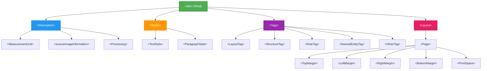

# 📄 ALTO XML: ประวัติ โครงสร้าง และ Schema ฉบับเจาะลึก

> [!NOTE]
> เอกสารฉบับนี้เป็นการเจาะลึกรายละเอียดเกี่ยวกับ **ALTO (Analyzed Layout and Text Object)** ซึ่งเป็นมาตรฐาน XML ที่ใช้กันอย่างแพร่หลายสำหรับจัดเก็บผลลัพธ์ของ OCR และเค้าโครง (Layout) ของหน้าเอกสารในระบบห้องสมุดดิจิทัลระดับโลก เอกสารนี้จะครอบคลุมตั้งแต่ประวัติความเป็นมา โครงสร้างทางกายภาพ โครงสร้างทางตรรกะ และตัวอย่างการใช้งานจริง

## 📑 สารบัญ
1. [ประวัติและพัฒนาการ](#1-ประวัติและพัฒนาการ)
2. [Timeline เวอร์ชันทั้งหมด](#2-timeline-เวอร์ชันทั้งหมด)
3. [โครงสร้างภาพรวม](#3-โครงสร้างภาพรวม)
4. [Description — เมตาดาต้าเชิงลึก](#4-description--เมตาดาต้าเชิงลึก)
5. [Styles — ระบบสไตล์](#5-styles--ระบบสไตล์)
6. [Tags — ระบบป้ายกำกับ](#6-tags--ระบบป้ายกำกับ)
7. [Layout — โครงสร้างหน้า](#7-layout--โครงสร้างหน้า)
8. [Block Types — ชนิดบล็อก](#8-block-types--ชนิดบล็อก)
9. [Text Content — เนื้อหาข้อความ](#9-text-content--เนื้อหาข้อความ)
10. [Shape และ Coordinate System](#10-shape-และ-coordinate-system)
11. [ReadingOrder (v4.3+)](#11-readingorder-v43)
12. [ตัวอย่าง ALTO XML ฉบับสมบูรณ์](#12-ตัวอย่าง-alto-xml-ฉบับสมบูรณ์)
13. [วิธี Validate ไฟล์ ALTO XML](#13-วิธี-validate-ไฟล์-alto-xml)
14. [แหล่งอ้างอิง](#แหล่งอ้างอิง)

---

## 1. 📜 ประวัติและพัฒนาการ

ALTO (Analyzed Layout and Text Object) มีประวัติการพัฒนาที่ยาวนานและได้รับการสนับสนุนจากสถาบันชั้นนำระดับโลก โดยมีจุดเริ่มต้นและพัฒนาการที่สำคัญดังนี้:

### 🔹 METAe Project (2001-2003)
จุดเริ่มต้นของ ALTO เกิดขึ้นในช่วงปี 2001 ถึง 2003 ภายใต้โครงการ **METAe (The Metadata Engine Project)** ซึ่งเป็นโครงการวิจัยที่ได้รับเงินทุนสนับสนุนจากสหภาพยุโรป (EU-funded) โดยมุ่งเน้นการพัฒนาระบบซอฟต์แวร์สำหรับการแปลงเอกสารและหนังสือพิมพ์ให้เป็นดิจิทัล (Digitization)
- **ผู้พัฒนาในระยะแรก:** Alexander Egger, Birgit Stehno และ Gregor Retti ซึ่งเป็นกลุ่มนักวิจัยที่มีบทบาทสำคัญในการออกแบบโครงสร้างพื้นฐาน
- **วัตถุประสงค์หลัก:** ในยุคนั้นมีความต้องการรูปแบบไฟล์มาตรฐานเพื่อ "จัดเก็บตำแหน่งคำ (Word coordinates)" และ "เค้าโครงหน้า (Layout)" ที่ได้จากกระบวนการรับรู้ตัวอักษรด้วยแสง (OCR) โดยต้องเป็นรูปแบบที่สามารถนำไปแสดงผลซ้อนทับกับรูปภาพต้นฉบับได้ (Text highlighting) 

### 🔹 บทบาทของ CCS GmbH (2004-2007)
บริษัท **CCS GmbH (Content Conversion Specialists)** ซึ่งเป็นบริษัทสัญชาติเยอรมันที่เป็นผู้นำด้านเทคโนโลยีการแปลงเอกสาร ได้เข้ามารับบทบาทในการนำร่องและเผยแพร่มาตรฐาน ALTO เข้าสู่วงการอุตสาหกรรม
- ในปี **2004** ได้มีการออก **ALTO เวอร์ชัน 1.0** สู่สาธารณะ 
- CCS เป็นผู้ดูแลและพัฒนาเวอร์ชันในสาย 1.x อย่างต่อเนื่อง จนถึงเวอร์ชัน 1.4 ในปี 2007 ซึ่งทำให้ ALTO กลายเป็นรูปแบบมาตรฐานพฤตินัย (De facto standard) ในโปรเจกต์ Digitization ขนาดใหญ่ทั่วทวีปยุโรป

### 🔹 การถ่ายโอนไปยัง Library of Congress (2009)
ในเดือน **สิงหาคม ปี 2009** เป็นจุดเปลี่ยนสำคัญเมื่อเกิดการถ่ายโอนการดูแลมาตรฐาน ALTO จากบริษัท CCS ไปยัง **Library of Congress** (หอสมุดรัฐสภาอเมริกัน) อย่างเป็นทางการ
- **กระบวนการและเหตุผล:** เนื่องจาก ALTO ได้รับความนิยมอย่างล้นหลามเกินกว่าจะเป็นเพียงมาตรฐานของบริษัทเอกชน การทำให้เป็นมาตรฐานเปิด (Open Standard) ที่มีสถาบันระดับชาติให้การรับรอง จึงเป็นสิ่งจำเป็นต่อความยั่งยืนของข้อมูล
- **Editorial Board:** ได้มีการจัดตั้งคณะกรรมการบรรณาธิการ (ALTO Editorial Board) ขึ้นเพื่อทำหน้าที่พิจารณา กำหนดทิศทาง และอนุมัติการเปลี่ยนแปลงต่าง ๆ ของ Schema ซึ่งประกอบด้วยผู้เชี่ยวชาญจากสถาบันห้องสมุดและศูนย์วิจัยระดับโลก เพื่อรักษามาตรฐานให้ตอบโจทย์การใช้งานที่เปลี่ยนแปลงไปตามยุคสมัย

---

## 2. 🗓️ Timeline เวอร์ชันทั้งหมด

ตารางด้านล่างแสดงลำดับเหตุการณ์การออกเวอร์ชันต่าง ๆ ของ ALTO ตั้งแต่เริ่มต้นจนถึงเวอร์ชันปัจจุบัน (v4.4) พร้อมการอธิบายการเปลี่ยนแปลง

| ปี / เดือน | เวอร์ชัน | เหตุการณ์และการเปลี่ยนแปลงที่สำคัญ |
| :--- | :--- | :--- |
| **2004** | `v1.0` | ออกเวอร์ชันแรกอย่างเป็นทางการ ภายใต้การดูแลของ CCS GmbH |
| **2004-2007** | `v1.x` | พัฒนาต่อเนื่องภายใต้ CCS จนถึงเวอร์ชัน 1.4 ปรับปรุงการเก็บ metadata บางส่วน |
| **ส.ค. 2009** | - | ถ่ายโอนไปยัง Library of Congress และจัดตั้ง ALTO Editorial Board อย่างเป็นทางการ |
| **2010-2014** | `v2.x` | พัฒนาและเพิ่มประสิทธิภาพภายใต้การดูแลของ Library of Congress เพื่อใช้ในโครงการ Chronicling America |
| **ก.พ. 2014** | `v2.1` | นิยมใช้มากในโปรเจกต์ Europeana Newspapers และเริ่มนำมาใช้ในงานด้าน NER (Named Entity Recognition) มากขึ้น |
| **ส.ค. 2014** | `v3.0` | ปรับปรุงโครงสร้างระบบ Versioning ให้มีความชัดเจน แยกการพัฒนาแบบ Major และ Minor ชัดเจนขึ้น |
| **ม.ค. 2016** | `v3.1` | อัปเดตย่อยเพื่อเพิ่มความสามารถในการรองรับภาษาและข้อความที่มีความซับซ้อน |
| **เม.ย. 2018** | `v4.0` | **Major Update:** เปลี่ยน License เป็น CC BY-SA 4.0 อย่างสมบูรณ์ <br/>- เพิ่ม element `<Glyph>` และ `<Variant>` สำหรับการเก็บข้อมูลลึกระดับตัวอักษร<br/>- ยกเลิก (Deprecated) แอตทริบิวต์ `<OcrProcessing>` และให้เปลี่ยนไปใช้ `<Processing>` แทนเพื่อให้ครอบคลุมการประมวลผลอื่น ๆ |
| **พ.ค. 2019** | `v4.1` | เพิ่ม attribute `PROCESSINGREFS` ที่เคยขาดหายไปในองค์ประกอบส่วนใหญ่ เพื่อให้สามารถตรวจสอบย้อนหลังที่มาของกระบวนการได้ชัดเจนขึ้น |
| **ก.ค. 2020** | `v4.2` | โครงสร้าง `<BASELINE>` สามารถรองรับข้อมูลแบบ list of points แทนที่จะเป็นแค่แกนแนวตั้งเพียงค่าเดียว <br/>- เพิ่มค่า `strikethrough` ให้กับ attribute `FONTSTYLE` เพื่อรองรับการขีดฆ่าข้อความ |
| **มิ.ย. 2022** | `v4.3` | เพิ่ม attribute `BASEDIRECTION` เพื่อรองรับทิศทางของข้อความจากขวาไปซ้าย หรือบนลงล่าง <br/>- เพิ่ม element `<ReadingOrder>` สำหรับจัดการลำดับการอ่านเนื้อหาแบบอิสระและจัดเรียง |
| **เม.ย. 2023** | `v4.4` | **(เวอร์ชันล่าสุด)** เพิ่ม attribute สำคัญเกี่ยวกับภาษาที่ระดับ `<Page>` ได้แก่ `LANG`, `ROTATION`, `OTHERLANGS` <br/>- ปรับปรุงคู่มือการใช้งานสำหรับ PointsType |

> [!IMPORTANT]
> **Versioning Rules (กฎการกำหนดเวอร์ชัน)**
> - **Major version (ตัวเลขหลัก):** เช่น การขยับจาก v1 เป็น v2, หรือ v3 เป็น v4 จะถือเป็นการเปลี่ยนแปลงที่เป็น **breaking changes** ซึ่งอาจมีโครงสร้างที่เปลี่ยนไปอย่างสิ้นเชิง หรือมีการเปลี่ยน Namespace ทำให้ไฟล์ที่สร้างจากซอฟต์แวร์เก่าอาจไม่อ่านผ่าน
> - **Minor version (เลขทศนิยม):** เช่น จาก v4.3 เป็น v4.4 จะเป็นแบบ **backward-compatible** กล่าวคือยังรองรับโครงสร้างแบบเก่าเสมอ และโปรแกรมอ่านเวอร์ชันใหม่จะไม่ทำลายข้อมูลเดิม

---

## 3. 🏗️ โครงสร้างภาพรวม

ไฟล์ ALTO XML มีโครงสร้างระดับบนสุดที่แบ่งหน้าที่กันอย่างชัดเจน โดยใช้ `<alto>` เป็น root element เสมอ โครงสร้างหลักประกอบด้วย 4 ส่วนสำคัญ ได้แก่ `<Description>`, `<Styles>`, `<Tags>`, และ `<Layout>` ซึ่งออกแบบมาในลักษณะการแบ่งแยก Data กับ Metadata ออกจากกัน เพื่อลดความซ้ำซ้อนของข้อมูล



**คำอธิบายหน้าที่ของ 4 ส่วนหลัก:**
1. **`<Description>`**: ส่วนที่เก็บข้อมูลเมตาดาต้าระดับไฟล์ทั้งหมด เช่น รูปแบบหน่วยวัดที่ใช้ตลอดทั้งไฟล์ (MeasurementUnit), ข้อมูลอ้างอิงถึงไฟล์รูปภาพต้นฉบับที่เป็นเป้าหมาย, และบันทึกกระบวนการ/ประวัติการใช้ซอฟต์แวร์ในการวิเคราะห์ (Processing)
2. **`<Styles>`**: ส่วนที่เก็บการประกาศรูปแบบ (Styles) สำหรับตัวอักษรและย่อหน้า ซึ่งสามารถนำไปอ้างอิงใช้ซ้ำ ๆ ในส่วนต่าง ๆ ของเอกสารได้ผ่านค่า ID ช่วยลดขนาดไฟล์ลงได้มากเมื่อเทียบกับการต้องประกาศ FONT ในทุก ๆ ตัวอักษร
3. **`<Tags>`**: ส่วนสำหรับประกาศชุดป้ายกำกับ (Tags) ที่ใช้จำแนกประเภทความหมายเชิงโครงสร้างของเนื้อหา เช่น การระบุแท็กสำหรับโครงสร้างย่อหน้า, แท็กสำหรับบทที่, ไปจนถึงแท็กเชิงอรรถศาสตร์เช่น ชื่อบุคคล หรือชื่อสถานที่
4. **`<Layout>`**: เป็นหัวใจหลักและส่วนที่มีปริมาณข้อมูลมากที่สุดของไฟล์ ALTO ทำหน้าที่จัดเก็บองค์ประกอบและเค้าโครงทางกายภาพของหน้าเอกสาร ตั้งแต่ขอบเขตหน้ากระดาษ (Page), พื้นที่ว่าง (Margins), ไปจนถึงระดับบล็อกข้อความ (Block), บรรทัด (Line) และระดับคำ (String)

---

## 4. 📝 Description — เมตาดาต้าเชิงลึก

อิลิเมนต์ `<Description>` เก็บรวบรวมบริบทของการสร้างไฟล์ ALTO โดยมีองค์ประกอบย่อยที่สำคัญหลายประการดังนี้:

### `<MeasurementUnit>`
ใช้กำหนดหน่วยการวัดของระบบพิกัดพื้นที่เชิงพื้นที่ที่ใช้ทั้งไฟล์ ถือเป็นจุดสำคัญในการแปลงตำแหน่งพิกัดไปแสดงบนรูปภาพจริง มีค่าที่สามารถระบุได้ 3 รูปแบบเท่านั้น:
- `pixel` (หน่วยพิกเซลของภาพต้นฉบับ มักได้รับความนิยมมากที่สุด)
- `mm10` (1/10 มิลลิเมตร หรือ 0.1 มม. ใช้สำหรับการพิมพ์ที่มีมาตราส่วนตายตัว)
- `inch1200` (1/1200 นิ้ว เป็นหน่วยวัดความละเอียดสูง)

### `<sourceImageInformation>`
เก็บข้อมูลเกี่ยวกับภาพต้นฉบับที่นำมาทำ OCR ประกอบด้วยอิลิเมนต์ลูก:
- `<fileName>`: ชื่อไฟล์ภาพ (เช่น `journal_scan_001.tif`)
- `<fileIdentifier>`: รหัสอ้างอิงภาพในระบบเก็บรักษาถาวร (Archive) เช่น URN หรือ Handle
- `<documentIdentifier>`: รหัสประจำตัวของตัวเอกสารหรือหนังสือเล่มนั้น ๆ (เช่น รหัส ISBN หรือ DOI)

### `<Processing>`
(หมายเหตุ: ในเวอร์ชันเก่ากว่า 4.0 จะใช้เป็น `<OcrProcessing>` แต่ถูกประกาศ Deprecated แล้วเพื่อขยายความหมายให้ครอบคลุมการประมวลผลรูปแบบอื่นด้วย) 
ใช้บันทึกประวัติและขั้นตอนที่กระทำกับเอกสาร โดยแบ่งหมวดหมู่ย่อยเป็น:
- `<preProcessingStep>`: ขั้นตอนก่อนการทำ OCR เช่น การทำ Binarization, Deskewing, Cropping
- `<ocrProcessingStep>`: ขั้นตอนการดึงข้อความด้วย OCR หรือ HTR
- `<postProcessingStep>`: ขั้นตอนหลังการทำ OCR เช่น การตรวจแก้คำผิดด้วยพจนานุกรม (Spell checking) หรือการทำ Manual correction โดยมนุษย์

ในทุก ๆ อิลิเมนต์ Step จะมี child elements เพื่อระบุรายละเอียด:
- `<processingStepDescription>`: คำอธิบายอย่างย่อว่าขั้นตอนนี้ทำอะไร
- `<processingStepSettings>`: พารามิเตอร์การทำงานที่ใช้ (เช่น `dpi=300 lang=eng`)
- `<processingSoftware>`: ข้อมูลจำเพาะของซอฟต์แวร์ ซึ่งประกอบด้วยลูกย่อยคือ `<softwareCreator>`, `<softwareName>`, `<softwareVersion>`, และ `<applicationDescription>`

> [!TIP]
> การระบุ Processing ที่ชัดเจนและเป็นระบบ ช่วยให้นักวิจัยในอนาคตสามารถตรวจสอบย้อนกลับได้ (Provenance trace) ว่าข้อความนี้เกิดจาก OCR Engine ตัวใด เวอร์ชันอะไร มีความแม่นยำคาดหวังได้แค่ไหน ซึ่งมีความสำคัญมากต่อคุณภาพงาน Digital Humanities

**ตัวอย่าง XML ยาว ๆ ที่สมจริงสำหรับ Description:**
```xml
<Description>
    <MeasurementUnit>pixel</MeasurementUnit>
    <sourceImageInformation>
        <fileName>archive_newspaper_1900-01-01_page_001.png</fileName>
        <fileIdentifier>urn:image:archive_news:1900-01-01:001</fileIdentifier>
        <documentIdentifier>issn:1234-5678</documentIdentifier>
    </sourceImageInformation>
    
    <!-- บันทึกการทำ Pre-processing -->
    <Processing ID="PROC_PRE_1">
        <preProcessingStep>
            <processingStepDescription>Binarization and Deskewing</processingStepDescription>
            <processingStepSettings>threshold=0.6, auto-deskew=true</processingStepSettings>
            <processingSoftware>
                <softwareCreator>ImageMagick Studio LLC</softwareCreator>
                <softwareName>ImageMagick</softwareName>
                <softwareVersion>7.1.0</softwareVersion>
            </processingSoftware>
        </preProcessingStep>
    </Processing>
    
    <!-- บันทึกการทำ OCR -->
    <Processing ID="PROC_OCR_1">
        <ocrProcessingStep>
            <processingStepDescription>Optical Character Recognition</processingStepDescription>
            <processingStepSettings>psm=3, oem=1</processingStepSettings>
            <processingSoftware>
                <softwareCreator>Tesseract Open Source OCR Engine</softwareCreator>
                <softwareName>Tesseract</softwareName>
                <softwareVersion>5.3.0</softwareVersion>
                <applicationDescription>LSTM based OCR engine</applicationDescription>
            </processingSoftware>
        </ocrProcessingStep>
    </Processing>
</Description>
```

---

## 5. 🎨 Styles — ระบบสไตล์

การจัดการรูปแบบสไตล์ข้อความใน ALTO ใช้หลักการของการอ้างอิง (Reference System) แทนการฝังข้อมูลไว้ในทุก ๆ จุด (Inline style) โดยระบบจะประกาศสไตล์ทั้งหมดไว้ใน `<Styles>` ที่ระดับบนสุดของไฟล์ แล้วให้ element ด้านล่าง (เช่น บล็อกข้อความหรือบรรทัดข้อความ) เรียกใช้ผ่าน attribute ที่ชื่อว่า `STYLEREFS` ด้วยค่า ID ที่สอดคล้องกัน

### `<TextStyle>`
อิลิเมนต์สำหรับกำหนดสไตล์ของตัวอักษร มี attribute หลักที่ใช้งานดังนี้:
- `ID`: รหัสที่ใช้สำหรับอ้างอิง (จำเป็นต้องมีและห้ามซ้ำกัน)
- `FONTFAMILY`: ชื่อตระกูลฟอนต์ เช่น "Times New Roman", "Helvetica" หรือหมวดหมู่ทั่วไปอย่าง "serif"
- `FONTSIZE`: ขนาดฟอนต์ตามหน่วยวัดที่ระบุ
- `FONTSTYLE`: รูปแบบลักษณะของฟอนต์ สามารถรับค่าที่เป็นไปได้ทั้งหมด ได้แก่: 
  - `bold` (ตัวหนา)
  - `italics` (ตัวเอียง)
  - `subscript` (ตัวห้อย)
  - `superscript` (ตัวยก)
  - `smallcaps` (ตัวพิมพ์เล็กที่ถูกจัดรูปแบบให้คล้ายตัวพิมพ์ใหญ่)
  - `underline` (ขีดเส้นใต้)
  - `strikethrough` (ขีดฆ่าข้อความ — ถูกเพิ่มเข้ามาใหม่ใน ALTO เวอร์ชัน 4.2)
- `FONTWIDTH`: ความกว้างของรูปแบบฟอนต์ (เช่น condensed, expanded)
- `FONTCOLOR`: สีของตัวอักษร มักเก็บเป็นค่าฐานสิบหก (Hexadecimal)

### `<ParagraphStyle>`
อิลิเมนต์สำหรับกำหนดรูปแบบการจัดหน้าของย่อหน้าข้อความ:
- `ID`: รหัสที่ใช้สำหรับอ้างอิง
- `ALIGN`: การจัดตำแหน่งข้อความของย่อหน้านั้น รับค่า `Left`, `Right`, `Center`, `Block` (จัดให้พอดีซ้ายขวา / Justify)
- `LEFT`: ระยะเยื้องขอบซ้าย
- `RIGHT`: ระยะเยื้องขอบขวา
- `LINESPACE`: ระยะห่างระหว่างบรรทัด (Line spacing)
- `FIRSTLINE`: การเยื้องหน้าบรรทัดแรก (Indentation) สำหรับการเริ่มต้นย่อหน้าใหม่

**ตัวอย่าง XML สำหรับการประกาศ Styles แบบสมบูรณ์:**
```xml
<Styles>
    <!-- ประกาศรูปแบบข้อความ -->
    <TextStyle ID="font_heading" FONTFAMILY="Arial" FONTSIZE="24.0" FONTSTYLE="bold"/>
    <TextStyle ID="font_body_normal" FONTFAMILY="Times New Roman" FONTSIZE="12.0"/>
    <TextStyle ID="font_body_italic" FONTFAMILY="Times New Roman" FONTSIZE="12.0" FONTSTYLE="italics"/>
    <TextStyle ID="font_caption" FONTFAMILY="Helvetica" FONTSIZE="10.0"/>
    <TextStyle ID="font_footnote" FONTFAMILY="Times New Roman" FONTSIZE="9.0" FONTSTYLE="superscript"/>
    <TextStyle ID="font_deleted" FONTFAMILY="Times New Roman" FONTSIZE="12.0" FONTSTYLE="strikethrough"/>
    
    <!-- ประกาศรูปแบบย่อหน้า -->
    <ParagraphStyle ID="para_title" ALIGN="Center"/>
    <ParagraphStyle ID="para_body" ALIGN="Block" FIRSTLINE="25.0" LINESPACE="15.0"/>
    <ParagraphStyle ID="para_quote" ALIGN="Left" LEFT="40.0" RIGHT="40.0"/>
</Styles>
```

---

## 6. 🏷️ Tags — ระบบป้ายกำกับ

ระบบ Tag ใน ALTO ใช้เพื่อให้ความหมายเชิงโครงสร้างและทางอรรถศาสตร์ (Semantic metadata) แก่ block, line หรือกระทั่ง string ต่าง ๆ โดยการเชื่อมโยงจะทำผ่านแอตทริบิวต์ `TAGREFS` ซึ่งคล้ายคลึงกับระบบ Styles

ALTO แบ่ง Tag ออกเป็นประเภทหลัก ๆ 5 รูปแบบเพื่อให้ครอบคลุมการใช้งานที่หลากหลาย:
- **`<LayoutTag>`**: ใช้ระบุลักษณะทางกายภาพหรือภูมิประเทศของโครงสร้างเอกสาร เช่น การระบุว่าเป็นหน้าปก (cover), สารบัญ (TOC), หน้าดัชนี (Index), หรือหน้าว่าง (Blank)
- **`<StructureTag>`**: ใช้ระบุบทบาทเชิงโครงสร้างเอกสารในระดับเนื้อหาที่ลึกขึ้น เช่น `chapter`, `section`, `paragraph`, หรือ `appendix`
- **`<RoleTag>`**: ระบุบทบาทเชิงหน้าที่ของเนื้อหาเฉพาะจุด (มักใช้สำหรับการขยายความหน้าที่ของ Block นั้น ๆ)
- **`<NamedEntityTag>`**: เพิ่มเข้ามาเพื่อใช้ในงาน Named Entity Recognition (NER) โดยเฉพาะ เพื่อใช้มาร์กอัปเอนทิตีสำคัญๆ เช่น 
  - `person` (ชื่อบุคคล)
  - `location` (ชื่อสถานที่, เมือง, ประเทศ)
  - `organization` (ชื่อองค์กร, หน่วยงาน)
  - `event` (ชื่อเหตุการณ์ประวัติศาสตร์)
- **`<OtherTag>`**: แท็กอิสระอื่นๆ ที่ผู้ใช้สามารถประยุกต์ใช้เพื่อนิยามโครงสร้างพิเศษเฉพาะทาง

**ตัวอย่าง XML สำหรับการประกาศและการตั้งค่า Tags:**
```xml
<Tags>
    <LayoutTag ID="layout_toc" LABEL="TableOfContents"/>
    <LayoutTag ID="layout_header" LABEL="Header"/>
    <LayoutTag ID="layout_footer" LABEL="Footer"/>
    
    <StructureTag ID="struct_chapter_title" LABEL="ChapterTitle"/>
    <StructureTag ID="struct_paragraph" LABEL="Paragraph"/>
    
    <NamedEntityTag ID="ne_loc_paris" LABEL="Location" DESCRIPTION="Paris, France, Europe"/>
    <NamedEntityTag ID="ne_per_marie_curie" LABEL="Person" DESCRIPTION="Marie Curie, Scientist"/>
    <NamedEntityTag ID="ne_org_unesco" LABEL="Organization" DESCRIPTION="UNESCO"/>
    
    <OtherTag ID="tag_warning" LABEL="WarningBlock"/>
</Tags>
```

---

## 7. 📄 Layout — โครงสร้างหน้า

โครงสร้างของการบรรจุเนื้อหาทั้งหมดใน ALTO จะอยู่ภายใต้ `<Layout>` ซึ่งภายในจะต้องมีอิลิเมนต์ `<Page>` อย่างน้อย 1 หน้า (หรือหลายหน้าก็ได้สำหรับการมัดรวมเอกสารทั้งฉบับในไฟล์เดียว แต่นิยมใช้ 1 ไฟล์ต่อ 1 หน้า)

### ข้อมูลระดับ `<Page>`
แอตทริบิวต์ของ `<Page>` ทำหน้าที่ระบุคุณลักษณะเชิงกายภาพที่สำคัญ:
- `ID`: ไอดีของหน้า (ไม่สามารถซ้ำได้)
- `WIDTH`, `HEIGHT`: ความกว้างและความสูงรวมของหน้า (ใช้หน่วยที่ประกาศใน `<MeasurementUnit>`)
- `PHYSICAL_IMG_NR`: ลำดับที่ทางกายภาพของรูปภาพในเอกสารชุดนั้น (เช่น ภาพลำดับที่ 5 ในโฟลเดอร์)
- `PRINTED_IMG_NR`: เลขหน้าตามที่พิมพ์จริงในเนื้อหากระดาษ (เช่น หน้า "ix" หรือ หน้า "142")
- `ACCURACY`: ค่าร้อยละความแม่นยำของ OCR ที่ประเมินได้สำหรับทั้งหน้า
- **แอตทริบิวต์ที่เพิ่มใน v4.3 และ v4.4**: 
  - `LANG`: รหัสภาษาหลักของหน้ากระดาษ (ใช้รหัสมาตรฐาน ISO เช่น `eng`, `tha`, `deu`)
  - `ROTATION`: องศาการหมุนของหน้านั้นเมื่อเทียบกับแนวแกนปกติ (เช่น 90.0, 180.0)
  - `OTHERLANGS`: ภาษาอื่น ๆ ที่พบเพิ่มเติมในหน้านั้น (กรณีเอกสารหลายภาษา)
  - `PROCESSINGREFS`: อ้างอิง ID ใน `<Processing>` ว่าหน้าเพจนี้ใช้กระบวนการอะไร
  - `PC`: Page Confidence ค่าความเชื่อมั่นรวมของหน้า

### พื้นที่แบ่งส่วนภายใน `<Page>`
ภายในแนวแกนความกว้างและความสูงของ `<Page>` จะถูกหั่นแบ่งเป็น 5 ส่วนเพื่อสะท้อนกรอบขอบเขตขอบกระดาษและพื้นที่ใช้งาน:
1. **`<TopMargin>`**: พื้นที่ขอบบน
2. **`<LeftMargin>`**: พื้นที่ขอบซ้าย
3. **`<RightMargin>`**: พื้นที่ขอบขวา
4. **`<BottomMargin>`**: พื้นที่ขอบล่าง
5. **`<PrintSpace>`**: พื้นที่กึ่งกลางสำหรับพิมพ์เนื้อหาหลัก (ซึ่งมักจะมี Block ชนิดต่าง ๆ บรรจุอยู่ภายใน) โดยมักจะหลบระยะขอบทั้งสี่ด้าน

**ตัวอย่าง XML สำหรับ Layout ระดับบน การแบ่งขอบเขตและพื้นที่ทำงาน:**
```xml
<Layout>
    <Page ID="page_001" WIDTH="2400" HEIGHT="3200" PHYSICAL_IMG_NR="1" PRINTED_IMG_NR="1" LANG="eng" ROTATION="0.0">
        <!-- ประกาศขอบบน ซ้าย ขวา ล่าง -->
        <TopMargin HPOS="0" VPOS="0" WIDTH="2400" HEIGHT="200"/>
        <LeftMargin HPOS="0" VPOS="200" WIDTH="150" HEIGHT="2800"/>
        <RightMargin HPOS="2250" VPOS="200" WIDTH="150" HEIGHT="2800"/>
        <BottomMargin HPOS="0" VPOS="3000" WIDTH="2400" HEIGHT="200"/>
        
        <!-- PrintSpace จะตั้งอยู่กลางหน้า ล้อมรอบด้วย Margins -->
        <PrintSpace HPOS="150" VPOS="200" WIDTH="2100" HEIGHT="2800">
            <!-- ข้อมูลเนื้อหา Block ทั้งหมดจะบรรจุอยู่ในพื้นที่ส่วนนี้ -->
            <TextBlock ID="tb_header" HPOS="150" VPOS="200" WIDTH="2100" HEIGHT="100">
                <!-- เนื้อหา... -->
            </TextBlock>
        </PrintSpace>
    </Page>
</Layout>
```

---

## 8. 🔲 Block Types — ชนิดบล็อก

ภายใน `<PrintSpace>` (หรือบางครั้งอาจพบใน Margin ต่าง ๆ สำหรับหมายเลขหน้า หรือส่วนหัว) เนื้อหาทั้งหมดจะถูกจัดเก็บในรูปแบบการแยกกล่อง (Blocks) ซึ่ง ALTO ออกแบบชนิดของ Block มารองรับไว้ดังนี้:

### `<TextBlock>`
บล็อกข้อความธรรมดา ใช้เป็นตัวบรรจุหลักสำหรับย่อหน้า หัวข้อความ หรือกลุ่มข้อความทั่วไป 
- ภายในจะบรรจุลูกหลานคือ `<TextLine>` เป็นหลัก
- นิยมใช้อ้างอิงสไตล์และแท็กมากที่สุดผ่าน attribute `STYLEREFS` และ `TAGREFS`

### `<ComposedBlock>`
บล็อกแบบประกอบเชิงซ้อน ใช้เมื่อต้องการรวมบล็อกหลาย ๆ ตัวเข้าด้วยกันเป็นกลุ่มใหญ่ (Nesting) 
- มักใช้จัดการเอกสารที่มีเค้าโครงซับซ้อน เช่น การรวม `<TextBlock>` ที่เป็นคำอธิบายใต้ภาพ และ `<Illustration>` ที่เป็นตัวภาพเข้าด้วยกันเป็นกรอบเนื้อหาเดียว หรือการมัดรวมคอลัมน์หลายคอลัมน์ให้อยู่ใน Block ของบทความนั้นๆ

### `<Illustration>`
บล็อกสำหรับพื้นที่รูปภาพ (ภาพถ่าย, ภาพวาด, ภาพกราฟิก, โลโก้)
- สามารถระบุประเภทเฉพาะได้ผ่าน attribute `TYPE` เช่น `image`, `photo`, `drawing`, `chart`
- ไม่มีเนื้อหาข้อความภายใน (แต่สามารถนำไปใส่ใน `<ComposedBlock>` คู่กับ `<TextBlock>` ได้)

### `<GraphicalElement>`
องค์ประกอบกราฟิกเชิงเรขาคณิต มักใช้กับเส้นแบ่ง (separators) คั่นระหว่างคอลัมน์, เส้นตาราง, หรือเส้นประเพื่อตกแต่ง
- มักมีความสูง (HEIGHT) เป็นค่าน้อย ๆ หากเป็นเส้นแนวนอน

**ตัวอย่าง XML อธิบายความสัมพันธ์ของ Block ชนิดต่าง ๆ:**
```xml
<PrintSpace HPOS="150" VPOS="200" WIDTH="2100" HEIGHT="2800">
    <!-- ภาพวาดประกอบโฆษณา -->
    <Illustration ID="ill_ad_01" HPOS="200" VPOS="250" WIDTH="800" HEIGHT="600" TYPE="drawing"/>
    
    <!-- เส้นกราฟิกแบ่งส่วนเนื้อหากับโฆษณา -->
    <GraphicalElement ID="sep_line_01" HPOS="150" VPOS="900" WIDTH="2100" HEIGHT="5"/>
    
    <!-- บล็อกข้อความแบบประกอบ ใช้มัดรวมหัวข้อและเนื้อหาย่อย -->
    <ComposedBlock ID="cb_article_01" HPOS="150" VPOS="950" WIDTH="2100" HEIGHT="1800">
        <!-- บล็อกที่เป็นหัวข้อ -->
        <TextBlock ID="tb_title" HPOS="150" VPOS="950" WIDTH="2100" HEIGHT="100" STYLEREFS="font_heading" TAGREFS="struct_chapter_title">
            <TextLine ID="tl_title1" HPOS="150" VPOS="950" WIDTH="2100" HEIGHT="95" BASELINE="1040">
                <!-- ข้อความภายใน... -->
            </TextLine>
        </TextBlock>
        
        <!-- บล็อกเนื้อหาย่อหน้า -->
        <TextBlock ID="tb_body" HPOS="150" VPOS="1100" WIDTH="1000" HEIGHT="1650" STYLEREFS="font_body_normal" TAGREFS="struct_paragraph">
            <TextLine ID="tl_body1" HPOS="150" VPOS="1100" WIDTH="1000" HEIGHT="40" BASELINE="1135">
                <!-- ข้อความภายใน... -->
            </TextLine>
            <!-- บรรทัดอื่นๆ... -->
        </TextBlock>
    </ComposedBlock>
</PrintSpace>
```

---

## 9. 📝 Text Content — เนื้อหาข้อความ

ความสามารถหลักและรายละเอียดปลีกย่อยของ ALTO ในการบันทึกข้อความจาก OCR อย่างแม่นยำจะถูกจัดเก็บอยู่ในระดับย่อยที่สุดของ `<TextBlock>` นั่นคืออิลิเมนต์ในกลุ่ม `<TextLine>`, `<String>`, `<SP>` และ `<HYP>`

### `<TextLine>`
คือบรรทัดของข้อความแต่ละบรรทัด 
- **Attributes หลัก:** `ID`, `HPOS`, `VPOS`, `WIDTH`, `HEIGHT` บอกขอบเขตของทั้งบรรทัด
- **`BASELINE`**: พิกัดเส้นบรรทัดฐานที่ตัวอักษรตั้งอยู่ (มีความสำคัญในการคำนวณตำแหน่งบรรทัด)
- **`BASEDIRECTION`**: (ตั้งแต่ v4.3) ทิศทางของบรรทัด เช่น `lr` (Left-to-Right), `rl` (Right-to-Left)
- **`LANG`, `STYLEREFS`, `TAGREFS`, `PROCESSINGREFS`, `CS`**: เมตาดาต้าสำหรับบรรทัด

### `<String>`
ระดับคำ (Word) ใน ALTO จะถูกเก็บแยกใน `<String>` แต่ละตัว:
- **`CONTENT`**: แอตทริบิวต์ที่เป็นเนื้อหาตัวข้อความ
- **`WC` (Word Confidence):** ค่าความเชื่อมั่นระดับคำจาก OCR เครื่องยนต์ มีค่า 0.0 - 1.0
- **`CC` (Character Confidence):** ค่าความเชื่อมั่นระดับรายตัวอักษร ภายใน String นั้น ๆ โดยจะเป็นชุดตัวเลขเรียงต่อกัน เช่น `99899` (หมายถึงตัวอักษรที่ 1-2 มั่นใจ 9, ตัวอักษรที่ 3 มั่นใจ 8, และ 4-5 มั่นใจ 9)
- **`SUBS_TYPE`, `SUBS_CONTENT`**: ใช้จัดการคำที่มีการตัดบรรทัด (hyphenation) เช่น ระบุ `HypPart1` ว่าเป็นส่วนแรก หรือ `HypPart2` สำหรับส่วนหลังของคำ เพื่อให้สามารถนำกลับมารวมกันได้ในภายหลัง

### `<SP>` และ `<HYP>`
ในโลกของ ALTO "ช่องว่าง" ก็คือเอนทิตีที่มีตัวตน
- **`<SP>` (Space):** บันทึกช่องว่างระหว่างคำ ไม่มีเนื้อหา แต่มีกรอบขอบเขตพิกัดเชิงพื้นที่ (`HPOS`, `VPOS`, `WIDTH`)
- **`<HYP>` (Hyphen):** ยัติภังค์ที่ปรากฏท้ายบรรทัด กรณีที่มีการตัดคำ

### `<Glyph>` และ `<Variant>` (เพิ่มใน v4.0+)
หากโปรเจกต์ต้องการเก็บข้อมูลละเอียดระดับ "รายตัวอักษร" อย่างเจาะจง ALTO ได้จัดเตรียม `<Glyph>` ไว้ให้ โดยให้วางไว้เป็นลูกของ `<String>` เพื่อเก็บตัวอักษรทีละตัว และยังมี `<Variant>` ไว้สำหรับให้ระบบบันทึกคำตอบเลือกอื่น ๆ (Alternative candidates) จากระบบ OCR กรณีที่ความมั่นใจไม่สูงพอ

**ตัวอย่าง XML ยาวแสดงความสัมพันธ์ TextLine ระดับคำ และการใช้ยัติภังค์:**
```xml
<TextBlock ID="tb_content_01" HPOS="150" VPOS="100" WIDTH="1000" HEIGHT="300" STYLEREFS="font_body_normal">
    <!-- บรรทัดที่ 1 -->
    <TextLine ID="line_1" HPOS="150" VPOS="100" WIDTH="980" HEIGHT="45" BASELINE="140">
        <!-- บันทึกข้อมูลคำ "The" -->
        <String ID="str_1" CONTENT="The" HPOS="150" VPOS="100" WIDTH="100" HEIGHT="40" WC="0.99" CC="999"/>
        
        <!-- บันทึกข้อมูลช่องว่างระหว่างคำ -->
        <SP HPOS="250" VPOS="100" WIDTH="20"/>
        
        <!-- บันทึกข้อมูลคำ "ALTO" -->
        <String ID="str_2" CONTENT="ALTO" HPOS="270" VPOS="100" WIDTH="180" HEIGHT="40" WC="0.95" CC="9985"/>
        
        <SP HPOS="450" VPOS="100" WIDTH="20"/>
        
        <!-- คำว่า standard ถูกตัดบรรทัดด้วยยัติภังค์ (Hyphenation) จึงกลายเป็น stan- และ -dard -->
        <String ID="str_3" CONTENT="stan" HPOS="470" VPOS="105" WIDTH="120" HEIGHT="35" WC="0.92" SUBS_TYPE="HypPart1" SUBS_CONTENT="standard"/>
        <HYP CONTENT="-" HPOS="595" VPOS="115" WIDTH="20"/>
    </TextLine>
    
    <!-- บรรทัดที่ 2 -->
    <TextLine ID="line_2" HPOS="150" VPOS="150" WIDTH="900" HEIGHT="45" BASELINE="190">
        <!-- ส่วนที่สองของคำ (HypPart2) มารับช่วงต่อ -->
        <String ID="str_4" CONTENT="dard" HPOS="150" VPOS="150" WIDTH="130" HEIGHT="40" WC="0.96" SUBS_TYPE="HypPart2" SUBS_CONTENT="standard"/>
        <SP HPOS="280" VPOS="150" WIDTH="20"/>
        
        <String ID="str_5" CONTENT="is" HPOS="300" VPOS="150" WIDTH="40" HEIGHT="40" WC="1.0" CC="99"/>
        <SP HPOS="340" VPOS="150" WIDTH="20"/>
        
        <String ID="str_6" CONTENT="very" HPOS="360" VPOS="155" WIDTH="120" HEIGHT="35" WC="0.88" CC="8997"/>
        <SP HPOS="480" VPOS="155" WIDTH="20"/>
        
        <String ID="str_7" CONTENT="popular." HPOS="500" VPOS="150" WIDTH="220" HEIGHT="40" WC="0.98"/>
    </TextLine>
</TextBlock>
```

---

## 10. 📐 Shape และ Coordinate System

ระบบพิกัด (Coordinate System) ของ ALTO ถูกออกแบบมาให้เรียบง่ายและเป็นสากล โดยใช้จุดกำเนิด (Origin) ที่มุมบนซ้ายของภาพสุด (Top-Left Origin)

### Bounding Box
รูปแบบการระบุขอบเขตดั้งเดิมและใช้งานง่ายที่สุดของ ALTO คือ "กล่องสี่เหลี่ยมหุ้มข้อความ (Bounding Box)" ซึ่งจะปรากฏอยู่ในรูปของแอตทริบิวต์ 4 ตัวในแทบทุกองค์ประกอบ:
- `HPOS`: ตำแหน่งแนวนอน (Horizontal Position) นับจากแกน X
- `VPOS`: ตำแหน่งแนวตั้ง (Vertical Position) นับจากแกน Y
- `WIDTH`: ความกว้างรวมของกรอบสี่เหลี่ยม
- `HEIGHT`: ความสูงรวมของกรอบสี่เหลี่ยม
*ระบบนี้ทำให้การเขียนโปรแกรมเรนเดอร์ขอบเขตการไฮไลต์ข้อความ (Highlighting) บนเว็บบราวเซอร์เป็นเรื่องง่ายดาย*

### Shape Elements (ขอบเขตแบบกำหนดเอง)
ในกรณีที่เอกสารต้นฉบับมีข้อความเฉียง หรือกรอบของกล่องไม่เป็นสี่เหลี่ยมผืนผ้าตั้งฉาก ALTO สามารถบรรจุอิลิเมนต์ `<Shape>` เข้าไปแทรกตัวอยู่ด้านใน `<TextBlock>`, `<TextLine>`, หรือ `<String>` ได้:
- **`<Polygon>`**: วาดกรอบเป็นรูปหลายเหลี่ยมตามความโค้งเว้าหรือความเอียง โดยระบุผ่าน attribute `POINTS` ด้วยคู่พิกัด เช่น `x1,y1 x2,y2 x3,y3...`
- **`<Ellipse>`** และ **`<Circle>`**: ใช้กำหนดกรอบเป็นวงรีหรือวงกลม (มักใช้กับตราประทับ)

### BASELINE (ตั้งแต่ v4.2+)
- เดิมทีแอตทริบิวต์ `BASELINE` ใน `<TextLine>` รับค่าตัวเลขพิกัดแนวตั้ง Y เพียงค่าเดียว เนื่องจากถือว่าข้อความขนานกับพื้นหน้ากระดาษ
- แต่ในต้นฉบับเก่าแก่ ลายมือ หรือหน้าที่กระดาษบิดงอ เส้นฐานบรรทัดมักจะโค้งงอ ทำให้ใน v4.2 มีการปรับโครงสร้างให้ `BASELINE` รองรับโครงสร้างแบบการรับพิกัดจุดเรียงต่อกัน (list of points) เพื่อวาดเส้นบรรทัดที่ลากผ่านตามความโค้งได้อย่างแนบเนียน

**ตัวอย่างและแผนภาพอธิบายพิกัดเชิงเส้นโค้งด้วย Polygon และแบบ Points:**
```xml
<TextBlock ID="block_curved" HPOS="300" VPOS="400" WIDTH="500" HEIGHT="200">
    <Shape>
        <!-- สร้างกรอบพื้นที่ 4 เหลี่ยมที่บิดเบี้ยวด้วยโพลีกอน -->
        <Polygon POINTS="300,400 800,450 800,600 300,550"/>
    </Shape>
    
    <!-- TextLine ที่มี BASELINE เป็น list of points เพื่อรองรับความโค้งของบรรทัด -->
    <TextLine ID="line_c1" HPOS="310" VPOS="410" WIDTH="480" HEIGHT="50" BASELINE="310,450 500,470 790,490">
        
        <String ID="str_c1" CONTENT="Curved" HPOS="310" VPOS="410" WIDTH="150" HEIGHT="40"/>
        <SP HPOS="460" VPOS="410" WIDTH="20"/>
        <String ID="str_c2" CONTENT="Text" HPOS="480" VPOS="420" WIDTH="120" HEIGHT="40"/>
        
    </TextLine>
</TextBlock>
```

---

## 11. 📖 ReadingOrder (v4.3+)

ความท้าทายหนึ่งของ OCR คือความสับสนเรื่อง "ลำดับการอ่าน (Reading Order)" ยิ่งในเอกสารที่มีการจัดหน้าหลายคอลัมน์ (เช่น 3 คอลัมน์) ที่มีภาพประกอบแทรกตรงกลาง ระบบจะจัดเรียงความต่อเนื่องได้ลำบาก ด้วยเหตุนี้ ALTO เวอร์ชัน 4.3 จึงได้เพิ่มอิลิเมนต์ `<ReadingOrder>` ระดับ Page เข้ามาเพื่อให้ผู้พัฒนาช่วยกำหนดเส้นทางการอ่านที่ถูกต้องได้

การสร้างลำดับทำได้โดยจัดเรียงกล่องกลุ่มต่าง ๆ เข้าด้วยกัน:
- **`<OrderedGroup>`**: บังคับให้เรียงลำดับการอ่านตายตัว เรียงจากสมาชิกลำดับที่ 1 ลงมาเรื่อย ๆ (อ่านบนลงล่าง)
- **`<UnorderedGroup>`**: จัดไว้เป็นกลุ่มรวมกันแต่ไม่มีลำดับที่ตายตัว (เช่น กลุ่มกล่องโฆษณาที่อยู่กระจัดกระจาย ซึ่งผู้ใช้สามารถอ่านส่วนใดก่อนก็ได้ ไม่กระทบใจความหลัก)
- **`<ElementRef>`**: ทำหน้าที่อ้างอิงและชี้เป้าไปยัง ID ของเป้าหมาย ไม่ว่าจะเป็น `<TextBlock>`, `<ComposedBlock>` หรือ `<GraphicalElement>`

**ตัวอย่าง XML การกำหนด Reading Order ที่สลับซับซ้อน:**
```xml
<Layout>
    <Page ID="page_1" WIDTH="2000" HEIGHT="3000">
        <!-- ประกาศ Reading Order ของหน้านี้ -->
        <ReadingOrder>
            <!-- บังคับให้อ่านเรียงตามลำดับจากบนลงล่าง -->
            <OrderedGroup ID="ro_group_main">
                <ElementRef IDREF="tb_title_main"/> <!-- 1. อ่านชื่อเรื่องก่อน -->
                
                <!-- 2. กลุ่มนี้เป็นภาพประกอบและคำอธิบายใต้ภาพ ไม่บังคับลำดับอ่านภายใน -->
                <UnorderedGroup ID="ro_group_illustration">
                    <ElementRef IDREF="ill_hero_image"/>
                    <ElementRef IDREF="tb_image_caption"/>
                </UnorderedGroup>
                
                <ElementRef IDREF="tb_column_1"/> <!-- 3. อ่านคอลัมน์ 1 ทางซ้ายจนจบ -->
                <ElementRef IDREF="tb_column_2"/> <!-- 4. อ่านคอลัมน์ 2 ตรงกลางจนจบ -->
                <ElementRef IDREF="tb_column_3"/> <!-- 5. ข้ามไปอ่านคอลัมน์ 3 ทางขวา -->
                <ElementRef IDREF="tb_conclusion"/> <!-- 6. สรุปท้ายเรื่องด้านล่างสุด -->
            </OrderedGroup>
        </ReadingOrder>
        
        <PrintSpace>
            <!-- องค์ประกอบ TextBlock ต่าง ๆ จะถูกอ้างอิง ID ไปยัง ReadingOrder ด้านบน -->
        </PrintSpace>
    </Page>
</Layout>
```

---

## 12. 📚 ตัวอย่าง ALTO XML ฉบับสมบูรณ์

ในส่วนนี้จะเป็นตัวอย่างฉบับเต็มโดยสังเขป ครอบคลุมการจำลองหน้าเอกสารที่มีความหลากหลายทางการนำเสนอ เพื่อให้เห็นภาพรวมขององค์ประกอบ ALTO ตั้งแต่ส่วนหัวจนถึงส่วนฐาน

### ตัวอย่างที่ 1: เอกสารหนังสือพิมพ์ที่มีหลายคอลัมน์และแท็ก
หนังสือพิมพ์ที่มีชื่อบทความ รูปภาพ และแบ่งเป็นคอลัมน์ พร้อมกับการแท็ก Named Entity (NER)
```xml
<?xml version="1.0" encoding="UTF-8"?>
<alto xmlns="http://www.loc.gov/standards/alto/ns-v4#" 
      xmlns:xsi="http://www.w3.org/2001/XMLSchema-instance" 
      xsi:schemaLocation="http://www.loc.gov/standards/alto/ns-v4# http://www.loc.gov/standards/alto/v4/alto-4-4.xsd">
    <Description>
        <MeasurementUnit>pixel</MeasurementUnit>
        <sourceImageInformation>
            <fileName>daily_news_frontpage.tif</fileName>
        </sourceImageInformation>
    </Description>
    <Styles>
        <TextStyle ID="font_head" FONTFAMILY="Arial" FONTSIZE="36.0" FONTSTYLE="bold"/>
        <TextStyle ID="font_body" FONTFAMILY="Times" FONTSIZE="11.0"/>
    </Styles>
    <Tags>
        <StructureTag ID="tag_headline" LABEL="Headline"/>
        <StructureTag ID="tag_article" LABEL="ArticleBody"/>
        <NamedEntityTag ID="ne_loc_london" LABEL="Location" DESCRIPTION="London, UK"/>
    </Tags>
    <Layout>
        <Page ID="pg_1" WIDTH="3000" HEIGHT="4500" PHYSICAL_IMG_NR="1" LANG="eng">
            <PrintSpace HPOS="100" VPOS="100" WIDTH="2800" HEIGHT="4300">
                <!-- Headline กึ่งกลางหน้า -->
                <TextBlock ID="tb_head" HPOS="150" VPOS="150" WIDTH="2700" HEIGHT="200" STYLEREFS="font_head" TAGREFS="tag_headline">
                    <TextLine ID="l_01" HPOS="150" VPOS="150" WIDTH="2600" HEIGHT="180" BASELINE="300">
                        <String ID="s_01" CONTENT="BREAKING" HPOS="150" VPOS="150" WIDTH="1200" HEIGHT="170" WC="1.0"/>
                        <SP HPOS="1350" VPOS="150" WIDTH="50"/>
                        <String ID="s_02" CONTENT="NEWS" HPOS="1400" VPOS="150" WIDTH="1000" HEIGHT="170" WC="1.0"/>
                    </TextLine>
                </TextBlock>
                
                <!-- Illustration (ภาพพาดหัวข่าว) -->
                <Illustration ID="ill_hero" HPOS="150" VPOS="400" WIDTH="1200" HEIGHT="800" TYPE="photo"/>
                
                <!-- Column 1 (ซ้ายมือ) เนื้อหาข่าวระบุชื่อเมือง London -->
                <TextBlock ID="tb_col1" HPOS="150" VPOS="1250" WIDTH="1200" HEIGHT="3000" STYLEREFS="font_body" TAGREFS="tag_article">
                    <TextLine ID="l_02" HPOS="150" VPOS="1250" WIDTH="1100" HEIGHT="40" BASELINE="1280">
                        <String ID="s_03" CONTENT="Today" HPOS="150" VPOS="1250" WIDTH="200" HEIGHT="35" WC="0.99"/>
                        <SP HPOS="350" VPOS="1250" WIDTH="20"/>
                        <String ID="s_04" CONTENT="in" HPOS="370" VPOS="1250" WIDTH="90" HEIGHT="35" WC="0.98"/>
                        <SP HPOS="460" VPOS="1250" WIDTH="20"/>
                        <!-- ใส่ tag Named Entity ลงไปที่ตัวคำ -->
                        <String ID="s_05" CONTENT="London," HPOS="480" VPOS="1250" WIDTH="250" HEIGHT="35" WC="0.95" TAGREFS="ne_loc_london"/>
                        <SP HPOS="730" VPOS="1250" WIDTH="20"/>
                        <String ID="s_06" CONTENT="the" HPOS="750" VPOS="1250" WIDTH="100" HEIGHT="35" WC="0.99"/>
                    </TextLine>
                </TextBlock>
            </PrintSpace>
        </Page>
    </Layout>
</alto>
```
*อธิบาย: โครงสร้างแสดงการทำงานประสานกันของ Layout และ Tags โดยเฉพาะการใช้ `TAGREFS` สำหรับ Named Entity กับตัวระดับ `<String>` ซึ่งเป็นความสามารถเชิงลึกของ ALTO สำหรับงาน NLP*

### ตัวอย่างที่ 2: เอกสารหนังสือทั่วไปพร้อมเชิงอรรถ (Footnotes)
หนังสือที่มีหัวข้อย่อยและเชิงอรรถ โดยมีการแสดงการอ้างอิง Superscript
```xml
<?xml version="1.0" encoding="UTF-8"?>
<alto xmlns="http://www.loc.gov/standards/alto/ns-v4#">
    <Description>
        <MeasurementUnit>inch1200</MeasurementUnit>
        <sourceImageInformation>
            <fileName>history_book_p45.png</fileName>
        </sourceImageInformation>
    </Description>
    <Styles>
        <TextStyle ID="font_superscript" FONTFAMILY="Times" FONTSIZE="8.0" FONTSTYLE="superscript"/>
        <TextStyle ID="font_normal" FONTFAMILY="Times" FONTSIZE="12.0"/>
    </Styles>
    <Layout>
        <Page ID="p45" WIDTH="8500" HEIGHT="11000" PHYSICAL_IMG_NR="45" PRINTED_IMG_NR="32">
            <PrintSpace HPOS="1000" VPOS="1000" WIDTH="6500" HEIGHT="9000">
                
                <!-- หัวข้อบทที่ 3 -->
                <TextBlock ID="block_heading" HPOS="1000" VPOS="1000" WIDTH="6000" HEIGHT="500">
                    <TextLine ID="line_h1" HPOS="1000" VPOS="1000" WIDTH="5500" HEIGHT="450" BASELINE="1400">
                        <String ID="str_h1" CONTENT="Chapter" HPOS="1000" VPOS="1000" WIDTH="2000" HEIGHT="400"/>
                        <SP HPOS="3000" VPOS="1000" WIDTH="200"/>
                        <String ID="str_h2" CONTENT="3" HPOS="3200" VPOS="1000" WIDTH="500" HEIGHT="400"/>
                    </TextLine>
                </TextBlock>
                
                <!-- เนื้อหาย่อหน้า -->
                <TextBlock ID="block_para" HPOS="1000" VPOS="1600" WIDTH="6500" HEIGHT="6000" STYLEREFS="font_normal">
                    <TextLine ID="line_p1" HPOS="1000" VPOS="1600" WIDTH="6000" HEIGHT="120" BASELINE="1700">
                        <String ID="str_p1" CONTENT="The" HPOS="1000" VPOS="1600" WIDTH="800" HEIGHT="100"/>
                        <SP HPOS="1800" VPOS="1600" WIDTH="50"/>
                        <!-- ส่วนนี้คือตัวยก (superscript) เพื่ออ้างอิงเชิงอรรถเบอร์ 1 -->
                        <String ID="str_ref" CONTENT="1" HPOS="1850" VPOS="1550" WIDTH="100" HEIGHT="60" STYLEREFS="font_superscript"/>
                        <SP HPOS="1950" VPOS="1600" WIDTH="50"/>
                        <String ID="str_p2" CONTENT="history" HPOS="2000" VPOS="1600" WIDTH="1200" HEIGHT="100"/>
                    </TextLine>
                </TextBlock>
                
                <!-- เส้นขีดคั่นก่อนเชิงอรรถ -->
                <GraphicalElement ID="sep_foot" HPOS="1000" VPOS="8000" WIDTH="2000" HEIGHT="20"/>
                
                <!-- บล็อกแสดงเชิงอรรถ (Footnote) -->
                <TextBlock ID="block_footnote" HPOS="1000" VPOS="8200" WIDTH="6500" HEIGHT="1000" STYLEREFS="font_normal">
                    <TextLine ID="line_f1" HPOS="1000" VPOS="8200" WIDTH="4000" HEIGHT="90" BASELINE="8280">
                        <String ID="str_f1" CONTENT="1." HPOS="1000" VPOS="8200" WIDTH="200" HEIGHT="80"/>
                        <SP HPOS="1200" VPOS="8200" WIDTH="100"/>
                        <String ID="str_f2" CONTENT="Author's" HPOS="1300" VPOS="8200" WIDTH="1000" HEIGHT="80"/>
                        <SP HPOS="2300" VPOS="8200" WIDTH="100"/>
                        <String ID="str_f3" CONTENT="Note" HPOS="2400" VPOS="8200" WIDTH="800" HEIGHT="80"/>
                    </TextLine>
                </TextBlock>
                
            </PrintSpace>
        </Page>
    </Layout>
</alto>
```
*อธิบาย: โครงสร้างนี้แสดงให้เห็นว่าเราสามารถจัดการหน้าเอกสารที่มีลักษณะเชิงอรรถแทรกอยู่ด้านล่างสุดของ `PrintSpace` ได้อย่างเป็นระบบ โดยคั่นด้วย `GraphicalElement` ชนิดที่เป็นเส้นแบ่ง*

---

## 13. ✅ วิธี Validate ไฟล์ ALTO XML

กระบวนการตรวจสอบความถูกต้อง (Validation) เป็นขั้นตอนที่สำคัญและขาดไม่ได้ในโครงการ Digitization หรือ OCR ระดับประเทศ เพื่อให้แน่ใจว่าไฟล์ ALTO XML มีความสมบูรณ์ ไวยากรณ์ถูกต้อง และเป็นไปตามโครงสร้างมาตรฐานที่รับรองโดย XSD (XML Schema Definition) หากไฟล์ผิดพลาด โปรแกรมอ่านหรือเครื่องมือวิเคราะห์เชิงลึกอาจเกิดการขัดข้องได้

### วิธีที่ 1: การใช้ xmllint (Command Line Tools)
โปรแกรม `xmllint` จากชุดเครื่องมือแพ็กเกจ `libxml2` เป็นวิธียอดนิยมและรวดเร็วที่สุดสำหรับผู้ดูแลระบบหรือใช้งานผ่าน Terminal/Command Line สามารถประมวลผลไฟล์นับพันได้อย่างรวดเร็ว

**คำสั่งสำหรับการรันตรวจเทียบ XSD:**
```bash
xmllint --noout --schema http://www.loc.gov/standards/alto/v4/alto-4-4.xsd sample_alto.xml
```
*อธิบายผลลัพธ์:* 
- หากไฟล์ถูกต้องตามเกณฑ์ทุกอย่าง: จะแสดงผลลัพธ์ `sample_alto.xml validates`
- หากไฟล์มีปัญหา (เช่น พิมพ์แอตทริบิวต์ผิด ขาดแท็กปิด): โปรแกรมจะแสดงเลขบรรทัดที่เกิดปัญหาโดยละเอียด เช่น การระบุ ID ซ้ำซ้อน (Duplicate IDs) หรือแอตทริบิวต์ที่ไม่ได้รับอนุญาตให้ใช้ในเวอร์ชัน 4.4

### วิธีที่ 2: การใช้ Python (ไลบรารี lxml)
สำหรับนักพัฒนาหรือ Data Scientist ที่ต้องการเขียนสคริปต์ตรวจสอบชุดข้อมูล (Dataset) ขนาดใหญ่ทีละหลายพันไฟล์ และจัดเก็บรายงานสรุปผลการตรวจสอบ

**ตัวอย่าง Code การใช้งาน Python ในการ Validate:**
```python
from lxml import etree
import requests
import os

def validate_alto_xml(xml_file_path):
    # 1. โหลด XSD schema จาก URL ของ Library of Congress ตรงสู่หน่วยความจำ
    schema_url = "http://www.loc.gov/standards/alto/v4/alto-4-4.xsd"
    schema_content = requests.get(schema_url).content
    schema_doc = etree.fromstring(schema_content)
    xmlschema = etree.XMLSchema(schema_doc)

    # 2. ทำการพาร์ส (Parse) ไฟล์ XML ภายในระบบของเรา
    try:
        xml_doc = etree.parse(xml_file_path)
    except etree.XMLSyntaxError as e:
        print(f"❌ Syntax Error ร้ายแรงในไฟล์ {xml_file_path}: {e}")
        return False

    # 3. เริ่มทำการ Validate เทียบโครงสร้างต้นฉบับ
    if xmlschema.validate(xml_doc):
        print(f"✅ ไฟล์ {os.path.basename(xml_file_path)} ถูกต้องและสมบูรณ์ตาม Schema!")
        return True
    else:
        print(f"❌ ไฟล์ {os.path.basename(xml_file_path)} ไม่ผ่านการ Validate. สาเหตุดังนี้:")
        for error in xmlschema.error_log:
            print(f"   - ที่บรรทัด {error.line}, คอลัมน์ {error.column}: {error.message}")
        return False

# เรียกใช้งานตรวจสอบ
validate_alto_xml("sample_alto.xml")
```
*อธิบาย: โค้ดด้านบนทำงานโดยดึง Schema เวอร์ชั่น 4.4 จากอินเทอร์เน็ต แล้วนำไฟล์ XML ในโฟลเดอร์ของเราขึ้นมาตรวจสอบโดยเทียบกันจุดต่อจุด หากระบบพบข้อผิดพลาดก็จะแสดงข้อความพร้อมระบุหมายเลขบรรทัดและคอลัมน์ของปัญหานั้น ๆ แจ้งเตือนนักพัฒนาต่อไป*

---

## 📚 แหล่งอ้างอิง

- XSD Schema อย่างเป็นทางการโดย Library of Congress (v4.4): [http://www.loc.gov/standards/alto/v4/alto-4-4.xsd](http://www.loc.gov/standards/alto/v4/alto-4-4.xsd)
- GitHub Repository ของ ALTO XML Schema: [https://github.com/altoxml/schema](https://github.com/altoxml/schema)
- GitHub Repository ของ ALTO XML Documentation: [https://github.com/altoxml/documentation](https://github.com/altoxml/documentation)
- ข้อมูลมาตรฐานจากเว็บไซต์ Library of Congress (LoC): [https://www.loc.gov/standards/alto/](https://www.loc.gov/standards/alto/)
- บทความวิกิพีเดีย ALTO (XML): [https://en.wikipedia.org/wiki/ALTO_(XML)](https://en.wikipedia.org/wiki/ALTO_(XML))
