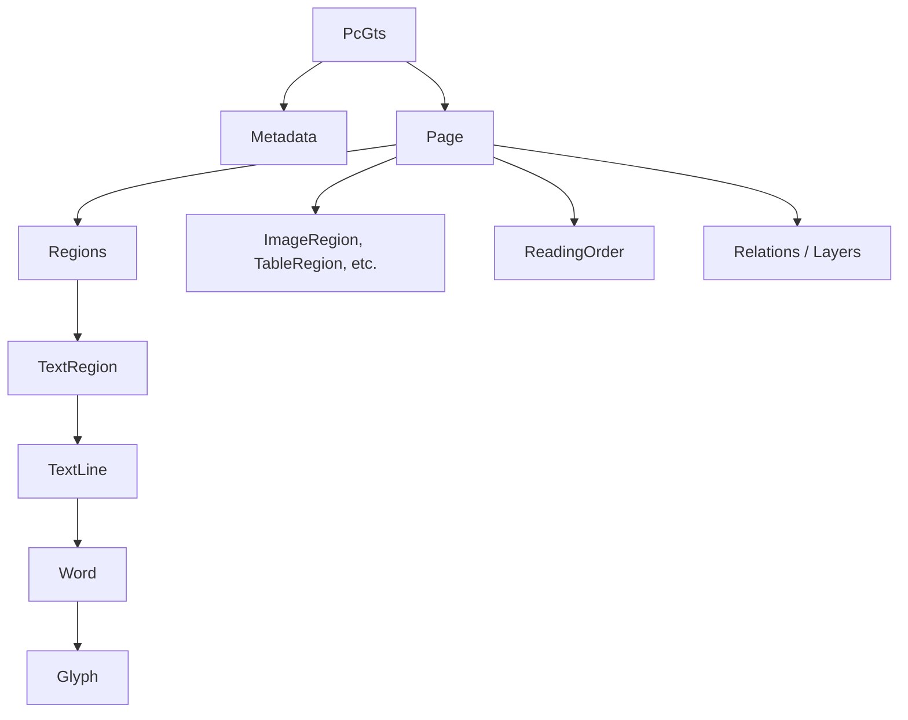
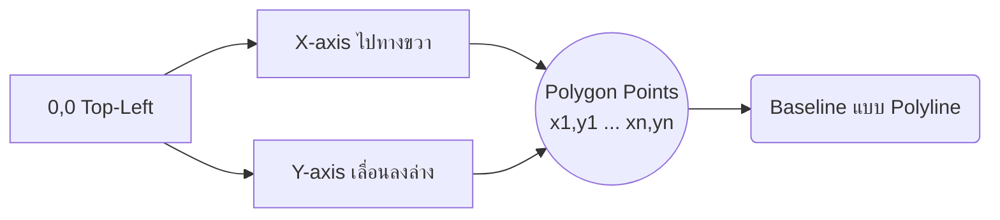

# PAGE XML: ประวัติ โครงสร้าง และ Schema ฉบับเจาะลึก

## สารบัญ

1. [ประวัติและพัฒนาการ](#1-ประวัติและพัฒนาการ)
2. [Timeline เวอร์ชันทั้งหมด](#2-timeline-เวอร์ชันทั้งหมด)
3. [โครงสร้างภาพรวม](#3-โครงสร้างภาพรวม)
4. [Metadata](#4-metadata)
5. [Page Element](#5-page-element)
6. [Region Types ทั้งหมด](#6-region-types-ทั้งหมด)
7. [Text Content Hierarchy](#7-text-content-hierarchy)
8. [Coordinate System](#8-coordinate-system)
9. [ระบบ custom Attribute](#9-ระบบ-custom-attribute)
10. [เครื่องมือ Python สำหรับ PAGE XML](#10-เครื่องมือ-python-สำหรับ-page-xml)
11. [เครื่องมือ Java](#11-เครื่องมือ-java)
12. [ตัวอย่าง PAGE XML ฉบับสมบูรณ์](#12-ตัวอย่าง-page-xml-ฉบับสมบูรณ์)
13. [วิธี Validate ไฟล์ PAGE XML](#13-วิธี-validate-ไฟล์-page-xml)
14. [แหล่งอ้างอิง](#แหล่งอ้างอิง)

---

## 1. ประวัติและพัฒนาการ

PAGE XML ย่อมาจาก **Page Analysis and Ground-truth Elements** เป็นมาตรฐานรูปแบบไฟล์ระดับโลกสำหรับการบันทึกข้อมูลโครงสร้างเอกสาร (Document Analysis), ข้อมูลความจริงพื้นฐาน (Ground Truth), และกระบวนการวิเคราะห์เค้าโครง (Layout Analysis) สำหรับงานการรู้จำอักขระ (OCR/HTR)

> [!NOTE]
> PAGE XML เป็นรูปแบบไฟล์ที่ถูกออกแบบมาอย่างระมัดระวังเพื่อเก็บรักษาข้อมูลเค้าโครงเอกสารที่ซับซ้อนได้อย่างครบถ้วน ทำให้เป็นที่นิยมในวงการการวิเคราะห์เอกสารทางประวัติศาสตร์และวงการมนุษยศาสตร์ดิจิทัล (Digital Humanities) อย่างมาก

### PRImA Research Lab — ความเป็นมา, สถาบัน
PAGE XML ถูกพัฒนาขึ้นโดย **PRImA Research Lab** (Pattern Recognition & Image Analysis) ซึ่งตั้งอยู่ที่ **University of Salford** เมือง Manchester สหราชอาณาจักร (UK) ผู้ที่ทำหน้าที่เป็นผู้เขียนและพัฒนาหลักของ schema นี้คือ **Stefan Pletschacher** และ **Apostolos Antonacopoulos** ซึ่งมีวิสัยทัศน์ที่จะสร้างโครงสร้างข้อมูลที่ยืดหยุ่นและรองรับความซับซ้อนของเค้าโครงเอกสารได้อย่างเต็มรูปแบบ 

### IMPACT project — บริบท
มาตรฐานนี้เกิดขึ้นในช่วงประมาณปี 2008 ถึง 2010 จากประสบการณ์ในการจัดการ dataset ขนาดใหญ่ภายใต้บริบทของโครงการระดับยุโรป (EU-funded) ที่ชื่อว่า **IMPACT project** (Improving Access to Text) โดยโครงการนี้เน้นไปที่การปรับปรุงคุณภาพของการแปลงเอกสารประวัติศาสตร์เป็นรูปแบบดิจิทัล ทำให้มีความต้องการ format ที่สามารถเก็บข้อมูล bounding polygon ได้อย่างแม่นยำเพื่อรับมือกับเอกสารที่เสื่อมสภาพหรือมีรอยพับ

### ICPR 2010 — บทความต้นฉบับ
การนำเสนอมาตรฐานนี้อย่างเป็นทางการสู่สาธารณะเกิดขึ้นในเดือนสิงหาคม ปี 2010 ภายในงานประชุมวิชาการ **ICPR 2010** (20th International Conference on Pattern Recognition) บทความต้นฉบับสามารถอ้างอิงได้จาก DOI: 10.1109/ICPR.2010.72 ซึ่งอธิบายพื้นฐานและคุณสมบัติเด่นที่ PAGE XML มอบให้สำหรับการจัดทำ Ground Truth ไว้อย่างชัดเจน

### ICDAR competitions — บทบาทของ PAGE XML
PAGE XML เริ่มมีบทบาทสำคัญและแพร่หลายมากขึ้นในช่วงปี 2010-2013 เนื่องจากการถูกนำมาใช้เป็นรูปแบบมาตรฐานสำหรับการแข่งขัน **ICDAR Page Segmentation Competition series** ซึ่งรวบรวมนักวิจัยจากทั่วโลกมาทดสอบและพัฒนาระบบการวิเคราะห์เค้าโครงหน้ากระดาษ (Layout Analysis) ทำให้ PAGE XML กลายเป็นโครงสร้างที่มีผู้คุ้นเคยมากมายในกลุ่มวิชาการและนักวิจัย

---

## 2. Timeline เวอร์ชันทั้งหมด

PAGE XML ใช้การระบุเวอร์ชันโดยอิงตาม **วัน-เดือน-ปี (date-based versioning)** โดยข้อมูลเวอร์ชันจะถูกฝังอยู่ใน namespace URI โดยตรง ไม่ใช้เลขเวอร์ชันเชิงทศนิยม (Major/Minor)

| ปี / วันที่ออกเวอร์ชัน | เหตุการณ์และสถานะของเวอร์ชัน |
|-----------------------|-------------------------|
| ~2008-2010            | พัฒนาโดย PRImA Lab จากประสบการณ์จัดการ dataset ขนาดใหญ่ ภายใต้บริบท EU-funded IMPACT project |
| สิงหาคม 2010             | นำเสนอสู่สาธารณชนในงาน ICPR 2010 |
| 2010-2013             | ถูกนำไปใช้อย่างกว้างขวางใน ICDAR Page Segmentation Competition series |
| 2016-07-15            | schema version ที่เริ่มมีการใช้งานกันอย่างแพร่หลาย |
| 2017-07-15            | schema version ที่เป็นที่อ้างอิงบ่อยในวรรณกรรมทางวิชาการและการพัฒนา |
| 2019-07-15            | schema version ที่ใช้ในเครื่องมือหลักหลายตัว — ถือเป็น version ที่เป็นที่นิยมที่สุด ณ ปัจจุบัน |
| 2024-07-15            | schema version ล่าสุด รองรับคุณสมบัติใหม่เพิ่มเติมในรายละเอียดขององค์ประกอบต่าง ๆ |

> [!IMPORTANT]
> **Date-based Versioning & Namespace**
> การฝังวันที่ลงใน namespace เป็นลักษณะเด่นของ PAGE XML 
> ตัวอย่างเช่น: `xmlns="http://schema.primaresearch.org/PAGE/gts/pagecontent/2024-07-15"`
> ซึ่งหมายความว่าการอัปเดตเวอร์ชันอาจต้องการปรับแก้ไข namespace ของเอกสารเพื่อให้ validate ผ่านตาม Schema URL ที่ถูกต้อง 
> (http://schema.primaresearch.org/PAGE/gts/pagecontent/2024-07-15/pagecontent.xsd)

---

## 3. โครงสร้างภาพรวม

โครงสร้างของ PAGE XML อาศัยการลดหลั่นของ Element เป็นระดับชั้น (Hierarchy) โดยใช้ **PcGts (Page Content Ground Truth and Storage)** เป็นชื่อ Root Element



**คำอธิบายระดับชั้น**:
1. **PcGts**: เป็น Root Element ครอบคลุมทั้งหมดของเอกสาร 1 หน้า
2. **Metadata**: เก็บข้อมูลอภิมานเบื้องต้น เช่น ผู้สร้าง เวลาแก้ไขล่าสุด
3. **Page**: ระบุคุณสมบัติภาพหน้าเอกสาร เช่น ชนิดของภาพ ความกว้าง ความสูง และลำดับการอ่าน
4. **Regions**: อาณาบริเวณของเนื้อหาประเภทต่างๆ ซึ่งถูกจำแนกเป็นหลายประเภท เช่น `TextRegion`, `ImageRegion`, `TableRegion` เป็นต้น
5. **TextLine, Word, Glyph**: ภายใน `TextRegion` ยังแบ่งส่วนข้อความให้ละเอียดระดับบรรทัด, ระดับคำ, และระดับอักขระ (Glyph)

---

## 4. Metadata

Element `<Metadata>` ใน PAGE XML ใช้เก็บข้อมูลเกี่ยวกับการสร้างและการแก้ไข Ground Truth

> [!TIP]
> การระบุ Metadata เป็นสิ่งจำเป็นอย่างยิ่งในงานที่ทำร่วมกันหลายคน เพื่อให้ทราบที่มาว่าใครเป็นผู้ดำเนินการหรือเครื่องมืออะไรเป็นผู้แปลงผลลัพธ์นี้

- **Creator**: บุคคลหรือซอฟต์แวร์ที่สร้างไฟล์ XML นี้
- **Created**: วัน-เวลาที่ไฟล์ถูกสร้างขึ้น (รูปแบบ ISO 8601)
- **LastChange**: วัน-เวลาที่ไฟล์ถูกแก้ไขล่าสุด
- **Comments**: คำอธิบายเพิ่มเติม หรือคำอธิบายประกอบอื่น ๆ เกี่ยวกับข้อมูลในหน้าเอกสาร

### ตัวอย่าง XML ของ Metadata

```xml
<PcGts xmlns="http://schema.primaresearch.org/PAGE/gts/pagecontent/2024-07-15">
    <Metadata>
        <Creator>Transkribus System / User: JaneDoe</Creator>
        <Created>2026-06-03T10:00:00.000+07:00</Created>
        <LastChange>2026-06-03T11:45:00.000+07:00</LastChange>
        <Comments>Ground truth validation completed by senior archivist. Ready for training.</Comments>
    </Metadata>
    <!-- ต่อด้วย Page element -->
</PcGts>
```

---

## 5. Page Element

`<Page>` เป็นศูนย์กลางของการเชื่อมโยงภาพถ่ายหน้าเอกสารกับข้อมูลที่ทำการวิเคราะห์ โดยจะมีแอตทริบิวต์หลักและส่วนประกอบที่เกี่ยวข้องกับทั้งหน้าเอกสาร

- **imageFilename**: ชื่อไฟล์ภาพต้นฉบับ
- **imageWidth**, **imageHeight**: ขนาดภาพเป็นพิกเซล (pixels)

### องค์ประกอบภายใน `<Page>`

- **ReadingOrder**: กำหนดลำดับการอ่านของ Regions ภายในหน้า ซึ่งมีองค์ประกอบย่อยคือ:
  - `<OrderedGroup>`: กลุ่มที่อ่านตามลำดับ (มักใช้แอตทริบิวต์ `id`)
  - `<UnorderedGroup>`: กลุ่มที่ไม่กำหนดลำดับการอ่านชัดเจน
  - `<RegionRefIndexed>`: อ้างอิงถึง Region ตามลำดับดัชนี (index) และระบุชื่อเป้าหมายผ่านแอตทริบิวต์ `regionRef`
  - `<RegionRef>`: อ้างอิงถึง Region โดยไม่ระบุลำดับ
- **AlternativeImage**: สามารถเก็บภาพทางเลือก (filename, comments attributes) ซึ่งมักใช้สำหรับภาพที่ถูกทำ Binarized, ภาพที่ถูก Deskewed หรือภาพที่ถูก Enhanced เพื่อการประมวลผลต่อ
- **Border**: ระบุพิกัด (Coords) สำหรับขอบเขตจริงของหน้าเอกสารที่ต้องการประมวลผล (มักตัดส่วนขอบของฟิล์มสแกนออก)
- **Relations**: ระบุความสัมพันธ์ระหว่าง Regions เช่น การเชื่อมต่อของย่อหน้าที่ข้ามหน้า
- **Layers**: เลเยอร์ที่ช่วยแยกการนำเสนอข้อมูลหลายระดับในเอกสารที่ซับซ้อน

### ตัวอย่าง XML ของ Page Element

```xml
<Page imageFilename="scanned_manuscript_001.tif" imageWidth="2400" imageHeight="3600">
    <AlternativeImage filename="binarized_001.png" comments="Binarized image generated by Sauvola thresholding"/>
    <AlternativeImage filename="deskewed_001.png" comments="Deskewed image at 0.5 degrees"/>
    <Border>
        <Coords points="100,100 2300,100 2300,3500 100,3500"/>
    </Border>
    <ReadingOrder>
        <OrderedGroup id="ro_main">
            <RegionRefIndexed index="0" regionRef="region_main_heading"/>
            <RegionRefIndexed index="1" regionRef="region_paragraph_1"/>
            <RegionRefIndexed index="2" regionRef="region_image_caption"/>
            <RegionRefIndexed index="3" regionRef="region_paragraph_2"/>
            <RegionRefIndexed index="4" regionRef="region_paragraph_3"/>
        </OrderedGroup>
    </ReadingOrder>
    <!-- ตามด้วย Regions ต่างๆ -->
</Page>
```

---

## 6. Region Types ทั้งหมด

จุดเด่นของ PAGE XML คือการกำหนดชนิดของพื้นที่เอกสาร (Region Types) ไว้อย่างครอบคลุมมาก ทำให้สามารถแยกแยะหมวดหมู่เนื้อหาได้ละเอียด

### TextRegion
บริเวณที่มีข้อความอยู่ ซึ่งสามารถมี sub-types ย่อย (ผ่านแอตทริบิวต์ `type`) เพื่อระบุลักษณะเฉพาะ ได้แก่: 
`heading`, `paragraph`, `caption`, `header`, `footer`, `page-number`, `drop-capital`, `credit`, `floating`, `signature-mark`, `catch-word`, `marginalia`, `footnote`, `footnote-continued`, `endnote`, `TOC-entry`, `list-label`, `other`

```xml
<!-- ตัวอย่าง TextRegion ชนิด Paragraph -->
<TextRegion id="region_paragraph_1" type="paragraph">
    <Coords points="120,400 2200,400 2200,1200 120,1200"/>
    <TextLine id="line_1_1">
        <Coords points="130,420 2190,420 2190,480 130,480"/>
        <Baseline points="130,470 2190,470"/>
        <TextEquiv conf="0.95">
            <Unicode>นี่คือตัวอย่างบรรทัดแรกในย่อหน้าหลักของเอกสาร</Unicode>
        </TextEquiv>
    </TextLine>
    <TextLine id="line_1_2">
        <Coords points="130,520 2190,520 2190,580 130,580"/>
        <Baseline points="130,570 2190,570"/>
        <TextEquiv conf="0.95">
            <Unicode>ซึ่งสามารถแสดงผลพิกัดและเส้นบรรทัดได้อย่างสมบูรณ์แบบ</Unicode>
        </TextEquiv>
    </TextLine>
    <TextLine id="line_1_3">
        <Coords points="130,620 2190,620 2190,680 130,680"/>
        <Baseline points="130,670 2190,670"/>
        <TextEquiv conf="0.91">
            <Unicode>นอกจากนี้ยังรองรับข้อมูลในรูปแบบ Hierarchy อีกด้วย</Unicode>
        </TextEquiv>
    </TextLine>
</TextRegion>

<!-- ตัวอย่าง TextRegion ชนิด Header -->
<TextRegion id="region_header" type="header">
    <Coords points="100,50 2300,50 2300,150 100,150"/>
    <TextLine id="header_line_1">
        <Coords points="1000,70 1400,70 1400,130 1000,130"/>
        <Baseline points="1000,120 1400,120"/>
        <TextEquiv conf="1.0">
            <Unicode>หนังสือรายงานประจำปี</Unicode>
        </TextEquiv>
    </TextLine>
</TextRegion>

<!-- ตัวอย่าง TextRegion ชนิด Footnote -->
<TextRegion id="region_footnote_1" type="footnote">
    <Coords points="120,3200 2200,3200 2200,3400 120,3400"/>
    <TextLine id="fn_line_1">
        <Coords points="130,3220 2190,3220 2190,3280 130,3280"/>
        <Baseline points="130,3270 2190,3270"/>
        <TextEquiv conf="0.85">
            <Unicode>1. เชิงอรรถอธิบายเพิ่มเติมถึงบริบททางประวัติศาสตร์</Unicode>
        </TextEquiv>
    </TextLine>
</TextRegion>
```

### ImageRegion
บริเวณที่เป็นรูปภาพ (เช่น ภาพถ่าย, ภาพวาดลงสี, ภาพถ่ายทางอากาศ)

```xml
<ImageRegion id="region_image_1">
    <Coords points="200,1300 2100,1300 2100,2400 200,2400"/>
</ImageRegion>
<ImageRegion id="region_image_2">
    <Coords points="2200,1300 3100,1300 3100,2400 2200,2400"/>
</ImageRegion>
```

### GraphicRegion
บริเวณที่เป็นกราฟิกประกอบ (โลโก้, ไอคอน, ลวดลายตกแต่ง, สัญลักษณ์ต่างๆ)

```xml
<GraphicRegion id="region_logo_header">
    <Coords points="150,150 400,150 400,300 150,300"/>
</GraphicRegion>
```

### TableRegion
บริเวณตารางข้อมูล สามารถรวมถึงเส้นแบ่งตารางด้วย โดยการประมวลผลตารางมักต้องการการระบุแถวและคอลัมน์อย่างเป็นระบบ

```xml
<TableRegion id="region_table_data">
    <Coords points="150,2500 2200,2500 2200,3400 150,3400"/>
</TableRegion>
```

### ChartRegion, MathsRegion, ChemRegion, MusicRegion
สำหรับการระบุข้อมูลทางเทคนิคและเฉพาะทาง เช่น กราฟ/แผนภูมิ, สูตรคณิตศาสตร์, สูตรเคมี, และโน้ตเพลง

```xml
<ChartRegion id="region_pie_chart">
    <Coords points="300,500 1200,500 1200,1500 300,1500"/>
</ChartRegion>
<MathsRegion id="region_equation_1">
    <Coords points="1300,600 2100,600 2100,800 1300,800"/>
</MathsRegion>
<ChemRegion id="region_molecule_structure">
    <Coords points="1300,900 2100,900 2100,1400 1300,1400"/>
</ChemRegion>
<MusicRegion id="region_score_sheet">
    <Coords points="150,1800 2200,1800 2200,2200 150,2200"/>
</MusicRegion>
```

### SeparatorRegion, NoiseRegion, LineDrawingRegion
บริเวณที่เป็นเส้นแบ่งหน้ากระดาษ (เส้นบรรทัด คอลัมน์), สัญญาณรบกวน (รอยเปื้อน รอยหมึก รอยพับ), และภาพลายเส้น (ที่ไม่ใช่รูปภาพหรือกราฟิกทั่วไป)

```xml
<SeparatorRegion id="region_horizontal_line">
    <Coords points="120,380 2200,380 2200,390 120,390"/>
</SeparatorRegion>
<NoiseRegion id="region_ink_blot">
    <Coords points="50,50 90,50 90,90 50,90"/>
</NoiseRegion>
<LineDrawingRegion id="region_diagram">
    <Coords points="400,2800 1000,2800 1000,3200 400,3200"/>
</LineDrawingRegion>
```

### AdvertRegion, UnknownRegion, CustomRegion, MapRegion
บริเวณโฆษณา, บริเวณที่ไม่ทราบประเภท, บริเวณกำหนดเอง, และบริเวณแผนที่

```xml
<AdvertRegion id="region_ad_bottom">
    <Coords points="100,3400 2300,3400 2300,3580 100,3580"/>
</AdvertRegion>
<UnknownRegion id="region_unclassified">
    <Coords points="2250,500 2290,500 2290,600 2250,600"/>
</UnknownRegion>
<CustomRegion id="region_special_format" custom="special_handling_v1">
    <Coords points="1500,2000 1800,2000 1800,2200 1500,2200"/>
</CustomRegion>
<MapRegion id="region_world_map">
    <Coords points="200,200 1200,200 1200,1000 200,1000"/>
</MapRegion>
```

---

## 7. Text Content Hierarchy

เพื่อให้การระบุตำแหน่งข้อความใน OCR/HTR สมบูรณ์ที่สุด PAGE XML จึงจัดลำดับข้อความแบบลดหลั่นเป็นชั้นตามลำดับ (Hierarchy) ดังนี้:

**TextRegion** → **TextLine** → **Word** → **Glyph**

> [!NOTE]
> ในทุกระดับของ Hierarchy สามารถมี `<Coords>` (พื้นที่หลายเหลี่ยม) และ `<TextEquiv>` (เนื้อหาข้อความ) ได้ทั้งหมด ทำให้เราสามารถดึงข้อความออกมาระดับย่อหน้า ระดับบรรทัด ระดับคำ หรือระดับอักขระเดี่ยวๆ ได้อย่างง่ายดาย

### โครงสร้างระดับย่อย

- **TextLine**: ระดับบรรทัดข้อความ
  - มักมี `<Coords>` (กรอบหลายเหลี่ยมล้อมรอบบรรทัด), `<Baseline>` (เส้นฐานที่ข้อความวางทับ), และ `<TextEquiv>`
- **Word**: ระดับคำย่อยในบรรทัด
  - มี `<Coords>` เฉพาะคำ และ `<TextEquiv>` ของคำนั้น
- **Glyph**: ระดับอักขระแต่ละตัว
  - มี `<Coords>` เฉพาะตัวอักษร และ `<TextEquiv>` ซึ่งรวมถึง `<Unicode>` ด้านใน

### ตัวอย่างข้อความแบบละเอียดทุกระดับชั้น

```xml
<TextRegion id="region_text_hier" type="paragraph">
    <Coords points="100,100 500,100 500,200 100,200"/>
    <TextLine id="line_1">
        <Coords points="100,100 500,100 500,150 100,150"/>
        <Baseline points="100,140 500,140"/>
        
        <!-- ตัวอย่างคำที่ 1 -->
        <Word id="word_1_1">
            <Coords points="100,100 250,100 250,150 100,150"/>
            
            <Glyph id="glyph_1_1_1">
                <Coords points="100,100 150,100 150,150 100,150"/>
                <TextEquiv conf="0.99"><Unicode>ท</Unicode></TextEquiv>
            </Glyph>
            
            <Glyph id="glyph_1_1_2">
                <Coords points="160,100 200,100 200,150 160,150"/>
                <TextEquiv conf="0.98"><Unicode>ด</Unicode></TextEquiv>
            </Glyph>
            
            <Glyph id="glyph_1_1_3">
                <Coords points="210,100 250,100 250,150 210,150"/>
                <TextEquiv conf="0.95"><Unicode>ส</Unicode></TextEquiv>
            </Glyph>
            
            <TextEquiv conf="0.98"><Unicode>ทดส</Unicode></TextEquiv>
        </Word>
        
        <!-- ตัวอย่างคำที่ 2 -->
        <Word id="word_1_2">
            <Coords points="260,100 400,100 400,150 260,150"/>
            
            <Glyph id="glyph_1_2_1">
                <Coords points="260,100 300,100 300,150 260,150"/>
                <TextEquiv conf="0.99"><Unicode>อ</Unicode></TextEquiv>
            </Glyph>
            
            <Glyph id="glyph_1_2_2">
                <Coords points="310,100 350,100 350,150 310,150"/>
                <TextEquiv conf="0.99"><Unicode>บ</Unicode></TextEquiv>
            </Glyph>
            
            <TextEquiv conf="0.99"><Unicode>อบ</Unicode></TextEquiv>
        </Word>
        
        <TextEquiv conf="0.98"><Unicode>ทดสอบ</Unicode></TextEquiv>
    </TextLine>
</TextRegion>
```

---

## 8. Coordinate System

การระบุพิกัดใน PAGE XML มีความแม่นยำสูงมาก เพราะถูกออกแบบให้ใช้ **Polygon-based Coordinate System** เป็นหลัก 

### พิกัด Polygon (Coords)
พิกัดของกรอบจะถูกระบุอยู่ในแอตทริบิวต์ `points` ภายใน `<Coords>` โดยมีรูปแบบคือ `"x1,y1 x2,y2 x3,y3 ..."` (สามารถมีจุดกี่จุดก็ได้ตราบเท่าที่สร้างเป็นรูปปิดหลายเหลี่ยม)

**เปรียบเทียบ Bounding Box vs Polygon**:
Bounding box เป็นรูปสี่เหลี่ยมผืนผ้าขนานกับแกน X, Y เสมอ ในขณะที่ Polygon ช่วยให้สามารถคลุมรอบวัตถุที่มีรูปร่างอิสระ หรือเอกสารที่มีการเบี้ยว (skew), ข้อความที่โค้ง, และสามารถเว้าแหว่งไปตามรูปร่างจริงของหมึกได้ จึงช่วยลดสัญญาณรบกวน (noise) ในขณะทำการตัดภาพข้อความเพื่อเทรนโมเดล HTR ได้ดีกว่ามาก

### เส้นฐาน (Baseline)
`<Baseline>` เป็นลักษณะเส้นเปิด (Polyline) ที่ระบุในรูปแบบ `points="x1,y1 x2,y2 ..."` เช่นเดียวกัน ซึ่งเส้นฐานมีความสำคัญมากในงาน HTR เนื่องจากข้อความเขียนลายมือมักมีการบรรจงหรือลากขึ้นลงแบบไม่เป็นแนวราบสมบูรณ์ การระบุ Baseline สามารถหักเหโค้งตามลายมือได้ และมีประโยชน์ต่อกระบวนการ text line extraction

> [!CAUTION]
> การใช้งานพิกัดใน PAGE XML ต้องยึดถือพิกัด `x,y` โดยแกนต้นกำเนิด (0,0) อยู่ที่ตำแหน่ง **มุมซ้ายบน (Top-Left)** ของรูปภาพ การระบุค่าที่ติดลบจะไม่ถูกต้องตามมาตรฐาน Schema

### แผนภาพอธิบาย


---

## 9. ระบบ custom Attribute

PAGE XML มีระบบสำหรับการฝังเมตาดาต้าเฉพาะแอปพลิเคชัน (Application-specific Metadata) ผ่านแอตทริบิวต์ที่เรียกว่า `custom` ซึ่งเปิดโอกาสให้ซอฟต์แวร์ต่าง ๆ จัดเก็บข้อมูลของตนเองโดยไม่ขัดกับมาตรฐาน Schema ของหลัก

**Syntax มาตรฐาน**:
รูปแบบที่แพร่หลายมักอยู่ในรูปของกลุ่มคำและโครงสร้างแบบปีกกา เช่น:
`custom="structure {type:heading;}"`

### การใช้งานใน Transkribus
Transkribus อาศัย custom attributes อย่างหนัก เพื่อจัดเก็บข้อมูลเช่น:
- โครงสร้างเอกสารเชิงลึก (เช่น สไตล์ หรือ type กำหนดเอง)
- สถานะการอ่าน (เช่น `readingOrder {index:0;}`)
- Metadata ที่ถูกแท็กโดยผู้ใช้ เช่น สถานะการแก้ไข (status)

### การใช้งานใน eScriptorium
eScriptorium ก็อ่านค่าจาก `custom` เช่นกันเพื่อผูกติดกับ tags หรือ ontology ของตนเอง ทำให้ผู้ใช้งานสามารถใส่ annotation เฉพาะเจาะจงลงในระดับบรรทัดหรือระดับคำได้ (เช่น semantic tags)

**ตัวอย่างการใช้ custom attribute**:
```xml
<TextRegion id="region_001" custom="structure {type:marginalia; label:author_note;} status {checked:true;}">
    <Coords points="100,100 200,100 200,200 100,200"/>
    <!-- รายละเอียดด้านใน -->
</TextRegion>

<TextLine id="line_custom" custom="readingOrder {index:0;} font {size:12pt; family:Arial;}">
    <Coords points="110,110 190,110 190,140 110,140"/>
    <Baseline points="110,135 190,135"/>
    <TextEquiv><Unicode>ข้อความตัวอย่าง</Unicode></TextEquiv>
</TextLine>
```

---

## 10. เครื่องมือ Python สำหรับ PAGE XML

การประมวลผล PAGE XML มักใช้ไลบรารีของ Python เป็นหลักเนื่องจากมีความยืดหยุ่นสูง และเป็นภาษาหลักในวงการวิจัย AI และ HTR

### `pypxml`
เป็นเครื่องมือยอดนิยมสำหรับการอ่าน การแก้ไข และการเขียน PAGE-XML อีกทั้งยังมี Command Line Interface (CLI)
- **การติดตั้ง**: `pip install pypxml`
- **การใช้งาน**: โหลดไฟล์ XML แปลงค่าปรับแต่งพิกัด และเขียนกลับออกเป็นไฟล์ใหม่ สามารถใช้ปรับสเกลของพิกัดได้หากมีการย่อขยายภาพ

### `pagexml-tools`
ชุดเครื่องมือเสริมที่ช่วยในการทำ Parsing, การประมวลผลตาราง, การค้นหา (search), และ การตรวจสอบคุณภาพ (QA)
- **การติดตั้ง**: `pip install pagexml-tools`
- **การใช้งาน**: มี API สำหรับการข้ามไปมาระหว่าง Hierarchy ง่ายๆ เช่น `get_textlines()` จาก TextRegion หรือการดึงข้อมูลตารางในรูปแบบโครงสร้าง Pandas DataFrame ได้

### `ocrd_models` (ส่วนหนึ่งของ OCR-D)
เฟรมเวิร์ก OCR-D อาศัยไลบรารีของตนเองเพื่อจัดการ PAGE XML อย่างเป็นระบบตลอดวงจรชีวิต (Processing chain) ของ METS workspace
- **การใช้งาน**: จะมีการเรียกใช้คลาสและฟังก์ชันจาก `ocrd_models.ocrd_page` เพื่อจัดการกับ element ต่าง ๆ อย่างเคร่งครัดตาม Schema เหมาะกับโครงการขนาดใหญ่

---

## 11. เครื่องมือ Java

กลุ่มผู้ริเริ่ม PAGE XML (PRImA Lab) ได้พัฒนาเครื่องมือฝั่ง Java ที่มีประสิทธิภาพสูงด้วยเช่นกัน

- **Aletheia**: เป็นระบบ Ground-truthing และ Analysis tool ขั้นสูงที่มีกราฟิก UI (GUI) สำหรับเปิดภาพ ซ้อนทับพื้นที่ (Regions) สร้างแก้ไขพิกัด Polygon และพิมพ์ข้อความ Ground truth สะดวกมาก
- **PRImA Page Viewer**: เครื่องมือขนาดเล็กอย่างเป็นทางการที่เน้นเพื่อแสดงผลไฟล์ภาพควบคู่กับ PAGE XML เพียงอย่างเดียว ไม่สามารถแก้ไขได้
- **PAGE Converter/Validator**: ชุด utilities จาก PRImA Lab ที่ช่วยปรับรุ่นของ PAGE XML เก่าเป็นรุ่นปัจจุบัน หรือ Validate ความถูกต้องข้ามเวอร์ชัน

**วิธีใช้งานเบื้องต้น**: 
ดาวน์โหลดไฟล์ JAR จากเว็บไซต์ PRImA, เปิดโปรแกรม, โหลดไฟล์ .tif และโหลดไฟล์ .xml ควบคู่กัน ตัวซอฟต์แวร์จะแสดง Overlay ทับบนภาพโดยอัตโนมัติ ทำให้ตรวจสอบปัญหา Layout Analysis ได้ง่ายด้วยสายตา (Visual Inspection)

---

## 12. ตัวอย่าง PAGE XML ฉบับสมบูรณ์

เพื่อแสดงถึงความสมบูรณ์ในการทำงาน ตัวอย่างด้านล่างนี้มีการใช้โครงสร้างที่จำเป็นอย่างหลากหลาย โดยมีการแสดงผลความยาวรวมทั้งหมดให้เห็นลักษณะเชิงลึก

### ตัวอย่างที่ 1: เอกสารต้นฉบับลายมือ (TextRegion + TextLine + Baseline)
ในตัวอย่างนี้แสดงให้เห็นว่าลายมือมักต้องใช้ TextRegion เป็น heading และ paragraph ควบคู่ไปกับ TextLine และ Baseline
```xml
<?xml version="1.0" encoding="UTF-8"?>
<PcGts xmlns="http://schema.primaresearch.org/PAGE/gts/pagecontent/2024-07-15" xmlns:xsi="http://www.w3.org/2001/XMLSchema-instance" xsi:schemaLocation="http://schema.primaresearch.org/PAGE/gts/pagecontent/2024-07-15 http://schema.primaresearch.org/PAGE/gts/pagecontent/2024-07-15/pagecontent.xsd">
    <Metadata>
        <Creator>AI Agent Assistant</Creator>
        <Created>2026-06-03T12:00:00</Created>
        <LastChange>2026-06-03T12:05:00</LastChange>
    </Metadata>
    <Page imageFilename="handwritten_001.jpg" imageWidth="1500" imageHeight="2000">
        <ReadingOrder>
            <OrderedGroup id="ro_1">
                <RegionRefIndexed index="0" regionRef="tr_1"/>
                <RegionRefIndexed index="1" regionRef="tr_2"/>
                <RegionRefIndexed index="2" regionRef="tr_3"/>
            </OrderedGroup>
        </ReadingOrder>
        <TextRegion id="tr_1" type="heading">
            <Coords points="100,50 1400,50 1400,150 100,150"/>
            <TextLine id="tl_1">
                <Coords points="110,60 1390,60 1390,140 110,140"/>
                <Baseline points="110,130 1390,130"/>
                <TextEquiv conf="0.95">
                    <Unicode>บันทึกประจำวันของนายแพทย์</Unicode>
                </TextEquiv>
            </TextLine>
        </TextRegion>
        <TextRegion id="tr_2" type="paragraph">
            <Coords points="100,200 1400,200 1400,1000 100,1000"/>
            <TextLine id="tl_2">
                <Coords points="120,220 1380,220 1380,280 120,280"/>
                <Baseline points="120,270 500,270 1380,290"/>
                <TextEquiv conf="0.88">
                    <Unicode>วันนี้คนไข้มีอาการดีขึ้นกว่าเมื่อวานมาก</Unicode>
                </TextEquiv>
            </TextLine>
            <TextLine id="tl_3">
                <Coords points="120,300 1380,300 1380,360 120,360"/>
                <Baseline points="120,350 1380,350"/>
                <TextEquiv conf="0.92">
                    <Unicode>ไข้ลดลงและเริ่มรับประทานอาหารได้</Unicode>
                </TextEquiv>
            </TextLine>
            <TextLine id="tl_4">
                <Coords points="120,380 1380,380 1380,440 120,440"/>
                <Baseline points="120,430 1380,430"/>
                <TextEquiv conf="0.89">
                    <Unicode>อัตราการเต้นของหัวใจกลับมาเป็นปกติ</Unicode>
                </TextEquiv>
            </TextLine>
            <TextLine id="tl_5">
                <Coords points="120,460 1380,460 1380,520 120,520"/>
                <Baseline points="120,510 1380,510"/>
                <TextEquiv conf="0.87">
                    <Unicode>จะเฝ้าดูอาการต่อไปอีกสองวัน</Unicode>
                </TextEquiv>
            </TextLine>
        </TextRegion>
        <TextRegion id="tr_3" type="signature-mark">
            <Coords points="1000,1200 1400,1200 1400,1400 1000,1400"/>
            <TextLine id="tl_6">
                <Coords points="1050,1250 1350,1250 1350,1350 1050,1350"/>
                <Baseline points="1050,1340 1350,1340"/>
                <TextEquiv conf="0.85">
                    <Unicode>นายแพทย์ สมิธ</Unicode>
                </TextEquiv>
            </TextLine>
        </TextRegion>
    </Page>
</PcGts>
```

### ตัวอย่างที่ 2: เอกสารสิ่งพิมพ์ (หลาย region types)
แสดงการใช้งาน Region หลายประเภทรวมกันในหน้าเดียว
```xml
<?xml version="1.0" encoding="UTF-8"?>
<PcGts xmlns="http://schema.primaresearch.org/PAGE/gts/pagecontent/2024-07-15" xmlns:xsi="http://www.w3.org/2001/XMLSchema-instance" xsi:schemaLocation="http://schema.primaresearch.org/PAGE/gts/pagecontent/2024-07-15 http://schema.primaresearch.org/PAGE/gts/pagecontent/2024-07-15/pagecontent.xsd">
    <Metadata>
        <Creator>Automated Layout Parser V2</Creator>
        <Created>2026-06-03T12:00:00</Created>
        <LastChange>2026-06-03T12:00:00</LastChange>
    </Metadata>
    <Page imageFilename="newspaper_front.tif" imageWidth="3000" imageHeight="4500">
        <!-- โลโก้หนังสือพิมพ์ -->
        <GraphicRegion id="gr_logo">
            <Coords points="500,100 2500,100 2500,400 500,400"/>
        </GraphicRegion>
        
        <!-- เส้นแบ่ง -->
        <SeparatorRegion id="sep_1">
            <Coords points="100,450 2900,450 2900,460 100,460"/>
        </SeparatorRegion>
        
        <!-- หัวข้อข่าวหลัก -->
        <TextRegion id="tr_headline" type="heading">
            <Coords points="200,500 2800,500 2800,700 200,700"/>
            <TextLine id="line_headline">
                <Coords points="200,500 2800,500 2800,700 200,700"/>
                <TextEquiv><Unicode>ความก้าวหน้าทางเทคโนโลยี AI ล่าสุด</Unicode></TextEquiv>
            </TextLine>
        </TextRegion>
        
        <!-- ภาพข่าว -->
        <ImageRegion id="img_main">
            <Coords points="200,750 1500,750 1500,1500 200,1500"/>
        </ImageRegion>
        
        <!-- คำอธิบายภาพ (Caption) -->
        <TextRegion id="tr_caption" type="caption">
            <Coords points="200,1520 1500,1520 1500,1600 200,1600"/>
            <TextLine id="line_caption">
                <Coords points="200,1520 1500,1520 1500,1600 200,1600"/>
                <TextEquiv><Unicode>ภาพที่ 1: นักวิจัยกำลังทดสอบโมเดลใหม่</Unicode></TextEquiv>
            </TextLine>
        </TextRegion>
        
        <!-- เนื้อหาข่าวคอลัมน์ -->
        <TextRegion id="tr_column_1" type="paragraph">
            <Coords points="1550,750 2800,750 2800,1500 1550,1500"/>
            <TextLine id="line_col_1">
                <Coords points="1550,750 2800,750 2800,800 1550,800"/>
                <Baseline points="1550,790 2800,790"/>
                <TextEquiv><Unicode>นวัตกรรมล่าสุดจากการวิจัยทำให้...</Unicode></TextEquiv>
            </TextLine>
            <TextLine id="line_col_2">
                <Coords points="1550,850 2800,850 2800,900 1550,900"/>
                <Baseline points="1550,890 2800,890"/>
                <TextEquiv><Unicode>ระบบสามารถวิเคราะห์เอกสารได้อย่างแม่นยำขึ้น</Unicode></TextEquiv>
            </TextLine>
            <TextLine id="line_col_3">
                <Coords points="1550,950 2800,950 2800,1000 1550,1000"/>
                <Baseline points="1550,990 2800,990"/>
                <TextEquiv><Unicode>ลดข้อผิดพลาดจากการอ่านลายมือที่ไม่ชัดเจน</Unicode></TextEquiv>
            </TextLine>
        </TextRegion>
        
        <!-- โฆษณา -->
        <AdvertRegion id="ad_1">
            <Coords points="200,4000 2800,4000 2800,4400 200,4400"/>
        </AdvertRegion>
    </Page>
</PcGts>
```

### ตัวอย่างที่ 3: ตาราง (TableRegion)
แสดงการใช้งานแบบกำหนด custom attribute สำหรับเซลล์ตาราง
```xml
<?xml version="1.0" encoding="UTF-8"?>
<PcGts xmlns="http://schema.primaresearch.org/PAGE/gts/pagecontent/2024-07-15" xmlns:xsi="http://www.w3.org/2001/XMLSchema-instance" xsi:schemaLocation="http://schema.primaresearch.org/PAGE/gts/pagecontent/2024-07-15 http://schema.primaresearch.org/PAGE/gts/pagecontent/2024-07-15/pagecontent.xsd">
    <Metadata>
        <Creator>Table Extractor</Creator>
        <Created>2026-06-03T12:00:00</Created>
        <LastChange>2026-06-03T12:00:00</LastChange>
    </Metadata>
    <Page imageFilename="report_table.png" imageWidth="2000" imageHeight="3000">
        <TableRegion id="table_01">
            <Coords points="200,300 1800,300 1800,1200 200,1200"/>
            
            <!-- แถวที่ 1, คอลัมน์ที่ 1 (Header) -->
            <TextRegion id="table_col_1_row_1" type="other" custom="structure {type:table_cell; row:1; col:1; isHeader:true;}">
                <Coords points="210,310 800,310 800,400 210,400"/>
                <TextLine id="tc_1_1">
                    <Coords points="215,315 795,315 795,390 215,390"/>
                    <Baseline points="215,385 795,385"/>
                    <TextEquiv><Unicode>ชื่อโครงการ</Unicode></TextEquiv>
                </TextLine>
            </TextRegion>
            
            <!-- แถวที่ 1, คอลัมน์ที่ 2 (Header) -->
            <TextRegion id="table_col_2_row_1" type="other" custom="structure {type:table_cell; row:1; col:2; isHeader:true;}">
                <Coords points="850,310 1790,310 1790,400 850,400"/>
                <TextLine id="tc_2_1">
                    <Coords points="855,315 1785,315 1785,390 855,390"/>
                    <Baseline points="855,385 1785,385"/>
                    <TextEquiv><Unicode>งบประมาณ (บาท)</Unicode></TextEquiv>
                </TextLine>
            </TextRegion>
            
            <!-- แถวที่ 2, คอลัมน์ที่ 1 (Data) -->
            <TextRegion id="table_col_1_row_2" type="other" custom="structure {type:table_cell; row:2; col:1; isHeader:false;}">
                <Coords points="210,410 800,410 800,500 210,500"/>
                <TextLine id="tc_1_2">
                    <Coords points="215,415 795,415 795,490 215,490"/>
                    <Baseline points="215,485 795,485"/>
                    <TextEquiv><Unicode>โครงการพัฒนาระบบ AI</Unicode></TextEquiv>
                </TextLine>
            </TextRegion>
            
            <!-- แถวที่ 2, คอลัมน์ที่ 2 (Data) -->
            <TextRegion id="table_col_2_row_2" type="other" custom="structure {type:table_cell; row:2; col:2; isHeader:false;}">
                <Coords points="850,410 1790,410 1790,500 850,500"/>
                <TextLine id="tc_2_2">
                    <Coords points="855,415 1785,415 1785,490 855,490"/>
                    <Baseline points="855,485 1785,485"/>
                    <TextEquiv><Unicode>1,500,000</Unicode></TextEquiv>
                </TextLine>
            </TextRegion>
        </TableRegion>
    </Page>
</PcGts>
```

---

## 13. วิธี Validate ไฟล์ PAGE XML

การ Validate โครงสร้างของเอกสารมีความสำคัญมาก เพื่อยืนยันว่าตรงตาม Schema และสามารถนำไปทำงานต่อในเครื่องมือ HTR ได้ และหลีกเลี่ยงข้อผิดพลาด (errors) ในระหว่างขั้นตอนการฝึกฝน (training phase)

### การใช้ `xmllint`
เครื่องมือทางบรรทัดคำสั่งแบบดั้งเดิมที่มีประสิทธิภาพ
```bash
xmllint --noout --schema http://schema.primaresearch.org/PAGE/gts/pagecontent/2024-07-15/pagecontent.xsd your_file.xml
```
คำสั่งนี้จะโหลด XSD schema จาก URL โดยตรง และรายงานข้อผิดพลาดหากพบปัญหาในเอกสาร `your_file.xml` เช่น attribute ขาดหาย หรือใส่ tags ผิดลำดับชั้น

### การใช้ Python (`lxml`)
สำหรับกระบวนการตรวจสอบอัตโนมัติใน Workflow ของผู้ใช้ระดับนักพัฒนา
```python
from lxml import etree
import requests
import io

def validate_page_xml(xml_path, schema_url="http://schema.primaresearch.org/PAGE/gts/pagecontent/2024-07-15/pagecontent.xsd"):
    # โหลด Schema
    schema_response = requests.get(schema_url)
    schema_doc = etree.parse(io.BytesIO(schema_response.content))
    xmlschema = etree.XMLSchema(schema_doc)

    # โหลดไฟล์ XML
    xml_doc = etree.parse(xml_path)

    # ตรวจสอบ Validation
    is_valid = xmlschema.validate(xml_doc)
    if is_valid:
        print(f"[{xml_path}] ถูกต้องตามมาตรฐาน PAGE XML")
    else:
        print(f"[{xml_path}] พบข้อผิดพลาด:")
        for error in xmlschema.error_log:
            print(f"Line {error.line}: {error.message}")

validate_page_xml("my_handwritten_page.xml")
```
สคริปต์นี้เป็นทางเลือกที่ยอดเยี่ยมในการตรวจสอบคุณภาพ (QA) เอกสารระดับ Batch 

---

## แหล่งอ้างอิง

- PAGE XML Schema: http://schema.primaresearch.org/PAGE/gts/pagecontent/2024-07-15/pagecontent.xsd
- บทความอ้างอิง: "PAGE (Page Analysis and Ground-truth Elements) – An XML Format for Document Layout Analysis" (ICPR 2010), DOI: 10.1109/ICPR.2010.72
- PRImA Research Lab Website: https://www.primaresearch.org/
- PAGE XML Official GitHub Repository: https://github.com/PRImA-Research-Lab/PAGE-XML
- Wikipedia: https://en.wikipedia.org/wiki/PAGE_(XML)
