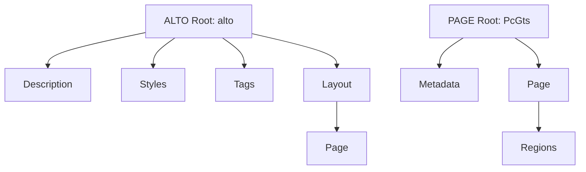

# 📊 ตารางเปรียบเทียบ Tag: PAGE XML vs ALTO XML — ฉบับสมบูรณ์

> [!NOTE]
> เอกสารฉบับนี้จัดทำขึ้นเพื่อเปรียบเทียบความแตกต่างระหว่างสองมาตรฐาน XML ที่ได้รับความนิยมสูงสุดในงาน OCR (Optical Character Recognition) และ HTR (Handwritten Text Recognition) ได้แก่ **PAGE XML** และ **ALTO XML** อย่างละเอียดแบบเจาะลึก 
> ทุกโครงสร้างและ Element ได้รับการเปรียบเทียบเพื่อให้เห็นภาพว่ามาตรฐานใดเหมาะสมกับกระบวนการใดมากที่สุด ทั้งในมุมมองของการพัฒนาโมเดล AI และการจัดการห้องสมุดดิจิทัลขนาดใหญ่

## สารบัญ

1. [เปรียบเทียบโครงสร้างหลัก (Root/Top-level)](#1-เปรียบเทียบโครงสร้างหลัก-roottop-level)
2. [เปรียบเทียบ Page Structure](#2-เปรียบเทียบ-page-structure)
3. [เปรียบเทียบ Region/Block Types](#3-เปรียบเทียบ-regionblock-types)
4. [เปรียบเทียบ Text Content Hierarchy](#4-เปรียบเทียบ-text-content-hierarchy)
5. [เปรียบเทียบระบบพิกัด (Coordinate System)](#5-เปรียบเทียบระบบพิกัด-coordinate-system)
6. [เปรียบเทียบ Metadata & Processing](#6-เปรียบเทียบ-metadata--processing)
7. [เปรียบเทียบ Reading Order](#7-เปรียบเทียบ-reading-order)
8. [ตัวอย่าง Side-by-Side: เอกสารเดียวกัน 2 รูปแบบ](#8-ตัวอย่าง-side-by-side-เอกสารเดียวกัน-2-รูปแบบ)
9. [สรุป: Element ที่มีเฉพาะ ALTO](#9-สรุป-element-ที่มีเฉพาะ-alto)
10. [สรุป: Element ที่มีเฉพาะ PAGE](#10-สรุป-element-ที่มีเฉพาะ-page)
11. [แหล่งอ้างอิง](#แหล่งอ้างอิง)

---

## 1. เปรียบเทียบโครงสร้างหลัก (Root/Top-level)

โครงสร้างระดับบนสุดของทั้งสองรูปแบบแสดงให้เห็นถึงวิธีคิดที่แตกต่างกัน โดย ALTO จะแบ่งส่วนต่าง ๆ ออกจากกันชัดเจน (Metadata, Styles, Tags, Layout) ในขณะที่ PAGE มักจะรวมข้อมูลเข้าด้วยกันภายในโครงสร้างหน้าที่ยืดหยุ่นกว่า



| ALTO Element | PAGE Element | คำอธิบาย | หมายเหตุ |
| :--- | :--- | :--- | :--- |
| `<alto>` | `<PcGts>` | Root element ของเอกสาร | `PcGts` ย่อมาจาก Page Content Ground Truth and Storage |
| `<Description>` | `<Metadata>` | ส่วนจัดเก็บข้อมูลเมตาดาต้า เช่น ผู้สร้างโปรแกรม, วันที่, ขั้นตอนประมวลผล | ALTO มีโครงสร้างย่อยในนี้ซับซ้อนกว่า PAGE อย่างมาก โดยสามารถระบุขั้นตอนการประมวลผลแยกกันได้ชัดเจน |
| `<Styles>` | *(ไม่มี Element เทียบเท่า)* | ส่วนกำหนดรูปแบบข้อความ (Font, Size, Color) และย่อหน้า | PAGE ไม่มีโครงสร้างสำหรับเก็บข้อมูลเชิง Visual Style แบบรวมศูนย์ เนื่องจากมองว่าเน้นที่ข้อมูลที่สกัดออกมามากกว่ารูปแบบการแสดงผล |
| `<Tags>` | *(ไม่มี Element เทียบเท่า)* | ส่วนกำหนดป้ายกำกับต่างๆ (Layout, Structure, Role, NamedEntity) | ALTO (v4+) ใช้สำหรับกำหนดโครงสร้างเชิงลึก ซึ่งพัฒนาขึ้นมารองรับความต้องการของนักพัฒนาที่ต้องการทำ Labeling แบบอิสระ |
| `<Layout>` | *(ไม่มี Element แยกเฉพาะ)* | คอนเทนเนอร์หลักสำหรับเก็บข้อมูลหน้าเอกสารทั้งหมด | PAGE ใช้ `<Page>` เป็น child ของ `<PcGts>` โดยตรง ทำให้โครงสร้างแบนราบกว่าในระดับบน |
| `<Page>` | `<Page>` | คอนเทนเนอร์ย่อยสำหรับข้อมูลใน 1 หน้าเอกสาร | ทั้งคู่มี Element ชื่อนี้ แต่อยู่ใน Hierarchy ที่ต่างกัน ALTO ซ้อนใต้ Layout เสมอ |

> [!IMPORTANT]
> โครงสร้างหลักของ ALTO มีลักษณะเป็น **Flat Layout** ในแง่ของการจัดการเนื้อหา แต่มีความซับซ้อนในส่วนหัว ในขณะที่ PAGE เป็น **Hierarchical Layout** แบบฝังลึกเข้าไปตั้งแต่เริ่มต้น ซึ่งสอดคล้องกับแนวคิดของ Layout Analysis

---

## 2. เปรียบเทียบ Page Structure

การแบ่งพื้นที่ในแต่ละหน้า เป็นจุดที่แตกต่างกันอย่างมาก ALTO เน้นไปที่การตีกรอบหน้ากระดาษแบบคลาสสิก (มี Margin) ส่วน PAGE เน้นขอบเขตที่ยืดหยุ่นด้วยรูปหลายเหลี่ยม (Polygon) ซึ่งเหมาะกับเอกสารทางประวัติศาสตร์ที่มีรอยขาดหรือรูปทรงไม่แน่นอน

| คุณสมบัติ / ข้อมูล | ALTO Element / Attribute | PAGE Element / Attribute | คำอธิบายความแตกต่าง |
| :--- | :--- | :--- | :--- |
| **ขนาดไฟล์ภาพ (กว้างxสูง)** | `WIDTH`, `HEIGHT` (attributes ใน `<Page>`) | `imageWidth`, `imageHeight` (attributes ใน `<Page>`) | ใช้ระบุขนาดของภาพต้นฉบับทั้งคู่ แต่ใช้ชื่อแอตทริบิวต์ต่างกัน |
| **ชื่อไฟล์ภาพต้นฉบับ** | `<fileName>` (อยู่ใน `<sourceImageInformation>`) | `imageFilename` (attribute ใน `<Page>`) | PAGE เก็บไว้ที่แอตทริบิวต์ของหน้าเลย ทำให้เข้าถึงได้เร็วกว่าเมื่อต้องอ่านไฟล์ทีละหน้า โดยไม่ต้องไปแกะจาก Description ย่อย |
| **ขอบกระดาษ (Margins)** | `<TopMargin>`, `<BottomMargin>`, `<LeftMargin>`, `<RightMargin>` | *(ไม่มี Element เทียบเท่า)* | ALTO สามารถแบ่งระยะขอบแยกออกจากพื้นที่พิมพ์ได้ชัดเจน เป็นมรดกจากการเน้นสิ่งพิมพ์มาตรฐาน |
| **พื้นที่เนื้อหาหลัก** | `<PrintSpace>` | `<Border>` | ALTO ถือว่าเป็นกล่องสี่เหลี่ยมด้านในขอบ, PAGE ใช้ Polygon (Coords) กำหนดขอบเขตพื้นที่พิมพ์ได้อิสระ ซึ่งเป็นประโยชน์เมื่อกระดาษฉีกขาด |
| **ภาพทางเลือก (Alternative)**| *(ไม่มี Element มาตรฐาน)* | `<AlternativeImage>` | PAGE รองรับการแนบภาพที่ผ่านการ Binarized หรือ Deskew แล้วในหน้าเดียวกัน ซึ่งมีประโยชน์ต่อโมเดล Machine Learning มาก |
| **ลำดับภาพหน้า** | `PHYSICAL_IMG_NR`, `PRINTED_IMG_NR` | *(ต้องใช้ Custom Metadata)* | ALTO เน้นการผูกโยงข้อมูลหน้าที่พิมพ์กับหน้าที่สแกน (เช่น หน้าสแกนที่ 5 คือหน้า 3 ของหนังสือ) ซึ่งห้องสมุดดิจิทัลต้องใช้งานประจำ |
| **ความแม่นยำของหน้า** | `ACCURACY` | *(ไม่มี Element โดยตรง)* | ALTO มีแอตทริบิวต์เก็บความแม่นยำโดยรวมของ OCR ทั่วทั้งหน้า |
| **การระบุภาษา** | `LANG`, `OTHERLANGS` | *(ใช้ custom attributes)* | ALTO v4.4 รองรับหลายภาษาในระดับหน้าได้ดีกว่า โดยสามารถระบุ `OTHERLANGS` สำหรับภาษาแทรกได้ (เช่น ภาษาหลักคือไทย แต่มีภาษาอังกฤษแทรก) |
| **การหมุนภาพ** | `ROTATION` | *(ประยุกต์ใช้ Coords และ orientation)* | ALTO v4.4 รองรับการเก็บค่ามุมการหมุนหน้ากระดาษได้โดยตรง ทำให้ซอฟต์แวร์สามารถปรับภาพกลับได้ก่อนประมวลผล |
| **ตัวอ้างอิงกระบวนการ** | `PROCESSINGREFS` | *(ไม่มี)* | ALTO สามารถระบุได้ว่าหน้านี้ผ่านกระบวนการอะไรมาบ้าง โดยอ้างอิงไปที่ ID ใน Processing step |

---

## 3. เปรียบเทียบ Region/Block Types

PAGE XML ถูกออกแบบมาเพื่อการจัดหมวดหมู่ Layout ย่อย (Layout Analysis) อย่างละเอียด จึงมี Region types ที่หลากหลายกว่ามาก ในขณะที่ ALTO เน้นบล็อกข้อความและภาพทั่วไป

| ชนิดข้อมูล / พื้นที่ | ALTO XML | PAGE XML | สรุปการเปรียบเทียบ |
| :--- | :--- | :--- | :--- |
| **บล็อกข้อความธรรมดา** | `<TextBlock>` | `<TextRegion>` | เป็น Element หลักที่ใช้งานบ่อยที่สุดในทั้งสองมาตรฐาน โครงสร้างภายในจะบรรจุบรรทัดข้อความ |
| **ประเภทย่อยของข้อความ** | ระบุผ่าน `<StructureTag>` / `TAGREFS` | `type` attribute | PAGE มี Sub-types มาตรฐานในตัวถึง 18 แบบ (เช่น `heading`, `paragraph`, `caption`, `header`, `footer`, `page-number`, `drop-capital`, `credit`, `floating`, `signature-mark`, `catch-word`, `marginalia`, `footnote`, `footnote-continued`, `endnote`, `TOC-entry`, `list-label`, `other`) ส่วน ALTO ต้องประกาศ Tag เอง ทำให้ขาดมาตรฐานกลาง |
| **รูปภาพทั่วไป** | `<Illustration>` | `<ImageRegion>` | จุดประสงค์เดียวกัน เพื่อรวมพิกัดของภาพประกอบหรือรูปถ่าย |
| **รูปวาดลายเส้น** | `<GraphicalElement>` | `<LineDrawingRegion>` | จุดประสงค์เดียวกัน แต่ PAGE ตั้งชื่อชัดเจนกว่าแยกออกจากภาพที่เป็นภาพสีหรือภาพถ่าย |
| **บล็อกผสม (หลายชนิด)** | `<ComposedBlock>` | *(ใช้ TextRegion ครอบทับ)* | ALTO มีโครงสร้างรวมบล็อกได้ชัดเจนกว่า ทำให้รวม TextBlock และ Illustration ให้อยู่ใต้ ComposedBlock ตัวเดียวกันได้ เหมาะกับกล่องข้อความที่มีภาพประกอบ |
| **ตาราง** | *(ประยุกต์ใช้ ComposedBlock)* | `<TableRegion>` | PAGE รองรับตารางแบบ Native ช่วยให้ทำ Table Structure Recognition (TSR) ได้ดีกว่า และสามารถกำหนด Cell ย่อยได้ |
| **กราฟ / แผนภูมิ** | *(ใช้ Illustration)* | `<ChartRegion>` | PAGE แยกชัดเจนจากภาพถ่าย มีประโยชน์สำหรับเอกสารวิชาการ และสามารถประมวลผลต่อด้วย Chart Analysis |
| **สูตรคณิตศาสตร์** | *(ไม่มี Native)* | `<MathsRegion>` | PAGE รองรับ Native ซึ่งโมเดลอย่าง LayoutParser นิยมใช้ในการแยกสมการออกจากข้อความปกติ |
| **สมการเคมี** | *(ไม่มี Native)* | `<ChemRegion>` | PAGE รองรับ Native เหมาะสำหรับเอกสารทางวิทยาศาสตร์ |
| **โน้ตเพลง** | *(ไม่มี Native)* | `<MusicRegion>` | PAGE รองรับ Native สำหรับ OMR (Optical Music Recognition) ซึ่งหายากมากในมาตรฐานอื่น |
| **เส้นคั่น / เส้นแบ่ง** | `<GraphicalElement>` | `<SeparatorRegion>` | PAGE แยกหมวดหมู่ออกมาเฉพาะสำหรับการประมวลผลเส้นแบ่งคอลัมน์ หรือเส้นคั่นบทความ |
| **โฆษณา** | *(ไม่มี Native)* | `<AdvertRegion>` | PAGE มีเฉพาะสำหรับหนังสือพิมพ์และนิตยสาร เพื่อให้ง่ายต่อการวิเคราะห์ Layout |
| **แผนที่** | *(ไม่มี Native)* | `<MapRegion>` | PAGE รองรับ Map แยกจาก Image ปกติ ซึ่งแผนที่มักต้องการกระบวนการสกัดข้อมูลเฉพาะ |
| **จุดที่มีสัญญาณรบกวน** | *(ไม่มี Native)* | `<NoiseRegion>` | PAGE ใช้ประโยชน์ในการทำ Ground Truth ได้ดี เพื่อระบุว่าส่วนนี้คือหมึกเลอะ ไม่ใช่ข้อความ ทำให้ AI ไม่พยายามอ่านบริเวณนั้น |
| **บริเวณที่กำหนดเอง** | *(ไม่มี Native)* | `<CustomRegion>` | PAGE รองรับการเพิ่มข้อมูลที่หลุดจากมาตรฐานทั่วไป ให้ยืดหยุ่นขึ้น |
| **บริเวณที่ไม่รู้จัก** | *(ไม่มี Native)* | `<UnknownRegion>` | PAGE จัดการพื้นที่ที่ระบบ AI ค้นพบแต่ไม่สามารถจำแนกประเภทได้ |

> [!TIP]
> หากโปรเจกต์ของคุณเป็นเอกสารวิชาการที่มีสูตรคณิตศาสตร์ (Math) โน้ตเพลง (Music) หรือตารางซับซ้อน **PAGE XML** เป็นตัวเลือกที่เหมาะสมกว่าเนื่องจากมี Region Types ที่รองรับโดยตรง ทำให้ไม่ต้องพึ่งพา Custom Attributes ที่อาจจะไม่เข้ากัน (Incompatible) กับซอฟต์แวร์ตัวอื่น

---

## 4. เปรียบเทียบ Text Content Hierarchy

ลำดับขั้นของข้อความ เป็นหัวใจหลักของการเก็บข้อมูล OCR / HTR ทั้งสองมาตรฐานมีลำดับขั้นที่คล้ายกัน แต่จุดที่ต่างกันคือการจัดการคำ (Word) และองค์ประกอบย่อยอื่นๆ

| ระดับของข้อความ | ALTO XML | PAGE XML | ข้อสังเกต |
| :--- | :--- | :--- | :--- |
| **ระดับบรรทัด** | `<TextLine>` | `<TextLine>` | เหมือนกัน เป็นระดับการตรวจจับที่ได้รับความนิยมสูงสุดใน HTR engines ในปัจจุบัน ทั้งคู่รองรับ Baseline ได้ |
| **ระดับคำ** | `<String>` | `<Word>` | ALTO ใช้คำว่า String และสามารถใส่ช่องว่างระหว่างคำด้วย `<SP>` ส่วน PAGE มองเป็น Word ล้วนๆ ช่องว่างมักจะถูกรวมอยู่กับ Coords แทน |
| **ระดับตัวอักษร** | `<Glyph>` | `<Glyph>` | เป็นตัวอักษรเดี่ยวๆ ทั้งสองรองรับตั้งแต่เวอร์ชันใหม่ๆ เหมาะกับการทำแบบจำลองระดับอักขระ (Character-level Models) |
| **การเชื่อมคำ (ยัติภังค์)** | `<HYP>` | *(ไม่มี Native)* | ALTO จัดการคำที่ถูกตัดข้ามบรรทัดได้ดีมากด้วย HYP ทำให้เนื้อหาต่อเนื่องกันเวลา Export เป็น Text แบบไหลยาว |
| **ตัวเลือกอักขระสำรอง** | `<Variant>` (v4.0+) | *(ไม่มี Native, ใช้ระดับ TextEquiv)*| ALTO v4 ให้ทางเลือกอักขระย่อยกรณี OCR ไม่แน่ใจ (เช่น 'l' กับ '1' ที่โมเดลให้คะแนนใกล้เคียงกัน) ทำให้ผู้ใช้หรือ Post-processing สลับแก้ได้ง่าย |
| **ข้อความที่สกัดได้** | `CONTENT` (attribute ใน String) | `<TextEquiv>` -> `<Unicode>` | ALTO เก็บเป็น Attribute ภายในแท็ก ทำให้ประหยัดบรรทัด ในขณะที่ PAGE เก็บเป็น Element แยก (TextEquiv) ซึ่งซ้อนกันได้หลายระดับ (เช่น TextEquiv ของ Word, ของ Line, ของ Region) ให้ความยืดหยุ่นสูงกว่า |
| **ความมั่นใจของ AI** | `WC` (Word Confidence), `CC` | `conf` (attribute ใน TextEquiv) | PAGE ใช้ conf (0.0 - 1.0) ในทุกระดับชั้น ส่วน ALTO มีแยก Word และ Character Confidence ชัดเจน เพื่อความแม่นยำในการวัดผล |
| **การจัดการ Substitution**| `SUBS_TYPE`, `SUBS_CONTENT` | *(ใช้ custom)* | ALTO สามารถจัดการกับการแทนที่ตัวอักษรที่เป็นตัวย่อ หรือพิมพ์ผิด ได้ในระดับ String โดยตรง (เช่น ถอดความคำย่อโบราณ) |
| **ข้อความธรรมดา (Plain Text)** | *(ไม่มี Element นี้)* | `<PlainText>` | PAGE มีโหนด PlainText ภายใต้ TextEquiv เพิ่มเติมเพื่อแยกข้อความดิบออกจากข้อความแบบ Unicode |

---

## 5. เปรียบเทียบระบบพิกัด (Coordinate System)

หนึ่งในความแตกต่างที่ใหญ่ที่สุดที่มีผลต่อความแม่นยำในการรู้จำข้อความ คือวิธีการจัดเก็บพิกัดของวัตถุ 

| คุณสมบัติระบบพิกัด | ALTO XML | PAGE XML | บทวิเคราะห์ |
| :--- | :--- | :--- | :--- |
| **รูปแบบรูปทรงหลัก** | **Bounding Box** สี่เหลี่ยม | **Polygon** รูปหลายเหลี่ยม | PAGE มีความแม่นยำกว่ามากสำหรับเอกสารที่เบี้ยว หน้ากระดาษโค้งงอ (Dewarping) หรือลายมือที่ทับซ้อนกัน |
| **แอตทริบิวต์พิกัด** | `HPOS`, `VPOS`, `WIDTH`, `HEIGHT` | `points="x1,y1 x2,y2 x3,y3..."` | ALTO ใช้ 4 แอตทริบิวต์ (X, Y, กว้าง, สูง) ทำให้ขนาดไฟล์เล็กกว่า และอ่านด้วยตาเปล่าเข้าใจง่าย PAGE ใช้คู่จุดพิกัดเรียงต่อกันซึ่งคอมพิวเตอร์สร้างได้ไม่จำกัดจำนวนจุด |
| **Element สำหรับพิกัด** | `<Polygon>`, `<Ellipse>`, `<Circle>` | `<Coords>` | ALTO เพิ่ม Polygon เข้ามาในเวอร์ชันหลัง (v4) เพื่อแก้ปัญหาความแม่นยำ แต่โครงสร้างหลักยังผูกกับ Bounding Box และยังมีรูปทรงเรขาคณิตอื่นๆ |
| **เส้นฐานข้อความ (Baseline)**| `BASELINE` (attribute หรือ points ใน v4.2+) | `<Baseline>` (element ลูกของ TextLine)| ALTO v4.2+ รองรับ Baseline แบบรายการพิกัด (list of points) คล้ายกับที่ PAGE มีมานานแล้ว ซึ่งเส้นฐานนี้มีความสำคัญยิ่งต่อ HTR เนื่องจาก HTR รุ่นใหม่มักอิงจากเส้นฐานเป็นหลัก |
| **หน่วยวัดหลัก** | Pixel, mm10 (1/10 mm), inch1200 | Pixel (มาตรฐานโดยปริยาย) | ALTO สามารถระบุหน่วยวัดได้ชัดเจนใน `<MeasurementUnit>` ทำให้รองรับงานที่ต้องการความถูกต้องเชิงกายภาพ และประมวลผลขนาดจริงได้แม่นยำ |
| **การระบุทิศทางข้อความ** | `BASEDIRECTION` (v4.3+) | *(ต้องอ้างอิงผ่านโครงสร้างพิกัด/custom)*| ALTO v4.3 เพิ่งเพิ่มการระบุทิศทางการอ่านในระดับ Line เข้ามา รองรับเอกสารภาษาที่เขียนจากขวาไปซ้าย (RTL) หรือ บนลงล่าง ได้ดียิ่งขึ้น |

> [!CAUTION]
> การแปลง PAGE XML กลับไปเป็น ALTO XML (โดยเฉพาะเวอร์ชันเก่าที่ยังไม่ใช้ Polygon อย่างสมบูรณ์) มักส่งผลให้เกิดปัญหา **Text Drift** เนื่องจากต้องแปลง Polygon ที่ซับซ้อนให้กลายเป็น Bounding Box สี่เหลี่ยม ทำให้พิกัดความแม่นยำลดลง การครอบตัดอาจทำให้อักขระแหว่ง หรือเกิดความเหลื่อมล้ำของข้อมูล

---

## 6. เปรียบเทียบ Metadata & Processing

การเก็บประวัติที่มาที่ไปของเอกสาร (Provenance) และซอฟต์แวร์ที่ใช้ เป็นสิ่งที่สำคัญต่อเอกสารวิชาการ เพื่อตรวจสอบย้อนกลับ (Traceability)

| หมวดหมู่ข้อมูล | ALTO XML | PAGE XML | ความสามารถ |
| :--- | :--- | :--- | :--- |
| **ประวัติการประมวลผล** | `<Processing>` (pre/ocr/post) | `<Metadata>` (Creator/LastChange) | ALTO เก็บประวัติของแต่ละขั้นตอนได้ละเอียดกว่า (เช่น โปรแกรม A ทำ Binarization, โปรแกรม B ทำ OCR, โปรแกรม C ทำ NER) PAGE จะรวมไว้เป็นก้อนเดียว เน้นที่เครื่องมือล่าสุดที่ทำการสร้าง |
| **ข้อมูลซอฟต์แวร์** | `<processingSoftware>` | `Creator` | ALTO แยกรายละเอียดชื่อ (`<softwareName>`), เวอร์ชัน (`<softwareVersion>`), บริษัทผู้ผลิต (`<softwareCreator>`) และรายละเอียดโปรแกรม (`<applicationDescription>`) ได้ดีกว่ามาก |
| **การอ้างอิง Tag** | `TAGREFS` attribute | `custom` attribute | ALTO ใช้ ID reference ชี้ไปยัง `<Tags>` ด้านบน ทำให้ระบบมีความ Relational ส่วน PAGE นิยมใช้ JSON/String แฝงในแอตทริบิวต์ custom ที่ Parser ต้องใช้ความสามารถในการแกะออกมาอ่าน |
| **เลเยอร์ของเอกสาร** | *(ไม่มี Native)* | `<Layers>` | PAGE สามารถกำหนดกลุ่มของ Regions เป็นเลเยอร์ๆ ได้ มีประโยชน์ในการทำ Visualization หรือกรองข้อมูลการแสดงผลที่ซับซ้อน |
| **Named Entities** | `<NamedEntityTag>` | *(ใช้ custom)* | ALTO รองรับ NER (Person, Location, Org) ในตัว เหมาะกับงาน NLP การระบุชื่อบุคคลในจดหมายเหตุทำได้ง่ายมากผ่านโครงสร้างนี้ |
| **การอ้างอิงสไตล์** | `STYLEREFS` attribute | *(ใช้ custom)* | ALTO สามารถโยง String หรือ TextLine ไปยังรูปแบบฟอนต์ที่กำหนดไว้ได้โดยตรง |

---

## 7. เปรียบเทียบ Reading Order

ลำดับการอ่านมีความสำคัญอย่างยิ่งสำหรับเอกสารที่มีหลายคอลัมน์ (เช่น หนังสือพิมพ์) หรือเอกสารที่มีการแทรกรูปภาพหรือขอบคติ (Marginalia) หากจัดลำดับผิด ข้อความที่ Export ออกมาจะอ่านไม่รู้เรื่อง

| ฟีเจอร์การอ่าน | ALTO XML (v4.3+) | PAGE XML | สรุปเปรียบเทียบ |
| :--- | :--- | :--- | :--- |
| **Element หลัก** | `<ReadingOrder>` (ภายใน Page) | `<ReadingOrder>` (ภายใน Page) | ทั้งสองใช้โครงสร้างที่คล้ายกันมาก (ALTO รับแรงบันดาลใจจาก PAGE เข้ามาในเวอร์ชัน 4.3 เพื่อแก้ไขข้อบกพร่องเก่า) |
| **การจัดกลุ่มตามลำดับ** | `<OrderedGroup>` | `<OrderedGroup>` | ใช้ระบุว่าบล็อกข้างในต้องอ่านเรียง 1-2-3-4 ตามลำดับ เหมาะกับคอลัมน์ทั่วไป และข้อความหลัก |
| **การจัดกลุ่มไม่เรียงลำดับ**| `<UnorderedGroup>` | `<UnorderedGroup>` | ใช้ระบุบล็อกที่อยู่ในกลุ่มเดียวกันแต่ไม่ต้องเรียงลำดับ เช่น การจัดกลุ่มของรูปภาพแคปชั่นและรูปภาพหลัก ที่สามารถอ่านก่อนหรือหลังข้อความข้างเคียงก็ได้ ไม่ทำให้ความหมายเสีย |
| **การอ้างอิงถึงชิ้นส่วน** | `<ElementRef>` | `<RegionRefIndexed>`, `<RegionRef>`| ALTO ใช้ ElementRef โยงไปยัง ID ของ TextBlock, PAGE โยงไปที่ ID ของ Region พร้อมกำหนด Index ชัดเจน |
| **ความสัมพันธ์อื่นๆ** | *(ใช้ TAGREFS โยงหาโครงสร้าง)* | `<Relations>` | PAGE สามารถกำหนดความสัมพันธ์แบบ Link/Join ระหว่าง Region ได้อิสระ ตัวอย่างเช่น การข้ามคอลัมน์ หรือบทความที่กระโดดข้ามหน้าไปต่อหน้าอื่น |
| **ลำดับโดยปริยาย** | แบบ Hierarchical Nesting สมัยก่อน | อาศัย ReadingOrder เป็นหลัก | ก่อน v4.3, ALTO ใช้การอ่านเรียงตามลำดับโครงสร้าง XML (Top to Bottom) เป็นหลักในการประมวลผลลำดับการอ่าน |

---

## 8. ตัวอย่าง Side-by-Side: เอกสารเดียวกัน 2 รูปแบบ

เพื่อให้เห็นภาพที่ชัดเจนที่สุด เราจะสร้างเอกสารสมมติ 2 แบบ:
1. **แบบทั่วไป:** มี Heading 1 บรรทัด, Paragraph 2 บรรทัด, Image 1 รูป, และ Separator 1 เส้น
2. **แบบมีตาราง:** มีตารางข้อมูลเล็กๆ เพื่อแสดงความซับซ้อนของ PAGE XML

### 8.1 เอกสารทั่วไป

#### 📄 ตัวอย่างแบบ ALTO XML (เวอร์ชัน 4.4)

```xml
<?xml version="1.0" encoding="UTF-8"?>
<alto xmlns="http://www.loc.gov/standards/alto/v4/alto-4-4.xsd"
      xmlns:xsi="http://www.w3.org/2001/XMLSchema-instance"
      xsi:schemaLocation="http://www.loc.gov/standards/alto/v4/alto-4-4.xsd http://www.loc.gov/standards/alto/v4/alto-4-4.xsd">
    <Description>
        <MeasurementUnit>pixel</MeasurementUnit>
        <sourceImageInformation>
            <fileName>sample_page_01.tif</fileName>
        </sourceImageInformation>
        <Processing>
            <ocrProcessingStep>
                <processingSoftware>
                    <softwareName>Tesseract OCR</softwareName>
                    <softwareVersion>5.3.0</softwareVersion>
                </processingSoftware>
            </ocrProcessingStep>
        </Processing>
    </Description>
    <Styles>
        <TextStyle ID="font_heading" FONTFAMILY="Arial" FONTSIZE="24" FONTSTYLE="bold"/>
        <TextStyle ID="font_para" FONTFAMILY="Times New Roman" FONTSIZE="12"/>
    </Styles>
    <Tags>
        <StructureTag ID="tag_heading" LABEL="heading"/>
        <StructureTag ID="tag_para" LABEL="paragraph"/>
    </Tags>
    <Layout>
        <Page ID="page_1" PHYSICAL_IMG_NR="1" WIDTH="1000" HEIGHT="2000">
            
            <!-- เพิ่ม Reading Order ใน ALTO v4.3+ -->
            <ReadingOrder>
                <OrderedGroup ID="ro_1">
                    <ElementRef IDREF="tb_1"/>
                    <ElementRef IDREF="tb_2"/>
                </OrderedGroup>
            </ReadingOrder>
            
            <PrintSpace ID="ps_1" HPOS="50" VPOS="50" WIDTH="900" HEIGHT="1900">
                
                <!-- Heading Block -->
                <TextBlock ID="tb_1" HPOS="100" VPOS="100" WIDTH="800" HEIGHT="50" TAGREFS="tag_heading">
                    <TextLine ID="tl_1" HPOS="100" VPOS="100" WIDTH="800" HEIGHT="50" BASELINE="140">
                        <String ID="str_1" HPOS="100" VPOS="100" WIDTH="800" HEIGHT="50" CONTENT="The History of Digitization" STYLEREFS="font_heading" WC="0.99"/>
                    </TextLine>
                </TextBlock>
                
                <!-- Separator Line -->
                <GraphicalElement ID="ge_1" HPOS="100" VPOS="180" WIDTH="800" HEIGHT="5"/>
                
                <!-- Paragraph Block with 2 lines -->
                <TextBlock ID="tb_2" HPOS="100" VPOS="200" WIDTH="800" HEIGHT="80" TAGREFS="tag_para">
                    <TextLine ID="tl_2" HPOS="100" VPOS="200" WIDTH="800" HEIGHT="30" BASELINE="225">
                        <String ID="str_2" HPOS="100" VPOS="200" WIDTH="390" HEIGHT="30" CONTENT="Digitization has completely" STYLEREFS="font_para" WC="0.98"/>
                        <SP HPOS="490" VPOS="200" WIDTH="10"/>
                        <String ID="str_3" HPOS="500" VPOS="200" WIDTH="400" HEIGHT="30" CONTENT="transformed how libraries" STYLEREFS="font_para" WC="0.97"/>
                    </TextLine>
                    <TextLine ID="tl_3" HPOS="100" VPOS="250" WIDTH="800" HEIGHT="30" BASELINE="275">
                        <String ID="str_4" HPOS="100" VPOS="250" WIDTH="800" HEIGHT="30" CONTENT="preserve historical documents." STYLEREFS="font_para" WC="0.99"/>
                    </TextLine>
                </TextBlock>
                
                <!-- Illustration -->
                <Illustration ID="ill_1" HPOS="100" VPOS="350" WIDTH="800" HEIGHT="600"/>
                
            </PrintSpace>
        </Page>
    </Layout>
</alto>
```

#### 📄 ตัวอย่างแบบ PAGE XML (เวอร์ชัน 2024-07-15)

```xml
<?xml version="1.0" encoding="UTF-8"?>
<PcGts xmlns="http://schema.primaresearch.org/PAGE/gts/pagecontent/2024-07-15"
       xmlns:xsi="http://www.w3.org/2001/XMLSchema-instance"
       xsi:schemaLocation="http://schema.primaresearch.org/PAGE/gts/pagecontent/2024-07-15 http://schema.primaresearch.org/PAGE/gts/pagecontent/2024-07-15/pagecontent.xsd">
    <Metadata>
        <Creator>Kraken HTR</Creator>
        <Created>2026-06-03T18:00:00</Created>
        <LastChange>2026-06-03T18:05:00</LastChange>
    </Metadata>
    <Page imageFilename="sample_page_01.tif" imageWidth="1000" imageHeight="2000">
        
        <ReadingOrder>
            <OrderedGroup id="ro_1">
                <RegionRefIndexed index="0" regionRef="tr_1"/>
                <RegionRefIndexed index="1" regionRef="sr_1"/>
                <RegionRefIndexed index="2" regionRef="tr_2"/>
                <RegionRefIndexed index="3" regionRef="ir_1"/>
            </OrderedGroup>
        </ReadingOrder>

        <!-- Heading TextRegion -->
        <TextRegion id="tr_1" type="heading">
            <Coords points="100,100 900,100 900,150 100,150"/>
            <TextLine id="tl_1">
                <Coords points="100,100 900,100 900,150 100,150"/>
                <Baseline points="100,140 900,140"/>
                <Word id="w_1">
                    <Coords points="100,100 900,100 900,150 100,150"/>
                    <TextEquiv conf="0.99">
                        <Unicode>The History of Digitization</Unicode>
                    </TextEquiv>
                </Word>
                <TextEquiv conf="0.99">
                    <Unicode>The History of Digitization</Unicode>
                </TextEquiv>
            </TextLine>
            <TextEquiv>
                <Unicode>The History of Digitization</Unicode>
            </TextEquiv>
        </TextRegion>

        <!-- SeparatorRegion -->
        <SeparatorRegion id="sr_1">
            <Coords points="100,180 900,180 900,185 100,185"/>
        </SeparatorRegion>

        <!-- Paragraph TextRegion with 2 lines -->
        <TextRegion id="tr_2" type="paragraph">
            <Coords points="100,200 900,200 900,280 100,280"/>
            <TextLine id="tl_2">
                <Coords points="100,200 900,200 900,230 100,230"/>
                <Baseline points="100,225 900,225"/>
                <Word id="w_2">
                    <Coords points="100,200 490,200 490,230 100,230"/>
                    <TextEquiv conf="0.98"><Unicode>Digitization has completely</Unicode></TextEquiv>
                </Word>
                <Word id="w_3">
                    <Coords points="500,200 900,200 900,230 500,230"/>
                    <TextEquiv conf="0.97"><Unicode>transformed how libraries</Unicode></TextEquiv>
                </Word>
                <TextEquiv conf="0.975">
                    <Unicode>Digitization has completely transformed how libraries</Unicode>
                </TextEquiv>
            </TextLine>
            <TextLine id="tl_3">
                <Coords points="100,250 900,250 900,280 100,280"/>
                <Baseline points="100,275 900,275"/>
                <Word id="w_4">
                    <Coords points="100,250 900,250 900,280 100,280"/>
                    <TextEquiv conf="0.99"><Unicode>preserve historical documents.</Unicode></TextEquiv>
                </Word>
                <TextEquiv conf="0.99">
                    <Unicode>preserve historical documents.</Unicode>
                </TextEquiv>
            </TextLine>
            <TextEquiv>
                <Unicode>Digitization has completely transformed how libraries
preserve historical documents.</Unicode>
            </TextEquiv>
        </TextRegion>

        <!-- ImageRegion -->
        <ImageRegion id="ir_1">
            <Coords points="100,350 900,350 900,950 100,950"/>
        </ImageRegion>

    </Page>
</PcGts>
```

### 8.2 เอกสารที่มีตาราง (Table Example)

เพื่อให้เห็นจุดเด่นของ PAGE XML ที่จัดการตารางได้เป็น Native Region ส่วน ALTO ต้องประยุกต์ใช้แบบ ComposedBlock หรือจัดเรียงเป็น TextBlock ธรรมดา

#### 📄 ตัวอย่างแบบ ALTO XML (จำลองตาราง 2x2)

```xml
        <!-- ALTO มักจะจำลองตารางผ่าน ComposedBlock แบบหลวมๆ หรือใช้ TextBlock ย่อยๆ ต่อกัน -->
```xml
<?xml version="1.0" encoding="UTF-8"?>
<alto xmlns="http://www.loc.gov/standards/alto/v4/alto-4-4.xsd"
      xmlns:xsi="http://www.w3.org/2001/XMLSchema-instance"
      xsi:schemaLocation="http://www.loc.gov/standards/alto/v4/alto-4-4.xsd http://www.loc.gov/standards/alto/v4/alto-4-4.xsd">
    <Description>
        <MeasurementUnit>pixel</MeasurementUnit>
        <sourceImageInformation>
            <fileName>table_page.png</fileName>
        </sourceImageInformation>
    </Description>
    <Layout>
        <Page ID="page_1" PHYSICAL_IMG_NR="1" WIDTH="1000" HEIGHT="1500">
            <PrintSpace ID="ps_1" HPOS="50" VPOS="50" WIDTH="900" HEIGHT="1400">
                <ComposedBlock ID="cb_table" HPOS="100" VPOS="1000" WIDTH="800" HEIGHT="200">
                    <!-- Table Header Row -->
                    <TextBlock ID="tb_r1_c1" HPOS="100" VPOS="1000" WIDTH="400" HEIGHT="100">
                        <TextLine ID="tl_t1" HPOS="100" VPOS="1000" WIDTH="400" HEIGHT="100">
                            <String ID="st_t1" HPOS="100" VPOS="1000" WIDTH="400" HEIGHT="100" CONTENT="Year"/>
                        </TextLine>
                    </TextBlock>
                    <TextBlock ID="tb_r1_c2" HPOS="500" VPOS="1000" WIDTH="400" HEIGHT="100">
                        <TextLine ID="tl_t2" HPOS="500" VPOS="1000" WIDTH="400" HEIGHT="100">
                            <String ID="st_t2" HPOS="500" VPOS="1000" WIDTH="400" HEIGHT="100" CONTENT="Events"/>
                        </TextLine>
                    </TextBlock>
                    <!-- Table Data Row -->
                    <TextBlock ID="tb_r2_c1" HPOS="100" VPOS="1100" WIDTH="400" HEIGHT="100">
                        <TextLine ID="tl_t3" HPOS="100" VPOS="1100" WIDTH="400" HEIGHT="100">
                            <String ID="st_t3" HPOS="100" VPOS="1100" WIDTH="400" HEIGHT="100" CONTENT="2010"/>
                        </TextLine>
                    </TextBlock>
                    <TextBlock ID="tb_r2_c2" HPOS="500" VPOS="1100" WIDTH="400" HEIGHT="100">
                        <TextLine ID="tl_t4" HPOS="500" VPOS="1100" WIDTH="400" HEIGHT="100">
                            <String ID="st_t4" HPOS="500" VPOS="1100" WIDTH="400" HEIGHT="100" CONTENT="PAGE XML was introduced."/>
                        </TextLine>
                    </TextBlock>
                </ComposedBlock>
            </PrintSpace>
        </Page>
    </Layout>
</alto>
```

#### 📄 ตัวอย่างแบบ PAGE XML (จำลองตาราง 2x2)

```xml
<?xml version="1.0" encoding="UTF-8"?>
<PcGts xmlns="http://schema.primaresearch.org/PAGE/gts/pagecontent/2024-07-15"
       xmlns:xsi="http://www.w3.org/2001/XMLSchema-instance"
       xsi:schemaLocation="http://schema.primaresearch.org/PAGE/gts/pagecontent/2024-07-15 http://schema.primaresearch.org/PAGE/gts/pagecontent/2024-07-15/pagecontent.xsd">
    <Metadata>
        <Creator>OCR-D Table Parser</Creator>
        <Created>2026-06-03T18:00:00</Created>
        <LastChange>2026-06-03T18:00:00</LastChange>
    </Metadata>
    <Page imageFilename="table_page.png" imageWidth="1000" imageHeight="1500">
        <!-- PAGE XML รองรับโครงสร้างตารางโดยตรงด้วย TableRegion -->
        <TableRegion id="table_1" rows="2" columns="2">
            <Coords points="100,1000 900,1000 900,1200 100,1200"/>
            <TableCell role="columnHeader" row="0" col="0" rowSpan="1" colSpan="1">
                <Coords points="100,1000 500,1000 500,1100 100,1100"/>
                <TextLine id="tl_t1">
                    <Coords points="105,1005 495,1005 495,1095 105,1095"/>
                    <TextEquiv><Unicode>Year</Unicode></TextEquiv>
                </TextLine>
            </TableCell>
            <TableCell role="columnHeader" row="0" col="1" rowSpan="1" colSpan="1">
                <Coords points="500,1000 900,1000 900,1100 500,1100"/>
                <TextLine id="tl_t2">
                    <Coords points="505,1005 895,1005 895,1095 505,1095"/>
                    <TextEquiv><Unicode>Events</Unicode></TextEquiv>
                </TextLine>
            </TableCell>
            <TableCell role="data" row="1" col="0" rowSpan="1" colSpan="1">
                <Coords points="100,1100 500,1100 500,1200 100,1200"/>
                <TextLine id="tl_t3">
                    <Coords points="105,1105 495,1105 495,1195 105,1195"/>
                    <TextEquiv><Unicode>2010</Unicode></TextEquiv>
                </TextLine>
            </TableCell>
            <TableCell role="data" row="1" col="1" rowSpan="1" colSpan="1">
                <Coords points="500,1100 900,1100 900,1200 500,1200"/>
                <TextLine id="tl_t4">
                    <Coords points="505,1105 895,1105 895,1195 505,1195"/>
                    <TextEquiv><Unicode>PAGE XML was introduced.</Unicode></TextEquiv>
                </TextLine>
            </TableCell>
        </TableRegion>
    </Page>
</PcGts>
```


### การวิเคราะห์ตัวอย่างเปรียบเทียบ (Annotations)
- **ระบบพิกัด (Coordinates):** จะเห็นได้ชัดเจนว่า ALTO ใช้ `HPOS`, `VPOS`, `WIDTH`, `HEIGHT` ทำให้กะทัดรัด แต่อ่านยากหากต้องการทรงเหลี่ยมแปลกๆ ส่วน PAGE ใช้ `<Coords points="...">` เป็นชุดพิกัด X,Y ซึ่งยาวกว่าแต่แม่นยำสูงกว่า และสอดคล้องกับพิกัด Baseline ของระบบ HTR ปัจจุบัน มากกว่า
- **การเก็บข้อมูลข้อความ (Text Storage):** ALTO เก็บข้อความไว้ในแอตทริบิวต์ `CONTENT` ของ `<String>` ทันที ทำให้ประหยัดบรรทัด ส่วน PAGE เก็บในโครงสร้าง `<TextEquiv><Unicode>` ซึ่งซ้อนกันลึกแต่รองรับความซับซ้อนได้มากกว่า และสามารถบรรจุข้อความไว้ในทุกระดับของชั้น (Word, Line, Region) เพื่อความสะดวกรวดเร็วเวลาใช้งานระดับต่างๆ
- **สไตล์ข้อความ (Text Styles):** ALTO มีการสร้าง `<Styles>` ด้านบน แล้วนำมาอ้างอิงผ่าน `STYLEREFS="font_heading"` ในบรรทัดหรือตัวอักษร ในขณะที่ PAGE ไม่มีแท็กนี้เลย หากต้องการกำหนดสไตล์ จะต้องไปพึ่งพาแอตทริบิวต์ custom ที่นักพัฒนาต้องตกลงกันเอง
- **ลำดับขั้นของบล็อก:** ALTO มี `<PrintSpace>` และ `<TextBlock>` เป็นคอนเทนเนอร์ PAGE ไม่มี PrintSpace แต่ใช้ `<TextRegion>` ลงไปถึง `<TextLine>` โดยตรง การประกาศประเภททำได้ผ่าน `type` โดยตรง ทำให้เข้าถึงง่าย
- **ช่องว่างและเครื่องหมายยัติภังค์:** ALTO มี `SP` เพื่อแบ่ง String ออกเป็นคำ ทำให้ชัดเจนในเรื่องของช่องไฟ
- **ความสามารถในการจัดการตาราง (Table):** ในตัวอย่างที่ 8.2 จะเห็นว่า PAGE มีความสามารถพื้นฐาน (Native) ที่ดีมากในการสร้าง `TableRegion` และซอยย่อยลงเป็น `TableCell` พร้อมกำหนดความกว้าง คอลัมน์ แถวได้เหมือน HTML ส่วน ALTO ต้องใช้การประยุกต์แบบหยาบๆ ซึ่งหากตารางมีความซับซ้อน ALTO จะประมวลผลได้ลำบากกว่ามาก

---

## 9. สรุป: Element ที่มีเฉพาะ ALTO

องค์ประกอบเหล่านี้เป็นจุดเด่นของ ALTO XML ที่ทำให้มันยังคงเป็นที่นิยมสำหรับโปรเจกต์หอสมุดและการเก็บข้อมูลเชิงประวัติศาสตร์อย่าง Chronicling America:

1. **`<Styles>` (`<TextStyle>`, `<ParagraphStyle>`)**: 
   - ระบบจัดการฟอนต์และย่อหน้าแบบรวมศูนย์ เหมาะมากสำหรับเก็บข้อมูลจากสิ่งพิมพ์โบราณที่มีการใช้ Font ขนาดต่างๆ กัน
2. **`<HYP>` (Hyphenation)**: 
   - จัดการคำที่ถูกตัดข้ามบรรทัดได้ (เช่น การใส่เครื่องหมายขีด - แล้วต่อคำอีกบรรทัด) ซึ่งพบได้บ่อยในหนังสือพิมพ์และสิ่งพิมพ์โบราณ
3. **`<SP>` (Space)**: 
   - การแยกช่องว่างระหว่างคำเป็น Element แยกต่างหาก ทำให้ทราบถึงช่องไฟหรือระยะห่างที่แน่ชัด
4. **`<PrintSpace>`, `<TopMargin>`, `<BottomMargin>`, `<LeftMargin>`, `<RightMargin>`**: 
   - การตีกรอบขอบกระดาษแบบฟิสิคัล ซึ่งมีผลดีในการตรวจสอบความเรียบร้อยของหน้ากระดาษเทียบกับงานพิมพ์จริง
5. **`<Processing>` แบบละเอียด**: 
   - การแยกขั้นตอน pre-processing, ocr-processing, post-processing อย่างชัดเจน ช่วยให้นักพัฒนาทราบถึงการเดินทางของข้อมูลผ่านท่อซอฟต์แวร์หลายตัว
6. **`<NamedEntityTag>`**: 
   - แท็กรองรับข้อมูล Named Entity Recognition (NER) เพื่อระบุชื่อคน สถานที่ องค์กร ช่วยเชื่อมโยงไปยัง Semantic Web ได้ง่าย
7. **`SUBS_TYPE`, `SUBS_CONTENT`**: 
   - การขยายคำย่อที่เกิดจากข้อจำกัดของการพิมพ์ในสมัยโบราณ รองรับงาน Transcription ได้ดี

---

## 10. สรุป: Element ที่มีเฉพาะ PAGE

องค์ประกอบเหล่านี้เป็นจุดเด่นที่ทำให้ PAGE XML ครองตลาดในวงการวิจัย HTR และ Layout Analysis สมัยใหม่ รวมถึงระบบเช่น OCR-D และ Transkribus:

1. **`<Coords>` (Polygon points)**: 
   - ความสามารถในการระบุจุดพิกัดอิสระรอบวัตถุแทนสี่เหลี่ยม ทำให้ครอบคลุมตัวอักษรที่เบี้ยว, เอียง, หรือซ้อนทับกันได้อย่างสมบูรณ์ โดยไม่สูญเสียความแม่นยำ
2. **`<TextEquiv>` ระดับลึก**: 
   - โครงสร้างที่รองรับ Text และ Confidence แยกกันในทุกระดับชั้น (ตั้งแต่ Word ขึ้นไปถึง Region) ซึ่งมีความสำคัญต่อการ Train โมเดล Deep Learning สมัยใหม่
3. **Region Types เฉพาะทางจำนวนมาก**: 
   - เช่น `<TableRegion>`, `<MathsRegion>`, `<ChemRegion>`, `<MusicRegion>`, `<ChartRegion>`, `<AdvertRegion>`, `<NoiseRegion>` 
   - ทำให้ลดขั้นตอนการสร้าง Custom tags ที่นักพัฒนาต้องมาทำเอง และช่วยให้ระบบ Layout Analysis มีหมวดหมู่กลางที่เข้าใจตรงกัน
4. **`<AlternativeImage>`**: 
   - รองรับภาพสำรอง (เช่น ภาพขาวดำ Binarized, ตัดแสงสะท้อน) ในไฟล์เดียว ทำให้ระบบ HTR สามารถเลือกใช้ภาพที่ดีที่สุดในการอ่านได้
5. **`<Relations>`**: 
   - การระบุความเชื่อมโยงที่ซับซ้อนระหว่าง Region ข้ามหน้าหรือในหน้าเดียวกัน ทำให้สามารถสร้าง Semantic Link ของบทความที่มีการก้าวกระโดดข้ามคอลัมน์ได้
6. **`<Layers>`**: 
   - รองรับการแบ่งเอกสารออกเป็นเลเยอร์ซ้อนทับกัน ช่วยในการจัดกลุ่มข้อความประเภทต่าง ๆ เช่น แยกข้อความจริงออกจากรอยขีดเขียน
7. **`<Border>`**: 
   - การใช้พิกัดรูปหลายเหลี่ยมในการกำหนดพื้นที่พิมพ์ (PrintSpace ของ ALTO) รองรับหน้ากระดาษที่มีขอบไม่สม่ำเสมอ หรือถูกทำลายไปบางส่วน

---

## แหล่งอ้างอิง

- Schema ALTO v4.4: [http://www.loc.gov/standards/alto/v4/alto-4-4.xsd](http://www.loc.gov/standards/alto/v4/alto-4-4.xsd)
- เอกสารคู่มือและโครงสร้าง ALTO: [https://github.com/altoxml/documentation](https://github.com/altoxml/documentation)
- Schema PAGE XML (2024-07-15): [http://schema.primaresearch.org/PAGE/gts/pagecontent/2024-07-15/pagecontent.xsd](http://schema.primaresearch.org/PAGE/gts/pagecontent/2024-07-15/pagecontent.xsd)
- GitHub PRImA Research Lab PAGE-XML: [https://github.com/PRImA-Research-Lab/PAGE-XML](https://github.com/PRImA-Research-Lab/PAGE-XML)
- Wikipedia PAGE XML: [https://en.wikipedia.org/wiki/PAGE_(XML)](https://en.wikipedia.org/wiki/PAGE_(XML))
- Wikipedia ALTO XML: [https://en.wikipedia.org/wiki/ALTO_(XML)](https://en.wikipedia.org/wiki/ALTO_(XML))
- ข้อมูลดิบที่ผ่านการตรวจสอบโดยระบบ AI Control Document
