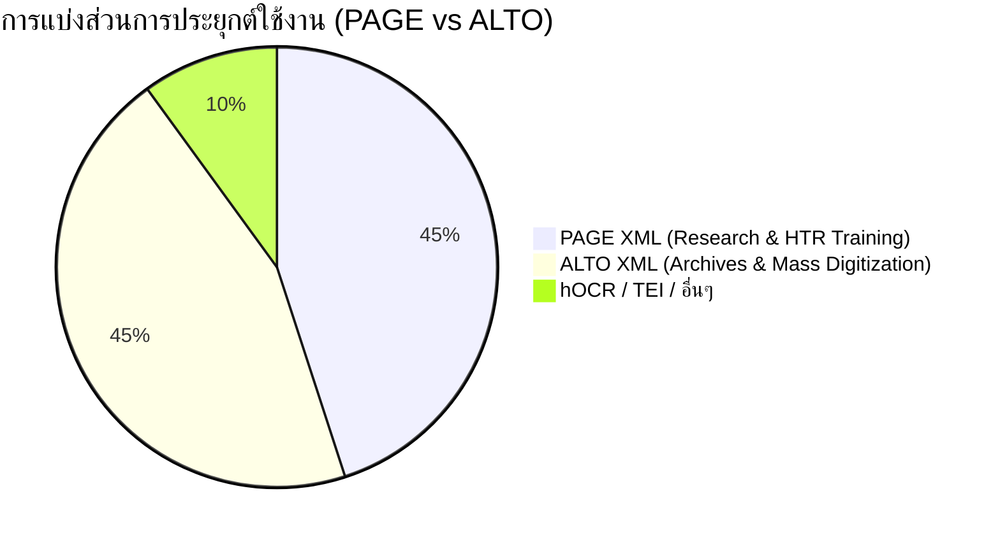

# 🚀 แนวโน้มอนาคตและคำแนะนำการเลือกใช้งาน

## 📑 สารบัญ
1. [สถานะความนิยมปัจจุบัน (2025-2026)](#1-สถานะความนิยมปัจจุบัน-2025-2026)
2. [Hybrid Pipelines — แนวปฏิบัติที่ดีที่สุด](#2-hybrid-pipelines--แนวปฏิบัติที่ดีที่สุด)
3. [VLM/LLM Integration](#3-vlmllm-integration)
4. [Segmonto — มาตรฐานคำศัพท์ร่วม](#4-segmonto--มาตรฐานคำศัพท์ร่วม)
5. [HTR-United Ecosystem](#5-htr-united-ecosystem)
6. [Semantic Enrichment](#6-semantic-enrichment)
7. [การคาดการณ์อนาคต (2026-2030)](#7-การคาดการณ์อนาคต-2026-2030)
8. [Decision Tree — การเลือก Format](#8-decision-tree--การเลือก-format)
9. [Checklist สำหรับโปรเจกต์ใหม่](#9-checklist-สำหรับโปรเจกต์ใหม่)
10. [คำแนะนำสรุปตามสถานการณ์](#10-คำแนะนำสรุปตามสถานการณ์)
11. [คำถามที่พบบ่อย (FAQ) สำหรับผู้เริ่มต้น](#11-คำถามที่พบบ่อย-faq-สำหรับผู้เริ่มต้น)
12. [แหล่งอ้างอิง](#แหล่งอ้างอิง)

---

## 1. สถานะความนิยมปัจจุบัน (2025-2026)

การประเมินสถานะความนิยมของมาตรฐาน XML ในปี 2025-2026 แสดงให้เห็นถึงการแบ่งกลุ่มผู้ใช้งานหลักออกเป็นสองฝั่งอย่างชัดเจน ตามเครื่องมือและเป้าหมายของแต่ละหน่วยงาน โดยสามารถจำแนกสถาบันและโปรเจกต์หลักๆ ได้ดังนี้

### สถาบันและโปรเจกต์ที่ใช้งาน PAGE XML (กลุ่มการวิจัยและฝึกสอน HTR)

PAGE XML กลายเป็นมาตรฐานโดยพฤตินัย (De facto standard) สำหรับกระบวนการทำงานที่เกี่ยวข้องกับ HTR (Handwritten Text Recognition) และ Layout Analysis ขั้นสูง โดยเฉพาะในชุมชนนักวิจัยและโครงการด้านมนุษยศาสตร์ดิจิทัล (Digital Humanities)

* **Transkribus community**: 
  แพลตฟอร์มที่มีผู้ใช้งานมากกว่า 100,000 users ทั่วโลก ใช้ PAGE XML เป็นฟอร์แมตหลักในการจัดเก็บข้อมูล Ground Truth และผลลัพธ์จากการรู้จำลายมือ Transkribus อาศัยความสามารถในการระบุพิกัดแบบ Polygon ของ PAGE XML อย่างเต็มประสิทธิภาพ เพื่อช่วยให้โมเดลสามารถเข้าใจเส้นทางการเขียนอักษรที่โค้งงอหรือเขียนทับกันได้อย่างแม่นยำ

* **eScriptorium community**: 
  แพลตฟอร์ม Open-source ที่พัฒนาโดยทีมนักวิจัยในยุโรป eScriptorium ทำงานเป็น Web interface สำหรับเอนจิน Kraken และรองรับ PAGE XML เป็นอย่างดีในกระบวนการฝึกสอนโมเดล (Model Training) จุดเด่นคือการใช้ PAGE XML เป็นสะพานเชื่อมระหว่างการทำงานร่วมกันของนักวิจัยหลายๆ คนบนแพลตฟอร์มเดียวกันอย่างราบรื่น

* **OCR-D project**: 
  โปรเจกต์ระดับชาติของเยอรมนีที่ได้รับทุนสนับสนุนจาก DFG (Deutsche Forschungsgemeinschaft) เน้นพัฒนา workflow สำหรับวิเคราะห์และแปลงหนังสือพิมพ์เก่าตลอดจนงานพิมพ์ประวัติศาสตร์เยอรมัน (German historical prints 16th-19th century เช่น VD16, VD17, VD18) โครงการนี้ถือว่า PAGE XML เป็นหัวใจหลัก โดยกำหนดให้เป็น format กลาง (pivot format) ตลอดทั้ง pipeline ของ METS workspaces ทำให้ Ecosystem เติบโตอย่างมหาศาล

* **ICDAR competition participants**: 
  งานแข่งขันระดับโลกด้าน Document Analysis (เช่น งาน ICDAR) มักใช้ PAGE XML สำหรับแจกจ่าย Dataset (Training / Test sets) แก่ผู้เข้าร่วมแข่งขัน เพื่อการประเมินผล (Evaluation metrics) ที่แม่นยำระดับพิกเซล

* **HTR-United contributor network**: 
  เครือข่ายที่รวบรวมข้อมูล Ground Truth แบบเปิด ซึ่งเปิดรับ PAGE XML เป็นมาตรฐานในการจัดเก็บและส่งต่อ ทำให้การแชร์ข้อมูลระหว่างสถาบันต่างๆ ไม่มีปัญหาความเข้ากันไม่ได้

* **Multiple university DH labs worldwide**: 
  ศูนย์วิจัยด้าน Digital Humanities ทั่วโลกนิยมใช้ PAGE XML เนื่องจากทำงานร่วมกับโมเดล Machine Learning สมัยใหม่ได้ดีกว่าและยืดหยุ่นกว่า โดยมีชุดคำสั่ง (Libraries) อย่าง `pagexml-tools` ในภาษา Python คอยสนับสนุน

### สถาบันและโปรเจกต์ที่ใช้งาน ALTO XML (กลุ่มห้องสมุดดิจิทัลและคลังจดหมายเหตุ)

ALTO XML ยังคงครองความเป็นใหญ่ในฝั่งของการจัดเก็บระยะยาว (Long-term Archive) และระบบห้องสมุดดิจิทัลขนาดใหญ่ระดับโลก (Mass Digitization) ที่ต้องการสถาปัตยกรรมที่เสถียรและเบา

* **Library of Congress (USA)**: 
  ห้องสมุดรัฐสภาอเมริกัน เป็นผู้ดูแลมาตรฐาน ALTO ในปัจจุบัน ผ่านโปรเจกต์ "Chronicling America" ที่มีภาพหนังสือพิมพ์ประวัติศาสตร์หลายสิบล้านหน้า LoC เป็นผู้ผลักดัน ALTO XML ให้กลายเป็นมาตรฐานระดับโลกที่ทำงานควบคู่กับ METS

* **British Library (UK)**: 
  หอสมุดแห่งชาติอังกฤษ ใช้งาน ALTO XML ร่วมกับ METS สำหรับการจัดเก็บข้อมูลดิจิทัลที่ค้นหาได้ โปรเจกต์หนังสือพิมพ์และหนังสือเก่าจำนวนนับล้านเล่มล้วนถูกแปลงเป็น ALTO XML ทั้งสิ้น

* **Bibliothèque nationale de France (BnF)**: 
  หอสมุดแห่งชาติฝรั่งเศส ใช้ในโปรเจกต์ Gallica อย่างแพร่หลาย ซึ่งเป็นระบบค้นหา (Search Engine) ระดับชาติที่มีประสิทธิภาพสูงมาก

* **Koninklijke Bibliotheek (KB, Netherlands)**: 
  หอสมุดแห่งชาติเนเธอร์แลนด์ ใช้ในแพลตฟอร์ม Delpher สำหรับสืบค้นหนังสือพิมพ์ นิตยสาร และรายการวิทยุเก่า ALTO XML ช่วยให้การดึงคำไฮไลต์ (Keyword highlighting) บนรูปภาพมีความรวดเร็ว

* **HathiTrust Digital Library**: 
  คลังข้อมูลดิจิทัลขนาดมหึมาของการรวมกลุ่มมหาวิทยาลัยและสถาบันวิจัยในสหรัฐอเมริกาและทั่วโลก ระบบหลังบ้าน (Backend) ทำงานร่วมกับข้อมูล ALTO XML เพื่อเชื่อมโยงเนื้อหากับภาพถ่าย

* **Europeana / Europeana Newspapers**: 
  พอร์ทัลระดับยุโรปที่รวบรวมข้อมูลมรดกทางวัฒนธรรมจากสถาบันมากมาย มักจะบังคับให้สถาบันเครือข่ายส่งมอบและแชร์ข้อมูลผ่าน ALTO XML เพื่อให้สามารถทำ Indexing ศูนย์กลางได้

* **National Library of Australia (Trove)**: 
  ใช้ในแพลตฟอร์ม Trove ซึ่งเป็นหนึ่งใน Digital Library ที่ประสบความสำเร็จที่สุดของออสเตรเลีย โดยรองรับ ALTO XML

* **Swedish National Archives (Riksarkivet)**: 
  หอจดหมายเหตุแห่งชาติสวีเดน ใช้ ALTO XML สำหรับการจัดเก็บข้อมูลถาวร เพื่อเปิดให้ประชาชนเข้ามาค้นหาประวัติศาสตร์และข้อมูลบรรพบุรุษ

### แผนภูมิแสดงการประเมินส่วนแบ่งเชิงแนวคิด

> [!NOTE]
> แผนภูมินี้เป็นการแสดงให้เห็นถึง "จุดเน้น (Focus Area)" ของแต่ละมาตรฐาน ไม่ใช่การวัดส่วนแบ่งการตลาดทางเศรษฐกิจ แต่แสดงให้เห็นถึงพื้นที่การใช้งานหลักในระดับอุตสาหกรรม



### หลักฐานและที่มาของการประเมิน

ข้อมูลความนิยมเหล่านี้สะท้อนผ่าน Documentation ของเครื่องมือสมัยใหม่ (เช่น Kraken, PyLaia) ที่มักอ้างอิงและรองรับ PAGE XML เป็นอันดับแรกสำหรับการ Training โมเดล (เนื่องจากต้องใช้เส้นขอบที่ซับซ้อน) ในทางกลับกัน เอกสารข้อกำหนดสำหรับการส่งมอบงาน (Delivery specification) ให้แก่หอสมุดแห่งชาติต่างๆ ยังคงระบุให้ผู้รับเหมาหรือนักวิจัยส่งมอบไฟล์ในรูปแบบ ALTO XML + METS เสมอ ทำให้เห็นภาพที่ชัดเจนว่าความนิยมแบ่งขั้วอย่างสมบูรณ์แบบตามจุดประสงค์ของการนำไปใช้งาน

---

## 2. Hybrid Pipelines — แนวปฏิบัติที่ดีที่สุด

ปัจจุบัน โปรเจกต์ที่สถาบันวิจัยหรือมหาวิทยาลัยทำร่วมกับห้องสมุดแห่งชาติ มักจะหลีกเลี่ยงความขัดแย้งของ Format โดยหันมาใช้ **Hybrid Pipelines** ซึ่งหมายถึงการดึงข้อดีของ PAGE XML และ ALTO XML มาใช้งานในจังหวะ (Phase) ที่เหมาะสมที่สุดของวงจรการประมวลผลเอกสาร แทนที่จะบีบบังคับให้ต้องเลือกอย่างใดอย่างหนึ่งตลอดกาล

### ทำไมถึงต้องใช้ Hybrid Pipelines?

การพยายามผลักดันให้องค์กรขนาดใหญ่เปลี่ยนระบบสืบค้น (Search Engine) มาใช้ PAGE XML เป็นเรื่องที่แทบเป็นไปไม่ได้ เนื่องจากติดคอขวดที่ Legacy systems ซึ่งถูกออกแบบมาให้ parse เฉพาะ Bounding Box ของ ALTO XML การรื้อระบบ Search Engine อาจมีมูลค่าหลายล้านดอลลาร์ การใช้ Hybrid Pipeline (ใช้ PAGE ตอนทำงาน จบงานด้วย ALTO) จึงเป็นทางออกที่พบกันครึ่งทางและประหยัดงบประมาณที่สุด

### กระบวนการในแต่ละ Phase (จากต้นน้ำสู่ปลายน้ำ)

#### Phase 1: Ingestion & Layout Analysis (ใช้ PAGE XML)
* ภาพเอกสารโบราณที่เพิ่งสแกนเสร็จ จะถูกนำเข้าสู่ระบบอย่าง eScriptorium หรือแพลตฟอร์ม OCR-D
* ระบบจะทำการตรวจจับ (Layout Analysis) เพื่อแยกส่วนข้อความ รูปภาพ และขอบกระดาษ 
* **ผลลัพธ์**: ไฟล์ PAGE XML ถูกสร้างขึ้น โดยมีพิกัดระดับละเอียดมาก (Polygon)
* **ตัวอย่างการเก็บพิกัดใน PAGE**:
  ```xml
  <TextLine id="line_1">
      <Coords points="120,400 350,395 352,420 119,425" />
      <Baseline points="120,418 350,413" />
  </TextLine>
  ```

#### Phase 2: Text Recognition & Correction (ใช้ PAGE XML)
* เอนจิน HTR (เช่น Kraken) จะนำ Polygon จาก Phase 1 ไปประมวลผลเป็นภาพบรรทัด (Line images) แล้วอ่านข้อความออกมา
* ทีมนักวิจัยหรือผู้ทรงคุณวุฒิ จะทำการตรวจแก้ (Manual Correction) และลง Ground Truth ในโปรแกรมแก้ไข
* ไฟล์ PAGE XML จะถูกบันทึกซ้ำๆ ระหว่างการทำงาน เพื่อให้โมเดล AI นำไปฝึกสอนต่อ (Retraining) 

#### Phase 3: Conversion & Archiving (แปลงเป็น ALTO XML)
* เมื่อกระบวนการทาง Machine Learning เสร็จสมบูรณ์ ข้อความได้รับการยืนยันว่าถูกต้องแล้ว
* เอกสารจะถูกดึงออกจาก eScriptorium หรือ OCR-D
* ระบบรันคำสั่ง `ocr-fileformat` (หรือ Script อัตโนมัติอื่นๆ) เพื่อทำ Conversion
* การแปลงนี้จะทำการคำนวณ Minimum Bounding Rectangle (MBR) จาก Polygon ใน PAGE เพื่อให้กลายเป็น HPOS/VPOS/WIDTH/HEIGHT ของ ALTO
* **ผลลัพธ์ที่ได้จากการแปลงเป็น ALTO XML**:
  ```xml
  <TextLine ID="line_1" HPOS="119" VPOS="395" WIDTH="233" HEIGHT="30">
      <String CONTENT="ข้อความที่ดึงมา" HPOS="119" VPOS="395" WIDTH="233" HEIGHT="30"/>
  </TextLine>
  ```
* ข้อมูล ALTO จะถูกประกอบเข้ากับไฟล์ METS เพื่อบันทึกลำดับหน้าหนังสือ (Pagination)

#### ตัวอย่างการจับคู่ METS กับ ALTO (METS Wrapping)
เพื่อให้ระบบสืบค้นเข้าใจว่าไฟล์ ALTO คู่กับภาพไหน ต้องมีไฟล์ METS ควบคุมโครงสร้าง:
```xml
<mets:mets xmlns:mets="http://www.loc.gov/METS/" xmlns:xlink="http://www.w3.org/1999/xlink">
  <mets:fileSec>
    <mets:fileGrp ID="IMGGRP">
      <mets:file ID="IMG01" MIMETYPE="image/tiff">
        <mets:FLocat LOCTYPE="URL" xlink:href="page01.tif"/>
      </mets:file>
    </mets:fileGrp>
    <mets:fileGrp ID="ALTOGRP">
      <mets:file ID="ALTO01" MIMETYPE="text/xml">
        <mets:FLocat LOCTYPE="URL" xlink:href="page01_alto.xml"/>
      </mets:file>
    </mets:fileGrp>
  </mets:fileSec>
  <mets:structMap TYPE="PHYSICAL">
    <mets:div TYPE="physSequence">
      <mets:div TYPE="page" ORDER="1">
        <mets:fptr FILEID="IMG01"/>
        <mets:fptr FILEID="ALTO01"/>
      </mets:div>
    </mets:div>
  </mets:structMap>
</mets:mets>
```
สุดท้าย โครงสร้างที่สมบูรณ์จะถูกนำเข้าสู่คลังจัดเก็บ (Institution Repository)

### Diagram แสดง Workflow ขั้นสูงของ Hybrid Pipeline

```mermaid
graph TD
    subgraph "1. Data Capture"
        IMG[ภาพสแกนหนังสือเก่า .TIFF]
    end
    
    subgraph "2. Processing Phase (PAGE XML Ecosystem)"
        IMG --> LA[Kraken / Layout Analysis]
        LA -->|ระบุโครงสร้างหน้ากระดาษ| P1[ไฟล์ PAGE XML]
        P1 --> HTR[HTR Engine]
        HTR -->|แกะรอยข้อความ| P2[ไฟล์ PAGE XML (มี TextEquiv)]
        P2 --> HC[Human Proofreading]
        HC -->|แก้ไขจุดที่ AI อ่านผิด| P3[PAGE XML Final (Ground Truth)]
        
        P3 -.->|Feedback Loop สำหรับสอน AI ซ้ำ| HTR
    end
    
    subgraph "3. Transformation Phase"
        P3 --> CONV[OCR-D page-to-alto Converter]
        CONV --> VAL[Validation & QC Checking]
    end
    
    subgraph "4. Archival Phase (ALTO XML Ecosystem)"
        VAL --> A1[ไฟล์ ALTO XML v4.4]
        A1 --> METS[METS Wrapper]
        METS --> REPO[Digital Library / Solr Search Engine]
    end
    
    style P3 fill:#99ccff,stroke:#003366,stroke-width:2px
    style A1 fill:#99ff99,stroke:#006600,stroke-width:2px
```

> [!TIP]
> **ข้อควรระวังในการทำ Hybrid Pipeline**: การบีบอัดพิกัด Polygon อันซับซ้อนให้กลายเป็น Bounding Box สี่เหลี่ยม อาจทำให้เกิดกล่องบรรทัดที่ซ้อนทับกัน (Overlapping) บนหน้าจอของ Web Viewer หากเอกสารมีความโค้งเอียงรุนแรง ควรมีระบบคำนวณ Deskew (แก้ความเอียง) ก่อนเริ่มกระบวนการแปลง

---

## 3. VLM/LLM Integration

การปรากฏตัวของปัญญาประดิษฐ์กลุ่ม Vision-Language Models (VLM) หรือ Large Language Models (LLM) แบบ Multimodal ได้แก่ GPT-4V (OpenAI), Gemini 1.5 Pro (Google), Claude 3 (Anthropic), และโมเดล Open Source อย่าง LLaVA, Qwen-VL ได้สร้างแรงสั่นสะเทือนต่อวิธีการดึงข้อความจากภาพแบบเดิมๆ

### ศักยภาพใหม่ที่ VLM นำมาสู่การประมวลผลเอกสาร

1. **Transcription & Translation แบบควบรวม**: VLM สามารถอ่านภาพเอกสารจดหมายโต้ตอบภาษาฝรั่งเศสโบราณ (French Medieval text) แล้วถอดเสียงเป็นข้อความ พร้อมแปลเป็นภาษาอังกฤษได้ใน Prompt เดียวกัน
2. **Context-Aware Error Correction**: ระบบ HTR แบบเดิมมักจะอ่านผิดพลาดที่ตัวอักษรเดียวเมื่อมีหยดหมึกเปื้อน แต่ VLM สามารถคาดเดาความหมายที่แท้จริงจาก "บริบท" ของทั้งย่อหน้าได้ ทำให้ผลลัพธ์การอ่านไหลลื่นเป็นธรรมชาติ
3. **Structured Data Extraction ไร้กระบวนทัศน์**: VLM สามารถรับคำสั่งเช่น "ให้อ่านหน้าตารางบัญชีนี้ แล้วสรุปรายการรายรับรายจ่ายเป็น JSON format" โดยไม่ต้องพึ่งพา Layout Analysis Tool เลย

### สถานะปัจจุบัน: ทำไมยังไม่เข้าสู่ Mainstream (การทำงานกระแสหลัก)

แม้ VLM จะเก่งในด้าน "ความเข้าใจภาษา" (Linguistic Context) แต่ในสายงานจดหมายเหตุระดับชาติ (National Archives) และ Mass Digitization สิ่งนี้ยังคงอยู่ใน **สถานะทดลอง (Experimental)** ด้วยเหตุผลหลักประการหนึ่งคือการคืนค่าเป็น JSON แบบอิสระ ไม่สามารถนำมาทำ XML ได้ง่ายๆ

**ตัวอย่าง JSON ที่ได้จาก GPT-4V (ตัวอย่างสมมติ):**
```json
{
  "regions": [
    {
      "type": "paragraph",
      "bbox": [120, 45, 800, 200],
      "text": "The quick brown fox jumps over the lazy dog."
    }
  ]
}
```

ปัญหาที่พบเมื่อต้องแปลง JSON แบบนี้กลับสู่ ALTO/PAGE XML:
1. **พิกัดที่ขาดความแม่นยำ (Hallucinated Bounding Boxes)**: โมเดล VLM มักจะกะระยะ `bbox` คร่าวๆ ไม่ตรงกับ Pixel จริง ขัดกับปรัชญาสูงสุดของ ALTO/PAGE XML ที่ต้องการ "ยึดโยงข้อความเข้ากับพิกัดบนภาพ" (Searchable Image)
2. **ปัญหาการมโนและหวังดีเกินไป (The Hallucination Paradox)**: หน้าที่ของ Ground Truth คือการถอดความ "ตามที่ตาเห็น" แต่ VLM มักจะหวังดี "แก้ไขคำผิดให้โดยอัตโนมัติ" ขัดต่อหลักบรรณารักษ์ศาสตร์
3. **สคริปต์ที่เปราะบาง**: การเขียน Python mapping จาก JSON กลับไปเป็น `alto:String` มีช่องโหว่เยอะ เช่น กรณีมีหลายย่อหน้า หรือบรรทัดที่เอียงมาก

### แนวโน้มการประยุกต์ใช้ในอนาคต

แนวทางที่ชุมชนวิจัยกำลังทดลอง คือการนำ VLM มาใช้เป็นเครื่องมือ "Post-processing" หรือ "Pre-processing"
* **การช่วยระบุโครงสร้างล่วงหน้า (Pre-annotation)**: ใช้ VLM วาดกรอบหยาบๆ เพื่อช่วยจำแนกก่อนว่าตรงไหนเป็นรูปภาพ หรือตาราง จากนั้นส่งให้ระบบ HTR คลาสสิกทำงานดึงอักษร
* **การแปลและการทำ Indexing เสริม**: หลังจากที่ได้ ALTO XML ฉบับปกติสมบูรณ์แล้ว อาจส่งข้อความทั้งหมดไปให้ LLM ทำการสรุปความ และแยก Entity (ชื่อคน, สถานที่) ออกมาเก็บไว้ในฐานข้อมูลอีกตารางหนึ่ง (Metadata Enrichment)

> [!IMPORTANT]
> สรุปใจความสำคัญ: จนกว่า VLM จะสามารถคายผลลัพธ์ออกมาเป็น ALTO v4.4 หรือ PAGE 2019-07-15 ได้โดยตรงแบบ 100% Valid XML อุตสาหกรรมการจัดเก็บเอกสารจะยังคงต้องพึ่งพาสถาปัตยกรรม HTR เดิมต่อไปอีกหลายปี

---

## 4. Segmonto — มาตรฐานคำศัพท์ร่วม

Segmonto ย่อมาจาก Segmented ontology เป็นโครงการที่พยายามจะกอบกู้ความสับสนวุ่นวายของการตีความองค์ประกอบหน้ากระดาษ ให้มี "มาตรฐานคำศัพท์ร่วม (Controlled Vocabulary)" สำหรับวงการ Document Analysis ทั่วโลก

### วิกฤตศัพท์เฉพาะกลุ่ม (The Vocabulary Crisis)

ก่อนหน้าที่จะมี Segmonto หากโปรเจกต์ 3 โปรเจกต์ทำการวิเคราะห์ภาพหน้าปกหนังสือเหมือนกัน พวกเขาอาจกำหนดชื่อแท็กไม่เหมือนกันเลย:
* โปรเจกต์ที่ 1: `<TextRegion type="title-header">`
* โปรเจกต์ที่ 2: `<TextRegion custom="structure {type:cover-title;}">`
* โปรเจกต์ที่ 3: `<TextRegion type="heading">`

ความกระจัดกระจายนี้ทำให้การนำ Dataset ทั้ง 3 โปรเจกต์มารวมกันเพื่อใช้สอน (Train) AI ขนาดใหญ่ เป็นเรื่องปวดหัว เพราะต้องมานั่งเขียนสคริปต์ Mapping ศัพท์ให้ตรงกันก่อน

### ทางออกด้วย Segmonto Ontology

Segmonto จึงถือกำเนิดขึ้นจากการหารือของชุมชนนักวิจัยทั่วยุโรป เพื่อกำหนดรายการศัพท์มาตรฐานขึ้นมาให้ใช้ร่วมกัน ข้อดีของ Segmonto คือมันอยู่ "เหนือรูปแบบไฟล์ (Format Agnostic)" มันสามารถถูกฝังเข้าไปใน PAGE XML (ผ่าน `custom`) และฝังใน ALTO XML (ผ่าน `<OtherTag>`) ได้อย่างสมบูรณ์แบบ

#### 4.1 หมวดหมู่โซนหลัก (Main Zone Types)

**1. MainZone**
* **คำอธิบาย**: บริเวณที่เก็บเนื้อหาหลักของหน้าเอกสาร มักจะกินพื้นที่กว้างที่สุด
* **ตัวอย่าง (PAGE)**: `<TextRegion id="r1" custom="structure {type:MainZone;}">`
* **ตัวอย่าง (ALTO)**: `<OtherTag ID="tag_1" LABEL="MainZone" />`

**2. MarginTextZone**
* **คำอธิบาย**: บริเวณโน้ตหรือข้อความที่เขียนเพิ่มตรงขอบกระดาษ (Marginalia)
* **ตัวอย่าง (PAGE)**: `<TextRegion id="r2" custom="structure {type:MarginTextZone;}">`

**3. TitlePageZone**
* **คำอธิบาย**: พื้นที่เฉพาะบนหน้าปกที่มีชื่อหนังสือและผู้แต่ง
* **ตัวอย่าง (PAGE)**: `<TextRegion id="r3" custom="structure {type:TitlePageZone;}">`

**4. NumberingZone**
* **คำอธิบาย**: โซนสำหรับตัวเลขบอกลำดับหน้า มักจะอยู่มุมบนหรือล่าง
* **ตัวอย่าง (PAGE)**: `<TextRegion id="r4" custom="structure {type:NumberingZone;}">`

**5. RunningTitleZone**
* **คำอธิบาย**: ข้อความที่ปรากฏซ้ำบนหัวกระดาษทุกหน้า (Header)
* **ตัวอย่าง (PAGE)**: `<TextRegion id="r5" custom="structure {type:RunningTitleZone;}">`

**6. DropCapitalZone**
* **คำอธิบาย**: ตัวอักษรศิลป์ขนาดยักษ์ตัวแรกของบท
* **ตัวอย่าง (PAGE)**: `<TextRegion id="r6" custom="structure {type:DropCapitalZone;}">`

**7. QuireMarksZone**
* **คำอธิบาย**: สัญลักษณ์กำกับหน้ายกของโรงพิมพ์โบราณ
* **ตัวอย่าง (PAGE)**: `<TextRegion id="r7" custom="structure {type:QuireMarksZone;}">`

**8. GraphicZone**
* **คำอธิบาย**: พื้นที่สำหรับรูปวาด, ภาพถ่าย, หรือลวดลายตกแต่ง
* **ตัวอย่าง (PAGE)**: `<GraphicRegion id="r8" custom="structure {type:GraphicZone;}">`

**9. TableZone**
* **คำอธิบาย**: พื้นที่แสดงตารางสถิติและข้อมูลจัดรูปแบบกริด
* **ตัวอย่าง (PAGE)**: `<TableRegion id="r9" custom="structure {type:TableZone;}">`

**10. DamageZone**
* **คำอธิบาย**: บริเวณที่เอกสารฉีกขาด ไหม้ มีรอยแมลงกัดกิน
* **ตัวอย่าง (PAGE)**: `<NoiseRegion id="r10" custom="structure {type:DamageZone;}">`

**11. StampZone / SealZone**
* **คำอธิบาย**: บริเวณของรอยประทับตรายางห้องสมุด หรือตราประทับขี้ผึ้ง
* **ตัวอย่าง (PAGE)**: `<GraphicRegion id="r11" custom="structure {type:StampZone;}">`

#### 4.2 หมวดหมู่เส้นบรรทัด (Line Types)

* **DefaultLine**: บรรทัดเนื้อหาปกติทั่วไป 
* **HeadingLine**: บรรทัดที่เป็นส่วนหนึ่งของหัวข้อใหญ่
* **InterlinearLine**: บรรทัดที่ถูกเขียนแทรกขึ้นมาระหว่างบรรทัดหลัก มักจะเบี้ยวและเอียง
* **DropCapitalLine**: บรรทัดที่เป็นส่วนประกอบของ Drop Capital

### อิทธิพลต่อการพัฒนาในอนาคต

เมื่อทุกสถาบันยอมรับมาตรฐานนี้:
1. **Model Interoperability**: AI Layout Analyzer ที่ฝึกด้วยเอกสารสเปน สามารถนำไปใช้วิเคราะห์เลย์เอาต์หนังสือพิมพ์ไทยได้ทันที เพราะ AI เข้าใจโครงสร้าง "MainZone" เหมือนกัน
2. **Automated Validation**: เราสามารถรันโปรแกรมตรวจสอบว่า "ไฟล์ XML นี้ตั้งชื่อมั่วหรือไม่?" ได้อย่างรวดเร็ว

---

## 5. HTR-United Ecosystem

HTR-United (https://htr-united.github.io/) เป็นปรากฏการณ์สำคัญในวงการวิจัย เป็น Data Catalog กลาง (ไม่ใช่โปรแกรม) ที่รวบรวมข้อมูล Ground Truth สาธารณะ เพื่อเสริมสร้างความแข็งแกร่งให้กับวงการ HTR ระดับโลก

### หลักการ FAIR Data Principles

ข้อมูลที่อยู่ใน HTR-United จะต้องยึดถือมาตรฐานสูงสุดของการวิจัย นั่นคือ FAIR:
* **F - Findable (ค้นหาเจอได้)**: ผ่านการสร้างหน้า Catalog ส่วนกลางบนเว็บไซต์
* **A - Accessible (เข้าถึงได้)**: ลิงก์ดาวน์โหลดใช้งานได้จริงและไม่ต้องเสียเงิน
* **I - Interoperable (ทำงานร่วมกันได้)**: ข้อมูลถูกบังคับให้ใช้รูปแบบ PAGE XML, ALTO XML
* **R - Reusable (นำไปใช้ซ้ำได้)**: ระบุ License เชิงกฎหมายที่ชัดเจน

### การเข้าร่วม (How to Contribute)

การแบ่งปันข้อมูลสู่ HTR-United เป็นการบริจาคไฟล์ข้อมูลเข้าสู่ระบบนิเวศ โดยต้องสร้างไฟล์ Metadata ที่มีชื่อว่า `htr-united.yml` 

**ตัวอย่างแบบเจาะลึกของไฟล์ `htr-united.yml`**:
```yaml
title: "French Medieval Registers Ground Truth"
url: "https://github.com/org/french-medieval-registers"
description: "A comprehensive dataset of 15th-century French municipal registers."
authors:
  - name: "Dupont, Jean"
    roles: ["Project Manager", "Annotator"]
  - name: "Martin, Marie"
    roles: ["Reviewer"]
language:
  - fra
script:
  - Latn
format: "PAGE XML"
volume:
  - count: 1250
    metric: "pages"
  - count: 45000
    metric: "lines"
time:
  - notBefore: "1400"
    notAfter: "1499"
license: "CC-BY-4.0"
termsOfUse: "Please cite our publication when using this dataset."
```

### ชุดเครื่องมือ (Tools) ประจำ Ecosystem

โครงการนี้มีเครื่องมือช่วยเหลือผู้เชี่ยวชาญเพื่อให้ทำงานได้รวดเร็วขึ้น:
* **HUMGenerator (HTR-United Metadata Generator)**: เครื่องมือช่วยสรุปข้อมูล เช่น วิ่งเข้าไปอ่านไฟล์ PAGE XML 1,000 ไฟล์ แล้วนับให้อัตโนมัติว่ามีกี่บรรทัด เพื่อเอามาเติมในช่อง `volume`
* **HTRUC (Catalog Validator)**: สคริปต์สำหรับตรวจสอบว่าไฟล์ YAML เขียนถูกต้องตามหลักไวยากรณ์หรือไม่ มีการลืมใส่ชื่อผู้พัฒนาหรือไม่
* **HTRVX (XML Validator)**: เครื่องมือชิ้นเอกที่ใช้อ่านไฟล์ PAGE หรือ ALTO เพื่อตรวจหาความผิดปกติ (เช่น แท็กเปิดปิดไม่ครบ, พิกัดติดลบ) และสามารถตรวจสอบเงื่อนไข Segmonto ควบคู่กันไปได้ด้วย

---

## 6. Semantic Enrichment

"Semantic Enrichment" หรือ "การเพิ่มพูนความหมาย" เป็นเทรนด์ล่าสุดของการสร้างเอกสารดิจิทัลในยุควิกฤตความรู้ (Knowledge Crisis)

### ก้าวข้าม "ข้อความธรรมดา" ด้วย "Valuable XML"

ในยุคทศวรรษที่ 2010 จุดประสงค์ของ ALTO/PAGE คือการบันทึกพิกัด X/Y และข้อความที่อยู่ตรงนั้น (Layout & Presentation) แต่มันไม่มี "ความฉลาดเชิงความหมาย" (Semantic Meaning) 

การก้าวไปสู่ยุค **"Valuable XML"** คือการเริ่มยัดป้ายกำกับเชิงความหมาย (Semantic Tags) เข้าไปในโครงสร้าง ตัวอย่างเช่น ในโครงสร้าง ALTO v4.x เปิดโอกาสให้ใช้ `<NamedEntityTag>` เพื่อโยงข้อความ:

**ตัวอย่างใน ALTO XML:**
```xml
<Tags>
  <NamedEntityTag ID="entity_1" TYPE="PERSON" />
  <NamedEntityTag ID="entity_2" TYPE="LOCATION" />
</Tags>
<!-- ... -->
<String CONTENT="President Lincoln" TAGREFS="entity_1" ... />
<String CONTENT="arrived at" ... />
<String CONTENT="Washington" TAGREFS="entity_2" ... />
```
วิธีนี้ทำให้ ALTO เริ่มฉลาดขึ้น แต่ก็ยังห่างไกลจากการวิเคราะห์เชิงวรรณกรรม

### การเชื่อมโยงไปยังอัครมาตรฐาน: TEI และ RDF

เครื่องมือระดับพระกาฬของสายมนุษยศาสตร์ไม่ใช่ PAGE หรือ ALTO แต่คือ **TEI (Text Encoding Initiative)** 
TEI มุ่งเน้นการจัดเก็บโครงสร้างเชิงตรรกะและวรรณกรรม เช่น บทกวี, ผู้พูดในบทละคร, เส้นกั้นบท, เชิงอรรถ, ข้อความขีดเส้นใต้ หรือการเน้นย้ำความหมาย

* **การทำ Mapping**: 
  กระบวนการที่ทันสมัยที่สุดในปัจจุบันคือ: สกัดข้อมูลออกจาก ALTO/PAGE → วิ่งผ่าน XSLT Transformation → สร้างไฟล์ TEI XML ควบคู่กันไป
  
  **ตัวอย่างโครงสร้าง TEI ที่สกัดออกมา:**
  ```xml
  <text>
    <body>
      <p>
        <persName ref="#Lincoln">President Lincoln</persName> 
        arrived at 
        <placeName ref="https://www.wikidata.org/wiki/Q61">Washington</placeName>.
      </p>
    </body>
  </text>
  ```
* **RDF (Resource Description Framework) / Linked Open Data**:
  ข้อมูลเหล่านี้สามารถถูกนำไปพล็อตเป็น Knowledge Graph บนโลกอินเทอร์เน็ต เพื่อสร้างเว็บเชิงความหมาย (Semantic Web) ที่คอมพิวเตอร์สามารถเข้าใจได้ว่า Lincoln มีความเกี่ยวข้องกับ Washington อย่างไร

> [!CAUTION]
> การพยายามยัดเยียดโครงสร้างทางอรรถกถา (Commentaries) ที่ซับซ้อนมากลงใน PAGE หรือ ALTO โดยตรง เป็นสิ่งที่ไม่ควรทำ เพราะจะทำให้ขนาดไฟล์บวม พาร์สเซอร์ (Parser) พัง และละเมิดจุดประสงค์ดั้งเดิมของ Schema จงปล่อยให้การทำ Semantic เป็นหน้าที่ของ TEI.

---

## 7. การคาดการณ์อนาคต (2026-2030)

เพื่อเป็นการเตรียมความพร้อมสำหรับองค์กร ตารางด้านล่างแสดงวิสัยทัศน์และการคาดการณ์ทิศทางเทคโนโลยีด้าน Document Analysis ในอีกทศวรรษข้างหน้า

| แนวโน้มที่คาดว่าจะเกิดขึ้น (Trends) | ผลกระทบที่จะตามมา (Impact on Workflow) | ข้อสังเกต / คำแนะนำเตรียมความพร้อม (Observations) |
|:---|:---|:---|
| **1. การผสานรวม VLM อย่างเต็มรูปแบบ** | โมเดลแบบ VLM แบบ End-to-end จะเข้ามาแทนที่ HTR แบบเก่า มันสามารถอ่านเอกสารเต็มหน้าและคืนค่ามาเป็นโครงสร้างได้เลย | ต้องมีการพัฒนา Schema รุ่นใหม่ (อาจเป็น ALTO v5 หรือ PAGE v3) ที่รองรับรูปแบบพิกัดแบบคร่าวๆ (Fuzzy coordinates) ที่ VLM สร้างขึ้น |
| **2. ความสำคัญของพิกัด Polygon จะลดลงเล็กน้อย** | โมเดล Attention-based รุ่นใหม่สามารถดึงข้อความออกมาระดับหน้า (Page-level recognition) ได้โดยไม่ต้องให้คนวาด Polygon ละเอียดด้วยมือ ช่วยประหยัดเวลาทำ Ground Truth | PAGE XML จะเปลี่ยนสถานะไปสู่การเป็นมาตรฐานสำหรับสร้าง Benchmark Dataset มากกว่าใช้ใน Production ทั่วไป |
| **3. บังคับใช้ Segmonto ทุกหนแห่ง** | ชุมชนวิจัยจะบังคับกลายๆ ให้ทุกโปรเจกต์ต้องตั้งชื่อ Region/Line ตามมาตรฐาน Segmonto เพื่อให้โมเดลคุยกันรู้เรื่อง | โปรเจกต์ใหม่ควรบรรจุ Segmonto ไว้ในแผนงานตั้งแต่ Day-1 ห้ามใช้ชื่อแท็กแปลกประหลาดภายในทีมเด็ดขาด |
| **4. Fully Automated Pipelines (<5% Human correction)** | ระบบ AI จะพัฒนาความแม่นยำแตะระดับ 99.5% ทำให้ขั้นตอนการตรวจทานโดยมนุษย์ (Manual proofreading) ถูกตัดทอนเพื่อลดต้นทุน | ก่อให้เกิด "ความผิดพลาดแฝง (Silent errors)" ผู้ใช้งานอาจนำข้อมูลที่ AI อ่านผิดไปตีพิมพ์ต่อโดยไม่รู้ตัว ควรมีกลไก Confidence Score แจ้งเตือน |
| **5. Cloud-Native XML Processing / Microservices** | การประมวลผลไฟล์ XML นับล้านๆ บรรทัดจะขยับขึ้นไปทำงานบน Cloud ทรวดทรงแบบ Distributed computing | โครงการเช่น OCR-D จะพัฒนา API หรือ Docker Containers ที่กระจายงานอย่างราบรื่น สถาบันต้องเตรียม IT Infra ให้พร้อมรับ |
| **6. สภาพแวดล้อมเชิงความหมาย (The Semantic Era)** | โปรเจกต์ขนาดใหญ่จะไม่จบแค่ ALTO XML แต่จะต้องทำ Entity Linking ไปร้อยเรียงกับ Wikidata และออกเป็น RDF ด้วย | ผู้ดูแลระบบฐานข้อมูลต้องมีความรู้ด้าน SPARQL ควบคู่ไปกับ XML |
| **7. การตื่นตัวของ Non-Latin Scripts** | การพัฒนาโมเดลสำหรับภาษาเอเชีย (ไทย, อาหรับ, ญี่ปุ่น) จะเติบโตอย่างก้าวกระโดด ทำให้เกิดการใช้งานแอตทริบิวต์ `BASEDIRECTION` และ `LANG` อย่างจริงจัง | ควรมั่นใจว่าซอฟต์แวร์ห้องสมุดสามารถอ่านข้อความแบบ Right-to-Left (RTL) หรือ Top-to-Bottom ได้อย่างถูกต้อง |

---

## 8. Decision Tree — การเลือก Format

การตัดสินใจเลือกมาตรฐานสำหรับโปรเจกต์ใหม่มีความสำคัญดั่งการวางรากฐานตึก หากเลือกผิด อาจนำไปสู่ภาระหนี้สินทางเทคโนโลยี (Technical Debt) มหาศาลในอนาคต แผนผังการประเมินสถานการณ์เบื้องต้น:

```mermaid
flowchart TD
    Start([เริ่มพิจารณามาตรฐานโปรเจกต์ใหม่]) --> Q1{วัตถุประสงค์สูงสุดของโปรเจกต์คืออะไร?}
    
    Q1 -->|ต้องการนำเข้าสู่ระบบห้องสมุดดิจิทัล / Archive| Q2{ต้องการเก็บพิกัดแค่ให้พอทำ Search Highlight ได้ไหม?}
    Q2 -->|ใช่, เน้นไฟล์ขนาดกะทัดรัด ค้นหาง่าย| ALTO[เลือก ALTO XML + METS]
    Q2 -->|ต้องการบรรจุโครงสร้างความหมายเชิงลึกระดับคำ| TEI[พิจารณาแปลงไปใช้ TEI XML]
    
    Q1 -->|ต้องการพัฒนาโมเดล AI (HTR) / วิจัย Layout| Q3{ความซับซ้อนของรูปแบบหน้ากระดาษต้นฉบับสูงแค่ไหน?}
    Q3 -->|สูงมาก (เอกสารโบราณชำรุด, รอยขีดฆ่า, โน้ตริมขอบ, เขียนซ้อนกัน)| PAGE[เลือก PAGE XML]
    Q3 -->|เป็นงานพิมพ์มาตรฐาน เป็นระเบียบ (เช่น หนังสือพิมพ์)| Q4{ใช้ซอฟต์แวร์เครื่องมือใดเป็นหลัก?}
    
    Q4 -->|eScriptorium, Transkribus, หรือ OCR-D Framework| PAGE
    Q4 -->|Tesseract OCR พื้นฐาน หรือระบบเก่า| ALTO
    
    ALTO --> End1([สรุป: เลี้ยวขวาไปทางสาย Mass Digitization])
    PAGE --> End2([สรุป: เดินตรงไปทางสาย AI / HTR Research])
    TEI --> End3([สรุป: เลี้ยวซ้ายไปทางสาย Digital Humanities])
```

### การวิเคราะห์สถานการณ์จำลอง (Case Studies)

#### Scenario A: การรับงานสัมปทานจากหน่วยงานราชการหรือ Archive แห่งชาติ
**สถานการณ์**: บริษัทของคุณรับเหมาแปลงหนังสือพิมพ์ 500,000 หน้าให้แก่หอสมุดแห่งชาติ คุณถนัดการใช้ซอฟต์แวร์สมัยใหม่ที่ใช้ PAGE XML 
**คำแนะนำ**: แม้คุณจะใช้ PAGE XML ระหว่างการทำงาน คุณต้องเผื่อเวลาและงบประมาณในการสร้าง **Conversion Script** (แปลง PAGE เป็น ALTO) ท้ายโปรเจกต์เสมอ เนื่องจากหอสมุดแห่งชาติแทบทุกแห่งมีระบบ Legacy ที่กินไฟล์ ALTO v3/v4 คู่กับ METS เท่านั้น ห้ามส่งมอบ PAGE XML เด็ดขาด

#### Scenario B: การดำเนินโปรเจกต์จ้างคนภายนอก (Crowdsourcing Transcription)
**สถานการณ์**: โครงการของคุณต้องอาศัยอาสาสมัคร หรือจ้างนักศึกษาหลายสิบคนมาช่วยพิมพ์แก้คำที่ AI อ่านพลาดบนภาพจดหมายลายมือโบราณ
**คำแนะนำ**: เลือกใช้ **PAGE XML ควบคู่กับแพลตฟอร์ม Transkribus หรือ eScriptorium** แพลตฟอร์มเหล่านี้มีระบบหลังบ้าน (Backend) ที่เสถียร มีระบบจัดการสิทธิผู้ใช้งาน (Roles management) อาสาสมัครสามารถขยับจุด Polygon บนเส้นบรรทัดที่เบี้ยวได้อย่างง่ายดาย

#### Scenario C: โปรเจกต์วิเคราะห์ตารางและข้อมูลตัวเลขเชิงสถิติ (Tabular Data)
**สถานการณ์**: ต้องการสกัดข้อมูลตัวเลขผลผลิตทางการเกษตรจากหนังสือรายงานของรัฐบาลในยุค 1900
**คำแนะนำ**: **PAGE XML** มีจุดแข็งที่สำคัญคือมันมี Region type พิเศษชื่อ `TableRegion` ซึ่งเปิดโอกาสให้สามารถอธิบาย Grid, Cell, Row และ Column ได้อย่างเป็นโครงสร้าง ในขณะที่ระบบ ALTO มักจะวิเคราะห์ตารางแบบหยาบๆ ในรูปแบบ `ComposedBlock` ธรรมดา

#### Scenario D: โปรเจกต์งบน้อย ต้องการใช้งานแบบ On-premise อย่างรวดเร็ว
**สถานการณ์**: ห้องสมุดคณะเล็กๆ ต้องการนำหนังสือวิทยานิพนธ์ภาษาอังกฤษมาทำให้อ่านค้นหาได้ มีแค่เครื่องคอมพิวเตอร์สเปกปานกลาง
**คำแนะนำ**: ลืมความซับซ้อนทั้งหมดไป แล้วเลือกใช้ **hOCR หรือ ALTO ที่พ่นออกมาจาก Tesseract OCR โดยตรง** แค่รันคำสั่งบรรทัดเดียวก็จบงานได้ ไม่จำเป็นต้องปวดหัวกับ PAGE XML หรือ HTR Pipeline ที่กินทรัพยากรสูง

---

## 9. Checklist สำหรับโปรเจกต์ใหม่

ก่อนเริ่มต้นโปรเจกต์ Digitization ไม่ว่าจะมีขนาดเล็กหรือใหญ่ ผู้จัดการโครงการและผู้นำเชิงเทคนิคควรร่วมกันตรวจสอบ Checklist 20 หัวข้อนี้ อย่างละเอียดยิบ เพื่อป้องกันหายนะ (Disaster) จากหนี้สินทางเทคโนโลยีในระยะยาว:

### 1. กำหนดเป้าหมายหลักให้เด็ดขาด
แยกให้ออกตั้งแต่การประชุมนัดแรกว่าโปรเจกต์นี้ทำเพื่อวิจัยและตีพิมพ์ (Focus on Training AI) หรือทำเพื่อให้ประชาชนเข้ามาค้นหาเนื้อหา (Focus on Access) เป้าหมายที่ชัดเจนจะกำหนดทางเลือกของซอฟต์แวร์
### 2. สำรวจประเมินเอกสารต้นฉบับอย่างรอบคอบ
ทดสอบเอกสารแบบสุ่ม 10-20 หน้า เลือกหน้าที่มีสภาพเลวร้ายที่สุด (เลอะ, ขาด, มีหมึกซึม) เพื่อพิจารณาว่าระบบ Bounding Box สี่เหลี่ยมจะเอาตัวรอดได้หรือไม่ หรือต้องพึ่งพาพิกัด Polygon ที่ดิ้นได้อิสระ
### 3. เลือก Format แกนกลางของ Pipeline (Pivot Format)
ตัดสินใจให้เด็ดขาดว่าจะใช้ PAGE XML หรือ ALTO XML เป็นรูปแบบศูนย์กลางของการดำเนินงาน ไม่ควรให้ทีมหนึ่งใช้ PAGE อีกทีมใช้ ALTO แล้วส่งไฟล์ข้ามไปมาโดยปราศจากสคริปต์กลาง
### 4. ตรวจสอบ Tool Compatibility 
ตรวจสอบกับคู่มือของซอฟต์แวร์ทุกตัวใน Pipeline ว่ารองรับ Schema เวอร์ชันใด (เช่น รองรับเฉพาะ ALTO v3 แต่ไฟล์คุณเป็น v4.4 จะทำให้โปรแกรมหยุดทำงานทันที)
### 5. วางโครงสร้างมาตรฐานคำศัพท์ Segmonto
บังคับใช้มาตรฐาน Segmonto ตั้งแต่เริ่มต้น แจกจ่ายตารางชื่อแท็กมาตรฐานให้ทุกคนในทีม ห้ามใช้อารมณ์ตั้งชื่อ Region ตามใจชอบโดยเด็ดขาด
### 6. จัดเตรียมกระบวนการ Quality Assurance (QA)
วางแผนการสุ่มตรวจความถูกต้องของ XML จะตรวจที่กี่เปอร์เซ็นต์? ศึกษาและติดตั้งเครื่องมือ `HTRVX` เพื่อใช้เป็นยามเฝ้าประตูก่อนที่จะยอมรับไฟล์เข้าสู่ฐานข้อมูล
### 7. กำหนด Naming Convention ของไฟล์
การตั้งชื่อไฟล์ภาพ `.TIFF` และไฟล์ XML ต้องเชื่อมโยงกันด้วยอัลกอริทึมได้ทันที ควรใช้ระบบเช่น `[Collection_ID]_[Volume]_[Page_Number].xml` ห้ามเว้นวรรคในชื่อไฟล์เด็ดขาด
### 8. วางแผน Hybrid Pipeline และทดสอบ Conversion
หากโปรเจกต์มีข้อบังคับให้ต้องทำ Hybrid (เริ่ม PAGE จบ ALTO) ให้ทดลองแปลงไฟล์ตัวอย่างที่ยากที่สุดล่วงหน้าด้วย `ocr-fileformat` ตรวจดูว่าแอตทริบิวต์อะไรสูญหายไปบ้าง (เช่น Confidence score หายหรือไม่)
### 9. ประเมินความจุ Storage Space และ Cost
ตระหนักไว้เสมอว่าไฟล์ PAGE XML ที่บันทึกจุดพิกัด Polygon ละเอียดสูง 200 จุดต่อ 1 บรรทัด จะทำให้ไฟล์มีขนาดใหญ่กว่า ALTO XML ปกติถึง 3-5 เท่า เตรียมงบประมาณสำหรับฮาร์ดดิสก์เก็บข้อมูล
### 10. ข้อตกลงสิทธิและการเข้าถึงข้อมูล (Licensing)
กำหนด License ให้ชัดเจนแต่แรก เช่น CC BY-SA 4.0 หรือ CC0 หากคุณได้รับทุนสนับสนุนจากรัฐ มักมีข้อบังคับให้ผลลัพธ์ (Ground Truth) ต้องเป็น Open Data เปิดให้ทุกคนดาวน์โหลด
### 11. เตรียมกลยุทธ์การสำรองข้อมูล (Backup & Versioning)
ไฟล์ XML ที่มีชีวิตจะถูกแก้ไขตลอดเวลา การเก็บรักษาใน Git Repository หรือระบบ Version Control เป็นสิ่งจำเป็น ห้ามเก็บไว้ในโฟลเดอร์ชื่อ "Final_v2_real" เด็ดขาด
### 12. ตั้งค่า Character Encoding อย่างเคร่งครัด
ระบบต้องกำหนด `encoding="UTF-8"` ในบรรทัดแรกของ XML เสมอ โดยเฉพาะเมื่อทำงานกับเอกสารภาษาที่มีอักขระพิเศษ หรือภาษาเอเชีย เพื่อป้องกันไฟล์กลายเป็นภาษาต่างดาวเมื่อเปิดบนคอมพิวเตอร์ต่างรุ่น
### 13. ร่าง Data Management Plan (DMP)
ทำเอกสารคำมั่นสัญญาว่า เมื่อโปรเจกต์สิ้นสุดลง ใครจะเป็นผู้รักษาสภาพเซิร์ฟเวอร์ และใครจะเป็นเจ้าภาพจ่ายค่าโดเมนเนมต่อไป เพื่อป้องกันข้อมูลลอยแพ
### 14. วางแผนจัดการ Metadata ระดับรวมศูนย์ (METS)
ลำพังแค่ไฟล์ ALTO หรือ PAGE จะบอกได้แค่ข้อมูลในหน้านั้นๆ คุณต้องศึกษาและสร้างสคริปต์รวบรวมไฟล์ทั้งหมดเข้าเป็นเล่มผ่านโครงสร้าง METS ด้วย
### 15. จัดฝึกอบรม (Training) ให้ทีมทำ Annotation
จัดปฐมนิเทศให้ผู้เข้าร่วมเห็นภาพว่า จุดที่ตีเส้นกรอบของ GraphicRegion กับ TextRegion ต่างกันอย่างไร การลากเส้น Baseline ต้องลากใต้ตัวอักษรหรือกลางตัวอักษร ต้องตกลงกันให้ชัดเจน
### 16. คัดเลือก XML Viewer สำหรับผู้ใช้งาน
ค้นหาโปรแกรม หรือพัฒนา Web interface ที่สามารถเปิดไฟล์ XML ของคุณได้จริง เช่น PRImA Page Viewer สำหรับหน้า PAGE หรือเว็บแอปพลิเคชัน Mirador สำหรับ IIIF
### 17. ประเมินโอกาสของ AI เสริม (VLM Integration)
ทดสอบเทคโนโลยีอย่าง LLM/VLM เพื่อใช้ช่วยเดาเค้าโครง หรือทำ Pre-annotation ก่อนที่จะให้คนเข้ามาแก้ เพื่อย่นระยะเวลาการทำงานและประหยัดงบจ้างคน
### 18. วางแผนเรื่อง Linked Open Data (LOD)
หากวิสัยทัศน์ของโปรเจกต์มุ่งเน้นเนื้อหา (Semantic) ให้เตรียมการเรื่องการทำ Entity Linking เข้ากับ Wikidata หรือบรรจุข้อมูล `<NamedEntityTag>` ใน ALTO ทันที
### 19. เตรียมแผนรับมือเมื่อ Schema มีการอัปเดต
ในกรณีที่ ALTO v5 หรือ PAGE เวอร์ชัน 2025 ประกาศเปิดตัว องค์กรมีนโยบายจะ Migrate ไฟล์เดิมทั้งหมดหรือไม่ หรือจะปล่อยเป็นเวอร์ชันเก่าไปตลอด
### 20. เตรียมตัวอุทิศเข้าสู่ HTR-United
เมื่อทำ Ground Truth คุณภาพสูงเสร็จสิ้นจำนวนหนึ่ง ให้สละเวลา 1 วันเพื่อเขียนไฟล์ `htr-united.yml` และส่งต่อชุดข้อมูลนี้เป็นมรดกให้เครือข่ายสังคมวิชาการโลก

---

## 10. คำแนะนำสรุปตามสถานการณ์

เพื่อตอบโจทย์ผู้มีอำนาจตัดสินใจในสถาบันต่างๆ ตารางด้านล่างได้รวบรวมและตกผลึกสถานการณ์พร้อมโซลูชันที่ได้รับการพิสูจน์แล้วว่าดีที่สุด (Battle-tested):

| สถานการณ์ของโปรเจกต์ (Use Cases & Scenarios) | รูปแบบที่แนะนำ (Recommended Format) | เหตุผลสนับสนุนข้อเด่น (Justification & Notes) |
|:---|:---|:---|
| **โครงการระดับชาติ (National Scale), มุ่งเน้นไปที่เอกสารสิ่งพิมพ์เก่าจำนวนหลายสิบล้านหน้า, ต้องการเชื่อมต่อกับระบบ Archive และสืบค้นผ่านหน้าเว็บไซต์** | **ALTO XML** (ใช้งานคู่กับ METS) | เพราะโครงสร้าง ALTO เบา, โฟกัสไปที่ Bounding Box (HPOS/VPOS) ทำให้เอนจินการค้นหาอย่าง Solr/Elasticsearch ประมวลผลได้รวดเร็ว ประหยัดค่าเช่าเซิร์ฟเวอร์ |
| **งานวิจัยเชิงลึก (Deep Research), มุ่งเน้นสร้างโมเดล HTR ให้อ่านลายมือโบราณที่อ่านยาก, เอกสารมีการจัดหน้ากระดาษที่ยุ่งเหยิง ไร้ระเบียบแบบแผน** | **PAGE XML** | จำเป็นต้องใช้พิกัด Polygon ความละเอียดสูงเพื่อแกะรอยเส้นบรรทัดลายมือที่โค้งงอ และรองรับเครื่องมือวิจัยด้าน AI (Kraken, OCR-D) อย่างลื่นไหล 100% |
| **ทำงานร่วมกับเครือข่ายนักมนุษยศาสตร์ (Humanities Scholars), มุ่งเน้นทำความเข้าใจบริบททางประวัติศาสตร์และอรรถกถา (Commentaries)** | **TEI XML** | นักมนุษยศาสตร์ใช้ TEI เป็นภาษากลางระดับสากล ข้อแนะนำคือควรใช้ ALTO/PAGE ทำการถอดความเบื้องต้น (เป็นสะพานเชื่อม) แล้วดึงข้อความแปลงเป็น TEI ทันที |
| **ทีมงานเล็กๆ งบประมาณจำกัด, ต้องการทำ OCR เอกสารทั่วไปที่มีความคมชัด ไม่สนใจ Layout ที่ซับซ้อน (เช่น วิทยานิพนธ์เก่า)** | **hOCR / ALTO (Tesseract)** | เป็นโซลูชันสำเร็จรูป ใช้ Tesseract ซึ่งเป็น Open Source สั่งคำสั่งเดียวจบ ได้ไฟล์พร้อมพิกัด ไม่ต้องลงทุนระบบสถาปัตยกรรม Pipeline ให้ปวดหัว |
| **โครงการขนาดกลางที่ต้องการ "คุณภาพสูงสุด (State-of-the-art)" ด้วย AI แต่หน่วยงานแม่ (Parent Institution) บังคับให้ส่งมอบเป็นมาตรฐานดั้งเดิม** | **Hybrid Pipeline (PAGE → ALTO)** | ใช้ PAGE XML ทำงานร่วมกับแพลตฟอร์ม eScriptorium เพื่อควบคุมคุณภาพ Ground Truth ให้ถึงขีดสุด เมื่อเสร็จแล้ว ใช้เครื่องมือแปลงไฟล์ (Conversion) กลับสู่ ALTO XML ถวายหน่วยงาน |
| **การทำงานกับชุดข้อมูลที่มีเอกสารชนิดพิเศษ (เช่น มีโน้ตเพลง, ตารางคณิตศาสตร์, หรือสมการเคมี) จำนวนมหาศาล** | **PAGE XML** | รูปแบบของ PAGE มีความครอบคลุมสูงกว่า โดยมี `<MusicRegion>`, `<MathsRegion>`, `<ChemRegion>` รองรับตั้งแต่ระดับ Schema ซึ่ง ALTO ไม่มีแท็กเฉพาะทางระดับนี้ |

---

## 11. คำถามที่พบบ่อย (FAQ) สำหรับผู้เริ่มต้น

### 11.1 ทำไมเราไม่ทิ้ง XML แล้วไปใช้ JSON แทน?
แม้ JSON จะเป็นที่นิยมในวงการ Web Development แต่มันขาดโครงสร้างความเข้มงวด (Strict Schema) การจะตรวจว่าไฟล์ JSON ขาดแอตทริบิวต์สำคัญไปหรือไม่นั้นทำได้ยากกว่า XML ที่มี XSD Validator นอกจากนี้ วงการห้องสมุดทั่วโลกผูกพันกับ XML มานานกว่า 30 ปี การจะโละทิ้งเพื่อไปใช้ JSON จึงต้องใช้ระยะเวลาและความพยายามมหาศาล

### 11.2 สามารถแปลง PAGE เป็น ALTO แบบไม่เสียข้อมูลเลยได้หรือไม่?
**ไม่ได้ 100%** เมื่อคุณแปลง Polygon ของ PAGE เป็น Bounding Box ของ ALTO พิกัดจะถูกปัดเศษหรือบีบอัดให้กลายเป็นกรอบสี่เหลี่ยม นอกจากนี้ Custom attributes บางตัวใน PAGE อาจไม่สามารถจับคู่แบบ 1-to-1 กับ ALTO ได้ จึงต้องเตรียมใจรับการสูญเสียข้อมูล (Data Loss) บางส่วนเสมอ

### 11.3 Tesseract สามารถส่งออกเป็น PAGE XML ได้ไหม?
โดยปกติ Tesseract (เวอร์ชัน 4.0 ขึ้นไป) จะรองรับเฉพาะ hOCR, ALTO, PDF และ Text หากต้องการออกเป็น PAGE XML คุณต้องใช้เครื่องมือเสริม เช่น `pagexml-tools` หรือสคริปต์ Python ในการแปลง ALTO/hOCR ไปเป็น PAGE

### 11.4 Segmonto จำกัดให้ใช้เฉพาะในยุโรปหรือไม่?
**ไม่เลย** Segmonto เป็นมาตรฐานสากลแบบเปิด คุณสามารถนำไปประยุกต์ใช้กับเอกสารภาษาไทย จีน หรืออาหรับได้ทันที ขอเพียงแค่ลักษณะโครงสร้าง (เช่น MainZone, MarginTextZone) ตรงตามคำอธิบาย

### 11.5 AI จะทำให้ ALTO และ PAGE หมดความหมายไหมในอนาคต?
ในระยะสั้นและกลาง (5-10 ปี) **ไม่มีทาง** โมเดล AI ยุคใหม่ (LLM/VLM) ยังคงตอบสนองด้วยข้อความแบบอิสระ ซึ่งไม่สามารถนำไปสร้างปุ่ม "คลิกเพื่อไฮไลต์คำบนรูป" ได้ ระบบหลังบ้านของห้องสมุดดิจิทัลต้องการ "หมุดยึด (Anchor)" ระหว่างข้อความและพิกัดรูปภาพ ซึ่ง XML ยังคงเป็นราชาในด้านนี้

---

## 12. แหล่งอ้างอิง

* **HTR-United GitHub Repository**: แหล่งรวม Data catalog และคู่มือแนวทางสำหรับการจัดการเอกสารเชิงประวัติศาสตร์ (https://github.com/HTR-United)
* **Library of Congress (LoC)**: เอกสารต้นฉบับ ALTO XML Official Documentation และ Schema version history (https://www.loc.gov/standards/alto/)
* **PRImA Research Lab**: ต้นกำเนิดมาตรฐาน PAGE-XML Format guidelines และอรรถาธิบายโครงสร้างฉบับสมบูรณ์ (https://www.primaresearch.org/)
* **OCR-D Project**: รายละเอียดสเปกและ Workflows การเชื่อมโยงเครื่องมือผ่าน METS (https://ocr-d.de/)
* **Segmonto**: เอกสารคู่มือคำอธิบายโครงสร้างบรรทัดและคำศัพท์ (Controlled vocabulary documentation) อย่างเป็นทางการ (https://github.com/Segmonto)

