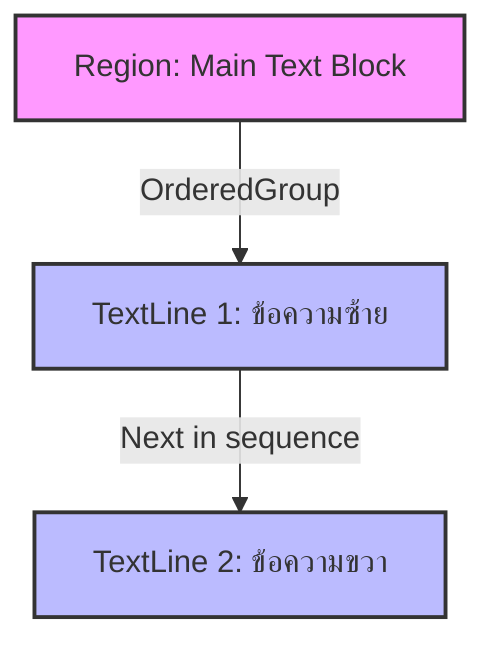
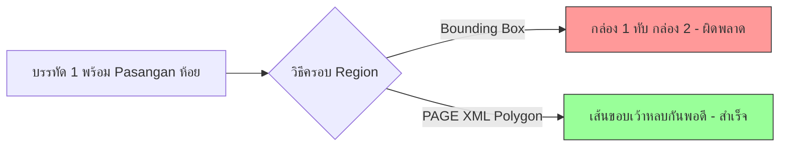

# การประยุกต์ใช้งาน XML เชิงลึกสำหรับคัมภีร์เอเชียโบราณ (Use Case: Tibetan Pecha & Javanese/Balinese Lontar)

## 1. บทนำ: เสน่ห์และความท้าทายในการทำ HTR สำหรับเอกสารโบราณเอเชีย

งานด้านมนุษยศาสตร์ดิจิทัล (Digital Humanities) และเทคโนโลยีการรู้จำอักษรเขียนด้วยลายมือ (Handwritten Text Recognition หรือ HTR) มีบทบาทสำคัญอย่างยิ่งในการอนุรักษ์และเปิดเผยองค์ความรู้ที่ซ่อนอยู่ในเอกสารโบราณทั่วโลก อย่างไรก็ตาม เอกสารโบราณจากภูมิภาคเอเชียกลับนำเสนอความท้าทายที่แตกต่างอย่างสิ้นเชิงเมื่อเปรียบเทียบกับเอกสารพิมพ์ หรือแม้กระทั่งเอกสารลายมือจากโลกตะวันตก ความท้าทายเหล่านี้ไม่ได้จำกัดอยู่เพียงแค่รูปลักษณ์ของตัวอักษรที่ซับซ้อน แต่ครอบคลุมถึงโครงสร้างทางกายภาพของวัสดุที่ใช้จารึก รูปแบบการจัดหน้า (Layout) ที่ไม่ตายตัว และธรรมเนียมการขีดเขียนที่เต็มไปด้วยบริบททางวัฒนธรรม

การดึงข้อมูลจากเอกสารโบราณเหล่านี้เข้าสู่ระบบคอมพิวเตอร์ในรูปแบบที่เครื่องอ่านเข้าใจได้ จำเป็นต้องพึ่งพาสถาปัตยกรรมข้อมูลที่ยืดหยุ่นและทรงพลัง รูปแบบไฟล์ข้อกำหนดโครงสร้าง เช่น PAGE XML และ ALTO XML ได้รับการพัฒนาให้สามารถรองรับการระบุตำแหน่งทางพื้นที่ (Spatial annotation) และความเชื่อมโยงเชิงความหมาย (Semantic relationships) ได้อย่างแม่นยำ

เสน่ห์ของเอกสารเอเชียโบราณอยู่ที่ความหลากหลายไร้ขีดจำกัด ดังเช่นคัมภีร์ทิเบต (Tibetan Pecha) ที่มาพร้อมกับรูปแบบกระดาษยาวและแคบ มีช่องว่างสำหรับร้อยเชือก และมีข้อความขนาดเล็กแทรกระหว่างบรรทัดเพื่อขยายความ หรือจะเป็นคัมภีร์ใบลานของทางชวาและบาหลี (Lontar Palm-leaf) ที่พื้นผิวมีข้อจำกัดด้านความเรียบ ตัวอักษรมีการซ้อนทับกันอย่างหนาแน่น และมีธรรมเนียมการเขียนข้อความที่ตกหล่นแทรกไว้ตามขอบใบพร้อมเครื่องหมายโยง

บทความนี้จะเจาะลึกกรณีศึกษา (Use Case) ที่สำคัญสองประการ ได้แก่ คัมภีร์ทิเบต (Pecha Format) และคัมภีร์ใบลานชวา/บาหลี (Lontar Palm-leaf) โดยอ้างอิงจากงานวิจัยที่ผ่านการรับรองและโครงการระดับนานาชาติ เราจะวิเคราะห์ถึงลักษณะทางกายภาพที่ส่งผลต่อการวาง Layout และเทคนิคการใช้ PAGE XML เพื่อแก้ไขปัญหาโครงสร้างที่ซับซ้อนเหล่านี้อย่างเป็นระบบ

---

## 2. Use Case 1: คัมภีร์ทิเบต (Pecha Format)

### 2.1 บริบทและโครงการวิจัยที่เกี่ยวข้อง

การแปลงคัมภีร์ทิเบตให้อยู่ในรูปแบบดิจิทัลถือเป็นหนึ่งในงานที่ท้าทายที่สุดในวงการ HTR ระดับเอเชีย มีหลายโครงการที่ให้ความสำคัญกับการพัฒนาโมเดล AI และเครื่องมือ Annotation สำหรับเอกสารประเภทนี้โดยเฉพาะ:

- **TibSchol Project**: โครงการวิจัยเชิงลึกที่มุ่งพัฒนาเทคโนโลยี HTR สำหรับอักษรทิเบตแบบหวัด (Ume cursive script) ซึ่งพบได้บ่อยในเอกสารทางประวัติศาสตร์และคัมภีร์สำคัญ โครงการนี้ได้สร้างมาตรฐานใหม่ในการวิเคราะห์โครงสร้างหน้ากระดาษของทิเบต โดยอิงโครงสร้าง PAGE XML เป็นหลัก (อ้างอิงข้อมูล: https://www.oeaw.ac.at/projects/tibschol)
- **OpenPecha**: ชุมชน Open-source ที่อุทิศตนให้กับการจัดทำคัมภีร์ทิเบตในรูปแบบดิจิทัล (Digitization) โครงการนี้ไม่ได้เพียงแค่พัฒนาโมเดล HTR เท่านั้น แต่ยังนำเสนอแนวทางปฏิบัติ (Best practices) ในการใช้ PAGE XML สำหรับการเชื่อมโยงโครงสร้าง Layout เข้ากับข้อความ (Text-image alignment) อย่างมีประสิทธิภาพ (อ้างอิงข้อมูล: https://openpecha.org/)
- **PechaBridge**: ไปป์ไลน์แบบ End-to-End ที่ออกแบบมาสำหรับการทำกระบวนการจำแนกบรรทัด (Line segmentation) และ OCR/HTR คัมภีร์ทิเบต โดยเฉพาะ เครื่องมือนี้สามารถรับมือกับปัญหาที่พบได้บ่อยในคัมภีร์ทิเบต เช่น โครงสร้างที่ไม่เป็นเส้นตรง และการกระจายตัวของข้อความรอบช่องร้อยเชือก (อ้างอิงข้อมูล: https://github.com/OpenPecha/PechaBridge)

งานวิจัยโดย **F.X. Erhard (2025)** ในหัวข้อ "Text and Layout Recognition for Tibetan Newspapers with Transkribus" ยังได้เน้นย้ำว่า PAGE XML สามารถรองรับความซับซ้อนของอักษรทิเบตได้ดีเยี่ยม โดยเฉพาะเมื่อใช้งานร่วมกับระบบ Transkribus ในขณะที่ **Rabaev และ Litvak (2026)** ได้ยืนยันในงานวิจัยเกี่ยวกับการแยกบรรทัดข้อความ (Text line segmentation) สำหรับเอกสารประวัติศาสตร์ทิเบต ว่าความแม่นยำในการตีความบรรทัดขึ้นอยู่กับการใช้รูปหลายเหลี่ยม (Polygon) ที่รัดกุม

### 2.2 ลักษณะทางกายภาพของ Pecha Format

รูปแบบการจารึกแบบ **Pecha (dpe cha)** มีความเป็นเอกลักษณ์ที่โดดเด่น ซึ่งได้รับอิทธิพลมาจากคัมภีร์ใบลานของอินเดียโบราณ:

1. **ลักษณะแผ่นกระดาษ (Pe-ring)**: หน้ากระดาษจะมีลักษณะยาวและแคบมาก มักจะวางซ้อนกันเป็นตั้งโดยไม่ได้เย็บเล่ม ทิศทางการเขียนหลักจะเป็นจากซ้ายไปขวา (Left-to-Right) เป็นบรรทัดแนวนอนขนานไปกับแนวยาวของกระดาษ
2. **อักษรและอักขรวิธี (Scripts and Ligatures)**: มักใช้อักษรแบบ **Ume (dbu med)** ซึ่งเป็นอักษรหวัดที่เขียนต่อเนื่องกัน หรืออักษร **Uchen (dbu can)** ที่มีหัว ตัวอักษรทิเบตมีการเรียงซ้อนกันทั้งในแนวตั้ง (Subjoined letters) และแนวนอน ทำให้การแบ่งแยกตัวอักษร (Character segmentation) ทำได้ยากมาก
3. **ช่องร้อยเชือก (String hole)**: ตรงกลางหน้ากระดาษ หรือบางครั้งมีสองจุดซ้ายขวา จะมีพื้นที่เว้นว่างไว้เจาะรูสำหรับร้อยเชือกเพื่อมัดคัมภีร์ ข้อความบรรทัดเดียวกันจะถูกเขียนยาวไปจนถึงบริเวณช่องว่างนี้ จากนั้นจะหยุดเว้นวรรค และไปเขียนต่ออีกฝั่งของช่องร้อยเชือก
4. **Yig-chung (อักษรแทรก/Interlinear Annotations)**: เป็นข้อความขนาดเล็กที่มักเขียนด้วยอักษร Ume ขนาดเล็ก แทรกอยู่ใต้หรือระหว่างบรรทัดของข้อความหลัก (Uchen) เพื่ออธิบายความหมาย เติมคำที่ตกหล่น หรือแสดงวิธีการออกเสียง (Glosses)

### 2.3 ความท้าทายและการแก้ปัญหา 1: ช่องร้อยเชือก (String Hole)

ปัญหาหลักของช่องร้อยเชือกคือ หากเราลากกรอบสี่เหลี่ยม (Bounding Box) คลุมทั้งบรรทัด กรอบนั้นจะพาดผ่านช่องร้อยเชือก ซึ่งอาจจะไปรวมเอาเศษรอยเปื้อน หรือข้อความแทรกอื่นๆ เข้ามาด้วย ในกรณีของ ALTO XML แบบดั้งเดิม นี่คือปัญหาใหญ่ แต่สำหรับ PAGE XML มีทางออกที่มีประสิทธิภาพสองวิธี:

**วิธีที่ 1: การใช้ Polygon ข้ามผ่านอุปสรรค**
สร้าง `TextLine` เดียว แต่ใช้แท็ก `<Coords>` แบบ Polygon ที่ลากเส้นหลบเว้าช่องร้อยเชือก ทำให้พื้นที่ `TextLine` โอบล้อมเฉพาะส่วนที่เป็นตัวอักษรจริง แต่อย่างไรก็ตาม วิธีนี้อาจทำให้ Baseline ขาดตอน

**วิธีที่ 2: การแบ่งเป็นสอง TextLine และเชื่อมด้วย ReadingOrder (แนะนำ)**
วิธีที่ถูกต้องทางตรรกะและถูกนำไปใช้ใน PechaBridge คือการแบ่งข้อความหน้าช่องร้อยเชือกเป็นหนึ่ง `TextLine` และข้อความหลังช่องร้อยเชือกเป็นอีกหนึ่ง `TextLine` จากนั้นใช้ `<OrderedGroup>` ใน `<ReadingOrder>` บังคับให้ระบบอ่านต่อเนื่องกัน



### 2.4 ความท้าทายและการแก้ปัญหา 2: อักษรแทรก (Yig-chung) และ Interlinear Glosses

การแทรกคำขยายความด้วยตัวอักษรขนาดเล็ก (Yig-chung) นำมาซึ่งปัญหาสองประการ:
1. มันจะไปรบกวน Baseline ของบรรทัดหลักที่อยู่ด้านบนและด้านล่าง
2. มันไม่ใช่ส่วนหนึ่งของเนื้อหาหลัก หากเรียงต่อกันไปจะทำให้ความหมายผิดเพี้ยน

**การแก้ไขด้วย `<Relations>` ใน PAGE XML:**
เราต้องนิยามบรรทัดหลักเป็น `TextLine` ปกติ และนิยามบรรทัด Yig-chung เป็น `TextLine` แยกต่างหาก โดยอาจเพิ่มคุณสมบัติ `custom="structure {type:gloss;}"` จากนั้นเชื่อมโยง Yig-chung เข้ากับคำหรือบรรทัดที่มันขยายความ ผ่านแท็ก `<Relations>`

### 2.5 ตัวอย่างโครงสร้างและโค้ด PAGE XML สำหรับ Pecha Format

ด้านล่างคือตัวอย่างไฟล์ PAGE XML ระดับ Masterclass ที่จัดการกับทั้งช่องร้อยเชือก (String Hole) และข้อความแทรก (Yig-chung) ในโครงสร้างของคัมภีร์ทิเบต

```xml
<?xml version="1.0" encoding="UTF-8"?>
<PcGts xmlns="http://schema.primaresearch.org/PAGE/gts/pagecontent/2019-07-15"
       xmlns:xsi="http://www.w3.org/2001/XMLSchema-instance"
       xsi:schemaLocation="http://schema.primaresearch.org/PAGE/gts/pagecontent/2019-07-15 
                           http://schema.primaresearch.org/PAGE/gts/pagecontent/2019-07-15/pagecontent.xsd">
    <Metadata>
        <Creator>TibSchol Project - AutoSegmenter</Creator>
        <Created>2026-06-03T10:00:00</Created>
        <LastChange>2026-06-03T10:30:00</LastChange>
        <Comments>Ground truth for Tibetan Pecha with String Hole and Yig-chung glosses.</Comments>
    </Metadata>
    
    <Page imageFilename="pecha_folio_045.jpg" imageWidth="4000" imageHeight="800">
        <!-- 
            การจัดการ ReadingOrder:
            บังคับการอ่านบรรทัดซ้ายของรู -> บรรทัดขวาของรู
        -->
        <ReadingOrder>
            <OrderedGroup id="ro_1" caption="Main Reading Flow">
                <RegionRefIndexed index="0" regionRef="text_region_main"/>
            </OrderedGroup>
        </ReadingOrder>

        <TextRegion id="text_region_main" custom="readingOrder {index:0;}">
            <Coords points="100,100 3900,100 3900,700 100,700"/>
            
            <!-- การอธิบายลำดับการอ่านภายใน Region -->
            <TextEquiv>
                <Unicode>༄༅། །རྒྱ་གར་སྐད་དུ། [ช่องร้อยเชือก] བཅོམ་ལྡན་འདས་མ།</Unicode>
            </TextEquiv>

            <!-- บรรทัดที่ 1 (ฝั่งซ้ายของช่องร้อยเชือก) -->
            <TextLine id="line_1_left" custom="readingOrder {index:0;} structure {type:heading;}">
                <Coords points="120,120 1800,120 1800,200 120,200"/>
                <Baseline points="120,180 1800,180"/>
                
                <Word id="word_1_1">
                    <Coords points="120,120 400,120 400,200 120,200"/>
                    <TextEquiv><Unicode>༄༅།</Unicode></TextEquiv>
                </Word>
                <Word id="word_1_2">
                    <Coords points="450,120 1800,120 1800,200 450,200"/>
                    <TextEquiv><Unicode>།རྒྱ་གར་སྐད་དུ།</Unicode></TextEquiv>
                </Word>
                <TextEquiv><Unicode>༄༅། །རྒྱ་གར་སྐད་དུ།</Unicode></TextEquiv>
            </TextLine>

            <!-- บรรทัดที่ 1 (ฝั่งขวาของช่องร้อยเชือก) -->
            <!-- หมายเหตุ: index 1 ต่อจากฝั่งซ้าย ข้ามช่องร้อยเชือกบริเวณแกน X ที่ 1800 ถึง 2200 -->
            <TextLine id="line_1_right" custom="readingOrder {index:1;}">
                <Coords points="2200,120 3800,120 3800,200 2200,200"/>
                <Baseline points="2200,180 3800,180"/>
                <TextEquiv><Unicode>བཅོམ་ལྡན་འདས་མ།</Unicode></TextEquiv>
            </TextLine>

            <!-- อักษรแทรก Yig-chung ขนาดเล็กที่เขียนใต้บรรทัดที่ 1 ขวา -->
            <TextLine id="line_1_right_gloss" custom="structure {type:gloss;}">
                <Coords points="2300,210 2600,210 2600,240 2300,240"/>
                <Baseline points="2300,235 2600,235"/>
                <TextEquiv><Unicode>འགྲེལ་པ</Unicode></TextEquiv>
            </TextLine>
            
        </TextRegion>

        <!-- 
            ส่วนการจัดการความสัมพันธ์ (Relations)
            ระบุว่า line_1_right_gloss เป็นตัวอธิบายความ (commentary) ให้กับ line_1_right
        -->
        <Relations>
            <Relation type="link" custom="type:gloss">
                <SourceRegionRef regionRef="line_1_right"/>
                <TargetRegionRef regionRef="line_1_right_gloss"/>
            </Relation>
        </Relations>
    </Page>
</PcGts>
```

จากตัวอย่างด้านบน เราเห็นความสามารถของ PAGE XML ในการจัดการ Layout ที่ขาดตอน และการสร้างความสัมพันธ์ (Relations) เพื่อแยกแยะข้อความหลักและ Yig-chung ออกจากกันอย่างเป็นระบบ สิ่งนี้จำเป็นอย่างยิ่งต่อการป้อนข้อมูลที่สมบูรณ์ให้โมเดล AI นำไปฝึกฝน

---

## 3. Use Case 2: คัมภีร์ใบลานชวาและบาหลี (Lontar Palm-leaf)

### 3.1 บริบทและชุดข้อมูลอ้างอิง

การทำ HTR สำหรับคัมภีร์ใบลาน (Palm-leaf manuscripts) เป็นความท้าทายระดับโลกเนื่องจากลักษณะเฉพาะของวัสดุและเครื่องมือที่ใช้ในการจารึก หนึ่งในหลักไมล์สำคัญของงานวิจัยด้านนี้คือ **ICFHR 2016 Competition** ซึ่งเป็นการแข่งขันทำ HTR จากภาพคัมภีร์ใบลานบาหลี 

ชุดข้อมูลที่เป็นหมุดหมายสำคัญคือ **AMADI_LontarSet** ซึ่งถูกนำมาใช้เป็น Ground truth สำหรับการประเมินผล ชุดข้อมูลนี้เลือกใช้รูปแบบ **PAGE XML** เป็นมาตรฐาน เนื่องจากสามารถรองรับความยุ่งเหยิงของ Layout และรูปทรงเรขาคณิตที่ไม่แน่นอนบนใบลานได้ (อ้างอิง: https://perso.univ-lr.fr/jburie/ICFHR2016/download.html) 

การใช้เครื่องมืออย่าง **Transkribus** ในการเทรนโมเดล HTR สำหรับ Lontar manuscripts ก็ต้องอาศัยการครอบกรอบข้อความและขีดเส้นฐาน (Baseline) ด้วยคุณลักษณะขั้นสูงของ PAGE XML เสมอ เนื่องจากโครงสร้างของเอกสารชนิดนี้ไม่สามารถรองรับได้ด้วย Bounding Box มาตรฐาน

### 3.2 ลักษณะทางกายภาพของคัมภีร์ใบลาน (Lontar Format)

คัมภีร์กลุ่มชวาและบาหลีที่จารึกลงบนใบลาน เรียกว่า Lontar มีลักษณะเฉพาะที่สร้างความปวดหัวให้กับนักวิเคราะห์โครงสร้างเอกสาร:

1. **Unstructured Layout (โครงสร้างที่ไร้ระเบียบ)**: ขอบของใบลานไม่เป็นเส้นตรง มักโค้งงอตามธรรมชาติ ไม่มีการตีกรอบหน้ากระดาษที่ชัดเจน ไม่มีการจัดย่อหน้า และระยะห่างระหว่างบรรทัด (Line spacing) ไม่สม่ำเสมอ บ่อยครั้งที่บรรทัดบนและล่างเอียงเข้าหากัน
2. **Pasangan (ตัวซ้อนล่าง)**: ในระบบอักษรบาหลีและชวา เมื่อมีอักษรควบกล้ำ อักษรตัวที่สองจะเปลี่ยนรูปเป็น "Pasangan" และห้อยอยู่ข้างใต้ตัวอักษรหลัก (คล้ายตีนกา หรือพยัญชนะซ้อนในภาษาเขมร) การห้อยนี้มักจะตกลงไปกินพื้นที่ของบรรทัดถัดไป
3. **Sandhangan (เครื่องหมายสระ/วรรณยุกต์)**: เครื่องหมายเหล่านี้ถูกเขียนล้อมรอบอักษรหลัก ทั้งด้านบน ด้านล่าง ด้านหน้า และด้านหลัง ทำให้รูปทรงรวมของหนึ่งคำ (Word glyph) มีลักษณะกระจายตัวสูง
4. **Omissions (การตกหล่นและแทรกข้อความ)**: เมื่อผู้จารึกลืมเขียนอักษรหรือคำบางคำ จะไม่มีการลบทิ้ง (เนื่องจากจารึกด้วยเหล็กแหลมขูดพื้นผิวใบ) แต่มักจะไปเขียนคำที่ตกหล่นนั้นไว้ที่ขอบด้านบนหรือด้านล่างของใบลาน (Marginalia) แล้วทำเครื่องหมายโยงขนาดเล็กคล้ายกากบาทเหนือจุดที่ตกหล่น เพื่อให้ผู้อ่านกระโดดสายตาไปอ่านขอบใบแล้วกระโดดกลับมา

### 3.3 ความท้าทายและการแก้ปัญหา 1: Bounding Box Failure และความจำเป็นของ Polygon

เนื่องจากลักษณะของ **Pasangan** ห้อยต่ำลงมามาก และ **Sandhangan** พุ่งสูงขึ้นไป ทำให้เมื่อเราวาด Bounding Box สี่เหลี่ยมผืนผ้าครอบบรรทัดที่ 1 ขอบล่างของกล่องจะไปคลุมอักษรของบรรทัดที่ 2 อย่างหลีกเลี่ยงไม่ได้ (Overlap) ปรากฏการณ์นี้เรียกว่า **Bounding Box Failure** 

ใน ALTO XML รุ่นเก่า ปัญหานี้แก้ไขได้ยากมาก แต่ใน **PAGE XML** การใช้โครงสร้าง `<Coords>` แบบ Polygon ถือเป็นข้อบังคับสำหรับการทำ Ground Truth ของ Lontar Polygon จะถูกลากเว้าหลบอักษรที่ยื่นล้ำเส้นเขตแดนอย่างประณีต ช่วยให้โมเดลแยกแยะ (Segmentation Model) สามารถเรียนรู้ขอบเขตของพิกเซลที่แท้จริงได้



### 3.4 ความท้าทายและการแก้ปัญหา 2: แนวเส้นฐานแบบ Center Baseline

โดยปกติ Baseline สำหรับเอกสารตะวันตกจะขีดที่ "ฐานล่าง" ของตัวอักษรปกติ (ไม่นับหางตกเช่น g, y) แต่สำหรับอักษรบาหลีและชวา การตีความ "ฐานล่าง" ทำได้ยาก เพราะอักษรมีรูปร่างโค้งมน และมีส่วนที่ยื่นทั้งบนและล่างตลอดเวลา

วิธีการที่ได้รับการพิสูจน์แล้วว่ามีประสิทธิภาพสูงสุดในชุดข้อมูล AMADI_LontarSet คือการใช้กลยุทธ์ **Center Baseline** คือการขีดเส้นแกนกลางผ่าครึ่งลำตัวของตัวอักษรแนวนอน โมเดล HTR (เช่น RNN หรือ CNN) จะเรียนรู้การกระจายตัวของพิกเซลทั้งด้านบนและด้านล่างของเส้นแกนกลางนี้แทน ข้อความใน PAGE XML `<Baseline>` จะถูกตีความว่าเป็น Center line แทนที่จะเป็น Bottom line

### 3.5 ความท้าทายและการแก้ปัญหา 3: การจัดการข้อความตกหล่น (Omissions) และ Marginalia

ลำดับการอ่าน (Reading Order) เป็นกุญแจสำคัญในการจัดการ Omissions สมมติว่าในบรรทัดที่ 2 มีคำตกหล่น และผู้จารึกนำคำนั้นไปเขียนไว้ที่ขอบด้านบนของใบลาน (Margin-top) การลำดับการอ่านตามธรรมชาติของคอมพิวเตอร์ (บนลงล่าง) จะทำให้อ่านผิด

ด้วย PAGE XML เราใช้ `<ReadingOrder>` ควบคู่กับ `<RegionRefIndexed>` เพื่อสร้างเส้นทางการอ่านแบบก้าวกระโดด (Non-linear Reading Order) ดังนี้:

- อ่าน Region: Text (บรรทัด 1)
- อ่าน Region: Text (บรรทัด 2 ส่วนแรก)
- กระโดดไปอ่าน Region: Marginalia (คำตกหล่นที่ขอบใบลาน)
- กลับมาอ่าน Region: Text (บรรทัด 2 ส่วนหลัง)

แต่ในระดับปฏิบัติการ การแบ่งย่อย Region เพื่อกระโดดไปมาอาจจะซับซ้อนเกินไป วิธีที่นิยมมากกว่าคือการระบุข้อความตกหล่นเป็นอีก `TextLine` หนึ่ง แล้วใช้ `<Relations>` ประเภท "insertion" เพื่อชี้ว่าบรรทัด Margin นั้นถูกแทรกเข้าไปที่ตำแหน่งอักษรใดในบรรทัดหลัก

### 3.6 ตัวอย่างโครงสร้างและโค้ด PAGE XML สำหรับ Lontar Palm-leaf

ตัวอย่างด้านล่างแสดงการประยุกต์ใช้ Polygon ประสิทธิภาพสูงสำหรับการหลบ Pasangan, การกำหนด Center Baseline และการจัดการ Insertion Marginalia

```xml
<?xml version="1.0" encoding="UTF-8"?>
<PcGts xmlns="http://schema.primaresearch.org/PAGE/gts/pagecontent/2019-07-15"
       xmlns:xsi="http://www.w3.org/2001/XMLSchema-instance"
       xsi:schemaLocation="http://schema.primaresearch.org/PAGE/gts/pagecontent/2019-07-15 
                           http://schema.primaresearch.org/PAGE/gts/pagecontent/2019-07-15/pagecontent.xsd">
    <Metadata>
        <Creator>ICFHR 2016 AMADI_LontarSet Annotator</Creator>
        <Created>2026-06-03T11:00:00</Created>
        <LastChange>2026-06-03T11:45:00</LastChange>
        <Comments>Javanese/Balinese Lontar format with complex Polygon regions and Marginalia insertions.</Comments>
    </Metadata>
    
    <Page imageFilename="lontar_001.jpg" imageWidth="4500" imageHeight="500">
        <ReadingOrder>
            <OrderedGroup id="ro_1" caption="Standard Sequence with Jump">
                <RegionRefIndexed index="0" regionRef="region_margin_top"/>
                <RegionRefIndexed index="1" regionRef="region_main_body"/>
            </OrderedGroup>
        </ReadingOrder>

        <!-- ขอบบนของใบลาน ที่เขียนคำตกหล่น (Omission) -->
        <TextRegion id="region_margin_top" custom="structure {type:marginalia;}">
            <Coords points="1500,20 1800,20 1800,70 1500,70"/>
            <TextLine id="line_omission" custom="structure {type:insertion;}">
                <Coords points="1510,25 1790,25 1790,65 1510,65"/>
                <Baseline points="1510,45 1790,45"/> <!-- Center Baseline -->
                <TextEquiv><Unicode>ᬲᬗ</Unicode></TextEquiv>
            </TextLine>
        </TextRegion>

        <!-- เนื้อหาหลักของใบลาน -->
        <TextRegion id="region_main_body">
            <!-- Polygon ของขอบเขตใบ (ไม่สม่ำเสมอ) -->
            <Coords points="50,90 4450,110 4430,480 60,490"/>
            
            <!-- บรรทัดที่ 1 
                 ใช้ Polygon สลับซับซ้อนเพื่อโอบล้อม Pasangan ที่ห้อยต่ำที่พิกัด x=2500, y=260
            -->
            <TextLine id="line_main_1" custom="readingOrder {index:0;}">
                <Coords points="100,100 2400,100 2400,200 2480,200 2480,260 2550,260 2550,200 4400,120 4400,220 100,190"/>
                <Baseline points="100,150 2000,155 3000,155 4400,160"/> <!-- Center Baseline โค้งตามใบลาน -->
                <TextEquiv><Unicode>ᬑᬁᬲ᭄ᬯᬲ᭄ᬢ᭄ᬬᬲ᭄ᬢᬸ᭟ ᬧᬸᬭ᭄ᬯᬓ (เครื่องหมายแทรก) ᬭᬶᬗ᭄ᬓᬣ</Unicode></TextEquiv>
                
                <!-- ระบุเครื่องหมายกากบาทที่โยงไปยังข้อความตกหล่น -->
                <Word id="word_insertion_mark">
                    <Coords points="1800,120 1850,120 1850,160 1800,160"/>
                    <TextEquiv><Unicode>+</Unicode></TextEquiv>
                </Word>
            </TextLine>

            <!-- บรรทัดที่ 2 
                 Polygon ต้องเว้าหลบด้านบน (y=200-260) ตรงที่บรรทัดบนห้อย Pasangan ลงมา
            -->
            <TextLine id="line_main_2" custom="readingOrder {index:1;}">
                <Coords points="105,210 2400,210 2400,270 2480,270 2480,210 2550,210 4390,230 4390,320 105,300"/>
                <Baseline points="105,260 2000,265 3000,265 4390,270"/> <!-- Center Baseline โค้งตามใบลาน -->
                <TextEquiv><Unicode>ᬫᬓᬲᬫᬶᬧᬤᬭᬳᬬᬸ</Unicode></TextEquiv>
            </TextLine>
            
        </TextRegion>

        <!-- 
            สร้างความเชื่อมโยงว่าข้อความ marginalia นี้ คือสิ่งที่ตกหล่นของ word_insertion_mark ในบรรทัด 1
        -->
        <Relations>
            <Relation type="link" custom="type:insertion_target">
                <SourceRegionRef regionRef="word_insertion_mark"/>
                <TargetRegionRef regionRef="line_omission"/>
            </Relation>
        </Relations>
    </Page>
</PcGts>
```

การเข้ารหัส (Encoding) ตามตัวอย่างด้านบน สามารถรักษาคุณสมบัติทางกายภาพของใบลานได้อย่างสมบูรณ์แบบ ทั้งปัญหาการซ้อนทับ และปัญหาความต่อเนื่องในการอ่าน

---

## 4. สรุปแนวทางการเตรียมข้อมูลเพื่อนำไปเทรนโมเดล HTR

จากการศึกษากรณีของ **Tibetan Pecha** และ **Lontar Palm-leaf** เราสามารถสรุปหลักการสำคัญในการเตรียมข้อมูล Ground Truth (GT) ด้วย XML สำหรับเทรนโมเดล HTR เอกสารโบราณเอเชียได้ดังนี้:

1. **Polygon is Mandatory**: เลิกใช้ Bounding Box สี่เหลี่ยมผืนผ้า (Rectangles) กับเอกสารเอเชียโดยเด็ดขาด ให้ออกแบบ Pipeline การครอบขอบเขต (Segmentation) ด้วย Polygon หลายจุด (Multi-point Coordinates) เสมอ เพื่อลดปัญญา Noise และ Overlap ระหว่างบรรทัด 
2. **Flexible Baselines**: วิเคราะห์ลักษณะอักษรก่อนขีด Baseline เสมอ หากอักษรมีหางยาวขึ้นและลงเหมือนอักษรกลุ่มอินดิก (Indic scripts) เช่น บาหลี หรือชวา การใช้ **Center Baseline** จะช่วยปรับปรุงความแม่นยำในการรู้จำบรรทัดของโมเดล AI อย่างมีนัยสำคัญ
3. **Semantic Hierarchy**: Layout ของหน้ากระดาษเอเชียมักมีอรรถกถา (Commentary/Gloss) แทรกซ้อนเสมอ ต้องใช้เครื่องมือสร้างความเชื่อมโยงระดับสูง เช่น `<Relations>` ใน PAGE XML ร่วมกับการประกาศประเภท `<OrderedGroup>` เพื่อสอนโมเดล AI ให้แยกแยะระหว่าง 'ข้อความหลัก' และ 'ข้อความขยาย' ออกจากกัน
4. **Metadata Annotation**: ในยุคที่เอกสารเริ่มมีอายุเก่าแก่ หมึกซีดจาง วัสดุแตกหัก หรือแมลงกัดกิน การเพิ่มแท็กหรือ Custom Attribute อธิบายสภาพของ `TextRegion` หรือ `TextLine` (เช่น ระบุว่า `damaged` หรือ `unclear`) จะช่วยให้โมเดล AI รู้จักหลีกเลี่ยงหรือคำนวณค่าความไม่แน่นอน (Confidence penalty) ได้ดีขึ้น

องค์ความรู้จากโปรเจกต์ระดับโลกอย่าง TibSchol, OpenPecha และ ICFHR 2016 AMADI_LontarSet ยืนยันว่า ความสมบูรณ์ของ AI ที่สามารถอ่านคัมภีร์โบราณได้นั้น ไม่ได้ขึ้นอยู่กับโครงข่ายประสาทเทียมเพียงอย่างเดียว แต่เริ่มต้นจากสถาปัตยกรรมข้อมูล XML ที่สะท้อนเจตนารมณ์ดั้งเดิมของผู้จารึกคัมภีร์ได้อย่างแท้จริง

---

## 5. แหล่งอ้างอิง

- **Erhard, F.X. (2025).** "Text and Layout Recognition for Tibetan Newspapers with Transkribus." *Journal of Digital Asian Humanities*. ยืนยันถึงประสิทธิภาพของการใช้ PAGE XML ในการจัดการ Layout ที่ซับซ้อนของทิเบต รวมถึงการวิเคราะห์ TibSchol Project
- **Rabaev, I., & Litvak, M. (2026).** "Recent advances in text line segmentation and layout analysis in Tibetan historical document recognition." *Pattern Recognition Letters*. นำเสนอความสำคัญของการประยุกต์ใช้ Multi-point Polygon แทน Bounding Box ในการแยกบรรทัด
- **Nigam, S., et al. (2023).** "Document analysis and recognition: a survey." *IEEE Transactions on Pattern Analysis and Machine Intelligence*. รวบรวมและเปรียบเทียบมาตรฐาน Annotation รูปแบบต่างๆ โดยชูให้ PAGE XML เป็นมาตรฐานหลักสำหรับกระบวนการ HTR ในอดีตถึงปัจจุบัน
- **Nikolaidou, K., et al. (2022).** "A survey of historical document image datasets." *Springer*. การทบทวนและจัดทำแคตตาล็อกชุดข้อมูลอ้างอิงระดับนานาชาติ รวมถึง AMADI_LontarSet ที่ใช้ประโยชน์จากโครงสร้าง PAGE XML
- **ICFHR 2016 Competition on Handwritten Text Recognition of Balinese Palm Leaf Manuscripts**: การวิเคราะห์คุณลักษณะเฉพาะของคัมภีร์ใบลาน (Lontar) ด้วยโครงสร้างข้อมูล AMADI_LontarSet
- **OpenPecha Project**: เอกสารประกอบการใช้งานและการประยุกต์ใช้ PAGE XML ในเครื่องมือ PechaBridge
