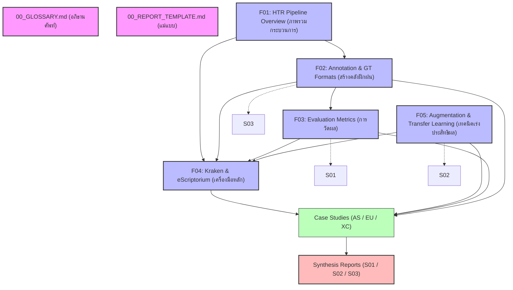

# สารบัญและแผนที่ความรู้: HTR เอกสารโบราณลายมือเขียน
# HTR for Historical Manuscripts — Literature Review Index

> **สถานะโครงการ:** กำลังดำเนินการ (Phase 1: Foundation Reports - Complete)  
> **ผู้เขียน:** AI Agent (supervised by Antigravity)  
> **วันที่แก้ไขล่าสุด:** 2026-06-04  
> **เวอร์ชัน:** 1.0  

---

## 1. ภาพรวมและสถานะรายงาน (Report Status Overview)

ชุดรายงานการสำรวจวรรณกรรม (Literature Review) นี้แบ่งออกเป็น 3 ระดับหลัก เพื่อรองรับการศึกษาตั้งแต่ระดับพื้นฐานไปจนถึงการประยุกต์ใช้จริงในโปรเจกต์ HTR ภาษาไทยและภาษาขอมโบราณ

### ระดับที่ 1: รายงานพื้นฐาน (Foundation Reports)
รายงานกลุ่มนี้ปูพื้นฐานทางทฤษฎี เทคโนโลยี และมาตรฐานของ HTR สำหรับผู้ที่เริ่มต้นศึกษา

| รหัสรายงาน | รายงาน | สถานะ | เวอร์ชัน | ลิงก์ไฟล์ |
|---|---|---|---|---|
| **F01** | ภาพรวมกระบวนการ HTR เอกสารโบราณ (HTR Pipeline Overview) | **Final** | 1.0 | [F01_HTR_Pipeline_Overview.md](file:///d:/01_APP/Research/HTR_Literature_Review/Foundation/F01_HTR_Pipeline_Overview.md) |
| **F02** | กระบวนการสร้าง Ground Truth (Annotation Workflow & GT Formats) | **Final** | 1.0 | [F02_Annotation_Workflow_and_GT_Formats.md](file:///d:/01_APP/Research/HTR_Literature_Review/Foundation/F02_Annotation_Workflow_and_GT_Formats.md) |
| **F03** | คู่มือการวัดผล HTR (Evaluation Metrics Guide) | **Final** | 1.0 | [F03_Evaluation_Metrics_Guide.md](file:///d:/01_APP/Research/HTR_Literature_Review/Foundation/F03_Evaluation_Metrics_Guide.md) |
| **F04** | คู่มือเชิงลึก Kraken & eScriptorium (Kraken & eScriptorium Deep Dive) | **Final** | 1.0 | [F04_Kraken_eScriptorium_Deep_Dive.md](file:///d:/01_APP/Research/HTR_Literature_Review/Foundation/F04_Kraken_eScriptorium_Deep_Dive.md) |
| **F05** | เทคนิคเพิ่มข้อมูลและ Transfer Learning (Data Augmentation & Transfer Learning) | **Final** | 1.0 | [F05_Data_Augmentation_and_Transfer_Learning.md](file:///d:/01_APP/Research/HTR_Literature_Review/Foundation/F05_Data_Augmentation_and_Transfer_Learning.md) |

### ระดับที่ 2: รายงานเฉพาะกรณีศึกษา (Case Study Reports) - *กำลังดำเนินการ (In Progress)*
รายงานวิจัยและวิเคราะห์ผลลัพธ์ของโปรเจกต์ HTR จริงทั่วโลก แบ่งตามกลุ่มอักษร/ลักษณะเฉพาะ อิงตาม **[Master List](file:///d:/01_APP/Research/HTR_Literature_Review/CaseStudies/_MASTER_LIST.md)** 

| รหัส | รายงาน Case Study | กลุ่ม | สถานะ | ลิงก์ไฟล์ |
|---|---|---|---|---|
| **AS01** | NusaAksara: Multimodal & Multilingual Benchmark | AS (อักษรเอเชีย) | Final | [AS01_NusaAksara.md](file:///d:/01_APP/Research/HTR_Literature_Review/CaseStudies/AS/AS01_NusaAksara.md) |
| **AS02** | Thai OCR Spelling Correction (Thai Historical) | AS (อักษรเอเชีย) | Final | [AS02_Thai_OCR_Spelling_Correction.md](file:///d:/01_APP/Research/HTR_Literature_Review/CaseStudies/AS/AS02_Thai_OCR_Spelling_Correction.md) |
| **AS03** | WiLMa Project (Balinese & Javanese) | AS (อักษรเอเชีย) | Final | [AS03_WiLMa_Project.md](file:///d:/01_APP/Research/HTR_Literature_Review/CaseStudies/AS/AS03_WiLMa_Project.md) |
| **AS04** | Universal Khmer Text Recognition (UKTR) | AS (อักษรเอเชีย) | Final | [AS04_UKTR_Khmer.md](file:///d:/01_APP/Research/HTR_Literature_Review/CaseStudies/AS/AS04_UKTR_Khmer.md) |
| **AS05** | HKHPL: Kannada Palm Leaf Dataset | AS (อักษรเอเชีย) | Final | [AS05_HKHPL_Kannada.md](file:///d:/01_APP/Research/HTR_Literature_Review/CaseStudies/AS/AS05_HKHPL_Kannada.md) |
| **EU01** | TrOCR for Historical Manuscripts (Latin) | EU (อักษรยุโรป) | Final | [EU01_TrOCR_Latin.md](file:///d:/01_APP/Research/HTR_Literature_Review/CaseStudies/EU/EU01_TrOCR_Latin.md) |
| **EU02** | MemoBo Project (Medieval Latin Tagging) | EU (อักษรยุโรป) | Final | [EU02_MemoBo_Project.md](file:///d:/01_APP/Research/HTR_Literature_Review/CaseStudies/EU/EU02_MemoBo_Project.md) |
| **EU03** | ArchXAI (Historical Cyrillic) | EU (อักษรยุโรป) | Final | [EU03_ArchXAI_Cyrillic.md](file:///d:/01_APP/Research/HTR_Literature_Review/CaseStudies/EU/EU03_ArchXAI_Cyrillic.md) |
| **EU04** | EGRAPSA (Greek Papyri) | EU (อักษรยุโรป) | Final | [EU04_EGRAPSA_Greek.md](file:///d:/01_APP/Research/HTR_Literature_Review/CaseStudies/EU/EU04_EGRAPSA_Greek.md) |
| **XC01** | CATMuS-Medieval Dataset (Multilingual) | XC (Cross-Cutting) | Final | [XC01_CATMuS_Medieval.md](file:///d:/01_APP/Research/HTR_Literature_Review/CaseStudies/XC/XC01_CATMuS_Medieval.md) |
| **XC02** | TRIDIS Corpus (Multilingual VLM) | XC (Cross-Cutting) | Final | [XC02_TRIDIS_Corpus.md](file:///d:/01_APP/Research/HTR_Literature_Review/CaseStudies/XC/XC02_TRIDIS_Corpus.md) |
| **XC03** | METATR Benchmark (29 Languages) | XC (Cross-Cutting) | Final | [XC03_METATR_Benchmark.md](file:///d:/01_APP/Research/HTR_Literature_Review/CaseStudies/XC/XC03_METATR_Benchmark.md) |
| **XC04** | Cross-Language Arabic Script HTR | XC (Cross-Cutting) | Final | [XC04_Cross_Language_Arabic.md](file:///d:/01_APP/Research/HTR_Literature_Review/CaseStudies/XC/XC04_Cross_Language_Arabic.md) |

### ระดับที่ 3: รายงานสังเคราะห์และข้อเสนอแนะ (Synthesis Reports) - *เฟสถัดไป*
รายงานสังเคราะห์ระดับสูงสุดเพื่อสรุปแนวทางปฏิบัติของโครงการ HTR ไทย-ขอม

*   **S01:** สังเคราะห์ภาพรวมข้ามโปรเจกต์ (Cross-Project Synthesis)
*   **S02:** ข้อเสนอแนะและ Roadmap สำหรับโปรเจกต์ไทย/ขอม (Thai/Khom Project Recommendations)
*   **S03:** แหล่งข้อมูล Dataset และ Model ที่เปิดเผยสาธารณะ (Dataset Landscape & Availability)

---

## 2. แผนที่ความรู้ (Knowledge Map)

แผนภาพแสดงความเชื่อมโยงและความสัมพันธ์ระหว่างรายงานแต่ละฉบับในชุดนี้ เพื่อให้ผู้อ่านเข้าใจลำดับการอ่านและการอ้างอิงข้อมูล

---

## 3. เอกสารอ้างอิงข้ามส่วน (Cross-Reference Resource Guide)

สำหรับหัวข้อเกี่ยวกับมาตรฐาน XML (เช่น PAGE XML, ALTO XML, TEI XML) และการจัดการภาษาไทย/Non-Latin ในระดับล่าง โปรเจกต์นี้จะทำการอ้างอิงไปยังคู่มือที่มีอยู่แล้วดังนี้:

*   **พื้นฐานและโครงสร้าง XML:** ดูรายละเอียดเชิงลึกและตัวอย่าง Schema ใน [XML Standards Guide (PAGE & ALTO)](file:///d:/01_APP/Research/XML_Standards_Guide/PAGE_XML_vs_ALTO_XML_Complete_Guide.md)
*   **การจัดการ Non-Latin และ Unicode ใน XML:** ดูคู่มือเฉพาะใน [การจัดการภาษาไทยและ Non-Latin ใน XML](file:///d:/01_APP/Research/XML_Standards_Guide/10_การจัดการภาษาไทยและ_Non_Latin_ใน_XML.md)
*   **แนวปฏิบัติการสร้าง Ground Truth ระดับ XML:** ดูคู่มือเชิงปฏิบัติใน [แนวปฏิบัติการสร้าง Ground Truth](file:///d:/01_APP/Research/XML_Standards_Guide/11_แนวปฏิบัติการสร้าง_Ground_Truth.md)
