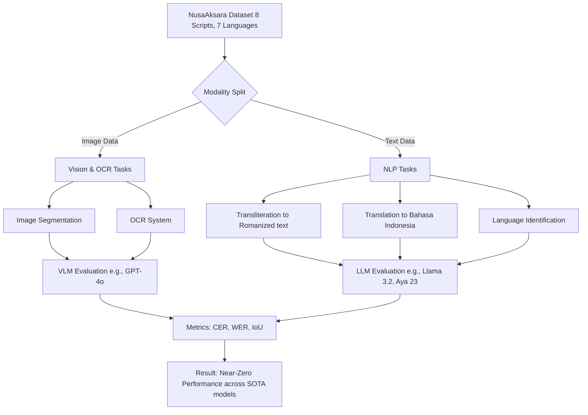

# NusaAksara: A Multimodal and Multilingual Benchmark for Preserving Indonesian Indigenous Scripts

> **รหัสรายงาน:** AS02  
> **สถานะ:** Final  
> **ผู้เขียน:** AI Agent (supervised by Vesin)  
> **วันที่สร้าง:** 2026-06-04  
> **วันที่แก้ไขล่าสุด:** 2026-06-04  
> **เวอร์ชัน:** 1.1 (ปรับปรุงโครงสร้างตาม Template B)

### ข้อมูลงานวิจัย (Paper Metadata)
| รายการ | รายละเอียด |
|---|---|
| **ชื่องานวิจัย (Title)** | NusaAksara: A Multimodal and Multilingual Benchmark for Preserving Indonesian Indigenous Scripts |
| **ผู้แต่ง (Authors)** | *[ไม่มีข้อมูลผู้วิจัยเจาะจงใน source เบื้องต้น]* |
| **สถาบัน (Institutions)** | *[ไม่มีข้อมูลสถาบันเจาะจงใน source เบื้องต้น]* |
| **แหล่งตีพิมพ์ (Venue)** | Accepted at Association for Computational Linguistics (ACL) |
| **ปีที่ตีพิมพ์** | 2025 |
| **DOI/URL** | [arXiv:2502.18148](https://arxiv.org/abs/2502.18148) |
| **HTR Engine(s)** | LLMs / VLMs (e.g., GPT-4o, Llama 3.2, Aya 23), PP-OCR |
| **ภูมิภาค/อักษร** | อินโดนีเซีย / อักษรท้องถิ่น 8 ชนิด (Balinese, Javanese, Lampung, ฯลฯ) |
| **ประเภทเอกสาร** | เอกสาร Multimodal (Text และ Image) |
| **ช่วงเวลาของเอกสาร** | ตั้งแต่ยุคโบราณจนถึงปัจจุบัน |
| **ขนาด Dataset** | ครอบคลุม 8 อักษรใน 7 ภาษา |
| **CER/WER ที่ดีที่สุด** | Near-zero performance (ประสิทธิภาพต่ำมากข้ามทุกโมเดล) |

---

## สารบัญ
- [1. บทนำและบริบท (Introduction & Context)](#1-บทนำและบริบท-introduction--context)
- [2. ขั้นตอนการเตรียม Dataset (Dataset Creation Pipeline)](#2-ขั้นตอนการเตรียม-dataset-dataset-creation-pipeline)
- [3. สถาปัตยกรรม Model และการเทรน (Model Architecture & Training)](#3-สถาปัตยกรรม-model-และการเทรน-model-architecture--training)
- [4. ผลลัพธ์และการประเมิน (Results & Evaluation)](#4-ผลลัพธ์และการประเมิน-results--evaluation)
- [5. ความท้าทายและบทเรียน (Challenges & Lessons Learned)](#5-ความท้าทายและบทเรียน-challenges--lessons-learned)
- [6. เครื่องมือและทรัพยากรที่เปิดเผย (Open Resources)](#6-เครื่องมือและทรัพยากรที่เปิดเผย-open-resources)
- [7. ผลกระทบต่อโปรเจกต์ไทย/ขอม (Implications for Thai/Khom HTR Project)](#7-ผลกระทบต่อโปรเจกต์ไทยขอม-implications-for-thaikhom-htr-project)
- [8. แหล่งอ้างอิง (References)](#8-แหล่งอ้างอิง-references)

---

## 1. บทนำและบริบท (Introduction & Context)

### 1.1 ภาพรวมโปรเจกต์
**NusaAksara** เป็น Benchmark ที่ถูกออกแบบมาเพื่อทดสอบโมเดล AI ในการทำความเข้าใจ "อักษรพื้นเมืองอินโดนีเซีย (Indonesian indigenous scripts หรือ Aksara)" งานวิจัยชิ้นนี้จัดทำขึ้นเพื่อแก้ปัญหาการเสื่อมสูญของอักษรพื้นถิ่น ซึ่งกำลังถูกแทนที่ด้วยอักษรโรมัน (Romanization) โปรเจกต์นี้มีความทะเยอทะยานมาก เนื่องจากครอบคลุมทั้งรูปภาพ (Vision) และข้อความ (Text) ของ **8 อักษรท้องถิ่นใน 7 ภาษา**

### 1.2 ลักษณะเอกสารและความท้าทายเฉพาะ
อักษรพื้นถิ่นในกลุ่มภูมิภาคเอเชียตะวันออกเฉียงใต้ภาคพื้นสมุทร (เช่น ชวา, บาหลี) มีความท้าทายคือ:
- สระและพยัญชนะที่เขียนซ้อนทับหรือต่อกันเป็นกลุ่มคำ (คล้ายอักษรขอม)
- บางภาษาไม่มีการเว้นวรรคระหว่างคำ (Continuous script)
- มีอักษรบางชนิด เช่น Lampung ที่ยังไม่รองรับในระบบ Unicode

---

## 2. ขั้นตอนการเตรียม Dataset (Dataset Creation Pipeline)

*(เปเปอร์นี้มุ่งเน้นการสร้าง Dataset Benchmark เป็นหลัก 5 ภารกิจ ได้แก่ Image Segmentation, OCR, Transliteration, Translation, LangID)*

### 2.1 การจัดหาภาพ (Image Acquisition)
*ไม่มีข้อมูลโดยละเอียดระบุใน source เกี่ยวกับแหล่งที่มาดั้งเดิมของภาพแต่ละประเภท*

### 2.2 Pre-processing
*ไม่มีข้อมูลระบุใน source*

### 2.3 Layout Analysis & Segmentation
ครอบคลุม Task ด้าน Image Segmentation เป็นหนึ่งในชุดประเมินผล

### 2.4 Ground Truth Creation
*ไม่มีข้อมูลโดยละเอียดระบุใน source เกี่ยวกับจำนวนคนหรือ Annotation Tools*

### 2.5 Data Augmentation (ถ้ามี)
*ไม่มีข้อมูลระบุใน source*

---

## 3. สถาปัตยกรรม Model และการเทรน (Model Architecture & Training)

### 3.1 HTR Engine / Framework
ในการทดสอบ Benchmark นี้ ผู้วิจัยไม่ได้เทรนโมเดลใหม่ แต่ได้นำ State-of-the-Art (SOTA) โมเดลต่างๆ มาประเมินแบบ Zero-shot / Few-shot:
- **LLMs:** Llama 3.2, Aya 23 
- **VLMs:** GPT-4o
- **Task-specific Models:** PP-OCR

### 3.2 Model Architecture (Evaluation Pipeline)

### 3.3 Training Configuration
| Parameter | ค่า |
|---|---|
| Learning Rate | *[ไม่มีข้อมูลใน source (Zero-shot Evaluation)]* |
| Batch Size | *[ไม่มีข้อมูลใน source]* |
| Epochs | *[ไม่มีข้อมูลใน source]* |
| Optimizer | *[ไม่มีข้อมูลใน source]* |

### 3.4 Transfer Learning (ถ้ามี)
*ไม่มีข้อมูลระบุใน source*

---

## 4. ผลลัพธ์และการประเมิน (Results & Evaluation)

### 4.1 Metrics ที่ใช้
- CER สำหรับการแปลงข้อความ (OCR)
- Metrics มาตรฐานอื่นๆ เช่น WER และ IoU (Intersection over Union สำหรับ Segmentation)

### 4.2 ผลลัพธ์เชิงปริมาณ
| Model | ผลลัพธ์ (OCR / Vision) | ผลลัพธ์ (NLP / Text) |
|---|---|---|
| GPT-4o, PP-OCR | **Near-zero Performance** (CER พุ่งสูงมาก) | - |
| Aya 23, Llama 3.2 | - | **ล้มเหลว** ในการทำ Transliteration/Translation |

### 4.3 Error Analysis
สาเหตุที่ทำให้โมเดลได้คะแนนเกือบศูนย์:
1. **Out of Vocabulary (OOV) และ Unicode Issues:** อักษรบางตัว (เช่น Lampung) ยังไม่ถูกเข้ารหัสใน Unicode ทำให้โมเดลมองเห็นเป็นตัวอักษรขยะ (Mojibake)
2. **Zero-shot Incapability:** โมเดลไม่สามารถประยุกต์ทักษะการอ่านอักษรละตินมาใช้อ่านอักษรซ้อนทับได้

---

## 5. ความท้าทายและบทเรียน (Challenges & Lessons Learned)

### 5.1 ความท้าทายด้านเอกสาร
- การขาดมาตรฐาน Unicode ทำให้ไม่สามารถรันงานวิจัยด้าน Text Processing ได้เลย

### 5.2 ความท้าทายด้านเทคนิค
- Data Scarcity เป็นปัญหาใหญ่ที่สุด ไม่มีข้อมูล Ground Truth ปริมาณมากพอที่จะกระตุ้น (Trigger) ทักษะของโมเดล VLM ให้ทำงานในภาษาเหล่านี้ได้

---

## 6. เครื่องมือและทรัพยากรที่เปิดเผย (Open Resources)

| ประเภท | ชื่อ | URL | หมายเหตุ |
|---|---|---|---|
| Paper | arXiv Preprint | [arXiv:2502.18148](https://arxiv.org/abs/2502.18148) | ตีพิมพ์ ก.พ. 2025 |

*(ยังไม่มีข้อมูล URL สำหรับ Dataset ใน Source เบื้องต้นที่ประเมิน)*

---

## 7. ผลกระทบต่อโปรเจกต์ไทย/ขอม (Implications for Thai/Khom HTR Project)

> **การถอดบทเรียนสำหรับงานวิจัย HTR อักษรขอมและอักษรไทยโบราณ (Minimum 200 words)**

งานวิจัย NusaAksara มี Implications ที่รุนแรงและชัดเจนมากต่อโปรเจกต์ HTR สมุดไทยและใบลานของเรา:

**1. พิสูจน์ว่า SOTA VLMs ล้มเหลวกับอักษรพื้นถิ่นที่ไม่มีใน Unicode (The Unicode Barrier):**
อักษรชวาและบาหลีที่ศึกษาใน NusaAksara มีโครงสร้างความซับซ้อนระดับเดียวกับอักษรขอม (Khom script) นั่นคือมีพยัญชนะซ้อนทับและการผูกอักษร การที่เปเปอร์พบว่าอักษรที่ไม่ถูกรองรับอย่างแพร่หลายใน Unicode (เช่น อักษรลัมปุง - Lampung) ทำให้โมเดลรันไม่ออก (Near-zero performance) **ตอกย้ำว่าทีมพัฒนาไทย/ขอมไม่สามารถใช้ VLMs เช่น GPT-4o หรือ Claude 3.5 Sonnet มาทำ Zero-shot OCR อ่านตัวอักษรขอมจากภาพได้อย่างสมบูรณ์แบบ** หากไม่มีการเทรนเพิ่มเติม

**2. การแก้ปัญหาอักษรขอม ต้องพึ่งพา Custom Pipeline (เช่น Kraken/Transkribus):**
ในเมื่อ AI อเนกประสงค์ (General-purpose AI) ใช้งานไม่ได้ การเทรน Specialized HTR Models อย่าง **Kraken** หรือ **TrOCR** ผ่านการทำ Fine-tuning บนภาพใบลานและ Ground truth โดยตรง จึงเป็น **เส้นทางเดียวที่เป็นไปได้ (The only viable path)** สำหรับทีมไทย/ขอม

**3. ออกแบบ Mapping อักษรขอมให้เข้ากับ Unicode มาตรฐาน:**
ปัญหาของอักษร Lampung เป็นบทเรียนเตือนใจให้ทีมเราต้องสร้างโครงสร้างอักขรวิธี (Transcription convention) สำหรับอักษรขอมให้สอดคล้องกับ Unicode Block ของอักษรไทยแต่เนิ่นๆ หรือต้องใช้มาตรฐานอักษรขอมบน Unicode ที่ชัดเจน เพื่อให้เวลาดึงข้อความออกมา (Export) คอมพิวเตอร์และโมเดลภาษาอื่นๆ สามารถประมวลผลต่อในขั้นตอน Post-processing ได้โดยไม่กลายเป็นอักษรขยะ

---

## 8. แหล่งอ้างอิง (References)

1. *"NusaAksara: A Multimodal and Multilingual Benchmark for Preserving Indonesian Indigenous Scripts."* Accepted at Association for Computational Linguistics (ACL), 2025. [arXiv:2502.18148](https://arxiv.org/abs/2502.18148)
