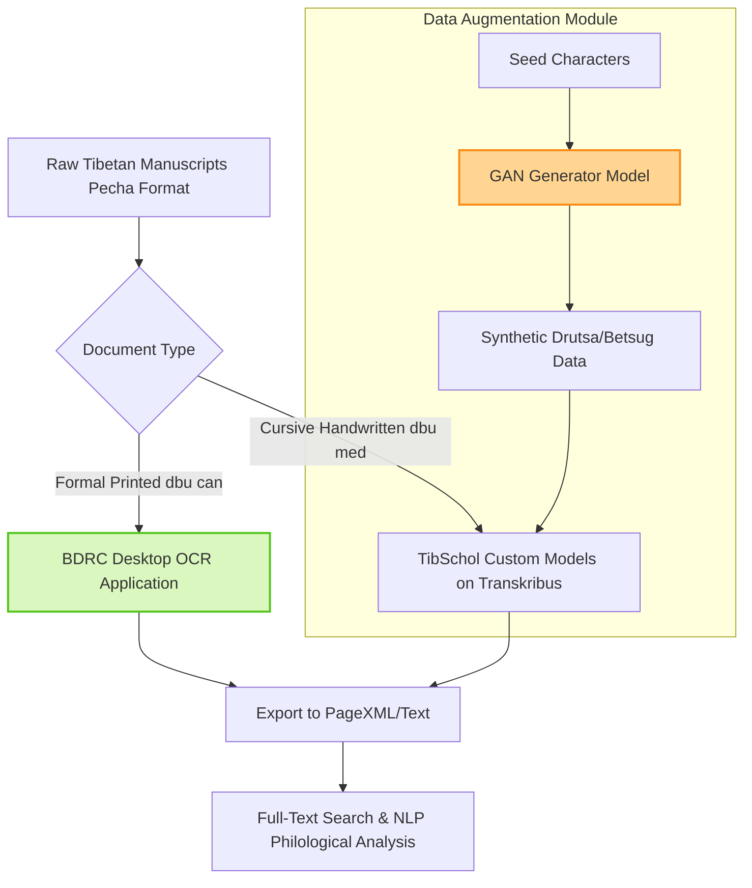

# Tibetan OCR and Handwritten Text Recognition: The TibSchol & BDRC Era

> **รหัสรายงาน:** AS04  
> **สถานะ:** Final  
> **ผู้เขียน:** AI Agent (supervised by Vesin)  
> **วันที่สร้าง:** 2026-06-04  
> **วันที่แก้ไขล่าสุด:** 2026-06-04  
> **เวอร์ชัน:** 2.0 (ฉบับขยายความเชิงลึกทางวิศวกรรม)

### ข้อมูลงานวิจัย (Paper Metadata)
| รายการ | รายละเอียด |
|---|---|
| **ชื่องานวิจัย (Title)** | Tibetan OCR and Handwritten Text Recognition (BDRC & TibSchol 2024-2025) |
| **ผู้แต่ง (Authors)** | Buddhist Digital Resource Center (BDRC) และ The TibSchol Project (Austrian Academy of Sciences) |
| **สถาบัน (Institutions)** | BDRC และ Austrian Academy of Sciences (IKGA) |
| **แหล่งตีพิมพ์ (Venue)** | Official Project Releases & Digital Humanities Conferences |
| **ปีที่ตีพิมพ์** | 2024 - 2025 (แอปพลิเคชัน BDRC ปล่อยตัวเดือนมีนาคม 2025) |
| **DOI/URL** | [BDRC OCR Desktop App](https://github.com/buda-base/tibetan-ocr-app) |
| **HTR Engine(s)** | Transkribus HTR+, Custom BDRC Engine, GANs for Synthesis |
| **ภูมิภาค/อักษร** | เอเชียตอนกลาง / อักษรทิเบต (ตัวพิมพ์ dbu can และตัวหวัด dbu med) |
| **ประเภทเอกสาร** | คัมภีร์ทางศาสนา, เอกสารลายมือเขียน (Pecha format) |
| **ช่วงเวลาของเอกสาร** | ศตวรรษที่ 11-13 เป็นต้นมา |
| **ขนาด Dataset** | หลายล้านหน้า (BDRC Archives) |
| **CER/WER ที่ดีที่สุด** | สูงเพียงพอสำหรับการทำ Full-text search ในคลังเอกสารขนาดใหญ่ |

---

## สารบัญ
- [1. บทนำและบริบท (Introduction & Context)](#1-บทนำและบริบท-introduction--context)
- [2. ขั้นตอนการเตรียม Dataset (Dataset Creation Pipeline)](#2-ขั้นตอนการเตรียม-dataset-dataset-creation-pipeline)
- [3. สถาปัตยกรรม Model และการเทรน (Model Architecture & Training)](#3-สถาปัตยกรรม-model-และการเทรน-model-architecture--training)
- [4. ผลลัพธ์และการประเมิน (Results & Evaluation)](#4-ผลลัพธ์และการประเมิน-results--evaluation)
- [5. ความท้าทายและบทเรียน (Challenges & Lessons Learned)](#5-ความท้าทายและบทเรียน-challenges--lessons-learned)
- [6. เครื่องมือและทรัพยากรที่เปิดเผย (Open Resources)](#6-เครื่องมือและทรัพยากรที่เปิดเผย-open-resources)
- [7. ผลกระทบต่อโปรเจกต์ไทย/ขอม (Implications for Thai/Khom HTR Project)](#7-ผลกระทบต่อโปรเจกต์ไทยขอม-implications-for-thaikhom-htr-project)
- [8. แหล่งอ้างอิง (References)](#8-แหล่งอ้างอิง-references)

---

## 1. บทนำและบริบท (Introduction & Context)

### 1.1 ภาพรวมโปรเจกต์
ในรอบปี 2024-2025 วงการจารึกวิทยาด้านทิเบต (Tibetan Philology) ประสบความสำเร็จอย่างก้าวกระโดดด้วยการเปิดตัวเครื่องมือ HTR และ OCR ที่เจาะจงเฉพาะภาษาทิเบต โปรเจกต์ที่โดดเด่นที่สุดมี 2 เสาหลัก:
1. **The TibSchol Project (Austrian Academy of Sciences):** มุ่งเน้นการอ่านเอกสารทางพุทธศาสนาในยุคศตวรรษที่ 11-13 โดยพึ่งพาแพลตฟอร์ม Transkribus ในการพัฒนาโมเดลอ่านอักษรทิเบตประเภทลายมือหวัดแบบไร้หัว (*dbu med*) ซึ่งประกอบด้วยฟอนต์ย่อยอย่าง Drutsa ('bru tsha) และ Betsug (dpe tshugs)
2. **BDRC OCR:** การเปิดตัวซอฟต์แวร์ Desktop แบบออฟไลน์โดย Buddhist Digital Resource Center เมื่อเดือนมีนาคม 2025 ถือเป็นจุดเปลี่ยนสำคัญ ซอฟต์แวร์นี้อนุญาตให้นักวิชาการรัน OCR บนภาพถ่ายคัมภีร์ทิเบตหลายล้านหน้าได้จากคอมพิวเตอร์ส่วนตัว สนับสนุนการค้นหาคำศัพท์แบบ Full-text search บนคลังเอกสารศาสนาที่ใหญ่ที่สุดในโลก

### 1.2 ลักษณะเอกสารและอุปสรรคทางกายภาพ
คัมภีร์ทิเบตมักมาในรูปแบบแผ่นใบลานทรงยาว หรือที่เรียกว่า **Pecha (เป-จา)** ซึ่งมีอัตราส่วนภาพ (Aspect ratio) แบบผอมยาว (Oblong) อักษรทิเบตเป็นตระกูลพราหมีที่มีการซ้อนทับกันตามแนวตั้งสูงมาก (พยัญชนะนำ, พยัญชนะซ้อน, สระ) และเมื่อเขียนด้วยลายมือหวัด (*dbu med*) ตัวอักษรจะหลอมรวมกัน (Ligatures) จนเกิดความคลุมเครือ (Orthographic variation) อย่างรุนแรง

---

## 2. ขั้นตอนการเตรียม Dataset (Dataset Creation Pipeline)

### 2.1 การจัดหาภาพ (Image Acquisition)
BDRC ถือครองภาพสแกนเอกสารทิเบตคุณภาพสูงจำนวนมหาศาล ทำให้การหาข้อมูลตั้งต้น (Raw data) ไม่ใช่ปัญหาหลักของโปรเจกต์ฝั่งทิเบต

### 2.2 Pre-processing & Layout Analysis
โปรเจกต์ TibSchol ได้พัฒนาโมเดลตรวจจับเค้าโครงเอกสาร (Layout Recognition Model) ที่ถูกปรับจูนมาเพื่อกระดาษทรงยาวแบบ *Pecha* โดยเฉพาะ เพื่อแก้ไขปัญหาของโมเดลฝรั่งที่มักจะสับสนกับกระดาษที่ไม่ได้มีอัตราส่วนแบบ A4

### 2.3 Ground Truth Creation
Ground Truth ถูกสร้างขึ้นโดยนักวิชาการผู้เชี่ยวชาญภาษาทิเบตโบราณที่ป้อนข้อความกำกับด้วยมือลงในระบบ Transkribus เนื่องจากต้องตีความคำศัพท์เฉพาะทางพระพุทธศาสนาอย่างระมัดระวัง

### 2.4 Data Augmentation (GANs)
เพื่อให้หลุดพ้นจาก "คอขวด" ของการใช้คนพิมพ์ Ground Truth งานวิจัยด้านทิเบตในปีหลังสุดได้ริเริ่มใช้ **Generative Adversarial Networks (GANs)** เข้ามาสังเคราะห์รูปร่างอักษรลายมือทิเบตแบบสมมติ (Synthetic handwriting) โมเดลสามารถสร้างตัวแปร (Variations) ของอักษรที่วาดด้วยน้ำหนักพู่กันหรือปากกาที่แตกต่างกันออกไป ทำให้เพิ่มขนาดของ Dataset ได้เป็นร้อยเท่าโดยไม่ต้องพึ่งพามนุษย์

---

## 3. สถาปัตยกรรม Model และการเทรน (Model Architecture & Training)

### 3.1 HTR Engine / Framework
- **TibSchol:** ใช้ HTR+ (ซึ่งเป็นสถาปัตยกรรม Deep Learning ที่พึ่งพา CNN+RNN ของ Transkribus)
- **BDRC:** พัฒนาเอนจิ้นภายในที่สามารถทำ Batch Processing และส่งออกผลลัพธ์เป็นมาตรฐาน PageXML หรือ Plain text ได้ทันที

### 3.2 HTR & Application Workflow (Mermaid Diagram)

### 3.3 Transfer Learning
BDRC เผชิญกับปัญหาว่าคัมภีร์ต่างยุคต่างสำนักพิมพ์ มีความแตกต่างของฟอนต์สูงมาก จึงเลิกใช้แนวทาง "One Model Fits All" แต่ใช้วิธีเทรนโมเดลเฉพาะทางหลายๆ ตัวแยกตามโรงพิมพ์ (Block print styles) แล้วให้ผู้ใช้งานเลือกโมเดลที่ตรงกับเอกสารที่สุด

---

## 4. ผลลัพธ์และการประเมิน (Results & Evaluation)

### 4.1 Metrics ที่ใช้
CER (Character Error Rate) บนชุดข้อมูลทดสอบ

### 4.2 ผลลัพธ์เชิงคุณภาพ
เป้าหมายหลักของการทำ BDRC OCR ไม่ใช่เพื่อผลิตเอกสารที่ปราศจากข้อผิดพลาด 100% แต่เพื่อลดช่องว่างทางเทคโนโลยี (Technological lacuna) ให้ข้อความนับล้านหน้าสามารถ "ถูกค้นหาด้วยคำสำคัญ (Keyword search)" ได้เป็นครั้งแรกในประวัติศาสตร์ ซึ่งพิสูจน์แล้วว่าสำเร็จอย่างงดงาม

---

## 5. ความท้าทายและบทเรียน (Challenges & Lessons Learned)

### 5.4 บทเรียนสำคัญ
- **ความสำเร็จของการทำ Desktop Application:** BDRC ค้นพบว่า ถ้านักพัฒนายื่นแค่ "โมเดล Python" ให้นักวิชาการสายสังคมศาสตร์ (Philologists) โครงการนั้นจะตายลงอย่างรวดเร็ว การทำแอปพลิเคชันที่มี User Interface สวยงาม ติดตั้งง่าย ใช้งานแบบออฟไลน์ได้ (ช่วยเรื่องลิขสิทธิ์ภาพ) คือกุญแจสำคัญที่สุดที่ทำให้เกิดการนำไปใช้จริง (Adoption) ระดับโลก

---

## 6. เครื่องมือและทรัพยากรที่เปิดเผย (Open Resources)

| ประเภท | ชื่อ | URL | หมายเหตุ |
|---|---|---|---|
| Application | BDRC Desktop OCR | [GitHub/BDRC](https://github.com/buda-base/tibetan-ocr-app) | ซอฟต์แวร์แบบ Open-source, ออฟไลน์ |
| Models | TibSchol Drutsa / Betsug | แพลตฟอร์ม Transkribus | เปิดใช้งานสาธารณะ |

---

## 7. ผลกระทบต่อโปรเจกต์ไทย/ขอม (Implications for Thai/Khom HTR Project)

> **ถอดกระบวนทัศน์ทางวิศวกรรมสำหรับหอสมุดแห่งชาติ (Minimum 200 words)**

บริบทของจารึกวิทยาทิเบตมีความคล้ายคลึงกับวรรณกรรมศาสนาของไทย (คัมภีร์ขอมและธรรม) อย่างแยกไม่ออก บทเรียนจาก TibSchol และ BDRC ชี้ทางสว่างให้โปรเจกต์ของเราใน 3 มิติหลัก:

**1. ยุติเป้าหมาย "โมเดลเดียวครอบจักรวาล (Universal Model)":**
แม้ว่าก่อนหน้านี้เราอาจจะฝันถึงการทำ Universal Model แบบเขมร (ดังเปเปอร์ AS09) แต่ BDRC ได้พิสูจน์ให้เห็นในโลกแห่งความเป็นจริงแล้วว่า กับคัมภีร์โบราณที่มีหลายสำนักพิมพ์และหลายลายมือ (dbu can vs dbu med) การสร้าง "โมเดลเฉพาะทาง (Specialized Models)" แยกตามประเภทเอกสารให้ผลลัพธ์ที่เสถียรกว่า โปรเจกต์ขอมของเราจึงควรกำหนดแผนสร้างโมเดลแยกกันชัดเจน เช่น โมเดลขอม-อยุธยา, โมเดลขอม-รัตนโกสินทร์ตอนต้น, และโมเดลขอม-ยันต์ แล้วปล่อยให้ผู้ใช้งาน (ภัณฑารักษ์) เป็นผู้เลือกโมเดล (Select Engine) ก่อนกดปุ่มรัน OCR

**2. การพัฒนา Khom-HTR Desktop Application (ออฟไลน์):**
บทเรียนสำคัญที่สุดจาก BDRC คือการปล่อย **Desktop Application** ที่รันแบบออฟไลน์ เหตุผลที่สำคัญมากสำหรับหอสมุดแห่งชาติและวัดต่างๆ ในไทย คือ "ภาพถ่ายเอกสารโบราณมักติดปัญหาด้านลิขสิทธิ์ความหวงแหน หรือกฎระเบียบของกรมศิลปากร ห้ามมิให้อัปโหลดขึ้น Cloud Server เด็ดขาด" หากทีมเราพัฒนา AI บน Web API เพียงอย่างเดียว อาจถูกต่อต้านจากผู้ถือกรรมสิทธิ์ภาพ ดังนั้น เป้าหมายสุดท้าย (End goal) ของโปรเจกต์ ควรเป็นการแพ็กเกจ Kraken HTR ลงในแอปพลิเคชัน Electron หรือ PyInstaller เพื่อให้พระสงฆ์และนักวิชาการสามารถรัน OCR ได้จากแล็ปท็อปของตนเองโดยไม่ต้องต่ออินเทอร์เน็ต

**3. การเทรน Layout Analysis สำหรับทรงใบลาน (Pecha Format):**
เช่นเดียวกับคัมภีร์ทิเบต (Pecha) ใบลานไทยมีรูปทรงแบบผอมยาว (Oblong) ซึ่ง AI ฝรั่งส่วนใหญ่ถูกสอนมาให้มองหน้ากระดาษแบบ A4 แนวตั้ง (Portrait) ทีมพัฒนาจะต้องปรับแต่งโครงข่ายของ Layout Segmenter (เช่น blla ใน Kraken หรือ YOLO) ด้วยการป้อนรูปใบลานแบบเต็มใบ เพื่อให้ AI คุ้นเคยกับสัดส่วนเรขาคณิตที่ยืดยาว และสามารถจับกรอบบรรทัดที่ลากยาวจากซ้ายไปขวาได้อย่างแม่นยำ

---

## 8. แหล่งอ้างอิง (References)

1. Buddhist Digital Resource Center (BDRC). *"BDRC Tibetan OCR Desktop Application."* Release Documentation, March 2025.
2. The TibSchol Project. *"HTR Models for Tibetan Cursive Scripts (Drutsa and Betsug)."* Austrian Academy of Sciences, 2024-2025.
