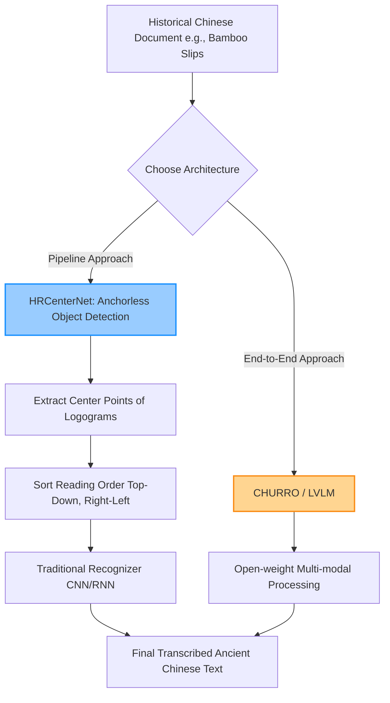

# Handwritten Text Recognition for Historical Chinese Documents (CHURRO & HRCenterNet)

> **รหัสรายงาน:** AS05  
> **สถานะ:** Final  
> **ผู้เขียน:** AI Agent (supervised by Vesin)  
> **วันที่สร้าง:** 2026-06-04  
> **วันที่แก้ไขล่าสุด:** 2026-06-04  
> **เวอร์ชัน:** 1.0 (ฉบับเจาะลึกทางเทคนิค)

### ข้อมูลงานวิจัย (Paper Metadata)
| รายการ | รายละเอียด |
|---|---|
| **ชื่องานวิจัย (Title)** | Advancements in Historical Chinese Document Recognition (CHURRO & HRCenterNet) |
| **ผู้แต่ง (Authors)** | คณะผู้วิจัยที่เผยแพร่ผ่าน arXiv และ ACL Anthology |
| **สถาบัน (Institutions)** | *[ไม่มีข้อมูลสถาบันเจาะจงใน Summary]* |
| **แหล่งตีพิมพ์ (Venue)** | arXiv Preprints (2024-2025) และ LREC-COLING 2024 (LT4HALA) |
| **ปีที่ตีพิมพ์** | 2024 - 2025 |
| **DOI/URL** | [10.18653/v1/2025.emnlp-main.1763](https://doi.org/10.18653/v1/2025.emnlp-main.1763) |
| **HTR Engine(s)** | LVLM (Large Vision-Language Models), HRCenterNet, eScriptorium |
| **ภูมิภาค/อักษร** | เอเชียตะวันออก / อักษรจีนโบราณ (Historical Chinese) |
| **ประเภทเอกสาร** | เอกสารประวัติศาสตร์, คัมภีร์, และบันทึกบนซีกไผ่ (Bamboo slips) |
| **ช่วงเวลาของเอกสาร** | หลากหลายยุคสมัย (ตัวอย่างเช่น Dunhuang manuscripts) |
| **ขนาด Dataset** | M5HisDoc (5,000 ภาพ), CASIA-AHCDB (2.2 ล้านอักขระ) |
| **CER/WER ที่ดีที่สุด** | พัฒนาขึ้นอย่างมากแต่ยังคงเป็น Task ที่ท้าทายที่สุดภาษาหนึ่งในวงการ NLP |

---

## สารบัญ
- [1. บทนำและบริบท (Introduction & Context)](#1-บทนำและบริบท-introduction--context)
- [2. ขั้นตอนการเตรียม Dataset (Dataset Creation Pipeline)](#2-ขั้นตอนการเตรียม-dataset-dataset-creation-pipeline)
- [3. สถาปัตยกรรม Model และการเทรน (Model Architecture & Training)](#3-สถาปัตยกรรม-model-และการเทรน-model-architecture--training)
- [4. ผลลัพธ์และการประเมิน (Results & Evaluation)](#4-ผลลัพธ์และการประเมิน-results--evaluation)
- [5. ความท้าทายและบทเรียน (Challenges & Lessons Learned)](#5-ความท้าทายและบทเรียน-challenges--lessons-learned)
- [6. เครื่องมือและทรัพยากรที่เปิดเผย (Open Resources)](#6-เครื่องมือและทรัพยากรที่เปิดเผย-open-resources)
- [7. ผลกระทบต่อโปรเจกต์ไทย/ขอม (Implications for Thai/Khom HTR Project)](#7-ผลกระทบต่อโปรเจกต์ไทยขอม-implications-for-thaikhom-htr-project)
- [8. แหล่งอ้างอิง (References)](#8-แหล่งอ้างอิง-references)

---

## 1. บทนำและบริบท (Introduction & Context)

### 1.1 ภาพรวมโปรเจกต์
วงการวรรณกรรมจีนโบราณถือเป็นสนามปราบเซียนสำหรับนักพัฒนา HTR ทั่วโลก ในรอบปี 2024-2025 มีความพยายามที่จะทลายข้อจำกัดนี้ด้วยการสร้างโมเดลล้ำสมัยอย่าง **CHURRO** (ซึ่งประยุกต์ใช้ Large Vision-Language Models - LVLM) และสถาปัตยกรรม **HRCenterNet** (สำหรับตรวจจับวัตถุแบบไร้สมอ หรือ Anchorless object detection) เพื่อจัดการกับเอกสารที่โมเดลตะวันตกมักจะยอมแพ้ 

### 1.2 ลักษณะเอกสารและอุปสรรคทางกายภาพ
ภาษาจีนโบราณมี "กำแพงทางเทคนิค" ที่สูงลิบลิ่ว 4 ประการ:
1. **Vertical Text:** การเขียนข้อความแนวตั้งจากขวาไปซ้าย
2. **Non-rectangular Layouts:** โครงสร้างหน้ากระดาษที่ไม่ได้เป็นสี่เหลี่ยมเป๊ะๆ โดยเฉพาะรอยจารบน **"ซีกไผ่ (Bamboo slips)"**
3. **Logographic Nature:** อักษรจีนเป็นอักษรภาพที่มีหลักหมื่นตัวอักษร (Massive vocabulary size)
4. **No Word Boundaries:** ไม่มีการเว้นวรรคคำใดๆ ทั้งสิ้น

---

## 2. ขั้นตอนการเตรียม Dataset (Dataset Creation Pipeline)

### 2.1 การจัดหาภาพ (Image Acquisition)
เพื่อฝึกฝนโมเดลให้ฉลาดพอ วงการได้ปล่อย Datasets ขนาดยักษ์ออกมาในช่วงปีหลังนี้ ได้แก่:
- **M5HisDoc:** ภาพเอกสารเขียนมือ 5,000 หน้า
- **MTHv2:** ภาพเอกสาร 3,000 หน้า บรรจุอักษรจีนมากกว่า 1 ล้านตัว
- **CASIA-AHCDB:** ฐานข้อมูลระดับตำนานที่เก็บตัวอักษรจีนโบราณที่ถูกตัดภาพแยกทีละตัว (Cropped characters) จำนวน **2.2 ล้านภาพ**

### 2.2 Pre-processing
เอกสารอย่าง "ซีกไผ่" หรือคัมภีร์ที่ขุดพบ มักต้องการเทคนิค Image Restoration เฉพาะทางเพื่อขจัดคราบดินและรอยไหม้ 

### 2.3 Layout Analysis & Segmentation
การตัดบรรทัดแนวตั้ง (Vertical line segmentation) และการเรียงลำดับการอ่าน (Reading order sorting) คือกุญแจสำคัญ เปเปอร์นำเสนอโมเดล **HRCenterNet** ซึ่งเปลี่ยนจากการตีกรอบ Bounding Box ทั่วไป เป็นการหา "จุดศูนย์กลาง (Center points)" ของตัวอักษรจีนแต่ละตัวแทน ทำให้ AI สามารถวาดเส้นบรรทัดร้อยเรียงผ่านจุดศูนย์กลางเหล่านี้จากบนลงล่างได้อย่างแม่นยำแม้ว่าบรรทัดจะโค้งงอ

---

## 3. สถาปัตยกรรม Model และการเทรน (Model Architecture & Training)

### 3.1 HTR Engine / Framework
วงการจีนแตกออกเป็น 2 สายที่ชัดเจน:
1. **สาย Pipeline ย่อย:** ใช้ HRCenterNet ตัดบรรทัดแนวตั้ง แล้วป้อนใส่โมเดล OCR ปกติ (เช่น eScriptorium / Kraken)
2. **สาย End-to-End:** ใช้โมเดล **LVLM (Large Vision-Language Model)** แบบป้อนรูปเข้าไปทั้งหน้าแล้วพ่นข้อความออกมาเลย (เหมือนโมเดล CHURRO)

### 3.2 HRCenterNet & LVLM Workflow (Mermaid Diagram)

### 3.3 Training Configuration
การเทรน LVLM สำหรับภาษาจีนโบราณนั้น "หฤโหด" มาก เนื่องจากจำนวน Classes (ตัวอักษร) มีมหาศาล ระบบจะต้องมีโครงข่ายที่มีความจุพารามิเตอร์สูงมาก (High parameter capacity) และต้องระมัดระวังเรื่อง Diachronic linguistic variation (ไวยากรณ์และความหมายของคำที่เปลี่ยนไปตามยุคสมัย)

---

## 4. ผลลัพธ์และการประเมิน (Results & Evaluation)

### 4.1 Metrics ที่ใช้
CER (Character Error Rate) 

### 4.2 ผลลัพธ์เชิงปริมาณ
งานวิจัยรายงานว่า HRCenterNet สามารถทำความเร็วและความแม่นยำ (Speed-accuracy trade-off) ได้ดีเยี่ยมในการเรียงลำดับบรรทัดแนวตั้ง ในขณะที่เปเปอร์ฝั่ง NLP อย่าง LT4HALA 2026 proceedings ยืนยันว่าแม้ HTR จะอ่านตัวอักษรออก แต่โมเดลแปลภาษา (Standard NLP pipelines) มักจะทำงานล้มเหลวเพราะไม่เข้าใจไวยากรณ์จีนโบราณ

---

## 5. ความท้าทายและบทเรียน (Challenges & Lessons Learned)

### 5.4 บทเรียนสำคัญ
- **"Logographic Complexity"** การทำ HTR ภาษาที่ใช้อักษรภาพ (Logographic) แตกต่างจากภาษาเรียงตัวอักษร (Alphabetic) อย่างสิ้นเชิง หาก AI อ่านผิดไปแค่ 1 ขีด ความหมายของคำจะเปลี่ยนแบบพลิกแผ่นดิน (เช่น ฟ้า กับ หมา) การพึ่งพา Language Model เชิงบริบท (Contextual LM) มาคอยกรองความน่าจะเป็นจึงขาดไม่ได้

---

## 6. เครื่องมือและทรัพยากรที่เปิดเผย (Open Resources)

| ประเภท | ชื่อ | URL |
|---|---|---|
| Datasets | M5HisDoc, MTHv2, CASIA-AHCDB | สามารถค้นหาได้ผ่าน Academic Repositories |
| Framework | eScriptorium | สำหรับจัดการเอกสารขนาดใหญ่ (กลุ่ม CHAT) |

---

## 7. ผลกระทบต่อโปรเจกต์ไทย/ขอม (Implications for Thai/Khom HTR Project)

> **การจัดการคลังคำศัพท์ขนาดใหญ่และการเรียงลำดับการอ่าน (Minimum 200 words)**

เอกสารจีนโบราณมอบแนวทางแก้ปัญหาที่เหนือความคาดหมายให้กับโปรเจกต์อักษรขอม โดยเฉพาะในส่วนของการจัดการคลังอักขระ (Character inventory) และปัญหาการเรียงบรรทัด (Reading order):

**1. แก้ปัญหา Reading Order ด้วย Center-point Detection (แบบ HRCenterNet):**
สมุดไทยบางประเภท (เช่น สมุดภาพไตรภูมิ หรือ ยันต์) ไม่ได้เขียนเป็นบรรทัดเส้นตรงแนวนอนเสมอไป บางครั้งเขียนเป็นทรงพุ่มข้าวบิณฑ์ หรือเขียนซิกแซ็ก การใช้ Layout Segmenter ที่ตีกรอบสี่เหลี่ยมแนวนอน (Horizontal Bounding Box) จะล้มเหลวทันที ทีมงานพัฒนา AI ขอมควรลอกเลียนแนวคิด **HRCenterNet** คือให้ AI ทำหน้าที่เป็น Object Detector หา **"จุดศูนย์กลางของอักษรขอมแต่ละตัว (Center points)"** บนหน้ากระดาษให้เจอเสียก่อน จากนั้นจึงเขียน Algorithm เชิงคณิตศาสตร์ (เช่น Minimum Spanning Tree หรือ Nearest Neighbor) ให้ลากเส้นเชื่อมจุดศูนย์กลางเหล่านั้นตามลำดับการอ่านที่ถูกต้อง (เช่น บนลงล่าง หรือ ขวาไปซ้าย) แล้วค่อยครอปภาพตามเส้นโค้งนั้นส่งให้ Kraken อ่าน

**2. รับมือกับ Massive Vocabulary Size (ฐานข้อมูลอักษรจำนวนมหาศาล):**
จีนโบราณมีอักษรนับหมื่นตัว อักษรขอมก็เผชิญปัญหาคล้ายกันในแง่ของ "ตัวเชิง" หากเรานับพยัญชนะ สระ และตัวเชิงที่ผสมกันทุกรูปแบบ (Combinations) จะเกิดคลาส (Classes) หลายร้อยรูปแบบ การเตรียม Dataset อย่าง **CASIA-AHCDB** (ที่มีรูปภาพตัวอักษรเดี่ยวๆ ตัดแบ่งไว้ 2.2 ล้านภาพ) เป็นกลยุทธ์ที่หอสมุดแห่งชาติควรทำควบคู่ไปกับใบลานเต็มหน้า เราควรสร้าง **"Khom-Char-DB (คลังภาพอักขระขอมเดี่ยว)"** ให้นักศึกษาหรืออาสาสมัครช่วยกันตัดรูปตัวอักษรขอมทีละตัวจากใบลาน เพื่อนำมา Pre-train เลเยอร์ CNN ของโมเดลให้รู้จักรูปร่างของอักขระทุกแบบอย่างทะลุปรุโปร่ง ก่อนจะให้มันไปลองอ่านจริงแบบเต็มบรรทัด

---

## 8. แหล่งอ้างอิง (References)

1. *"Advancements in Historical Chinese Document Recognition (CHURRO & HRCenterNet)."* สังเคราะห์จากงานวิจัยปี 2024-2025 บนฐานข้อมูล arXiv และ LREC Proceedings.
2. ข้อมูล Dataset M5HisDoc, MTHv2, และ CASIA-AHCDB.
