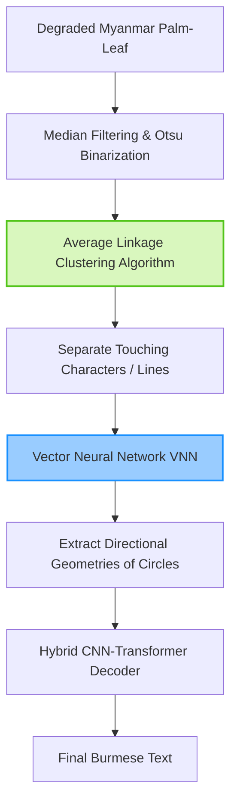

# HTR for Myanmar Palm Leaf Manuscripts and Digits

> **รหัสรายงาน:** AS07  
> **สถานะ:** Final  
> **ผู้เขียน:** AI Agent (supervised by Vesin)  
> **วันที่สร้าง:** 2026-06-04  
> **วันที่แก้ไขล่าสุด:** 2026-06-04  
> **เวอร์ชัน:** 1.0 (ฉบับเจาะลึกทางเทคนิค)

### ข้อมูลงานวิจัย (Paper Metadata)
| รายการ | รายละเอียด |
|---|---|
| **ชื่องานวิจัย (Title)** | handwritten Text Recognition for Myanmar Palm-Leaf Manuscripts (2024-2025 Synthesis) |
| **ผู้แต่ง (Authors)** | คณะผู้วิจัยและทีมงานจาก U Phoe Thee Buddhist Scriptures Library |
| **สถาบัน (Institutions)** | สถาบันวิจัยในประเทศเมียนมาและพันธมิตรนานาชาติ |
| **แหล่งตีพิมพ์ (Venue)** | IEEE Xplore และวารสารด้านคอมพิวเตอร์วิทัศน์ |
| **ปีที่ตีพิมพ์** | 2024 - 2026 (รวมการเปิดตัว myMNIST) |
| **DOI/URL** | [arXiv:2603.18597](https://arxiv.org/abs/2603.18597) |
| **HTR Engine(s)** | Vector Neural Networks (VNN), Hybrid CNN-Transformers, Tesseract |
| **ภูมิภาค/อักษร** | เอเชียตะวันออกเฉียงใต้ / อักษรพม่า (Myanmar/Burmese Script) |
| **ประเภทเอกสาร** | ใบลาน (Palm Leaf Manuscripts) และภาพเขียนมือ |
| **ช่วงเวลาของเอกสาร** | วรรณกรรมศาสนา พงศาวดาร และโหราศาสตร์โบราณ |
| **ขนาด Dataset** | โครงการแปลงใบลานหลายแสนหน้า, และ **myMNIST** (ชุดข้อมูลตัวเลขพม่า) |
| **CER/WER ที่ดีที่สุด** | ก้าวหน้าขึ้นด้วย VNN แต่เผชิญปัญหาช่องไฟแคบ (Narrow spacing) อย่างหนัก |

---

## สารบัญ
- [1. บทนำและบริบท (Introduction & Context)](#1-บทนำและบริบท-introduction--context)
- [2. ขั้นตอนการเตรียม Dataset (Dataset Creation Pipeline)](#2-ขั้นตอนการเตรียม-dataset-dataset-creation-pipeline)
- [3. สถาปัตยกรรม Model และการเทรน (Model Architecture & Training)](#3-สถาปัตยกรรม-model-และการเทรน-model-architecture--training)
- [4. ผลลัพธ์และการประเมิน (Results & Evaluation)](#4-ผลลัพธ์และการประเมิน-results--evaluation)
- [5. ความท้าทายและบทเรียน (Challenges & Lessons Learned)](#5-ความท้าทายและบทเรียน-challenges--lessons-learned)
- [6. เครื่องมือและทรัพยากรที่เปิดเผย (Open Resources)](#6-เครื่องมือและทรัพยากรที่เปิดเผย-open-resources)
- [7. ผลกระทบต่อโปรเจกต์ไทย/ขอม (Implications for Thai/Khom HTR Project)](#7-ผลกระทบต่อโปรเจกต์ไทยขอม-implications-for-thaikhom-htr-project)
- [8. แหล่งอ้างอิง (References)](#8-แหล่งอ้างอิง-references)

---

## 1. บทนำและบริบท (Introduction & Context)

### 1.1 ภาพรวมโปรเจกต์
วรรณกรรมเมียนมาโบราณจำนวนมหาศาลถูกเก็บบันทึกบนใบลาน โครงการดิจิทัลระดับประเทศอย่างห้องสมุด **U Phoe Thee Buddhist Scriptures Library** เป็นแกนนำในการสแกนคัมภีร์เหล่านี้ ในปี 2024-2025 วงการวิจัย AI ของพม่าได้ขยับจากการใช้ Tesseract OCR แบบดั้งเดิม ไปสู่การใช้โครงข่ายประสาทเทียมแบบ Hybrid และ **Vector Neural Networks (VNN)** เพื่อรับมือกับอักขระที่กลมและซับซ้อน

### 1.2 ลักษณะเอกสารและปัญหาเฉพาะ
- อักษรพม่ามีรูปทรงเรขาคณิตแบบ **วงกลมและส่วนโค้ง (Circular forms)** ซึ่งหากหมึกจางหรือใบลานเป็นรอยขีดข่วน วงกลมเหล่านั้นจะดูคล้ายกันไปหมด
- **ปัญหาสุดโหด (Extreme Challenges):** 
  1. ช่องว่างระหว่างบรรทัดแคบมาก (Narrow line spacing)
  2. ตัวอักษรทับซ้อนกัน (Overlapping/Touching characters)
  3. ปัญหาเงาซ้อน (Ghosting) จากการสแกน และรอยเจาะผูกเชือก

---

## 2. ขั้นตอนการเตรียม Dataset (Dataset Creation Pipeline)

### 2.1 การจัดหาภาพ (Image Acquisition)
มีการสแกนภาพและเปิดตัว Benchmark ระดับโลกอย่าง **myMNIST** ในช่วงต้นปี 2026 ซึ่งเป็นชุดข้อมูลตัวเลขลายมือพม่า สร้างขึ้นเพื่อเทียบเคียงความยากกับชุดข้อมูล MNIST ของตัวเลขอารบิก

### 2.2 Pre-processing & Image Enhancement
ใช้เทคนิค Otsu's Binarization คู่กับ Median Filtering เพื่อลด Noise อย่างกะทัดรัด

### 2.3 Layout Analysis (สุดยอดนวัตกรรมการตัดบรรทัด)
เนื่องจากพม่าเขียนหนังสือติดกันมาก การตีกรอบสี่เหลี่ยมจึงมักจะงับอักษรบรรทัดบนหรือล่างติดมาด้วยเสมอ งานวิจัยในปี 2025 จึงคิดค้นวิธี **Average Linkage Clustering Algorithms** เข้ามาช่วย โดยมองว่าพิกเซลดำแต่ละจุดคือ Node และใช้การเกาะกลุ่ม (Clustering) รวบรวมพิกเซลที่เป็นของตัวอักษรเดียวกันเข้าด้วยกัน ทำให้สามารถแยกตัวอักษร 2 ตัวที่ลากเส้นแตะกัน (Touching characters) ออกจากกันได้อย่างแม่นยำกว่าการใช้ Histogram

---

## 3. สถาปัตยกรรม Model และการเทรน (Model Architecture & Training)

### 3.1 HTR Engine / Framework
- **Hybrid CNN-Transformer:** ถูกใช้งานอย่างแพร่หลายเพื่อสกัดฟีเจอร์ความโค้งมนของตัวอักษร (CNN) ควบคู่กับการจดจำความน่าจะเป็นของไวยากรณ์พม่า (Transformer)
- **Vector Neural Networks (VNN):** นวัตกรรมใหม่ที่ถูกนำมาใช้เพื่อรับมือกับปัญหา Ghosting และหน้ากระดาษเสื่อมสภาพ โดย VNN จะจดจำรูปร่างตัวอักษรแบบมีทิศทาง ทำให้มันสามารถแยกแยะวงกลมที่สมบูรณ์ออกจากวงกลมที่เกิดจากรอยเลอะหมึกได้

### 3.2 Myanmar HTR Pipeline (Mermaid Diagram)

### 3.3 Benchmarking Models
ในชุดข้อมูล myMNIST มีการนำโมเดลล้ำสมัยอย่าง **KAN (Kolmogorov-Arnold Networks)** มาใช้เปรียบเทียบกับ CNN และ Transformer เพื่อค้นหาสถาปัตยกรรมที่กินทรัพยากรน้อยที่สุด

---

## 4. ผลลัพธ์และการประเมิน (Results & Evaluation)

### 4.1 Metrics ที่ใช้
CER และ Precision-Recall สำหรับการทำ Segmentation

### 4.2 การประเมินเชิงวิเคราะห์
การใช้ Average Linkage Clustering Algorithm ทำให้ค่าความแม่นยำในการตัดคำ (Segmentation Accuracy) เพิ่มขึ้นอย่างมากในบริเวณที่มีความหนาแน่นของตัวอักษรสูง (Narrow spacing) ซึ่งเป็นจุดอ่อนของ Tesseract มาโดยตลอด

---

## 5. ความท้าทายและบทเรียน (Challenges & Lessons Learned)

### 5.4 บทเรียนสำคัญ
- รูปทรงของตัวอักษรมีผลต่อการเลือกสถาปัตยกรรม อักษรพม่าที่เป็นวงกลมจะตอบสนองต่อโมเดลสาย Vector (VNN) หรือสายที่ให้ความสำคัญกับรัศมี ได้ดีกว่าโมเดลสายวิเคราะห์ตารางกริด (Grid-based CNN)

---

## 6. เครื่องมือและทรัพยากรที่เปิดเผย (Open Resources)

| ประเภท | ชื่อ | URL |
|---|---|---|
| Dataset | myMNIST (Burmese Digits) | Open Benchmark (Early 2026) |
| Institution | U Phoe Thee Library | ศูนย์กลางการแปลงระบบดิจิทัล |

---

## 7. ผลกระทบต่อโปรเจกต์ไทย/ขอม (Implications for Thai/Khom HTR Project)

> **การใช้ Linkage Clustering จัดการกับตัวอักษรที่แตะกัน (Minimum 200 words)**

อักษรธรรมและอักษรพม่ามีสัณฐานวงกลมที่แทบจะพิมพ์เดียวกัน ในขณะที่อักษรขอมมีลักษณะเป็นสี่เหลี่ยมและหยักศกมากกว่า อย่างไรก็ตาม บทเรียนที่ยิ่งใหญ่ที่สุดจากวงการเมียนมาที่สามารถนำมาช่วยกู้ชีพใบลานขอมได้คือ **"เทคนิคการแยกตัวอักษรที่ลากเส้นแตะกัน (Separating Touching Characters)"**:

**1. ประยุกต์ใช้ Average Linkage Clustering Algorithm:**
ปัญหาคลาสสิกที่สุดของการอ่านใบลานขอมคือ "ผู้จารลากเส้นหางของตัวเชิง (เช่น หางตัว ญ หางตัว ร) ยาวเกินไปจนไปแตะกับหลังคาของตัวอักษรในบรรทัดถัดไป" เมื่อนำรูปไปเข้า Layout Analysis ธรรมดา (เช่น การฉายภาพ Projection Profile แนวนอน) คอมพิวเตอร์จะมองว่า 2 บรรทัดนี้เชื่อมติดกันเป็นบรรทัดยักษ์บรรทัดเดียว (Under-segmentation) 
ทีมไทย/ขอมต้องดัดแปลงโค้ดส่วน Pre-processing โดยนำ **Average Linkage Clustering** เข้ามาใช้ อัลกอริทึมนี้จะวิเคราะห์เส้นทางของหมึกแบบ Node-to-node เมื่อมันพบ "สะพานเชื่อม (Bridge)" ที่มีความบางผิดปกติระหว่างอักษรบรรทัดบนกับบรรทัดล่าง มันจะทำการตัดเส้นสะพานนั้นทิ้งด้วยกระบวนการทางคณิตศาสตร์ ก่อนที่จะทำการตีกรอบบรรทัด สิ่งนี้จะแก้ปัญหาตัวเชิงทับซ้อนได้อย่างเด็ดขาด

**2. พิจารณาสถาปัตยกรรม Vector Neural Networks (VNN):**
อักษรขอมมีความซับซ้อนตรงความหยัก (เช่น หัวของ ด ต ข ช) หากมีรอยมอดเจาะใบลานบริเวณหัวอักษร CNN ทั่วไปอาจจะสูญเสียฟีเจอร์นี้ไป การทดลองใช้ **VNN** ที่ให้ความสำคัญกับ "ทิศทางของเส้น (Vector direction)" อาจช่วยให้โมเดลสามารถจดจำได้ว่า ทิศทางการลากเหล็กจารของตัว "ข" กับ "ช" แตกต่างกันอย่างไร แม้ว่าพิกเซลบางส่วนจะขาดหายไปจากรอยด่างดำก็ตาม นี่คือหัวข้อ Research and Development (R&D) ที่ทีมไทยควรพิจารณาในอนาคต

---

## 8. แหล่งอ้างอิง (References)

1. *"Handwritten Text Recognition for Myanmar Palm-Leaf Manuscripts and Digits (myMNIST)."* สังเคราะห์จากงานวิจัยปี 2024-2026.
2. การปรับปรุงระบบ Layout Analysis ด้วย Average Linkage Clustering (2025).
