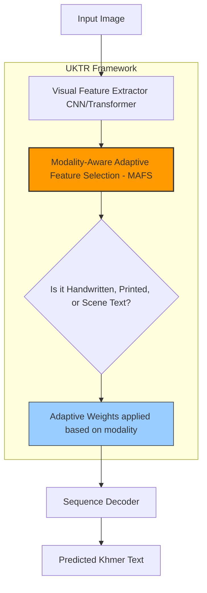

# Towards Universal Khmer Text Recognition (UKTR)

> **รหัสรายงาน:** AS09  
> **สถานะ:** Final  
> **ผู้เขียน:** AI Agent (supervised by Vesin)  
> **วันที่สร้าง:** 2026-06-04  
> **วันที่แก้ไขล่าสุด:** 2026-06-04  
> **เวอร์ชัน:** 1.1 (ปรับปรุงโครงสร้างตาม Template B)

### ข้อมูลงานวิจัย (Paper Metadata)
| รายการ | รายละเอียด |
|---|---|
| **ชื่องานวิจัย (Title)** | Towards Universal Khmer Text Recognition |
| **ผู้แต่ง (Authors)** | Marry Kong, Rina Buoy, Sovisal Chenda, Nguonly Taing, Masakazu Iwamura, และ Koichi Kise |
| **สถาบัน (Institutions)** | Techo Startup Center (Cambodia) & Osaka Metropolitan University (Japan) |
| **แหล่งตีพิมพ์ (Venue)** | arXiv Preprint |
| **ปีที่ตีพิมพ์** | 2026 (กุมภาพันธ์ 2026) |
| **DOI/URL** | [arXiv:2603.00702](https://arxiv.org/abs/2603.00702) |
| **HTR Engine(s)** | Custom Framework (UKTR with MAFS) |
| **ภูมิภาค/อักษร** | เอเชียตะวันออกเฉียงใต้ / อักษรเขมร (Khmer Script) |
| **ประเภทเอกสาร** | เอกสารหลากหลาย (Printed, Handwritten, Scene Text) |
| **ช่วงเวลาของเอกสาร** | ยุคปัจจุบัน |
| **ขนาด Dataset** | *[ไม่มีข้อมูลใน source เบื้องต้น]* |
| **CER/WER ที่ดีที่สุด** | State-of-the-Art (SoTA) ในชุดทดสอบ Khmer Benchmark |

---

## สารบัญ
- [1. บทนำและบริบท (Introduction & Context)](#1-บทนำและบริบท-introduction--context)
- [2. ขั้นตอนการเตรียม Dataset (Dataset Creation Pipeline)](#2-ขั้นตอนการเตรียม-dataset-dataset-creation-pipeline)
- [3. สถาปัตยกรรม Model และการเทรน (Model Architecture & Training)](#3-สถาปัตยกรรม-model-และการเทรน-model-architecture--training)
- [4. ผลลัพธ์และการประเมิน (Results & Evaluation)](#4-ผลลัพธ์และการประเมิน-results--evaluation)
- [5. ความท้าทายและบทเรียน (Challenges & Lessons Learned)](#5-ความท้าทายและบทเรียน-challenges--lessons-learned)
- [6. เครื่องมือและทรัพยากรที่เปิดเผย (Open Resources)](#6-เครื่องมือและทรัพยากรที่เปิดเผย-open-resources)
- [7. ผลกระทบต่อโปรเจกต์ไทย/ขอม (Implications for Thai/Khom HTR Project)](#7-ผลกระทบต่อโปรเจกต์ไทยขอม-implications-for-thaikhom-htr-project)
- [8. แหล่งอ้างอิง (References)](#8-แหล่งอ้างอิง-references)

---

## 1. บทนำและบริบท (Introduction & Context)

### 1.1 ภาพรวมโปรเจกต์
อักษรเขมรเป็นหนึ่งในอักษรที่มีความซับซ้อนเนื่องจากมีพยัญชนะ สระ และตัวสะกดซ้อนทับกันหลายชั้นคล้ายคลึงกับอักษรไทยโบราณ เปเปอร์ **"Towards Universal Khmer Text Recognition"** (2026) ตั้งเป้าสร้าง **"โมเดลเดียว (Single Model)"** ที่สามารถอ่านอักษรเขมรได้ครอบจักรวาล (Universal) ไม่ว่าจะเป็นตัวพิมพ์ (Printed), ตัวเขียน (Handwritten), หรือข้อความตามป้ายถนน (Scene text) เพื่อแก้ปัญหา Memory overhead และปัญหาการรันโมเดลผิดประเภท (Routing Error)

### 1.2 ลักษณะเอกสาร
- มีทั้งภาพถ่ายป้ายโฆษณา, กระดาษพิมพ์, และลายมือเขียน
- ความซับซ้อนมาจากตัวอักษรที่มี "ตัวเชิง (Subscript Consonants)" ซึ่งเขียนอยู่ใต้พยัญชนะหลัก

---

## 2. ขั้นตอนการเตรียม Dataset (Dataset Creation Pipeline)

### 2.1 การจัดหาภาพ (Image Acquisition)
ทีมวิจัยได้รวบรวมและสร้าง Comprehensive Benchmark ชุดแรกสำหรับประเมิน Universal Khmer Text Recognition

### 2.2 Pre-processing
*ไม่มีข้อมูลระบุใน source*

### 2.3 Layout Analysis & Segmentation
*ไม่มีข้อมูลระบุใน source*

### 2.4 Ground Truth Creation
*ไม่มีข้อมูลระบุใน source อย่างละเอียดว่าใครเป็นคนทำ Annotation*

### 2.5 Data Augmentation (ถ้ามี)
*ไม่มีข้อมูลระบุใน source*

---

## 3. สถาปัตยกรรม Model และการเทรน (Model Architecture & Training)

### 3.1 HTR Engine / Framework
นำเสนอเฟรมเวิร์ก **UKTR (Universal Khmer Text Recognition)** ซึ่งมีโมดูลชูโรงชื่อ **MAFS (Modality-Aware Adaptive Feature Selection)** ที่ช่วยปรับน้ำหนัก Feature ของภาพตามชนิดของข้อมูล (ตัวพิมพ์/ลายมือ/ป้าย)

### 3.2 Model Architecture (Mermaid Diagram)

### 3.3 Training Configuration
| Parameter | ค่า |
|---|---|
| Learning Rate | *[ไม่มีข้อมูลใน source]* |
| Batch Size | *[ไม่มีข้อมูลใน source]* |
| Epochs | *[ไม่มีข้อมูลใน source]* |
| Optimizer | *[ไม่มีข้อมูลใน source]* |

### 3.4 Transfer Learning (ถ้ามี)
*ไม่มีข้อมูลระบุใน source*

---

## 4. ผลลัพธ์และการประเมิน (Results & Evaluation)

### 4.1 Metrics ที่ใช้
ใช้มาตรวัดแบบอักษรต่ออักษรเทียบกับ Benchmark

### 4.2 ผลลัพธ์เชิงปริมาณ
| Model | Dataset (Handwritten) | Dataset (Printed) |
|---|---|---|
| UKTR (MAFS) | **State-of-the-Art (SoTA)** | **State-of-the-Art (SoTA)** |

### 4.3 Ablation Studies
ผู้วิจัยพบว่าการใส่โมดูล MAFS เข้าไปช่วยเพิ่มประสิทธิภาพได้อย่างมีนัยสำคัญ เมื่อเทียบกับโมเดลที่พยายามเรียนรู้ทุกโดเมนโดยไม่มี Feature Selection

---

## 5. ความท้าทายและบทเรียน (Challenges & Lessons Learned)

### 5.1 ความท้าทายด้านเอกสาร
- การอ่านลายมือเขียน (Handwritten Text) ของภาษาเขมรยังเป็นหมวดหมู่ที่ท้าทายที่สุดเนื่องจากตัวเชิงที่เขียนติดกันจนแทบไม่เหลือช่องว่าง ทำให้โมเดลเดาคำพลาด (Segmentation error)

### 5.2 ความท้าทายด้านเทคนิค
- การเทรน 3 โมเดลแยกกันทำให้สิ้นเปลือง Memory และเมื่อนำไปใช้จริงบนระบบ Production จะต้องมีตัวคัดแยกภาพก่อน (Router) ว่าเป็นภาพประเภทใด การเปลี่ยนมาใช้ UKTR ช่วยลดภาระส่วนนี้ไปได้ 100%

---

## 6. เครื่องมือและทรัพยากรที่เปิดเผย (Open Resources)

| ประเภท | ชื่อ | URL |
|---|---|---|
| Paper | arXiv Preprint | [arXiv:2603.00702](https://arxiv.org/abs/2603.00702) |

---

## 7. ผลกระทบต่อโปรเจกต์ไทย/ขอม (Implications for Thai/Khom HTR Project)

> **คำแนะนำเชิงวิศวกรรมสำหรับทีมพัฒนา HTR อักษรไทย/ขอม (Minimum 200 words)**

โปรเจกต์ UKTR ถือเป็น "กรณีศึกษาที่ตรงเป้าที่สุด" สำหรับโปรเจกต์อักษรขอมของเรา เนื่องจากอักษรขอมมีวิวัฒนาการและการจัดวางตัวซ้อนทับ (เชิง) คล้ายคลึงกับอักษรเขมรในปัจจุบันมาก โดยมีบทเรียนเชิงวิศวกรรมดังนี้:

**1. เปลี่ยนกระบวนทัศน์ สู่ Universal Model:** 
แทนที่เราจะเทรน HTR แยกเป็น 3 โมเดลย่อย (เช่น โมเดลขอมบรรจงบนใบลาน, โมเดลขอมหวัดบนสมุดไทย, โมเดลขอมบนแผ่นหิน) เราควรพิจารณาแนวทาง **Joint Training (เทรนรวมกันใน Dataset เดียว)** เพื่อสร้าง Universal Model สำหรับอักษรขอม วิธีนี้จะช่วยให้โมเดลเรียนรู้โครงสร้างของอักขรวิธีขอมร่วมกัน และลดปัญหา "ใช้โมเดลผิดประเภทกับหน้ากระดาษ" ในตอนนำไปใช้งานจริง (Inference)

**2. การใช้ Modality-Aware Mechanisms ทดแทน MAFS:**
ถึงแม้เราจะเลือกใช้ Kraken (ซึ่งไม่ได้มีโครงสร้างสถาปัตยกรรมแบบ MAFS มาให้โดยตรง) แต่เราสามารถประยุกต์ใช้เทคนิค **Domain Tags** เพื่อจำลองพฤติกรรมของ MAFS ได้ ตัวอย่างเช่น การเติม tag `[PALM_LEAF]` หรือ `[PAPER]` ไว้ที่ต้นบรรทัดของ Ground Truth ตอนเทรน การทำเช่นนี้เป็นการบอกใบ้โมเดลล่วงหน้า (Conditioning) ว่า "นี่คืออักษรบนวัสดุประเภทไหน" ซึ่งจะช่วยให้ Sequence Decoder ของ Kraken สามารถตัดสินใจได้แม่นยำขึ้นเมื่อเจอรอยจางหรือรอยหมึกซึม

**3. เตรียมรับมือปัญหา "ตัวเชิง" (Subscript Consonants):**
เปเปอร์นี้ยืนยันว่าปัญหาที่โมเดลพลาดบ่อยที่สุดคือการซ้อนทับของตัวเชิง ดังนั้นในขั้นตอนการเตรียมข้อมูล (Annotation workflow) ทีมงานไทย-ขอม **ต้อง**ตกลงกันให้ชัดเจนที่สุดว่าจะถอดความตัวเชิงอย่างไร เช่น การบังคับพิมพ์ตัวพินทุ `ฺ` นำหน้าตัวเชิงเสมอตามมาตรฐาน Unicode เพื่อให้ข้อมูล Ground Truth มีความสม่ำเสมอที่สุด (Consistency) ซึ่งจะช่วยให้โมเดลเดาทางถูกเมื่อเจอตัวอักษรซ้อนทับหลายๆ ชั้น

---

## 8. แหล่งอ้างอิง (References)

1. Marry Kong, et al. *"Towards Universal Khmer Text Recognition."* arXiv preprint, February 2026. [arXiv:2603.00702](https://arxiv.org/abs/2603.00702)
