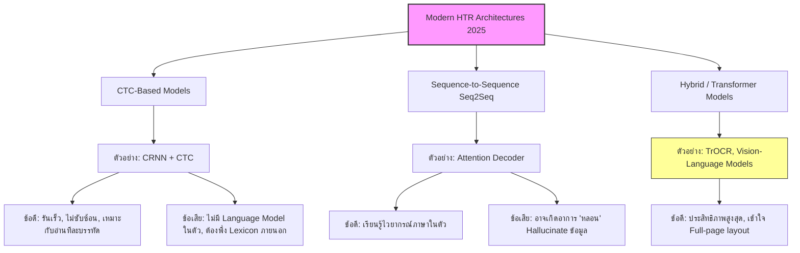

# Handwritten Text Recognition: A Survey (2025)

> **รหัสรายงาน:** XC01  
> **สถานะ:** Final  
> **ผู้เขียน:** AI Agent (supervised by Vesin)  
> **วันที่สร้าง:** 2026-06-04  
> **วันที่แก้ไขล่าสุด:** 2026-06-04  
> **เวอร์ชัน:** 1.0

### ข้อมูลงานวิจัย (Paper Metadata)
| รายการ | รายละเอียด |
|---|---|
| **ชื่องานวิจัย (Title)** | Handwritten Text Recognition: A Survey |
| **ผู้แต่ง (Authors)** | Carlos Garrido-Munoz, Antonio Rios-Vila, และ Jorge Calvo-Zaragoza |
| **สถาบัน (Institutions)** | University of Alicante (ประเทศสเปน) |
| **แหล่งตีพิมพ์ (Venue)** | arXiv Preprint |
| **ปีที่ตีพิมพ์** | 2025 (กุมภาพันธ์) |
| **DOI/URL** | [arXiv:2502.08417](https://arxiv.org/abs/2502.08417) |
| **HTR Engine(s)** | รวบรวมทุก Engine (CTC, Seq2Seq, Hybrid) |
| **ภูมิภาค/อักษร** | ทั่วโลก (Cross-script) |
| **ประเภทเอกสาร** | Survey Paper (เอกสารปริทัศน์) |
| **ช่วงเวลาของเอกสาร** | รวบรวมข้อมูลตั้งแต่อดีตจนถึง 2025 |
| **ขนาด Dataset** | รีวิว Datasets หลักในวงการ (IAM, RIMES ฯลฯ) |
| **CER/WER ที่ดีที่สุด** | *[ไม่มีข้อมูล เนื่องจากเป็นงาน Survey]* |

---

## สารบัญ
- [1. บทนำและบริบท (Introduction & Context)](#1-บทนำและบริบท-introduction--context)
- [2. ขั้นตอนการเตรียม Dataset (Dataset Creation Pipeline)](#2-ขั้นตอนการเตรียม-dataset-dataset-creation-pipeline)
- [3. สถาปัตยกรรม Model และการเทรน (Model Architecture & Training)](#3-สถาปัตยกรรม-model-และการเทรน-model-architecture--training)
- [4. ผลลัพธ์และการประเมิน (Results & Evaluation)](#4-ผลลัพธ์และการประเมิน-results--evaluation)
- [5. ความท้าทายและบทเรียน (Challenges & Lessons Learned)](#5-ความท้าทายและบทเรียน-challenges--lessons-learned)
- [6. เครื่องมือและทรัพยากรที่เปิดเผย (Open Resources)](#6-เครื่องมือและทรัพยากรที่เปิดเผย-open-resources)
- [7. ผลกระทบต่อโปรเจกต์ไทย/ขอม (Implications for Thai/Khom HTR Project)](#7-ผลกระทบต่อโปรเจกต์ไทยขอม-implications-for-thaikhom-htr-project)
- [8. แหล่งอ้างอิง (References)](#8-แหล่งอ้างอิง-references)

---

## 1. บทนำและบริบท (Introduction & Context)

### 1.1 ภาพรวมโปรเจกต์
เปเปอร์ชิ้นนี้คือ **Survey Paper (บทความปริทัศน์วรรณกรรม)** ที่สมบูรณ์แบบและอัปเดตล่าสุด (ณ เดือนกุมภาพันธ์ 2025) เกี่ยวกับเทคโนโลยี Handwritten Text Recognition (HTR) ผู้วิจัยได้นำเสนอวิวัฒนาการของระบบ HTR ตั้งแต่ยุคใช้เทคนิคดั้งเดิม (Heuristic-based) มาจนถึงยุค Deep Learning และ Neural Models ที่กำลังครองโลกอยู่ในปัจจุบัน 

### 1.2 การแบ่งระดับความซับซ้อน (Categorization of Recognition Levels)
เปเปอร์นี้นำเสนอ Framework ในการจัดกลุ่มงานวิจัย HTR ออกเป็น 2 ระดับความยากหลัก:
1. **Up to line-level:** การอ่านระดับคำและระดับบรรทัด (ซึ่งปัญหาหลักคือการ segmentation)
2. **Beyond line-level:** การอ่านระดับย่อหน้าหรือระดับเอกสารเต็มหน้า (Full-page) ซึ่งท้าทายเรื่อง Layout และ Reading Order

---

## 2. ขั้นตอนการเตรียม Dataset (Dataset Creation Pipeline)

*(เปเปอร์นี้เป็น Survey Paper จึงไม่มีกระบวนการสร้าง Dataset ใหม่ แต่ได้ทำการสรุป Landscape ของ Datasets ในปัจจุบัน)*

### 2.1 การจัดหาภาพ (Image Acquisition)
*ไม่มีข้อมูลการสแกน เนื่องจากเป็นงาน Survey*

### 2.2 Pre-processing
ผู้วิจัยได้สรุปเทคนิค Pre-processing ที่วงการนิยมใช้มากที่สุดในรอบ 5 ปีที่ผ่านมา (เช่น Binarization, Deskewing) 

### 2.3 Layout Analysis & Segmentation
ชี้ให้เห็นการเปลี่ยนแปลงครั้งใหญ่ (Paradigm shift) จาก "Explicit Segmentation (ตัดภาพเป็นคำๆ หรือบรรทัดชัดเจนก่อนส่งให้โมเดลอ่าน)" ไปสู่ "Implicit Segmentation (ส่งภาพเข้าโครงข่ายประสาทเทียมให้เรียนรู้การตัดแบ่งภาพด้วยตัวเอง หรือที่เรียกว่า End-to-end)"

### 2.4 Ground Truth Creation
เปเปอร์นำเสนอว่า ปัญหาคอขวดที่สุดในวงการ HTR ระดับโลกคือการทำ Ground Truth โดยเฉพาะในเอกสารโบราณที่ต้องใช้ผู้เชี่ยวชาญ

### 2.5 Data Augmentation (ถ้ามี)
ครอบคลุมการรีวิวเทคนิค Synthetic Data Generation เพื่อแก้ปัญหาความขาดแคลนข้อมูล

---

## 3. สถาปัตยกรรม Model และการเทรน (Model Architecture & Training)

เปเปอร์แบ่งสถาปัตยกรรม End-to-end (ยุค Deep Learning) ออกเป็น 3 กลุ่มใหญ่ ดังแผนภาพด้านล่าง:

### 3.2 Model Architecture Evolution (Mermaid Diagram)

### 3.3 Training Configuration
*ไม่มีตาราง Hyperparameters เฉพาะเจาะจง เนื่องจากเป็นงาน Survey สรุปภาพรวมหลายพันการทดลอง*

### 3.4 Transfer Learning
ยืนยันว่า Transfer Learning เป็นมาตรฐานใหม่ (De facto standard) โดยเฉพาะการ Pre-train บนภาพพิมพ์ (Printed text) หรือ Synthetic Data ก่อนจะนำมา Fine-tune บนภาพลายมือ (Handwritten text) 

---

## 4. ผลลัพธ์และการประเมิน (Results & Evaluation)

### 4.1 Metrics ที่ใช้
ผู้วิจัยทำการรีวิว Metrics มาตรฐานที่วงการยอมรับ ได้แก่ CER (Character Error Rate) และ WER (Word Error Rate)

### 4.2 ผลลัพธ์เชิงปริมาณ
*ไม่มีตารางเปรียบเทียบโมเดลเดี่ยว แต่ชี้ให้เห็นแนวโน้มว่า CER บน Benchmark หลักอย่าง IAM ลดลงอย่างมีนัยสำคัญเข้าใกล้ระดับมนุษย์*

### 4.3 Error Analysis
ชี้ว่าโมเดลส่วนใหญ่ยังคงสอบตกในเอกสารประเภท:
- ลายมือที่เขียนซ้อนทับกันมาก
- เอกสารที่ไม่มีเส้นบรรทัดชัดเจน (Free-form layouts)

---

## 5. ความท้าทายและบทเรียน (Challenges & Lessons Learned)

### 5.4 บทเรียนสำคัญและอนาคต (Future Directions)
ผู้วิจัยชี้ว่าในอีก 2-3 ปีข้างหน้า ทิศทางของวงการ HTR จะมุ่งไปที่:
1. การสร้าง **Foundation Models** สำหรับภาพเอกสาร (Document Foundation Models)
2. การหลอมรวมกระบวนการ Layout Analysis เข้ากับ Text Recognition ให้เป็นเนื้อเดียวกัน (Unified Full-page Recognition) โดยไม่ต้องพึ่ง Line detector (เช่น blla ของ Kraken) อีกต่อไป

---

## 6. เครื่องมือและทรัพยากรที่เปิดเผย (Open Resources)

| ประเภท | ชื่อ | URL | หมายเหตุ |
|---|---|---|---|
| Paper | arXiv Preprint | [arXiv:2502.08417](https://arxiv.org/abs/2502.08417) | เผยแพร่เมื่อ ก.พ. 2025, CC BY 4.0 |

---

## 7. ผลกระทบต่อโปรเจกต์ไทย/ขอม (Implications for Thai/Khom HTR Project)

> **การถอดรหัสงานวิจัยสำหรับทิศทางโปรเจกต์ขอม (Minimum 200 words)**

จากภาพรวมการสำรวจของเปเปอร์ชิ้นนี้ มีข้อมูลเชิงกลยุทธ์ (Strategic Insights) จำนวนมากที่เราสามารถนำมาปรับเข็มทิศให้กับโปรเจกต์ HTR คัมภีร์ใบลานอักษรขอม:

**1. รู้ข้อจำกัดของ CTC-based Models (อย่าง Kraken):**
เปเปอร์ระบุชัดเจนว่าโมเดลสาย CTC (Connectionist Temporal Classification) ซึ่งเป็นเทคโนโลยีหลังบ้านที่ Kraken ใช้เป็นหลัก มีจุดเด่นเรื่องความเร็วและการอ่านที่แม่นยำทีละบรรทัด (Line-level) โดยไม่เกิดอาการ "หลอน" (Hallucination) แบบที่โมเดล Transformer มักจะเป็น แต่ข้อเสียสำคัญคือ **CTC ไม่ได้เรียนรู้ไวยากรณ์ (Language modeling) ภายในตัวมันเอง** สำหรับอักษรขอมที่มีการผูกศัพท์บาลีสลับซับซ้อน โมเดล CTC อาจจะเดาพยัญชนะเรียงกันได้ถูกต้องตามตาเห็น แต่ไม่สามารถรู้ได้ว่าคำนั้นสะกดผิดไวยากรณ์บาลีหรือไม่ การแก้ไขปัญหานี้ ทีมงานจำเป็นต้องสร้าง Dictionary ทางพระพุทธศาสนาและไวยากรณ์บาลีขนาดใหญ่ (External Lexicon) มาใช้ครอบกระบวนการ Post-processing หากเราดึงดันจะใช้ Kraken ต่อไป

**2. กระแสใหม่คือ Full-page Recognition:**
หากคัมภีร์ขอมของเรามีการจัดหน้ากระดาษ (Layout) ที่แปลกประหลาด เช่น การเขียนยันต์เป็นวงกลม การเขียนแทรกตามขอบ (Marginalia) หรือการมีรูปภาพแทรก การพึ่งพา Line segmenter แบบดั้งเดิมจะทำให้การอ่านล้มเหลวตั้งแต่ขั้นตอนแรก เปเปอร์แนะนำว่าสำหรับ Layout เหล่านี้ แนวทางใหม่คือ **Attention-based Encoder-Decoder** ที่รับภาพทั้งหน้า (Full-page) และพ่นข้อความออกมาเลยโดยไม่ต้องตัดบรรทัด (Implicit segmentation) ดังนั้น หากโปรเจกต์ของเราต้องทำเอกสารยันต์ ทีมควรต้องมีทีมย่อยทดลองเทรนโมเดลสาย Vision-Language Model (VLM) หรือ TrOCR ควบคู่กันไปกับ Kraken

**3. ใช้ Synthetic Data อุดช่องโหว่:**
เนื่องจากข้อมูล Ground truth ของขอมมีจำกัด การใช้เทคนิค Synthetic Generation โดยการนำฟอนต์คอมพิวเตอร์อักษรขอม (เช่น ขอมไทย, ขอมขอม) มาผสม (Render) ลงบนพื้นหลังแผ่นใบลานที่ถูกตัดภาพมา พร้อมกับทำ Data Augmentation เพื่อสอนโมเดลเบื้องต้น (Pre-train) ก่อนจะนำมา Fine-tune ด้วยลายมือพระแท้ๆ จะเป็น **เส้นทางลัดที่ดีที่สุด** ที่เปเปอร์สำรวจนี้รับรองว่าได้ผลจริงและเป็นมาตรฐานของวงการ

---

## 8. แหล่งอ้างอิง (References)

1. Carlos Garrido-Munoz, Antonio Rios-Vila, and Jorge Calvo-Zaragoza. *"Handwritten Text Recognition: A Survey."* arXiv preprint, February 2025. [arXiv:2502.08417](https://arxiv.org/abs/2502.08417)
