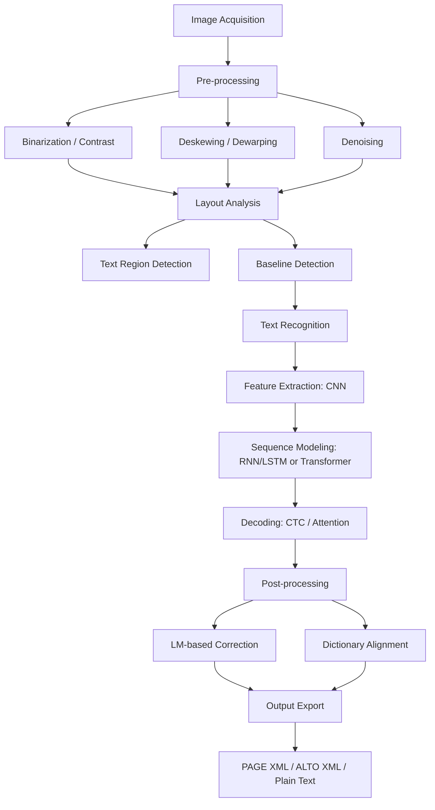
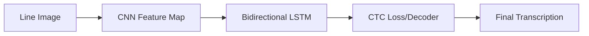

# ภาพรวมกระบวนการ HTR เอกสารโบราณ — HTR Pipeline Overview

> **รหัสรายงาน:** F01  
> **สถานะ:** Draft  
> **ผู้เขียน:** AI Agent (supervised by Antigravity)  
> **วันที่สร้าง:** 2026-06-04  
> **วันที่แก้ไขล่าสุด:** 2026-06-04  
> **เวอร์ชัน:** 1.0  
> **รายงานที่เกี่ยวข้อง:** [F02](../Foundation/F02_Annotation_Workflow_and_GT_Formats.md), [F03](../Foundation/F03_Evaluation_Metrics_Guide.md), [F04](../Foundation/F04_Kraken_eScriptorium_Deep_Dive.md), [F05](../Foundation/F05_Data_Augmentation_and_Transfer_Learning.md)

---

## สารบัญ

1. [บทนำ (Introduction)](#1-บทนำ-introduction)
2. [พื้นฐานและคำศัพท์ (Background & Terminology)](#2-พื้นฐานและคำศัพท์-background--terminology)
3. [กระบวนการทำงาน HTR (HTR Pipeline Stages)](#3-กระบวนการทำงาน-htr-htr-pipeline-stages)
   - [3.1 การจัดหาภาพ (Image Acquisition)](#31-การจัดหาภาพ-image-acquisition)
   - [3.2 การเตรียมภาพและปรับปรุงคุณภาพ (Pre-processing)](#32-การเตรียมภาพและปรับปรุงคุณภาพ-pre-processing)
   - [3.3 การวิเคราะห์โครงสร้างหน้ากระดาษ (Layout Analysis)](#33-การวิเคราะห์โครงสร้างหน้ากระดาษ-layout-analysis)
   - [3.4 การตรวจจับบรรทัด (Text Line Segmentation & Baseline Detection)](#34-การตรวจจับบรรทัด-text-line-segmentation--baseline-detection)
   - [3.5 การถอดความเป็นข้อความ (Text Recognition Architectures)](#35-การถอดความเป็นข้อความ-text-recognition-architectures)
   - [3.6 การปรับปรุงข้อความหลังการแปลง (Post-processing)](#36-การปรับปรุงข้อความหลังการแปลง-post-processing)
   - [3.7 รูปแบบผลลัพธ์ข้อมูล (Output Formats)](#37-รูปแบบผลลัพธ์ข้อมูล-output-formats)
4. [การเปรียบเทียบแนวทางเทคโนโลยี (Comparative Analysis)](#4-การเปรียบเทียบแนวทางเทคโนโลยี-comparative-analysis)
5. [ผลกระทบต่อโปรเจกต์ไทย/ขอม (Implications for Thai/Khom HTR Project)](#5-ผลกระทบต่อโปรเจกต์ไทยขอม-implications-for-thaikhom-htr-project)
6. [แหล่งอ้างอิง (References)](#6-แหล่งอ้างอิง-references)

---

## 1. บทนำ (Introduction)

### 1.1 ขอบเขตของรายงานนี้
รายงานฉบับนี้ครอบคลุมโครงสร้างและขั้นตอนการทำงานทั้งหมดของระบบการรู้จำข้อความลายมือเขียนโบราณ (Handwritten Text Recognition หรือ HTR) ตั้งแต่การรับภาพดิจิทัล (Image Acquisition) การแปลงภาพและลดสัญญาณรบกวน (Pre-processing) การวิเคราะห์โครงสร้างหน้าและแยกบรรทัด (Layout Analysis & Segmentation) การประมวลผลการรู้จำตัวอักษรด้วยเทคนิคปัญญาประดิษฐ์ (Text Recognition) ไปจนถึงขั้นตอนการปรับปรุงแก้ไขหลังกระบวนการแปลง (Post-processing) และการส่งออกข้อมูล (Output Formats) 

### 1.2 ทำไมหัวข้อนี้สำคัญสำหรับ HTR เอกสารโบราณ
การทำความเข้าใจภาพรวมของกระบวนการ HTR หรือ HTR Pipeline เป็นสิ่งจำเป็นในการวางสถาปัตยกรรมระบบสำหรับเอกสารโบราณ เนื่องจากเอกสารโบราณมีคุณลักษณะทางกายภาพที่ไม่เหมือนหนังสือพิมพ์หรือสิ่งพิมพ์ในยุคปัจจุบัน สภาพวัสดุที่เสื่อมสลาย คราบสกปรก รอยจารหรือเขียนที่มีน้ำหนักเส้นไม่สม่ำเสมอ ตลอดจนรูปแบบการจัดวาง (Layout) ที่ซับซ้อนและไม่มีกฎเกณฑ์ที่ตายตัว หากทีมงานเข้าใจกระบวนการทำงานและความเชื่อมโยงระหว่างขั้นตอนต่างๆ จะทำให้สามารถระบุจุดผิดพลาดและเลือกใช้อัลกอริทึมที่เหมาะสมกับลักษณะเอกสารโบราณได้ดีขึ้น

### 1.3 ความสัมพันธ์กับรายงานอื่น
รายงานฉบับนี้ทำหน้าที่เป็นคู่มือแนะนำขั้นตอนการทำงานพื้นฐานเพื่อนำไปสู่รายงานเฉพาะทางอื่นๆ ในชุดนี้ โดยจะเชื่อมโยงไปยัง [F02](../Foundation/F02_Annotation_Workflow_and_GT_Formats.md) ในเรื่องรูปแบบผลลัพธ์ข้อมูล (Ground Truth Formats) เชื่อมโยงไปยัง [F03](../Foundation/F03_Evaluation_Metrics_Guide.md) สำหรับการวัดผลลัพธ์แต่ละส่วน (Component Evaluation) เชื่อมโยงไปยัง [F04](../Foundation/F04_Kraken_eScriptorium_Deep_Dive.md) ซึ่งอธิบายการอิมพลีเมนต์สถาปัตยกรรมนี้ด้วยเครื่องมือหลักอย่าง Kraken และเชื่อมโยงไปยัง [F05](../Foundation/F05_Data_Augmentation_and_Transfer_Learning.md) สำหรับการปรับปรุงขั้นตอนการเรียนรู้ของโมเดล

---

## 2. พื้นฐานและคำศัพท์ (Background & Terminology)

### 2.1 แนวคิดหลัก
การแปลงภาพเอกสารโบราณลายมือเขียนเป็นข้อความ มีวิวัฒนาการมาจากระบบ **OCR (Optical Character Recognition)** แบบดั้งเดิมที่ใช้จับคู่รูปแบบตัวอักษรพิมพ์ทีละตัว (Character-level matching) แต่ระบบดังกล่าวล้มเหลวโดยสิ้นเชิงเมื่อนำมาใช้กับเอกสารลายมือเขียน เนื่องจากลายมือมีความแปรผันสูงมาก ตัวอักษรตัวเดียวกันอาจเขียนแตกต่างกันได้ตามอารมณ์ น้ำหนักมือ และผู้เขียนที่ต่างกัน 

ระบบ **HTR (Handwritten Text Recognition)** สมัยใหม่จึงเปลี่ยนมามองข้อความเป็น "ข้อมูลเชิงลำดับ (Sequential Data)" โดยอ่านข้อความทั้งบรรทัดพร้อมกันโดยไม่ตัดแบ่งตัวอักษรก่อน (Segmentation-free) แล้วใช้โครงข่ายประสาทเทียมแบบเรียนรู้เชิงลึก (Deep Learning) ประเมินลำดับที่เป็นไปได้มากที่สุดของอักขระเหล่านั้น

### 2.2 คำศัพท์สำคัญ
| ศัพท์ (อังกฤษ) | ความหมาย (ไทย) | หมายเหตุ |
|---|---|---|
| **OCR** (Optical Character Recognition) | การรู้จำอักขระด้วยแสง | ใช้กับตัวพิมพ์มาตรฐานที่มี Layout เป็นระเบียบ |
| **HTR** (Handwritten Text Recognition) | การรู้จำข้อความลายมือเขียน | ใช้โครงข่ายประสาทเทียมระดับลึก อ่านทั้งบรรทัดพร้อมกัน |
| **Binarization** | การแปลงภาพเป็นภาพขาวดำสองสี | แยกส่วนตัวเขียนออกจากพื้นหลังกระดาษ/ลาน |
| **Baseline** | เส้นฐานอักษร | เส้นสมมติที่ตัวอักษรส่วนใหญ่ตั้งอยู่ เป็นแกนหลักในระบบ HTR ยุคใหม่ |
| **Segmentation** | การแบ่งส่วนหน้ากระดาษ | การตัดหน้ากระดาษออกเป็นภูมิภาค (Region) และบรรทัด (Line) |
| **CTC** (Connectionist Temporal Classification) | การถอดลำดับข้อมูลแบบไม่ต้องจับคู่พิกเซล | อัลกอริทึมหาลำดับตัวอักษรจากโมเดลโดยไม่ต้องระบุตำแหน่งพิกเซลตัวอักษรเป๊ะๆ |
| **Language Model** (LM) | โมเดลภาษา | ปัญญาประดิษฐ์ที่วิเคราะห์ความน่าจะเป็นของลำดับคำ เพื่อแก้ไขคำผิด |

> **หมายเหตุ:** ดูรายการศัพท์และคำอธิบายโดยละเอียดเพิ่มเติมใน [อภิธานศัพท์](../00_GLOSSARY.md)

### 2.3 ไดอะแกรมภาพรวมกระบวนการ HTR

---

## 3. กระบวนการทำงาน HTR (HTR Pipeline Stages)

### 3.1 การจัดหาภาพ (Image Acquisition)
จุดเริ่มต้นของ HTR คือการแปลงวัตถุโบราณให้อยู่ในรูปของภาพดิจิทัล คุณภาพของภาพขั้นตอนนี้ส่งผลอย่างมากต่อประสิทธิภาพปลายทาง (Downstream performance)
- **ความละเอียดขั้นต่ำ:** โดยทั่วไปต้องการภาพถ่ายที่มีความละเอียดไม่น้อยกว่า 300 DPI (Dots Per Inch) เพื่อป้องกันไม่ให้ส่วนหัวหรือหางอักษรที่บางมากๆ หายไป
- **มาตรฐานไฟล์:** นิยมใช้ไฟล์ฟอร์แมตที่ไม่สูญเสียรายละเอียด เช่น TIFF หรือภาพสีคุณภาพสูง (Raw/PNG) เพื่อรักษารายละเอียดพิกเซลสำหรับนำไปประมวลผลต่อ

### 3.2 การเตรียมภาพและปรับปรุงคุณภาพ (Pre-processing)
เอกสารโบราณมักเผชิญปัญหาเสื่อมสภาพตามกาลเวลา กระบวนการเตรียมภาพจึงเน้นปรับแต่งคุณภาพพิกเซลให้โมเดลอ่านง่ายที่สุด
1. **การแปลงเป็นภาพสองสี (Binarization):** แปลงภาพสี/Grayscale ให้เหลือเพียงพิกเซลสีดำ (ตัวอักษร) และขาว (พื้นหลัง)
   - *Otsu's Method [Otsu, 1979]:* คำนวณหาค่า Threshold เพียงค่าเดียวสำหรับทั้งหน้าภาพ เหมาะกับภาพที่แสงสว่างคงที่ แต่ใช้งานไม่ได้ผลกับเอกสารโบราณที่สว่างไม่เท่ากัน
   - *Sauvola's Method [Sauvola & Pietikäinen, 2000]:* ค้นหา Threshold แยกตามพื้นที่ย่อย (Local Adaptive Thresholding) โดยอิงจากค่าเฉลี่ยและส่วนเบี่ยงเบนมาตรฐานรอบพิกเซลนั้นๆ เป็นมาตรฐานในการจัดการเอกสารโบราณที่มีคราบสีเหลืองหรือเงาพับ
   - *Learnable Binarization:* ใช้ neural network ในการทำนายพิกเซลอักษรโดยตรง (เช่น U-Net) ซึ่งให้ผลลัพธ์ดีที่สุดกับเอกสารที่เสียหายรุนแรง แต่ต้องแลกมาด้วยการเทรนโมเดลเฉพาะงาน
2. **การปรับความเอียงและความโค้ง (Deskewing & Dewarping):**
   - *Deskewing:* หมุนภาพตรงกรณีที่สแกนเอียง
   - *Dewarping [Li et al., 2024]:* แก้ไขพิกเซลที่บิดโค้งจากการเปิดหน้าหนังสือโบราณหรือรอยย่นของสมุดไทย/ใบลาน เพื่อทำให้บรรทัดข้อความกลับมาตรงระเบียบ
3. **การลดสัญญาณรบกวน (Noise Removal):** การลบหมึกซึมจากหน้าหลัง (Bleed-through) คราบแมลง รูขาด และรอยเปื้อนต่างๆ ด้วยฟิลเตอร์ทางสถิติหรือโมเดล AI ป้องกันไม่ให้อัลกอริทึมเข้าใจผิดว่าเป็นตัวอักษร

### 3.3 การวิเคราะห์โครงสร้างหน้ากระดาษ (Layout Analysis)
การระบุตำแหน่งโครงสร้างภายในหน้าเอกสารเพื่อจัดกลุ่มข้อมูลก่อนการอ่าน
- **Text Region Detection:** แยกพื้นที่ข้อความออกจากลวดลายตกแต่ง กรอบภาพ หรือสัญลักษณ์ทางไสยศาสตร์ (เช่น ยันต์ในเอกสารไทยโบราณ)
- **สถาปัตยกรรมหลัก:** มักใช้ Object Detection หรือ Instance Segmentation เช่น Mask R-CNN หรือ YOLO [Sánchez et al., 2019] ในการตีกรอบพื้นที่เหล่านี้

### 3.4 การตรวจจับบรรทัด (Text Line Segmentation & Baseline Detection)
นี่คือความแตกต่างที่สำคัญระหว่าง HTR ยุคเก่าและยุคปัจจุบัน
- **Text Line Segmentation (แบบเก่า):** ตีกรอบสี่เหลี่ยมรอบบรรทัดข้อความ (Bounding Box) ซึ่งมักพบปัญหาข้อความเกยกัน (เช่น วรรณยุกต์ไทยชั้นบนเกยกับสระล่างของบรรทัดบน)
- **Baseline Detection (แบบใหม่):** ลากเส้นโค้งสมมติตามการนั่งเขียนของอักษรแต่ละบรรทัด (แกน Baseline) การลากเส้นในลักษณะนี้ทำให้ตัวอักษรที่ห้อยหางหรือวรรณยุกต์ซ้อนไม่ชนกัน
- **สถาปัตยกรรมยอดนิยม:** โมเดล **ARU-Net** (Attention Residual U-Net) ของ Grüning et al. [2019] ซึ่งทำงานสองขั้นตอน: ค้นหาพิกเซลที่เป็นเส้นฐานอักษร (Baseline pixels) แล้วนำมาร้อยเรียงเข้าเป็นเส้นข้อความเส้นเดียวผ่านขั้นตอน Bottom-up clustering

### 3.5 การถอดความเป็นข้อความ (Text Recognition Architectures)
กระบวนการรู้จำจากพิกเซลภาพเส้นบรรทัดข้อความ (Line image) ออกมาเป็นสตริงอักขระ (String characters) แบ่งเป็น 2 สถาปัตยกรรมหลัก:

#### A. CRNN + CTC (ใช้ใน Kraken, PyLaia)
ระบบยอดนิยมที่กินทรัพยากรน้อยและมีความแม่นยำสูงสำหรับการเทรนเฉพาะงาน [Kiessling, 2019]
1. **CNN (Feature Extractor):** สกัดลักษณะเด่นทางกายภาพของภาพเส้นบรรทัดอักษรออกมาเป็นฟีเจอร์แมป
2. **RNN/LSTM (Sequence Modeler):** เรียนรู้ลำดับอักขระจากซ้ายไปขวา (หรือขวาไปซ้าย) เพื่อเชื่อมโยงพารามิเตอร์เชิงเวลา
3. **CTC Decoding [Graves et al., 2006]:** จัดแนว (Alignment) ระหว่างข้อมูลพิกเซลและอักขระโดยการขจัดอักษรซ้ำซ้อนและยุบยุบพิกเซลว่าง (Blank tokens) ให้ออกมาเป็นคำที่ถูกต้องโดยมนุษย์อ่านเข้าใจ

#### B. Transformer-based (เช่น TrOCR)
แนวคิดแบบไม่ต้องแบ่งบรรทัดโดยใช้สถาปัตยกรรม End-to-end [Li et al., 2023]
- **Vision-Language Transformer:** ใช้ Vision Transformer (ViT) ทำหน้าที่เปรียบเสมือน Encoder แปลงภาพเป็นเวกเตอร์แทนความหมาย แล้วส่งต่อไปให้ Language Model (เช่น RoBERTa) ทำหน้าที่ Decoder ถอดความออกมาทีละอักขระ
- **ข้อดี:** ไม่ต้องทำความเข้าใจการเชื่อมพิกเซลระดับต่ำ ให้ความถูกต้องสูงในเอกสารที่รูปอักษรชัดเจน
- **ข้อจำกัด:** ใช้แรงในการคำนวณสูงและต้องการข้อมูลจำนวนมหาศาลในการฝึกฝนครั้งแรก (Pre-training)

### 3.6 การปรับปรุงข้อความหลังการแปลง (Post-processing)
เนื่องจากตัวแบบ HTR ประเมินผลจากพิกเซลภาพเท่านั้น จึงอาจพบความเข้าใจผิดในเชิงภาษาได้ การแก้ไขข้อบกพร่องจึงใช้ NLP เข้ามาช่วย:
- **Dictionary-based Correction:** ตรวจสอบกับพจนานุกรมคำศัพท์โบราณเพื่อค้นหาและแทนที่คำที่ใกล้เคียงที่สุด
- **Language Model Correction:** ใช้โมเดลภาษา เช่น n-gram หรือ LLMs ขนาดเล็ก มาคำนวณดูว่าบริบทของคำที่แปลงได้รอบข้างมีความสมเหตุสมผลหรือไม่ (เช่น ตัวอักษร "ก" กับ "ถ" ที่คล้ายกันมากในลายมือเขียน)

### 3.7 รูปแบบผลลัพธ์ข้อมูล (Output Formats)
ผลลัพธ์สุดท้ายจะได้รับการบันทึกในรูปแบบดิจิทัลที่เชื่อมประสานพิกเซลภาพเข้ากับข้อความจริง:
- **PAGE XML:** จัดการพื้นที่ Layout ที่ซับซ้อนและรองรับพิกเซล Baseline แบบโพลีกอน (นิยมใช้ใน eScriptorium/Transkribus)
- **ALTO XML:** มาตรฐานของห้องสมุดดิจิทัลเน้นพิกเซล Bounding Box เชิงกล่อง
- **hOCR:** เข้ารหัสผลการถอดความควบคู่ไปกับแท็ก HTML เพื่อเปิดดูบนบราวเซอร์ทั่วไปได้ทันที
- *(รายละเอียดเปรียบเทียบมาตรฐานนี้ได้รับการ cross-reference ไปยังเอกสาร [PAGE XML vs ALTO XML Complete Guide](../../XML_Standards_Guide/PAGE_XML_vs_ALTO_XML_Complete_Guide.md) เรียบร้อยแล้ว)*

---

## 4. การเปรียบเทียบแนวทางเทคโนโลยี (Comparative Analysis)

จากการวิเคราะห์เอกสารทฤษฎีและงานวิจัยปี 2024–2026 สามารถเปรียบเทียบสถาปัตยกรรมการทำงานในระดับเทคโนโลยีได้ดังนี้:

| เกณฑ์เปรียบเทียบ | CRNN + CTC (Kraken/PyLaia) | Transformer (TrOCR) | Large Multimodal Models (LMMs) |
|---|---|---|---|
| **ความต้องการการฝึกฝน** | ต่ำ (50-100 หน้าของหน้า Ground Truth ก็ได้โมเดลระดับใช้งานได้) | สูง (ต้องการภาพหลักแสนหน้าเพื่อ Pre-train) | ไม่จำเป็นต้องเทรนใหม่ (Zero-shot / Few-shot) |
| **การใช้ compute (Hardware)** | ต่ำมาก (เทรนบน GPU ทั่วไปในเวลา 1-2 ชม.) | สูง (ต้องการ GPU ขนาดใหญ่และเวลาเทรนยาวนาน) | สูงที่สุด (มักต้องทำงานบน Cloud server) |
| **การจัดการ Layout ซับซ้อน** | ดีเยี่ยม (ทำงานร่วมกับโมเดลการวิเคราะห์ Layout อย่างเป็นระบบ) | ปานกลาง (ไม่มีระบบวิเคราะห์ Layout ในตัว ต้องพึ่งเครื่องมือภายนอก) | ดีมากในเชิงความหมาย แต่ระบุพิกเซลพิกัดยาก |
| **อัตรา Character Error (CER)** | ต่ำในงานเฉพาะด้าน (เมื่อปรับแต่งดีแล้ว CER < 5%) | ต่ำมากกับแบบอักษรปกติ (CER < 3%) | ต่ำมากด้วยความสามารถทางบริบทภาษา (CER < 2%) |
| **การเข้าถึงรหัสต้นฉบับ** | Open-source สมบูรณ์แบบ | Open-source | มักเป็น Commercial API หรือโมเดลขนาดใหญ่มาก |

---

## 5. ผลกระทบต่อโปรเจกต์ไทย/ขอม (Implications for Thai/Khom HTR Project)

จากการประมวลภาพรวมของกระบวนการ HTR ข้างต้น ทีมงานสามารถถอดบทเรียนเพื่อนำมาวางแผนและออกแบบโปรเจกต์การทำ HTR สำหรับคัมภีร์ใบลานและสมุดไทยอักษรไทย-ขอมโบราณ ได้ดังนี้:

1. **ความจำเป็นขั้นสูงสุดของ Baseline Approach:** เอกสารสมุดไทยและคัมภีร์ใบลานไทย/ขอมมักไม่มีการตีเส้นบรรทัดพิมพ์ หรือมีบรรทัดเขียนที่เอียงและโค้งตามรูปทรงธรรมชาติของวัสดุ (เช่น ใบลานที่แคบและยาว) การใช้ Bounding box แบบดั้งเดิมจะทำให้พิกเซลสระบน (สระอุ สระอู) หรือสระล่าง (สระอิ สระอี วรรณยุกต์) ชนและทับซ้อนกันระหว่างบรรทัด ส่งผลให้ Recognition โมเดลอ่านค่าผิดเพี้ยน โครงการนี้จึง **ต้องใช้สถาปัตยกรรมแบบ Baseline Detection เท่านั้น** โดยเฉพาะโมเดลประเภท ARU-Net ในการลากเส้นฐานข้อความเพื่อสกัดรูปอักษร

2. **ความท้าทายระดับวิกฤตของ Binarization และ Layout:** คัมภีร์ใบลานของไทยมักใช้เหล็กจารขูดเนื้อไม้แล้วลงรักหรือถ่านเพื่อเน้นตัวอักษร เมื่อเวลาผ่านไปเนื้อลานจะคล้ำขึ้น หรือสมุดไทยดำที่มีการเขียนด้วยรงค์สีเหลืองที่หลุดร่อนง่าย การใช้ Global Threshold แบบวิธี Otsu's จะทำให้ข้อความโบราณกลายเป็นสีดำทึบไปทั้งหน้า โครงการนี้จึงจำเป็นต้องเลือกใช้ **Local Adaptive Thresholding เช่น Sauvola's Method** เป็นพื้นฐาน หรือออกแบบ **Learnable Binarization (U-Net)** เฉพาะหน้าเพื่อรักษารูปแบบหัวอักษรไทย/ขอมไม่ให้ขาดหาย และป้องกันสัญญาณรบกวน เช่น รูมอดกินใบลาน ไม่ให้ถูกเข้าใจผิดว่าเป็นตัวอักษร "o" หรือสระอุ

3. **ปัญหาการไม่มีขอบเขตคำ (Word Boundary Problem):** อักษรไทยและอักษรขอมโบราณเขียนข้อความต่อเนื่องกันโดยไม่มีการเว้นวรรคระหว่างคำ (No word spaces) สิ่งนี้ทำให้การวัดผลลัพธ์และการทำนายด้วยสถาปัตยกรรมระดับคำ (WER - Word Error Rate) ใช้งานไม่ได้ผล ทีมงานควรมุ่งเน้นไปที่การวัดประสิทธิภาพระดับอักขระ (CER - Character Error Rate) เป็นสำคัญ และหลีกเลี่ยงโมเดลที่ต้องการพจนานุกรมระดับคำเดี่ยวในการทำ Decoding แต่ควรหันไปใช้ **Character-level Language Model (เช่น n-gram ระดับอักขระ)** ในการช่วยวิเคราะห์บริบทเสียงหรือการสะกดคำโบราณในขั้นตอน Post-processing เพื่อรักษาคุณภาพการอ่าน

4. **การเลือกใช้เทคโนโลยีระดับปฏิบัติการ:** เนื่องจากการประมวลผลโมเดลประเภท Transformer ต้องการทรัพยากรการเทรนขนาดใหญ่มาก ซึ่งโปรเจกต์ไทย-ขอมยังมีข้อมูล Ground Truth เริ่มต้นค่อนข้างน้อย (Low-resource script) ข้อเสนอแนะเชิงกลยุทธ์คือ **เริ่มต้นระบบด้วย CRNN + CTC (ใช้ Kraken เป็น engine หลัก)** โดยใช้เทคนิคการป้อนข้อมูลพิกเซลเส้นบรรทัด และทำนายผลลัพธ์ผ่าน CTC ซึ่งประหยัดพลังงานคอมพิวเตอร์และทำงานร่วมกับระบบ eScriptorium ได้ทันที แทนที่จะพยายามใช้ตัวแบบ Transformer ขนาดใหญ่ตั้งแต่เริ่มต้น ซึ่งอาจก่อให้เกิดปัญหา Overfitting จากข้อมูลจำนวนจำกัด

---

## 6. แหล่งอ้างอิง (References)

### งานวิจัย (Papers)
1. Graves, A., Fernández, S., Gomez, F., & Schmidhuber, J. "Connectionist temporal classification: labelling unsegmented sequence data with recurrent neural networks," *Proceedings of the 23rd international conference on Machine learning*, 2006, pp. 369-376. DOI: [10.1145/1143844.1143891](https://doi.org/10.1145/1143844.1143891)
2. Grüning, T., Leifert, G., Strauß, T., Michael, J., & Labahn, R. "A two-stage method for text line detection in historical documents," *International Journal on Document Analysis and Recognition (IJDAR)*, Vol. 22, No. 3, 2019, pp. 285–302. DOI: [10.1007/s10032-019-00332-1](https://doi.org/10.1007/s10032-019-00332-1)
3. Kiessling, B. "Kraken - an Universal Text Recognizer for the Humanities," *Digital Humanities Utrecht*, 2019.
4. Li, M., Lv, T., Cui, L., Lu, Y., Florencio, D., Zhang, C., Li, Z., & Wei, F. "TrOCR: Transformer-based Optical Character Recognition with Pre-trained Models," *AAAI Conference on Artificial Intelligence*, 2023. arXiv: [2109.10285](https://arxiv.org/abs/2109.10285)
5. Otsu, N. "A threshold selection method from gray-level histograms," *IEEE Transactions on Systems, Man, and Cybernetics*, Vol. 9, No. 1, 1979, pp. 62-66. DOI: [10.1109/TSMC.1979.4310076](https://doi.org/10.1109/TSMC.1979.4310076)
6. Sánchez, J. A., Romero, V., Toselli, A. H., Villegas, M., & Vidal, E. "A set of benchmarks for Handwritten Text Recognition on historical documents," *Pattern Recognition*, Vol. 94, 2019, pp. 122-134. DOI: [10.1016/j.patcog.2019.05.025](https://doi.org/10.1016/j.patcog.2019.05.025)
7. Sauvola, J., & Pietikäinen, M. "Adaptive document image binarization," *Pattern Recognition*, Vol. 33, No. 2, 2000, pp. 225-236. DOI: [10.1016/S0030-0016(99)00003-6](https://doi.org/10.1016/S0030-0016(99)00003-6)

### เอกสารเทคนิค (Documentation)
1. "Kraken Official Documentation," Available at: [https://kraken.re](https://kraken.re)
2. "eScriptorium Platform GitLab Repository," Available at: [https://gitlab.com/scripta/escriptorium](https://gitlab.com/scripta/escriptorium)
