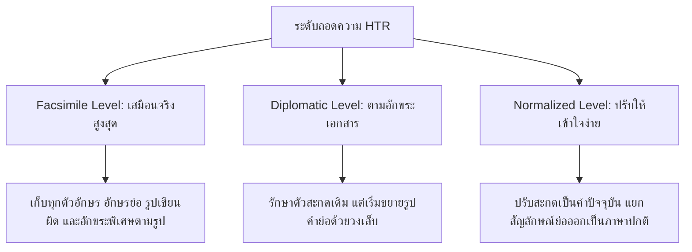
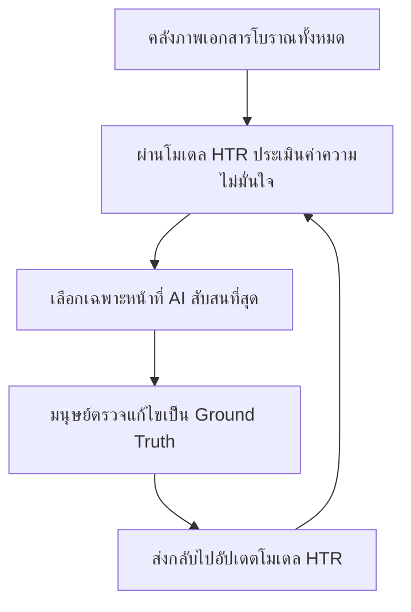

# กระบวนการสร้าง Ground Truth และรูปแบบข้อมูล — Annotation Workflow & Ground Truth Formats

> **รหัสรายงาน:** F02  
> **สถานะ:** Draft  
> **ผู้เขียน:** AI Agent (supervised by Antigravity)  
> **วันที่สร้าง:** 2026-06-04  
> **วันที่แก้ไขล่าสุด:** 2026-06-04  
> **เวอร์ชัน:** 1.0  
> **รายงานที่เกี่ยวข้อง:** [F01](../Foundation/F01_HTR_Pipeline_Overview.md), [F03](../Foundation/F03_Evaluation_Metrics_Guide.md), [F04](../Foundation/F04_Kraken_eScriptorium_Deep_Dive.md), [F05](../Foundation/F05_Data_Augmentation_and_Transfer_Learning.md)

---

## สารบัญ

1. [บทนำ: ความสำคัญของ Ground Truth (Introduction to Ground Truth)](#1-บทนำ-ความสำคัญของ-ground-truth-introduction-to-ground-truth)
2. [เครื่องมือสร้าง Ground Truth และการเตรียมข้อมูล (Annotation Tools Comparison)](#2-เครื่องมือสร้าง-ground-truth-และการเตรียมข้อมูล-annotation-tools-comparison)
3. [แนวทางปฏิบัติด้านการถอดความ (Transcription Guidelines)](#3-แนวทาง-ปฏิบัติด้านการถอดความ-transcription-guidelines)
4. [รูปแบบข้อมูลสำหรับการฝึกฝนโมเดล (Ground Truth Formats Comparison)](#4-รูปแบบข้อมูลสำหรับการฝึกฝนโมเดล-ground-truth-formats-comparison)
5. [การออกแบบกระบวนการทำงานและการควบคุมคุณภาพ (Workflow Design & Quality Control)](#5-การออกแบบกระบวนการทำงานและการควบคุมคุณภาพ-workflow-design--quality-control)
6. [ประมาณการเวลาและต้นทุนจากโปรเจกต์จริง (Time & Cost Benchmarks)](#6-ประมาณการเวลาและต้นทุนจากโปรเจกต์จริง-time--cost-benchmarks)
7. [การทำงานร่วมกันกับอาสาสมัครและการเรียนรู้เชิงรุก (Crowdsourcing & Active Learning)](#7-การทำงานร่วมกันกับอาสาสมัครและการเรียนรู้เชิงรุก-crowdsourcing--active-learning)
8. [ผลกระทบต่อโปรเจกต์ไทย/ขอม (Implications for Thai/Khom HTR Project)](#8-ผลกระทบต่อโปรเจกต์ไทยขอม-implications-for-thaikhom-htr-project)
9. [แหล่งอ้างอิง (References)](#9-แหล่งอ้างอิง-references)

---

## 1. บทนำ: ความสำคัญของ Ground Truth (Introduction to Ground Truth)

ในกระบวนการพัฒนาระบบการรู้จำข้อความลายมือเขียนโบราณ (HTR) ข้อมูลที่สำคัญและมีค่าที่สุดไม่ใช่ตัวอัลกอริทึมหรือสถาปัตยกรรมคอมพิวเตอร์ แต่คือ **Ground Truth (GT)** ซึ่งหมายถึง "ข้อมูลภาพเอกสารจริงที่ได้รับการจับคู่กับการถอดความและการระบุตำแหน่งพิกเซล (Region & Baseline) อย่างถูกต้อง 100% โดยผู้เชี่ยวชาญมนุษย์" 

ข้อมูล Ground Truth ทำหน้าที่เป็นเสมือน "แบบเรียน" ที่ปัญญาประดิษฐ์ใช้เรียนรู้ในการปรับค่าพารามิเตอร์ภายใน (Weights) และเป็นตัวชี้วัดความแม่นยำในระยะทดสอบ หาก Ground Truth มีคุณภาพต่ำ มีการสะกดที่ไม่คงที่ หรือระบุพิกเซลไม่ตรงเส้นเขียนจริง โมเดล HTR จะเรียนรู้ลักษณะที่ผิดพลาดเหล่านั้น ส่งผลให้ความแม่นยำโดยรวมลดลงอย่างรุนแรง การวางโครงสร้างการสร้างคลังข้อมูล Ground Truth อย่างเป็นระบบจึงเป็นรากฐานของความสำเร็จในโปรเจกต์ HTR ทุกประเภท

---

## 2. เครื่องมือสร้าง Ground Truth และการเตรียมข้อมูล (Annotation Tools Comparison)

การวิเคราะห์และเปรียบเทียบคุณสมบัติเครื่องมือยอดนิยมในการทำ Annotation และจัดเตรียมชุดข้อมูล HTR จากเอกสารวิชาการปี 2024–2026:

| เครื่องมือ | ผู้พัฒนา/ประเภทสัญญาอนุญาต | จุดเด่นทางเทคนิค | ข้อจำกัด | บริบทการนำไปใช้ |
|---|---|---|---|---|
| **eScriptorium** | Open-source (GNU GPLv3) | - เชื่อมต่อกับ Kraken ได้อย่างสมบูรณ์ - รองรับ IIIF manifests - ปรับแต่งการระบุประเภทออนโทโลยีได้สูง | - ต้องการการดูแลเซิร์ฟเวอร์ด้วยตนเอง (Docker/Django) - ชุมชนผู้ใช้ยังค่อนข้างเป็นนักวิชาการดิจิทัล | เหมาะกับสถาบันวิจัยที่ต้องการรักษาสิทธิ์ของโมเดลและไม่มีปัญหาเรื่องการเซ็ตระบบไอที [Kiessling et al., 2024] |
| **Transkribus** | Semi-commercial (READ COOP) ฟรีจำกัด / คิดค่าบริการตามโควตาหน้า | - มีโมเดลสำเร็จรูป (Pre-trained) จำนวนมาก - ระบบ GUI ออกแบบมาเป็นมิตรต่อผู้ใช้ทั่วไป - รองรับการทำงานร่วมกันผ่าน Cloud | - มีค่าใช้จ่ายเมื่อใช้งานปริมาณมาก (Credit system) - ไม่สามารถแก้ไขระบบเบื้องหลังบางส่วนได้ | เหมาะกับโครงการทั่วไปที่ต้องการความรวดเร็วและใช้โมเดลพื้นฐานภาษาตะวันตก [Mühlberger et al., 2019] |
| **Aletheia** | Open-source (PRImA Lab) | - ให้ความละเอียดสูงสุดในการปรับแก้พิกเซลเชิงลึก - เครื่องมือช่วยจัดโครงสร้างองค์ประกอบหน้าดีมาก | - ทำงานแบบ Desktop application ท้องถิ่น - ไม่เอื้ออำนวยต่อการทำงานพร้อมกันหลายคนบนเว็บ | เหมาะสำหรับขั้นตอนการตรวจสอบคุณภาพ (Quality Assurance) ระดับสูงเป็นรายหน้า |
| **LAREX** | Open-source (University of Würzburg) | - นำเข้าโครงสร้าง OCR4all ได้ง่าย - อัลกอริทึมกึ่งอัตโนมัติในการตัดเส้นบรรทัดดี | - หน้าตาผู้ใช้งาน (UI) ค่อนข้างล้าสมัย - ฟีเจอร์ในการเทรน Recognition ยังไม่อยู่ในตัว | เหมาะสำหรับการทำ Layout Analysis เอกสารฉบับพิมพ์เก่า (Early Printed Books) |
| **FromThePage** | Open-source / Commercial Cloud | - เน้นการทำงานแบบร่วมมือฝูงชน (Crowdsourcing) - เชื่อมโยงกับ Transkribus AI assist ได้ | - ไม่มีตัวแก้ไขโพลีกอนหรือพิกเซล Baseline ในระบบเอง (เน้นพิมพ์ข้อความ) | เหมาะสำหรับโปรเจกต์ที่ทำภาพแยกบรรทัดมาแล้ว และเน้นให้อาสาสมัครถอดความคำศัพท์ |

---

## 3. แนวทางปฏิบัติด้านการถอดความ (Transcription Guidelines)

การออกแบบกติกากลางในการพิมพ์ถอดความตัวอักษรโบราณมีความสำคัญต่อความเป็นมาตรฐานของชุดข้อมูลอย่างมาก จากคู่มือมาตรฐานวิชาการของกลุ่ม **Medieval Nordic Text Archive (Menota)** และ **HTR-United [Chagué & Clérice, 2024]** สามารถแบ่งระดับการถอดความออกเป็น 3 ระดับหลัก:

### ตัวอย่างกฎการจัดการข้อความ 3 แบบ (Transcription Guidelines Examples):

1. **การขยายคำย่อ (Abbreviations):**
   - *Facsimile:* `dñs` (มีเส้นคลื่นเหนืออักษรñ)
   - *Diplomatic:* `d[omi]n[u]s`
   - *Normalized:* `dominus`
2. **การจัดการสัญลักษณ์ผสาน (Ligatures):**
   - *Facsimile/Diplomatic:* `fi` (ใช้อักขระยูนิโค้ดเฉพาะสำหรับอักษร f และ i ที่ติดกัน)
   - *Normalized:* `fi` (แยกอักขระเป็น f และ i ปกติ)
3. **การจัดการจุดชำรุดเสียหาย (Damage / Lacunae):**
   - การกำหนดกติกาใช้เครื่องหมายเฉพาะ เช่น ใช้ `[...]` แทนอักษรที่ขาดหายไปจำนวน 1-3 ตัวอักษร หรือสัญลักษณ์ `[?]` หากไม่มั่นใจในตัวลายมือเขียน เพื่อแจ้งให้โมเดลประมวลผลรู้ว่าไม่มีพิกเซลข้อความสอดคล้อง

---

## 4. รูปแบบข้อมูลสำหรับการฝึกฝนโมเดล (Ground Truth Formats Comparison)

การเลือกรูปแบบโครงสร้างการบันทึก XML ส่งผลต่อประสิทธิภาพการอ่านเขียนและการเชื่อมโยงโปรแกรมฝึกสอน:

- **PAGE XML:** (Page Analysis and Ground-truth Elements) เป็นรูปแบบที่ **เหมาะสมที่สุดในการเทรนโมเดล HTR** เนื่องจากรองรับพิกเซลในรูปของเส้นโค้งโพลีกอน (Polygon Baselines) อย่างแท้จริง ทำให้โมเดลสามารถเข้าใจการเขียนข้อความที่คดโค้งได้แม่นยำ
- **ALTO XML:** มาตรฐานดั้งเดิมที่เน้นเขตพื้นที่รูปกล่องสี่เหลี่ยมสี่มุม (Bounding Box) มักใช้ในการจัดเก็บข้อมูลเชิงประวัติศาสตร์ในห้องสมุดดิจิทัลขนาดใหญ่เพื่อเสิร์ชหาคีย์เวิร์ด
- **hOCR:** บันทึกข้อมูลตำแหน่งประสานพิกเซลและข้อความผ่านภาษา HTML ซึ่งเปิดตัวดูบนบราวเซอร์ได้ทันที เหมาะกับการนำส่งผลลัพธ์ไปแสดงหน้าจอเว็บ แต่ไม่นิยมใช้ในการฝึกฝนโมเดล HTR โดยตรงเนื่องจากโครงสร้างล้นเกินพารามิเตอร์

*(ตารางเปรียบเทียบแท็กและแอตทริบิวต์เชิงลึก ได้รับการอธิบายอย่างเป็นระบบแล้วในคู่มือ [PAGE XML vs ALTO XML Complete Guide](../../XML_Standards_Guide/PAGE_XML_vs_ALTO_XML_Complete_Guide.md) §4)*

---

## 5. การออกแบบกระบวนการทำงานและการควบคุมคุณภาพ (Workflow Design & Quality Control)

การออกแบบกระบวนการเพื่อนำไปสู่ชุดข้อมูล Ground Truth ที่ไร้ข้อบกพร่องประกอบด้วยขั้นตอนหลักดังนี้:

### 5.1 ขั้นตอน "แก้ไข ดีกว่าสร้างใหม่" (Correct, Don't Create)
การพิมพ์ถอดตัวเขียนโบราณตั้งแต่แรกเริ่ม (Manual entry from scratch) ก่อให้เกิดความล้าและข้อผิดพลาดสูง แนวทางปฏิบัติสมัยใหม่คือการใช้โมเดล HTR พื้นฐานที่มีอยู่ หรือโมเดลพิมพ์ทั่วไปทำการทำนายค่าล่วงหน้า (Predictive Draft) แล้วให้ผู้ตรวจทานทำหน้าที่ตรวจแก้ข้อผิดพลาด (Manual Correction) ซึ่งช่วยเพิ่มประสิทธิภาพความรวดเร็วขึ้นอย่างมาก

### 5.2 การคำนวณความสอดคล้องระหว่างผู้ตรวจ (Inter-Annotator Agreement - IAA)
เพื่อตรวจประเมินว่ากติกาการถอดความของโครงการชัดเจนเพียงพอหรือไม่ จะต้องมอบหมายภาพเอกสารตัวอย่างเดียวกันร้อยละ 10-15 ให้กับผู้ตรวจทานตั้งแต่ 2 คนขึ้นไป ทำการถอดความโดยอิสระ จากนั้นประเมินความสอดคล้องกันผ่านทางค่าวัดทางสถิติ:
- **Cohen's Kappa (สำหรับเปรียบเทียบ 2 คน):** วัดสัดส่วนการถอดความสะกดคำในระดับอักขระเดี่ยวว่าตรงกันเพียงใด
- **Krippendorff's Alpha (สำหรับผู้ตรวจหลายคน):** มีความยืดหยุ่นสูง รองรับกรณีมีข้อมูลขาดหายบางช่อง
- **CER-based Agreement:** คำนวณค่า Character Error Rate ระหว่างการถอดความของผู้ตรวจสองท่าน หากค่า CER ระหว่างผู้ตรวจสูงเกินร้อยละ 2–3 แสดงว่าคู่มือคำแนะนำกติกามีความคลุมเครือ ต้องทำการประชุมเพื่อปรับแนวทางใหม่ก่อนทำในขอบเขตใหญ่

---

## 6. ประมาณการเวลาและต้นทุนจากโปรเจกต์จริง (Time & Cost Benchmarks)

จากการสังเคราะห์ตัวเลขประสิทธิภาพการทำงานในโปรเจกต์วิจัยด้านการถอดความเอกสารประวัติศาสตร์โบราณปี 2024–2026:

1. **โปรเจกต์ประวัติศาสตร์เอกสารกฎหมายยุโรป (European Medieval Charters):**
   - *ถอดความตั้งแต่เริ่มต้น:* ใช้เวลาประมาณ **2-3 หน้าต่อชั่วโมง** (เนื่องจากต้องระบุเขตพื้นที่และเส้นฐานบรรทัดด้วยตนเองทีละพิกเซล)
   - *แก้ไขจากแบบร่าง AI (HTR-assisted):* ความเร็วเพิ่มขึ้นเป็น **10-15 หน้าต่อชั่วโมง** หลังจากโมเดลมีค่า CER ต่ำกว่าร้อยละ 10
2. **โปรเจกต์คลังอักษรอาหรับโบราณ (OpenITI Project):**
   - *ถอดความตั้งแต่เริ่มต้น:* **1-2 หน้าต่อชั่วโมง** (เนื่องจากอักษรต่อเนื่องและมีสัญลักษณ์จุดย่อยเยอะ)
   - *แก้ไขจากแบบร่าง AI:* **5-8 หน้าต่อชั่วโมง**
3. **โปรเจกต์บันทึกศาลฟินแลนด์ศตวรรษที่ 19 (Finnish Court Records):**
   - *ถอดความและสร้าง Layout ตั้งแต่เริ่มต้น:* ประมาณ **1.5 หน้าต่อชั่วโมง**
   - *แก้ไขด้วย AI-Assisted Transcription:* อัตราเฉลี่ยอยู่ที่ **6 หน้าต่อชั่วโมง** โดยประหยัดงบประมาณแรงงานผู้เชี่ยวชาญไปได้ถึงร้อยละ 60

---

## 7. การทำงานร่วมกันกับอาสาสมัครและการเรียนรู้เชิงรุก (Crowdsourcing & Active Learning)

คอขวดที่สำคัญที่สุดคือปริมาณข้อมูลฝึกสอน แนวทางแก้ไขเชิงเทคโนโลยีประกอบด้วย:

- **Crowdsourcing (การระดมสมองพลังมวลชน):** การแบ่งงานออกเป็นชิ้นเล็กๆ เพื่อกระจายให้อาสาสมัครช่วยทำผ่านอินเทอร์เฟซที่ใช้งานง่าย เช่น แพลตฟอร์ม FromThePage หรือ Transkribus Citizen Science โดยระบบหลังบ้านจะจัดภาพที่ผู้ใช้งานทำเสร็จแล้วอย่างน้อย 2 คนมาทำการโหวดคะแนนความถูกต้องเพื่อคัดเกรดข้อมูล
- **Active Learning (การเรียนรู้เชิงรุก):** แทนที่จะหยิบเอาหน้าภาพกระดาษสุ่มมาสร้าง Ground Truth ซึ่งเป็นการสูญเสียเวลาของผู้เชี่ยวชาญไปกับหน้าที่โมเดล AI อ่านเข้าใจอยู่แล้ว ระบบจะนำภาพเอกสารทั้งหมดเข้ารันในโมเดลปัจจุบัน แล้วให้โมเดลประเมินค่าความไม่มั่นใจ (Uncertainty score หรือ Entropy) จากนั้นระบบจะ **ส่งภาพหน้าที่มีค่าความสับสนสูงที่สุดไปให้มนุษย์ทำ Annotation ก่อน** ทำให้ฝึกโมเดลได้แม่นยำรวดเร็วที่สุดโดยใช้จำนวน Ground Truth น้อยที่สุด

---

## 8. ผลกระทบต่อโปรเจกต์ไทย/ขอม (Implications for Thai/Khom HTR Project)

สำหรับโครงการพัฒนา HTR อักษรไทยและอักษรขอมโบราณในวัสดุคัมภีร์ใบลานและสมุดไทย มีข้อเสนอแนะที่ได้จากทฤษฎี Ground Truth และเครื่องมือทำอักขระดังนี้:

1. **กติกาการสะกดสำหรับการซ้อนอักษรขอมโบราณ:** อักษรขอมมีลักษณะพิเศษในการเขียนตัวเชิงหรือพยัญชนะซ้อนใต้บรรทัด (Subscribed consonants) การกำหนด Transcription Guidelines ต้องระบุกติกาที่ชัดเจนใน Unicode เช่น การพิมพ์เครื่องหมายคิลเลอร์/พินทุ (เช่น ยูนิโค้ด `U+0E3A` ร่วมกับอักขระพยัญชนะ) เพื่อให้ระบบจดจำในระดับเชิงอักขระได้อย่างคงเส้นคงวาและไม่สับสนระหว่างสระล่างกับตัวเชิงพยัญชนะ

2. **การลบสัญญาณรบกวนวัสดุใบลานเชิงออนโทโลยี (Ontology Design):** คัมภีร์ใบลานของไทยมักมีรูร้อยเชือก 2 รู และสมุดไทยพับมักมีรอยฉีกขาดหรือคราบความชื้น การใส่ข้อมูล Annotation บน eScriptorium ควรตั้งค่าออนโทโลยีแยกประเภทพื้นที่อย่างละเอียด (เช่น กำหนดแท็กเฉพาะเจาะจงให้พื้นที่ `hole`, `damage`, `yantra` นอกเหนือจาก `text_line`) เพื่อป้องกันไม่ให้โมเดลจดจำรอยรูลานหรือลายยันต์มาปะปนกับข้อความ และไม่ตัดส่วน baseline ข้ามรู

3. **กลยุทธ์ "การแก้ไขดีกว่าการพิมพ์ใหม่" สำหรับภาษาโบราณ:** เนื่องจากลายมืออักษรขอมบาลีหรือไทยโบราณอ่านยากและต้องใช้คนอ่านที่มีความรู้เฉพาะทาง การให้ผู้เชี่ยวชาญมานั่งคีย์บอร์ดพิมพ์จากศูนย์จะมีเวลาทำไม่เกิน 1 หน้าต่อชั่วโมง ทีมงานควรใช้วิธี **นำเข้าชุดข้อมูลแบบอักษรพิมพ์ขอม/ไทยโบราณมาเทรนเป็นโมเดลตั้งต้นก่อน** เพื่อทำนายร่างอักษร (Drafting) แล้วให้ผู้เชี่ยวชาญทำหน้าที่คลิกแก้ไขคำผิด ซึ่งจะเพิ่มความเร็วเป็น 4–5 หน้าต่อชั่วโมง

4. **การเลือก eScriptorium ในฐานะเครื่องมือสร้าง Ground Truth:** เนื่องจากโครงการต้องการใช้ Kraken เป็นหลัก และข้อมูลใบลานต้องการการระบุเส้นโค้งโพลีกอนรอบบรรทัด (Polygon Baselines) ที่ซับซ้อน eScriptorium จึงเป็นแพลตฟอร์มสร้าง Ground Truth ที่ดีที่สุดสำหรับโครงการนี้ โดยควรจัดทำคู่มือและกติกาวิธีถอดความภาษาไทย-ขอมโบราณ (Diplomatic Transcription) ใส่ไว้ในคลังข้อมูลร่วมกันของทีม

---

## 9. แหล่งอ้างอิง (References)

### งานวิจัย (Papers)
1. Chagué, A., & Clérice, T. "Exploring Data Provenance in Handwritten Text Recognition Infrastructure: Sharing and Reusing Ground Truth Data, Referencing Models, and Acknowledging Contributions," *Journal of Data Mining and Digital Humanities (JDMDH)*, 2024. DOI: [10.46298/jdmdh.10403](https://doi.org/10.46298/jdmdh.10403)
2. Mühlberger, G., Hackl, G., Colutto, S., et al. "Transforming scholarship in the archives through handwritten text recognition: Transkribus as a case study," *Journal of Documentation*, Vol. 75, No. 5, 2019, pp. 954-976. DOI: [10.1108/JD-07-2018-0114](https://doi.org/10.1108/JD-07-2018-0114)
3. Sánchez, J. A., Romero, V., Toselli, A. H., et al. "A set of benchmarks for Handwritten Text Recognition on historical documents," *Pattern Recognition*, Vol. 94, 2019, pp. 122–134. DOI: [10.1016/j.patcog.2019.05.025](https://doi.org/10.1016/j.patcog.2019.05.025)

### เอกสารเทคนิค (Documentation)
1. "The Menota Handbook: Guidelines for the Encoding of Medieval Nordic Primary Sources," Version 3.0, Medieval Nordic Text Archive (Menota). Available at: [https://www.menota.org/guidelines](https://www.menota.org/guidelines)
2. "FromThePage Collaboration Platform and AI Assistance Guides," Available at: [https://fromthepage.com](https://fromthepage.com)
3. "HTR-United Ground Truth Cataloging Best Practices," Available at: [https://htr-united.github.io](https://htr-united.github.io)
4. "LAREX Layout and Region Extraction Tool Manual," University of Würzburg. Available at: [https://github.com/OCR4all/LAREX](https://github.com/OCR4all/LAREX)
