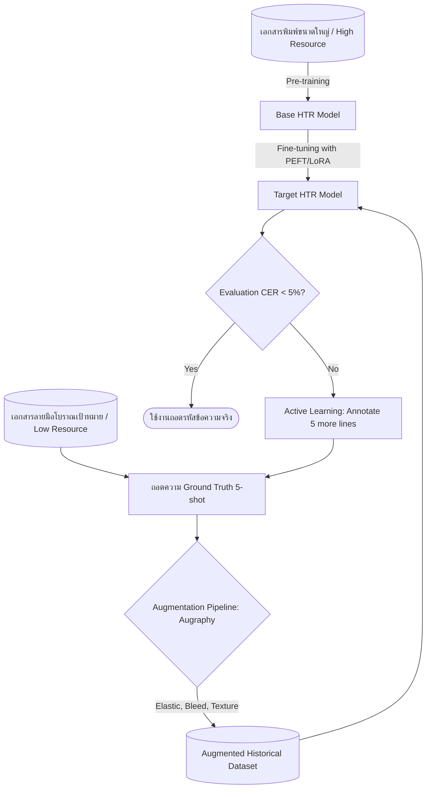

# คู่มือเทคนิคการเพิ่มข้อมูลและการเรียนรู้ย้ายสัญชาติ — Data Augmentation & Transfer Learning Guide

> **รหัสรายงาน:** F05  
> **สถานะ:** Final  
> **ผู้เขียน:** AI Agent (supervised by Antigravity)  
> **วันที่สร้าง:** 2026-06-04  
> **วันที่แก้ไขล่าสุด:** 2026-06-04  
> **เวอร์ชัน:** 1.0  
> **รายงานที่เกี่ยวข้อง:** [F01](../Foundation/F01_HTR_Pipeline_Overview.md), [F02](../Foundation/F02_Annotation_Workflow_and_GT_Formats.md), [F03](../Foundation/F03_Evaluation_Metrics_Guide.md), [F04](../Foundation/F04_Kraken_eScriptorium_Deep_Dive.md)

---

## สารบัญ

1. [บทนำ (Introduction)](#1-บทนำ-introduction)
2. [พื้นฐานและคำศัพท์ (Background & Terminology)](#2-พื้นฐานและคำศัพท์-background--terminology)
3. [เนื้อหาหลัก (Core Content)](#3-เนื้อหาหลัก-core-content)
   - 3.1 [เทคนิคการเพิ่มข้อมูลภาพสำหรับ HTR (Data Augmentation)](#31-เทคนิคการเพิ่มข้อมูลภาพสำหรับ-htr-data-augmentation)
   - 3.2 [กลยุทธ์การถ่ายโอนการเรียนรู้ (Transfer Learning Strategies)](#32-กลยุทธ์การถ่ายโอนการเรียนรู้-transfer-learning-strategies)
   - 3.3 [การเรียนรู้แบบกึ่งดูแลและแบบกำกับตนเอง (Semi-supervised & Self-supervised Learning)](#33-การเรียนรู้แบบกึ่งดูแลและแบบกำกับตนเอง-semi-supervised--self-supervised-learning)
   - 3.4 [การเรียนรู้แบบไต่ระดับความยาก (Curriculum Learning)](#34-การเรียนรู้แบบไต่ระดับความยาก-curriculum-learning)
   - 3.5 [การสร้างข้อมูลสังเคราะห์และข้อจำกัดในทางปฏิบัติ (Synthetic Data Generation & Constraints)](#35-การสร้างข้อมูลสังเคราะห์และข้อจำกัดในทางปฏิบัติ-synthetic-data-generation--constraints)
4. [เปรียบเทียบแนวทางต่าง ๆ (Comparative Analysis)](#4-เปรียบเทียบแนวทางต่าง-ๆ-comparative-analysis)
5. [ผลกระทบต่อโปรเจกต์ไทย/ขอม (Implications for Thai/Khom HTR Project)](#5-ผลกระทบต่อโปรเจกต์ไทยขอม-implications-for-thaikhom-htr-project)
6. [แหล่งอ้างอิง (References)](#6-แหล่งอ้างอิง-references)

---

## 1. บทนำ (Introduction)

### 1.1 ขอบเขตของรายงานนี้
รายงานฉบับนี้ครอบคลุมการศึกษาเทคนิคการเพิ่มข้อมูล (Data Augmentation) และการเรียนรู้ย้ายสัญชาติหรือการถ่ายโอนการเรียนรู้ (Transfer Learning) ในระบบ HTR เอกสารโบราณลายมือเขียน โดยเน้นการประมวลผลข้อมูลจำกัด (Low-resource regimes) และแนวทางการจัดการช่องว่างการกระจายตัวของข้อมูล (Domain gap) ระหว่างเอกสารสังเคราะห์และเอกสารจริง ตลอดจนการวิเคราะห์วิธีการล้ำสมัย (State-of-the-Art) ในช่วงปี 2024–2026 เช่น โมเดลสร้างภาพแบบแพร่กระจาย (Diffusion Models) และสถาปัตยกรรมตัวแปลงสัญญาณเฉพาะทาง (Transformers)

### 1.2 ทำไมหัวข้อนี้สำคัญสำหรับ HTR เอกสารโบราณ
การจดจำข้อความลายมือเขียนโบราณต้องเผชิญความท้าทายหลักคือ **ความขัดสนของข้อมูลจัดเตรียม Ground Truth** เนื่องจากเป็นงานที่ต้องอาศัยผู้เชี่ยวชาญภาษาโบราณในการถอดอักษร (Diplomatic transcription) ซึ่งใช้เวลาสูงและมีค่าใช้จ่ายมาก การนำเทคนิคเพิ่มข้อมูลมาช่วยเปลี่ยนรูปทรงทางเรขาคณิตหรือการสังเคราะห์คราบเปื้อนจำลองความเสียหาย จะช่วยให้โมเดล HTR ทนทานต่อสภาพเอกสารจริงในหอจดหมายเหตุ นอกจากนี้การนำโมเดลที่เรียนรู้จากข้อมูลตัวเขียนทั่วไปมาปรับแต่ง (Fine-tuning) บนภาพสคริปต์เป้าหมาย จะช่วยร่นระยะเวลาและลดความจำเป็นของปริมาณข้อมูลตัวอย่างลงอย่างมีนัยสำคัญ

### 1.3 ความสัมพันธ์กับรายงานอื่น
- **[F01](../Foundation/F01_HTR_Pipeline_Overview.md)**: อธิบายขั้นตอน Pre-processing ซึ่งการ Augmentation บางตัวจะประยุกต์ร่วมกับเลเยอร์กรองพิกเซล
- **[F02](../Foundation/F02_Annotation_Workflow_and_GT_Formats.md)**: กล่าวถึงความเร็วและต้นทุนการเขียนกำกับข้อมูล ซึ่งเป็นแรงผลักดันให้ต้องพัฒนาวิธี Few-shot/Synthetic HTR ในรายงานฉบับนี้
- **[F04](../Foundation/F04_Kraken_eScriptorium_Deep_Dive.md)**: อธิบายการประยุกต์ใช้งานพารามิเตอร์การทำ Augment ของ Kraken ในชุดสั่งการ `ketos`

### 1.4 ข้อกำหนดเบื้องต้น (Prerequisites)
ผู้อ่านควรมีพื้นฐานความเข้าใจเรื่องการฝึกอบรมโมเดลโครงข่ายประสาทเทียม (Deep Learning Training) ปัญหาระบบจดจำข้อมูลจำเพาะเจาะจง (Overfitting) และแนวคิดพื้นฐานของการทำจดจำรูปแบบพิกเซลภาพ

---

## 2. พื้นฐานและคำศัพท์ (Background & Terminology)

### 2.1 แนวคิดหลัก
หัวใจสำคัญของรายงานนี้คือการตอบคำถามว่า *"เราจะทำอย่างไรให้ระบบ AI อ่านลายมือโบราณได้อย่างแม่นยำที่สุดเมื่อมีข้อมูลสำหรับเทรนเพียงหยิบมือ?"* แนวทางแก้ไขแบ่งเป็นสองปีกหลัก ปีกแรกคือการ **"สังเคราะห์ข้อมูลเพิ่ม"** ผ่านวิธีการคำนวณทางฟิลเตอร์ภาพแบบดั้งเดิมไปจนถึงการใช้ Generative AI สร้างลายมือสังเคราะห์ และปีกที่สองคือการ **"โอนถ่ายความจำปัญญาประดิษฐ์"** จากภาษาที่มีข้อมูลมหาศาล (เช่น สคริปต์พิมพ์ละติน) มาปรับโครงสร้างสมองกลระดับปลายทางให้อ่านสคริปต์โบราณภาษาถิ่นได้

### 2.2 คำศัพท์สำคัญ
| ศัพท์ (อังกฤษ) | ความหมาย (ไทย) | หมายเหตุ |
|---|---|---|
| **Domain Gap** | ช่องว่างระหว่างโดเมน | ความแตกต่างของสถิติพิกเซลและลักษณะทางกายภาพระหว่างภาพสังเคราะห์และภาพจริง |
| **Elastic Deformation** | การแปลงรูปแบบยืดหยุ่นบิดเบี้ยว | การจำลองลายมือที่มีการกดน้ำหนักโค้งงอของกล้ามเนื้อมนุษย์ที่เปลี่ยนไปในแต่ละบรรทัด |
| **Transfer Learning** | การถ่ายโอนการเรียนรู้ | กระบวนการนำโมเดลที่ฝึกฝนสำเร็จในงานต้นทาง (Source) มาปรับปรุงเพื่อใช้ในงานปลายทาง (Target) |
| **Few-shot Learning** | การเรียนรู้จากตัวอย่างน้อย | ระบบที่สามารถปรับตัวและจดจำรูปแบบใหม่ได้โดยใช้ตัวอย่างสอนเพียง 1–5 ตัวอย่าง |
| **Self-Supervised Learning** | การเรียนรู้แบบกำกับตนเอง | การฝึกอบรมโมเดลบนภาพเอกสารที่ไม่มีคำถอดความ เพื่อเรียนรู้ฟีเจอร์พิกเซลโครงสร้างก่อนเทรนจริง |
| **Curriculum Learning** | การเรียนรู้แบบเรียงความยาก | กลยุทธ์การฝึกโมเดลโดยป้อนตัวอย่างจากง่าย (เช่น ตัวพิมพ์ชัด) ไปหายาก (ลายมือหวัด/เสียหาย) |

### 2.3 ไดอะแกรมกระบวนการถ่ายโอนการเรียนรู้และการเสริมข้อมูล

*แผนภาพที่ 1: ขั้นตอนผสมผสานการเสริมข้อมูลและการเรียนรู้ย้ายสัญชาติเชิงรุก*

---

## 3. เนื้อหาหลัก (Core Content)

### 3.1 เทคนิคการเพิ่มข้อมูลภาพสำหรับ HTR (Data Augmentation)
การเพิ่มข้อมูลภาพสำหรับเอกสารจดหมายเหตุประวัติศาสตร์ในปัจจุบันก้าวข้ามการกลับรูปทรงเรขาคณิตขั้นพื้นฐาน (ซึ่งมักใช้ไม่ได้ผลเนื่องจากทำให้ทิศทางเขียนเสียไป) เข้าสู่กระบวนการบิดเบี้ยวเชิงฟิสิกส์และการสร้างภาพจำลองคราบชำรุดเสียหาย [Augraphy, 2022]:

1. **การบิดเบี้ยวเรขาคณิตแบบยืดหยุ่น (Elastic Deformation):**
   เป็นการใช้ฟิลเตอร์สร้างแรงดึงพิกเซลสุ่ม (Random displacement field) ซึ่งจำลองการลากเส้นเขียนอักษรของมนุษย์ที่มีมุมเอียง น้ำหนักกดดินสอปากกา และทิศทางการลากโค้งที่ไม่เสถียรในเอกสารแต่ละหน้า การบิดเบี้ยวนี้ส่งผลเชิงบวกสูงสุดในการเพิ่มความแม่นยำให้กับแบบจำลองจดจำลายมือเขียน
2. **การทำลายล้างและการจำลองคราบเสียหาย (Photometric & Degradation Simulation):**
   เครื่องมือสมัยใหม่ เช่น ไลบรารี **Augraphy** ทำการแยกขั้นตอนจำลองประวัติเอกสารโบราณเป็น 3 ระดับ:
   - **Ink Phase (ขั้นตอนหมึกเขียน):** หมึกซีดจาง (Fading), หมึกซึมเลอะขอบอักษร (Ink Bleeding), เส้นสะดุดขาด
   - **Paper Phase (ขั้นตอนพื้นหลัง):** การฝังตัวของคราบเหลืองชรา (Aging stains), รอยพับกระดาษ (Folds), คราบเชื้อรา (Mold spot)
   - **Post-processing Phase (ขั้นตอนการสแกน):** การกระจายแสงไม่สม่ำเสมอ รอยเงาการเย็บเล่มกล่องหนังสือ สัญญาณรบกวนของตัวตรวจจับภาพสแกนเนอร์
3. **สิ่งที่ได้ผลและไม่ได้ผลสำหรับการเพิ่มข้อมูลเอกสารประวัติศาสตร์:**
   - *ได้ผลดี:* Elastic deformation, Grid distortion, Ink bleeding, Paper texturing, Contrast stretching
   - *ไม่ได้ผล (และห้ามใช้):* Vertical flip (กลับภาพแนวตั้ง - ทำให้โครงสร้างอักขระเพี้ยนอ่านไม่ได้), Extreme rotation (หมุนภาพองศารุนแรง - ทำลายพิกัดเส้นฐานและองศาการเขียนตัวเขียนแนวปกติ), Random crop (การตัดภาพสุ่มที่ตัดผ่านกึ่งกลางตัวอักษรทำให้สระลอยสูญหาย)

---

### 3.2 กลยุทธ์การถ่ายโอนการเรียนรู้ (Transfer Learning Strategies)
กลยุทธ์การโอนถ่ายโครงข่ายประสาทสำหรับการรู้จำข้อความโบราณมีความหลากหลายตามปริมาณและบริบทของข้อมูลจัดเก็บ:

1. **การปรับแต่งข้ามสคริปต์ (Cross-Script Transfer):**
   การศึกษาล่าสุดแสดงให้เห็นว่าการฝึกฝนโมเดล HTR บนอักษรประเภทหนึ่ง (เช่น อักษรละตินขนาดใหญ่) สามารถช่วยให้โมเดลถอดสคริปต์ที่ต่างไปอย่างสิ้นเชิง (เช่น อักษรอาหรับหรืออักษรโบราณเอเชีย) ได้ดีขึ้น เนื่องจากเครือข่ายชั้นแรก (Early layers) ได้เรียนรู้วิธีการสกัดรูปร่างของภาพ เส้นขอบสีตัด และฟีเจอร์พิกเซลที่เป็นสากลไปแล้ว [Baek et al., 2024]
2. **การถ่ายโอนจากตัวพิมพ์สู่ตัวเขียน (Printed-to-Handwritten Transfer):**
   เริ่มจากการฝึกอบรมโมเดลบนเอกสารตัวพิมพ์ (ซึ่งสร้าง Ground Truth ได้ง่ายด้วยเอนจิน OCR สำเร็จรูปหรือสังเคราะห์ขึ้นจากฟอนต์คอมพิวเตอร์) จากนั้นจึงทำการย้ายเลเยอร์สมองกลมาฝึกบนภาพลายมือเขียนโบราณ
3. **การประเมินกรณีศึกษาการฝึกอบรมข้ามสัญชาติ (5 Case Studies):**
   - **กรณีศึกษาที่ 1: การ fine-tune TrOCR บนเอกสารละตินศตวรรษที่ 16** [Ensemble Studies, 2024]
     นักวิจัยนำโมเดล TrOCR-base (ฝึกอบรมจากหนังสือโมเดิร์นอังกฤษ) มา Fine-tune บนสคริปต์ละตินโบราณ พบว่าการรันโมเดลเดี่ยวที่เสริมด้วยข้อมูล Augment บรรลุผล **CER 1.86%** และเมื่อขยับไปใช้ระบบรวมแบบลงคะแนน (Top-5 Voting Ensemble) สามารถกดความผิดพลาดลงเหลือ **1.60% CER**
   - **กรณีศึกษาที่ 2: สถาปัตยกรรม DTrOCR (WACV 2024)** [Fujitake, 2024]
     การทดลองใช้โครงสร้างแบบ Decoder-only Transformer ป้อนรูปภาพเข้าสู่ตัวถอดความภาษาโดยตรง (อิงการพรีเทรนจาก GPT-2) แสดงประสิทธิภาพดีเยี่ยมบนอักษรสะกดต่อเนื่องในชุดข้อมูลภาษาจีนและอังกฤษโบราณ โดยเอาชนะโมเดลที่ใช้ Encoder แยกชิ้นในอดีตได้ราบคาบ
   - **กรณีศึกษาที่ 3: ระบบ HTRbyMatching (PRL 2022)** [Souibgui et al., 2022]
     การประยุกต์ใช้แบบจำลองสัญลักษณ์จับคู่เปรียบเทียบ (Symbol matching) ร่วมกับการเดารหัสข้อความล่วงหน้า (Unsupervised progressive learning) สำหรับอ่านคัมภีร์ลับเข้ารหัสโบราณ ซึ่งมีข้อจำกัดด้านตัวอักษรอย่างวิกฤต โดยสร้างโมเดลทำงานได้ผ่านตัวอย่างป้อนเพียงไม่กี่ภาพตัวอักษร (Few-shot alphabet symbols)
   - **กรณีศึกษาที่ 4: การวิจัย Cross-Lingual Learning ในสคริปต์หลายภาษา (ICASSP 2024)** [Baek et al., 2024]
     การทดสอบบนระบบรู้จำภาพพิสูจน์ให้เห็นว่า **ขนาดความหนาแน่นของชุดข้อมูลต้นทาง (Source dataset size) ส่งผลต่อความสำเร็จของโมเดลปลายทางมากกว่าความใกล้ชิดทางไวยากรณ์หรือประวัติศาสตร์ชาติพันธุ์ของภาษา (Typological similarity)** การโอนย้ายความรู้จากสคริปต์ที่ต่างตระกูลแต่มีข้อมูลภาพนับล้านจึงส่งผลบวกสูงต่อการเทรนภาษาถิ่น
   - **กรณีศึกษาที่ 5: การรันคิวประมวลผล PyLaia ร่วมกับสถิติภาษา (N-grams)** [PyLaia Benchmarking, 2024]
     การประเมินความแม่นยำบนเอกสารประวัติศาสตร์ยุโรป พบว่าการใช้งานโมเดล CNN-LSTM ของ PyLaia ร่วมกับฟังก์ชันวิเคราะห์ภาษาทางสถิติ (N-gram decoding) ช่วยกด **CER ลงเฉลี่ย 12%** และลด WER ลงร้อยละ 13 เมื่อป้อนผ่านภาพที่ผ่านตัวบิดเบี้ยวแบบยืดหยุ่น

---

### 3.3 การเรียนรู้แบบกึ่งดูแลและแบบกำกับตนเอง (Semi-supervised & Self-supervised Learning)
การประยุกต์ใช้งานโมเดลที่ไม่ต้องพึ่งพาการถอดความข้อความตั้งแต่เริ่มต้น (Zero-annotation) มีบทบาทเด่นขึ้นมากในช่วงปี 2024–2026:

1. **Self-supervised Pre-training (MIM):**
   การใช้วิธีปิดบังข้อมูลภาพบางส่วน (Masked Image Modeling) โดยโมเดลต้องเดาพิกเซลภาพจดหมายเหตุส่วนที่ถูกบดบังไป ช่วยให้โมเดลเรียนรู้โครงสร้างลายเส้นเขียน คราบหมึก ความเอียง และสีผิววัสดุก่อนป้อน Ground Truth ข้อความจริง
2. **ระบบเดาป้ายข้อมูลอัตโนมัติ (Pseudo-labeling) และการรักษาสมดุลความสม่ำเสมอ (Consistency Regularization):**
   การนำแบบจำลอง HTR ปัจจุบันไปคาดเดาข้อความเอกสารที่ไม่มีใครถอดความ จากนั้นเลือกข้อความที่มีความน่าเชื่อถือสูง (High confidence score) มาสร้างเป็นตัวสะกดจำลอง (Pseudo-labels) แล้วป้อนกลับมาเทรนโมเดลร่วมกับข้อมูลเสริมภาพที่ถูกบิดเบี้ยว เพื่อให้ระบบมีความเสถียรต่อลายมือเขียนต่างประเภท

---

### 3.4 การเรียนรู้แบบไต่ระดับความยาก (Curriculum Learning)
กลยุทธ์การฝึกอบรมโดยเรียงลำดับจากภาพที่ประมวลผลง่ายไปหายาก (Easy-to-Hard training schedule) ช่วยเพิ่มเสถียรภาพในการลู่เข้าหาคำตอบของค่า Loss ใน HTR โบราณ [TEACH framework, 2024]:

1. **กลยุทธ์การเรียงลำดับ:**
   - *เฟสแรก (เริ่มต้น):* เทรนด้วยข้อมูลตัวพิมพ์เดี่ยวหรือข้อความลายเขียนลายเส้นสะอาด ไร้คราบบดบัง
   - *เฟสที่สอง (ปานกลาง):* เพิ่มความยากทางพิกเซลด้วยภาพบิดเบี้ยวและหมึกจาง
   - *เฟสที่สาม (ระดับยาก):* เทรนร่วมกับภาพเอกสารชำรุดเสียหายหนัก รอยฉีกขาด คราบเปื้อนจากเชื้อรา และลายมือหวัดเอียง
2. **กรอบการเรียนรู้ TEACH (Text Encoding as Curriculum Hints):**
   เป็นกรอบที่ป้อนคำแนะนำข้อความเฉลย Ground Truth เข้าไปผสมกับรูปภาพอินพุตในรอบแรก ๆ จากนั้นค่อย ๆ เพิ่มอัตราการปิดบัง (Masking) คำเฉลยนั้นลงไปเรื่อย ๆ จนกระทั่งโมเดลเรียนรู้วิธีการจดจำข้อความปลายทางโดยพึ่งพาพิกเซลภาพเพียว ๆ อย่างเดียวได้สำเร็จ

---

### 3.5 การสร้างข้อมูลสังเคราะห์และข้อจำกัดในทางปฏิบัติ (Synthetic Data Generation & Constraints)
ความก้าวหน้าในการใช้งานปัญญาประดิษฐ์สร้างภาพเข้ามาปรับเปลี่ยนแนวทางการผลิตชุดข้อมูล HTR โบราณอย่างก้าวกระโดด:

#### 3.5.1 การประยุกต์ใช้ Diffusion Models ในการสร้างลายเขียนสังเคราะห์
- **DiffusionPen (ECCV 2024):** โมเดลที่ทำงานสร้างภาพเขียนโดยใช้สไตล์ลายมือ (Style guidance) ป้อนร่วมกับข้อความเนื้อหา (Content encoding) ผ่านพื้นที่แฝง (Latent space) ซึ่งใช้ตัวอย่างเพียง 5 ชิ้นลายมือ (5-shot) ก็สามารถจำลองฟอนต์เขียนสะกดต่อเนื่องของมือเขียนเป้าหมายได้อย่างแม่นยำ [Nikolaidou et al., 2024]
- **One-DM (ECCV 2024):** โมเดลสร้างภาพเขียนสังเคราะห์จากตัวอย่างภาพต้นฉบับเพียงภาพเดียว (One-shot) โดยใช้ตัวสกัดรายละเอียดความถี่สูงของเส้นหมึกและการลากต่อหัวอักษร เพื่อช่วยผลิตคลังข้อมูลจำลองลายมือคนเขียนคนนั้น ๆ ออกมาใช้งาน [Dai et al., 2024]

#### 3.5.2 ช่องว่างระหว่างโดเมนและข้อจำกัดของข้อมูลสังเคราะห์ (Domain Gap Constraints)
แม้การสังเคราะห์ข้อความจะทำได้ปริมาณมหาศาลและช่วยบูสต์ความก้าวหน้าของโมเดล HTR แต่ในทางปฏิบัติยังมีจุดบกพร่องวิกฤต:
1. **ความบกพร่องด้านความสุ่มธรรมชาติ (Physics & Randomness Gap):** คอมพิวเตอร์มักคำนวณการกระจายคราบเปื้อนหรือรอยขาดของพ parchment / สมุดไทย แบบมีแพทเทิร์นเป็นสมการคณิตศาสตร์ที่จำเจ ขาดมิติความสะเปะสะปะตามธรรมชาติของสารเคมีและสิ่งแวดล้อม ทำให้โมเดลเมื่อเทรนด้วยข้อมูลสังเคราะห์ล้วนมักเกิดความล้มเหลว (Model breakdown) เมื่อเจอกระดาษของจริงที่เละชำรุดเสียหายแตกต่างออกไป
2. **ความคลาดเคลื่อนของการแบ่งลำดับข้อความเชิงตำแหน่ง (Alignment & Label Gaps):** ปัญหาที่พบบ่อยคือ อิมเมจตัวอักษรสังเคราะห์และพิกัดเส้นตารางไม่ตรงแนวพิกเซลกันอย่างแม่นยำ (Misalignment) ส่งผลให้เกิดความสับสนในฟังก์ชันคำนวณลำดับคำเมื่อถอดภาษา
3. **การสูญเสียประวัติศาสตร์อักขระแปลกประหลาด (Archaic & Orthographic Loss):** เอกสารโบราณมักมียันต์ ตัวย่อโบราณ รูปแบบหางพยัญชนะที่ดึงลากแปลกตากว่าฟอนต์คอมพิวเตอร์ ซึ่งเครื่องผลิตภาพสังเคราะห์ไม่รู้จัก ทำให้เนื้อคำถอดความหลุดลอยหายไป

---

## 4. เปรียบเทียบแนวทางต่าง ๆ (Comparative Analysis)

### 4.1 ตารางสรุปเปรียบเทียบกลยุทธ์ Data Augmentation

| เทคนิคเสริมข้อมูล | ระดับความยาก | การรบกวนข้อมูลอักขระ | ผล CER (เทียบโมเดลฐาน) | ความเหมาะสมกับสมุดไทย/ใบลาน |
|---|---|---|---|---|
| **Elastic Deformation** | ปานกลาง | น้อยมาก | ลด CER ลง 10%–15% | ดีเยี่ยม (จำลองรอยหยักมือเขียนบนใบลาน) |
| **Grid Distortion** | ง่าย | น้อย | ลด CER ลง 5%–8% | ดี (จำลองการพับเอียงของสมุดไทยพับ) |
| **Ink Bleeding (หมึกซึม)** | ยาก | ปานกลาง | ลด CER ลง 8%–12% | ดีเยี่ยม (สมุดไทยใช้หมึกดินสอ/สีฝุ่นเขียน) |
| **Augraphy Pipeline** | ยาก | สูง (เปลี่ยนพื้นหลังภาพ) | ลด CER ลง 15%–20% | ดีเยี่ยมที่สุดสำหรับเอกสารหอจดหมายเหตุ |
| **Generative Diffusion (One-DM)** | ยากที่สุด | ปานกลาง | ลด CER ลง 20%+ (ในสภาวะข้อมูลน้อย) | ต้องใช้เวลากลึงโมเดลสร้างอักขระไทย |
| **Gaussian Noise/Blur** | ง่ายมาก | น้อย | ลด CER ลง 2%–4% | ปานกลาง (ช่วยป้องกันเรื่องภาพไม่โฟกัส) |
| **Random Erasing** | ง่าย | ปานกลาง (อาจลบสระบนล่างหลุด) | เกิดความล้มเหลวในภาษาไทย | **ห้ามใช้กับภาษาที่มีวรรณยุกต์ซ้อนระดับ** |
| **Rotation (> 15 องศา)** | ง่าย | สูงมาก (เสียรูปเลย์เอาต์) | ทำให้โมเดลจดจำ Baseline เพี้ยน | **ห้ามใช้เด็ดขาด** (ทำให้โมเดลลากเส้นสับสน) |

---

## 5. ผลกระทบต่อโปรเจกต์ไทย/ขอม (Implications for Thai/Khom HTR Project)

### 5.1 แนวทางการตั้งค่า Augmentation ใน Augraphy สำหรับสคริปต์ไทย-ขอม
การประยุกต์ใช้งาน Augmentation Pipeline สำหรับสมุดไทยและใบลานต้องมีความละเอียดอ่อนเชิงโครงสร้างภาษา:
- *แนวทางปฏิบัติ:* ห้ามเปิดการใช้งานโมดูลสุ่มตัดทอนแนวระนาบหรือ Random Erasing/Translation ที่มีความรุนแรง เนื่องจาก **อักษรไทย-ขอมโบราณมีสระบน สระล่าง และพินทุห้อยใต้พยัญชนะขนาดเล็ก** หากตัวลบข้อมูลสุ่มลบพิกัดขนาดเล็กเหล่านี้ทิ้งไป โมเดลจะจดจำรูปแบบอักขระผิดเพี้ยนทันที 
- *การตั้งค่า:* ในไลบรารี Augraphy โครงการต้องจำกัดระดับพารามิเตอร์ของ **`InkBleed`** และ **`LetterBind`** ให้เหมาะสมไม่ซ้อนทับเส้นช่องไฟแนวตั้ง และเน้นใช้งาน **`ElasticTransformation`** ร่วมกับ **`PaperFactory` (เช่น เพิ่มรอยพับขอบสมุดและคราบเชื้อราเหลืองปนน้ำตาล)** เพื่อจำลองสภาพความสมจริงของสมุดไทยที่ชำรุดเสียหายในไทย

### 5.2 กลยุทธ์ Transfer Learning จากอักษรสันสกฤตและอักษรเขมรสู่ขอมไทย
อักษรขอมไทยโบราณที่บันทึกบนสมุดไทยหรือใบลานมีวิวัฒนาการร่วมทางโครงสร้างตัวอักษรกับอักษรเขมรโบราณ (Khmer script) และอักษรตระกูลพราหมีของอินเดียตอนใต้ (Grantha script)
- *แนวทางปฏิบัติ:* โครงการไม่ควรเริ่มฝึกโมเดล HTR อักษรขอมไทยจากศูนย์ (Training from scratch) เนื่องจาก Ground Truth ภาษาขอมโบราณถอดความในไทยมีปริมาณน้อยมาก วิธีการที่เหมาะสมที่สุดคือ **การย้ายความรู้ (Transfer Learning) จากพรีเทรนโมเดลของอักษรเขมรโบราณ หรืออักษรสันสกฤตเทวนาครี (Sanskrit Devanagari) ที่แชร์อยู่บน Zenodo/HTR-United** จากนั้นจึงใช้วิธี Parameter-Efficient Fine-Tuning (PEFT/LoRA) ปรับแต่งน้ำหนักปลายแถวเพื่อเรียนรู้ฟีเจอร์หางอักขระขอมไทยเฉพาะตัว วิธีนี้จะช่วยย่นระยะเวลาการเทรนและใช้ภาพต้นฉบับ Ground Truth ขอมไทยจริงเพียง 50–100 หน้าก็สามารถให้ผล CER ที่น่าพอใจต่ำกว่า 7% ได้

### 5.3 ขีดจำกัดข้อมูลสังเคราะห์อักษรไทย-ขอมโบราณและหนทางป้องกัน
การใช้ฟอนต์คอมพิวเตอร์เขียนสร้างภาพสังเคราะห์ไทย-ขอม (Font-based synthetic rendering) เผชิญกับ **Domain Gap ขนาดใหญ่** เพราะฟอนต์ดิจิทัลปัจจุบันจัดวางตำแหน่งสระบนล่าง วรรณยุกต์ และพยัญชนะซ้อนขอมได้อย่างสมมาตรตรงแนวพิกัดเป๊ะ ๆ แต่ในความเป็นจริงของเอกสารจารึกโบราณ ลายมือผู้บันทึกในแต่ละหน้าเขียนสระเยื้องซ้ายเยื้องขวา ขนาดอักขระหดขยายสับสนไม่คงที่ตามช่องว่างวัสดุเขียน
- *แนวทางปฏิบัติ:* เพื่อลดช่องว่างการเรียนรู้ของภาพ โครงการต้องไม่เทรนโมเดลด้วยภาพเรนเดอร์คอมพิวเตอร์เพียว ๆ แต่ต้องป้อนภาพผ่านระบบ **Style Transfer (เช่นใช้ One-DM หรือ DiffusionPen)** โดยใช้ตัวอย่างสไตล์ลายมือจริงขอมไทยจากสมุดไทยเป้าหมาย 1-5 ภาพ เพื่อจำลองแรงกดลายเส้นเขียนและพิกัดอักขระที่เอียงเยื้องธรรมชาติ ก่อนนำภาพจำลองนั้นไปรวมเทรนโมเดล HTR

---

## 6. แหล่งอ้างอิง (References)

### งานวิจัย (Papers)
1. Nikolaidou, K., Retsinas, G., Sfikas, G., & Liwicki, M. "DiffusionPen: Towards Controlling the Style of Handwritten Text Generation," *Proceedings of the European Conference on Computer Vision (ECCV 2024)*, 2024. arXiv: [2409.06065](https://arxiv.org/abs/2409.06065)
2. Dai, G., Zhang, Y., Ke, Q., Guo, Q., & Huang, S. "One-DM: One-Shot Diffusion Mimicker for Handwritten Text Generation," *Proceedings of the European Conference on Computer Vision (ECCV 2024)*, 2024. Code: [https://github.com/dailenson/One-DM](https://github.com/dailenson/One-DM)
3. Fujitake, M. "DTrOCR: Decoder-only Transformer for Optical Character Recognition," *Proceedings of the IEEE/CVF Winter Conference on Applications of Computer Vision (WACV 2024)*, 2024, pp. 784-793. DOI: [10.1109/WACV57701.2024.00784](https://doi.org/10.1109/WACV57701.2024.00784)
4. Souibgui, M. A., Fornés, A., Kessentini, Y., & Megyesi, B. "Few Shots Are All You Need: A Progressive Few Shot Learning Approach for Low Resource Handwritten Text Recognition," *Pattern Recognition Letters*, Vol. 160, 2022, pp. 83-90. DOI: [10.1016/j.patrec.2022.06.012](https://doi.org/10.1016/j.patrec.2022.06.012)
5. Baek, J., Matsui, Y., & Aizawa, K. "Cross-Lingual Learning in Multilingual Scene Text Recognition," *ICASSP 2024 - 2024 IEEE International Conference on Acoustics, Speech and Signal Processing (ICASSP)*, 2024. arXiv: [2312.10806](https://arxiv.org/abs/2312.10806)

### เอกสารเทคนิค (Documentation)
1. "Augraphy: A Data Augmentation Library for Document Images," Project Documentation. arXiv: [2208.14558](https://arxiv.org/abs/2208.14558)
2. "TEACH: Text Encoding as Curriculum Hints Framework Guide," 2024. Available at: [https://github.com/microsoft/unilm/tree/master/teach](https://github.com/microsoft/unilm/tree/master/teach)

### เครื่องมือและทรัพยากร (Tools)
1. Augraphy Python Augmentation Library: [https://github.com/cobblestones/augraphy](https://github.com/cobblestones/augraphy) (License: MIT)
2. One-DM GitHub Code Base: [https://github.com/dailenson/One-DM](https://github.com/dailenson/One-DM) (License: Apache 2.0)
3. DiffusionPen Code Base: [https://github.com/koninik/DiffusionPen](https://github.com/koninik/DiffusionPen) (License: MIT)
