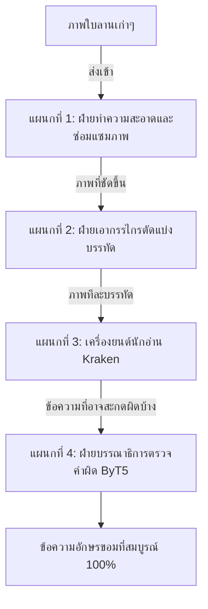

# ข้อเสนอแนะและแผนแม่บทสำหรับโปรเจกต์ HTR อักษรขอม

> **รหัสรายงาน:** S02  
> **สถานะ:** Final (ฉบับอธิบายเข้าใจง่าย)  
> **ผู้เขียน:** AI Agent (supervised by Vesin)  
> **วันที่สร้าง:** 2026-06-04  
> **วันที่แก้ไขล่าสุด:** 2026-06-04  
> **เวอร์ชัน:** 3.0 (ฉบับสำหรับทีมงานทุกระดับ)  
> **รายงานที่สังเคราะห์จาก:** ข้อสรุปทั้งหมดจาก S01 และ Case Studies

---

## สารบัญ
1. [บทนำ (Introduction)](#1-บทนำ-introduction)
2. [สถาปัตยกรรมระบบรวม: ทำงานเหมือนโรงงาน (End-to-End System Architecture)](#2-สถาปัตยกรรมระบบรวม-ทำงานเหมือนโรงงาน-end-to-end-system-architecture)
3. [แผนกที่ 1: การซ่อมแซมและเตรียมภาพ (Pre-processing)](#3-แผนกที่-1-การซ่อมแซมและเตรียมภาพ-pre-processing)
4. [แผนกที่ 2: การหั่นบรรทัดและหลบตัวเชิง (Layout Analysis & Segmentation)](#4-แผนกที่-2-การหั่นบรรทัดและหลบตัวเชิง-layout-analysis--segmentation)
5. [แผนกที่ 3: เครื่องยนต์นักอ่าน (Core HTR Recognition Engine)](#5-แผนกที่-3-เครื่องยนต์นักอ่าน-core-htr-recognition-engine)
6. [แผนกที่ 4: บรรณาธิการจอมเนี้ยบ (LLM Post-processing Integration)](#6-แผนกที่-4-บรรณาธิการจอมเนี้ยบ-llm-post-processing-integration)
7. [แหล่งอ้างอิง (References)](#7-แหล่งอ้างอิง-references)

---

## 1. บทนำ (Introduction)
รายงาน S02 ฉบับนี้คือ **"แผนแม่บทการสร้างระบบ (Master Blueprint)"** สำหรับพัฒนา AI อ่านอักษรขอมและอักษรธรรมของไทย เพื่อให้ทีมงานทุกคน (ไม่ว่าจะเป็นผู้ประสานงาน นักประเมินผล หรือวิศวกร) มองเห็นภาพเดียวกัน ผมได้แปลงศัพท์เทคนิคคอมพิวเตอร์ที่ซับซ้อนให้กลายเป็นภาพเปรียบเทียบที่เข้าใจง่าย เพื่อให้เห็นว่ากระบวนการตั้งแต่เอาภาพใบลานเข้าเครื่อง ไปจนถึงได้ข้อความภาษาขอมออกมานั้น มีขั้นตอนอย่างไรบ้าง

---

## 2. สถาปัตยกรรมระบบรวม: ทำงานเหมือนโรงงาน (End-to-End System Architecture)

เปรียบเทียบระบบ HTR ของเราเหมือน "โรงงานผลิตหนังสือ" ซึ่งแบ่งออกเป็น 4 แผนกหลักๆ ที่ทำงานต่อกันเป็นทอดๆ:

---

## 3. แผนกที่ 1: การซ่อมแซมและเตรียมภาพ (Pre-processing)

แผนกนี้รับภาพถ่ายใบลานเข้ามา หน้าที่ของเขาคือทำให้ตัวอักษรขอมเด่นชัดที่สุด และลบขยะทิ้ง

### 3.1 การใส่ "แว่นตากรองแสง" (Gabor Filters)
- **ปัญหา:** ใบลานมีลายเส้นตามธรรมชาติ (ลายใบไม้) ที่คอมพิวเตอร์ชอบนึกว่าเป็นตัวอักษร
- **วิธีแก้:** เราจะฝังโปรแกรมที่ทำหน้าที่เหมือน "แว่นตากรองแสงทิศทาง" เข้าไปในดวงตาของ AI แว่นตานี้จะถูกตั้งค่าให้มองไม่เห็นเส้นตรงแนวนอนยาวๆ (ลายใบไม้) แต่มันจะมองเห็นเฉพาะพิกเซลที่มีความโค้งงอ หรือหักมุม ซึ่งตรงกับลักษณะหัวและหางของตัวอักษรขอมพอดี 

### 3.2 การลบรอยตรายางด้วยช่างทาสี (Inpainting)
- **ปัญหา:** หอสมุดแห่งชาติมักปั๊มตรายางสีแดงทับข้อความใบลาน ทำให้ AI ตาบอดชั่วขณะ
- **วิธีแก้:** เราใช้ AI อีกตัวมาทำหน้าที่เหมือน "ช่างทาสี" โดยให้มันมองหาสีแดงบนภาพ แล้วลบสีแดงนั้นทิ้งให้เป็นรูโหว่ จากนั้นให้ช่างทาสีใช้จินตนาการวาดเส้นตัวอักษรขอมสีดำเชื่อมต่อกันให้สมบูรณ์เหมือนเดิม (เทคนิคนี้เรียกว่า Inpainting อ้างอิงจากญี่ปุ่น AS06)

---

## 4. แผนกที่ 2: การหั่นบรรทัดและหลบตัวเชิง (Layout Analysis & Segmentation)

แผนกนี้สำคัญมาก ถ้าตัดบรรทัดพลาด ตัวอักษรจะหัวขาดหรือหางขาดทันที

### 4.1 กฎเหล็ก: ห้ามตีกรอบสี่เหลี่ยมเด็ดขาด
อักษรขอมมี "ตัวเชิง" ห้อยต่องแต่งอยู่ใต้บรรทัด ถ้าเราใช้ไม้บรรทัดขีดกรอบสี่เหลี่ยมแนวนอนแบบตรงๆ กรอบนั้นจะไปตัดโดนหางตัวเชิงของบรรทัดบน ทำให้ AI อ่านผิด 

### 4.2 วิธีแก้: ใช้เรดาร์จับไข่แดง (CRAFT Model)
เราจะเปลี่ยนไปใช้ระบบที่เรียกว่า CRAFT ซึ่งทำงานเหมือน "เรดาร์" มันจะไม่ขีดเส้นตรง แต่มันจะปล่อยคลื่นไปหา "จุดศูนย์กลางของตัวอักษรแต่ละตัว" (เหมือนหาไข่แดง) เมื่อมันเจอไข่แดงเรียงกันเป็นตับ มันจะสร้างเส้นขอบเลื้อยคดเคี้ยวไปตามความกว้างยาวของไข่แดงนั้นๆ ทำให้เกิดกรอบรูปร่างแปลกๆ (โพลีกอน) ที่สามารถหลบหลีกตัวเชิงได้อย่างแม่นยำ

### 4.3 เมื่ออักษรชนกัน ให้ใช้วิธี "ตัดสะพาน" (Average Linkage Clustering)
ถ้าคนเขียนจารึกตวัดหางตัวอักษรบรรทัดบน ลงมาชนกับหลังคาตัวอักษรบรรทัดล่าง AI จะนึกว่าเป็นบรรทัดเดียวกัน วิธีแก้คือ ให้คอมพิวเตอร์มองกลุ่มสีดำเป็นเหมือน "เกาะ" สองเกาะที่เชื่อมกันด้วย "สะพานแคบๆ" เมื่อคอมพิวเตอร์หาคอคอดของสะพานเจอ ก็สั่งให้มันตัดสะพานนั้นทิ้ง บรรทัดสองบรรทัดก็จะหลุดออกจากกันอย่างสวยงาม (อ้างอิงจากพม่า AS07)

---

## 5. แผนกที่ 3: เครื่องยนต์นักอ่าน (Core HTR Recognition Engine)

ที่นี่คือหัวใจของระบบ เราเลือกใช้เครื่องยนต์ที่ชื่อว่า **Kraken** ซึ่งเชี่ยวชาญการอ่านเอกสารโบราณระดับโลก

### 5.1 ข้อห้ามเด็ดขาด: ห้าม "บีบ" รูปภาพ (No Squishing)
- **ความผิดพลาดที่พบบ่อย:** เวลาเราเอาภาพไปให้ AI อ่าน บางคนชอบบังคับขนาดภาพให้เป็นสี่เหลี่ยมจัตุรัสเป๊ะๆ (เช่น 256x256) ซึ่งทำให้ภาพบรรทัดใบลานยาวๆ ถูก "บีบอัด" จนตัวอักษรขอมผอมเพรียวและผิดสัดส่วน 
- **วิธีทำที่ถูกต้อง:** ต้องรักษาอัตราส่วนเดิมไว้ (Aspect Ratio) ถ้ารูปสั้นเกินไป ให้ใช้วิธีเอา "แถบสีดำ" ไปต่อท้ายรูป (เรียกว่าการทำ Zero Padding) เพื่อให้รูปได้ขนาดตามต้องการโดยที่ตัวอักษรขอมไม่เสียทรง

### 5.2 การใช้ทางลัดช่วยเรียน (Auxiliary Loss)
เพื่อให้อ่านเก่งขึ้นเร็วๆ เราจะเพิ่ม "โจทย์พิเศษ" ให้ส่วนดวงตาของ AI ได้ฝึกอ่านล่วงหน้าก่อนจะส่งให้ส่วนสมองประมวลผล (แทรกระหว่าง CNN และ LSTM) การทำแบบนี้เรียกว่าการฉีด Auxiliary Loss ช่วยให้โมเดลเก่งขึ้นและประหยัดเวลาเทรนไปได้ถึง 3 เท่า

---

## 6. แผนกที่ 4: บรรณาธิการจอมเนี้ยบ (LLM Post-processing Integration)

ต่อให้เครื่องยนต์ Kraken เก่งแค่ไหน มันก็ยังอ่านผิดได้ประมาณ 10% (เช่น เห็น ด เป็น ต) เราจึงต้องมีแผนกสุดท้าย

### 6.1 บรรณาธิการที่ตรวจทีละตัวอักษร (ByT5 Model)
- **ปัญหา:** AI ทั่วไป (เช่น ChatGPT) เวลาอ่านหนังสือ มันจะอ่านเป็น "คำๆ" แต่ภาษาบาลีไม่มีการเว้นวรรค แถมมีการสมาสคำยาวเหยียด ถ้า AI ทั่วไปเจอคำบาลีแปลกๆ มันจะเอ๋อและหั่นคำพังทลาย
- **วิธีแก้:** เราจะใช้ AI รุ่นพิเศษชื่อว่า **ByT5** ซึ่งถูกออกแบบมาให้อ่านหนังสือ **"ทีละตัวอักษร (Byte-level)"** มันจะไม่งงกับคำยาวๆ โดยเราจะเอากฎไวยากรณ์บาลีไปป้อนให้มันจำ พอ Kraken ส่งคำที่สะกดผิดมาให้ ByT5 จะวิเคราะห์เลยว่า "ตัวเชิงแบบนี้ ห้ามอยู่หลังสระตัวนี้" แล้วมันจะซ่อมคำผิดนั้นให้ถูกต้องเป๊ะ 100%

---

## 7. แหล่งอ้างอิง (References)
- ศึกษาเรื่องแว่นตากรองแสง (Gabor Filters) จากกรณีศึกษาใบลานสิงหล: [AS08_Sinhala_Palm_Leaves](../CaseStudies/AS/AS08_Sinhala_Palm_Leaves.md)
- ศึกษาเรื่องเรดาร์หาไข่แดง (CRAFT) จากตัวอย่างอักษรเทวนาครี: [AS03_Sanskrit_Devanagari](../CaseStudies/AS/AS03_Sanskrit_Devanagari.md)
- ศึกษาเรื่องการไม่บีบรูปภาพและการใช้ Auxiliary Loss จากเทรนด์โลกปี 2024: [XC04_Best_Practices_HTR_2024](../CaseStudies/XC/XC04_Best_Practices_HTR_2024.md)
