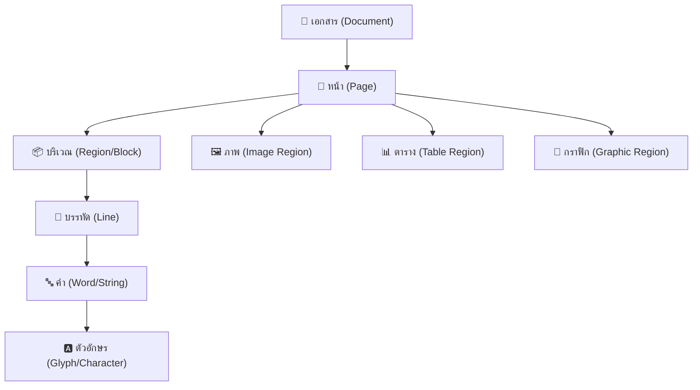
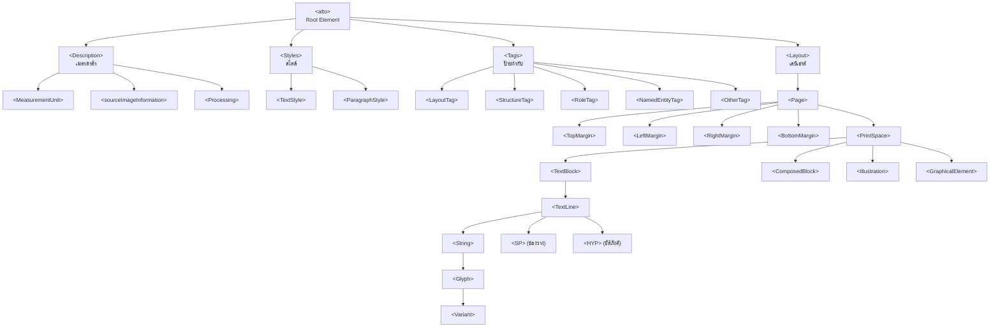
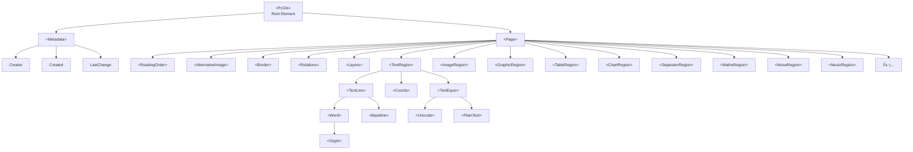
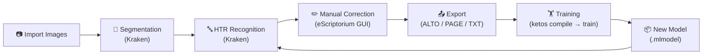
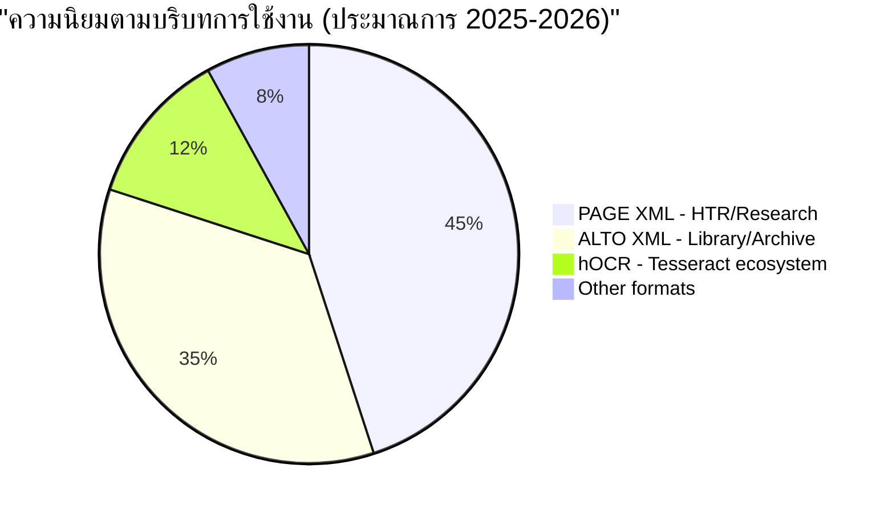
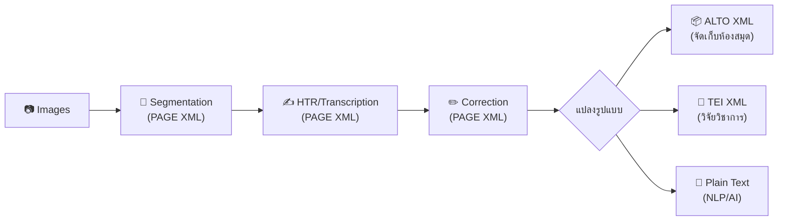
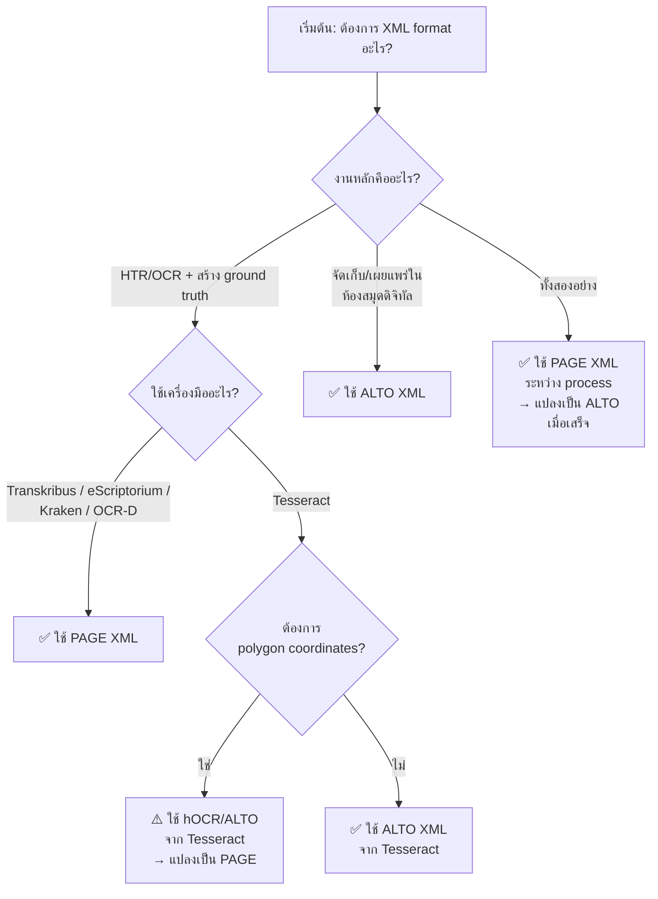

# 📖 คู่มือฉบับสมบูรณ์: มาตรฐาน PAGE XML และ ALTO XML
### สำหรับงาน OCR/HTR และ Digital Humanities — ฉบับปรับปรุง 2026

---

## สารบัญ

1. [บทนำ — XML ในงานดิจิทัลไลเซชัน](#1-บทนำ--xml-ในงานดิจิทัลไลเซชัน)
2. [พื้นฐาน XML สำหรับ OCR/HTR](#2-พื้นฐาน-xml-สำหรับ-ocrhtr)
3. [ALTO XML — รายละเอียดเชิงลึก](#3-alto-xml--รายละเอียดเชิงลึก)
4. [PAGE XML — รายละเอียดเชิงลึก](#4-page-xml--รายละเอียดเชิงลึก)
5. [ตารางเปรียบเทียบ Tag ทั้งหมด](#5-ตารางเปรียบเทียบ-tag-ทั้งหมด)
6. [วิเคราะห์ข้อดีข้อเสีย](#6-วิเคราะห์ข้อดีข้อเสีย)
7. [การทำงานร่วมกับ Kraken และเทคโนโลยี HTR](#7-การทำงานร่วมกับ-kraken-และเทคโนโลยี-htr)
8. [เครื่องมือแปลงรูปแบบ (Conversion Tools)](#8-เครื่องมือแปลงรูปแบบ-conversion-tools)
9. [แนวโน้มอนาคตและสถานะปัจจุบัน 2025–2026](#9-แนวโน้มอนาคตและสถานะปัจจุบัน-20252026)
10. [คำแนะนำการเลือกใช้งาน](#10-คำแนะนำการเลือกใช้งาน)
11. [แหล่งข้อมูลอ้างอิง](#11-แหล่งข้อมูลอ้างอิง)

---

## 1. บทนำ — XML ในงานดิจิทัลไลเซชัน

### XML คืออะไร?

**XML (eXtensible Markup Language)** เป็นภาษามาร์กอัพที่ออกแบบมาเพื่อจัดเก็บและส่งผ่านข้อมูลแบบมีโครงสร้าง (structured data) ที่ทั้งมนุษย์และเครื่องจักรสามารถอ่านได้ XML ถูกใช้เป็นพื้นฐานของมาตรฐานหลายอย่างในวงการ Digital Humanities และ Digital Libraries

### ทำไมต้องมีมาตรฐาน XML สำหรับ OCR/HTR?

เมื่อเราทำ **Optical Character Recognition (OCR)** หรือ **Handwritten Text Recognition (HTR)** ผลลัพธ์ที่ได้ไม่ได้มีแค่ "ข้อความ" เท่านั้น แต่รวมถึง:

- 📐 **ตำแหน่งพิกัด** (coordinates) ของแต่ละบรรทัด คำ และตัวอักษรบนภาพ
- 📊 **โครงสร้างเลย์เอาต์** (layout structure) — ย่อหน้า, คอลัมน์, ตาราง, ภาพประกอบ
- 🔤 **สไตล์ข้อความ** — ฟอนต์, ขนาด, ตัวหนา/ตัวเอียง
- 📈 **ค่าความเชื่อมั่น** (confidence scores) ของการรู้จำ
- 📋 **ลำดับการอ่าน** (reading order)
- 🏷️ **เมตาดาต้า** — ข้อมูลเกี่ยวกับกระบวนการประมวลผล

มาตรฐาน XML จึงเป็นตัวกลางที่ช่วยจัดเก็บข้อมูลเหล่านี้อย่างเป็นระบบ และทำให้เครื่องมือต่าง ๆ สามารถแลกเปลี่ยนข้อมูลระหว่างกันได้

### สองมาตรฐานหลักของวงการ

ในปัจจุบัน มีมาตรฐาน XML หลัก 2 ตัวที่ใช้ในงาน OCR/HTR:

| มาตรฐาน | ชื่อเต็ม | จุดกำเนิด | บทบาทหลัก |
|:---|:---|:---|:---|
| **ALTO** | Analyzed Layout and Text Object | METAe Project (EU), 2001–2003 | จัดเก็บและเผยแพร่ผลลัพธ์ OCR ในห้องสมุดดิจิทัล |
| **PAGE** | Page Analysis and Ground-truth Elements | PRImA Research Lab, ~2010 | วิเคราะห์เอกสาร, สร้าง ground truth, ฝึกสอนโมเดล |

> [!IMPORTANT]
> ทั้งสองมาตรฐาน **ไม่ได้เป็นคู่แข่ง** แต่เป็น **คู่เสริม** (complementary) — มักถูกใช้ในขั้นตอนที่ต่างกันของ workflow เดียวกัน

---

## 2. พื้นฐาน XML สำหรับ OCR/HTR

### โครงสร้างพื้นฐานของ XML

```xml
<?xml version="1.0" encoding="UTF-8"?>
<root_element attribute="value">
    <child_element>เนื้อหา</child_element>
    <self_closing_element />
</root_element>
```

### แนวคิดหลักที่ XML ใช้จัดเก็บผลลัพธ์ OCR/HTR



### XSD Schema — หัวใจของมาตรฐาน

ทุกมาตรฐาน XML จะมี **XML Schema Definition (XSD)** ที่กำหนด:
- อิลิเมนต์ (elements) ที่ใช้ได้
- แอตทริบิวต์ (attributes) ของแต่ละอิลิเมนต์
- ลำดับชั้น (hierarchy) ที่ถูกต้อง
- ชนิดข้อมูล (data types) ที่ยอมรับ

---

## 3. ALTO XML — รายละเอียดเชิงลึก

### 3.1 ประวัติและพัฒนาการ

| ช่วงเวลา | เหตุการณ์ |
|:---|:---|
| **2001–2003** | พัฒนาขึ้นในโครงการ **METAe** (สหภาพยุโรป) โดย Alexander Egger, Birgit Stehno, Gregor Retti |
| **2004** | ออก **เวอร์ชัน 1.0** โดย **CCS GmbH** (Content Conversion Specialists) |
| **2004–2007** | CCS ดูแลพัฒนาเวอร์ชัน 1.x |
| **สิงหาคม 2009** | ถ่ายโอนการดูแลไปยัง **Library of Congress (LoC)** สหรัฐอเมริกา |
| **2010–2014** | พัฒนาเวอร์ชัน 2.x ภายใต้ LoC + Editorial Board |
| **สิงหาคม 2014** | ออก **เวอร์ชัน 3.0** — ปรับโครงสร้าง versioning |
| **เมษายน 2018** | ออก **เวอร์ชัน 4.0** — เปลี่ยนครั้งใหญ่: เพิ่ม Glyph, Variant, ไลเซนส์ CC BY-SA 4.0 |
| **เมษายน 2023** | ออก **เวอร์ชัน 4.4** — เพิ่ม LANG, ROTATION, OTHERLANGS (เวอร์ชันล่าสุด) |

### 3.2 องค์กรที่ดูแล

- **Library of Congress** (สหรัฐอเมริกา) — ดูแลหลัก
- **ALTO Editorial Board** — คณะกรรมการบรรณาธิการ
- **GitHub Repository**: [github.com/altoxml/schema](https://github.com/altoxml/schema)
- **เอกสาร**: [github.com/altoxml/documentation](https://github.com/altoxml/documentation)

### 3.3 โครงสร้าง Schema ของ ALTO XML (v4.4)



### 3.4 ตัวอย่าง ALTO XML

```xml
<?xml version="1.0" encoding="UTF-8"?>
<alto xmlns="http://www.loc.gov/standards/alto/ns-v4#"
      xmlns:xsi="http://www.w3.org/2001/XMLSchema-instance"
      xsi:schemaLocation="http://www.loc.gov/standards/alto/ns-v4#
        http://www.loc.gov/standards/alto/v4/alto-4-4.xsd">
  
  <Description>
    <MeasurementUnit>pixel</MeasurementUnit>
    <sourceImageInformation>
      <fileName>page_001.tif</fileName>
    </sourceImageInformation>
    <Processing ID="OCR_1">
      <preProcessingStep>
        <processingStepDescription>Binarization</processingStepDescription>
        <processingSoftware>
          <softwareName>ScanTailor</softwareName>
        </processingSoftware>
      </preProcessingStep>
    </Processing>
  </Description>
  
  <Styles>
    <TextStyle ID="TXT_1" FONTFAMILY="Times New Roman" FONTSIZE="12"
               FONTSTYLE="bold"/>
    <ParagraphStyle ID="PAR_1" ALIGN="Left"/>
  </Styles>
  
  <Layout>
    <Page ID="P1" WIDTH="2480" HEIGHT="3508" PHYSICAL_IMG_NR="1">
      <PrintSpace HPOS="120" VPOS="200" WIDTH="2200" HEIGHT="3100">
        <TextBlock ID="TB_1" HPOS="120" VPOS="200" WIDTH="2200" HEIGHT="400"
                   STYLEREFS="PAR_1">
          <TextLine ID="TL_1" HPOS="120" VPOS="200" WIDTH="2200" HEIGHT="50"
                    BASELINE="245">
            <String ID="S_1" CONTENT="สวัสดี" HPOS="120" VPOS="200"
                    WIDTH="300" HEIGHT="50" WC="0.95" STYLEREFS="TXT_1"/>
            <SP WIDTH="20" HPOS="420" VPOS="200"/>
            <String ID="S_2" CONTENT="ครับ" HPOS="440" VPOS="200"
                    WIDTH="200" HEIGHT="50" WC="0.90"/>
          </TextLine>
        </TextBlock>
        
        <Illustration ID="IL_1" HPOS="500" VPOS="800"
                       WIDTH="1200" HEIGHT="900" TYPE="photo"/>
        
        <GraphicalElement ID="GE_1" HPOS="120" VPOS="750"
                          WIDTH="2200" HEIGHT="5"/>
      </PrintSpace>
    </Page>
  </Layout>
</alto>
```

### 3.5 รายการ Elements ทั้งหมดใน ALTO XML v4.4

#### ระดับ Root และ Metadata

| Element | คำอธิบาย |
|:---|:---|
| `<alto>` | Root element ของเอกสาร |
| `<Description>` | ข้อมูลเมตาดาต้าของไฟล์ |
| `<MeasurementUnit>` | หน่วยวัด (pixel, mm10, inch1200) |
| `<sourceImageInformation>` | ข้อมูลภาพต้นฉบับ |
| `<fileName>` | ชื่อไฟล์ภาพ |
| `<fileIdentifier>` | ตัวระบุไฟล์ (URI, DOI ฯลฯ) |
| `<documentIdentifier>` | ตัวระบุเอกสาร |
| `<Processing>` | ข้อมูลกระบวนการประมวลผล |
| `<preProcessingStep>` | ขั้นตอนก่อนประมวลผล |
| `<ocrProcessingStep>` | ขั้นตอน OCR |
| `<postProcessingStep>` | ขั้นตอนหลังประมวลผล |
| `<processingStepDescription>` | คำอธิบายขั้นตอน |
| `<processingStepSettings>` | การตั้งค่าขั้นตอน |
| `<processingSoftware>` | ซอฟต์แวร์ที่ใช้ |
| `<softwareCreator>` | ผู้สร้างซอฟต์แวร์ |
| `<softwareName>` | ชื่อซอฟต์แวร์ |
| `<softwareVersion>` | เวอร์ชันซอฟต์แวร์ |
| `<applicationDescription>` | คำอธิบายแอปพลิเคชัน |

#### ระดับ Styles

| Element | คำอธิบาย |
|:---|:---|
| `<Styles>` | คอนเทนเนอร์สำหรับสไตล์ |
| `<TextStyle>` | สไตล์ข้อความ (FONTFAMILY, FONTSIZE, FONTSTYLE, FONTWIDTH, FONTCOLOR) |
| `<ParagraphStyle>` | สไตล์ย่อหน้า (ALIGN, LEFT, RIGHT, LINESPACE, FIRSTLINE) |

#### ระดับ Tags

| Element | คำอธิบาย |
|:---|:---|
| `<Tags>` | คอนเทนเนอร์สำหรับป้ายกำกับ |
| `<LayoutTag>` | ป้ายกำกับเลย์เอาต์ |
| `<StructureTag>` | ป้ายกำกับโครงสร้าง (article, section, etc.) |
| `<RoleTag>` | ป้ายกำกับบทบาท |
| `<NamedEntityTag>` | ป้ายกำกับ Named Entity (person, location, organization) |
| `<OtherTag>` | ป้ายกำกับอื่น ๆ |

#### ระดับ Layout — Page

| Element | คำอธิบาย |
|:---|:---|
| `<Layout>` | คอนเทนเนอร์หลักของเลย์เอาต์ |
| `<Page>` | หน้าเอกสาร |
| `<TopMargin>` | ขอบบน |
| `<LeftMargin>` | ขอบซ้าย |
| `<RightMargin>` | ขอบขวา |
| `<BottomMargin>` | ขอบล่าง |
| `<PrintSpace>` | พื้นที่พิมพ์หลัก |

#### ระดับ Layout — Block Types

| Element | คำอธิบาย |
|:---|:---|
| `<TextBlock>` | บล็อกข้อความ |
| `<ComposedBlock>` | บล็อกผสม (รวมบล็อกย่อยหลายชนิด) |
| `<Illustration>` | ภาพประกอบ / รูปภาพ |
| `<GraphicalElement>` | องค์ประกอบกราฟิก (เส้นแบ่ง, กรอบ) |

#### ระดับ Layout — Text Content

| Element | คำอธิบาย |
|:---|:---|
| `<TextLine>` | บรรทัดข้อความ |
| `<String>` | คำ/โทเค็น (มี CONTENT attribute สำหรับข้อความ) |
| `<SP>` | ช่องว่าง (space) |
| `<HYP>` | ยัติภังค์ (hyphenation) |
| `<Glyph>` | ตัวอักษรเดี่ยว (ตั้งแต่ v4.0) |
| `<Variant>` | ตัวเลือกทางเลือกของ Glyph (ตั้งแต่ v4.0) |
| `<Shape>` | รูปร่างของ block (Polygon, Ellipse, Circle) |
| `<Polygon>` | รูปหลายเหลี่ยม |
| `<Ellipse>` | วงรี |
| `<Circle>` | วงกลม |

#### ระดับ Layout — Reading Order (ตั้งแต่ v4.3)

| Element | คำอธิบาย |
|:---|:---|
| `<ReadingOrder>` | ลำดับการอ่าน |
| `<OrderedGroup>` | กลุ่มที่มีลำดับ |
| `<UnorderedGroup>` | กลุ่มที่ไม่มีลำดับ |
| `<ElementRef>` | อ้างอิงไปยังอิลิเมนต์อื่น |

### 3.6 Attributes ที่สำคัญ

| Attribute | ใช้กับ | คำอธิบาย |
|:---|:---|:---|
| `ID` | ทุก element | ตัวระบุเฉพาะ |
| `HPOS`, `VPOS` | Block/Line/String | ตำแหน่งแนวนอน/แนวตั้ง |
| `WIDTH`, `HEIGHT` | Block/Line/String | ความกว้าง/ความสูง |
| `CONTENT` | String | เนื้อหาข้อความ |
| `WC` | String | Word Confidence (0.0–1.0) |
| `CC` | String | Character Confidence (ต่อตัวอักษร) |
| `BASELINE` | TextLine | ตำแหน่ง baseline (รองรับ list of points ตั้งแต่ v4.2) |
| `LANG` | Page, String | ภาษา (ตั้งแต่ v4.4 รองรับที่ Page) |
| `ROTATION` | Page, Block | มุมหมุน (ตั้งแต่ v4.4 รองรับที่ Page) |
| `STYLEREFS` | Block/Line/String | อ้างอิง TextStyle/ParagraphStyle |
| `TAGREFS` | Block/Line/String | อ้างอิง Tags |
| `PROCESSINGREFS` | Block/Line/String | อ้างอิง Processing steps |
| `FONTSTYLE` | TextStyle | bold, italics, subscript, superscript, smallcaps, underline, strikethrough |
| `BASEDIRECTION` | TextLine | ทิศทางข้อความ (ตั้งแต่ v4.3) |
| `PHYSICAL_IMG_NR` | Page | หมายเลขหน้าจริง |
| `PRINTED_IMG_NR` | Page | หมายเลขหน้าที่พิมพ์ |
| `ACCURACY` | Page | ค่าความแม่นยำ OCR |

---

## 4. PAGE XML — รายละเอียดเชิงลึก

### 4.1 ประวัติและพัฒนาการ

| ช่วงเวลา | เหตุการณ์ |
|:---|:---|
| **~2008–2010** | พัฒนาโดย **PRImA Research Lab** (Pattern Recognition & Image Analysis) ที่ **University of Salford**, UK |
| **สิงหาคม 2010** | นำเสนอที่ **ICPR 2010** (20th International Conference on Pattern Recognition) โดย Stefan Pletschacher & Apostolos Antonacopoulos |
| **2010–2013** | ใช้ในการแข่งขัน **ICDAR Page Segmentation Competition** |
| **2016-07-15** | ออก schema version ที่ใช้กันอย่างแพร่หลาย |
| **2017-07-15** | ออก schema version ที่อ้างอิงบ่อย |
| **2019-07-15** | ออก schema version ที่ใช้ในเครื่องมือหลักหลายตัว |
| **2024-07-15** | ออก **เวอร์ชันล่าสุด** |

### 4.2 องค์กรที่ดูแล

- **PRImA Research Lab** — University of Salford, Manchester, UK
- **ผู้พัฒนาหลัก**: Stefan Pletschacher, Apostolos Antonacopoulos
- **GitHub Repository**: [github.com/PRImA-Research-Lab/PAGE-XML](https://github.com/PRImA-Research-Lab/PAGE-XML)
- **Schema Registry**: schema.primaresearch.org

> [!NOTE]
> PAGE XML ใช้ระบบ **date-based versioning** ที่ฝังอยู่ใน namespace URI เช่น `http://schema.primaresearch.org/PAGE/gts/pagecontent/2019-07-15`

### 4.3 โครงสร้าง Schema ของ PAGE XML (2024-07-15)



### 4.4 ตัวอย่าง PAGE XML

```xml
<?xml version="1.0" encoding="UTF-8"?>
<PcGts xmlns="http://schema.primaresearch.org/PAGE/gts/pagecontent/2019-07-15"
       xmlns:xsi="http://www.w3.org/2001/XMLSchema-instance"
       xsi:schemaLocation="http://schema.primaresearch.org/PAGE/gts/pagecontent/2019-07-15
         http://schema.primaresearch.org/PAGE/gts/pagecontent/2019-07-15/pagecontent.xsd">
  
  <Metadata>
    <Creator>eScriptorium</Creator>
    <Created>2025-01-15T10:30:00</Created>
    <LastChange>2025-01-15T14:22:00</LastChange>
  </Metadata>
  
  <Page imageFilename="page_001.tif" imageWidth="2480" imageHeight="3508">
    
    <ReadingOrder>
      <OrderedGroup id="ro_1">
        <RegionRefIndexed index="0" regionRef="r_1"/>
        <RegionRefIndexed index="1" regionRef="r_2"/>
      </OrderedGroup>
    </ReadingOrder>
    
    <TextRegion id="r_1" type="heading"
                custom="structure {type:heading;}">
      <Coords points="120,200 2200,200 2200,280 120,280"/>
      <TextLine id="l_1" custom="structure {type:heading;}">
        <Coords points="120,200 2200,200 2200,280 120,280"/>
        <Baseline points="120,260 2200,260"/>
        <Word id="w_1">
          <Coords points="120,200 420,200 420,280 120,280"/>
          <TextEquiv conf="0.95">
            <Unicode>สวัสดี</Unicode>
          </TextEquiv>
          <Glyph id="g_1">
            <Coords points="120,200 180,200 180,280 120,280"/>
            <TextEquiv>
              <Unicode>ส</Unicode>
            </TextEquiv>
          </Glyph>
        </Word>
        <Word id="w_2">
          <Coords points="440,200 640,200 640,280 440,280"/>
          <TextEquiv conf="0.90">
            <Unicode>ครับ</Unicode>
          </TextEquiv>
        </Word>
        <TextEquiv>
          <Unicode>สวัสดี ครับ</Unicode>
        </TextEquiv>
      </TextLine>
    </TextRegion>
    
    <ImageRegion id="r_2">
      <Coords points="500,800 1700,800 1700,1700 500,1700"/>
    </ImageRegion>
    
    <SeparatorRegion id="r_3">
      <Coords points="120,750 2320,750 2320,755 120,755"/>
    </SeparatorRegion>
    
  </Page>
</PcGts>
```

### 4.5 รายการ Elements ทั้งหมดใน PAGE XML

#### ระดับ Root และ Metadata

| Element | คำอธิบาย |
|:---|:---|
| `<PcGts>` | Root element (Page Content Ground Truth and Storage) |
| `<Metadata>` | เมตาดาต้าเอกสาร |
| `<Creator>` | ผู้สร้าง |
| `<Created>` | วันที่สร้าง |
| `<LastChange>` | วันที่แก้ไขล่าสุด |
| `<Comments>` | ความคิดเห็น |

#### ระดับ Page

| Element | คำอธิบาย |
|:---|:---|
| `<Page>` | อิลิเมนต์หลักของหน้า (imageFilename, imageWidth, imageHeight) |
| `<ReadingOrder>` | ลำดับการอ่าน |
| `<OrderedGroup>` | กลุ่มที่เรียงตามลำดับ |
| `<UnorderedGroup>` | กลุ่มที่ไม่ได้เรียงลำดับ |
| `<RegionRefIndexed>` | อ้างอิง region ตาม index |
| `<RegionRef>` | อ้างอิง region |
| `<AlternativeImage>` | ภาพทางเลือก (binarized, grayscale, enhanced) |
| `<Border>` | ขอบเขตหน้า |
| `<Relations>` | ความสัมพันธ์ระหว่าง region |
| `<Relation>` | ความสัมพันธ์เดี่ยว |
| `<Layers>` | เลเยอร์สำหรับ multi-layer annotation |
| `<Layer>` | เลเยอร์เดี่ยว |

#### ระดับ Region Types (ทั้งหมด)

| Element | คำอธิบาย | ตัวอย่างการใช้งาน |
|:---|:---|:---|
| `<TextRegion>` | บริเวณข้อความ | ย่อหน้า, หัวข้อ, คำบรรยาย |
| `<ImageRegion>` | บริเวณรูปภาพ | ภาพถ่าย, ภาพวาด |
| `<GraphicRegion>` | บริเวณกราฟิก | โลโก้, ไดอะแกรม |
| `<TableRegion>` | บริเวณตาราง | ตารางข้อมูล |
| `<ChartRegion>` | บริเวณแผนภูมิ | กราฟ, แผนภูมิ |
| `<SeparatorRegion>` | บริเวณเส้นแบ่ง | เส้นแบ่งคอลัมน์/ส่วน |
| `<MathsRegion>` | บริเวณสูตรคณิตศาสตร์ | สมการ, สูตร |
| `<ChemRegion>` | บริเวณสูตรเคมี | โครงสร้างเคมี |
| `<MusicRegion>` | บริเวณโน้ตเพลง | โน้ตดนตรี |
| `<AdvertRegion>` | บริเวณโฆษณา | พื้นที่โฆษณา |
| `<LineDrawingRegion>` | บริเวณภาพเส้น | ภาพเทคนิค |
| `<NoiseRegion>` | บริเวณสัญญาณรบกวน | จุด, รอยเปื้อน |
| `<UnknownRegion>` | บริเวณที่ไม่ทราบชนิด | พื้นที่ไม่สามารถจำแนก |
| `<CustomRegion>` | บริเวณแบบกำหนดเอง | ตามความต้องการเฉพาะ |
| `<MapRegion>` | บริเวณแผนที่ | แผนที่ |

#### ระดับ Text Content

| Element | คำอธิบาย |
|:---|:---|
| `<TextLine>` | บรรทัดข้อความ |
| `<Word>` | คำ |
| `<Glyph>` | ตัวอักษร/สัญลักษณ์เดี่ยว |
| `<Coords>` | พิกัดรูปหลายเหลี่ยม (polygon coordinates) |
| `<Baseline>` | เส้นฐานข้อความ (points attribute) |
| `<TextEquiv>` | ข้อความที่ถอดความได้ |
| `<Unicode>` | ข้อความ Unicode |
| `<PlainText>` | ข้อความธรรมดา |
| `<TextStyle>` | สไตล์ข้อความ (ถ้ามี — ขึ้นอยู่กับเครื่องมือ) |

### 4.6 Attributes ที่สำคัญ

| Attribute | ใช้กับ | คำอธิบาย |
|:---|:---|:---|
| `id` | ทุก region/element | ตัวระบุเฉพาะ (unique) |
| `type` | Region | ชนิดย่อย เช่น `heading`, `paragraph`, `caption`, `floating` |
| `custom` | Region/Line/Word | เมตาดาต้าเฉพาะแอป เช่น `structure {type:heading;}` |
| `imageFilename` | Page | ชื่อไฟล์ภาพ |
| `imageWidth` / `imageHeight` | Page | ขนาดภาพ (pixels) |
| `points` | Coords / Baseline | พิกัด "x1,y1 x2,y2 ..." |
| `conf` | TextEquiv | ค่าความเชื่อมั่น (0.0–1.0) |
| `index` | RegionRefIndexed | ลำดับ reading order |
| `regionRef` | RegionRefIndexed/Ref | อ้างอิง region id |
| `filename` | AlternativeImage | ชื่อไฟล์ภาพทางเลือก |
| `comments` | AlternativeImage | คำอธิบายภาพทางเลือก |

---

## 5. ตารางเปรียบเทียบ Tag ทั้งหมด

### 5.1 เปรียบเทียบโครงสร้างหลัก

| แนวคิด | ALTO XML | PAGE XML | หมายเหตุ |
|:---|:---|:---|:---|
| **Root element** | `<alto>` | `<PcGts>` | ชื่อต่างกัน |
| **เมตาดาต้า** | `<Description>` | `<Metadata>` | ALTO ละเอียดกว่า (processing steps) |
| **สไตล์** | `<Styles>` (TextStyle, ParagraphStyle) | ไม่มีส่วนเฉพาะ (ใช้ `custom` attribute) | ALTO มีระบบสไตล์ชัดเจนกว่า |
| **Tags/Labels** | `<Tags>` (LayoutTag, StructureTag ฯลฯ) | ไม่มีโดยตรง (ใช้ `custom` attribute) | ALTO v4+ มีระบบ tag ที่ดี |
| **หน้า** | `<Page>` (ใน `<Layout>`) | `<Page>` (ใน `<PcGts>`) | คล้ายกัน |
| **ลำดับการอ่าน** | `<ReadingOrder>` (ตั้งแต่ v4.3) | `<ReadingOrder>` | PAGE มีมาก่อน |

### 5.2 เปรียบเทียบ Page Structure

| แนวคิด | ALTO XML | PAGE XML | หมายเหตุ |
|:---|:---|:---|:---|
| **ขอบหน้า** | `<TopMargin>`, `<LeftMargin>`, `<RightMargin>`, `<BottomMargin>` | `<Border>` | ALTO แยก 4 ด้าน; PAGE ใช้ polygon |
| **พื้นที่เนื้อหา** | `<PrintSpace>` | ไม่มี (region อยู่ใต้ Page โดยตรง) | ALTO มี container เพิ่ม |
| **ภาพทางเลือก** | ❌ ไม่มี | `<AlternativeImage>` | PAGE รองรับ multi-image |
| **ความสัมพันธ์** | ❌ ไม่มี (ใช้ Tags แทน) | `<Relations>` | PAGE มี semantic relations |
| **เลเยอร์** | ❌ ไม่มี | `<Layers>` | PAGE รองรับ multi-layer |

### 5.3 เปรียบเทียบ Region/Block Types

| ชนิดเนื้อหา | ALTO XML | PAGE XML |
|:---|:---|:---|
| **ข้อความ** | `<TextBlock>` | `<TextRegion>` |
| **ภาพ** | `<Illustration>` | `<ImageRegion>` |
| **กราฟิก** | `<GraphicalElement>` | `<GraphicRegion>` |
| **บล็อกผสม** | `<ComposedBlock>` | ❌ ไม่มี (ใช้ nesting ใน reading order) |
| **ตาราง** | ❌ ไม่มีโดยตรง | `<TableRegion>` ✅ |
| **แผนภูมิ** | ❌ ไม่มี | `<ChartRegion>` ✅ |
| **สูตรคณิตศาสตร์** | ❌ ไม่มี | `<MathsRegion>` ✅ |
| **สูตรเคมี** | ❌ ไม่มี | `<ChemRegion>` ✅ |
| **โน้ตเพลง** | ❌ ไม่มี | `<MusicRegion>` ✅ |
| **โฆษณา** | ❌ ไม่มี | `<AdvertRegion>` ✅ |
| **ภาพเส้น** | ❌ ไม่มี | `<LineDrawingRegion>` ✅ |
| **เส้นแบ่ง** | `<GraphicalElement>` (ใช้ร่วม) | `<SeparatorRegion>` ✅ |
| **สัญญาณรบกวน** | ❌ ไม่มี | `<NoiseRegion>` ✅ |
| **แผนที่** | ❌ ไม่มี | `<MapRegion>` ✅ |
| **ไม่ทราบชนิด** | ❌ ไม่มี | `<UnknownRegion>` ✅ |

> [!TIP]
> PAGE XML มี **Region Types มากกว่า 15 ชนิด** ในขณะที่ ALTO มีเพียง **4 ชนิดหลัก** (TextBlock, ComposedBlock, Illustration, GraphicalElement) — ทำให้ PAGE มีความยืดหยุ่นในการจำแนกเนื้อหาสูงกว่ามาก

### 5.4 เปรียบเทียบ Text Content Hierarchy

| ระดับ | ALTO XML | PAGE XML | หมายเหตุ |
|:---|:---|:---|:---|
| **บรรทัด** | `<TextLine>` | `<TextLine>` | เหมือนกัน |
| **คำ** | `<String>` (CONTENT attr) | `<Word>` (TextEquiv child) | ต่างกัน — ALTO ใช้ attribute; PAGE ใช้ child element |
| **ช่องว่าง** | `<SP>` ✅ | ❌ ไม่มี (implicit) | ALTO บันทึกช่องว่างอย่างชัดเจน |
| **ยัติภังค์** | `<HYP>` ✅ | ❌ ไม่มี (ใช้ custom) | ALTO มี element เฉพาะ |
| **ตัวอักษร** | `<Glyph>` + `<Variant>` (ตั้งแต่ v4.0) | `<Glyph>` | ALTO มี Variant สำหรับทางเลือก |

### 5.5 เปรียบเทียบระบบพิกัด

| คุณสมบัติ | ALTO XML | PAGE XML |
|:---|:---|:---|
| **รูปแบบหลัก** | **Bounding Box** (HPOS, VPOS, WIDTH, HEIGHT) | **Polygon** (points="x1,y1 x2,y2 ...") |
| **Polygon** | รองรับ (Shape > Polygon) แต่ไม่ใช่ค่าเริ่มต้น | ✅ ค่าเริ่มต้น |
| **Baseline** | BASELINE attribute (single value → list of points ตั้งแต่ v4.2) | `<Baseline>` element (points attribute) |
| **ความแม่นยำ** | ต่ำกว่า (bounding box อาจครอบคลุมพื้นที่เกิน) | สูงกว่า (polygon ตามรูปร่างจริง) |
| **หน่วยวัด** | pixel, mm10 (1/10mm), inch1200 (1/1200 inch) | pixel เสมอ |

### 5.6 เปรียบเทียบ Metadata & Processing

| คุณสมบัติ | ALTO XML | PAGE XML |
|:---|:---|:---|
| **ข้อมูลซอฟต์แวร์** | ✅ ละเอียดมาก (softwareName, softwareVersion, softwareCreator) | ❌ มีแค่ Creator |
| **ขั้นตอนประมวลผล** | ✅ (preProcessing, ocrProcessing, postProcessing) | ❌ ไม่มีโดยตรง |
| **ผู้สร้าง/วันที่** | ❌ ไม่มี (อยู่ใน Processing) | ✅ (Creator, Created, LastChange) |
| **สไตล์ข้อความ** | ✅ TextStyle (font, size, style) | ⚠️ ขึ้นอยู่กับเครื่องมือ (custom attr) |
| **Named Entities** | ✅ NamedEntityTag (ตั้งแต่ v2.1) | ❌ ไม่มีโดยตรง (ใช้ custom) |
| **หน่วยวัด** | ✅ MeasurementUnit | ❌ pixel เสมอ |

---

## 6. วิเคราะห์ข้อดีข้อเสีย

### 6.1 ALTO XML

#### ✅ ข้อดี

| ข้อดี | รายละเอียด |
|:---|:---|
| 🏛️ **ความน่าเชื่อถือสถาบัน** | ดูแลโดย Library of Congress — มาตรฐานระดับรัฐบาล |
| 🔄 **Interoperability กับ METS** | จับคู่กับ METS ได้เป็นอย่างดี — มาตรฐานอุตสาหกรรมห้องสมุดดิจิทัล |
| 🔍 **Full-text Search** | ออกแบบเพื่อการค้นหาข้อความเต็มรูปแบบ |
| 📰 **เหมาะกับสิ่งพิมพ์** | ดีเยี่ยมสำหรับหนังสือพิมพ์, วารสาร, หนังสือพิมพ์ |
| 📊 **Processing metadata** | บันทึกขั้นตอนการประมวลผลอย่างละเอียด |
| 🎨 **ระบบ Style** | มีระบบ TextStyle/ParagraphStyle ที่ชัดเจน |
| 🏷️ **Named Entities** | รองรับ Named Entity Recognition ตั้งแต่เวอร์ชันแรก ๆ |
| ⏳ **ความเสถียรระยะยาว** | ใช้มากว่า 20 ปี — ได้รับการพิสูจน์แล้ว |
| 📜 **ไลเซนส์** | CC BY-SA 4.0 (ตั้งแต่ v4.0) |

#### ❌ ข้อเสีย

| ข้อเสีย | รายละเอียด |
|:---|:---|
| 📦 **Region types จำกัด** | มีเพียง 4 ชนิดหลัก — ไม่มี Table, Math, Music ฯลฯ |
| 📐 **พิกัดหยาบ** | ใช้ bounding box เป็นหลัก — ขาดความแม่นยำสำหรับเอกสารที่ไม่ตรง |
| 🔬 **ไม่เหมาะกับ ground truth** | ออกแบบเพื่อเป็นผลลัพธ์ ไม่ใช่สำหรับสร้างข้อมูลฝึก |
| 🔗 **ขาดความสัมพันธ์** | ไม่มี Relations element สำหรับเชื่อมโยง caption กับ image |
| 🖼️ **ไม่มี Alternative Images** | ไม่สามารถอ้างอิงภาพรุ่นต่าง ๆ (binarized, enhanced) |
| 📂 **โครงสร้างแข็ง** | PrintSpace + Margins — ไม่ยืดหยุ่นสำหรับเอกสารที่ไม่เป็นระเบียบ |
| ✍️ **ไม่เหมาะกับ handwriting** | ขาดความยืดหยุ่นสำหรับลายมือที่ไม่เป็นระเบียบ |

### 6.2 PAGE XML

#### ✅ ข้อดี

| ข้อดี | รายละเอียด |
|:---|:---|
| 🎯 **ออกแบบเพื่อ Document Analysis** | ครอบคลุมทุกขั้นตอนตั้งแต่ pre-processing ถึง OCR/HTR |
| 📐 **Polygon-based coordinates** | พิกัดแม่นยำสูง — เหมาะกับเอกสารที่ไม่ตรง |
| 📦 **Region types หลากหลาย** | 15+ ชนิด — ครอบคลุมทุกรูปแบบเนื้อหา |
| 🔬 **Ground truth excellence** | ออกแบบโดยเฉพาะสำหรับสร้างข้อมูลฝึกโมเดล AI |
| 🔗 **Relations & Layers** | รองรับความสัมพันธ์ซับซ้อนและ multi-layer annotation |
| 🖼️ **Alternative Images** | อ้างอิงภาพหลายรุ่นได้ |
| ✍️ **เหมาะกับ handwriting** | ยืดหยุ่นสำหรับลายมือและสคริปต์ไม่ใช่ Latin |
| 🛠️ **Tool integration** | เป็น native format ของ Transkribus, Kraken, eScriptorium, OCR-D |
| 📚 **Reading order** | มีระบบลำดับการอ่านตั้งแต่แรก |

#### ❌ ข้อเสีย

| ข้อเสีย | รายละเอียด |
|:---|:---|
| 🏛️ **ไม่ใช่มาตรฐานรัฐบาล** | ไม่มีสถาบันระดับรัฐบาลดูแล — อาจเสี่ยงเรื่องความยั่งยืน |
| 🔄 **ไม่จับคู่ METS** | ไม่ใช่มาตรฐาน METS+ALTO ของห้องสมุดดิจิทัล |
| 📊 **Processing metadata น้อย** | ไม่มีรายละเอียดขั้นตอนการประมวลผลเท่า ALTO |
| 🎨 **ไม่มีระบบ Style** | ไม่มี TextStyle/ParagraphStyle ใน core schema |
| 📝 **Verbose** | ไฟล์มีขนาดใหญ่ เนื่องจากโครงสร้าง XML ซ้ำ ๆ |
| 📋 **ไม่มี Changelog** | การเปลี่ยนแปลงเวอร์ชันไม่มี changelog อย่างเป็นทางการ |
| ⚙️ **ความซับซ้อน** | เรียนรู้ยากกว่า — ต้องใช้ library เฉพาะ |
| 🔧 **Implementation ไม่สม่ำเสมอ** | เครื่องมือต่าง ๆ อาจใช้ subset ของ schema ที่ต่างกัน |

### 6.3 เปรียบเทียบข้อดีข้อเสียแบบ Head-to-Head

| เกณฑ์ | ALTO XML | PAGE XML | ผู้ชนะ |
|:---|:---:|:---:|:---:|
| **ความหลากหลายของ Region** | ⭐⭐ | ⭐⭐⭐⭐⭐ | PAGE |
| **ความแม่นยำพิกัด** | ⭐⭐⭐ | ⭐⭐⭐⭐⭐ | PAGE |
| **Ground truth creation** | ⭐⭐ | ⭐⭐⭐⭐⭐ | PAGE |
| **Library/Archive integration** | ⭐⭐⭐⭐⭐ | ⭐⭐ | ALTO |
| **METS compatibility** | ⭐⭐⭐⭐⭐ | ⭐ | ALTO |
| **Processing metadata** | ⭐⭐⭐⭐⭐ | ⭐⭐ | ALTO |
| **Text styling** | ⭐⭐⭐⭐ | ⭐⭐ | ALTO |
| **HTR tool support** | ⭐⭐⭐ | ⭐⭐⭐⭐⭐ | PAGE |
| **Handwriting support** | ⭐⭐ | ⭐⭐⭐⭐⭐ | PAGE |
| **Institutional backing** | ⭐⭐⭐⭐⭐ | ⭐⭐⭐ | ALTO |
| **Named Entity support** | ⭐⭐⭐⭐ | ⭐⭐ | ALTO |
| **Semantic relations** | ⭐⭐ | ⭐⭐⭐⭐ | PAGE |
| **Long-term preservation** | ⭐⭐⭐⭐⭐ | ⭐⭐⭐ | ALTO |
| **Community/Research adoption** | ⭐⭐⭐ | ⭐⭐⭐⭐⭐ | PAGE |
| **Ease of learning** | ⭐⭐⭐⭐ | ⭐⭐⭐ | ALTO |

---

## 7. การทำงานร่วมกับ Kraken และเทคโนโลยี HTR

### 7.1 Kraken

**Kraken** เป็น open-source OCR/HTR engine ที่พัฒนาโดย Benjamin Kiessling สนับสนุนทั้ง PAGE XML และ ALTO XML อย่างเต็มที่

#### Input Formats
```bash
# Auto-detect (PAGE หรือ ALTO)
kraken -f xml -i input.xml output.xml segment ocr

# ระบุชัดเจน
ketos compile -f alto -o dataset.arrow *.xml    # ALTO
ketos compile -f page -o dataset.arrow *.xml    # PAGE
```

#### Output Formats
- ✅ **ALTO XML**
- ✅ **PAGE XML**
- ✅ **hOCR**
- ✅ **abbyyXML**
- ✅ **Custom output via Jinja templates** (TEI ฯลฯ)

#### คุณสมบัติ Output
- พิกัด bounding box สำหรับตัวอักษร/คำ
- ค่าความเชื่อมั่น (confidence scores)
- ข้อมูลบรรทัด (baseline)
- เมตาดาต้า (HTRMoPo schema)

### 7.2 eScriptorium

**eScriptorium** เป็น web interface สำหรับ Kraken ที่ปฏิบัติต่อทั้ง ALTO และ PAGE XML เท่าเทียมกัน

| ฟังก์ชัน | ALTO XML | PAGE XML |
|:---|:---:|:---:|
| **Import** | ✅ | ✅ |
| **Export** | ✅ | ✅ |
| **Batch import (ZIP)** | ✅ | ✅ |
| **Segment matching** | ✅ | ✅ |
| **Training data** | ✅ | ✅ |

#### Workflow ทั่วไป


> [!TIP]
> **คำแนะนำ**: ใช้รูปแบบเดียว (ALTO หรือ PAGE) ตลอดทั้งโปรเจกต์เพื่อความสม่ำเสมอ

### 7.3 Transkribus

| คุณสมบัติ | รายละเอียด |
|:---|:---|
| **Format หลัก** | PAGE XML — ใช้เป็น native format |
| **Export** | PAGE XML, ALTO XML, TXT, DOCX, PDF, METS, CSV, TEI |
| **ALTO version** | มักใช้ ALTO v2 (อาจต้องแปลงเป็น v4 สำหรับเครื่องมืออื่น) |
| **Custom tags** | ใช้ custom attribute ใน PAGE XML สำหรับ Named Entities, structural tags |
| **อัปเดต 2025** | ปรับปรุง UI, batch actions, label system — ไม่เปลี่ยน XML format |

> [!WARNING]
> ALTO ที่ export จาก Transkribus อาจใช้ schema เวอร์ชันเก่า (v2) — ตรวจสอบ compatibility ก่อนนำไปใช้กับเครื่องมืออื่น

### 7.4 Tesseract

| คุณสมบัติ | รายละเอียด |
|:---|:---|
| **hOCR** | ✅ Native output (`tesseract input.tif output hocr`) |
| **ALTO XML** | ✅ Native ตั้งแต่ v4.0 (`tesseract input.tif output alto`) |
| **PAGE XML** | ❌ ไม่รองรับ natively |
| **Python** | `pytesseract.image_to_alto_xml('image.png')` |

### 7.5 Calamari OCR

| คุณสมบัติ | รายละเอียด |
|:---|:---|
| **PAGE XML** | ✅ Native (`--train PageXML`) |
| **Abbyy XML** | ✅ Native (`--train Abbyy`) |
| **ALTO XML** | ❌ ต้องแปลงเป็น PAGE หรือ plain text ก่อน |
| **ข้อจำกัด** | Line-level engine — ไม่ทำ page segmentation |

### 7.6 OCR-D Framework

| คุณสมบัติ | รายละเอียด |
|:---|:---|
| **Format หลัก** | PAGE XML — ใช้ตลอดทั้ง processing chain |
| **ALTO XML** | Secondary — แปลงด้วย `ocrd-page-to-alto` |
| **สถาปัตยกรรม** | Modular processors เชื่อมต่อผ่าน METS/PAGE workspaces |
| **อัปเดต 2025** | OCR-D v3 API, table recognition, VLM integration |
| **Format conversion** | `ocrd-fileformat-transform` |

### 7.7 เครื่องมืออื่น ๆ

| เครื่องมือ | PAGE XML | ALTO XML | Format อื่น | หมายเหตุ |
|:---|:---:|:---:|:---|:---|
| **OCRopus/OCRopy** | ❌ | ❌ | `.png` + `.gt.txt` pairs | Line-level only |
| **PyLaia/Laia** | ❌ (ต้อง parse) | ❌ | Line images + transcription tables | ต้อง extract ก่อน |
| **HTR-United** | ✅ | ✅ | Plain text pairs | Catalog, ไม่ใช่ tool |
| **HTRflow (2025, ใหม่)** | ✅ | ✅ | JSON, plain text | Swedish National Archives |

### 7.8 ตารางสรุปการรองรับ XML ของเครื่องมือ HTR

| เครื่องมือ | PAGE XML Input | PAGE XML Output | ALTO XML Input | ALTO XML Output | hOCR |
|:---|:---:|:---:|:---:|:---:|:---:|
| **Kraken** | ✅ | ✅ | ✅ | ✅ | ✅ |
| **eScriptorium** | ✅ | ✅ | ✅ | ✅ | ❌ |
| **Transkribus** | ✅ | ✅ | ⚠️ (export only) | ✅ (v2) | ❌ |
| **Tesseract** | ❌ | ❌ | ❌ | ✅ | ✅ |
| **Calamari** | ✅ | ✅ | ❌ | ❌ | ❌ |
| **OCR-D** | ✅ | ✅ | ⚠️ (via converter) | ✅ (via converter) | ❌ |
| **HTRflow** | ✅ | ✅ | ✅ | ✅ | ❌ |
| **OCRopus** | ❌ | ❌ | ❌ | ❌ | ⚠️ |

---

## 8. เครื่องมือแปลงรูปแบบ (Conversion Tools)

### 8.1 ตารางเครื่องมือแปลง

| เครื่องมือ | ทิศทาง | ภาษา | หมายเหตุ |
|:---|:---|:---|:---|
| **ocr-fileformat** (UB-Mannheim) | Multi-format: ALTO ↔ hOCR ↔ PAGE ↔ ABBYY | CLI + Web GUI + API | ครอบคลุมที่สุด |
| **page-to-alto** (OCR-D) | PAGE → ALTO | Python | จัดการ edge cases ดี |
| **prima-page-converter** (PRImA) | ALTO/hOCR/FineReader → PAGE | Java CLI | อัพเกรด PAGE versions ได้ |
| **hocr-to-alto** | hOCR → ALTO (v2.0–4.0) | XSLT 2.0 | ต้องใช้ Saxon-HE |
| **ocrd_fileformat** (OCR-D) | Multi-format | Python | Wrapper สำหรับ OCR-D workflow |
| **Aspyre** | Transkribus ALTO → formats อื่น | Python | เฉพาะ Transkribus |
| **Custom XSLT** | ปรับแต่งได้ | XSLT | สำหรับ mapping เฉพาะ |

#### ตัวอย่างการใช้งาน
```bash
# ocr-fileformat
ocr-transform alto page input.alto.xml output.page.xml
ocr-transform page alto input.page.xml output.alto.xml
ocr-transform alto hocr input.alto.xml output.hocr

# OCR-D page-to-alto
ocrd-page-to-alto -I INPUT_GRP -O OUTPUT_GRP
```

### 8.2 ปัญหาในการแปลง (Interoperability Challenges)

> [!CAUTION]
> การแปลงระหว่าง PAGE XML และ ALTO XML ไม่ใช่ **lossless** — มักสูญเสียข้อมูลบางส่วน

#### ปัญหาโครงสร้าง
- PAGE XML มีโครงสร้างซ้อน (hierarchical regions) แต่ ALTO เป็นแบบแบน (flat blocks)
- Custom metadata/labels ใน PAGE อาจไม่มี equivalent ใน ALTO
- Region types บางชนิด (Math, Music, Chart) ไม่มีใน ALTO

#### ปัญหาพิกัด
- **Polygon → Bounding Box** สูญเสียความแม่นยำ ("text drift")
- หน่วยวัดต่างกัน (pixel vs mm10 vs inch1200)

#### ปัญหาลำดับการอ่าน
- กลไกต่างกัน — PAGE ใช้ explicit order attributes; ALTO ใช้ hierarchical nesting
- เอกสารหลายคอลัมน์ (หนังสือพิมพ์) มักมีปัญหา

#### กลยุทธ์แก้ปัญหา
1. ใช้เครื่องมือเฉพาะทาง (เช่น `ocrd-page-to-alto`) แทน script เขียนเอง
2. ตรวจสอบ (validate) ผลลัพธ์กับ XSD schema เป้าหมายเสมอ
3. ทดสอบ round-trip conversion เพื่อระบุข้อมูลที่สูญหาย
4. บันทึก manual corrections ที่จำเป็นหลังแปลง

---

## 9. แนวโน้มอนาคตและสถานะปัจจุบัน 2025–2026

### 9.1 สถานะความนิยมปัจจุบัน



#### PAGE XML ครองตลาด:
- 🔬 **วิจัย HTR** — การจำลายมือ, สคริปต์ซับซ้อน
- 🎓 **Digital Humanities** — โปรเจกต์วิจัยทางมนุษยศาสตร์
- 🏋️ **Ground truth creation** — สร้างข้อมูลฝึกโมเดล
- 🛠️ **Active processing** — ขั้นตอน segmentation → transcription

#### ALTO XML ครองตลาด:
- 🏛️ **ห้องสมุดดิจิทัล** — LoC, British Library, BnF, KB
- 📰 **หนังสือพิมพ์ดิจิทัล** — Chronicling America, Delpher, Europeana Newspapers
- 🗄️ **การจัดเก็บระยะยาว** — METS+ALTO เป็นมาตรฐาน
- 🔍 **Full-text search** — ระบบค้นหาห้องสมุด

### 9.2 แนวโน้มสำคัญ

#### 1. Hybrid Pipelines (ท่อส่งข้อมูลแบบผสม)


> [!IMPORTANT]
> **แนวปฏิบัติที่ดีที่สุดในปี 2025–2026**: ใช้ **PAGE XML** ระหว่างขั้นตอน active research/training → แปลงเป็น **ALTO XML** สำหรับ long-term archival

#### 2. VLM Integration (Vision-Language Models)
- **Vision-Language Models** (เช่น GPT-4V, Gemini) กำลังถูกทดลองใช้ในงาน OCR/HTR
- ผลลัพธ์ยังต้อง output เป็น PAGE/ALTO XML เพื่อให้เข้ากับ workflow ที่มีอยู่
- OCR-D กำลังรวม VLM เข้ากับ pipeline

#### 3. Semantic Enrichment (การเพิ่มความหมาย)
- ทั้ง PAGE XML และ ALTO XML ถูก map ไปยัง **TEI** หรือ **RDF** สำหรับการวิเคราะห์เชิงวิชาการ
- แนวคิด **"Valuable XML"** — ไม่ใช่แค่ valid ตาม schema แต่ต้อง meaningful ทางความหมาย

#### 4. Format-Agnostic Pipelines
- เครื่องมือรุ่นใหม่ (HTRflow, Kraken) ออกแบบเป็น **format-agnostic**
- สร้างใน PAGE (descriptive ที่สุด) → แปลงเป็น ALTO/TEI สำหรับเผยแพร่
- Apache Arrow binary format เพื่อประสิทธิภาพในการ training

#### 5. Segmonto — มาตรฐานคำศัพท์ร่วม
- **Segmonto** เป็นความพยายามกำหนดคำศัพท์มาตรฐานสำหรับ layout segmentation
- ใช้ได้กับทั้ง PAGE XML และ ALTO XML
- ช่วยให้ผลลัพธ์จากเครื่องมือต่าง ๆ เปรียบเทียบกันได้

#### 6. HTR-United Ecosystem
- **HTR-United** เป็น catalog สำหรับ ground truth datasets
- รับทั้ง **PAGE XML** และ **ALTO XML**
- เน้นคุณภาพเอกสารมากกว่าเลือก format
- ผลักดันให้ข้อมูลเป็น FAIR (Findable, Accessible, Interoperable, Reusable)

### 9.3 การคาดการณ์อนาคต (2026–2030)

| แนวโน้ม | ผลกระทบ |
|:---|:---|
| **AI/LLM จะเปลี่ยนวิธีสร้าง XML** | โมเดลอาจสร้าง XML โดยตรง แต่มาตรฐานยังจำเป็น |
| **PAGE XML จะได้รับความนิยมมากขึ้น** | เนื่องจาก HTR เติบโตต่อเนื่อง — PAGE เหมาะกว่าสำหรับ handwriting |
| **ALTO XML จะยังคงเสถียร** | ห้องสมุดมี legacy ขนาดใหญ่ — เปลี่ยนไม่ง่าย |
| **Convergence อาจเกิดขึ้น** | ทั้งสองมาตรฐานอาจเข้าใกล้กันมากขึ้น (ALTO เพิ่ม features เหมือน PAGE) |
| **JSON/binary formats จะเสริม** | ไม่ทดแทน XML แต่ใช้สำหรับ performance-critical tasks |
| **Interoperability จะดีขึ้น** | เครื่องมือแปลงจะ mature ขึ้น — ลด data loss |

---

## 10. คำแนะนำการเลือกใช้งาน

### 10.1 Decision Tree



### 10.2 สรุปคำแนะนำ

| สถานการณ์ | Format แนะนำ | เหตุผล |
|:---|:---|:---|
| ฝึกโมเดล HTR | **PAGE XML** | ออกแบบสำหรับ ground truth; polygon แม่นยำ |
| วิจัย Digital Humanities | **PAGE XML** | เครื่องมือวิจัยหลักรองรับ; ยืดหยุ่นสูง |
| ห้องสมุดดิจิทัลแห่งชาติ | **ALTO XML** | มาตรฐานอุตสาหกรรม; METS compatible |
| Newspaper digitization | **ALTO XML** | LoC standard; full-text search ดี |
| Manuscript transcription | **PAGE XML** | polygon coords; handwriting support |
| Long-term preservation | **ALTO XML** | Library of Congress backing; proven stability |
| Multi-tool pipeline | **PAGE XML → ALTO** | ใช้ PAGE ระหว่างทำงาน → แปลง ALTO ส่งมอบ |
| ร่วมมือกับ HTR-United | **ทั้งสอง** | Catalog รับทั้ง ALTO และ PAGE |

---

## 11. แหล่งข้อมูลอ้างอิง

### เอกสารทางการ

| แหล่ง | URL |
|:---|:---|
| **ALTO GitHub (Schema)** | https://github.com/altoxml/schema |
| **ALTO Documentation Wiki** | https://github.com/altoxml/documentation |
| **ALTO LoC Official Page** | https://www.loc.gov/standards/alto/ |
| **ALTO Schema v4.4 XSD** | http://www.loc.gov/standards/alto/v4/alto-4-4.xsd |
| **PAGE XML GitHub** | https://github.com/PRImA-Research-Lab/PAGE-XML |
| **PRImA Research Lab** | https://www.primaresearch.org/ |
| **PAGE Schema Registry** | http://schema.primaresearch.org/PAGE/gts/pagecontent/ |

### เครื่องมือ

| เครื่องมือ | URL |
|:---|:---|
| **Kraken** | https://kraken.re/ |
| **eScriptorium** | https://escripta.hypotheses.org/ |
| **Transkribus** | https://transkribus.org/ |
| **OCR-D** | https://ocr-d.de/ |
| **HTR-United** | https://htr-united.github.io/ |
| **ocr-fileformat** | https://github.com/UB-Mannheim/ocr-fileformat |

### บทความวิชาการ

| บทความ | ข้อมูล |
|:---|:---|
| **PAGE Format Paper** | Pletschacher & Antonacopoulos, ICPR 2010, DOI: 10.1109/ICPR.2010.72 |
| **ALTO on Wikipedia** | https://en.wikipedia.org/wiki/ALTO_(XML) |
| **PAGE on Wikipedia** | https://en.wikipedia.org/wiki/PAGE_(XML) |

---

> [!NOTE]
> รายงานฉบับนี้รวบรวมจากแหล่งข้อมูลหลายแห่ง ณ มิถุนายน 2026 ข้อมูลอาจมีการเปลี่ยนแปลงตามพัฒนาการของมาตรฐานและเครื่องมือ กรุณาตรวจสอบจากแหล่งข้อมูลทางการเสมอ

---

*จัดทำโดย AI Research Assistant — มิถุนายน 2026*
