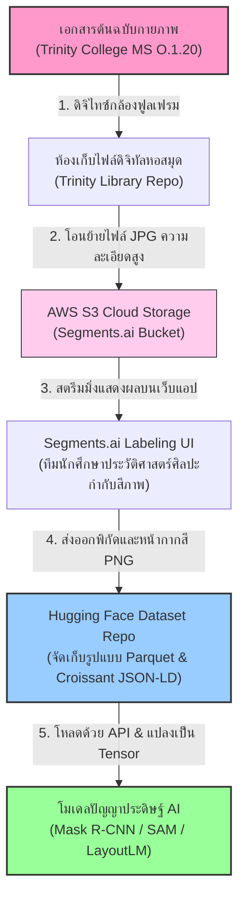
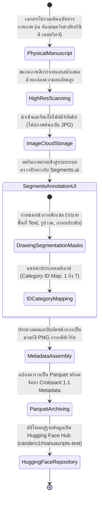
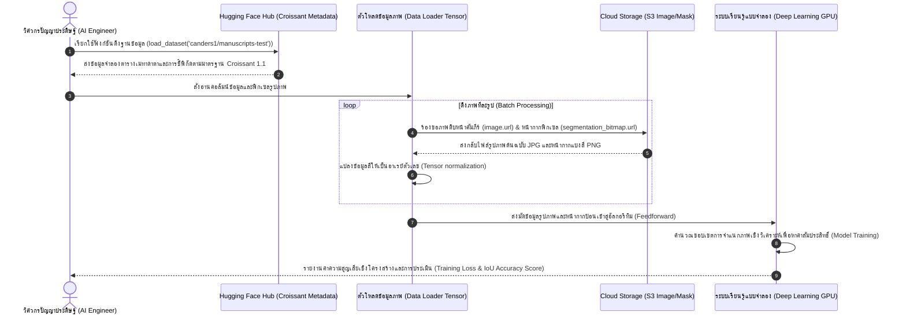

# รายงานการวิเคราะห์ชุดข้อมูลมรดกเอกสารโบราณ ฉบับที่ 001 (ฉบับสมบูรณ์)
> **รหัสชุดข้อมูล:** `canders1/manuscripts-test`  
> **โครงการต้นทาง:** โครงการวิจัยเชิงดิจิทัล "Manuscript Connections"  
> **วิเคราะห์โดย:** Antigravity AI  
> **วันที่วิเคราะห์:** 31 พฤษภาคม 2026

---

## 1. ข้อมูลสรุปเชิงบริหาร (Executive Summary)

ชุดข้อมูล `canders1/manuscripts-test` เป็นชุดข้อมูลนำร่องประสิทธิภาพสูงบนแพลตฟอร์ม Hugging Face พัฒนาขึ้นโดยคณะผู้วิจัยผู้เชี่ยวชาญด้านวิทยาการคอมพิวเตอร์และประวัติศาสตร์ศิลปะจาก **Wellesley College** และ **Eastern Connecticut State University** ประเทศสหรัฐอเมริกา โดยชุดข้อมูลนี้ถูกออกแบบมาเพื่อทดสอบการฝึกฝนแบบจำลองโครงข่ายประสาทเทียมปัญญาประดิษฐ์ในงานตรวจวิเคราะห์เลย์เอาต์และการแบ่งส่วนภาพหน้าเอกสารโบราณเชิงลึก (Semantic Layout Segmentation & Layout Analysis)

ความสำคัญของชุดข้อมูลนี้อยู่ที่การรวบรวมภาพถ่ายดิจิทัลความละเอียดสูงของ **เอกสารลายมือเขียนโบราณ MS O.1.20 ของวิทยาลัยทรินิตี มหาวิทยาลัยเคมบริดจ์ (Trinity College, Cambridge)** ซึ่งเป็นตำราการแพทย์และศัลยกรรมรูปภาพที่สำคัญที่สุดเล่มหนึ่งของโลกจากศตวรรษที่ 13 โดยมีการกำกับข้อมูล (Annotation) ขอบเขตพื้นที่หน้าอย่างละเอียดผ่านแพลตฟอร์ม **Segments.ai** เพื่อแปลงภาพถ่ายประวัติศาสตร์ให้อยู่ในรูปแบบโครงสร้างหน้ากากพิกเซลสี (Segmentation Bitmaps) และผูกพิกัดข้อมูลเมทาดาตาภายใต้มาตรฐานสากล **Croissant 1.1** ช่วยให้นักวิจัยสามารถประยุกต์ใช้โมเดลคอมพิวเตอร์วิทัศน์ระดับสูงเพื่อตรวจจับข้อความ ภาพวาดโบราณ และอักษรประดิษฐ์ในเอกสารยุคกลางได้อย่างแม่นยำ

---

## 2. ประวัติและข้อมูลพื้นฐานของโปรเจกต์ (Project Background & Metadata)

ชุดข้อมูลได้รับการลงทะเบียนบนระบบ Hugging Face Hub โดยมีข้อมูลเมทาดาตาเชิงลึกดังนี้:

| หัวข้อเมทาดาตา (Metadata Item) | รายละเอียดข้อมูล (Detail Value) |
| :--- | :--- |
| **ชื่อชุดข้อมูล (Dataset Name)** | `canders1/manuscripts-test` |
| **ลิงก์เข้าถึงระบบ (URL)** | [huggingface.co/datasets/canders1/manuscripts-test](https://huggingface.co/datasets/canders1/manuscripts-test) |
| **ผู้สร้าง/คณะผู้วิจัย (Creators)** | **ดร. แคโรลีน แอนเดอร์สัน (Carolyn Jane Anderson)** (อาจารย์ผู้ช่วยภาควิชาวิทยาการคอมพิวเตอร์ Wellesley College) ร่วมกับ ดร. เมฟ เค. ดอยล์ (Maeve K. Doyle) และ ดร. อเล็กซานเดอร์ เบรย์ (Alexander Brey) |
| **หน่วยงาน/สถาบัน (Affiliation)** | Wellesley College, Eastern Connecticut State University, USA |
| **โครงการแม่ข่าย (Main Project)** | **Manuscript Connections** (สืบค้นได้ที่ [manuscriptconnections.org](https://manuscriptconnections.org)) |
| **ขนาดชุดข้อมูล (Dataset Size)** | ขนาดเล็ก (< 1K เรคคอร์ด) จัดทำเฉพาะกลุ่มข้อมูลนำร่องทดสอบประสิทธิภาพ |
| **สัญญาอนุญาต (License)** | Open Access สำหรับงานวิจัยเชิงวิชาการ (ภายใต้ข้อตกลงการเข้าถึงระบบดิจิทัลของ Trinity College Library) |
| **มาตรฐานข้อมูล (Data Standard)** | **Croissant 1.1** (มาตรฐานคำอธิบายโครงสร้างข้อมูลสำหรับ Machine Learning ของ MLCommons) |

---

## 3. แผนผังระบบข้อมูลและโครงสร้างพื้นฐาน (Data Pipeline & Infrastructure)

สถาปัตยกรรมเทคโนโลยีที่ใช้ในการสกัด รวบรวม และประมวลผลข้อมูลจากคัมภีร์ใบลานยุคกลางเล่มจริงจนถึงการนำไปป้อนเข้าสู่โมเดลปัญญาประดิษฐ์บนคลาวด์ มีความเชื่อมโยงกันอย่างเป็นระบบตามแผนภูมิโครงสร้างพื้นฐานต่อไปนี้:



---

## 4. ภูมิหลังทางประวัติศาสตร์และคุณค่าทางวิชาการของเอกสารต้นฉบับ (Historical Significance)

ข้อมูลภาพทั้งหมดที่ใช้ในชุดทดสอบได้รับการคัดเลือกมาจากหนึ่งในคัมภีร์ยุคกลางที่โดดเด่นและมีสีสันมากที่สุด:
- **ชื่อเอกสาร (Manuscript Name):** **Trinity College Library, Cambridge, MS O.1.20**
- **ประวัติการจาร/การบันทึก (Historical Context):** บันทึกเขียนขึ้นในช่วงปลายศตวรรษที่ 13 (ประมาณ ค.ศ. 1250–1300) จารด้วยลายมือเขียนในทวีปอังกฤษยุคกลางตอนปลาย
- **ลักษณะเนื้อหา (Content Analysis):** เป็นตำรารวมความรู้ทางการแพทย์และเวชศาสตร์โบราณที่เขียนด้วยภาษาแองโกล-นอร์มัน (Anglo-Norman French ซึ่งเป็นภาษาชั้นสูงในราชสำนักอังกฤษยุคนั้น) ไฮไลต์หลักคือคัมภีร์ศัลยกรรมรูปภาพ ***Chirurgia Practica*** (วิชาศัลยกรรมเชิงปฏิบัติ) เขียนโดย Roger of Salerno ศัลยแพทย์อิตาลีชื่อดังแห่งโรงเรียนแพทย์ซาเลร์โน พร้อมมีสูตรยารักษาโรคสตรี โรคทั่วไป และบทกวีคำกลอนสอนวิชารักษาโรค
- **คุณค่าทางศิลปกรรมและเอกสารวิทยา (Artistic & Codicological Value):** คัมภีร์เล่มนี้ได้รับการจัดอันดับให้เป็นมรดกเอกสารที่มีภาพวาดเล่าเรื่องแพทย์โบราณที่ดีที่สุด โดยในเล่มมีรูปวาดลงสีน้ำประดับทองสวยงามเกี่ยวกับขั้นตอนศัลยกรรมการผ่าตัดขากรรไกร การเย็บแผลสด การผ่าท้อง การรักษาอวัยวะต่าง ๆ รวมถึงภาพเครื่องปรุงยาและการจัดยาในร้านขายยา (Apothecary) ยุคกลาง ทำให้นี่คือชุดข้อมูลที่เป็นตัวแทนการวิเคราะห์ทั้งตัวอักษรโบราณและรูปภาพในแง่มุมประวัติศาสตร์ศิลปะที่ประเมินค่าไม่ได้

---

## 5. สเปกทางเทคนิคและสคีมาข้อมูลเชิงลึก (In-depth Technical Dataset Schema)

ชุดข้อมูลถูกเผยแพร่ในรูปแบบ **Parquet** ผ่านโครงสร้างเมทาดาตาของ **Croissant 1.1** เพื่อช่วยให้ผู้ใช้สามารถนำเข้าสู่ระบบเขียนสคริปต์ Python ในฝั่ง Machine Learning ด้วยไลบรารีชั้นนำ เช่น Pandas, Polars หรือ Hugging Face `datasets` ได้ทันทีโดยไม่ต้องเขียนสคริปต์ล้างข้อมูลใหม่

### 5.1 โครงสร้างฟิลด์ข้อมูล (Data Schema Table)

| ชื่อฟิลด์ (Field Name) | รูปแบบข้อมูล (Data Type) | หน้าที่และคำอธิบายข้อมูล (Function & Description) |
| :--- | :--- | :--- |
| `name` | `Text` | รหัสหน้าคัมภีร์ (Folio ID) เช่น `trinity_O_1_20_250r` (250 recto / หน้าขวา) และ `trinity_O_1_20_200v` (200 verso / หน้าซ้าย) |
| `uuid` | `Text` | รหัสชี้เฉพาะรูปภาพบนเซิร์ฟเวอร์กำกับป้าย Segments.ai สำหรับตรวจสอบบันทึกย้อนหลัง |
| `image.url` | `Text` | ลิงก์เก็บภาพสแกนดิบใบหน้าของคัมภีร์ ความละเอียดสูงในรูปแบบไฟล์ JPG |
| `status` | `Text` | สถานะการทำงานของข้อมูลกำกับป้ายกำกับ (เช่น `LABELED`) |
| `label.annotations` | `Array (JSON)` | รายการออบเจกต์ที่วาดพิกัดกล่องไว้ ประกอบด้วยดัชนีวัตถุและรหัสประเภทโครงสร้างวัตถุ (`category_id`) |
| `label.segmentation_bitmap.url` | `Text` | ลิงก์เก็บไฟล์รูปภาพหน้ากากสี PNG (Segmentation Mask) ขนาดกว้างยาวเท่ารูปจริง เพื่อระบายสีแทนพิกเซลในจุดสำคัญ |

### 5.2 ตัวอย่างเรคคอร์ดข้อมูลจำลอง (Sample JSON Record)
```json
{
  "name": "trinity_O_1_20_200r",
  "uuid": "1da81eb3-1dfa-4a22-bb04-78cbbb17b313",
  "image": {
    "url": "https://segmentsai-prod.s3.eu-west-2.amazonaws.com/assets/elizamei/e109bdc3-89da-4b27-bd8c-01f8267ccf92.jpg"
  },
  "status": "LABELED",
  "label": {
    "annotations": [
      { "id": 1, "category_id": 7 },
      { "id": 2, "category_id": 6 }
    ],
    "segmentation_bitmap": {
      "url": "https://segmentsai-prod.s3.eu-west-2.amazonaws.com/assets/elizamei/d4b8a2b4-d6d7-4ec3-bcd4-270beba4f2f3.png"
    }
  }
}
```

---

## 6. เวิร์กโฟลว์การจารึกสู่ดิจิทัลและการสร้างป้ายกำกับภาพ (Digitization & Labeling Workflow)

วงจรชีวิตข้อมูล (Data Lifecycle) ของหน้ากระดาษคัมภีร์จากแผ่นวัสดุหนังแกะเขียนมือในศตวรรษที่ 13 จนกลายมาเป็นชุดข้อมูลดิจิทัลที่ผ่านการทำป้ายกำกับพิกเซลบน Hugging Face ปรากฏขั้นตอนตามแผนผังเวิร์กโฟลว์ต่อไปนี้:



---

## 7. เทคโนโลยีการวิเคราะห์รูปภาพแบบ Semantic Layout Segmentation

ชุดข้อมูลนี้นำเสนอแนวทางการประมวลผลขั้นสูงด้วยเทคนิคการทำ **Semantic Segmentation** (การระบุระดับพิกเซลว่าพื้นที่ส่วนใดทำหน้าที่อะไร) ซึ่งแตกต่างและละเอียดกว่าการทำ Bounding Box (ตีกล่องสี่เหลี่ยม) แบบเดิม ๆ เป็นอย่างมาก

### 7.1 โครงสร้างคลาสของการกำกับเลย์เอาต์เอกสาร (Annotation Categories Map)
จากการกำกับผ่าน Segments.ai ในโครงการวิจัยชุดนี้ มีการกำหนดรหัสหมวดหมู่เลย์เอาต์เอกสาร (`category_id`) ออกเป็น 7 คลาสหลัก:

1. **Category ID: 1** -> **ข้อความหลัก (Text Block):** พื้นที่ข้อความหลักที่เป็นเนื้อหาตำราภาษาแองโกล-นอร์มันโบราณ
2. **Category ID: 2** -> **หัวข้อเรื่อง/คำอธิบายด้วยหมึกสีแดง (Rubrics):** หัวข้อย่อยหรือสคริปต์สั้น ๆ ที่เขียนด้วยหมึกแดง
3. **Category ID: 3** -> **ตัวอักษรเริ่มต้นประดับขนาดใหญ่ (Decorated Initials):** อักษรตัวแรกสุดของย่อหน้าที่เป็นรูปวาดลวดลายประดิษฐ์
4. **Category ID: 4** -> **ภาพประกอบขนาดเล็ก/ภาพจำลอง (Miniatures):** รูปวาดประกอบหลัก เช่น ภาพวาดการทำงานของศัลยแพทย์
5. **Category ID: 5** -> **ภาพเขียนแนวประดับขอบหน้ากระดาษ (Marginalia / Drolleries):** ภาพวาดขำขันหรือภาพจินตนาการขอบหนังสือ
6. **Category ID: 6** -> **ลวดลายขอบประดับประดา (Page Borders):** โครงกรอบประดับประดาเพื่อความสวยงามรอบนอกหน้าหนังสือ
7. **Category ID: 7** -> **ไดอะแกรม/หุ่นจำลองเฉพาะ (Diagrams):** แผนภาพเชิงศัลยกรรมหรือจุดพิกัดระบบอวัยวะในร่างกายมนุษย์

### 7.2 ข้อได้เปรียบทางวิศวกรรมข้อมูลระดับพิกเซล (Data Engineering Advantages)
ในอดีต ภาพเขียนยุคกลางมักถูกตีเส้นกรอบสี่เหลี่ยมคลุม แต่วิธีนั้นมีปัญหามากเนื่องจากภาพวาดและลวดลายรอบนอกเอกสารยุคกลางมักมีความคดเคี้ยว ยืดยาว มีเถาไม้ หรือรูปการ์ตูนขำขันที่ล้อมรอบแนวตัวอักษร 
การเลือกใช้หน้ากากสี PNG (Segmentation Bitmap) ช่วยให้ระบบ Machine Learning เรียนรู้รูปทรงที่คดเคี้ยวอิสระได้อย่างเป็นธรรมชาติ ส่งผลให้ AI สามารถจำแนกความแตกต่างระหว่างข้อความลายมือเขียนกับรูปภาพที่ซับซ้อนได้อย่างชัดเจนแม้ว่าพื้นที่ทั้งสองจะอยู่ซ้อนทับหรือพันเกี่ยวกันอยู่ก็ตาม

---

## 8. แผนผังขั้นตอนการประมวลผลเข้าระบบปัญญาประดิษฐ์ (ML Ingestion Sequence)

ขั้นตอนการดึงไฟล์ชุดข้อมูลจาก Hugging Face ไปประมวลผลเข้าระบบประมวลผลและการใช้ประโยชน์เพื่อฝึกแบบจำลองโครงข่ายประสาทเทียม แสดงลำดับเหตุการณ์การเรียกใช้งานดังแผนภูมิ Sequence ต่อไปนี้:



---

## 9. บทวิเคราะห์เชิงประจักษ์: จุดเด่น ข้อจำกัด และคำแนะนำ (Strategic Dataset Evaluation)

### จุดเด่นเชิงวิศวกรรมระบบ (Pros)
- **สตรีมข้อมูลภาพได้อย่างเต็มกำลัง:** รูปภาพและหน้ากากแบ่งขอบเขตจัดเก็บอยู่บน AWS S3 ของระบบ Segments.ai ที่มีความเสถียรและทนทานสูง ส่งสตรีมเข้าสู่ตัวเครื่องคอมพิวเตอร์สำหรับการคำนวณและประมวลผลได้อย่างลื่นไหล
- **ความแม่นยำสูงระดับพิกเซล:** ชุดแบ่งพิกเซลที่เป็นโครงสร้างรูป PNG หน้ากากสีช่วยให้นำไปประยุกต์ใช้เพื่อนำหน้ากากนี้ตัดแยกเฉพาะจุด (เช่น ลอกลายรูปวาดศัลยกรรมยุคกลางโบราณออกมาแบบไร้พื้นหลัง) ไปสืบค้นภาพถ่ายแนวเดียวกันได้อย่างยอดเยี่ยม
- **รองรับมาตรฐานสากลระดับสูงสุด:** คลาสเมทาดาตา Croissant 1.1 ช่วยให้นักวิชาการอื่น ๆ สามารถเขียนสคริปต์ดึงไปทดลองทำซ้ำได้ง่าย ส่งผลเชิงบวกในการนำไปประยุกต์ใช้กับวิทยาการเอกสารโบราณระดับโลก

### ข้อจำกัดที่พึงระวัง (Cons & Constraints)
- **ข้อมูลเป็นชุดทดสอบ (Test Only Dataset):** ชุดข้อมูลถูกจำกัดไว้เฉพาะกลุ่มทดสอบ ไม่มีข้อมูลกลุ่มสำหรับสอน (Train Split) ขนาดใหญ่ ทำให้ต้องดัดแปลงนำแบบจำลอง Layout Analysis แบบทั่วไปมาประยุกต์ใช้ในลักษณะ Zero-shot แล้วทดสอบผลงานด้วยชุดข้อมูลนี้
- **เจาะลึกเฉพาะเอกสารแพทย์แองโกล-นอร์มันยุคกอทิก:** ข้อกำหนดนี้ส่งผลให้หน้าโครงสร้างเลย์เอาต์ ลายมือเขียนตัวอักษร และสไตล์ของภาพวาดประกอบจะจำเพาะเจาะจงมาก ไม่สามารถดึงไปวิเคราะห์เอกสารที่เป็นรูปแบบตาราง พระไตรปิฎก คัมภีร์ใบลาน หรือสมุดไทยชนิดพับได้ในทันทีโดยไม่ปรับจูนข้อมูลใหม่
- **พึ่งพาลิงก์ปลายทางภายนอกสูง:** รูปภาพจริงและหน้ากากทั้งหมดไม่ได้โหลดเก็บไว้แบบดั้งเดิมในเซิร์ฟเวอร์หลักของ Hugging Face แต่เป็นการดึงลิงก์ (URL Pointing) ไปยัง AWS S3 ของบริษัท Segments.ai หากบริษัทดังกล่าวเปลี่ยนโครงสร้างคลาวด์หรือปิดตัวลง ลิงก์ภาพทั้งหมดในชุดข้อมูลนี้อาจเสียหายได้
