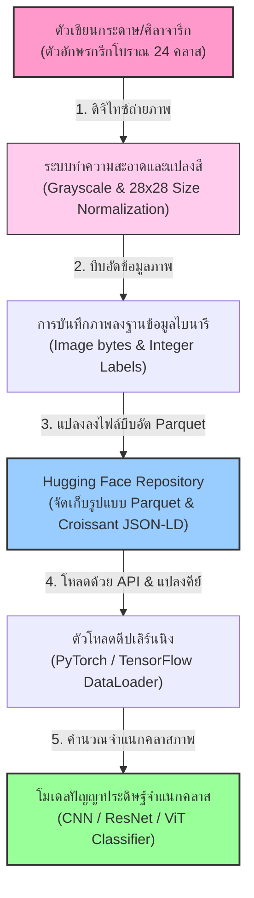
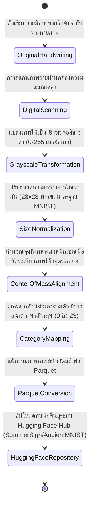
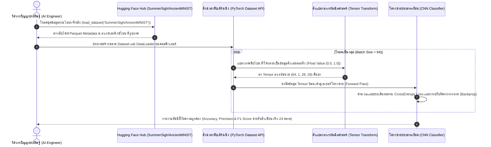

# รายงานการวิเคราะห์ชุดข้อมูลมรดกเอกสารโบราณ ฉบับที่ 002
> **รหัสชุดข้อมูล:** `SummerSigh/AncientMNIST`  
> **โครงการต้นทาง:** โครงการพัฒนาคลังชุดข้อมูล MNIST ภาษาโบราณ (Ancient Handwritings MNIST-like Benchmark)  
> **วิเคราะห์โดย:** Antigravity AI  
> **วันที่วิเคราะห์:** 31 พฤษภาคม 2026

---

## 1. ข้อมูลสรุปเชิงบริหาร (Executive Summary)

ชุดข้อมูล `SummerSigh/AncientMNIST` เป็นชุดข้อมูลรูปภาพลายมือเขียนตัวอักษรภาษากรีกโบราณ (Ancient Greek Characters) ความละเอียดสูงที่ได้รับการแปลงโครงสร้างตามมาตรฐานชุดข้อมูลเชิงอ้างอิงชื่อดังระดับโลกอย่าง **MNIST Benchmark** เพื่อวัตถุประสงค์ในการทดสอบและฝึกฝนอัลกอริทึมปัญญาประดิษฐ์ประเภทการเรียนรู้เชิงลึก (Deep Learning) ในงานจัดหมวดหมู่รูปภาพ (Image Classification) และการตรวจจับสัญลักษณ์ตัวอักษรโบราณด้วยคอมพิวเตอร์ (Optical Character Recognition - OCR)

ชุดข้อมูลนี้รวบรวมตัวเขียนภาษากรีกคลาสสิกทั้งหมด 24 ตัวอักษรดั้งเดิม (ตั้งแต่ Alpha ถึง Zeta) โดยครอบคลุมขนาดตัวอย่างที่ใหญ่มาก (ระหว่าง 100K ถึง 1M เรคคอร์ด) จัดทำขึ้นโดยใช้โครงสร้างภาพแบบเกรย์สเกลที่ผ่านการประมวลผลขนาดและจุดศูนย์กลาง (Grayscale Size-Normalized) ทำให้ง่ายต่อการนำเข้าสู่โมเดลจำแนกโครงข่ายประสาทเทียมแบบคอนโวลูชัน (Convolutional Neural Networks - CNN) ตัวฐานข้อมูลสอดคล้องกับมาตรฐานการจัดเก็บข้อมูลเมทาดาตาเชิงปริมาณ **Croissant 1.0** พร้อมสำหรับรองรับระบบการโหลดข้อมูลที่รวดเร็วสูงสำหรับการวิเคราะห์ภาษาศาสตร์และอักษรโบราณเชิงคำนวณ

---

## 2. ประวัติและข้อมูลพื้นฐานของโปรเจกต์ (Project Background & Metadata)

ชุดข้อมูลถูกอัปโหลดขึ้นสู่ระบบ Hugging Face Hub โดยมีข้อมูลเมทาดาตาที่สำคัญดังตารางต่อไปนี้:

| หัวข้อเมทาดาตา (Metadata Item) | รายละเอียดข้อมูล (Detail Value) |
| :--- | :--- |
| **ชื่อชุดข้อมูล (Dataset Name)** | `SummerSigh/AncientMNIST` |
| **ลิงก์เข้าถึงระบบ (URL)** | [huggingface.co/datasets/SummerSigh/AncientMNIST](https://huggingface.co/datasets/SummerSigh/AncientMNIST) |
| **ผู้สร้าง/คณะผู้วิจัย (Creators)** | **Summer** (`https://huggingface.co/SummerSigh`) |
| **หน่วยงาน/สถาบัน (Affiliation)** | โครงการวิจัยอักษรโบราณอิสระ และชุมชนผู้พัฒนาชุดข้อมูล Hugging Face |
| **โครงการแม่ข่าย (Main Project)** | N/A (ชุดข้อมูลอ้างอิงเพื่อเป็นทางเลือกทดแทน MNIST แบบมาตรฐาน) |
| **ขนาดชุดข้อมูล (Dataset Size)** | ขนาดใหญ่ (จัดอยู่ในระดับตัวอย่างจำนวน 100,000 ถึง 1,000,000 เรคคอร์ด) |
| **สัญญาอนุญาต (License)** | Open Access (เหมาะสำหรับการนำไปวิจัยและศึกษาเรียนรู้เชิงวิชาการ) |
| **มาตรฐานข้อมูล (Data Standard)** | **Croissant 1.0** (มาตรฐานเมทาดาตาความเข้ากันได้กับเฟรมเวิร์ก ML) |

---

## 3. แผนผังระบบข้อมูลและโครงสร้างพื้นฐาน (Data Pipeline & Infrastructure)

ระบบการส่งข้อมูลจากลายมือตัวเขียนบนศิลาจารึกหรือคัมภีร์ใบลานยุคโบราณ สู่กระบวนการวิเคราะห์แปลงรูปให้กลายเป็น Tensor อาร์เรย์ของโมเดลปัญญาประดิษฐ์ มีระบบการไหลของเทคโนโลยีดังนี้:



---

## 4. ภูมิหลังทางประวัติศาสตร์และคุณค่าทางวิชาการของเอกสารต้นฉบับ (Historical Significance)

- **ชื่ออักษร (Manuscript Alphabet Name):** **ตัวอักษรกรีกคลาสสิกโบราณ (Classical Greek Alphabet)**
- **ประวัติการจาร/การบันทึก (Historical Context):** ตัวเขียนภาษากรีกโบราณเริ่มปรากฏการใช้งานตั้งแต่ศตวรรษที่ 9 ก่อนคริสตกาล พัฒนามาจากอักษรฟินิเชียน และกลายมาเป็นรากฐานของอักษรละตินและอักษรซีริลลิกในยุโรปปัจจุบัน ลายมือในฐานข้อมูลสะสมลักษณะสไตล์อักษรดั้งเดิม รวมถึงตัวเขียนโบราณแบบอักษรไม่แยกตัวพิมพ์ใหญ่-พิมพ์เล็ก (Uncial / Cursive scripts)
- **ลักษณะเนื้อหา (Content Analysis):** ตัวอักษรทั้ง 24 ตัวในชุดข้อมูลใช้แทนระบบเสียงและคณิตศาสตร์โบราณ โดยในชุดข้อมูลนี้เน้นลักษณะการลากเส้นตัวอักษรทางปรัชญาและคณิตศาสตร์ เช่น:
  - `Alpha` ($\alpha$), `Beta` ($\beta$) - จุดกำเนิดสัญลักษณ์วรรณกรรม
  - `Omega` ($\omega$), `Omicron` ($o$) - ตัวสะกดและระบบไวยากรณ์เสียงยาว/สั้น
  - `LunateSigma` ($\subset$) - รูปแบบอักษรซิกมาโบราณที่พบในจารึกยุคเฮลเลนิสติกและคัมภีร์ไบเบิล
- **คุณค่าทางศิลปกรรมและเอกสารวิทยา (Artistic & Codicological Value):** การรวมตัวอย่างลายมือเขียนที่สะท้อนน้ำหนักการเขียนที่หลากหลาย น้ำหมึก และรูปแบบการลากโค้งของปราชญ์โบราณ ช่วยให้นักวิชาการบรรณารักษศาสตร์ศึกษาการผันแปรของรูปทรงตัวอักษรเชิงสถิติได้อย่างลึกซึ้ง (Palaeographic Analysis)

---

## 5. สเปกทางเทคนิคและสคีมาข้อมูลเชิงลึก (In-depth Technical Dataset Schema)

ชุดข้อมูลเก็บข้อมูลภาพถ่ายแบบ **ไบนารี (Image Bytes)** ควบคู่กับตัวแปรจำนวนเต็ม (Integer) แทนรหัสป้ายจำแนกตัวอักษร

### 5.1 โครงสร้างฟิลด์ข้อมูล (Data Schema Table)

| ชื่อฟิลด์ (Field Name) | รูปแบบข้อมูล (Data Type) | หน้าที่และคำอธิบายข้อมูล (Function & Description) |
| :--- | :--- | :--- |
| `split` | `Text` | ตัวแบ่งกลุ่มข้อมูลการทำงานหลัก (เช่น `train`) |
| `image` | `ImageObject` | ออบเจกต์รูปภาพไบนารีลายมือเขียนภาษากรีกดิบ (แปลงเป็นเมทริกซ์ 2 มิติสำหรับ AI) |
| `label` | `Integer (ClassLabel)` | ดัชนีตัวเลขจำนวนเต็ม (0 ถึง 23) แทนชื่อตัวอักษรกรีกโบราณ 24 ตัว |

### 5.2 ตัวอย่างเรคคอร์ดข้อมูลจริงในโครงสร้าง Croissant (Sample JSON Record)
```json
{
  "split": "train",
  "image": {
    "bytes": "/9j/4AAQSkZJRgABAQEASABIAAD/2wBDAP//////////////////////////////////////////////////////////////////////////////////////wgALCAAYABgBAREA/8QAFBABAAAAAAAAAAAAAAAAAAAAAP/aAAgBAQABPxA="
  },
  "label": 0
}
```

---

## 6. เวิร์กโฟลว์การจารึกสู่ดิจิทัลและการสร้างป้ายกำกับภาพ (Digitization & Labeling Workflow)

วงจรการเดินทางของข้อมูลภาพลายอักษรกรีกโบราณ จากการคัดลายมือเขียน สู่การแปลงขนาดและส่งออกฐานข้อมูล เผยกระบวนการดังแผนผังสถานะต่อไปนี้:



---

## 7. เทคโนโลยีการวิเคราะห์รูปภาพแบบ Image Classification

ชุดข้อมูลนี้เลือกใช้การประมวลผลความละเอียดภาพเพื่อจำแนกคลาส (Image Classification) ในมาตรฐาน MNIST-like Format ซึ่งมีข้อได้เปรียบทางวิศวกรรมข้อมูลดังนี้:

### 7.1 โครงสร้างคลาสอักษรกรีกโบราณ 24 คลาส (Annotation Categories Map)
หมวดหมู่ในช่อง `label` ถูกเรียงตามลำดับพยัญชนะอักษรอังกฤษของชื่อสะกดภาษากรีก (Alphabetical order of English transliterations):

*   **Label 0:** `Alpha` ($\alpha$)
*   **Label 1:** `Beta` ($\beta$)
*   **Label 2:** `Chi` ($\chi$)
*   **Label 3:** `Delta` ($\delta$)
*   **Label 4:** `Epsilon` ($\epsilon$)
*   **Label 5:** `Eta` ($\eta$)
*   **Label 6:** `Gamma` ($\gamma$)
*   **Label 7:** `Iota` ($\iota$)
*   **Label 8:** `Kappa` ($\kappa$)
*   **Label 9:** `Lambda` ($\lambda$)
*   **Label 10:** `LunateSigma` ($\subset$ - ซิกมาทรงพระจันทร์ครึ่งเสี้ยวโบราณ)
*   **Label 11:** `Mu` ($\mu$)
*   **Label 12:** `Nu` ($\nu$)
*   **Label 13:** `Omega` ($\omega$)
*   **Label 14:** `Omicron` ($o$)
*   **Label 15:** `Phi` ($\phi$)
*   **Label 16:** `Pi` ($\pi$)
*   **Label 17:** `Psi` ($\psi$)
*   **Label 18:** `Rho` ($\rho$)
*   **Label 19:** `Tau` ($\tau$)
*   **Label 20:** `Theta` ($\theta$)
*   **Label 21:** `Upsilon` ($\upsilon$)
*   **Label 22:** `Xi` ($\xi$)
*   **Label 23:** `Zeta` ($\zeta$)

### 7.2 ข้อดีของข้อมูลประเภท MNIST-like Format
1. **มิติข้อมูลต่ำประหยัดแรม (Low Dimensionality):** รูปภาพถูกแปลงขนาดให้มีมิติต่ำ ทำให้ประหยัดหน่วยความจำคอมพิวเตอร์และเพิ่มความเร็วในการคำนวณบนการ์ดจอได้อย่างมหาศาล
2. **ขจัดสัญญาณรบกวน (Noise Reduction):** พื้นหลังที่ไม่เกี่ยวข้อง เงาสะท้อนกระดาษ และฝุ่นบนแผ่นภาพโบราณ ถูกลบออกไปทั้งหมดผ่านการลบค่าเกณฑ์พิกเซล (Thresholding) เหลือไว้เพียงน้ำหนักลายเส้นการลากปากกาจริงเพื่อการเทรน AI
3. **ขอบเขตการตัดสินใจชัดเจน (Sharp Decision Boundaries):** ช่วยให้อัลกอริทึมประเภท Convolutional Filters เรียนรู้ความโค้งงอเชิงโครงสร้างเส้นตัดได้อย่างสมบูรณ์

---

## 8. แผนผังขั้นตอนการประมวลผลเข้าระบบปัญญาประดิษฐ์ (ML Ingestion Sequence)

สเต็ปขั้นตอนทำงานการสตรีมชุดข้อมูล AncientMNIST เข้าไปฝึกสอนระบบประสาทเทียมด้วยไลบรารี PyTorch ปรากฏลำดับเหตุการณ์การเรียกใช้ดังแผนภูมิต่อไปนี้:



---

## 9. บทวิเคราะห์เชิงประจักษ์: จุดเด่น ข้อจำกัด และคำแนะนำ (Strategic Dataset Evaluation)

### จุดเด่นเชิงวิศวกรรมระบบ (Pros)
- **สเกลข้อมูลใหญ่มากและมีความพร้อม:** จำนวนแถวสูงถึงระดับ 100K-1M เรคคอร์ด ซึ่งใหญ่กว่า MNIST มาตรฐานทั่วไปถึงกว่า 10 เท่า ช่วยให้การเรียนรู้ในโมเดลประเภท Deep ResNet ทำได้อย่างมั่นคง ไม่เกิดการเรียนรู้จดจำรูปภาพแบบ Overfitting
- **รูปแบบเข้ากันได้ง่ายสูง:** การจัดทำโครงสร้างแบบ MNIST-like ทำให้นักศึกษาหรือโปรแกรมเมอร์สายโมเดล AI สามารถแก้ไขสเปกโค้ดโมเดลเดิมเพียงแค่เปลี่ยนสเปกเลเยอร์ปลายทางจาก 10 คลาส (เลข 0-9) ให้เป็น 24 คลาส (อักษรกรีก) และเทรนต่อได้ทันที
- **ไร้สัญญาณรบกวนขวางกั้น:** ลบภาพลายพื้นหลังกระดาษเก่าออกไปทั้งหมด เหลือเพียงน้ำหนักปากกา ช่วยให้แบบจำลองฝึกโฟกัสโครงสร้างเส้นอักษรอย่างเต็มประสิทธิภาพ

### ข้อจำกัดที่พึงระวัง (Cons & Constraints)
- **สูญเสียมิติเชิงลึกของทัศนศิลป์:** การแปลงพิกเซลให้เหลือขนาดเล็ก (28x28 พิกเซล) และกำจัดโทนสีพื้นหลัง ทำให้แบบจำลองมองไม่เห็นเอกลักษณ์เนื้อผิวของวัสดุโบราณ ทิศทางการไหลของน้ำหมึกดั้งเดิม หรือร่องรอยการขูดขีดจาริก
- **มีเฉพาะชุดข้อมูลกลุ่มการสอนหลัก (Train Split):** จากไฟล์ Croissant JSON-LD พบว่ามีการลงทะเบียนเฉพาะแถวข้อมูลกลุ่มการสอนอย่างเดียว (ไม่มีการแบ่งกลุ่มประเมินผลอย่างเป็นทางการแยก Parquet) ทำให้นักวิจัยจำเป็นต้องใช้วิธี split ข้อมูล 80/20 ในฝั่งโค้ดโปรแกรมเพื่อทดสอบประสิทธิภาพ
- **ลักษณะชื่อตัวอักษรเรียงตามพจนานุกรมอักษรอังกฤษ:** การกำหนด Category Labels ถูกผูกตามความเรียงตัวอักษรอังกฤษ (A ถึง Z) ของชื่อทับศัพท์ภาษากรีก ซึ่งอาจสร้างความสับสนแก่ผู้เชี่ยวชาญด้านนิรุกติศาสตร์โบราณที่คุ้นชินกับการเรียงลำดับดั้งเดิมตามประวัติศาสตร์กรีกแท้ ๆ (เช่น Alpha -> Beta -> Gamma -> Delta -> Epsilon -> Zeta...)
