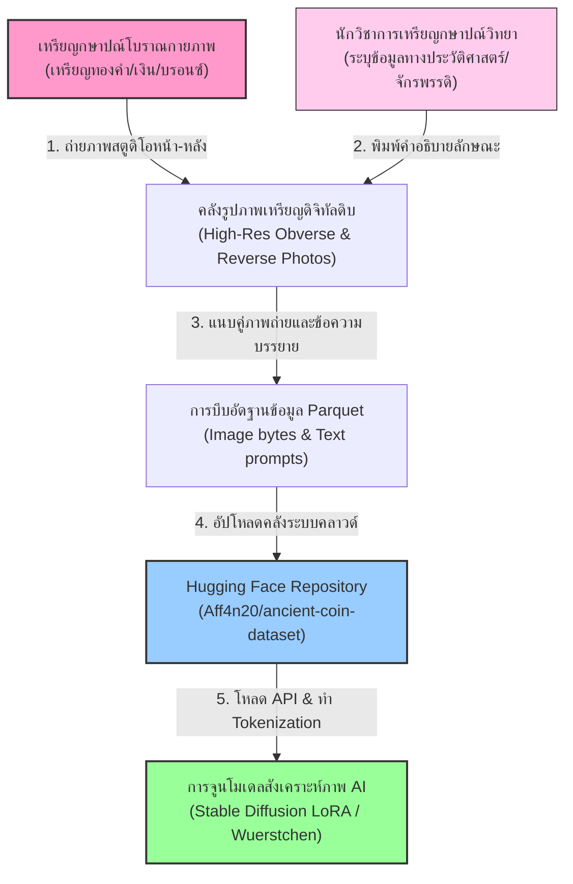
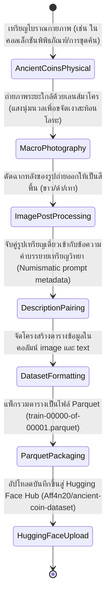
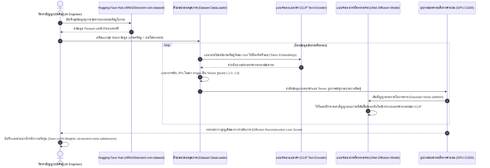

# รายงานการวิเคราะห์ชุดข้อมูลมรดกเอกสารโบราณ ฉบับที่ 003
> **รหัสชุดข้อมูล:** `Aff4n20/ancient-coin-dataset`  
> **โครงการต้นทาง:** โครงการสังเคราะห์ภาพเหรียญกษาปณ์โบราณ (Generative Ancient Coins Project)  
> **วิเคราะห์โดย:** Antigravity AI  
> **วันที่วิเคราะห์:** 31 พฤษภาคม 2026

---

## 1. ข้อมูลสรุปเชิงบริหาร (Executive Summary)

ชุดข้อมูล `Aff4n20/ancient-coin-dataset` เป็นชุดข้อมูลคู่ภาพถ่ายและข้อความบรรยาย (Image-Text Pairs Dataset) คุณภาพสูงบนแพลตฟอร์ม Hugging Face ที่รวบรวมภาพสแกนเหรียญกษาปณ์โบราณ (Ancient Coins) เช่น เหรียญโรมัน เหรียญกรีก และเหรียญไบแซนไทน์ คู่กับสัญญะข้อความระบุลักษณะทางประวัติศาสตร์และ numismatic (เหรียญกษาปณ์วิทยา) อย่างครบถ้วน

ชุดข้อมูลนำร่องที่มีขนาดปานกลาง (ระหว่าง 1K ถึง 10K เรคคอร์ด) เล่มนี้ถูกสร้างขึ้นและเผยแพร่โดยผู้ใช้นามแฝง **Aff4n20** เพื่อเป้าหมายเฉพาะทางในการฝึกฝนและปรับแต่งแบบจำลองปัญญาประดิษฐ์ประเภทกำเนิดภาพ (Generative AI) เช่น **Stable Diffusion (LoRA)** และสถาปัตยกรรม **Wuerstchen** (โมเดลตัวย่อประสิทธิภาพสูงของเยอรมนี) เพื่อใช้ในภารกิจการสังเคราะห์เหรียญโบราณเสมือนจริง (Synthetic Coin Generation) และการค้นหาเหรียญกษาปณ์ผ่านคำสืบค้นข้อความธรรมชาติ (Text-to-Image / Multimodal Image Retrieval)

---

## 2. ประวัติและข้อมูลพื้นฐานของโปรเจกต์ (Project Background & Metadata)

ชุดข้อมูลถูกลงทะเบียนและเผยแพร่บนระบบ Hugging Face Hub โดยมีข้อมูลเมทาดาตาเชิงเทคนิคที่สำคัญดังตารางต่อไปนี้:

| หัวข้อเมทาดาตา (Metadata Item) | รายละเอียดข้อมูล (Detail Value) |
| :--- | :--- |
| **ชื่อชุดข้อมูล (Dataset Name)** | `Aff4n20/ancient-coin-dataset` |
| **ลิงก์เข้าถึงระบบ (URL)** | [huggingface.co/datasets/Aff4n20/ancient-coin-dataset](https://huggingface.co/datasets/Aff4n20/ancient-coin-dataset) |
| **ผู้สร้าง/คณะผู้วิจัย (Creators)** | **Aff4n20** (`https://huggingface.co/Aff4n20`) |
| **หน่วยงาน/สถาบัน (Affiliation)** | ชุมชนนักพัฒนา Generative AI และ Numismatics เชิงดิจิทัลสากล |
| **โครงการแม่ข่าย (Main Project)** | **wuerstchen-ancient-coins** (โครงการสังเคราะห์และวิจัยภาพเหรียญโบราณประสิทธิภาพสูง) |
| **ขนาดชุดข้อมูล (Dataset Size)** | ขนาดปานกลาง (จัดอยู่ในระดับ 1,000 ถึง 10,000 ภาพถ่ายคู่ข้อความอธิบาย) |
| **สัญญาอนุญาต (License)** | Open Access (สำหรับใช้ทดลองวิจัยเชิงวิชาการและการเรียนรู้เชิงลึก) |
| **มาตรฐานข้อมูล (Data Standard)** | **Croissant 1.0** (มาตรฐานโครงสร้างความเข้ากันได้กับฐานข้อมูล ML) |

---

## 3. แผนผังระบบข้อมูลและโครงสร้างพื้นฐาน (Data Pipeline & Infrastructure)

ระบบความเชื่อมโยงในการแปลงเหรียญโลหะโบราณจริงทางประวัติศาสตร์ สู่ชุดข้อมูลคู่ภาพ-คำอธิบาย และนำไปปรับจูนโมเดลกำเนิดภาพ แสดงขั้นตอนโครงสร้างพื้นฐานตามแผนภูมิต่อไปนี้:



---

## 4. ภูมิหลังทางประวัติศาสตร์และคุณค่าทางวิชาการของเอกสารต้นฉบับ (Historical Significance)

- **ชื่อวัตถุต้นฉบับ (Source Object Name):** **เหรียญกษาปณ์โบราณยุคกรีก โรมัน และไบแซนไทน์ (Ancient Greek, Roman & Byzantine Coins)**
- **ประวัติการประดิษฐ์ (Historical Context):** เหรียญกษาปณ์โบราณจัดทำขึ้นตั้งแต่ศตวรรษที่ 7 ก่อนคริสตกาล ทำหน้าที่เป็นสื่อกลางการแลกเปลี่ยนและโฆษณาชวนเชื่อทางการเมืองของจักรพรรดิยุคต่าง ๆ โดยเหรียญจะจารึกพระพักตร์ของผู้นำ (Obverse - ด้านหัว) และรูปสัญลักษณ์สัญญะเทพเจ้า เทพนิยาย หรือชัยชนะทางการทหาร (Reverse - ด้านก้อย)
- **ลักษณะเนื้อหาและคำอธิบาย (Content & Description Analysis):** คอลัมน์ `text` ในชุดข้อมูลนี้ประกอบด้วยข้อความ numismatic ละเอียดสูงที่เป็นลักษณะเฉพาะ เช่น:
  - ชื่อจักรพรรดิหรือผู้ปกครองที่ออกเหรียญ (เช่น Julius Caesar, Augustus, Hadrian)
  - แหล่งที่ตั้งของโรงกษาปณ์ที่ผลิตเหรียญ (Mint Location เช่น Rome, Alexandria, Constantinople)
  - ชนิดโลหะและหน่วยเงินตรา (เช่น Gold Aureus, Silver Denarius, Bronze Sestertius)
  - ลวดลายและจารึกตัวอักษรขอบเหรียญ (Inscriptions เช่น "IMP NERVA CAES AVG...")
- **คุณค่าทางประวัติศาสตร์ศิลป์และบรรณารักษ์ดิจิทัล (Artistic & Digitized Value):** เหรียญกษาปณ์โบราณเป็นพยานทางวัตถุที่สมบูรณ์ที่สุดของยุคคลาสสิก การสแกนเหรียญควบคู่กับการพิมพ์รายละเอียดอักษรประดิษฐ์และขอบเขตศิลปะกรีก-โรมันบนเหรียญ ช่วยให้นักประวัติศาสตร์สามารถศึกษาการเปลี่ยนแปลงของสไตล์ศิลปะสามมิติผ่านโปรแกรมคำนวณสถิติได้อย่างง่ายดาย

---

## 5. สเปกทางเทคนิคและสคีมาข้อมูลเชิงลึก (In-depth Technical Dataset Schema)

ชุดข้อมูลถูกออกแบบภายใต้สถาปัตยกรรมสำหรับงานประมวลผลภาษารูปภาพแบบมัลติโมดัล (Multimodal Vision-Language Dataset)

### 5.1 โครงสร้างฟิลด์ข้อมูล (Data Schema Table)

| ชื่อฟิลด์ (Field Name) | รูปแบบข้อมูล (Data Type) | หน้าที่และคำอธิบายข้อมูล (Function & Description) |
| :--- | :--- | :--- |
| `split` | `Text` | การแบ่งกลุ่มย่อยชุดข้อมูลสำหรับการเทรน (เช่น `train`) |
| `image` | `ImageObject` | ข้อมูลดิบไบนารีของรูปถ่ายเหรียญโบราณจริง (JPG) ขนาดความละเอียดดั้งเดิม |
| `text` | `Text` | คำอธิบายรายละเอียดเหรียญภาษาอังกฤษ (Prompt Descriptor) สำหรับใช้ในการฝึกสอนโมเดลคำอธิบายภาพ |

### 5.2 ตัวอย่างเรคคอร์ดข้อมูลจริงเชิงโครงสร้าง (Sample JSON Record)
```json
{
  "split": "train",
  "image": {
    "bytes": "/9j/4AAQSkZJRgABAQEASABIAAD/2wBDAP//////////////////////////////////////////////////////////////////////////////////////wgALCAAYABgBAREA/8QAFBABAAAAAAAAAAAAAAAAAAAAAP/aAAgBAQABPxA="
  },
  "text": "A close-up photograph of an ancient Roman silver denarius coin showing the profile bust of Emperor Hadrian looking right on the obverse side, with detailed worn inscriptions, and a reverse side depicting Pax standing left holding an olive branch."
}
```

---

## 6. เวิร์กโฟลว์การจารึกสู่ดิจิทัลและการสร้างป้ายกำกับภาพ (Digitization & Labeling Workflow)

วงจรการเดินทางของข้อมูลวัตถุเหรียญโลหะจริง สู่ไฟล์บีบอัด Parquet ในแพ็กเกจ Hugging Face ปรากฏขั้นตอนต่าง ๆ ตามแผนผังวงจรข้อมูลต่อไปนี้:



---

## 7. เทคโนโลยีการวิเคราะห์รูปภาพเชิงมัลติโมดัล (Multimodal Representation)

ความพิเศษของชุดข้อมูลนี้คือการทำงานร่วมกันระหว่างภาพและคำอธิบาย (Text-to-Image Alignment)

### 7.1 หมวดหมู่โครงสร้างคำบรรยาย (Description Structure Map)
ในช่องคอลัมน์ `text` ไม่ได้ใช้ดัชนีดั่งคลาสทั่วไป แต่ใช้โครงสร้างพยากรณ์คำสำคัญ (Tokenized Prompt Structure) สำหรับอัลกอริทึมเรียนรู้คำสำคัญ (CLIP Text Encoder) ดังนี้:

```
[ประเภทโลหะ/หน่วยเงิน] + [จักรพรรดิ/ผู้ปกครอง] + [ลักษณะหน้าตรงหัวเหรียญ (Obverse)] + [ลวดลายสัญลักษณ์ก้อยเหรียญ (Reverse)] + [ระดับการสึกหรอ (Wear Level)]
```

### 7.2 ข้อดีของการกำกับแบบ Image-Text Pair สำหรับ Generative AI
1. **การฝึกฝนแบบจำลองสัจนิยมสังเคราะห์ (LoRA Training):** ชุดข้อมูล 1K-10K แถวเหมาะสมอย่างมากในการสอน Stable Diffusion ให้เข้าใจความหมายคำเฉพาะ เช่นคำว่า "Roman denarius" หรือ "Byzantine solidus" เพื่อสังเคราะห์ภาพเหรียญกษาปณ์ปลอมที่เสมือนจริง
2. **ระบบค้นคืนเชิงทัศนศิลป์ (Semantic Image Retrieval):** นำไปพัฒนาโมเดลจำแนกเพื่อให้ผู้ใช้พิมพ์ข้อความบรรยาย เช่น "gold coin with emperor facing left" แล้ว AI สามารถดึงรูปเหรียญจริงจากตู้จัดแสดงในคลังออกมาโชว์ได้อย่างถูกต้องแม่นยำ

---

## 8. แผนผังขั้นตอนการประมวลผลเข้าระบบปัญญาประดิษฐ์ (ML Ingestion Sequence)

ขั้นตอนกระบวนการทำ Fine-tuning โมเดลปัญญาประดิษฐ์กำเนิดภาพ Stable Diffusion LoRA ด้วยชุดข้อมูลคลังภาพเหรียญโบราณ แสดงลำดับเหตุการณ์การทำงานดังแผนภูมิต่อไปนี้:



---

## 9. บทวิเคราะห์เชิงประจักษ์: จุดเด่น ข้อจำกัด และคำแนะนำ (Strategic Dataset Evaluation)

### จุดเด่นเชิงวิศวกรรมระบบ (Pros)
- **สเกลกำลังดีสำหรับการปรับจูนเฉพาะทาง:** ปริมาณข้อมูลระดับ 1K-10K แถวเหมาะเจาะอย่างมากสำหรับงบการวิจัยจำกัดและการเทรน LoRA เพื่อสอนจักรกลให้จดจำวัตถุเฉพาะด้านได้อย่างมีประสิทธิภาพโดยใช้ทรัพยากรคำนวณต่ำ
- **ฟอร์แมตข้ามแบบประมวลผลสมบูรณ์:** การแนบคู่ข้อมูลข้อความธรรมชาติ (Natural Language Prompts) และภาพถ่ายโดยตรง ช่วยลดอุปสรรคของการตีพิกัด Bounding Box ทำให้ใช้งานกับแบบจำลองขนาดใหญ่ (Multimodal LLMs / Diffusion Models) ยุคปัจจุบันได้ทันที
- **มีโครงสร้างแบบ Parquet สมบูรณ์:** โหลดข้อมูลได้อย่างรวดเร็วและใช้หน่วยความจำเครื่องต่ำเมื่อใช้ร่วมกับไลบรารี Polars หรือ Hugging Face API

### ข้อจำกัดที่พึงระวัง (Cons & Constraints)
- **ลักษณะคำบรรยายมีความหลากหลายตามลายมือผู้กำกับ:** ประโยคบรรยายในคอลัมน์ `text` อาจมีการใช้ศัพท์ทางวิชาการ numismatics สลับกับภาษาสามัญทั่วไป หากผู้ใช้ไม่มีระบบคัดกรองคำศัพท์เชิงบรรณารักษ์ (Lexicon Standard) อาจนำไปสู่การจดจำความหมายที่คลาดเคลื่อนเชิงสถิติในกลุ่มคำสืบค้นย่อย
- **พึ่งพาภาพถ่ายด้านเดียวหรือรวมภาพในเฟรมเดียว:** เหรียญกษาปณ์โบราณมี 2 ด้านเสมอ (หัว/ก้อย) หากการถ่ายรูปใช้เฟรมเดียวรวมสองด้าน หรือแสดงเฉพาะด้านเดียวอย่างไม่คงที่ โมเดลอาจจะสับสนเรื่องความสอดคล้องเชิงโครงสร้าง (Structural Consistency) ในงานจำแนกมุมมองภาพ
- **การสึกหรอของเหรียญสร้างความลำบาก:** เหรียญโบราณบางชิ้นมีความชำรุดสูง ลายพระพักตร์จักรพรรดิเลือนราง รูปภาพในตู้จึงมีความเหลื่อมล้ำทางกายภาพสูง (High Intra-class Variance) อัลกอริทึมวิเคราะห์ภาพทั่วไปจะใช้เรียนรู้จำคลาสได้ยาก หากต้องการสร้างโมเดลจัดคลาสที่แม่นยำ 100% อาจต้องอาศัยแบบจำลองตรวจจับขอบเฉพาะส่วนช่วย
