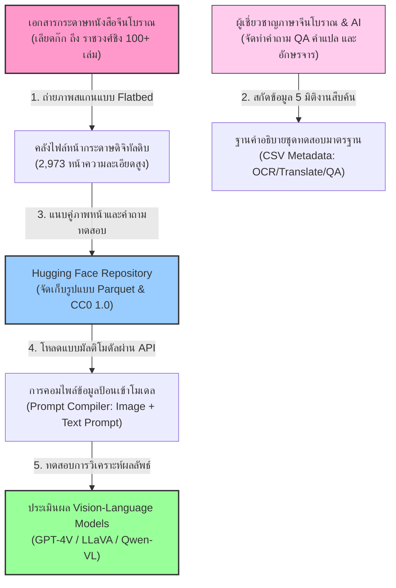
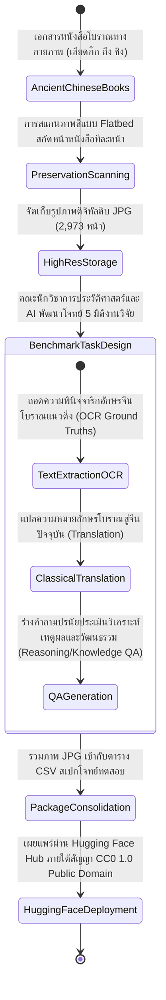
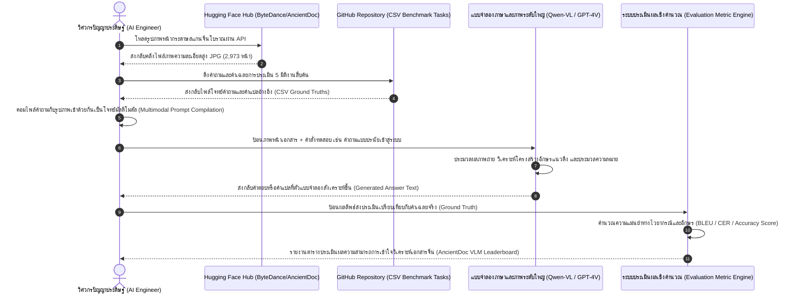

# รายงานการวิเคราะห์ชุดข้อมูลมรดกเอกสารโบราณ ฉบับที่ 004
> **รหัสชุดข้อมูล:** `ByteDance/AncientDoc`  
> **โครงการต้นทาง:** โครงการประเมินความสามารถแบบจำลองโมเดลภาษาภาพเอกสารจีนโบราณ (Chinese Ancient Document Understanding Benchmark)  
> **วิเคราะห์โดย:** Antigravity AI  
> **วันที่วิเคราะห์:** 31 พฤษภาคม 2026

---

## 1. ข้อมูลสรุปเชิงบริหาร (Executive Summary)

ชุดข้อมูล `ByteDance/AncientDoc` เป็นชุดข้อมูลเชิงเปรียบเทียบมาตรฐานระดับโลก (Benchmark Dataset) ฉบับสมบูรณ์ชุดแรกที่ออกแบบมาเพื่อประเมินความสามารถของแบบจำลองโมเดลภาษาผสมผสานภาพ (Vision-Language Models - VLMs) ในงานทำความเข้าใจเอกสารจีนโบราณระดับสูง พัฒนาและเผยแพร่โดยทีมวิจัยชั้นนำจาก **ByteDance AI Lab** (ผู้พัฒนาเบื้องหลังนวัตกรรมระดับโลกอย่าง TikTok และ Douyin)

ชุดข้อมูลนี้ทำหน้าที่รวบรวมหน้าสแกนเอกสารจริงจำนวน 2,973 หน้าจากหนังสือโบราณทรงคุณค่ามากกว่า 100 เล่ม ครอบคลุมยุคสมัยทางประวัติศาสตร์จีนอันยาวนานกว่า 2,000 ปี (ตั้งแต่ยุคเลียดก๊ก/รณรัฐ ถึงราชวงศ์ชิง) โดยมีจุดมุ่งหมายเพื่อเป็นมาตรฐานสากลในการวัดผลความแม่นยำของโมเดล AI ขนาดใหญ่ (Multimodal Large Models) ใน 5 มิติงานวิจัยระดับสูง ตั้งแต่การอ่านตัวเขียนแนวตั้งโบราณ (OCR), การแปลภาษาเขียนโบราณ (Wenyanwen) เป็นภาษาจีนยุคปัจจุบัน (Baihuawen), ไปจนถึงการตอบคำถามเชิงเหตุผล วัฒนธรรม และวาทศิลป์เชิงลึก

---

## 2. ประวัติและข้อมูลพื้นฐานของโปรเจกต์ (Project Background & Metadata)

ชุดข้อมูลได้รับการจดทะเบียนระดับสากลบนระบบ Hugging Face Hub โดยมีข้อมูลเชิงสถิติดังนี้:

| หัวข้อเมทาดาตา (Metadata Item) | รายละเอียดข้อมูล (Detail Value) |
| :--- | :--- |
| **ชื่อชุดข้อมูล (Dataset Name)** | `ByteDance/AncientDoc` |
| **ลิงก์เข้าถึงระบบ (URL)** | [huggingface.co/datasets/ByteDance/AncientDoc](https://huggingface.co/datasets/ByteDance/AncientDoc) |
| **ผู้สร้าง/คณะผู้วิจัย (Creators)** | **ByteDance AI Lab** (เข้าศึกษาโครงการได้ที่ [bytedance.github.io/AncientDoc](https://bytedance.github.io/AncientDoc)) |
| **หน่วยงาน/สถาบัน (Affiliation)** | ByteDance Ltd. |
| **โครงการแม่ข่าย (Main Project)** | **AncientDoc Benchmark** (ชุดทดสอบความเข้าใจเอกสารจีนโบราณเชิงมัลติโมดัล) |
| **ขนาดชุดข้อมูล (Dataset Size)** | ขนาดปานกลาง (2,973 หน้าเอกสารความละเอียดสูง จัดอยู่ในกลุ่มคลัง 1K-10K) |
| **สัญญาอนุญาต (License)** | **CC0 1.0 (Public Domain)** (เปิดให้ใช้งานอย่างเป็นเสรี 100% ปราศจากลิขสิทธิ์ผูกมัด) |
| **มาตรฐานข้อมูล (Data Standard)** | **Croissant 1.1** (ความสอดคล้องกับโครงสร้างข้อมูลเพื่อป้อนเข้าโมเดล AI) |

---

## 3. แผนผังระบบข้อมูลและโครงสร้างพื้นฐาน (Data Pipeline & Infrastructure)

สถาปัตยกรรมทางเทคนิคในการนำส่งเอกสารประวัติศาสตร์กระดาษ สู่กระบวนการวิเคราะห์แปลงสคีมาแบบอเนกประสงค์เพื่อทดสอบประเมินประสิทธิภาพของ Vision-Language Models ปรากฏตามแผนผังโครงสร้างพื้นฐานต่อไปนี้:



---

## 4. ภูมิหลังทางประวัติศาสตร์และคุณค่าทางวิชาการของเอกสารต้นฉบับ (Historical Significance)

- **ชื่อเอกสารโบราณที่นำเข้า (Source Documents):** **คลังหนังสือประวัติศาสตร์ ปรัชญา และวรรณกรรมจีนโบราณ (Ancient Chinese Classics)**
- **ประวัติการบันทึก (Historical Context):** ขอบเขตข้อมูลในชุดทดสอบครอบคลุมยุคสมัยกว่า 2,000 ปี ตั้งแต่ **ยุคเลียดก๊ก/รณรัฐ (Warring States Period - 475-221 BC)** ซึ่งเป็นยุคก่อเกิดตำราปรัชญาสำนักร้อยบุปผา (ขงจื่อ, เหล่าจื่อ) ผ่านราชวงศ์ฮั่น ถัง ซ่ง หยวน หมิง จนถึง **ราชวงศ์ชิง (Qing Dynasty - ค.ศ. 1644–1912)**
- **ลักษณะเนื้อหา (Content Analysis):** หนังสือโบราณกว่า 100 เล่มที่อยู่ในชุดข้อมูลถูกจัดแบ่งตามหมวดหมู่วรรณกรรมจีนโบราณออกเป็น 14 กลุ่มหลัก เช่น:
  - **กลุ่มกวีนิพนธ์และวรรณคดี (Poetry & Collected Works):** บทร้อยกรองโบราณ บทกวีสมัยราชวงศ์ถังและซ่ง
  - **กลุ่มสารานุกรมและการรวบรวม (Encyclopedias & Compilations):** ตำราสารานุกรมดาราศาสตร์ ภูมิศาสตร์ และวิถีชีวิตชาวบ้าน
  - **กลุ่มปรัชญาและประวัติศาสตร์ (Philosophy & History):** บันทึกประวัติศาสตร์พงศาวดาร ตำราปรัชญาสงคราม
- **คุณค่าทางศิลปกรรมและเอกสารวิทยา (Artistic & Codicological Value):** หน้าสแกนเหล่านี้ประกอบด้วยรูปแบบตัวอักษรจีนวิวัฒนาการหลายสไตล์ เช่น อักษรลายเส้นโบราณ (Seal Script), อักษรข้าราชการ (Clerical Script), ตัวเขียนหวัด และตัวพิมพ์บล็อกไม้โบราณ สะท้อนลักษณะการพิมพ์และการวางคอลัมน์แนวดิ่ง (Vertical Columns) พร้อมบันทึกคำวิจารณ์ขอบกระดาษโดยนักปราชญ์รุ่นหลัง (Interlineary Comments / Marginalia)

---

## 5. สเปกทางเทคนิคและสคีมาข้อมูลเชิงลึก (In-depth Technical Dataset Schema)

ชุดข้อมูลถูกแบ่งโครงสร้างการจัดเก็บออกเป็นไฟล์ Parquet สำหรับส่วนภาพถ่าย และคลังสคริปต์คำถามประเมินผลฝั่ง GitHub สำหรับการนำไปประมวลผลควบคู่กัน

### 5.1 โครงสร้างฟิลด์ข้อมูล (Data Schema Table)

| ชื่อฟิลด์ (Field Name) | รูปแบบข้อมูล (Data Type) | หน้าที่และคำอธิบายข้อมูล (Function & Description) |
| :--- | :--- | :--- |
| `split` | `Text` | การแบ่งพาร์ติชันชุดข้อมูลหลัก (ข้อมูลทั้งหมดลงทะเบียนเป็น `train`) |
| `image` | `ImageObject` | ออบเจกต์ภาพถ่ายดิจิทัลดิบ (JPG) ของหน้าหนังสือจีนโบราณเล่มจริง ความละเอียดสูง |

*หมายเหตุ: ชุดไฟล์ข้อมูลคำถามสืบค้นเชิงลึก (CSV Ground Truths) ทั้งคำแปลภาษาปัจจุบัน ป้ายข้อความ OCR และโจทย์การตอบคำถามเชิงเหตุผล ถูกบันทึกและซิงค์เชื่อมโยงอยู่บน [GitHub AncientDoc](https://github.com/bytedance/AncientDoc) เพื่อใช้รันระบบทดสอบกับตัวรูปภาพ*

### 5.2 ตัวอย่างเรคคอร์ดข้อมูลเมทาดาตาทดสอบ (VLM Evaluation Sample)
```json
{
  "page_id": "ancient_doc_page_0482",
  "image_path": "images/page_0482.jpg",
  "task_type": "Vernacular_Translation",
  "instruction": "Please read the scanned ancient Chinese document in the image and translate the vertically written classical Chinese text into modern vernacular Chinese (Baihuawen).",
  "ground_truth": "夫战，勇气也。一鼓作气，再 billing... (คำแปลภาษาจีนยุคปัจจุบันที่ถอดความอย่างถูกต้อง)"
}
```

---

## 6. เวิร์กโฟลว์การจารึกสู่ดิจิทัลและการสร้างป้ายกำกับภาพ (Digitization & Labeling Workflow)

วงจรชีวิตข้อมูล (Data Lifecycle) จากหนังสือโบราณในคลังหอสมุดหลวง สู่การแปลงระบบเป็น Benchmark ประเมิน Vision-Language Models ปรากฏตามแผนผังต่อไปนี้:



---

## 7. เทคโนโลยีการประเมินผลระดับสูง 5 มิติงานวิจัย (VLM Benchmark Tasks)

ความโดดเด่นสูงสุดของชุดข้อมูลนี้คือการออกแบบชุดโจทย์ทดสอบข้ามศาสตร์ (Multimodal Tasks) เพื่อประเมินขีดจำกัดของ AI:

1. **การอ่านอักษรหน้ากระดาษ (Page-level OCR):** AI ต้องสกัดตัวอักษรจีนโบราณออกมาแบบคำต่อคำได้อย่างถูกต้อง แม้ตัวอักษรจะเรียงตัวแนวดิ่งจากขวาไปซ้าย มีฟอนต์บล็อกไม้สึกหรอ หรือมีตัวอักษรเขียนแทรก (Annotations)
2. **การแปลภาษาโบราณ (Vernacular Translation):** ทดสอบทักษะการแปลประโยคภาษาจีนคลาสสิก (Wenyanwen) ซึ่งมีไวยากรณ์ที่กะทัดรัดและซับซ้อน ให้กลายเป็นภาษาพูดในยุคปัจจุบัน (Modern Chinese) 
3. **การตอบคำถามเชิงเหตุผล (Reasoning-based QA):** โจทย์ถามให้ AI วิเคราะห์บริบทของเรื่องราวในหน้ากระดาษเพื่อหาข้อยุติเชิงตรรกะ เหตุการณ์ และผลลัพธ์
4. **การตอบคำถามด้านประวัติศาสตร์ศิลปวัฒนธรรม (Knowledge-based QA):** ทดสอบความเข้าใจของโมเดลต่อภูมิหลังของข้อมูลประวัติศาสตร์ บุคคล สถานที่ และขนบธรรมเนียมที่ผู้เขียนอ้างอิงในหนังสือ
5. **การตอบคำถามมิติวรรณศิลป์และวาทศิลป์ (Linguistic Variant QA):** โจทย์ทดสอบความเข้าใจของ AI ในการระบุประเภทของคำประพันธ์ (เช่น กลอนซื่อ, โคลงซ่ง) กลวิธีทางวรรณศิลป์ และสำนวนเฉพาะตัวของปราชญ์ยุคโบราณ

---

## 8. แผนผังขั้นตอนการประมวลผลเข้าระบบปัญญาประดิษฐ์ (ML Ingestion Sequence)

ขั้นตอนการไหลเวียนข้อมูลในการเรียกใช้ไฟล์ภาพประสานกับโจทย์ทดสอบ เพื่อส่งผ่านชุดประเมินผลโมเดลภาษาภาพขนาดใหญ่ (VLM) ปรากฏตามแผนผังการประมวลผลข้อมูลลำดับเหตุการณ์ต่อไปนี้:



---

## 9. บทวิเคราะห์เชิงประจักษ์: จุดเด่น ข้อจำกัด และคำแนะนำ (Strategic Dataset Evaluation)

### จุดเด่นเชิงวิศวกรรมระบบ (Pros)
- **ครอบคลุมมิติงานสืบค้นกว้างขวางที่สุด:** การขยายขอบเขตจากแค่ระบบตรวจจับคำ (OCR) สู่มิติการแปลภาษาและการคิดวิเคราะห์เชิงเหตุผล ทำให้ชุดข้อมูลนี้เป็นระบบประเมินผลที่ท้าทายและเป็นเอกภาพที่สุดสำหรับการพัฒนาระบบ AI มนุษยศาสตร์ดิจิทัลเชิงคำนวณ
- **ลิขสิทธิ์ระดับเสรีสูงสุด (CC0 1.0 Public Domain):** การปลดล็อกลิขสิทธิ์เป็นสาธารณสมบัติ 100% เอื้อประโยชน์ให้มหาวิทยาลัย สตาร์ทอัป และสถาบันวิจัยทั่วโลกสามารถดาวน์โหลดและดัดแปลงใช้งานได้อย่างเสรีปราศจากข้อผูกมัดทางกฎหมาย
- **ความหลากหลายของยุคสมัย:** การคัดเลือกหนังสือโบราณครอบคลุมประวัติศาสตร์กว่า 2,000 ปี ทำให้ชุดข้อมูลนี้มีความเป็นตัวแทนเชิงสถิติ (Statistical Representation) ที่ดีมากต่อวิวัฒนาการของอักษรประดิษฐ์และภาษาเขียนของจีน

### ข้อจำกัดที่พึงระวัง (Cons & Constraints)
- **ความซับซ้อนในการติดตั้งใช้งานสูง:** เนื่องจากข้อมูลรูปภาพอยู่ในคลัง Hugging Face แต่ชุดโจทย์คำถามและตัวเฉลยละเอียดสำหรับทดสอบ (Benchmarking QA Dataset) จัดเก็บอยู่ใน GitHub ทำให้ผู้ใช้งานต้องเขียนสคริปต์เชื่อมโยงข้อมูลทั้งสองฝั่งเอง
- **ลักษณะเลย์เอาต์แนวตั้งมีความยากเป็นพิเศษ:** แบบจำลอง Vision-Language Models ในตลาดส่วนใหญ่ถูกฝึกฝนด้วยภาษาตะวันตกที่เป็นระบบเลย์เอาต์แนวนอน เมื่อนำมาทดสอบกับโครงสร้างคอลัมน์แนวดิ่งของจีนโบราณในชุดข้อมูลนี้ โมเดลส่วนใหญ่มักประสบปัญหาการอ่านสลับคอลัมน์หรือสับสนทิศทางขวาไปซ้าย
- **สูญเสียบริบทเชิงลึกภายนอกหน้ากระดาษ:** หน้าเอกสารโบราณบางหน้าจำเป็นต้องอ่านบทก่อนหน้าหรือบทถัดไปจึงจะสามารถตอบคำถามเชิงเหตุผลได้อย่างสมบูรณ์ การตัดแบ่งข้อมูลมาประเมินแบบเดี่ยวรายหน้า (Page-by-page evaluation) อาจทำให้โมเดลขนาดใหญ่เกิดข้อจำกัดในการประเมินเชิงบริบทกว้างขวาง
