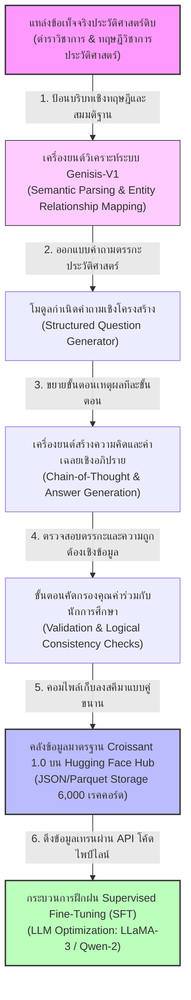
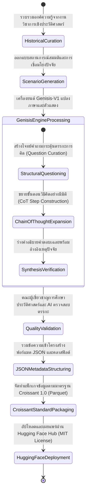
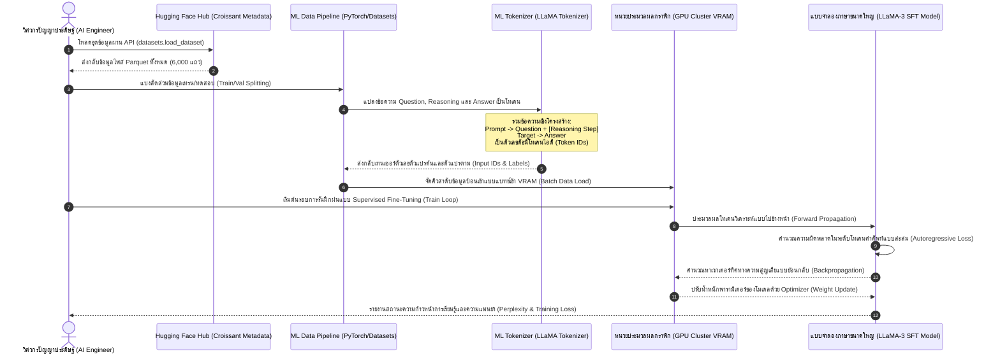

# รายงานการวิเคราะห์ชุดข้อมูลมรดกเอกสารโบราณ ฉบับที่ 005
> **รหัสชุดข้อมูล:** `mattwesney/CoT_Reasoning_The_Ancient_Past`  
> **โครงการต้นทาง:** โครงการพัฒนาเครื่องยนต์ประมวลผลตรรกะประวัติศาสตร์โบราณผ่าน Genisis-V1  
> **วิเคราะห์โดย:** Antigravity AI  
> **วันที่วิเคราะห์:** 31 พฤษภาคม 2026

---

## 1. ข้อมูลสรุปเชิงบริหาร (Executive Summary)

ชุดข้อมูล `mattwesney/CoT_Reasoning_The_Ancient_Past` เป็นชุดข้อมูลเชิงวิพากษ์และประมวลผลเหตุผลระดับสูง (Advanced Reasoning Dataset) ที่สร้างสรรค์และเผยแพร่โดย **Matthew R. Wesney** สถาปนิกวิศวกรรมระบบและนักวิจัยปัญญาประดิษฐ์ชั้นนำ มีวัตถุประสงค์หลักเพื่อปฏิวัติการฝึกฝนโมเดลภาษาขนาดใหญ่ (LLMs) ในศาสตร์การวิเคราะห์และเชื่อมโยงเหตุปัจจัยเชิงลึกเกี่ยวกับประวัติศาสตร์โลกยุคโบราณ (Ancient History) ผ่านระเบียบวิธีวิจัยและรูปแบบข้อมูลที่เรียกว่า **การคิดแบบเป็นขั้นตอน (Chain-of-Thought - CoT)**

ชุดข้อมูลความละเอียดสูงขนาด 6,000 เรคคอร์ดนี้ ทำหน้าที่เป็นสะพานเชื่อมชิ้นสำคัญระหว่าง "วิศวกรรมข้อมูลปัญญาประดิษฐ์" และ "มนุษยศาสตร์ดิจิทัลเชิงคำนวณ" (Computational Digital Humanities) โดยจุดเด่นสูงสุดที่ไม่เหมือนชุดคำถาม-คำตอบทั่วไป คือ การบรรจุรายละเอียดกระบวนการคิดวิเคราะห์เบื้องหลังของโมเดล (`metadata.reasoning`) ซึ่งอธิบายขั้นตอนการหยิบยกหลักฐาน การเปรียบเทียบมิติต่าง ๆ (การเมือง เศรษฐกิจ สังคม การทหาร) และการลดทอนความคลุมเครือเชิงประวัติศาสตร์ เพื่อให้แบบจำลอง AI ไม่เพียงแต่จดจำข้อเท็จจริงแห้ง ๆ แต่สามารถอภิปรายเชิงสาเหตุและผลลัพธ์ (Causal Attribution) ในบริบทอารยธรรมโบราณได้อย่างมีตรรกะขั้นสูง

---

## 2. ประวัติและข้อมูลพื้นฐานของโปรเจกต์ (Project Background & Metadata)

ชุดข้อมูลได้รับการลงทะเบียนบนระบบ Hugging Face Hub สำหรับการใช้งานวิจัยและการปรับแต่งเชิงลึก (Fine-Tuning) โดยมีข้อมูลพื้นฐานดังนี้:

| หัวข้อเมทาดาตา (Metadata Item) | รายละเอียดข้อมูล (Detail Value) |
| :--- | :--- |
| **ชื่อชุดข้อมูล (Dataset Name)** | `mattwesney/CoT_Reasoning_The_Ancient_Past` |
| **ลิงก์เข้าถึงระบบ (URL)** | [huggingface.co/datasets/mattwesney/CoT_Reasoning_The_Ancient_Past](https://huggingface.co/datasets/mattwesney/CoT_Reasoning_The_Ancient_Past) |
| **ผู้สร้าง/คณะผู้วิจัย (Creators)** | **Matthew R. Wesney** (ระบบวิเคราะห์จำลองประวัติศาสตร์) |
| **หน่วยงาน/สถาบัน (Affiliation)** | สถาปนิกและนักวิจัยอิสระด้านสถาปัตยกรรมปัญญาประดิษฐ์ |
| **โครงการแม่ข่าย (Main Project)** | **Genisis-V1 Platform** (เครื่องยนต์ประมวลผลข้อความสังเคราะห์เชิงประวัติศาสตร์) |
| **ขนาดชุดข้อมูล (Dataset Size)** | ขนาดปานกลาง (6,000 เรคคอร์ดอภิปรายเชิงลึก ขนาดไฟล์รวม ~30.5 MB จัดอยู่ในกลุ่ม 1K-10K) |
| **สัญญาอนุญาต (License)** | **MIT License** (เปิดกว้างให้ใช้งาน เชิงพาณิชย์ และการดัดแปลงได้อย่างสมบูรณ์เสรี) |
| **มาตรฐานข้อมูล (Data Standard)** | **Croissant 1.0** (มาตรฐานสากลความสอดคล้องข้อมูลด้าน Machine Learning โดย MLCommons) |

---

## 3. แผนผังระบบข้อมูลและโครงสร้างพื้นฐาน (Data Pipeline & Infrastructure)

สถาปัตยกรรมทางวิศวกรรมข้อมูลในการสกัดวิเคราะห์ความหมาย คัดกรอง คอนไพล์เข้าสู่คลังจัดเก็บของระบบสังเคราะห์ และนำไปใช้ในการฝึกฝนตัวแบบจำลองผ่านกระบวนการ Supervised Fine-Tuning ปรากฏตามแผนผังโครงสร้างพื้นฐานต่อไปนี้:



---

## 4. ภูมิหลังทางประวัติศาสตร์และคุณค่าทางวิชาการของอารยธรรมโบราณ (Historical Significance)

ชุดข้อมูลนี้โฟกัสไปยังช่วงเวลาอันยาวนานของอารยธรรมมนุษย์ยุคแรกเริ่ม โดยเฉพาะ **จักรวรรดิโรมัน (Roman Empire)** และ **อารยธรรมอียิปต์โบราณ (Ancient Egypt)** รวมถึง **ยุคเฮลเลนิสติก (Hellenistic Period)** ซึ่งเป็นช่วงเวลาที่การบันทึกเอกสารมักจะขาดหาย คลุมเครือ หรือเปิดช่องให้เกิดการตีความได้หลากหลายรูปแบบ

- **ลักษณะเนื้อหาและสมมติฐานเชิงประวัติศาสตร์:** ข้อมูลคำถามและคำอธิบายไม่ได้มุ่งเน้นเพียงการถามสัจธรรมแบบท่องจำ แต่เป็นการอภิปรายถึงเหตุปัจจัยเชื่อมโยง เช่น:
  - **การล่มสลายของโรมันตะวันตก (Fall of Western Roman):** วิเคราะห์ในมิติของการกระจายอำนาจทางการทหาร ปัญหาเงินเฟ้อ การเสื่อมถอยของสำนึกความเป็นพลเมือง และแรงกดดันจากกลุ่มชนเผ่าภายนอก (Barbarian Invasions)
  - **โครงสร้างสังคมและพิธีกรรมความเชื่อ:** ศึกษาความสัมพันธ์ระหว่างเกษตรกรรม ลำดับชั้นชนชั้น และระบบการปกครองในอียิปต์โบราณ
- **คุณค่าของระเบียบวิธี Chain-of-Thought ในมนุษยศาสตร์ดิจิทัล:** ชุดข้อมูลนี้แสดงวิธีการสกัด "กระบวนการตีความข้อเท็จจริงทางประวัติศาสตร์" (Historiographical Cognitive Process) ออกมาเป็นโครงสร้างตรรกะดิจิทัล ช่วยให้ AI เรียนรู้วิธีการถ่วงน้ำหนักความน่าจะเป็นของข้อสันนิษฐานต่าง ๆ หลีกเลี่ยงการสรุปความแบบมิติเดียว ซึ่งสะท้อนการทำงานจริงของนักโบราณคดีและนักประวัติศาสตร์ในการปะติดปะต่อหลักฐานที่ขาดวิ่น

---

## 5. สเปกทางเทคนิคและสคีมาข้อมูลเชิงลึก (In-depth Technical Dataset Schema)

ชุดข้อมูลถูกนำเสนอในรูปแบบ JSON รูปแบบข้อความสอดคล้องกับมาตรฐาน Croissant 1.0 ทำให้สคริปต์การโหลดข้อมูลในเฟรมเวิร์กยอดนิยมอย่าง Pandas และ Polars สามารถประมวลผลได้อย่างราบรื่น

### 5.1 โครงสร้างฟิลด์ข้อมูล (Data Schema Table)

| ชื่อฟิลด์ (Field Name) | รูปแบบข้อมูล (Data Type) | หน้าที่และคำอธิบายข้อมูล (Function & Description) |
| :--- | :--- | :--- |
| `id` | `Text` | รหัสเฉพาะสำหรับเรคคอร์ดข้อมูลคำถาม-คำตอบ (Unique UUID Key) |
| `question` | `Text` | คำสั่งหรือประโยคคำถามเชิงตรรกะและเหตุปัจจัยประวัติศาสตร์โบราณที่ป้อนเข้าหา AI |
| `answer` | `Text` | คำอธิบายเฉลยอย่างละเอียดเชิงโครงสร้างแยกแยะประเด็น โดยซ่อนตรรกะการวิเคราะห์อยู่ในตัวอักษร |
| `metadata` | `JSON Object` | วัตถุเก็บเมทาดาตาเชิงเทคนิคและการประมวลผล ประกอบด้วยคีย์ย่อย 3 รายการ: |
| `- metadata.difficulty` | `Integer` | ดัชนีความยากในการตอบและคิดเหตุผลเชิงลึกของโจทย์ (ระดับ 1 ถึง 5) |
| `- metadata.topic` | `Text` | คำสำคัญและหมวดหมู่การจำแนกหัวข้ออารยธรรมและยุคสมัยประวัติศาสตร์ |
| `- metadata.reasoning` | `Text` | **หัวใจสำคัญ (CoT Step):** คำอธิบายขั้นตอนความคิดและการตัดสินใจเลือกโครงสร้างการอธิบายเบื้องหลังของ AI |

### 5.2 ตัวอย่างเรคคอร์ดข้อมูลจริงของอารยธรรมโรมัน (Sample JSON Record)

```json
{
  "id": "qa_20250430_105806_223907",
  "question": "What were the primary contributing factors that led to the decline and eventual fall of the Western Roman Empire?",
  "answer": "The fall of the Western Roman Empire was a complex process spanning centuries, attributed to a confluence of interconnected factors. It wasn't a sudden collapse but rather a gradual erosion of its power and stability. Here's a breakdown of the main contributing factors:\n\n* **Political Instability:**\n    * **Frequent Civil Wars:** The Roman Empire was plagued by internal power struggles, coups, and civil wars. These conflicts diverted resources, weakened the army, and disrupted trade and governance. As one example, the 'Crisis of the Third Century' saw numerous emperors rise and fall in rapid succession, creating immense instability.\n    * **Succession Problems:** The lack of a clear and consistent succession process led to uncertainty and infighting after an emperor's death. The Praetorian Guard often played a decisive, and often corrupt, role in choosing emperors, further destabilizing the political landscape.\n    * **Corruption:** Rampant corruption within the government and bureaucracy siphoned off public funds and undermined the effectiveness of state institutions.\n\n* **Economic Problems:**\n    * **Inflation:** The Roman economy suffered from chronic inflation, partly due to debasement of the currency. Emperors reduced the silver content of coins to fund their expenses, leading to a loss of confidence in the currency and rising prices.\n    * **Over-Reliance on Slave Labor:** The Roman economy relied heavily on slave labor, which stifled technological innovation and prevented the development of a robust free labor market.\n    * **High Taxation:** To support the large army and bureaucracy, the Roman government imposed heavy taxes on its citizens. This burden fell disproportionately on the middle class, leading to economic hardship and resentment. Farmers would simply leave their land because they could not afford to pay the taxes and would seek protection elsewhere.\n\n* **Military Overstretch and Barbarian Invasions:**\n    * **Extensive Borders:** The Roman Empire's vast borders were difficult and expensive to defend. The army was stretched thin, making it vulnerable to attack.\n    * **Barbarian Pressure:** Germanic tribes, such as the Goths, Vandals, and Franks, exerted increasing pressure on the Roman borders. These tribes were often driven westward by migrations further east, like the Huns.\n    * **Military Weakness:** The Roman army, while still formidable, had become less disciplined and effective over time. The recruitment of barbarian soldiers into the Roman army also diluted its Roman character and loyalty. The Battle of Adrianople in 378 AD, where the Goths decisively defeated the Roman army, is often seen as a turning point.\n\n* **Social and Cultural Factors:**\n    * **Decline in Civic Virtue:** Some historians argue that there was a decline in civic virtue and a loss of traditional Roman values. People became more interested in personal gain than in the common good.\n    * **Rise of Christianity:** While Christianity initially faced persecution, it eventually became the dominant religion of the Roman Empire. Some argue that the rise of Christianity diverted attention and resources away from the state and weakened traditional Roman beliefs. However, this is a debated point because some argue that Christianity helped to hold the empire together.\n    * **Urban Decay:** Roman cities, once centers of prosperity and innovation, began to decline due to overpopulation, pollution, and lack of investment.\n\nIn summary, the fall of the Western Roman Empire was a multifaceted process driven by a combination of political instability, economic problems, military overstretch, barbarian invasions, and social/cultural changes. These factors interacted with and reinforced each other, ultimately leading to the empire's demise.",
  "metadata": {
    "difficulty": 4,
    "topic": "Roman Empire, Fall of Rome, Ancient History, Political History",
    "reasoning": "To answer this question comprehensively, I needed to consider multiple dimensions of the Roman Empire – political, economic, military, and social. Initially, I focused on the political aspects, remembering the frequent civil wars and succession crises that weakened the empire from within. I then shifted my attention to economic factors, recalling the problems with inflation, taxation, and the reliance on slave labor. Next, I needed to address the military challenges, including the empire's overstretched borders and the constant pressure from barbarian tribes. It was essential to include specific examples, such as the Crisis of the Third Century and the Battle of Adrianople, to illustrate the severity of these problems. Finally, I considered the social and cultural factors, such as the decline in civic virtue and the rise of Christianity, while noting that the latter's role is still debated. Recognizing that these factors were interconnected was crucial; for instance, economic problems contributed to military weakness, and political instability exacerbated both. I made a conscious effort to include multiple perspectives and avoid oversimplifying the complex process of the empire's decline. Initially, I almost forgot to include urban decay, but then I remembered the evidence pointing to the deterioration of Roman cities during this period, so I added it in. I debated whether to elaborate on the positive aspects of the Roman Empire that still existed during its decline, but then I realized the question specifically asked about factors in its fall, so I kept my answer focused on that."
  }
}
```

---

## 6. เวิร์กโฟลว์วงจรชีวิตข้อมูลและการแปลงตรรกะแบบขั้นความคิด (Data Lifecycle & Workflow)

เนื่องจากชุดข้อมูลเป็นข้อความประมวลผลความหมายเชิงสังเคราะห์ (Synthetic Text Dataset) เวิร์กโฟลว์จึงมุ่งเน้นไปที่การสร้างขยายตรรกะจำลองตามกระบวนการคิดอย่างเป็นระบบ และตรวจสอบก่อนเผยแพร่ผ่านมาตรฐานการคอมไพล์ข้อมูล ปรากฏตามขั้นตอนต่อไปนี้:



---

## 7. เทคโนโลยีการประมวลผลและการฝึกฝนด้วยหลักตรรกะ Chain-of-Thought (CoT)

การประยุกต์ใช้ **Chain-of-Thought (CoT)** ในการวิจัยปัญญาประดิษฐ์และประวัติศาสตร์มีนวัตกรรมหลักดังนี้:

- **การฝึกฝนการคิดอย่างมีขั้นตอน (Step-by-step SFT):** การใช้คำอธิบายใน `metadata.reasoning` ร่วมกับ `question` ในช่วง Supervised Fine-Tuning จะช่วยลดพฤติกรรมการเดาหรือข้อมูลที่เกิดจากการปรุงแต่งแบบไม่มีที่มาที่ไป (AI Hallucination) ตัวแบบจำลองจะถูกฝึกให้ถอดความคิดในหัวออกมาทีละชั้นก่อนสรุปคำตอบ เช่น เริ่มจากการทบทวนวิกฤตเศรษฐกิจโรมัน -> เปรียบเทียบกับกำลังทหาร -> เชื่อมโยงเข้ากับผลลัพธ์การย้ายถิ่นฐานของชนเผ่า
- **การวิเคราะห์ข้อมูลความหมายแบบหลากหลายมิติ (Multidimensional Hermeneutics):** ตรรกะของข้อมูลถูกจัดสรรให้มองประวัติศาสตร์รอบด้าน (Holistic Views) ช่วยสลายปัญหากระบวนทัศน์แบบเส้นตรงของการประมวลผล ช่วยให้ผู้เรียนหรือตัว AI เข้าใจความสลับซับซ้อนของอารยธรรมมนุษย์ยุคก่อนได้สมบูรณ์แบบขึ้น

---

## 8. แผนผังขั้นตอนการประมวลผลเข้าระบบปัญญาประดิษฐ์ (ML Ingestion Sequence)

ขั้นตอนการดึงข้อมูล โทเคนไนเซชันข้อมูลสำหรับการป้อนเข้าประสาทโมเดล และกระบวนการฝึกฝนปรับปรุงพารามิเตอร์น้ำหนักในระบบ Deep Learning ปรากฏตามแผนผังลำดับเหตุการณ์ต่อไปนี้:



---

## 9. บทวิเคราะห์เชิงประจักษ์: จุดเด่น ข้อจำกัด และคำแนะนำ (Strategic Dataset Evaluation)

### จุดเด่นเชิงวิศวกรรมข้อมูล (Pros)
- **สถาปัตยกรรมข้อมูลความคิด (Chain-of-Thought Architecture):** เป็นหนึ่งในชุดข้อมูลน้อยชิ้นด้านประวัติศาสตร์ที่ใส่โครงสร้างความคิดถอดแบบวิธีวิเคราะห์เชิงลึก (Meta-Reasoning) ทำให้โมเดล LLM หลังเทรนเก่งในงานอ้างอิงข้อมูลเชิงเหตุผลมากกว่าการจดจำธรรมดา
- **สัญญาอนุญาตเสรีสมบูรณ์แบบ (MIT License):** ความโปร่งใสของลิขสิทธิ์ช่วยกระตุ้นให้นักพัฒนานำไปผนวกใช้งานในเชิงพาณิชย์ หรือนำไปต่อยอดปรับปรุงเป็นเครื่องมือการศึกษาสมาร์ตคลาสรูมได้อย่างไร้พรมแดน
- **รองรับสากล Croissant 1.0:** ข้อมูลพร้อมทำงานทันทีกับโมเดิร์นวิศวกรรมข้อมูล (Polars, PyTorch) ช่วยลดภาระการทำความสะอาดข้อมูล (Data Cleaning) ของทีมปัญญาประดิษฐ์

### ข้อจำกัดที่พึงระวัง (Cons & Constraints)
- **อคติของข้อมูลสังเคราะห์ (Synthetic Generation Bias):** ชุดข้อมูลสร้างขึ้นจากเครื่องยนต์ Genisis-V1 ซึ่งเป็นแบบจำลอง AI สังเคราะห์เนื้อหา แม้ว่าจะผ่านการป้อนบริบทโดยผู้เชี่ยวชาญ แต่ก็อาจนำเสนอข้อสรุปทางประวัติศาสตร์ที่เป็นเอกภาพเกินไป (Over-simplification) หรือสูญเสียการถกเถียงของข้อสันนิษฐานอื่น ๆ
- **ข้อจำกัดด้านความหลากหลายของภาษา (Language Constraint):** ชุดข้อมูลเป็นภาษาอังกฤษทั้งหมด หากต้องการนำมาใช้ในภารกิจทำความเข้าใจเอกสาร/อารยธรรมไทยโบราณ จำเป็นต้องมีกระบวนการแปลความหมายแปลภาษา (Translation Pipeline) หรือสคริปต์เสริม ซึ่งอาจลดทอนความประณีตของเหตุผลลง
- **ขาดการอ้างอิงบรรณานุกรมเชิงลึก (Bibliographical Deficit):** ในส่วนของคำเฉลยและตรรกะขาดการระบุรหัสชิ้นวัตถุ แผ่นจารึก หรือระบุพิกัดชิ้นหลักฐานต้นทาง (เช่น ทะเบียนหอสมุดหรือรหัสหลุมขุดค้น) ทำให้การประเมินยืนยันผลลัพธ์ปลายทางทำได้ยากขึ้น

### โอกาสในการพัฒนาขยายผล (Opportunities for Extension)
- **การนำเอา RAG มาตรวจสอบเสถียรภาพข้อเท็จจริง (RAG-backed Validation):** สามารถนำชุดข้อมูลนี้ไปเป็นแนวทางสร้างโจทย์คำถามเพื่อนำโมเดล AI มารันระบบสืบค้นข้อมูลในหอสมุดดิจิทัลจริง (Retrieval-Augmented Generation) เพื่อยืนยันว่าคำเฉลยของ Genisis-V1 ตรงกับตู้เอกสารประวัติศาสตร์โบราณ
- **การต่อยอดสร้างสรรค์ชุดเหตุผลอารยธรรมเอเชีย (Regional Localization):** นักวิจัยสามารถเรียนรู้รูปแบบสคีมานี้ เพื่อนำไปสังเคราะห์หรือสร้างชุดข้อมูลตรรกะแนวคิด Chain-of-Thought สำหรับประวัติศาสตร์ไทย อารยธรรมสุโขทัย อยุธยา หรือระบบคลังความรู้เอกสารโบราณล้านนา เพื่อยกระดับความสามารถในการให้เหตุผลประวัติศาสตร์ไทยให้แก่ปัญญาประดิษฐ์ระดับภูมิภาค

---
