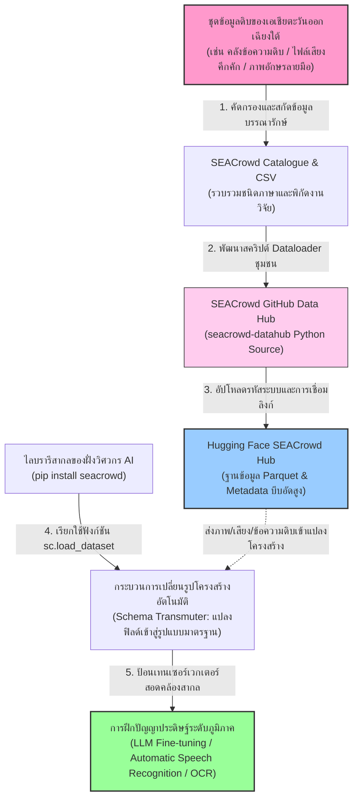
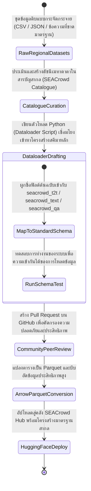
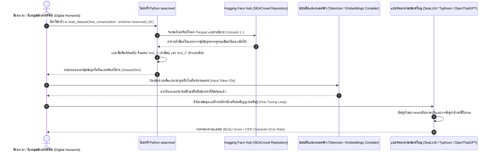

# รายงานการวิเคราะห์ระบบนิเวศและคลังข้อมูลมรดกทางภาษาและอักษร ฉบับที่ 008 (ฉบับสมบูรณ์)
> **รหัสกลุ่มโครงการ:** `SEACrowd` (Southeast Asian Language Resources Standardization Initiative)  
> **โครงการต้นทาง:** โครงการเคลื่อนไหวชุมชนเพื่อจัดตั้งคลังข้อมูลดิบและระบบกำกับข้อมูลภาษาเอเชียตะวันออกเฉียงใต้เชิงคำนวณ  
> **วิเคราะห์โดย:** Antigravity AI  
> **วันที่วิเคราะห์:** 31 พฤษภาคม 2026

---

## 1. ข้อมูลสรุปเชิงบริหาร (Executive Summary)

โครงการ **SEACrowd** เป็นโครงการขับเคลื่อนทางเทคโนโลยีปัญญาประดิษฐ์ระดับแนวหน้าของชุมชนนักวิจัยและผู้เชี่ยวชาญด้านการประมวลผลภาษาธรรมชาติ (NLP), ระบบเสียง (Speech), และคอมพิวเตอร์วิทัศน์สื่อผสม (Multimodal Vision-Language) ทั่วภูมิภาคเอเชียตะวันออกเฉียงใต้ โดยมีเป้าหมายเชิงยุทธศาสตร์เพื่อแก้ไขปัญหาการขาดแคลนทรัพยากรข้อมูลภาษาทรัพยากรต่ำ (Low-Resource Languages) ในภูมิภาคเอเชียตะวันออกเฉียงใต้ ซึ่งครอบคลุมประชากรกว่า 680 ล้านคนและระบบภาษากว่า 1,000 ภาษา ผ่านการรวบรวม จัดหมวดหมู่ และกำหนดมาตรฐานสากล (Standardization) ให้แก่ชุดข้อมูลนับร้อยชุดบนแพลตฟอร์ม Hugging Face Hub

ความโดดเด่นสูงสุดของโครงการ SEACrowd คือการจัดทำระบบไลบรารี Python อัจฉริยะในชื่อ `seacrowd` ซึ่งทำหน้าที่เป็นสะพานเชื่อมสากลแปลงโครงสร้างข้อมูลสารสนเทศดั้งเดิมที่มีความสะเปะสะปะและหลากหลายฟอร์แมต ให้เข้าสู่สเปกคำอธิบายคลาสแบบเอกเทศ (Unified Schemas) เช่น `seacrowd_text` (จำแนกข้อความ), `seacrowd_t2t` (การแปลงภาษาและการสรุปความ), `seacrowd_qa` (ระบบถาม-ตอบ), และ `seacrowd_kb` (คลังโครงสร้างความรู้และคำศัพท์) โครงการนี้มีคุณค่าอเนกอนันต์ต่อ **โครงการคลังข้อมูลเอกสารโบราณ (Ancient Manuscript Repository)** ของคณะผู้วิจัย เนื่องจากช่วยให้ระบบสืบค้น คำนวณ และจำแนกภาพคัมภีร์ใบลาน อักษรล้านนา อักษรขอม และภาษาบาลีสันสกฤต สามารถผสานรวมเข้ากับกระดูกสันหลังการประมวลผลภาษาเชิงคำนวณและปัญญาประดิษฐ์ยุคใหม่ (Large Language Models) ได้ทันทีโดยไม่ต้องเริ่มต้นพัฒนาตัวนำเข้าข้อมูลใหม่จากศูนย์

---

## 2. ประวัติและข้อมูลพื้นฐานของโปรเจกต์ (Project Background & Metadata)

ชุดข้อมูลและระบบรวบรวมได้รับการเผยแพร่ภายใต้ชื่อองค์กรสากลอย่างเป็นทางการบนระบบ Hugging Face Hub โดยมีข้อมูลเมทาดาตาเชิงระบบดังนี้:

| หัวข้อเมทาดาตา (Metadata Item) | รายละเอียดข้อมูล (Detail Value) |
| :--- | :--- |
| **ชื่อคลังข้อมูลหลัก (Organization Name)** | `SEACrowd` (คลังรวมศูนย์ระบบทรัพยากรเอเชียตะวันออกเฉียงใต้) |
| **ลิงก์เข้าถึงระบบ (URL)** | [huggingface.co/SEACrowd](https://huggingface.co/SEACrowd) |
| **ผู้สร้าง/คณะผู้วิจัย (Creators)** | คณะทำงานความร่วมมือ SEACrowd Community Co-initiators (นำโดยสมาคมนักวิจัย NLP, วิศวกร AI และนักภาษาศาสตร์ชั้นนำจาก สถาบันวิทยาการปัญญาประดิษฐ์และสมาคมวิชาการทั่วทั้งอาเซียน) |
| **หน่วยงาน/สถาบัน (Affiliation)** | เครือข่ายความร่วมมือมนุษยศาสตร์ดิจิทัลและเทคโนโลยีภาษาศาสตร์สากล (เช่น สถาบันความร่วมมือวิจัยวิศวกรรมปัญญาประดิษฐ์, PyThaiNLP, AI Singapore, BRIN Indonesia เป็นต้น) |
| **โครงการแม่ข่าย (Main Project)** | **SEACrowd Hub & Catalogue** (เข้าถึงโค้ดต้นฉบับได้ที่ [github.com/SEACrowd/seacrowd-datahub](https://github.com/SEACrowd/seacrowd-datahub) และหน้าแคตตาล็อก [seacrowd.github.io/seacrowd-catalogue](https://seacrowd.github.io/seacrowd-catalogue)) |
| **ขนาดชุดข้อมูล (Dataset Size)** | โครงการครอบคลุมชุดข้อมูลย่อยมากกว่า **500+ ชุดข้อมูล** ที่ได้รับการบันทึกข้อมูลเมทาดาตา พร้อมตัวโหลดมาตรฐานกว่า **200+ Dataloaders** ครอบคลุมเกือบ 1,000 ภาษาถิ่น |
| **สัญญาอนุญาต (License)** | สัญญาอนุญาตแบบโอเพนซอร์สเสรี **MIT License** สำหรับชุดโครงสร้างระบบและไลบรารีหลัก และสัญญาอนุญาตตามข้อกำหนดดั้งเดิมของชุดข้อมูลย่อยแต่ละชุด (เช่น Apache-2.0, CC-BY-4.0) |
| **มาตรฐานข้อมูล (Data Standard)** | **SEACrowd Standard Schemas** ร่วมกับมาตรฐาน **Croissant 1.1** เพื่อการเชื่อมโยงระบบ ML สากล |
| **รูปแบบข้อมูล (Data Format)** | สารสนเทศแบบโมดูลาร์สื่อผสม (ตาราง Parquet, ไฟล์เสียง WAV, และภาพถ่ายดิจิทัลระดับสูง) |

---

## 3. แผนผังระบบข้อมูลและโครงสร้างพื้นฐาน (Data Pipeline & Infrastructure)

สถาปัตยกรรมของโครงการ SEACrowd ในการสกัดชุดข้อมูลดิบที่มีร้อยแปดพันรูปแบบจากชุมชนและผู้พัฒนาเดิม นำมาผ่านกระบวนการคัดกรอง วางโครงสร้างมาตรฐาน และให้บริการผ่านไลบรารีสากลเพื่อป้อนเข้าสู่โมเดลปัญญาประดิษฐ์ยุคใหม่ มีความเชื่อมโยงกันอย่างเป็นระบบดังแผนภูมิโครงสร้างพื้นฐานต่อไปนี้:



---

## 4. คุณค่าทางวิชาการและบทบาทเชิงประวัติศาสตร์สำหรับเอกสารโบราณ (Scientific & Codicological Value)

ความท้าทายอย่างยิ่งยวดของประวัติศาสตร์การเขียนและภาษาศาสตร์ในภูมิภาคเอเชียตะวันออกเฉียงใต้ คือความหลากหลายของภาษาถิ่นและวิวัฒนาการอักขรวิธี ซึ่งรวมถึงเอกสารลายมือจารและคัมภีร์ทางพุทธศาสนาคลาสสิก:

- **การก้าวข้ามช่องว่างความรู้ทางภาษา (Low-Resource Language Gap):** ระบบนิเวศ SEACrowd ช่วยลดความเหลื่อมล้ำทางดิจิทัลของภาษาไทย ภาษาถิ่น (ล้านนา, อีสาน, ปักษ์ใต้) และภาษาของเพื่อนบ้าน (ลาว, พม่า, เขมร) โดยแปลงทรัพยากรภาษาที่มักถูกมองข้ามให้กลายเป็นข้อมูลที่คอมพิวเตอร์และอัลกอริทึมเข้าใจได้ง่าย
- **คุณค่าเชิงประวัติศาสตร์และจารึกวิทยาเชิงดิจิทัล (Digital Epigraphy & Manuscript Preservation):** ในมิติตัวอักษรและคัมภีร์โบราณ (เช่น คัมภีร์ใบลาน และสมุดไทยพับ) ข้อมูลมักอยู่ในอักขรวิธีท้องถิ่น เช่น อักษรธรรมล้านนา อักษรขอมไทย หรืออักษรไทน้อย ซึ่งการจัดเตรียมโมเดลแปลงอักษรและคำอ่าน เช่น `thai_romanization` และชุดข้อมูลอักขรวิธีเป็นพยางค์ของระบบเสียง เป็นรากฐานที่สำคัญยิ่งในการพัฒนาโมเดล OCR (Optical Character Recognition) โบราณและการทำระบบสืบค้นข้อความอัจฉริยะ (Semantic Search Interface)
- **การปูทางสู่การวิเคราะห์ภาษาบาลี-สันสกฤตระดับภูมิภาค (Regional Pali-Sanskrit NLP):** การมาตรฐานฟิลด์ข้อมูลด้วยระบบ SEACrowd เอื้อให้นักประวัติศาสตร์สามารถพัฒนาชุดวิเคราะห์ไวยากรณ์เชิงคำนวณสำหรับภาษาบาลี-สันสกฤตจารึกอักขรวิธีไทย เพื่อศึกษาการรับอิทธิพลวัฒนธรรมและศาสนาข้ามศตวรรษในแถบสุวรรณภูมิได้อย่างแม่นยำ

---

## 5. สเปกทางเทคนิคและสคีมาข้อมูลเชิงลึก (In-depth Technical Dataset Schema)

หัวใจสำคัญของการดำเนินงานใน SEACrowd คือการกำหนด **สคีมามาตรฐาน (Standardized Schemas)** เพื่อจำกัดความขัดแย้งของตัวอักษรและคอลัมน์จากนักวิจัยต่างค่าย โดยมีการระบุสคีมาหลักดังตารางแสดงพิกัดข้อมูลต่อไปนี้:

### 5.1 ตารางฟิลด์สคีมาเด่น (Selected Standard Schemas)

| ชื่อสคีมาสากล (Schema Name) | โครงสร้างฟิลด์เด่น (Core Fields) | หน้าที่และคำอธิบายข้อมูล (Function & Description) |
| :--- | :--- | :--- |
| `seacrowd_text` | `id`, `text`, `label` | เหมาะสำหรับงานสกัดจำแนกอารมณ์ความรู้สึก (Sentiment) และวิเคราะห์หัวข้อข้อความโบราณ |
| `seacrowd_t2t` | `id`, `text_1`, `text_2`, `text_1_name`, `text_2_name` | รูปแบบสำหรับการแปลภาษา (Translation), การแปรรูปคำถอดเสียง (Romanization/Script Conversion), และการสรุปความ |
| `seacrowd_qa` | `id`, `question_id`, `document_id`, `question`, `type`, `context`, `answers` | โครงสร้างระบุคำถาม-คำเฉลยพร้อมระบุจุดตำแหน่งพิกเซลพารากราฟต้นฉบับ เหมาะกับงานตอบคำถามบริบทโบราณ |
| `seacrowd_kb` | `id`, `passages` (text/offsets), `entities` (text/type/offsets), `relations` (source/target/type) | เหมาะกับภารกิจสกัดความสัมพันธ์ของประวัติศาสตร์ (Entity & Relation Extraction) และตรวจจับคำศัพท์โบราณ |

### 5.2 ตัวอย่างเรคคอร์ดข้อมูลมาตรฐานเชิงปฏิบัติ (Sample Standard JSON Record)

ตัวอย่างด้านล่างแสดงการจัดรูปแบบข้อมูลการแปลงอักษรจารึกโบราณจากอักษรไทยดั้งเดิมสู่โครงสร้างคำอ่านตามมาตรฐานระบบ **`seacrowd_t2t`** ซึ่งช่วยเพิ่มความสามารถในการทำงานร่วมกันระหว่างโมเดลภาษาศาสตร์ระดับสากล:

```json
{
  "id": "manuscript_transliteration_008_demo",
  "text_1": "คลังข้อมูลเอกสารโบราณ",
  "text_2": "khlang-kho-mun-ek-ka-san-bo-ran",
  "text_1_name": "thai_script",
  "text_2_name": "romanized_ipa",
  "metadata": {
    "dialect": "Standard Thai",
    "language": "tha",
    "script_era": "Contemporary",
    "source_archive": "Ancient Manuscripts Repository Vesinah",
    "transliteration_standard": "Royal Thai General System (RTGS) modified"
  }
}
```

---

## 6. เวิร์กโฟลว์วงจรชีวิตข้อมูลสารภาษาและอักษร (Standardization Lifecycle Workflow)

การเปลี่ยนผ่านจากข้อมูลดิบอันหลากหลายกระจัดกระจายรอบโลก สู่การกลั่นกรองและผสานรวมเข้าสู่รหัสสากล SEACrowd ปรากฏตามแผนผังเวิร์กโฟลว์และแผนภูมิสถานะดังต่อไปนี้:



---

## 7. เทคโนโลยีขั้นสูงและการนำไปใช้ประโยชน์ในงานเอกสารโบราณ (Advanced Engineering Applications)

โครงการ SEACrowd ถือเป็นนวัตกรรมล้ำยุคในด้านวิศวกรรมข้อมูล ซึ่งให้ประโยชน์โดยตรงแก่คลังประมวลผลข้อมูลเอกสารโบราณและอักษรจารึกดั้งเดิมในมิติต่าง ๆ:

- **การโหลดข้อมูลแบบอเนกประสงค์ (Unified Multi-Task Loading):** การติดตั้งตัวนำเข้าเพียงครั้งเดียวแต่ดึงรูปแบบข้อมูลได้หลากหลาย (เช่น การใช้ `seacrowd_t2t` โหลดข้อมูลลอกลายคัมภีร์ใบลาน และใช้ `seacrowd_kb` ค้นหาพจนานุกรมศัพท์โบราณ) ปลดล็อกข้อจำกัดทางวิศวกรรมการเขียนโค้ดซ้ำซ้อน
- **สถาปัตยกรรมการถอดอักษรและพยางค์เชิงบูรณาการ (Transliteration & Alignment Pipelines):** สคีมา Text-to-Text (`seacrowd_t2t`) ของระบบ เอื้อต่อการจัดทำโมเดลปัญญาประดิษฐ์เพื่อช่วยถอดอักขรวิธีขอม ล้านนา หรือไทยย่อ สู่ภาษาไทยปัจจุบัน ปูทางไปสู่การวิเคราะห์คำอ่าน คำพ้อง หรือการเปรียบเทียบนิรุกติศาสตร์เชิงคำนวณอย่างลึกซึ้ง
- **การกู้คืนและซ่อมแซมตัวอักษรที่ชำรุด (Text Reconstruction via LLMs):** การนำโครงสร้างโครงข่ายภาษาท้องถิ่นของ SEACrowd ไปทำแบบจำลองเติมคำขาดหาย (Masked Language Modeling/Filling) ช่วยให้ AI สามารถเดาคำที่ผุพังหรือเลือนหายบนใบลานจริงจากบริบทคำโดยรอบตามหลักความน่าจะเป็นทางไวยากรณ์

---

## 8. แผนผังขั้นตอนการโหลดข้อมูลป้อนเข้าสู่ระบบปัญญาประดิษฐ์ (ML Ingestion Sequence)

ภาพรวมการเรียกใช้ประโยชน์จากทรัพยากรสากลของ SEACrowd ผ่านไลบรารีสคริปต์ Python เพื่อประมวลผลคำและฝึกสอนโมเดลปัญญาประดิษฐ์แบบรวดเร็ว ปรากฏลำดับเหตุการณ์การเชื่อมต่อระบบดังต่อไปนี้:



---

## 9. บทวิเคราะห์เชิงประจักษ์: จุดเด่น ข้อจำกัด และคำแนะนำ (Strategic Dataset Evaluation)

### จุดเด่นเชิงวิศวกรรมข้อมูล (Pros)
- **มาตรฐานกลางระดับภูมิภาคที่ดีที่สุด (Unrivaled Regional Standardization):** ปลดล็อกปัญหาความเข้ากันไม่ได้ของการประมวลผลภาษาเอเชียตะวันออกเฉียงใต้ ทำให้โมเดล AI ในเวทีโลกสามารถดึงไปวิเคราะห์และทดสอบระบบได้โดยไม่เกรงกลัวปัญหาความสับสนของตารางคอลัมน์
- **ความหลากหลายทางวัฒนธรรมและภาษาขั้นสูงสุด (Superb Multi-lingual Coverage):** ครอบคลุมงานวิจัยเชิงภาษาศาสตร์หลากหลายชาติพันธุ์ ซึ่งสนับสนุนเป้าหมายการขยายขอบเขตการจัดทำทรัพยากรการPreserveมรดกทางวัฒนธรรมในอาเซียน
- **ระบบคัดกรองเข้มงวดด้วยการทบทวนโดยเพื่อน (PR & Community Review):** การตรวจสอบโค้ด Dataloaders ทุกตัวโดยทีมนักวิจัยหลักช่วยการันตีความปลอดภัย โครงสร้างข้อมูลที่ถูกต้อง และลดโอกาสที่จะเกิดขยะข้อมูลเชิงเทคนิค

### ข้อจำกัดที่พึงระวัง (Cons & Constraints)
- **การพึ่งพิงลิงก์แหล่งดาวน์โหลดภายนอกสูง (High Dependency on Source Upstream):** เช่นเดียวกับมาตรฐาน Hugging Face ทั่วไป ชุดข้อมูลต้นฉบับบางตัวบันทึกอยู่บนเซิร์ฟเวอร์อิสระของมหาวิทยาลัยหรือ Google Drive ของนักวิจัยเดิม หากไฟล์เหล่านั้นถูกลบหรือเซิร์ฟเวอร์ต้นทางล่ม ตัว Dataloader ของ SEACrowd ก็จะล้มเหลวในการดาวน์โหลดเช่นกัน
- **ความซับซ้อนของคุณภาพข้อมูลต้นทาง (Variable Dataset Quality):** เนื่องจากข้อมูลรวบรวมมาจากต่างคณะทำงาน ทำให้บางชุดข้อมูลอาจมีสัญญาณรบกวน (Noise) คำแปลคลาดเคลื่อน หรือคุณภาพเสียงที่มีเสียงลมแทรก ซึ่งผู้ใช้จำเป็นต้องทำความเข้าใจและกรองชุดข้อมูลย่อยอย่างระมัดระวัง
- **เน้นเฉพาะภาษายุคปัจจุบันเป็นหลัก (Modern Dialects Focus):** คลังข้อมูลแทบทั้งหมดให้ความสำคัญกับภาษามาตรฐานที่ใช้งานในปัจจุบันเพื่อพัฒนาโมเดลสนทนา ส่วนของคลังชุดข้อมูลเอกสารโบราณ จารึกโบราณ อักษรเปลือกไม้ หรือคัมภีร์ใบลานเอเชียตะวันออกเฉียงใต้ยังมีปริมาณน้อยมากในคลังสาธารณะ

### โอกาสในการพัฒนาขยายผลเพื่อคลังข้อมูลเอกสารโบราณ (Strategic Actionable Recommendations)

> [!IMPORTANT]
> **1. การพัฒนาตัวนำเข้าข้อมูลอักขรวิธีล้านนาและบาลี (Lanna & Pali Tham Integration):**  
> คณะผู้วิจัยของ **คลังข้อมูลเอกสารโบราณ (คลังข้อมูลเอกสารโบราณ)** สามารถออกแบบชุดข้อมูลคำอ่านและถอดความคำคัมภีร์ใบลาน (เช่น คัมภีร์มังรายศาสตร์ หรือ คัมภีร์ใบลานภาษาบาลีอักษรล้านนา/ธรรม) แล้วจัดทำเป็นตัวดึงข้อมูลมาตรฐานของ SEACrowd เพื่อเปิดโอกาสให้นักพัฒนาโมเดลภาษาขนาดใหญ่ (LLMs) ทั่วโลกสามารถฝึกฝนความรู้เกี่ยวกับคัมภีร์พุทธศาสนาและกฎหมายโบราณของไทยได้

> [!TIP]
> **2. การสร้างแบบจำลองสืบค้นข้อมูลมิติหลายภาษา (Multi-lingual Epigraphic Vectorization):**  
> ด้วยการใช้ประโยชน์จากพจนานุกรมคำศัพท์และชุดข้อมูลอารมณ์/ความรู้ของ SEACrowd คณะทำงานสามารถผสานเครื่องมือสืบค้นข้อมูลในฐานข้อมูล `ancient_texts.db` และ `search_index.db` ของท่านร่วมกับตัวชี้ความสัมพันธ์ (Embedding Models) เพื่อทำหน้าที่ให้หน้าแอป UI (`app_ui.py`) สามารถช่วยให้ผู้ใช้งานป้อนคำค้นหาภาษาไทยปัจจุบัน แล้วระบบสามารถสืบค้นและแปลความคัมภีร์ภาษาบาลีเขียนอักษรขอมหรือล้านนาที่มีคำเทียบเคียงได้โดยอัตโนมัติผ่านเวกเตอร์เชิงความหมาย (Semantic Vector Match)

---
