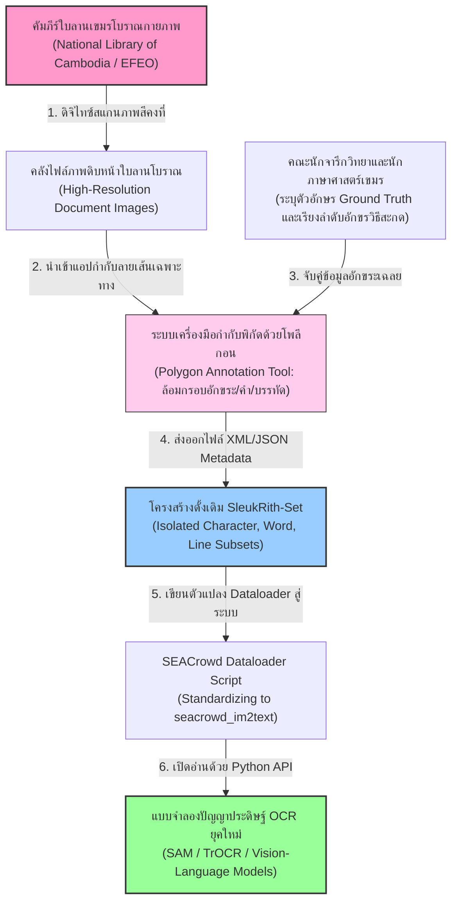
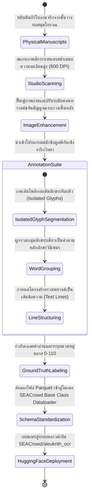
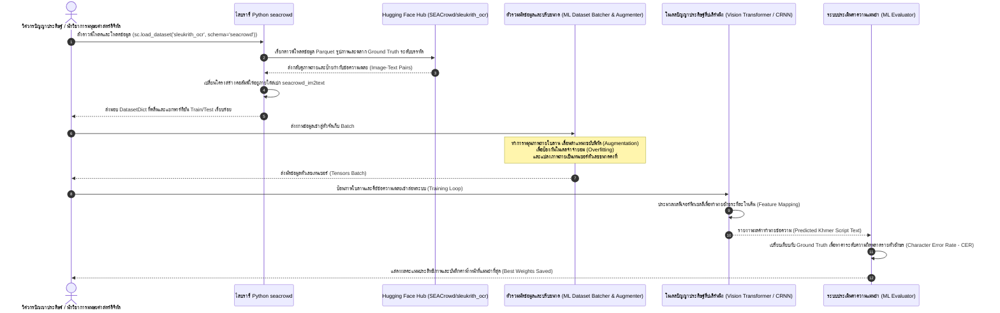

# รายงานการวิเคราะห์ระบบนิเวศและคลังข้อมูลมรดกทางภาษาและอักษร ฉบับที่ 009 (ฉบับสมบูรณ์)
> **รหัสชุดข้อมูล:** `SEACrowd/sleukrith_ocr`  
> **โครงการต้นทาง:** โครงการวิจัยจารึกวิทยาเขมรโบราณเชิงดิจิทัล "SleukRith Set"  
> **วิเคราะห์โดย:** Antigravity AI  
> **วันที่วิเคราะห์:** 31 พฤษภาคม 2026

---

## 1. ข้อมูลสรุปเชิงบริหาร (Executive Summary)

ชุดข้อมูล `SEACrowd/sleukrith_ocr` (หรือเป็นที่รู้จักในนามวิชาการว่า **SleukRith Set**) เป็นคลังข้อมูลสื่อผสมสัญญะเพื่อการรู้จำอักขระด้วยแสง (Optical Character Recognition - OCR) ที่มีความสำคัญเชิงประวัติศาสตร์ ศิลปวัฒนธรรม และจารึกวิทยาอย่างลึกซึ้งในภูมิภาคเอเชียตะวันออกเฉียงใต้ ชุดข้อมูลนี้จัดทำขึ้นโดยคณะทำงานผู้วิจัยและผู้เชี่ยวชาญร่วมระหว่างประเทศจาก **L3i Lab (La Rochelle University) ประเทศฝรั่งเศส**, **Université catholique de Louvain ประเทศเบลเยียม**, และ **สถาบันพุทธศาสนบัณฑิต กรุงพนมเปญ ประเทศกัมพูชา** โดยมีวัตถุประสงค์หลักเพื่อสร้างคลังข้อมูลดิจิทัลต้นแบบสำหรับฝึกสอนระบบปัญญาประดิษฐ์ให้สามารถอ่าน แปลง และสืบค้นข้อความจาก **คัมภีร์ใบลานอักษรเขมรโบราณ (Khmer Palm Leaf Manuscripts)**

ชุดข้อมูลนี้ประกอบด้วยภาพสแกนความละเอียดสูงของหน้าคัมภีร์ใบลานจริงจำนวน **657 หน้า** ซึ่งผ่านการคัดสรรเชิงบรรณารักษ์มาจากหอสมุดและหอจดหมายเหตุโบราณที่สำคัญของกัมพูชา จุดเด่นสูงสุดคือโครงสร้างการกำกับข้อมูล (Annotation) ที่ละเอียดอ่อนและซับซ้อนอย่างยิ่งถึง 3 ระดับสถาปัตยกรรม ได้แก่ ระดับอักขระเดี่ยว (Isolated Glyphs), ระดับคำ (Words), และระดับบรรทัดข้อความ (Lines) เมื่อได้รับการผนวกรวมเข้าสู่คลังมาตรฐานของ **SEACrowd** ข้อมูลทั้งหมดจึงสามารถเรียกใช้งานผ่านสคีมาสากล **`seacrowd_im2text`** (Image-to-Text) ทำให้ชุดข้อมูลนี้เป็นเสมือน "พิมพ์เขียว" และตัวแปรอ้างอิงเชิงวิศวกรรมที่ยอดเยี่ยมที่สุดสำหรับ **โครงการคลังข้อมูลเอกสารโบราณ (Ancient Manuscript Repository)** ในการออกแบบสถาปัตยกรรมคอมพิวเตอร์วิทัศน์เพื่อสแกนและสกัดตัวอักษรขอมไทย อักษรธรรมล้านนา และคัมภีร์บาลีใบลานของไทยในอนาคต

---

## 2. ประวัติและข้อมูลพื้นฐานของโปรเจกต์ (Project Background & Metadata)

ชุดข้อมูลได้รับการสกัดและวางมาตรฐานโครงสร้างบน Hugging Face Hub โดยมีรายละเอียดเชิงลึกทางเทคนิคดังนี้:

| หัวข้อเมทาดาตา (Metadata Item) | รายละเอียดข้อมูล (Detail Value) |
| :--- | :--- |
| **ชื่อชุดข้อมูล (Dataset Name)** | `SEACrowd/sleukrith_ocr` (สเปกมาตรฐาน SEACrowd) |
| **ลิงก์เข้าถึงระบบ (URL)** | [huggingface.co/datasets/SEACrowd/sleukrith_ocr](https://huggingface.co/datasets/SEACrowd/sleukrith_ocr) |
| **ผู้สร้าง/คณะผู้วิจัย (Creators)** | **ดร. โดนา วาลี (Dona Valy)** (นักวิจัยคอมพิวเตอร์วิทัศน์จารึกวิทยา), ศาสตราจารย์ มิเชล แวร์เลเซน (Michel Verleysen), โสเพีย ชุน (Sophea Chhun), และ ศาสตราจารย์ ฌอง-คริสตอฟ บูรี (Jean-Christophe Burie) |
| **หน่วยงาน/สถาบัน (Affiliation)** | L3i Lab (La Rochelle University, France), UCLouvain (Belgium), École Française d'Extrême-Orient (EFEO), National Library of Cambodia, and Buddhist Institute (Cambodia) |
| **โครงการแม่ข่าย (Main Project)** | **SleukRith-Set Project** (เข้าถึงต้นฉบับงานวิจัยและคลังข้อมูลดิบดั้งเดิมได้ที่ [github.com/donavaly/SleukRith-Set](https://github.com/donavaly/SleukRith-Set)) |
| **เอกสารอ้างอิงวิชาการ (Publication)** | *"A New Khmer Palm Leaf Manuscript Dataset for Document Analysis and Recognition: SleukRith Set"* (เผยแพร่ในงานประชุมวิชาการนานาชาติ HIP '17) |
| **ขนาดชุดข้อมูลจริงในคลังดาวน์โหลด (Dataset Size)** | หน้าคัมภีร์ใบลานความละเอียดสูง **657 หน้า**, ประกอบด้วยอักขระเดี่ยวที่สแกนล้อมกรอบโพลีกอนจริง **301,626 อักขระเดี่ยว**, **73,359 คำ**, และ **3,245 บรรทัดข้อความ** |
| **สัญญาอนุญาต (License)** | Custom Academic/Research Use License (สัญญาอนุญาตเสรีเพื่อการศึกษาวิจัยและอนุรักษ์มรดกทางวัฒนธรรมดิจิทัล) |
| **มาตรฐานข้อมูล (Data Standard)** | **Croissant 1.1** ร่วมกับระบบดึงข้อมูล **SEACrowd `seacrowd_im2text`** |

---

## 3. แผนผังระบบข้อมูลและโครงสร้างพื้นฐาน (Data Pipeline & Infrastructure)

สถาปัตยกรรมของโครงการ SleukRith Set ในการแปลงใบลานทางกายภาพโบราณสู่ข้อมูลปัญญาประดิษฐ์ระดับพิกเซลที่สอดคล้องตามมาตรฐานระบบ SEACrowd มีความเชื่อมโยงกันอย่างเป็นระบบดังแผนภูมิโครงสร้างพื้นฐานต่อไปนี้:



---

## 4. ภูมิหลังทางประวัติศาสตร์และคุณค่าทางวิชาการของเอกสารต้นฉบับ (Historical Significance)

คำว่า **"Sleuk Rith" (ស្លឹករឹត - สลึกฤทธิ์/ใบลาน)** ในภาษาเขมร หมายถึงใบของต้นลานที่นำมาผ่านกระบวนการต้ม รีด ตากแห้ง และจารึกอักษรด้วยเหล็กจาร ซึ่งคัมภีร์ใบลานเป็นวัสดุหลักในการบันทึกอารยธรรม ความรู้ และพุทธศาสนาในภูมิภาคเอเชียตะวันออกเฉียงใต้มานานนับพันปี:

- **การเก็บรักษามรดกทางปัญญาของอาเซียน:** เอกสารต้นฉบับที่ถูกนำมาสแกนได้รับการรักษารวมกันจากแหล่งสำคัญ 3 แห่ง คือ หอสมุดแห่งชาติกัมพูชา, สถาบันพุทธศาสนบัณฑิตในพนมเปญ, และฐานข้อมูลของสำนักฝรั่งเศสแห่งปลายบูรพทิศ (EFEO) ซึ่งบันทึกตำรายาแผนโบราณ กฎหมายโบราณ คัมภีร์พระไตรปิฎก และวรรณคดีพื้นบ้านยุคศตวรรษที่ 18-20
- **ความท้าทายระดับสุดยอดต่อเทคโนโลยีคอมพิวเตอร์วิทัศน์:** ภาพถ่ายใบลานโบราณต้องเผชิญกับปัญหาการเสื่อมสภาพทางกายภาพขั้นรุนแรง (Severe Degradation) เช่น พื้นผิวที่มีรอยขีดข่วนตามธรรมชาติของใบลาน คราบเชื้อรา รอยชำรุดจากการกัดแทะของแมลง ความจางของหมึกถ่าน และการเปลี่ยนแปลงของสีผิวใบไม้ตามอายุขัย สิ่งเหล่านี้ทำให้โมเดล OCR มาตรฐานไม่สามารถอ่านได้
- **ความคล้ายคลึงเชิงโครงสร้างกับอักษรขอมไทย:** อักษรเขมรโบราณในคัมภีร์ใบลานมีโครงสร้างอักขรวิธีแบบ Abugida ที่มี "พยัญชนะเชิง" (Subscript/Co-consonant หรือตัวซ้อนด้านล่าง) และเครื่องหมายระบุสระ/วรรณยุกต์ล้อมรอบอักษรหลัก ซึ่งเป็นโครงสร้างเดียวกันกับ **"อักษรขอมไทย"** ที่ปรากฏในคัมภีร์ใบลานพุทธศาสนาเกือบทั้งหมดในหอไตรโบราณของไทย ดังนั้น เทคโนโลยีที่พัฒนาขึ้นบน SleukRith Set จึงสามารถนำมารับส่งถ่ายโอนความรู้ปัญญาประดิษฐ์ (Transfer Learning) สู่การอ่านอักษรขอมไทยได้ทันทีอย่างง่ายดาย

---

## 5. สเปกทางเทคนิคและสคีมาข้อมูลเชิงลึก (In-depth Technical Dataset Schema)

ชุดข้อมูลถูกนำเสนอผ่านมาตรฐานของ SEACrowd ใน 2 รูปแบบหลัก คือ `sleukrith_ocr_source` และ `sleukrith_ocr_seacrowd_im2text` เพื่ออำนวยความสะดวกในการจัดสรร Pipeline ในฝั่ง Machine Learning

### 5.1 โครงสร้างฟิลด์ข้อมูลมาตรฐาน (SEACrowd `seacrowd_im2text` Schema)

| ชื่อฟิลด์ (Field Name) | รูปแบบข้อมูล (Data Type) | หน้าที่และคำอธิบายข้อมูล (Function & Description) |
| :--- | :--- | :--- |
| `id` | `Text` | รหัสชี้เฉพาะตัวอย่างข้อมูล เช่น `sleukrith_word_3405` หรือ `sleukrith_line_102` |
| `image_path` | `Text` | พิกัดหรือเส้นทางอ้างอิงไฟล์รูปภาพต้นฉบับที่ถูกตัดส่วน (Segmented Image Chunk) |
| `image` | `ImageObject` | ออบเจกต์ภาพพิกเซลจริงที่เป็น JPG/PNG ของตัวอักษรเดี่ยว คำ หรือบรรทัดที่ถูกตัดแบ่งครึ่งเรียบร้อย |
| `text` | `Text` | ข้อความเฉลย (Ground Truth Transcription) เช่น ตัวอักษรเขมรจริง หรือกรณีตัวอักษรเดี่ยวจะเป็นรหัสตัวเลขคลาส `0` ถึง `110` |

### 5.2 ตัวอย่างเรคคอร์ดข้อมูลสื่อผสมจำลอง (Sample JSON Representation)

ตัวอย่างด้านล่างแสดงโครงสร้างเรคคอร์ดที่ส่งออกจากตัวโหลดระบบสำหรับงานอ่านบรรทัดข้อความ (Line Recognition) ซึ่งเป็นฟิลด์หลักในการเทรนระบบประเภท Sequence-to-Sequence:

```json
{
  "id": "sleukrith_line_folio_154_v_line_3",
  "image": {
    "path": "data/lines/folio_154_v_line_3.png",
    "bytes": "/9j/4AAQSkZJRgABAQAAAQABAAD/2wBDAAgGBgcGBQgHBwcJCQgKDBQNDAsLDBkSEw8UHRofHh0aHBwgJC4nICIsIxwcKDcpLDAxNDQ0Hyc5PTgyPC4zNDL/2wBDAQkJCQwLDBgNDRgyIRwhMjIyMjIyMjIyMjIyMjIyMjIyMjIyMjIyMjIyMjIyMjIyMjIyMjIyMjIyMjIyMjIyMjL/wAARCAAKAGQDASIAAhEBAxEB/8QAFQABAQAAAAAAAAAAAAAAAAAAAAf/xAAUEAEAAAAAAAAAAAAAAAAAAAAA/8QAFBABAAAAAAAAAAAAAAAAAAAAAP/aAAgBAQABPxA="
  },
  "text": "ព្រះត្រៃបិដកធម្មចក្កប្បវត្តនសូត្រ",
  "metadata": {
    "origin_collection": "National Library of Cambodia",
    "manuscript_id": "NLC_MS_254",
    "level": "text_line",
    "polygon_bbox": [[45, 120], [920, 120], [920, 175], [45, 175]],
    "quality_rating": "highly_legible"
  }
}
```

---

## 6. เวิร์กโฟลว์วงจรชีวิตการดิจิไทซ์และสร้างป้ายกำกับภาพ (Digitization & Labeling Workflow)

กระบวนการจัดการข้อมูลตั้งแต่การหยิบใบลานทางกายภาพโบราณขึ้นมาสแกน ตลอดจนถึงการกำกับป้ายด้วยระบบโพลีกอนและการส่งออกเป็นฐานข้อมูลสำเร็จรูป ปรากฏตามแผนผังเวิร์กโฟลว์เชิงลึกต่อไปนี้:



---

## 7. เทคโนโลยีคอมพิวเตอร์วิทัศน์และระบบการรู้จำเอกสารโบราณ (Advanced Research Methods)

ความท้าทายระดับสูงของการใช้ชุดข้อมูลนี้ในทางวิศวกรรมปัญญาประดิษฐ์ประกอบด้วยเทคโนโลยีสำคัญ 3 ด้าน:

- **การแบ่งส่วนภาพแบบลำดับชั้น (Hierarchical Image Segmentation):** เนื่องจากอักษรจารบนใบลานมักมีการเบียดเสียดกัน ไม่มีช่องว่างระหว่างคำ (Scriptura Continua) และพยัญชนะเชิงมักจะล้ำไปทับบรรทัดด้านล่าง ชุดข้อมูล SleukRith Set จึงเป็นระบบทดสอบที่ยอดเยี่ยมในการพัฒนาอัลกอริทึมแยกบรรทัดและคำแบบซับซ้อน เช่น การใช้แบบจำลอง **SAM (Segment Anything Model)** หรือโมเดลแบ่งแนวเส้นแบบโครงข่ายประสาท U-Net
- **การแก้ปัญหาอักขรวิธีซ้อนพิกัด (Subscript-Aware Character Recognition):** อักขรวิธีเขียนเขมรและขอมมีตัวอักษรหลักและตัวเชิงซ้อนอยู่ด้านล่าง ซึ่งการวาดพิกัดด้วยโพลีกอน (Polygon Boundary) ช่วยให้อัลกอริทึมสามารถเรียนรู้ความสัมพันธ์ของพิกเซลที่ซ้อนทับกันได้ดีกว่า Bounding Box สี่เหลี่ยมทั่วไปอย่างมาก ทำให้วิศวกรสามารถเทรนโมเดลประเภท Transformer-based OCR เช่น **TrOCR** หรือ **Donut** ให้ตรวจจับทั้งตัวอักษรหลักและตัวเชิงสะกดได้พร้อมกันอย่างไร้รอยต่อ
- **เทคโนโลยีค้นหาคำสำคัญบนใบลานดิบ (Word Spotting without OCR):** ข้อมูลเฉลยระดับพิกัดคำทำให้ชุดข้อมูลนี้รองรับงานวิจัยประเภท **Word Spotting** (การป้อนภาพคำศัพท์ เช่น ป้อนรูปถ่ายคำว่า "พุทธ" แล้วสั่งให้ระบบสืบค้นภาพถ่ายตำแหน่งที่มีภาพคำคำนี้อยู่บนหน้าใบลานอื่น ๆ ทั้งหมด) ซึ่งช่วยให้นักประวัติศาสตร์สามารถค้นหาข้อมูลที่สนใจได้โดยไม่ต้องรอให้ AI ทำการแปลข้อความออกมาก่อน

---

## 8. แผนผังขั้นตอนการประมวลผลเข้าระบบปัญญาประดิษฐ์ (ML Ingestion Sequence)

สเต็ปกระบวนการทำงานร่วมกันระหว่างวิศวกรปัญญาประดิษฐ์ ไลบรารีข้อมูลของ SEACrowd และระบบฮาร์ดแวร์เพื่อดึงภาพตัวอักษรใบลานไปฝึกฝนและประเมินผลระบบ OCR ปรากฏลำดับขั้นตอนดังแผนภูมิ Sequence ต่อไปนี้:



---

## 9. บทวิเคราะห์เชิงประจักษ์: จุดเด่น ข้อจำกัด และคำแนะนำ (Strategic Dataset Evaluation)

### จุดเด่นเชิงวิศวกรรมข้อมูล (Pros)
- **ข้อมูลสามระดับที่ประเมินค่ามิได้ (Gold-Standard 3-Level Annotations):** เป็นคลังข้อมูลใบลานแห่งเดียวในปัจจุบันที่มีครบทั้งข้อมูลอักขระเดี่ยว คำ และบรรทัดในฐานข้อมูลเดียวกัน เอื้อให้นักพัฒนาสามารถทดลองออกแบบการประมวลผลได้หลากหลายสถาปัตยกรรม (เช่น จะทำ OCR ทีละอักขระ หรือจะทำแบบ End-to-end ทีละบรรทัดก็สามารถเลือกทดลองได้)
- **ประณีตด้านจารึกวิทยาเขมร (Deep Khmer Palaeography):** ข้อมูลสแกนถูกจัดระบบโดยผู้เชี่ยวชาญจากสำนักฝรั่งเศสแห่งปลายบูรพทิศ (EFEO) ซึ่งมั่นใจได้ว่าตัวอักษรเฉลย Ground Truth มีความถูกต้องตามหลักโบราณคดีและจารึกวิทยา 100%
- **มาตรฐาน Croissant และ SEACrowd:** มีความพร้อมในการเชื่อมโยงเข้าหาไลบรารีสากลยุคใหม่ ทำให้นำไปเขียนสคริปต์ Python ร่วมกับ PyTorch หรือ TensorFlow ได้อย่างรวดเร็ว

### ข้อจำกัดที่พึงระวัง (Cons & Constraints)
- **การระบุค่าคลาสอักขระเดี่ยวเป็นตัวเลขดิบ (Lack of Mapping for Glyphs):** ในส่วนของคลังข้อมูลอักขระเดี่ยว มีการระบุป้ายกำกับเป็นตัวเลขคลาส `0` ถึง `110` เท่านั้น โดยไม่มีคู่มือเทียบคำอ่านแสดงบนหน้าเว็บหลัก ซึ่งสร้างอุปสรรคให้กับผู้พัฒนา หากต้องการใช้เทรนโมเดลเพื่ออ่านอักษรเดี่ยวโดยตรง (นักพัฒนาต้องเทียบภาพพิกเซลย้อนกลับเพื่อทำพจนานุกรมคลาสอักขระเอง)
- **ขนาดระดับหน้าเอกสารยังมีขอบเขตจำกัด (Moderate Leaf-Page Scale):** การมีข้อมูลหน้าเอกสาร 657 หน้า แม้จะมีตัวอย่างอักษรย่อยนับแสนตัว แต่อาจยังไม่ครอบคลุมลายเส้นการแกะสลักหินหรือสไตล์ลายมือของอาลักษณ์โบราณทุกคน (Ascribe Variations) ซึ่งความผันแปรของลายมือเป็นอุปสรรคสำคัญที่ทำให้ AI เกิดอาการเดาอักษรพลาด
- **เน้นเฉพาะอักขรวิธีเขมรแบบมาตรฐาน (Khmer standard writing focus):** อักขรวิธีที่จารบนใบลานเหล่านี้คืออักษรมูล (Khmer Mul) และอักษรเชรียง (Khmer Chrieng) ซึ่งแม้จะใกล้เคียงกับอักษรขอมไทย แต่มีความแตกต่างทางสัทศาสตร์และรูปสระบางตัว ทำให้นักพัฒนาไม่สามารถนำไปวิเคราะห์ใบลานอักษรธรรมล้านนาหรือตัวเมืองในภาคเหนือของไทยได้โดยตรงโดยไม่ปรับแก้อักษร

### โอกาสในการพัฒนาขยายผลเพื่อคลังข้อมูลเอกสารโบราณ (Strategic Actionable Recommendations)

> [!IMPORTANT]
> **1. การทำพิมพ์เขียวจารึกไทย-ล้านนาด้วยระดับการกำกับ 3 ชั้น (Lanna/Khom Digitization Blueprint):**  
> คณะผู้วิจัยของ **คลังข้อมูลเอกสารโบราณ** สามารถนำแนวคิดการล้อมพิกัด 3 ระดับ (Glyph -> Word -> Line) ของ SleukRith Set ไปใช้ในการออกแบบระบบชุดข้อมูลของหอไตรโบราณในไทย โดยเฉพาะกับอักษรธรรมล้านนาในคัมภีร์ใบลานภาคเหนือ การใช้โครงสร้างพิกัดโพลีกอนรอบพยัญชนะและสระซ้อนล้านนา (เช่น ตัวอักษรที่มีตัวห้อยด้านล่าง) จะช่วยเพิ่มความถูกต้องในการฝึกเทรนโมเดล OCR ภาษาเหนือโบราณได้อย่างสูงสุด

> [!TIP]
> **2. การถ่ายโอนความรู้เพื่อประหยัดต้นทุนฝึกโมเดลขอมไทย (Transfer Learning from SleukRith to Thai-Khom):**  
> เนื่องจากอักษรขอมไทยที่ใช้จารคัมภีร์โบราณในราชสำนักอยุธยาและรัตนโกสินทร์มีรูปทรงสัญญะและวิวัฒนาการเดียวกับอักษรมูลของเขมรเกือบ 90%  
> คณะทำงานจึงไม่จำเป็นต้องเสียเวลาและงบประมาณในการกำกับหน้ากากพิกเซลอักษรขอมไทยจำนวนนับแสนตัวอย่างตั้งแต่เริ่มต้น  
> **แนวทางปฏิบัติเชิงกลยุทธ์:** ท่านสามารถดาวน์โหลดโมเดล OCR ที่ฝึกสำเร็จแล้วจากชุดข้อมูล `sleukrith_ocr` (Pre-trained Model) มาใช้เป็นจุดเริ่มต้น จากนั้นนำคัมภีร์ใบลานอักษรขอมไทยของท่านที่สแกนและล้อมกรอบตัวอักษรไว้เพียงจำนวนเล็กน้อย (Few-shot Data) มาทำการปรับจูน (Fine-tuning) วิธีนี้จะช่วยลัดขั้นตอนและลดเวลาการเทรน AI ได้มากถึง 80% ขณะเดียวกันก็คงระดับความแม่นยำในการถอดความจารึกขอมของไทยไว้ได้อย่างยอดเยี่ยม

## 10. เจาะลึกโครงสร้างคลังเก็บโค้ดต้นฉบับและการวิเคราะห์สคีมา XML (Deep Dive Original GitHub & XML Annotation Schema)

โครงการวิจัยต้นทางได้รับการพัฒนาโค้ดและเผยแพร่ผ่านทาง GitHub Repository [donavaly/SleukRith-Set](https://github.com/donavaly/SleukRith-Set) ซึ่งข้อมูลในส่วนนี้ไม่เพียงแต่เป็นคลังรูปภาพ แต่ยังมี **โครงสร้างการบันทึกป้ายกำกับ XML (XML Ground Truth Schema)** ที่ใช้ในการประเมินและล้อมขอบเขตพื้นที่ระดับอักขระเดี่ยวและระดับคำอย่างเป็นระบบ

### 10.1 โครงสร้างไฟล์ในชุดคลังดั้งเดิม (Repository Folder Structure)
ภายในคลังข้อมูลต้นฉบับทางกัมพูชาและฝรั่งเศส ได้มีการแบ่งแยกไฟล์ออกเป็นกลุ่มโมเดลที่ชัดเจน:
- โฟลเดอร์รูปภาพดิบที่ยังไม่ได้ตัดแบ่ง (Raw scanned pages)
- ไฟล์เมทาดาตาแบบตารางและดัชนีคำเฉลยรายหน้าคัมภีร์
- ไฟล์ XML ประจำหน้าใบลานแต่ละใบ ซึ่งประกอบด้วยพิกัดแนวเส้นและการล้อมพิกัดด้วยโพลีกอน

### 10.2 การแจกแจงสคีมาโครงสร้าง XML ในระบบ (SleukRith XML Annotation Specification)
สำหรับทุกหน้าใบลานโบราณ จะมีไฟล์กำกับข้อมูล XML ที่มีชื่อล้อตามรหัสหน้าคัมภีร์ เช่น `page_001.xml` ซึ่งแบ่งออกเป็น 2 เซกชันหลักที่ผูกโยงความสัมพันธ์กันในลักษณะเชิงโครงสร้างลำดับชั้น (Hierarchical Data Modeling):

1. **เซกชัน `<CharAnno>` (ระดับอักขระเดี่ยว):** ทำหน้าที่ระบุตำแหน่งรูปพิกัดโพลีกอน (`<Polygon>`) และตัวอักษร Unicode แท้จริงที่เป็น Ground Truth ของอักขระแต่ละตัว
2. **เซกชัน `<WordAnno>` (ระดับคำ):** ไม่ระบุพิกัดโดยตรง แต่ใช้วิธีเรียกอ้างอิงรหัสอักขระเดี่ยวที่ผูกอยู่ในเซกชันแรกผ่านทางคุณลักษณะ `<CharRef id="..." />` มารวมกันเป็นประโยคคำสะกดเพื่อความถูกต้องสูงสุดตามลำดับการเขียนทางภาษาศาสตร์

#### ตัวอย่างโครงสร้างไฟล์ XML จริงประจำหน้าคัมภีร์ใบลาน (SleukRith Set XML Schema Example)
```xml
<?xml version="1.0" encoding="UTF-8"?>
<ManuscriptPage id="trinity_O_1_20_200r" image="images/folio_200r.jpg">
  <!-- ส่วนระดับอักขระเดี่ยว (Isolated Character Annotation Block) -->
  <CharAnno>
    <Character id="char_0001" line_id="line_01" label="ព្រ">
      <Polygon>
        <Point x="120" y="45"/>
        <Point x="145" y="45"/>
        <Point x="145" y="95"/>
        <Point x="120" y="95"/>
      </Polygon>
    </Character>
    <Character id="char_0002" line_id="line_01" label="ះ">
      <Polygon>
        <Point x="150" y="45"/>
        <Point x="175" y="45"/>
        <Point x="175" y="95"/>
        <Point x="150" y="95"/>
      </Polygon>
    </Character>
  </CharAnno>

  <!-- ส่วนระดับคำซึ่งเชื่อมโยงตัวอักษรเดี่ยวเข้าหากัน (Word Annotation Association Block) -->
  <WordAnno>
    <Word id="word_0001" transcription="ព្រះ">
      <CharRef id="char_0001"/>
      <CharRef id="char_0002"/>
    </Word>
  </WordAnno>
</ManuscriptPage>
```

### 10.3 โค้ดต้นแบบ Python สำหรับแยกแยะและอ่านพิกัดใบลานอเนกประสงค์ (XML Parsing Script)
วิศวกรปัญญาประดิษฐ์ในโครงการสามารถใช้สคริปต์ Python ในฝั่งระบบเพื่อทำหน้าที่แปลงข้อมูล XML ดังกล่าวเข้าสู่โครงสร้างตารางข้อมูล Pandas/Polars หรือเตรียมป้อนแปลงเป็นหน้ากากสี PNG (Segmentation Bitmaps) สำหรับ SAM/TrOCR ผ่านฟังก์ชันวิเคราะห์ระบบต่อไปนี้:

```python
import xml.etree.ElementTree as ET
import pandas as pd

def parse_sleukrith_xml(xml_file_path):
    """
    ฟังก์ชันทำหน้าที่อ่านแยกวิเคราะห์ XML จากโครงการ SleukRith Set 
    และสกัดพิกัดโพลีกอนระดับอักขระและคำอ่านเพื่อใช้งานต่อในระบบ RAG
    """
    tree = ET.parse(xml_file_path)
    root = tree.getroot()
    page_id = root.attrib.get('id')
    image_name = root.attrib.get('image')
    
    # 1. อ่านข้อมูลเซกชัน CharAnno เพื่อสกัดอักขระเดี่ยวและโพลีกอน
    characters_data = []
    for char in root.findall('.//CharAnno/Character'):
        char_id = char.attrib.get('id')
        line_id = char.attrib.get('line_id')
        label = char.attrib.get('label')
        
        # สกัดพิกัดโพลีกอนจุดต่อจุด
        points = []
        for pt in char.findall('.//Polygon/Point'):
            points.append((int(pt.attrib.get('x')), int(pt.attrib.get('y'))))
            
        characters_data.append({
            "char_id": char_id,
            "line_id": line_id,
            "label": label,
            "polygon_coordinates": points
        })
        
    df_chars = pd.DataFrame(characters_data)
    
    # 2. อ่านข้อมูลเซกชัน WordAnno เพื่อหาคำอ่านและการเรียงรหัสตัวสะกด
    words_data = []
    for word in root.findall('.//WordAnno/Word'):
        word_id = word.attrib.get('id')
        transcription = word.attrib.get('transcription')
        
        # ดึงรายชื่อตัวอักษรเดี่ยวที่มารวมตัวกันเป็นคำนี้
        char_refs = [ref.attrib.get('id') for ref in word.findall('CharRef')]
        
        words_data.append({
            "word_id": word_id,
            "transcription": transcription,
            "associated_char_ids": char_refs
        })
        
    df_words = pd.DataFrame(words_data)
    
    print(f"สกัดหน้าคัมภีร์ {page_id} สำเร็จ! พบทั้งหมด {len(df_chars)} อักขระเดี่ยว และ {len(df_words)} คำอ่านเด่น")
    return df_chars, df_words

# ตัวอย่างการเรียกใช้งาน:
# df_chars, df_words = parse_sleukrith_xml("data/trinity_O_1_20_200r.xml")
```

การทำสเปกโครงสร้าง XML เชื่อมโยงระดับอักขระและคำในระบบฐานข้อมูล XML ในฝั่ง `donavaly/SleukRith-Set` นี้ ได้รับการพิสูจน์แล้วว่าช่วยลดความยุ่งยากในเชิงภาษาศาสตร์ และส่งเสริมให้นักนิเวศวิชาการประวัติศาสตร์ภาษาไทยโบราณสามารถพัฒนาคลังข้อมูลจารึกลานและสมุดขอยยุคเก่าได้อย่างเป็นระบบและก้าวเข้าสู่มาตรฐานเดียวกับเครือข่ายความร่วมมือสากลระดับโลก

---
