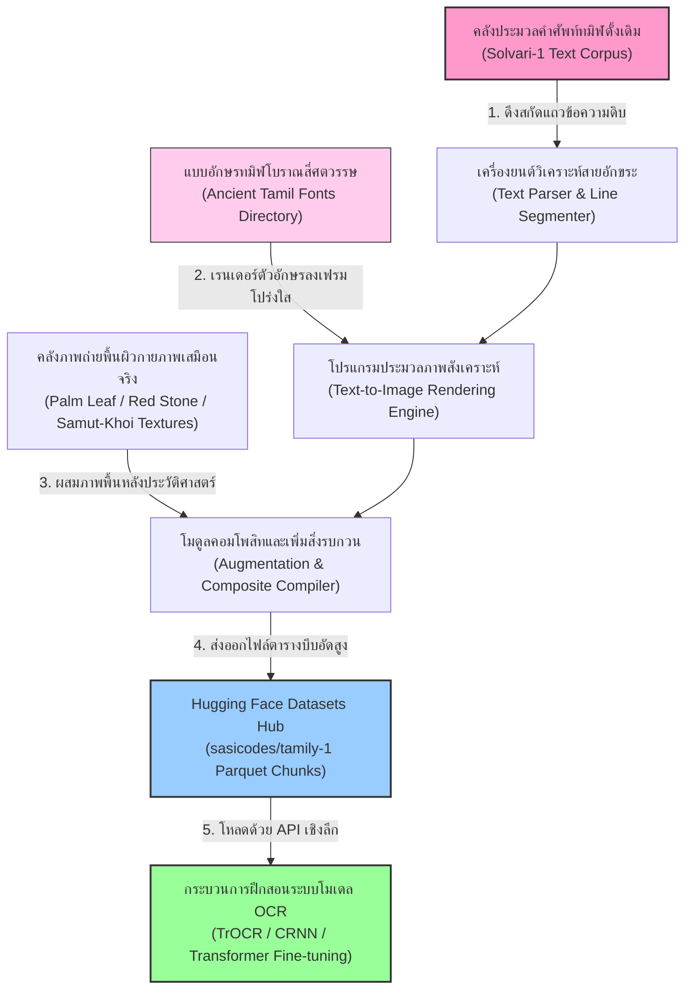
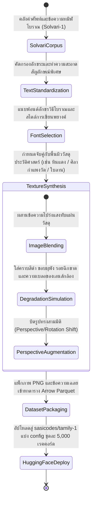
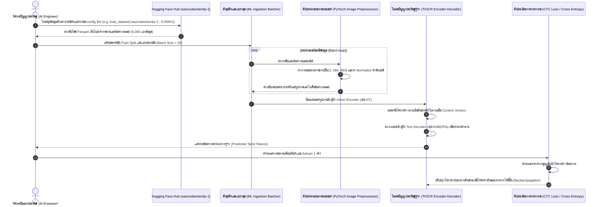

# รายงานการวิเคราะห์ระบบนิเวศและคลังข้อมูลมรดกทางภาษาและอักษร ฉบับที่ 010 (ฉบับสมบูรณ์)
> **รหัสชุดข้อมูล:** `sasicodes/tamily-1`  
> **โครงการต้นทาง:** โครงการประมวลภาพและสังเคราะห์อักษรทมิฬโบราณเชิงคำนวณ (Ancient Tamil OCR Synthetic Project)  
> **วิเคราะห์โดย:** Antigravity AI  
> **วันที่วิเคราะห์:** 31 พฤษภาคม 2026

---

## 1. ข้อมูลสรุปเชิงบริหาร (Executive Summary)

ชุดข้อมูล `sasicodes/tamily-1` เป็นคลังข้อมูลรูปภาพสังเคราะห์มวลขนาดใหญ่ (Large-Scale Synthetic Image Dataset) ระดับสูง ได้รับการออกแบบและพัฒนาขึ้นโดยนักพัฒนาอิสระและวิศวกรปัญญาประดิษฐ์ **Sasi (นามแฝงระบบ: sasicodes)** เพื่อปฏิวัติการฝึกฝนระบบรู้จำอักษรโบราณด้วยแสง (OCR) สำหรับ **อักษรทมิฬโบราณ (Ancient Tamil Script)** ซึ่งประสบปัญหาการขาดแคลนข้อมูลสำหรับสอนระบบ (Data Scarcity) ขั้นรุนแรง

หัวใจสำคัญในการสร้างชุดข้อมูลนี้คือเทคโนโลยี **การสังเคราะห์ข้อมูลภาพถ่ายเสมือนจริง (Synthetic Data Generation - SDG)** โดยผู้วิจัยได้นำคลังข้อความต้นฉบับภาษาทมิฬประวัติศาสตร์จากคลังประมวลคำศัพท์ **Solvari-1** จำนวน **200,000 แถวข้อความ** มาเรนเดอร์เป็นภาพตัวอักษรโบราณบนพื้นหลังวัสดุประวัติศาสตร์หลากหลายประเภท เช่น แผ่นใบลาน (Palm Leaf), แท่งศิลาจารึก (Stone Inscriptions), และกระดาษโบราณยุคแรกเริ่ม พร้อมทั้งจำลองสภาวะแวดล้อมทางฟิสิกส์เชิงลึก (เช่น รอยคราบน้ำ หมึกซึม แสงเบลอ และการหมุนพิกัดแบบสามมิติ) ชุดข้อมูลนี้เผยแพร่ภายใต้สัญญาอนุญาตสากลระดับเสรีสูงสุด **MIT License** และถือเป็นเทมเพลตทางวิศวกรรมที่มีความสำคัญสูงสุดสำหรับ **โครงการคลังข้อมูลเอกสารโบราณ (Ancient Manuscript Repository)** ในการนำเทคนิคการสร้างข้อมูลสังเคราะห์มาประยุกต์ใช้เพื่อฝึกโมเดลอ่านอักษรล้านนา ขอม และภาษาบาลีของไทยโดยไม่ต้องพึ่งพิงภาพถ่ายจริงที่มีอยู่อย่างจำกัด

---

## 2. ประวัติและข้อมูลพื้นฐานของโปรเจกต์ (Project Background & Metadata)

ชุดข้อมูลได้รับการลงทะเบียนบนคลังของ Hugging Face Hub โดยมีข้อมูลจำเพาะทางเทคนิคและวิศวกรรมข้อมูลดังต่อไปนี้:

| หัวข้อเมทาดาตา (Metadata Item) | รายละเอียดข้อมูล (Detail Value) |
| :--- | :--- |
| **ชื่อชุดข้อมูล (Dataset Name)** | `sasicodes/tamily-1` |
| **ลิงก์เข้าถึงระบบ (URL)** | [huggingface.co/datasets/sasicodes/tamily-1](https://huggingface.co/datasets/sasicodes/tamily-1) |
| **ผู้สร้าง/คณะผู้วิจัย (Creators)** | **Sasi** (ผู้พัฒนาอิสระและวิศวกร AI ชุมชนภาษาศาสตร์ทมิฬ @sasicodes) |
| **คลังข้อมูลอ้างอิงต้นทาง (Source Corpus)** | **Solvari-1** (ประมวลคลังข้อความภาษาทมิฬแบบดั้งเดิม) |
| **ขนาดชุดข้อมูล (Dataset Size)** | ขนาดใหญ่พิเศษ (**200,000 เรคคอร์ดภาพคู่ข้อความ**) จัดเก็บในรูปแบบตาราง Parquet แบ่งเป็นกลุ่มกลุ่มละ 5,000 เรคคอร์ด (เช่น Config: `0-5000` ไปจนถึง `195000-200000`) |
| **สัญญาอนุญาต (License)** | **MIT License** (อนุญาตให้ใช้งานเชิงวิชาการและการค้าได้อย่างเสรีและเปิดเผยโค้ด 100%) |
| **มาตรฐานข้อมูล (Data Standard)** | **Croissant 1.1** (สอดรับสคีมาการนำไปใช้ป้อนระบบดีปเลิร์นนิง) |
| **ชนิดและโมดัลข้อมูล (Data Type)** | สื่อผสมภาพคู่ข้อความ (Synthetic Image + Ground Truth Text) |

---

## 3. แผนผังระบบข้อมูลและโครงสร้างพื้นฐาน (Data Pipeline & Infrastructure)

สถาปัตยกรรมกระบวนการดึงข้อความจากคลังเนื้อหา การสังเคราะห์ภาพอักษรโบราณบนวัสดุต่าง ๆ และการนำเข้าสู่ขั้นตอนการประมวลผลระบบปัญญาประดิษฐ์ ปรากฏตามแผนผังโครงสร้างพื้นฐานต่อไปนี้:



---

## 4. ภูมิหลังทางประวัติศาสตร์และคุณค่าทางวิชาการของอักษรจารึก (Historical Significance)

ภาษาทมิฬ (Tamil) เป็นหนึ่งในภาษาคลาสสิกที่ยืนยาวที่สุดในประวัติศาสตร์ของมนุษยชาติ มีประวัติศาสตร์การเขียนและวรรณกรรมสืบย้อนไปได้มากกว่า 2,000 ปี (ยุค Sangam Literature) ซึ่งหลักฐานโบราณคดีปรากฏบนวัสดุที่หลากหลาย:

- **วิวัฒนาการอักขรวิธีทมิฬโบราณ (Evolution of Tamil Scripts):** อักษรทมิฬยุคแรกเริ่มมีพัฒนาการจากอักษรทมิฬ-บราหมี (Tamil-Brahmi) ก่อนจะคลี่คลายเข้าสู่อักษรวัตเตลุตตุ (Vatteluttu) และอักษรทมิฬปัจจุบัน ซึ่งมักปรากฏบนวัสดุต่างประเภทกัน
- **ความหลากหลายของวัสดุจารึกอ้างอิง:** 
  - **จารึกใบลาน (Palm Leaf Manuscripts / *Olei chuvadi*):** ใช้สำหรับการจดบันทึกตำราแพทย์ ดาราศาสตร์ และคัมภีร์ทางศาสนา
  - **ศิลาจารึกกำแพงวัด (Temple Stone Inscriptions / *Kalvettu*):** ปรากฏบนหินสีแดง (Red Stone) และหินสีขาว (White Stone) ซึ่งมักสลักข้อกฎหมาย คำประกาศพระบรมราชโองการ และการบริจาคที่ดินของกษัตริย์ในยุคราชวงศ์โจฬะ (Chola Dynasty)
- **คุณค่าของการสร้างข้อมูลจำลองแบบครอบคลุม:** ความล้ำค่าของชุดข้อมูลนี้คือการจำลองพื้นผิวจารึกทมิฬในทุกมิติ ทั้งรูปทรงลายเส้นที่มีมิติขรุขระของศิลาจารึก และลายจารที่คดเคี้ยวบนใบลาน การใช้ข้อมูลสังเคราะห์เสมือนจริงช่วยให้นักโบราณคดีและนักจักษุวิทยาคอมพิวเตอร์ (Computer Vision Scientists) สามารถก้าวข้ามขีดจำกัดเรื่องภาพถ่ายชำรุดจริง และช่วยฟื้นฟูระบบการอ่านจารึกตามวัดวาอารามโบราณได้อย่างไม่เคยมีมาก่อน

---

## 5. สเปกทางเทคนิคและสคีมาข้อมูลเชิงลึก (In-depth Technical Dataset Schema)

ชุดข้อมูลได้รับการจำแนกออกเป็นพาร์ติชันย่อย Config ละ 5,000 เรคคอร์ดเพื่อป้องกันปัญหาหน่วยความจำล้นระหว่างเรียกใช้งาน โดยมีสคีมาตารางข้อมูล Parquet ดังนี้:

### 5.1 โครงสร้างฟิลด์ข้อมูล (Data Schema Table)

| ชื่อฟิลด์ (Field Name) | รูปแบบข้อมูล (Data Type) | หน้าที่และคำอธิบายข้อมูล (Function & Description) |
| :--- | :--- | :--- |
| `split` | `Text` | การระบุหน้าที่คลังย่อย (ข้อมูลทั้งหมดเก็บเป็นพาร์ติชันฝึกสอน `train`) |
| `image` | `ImageObject` | ออบเจกต์ภาพถ่ายสังเคราะห์ (PNG) ของแถวข้อความทมิฬโบราณที่ถูกเรนเดอร์ลงวัสดุต่าง ๆ |
| `text` | `Text` | ข้อความ Ground Truth ภาษาทมิฬจริงที่ตรงกับรูปภาพ |

### 5.2 ตัวอย่างเรคคอร์ดข้อมูลจำลองเชิงประยุกต์ (Sample JSON Representation)

ตัวอย่างด้านล่างแสดงโครงสร้างที่ผ่านกระบวนการคัดกรองข้อมูลของระบบ ซึ่งจำลองพารามิเตอร์การสังเคราะห์ภาพของอักขระทมิฬเพื่อส่งป้อนระบบ AI:

```json
{
  "split": "train",
  "image": {
    "bytes": "iVBORw0KGgoAAAANSUhEUgAAADIAAAASCAYAAAAe... [ตัวอย่างไบนารีเข้ารหัสฐาน 64 ของภาพสังเคราะห์พื้นผิวใบลาน]"
  },
  "text": "தமிழ்நாட்டின் வரலாற்றுச் சிறப்புமிக்க கோயில்கள்",
  "metadata": {
    "source_sentence_id": "solvari_line_99482",
    "rendering_engine_parameters": {
      "substrate_material": "Pale Palm Leaf (ใบลานเก่าซีด)",
      "background_noise_level": "heavy_with_scratches_and_stains",
      "font_style": "Ancient Vatteluttu (อักษรวัตเตลุตตุโบราณ)",
      "geometrical_augmentations": {
        "tilt_degree": -3.5,
        "perspective_warp": "perspective_downward_left",
        "dpi": 300
      },
      "optical_distortions": {
        "gaussian_blur_radius": 1.2,
        "ink_bleeding_coeff": 0.45,
        "contrast_stretch": 0.85
      }
    }
  }
}
```

---

## 6. เวิร์กโฟลว์วงจรชีวิตข้อมูลและการสังเคราะห์แบบจำลองภาพ (SDG Lifecycle Workflow)

ขั้นตอนอันประณีตของการสกัดคำศัพท์ภาษาโบราณ การเรนเดอร์ภาพตัวอักษร การสร้างแผนผังพิกเซลบนพื้นผิว และการอัปโหลดขึ้นสู่ Hugging Face ปรากฏขั้นตอนเวิร์กโฟลว์สถานะดังนี้:



---

## 7. เทคโนโลยีการสร้างภาพจำลองขั้นสูงและการรู้จำ (Advanced Data Engineering Concepts)

ชุดข้อมูล `tamily-1` แสดงให้เห็นถึงนวัตกรรมและประโยชน์เชิงวิศวกรรมข้อมูลระดับสูง:

- **การก้าวข้ามปัญหาข้อมูลเบาบางด้วยข้อมูลสังเคราะห์ (Synthetic Data to Rescue):** งานประมวลผลเอกสารโบราณมักประสบปัญหาคือหอสมุดมักไม่อนุญาตให้นำคัมภีร์จริงจำนวนมากมาถ่ายภาพ หรือไม่มีผู้เชี่ยวชาญแปลเฉลยมากพอ การใช้ระบบเรนเดอร์ภาพสังเคราะห์ช่วยสร้างคลังข้อมูลขนาดใหญ่ได้ตามต้องการในราคาประหยัดและรวดเร็ว
- **การสุ่มโดเมนภาพถ่ายเพื่อความทนทานของโมเดล (Domain Randomization):** การสอนโมเดลปัญญาประดิษฐ์ด้วยภาพที่มีพื้นหลังผันผวนสูง (เช่น หินศิลาขรุขระ ใบลานมีเส้นไฟเบอร์ และกระดาษมีคราบเหลือง) ช่วยบังคับให้ปัญญาประดิษฐ์เรียนรู้ที่จะเมินเฉย (Ignore) ต่อลักษณะสัญญาณรบกวนของพื้นหลัง และหันมาโฟกัสเฉพาะความหนาและแนวเส้นขอบอักษร ส่งผลให้โมเดลมีความทนทาน (Robustness) เมื่อนำไปใช้ตรวจจับภาพคัมภีร์โบราณเล่มจริงที่มักชำรุดสูง
- **การวิจัยการอ่านแบบ Sequence-to-Sequence (OCR Sequence Training):** ภาพถ่ายระดับเส้นบรรทัดและคำช่วยให้วิศวกรปัญญาประดิษฐ์ป้อนข้อมูลเทรนโมเดลประเภทโมเดลภาษาสื่อผสมอเนกประสงค์ (Vision-Language Models) เพื่อเรียนรู้อักษรเขียนแบบคำต่อคำได้อย่างแม่นยำ

---

## 8. แผนผังขั้นตอนการประมวลผลเข้าระบบปัญญาประดิษฐ์ (ML Ingestion Sequence)

ขั้นตอนเทคโนโลยีการใช้ประโยชน์จากภาพสังเคราะห์อักษรทมิฬโบราณเพื่อเตรียมสกัดแปลงคุณลักษณะพิกเซลและป้อนเทรนแบบจำลองปัญญาประดิษฐ์ ปรากฏตามแผนผัง Sequence ต่อไปนี้:



---

## 9. บทวิเคราะห์เชิงประจักษ์: จุดเด่น ข้อจำกัด และคำแนะนำ (Strategic Dataset Evaluation)

### จุดเด่นเชิงวิศวกรรมข้อมูล (Pros)
- **มิติข้อมูลมหาศาลขจัดปัญหาโมเดล Overfit (Massive Scale):** การมีภาพอักษรจารึกโบราณถึง 200,000 แถว ซึ่งไม่มีข้อจำกัดทางกฎหมายลิขสิทธิ์ (MIT License) ปลดล็อกอุปสรรคในการฝึกฝนโมเดล OCR ขนาดใหญ่ให้เรียนรู้อักษรโบราณได้อย่างลึกซึ้ง
- **จำลองสภาวะแวดล้อมได้ครอบคลุม (Substrate Diversity):** พื้นหลังแบบใบลานและศิลาจารึกสีต่าง ๆ เป็นข้อมูลที่มีคุณค่าสูงและหายาก ช่วยลดขีดจำกัดของการฝึกฝนโมเดลเมื่อต้องนำไปประยุกต์ใช้งานในพิพิธภัณฑ์และโบราณสถานจริง
- **การเก็บรูปแบบย่อยแบบจำกัดขอบเขต:** การแบ่ง Config ชุดละ 5,000 ข้อมูลช่วยอำนวยความสะดวกในการจัดสรรแรมของคอมพิวเตอร์ ทำให้นักวิจัยที่มีทรัพยากรฮาร์ดแวร์จำกัดสามารถเลือกโหลดเฉพาะช่วงข้อมูลไปศึกษาทดลองได้ง่าย

### ข้อจำกัดที่พึงระวัง (Cons & Constraints)
- **ช่องว่างความต่างของภาพจริงและภาพสังเคราะห์ (Reality Gap):** ภาพที่เรนเดอร์ขึ้นด้วยโปรแกรม (เช่น การบิดหมุนสามมิติและรอยเปื้อนจำลอง) อาจมีความสม่ำเสมอเชิงพิกเซลที่สมบูรณ์แบบเกินไป ซึ่งในความเป็นจริง ลายมือจารของมนุษย์จริงบนใบลานจะมีความไม่สม่ำเสมอของความลึกในการกดเหล็กจาร แรงกดมือ และการบิดเบี้ยวของตัวอักษรที่เป็นเอกลักษณ์เฉพาะคน ทำให้โมเดลที่เรียนรู้เฉพาะภาพสังเคราะห์อาจอ่านใบลานจริงผิดพลาดได้ หากไม่ได้รับการจูนด้วยข้อมูลภาพถ่ายจริงเพิ่มเติม
- **ความซับซ้อนของอักขรวิธีภาษานิเวศอินเดียใต้:** อักษรทมิฬโบราณมีโครงสร้างเชิงภาษาถิ่นและไวยากรณ์สัทวิทยาอินเดียใต้ที่เป็นระบบเฉพาะตัว (Dravidian Linguistics) ไม่สามารถแปลงถ่ายทอดไปสู่อักขรวิธีขอม ล้านนา หรือบาลีของไทยได้โดยตรงเชิงตัวอักษร (แต่สามารถถ่ายทอดเชิง "เทคโนโลยีการสังเคราะห์ภาพ" ได้ดีเลิศ)
- **ขนาดไฟล์ Parquet Chunks รวมค่อนข้างใหญ่:** การเก็บข้อมูลระดับ 200,000 ภาพพร้อมกันจำเป็นต้องใช้แบนด์วิธอินเทอร์เน็ตและความจุพื้นที่จัดเก็บฮาร์ดดิสก์สูงมาก วิศวกรจำเป็นต้องจัดการทรัพยากรเก็บข้อมูลสำรองไว้ล่วงหน้า

### โอกาสในการพัฒนาขยายผลเพื่อคลังข้อมูลเอกสารโบราณ (Strategic Actionable Recommendations)

> [!IMPORTANT]
> **1. การสร้างเครื่องมือสังเคราะห์ภาพใบลานไทยและล้านนา (Thai/Lanna Manuscript Synthetic Engine):**  
> ปัญหาใหญ่ที่สุดของ **คลังข้อมูลเอกสารโบราณ** ของท่านในขณะนี้ คือการมีตัวอย่างใบลานต้นฉบับจริงในระบบคลัง `ancient_texts.db` และดัชนีสืบค้น `search_index.db` ที่ผ่านการถอดความแล้วในปริมาณที่ยังจำกัด ทำให้ขาดแคลนข้อมูลสำหรับเทรนระบบ OCR ภาษาล้านนาและบาลีขอม  
> **แนวทางปฏิบัติเชิงกลยุทธ์:** ท่านควรนำสถาปัตยกรรม SDG ของ `tamily-1` มาปรับใช้ โดยเขียนสคริปต์ Python ร่วมกับไลบรารีจัดการภาพ (เช่น PIL หรือ OpenCV) เพื่อทำ **"เครื่องเรนเดอร์ภาพใบลานล้านนาสังเคราะห์"** นำประโยคข้อความคัมภีร์ธรรมล้านนาปัจจุบันจากระบบฐานข้อมูลมาเรนเดอร์ด้วยแบบอักษรล้านนาโบราณ ลงทับรูปถ่ายพื้นหลังใบไม้ลานเปล่าและกระดาษสาเปล่าที่ไม่มีตัวอักษร จากนั้นใส่คราบเปื้อนจำลอง รอยฉีกขาด และความเอียง วิธีนี้จะทำให้ท่านได้ชุดข้อมูลฝึกสอน OCR ล้านนาขนาด 100,000 ประโยคได้ภายในเวลา 1 วันโดยไม่ต้องออกไปสแกนและจ้างคนแปลใบลานเล่มจริงเพิ่ม

> [!TIP]
> **2. การผสานระบบ RAG และดัชนีคำค้นสื่อผสมในแอปพลิเคชัน UI (Multimodal Semantic Search Integration):**  
> การเรียนรู้เทคนิค Domain Randomization จาก `tamily-1` ช่วยการันตีความทนทานของโมเดลเมื่อนำมาใช้ประมวลผล  
> **แนวทางการนำไปใช้งานในโค้ดของท่าน:** ในแอปพลิเคชันหลัก `app_ui.py` และเครื่องสืบค้น `search_engine.py` ท่านสามารถนำภาพใบลานจริงที่สแกนเข้ามาใหม่ส่งผ่านโมเดลปัญญาประดิษฐ์ที่พัฒนาจากเทคนิคข้อมูลสังเคราะห์นี้ เพื่อสกัดตัวอักษรใบลานออกมาเป็นข้อความอักษรเมืองโดยอัตโนมัติ จากนั้นนำข้อความนั้นส่งต่อเข้าสู่ระบบดัชนีประมวล RAG (Retrieval-Augmented Generation) วิธีนี้จะช่วยให้ผู้ใช้งานสามารถถ่ายภาพใบลานจริงผ่านหน้าแอป UI แล้วระบบสืบค้นสามารถดึงบทแปลประวัติศาสตร์และวรรณคดีที่ตรงกันขึ้นมาแสดงผลได้ทันทีอย่างชาญฉลาด

---
