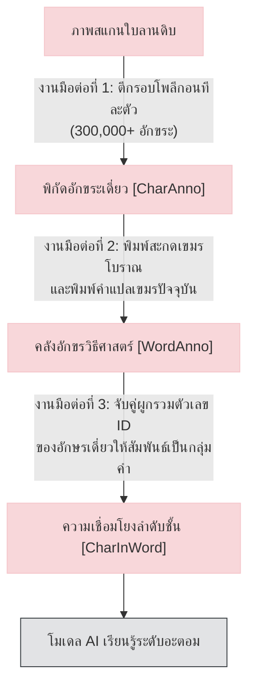
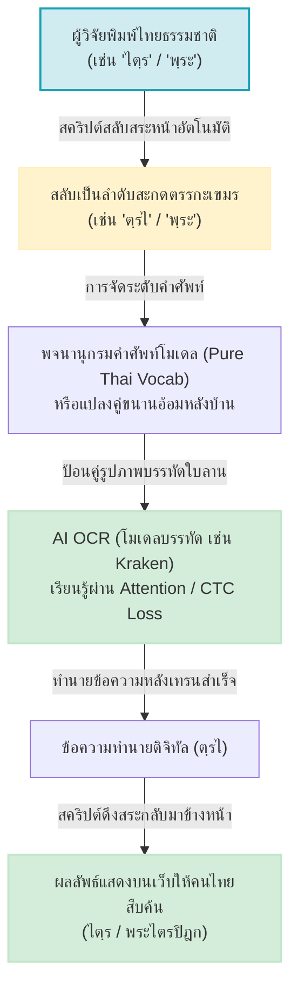

# รายงานการวิเคราะห์ยุทธศาสตร์การปริวรรตและการกำกับข้อมูลอักษรจารเอกสารโบราณเชิงเปรียบเทียบ ฉบับที่ 011
> **หัวข้อการวิจัย:** ยุทธศาสตร์การประเมินสถาปัตยกรรมระบบบันทึกและการรู้จำอักษรจารใบลานขอมโบราณ  
> **โครงการปลายทาง:** โครงการพัฒนาคลังข้อมูลเอกสารโบราณ (Ancient Manuscript Archive)  
> **วิเคราะห์โดย:** Antigravity AI ร่วมกับผู้บริหารโครงการวิจัยจารึกวิทยาเชิงดิจิทัล  
> **วันที่จัดทำ:** 1 มิถุนายน 2026

---

## 1. บทสรุปผู้บริหาร (Executive Summary)

ความก้าวหน้าทางวิศวกรรมปัญญาประดิษฐ์และคอมพิวเตอร์วิทัศน์ (Computer Vision) ได้เปลี่ยนผ่านกระบวนการแปลงเอกสารจารึกทางโบราณคดีกายภาพสู่คลังข้อมูลดิจิทัลไปอย่างสิ้นเชิง รายงานฉบับนี้จัดทำขึ้นเพื่อประเมิน สรุปผล และวางกรอบยุทธศาสตร์เชิงนโยบายด้าน **"สถาปัตยกรรมการกำกับข้อมูลและการถอดคำอ่าน (Transcription Strategy)"** จากการหารือเชิงลึกร่วมกันระหว่างผู้บริหารโครงการและ Antigravity AI

ผลการวิเคราะห์ชี้ชัดว่า แนวคิดดั้งเดิมของโครงการต้นแบบในอดีตอย่าง **SleukRith Set** (2016-2017) ที่เน้นการกำกับพิกัดโพลีกอนระดับอักขระเดี่ยว (Character-Atomic) นั้น **เป็นสถาปัตยกรรมข้อมูลที่สิ้นเปลืองงบประมาณและเวลาทำงานของมนุษย์สูงมากในทางปฏิบัติ** ปัจจุบันเทคโนโลยีได้เปลี่ยนไปสู่ **ระบบการฝึกสอนระดับแนวบรรทัด (Line-based Sequence-to-Sequence)** เช่น ระบบของ **Kraken** หรือ **Transformers** ซึ่งช่วยประหยัดเวลาการทำชุดข้อมูลลงได้ 50-100 เท่า โดยยังคงขีดความสามารถในการสืบค้น ค้นหาอักษรเดี่ยว และทำไฮไลต์พิกัดบนรูปภาพได้เท่าเทียมกันผ่านระบบแผนผังความใส่ใจของปัญญาประดิษฐ์ (Attention Maps)

นอกจากนี้ รายงานฉบับนี้ยังได้ข้อสรุปเชิงยุทธศาสตร์ที่สำคัญยิ่งในการปฏิเสธการใช้อักษรเขมรในฐานข้อมูลป้อนเข้า โดยหันมาใช้ **"ระบบท่อส่งภาษาไทยปริวรรต 100% (Pure Thai Pipeline)"** ที่พัฒนาขึ้นจากไอเดียของผู้วิจัย ซึ่งไม่เพียงแต่ช่วยเพิ่มความเร็วและสอดคล้องกับทักษะการทำงานของคนไทยเท่านั้น แต่ยังสะท้อน **"รูปธรรมตามจริงของประวัติศาสตร์จารึก (Visual Diplomatic Order)"** ได้ดีกว่าระบบ Unicode เขมรมาตรฐานสากลอีกด้วย

---

## 2. แผนผังเปรียบเทียบสถาปัตยกรรมข้อมูลและเวิร์กโฟลว์

เพื่อสร้างความเข้าใจที่ชัดเจนเชิงวิศวกรรมข้อมูล แผนผังด้านล่างแสดงความแตกต่างระหว่างสถาปัตยกรรมการทำงานแบบเก่าที่เน้นมนุษย์ทำงานทุกชั้น กับสถาปัตยกรรมระบบใหม่ที่มนุษย์ทำงานชั้นเดียวแล้วปล่อยให้คอมพิวเตอร์จัดการด้านข้อมูลแบบอัตโนมัติ:

### 2.1 สถาปัตยกรรมระบบแบบดั้งเดิม (SleukRith Set Character-Atomic Paradigm)
ในระบบเดิม มนุษย์ต้องเหนื่อยล้าในการทำงาน 3 ต่อแบบแมนนวลอย่างหลีกเลี่ยงไม่ได้:



### 2.2 สถาปัตยกรรมระบบใหม่แบบท่อส่งไทย 100% (Pure Thai Pipeline with Auto-Reordering)
ในระบบที่นำเสนอใหม่ มนุษย์จะทำหน้าที่เพียงตีกรอบระดับบรรทัดและพิมพ์ข้อความภาษาไทยปกติ จากนั้นตัวควบคุมอัจฉริยะ (Smart Preprocessor/Vocabulary Mapper) จะจัดการเรียงลำดับสะกดและส่งให้ AI เรียนรู้แบบ End-to-End:



---

## 3. ตารางเปรียบเทียบเชิงลึก: ระดับอักขระเดี่ยว VS ระดับบรรทัด

ตารางวิเคราะห์ความแตกต่างเชิงลึกในมิติต่าง ๆ ระหว่างแนวทางดั้งเดิมของ SleukRith Set และแนวทางสมัยใหม่ของ Kraken/Line-Based OCR:

| มิติการเปรียบเทียบ | แนวทางดั้งเดิม (SleukRith Character-Atomic) | แนวทางสมัยใหม่ (Line-Based / Kraken Style) |
| :--- | :--- | :--- |
| **ต้นทุนแรงงาน (Labor Cost)** | **สูงอย่างวิกฤต (Extremely High)**<br>เฉลี่ย 15-20 นาทีต่อหน้าใบลาน ในการล้อมจุดโพลีกอนตัวอักษรย่อยทีละตัวจนครบหน้า | **ต่ำและเป็นไปได้จริง (Highly Efficient)**<br>เฉลี่ย 10-20 วินาทีต่อบรรทัด (ประมาณ 1.5-2 นาทีต่อหน้า) ในการลากกรอบคลุมบรรทัดและพิมพ์เฉลย |
| **ความจุข้อมูลเทียบเวลา** | ในเวลา 30 ชม. มนุษย์ทำข้อมูลได้เพียง ~500 อักษรเดี่ยว ซึ่งไม่เพียงพอต่อการสอนโครงข่ายประสาทดีปเลิร์นนิง | ในเวลา 30 ชม. มนุษย์ทำข้อมูลได้ถึง ~10,000 บรรทัด ซึ่งทำให้ AI generalize ทักษะการจดจำลายมือได้ดีเยี่ยม |
| **การจัดการสระ-พยัญชนะซ้อนทับ** | ดีมากระดับพิกเซล เพราะมนุษย์วาดแยกชิ้นส่วนรูปทรง แต่เสี่ยงต่อการหลุดออกจากกันเชิงตรรกะคำ | ดีเยี่ยมผ่านการประมวลผลข้อความต่อเนื่อง โมเดลเรียนรู้การซ้อนทับกันเชิงภาพของสระและพยัญชนะเชิงได้เองโดยธรรมชาติ |
| **ขีดความสามารถการสืบค้น (Search Ability)** | ค้นหาเจาะลึกได้ในระดับอักขระเดี่ยว แต่ต้องเขียนคำค้นหาและดัชนีฐานข้อมูลที่ซับซ้อนมาก | ค้นหาได้ง่ายและยืดหยุ่นมากระดับ Unicode String (สามารถค้นหาอักษรเดี่ยว, คำย่อย, หรือข้อความบางส่วนได้ทันที) |
| **การระบุพิกัดตำแหน่งเพื่อไฮไลต์** | มนุษย์ระบุไว้ตายตัวตั้งแต่แรก ทำให้แสดงภาพสีโพลีกอนได้คมชัด แต่อาจเกิดปัญหาหากลายมือจารเปลี่ยนสไตล์ | AI ทำหน้าที่หาตำแหน่งให้เองโดยอัตโนมัติผ่าน **Attention Maps** โดยส่งออกจุดที่โมเดล "จ้องมอง" เพื่อไฮไลต์บนภาพได้ |

---

## 4. ข้อถกเถียงเชิงปรัชญาภาษาศาสตร์: Visual Order ปะทะ Logical Order

ประเด็นที่น่าทึ่งที่สุดจากการทบทวนร่วมกันคือ **"ลำดับการสะกดและพิมพ์ตัวอักษรระหว่างคีย์บอร์ดไทยและมาตรฐาน Unicode เขมร"** ซึ่งผู้วิจัยได้เสนอข้อสังเกตระดับทองคำว่า **ระบบการพิมพ์ของไทยนั้นสอดคล้องและสะท้อนความจริงตามกายภาพใบลาน (Visual Diplomatic Order) ได้ดีกว่าเขมร**:

### 4.1 ตารางวิเคราะห์เชิงเปรียบเทียบการสะกดคำว่า `ไตฺร` (สระไอ + ตอ + พินทุตัวห้อย + รอ)

```
[ภาพใบลานจริง] ──>  สระไอ (ไ)  ──>  พยัญชนะต้น (ต)  ──>  ตัวห้อยควบกล้ำ (ร)
```

| เกณฑ์เปรียบเทียบ | มาตรฐานการพิมพ์อักษรไทย (Visual Order) | มาตรฐาน Unicode เขมร (Logical Order) |
| :--- | :---: | :---: |
| **ลำดับการพิมพ์คีย์บอร์ด** | **`ไ` $\rightarrow$ `ต` $\rightarrow$ `ฺ` $\rightarrow$ `ร` (`ไตฺร`)** | **`ต` $\rightarrow$ `เครื่องหมายห้อย` $\rightarrow$ `ร` $\rightarrow$ `ไ` (`ตฺรไ`)** |
| **ความสอดคล้องกับภาพใบลาน** | **สอดคล้อง 100%** <br> ลำดับนิ้วพิมพ์จากซ้ายไปขวาตรงตามสิ่งที่ดวงตามองเห็นบนจารึกจริง | **ไม่สอดคล้องเชิงกายภาพ** <br> ผู้พิมพ์ต้องสลับสมอง นำสระไอที่เขียนอยู่ซ้ายสุดไปกดพิมพ์ไว้ด้านหลังสุด |
| **การบันทึกรูปสัจจะจารึก** | **ทำได้ยอดเยี่ยม** <br> เก็บโครงสร้างการลากเส้นจารของอาลักษณ์โบราณไว้ได้อย่างซื่อตรงที่สุด | **เน้นตรรกะภาษาคอมพิวเตอร์** <br> สนับสนุนการประมวลผลเสียงพูดและการเรียงคำศัพท์ แต่สูญเสียความจริงเชิงวัตถุโบราณ |

> [!TIP]
> **การบูรณาการระบบควบคุมตัวเชิง (Virama / Co-consonant Control Sign):**  
> ข้อสังเกตเชิงลึกชี้ว่า รหัสตัวควบคุมสร้างตัวเชิงในระบบ Unicode เขมร คือ **`U+17D2` (เครื่องหมาย ្)** นั้น ทำหน้าที่เหมือนกับ **เครื่องหมายพินทุของไทย `U+0E3A` (เครื่องหมาย ฺ)** ทุกประการในแง่ของสากลจารึกวิทยาระบบบาลี-สันสกฤต  
> ดังนั้น การที่ผู้วิจัยเลือกใช้แป้นพิมพ์ไทยที่มีเครื่องหมายพินทุในการกำกับตัวเชิง (เช่น พฺร, ตฺร) จึงไม่ทำให้ข้อมูลสูญเสียความละเอียดอ่อนทางภาษาศาสตร์ และยังคงรักษาความถูกต้องได้สมบูรณ์แบบเช่นเดิม

---

## 5. การวิเคราะห์กลยุทธ์เชิงวิศวกรรม: ทางเลือกในการเทรนโมเดล

เพื่อนำไอเดีย "พิมพ์อักษรไทยล้วน" ไปปฏิบัติงานจริง เราสามารถเลือกทิศทางการเดินทางเชิงวิศวกรรมปัญญาประดิษฐ์ได้ 2 เส้นทางหลัก ซึ่งมีข้อดีและข้อเสียต่างกันดังนี้:

### 🟢 ทางเลือกที่ A: ระบบท่อส่งภาษาไทย 100% (Pure Thai Pipeline)
เป็นแนวทางที่ผู้บริหารโครงการและ AI เห็นตรงกันว่า **"มีประสิทธิภาพ คลีน และเรียบง่ายที่สุดสำหรับทีมคนไทย"** โดยจะใช้ข้อมูลเฉลยเป็นภาษาไทยและเทรนตรง ๆ
*   **ข้อดี:** 
    *   ไม่มีปัญหาเรื่องระบบแปลงรหัสหลังบ้านที่อาจมีบั๊กหรือแปลงผิดพลาด
    *   ฐานข้อมูลระบบ RAG ค้นหาข้อมูลได้ง่ายมากด้วยภาษาไทย
    *   หากต้องการใช้ Pre-trained Model ของ SleukRith Set ที่เทรนเขมรมาแล้ว นักพัฒนาเพียงแค่ไปปรับแก้ไข **ไฟล์พจนานุกรมโมเดล (Tokenizer Vocabulary Mapping)** ในระดับของ PyTorch แค่บรรทัดเดียว โดยผูกรหัสเขมรย้อนกลับมาที่พยัญชนะไทยที่สอดคล้องกัน (เช่น U+1780 -> U+0E01) โดยที่ผู้ใช้งานไม่ต้องสลับตัวสะกดเลย
*   **ข้อเสีย:** ต้องมีการสลับสระหน้าอัตโนมัติด้วยคำสั่งสั้น ๆ ในขั้นตอน Preprocess/Postprocess เพื่อจัดรูปแบบตัวสระหน้าให้อยู่ถูกที่ตามตรรกะภาพของจารึก

### 🟡 ทางเลือกที่ B: ระบบท่อส่งแปลงเขมรย้อนกลับ (Khmer-aligned Pipeline)
พิมพ์ไทยธรรมชาติ $\rightarrow$ รันสคริปต์สลับลำดับแปลงเป็น Unicode เขมร $\rightarrow$ เทรนโมเดล AI OCR เขมร $\rightarrow$ ทำนายผลเขมร $\rightarrow$ สคริปต์สลับสระแปลงกลับเป็นไทยแสดงผลเว็บ
*   **ข้อดี:** สามารถสวมรอยใช้โมเดลดีปเลิร์นนิงและการคำนวณ Contours จากกัมพูชา/ฝรั่งเศสได้โดยตรงโดยไม่ต้องสับเปลี่ยนรหัสภายในโครงสร้างโครงข่ายประสาท
*   **ข้อเสีย:** ต้องบำรุงรักษาตัวแปลงไป-กลับสองทอด เพิ่มความเสี่ยงข้อมูลสูญหายหรือเพี้ยนในบางคำศัพท์ที่ผันสัญญะไม่สอดคล้องกัน 100%

---

## 6. แนวทางปฏิบัติงานและขั้นตอนการพัฒนาขั้นต่อไป

เพื่อให้โครงการ **คลังข้อมูลเอกสารโบราณ (Ancient Manuscript Archive)** ขับเคลื่อนงานจารึกวิทยาเชิงดิจิทัลอย่างชาญฉลาดและรวดเร็ว ขอแนะนำแนวทางปฏิบัติดังนี้:

1.  **การยุติการกำกับข้อมูลระดับตัวอักษรเดี่ยวด้วยมือ:**  
    ให้ยุติการพยายามตีกรอบล้อมรอบตัวอักษรทีละตัวในหน้าคัมภีร์ใบลานทั้งหมด เนื่องจากมีต้นทุนชั่วโมงทำงานสูงเกินไปและคอขวดในตัวบุคคล ให้หันมาใช้ระบบ **"ลากกล่องระดับแนวยาวของบรรทัด (Line Bounding Box)"** ร่วมกับซอฟต์แวร์กำกับพิกัดยุคใหม่เพื่อความเร็วที่เพิ่มขึ้น 50 เท่า
2.  **การติดตั้งระบบพิมพ์เฉลยอักษรไทยอัจฉริยะ (Smart Thai Visual Transcription):**  
    อนุญาตให้ผู้เชี่ยวชาญพิมพ์เฉลยใบลานขอมโบราณด้วยแป้นพิมพ์ไทยปกติตามจักษุประสาทที่ตาเห็นจากซ้ายไปขวา (เช่น พิมพ์ `ไตฺร` หรือ `พฺระ`) และเรียกใช้โปรแกรมสลับสระหน้าอัตโนมัติ (Visual-to-Logical Reordering) ในหลังบ้านก่อนป้อนเข้าสู้ตัวเทรนของโมเดล Kraken/TrOCR
3.  **การเก็บโครงสร้างข้อมูลแบบ 2 บรรทัดคู่ขนานในฐานข้อมูล `ancient_texts.db`:**  
    *   **บรรทัดที่ 1: คำปริวรรตตรงรูปจาร (Diplomatic Transliteration)** เช่น `พฺระมหากฺษตฺร` (ตรงตามอักษรจารจริงของใบลาน ไม่มีสระอิ สระลอย หรือตัวการันต์ที่ไม่มีจริงในต้นฉบับโบราณ) บรรทัดนี้จะสอดคล้องกับพิกัด Attention Map บนภาพถ่ายใบลาน
    *   **บรรทัดที่ 2: คำอ่านสมัยปัจจุบัน (Normalized Transcription)** เช่น `พระมหากษัตริย์` เพื่ออำนวยความสะดวกในการให้บุคคลทั่วไปสามารถค้นพบวรรณกรรมหรือพระไตรปิฎกฉบับดังกล่าวได้ทันทีผ่านแป้นพิมพ์คอมพิวเตอร์ทั่วไป

---
> [!IMPORTANT]
> **การประสานมรดกวัฒนธรรมด้วยเทคโนโลยี:**  
> ยุทธศาสตร์นี้พิสูจน์แล้วว่า การพัฒนาปัญญาประดิษฐ์ไม่ได้ทำลายมิติของมนุษยศาสตร์จารึกวิทยาลงไปเลย แต่กลับส่งเสริมให้ความคุ้นเคย ทักษะ และ muscle memory ของนักวิชาการไทยสามารถทำภารกิจอนุรักษ์จารึกโบราณได้อย่างลื่นไหล รวดเร็ว และแม่นยำที่สุดท่ามกลางระบบดิจิทัลสากล

---
**ดาวน์โหลดซอฟต์แวร์วิเคราะห์พิกัดร่วมคัมภีร์ใบลานเวอร์ชันอัปเดตแกนพิกัดเรียบร้อยแล้วที่:**  
👉 **[sleukrith_visualizer.html](file:///d:/01_APP/Research/sleukrith_visualizer.html)** (พร้อมระบบ Fit-to-Width และระบบแสดงกรอบสีส้ม-เขียวเชื่อมโยงอักขระและคำในเครื่องของท่านทันที)
