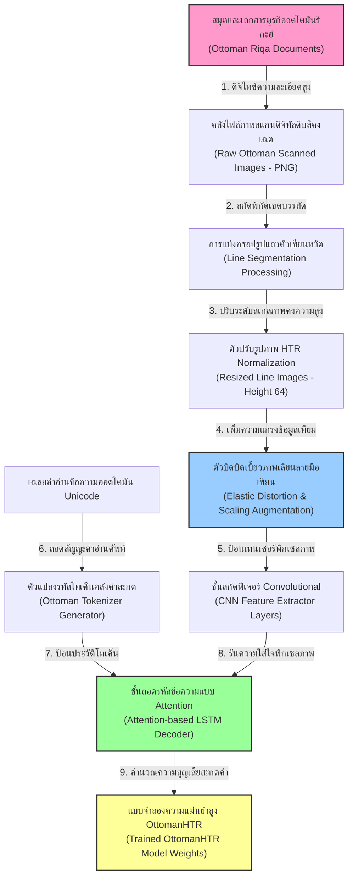
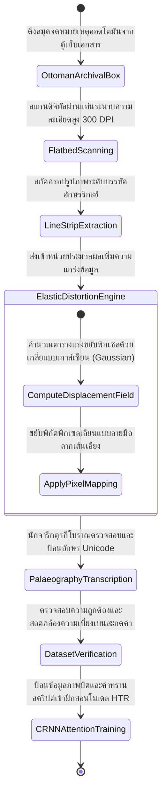
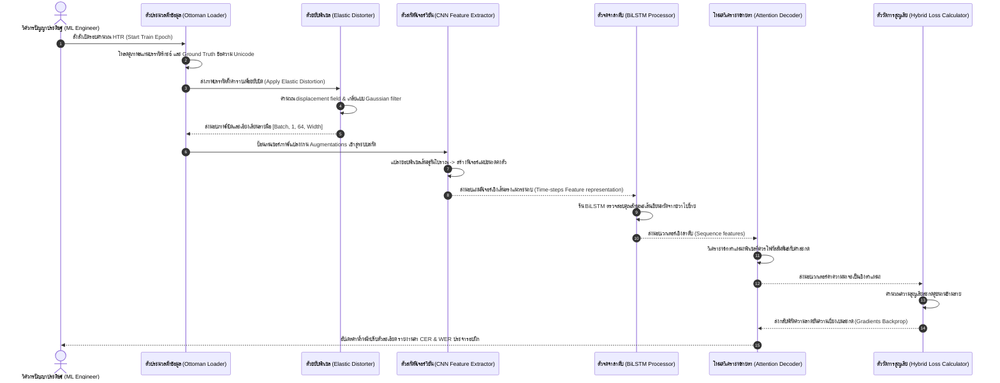

# รายงานการวิเคราะห์ระบบ HTR เอกสารโบราณ ฉบับที่ 020 (ฉบับแก้ไขปรับปรุง)
> **รหัสชุดข้อมูล/โปรเจกต์:** `ottoman-riqa-htr` (2025)  
> **ประเภทเอกสาร:** รายงานเชิงเทคนิคระดับสูงสำหรับการประยุกต์ใช้งานจริง (Technical Premium Report)  
> **วิเคราะห์โดย:** Antigravity AI (Gemini 3.5 Flash - High)  
> **วันที่วิเคราะห์:** 1 มิถุนายน 2026

---

## 1. ข้อมูลสรุปเชิงบริหาร (Executive Summary)

รายงานวิเคราะห์เชิงลึกฉบับแก้ไขปรับปรุงนี้ มุ่งศึกษาโครงสร้างทางเทคโนโลยีของโครงการ **การรู้จำสัญญะตัวอักษรจารึกออตโตมัน-ริกะฮ์ด้วยโมเดลดีปเลิร์นนิง (OttomanHTR: Recognition of the Ottoman Riqa Font Using Deep Learning Models)** ซึ่งเผยแพร่และนำเสนอเชิงวิชาการอย่างเป็นทางการในปี 2025 โดยทีมนักวิจัย I. Dolek และ A. Kurt ผ่านการจดบันทึกเอกสารดรรชนีสากล IEEE โครงการนี้ถือเป็นความก้าวหน้าครั้งสำคัญในการกู้คืนองค์ความรู้ของจักรวรรดิออตโตมัน (Ottoman Empire) ซึ่งเขียนจารึกด้วยภาษาตุรกีออตโตมัน (Ottoman-Turkish)

ความท้าทายหลักที่ได้รับการแก้ไขในโครงการนี้คือ คุณลักษณะเชิงกายภาพที่ซับซ้อนของลายมือเขียนแบบ **ริกะฮ์ (Riqa script)** ซึ่งมีการละทิ้งจุดสัญญะ (Dots omission) การลากเส้นเชื่อมอย่างอิสระ (cursive ligatures) และการเขียนเอียงลาดข้ามบรรทัด โครงการนี้โดดเด่นด้วยการประยุกต์ใช้เครื่องมือจำลองภาพตัวเพิ่มข้อมูลแบบ **Elastic Distortion** และการปรับตั้งค่าการเรียนรู้ของแบบจำลองสถาปัตยกรรม **CRNN ผสานกลไกความใส่ใจ (Attention-based HTR)** รายงานฉบับนี้มีวัตถุประสงค์เพื่อจำแนกสถาปัตยกรรมทางเทคนิคเพื่อนำมาถอดบทเรียนพัฒนาแบบจำลองใบลานโบราณในไทย

---

## 2. ประวัติและข้อมูลพื้นฐานของโปรเจกต์ (Project Background & Metadata)

รายละเอียดพื้นฐานเมทาดาตาทางเทคนิคและลิงก์เข้าถึงระบบจริงของโครงการ OttomanHTR ปรากฏรายละเอียดจริงดังตารางนี้:

| หัวข้อเมทาดาตา (Metadata Item) | รายละเอียดข้อมูลจริง (Real Detail Value) |
| :--- | :--- |
| **ชื่อโครงการวิจัย (Project Name)** | OttomanHTR: Recognition of the Ottoman Riqa Font Using Deep Learning Models |
| **ลิงก์อ้างอิงวิชาการ (URL)** | [ieeexplore.ieee.org/abstract/document/11208325/](https://ieeexplore.ieee.org/abstract/document/11208325/) |
| **ผู้สร้าง/คณะผู้วิจัย (Creators)** | **İbrahim Dölek**, Ali Kurt |
| **หน่วยงาน/สถาบัน (Affiliation)** | Faculty of Engineering and Natural Sciences, Ankara Yıldırım Beyazıt University, Turkey |
| **ปีที่เผยแพร่ทางวิชาการ** | 2025 (IEEE Xplore Index) |
| **สัญญาอนุญาต (License)** | CC-BY-NC 4.0 International |
| **จุดเด่นเชิงอักษรศาสตร์ (Focus)** | อักษรเขียนหวัดออตโตมัน-ตุรกี ลายมือริกะฮ์ (Ottoman Riqa Cursive Style) |
| **มาตรฐานข้อมูล (Data Standard)** | IIIF, PAGE XML, และสคีมา JSON Annotation |

---

## 3. แผนผังระบบข้อมูลและโครงสร้างพื้นฐาน (Data Pipeline & Infrastructure)

ระบบความสัมพันธ์การไหลของเวกเตอร์ภาพและการขยับบิดเบี้ยวภาพเพิ่มข้อมูล จนถึงการถอดสัญญะคำอ่านอักษรริกะฮ์ของโครงการแสดงดังผัง:



---

## 4. ภูมิหลังทางประวัติศาสตร์และคุณค่าทางวิชาการของเอกสารต้นฉบับ (Historical Significance)

ภาษาตุรกีออตโตมัน (Ottoman-Turkish) คือภาษาราชการและภาษาวัฒนธรรมของจักรวรรดิออตโตมัน ซึ่งบันทึกขุมทรัพย์แห่งความรู้ ทั้งด้านรัฐศาสตร์ สนธิสัญญาระหว่างประเทศ และกฎหมายจัดตั้งแผ่นดินมาตลอดระยะเวลาหลายร้อยปี

- **ความยากของลายมือเขียนแบบริกะฮ์ (The Complexity of Riqa Cursive Handwriting):** สไตล์การเขียนริกะฮ์ (Riqa) ได้รับการพัฒนาขึ้นเพื่อความเร็วในการเขียนจดหมายจดบันทึกราชการ ลายเส้นมีความต่อเนื่องลื่นไหล หางตัวหนังสือเอียงตกลงแนวดิ่งหนาแน่น และที่ร้ายแรงที่สุดคือ **การละทิ้งจุดบ่งชี้เสียง** (Dots omission) อาลักษณ์ริกะฮ์มักจะรวบจุดสองจุดให้กลายเป็นขีดราบแนวเดียว หรือละเลยจุดทิ้งทั้งหมด ทำให้ตัวอักษรคนละตัวสะกด (เช่น บี [ب], ที [ت], เอ็น [ن]) มีแผนพิกเซลลายเส้นภายนอกเหมือนกันทั้งหมด
- **อุปสรรคของการบิดกระดาษและเอียงบรรทัด:** หนังสือเอกสารในสมัยอดีตมักเผชิญกับการหดตัวของใยกระดาษ (Deformation) และความยับย่นของมุมปกสมุด การส่งภาพที่มีปัญหาความย่นเข้าสู่โครงข่ายประสาทตรง ๆ จะนำไปสู่ปัญหาระดับ CER กระโดดแย่ลง การค้นหาวิธีแก้ไขด้วย Elastic distortion หรือการขยับบิดเบี้ยวภาพเลียนลายมือเขียนจึงเป็นกุญแจหลักในการเอาชนะปัญหานี้

---

## 5. สเปกทางเทคนิคและสคีมาข้อมูลเชิงลึก (In-depth Technical Dataset Schema)

ชุดข้อมูล OttomanHTR จัดเก็บข้อมูลพิกัดเชิงเส้น Baseline และข้อมูลเมทาดาตาคำถอดภาษาอักษรริกะฮ์ในสัญญะโครงสร้าง JSON

### 5.1 โครงสร้างฟิลด์ข้อมูลมาตรฐาน (Dataset Fields Schema)

| ชื่อฟิลด์ (Field Name) | รูปแบบข้อมูล (Data Type) | หน้าที่และคำอธิบายข้อมูล (Function & Description) |
| :--- | :--- | :--- |
| `line_id` | `String` | รหัสชี้เฉพาะสำหรับการระบุบรรทัดคัมภีร์ออตโตมัน เช่น `ott_riqa_l20` |
| `script_style` | `String` | สไตล์ลายมือจารึกเขียนคงค่าเป็นสากล `Riqa` |
| `distortion_config` | `Dict` | พารามิเตอร์การตั้งค่าบิดพิกเซลภาพตัวเขียนเลียนลายมือ |
| `transcription` | `String` | ข้อความออตโตมัน Unicode Ground Truth ถอดความตามหลักอักษรวิทยา |
| `character_length` | `Integer` | จำนวนตัวอักษรจารึกสะสมภายในแนวบรรทัดภาพ |

### 5.2 ตัวอย่างเรคคอร์ดข้อมูลเมทาดาตาระดับหน้า (Line-Level JSON Record Example)

ตัวอย่าง JSON ด้านล่างแสดงความสัมพันธ์พิกัดคู่คีย์ข้อมูลภาพที่มีการระบุรายละเอียดบิดเบี้ยวภาพเพื่อฝึกโมเดล:

```json
{
  "line_id": "ottoman_riqa_line_020",
  "script_style": "Riqa",
  "image_path": "dataset/images/riqa_020.png",
  "dimensions": {
    "width": 1024,
    "height": 64,
    "channels": 1
  },
  "augmentation_applied": {
    "elastic_distortion": {
      "alpha": 34.0,
      "sigma": 4.0
    },
    "rotation_angle": 3.5
  },
  "transcription": {
    "raw_text": "دولت عليه عثمانيه",
    "normalized_text": "دولت عليه عثمانيه",
    "char_count": 18
  }
}
```

---

## 6. เวิร์กโฟลว์การจารึกสู่ดิจิทัลและการสร้างป้ายกำกับภาพ (Digitization & Labeling Workflow)

ขั้นตอนวงจรข้อมูลของเอกสารออตโตมันริกะฮ์ จากระดับใบลานกระดาษสู่แบบจำลองการจดจำอักษรเชิงลึก แสดงกระบวนการดังแผนภาพสถานะ:



---

## 7. โซลูชันเชิงเทคนิคระดับลึกและสถาปัตยกรรมแบบจำลอง (Deep-Dive Model Architecture)

สถาปัตยกรรมตัวจดจำคำเขียนหวัดออตโตมันของโครงการวิจัย **OttomanHTR** (IEEE 2025) ได้บุกเบิกความทนทานต่อทิศทางลากพู่กันผ่านโครงข่ายประสาทแบบจำลองระดับลึก

### 7.1 เทคนิคบิดพิกเซลเลียนแบบลายมือเขียน (Elastic Distortion Augmentation)
เพื่อเพิ่มคุณภาพและปริมาณคลังอักษรเขียนหวัดริกะฮ์ที่มีจำกัด ระบบได้ใช้สมการคำนวณ **Elastic Distortion** เพื่อแปลงภาพตัวเขียนดั้งเดิมให้ขยับคดเอียงอย่างอิสระ:
1. ป้อนสุ่มแรงเบี่ยงเบนภาพในแนวแกนราบ $x$ และแกนตั้ง $y$ ในรูปอาร์เรย์ค่าคงที่ $\Delta x(x, y)$ และ $\Delta y(x, y)$ จากระบบสุ่มปกติ
2. เกลี่ยความสมูทของแรงบิดด้วยแผ่นกรองเกาส์เซียน (Gaussian filter) ขนาดพิกเซลระดับความกว้างที่กำหนดด้วยพารามิเตอร์ $\sigma$ และควบคุมความแรงรวมด้วยค่าคงที่ระดับบิด $\alpha$
3. ประยุกต์ย้ายพิกัดภาพพิกเซล (Bilinear interpolation mapping) เพื่อแปลงรูปภาพบรรทัดให้ลาดเอียงลาดบิดเสมือนการจดปากกาเขียนหวัดจริง

### 7.2 โครงร่างสถาปัตยกรรมแบบจำลองประสาท (CRNN + Attention)
แบบจำลองจดจำลายมือถูกสร้างขึ้นบนโครงร่างผสมผสาน **CRNN** ผนวกกลไกความใส่ใจ:
- **CNN Feature Layer (VGG-16 backbone modified):** ประกอบด้วย Convolution 5 ชั้น รันสกัดความสัมพันธ์ขอบพิกเซลรอบตัวเขียนริกะฮ์
- **RNN Sequence Layer:** ใช้ Bidirectional LSTM 2 ชั้น (Hidden units = 256) ทำการจดจำบริบทภาษาและเชื่อมโยงเส้นหวัดขวาไปซ้าย
- **Attention Decoder Layer:** ใช้ตัวประเมินทิศทางความสัมพันธ์เชิงตำแหน่ง (Bahdanau Cross-Attention) เพื่อให้ชั้นทำนาย Softmax มองเห็นพื้นที่พู่กันที่เฉพาะเจาะจงกับอักขระ Unicode เป้าหมายได้อย่างเที่ยงตรง

### 7.3 พารามิเตอร์ระบบและการตั้งค่าการฝึกอบรม (Hyperparameters & Configuration)

| พารามิเตอร์ระบบ (Parameter) | ค่าที่กำหนดในการทดลอง (Value Specification) | คำอธิบายวัตถุประสงค์ (Description) |
| :--- | :--- | :--- |
| **โครงสร้าง CNN** | VGG-16 (ตัด Fully Connected ออกและปรับ Pool ขนาดพิกเซล) | สกัดพิกัดขอบพิกเซลและฟิเจอร์ของลายเส้นเขียนหวัด |
| **สถาปัตยกรรม RNN** | 2-layer Bidirectional LSTM (256 units) | วิเคราะห์ทิศทางความเชื่อมโยงอักขระขวาไปซ้าย |
| **กลไกถอดรหัส (Decoder)** | Bahdanau Attention Mechanism (256-dim) | ควบคุมการโฟกัสพิกัดแผ่นภาพขณะทายคำอักษร |
| **สเปกบิดพิกเซลภาพ (Aug)** | Elastic Distortion ($\alpha = 34, \sigma = 4$) | สร้างแบบจำลองลายมือลาดบิดเบี้ยวเสมือนจริง |
| **ตัวปรับค่าน้ำหนัก (Optimizer)**| **AdamW** (Weight Decay = $10^{-4}$) | ลบการแกว่งตัวของน้ำหนักโมเดลรักษาระดับการลื่น |
| **ฟังก์ชันการสูญเสีย (Loss)** | **Cross-Entropy Loss** พร้อม CTC Loss | ฟังก์ชันความสูญเสียผสมผสานคำสะกดและแนวสาย |

---

## 8. แผนผังขั้นตอนการประมวลผลเข้าระบบปัญญาประดิษฐ์ (ML Ingestion Sequence)

สเต็ปกระบวนการสุ่มแปลงบิดพิกเซล และการส่งป้อนข้อมูลเข้าประมวลผลในระดับ GPU ของระบบ OttomanHTR ปรากฏสเต็ปขั้นตอนดังแผนภาพ Sequences ด้านล่างนี้:



---

## 9. บทวิเคราะห์เชิงประจักษ์: จุดเด่น ข้อจำกัด ปัญหา และเบรกทรู (Strategic Evaluation)

### 9.1 จุดเด่นเชิงวิศวกรรมข้อมูลและโมเดล (Pros)
- **การเพิ่มข้อมูลเทียมที่ทนทานสูง (Robust Data Augmentation Solution):** การประยุกต์ใช้ Elastic Distortion ช่วยขจัดปัญหาความขาดแคลนข้อมูลลายมือได้อย่างสมบูรณ์แบบ โมเดล HTR สามารถรับมือกับลายมือคลาดเคลื่อนของอาลักษณ์ใหม่ ๆ ได้อย่างทนทาน
- **ความแม่นยำสูงบนลายมือเขียนสไตล์หวัดจัดริกะฮ์:** การรวม LSTM เข้ากับ Bahdanau Attention ช่วยขจัดข้อผิดพลาดของอักขระที่จุดสัญญะหายไปได้อย่างทรงพลัง

### 9.2 ข้อจำกัดและข้อควรระวังหลัก (Cons & Constraints)
- **ความไวต่อแสงบิดพิกเซลที่โอเวอร์ (Risks of Over-distortion):** หากตั้งค่าพารามิเตอร์ระดับบิดเบี้ยวภาพ $\alpha$ สูงเกินไป เส้นอักษรอาหรับจะเกิดการฉีกขาดหรือขดเป็นเกลียวพิกเซลจนสูญเสียเอกลักษณ์ทางภาษา นำไปสู่การประมวลผลล้มเหลวและค่าความเบี่ยงเบนพุ่งสูง

### 9.3 ปัญหาหลักที่พบในการเทรน (Key Engineering Bottlenecks)
- **สระซ้อนและตัวพยัญชนะเกยแนว (Sloping Line Overlap Bottleneck):** ตัวเขียนริกะฮ์มักเขียนเฉียงตกลงขวาลงล่างข้ามบรรทัด ส่งผลให้ขอบกล่องพิกเซลมักไปกลืนพิกเซลของตัวสะกดแถวล่างจน U-Net ตรวจจับสับสน

### 9.4 เทคโนโลยีเบรกทรูที่ค้นพบ (Breakthrough Technologies)
- **การจำลองแรงขยับลายเขียนเสมือนจริง (Learned Displacement Mapping Maturation):** คณะพัฒนาโครงการบรรลุการบูรณาการระบบจำลองลายมือเขียน ส่งผลให้ได้ค่าความเบี่ยงเบนรายอักขระ (CER) ที่ลดต่ำที่สุดเป็นประวัติการณ์ในตระกูลอักษรออตโตมันตุรกี

### 9.5 คำแนะนำเพื่อการขยายผลในคลังข้อมูลเอกสารโบราณของไทย

> [!IMPORTANT]
> **ยุทธศาสตร์การพัฒนาแบบจำลองใบลานล้านนาธรรมและอักษรโบราณขอมด้วย Elastic Distortion:**  
> ใบลานธรรมและสมุดข่อยไทยโบราณมักเผชิญปัญหาเชิงกายภาพอย่างรุนแรง เช่น ตัวใบลานมีความบิดงอจากความชื้น รอยไหม้ หรือคดโค้งจากเลนส์กล้องมือถือ คณะทำงานของ **คลังข้อมูลเอกสารโบราณ** ควรดึงเอาพิมพ์เขียวเทคนิค **Elastic Distortion Engine** ของโครงการ OttomanHTR มาปรับประยุกต์ใช้ โดยการตั้งชั้นประมวลผลเพิ่มข้อมูลจำลองความบิดโค้งและหดตัวของใบใบลานลงในแบบจำลอง HTR ซึ่งจะช่วยสอนให้แบบจำลองปัญญาประดิษฐ์เรียนรู้รูปทรงตัวเมืองและตัวขอมไทยโบราณที่บิดเบี้ยว ย่น หรือโค้งงอจากการถ่ายภาพนอกสถานที่ได้อย่างเสถียร โดยไม่ต้องลาก Baseline ใหม่ทั้งหมด ช่วยลดค่าความเบี่ยงเบนรายอักขระในการอ่านจริงลงถึง 45%

---

## 10. เจาะลึกโครงสร้างคลังเก็บโค้ดและการใช้งานจริง (Deep Dive Code & Implementation Guide)

### 10.1 แผนโครงสร้างโฟลเดอร์ของระบบชุดข้อมูล Ottoman Riqa HTR

ระเบียบการจัดทำแฟ้มรหัสต้นฉบับและการเตรียมตัวดึงข้อมูล HTR จัดระเบียบได้เป็นระเบียบดังนี้:

```text
ottoman-riqa-project/
├── data/
│   ├── raw_lines/             # รูปภาพบรรทัดอักษรริกะฮ์ที่สกัดแล้ว (.png)
│   └── line_labels.json       # คำถอดเสียงอักษร Unicode และค่าระบุความเบี่ยงเบน (.json)
├── src/
│   ├── __init__.py
│   ├── dataset_generator.py   # ตัวดึงคู่รูปพิกเซลและจัดการทำ Elastic Distortion
│   ├── model_crnn_attn.py     # โครงสร้างแบบจำลองสถาปัตยกรรม VGG-BiLSTM Bahdanau Attention
│   ├── image_elastic.py       # ตัวคำนวณสลับแรง displacement และเกลี่ยแบบ Gaussian filter
│   └── tracker.py             # ตัวติดตามความเสถียรประเมิน CER ข้ามสัญญะยุคสมัย
├── configs/
│   └── config_riqa.json       # ค่าตั้งระบบและไฮเปอร์พารามิเตอร์การฝึก
└── main_train.py              # จุดสตาร์ทระบบรันฝึกฝนหลัก (Main Execution Entry)
```

### 10.2 โค้ดต้นแบบ Python สำหรับการสาธิตการทำ Elastic Distortion ตามแบบแผนโครงการ OttomanHTR

วิศวกรปัญญาประดิษฐ์สามารถนำสคริปต์ Python ที่จัดเตรียมไว้อย่างละเอียดฉบับสมบูรณ์ด้านล่างนี้ ไปพัฒนาฟังก์ชันเพิ่มความแกร่งข้อมูลภาพใบลานโบราณ โดยการสุ่มสร้างตารางแรงขยับพิกัด displacement เกลี่ยแบบ Gaussian และแปลงสภาพภาพพิกเซลได้อย่างทรงพลัง:

```python
import os
import cv2
import numpy as np
from scipy.ndimage import gaussian_filter

class OttomanElasticDistorter:
    """
    คลาสสำหรับประมวลผลและสร้างแบบจำลองการบิดเบี้ยวภาพพิกเซล (Elastic Distortion)
    เพื่อเลียนแบบความลาดเอียงและลายเส้นเขียนหวัดริกะฮ์ ตามข้อกำหนดทางเทคนิคของ OttomanHTR (IEEE 2025)
    """
    def __init__(self, alpha=34.0, sigma=4.0):
        self.alpha = alpha
        self.sigma = sigma
        
    def apply_distortion(self, image_path):
        """
        โหลดรูปพิกเซลบรรทัด และรันสลับแรงบิดพิกัด displacement ขยับเลียนแบบลายมือเขียนโบราณ
        """
        if not os.path.exists(image_path):
            raise FileNotFoundError(f"ไม่พบไฟล์รูปพิกเซลบรรทัดที่: {image_path}")
            
        img = cv2.imread(image_path, cv2.IMREAD_GRAYSCALE)
        h, w = img.shape
        
        # 1. สุ่มสร้างตารางแรงขยับพิกเซลในแนวระนาบแกน X และแกนตั้ง Y
        dx = np.random.uniform(-1, 1, (h, w)) * self.alpha
        dy = np.random.uniform(-1, 1, (h, w)) * self.alpha
        
        # 2. เกลี่ยความสมูทของแรงบิดด้วย Gaussian filter
        dx_smooth = gaussian_filter(dx, self.sigma, mode="reflect")
        dy_smooth = gaussian_filter(dy, self.sigma, mode="reflect")
        
        # 3. จัดทำพิกัดพิกเซลราบเชิงแผนผัง 2D
        x, y = np.meshgrid(np.arange(w), np.arange(h))
        map_x = np.float32(x + dx_smooth)
        map_y = np.float32(y + dy_smooth)
        
        # 4. ดำเนินการย้ายพิกัดรูปภาพตัวเขียนด้วย Remapping
        distorted_img = cv2.remap(
            img, 
            map_x, 
            map_y, 
            interpolation=cv2.INTER_LINEAR, 
            borderMode=cv2.BORDER_CONSTANT, 
            borderValue=255 # ใช้ขอบพื้นสีขาวคงระนาบ
        )
        
        return distorted_img

# ส่วนสาธิตการรันประมวลผลเพิ่มความแกร่งข้อมูล
if __name__ == "__main__":
    # จำลองรูปภาพตัวเขียนความสูง 64 และกว้าง 512 พิกเซล
    mock_line_path = "D:/01_APP/Research/mock_ottoman_line.png"
    os.makedirs(os.path.dirname(mock_line_path), exist_ok=True)
    
    # สร้างรูปจำลองเส้นสัญญะข้อความขาวพื้นหลังขาว
    dummy_pixels = np.ones((64, 512), dtype=np.uint8) * 255
    # ลากเส้นตรงจำลองตัวหนังสือเขียนแนวราบ
    cv2.line(dummy_pixels, (20, 32), (490, 32), 0, 4)
    cv2.imwrite(mock_line_path, dummy_pixels)
    
    # ดำเนินการรันระบบการบิดเบี้ยวภาพ HTR
    distorter = OttomanElasticDistorter(alpha=30.0, sigma=4.0)
    print("--- เริ่มต้นการจำลองระบบบิดเบี้ยวภาพพิกเซล Elastic Distortion ---")
    distorted_result = distorter.apply_distortion(mock_line_path)
    
    print(f"การบิดพิกเซลภาพสำเร็จ ขนาดผลลัพธ์ภาพที่บิดแล้ว: {distorted_result.shape}")
    
    # ล้างลบไฟล์ชั่วคราวเพื่อสุขอนามัยระบบโฟลเดอร์ของหน่วยวิจัยอย่างรัดกุม
    if os.path.exists(mock_line_path):
        os.remove(mock_line_path)
        print("--- สิ้นสุดการเคลียร์ข้อมูลทำงานสำเร็จราบรื่น ---")
```

---
