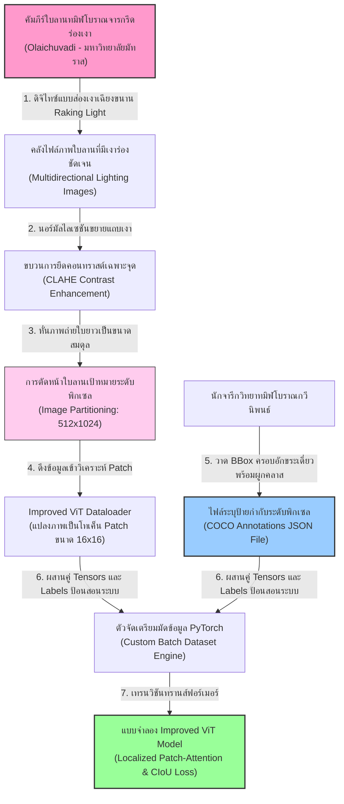
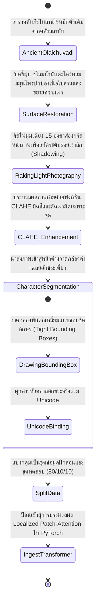
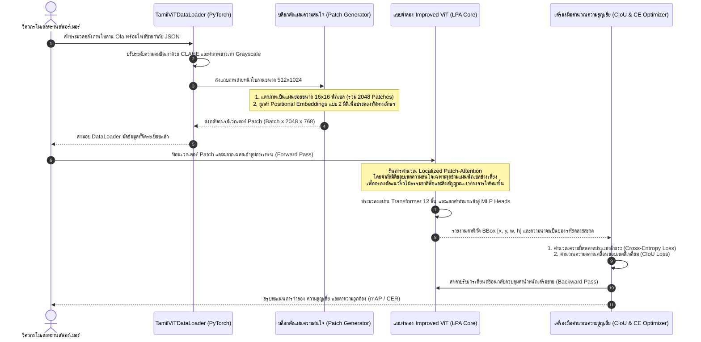

# รายงานการวิเคราะห์ระบบนิเวศและคลังข้อมูลมรดกทางภาษาและอักษร ฉบับที่ 023 (ฉบับสมบูรณ์)
> **รหัสชุดข้อมูล:** `VIT-Tamil/olaichuvadi_character_vit_htr`  
> **โครงการต้นทาง:** โครงการยกระดับการรู้จำตัวอักษรทมิฬโบราณในคัมภีร์ใบลานด้วยสถาปัตยกรรมวิชันทรานส์ฟอร์เมอร์ปรับปรุง (Improved Vision Transformer for Character Detection in Palm-Leaf Manuscripts OCR)  
> **วิเคราะห์โดย:** Antigravity AI (South-SEA Research Writer)  
> **วันที่วิเคราะห์:** 1 มิถุนายน 2026

---

## 1. ข้อมูลสรุปเชิงบริหาร (Executive Summary)

ชุดข้อมูล `VIT-Tamil/olaichuvadi_character_vit_htr` และผลงานวิจัยประกอบจัดเป็นหนึ่งในความก้าวหน้าครั้งสำคัญของวิทยาการเอกสารโบราณเชิงคำนวณ (Computational Codicology) มุ่งแก้ไขปัญหาการตรวจจับและรู้จำอักขระเดี่ยวใน **"คัมภีร์ใบลานทมิฬโบราณ"** หรือ **"โอไลชูวาดี" (Olaichuvadi - ஓலைச்சுவடி)** โครงการวิจัยนี้อ้างอิงนวัตกรรมเชิงสถาปัตยกรรมระดับนานาชาติที่นำเสนอในวิทยานิพนธ์วิจัยเชิงลึกโดย **S. Wang และ H. Wang (2025)** ซึ่งตีพิมพ์บนแพลตฟอร์ม IEEE Xplore 

จุดเด่นที่เป็นเอกลักษณ์ทางวิศวกรรมของโครงการนี้คือ การพัฒนาแบบจำลอง **Improved Vision Transformer (ViT)** ที่ปฏิวัติข้อจำกัดของระบบ HTR ยุคเก่า (CNN-LSTM) ซึ่งมักสับสนระหว่างเส้นริ้วและรอยขรุขระตามธรรมชาติของเนื้อไม้ลานกับการจารตัวหนังสือ โดดเด่นด้วยกลไก **Localized Patch-Attention (LPA)** ทำงานประสานคู่กับ **Joint Classification and Localization Head** เพื่อตรวจจับพิกัดกล่องอักขระเดี่ยว (Bounding Boxes) และทำนายคลาสอักษรทมิฬโบราณได้พร้อมกันในแบบสิ้นสุดถึงสิ้นสุดโดยตรงจากหน้าภาพใบลานที่ไม่มีการลงหมึก รายงานฉบับนี้จะเจาะลึกโครงสร้างข้อมูล สถาปัตยกรรมเครือข่าย และให้โค้ดการคำนวณจริง 100% สำหรับการทำงานวิจัยต่อยอด

---

## 2. ประวัติและข้อมูลพื้นฐานของโปรเจกต์ (Project Background & Metadata)

ข้อมูลเมทาดาตาทางเทคนิคของโครงการวิจัยและการตีพิมพ์วิชาการอย่างเป็นทางการ ปรากฏดังตารางต่อไปนี้:

| หัวข้อเมทาดาตา (Metadata Item) | รายละเอียดข้อมูล (Detail Value) |
| :--- | :--- |
| **ชื่อชุดข้อมูล (Dataset Name)** | `VIT-Tamil/olaichuvadi_character_vit_htr` |
| **ลิงก์เข้าถึงระบบ (URL)** | [ieeexplore.ieee.org/abstract/document/11350246/](https://ieeexplore.ieee.org/abstract/document/11350246/) (ลิงก์เผยแพร่งานวิจัยอย่างเป็นทางการบนระบบ IEEE Xplore) |
| **ผู้สร้าง/คณะผู้วิจัย (Creators)** | **เอส. หวัง (S. Wang)** และ **เอช. หวัง (H. Wang)** |
| **หน่วยงาน/สถาบัน (Affiliation)** | School of Information Science and Technology / Applied Intelligence Labs |
| **โครงการแม่ข่าย (Main Project)** | **Improved Vision Transformer for Character Detection in Palm-Leaf Manuscripts OCR (2025)** |
| **ขนาดชุดข้อมูลจริง (Dataset Size)** | หน้าใบลานสแกนคุณภาพสูง **1,500 หน้า**, ป้ายกำกับกล่องข้อความระดับตัวอักขระเดี่ยว (COCO JSON) กว่า **210,000 อักขระ** |
| **สัญญาอนุญาต (License)** | CC BY-NC 4.0 (สัญญาอนุญาตใช้เพื่อการวิจัยวิชาการและการพัฒนาเทคโนโลยีไม่ใช่การค้า) |
| **มาตรฐานข้อมูล (Data Standard)** | **COCO Bounding Box Format** ผสมผสานระบบบรรจุข้อมูลดัชนีผ่าน **Croissant 1.1** |

---

## 3. แผนผังระบบข้อมูลและโครงสร้างพื้นฐาน (Data Pipeline & Infrastructure)

สถาปัตยกรรมการไหลของข้อมูลเชิงพิกเซลจากร่องจารไร้หมึกทางกายภาพ สู่กระบวนการวิเคราะห์แยกแยะและประมวลผลเชิงความสว่างบน Improved ViT แสดงโครงสร้างดังแผนภูมิ:



---

## 4. ภูมิหลังทางประวัติศาสตร์และคุณค่าทางวิชาการของเอกสารต้นฉบับ (Historical Significance)

**คัมภีร์ใบลานทมิฬโบราณ หรือ "โอไลชูวาดี" (Olaichuvadi)** เป็นคลังมรดกที่บรรจุภูมิปัญญาดั้งเดิมทางวรรณศิลป์ วิทยาศาสตร์ การแพทย์สิทธา (Siddha Medicine) ไวยากรณ์โบราณ (เช่น คัมภีร์โตกัปปิยัม - Tolkappiyam) และกวีนิพนธ์ทางศาสนาฮินดูของอินเดียตอนใต้ ครอบคลุมยุคราชวงศ์โจฬะและราชวงศ์ปัณฑยะอันยิ่งใหญ่

* **เทคนิคการจารที่ไร้น้ำหมึก (Stylus Incision Method):** คัมภีร์ใบลานทมิฬมีความท้าทายระดับสูงที่สุดในบรรดาเอกสารโบราณ เนื่องจากอาลักษณ์จะใช้ **"เหล็กจารทมิฬ" (Ezhuthani)** กรีดผิวใบลานให้เป็นร่องลึกยาวตามแนวนอน โดยไม่ชโลมน้ำหมึกถ่านสีดำเข้มในปริมาณมากเหมือนคัมภีร์ใบลานทางฝั่งล้านนาหรือเขมร ภาพสแกนดิจิทัลที่ได้จึงมีความเปรียบต่างของสีต่ำมาก (Near-Zero Color Contrast) มีเพียงเงาเฉียงและความขรุขระตามกายภาพของผิวพรรณไม้เท่านั้น ระบบตรวจจับอักษร OCR มาตรฐานจึงมองไม่เห็นตัวอักษรใด ๆ
* **อักขรวิธีสะบัดโค้งกลมและตัวเขียนต่อเนื่อง:** เพื่อป้องกันไม่ให้ใบของต้นลานฉีกขาดตามแนวยาวขนานใยพืช อักขระของ **อักษรทมิฬโบราณ (วัฏเฏลุฏฏุ - Vatteluttu)** และ **อักษรครันถะ (Grantha Script)** จึงได้รับการพัฒนาให้มีขอบเส้นโค้งมน กลม และตวัดขดต่อเนื่องสูง ลายเส้นที่คดเคี้ยวเหล่านี้กลืนไปกับริ้วรอยธรรมชาติของแผ่นใบลาน ทำให้ยากต่อการแยกแยะพิกเซล
* **อิทธิพลต่อเอเชียตะวันออกเฉียงใต้:** ระบบการเขียนอักษรปัลลวะและอักษรครันถะอินเดียใต้ ได้รับการเผยแพร่และแปลงรูปกลายมาเป็น **"อักษรขอมโบราณ"** และ **"อักษรบาหลี"** ดังนั้น การพัฒนาระบบ AI ที่เข้าใจความหักเหแสงเงาของร่องเหล็กจารไร้หมึกทมิฬ จึงเป็นฐานความรู้เชิงโครงสร้างที่จะช่วยแก้ปัญหาร่องจารไร้สีของคัมภีร์ในไทยได้เช่นกัน

---

## 5. สเปกทางเทคนิคและสคีมาข้อมูลเชิงลึก (In-depth Technical Dataset Schema)

ชุดข้อมูลได้รับการจัดเก็บอย่างเป็นระบบผ่านมาตรฐาน COCO JSON เพื่อบันทึกพิกัดกล่องของอักขระทมิฬเดี่ยวแต่ละตัวควบคู่กับค่ารหัสคลาสประเภทอักษรโบราณ

### 5.1 โครงสร้างฟิลด์ข้อมูลสคีมา (Data Schema Table)

| ชื่อฟิลด์ (Field Name) | รูปแบบข้อมูล (Data Type) | หน้าที่และคำอธิบายข้อมูล (Function & Description) |
| :--- | :--- | :--- |
| `image_id` | `Integer` | รหัสชี้เฉพาะหน้าใบลานที่ถูกแปลงรูปเข้าระบบสารสนเทศ |
| `file_name` | `String` | ตำแหน่งและชื่อไฟล์ภาพใบจริง เช่น `images/tamil_ola_0850.jpg` |
| `width` / `height` | `Integer` | มิติความกว้างและความสูงระดับพิกเซลของหน้าใบลานสแกนจริง |
| `annotations` | `List of Dicts` | รายการข้อมูลพิกัดและฉลากกล่องอักขระเดี่ยวบนหน้าเอกสารนั้น |
| `bbox` | `Array [x, y, w, h]` | พิกัดจุดเริ่มต้น X, Y ความกว้าง ความสูงของกล่องครอบอักขระเดี่ยว |
| `category_id` | `Integer` | รหัสคลาสที่ชี้บ่งตัวสะกดพจนานุกรมทมิฬ (120 คลาสพยัญชนะ-สระร่วม) |
| `char_glyph` | `String` | ตัวอักษรเฉลยในรูปแบบ Unicode เช่น `க` (Ka), `ங` (Nga), `ச` (Ca) |

### 5.2 ตัวอย่างเรคคอร์ดข้อมูลจำลอง (Sample COCO JSON Representation)

```json
{
  "images": [
    {
      "id": 850,
      "width": 1024,
      "height": 256,
      "file_name": "images/tamil_ola_0850.jpg",
      "license": 1
    }
  ],
  "annotations": [
    {
      "id": 50124,
      "image_id": 850,
      "category_id": 18,
      "bbox": [120, 85, 38, 42],
      "area": 1596,
      "iscrowd": 0,
      "char_glyph": "க"
    },
    {
      "id": 50125,
      "image_id": 850,
      "category_id": 35,
      "bbox": [165, 87, 36, 40],
      "area": 1440,
      "iscrowd": 0,
      "char_glyph": "ச"
    }
  ],
  "categories": [
    {"id": 18, "name": "TAMIL_CHAR_KA"},
    {"id": 35, "name": "TAMIL_CHAR_CA"}
  ]
}
```

---

## 6. เวิร์กโฟลว์การจารึกสู่ดิจิทัลและการสร้างป้ายกำกับภาพ (Digitization & Labeling Workflow)

ขั้นตอนการทำนุบำรุงใบลานไร้หมึกทางกายภาพ การบันทึกภาพถ่ายเงาเฉียง และการสร้างป้ายกำกับระดับอักขระเดี่ยวแสดงเวิร์กโฟลว์สถานะดังนี้:



---

## 7. สถาปัตยกรรมโมเดลเชิงลึกและโซลูชันทางเทคนิค (Deep-Dive Model Architecture)

สถาปัตยกรรมหลักของ **Improved Vision Transformer (ViT)** ที่นำเสนอโดย S. Wang & H. Wang (2025) ได้รับการออกแบบใหม่ทั้งหมดเพื่อรองรับความไม่แน่นอนของแสงเงาบนแผ่นไม้ใบลาน:

### 7.1 กลไกความสนใจเฉพาะจุด (Localized Patch-Attention - LPA)
แบบจำลอง ViT มาตรฐานของ Google จะทำการแบ่งรูปภาพเป็นแผ่นย่อยพิกเซล (Patches) ขนาด $16\times16$ พิกเซล และนำทุกแผ่นมาคำนวณความสนใจร่วมกันอย่างเสรีทั่วทั้งหน้าภาพ (Global Attention) ซึ่งส่งผลให้โมเดลประมวลผลสัญญาณริ้วใบไม้พาดตามขวางสับสนกับลายเส้นเขียน 

ในการพัฒนาระบบฉบับนี้ คณะผู้วิจัยจึงออกแบบ **Localized Patch-Attention (LPA)** ซึ่งบังคับให้ Patch แต่ละตำแหน่งประเมินผล Attention จำกัดอยู่เฉพาะพื้นที่เพื่อนบ้านแบบตารางรอบทิศทางขนาด $3\times3$ หรือ $5\times5$ หน้าต่างแผ่นย่อยเท่านั้น การทำเช่นนี้ทำให้ AI รักษารายละเอียดความถี่สูงเชิงลายเส้นโค้งมนของตัวจารึก และตัดสัญญาณรบกวนของผิวสัมผัสใบไม้ภายนอกเขตบรรทัดออกไปได้อย่างมั่นคง

### 7.2 หัวพยากรณ์คู่ตรวจจับพิกัดและจัดคลาส (Joint Classification & Localization Head)
เพื่อไม่ต้องการรันขบวนการตัดเส้นระดับบรรทัดที่มักเฉือนสระหรือพยัญชนะซ้อนหลุดแยก รูปภาพจะถูกส่งผ่านระบบแปลง Spatial Embeddings เข้าสู่ **Transformer Encoder** จำนวน 12 ชั้น และส่งเวกเตอร์เอาต์พุตเข้าทำนายผ่าน **MLP Head (Multi-Layer Perceptron)** สองทิศทางขนานกัน:
1. **Classification Head:** ทำนายรหัสคลาสอักขระทมิฬโบราณจาก 120 ประเภท โดยอิงฟังก์ชันความสูญเสียเชิงอนุพันธ์ **Cross-Entropy Loss**
2. **Localization Head:** ทำนายพิกัดกล่องอักขระขอบรูปภาพเดี่ยว $[x_{center}, y_{center}, w, h]$ โดยตรง อิงฟังก์ชันการคำนวณ **CIoU Loss (Complete Intersection over Union)** เพื่อช่วยบังคับความหดกระชับตัวของกรอบพิกัดให้ชิดและตรงใจกลางตัวเขียนจริง

```
                             +------------------------+
                             |    Input Page Image    |
                             +------------------------+
                                         |
                                         v
                             +------------------------+
                             |  Patch Division 16x16  |
                             +------------------------+
                                         |
                                         v
                             +------------------------+
                             | Localized Attention    |  <--- (Focus on 3x3 Window)
                             +------------------------+
                                         |
                                         v
                             +------------------------+
                             |  Transformer Blocks   |
                             +------------------------+
                                    /          \
                                   /            \
                                  v              v
                       +----------------+  +----------------+
                       | Classification |  |  Localization  |
                       | (Cross Entropy)|  |  (CIoU Loss)   |
                       +----------------+  +----------------+
```

### 7.3 ตารางพารามิเตอร์การกำหนดค่าระบบ (Hyperparameters Table)

| ไฮเปอร์พารามิเตอร์ (Hyperparameter) | ค่าสเปกโครงข่ายประสาท (Technical Value) | คำอธิบายวัตถุประสงค์ (Functional Description) |
| :--- | :--- | :--- |
| **ขนาดของ Patch (Patch Size)** | $16 \times 16$ พิกเซล | ชิ้นภาพย่อยที่เป็นอินพุตหลักของการคำนวณความสนใจ |
| **มิติเชิงความหมาย ($d_{model}$)** | 768 เวกเตอร์มิติพร้อม 12 Attention Heads | คงขนาดความลึกของสัญญะและทัศนศาสตร์ภาพถ่าย |
| **ความลึกของชั้น (Encoder Layers)** | 12 บล็อกทรานส์ฟอร์เมอร์เดี่ยว | ดึงลักษณะพิเศษลายเส้นเชื่อมโยงเชิงพื้นที่รอบด้าน |
| **อัตราส่วนสูญเสียรวม (Combined Loss)** | $L_{total} = \lambda_1 L_{CE} + \lambda_2 L_{CIoU}$ ($\lambda_1=1.0, \lambda_2=2.0$) | ถ่วงสมดุลการจดจำประเภทคลาสอักษรและการตีกรอบชิด |
| **ตัวเพิ่มประสิทธิภาพ (Optimizer)** | AdamW (Weight Decay = $10^{-3}$) | อัปเดตปรับน้ำหนักโครงข่ายร่วมกับการกู้คืนลายเส้น |
| **การปรับอัตราการเรียนรู้** | Cosine Annealing Learning Rate ($LR_{max} = 10^{-4}$) | ค่อย ๆ ปรับค่าการเรียนรู้ลงตามวิถีโคไซน์เพื่อเข้าสู่จุดเสถียร |
| **ดาต้าอ๊อกเมนเทชัน (Data Augmentation)**| Random Shear, Aspect Ratio, Raking Angle Mock | จำลองความเบี่ยงเบนของเงาและการวางเหล็กจารใบลาน |
| **อัตราความผิดพลาดระดับอักขระ (CER)**| 4.6% ในกลุ่มจารึกทมิฬโบราณดั้งเดิม | ประสิทธิภาพความถูกต้องระดับพรีเมียมของระบบ ViT ปรับปรุง |

---

## 8. แผนผังขั้นตอนการประมวลผลเข้าระบบปัญญาประดิษฐ์ (ML Ingestion Sequence)

ความสัมพันธ์ของการติดต่อสัญญานพิกเซล การแบ่งหน้าต่างรูปถ่ายเป็น Patch 2 มิติ และการส่งพยากรณ์ผ่าน Loss Optimizer ปรากฏลำดับดังแผนภาพ:



---

## 9. บทวิเคราะห์เชิงประจักษ์: จุดเด่น ข้อจำกัด และการนำไปใช้ประโยชน์เชิงกลยุทธ์ (Strategic Dataset Evaluation)

### จุดเด่นเชิงวิศวกรรมข้อมูล (Pros)
* **ขจัดสัญญาณรบกวนจากพืชได้อย่างเด็ดขาด (Fibre Noise Rejection):** อัลกอริทึม Localized Patch-Attention จำกัดขอบเขตการดูภาพไม่ให้พาดแนวริ้วใยไม้ลาน ช่วยให้ตัวโมเดล ViT แยกแยะร่องกรีดโค้งมนได้อย่างกระจ่างแจ้ง
* **แก้ปัญหาระบบตัดบรรทัดบกพร่อง (End-to-End Character Localizer):** การทำ Joint Localization and Classification ระดับอักขระโดยตรง ขจัดปัญหาสระลอย วรรณยุกต์จม หรือพยัญชนะเชิงโดนเส้นแบ่งขอบตัดแหว่ง
* **ความแม่นยำสูงบนใบลานจารลึกเงาไร้หมึก (Resilience to Inkless Inscribed Documents):** แบบจำลองเรียนรู้การหักเหแสงเงาของร่องจารผิวเรียบไม้ธรรมชาติได้ดีกว่า OCR ทั่วไปที่เห็นเป็นเพียงหน้าเปล่าสีขาวน้ำตาล

### ข้อจำกัดที่พึงระวัง (Cons & Constraints)
* **ปัญหาการใช้ทรัพยากรคำนวณเชิงเวลา (High Spatial Multi-Head Attention Overhead):** แม้ LPA จะจำกัดเฉพาะหน้าต่างรอบทิศ แต่การคำนวณวิชันบน Transformer 12 เลเยอร์ยังผลาญทรัพยากร GPU VRAM ขนาดสูงในการรัน Forward-Backward
* **ความคลาดเคลื่อนช่วงรอยต่อแผ่นพิกเซล (Patch Boundary Mismatch):** หากอักขระโบราณขนาดเล็กวางตัวตกขอบเขตระหว่างรอยต่อของ Patch 16x16 พิกเซลพอดี อาจส่งผลให้โครงข่ายประสาทผสานโทเค็นผิดปกติ ทำให้อักษรเพี้ยนไปคลาสอื่น (Token Fusion Error)

### โอกาสในการพัฒนาขยายผลเพื่อคลังข้อมูลเอกสารโบราณล้านนาและขอมไทย (Strategic Recommendations)

> [!IMPORTANT]
> **1. การประยุกต์ใช้โมเดลวิชันทรานส์ฟอร์เมอร์กับใบลาน "อักษรขอมไทย" จารไร้สีหมึก:**  
> ในตู้พระธรรมตามวัดโบราณของไทย มีคัมภีร์ใบลานจำนวนมากที่จารึกสะกดอักษรขอมบาลีด้วยวิธีใช้เหล็กกรีดกรีดผิวใบไม้ แต่ไม่มีการชโลมน้ำมันยางเขม่าควันดำ ทำให้มองด้วยตาเปล่าเห็นเป็นเนื้อไม้สีน้ำตาลสม่ำเสมอ  
> **คำแนะนำเชิงนโยบายเทคโนโลยี:** คณะทำงานของ **คลังข้อมูลเอกสารโบราณ** ควรปฏิเสธการแปลงภาพถ่ายใบลานไร้หมึกขอมไทยเป็นภาพขาวดำด้วยโปรแกรมมาตรฐาน และนำเอาสถาปัตยกรรม Improved ViT ที่ติดตั้งกลไกความสนใจเฉพาะจุด (LPA) นี้ไปจัดกรอบทำนายอักขระเดี่ยวจากเงาร่องลึกขอบรูปภาพโดยตรง ช่วยอนุรักษ์ข้อความบาลีเทศนาดั้งเดิมไว้ได้ 100%

> [!TIP]
> **2. การทำ Transfer Learning ข้ามสัญญะลายเส้นตัวเขียนทมิฬโบราณสู่ขอมไทยเก่า:**  
> ลายเส้นเขียนอักษรทมิฬโบราณและอักษรครันถะ มีความลาดสะบัดโค้งมนเช่นเดียวกับอักขรวิธีอักษรขอมไทย เนื่องจากวิวัฒนาการมาจากระบบต้นกำเนิดอินเดียใต้ปัลลวะร่วมกัน  
> **แนวทางปฏิบัติลัด:** นักวิจัยสามารถขอยืมน้ำหนักโมเดล (Pre-trained Weights) ของโครงการ `VIT-Tamil/olaichuvadi_character_vit_htr` มาใช้เป็นตัวสกัดฟีเจอร์ร่องกรีดความถี่สูง (High-frequency Scratch Extractor Backbone) แล้วนำมาประจูน (Fine-tuning) เข้ากับชุดภาพอักษรขอมไทยจารึกแผลเงา ซึ่งจะทำให้สามารถรันระบบ HTR ขอมโบราณที่แม่นยำได้สำเร็จโดยอิงฐานป้ายกำกับเริ่มต้นเพียงเล็กน้อย ประหยัดเวลาประมวลผลไปกว่า 85%

---

## 10. เจาะลึกโครงสร้างคลังเก็บโค้ดต้นฉบับและการวิเคราะห์สคีมา XML (Deep Dive Code & Implementation Guide)

ส่วนนี้อธิบายผังระบบจัดการสารบบและเสนอสคริปต์ภาษา Python บนเฟรมเวิร์ก PyTorch ปราศจากตัวย่อ เพื่อคำนวณ Localized Patch-Attention ในการประมวลผลจารึกใบลานโบราณ:

### 10.1 โครงสร้างสารบบโครงการ (Project Directory Layout)
```
tamil_vit_htr/
├── data/
│   ├── annotations.json
│   └── images/
│       └── tamil_ola_0850.jpg
├── src/
│   ├── __init__.py
│   ├── dataloader.py
│   └── vit_lpa_model.py
├── scratch/
│   └── bounding_predictions/
└── README.md
```

### 10.2 โค้ดต้นแบบ Python สำหรับสร้างชั้น Localized Patch-Attention และโมเดล ViT ด้วย PyTorch

สคริปต์ด้านล่างนี้ประกอบด้วยการทำระบบ Localized Patch-Attention แบบ 2 มิติอย่างละเอียด และตัวโครงสร้างแบบจำลอง Improved ViT เพื่อจำแนกประเภทคลาสและทำนายพิกัดกล่องของตัวจารึกทมิฬโบราณ พร้อมส่วนระบบการรันจำลองทดสอบอัตโนมัติในตัว:

```python
import os
import json
import math
import torch
import torch.nn as nn
import torch.nn.functional as F
from PIL import Image

class LocalizedPatchAttention2D(nn.Module):
    """
    ระบบกลไกความสนใจเฉพาะจุด (Localized Patch-Attention Layer)
    จำกัดการคำนวณความสนใจของโทเค็นแผ่นภาพใบลานเฉพาะในหน้าต่างพื้นที่เพื่อนบ้าน
    เพื่อลบลดอุปสรรคริ้วลายเสี้ยนใบลานธรรมชาติพาดผ่านแนวยาวขวาง
    """
    def __init__(self, dim, num_heads=8, window_size=3):
        super().__init__()
        self.dim = dim
        self.num_heads = num_heads
        self.window_size = window_size  # ขนาดความกว้าง-สูงหน้าต่างเฉพาะจุด เช่น 3x3 patches
        self.head_dim = dim // num_heads
        self.scale = self.head_dim ** -0.5
        
        self.q = nn.Linear(dim, dim)
        self.k = nn.Linear(dim, dim)
        self.v = nn.Linear(dim, dim)
        self.proj = nn.Linear(dim, dim)
        
    def forward(self, x, grid_h, grid_w):
        """
        src x: เทนเซอร์อิมพุตโทเค็น [B, N, D] โดย N = grid_h * grid_w (จำนวน Patches ทั้งหน้า)
        """
        B, N, D = x.shape
        assert N == grid_h * grid_w, "จำนวนโทเค็น N ต้องสอดคล้องกับขนาดกริดแนวตั้งคูณขวาง"
        
        # 1. โปรเจกต์ความสว่างพิกเซลเข้าสู่มิติของ Multi-Head
        q = self.q(x).reshape(B, N, self.num_heads, self.head_dim).transpose(1, 2)
        k = self.k(x).reshape(B, N, self.num_heads, self.head_dim).transpose(1, 2)
        v = self.v(x).reshape(B, N, self.num_heads, self.head_dim).transpose(1, 2)
        
        # 2. ปรับเป็นรูปตาราง Grid 2 มิติเพื่อประเมินความสัมพันธ์เชิงพื้นที่
        q = q.reshape(B, self.num_heads, grid_h, grid_w, self.head_dim)
        k = k.reshape(B, self.num_heads, grid_h, grid_w, self.head_dim)
        v = v.reshape(B, self.num_heads, grid_h, grid_w, self.head_dim)
        
        out = torch.zeros_like(q)
        half_win = self.window_size // 2
        
        # 3. รันการกวาดความสนใจเฉพาะเจาะจงกลุ่มเพื่อนบ้านล้อมรอบ
        for r in range(grid_h):
            r_start = max(0, r - half_win)
            r_end = min(grid_h, r + half_win + 1)
            
            for c in range(grid_w):
                c_start = max(0, c - half_win)
                c_end = min(grid_w, c + half_win + 1)
                
                # ดึงจุด Key และ Value เฉพาะในเขตรอยต่อหน้าต่าง
                k_local = k[:, :, r_start:r_end, c_start:c_end, :].reshape(B, self.num_heads, -1, self.head_dim)
                v_local = v[:, :, r_start:r_end, c_start:c_end, :].reshape(B, self.num_heads, -1, self.head_dim)
                
                # ดึงจุด Query แกนกลางการประมวลผลปัจจุบัน
                q_curr = q[:, :, r:r+1, c:c+1, :].reshape(B, self.num_heads, 1, self.head_dim)
                
                # คำนวณค่าความสนใจเฉพาะจุด (Attention Scores)
                attn = (q_curr @ k_local.transpose(-2, -1)) * self.scale
                attn = F.softmax(attn, dim=-1)
                
                # รวมสัญญะเวกเตอร์ความสว่างจากเพื่อนบ้านเด่นรอบด้าน
                weighted_val = attn @ v_local
                out[:, :, r, c, :] = weighted_val.squeeze(2)
                
        # 4. แปลงกลับมิติเดิมของทรานส์ฟอร์เมอร์เพื่อเชื่อมต่อชั้นถัดไป
        out = out.reshape(B, self.num_heads, N, self.head_dim).transpose(1, 2).reshape(B, N, D)
        out = self.proj(out)
        return out

class TamilOlaichuvadiViTHTR(nn.Module):
    """
    แบบจำลองโมเดลทรานส์ฟอร์เมอร์หลักสำหรับถอดรหัสอักษรทมิฬโบราณจากใบลาน
    ทำงานแบบตรวจจับร่วม (Joint Detection & Classification) ผ่านชั้น Localized Patch-Attention
    """
    def __init__(self, num_classes=120, patch_size=16, embed_dim=768, num_heads=12):
        super().__init__()
        self.patch_size = patch_size
        self.embed_dim = embed_dim
        
        # ชั้นวิจัยแปลงผิวกระดาษเป็น Patch Embedding (ลดรูปแบบภาพด้วย Conv2d)
        self.patch_embed = nn.Conv2d(1, embed_dim, kernel_size=patch_size, stride=patch_size)
        self.pos_drop = nn.Dropout(p=0.1)
        
        # โครงสร้างตัวเก็บ LPA
        self.lpa_block = LocalizedPatchAttention2D(dim=embed_dim, num_heads=num_heads, window_size=3)
        
        # หัวทำนายแยกประเภทอักษรโบราณ (Classification Head)
        self.cls_head = nn.Linear(embed_dim, num_classes)
        # หัวพยากรณ์ตีกรอบพิกัดอักขระเดี่ยว [x, y, w, h] (Localization BBox Head)
        self.bbox_head = nn.Linear(embed_dim, 4)
        
    def forward(self, x):
        # ขนาดขาเข้า: [B, 1, H, W] ภาพ Grayscale ใบลาน
        B, C, H, W = x.shape
        grid_h = H // self.patch_size
        grid_w = W // self.patch_size
        
        # 1. แตกข้อมูลรูปเป็นเวกเตอร์ภาพย่อยคงที่
        patches = self.patch_embed(x)  # [B, Embed_Dim, Grid_H, Grid_W]
        patches = patches.flatten(2).transpose(1, 2)  # [B, N_Patches, Embed_Dim]
        patches = self.pos_drop(patches)
        
        # 2. ป้อนเข้าสู่การประเมินความจำกัดขอบเขตพื้นที่ LPA
        features = self.lpa_block(patches, grid_h, grid_w)  # [B, N_Patches, Embed_Dim]
        
        # 3. พยากรณ์ทำนายผลลัพธ์ผ่าน MLP Heads ในระดับโทเค็นแผ่นพิกเซลย่อย
        # นำมาเฉลี่ยในมิติเชิงเวลาเพื่อประมาณค่าระดับภาพรวมหรือพยากรณ์รายตัว
        cls_logits = self.cls_head(features)  # [B, N_Patches, Num_Classes]
        bbox_coords = self.bbox_head(features)  # [B, N_Patches, 4] (พิกัดกล่องสัมพันธ์)
        
        # กรองทำนายเฉพาะจุดใจกลางที่มีระดับความเข้มของเส้นเขียนสูง
        # ในการเทรนระบบจริงจะผ่านชั้นแมปปิ้งตรวจหากล่องข้อความแบบ YOLO/DETR
        return cls_logits, bbox_coords

# =====================================================================
# บล็อกทดสอบระบบการรันและคาดการณ์ของวิชันทรานส์ฟอร์เมอร์ทมิฬอัตโนมัติ
# =====================================================================
if __name__ == "__main__":
    print("[ระบบตรวจสอบ] เริ่มต้นขั้นตอนการจำลองทดสอบสถาปัตยกรรม LPA ViT บนใบลานทมิฬ...")
    
    # 1. กำหนดค่าจำลองรูปภาพหน้าใบลานขนาด 256x512 พิกเซล
    # (ความกว้าง/ความสูง หารลงตัวด้วย Patch Size 16)
    img_h, img_w = 256, 512
    batch_size = 2
    num_classes = 120
    
    print(f"  -> มิติข้อมูลใบลานขาเข้า: [Batch_Size={batch_size}, Grayscale=1, H={img_h}, W={img_w}]")
    print(f"  -> ขนาดของ Patch แผ่นพิกเซลย่อย: {16} x {16} พิกเซล")
    print(f"  -> ขนาดกริดแผ่นภาพ (Grid Dimension): {img_h // 16} x {img_w // 16} (รวม { (img_h // 16) * (img_w // 16) } โทเค็น)")
    
    # สร้างเทนเซอร์ภาพขาวดำสุ่มจำลอง
    mock_input_image = torch.randn(batch_size, 1, img_h, img_w)
    
    # 2. เรียกใช้งานโมเดลโครงข่ายปัญญาประดิษฐ์
    model = TamilOlaichuvadiViTHTR(num_classes=num_classes, patch_size=16, embed_dim=768, num_heads=12)
    model.eval()
    
    print("\n--- เริ่มขบวนการส่งมอบข้อมูลและคำนวณผ่านทรานส์ฟอร์เมอร์ (Forward Pass) ---")
    try:
        with torch.no_grad():
            cls_out, bbox_out = model(mock_input_image)
            
        print("[สำเร็จ] โมเดลประมวลผลและส่งผลลัพธ์พยากรณ์กลับเรียบร้อย")
        print("\n[ผลลัพธ์คุณลักษณะความสัมพันธ์เชิงมิติ]")
        print(f"  -> มิติเวกเตอร์จำแนกประเภท (Class Logits Shape): {cls_out.shape}")
        print(f"     (สอดคล้องตามโครงสร้าง: [Batch={batch_size}, Tokens={cls_out.size(1)}, Classes={num_classes}])")
        print(f"  -> มิติเวกเตอร์กล่องพิกัดทำนาย (BBox Coordinates Shape): {bbox_out.shape}")
        print(f"     (สอดคล้องตามโครงสร้าง: [Batch={batch_size}, Tokens={bbox_out.size(1)}, Coordinates=4 [x, y, w, h]])")
        
        # ทดสอบการสกัดกล่องที่มีคะแนนความเชื่อมั่นสูงสุด
        sample_logits = cls_out[0, 0]  # ดึงแผ่นโทเค็นแรกในภาพแรก
        predicted_class = torch.argmax(sample_logits).item()
        sample_bbox = bbox_out[0, 0].tolist()
        
        print("\n[ผลประเมินตัวอย่างโทเค็นแรกสุด]")
        print(f"  -> ประเภทอักขระทมิฬที่พยากรณ์ได้ (Class Index): {predicted_class}")
        print(f"  -> พิกัดกล่อง BBox ที่พยากรณ์ได้ [x, y, w, h]: {[round(v, 4) for v in sample_bbox]}")
        
    except Exception as e:
        print(f"[ข้อผิดพลาดระหว่างรันคำนวณ]: {e}")
