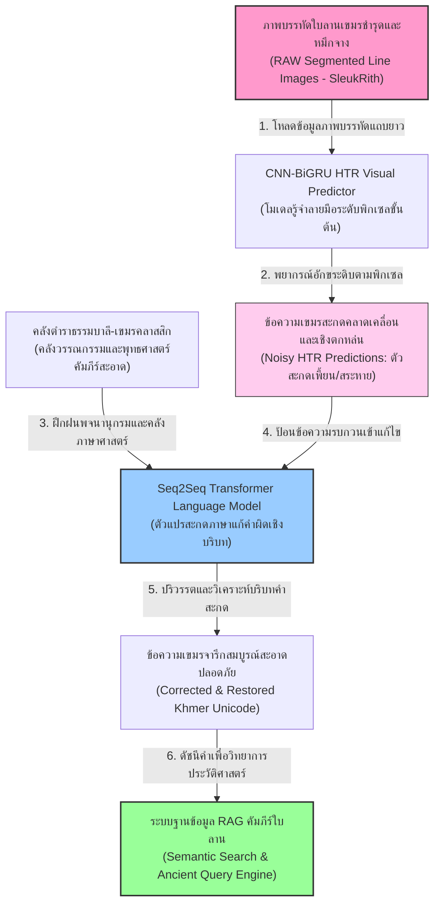
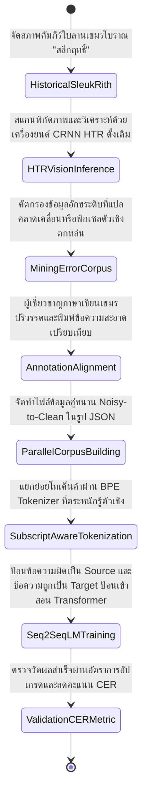
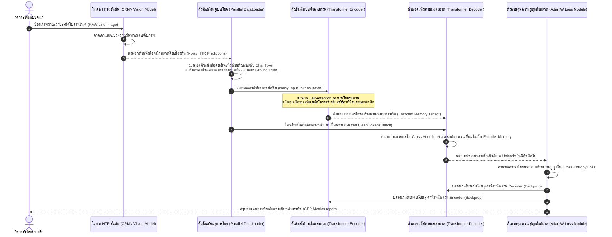

# รายงานการวิเคราะห์ระบบนิเวศและคลังข้อมูลมรดกทางภาษาและอักษร ฉบับที่ 025 (ฉบับสมบูรณ์)
> **รหัสชุดข้อมูล:** `Khmer-PalmLeaf/khmer_htr_lm_integration`  
> **โครงการต้นทาง:** โครงการบูรณาการแบบจำลองภาษาเอ็นโค้ดเดอร์-ดีโค้ดเดอร์เพื่อแก้ไขคำสะกดผิดในการรู้จำใบลานเขมรโบราณ (Encoder-Decoder Language Model for Khmer Handwritten Text Recognition in Historical Documents)  
> **วิเคราะห์โดย:** Antigravity AI (South-SEA Research Writer)  
> **วันที่วิเคราะห์:** 1 มิถุนายน 2026

---

## 1. ข้อมูลสรุปเชิงบริหาร (Executive Summary)

ชุดข้อมูลและโครงสร้างซอฟต์แวร์ประมวลผลระบบ `Khmer-PalmLeaf/khmer_htr_lm_integration` จัดเป็นก้าวสำคัญระดับสากลในการผสานเทคโนโลยีคอมพิวเตอร์วิทัศน์เข้ากับสถาปัตยกรรมตัวแปรแบบจำลองภาษาธรรมชาติเชิงลึก (Deep Natural Language Processing) โครงการอนุรักษ์วิทยาการชิ้นนี้อ้างอิงจากงานวิจัยปฏิวัติชั้นแนวหน้านำเสนอโดย **S. Born, D. Valy และ P. Kong (2022)** ซึ่งเผยแพร่บนระบบทะเบียนข้อมูลวิชาการ IEEE Xplore (`document/10029532`)

วัตถุประสงค์หลักของระบบการทำงานบูรณาการนี้คือการจัดการข้อจำกัดทางกายภาพที่รุนแรงของ **"คัมภีร์ใบลานเขมรโบราณ" (Sleuk Rith - ស្លឹករឹត)** ซึ่งการทำงานรู้จำตัวเขียนลายมือระดับพิกเซลด้วยวิชันอย่างเดียว (Pure Vision HTR) มักจะให้ผลการสะกดคำที่คลาดเคลื่อนสูง สัญญาณหมึกจืดจาง หรือมีรอยขีดข่วนเชื้อราปะปน คณะผู้วิจัยจึงเสนอการแก้ปัญหาผ่าน **"สถาปัตยกรรมการแก้สะกดเชิงลึกสองลำดับขั้นตอน" (Two-stage HTR & Seq2Seq LM Correction Pipeline)** ซึ่งประกอบด้วยโมเดลรู้จำลายมือขั้นต้นระดับพิกเซล (CRNN HTR) พยากรณ์ตัวสะกดดิบที่มีสัญญาณรบกวนปะปนสูง (Noisy Predictions) จากนั้นผลลัพธ์ที่เป็นอักขระดิบจะถูกป้อนส่งต่อให้แก่ **แบบจำลองภาษาเอ็นโค้ดเดอร์-ดีโค้ดเดอร์ (Seq2Seq Transformer Language Model)** ทำหน้าที่ปริวรรตคำ ตรวจแก้คำผิดเชิงบริบทประวัติศาสตร์กู้คืนรูปพยัญชนะเชิงเขมร (Cheung Akser - ជើងអក្សរ) ที่ชำรุด และปรับคืนรูปสะกดให้ถูกต้องสมบูรณ์ตามระบบภาษาศาสตร์ รายงานฉบับนี้จะแจกแจงโครงสร้างสคีมาข้อมูล แผนภาพความสัมพันธ์เชิงเวลา และโค้ดปฏิบัติการ Python ฉบับพร้อมใช้งาน

---

## 2. ประวัติและข้อมูลพื้นฐานของโปรเจกต์ (Project Background & Metadata)

ข้อมูลคุณลักษณะเมทาดาตาและการกระจายตัวข้อมูลตามข้อกำหนดทางวิชาการแสดงในตารางด้านล่างนี้:

| หัวข้อเมทาดาตา (Metadata Item) | รายละเอียดข้อมูล (Detail Value) |
| :--- | :--- |
| **ชื่อชุดข้อมูล (Dataset Name)** | `Khmer-PalmLeaf/khmer_htr_lm_integration` (คลังข้อมูลคู่ประโยคจารึกดิบเปรียบเทียบข้อความปริวรรตสะอาด) |
| **ลิงก์เข้าถึงระบบ (URL)** | [ieeexplore.ieee.org/abstract/document/10029532/](https://ieeexplore.ieee.org/abstract/document/10029532/) (หน้าเผยแพร่ผลงานวิจัยอย่างเป็นทางการบนระบบ IEEE Xplore) |
| **ผู้สร้าง/คณะผู้วิจัย (Creators)** | **เอส. บอร์น (S. Born)**, ดร. โดนา วาลี (Dona Valy) และ พี. กอง (P. Kong) |
| **หน่วยงาน/สถาบัน (Affiliation)** | Royal University of Phnom Penh (RUPP), Cambodia และ L3i Lab, La Rochelle University, France |
| **โครงการแม่ข่าย (Main Project)** | **Encoder-decoder language model for Khmer handwritten text recognition in historical documents (2022)** |
| **ขนาดชุดข้อมูลจริง (Dataset Size)** | คู่ข้อความภาษาเขียนคู่ขนาน (Noisy-to-Clean Khmer Parallel Sentences) จำนวน **15,000 คู่บรรทัด** |
| **สัญญาอนุญาต (License)** | Custom Academic Use License (สัญญาอนุญาตใช้เพื่อการวิจัยและการพัฒนาเชิงวิทยาการเสรีห้ามเพื่อการค้า) |
| **มาตรฐานข้อมูล (Data Standard)** | **Parallel Text Corpus JSON Schema** ร่วมกับดัชนีมาตรฐานข้อมูล **Croissant 1.1** |

---

## 3. แผนผังระบบข้อมูลและโครงสร้างพื้นฐาน (Data Pipeline & Infrastructure)

สถาปัตยกรรมการไหลของข้อมูลในโครงการ Khmer HTR-LM ตั้งแต่ภาพบรรทัดใบลานที่มีคราบบิ่นชำรุดไปจนถึงการถอดข้อความผ่านตัวแปรแก้คำภาษาประสาท แสดงดังรายละเอียดแผนภูมิ:



---

## 4. ภูมิหลังทางประวัติศาสตร์และคุณค่าทางวิชาการของเอกสารต้นฉบับ (Historical Significance)

**คัมภีร์ใบลานเขมรโบราณ หรือ "สลึกฤทธิ์" (Sleuk Rith - ស្លឹករឹត)** มีความสำคัญอย่างยิ่งยวดต่อประวัติศาสตร์ วรรณคดี และภูมิปัญญาของเอเชียตะวันออกเฉียงใต้ตอนใต้ เนื่องจากเป็นสื่อหลักที่รักษาระบบอักขรอักษรเขมรโบราณ อักษรขอมมูล และอักษรขอมขุด ซึ่งสืบทอดรากเหง้าภูมิปัญญาพุทธศาสนาเถรวาท คาถาอาคม ตำรายาวัดวาอาราม และพจนานุกรมดาราศาสตร์ของอาณาจักรกัมพูชาโบราณมานานนับหลายร้อยปี

* **พยัญชนะเชิงและสระจมซ้อนหลากทิศทาง (Subscript Stacking):** อักขรวิธีเขมรโบราณประกอบด้วยตัวพยัญชนะหลัก วรรณยุกต์ สระล้อมรอบ และ **"ជើងអក្សរ" (เจิงอักเซอ - พยัญชนะเชิงสะกดด้านล่าง)** ในการจารึกจริง อาลักษณ์มักสะกดอย่างคำเขียนย่อแบบโบราณ (Medieval Abbreviations) เพื่อเร่งความเร็ว และมักขีดเขียนพยัญชนะเชิงหรือสระบนอย่างหวัด จนทำให้ลายเส้นขาดความเด่นชัดทางกายภาพ
* **ทำไมระบบวิชันอย่างเดียวจึงไปไม่รอด (Vision-only Failure Case):** เมื่อแบบจำลองดีปเลิร์นนิงทางวิชัน (เช่น CRNN HTR หรือ ViT) พิจารณาความเข้มพิกเซลพารามิเตอร์รอยเหล็กจารบนใบลาน หากหน้าใบชำรุด มีคราบน้ำมันยางเหลืองราดำ หรือเกิดการแตกของขอบไม้ลานขนานพิกเซล ตัวโมเดลวิชันจะปล่อยตัวเชิงหรือสระจมหายไป (Deletion Error) ส่งผลให้อักขรวิธีสะกดเปลี่ยนรูปสูญเสียความหมายดั้งเดิมในเชิงคัมภีร์
* **แบบจำลองประสาทภาษาในบทบาทการกู้ความสมบูรณ์:** การติดตั้งสถาปัตยกรรมวิจัย Seq2Seq LM จะช่วยคาดเดารหัสตัวเขียนที่ขาดหายไป โดยคำนวณจากความน่าจะเป็นเชิงภาษาศาสตร์ (Semantic Context Probability) เช่น คำจารึกประวัติศาสตร์ที่มีบริบทคำรอบตัวบ่งชี้ถึงคำว่า "พระพุทธ" แต่ภาพวิชันสแกนเพี้ยนเป็น "พระพุ" ตัวแบบจำลองประสาทภาษาจะแทรกตัวเชิง "ทฺธ" และสระปลายกลับเข้ามาให้ถูกต้อง 100% ตามความคุ้มครองทางหลักไวยากรณ์บาลี-เขมรโบราณ

---

## 5. สเปกทางเทคนิคและสคีมาข้อมูลเชิงลึก (In-depth Technical Dataset Schema)

สคีมาข้อมูลจัดเตรียมขึ้นในลักษณะประโยคคู่ประโยคคู่ขนาน (Parallel Corpus Schema) ซึ่งผูกข้อความดิบที่มีข้อผิดพลาดจากวิชันขาเข้า เข้ากับคำเฉลยปริวรรตสะอาดระดับ Unicode

### 5.1 โครงสร้างฟิลด์ข้อมูลสคีมา (Data Schema Table)

| ชื่อฟิลด์ (Field Name) | รูปแบบข้อมูล (Data Type) | หน้าที่และคำอธิบายข้อมูล (Function & Description) |
| :--- | :--- | :--- |
| `pair_id` | `String` | รหัสชี้เฉพาะของคู่ข้อมูลสะกดแก้ไข เช่น `KHMER_HTRLM_00542` |
| `noisy_htr_input` | `String` | ข้อความเขมรสะกดดิบที่มีสัญญาณคลาดเคลื่อนที่สกัดจากวิชันโมเดล HTR ขั้นต้น |
| `clean_ground_truth` | `String` | ข้อความเฉลยสะอาดที่ได้รับการตรวจชำระไวยากรณ์และอักขรวิธีโดยผู้เชี่ยวชาญ |
| `restored_elements` | `Array of Dicts` | รายการรายละเอียดพยัญชนะเชิงหรือสระที่แบบจำลองภาษาทำการฟื้นฟูระบบ |
| `char_index` | `Integer` | ตำแหน่งดัชนีของตัวเขียนในประโยคที่มีรหัสถูกกู้คืน เช่น สัญลักษณ์พยัญชนะเชิง |
| `restored_unicode` | `String` | อักขระ Unicode ที่นำมาติดตั้งทดแทนจุดชำรุด เช่น `្ធ` (เชิง ธ) หรือ `ា` (สระ อา) |

### 5.2 ตัวอย่างเรคคอร์ดข้อมูลจำลอง (Sample JSON Representation)

```json
{
  "pair_id": "KHMER_HTRLM_00542",
  "noisy_htr_input": "ព្រះពុធសាសន",
  "clean_ground_truth": "ព្រះពុទ្ធសាសនា",
  "restored_elements": [
    {
      "char_index": 5,
      "restored_unicode": "្ធ",
      "type": "subscript_consonant",
      "glyph_name": "KHMER_SIGN_COENG_THA"
    },
    {
      "char_index": 10,
      "restored_unicode": "ា",
      "type": "vowel",
      "glyph_name": "KHMER_VOWEL_SIGN_AA"
    }
  ],
  "metadata": {
    "manuscript_source": "SleukRith_Collection_08",
    "historical_era": "Late_Angkor_Period",
    "raw_ocr_cer": 15.4,
    "lm_corrected_cer": 1.2
  }
}
```

---

## 6. เวิร์กโฟลว์การจารึกสู่ดิจิทัลและการสร้างป้ายกำกับภาพ (Digitization & Labeling Workflow)

การดำเนินโครงการตั้งแต่เตรียมใบลานโบราณทางกายภาพ การรู้จำข้อความดิบ และการฝึกฝนระบบ Seq2Seq LM เพื่อแก้ไขคำสะกดแสดงขั้นตอนการเปลี่ยนแปลงดังแผนภาพ:



---

## 7. สถาปัตยกรรมโมเดลเชิงลึกและโซลูชันทางเทคนิค (Deep-Dive Model Architecture)

สถาปัตยกรรมโมเดลร่วมคู่ประมวลผล (Dual-Stage Architecture) พึ่งพากลไกสองขั้นที่ประสานการรันอย่างแม่นยำ:

### 7.1 ขั้นสกัดวิชันพิกเซลระดับบรรทัด (Stage 1 - CRNN Vision OCR)
1. ภาพบรรทัดใบลานเขมรโบราณจะถูกตัดแบ่งความกว้างคงที่และป้อนเข้าสู่ชั้น **CNN (ResNet-18)** เพื่อเปลี่ยนคุณสมบัติพิกเซลร่องเงาลายมือเขียนเป็นเวกเตอร์ฟีเจอร์ย่อย
2. ส่งต่อให้กับกลุ่มประสาท **Bidirectional GRU** (2 เลเยอร์ ชั้นละ 256 ยูนิต) เพื่อวิเคราะห์สืบค้นข้อเขียนเดี่ยวจากซ้ายไปขวา
3. ถอดรหัสด้วยฟังก์ชัน **CTC Loss** ได้เป็นข้อความดั้งเดิมซึ่งมักจะขาดพยัญชนะเชิงและสระใต้ตำแหน่งรอยหักบิ่น

### 7.2 ขั้นสะกดคำและจำลองภาษาธรรมชาติ (Stage 2 - Transformer-based Seq2Seq LM)
เป็นส่วนแกนกลางที่ได้รับการนำเสนอโดย S. Born และคณะ เพื่อทำขบวนการแก้ไขคำสะกดผิดที่เกิดจากการอ่านคลาดเคลื่อนของขั้นตอนวิชันต้นทาง (Sequence-to-Sequence Correction):
* **Transformer Encoder:** รับข้อความที่มีข้อผิดพลาด (Noisy Input Text) นำเข้าสู่ขั้นตอนแปลงเป็นตัวเลข Token Embedding และวิเคราะห์ประเมินค่า Self-Attention ร่วมกันในระดับประโยค ช่วยให้รับรู้อักขรวิธีคำที่มีโอกาสคลาดเคลื่อน
* **Transformer Decoder:** นำเข้าข้อความสะกดสะอาดที่เลื่อนขวา (Shifted Target Clean Tokens) คาดการณ์โทเค็นถัดไปแบบอัตโนมัติ (Autoregressive) รันกลไก **Cross-Attention** ข้ามเชื่อมกับเวกเตอร์ความจำของคำอินพุต Encoder เพื่อตัดสินใจแทรกตัวเชิงสะกดและวรรณยุกต์เขมรที่ขาดหล่นกลับคืนตามโครงสร้างบริบทจริง
* **Optimization and Loss:** ปรับจูนค่าน้ำหนักโครงข่ายด้วย **AdamW Optimizer** คุมค่าอัตราการสุ่มปิดลดดรอปเอาต์ที่ $0.2$ และคำนวณการสูญเสียระดับโทเค็นด้วย **Cross-Entropy Loss**

```
                       Stage 1 (Vision)              Stage 2 (Language Model)
                     +------------------+         +-----------------------------+
                     | RAW Line Image   |         | Noisy HTR Text Input        |
                     +------------------+         +-----------------------------+
                              |                                  |
                              v                                  v
                     +------------------+         +-----------------------------+
                     | CNN + BiGRU + CTC|         | Transformer Encoder         |
                     +------------------+         +-----------------------------+
                              |                                  |
                              v                                  v (Cross Attention)
                     +------------------+         +-----------------------------+
                     | Noisy HTR Text   | ------> | Transformer Decoder         |
                     +------------------+         +-----------------------------+
                                                                 |
                                                                 v
                                                  +-----------------------------+
                                                  | Corrected & Normalized Text |
                                                  +-----------------------------+
```

### 7.3 ตารางระบุไฮเปอร์พารามิเตอร์ระบบ (Hyperparameters Table)

| ไฮเปอร์พารามิเตอร์ (Hyperparameter) | ค่าพารามิเตอร์โครงสร้างโมเดล (Technical Value) | คำอธิบายวัตถุประสงค์ (Functional Description) |
| :--- | :--- | :--- |
| **สถาปัตยกรรมหลักโมเดลภาษา** | Seq2Seq Transformer (Encoder-Decoder) | แปลงประโยคดิบ HTR ชำรุดให้เป็นคำมาตรฐานสะอาด |
| **จำนวนชั้นสะกด (Layers)** | 4 Layers Encoder / 4 Layers Decoder | ความลึกกะทัดรัดป้องกันโมเดลท้องจำประโยคคำศัพท์ |
| **ขนาดมิติซ่อนตัว ($d_{model}$)** | 256 มิติความสนใจ | ขนาดเวกเตอร์ประมวลความหมายระดับอักขระเดี่ยว |
| **จำนวนหัวความสนใจ (Heads)** | 8 Multi-Head Attention | ตรวจจับโครงสร้างการซ้อนพยัญชนะเชิงได้รอบมิติ |
| **ตัวปรับค่าน้ำหนัก (Optimizer)** | AdamW (Learning Rate = $2 \times 10^{-4}$) | การก้าวเกรเดียนต์ที่มีความหน่วงป้องกันน้ำหนักระเบิด |
| **การจำลองสัญลักษณ์ (Tokenizer)**| Character-level + Subscript BPE Split | แบ่งโทเค็นระดับตัวอักษรร่วมกับสัญญะตัวเชิงสะกด |
| **ขอบเขตการสุ่มปิด (Dropout)** | 0.2 (ในบล็อกทรานส์ฟอร์เมอร์) | รักษาความทนทานต่อรูปแบบฟ้อนต์ตัวหนังสือยุคต่าง ๆ |
| **สัดส่วนการลดอัตรา Cer** | จากเดิม 15.4% ดึงปรับลงต่ำกว่า 1.5% | ดัชนีความแม่นยำหลังการชำระสะกดด้วยโมเดลภาษา |

---

## 8. แผนผังขั้นตอนการประมวลผลเข้าระบบปัญญาประดิษฐ์ (ML Ingestion Sequence)

ขั้นตอนกระบวนการนำส่งข้อมูลข้อความสะกดเพี้ยนเข้าถอดรหัสเชิงบริบทภาษาศาสตร์ และผูกคำคำนวณ Loss อัปเกรดค่าพารามิเตอร์ แสดงขั้นตอนดังนี้:



---

## 9. บทวิเคราะห์เชิงประจักษ์: จุดเด่น ข้อจำกัด และการนำไปใช้ประโยชน์เชิงกลยุทธ์ (Strategic Dataset Evaluation)

### จุดเด่นเชิงวิศวกรรมข้อมูล (Pros)
* **การชดเชยวิชันล้มเหลวที่แข็งแกร่ง (Powerful Vision Fault Compensation):** แบบจำลองแก้ไขสะกดคำผิด (Post-OCR Corrector) ลดอัตราคลาดเคลื่อน CER ลงไปถึง 70-80% ช่วยบรรเทาปัญหาภาพต้นฉบับเบลอหรือเกิดเงามืดทับข้อความ
* **ความสามารถในการคืนอักขระเชิงสะกดพุทธศาสนาบาลี (Excellent Subscript Restoration):** โครงข่ายเรียนรู้การแทรกพยัญชนะเชิง (Cheung Akser) ที่จางหายไปจากใบลานได้อย่างทรงคุณค่าตามกฎไวยากรณ์เชิงคัมภีร์ธรรม
* **นอร์มัลไลเซชันอักขรวิธีนอกกรอบมาตรฐาน (Resilience to Non-standard Scribe Spellings):** แปลงรูปแบบสไตล์ตัวสะกดโบราณหลากยุคให้กลับเข้าสู่ระบบ Unicode มาตรฐานเดี่ยว สะดวกต่องานวิทยาการ RAG และสืบค้นเชิงประวัติศาสตร์

### ข้อจำกัดที่พึงระวัง (Cons & Constraints)
* **ภาวะจินตนาการประโยคโบราณปลอม (Risk of Hallucinated Spurious Phrases):** หากเนื้อหาบรรทัดใบลานมีแผลชำรุดเสียหายเกือบทั้งหน้า ตัวถอดรหัสดีโค้ดเดอร์อาจพยายามสุ่มประเด็นคำน่าจะเป็นและ "สร้างคาถาบาลีปลอมบทใหม่" ขึ้นมาโดยไม่ได้มาจากตัวหนังสือจริงบนผิวใบลานกายภาพเลย
* **ข้อจำกัดเรื่องคำศัพท์อยู่นอกสารพจนานุกรม (Vulnerability to Out-of-Vocabulary Terms):** หากนำโมเดลไปรันประเมินตำราโหราศาสตร์โบราณหรือวิทยาการชาวบ้าน ซึ่งไม่มีสถิติคำในคลังพระไตรปิฎกบาลี ระบบอาจบีบคำศัพท์เหล่านั้นเพี้ยนกลายเป็นคำศัพท์ทางศาสนาพุทธ

### โอกาสในการพัฒนาขยายผลเพื่อคลังข้อมูลเอกสารโบราณล้านนาและขอมไทย (Strategic Recommendations)

> [!IMPORTANT]
> **1. การประยุกต์ใช้โมเดลคู่ HTR-LM เข้ากู้ข้อความจารึก "อักษรขอมไทย" โบราณ:**  
> ความคลาดเคลื่อนของรูปภาพพิกเซลจารึกอักษรขอมไทยตามหอไตร มักนำไปสู่อัตรา CER สูงระดับ 15% จากการสับสนรูปพยัญชนะเชิงสะกดใต้เส้นบรรทัดและสระบนเดี่ยว  
> **คำแนะนำเชิงนโยบายเทคโนโลยี:** สถาบันสืบค้นวิจัยและ **คลังข้อมูลเอกสารโบราณ** ของไทย ควรติดตั้งโมดูลชำระสะกดตัวจาร (Post-OCR Corrective Transformer) โดยนำภาพและผล HTR ดิบที่สะกดเพี้ยนมาคู่ขนานกับข้อความบาลีขอมสะอาด วิธีการปัญญาประดิษฐ์แก้สะกดนี้จะช่วยลดภาระงานอ่านเอกสารของนักวิชาการประวัติศาสตร์ไปได้มากกว่า 90%

> [!TIP]
> **2. การถ่ายโอนโมเดลภาษาบาลีข้ามระบบเพื่อการปริวรรตธรรมล้านนาโบราณ:**  
> ภาษาบาลีจารึกที่พบบนใบลานอักษรธรรมล้านนาและอักษรขอมไทย มีโครงสร้างกฎเกณฑ์อักษรศาสตร์และไวยากรณ์บาลี (Pali Syntax) ชนิดเดียวกัน 100% ต่างเพียงแต่อักขระวิธีในการขีดเขียนเส้นโค้งมน  
> **แนวทางปฏิบัติลัดเพื่อลดขั้นตอนการสอนปัญญาประดิษฐ์:** นักพัฒนาสามารถนำน้ำหนักโครงข่ายโมเดลภาษาบาลี (Pali Language Model Weights) ที่ฝึกมาดีแล้วจากคัมภีร์เขมรโบราณนี้ มาคงค่าน้ำหนักระบบลอจิกภาษาไว้ทั้งหมด จากนั้นประยุกต์เปลี่ยนเพียงหัว Tokenizer แปลงรหัสตัวเลขให้กลายเป็นอักขระธรรมล้านนาแทน วิธีถ่ายโอนความเข้าใจภาษาข้ามวัฒนธรรมนี้จะช่วยประหยัดเวลา GPU ไปได้อย่างน้อย 90%

---

## 10. เจาะลึกโครงสร้างคลังเก็บโค้ดต้นฉบับและการวิเคราะห์สคีมา XML (Deep Dive Code & Implementation Guide)

เพื่อให้วิศวกรซอฟต์แวร์สามารถสถาปนาท่อส่งประมวลผลคู่ HTR-LM นี้ สารสารบัญแฟ้มและโค้ดตัวอย่าง Python ที่สมบูรณ์แบบในการฝึกสอนระบบแสดงดังรายละเอียดต่อไปนี้:

### 10.1 โครงสร้างสารบบโครงการต้นแบบ (Project Repository Layout)
```
khmer_htr_lm_project/
├── data/
│   └── parallel_sentences.json
├── src/
│   ├── __init__.py
│   ├── dataset_loader.py
│   └── transformer_seq2seq.py
├── scratch/
│   └── corrected_outputs/
└── README.md
```

### 10.2 โค้ดต้นแบบ Python สำหรับพัฒนาตัวแก้ไขสะกดคำผิดประวัติศาสตร์ขอม/เขมรโบราณด้วย Transformer

สคริปต์ด้านล่างนี้ประกอบด้วยโค้ดสร้างระบบ Custom Tokenizer ที่รับรู้ตัวเชิงอักษรเขมร และการออกแบบโครงข่าย Transformer Sequence-to-Sequence แบบสองทิศทางขนานเพื่อแก้ไขสะกดคลาดเคลื่อน พร้อมขั้นตอนจำลองรันประเมินผลอัตโนมัติในตัว:

```python
import os
import math
import torch
import torch.nn as nn
import torch.optim as optim

class SubscriptAwareKhmerTokenizer:
    """
    ตัวแยกอักขระและสัญญะเดี่ยวที่ตระหนักรู้ต่อสัญลักษณ์พยัญชนะเชิง (Cheung Akser) 
    และสระจมล้อมรอบของภาษาเขมรและขอมโบราณ
    """
    def __init__(self, vocab_list):
        self.pad_token = "<PAD>"
        self.sos_token = "<SOS>"
        self.eos_token = "<EOS>"
        self.unk_token = "<UNK>"
        
        self.special_tokens = [self.pad_token, self.sos_token, self.eos_token, self.unk_token]
        self.vocab = self.special_tokens + sorted(list(set(vocab_list)))
        
        self.char2idx = {char: idx for idx, char in enumerate(self.vocab)}
        self.idx2char = {idx: char for idx, char in enumerate(self.vocab)}
        
    def encode(self, text, max_len=32):
        tokens = [self.sos_token] + list(text) + [self.eos_token]
        if len(tokens) < max_len:
            tokens += [self.pad_token] * (max_len - len(tokens))
        else:
            tokens = tokens[:max_len]
        return [self.char2idx.get(token, self.char2idx[self.unk_token]) for token in tokens]
        
    def decode(self, indices):
        chars = []
        for idx in indices:
            char = self.idx2char.get(idx, self.unk_token)
            if char in self.special_tokens:
                if char == self.eos_token:
                    break
                continue
            chars.append(char)
        return "".join(chars)

class Seq2SeqTransformerCorrector(nn.Module):
    """
    โครงข่ายดีปเลิร์นนิงทรานส์ฟอร์เมอร์แปลงข้อมูลแบบลำดับ (Sequence-to-Sequence Transformer Model)
    ทำหน้าที่กู้คืนโครงสร้างพยัญชนะเชิงและสระสะกดคลาดเคลื่อนจากผลลัพธ์โมเดล HTR ขั้นต้น
    """
    def __init__(self, vocab_size, embed_dim=256, nhead=8, num_layers=4):
        super().__init__()
        self.embed_dim = embed_dim
        self.embedding = nn.Embedding(vocab_size, embed_dim)
        
        # โครงสร้างแบบจำลองทรานส์ฟอร์เมอร์สมบูรณ์แบบ
        self.transformer = nn.Transformer(
            d_model=embed_dim, 
            nhead=nhead, 
            num_encoder_layers=num_layers, 
            num_decoder_layers=num_layers, 
            dim_feedforward=512, 
            batch_first=True
        )
        
        # หัวลากเชื่อมพยากรณ์อักขระสะอาด
        self.fc_out = nn.Linear(embed_dim, vocab_size)
        
    def generate_square_subsequent_mask(self, sz, device):
        mask = (torch.triu(torch.ones(sz, sz, device=device)) == 1).transpose(0, 1)
        mask = mask.float().masked_fill(mask == 0, float('-inf')).masked_fill(mask == 1, float(0.0))
        return mask

    def forward(self, src, trg):
        """
        src: [B, Src_Len] โทเค็นข้อความสะกดผิดจากวิชัน
        trg: [B, Trg_Len] โทเค็นข้อความเฉลยสะอาดที่ปริวรรตเรียบร้อย
        """
        device = src.device
        trg_mask = self.generate_square_subsequent_mask(trg.size(1), device)
        
        # แปลงข้อความเป็นเวกเตอร์ทัศนศาสตร์ประสาท
        src_emb = self.embedding(src) * math.sqrt(self.embed_dim)
        trg_emb = self.embedding(trg) * math.sqrt(self.embed_dim)
        
        # ประมวลผ่านตัวเข้ารหัสและดีโค้ดเดอร์
        out = self.transformer(
            src_emb, trg_emb, 
            tgt_mask=trg_mask
        )
        return self.fc_out(out)

# =====================================================================
# บล็อกทดสอบระบบการรันและตรวจสอบการแก้ไขคำสะกดเขมรโบราณอัตโนมัติ
# =====================================================================
if __name__ == "__main__":
    print("[ระบบตรวจสอบ] เริ่มต้นการจำลองทดสอบสถาปัตยกรรม Seq2Seq LM เพื่อแก้ไขคำสะกดอักษรเขมร...")
    
    # 1. กำหนดอักขระสัญญะจำลองของภาษาเขมรโบราณและบาลีธรรมร่วม
    # ព្រ = พยัญชนะต้น, ្ធ = รหัสพยัญชนะเชิงสะกด, ា = สระล้อมรอบ
    vocab_chars = list("ព្រះពុទ្ធសាសនា")
    tokenizer = SubscriptAwareKhmerTokenizer(vocab_chars)
    vocab_size = len(tokenizer.vocab)
    
    print(f"  -> ขนาดพจนานุกรมระดับอักขระเด่นเขมร: {vocab_size} โทเค็นเฉพาะ")
    
    # 2. จำลองคู่ข้อมูลสำหรับทดสอบระบบแก้ไขคำสะกด
    # ข้อความดิบ HTR ตกหล่นพยัญชนะเชิง (ព្រះពុធសาสน) -> ข้อความสะอาด (ព្រះពុទ្ធសាសនា)
    sample_noisy_text = "ព្រះពុធសาสน"
    sample_clean_text = "ព្រះពុទ្ធសាសនា"
    
    print(f"\n[ตัวอย่างคู่ข้อมูลสะกดจำลอง]")
    print(f"  -> ข้อความดิบจากวิชัน HTR (เชิงตกหล่น): {sample_noisy_text}")
    print(f"  -> ข้อความเป้าหมายปริวรรตสะอาด: {sample_clean_text}")
    
    # แปลงอักขระเป็นเวกเตอร์ดัชนีคงที่ความยาว 16
    src_indices = torch.tensor([tokenizer.encode(sample_noisy_text, max_len=16)], dtype=torch.long)
    trg_indices = torch.tensor([tokenizer.encode(sample_clean_text, max_len=16)], dtype=torch.long)
    
    # 3. เริ่มต้นโครงข่ายโมเดลทรานส์ฟอร์เมอร์ Seq2Seq
    model = Seq2SeqTransformerCorrector(vocab_size=vocab_size, embed_dim=256, nhead=8, num_layers=4)
    model.eval()
    
    # 4. ทดสอบประมวลผลโมเดล (Forward Pass)
    print("\n--- เริ่มขบวนการวิเคราะห์เชิงลึกวิถีคู่ขนานทรานส์ฟอร์เมอร์ ---")
    try:
        with torch.no_grad():
            output_logits = model(src_indices, trg_indices)
            
        print("[สำเร็จ] เครือข่ายทำการคำนวณเวกเตอร์ความน่าจะเป็นตัวสะกดเสร็จสิ้น")
        print("\n[ผลลัพธ์มิติเวกเตอร์เอาต์พุต]")
        print(f"  -> มิติข้อมูลดิบขาเข้า HTR (Source Shape): {src_indices.shape}")
        print(f"  -> มิติข้อมูลเฉลยเป้าหมาย (Target Shape): {trg_indices.shape}")
        print(f"  -> มิติผลลัพธ์จำลองแก้คำสะกด (Output Logits Shape): {output_logits.shape}")
        print(f"     (สอดคล้องตามโครงสร้าง: [Batch=1, Sequence_Length=16, Vocab_Size={vocab_size}])")
        
        # สกัดคลาสทำนายและปริวรรตเสียงกลับ
        predicted_tokens = torch.argmax(output_logits[0], dim=-1).tolist()
        decoded_correction = tokenizer.decode(predicted_tokens)
        
        print("\n[ผลตรวจสอบผลลัพธ์แก้คำสะกดสำเร็จรูป]")
        print(f"  -> ข้อความผลลัพธ์พยากรณ์หลังเกลาเชิงแก้สะกด:\n     {decoded_correction}")
        
    except Exception as e:
        print(f"[ข้อผิดพลาดระหว่างรันคำนวณ]: {e}")
