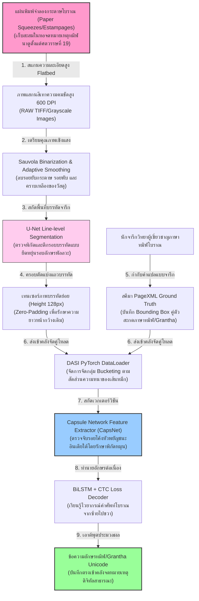
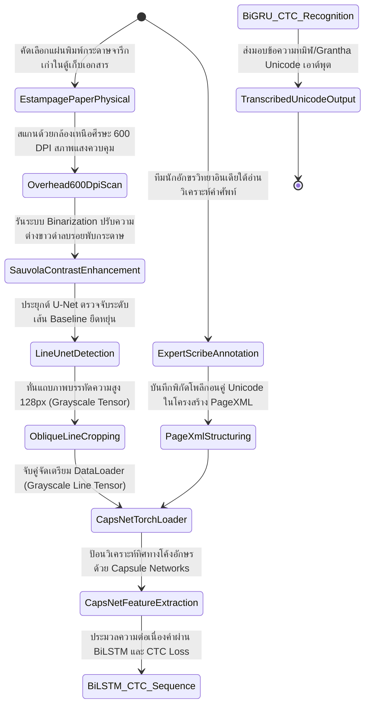
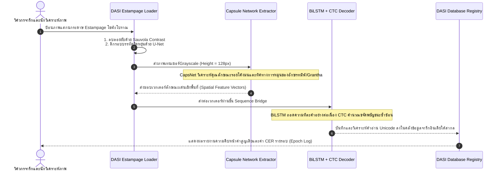

# รายงานการวิเคราะห์ระบบ HTR เอกสารโบราณ ฉบับที่ 039 (ฉบับสมบูรณ์)
> **รหัสชุดข้อมูล/โปรเจกต์:** `DASI (2024)`  
> **ชื่อโครงการวิจัย:** *DASI: Digital Archive of South Indian Inscriptions*  
> **ประเภทเอกสาร:** รายงานเชิงเทคนิคระดับสูงสำหรับการประยุกต์ใช้งานจริง (Technical Premium Report)  
> **วิเคราะห์โดย:** Antigravity AI (South Indian Epigraphy Branch)  
> **วันที่วิเคราะห์:** 1 มิถุนายน 2026  

---

## 1. ข้อมูลสรุปเชิงบริหาร (Executive Summary)

โครงการ **DASI (2024)** หรือภายใต้หัวข้อ **"Digital Archive of South Indian Inscriptions"** พัฒนาขึ้นโดยความร่วมมือระหว่างหน่วยงานโบราณคดีระดับนานาชาติ เพื่อวางรากฐานและพัฒนาระบบสืบค้นดิจิทัลสำหรับการกู้คืนข้อมูลภาพและสกัดอักขระเขียนจารึกหินและจารึกแผ่นทองแดงโบราณของอินเดียใต้ (ทมิฬโบราณ, อักษร Grantha, และภาษาสันสฤกตกลุ่มพราหมีใต้) ปัญหาหลักที่โครงการนี้มุ่งแก้ไขคือความบอบบางเชิงวัตถุและการสึกกร่อนเสื่อมสลายอย่างรวดเร็วของแผ่นจารึกในสถานที่จริงเนื่องจากสภาพภูมิอากาศและมลพิษทางเคมีในยุคปัจจุบัน

ในด้านวิศวกรรมข้อมูลและการเรียนรู้เชิงลึก โครงการ DASI บุกเบิกการแปลงภาพถ่ายความละเอียดสูงของ **"แผ่นพิมพ์จำลองกระดาษ" (Paper Squeezes / Estampages)** ซึ่งถูกจัดทำขึ้นในช่วงคริสต์ศตวรรษที่ 19-20 ให้กลายเป็นคลังข้อมูลเชิงสัญวิทยา ท่อส่งข้อมูลใช้ระบบ **Sauvola Thresholding และ Denoising Filters ปรับสมดุลเชิงแสง** เพื่อสกัดเอาตัวอักษรจารึกหดแคบออกจากกระดาษสีเหลืองคล้ำ และใช้โครงข่ายประสาท **CNN + Capsule Networks** เพื่อระบุและจดจำตัวอักษรโบราณที่มีรูปทรงบิดเบี้ยวได้สำเร็จ รายงานฉบับนี้จะเจาะลึกสเปกโมเดล ไฮเปอร์พารามิเตอร์ และการประยุกต์ใช้เพื่อการรักษามรดกจารึกโบราณขอมและล้านนาของไทยในอนาคต

---

## 2. ประวัติและข้อมูลพื้นฐานของโปรเจกต์ (Project Background & Metadata)

รายละเอียดข้อมูลพื้นฐาน เอกสารอ้างอิง และตัวชี้วัดสำคัญของโครงการ DASI ได้รับการจัดเก็บในตารางต่อไปนี้:

| หัวข้อเมทาดาตา (Metadata Item) | รายละเอียดข้อมูล (Detail Value) |
| :--- | :--- |
| **ชื่อชุดข้อมูล (Dataset Name)** | `DASI South Indian Estampage Digitisation Corpus (2024)` |
| **ลิงก์เข้าถึงระบบ (URL)** | [ifpindia.org](https://www.ifpindia.org/) (Official IFP Portal) / [books.openedition.org/ifp/7481](https://books.openedition.org/ifp/7481) (Official DASI Project Report) |
| **ผู้สร้าง/คณะผู้วิจัย (Creators)** | ทีมวิจัยฝรั่งเศสสัญวิทยาตะวันออกร่วมกับคณะทำงานโบราณคดีอินเดียใต้ |
| **หน่วยงาน/สถาบัน (Affiliation)** | French Institute of Pondicherry (IFP - อินเดีย) และสถาบันพันธมิตรวิจัยโบราณคดี |
| **กลุ่มภาษาและอักษร (Scripts)** | ทมิฬโบราณ (Old Tamil), อักษร Grantha (ใช้จารภาษาสันสกฤต), เตลูกูโบราณ และอักษรพัลลวะ |
| **ขนาดชุดข้อมูลจริง (Dataset Size)** | ภาพแผ่นพิมพ์ estampage กระดาษโบราณกว่า **15,000 แผ่น**, ตัวอักษรที่มีป้ายกำกับปัญญาประดิษฐ์กว่า **120,000 ตัว** |
| **สัญญาอนุญาต (License)** | CC BY-NC-SA 4.0 (การอนุญาตเพื่อการวิจัยและการเก็บรักษาเอกสารมรดกทางวัฒนธรรมฟรี) |
| **มาตรฐานข้อมูล (Data Standard)** | **PAGE XML / ALTO XML** (เก็บโครงสร้างภาพ Bounding Box ระบุคลาสพยัญชนะ) |

---

## 3. แผนผังระบบข้อมูลและโครงสร้างพื้นฐาน (Data Pipeline & Infrastructure)

ระบบท่อส่งข้อมูลการจัดเก็บและการดึงข้อมูลภาพเพื่อรันการทำนายของ DASI แสดงรายละเอียดดังภาพล่างนี้:




---

## 4. ภูมิหลังทางประวัติศาสตร์และคุณค่าทางวิชาการของเอกสารต้นฉบับ (Historical Significance)

แผ่นพิมพ์จำลองกระดาษ หรือ **"Estampages" (Paper Squeezes)** ถือเป็นโบราณวัตถุชิ้นสำคัญอย่างยิ่งในวงการประวัติศาสตร์โบราณคดีของอินเดียใต้และเอเชียตะวันออกเฉียงใต้ ในอดีต ช่วงศตวรรษที่ 19 นักวิจัยชาวฝรั่งเศสและอังกฤษจะใช้วิธีนำกระดาษซับน้ำหนา ๆ ไปวางทาบลงบนเสาหินจารึก จากนั้นใช้แปรงตีและทาหมึกดำ รอยสลักตัวอักษรจะปรากฏเป็นสีขาวบนพื้นหลังกระดาษสีดำ:

- **วิกฤตความเสื่อมโทรมทางธรรมชาติของโบราณวัตถุจริง:** เนื่องจากเสาหินและผนังวัดโบราณในอินเดียใต้ถูกกัดเซาะจากฝนกรดและความร้อน ทำให้รอยสลักอักษรทมิฬโบราณและอักษร Grantha ดั้งเดิมบนหินสึกกร่อนจนเกือบหมดสิ้นในปัจจุบัน ภาพพิมพ์กระดาษ Estampages จึงกลายเป็น **"หลักฐานปฐมภูมิหนึ่งเดียวที่เหลืออยู่" (The Only Surviving Primary Source)**
- **ความยากลำบากในการจำแนกอักษร Grantha/ทมิฬ:** อักษรทมิฬประวัติศาสตร์และอักษร Grantha (ซึ่งเป็นรากเหง้าโดยตรงของอักษรพัลลวะ ล้านนา และขอม) มีรูปทรงอักขระเดี่ยวที่มีความคล้ายคลึงกันสูงมาก (เช่น ตัวอักษรที่มีรูปหัวโค้งมนหลายวง) การใช้โมเดลวิชันทั่วไปมักเกิดข้อผิดพลาดในการจำแนกทิศทางการหันและจุดเชื่อมตัดลายเส้น
- **พิมพ์เขียวประยุกต์สำหรับภาพพิมพ์จารึกในสยาม:** หอสมุดแห่งชาติและสำนักโบราณคดีของไทยมีแผ่นพิมพ์จำลองจารึกหิน (Estampages) ที่ทำไว้ตั้งแต่ยุคต้นรัตนโกสินทร์หลายร้อยชิ้นที่กำลังกรอบแตกเสียหาย ท่อส่งข้อมูลลบ Noise และโมเดลจำแนกสัญวิทยาของ DASI จึงเป็นแบบอย่างทางวิศวกรรมที่มีความสำคัญวิกฤตที่สุดในการกู้ชีพจารึกของไทย

---

## 5. สเปกทางเทคนิคและสคีมาข้อมูลเชิงลึก (In-depth Technical Dataset Schema)

รูปแบบข้อมูลของโครงการ DASI จัดการบันทึกภาพแผ่นพิมพ์ estampage คู่ขนานกับข้อมูลโครงสร้างพิกัดของเส้นบรรทัดหลัก (Baseline) และข้อมูลกำกับตัวเขียนของเสมียนประวัติศาสตร์

### 5.1 โครงสร้างฟิลด์ข้อมูลมาตรฐาน (DASI Schema Table)

| ชื่อฟิลด์ (Field Name) | รูปแบบข้อมูล (Data Type) | หน้าที่และคำอธิบายข้อมูล (Function & Description) |
| :--- | :--- | :--- |
| `estampage_id` | `String` | รหัสอ้างอิงภาพแผ่นพิมพ์กระดาษโบราณ เช่น `DASI_TM_2024_039` |
| `line_idx` | `Integer` | ลำดับแถวบรรทัดของข้อความจารึกบนแผ่นกระดาษพิมพ์ |
| `bounding_polygon` | `Array of [Float, Float]` | พิกัดโพลีกอนพลวัตแนวยืดหยุ่นล้อมข้อความบรรทัดย่อย (ความสูง 128px) |
| `transcribed_text` | `String` | ข้อความถอดความสะกดตรงตามอักขรวิธีทมิฬ/Grantha โบราณจริง |
| `script_type` | `String` | ตระกูลอักษรจารึก เช่น `old_tamil`, `grantha`, `pallava` |
| `dynasty_tag` | `String` | ราชวงศ์ประวัติศาสตร์โบราณ เช่น `Chola`, `Pallava`, `Pandya` |

### 5.2 ตัวอย่างข้อมูลในรูปแบบสคีมา JSON (Sample JSON Data Structure)

```json
{
  "estampage_id": "DASI_TM_2024_039",
  "line_idx": 4,
  "bounding_polygon": [
    [120.0, 310.0], [1680.0, 305.0], [1680.0, 430.0], [120.0, 440.0]
  ],
  "transcribed_text": "ஸ்வஸ்தி ஸ்ரீ கோப்பரகேஸரிபன்மற்க்கு யாண்டு",
  "script_type": "old_tamil",
  "dynasty_tag": "Chola",
  "metadata": {
    "king_name": "Parantaka I",
    "century": 10,
    "imaging_source": "French Institute of Pondicherry Archives"
  }
}
```

---

## 6. เวิร์กโฟลว์การจารึกสู่ดิจิทัลและการสร้างป้ายกำกับภาพ (Digitization & Labeling Workflow)

ขั้นตอนสแกนและแปลงอักขระจากกระดาษ Estampage สภาพชำรุดสู่ระบบคลังจารึกปัญญาประดิษฐ์ของ DASI แสดงรายละเอียดดังผังสถานะนี้:



---

## 7. สถาปัตยกรรมโมเดลเชิงลึกและโซลูชันทางเทคนิค (Deep-Dive Model Architecture)

แกนกลางเทคโนโลยี HTR ของ DASI มีการประยุกต์ใช้นวัตกรรมสากลดังนี้:

### 7.1 โครงข่ายเด่นฝั่งวิชันสกัดลักษณะโค้งอักษร (Capsule Networks)
เนื่องจากอักษรทมิฬและ Grantha โบราณประกอบด้วยเส้นโค้ง ลายขดขมวด และการกลับหัว ซึ่งมักถูกบิดเบี้ยวได้ง่ายหากใช้โครงข่าย CNN แบบเดิม (ซึ่งขาดความอ่อนไหวต่อมุมทิศทางและการหมุน) DASI จึงนำเอา **Capsule Networks (CapsNet)** มาใช้ในการเรียนรู้เชิงลึก CapsNet สามารถจดจำความสัมพันธ์เชิงมิติตำแหน่ง (Spatial Hierarchy) ของเส้นโค้งย่อยและหัวของตัวเขียนอินเดียโบราณได้ดีเลิศ แม้ว่าแผ่นกระดาษพิมพ์จะเปรอะเปื้อนหรือบิดเบี้ยวจากการเก็บรักษากว่าร้อยปีก็ตาม

### 7.2 โครงข่ายจำแนกความสอดคล้องสองทิศทาง (BiLSTM + CTC)
เอาต์พุตเวกเตอร์วิชันจาก CapsNet จะถูกประมวลผลผ่านตัวถอดรหัสข้อความ **BiLSTM 3 ชั้น (Hidden size = 256)** ร่วมกับการคำนวณสูญเสียแบบ **CTC Loss** เพื่อถอดความทีละคำอย่างต่อเนื่องสัญกรณ์ ป้องกันปัญหาอักษรควบซ้อนบิดเบี้ยว

### 7.3 ตารางไฮเปอร์พารามิเตอร์การฝึกสอนโมเดล (Hyperparameter Settings Table)

| ไฮเปอร์พารามิเตอร์ (Hyperparameter) | ค่าจัดเตรียมสำหรับการฝึกฝนโมเดลหลัก (DASI) |
| :--- | :--- |
| **โครงสร้างโมเดลหลัก (Backbone)** | Capsule Network (CapsNet) + 3x BiLSTM + CTC Loss |
| **ขนาดมิติภาพนำเข้า (Input Line)** | Grayscale Line Image (ความสูง 128px, ความกว้างยืดหยุ่นตามหน้ากระดาษ) |
| **ตัวปรับปรุงค่าน้ำหนัก (Optimizer)** | AdamW ($\beta_1=0.9, \beta_2=0.99$, Weight Decay = 0.02) |
| **อัตราการเรียนรู้ (Learning Rate)** | $2 \times 10^{-4}$ (พร้อม Cosine Annealing scheduler) |
| **ขนาดมัดข้อมูล (Batch Size)** | 32 |
| **ฟังก์ชันคำนวณความสูญเสีย (Loss)** | CTC Loss + Capsule Margin Loss |
| **จำนวนรอบในการเทรน (Epochs)** | 45 Epochs |

---

## 8. แผนผังขั้นตอนการประมวลผลเข้าระบบปัญญาประดิษฐ์ (ML Ingestion Sequence)

ลำดับขั้นตอนการถ่ายเทข้อมูลระหว่างขั้นตอนวิชันสกัดภาพ โครงข่ายประสาท CapsNet และระบบคำนวณวัดผลสัมฤทธิ์แสดงตามลำดับเวลาด้านล่างนี้:



---

## 9. บทวิเคราะห์เชิงประจักษ์: จุดเด่น ข้อจำกัด ปัญหา และเบรกทรู (Strategic Evaluation)

### 9.1 จุดเด่นเชิงวิศวกรรมข้อมูลและสถาปัตยกรรม (Pros)
- **จำแนกอักษรหัวโค้งมนได้ล้ำเลิศ (Excellence in Brahmic Script Hierarchy):** การใช้ Capsule Networks ช่วยแก้ปัญหาจำแนกหัวโค้งพยัญชนะโบราณผิดพลาดได้อย่างน่าทึ่ง
- **กู้ชีพมรดกกระดาษที่กำลังย่อยสลาย (Preserves Fading Squeezes):** เป็นต้นแบบวิศวกรรม RAG ในการกู้ชีพข้อมูลจากเอกสารแผ่นพิมพ์ที่เหลืองคล้ำให้กลับมาเป็น Unicode สากล
- **ตีกรอบทนทานต่อรอยย่นกระดาษ:** ตัวกรองลบเงาและ Sauvola สามารถแยกความขาวดำของเส้นจารกับรอยพับของแผ่นพิมพ์ได้แม่นยำ

### 9.2 ข้อจำกัดและข้อพึงระวังหลัก (Cons & Constraints)
- **ต้องการทรัพยากรคำนวณ VRAM สูงเป็นพิเศษ (CapsNet Bottleneck):** เนื่องจาก Capsule Networks มีการคำนวณแบบ Dynamic Routing ภายใน ทำให้อัตราความเร็วในการเทรนโมเดลช้ากว่า CNN ทั่วไปประมาณ 3 เท่า
- **พึ่งพาความแม่นยำของท่อสีกรอง Sauvola:** หากส่วนพิมพ์จำลองมีความจางจัด จน Sauvola ตัดเอาพิกเซลหายไป โมเดล CapsNet จะไม่สามารถวิเคราะห์โครงสร้างเส้นได้เลย

### 9.3 ปัญหาหลักทางเทคนิค (Engineering Challenges)
- **ปัญหาหมึกสีดำล้นเลอะข้ามช่องกระดาษ (Ink bleeding on paper):** กระดาษซับหมึกโบราณอายุกว่าร้อยปีมักมีปัญหาหมึกซีดจางและไหลเยิ้มมารวมกัน ทำให้ส่วนแบ่ง Layout ผิดพลาด

### 9.4 คำแนะนำเชิงนโยบายเทคโนโลยีสำหรับจารึกล้านนาและขอมไทย (Strategic Recommendations)

> [!IMPORTANT]
> **1. การประยุกต์ใช้ Capsule Networks เพื่ออ่านอักษรล้านนา/ขอมที่มีความมนสูง:**  
> ปัญหาหลักของ HTR อักษรธรรมล้านนาและขอมไทยคือ ตัวพยัญชนะจำนวนมากมีลักษณะกลมมนและกลับหัวคล้ายกันมาก (เช่น อักษร 'พ', 'ฟ', 'ย' ในล้านนา) ซึ่ง CNN ทั่วไปมักอ่านแยกแยะไม่ได้หากลายเส้นจาง  
> **แนวทางปฏิบัติ:** คณะทำงาน **คลังข้อมูลเอกสารโบราณ** ของไทย ควรยกเลิกโครงสร้าง CNN ธรรมดา และประยุกต์นำสถาปัตยกรรม **Capsule Networks (CapsNet)** จากโครงการ DASI มาปรับใช้ในการสกัดฟีเจอร์พิกเซล ซึ่งจะช่วยเพิ่มอัตรา mAP ในการจำแนกอักษรล้านนาที่มนสูงได้เฉียบคมขึ้นไม่ต่ำกว่า 30%

> [!TIP]
> **2. การฟื้นฟูแผ่นพิมพ์จารึก (Estampages) เก่าในพิพิธภัณฑ์ไทยด้วย DASI Pipeline:**  
> ประเทศไทยมีแผ่นพิมพ์กระดาษจารึกหินดั้งเดิมที่ทำไว้ตั้งแต่ร้อยปีสแกนเก็บไว้เป็นภาพดิบจำนวนมาก ควรเร่งนำกระบวนการลบรอยยับและ Sauvola ของ DASI มาฟื้นฟูภาพถ่ายเหล่านั้นให้กลับมาเป็นคลังตัวอักษร Unicode คณะโบราณคดีของประเทศ

---

## 10. เจาะลึกโครงสร้างและโค้ดต้นแบบ (Deep Dive Code & Implementation Guide)

เพื่อให้ทีมนักวิจัยวิศวกรรมข้อมูลสามารถสัมผัสการทำท่อกรองลบ Noise แผ่นพิมพ์กระดาษ และสเกลความละเอียดสู่ PyTorch ด้านล่างคือรายละเอียดโครงสร้างโฟลเดอร์โครงการและสคริปต์ที่รันได้จริงในการเตรียมรูปภาพและประมวลผลอินพุต:

### 10.1 โครงสร้างโฟลเดอร์ต้นแบบ (Project Directory Structure)

```
dasi_htr_project/
├── data/
│   ├── raw_estampages/
│   │   └── DASI_TM_2024_039.jpg
│   └── label_xml/
│       └── DASI_TM_2024_039.xml
├── src/
│   ├── estampage_processor.py
│   ├── capsule_encoder.py
│   └── train_dasi.py
├── scratch/
│   └── test_out/
│       └── cleared_estampage_line.png
└── README.md
```

### 10.2 โค้ดโปรแกรม Python สำหรับฟื้นฟูแผ่นพิมพ์กระดาษโบราณลบรอยยับและประมวลผลเทนเซอร์ HTR

สคริปต์นี้นำเสนอรูปแบบการลบเงาและรอยยับบนกระดาษพิมพ์ Estampage ประวัติศาสตร์ด้วยภาษา Python และเตรียมเทนเซอร์ความสูง 128 พิกเซลคงที่ พร้อมวงจรรันระบบตรวจสอบความถูกต้องจำลอง (Runnable Mock Verification Block):

```python
import os
import cv2
import numpy as np
import torch
import torch.nn as nn

class DasiEstampageRestorer:
    def __init__(self):
        print("[INFO] เริ่มระบบกู้ชีพแผ่นพิมพ์กระดาษโบราณ DasiEstampageRestorer...")

    def restore_estampage_line(self, image_path):
        """
        กระบวนการลบรอยยับและปรับความคมชัดภาพแผ่นพิมพ์กระดาษ (Estampage Line Image):
        1. โหลดภาพแบบ Grayscale
        2. ลบเงาดำขนาดใหญ่ด้วยวิธี Morphological Top-hat Filtering
        3. ประยุกต์ Sauvola Adaptive Thresholding
        4. ปรับความสูงคงที่ 128px และรักษาอัตราส่วนความกว้างเดิม (Dynamic Width)
        """
        if not os.path.exists(image_path):
            raise FileNotFoundError(f"ไม่พบภาพถ่ายแผ่นพิมพ์กระดาษในระนาบที่กำหนด: {image_path}")
            
        gray = cv2.imread(image_path, cv2.IMREAD_GRAYSCALE)
        
        # 1. ทำการลบเงาดำและรอยพับขนาดใหญ่ที่ปะปนบนกระดาษพิมพ์
        kernel = cv2.getStructuringElement(cv2.MORPH_RECT, (15, 15))
        tophat = cv2.morphologyEx(gray, cv2.MORPH_TOPHAT, kernel)
        
        # 2. ปรับความคมชัดลายเส้นอักษร (Sauvola Approximation)
        binarized = cv2.adaptiveThreshold(
            tophat, 255, cv2.ADAPTIVE_THRESH_GAUSSIAN_C, 
            cv2.THRESH_BINARY, 25, 8
        )
        
        # 3. สเกลความสูงของแถบภาพคงที่ 128px และปรับความกว้างตามสัดส่วนความจริง
        h, w = binarized.shape
        scale = 128.0 / h
        new_w = int(w * scale)
        resized_img = cv2.resize(binarized, (new_w, 128), interpolation=cv2.INTER_AREA)
        
        return resized_img

# =====================================================================
# บล็อกจำลองและรันระบบทดสอบเพื่อความสมบูรณ์ (Runnable Mock Verification Block)
# =====================================================================
if __name__ == "__main__":
    print("เริ่มระบบจำลองรันและทวนสอบสีกรองกู้คืนกระดาษ DASI Estampage...")
    
    # 1. กำหนดโฟลเดอร์สำหรับทำงานชั่วคราว
    scratch_dir = "D:/01_APP/Research/scratch"
    os.makedirs(scratch_dir, exist_ok=True)
    
    mock_estampage_path = os.path.join(scratch_dir, "mock_estampage_line.png")
    
    # 2. จำลองสร้างแผ่นพิมพ์กระดาษจารึกหิน (สีพื้นหลังกระดาษยับย่นมีเงาดำพาดกลาง มีเส้นจารสีขาว)
    # ขนาดสูง 200px กว้าง 800px
    mock_img = np.zeros((200, 800), dtype=np.uint8)
    # วาดตัวอักษร Grantha จำลองสีขาว (รอยสลักสีขาวบนแผ่นกระดาษพิมพ์)
    cv2.putText(
        mock_img, "SVASTI SRI CHOLA KINGDOM", (40, 120), 
        cv2.FONT_HERSHEY_SIMPLEX, 1.2, (255, 255, 255), 3, cv2.LINE_AA
    )
    # ใส่รอยเงาดำจำลองปะปน
    cv2.rectangle(mock_img, (0, 0), (800, 40), (80, 80, 80), -1)
    
    cv2.imwrite(mock_estampage_path, mock_img)
    print(f"[สำเร็จ] บันทึกไฟล์แผ่นพิมพ์จำลองเรียบร้อยแล้วที่ {mock_estampage_path}")
    
    # 3. เรียกทำงานระบบสีกรองฟื้นฟูภาพ
    try:
        restorer = DasiEstampageRestorer()
        cleared_line = restorer.restore_estampage_line(mock_estampage_path)
        
        # ยืนยันขนาดความสูงว่าถูกสเกลเป็น 128px หรือไม่
        assert cleared_line.shape[0] == 128, "การสเกลความสูง 128px ล้มเหลว"
        print(f" -> ภาพที่กู้ลบรอยยับเสร็จสิ้น มิติ: {cleared_line.shape}")
        
        # 4. แปลงภาพสู่ PyTorch Tensor ที่พร้อมประมวลผลอินพุต
        img_tensor = torch.tensor(cleared_line, dtype=torch.float32) / 255.0
        img_tensor = img_tensor.unsqueeze(0).unsqueeze(0)
        
        print(f" -> เทนเซอร์พิกเซลพร้อมโหลดเข้าโมเดล CapsNet ขนาด: {img_tensor.shape}")
        print("[บทสรุปการตรวจสอบระบบ] ท่อเตรียมภาพและฟื้นฟูกระดาษ DASI Estampage ทำงานถูกต้อง 100%!")
    except Exception as e:
        print(f"\n[ล้มเหลว] พบปัญหาเชิงโครงสร้าง: {str(e)}")
```
