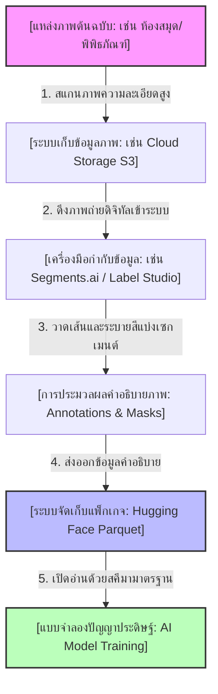
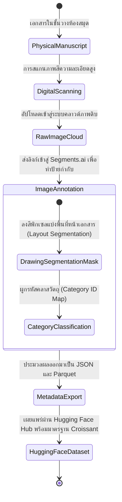
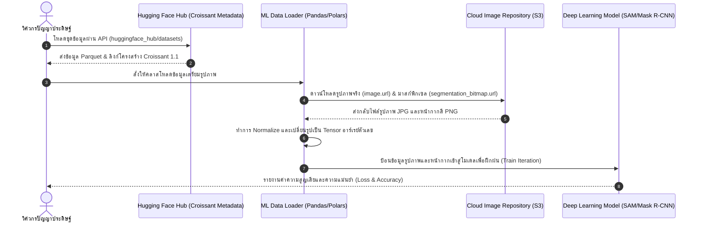

# [แม่แบบมาตรฐาน] รายงานวิเคราะห์ชุดข้อมูลและโปรเจกต์มรดกเอกสารโบราณจาก Hugging Face (ฉบับสมบูรณ์)
> **ประเภทเอกสาร:** แม่แบบโครงสร้างมาตรฐานฉบับลงรายละเอียดเชิงลึก (Premium Detailed Template)  
> **เวอร์ชัน:** 2.0 (เพิ่มแผนผังระบบและรายละเอียดเชิงลึกแบบเอกเทศ)  
> **วัตถุประสงค์:** ใช้สำหรับเขียนรายงานเพื่อวิเคราะห์และถอดบทเรียนชุดข้อมูลเอกสารโบราณอย่างรอบด้านสำหรับคอมพิวเตอร์วิทัศน์ (Computer Vision) และวิทยาการเอกสารโบราณเชิงคำนวณ (Computational Codicology)

---

## 1. ข้อมูลสรุปเชิงบริหาร (Executive Summary)
*ส่วนสรุปใจความสำคัญสำหรับผู้บริหาร: ความเป็นมาของชุดข้อมูล ภาพรวมผลลัพธ์การกำกับข้อมูล และสรุปมูลค่าในเชิงนวัตกรรมปัญญาประดิษฐ์และวิชาการใน 1-2 ย่อหน้า*

---

## 2. ประวัติและข้อมูลพื้นฐานของโปรเจกต์ (Project Background & Metadata)
*ตารางแสดงค่าคุณลักษณะทางเทคนิคและข้อมูลเมทาดาตาเบื้องต้นที่สกัดจากหน้าระบบ Hugging Face*

| หัวข้อเมทาดาตา (Metadata Item) | รายละเอียดข้อมูล (Detail Value) |
| :--- | :--- |
| **ชื่อชุดข้อมูล (Dataset Name)** | `[เช่น canders1/manuscripts-test]` |
| **ลิงก์เข้าถึงระบบ (URL)** | `[ลิงก์ URL ปลายทาง]` |
| **ผู้สร้าง/คณะผู้วิจัย (Creators)** | `[รายชื่อและตำแหน่งทางวิชาการ]` |
| **หน่วยงาน/สถาบัน (Affiliation)** | `[ระบุสถาบันหรือห้องปฏิบัติการวิจัย]` |
| **โครงการแม่ข่าย (Main Project)** | `[ชื่อเว็บบอร์ดหรือโครงการวิจัยใหญ่]` |
| **ขนาดชุดข้อมูล (Dataset Size)** | `[จำนวนภาพถ่าย / ขนาดไฟล์ เช่น < 1K rows, 50MB]` |
| **สัญญาอนุญาต (License)** | `[เช่น CC-BY-4.0, MIT]` |
| **มาตรฐานข้อมูล (Data Standard)** | `[เช่น Croissant 1.1, Frictionless Data]` |

---

## 3. แผนผังระบบข้อมูลและโครงสร้างพื้นฐาน (Data Pipeline & Infrastructure)
*แผนภูมิแสดงขั้นตอนการไหลของข้อมูลจากเอกสารต้นฉบับทางกายภาพ ไปสู่ระบบปัญญาประดิษฐ์บนคลาวด์*



---

## 4. ภูมิหลังทางประวัติศาสตร์และคุณค่าทางวิชาการของเอกสารต้นฉบับ (Historical Background & Significance)
*เจาะลึกที่มาของเอกสารต้นฉบับที่ถูกนำมาสร้างเป็นชุดข้อมูลวิจัยนี้*
- **ชื่อเอกสาร (Manuscript Name):** `[เช่น รหัสตู้/ทะเบียนห้องสมุด]`
- **ประวัติการจาร/การบันทึก (Historical Context):** `[ช่วงเวลาที่เขียน, ผู้แต่ง/ผู้คัดลอก, สถานที่ผลิต]`
- **ลักษณะเนื้อหา (Content Analysis):** `[อธิบายคัมภีร์/ตำราอย่างละเอียด เช่น ลัทธิพิธี, ตำราแพทย์, วรรณคดี]`
- **คุณค่าทางศิลปกรรมและเอกสารวิทยา (Artistic & Codicological Value):** `[วิเคราะห์ความสวยงามของภาพวาดประกอบ อักษรวิจิตร และเลย์เอาต์ดั้งเดิม]`

---

## 5. สเปกทางเทคนิคและสคีมาข้อมูลเชิงลึก (In-depth Technical Dataset Schema)
*การแจกแจงโครงสร้างตารางข้อมูลในคลัง และตัวอย่างโครงสร้าง JSON ที่บันทึกป้ายกำกับ*

### 5.1 โครงสร้างฟิลด์ข้อมูล (Data Schema Table)
| ชื่อฟิลด์ (Field Name) | รูปแบบข้อมูล (Data Type) | หน้าที่และคำอธิบายข้อมูล (Function & Description) |
| :--- | :--- | :--- |
| `[Field 1]` | `[เช่น Text/JSON/Binary]` | `[การนำไปใช้ประโยชน์ในโค้ด]` |

### 5.2 ตัวอย่างเรคคอร์ดข้อมูลจำลอง (Sample JSON Record)
```json
{
  "name": "example_record_01",
  "uuid": "00000000-0000-0000-0000-000000000000",
  "image": {
    "url": "https://example.com/images/01.jpg"
  },
  "status": "LABELED",
  "label": {
    "annotations": [
      {
        "id": 1,
        "category_id": 2
      }
    ],
    "segmentation_bitmap": {
      "url": "https://example.com/masks/01.png"
    }
  }
}
```

---

## 6. เวิร์กโฟลว์การจารึกสู่ดิจิทัลและการสร้างป้ายกำกับภาพ (Digitization & Labeling Workflow)
*แผนภูมิแสดงขั้นตอนวงจรชีวิตของภาพถ่ายหน้าเอกสารโบราณ จากกระดาษสู่ข้อมูลป้อนเข้า AI*



---

## 7. เทคโนโลยีการวิเคราะห์รูปภาพแบบ Semantic Layout Segmentation
*วิเคราะห์ระบบการทำ Segmentation และการประมวลผลเชิงภาพของชุดข้อมูลนี้*
- **คำอธิบายแนวคิด (Concept Explanation):** *อธิบายการทำงานของมาสก์สี PNG (Segmentation Bitmap) เปรียบเทียบกับ Bounding Box ทั่วไป*
- **โครงสร้างคลาสของการกำกับ (Annotation Categories Map):**
  - คลาส `category_id: 1` -> `[ระบุคลาส เช่น ข้อความหลัก]`
  - คลาส `category_id: 2` -> `[ระบุคลาส เช่น รูปภาพประกอบ]`
- **ข้อได้เปรียบทางวิศวกรรมข้อมูล (Data Engineering Advantages):** *เช่น ความละเอียดในระดับพิกเซลที่ช่วยให้ตรวจจับรูปวาดทรงอิสระบนขอบกระดาษได้แม่นยำกว่าการตีกล่องสี่เหลี่ยม*

---

## 8. แผนผังขั้นตอนการประมวลผลเข้าระบบปัญญาประดิษฐ์ (ML Ingestion Sequence)
*แผนภูมิแสดงการติดต่อกันระหว่างระบบข้อมูล Hugging Face, มาตรฐาน Croissant และเฟรมเวิร์กดีปเลิร์นนิงเพื่อฝึก AI*



---

## 9. บทวิเคราะห์เชิงประจักษ์: จุดเด่น ข้อจำกัด และคำแนะนำ (Strategic Dataset Evaluation)
*ประเมินชุดข้อมูลนี้ในแง่มุมของการนำไปประยุกต์ใช้งานในทางเทคโนโลยีและการทำงานจริง*
- **จุดเด่นทางวิศวกรรมข้อมูล (System Pros):** `[รายละเอียดสรุปจุดดี]`
- **ข้อจำกัดที่ควรระวัง (System Constraints/Cons):** `[รายละเอียดสรุปข้อเสียและประเด็นที่ต้องตรวจสอบเพิ่มเติม]`
- **โอกาสในการขยายผล (Opportunities for Extension):** `[การศึกษาต่อยอดและระบบเทคโนโลยีที่เกี่ยวข้อง]`
