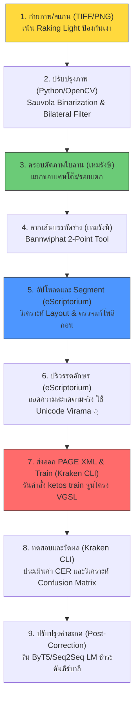

# คู่มือ HTR Research แกนกลาง — จากศูนย์สู่การเตรียมชุดข้อมูลอ่านเอกสารโบราณไทยด้วย AI

> **โครงการ:** พัฒนาชุดข้อมูลและโมเดลการรู้จำอักษรเขียน (HTR) สำหรับเอกสารโบราณไทย (ใบลานและสมุดพับ)  
> **เป้าหมาย:** สร้างคู่มือระดับปฏิบัติการสำหรับผู้ปฏิบัติงานและนักวิจัยที่เริ่มต้นจากศูนย์  
> **สถานะ:** เสร็จสมบูรณ์ (มิถุนายน 2026)

---

## ภาพรวมและเป้าหมายโครงการ

โครงการนี้มุ่งพัฒนาชุดข้อมูลคุณภาพสูง (Ground Truth Dataset) เพื่อสอนคอมพิวเตอร์ให้อ่านอักษรโบราณที่จารึกบน **คัมภีร์ใบลาน** และเขียนบน **สมุดพับ** (เช่น อักษรขอมไทย อักษรธรรมล้านนา และอักษรไทยโบราณ) ด้วยเทคโนโลยี **HTR (Handwritten Text Recognition)** 

เนื่องจากเอกสารโบราณเหล่านี้มีลักษณะเด่นคือ **อักขรวิธีแบบสระซ้อนและพยัญชนะเชิง (Vertical Stacked Scripts)** การประมวลผลด้วยกรอบสี่เหลี่ยมแบบดั้งเดิม (Bounding Box) จึงล้มเหลว โครงการนี้นี้จึงเลือกใช้สถาปัตยกรรม **Baseline-driven Layout Analysis (การลากแนวเส้นฐานร่วมกับพื้นที่โพลีกอน)** ของเครื่องยนต์ **Kraken** และเอนจิน **eScriptorium** ร่วมกับโปรแกรมเตรียมข้อมูล **เหมรังษี** ภายในทีม

---

## แผนผังระบบนิเวศและท่อส่งข้อมูล (Ecosystem Roadmap)

กระบวนการทำงานเริ่มจากเอกสารกายภาพไปจนถึงผลลัพธ์คำทำนายของ AI ได้รับการจัดระบบผ่านเครื่องมือสามประสานดังแผนผังด้านล่าง:

---

## สารบัญแยกตามหมวดหมู่ (22 ไฟล์คู่มือหลัก)

โปรดเลือกอ่านเอกสารแบบเป็นระบบตามลำดับขั้นตอนปฏิบัติงานจริงดังต่อไปนี้:

### หมวด 01: คู่มือเริ่มต้นสำหรับผู้บริหารและผู้ปฏิบัติการ
หมวดนี้ช่วยสร้างความเข้าใจพื้นฐาน เหตุผลของเทคโนโลยี และการเปรียบเทียบโซลูชันระดับโลก
*   **บทที่ 1.1:** [ภาพรวมระบบนิเวศ HTR และเป้าหมายโครงการ](1.1_ภาพรวมระบบนิเวศHTRและเป้าหมายโครงการ.md)
    *   *เนื้อหา:* ทำไมต้องใช้ HTR แทน OCR, ลักษณะใบลานและสมุดพับไทย, และเป้าหมายโครงการในการทำ CER < 3%
*   **บทที่ 1.2:** [เปรียบเทียบเครื่องมือ HTR ทั่วโลกและทำไมต้อง Kraken](1.2_เปรียบเทียบเครื่องมือHTRทั่วโลกและทำไมต้องKraken.md)
    *   *เนื้อหา:* เปรียบเทียบ Transkribus, PyLaia, Loghi, Kraken และ eScriptorium ในแง่ลิขสิทธิ์ ทรัพยากร และอักษรโบราณ
*   **บทที่ 1.3:** [ประวัติศาสตร์และพัฒนาการของระบบ OCR และ HTR](1.3_ประวัติศาสตร์และพัฒนาการของระบบOCRและHTR.md)
    *   *เนื้อหา:* วิวัฒนาการจากระบบ Optical Character Recognition ยุคแรกสู่เทคโนโลยี Handwritten Text Recognition แบบ Deep Learning
*   **บทที่ 1.4:** [เจาะลึกวิวัฒนาการและสถาปัตยกรรมภายในของเครื่องมือ Kraken สู่รุ่น 7.0](1.4_เจาะลึกวิวัฒนาการและสถาปัตยกรรมภายในของเครื่องมือKrakenสู่รุ่น7.0.md)
    *   *เนื้อหา:* สถาปัตยกรรมของ Kraken, การออกแบบโครงสร้าง VGSL, และความสามารถที่ปรับปรุงใหม่ใน Kraken รุ่น 7.0

### หมวด 02: ทฤษฎีและมาตรฐานข้อมูล
หมวดนี้อธิบายกลไกเชิงเทคนิคของ AI และมาตรฐานไฟล์ XML ที่ห้องสมุดดิจิทัลทั่วโลกเลือกใช้
*   **บทที่ 2.1:** [ทฤษฎีการอ่านข้อความด้วย AI และกลไก CTC](2.1_ทฤษฎีการอ่านข้อความด้วยAIและกลไกCTC.md)
    *   *เนื้อหา:* การสกัดลักษณะ (CNN), การวิเคราะห์เชิงลำดับเวลา (BiLSTM) และการถอดรหัส CTC Loss ร่วมกับสถาปัตยกรรม Transformer (ViT)
*   **บทที่ 2.2:** [มาตรฐาน PAGE XML และ ALTO XML เชิงเปรียบเทียบ](2.2_มาตรฐานPAGE_XMLและALTO_XMLเชิงเปรียบเทียบ.md)
    *   *เนื้อหา:* โครงสร้างแท็กพิกัด, PAGE XML vs ALTO XML, Bounding Box vs Polygons และการจัดการภาษาไทย/อักษรซ้อนเชิง
*   **บทที่ 2.3:** [การควบคุมรุ่นชุดข้อมูลและระบุเวอร์ชันด้วย DVC](2.3_การควบคุมรุ่นชุดข้อมูลและระบุเวอร์ชันด้วยDVC.md)
    *   *เนื้อหา:* การใช้ Data Version Control (DVC) ร่วมกับ Git เพื่อติดตามและระบุรุ่นของชุดข้อมูลสำหรับโมเดล HTR

### หมวด 03: ขั้นตอนการเตรียมภาพใบลานและสมุดพับ
หมวดนี้สอนมาตรฐานการถ่ายภาพดิบและการใช้สคริปต์คอมพิวเตอร์ลบลายเส้นใบไม้และคราบราดำ
*   **บทที่ 3.1:** [คู่มือการถ่ายภาพและสแกนใบลานกับสมุดพับ](3.1_คู่มือการถ่ายภาพและสแกนใบลานกับสมุดพับ.md)
    *   *เนื้อหา:* เทคนิคสาดแสงเฉียง (Raking Light), แผ่นกระจกกดแบน, ขนาดความละเอียด DPI ที่เหมาะสม และระบบการตั้งชื่อไฟล์สากล
*   **บทที่ 3.2:** [การประมวลผลภาพขั้นต้นเพื่อกำจัดคราบราและสัญญาณรบกวน](3.2_การประมวลผลภาพขั้นต้นเพื่อกำจัดคราบราและสัญญาณรบกวน.md)
    *   *เนื้อหา:* ทฤษฎีและสคริปต์ Python ในการรัน Sauvola Adaptive Binarization และ Bilateral Filtering เพื่อรักษารายละเอียดขอบอักษร

### หมวด 04: คู่มือการใช้งานซอฟต์แวร์ประยุกต์
หมวดนี้อธิบายการใช้โปรแกรมเหมรังษีเพื่อเตรียมภาพ และการรัน eScriptorium ผ่านระบบ Docker
*   **บทที่ 4.1:** [การใช้โปรแกรมเหมรังษีในการ Crop และกำหนดเส้นพื้นฐาน](4.1_การใช้โปรแกรมเหมรังษีในการCropและกำหนดเส้นพื้นฐาน.md)
    *   *เนื้อหา:* การประยุกต์ใช้ OpenSeadragon, เครื่องมือ Bannwiphat 2-point, ตารางถอดความ Visual Table และเวิร์กโฟลว์ส่งผ่านภาพย่อย
*   **บทที่ 4.2:** [การติดตั้งและตั้งค่า eScriptorium ผ่าน Docker](4.2_การติดตั้งและตั้งค่าeScriptoriumผ่านDocker.md)
    *   *เนื้อหา:* โครงสร้าง `docker-compose.yml` และ `.env`, ระบบ GPU passthrough สำหรับ Celery, และคู่มือแก้บั๊กรันระบบ 10 กรณี
*   **บทที่ 4.3:** [การทำ Annotation บน eScriptorium และการตรวจแก้ Baseline](4.3_การทำAnnotationบนeScriptoriumและการตรวจแก้Baseline.md)
    *   *เนื้อหา:* อัปโหลดภาพ, คำสั่งบอร์ด Segment อัตโนมัติ, การปรับแก้โหนด Baseline และการใช้กล่อง Polygon Mask หลบเลี่ยงอักษรซ้อนเชิง
*   **บทที่ 4.4:** [การสกัดและแปลงฐานข้อมูลเหมรังษีเป็น PAGE XML](4.4_การสกัดและแปลงฐานข้อมูลเหมรังษีเป็นPAGE_XML.md)
    *   *เนื้อหา:* โครงสร้างความสัมพันธ์ฐานข้อมูลเหมรังษี (Bannwiphat), สคริปต์สกัดสร้างไฟล์ PAGE XML และรูปภาพคู่กันด้วย Python แบบไร้ไลบรารีภายนอก

### หมวด 05: แนวทางการปริวรรตและกฎการถอดอักษร
หมวดนี้ระบุแนวทางปฏิบัติงานพิมพ์ข้อความเฉลยเพื่อไม่ให้ AI เกิดความเข้าใจคลาดเคลื่อน
*   **บทที่ 5.1:** [กฎการปริวรรตอักษรขอมโบราณและการใช้ Unicode Virama](5.1_กฎการปริวรรตอักษรขอมโบราณและการใช้Unicode_Virama.md)
    *   *เนื้อหา:* กฎการถอดความสะกดตามรูปคำพิกเซลจริง (Diplomatic), ระบบพิมพ์ตัวเชิงห้อย U+0E3A (◌ฺ), และการใช้กล่อง `☐` แทนอักษรชำรุด
*   **บทที่ 5.2:** [แนวปฏิบัติในการควบคุมคุณภาพข้อมูลและการประเมินความสอดคล้องระหว่างผู้พิมพ์](5.2_แนวปฏิบัติในการควบคุมคุณภาพข้อมูลและการประเมินความสอดคล้องระหว่างผู้พิมพ์.md)
    *   *เนื้อหา:* ขั้นตอน Double-blind, บทบาทผู้ตรวจทาน, การคำนวณสถิติความสอดคล้อง (IAA: Kappa/Alpha), และเช็คลิสต์ตรวจข้อมูล 10 ประการก่อนเทรน

### หมวด 06: การติดตั้งระบบและการฝึกสอน AI
หมวดนี้สอนการป้อนข้อมูลสอนเครื่องและปรับโครงสร้างประสาทเทียมของเครื่องยนต์ Kraken
*   **บทที่ 6.1:** [การติดตั้ง Kraken แบบ Local และผ่าน CLI](6.1_การติดตั้งKrakenแบบLocalและผ่านCLI.md)
    *   *เนื้อหา:* การเตรียม Python Virtual Environment, การผสาน PyTorch GPU (CUDA), และคำสั่งตรวจสอบความพร้อมของระบบ
*   **บทที่ 6.2:** [คู่มือการเทรนโมเดล Kraken และการจูนพารามิเตอร์อย่างละเอียด](6.2_คู่มือการเทรนโมเดลKrakenและการจูนพารามิเตอร์อย่างละเอียด.md)
    *   *เนื้อหา:* ไวยากรณ์ `ketos train` ละเอียด, การตั้งโครงสเปกแบบ VGSL, การทำ Transfer Learning และการแก้ปัญหา Out of Memory (OOM)

### หมวด 07: การประเมินผลและการปรับปรุงหลังบ้าน
หมวดนี้สอนวิเคราะห์จุดอ่อนของโมเดลและการสร้างระบบสะกดคำโบราณอัตโนมัติมาตรวจแก้ผลลัพธ์
*   **บทที่ 7.1:** [การประเมินความแม่นยำของโมเดลด้วยค่า CER และ WER](7.1_การประเมินความแม่นยำของโมเดลด้วยค่าCERและWER.md)
    *   *เนื้อหา:* ทฤษฎี Edit Distance, คำสั่ง `ketos test`, การสแกนล็อกวิเคราะห์ Confusion Matrix ค้นหาอักขระที่ AI สับสนบ่อยด้วยสคริปต์ Python
*   **บทที่ 7.2:** [การเพิ่มความแม่นยำด้วยโมเดลภาษาและการทำ Post-Correction](7.2_การเพิ่มความแม่นยำด้วยโมเดลภาษาและการทำPost_Correction.md)
    *   *เนื้อหา:* การสร้างโมเดลภาษาทักษะระดับไบต์ (ByT5), โครงสร้างสองขั้นตอน (Two-stage HTR), และสคริปต์ดึงคำศัพท์พระไตรปิฎกช่วยชำระจารึกชำรุด
*   **บทที่ 7.3:** [การติดตั้งระบบบริการโมเดล HTR และสคริปต์การใช้งาน API](7.3_การติดตั้งระบบบริการโมเดลHTRและสคริปต์การใช้งานAPI.md)
    *   *เนื้อหา:* การตั้งค่าระบบบริการโมเดล HTR บน Web Server และการเขียนสคริปต์ส่งคำขอใช้งานระบบประมวลผลผ่าน API
*   **บทที่ 7.4:** [การแก้คำสะกดผิดอัตโนมัติด้วยโมเดลภาษาขนาดเล็กเฉพาะทาง](7.4_การแก้คำสะกดผิดอัตโนมัติด้วยโมเดลภาษาขนาดเล็กเฉพาะทาง.md)
    *   *เนื้อหา:* การใช้โมเดลภาษาขนาดเล็ก (Small Language Models - SLM) เฉพาะทางในการช่วยแก้ไขคำสะกดผิดหลังการแปลงด้วย HTR

### หมวด 08: กรณีศึกษาและแหล่งค้นคว้าเสริม
หมวดนี้รวบรวมกรณีความสำเร็จของเพื่อนบ้านเพื่อลอกเลียนสูตรสำเร็จและลิงก์สำหรับดาวน์โหลด Dataset จริง
*   **บทที่ 8.1:** [กรณีศึกษาการทำ HTR เอกสารโบราณในภูมิภาคเอเชียและยุโรป](8.1_กรณีศึกษาการทำHTRเอกสารโบราณในภูมิภาคเอเชียและยุโรป.md)
    *   *เนื้อหา:* เจาะลึกโครงการ SleukRith Set (กัมพูชา), Lanna Palm-leaf (ล้านนาไทย), AMADI Lontar (บาหลี), Dunhuang Scrolls (จีน), และ DHARMA ERC

### หมวด 09: เอกสารพื้นฐานและคู่มือมาตรฐาน XML (XML Standards & Metadata Guides)
หมวดนี้รวบรวมคู่มือการประยุกต์ใช้ XML สำหรับงาน OCR/HTR โครงสร้างเอกสาร และมาตรฐานสากลในการปริวรรตคัมภีร์โบราณ
*   **เอกสารที่ 9.1:** [พื้นฐาน XML สำหรับ OCR/HTR](xml_standards/01_พื้นฐาน_XML_สำหรับ_OCR_HTR.md)
*   **เอกสารที่ 9.2:** [ALTO XML: ประวัติ โครงสร้าง และ Schema](xml_standards/02_ALTO_XML_ประวัติ_โครงสร้าง_Schema.md)
*   **เอกสารที่ 9.3:** [PAGE XML: ประวัติ โครงสร้าง และ Schema](xml_standards/03_PAGE_XML_ประวัติ_โครงสร้าง_Schema.md)
*   **เอกสารที่ 9.4:** [ตารางเปรียบเทียบ Tag ฉบับสมบูรณ์](xml_standards/04_ตารางเปรียบเทียบ_Tag_ฉบับสมบูรณ์.md)
*   **เอกสารที่ 9.5:** [วิเคราะห์ข้อดี-ข้อเสียเชิงลึก](xml_standards/05_วิเคราะห์_ข้อดี_ข้อเสีย_เชิงลึก.md)
*   **เอกสารที่ 9.6:** [Kraken และเทคโนโลยี HTR](xml_standards/06_Kraken_และ_เทคโนโลยี_HTR.md)
*   **เอกสารที่ 9.7:** [เครื่องมือแปลงรูปแบบและ Interoperability](xml_standards/07_เครื่องมือแปลงรูปแบบ_และ_Interoperability.md)
*   **เอกสารที่ 9.8:** [แนวโน้มอนาคตและคำแนะนำ](xml_standards/08_แนวโน้มอนาคต_และ_คำแนะนำ.md)
*   **เอกสารที่ 9.9:** [METS XML: โครงสร้างระดับเอกสาร](xml_standards/09_METS_XML_โครงสร้างระดับเอกสาร.md)
*   **เอกสารที่ 9.10:** [การจัดการภาษาไทยและ Non-Latin ใน XML](xml_standards/10_การจัดการภาษาไทยและ_Non_Latin_ใน_XML.md)
*   **เอกสารที่ 9.11:** [แนวปฏิบัติการสร้าง Ground Truth](xml_standards/11_แนวปฏิบัติการสร้าง_Ground_Truth.md)
*   **เอกสารที่ 9.12:** [TEI XML สำหรับมนุษยศาสตร์ดิจิทัล](xml_standards/12_TEI_XML_สำหรับมนุษยศาสตร์ดิจิทัล.md)
*   **เอกสารที่ 9.13:** [หลักการประยุกต์ใช้ XML กับเอกสารโบราณเอเชีย](xml_standards/13_หลักการประยุกต์ใช้_XML_กับเอกสารโบราณเอเชีย.md)
*   **เอกสารที่ 9.14:** [กรณีศึกษา (Use Case) คัมภีร์ทิเบต ชวา และบาหลี](xml_standards/14_UseCase_คัมภีร์ทิเบต_ชวา_บาหลี.md)
*   **เอกสารที่ 9.15:** [PAGE XML vs ALTO XML: Complete Guide](xml_standards/PAGE_XML_vs_ALTO_XML_Complete_Guide.md)

---

## ทรัพยากรเพิ่มเติมและความปลอดภัย

*   **คำศัพท์เทคนิค:** คำจำกัดความและศัพท์เทคนิคภาษาไทย-อังกฤษ สามารถเข้าศึกษาเพิ่มเติมได้ที่ [GLOSSARY.md](GLOSSARY.md)
*   **เอกสารวิเคราะห์งานวิจัยดิบ:** รายงานสังเคราะห์งานวิจัยฉบับดิบ 41 ฉบับ ถูกเก็บรักษาไว้อย่างปลอดภัยเพื่อการอ้างอิงที่ [reference_papers/](reference_papers/)

---

## เอกสารอ้างอิงทางวิชาการ (Academic References)

### แหล่งข้อมูลทุติยภูมิ (Secondary Sources)
*   **Broadwell, Peter M., et al.** "Multilingual Arabic Archival HTR for Classical Arabic, Persian, Ottoman, and Urdu." *SSRN Electronic Journal* (2025/2026). https://papers.ssrn.com/sol3/papers.cfm?abstract_id=5190984.
*   **Brisson, C., et al.** "The Dunhuang Manuscripts as a Stepping Stone toward Mass Digitization." *HAL Science* (2025/2026). https://hal.science/hal-05007342/.
*   **Camps, Jean-Baptiste, and Christopher Vidal.** "Handling Heavily Abbreviated Medieval Manuscripts: Direct Transcription vs Text Normalization Pipelines." *Journal of Historical Philology* (2021). https://github.com/jbcamps/abbreviated-medieval-htr.
*   **Francis, Emmanuel, Arlo Griffiths, Dominic Goodall, et al.** *The Domestication of "Hindu" Asceticism and the Religious Making of South and Southeast Asia*. Paris: ERC DHARMA Project, 2019-2025. https://dharmalekha.info/.
*   **Griffiths, R., and M. Meelen.** "TibSchol: Dunhuang Tibetan Handwritten Text Recognition using e-Scriptorium and Transkribus." *Apollo - University of Cambridge Repository* (2025). https://www.repository.cam.ac.uk/items/18a38c61-0438-469a-8c44-9115d7dc293a.
*   **Kapitan, Katrina A., and Christopher Vidal.** "Crossing the Bifrost: An open access FAIR HTR model for Old Norse manuscripts." *HAL Science* (2025). https://hal.science/hal-05088317/.
*   **Kesiman, Made Windu Antara, I Made Gunavarman, and AMADI Team.** "Balinese Palm-Leaf Manuscripts HTR & Image Restoration - AMADI Lontar Dataset." *Journal of Document Analysis* (2026). https://huggingface.co/datasets/balinese-lontar-amadi.
*   **Saeed, Muhammad, Aaron Chan, Anirudh Mijar, and Digital History Research Team.** "Muharaf: Manuscripts of handwritten Arabic dataset for cursive text recognition." *Thirty-eighth Annual Conference on Neural Information Processing Systems (NeurIPS 2024)* (2024). https://proceedings.neurips.cc/paper_files/paper/2024/hash/6b8cb6b291045e217c3ff3f854f2fd0f-Abstract-Datasets_and_Benchmarks_Track.html.
*   **Social Research Institute, Chiang Mai University.** *Lanna Palm-Leaf Manuscripts Preservation by SRI, Chiang Mai University & e-Scriptorium PSL*. Chiang Mai: Chiang Mai University, 2026. https://lannadigital.library.cmu.ac.th/.
*   **Valy, Dona, Sophea Chhun, Jean-Christophe Burie, and Michel Verleysen.** "A New Khmer Palm Leaf Manuscript Dataset for Document Analysis and Recognition: SleukRith Set." In *Proceedings of the 4th International Workshop on Historical Document Imaging and Processing* (HIP '17), 1–6. New York: ACM, 2017. https://doi.org/10.1145/3151509.3151515.

