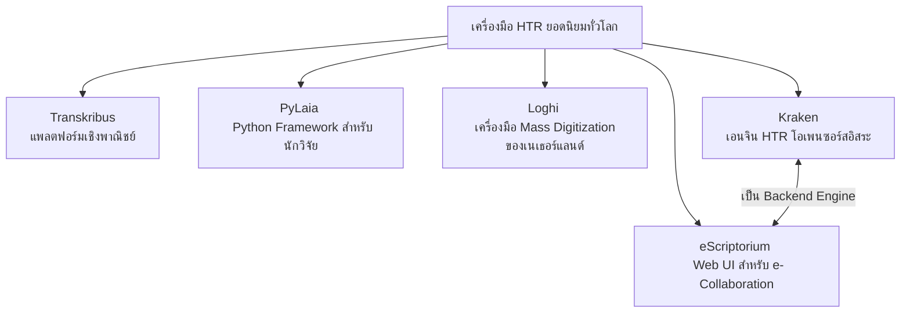

# 1.2 เปรียบเทียบเครื่องมือ HTR ทั่วโลก และทำไมต้องเลือกใช้ Kraken

> **ระดับ:** ผู้เริ่มต้นถึงระดับกลาง  
> **เวลาอ่าน:** ~30 นาที  
> **อ่านก่อน:** [1.1 HTR คืออะไร](1.1_ภาพรวมระบบนิเวศHTRและเป้าหมายโครงการ.md) *(หากยังไม่ได้ศึกษาเรื่องโครงสร้างพื้นฐาน)*  
> **อ่านต่อ:** [1.3 ภาพรวม Pipeline การทำงาน](1.1_ภาพรวมระบบนิเวศHTRและเป้าหมายโครงการ.md)

---

## บทนำ (Introduction)

การแปลงเอกสารประวัติศาสตร์โบราณให้อยู่ในรูปแบบดิจิทัลที่สามารถสืบค้นข้อความได้ (Searchable Digital Archive) ถือเป็นภารกิจสำคัญของมนุษยศาสตร์ดิจิทัล (Digital Humanities) อย่างไรก็ตาม การรู้จำข้อความลายมือเขียนโบราณ (Handwritten Text Recognition หรือ HTR) ในระบบอักษรตระกูลอินเดีย (Indic Scripts) หรืออักษรที่มีระดับวรรณยุกต์และตัวเชิงซ้อนในแนวตั้ง เช่น **อักษรธรรมล้านนา (ตั๋วเมือง)**, **อักษรขอมไทย**, และ **อักษรไทยโบราณ** ที่พบบนคัมภีร์ใบลาน (Palm-leaf Manuscripts) และสมุดไทยหรือสมุดพับ (Folding Books) นั้น ประสบข้อจำกัดทางเทคนิคขั้นรุนแรงเมื่อเทียบกับอักษรตระกูลละติน (Latin Scripts)

ระบบการรู้จำอักขระด้วยแสงทั่วไป (Optical Character Recognition หรือ OCR) เช่น Tesseract มักใช้แนวคิดการตัดแบ่งตัวอักษรทีละตัว (Character-level Segmentation) ด้วยการใช้กรอบสี่เหลี่ยมผืนผ้า (Bounding Box) ซึ่งล้มเหลวโดยสิ้นเชิงเมื่อนำมาใช้กับลายมือโบราณที่เขียนต่อเนื่องกันในลักษณะเชื่อมต่อ (Cursive or Continuous Script) และมีตำแหน่งสระบน สระล่าง ตัวสะกดซ้อน และวรรณยุกต์ซ้อนกันหลายระดับในแกนตั้ง

ปัจจุบัน เทคโนโลยี HTR ได้พัฒนาไปสู่ระบบการเรียนรู้ที่ไม่แยกส่วนอักษร (Segmentation-free Recognition) ร่วมกับการวิเคราะห์เลย์เอาต์ตามเส้นฐาน (Baseline-level Layout Analysis) ซึ่งมีเครื่องมือและเอนจินหลักหลายตัวเกิดขึ้นในโลก คู่มือบทนี้จะทำการเปรียบเทียบจุดเด่น ข้อจำกัด ลิขสิทธิ์ และความคุ้มค่าทางเศรษฐศาสตร์ของเครื่องมือ HTR ชั้นนำ พร้อมให้คำอธิบายเชิงลึกถึงเหตุผลว่า **ทำไม Kraken (ร่วมกับแพลตฟอร์ม eScriptorium) จึงเป็นทางเลือกที่ดีที่สุดและเหมาะสมที่สุดสำหรับโครงการอนุรักษ์เอกสารโบราณของไทย**

---

## ส่วนที่ 1: การเปรียบเทียบเชิงลึกระหว่างเครื่องมือ HTR ทั่วโลก

เพื่อช่วยให้ทีมพัฒนาและสถาบันวิจัยที่เริ่มต้นจากศูนย์สามารถตัดสินใจเลือกใช้เครื่องมือได้อย่างแม่นยำ ด้านล่างนี้คือรายละเอียดของเครื่องยนต์และแพลตฟอร์ม HTR 5 ตัวหลักที่เป็นที่นิยมทั่วโลกในปัจจุบัน:



### 1. Transkribus
พัฒนาขึ้นโดยความร่วมมือระหว่างประเทศภายใต้สมาคมร่วม **READ-COOP SCE** (ตั้งอยู่ในประเทศออสเตรีย) เป็นแพลตฟอร์ม HTR ที่มีชื่อเสียงที่สุดในการวิเคราะห์เอกสารยุโรปโบราณ
*   **รูปแบบบริการ:** เป็นแบบกึ่งปิด (Closed-source Platform) ที่ให้บริการผ่านหน้าเว็บแอปพลิเคชันและโปรแกรม Client
*   **รูปแบบราคา (Licensing Costs):** ใช้ระบบเครดิต (Credit-based) การอ่านเอกสารฟรีจำกัดเพียงจำนวนหนึ่ง หากใช้ปริมาณมากสำหรับการแปลงข้อมูลระดับมหภาค (Mass Digitization) จะมีค่าใช้จ่ายต่อหน้าที่ค่อนข้างสูง
*   **จุดเด่น:** มีส่วนติดต่อผู้ใช้ (Web UI) ที่สวยงามและมีโมเดลสาธารณะ (Generalist Models) สำหรับภาษาละติน เยอรมัน ฝรั่งเศษ ที่เทรนไว้แล้วจำนวนมาก
*   **ข้อจำกัด:** เกิดปัญหา **Vendor Lock-in** ข้อมูลและแบบจำลองโมเดลจะถูกจัดเก็บไว้บนเซิร์ฟเวอร์คลาวด์ของผู้ให้บริการ ไม่สามารถดึงไฟล์โมเดลที่ฝึกสำเร็จแล้วออกมาใช้งานในระดับ Local หรือปรับปรุงสถาปัตยกรรมโครงข่ายประสาทภายในได้อย่างอิสระ

### 2. PyLaia
เป็นเฟรมเวิร์ก HTR แบบโอเพนซอร์ส (ลิขสิทธิ์ BSD-3-Clause) ที่พัฒนาขึ้นสำหรับงานวิจัยระดับบรรทัด (Line-level HTR) โดยอิงตามสถาปัตยกรรม **CNN + BiLSTM + CTC Loss** 
*   **รูปแบบบริการ:** เป็นไลบรารี Python สำหรับนักวิศวกรข้อมูลและนักวิจัย ไม่มีหน้าต่างกราฟิกเว็บอินเตอร์เฟสในตัวเอง (CLI-only)
*   **จุดเด่น:** ประสิทธิภาพความแม่นยำสูงมาก มีความสามารถในการประมวลผลมัดข้อมูล (Batch Data) และทำงานได้อย่างรวดเร็ว ถูกนำไปใช้อย่างแพร่หลายในโปรเจกต์ยุโรปกลาง เช่น คลังเอกสารยุคกลางของสเปนและฝรั่งเศส (CREMMA) รวมถึงโครงการวิเคราะห์ล้านนาโบราณในบางสาขา
*   **ข้อจำกัด:** การเรียนรู้และการติดตั้งค่อนข้างยากสำหรับผู้เริ่มต้น ต้องมีการเขียนสคริปต์ภาษา Python และคำสั่งจัดการคลาสโหลดข้อมูล (Dataloader) เองจากศูนย์

### 3. Loghi
เครื่องมือ HTR และ OCR โอเพนซอร์สล่าสุด (เปิดเผยซอร์สโค้ดตั้งแต่ปี 2023 ภายใต้ลิขสิทธิ์ Apache 2.0) พัฒนาขึ้นโดย **KNAW Humanities Cluster (HuC)** แห่งประเทศเนเธอร์แลนด์
*   **รูปแบบบริการ:** ออกแบบมาเพื่อกระบวนการแปลงสารสนเทศประวัติศาสตร์ขนาดใหญ่ โดยใช้เครื่องมือย่อยชื่อ **Laypa** สำหรับวิเคราะห์เลย์เอาต์หน้ากระดาษ (Layout Analysis) และมีชุดสคริปต์รันร่วมกับ PyTorch/TensorFlow
*   **จุดเด่น:** ถูกนำไปใช้สแกนและแปลงข้อความคลังเอกสารจดหมายเหตุบริษัทอินเดียตะวันออกของฮอลันดา (VOC) ในโครงการ GLOBALISE ขนาดหลายแสนหน้าได้อย่างมีนัยสำคัญ
*   **ข้อจำกัด:** เน้นที่เอกสารประเภทการพิมพ์โบราณและเขียนแนวระดับพิกเซลของตะวันตก ความยืดหยุ่นต่อเอกสารที่เป็นคัมภีร์ใบลานเอเชียตะวันออกเฉียงใต้ยังไม่มีกรณีศึกษายืนยัน

### 4. Kraken (ที่เลือกใช้)
เป็นเอนจิน HTR โอเพนซอร์สระดับแนวหน้า (ลิขสิทธิ์ Apache 2.0) พัฒนาโดย **Benjamin Kiessling** (Université PSL / EPHE ประเทศฝรั่งเศส) แตกแขนงและพัฒนาต่อยอดมาจากซอฟต์แวร์ OCRopus รุ่นบุกเบิก
*   **รูปแบบบริการ:** รันผ่านระบบคำสั่งหน้าจอคอมพิวเตอร์ (CLI) และทำหน้าที่เป็นตัวประมวลผลหลัก (Backend Engine) ให้กับระบบ eScriptorium
*   **จุดเด่น:** ได้รับการออกแบบมาเพื่อขจัดอคติของอักษรตระกูลละติน (Script-agnostic) มีความโดดเด่นอย่างมากในการตรวจวิเคราะห์เส้นฐานแนวเอียง (Baseline Layout Analysis หรือ BLLA) และรองรับภาษา non-Latin ที่สระซ้อนและตัวเชิงซ้อนอย่างเป็นธรรมชาติ
*   **ข้อจำกัด:** เอกสารอ้างอิงและคู่มือการใช้งานส่วนใหญ่อยู่ในภาษาฝรั่งเศสและภาษาอังกฤษระดับวิจัยเชิงลึก ซึ่งทีมงานจะอุดรอยรั่วนี้ด้วยคู่มือภาษาไทยชุดนี้

### 5. eScriptorium
ไม่ใช่เอนจิน HTR ในตัว แต่เป็นแพลตฟอร์ม Web UI โอเพนซอร์ส (ลิขสิทธิ์ GPLv3) ที่ครอบระบบ Kraken ไว้เพื่ออำนวยความสะดวกในการจัดทำฉลากข้อมูล (Ground Truth Generation) และการประสานงานร่วมกันแบบคลาวด์
*   **จุดเด่น:** สนับสนุนระบบ **Human-in-the-Loop** ซึ่งเปิดให้นักภาษาศาสตร์เข้ามาช่วยตรวจแก้แนวเส้นฐานพิกเซล (Baselines) และพิมพ์คำอ่านเทียบเคียง (Diplomatic / Normalized Transcriptions) ผ่านหน้าเว็บได้ทันที จากนั้นสามารถสั่งประมวลผลเทรนโมเดลผ่านคิวงาน Celery GPU Worker หลังบ้านได้สะดวก

---

### ตารางเปรียบเทียบคุณสมบัติเชิงเปรียบเทียบ HTR Engines และ Platforms

| เกณฑ์เปรียบเทียบ | **Kraken + eScriptorium** | **Transkribus** | **PyLaia** | **Loghi** |
| :--- | :--- | :--- | :--- | :--- |
| **ลิขสิทธิ์ (Licensing)** | Open Source (Apache 2.0 / GPLv3) - **ฟรี 100%** | Commercial (Credit-based) - **มีค่าใช้จ่ายต่อหน้า** | Open Source (BSD-3-Clause) - **ฟรี 100%** | Open Source (Apache 2.0) - **ฟรี 100%** |
| **สถาปัตยกรรมภายใน** | FCN (Layout) + CRNN-BiLSTM + CTC | Varied (Transformer / RNN / Titan) | CNN + BiLSTM + CTC | CNN + BiLSTM / Transformer |
| **การรองรับอักษรตัวเชิงซ้อน (Non-Latin)** | ★★★★★ (ยอดเยี่ยมที่สุดด้วย BLLA & VGSL) | ★★★★☆ (ดี แต่ไม่ยืดหยุ่นในการจูนความสูงภาพ) | ★★★★☆ (ดี แต่ต้องจัดระบบภาพและพาร์สข้อมูลเอง) | ★★★☆☆ (ดีสำหรับตัวพิมพ์และเอกสารสไตล์ละติน) |
| **ระบบ Layout Analysis** | Baseline Layout Analysis (BLLA) เส้นโค้งอิสระ | Transkribus Segmenter (Baseline & Region) | ไม่มีในตัว (ต้องแบ่งบรรทัดภาพส่งมาให้จากโปรแกรมอื่น) | Laypa (วิเคราะห์ Baseline ด้วย Pix2Pix/U-Net) |
| **ความสะดวกในการเทรน** | ปานกลางถึงสูง (มีหน้าจอ Web UI และจัดการคิว GPU ในตัว) | สูงมาก (คลิกเทรนบนคลาวด์ได้ทันที) | ต่ำถึงปานกลาง (ต้องเขียนสคริปต์รันเทรนผ่านคำสั่ง PyTorch) | ปานกลาง (ควบคุมผ่าน Docker-compose และ CLI) |
| **Vendor Lock-in** | **ไม่มี** (นำไฟล์โมเดลไปใช้และพัฒนาต่อยอดได้เสรี) | **มีสูง** (โมเดลอยู่บนระบบคลาวด์ของ READ-COOP เท่านั้น) | **ไม่มี** (โครงสร้าง PyTorch เปิดเสรี) | **ไม่มี** (เป็นชุดรหัสสคริปต์เปิดทั่วไป) |
| **ความต้องการระบบ (GPU)** | GPU ทั่วไป (เช่น VRAM 8GB-12GB) สำหรับการฝึกสอนระดับ Local | ไม่ต้องการ GPU ฝั่ง Local (ประมวลผลบนคลาวด์ของระบบ) | GPU ทั่วไป (รองรับการรันความเร็วผ่าน PyTorch) | ต้องการ GPU สเปกค่อนข้างสูงในการรัน Pipeline |

---

## ส่วนที่ 2: ทำไม Kraken จึงเหมาะสมที่สุดสำหรับอักษรใบลานและสมุดไทย

เมื่อประเมินตามเกณฑ์ทางอักษรศาสตร์โบราณไทยและข้อจำกัดเชิงระบบของโครงการในประเทศ Kraken (และ eScriptorium) ถือเป็นโซลูชันที่สอดรับกับความต้องการสูงสุดด้วยเหตุผล 4 ประการหลัก ดังนี้:

### 1. ความทนทานต่อการวางอักขระแนวตั้ง 4 ระดับ (Vertical Subscript Stacking)
อักษรธรรมล้านนาและอักษรขอมไทยมีระบบอักขรวิธีที่มีโครงสร้างซับซ้อน ได้แก่:
*   **พยัญชนะหลัก (Main Consonant)** อยู่ตรงแกนกลางเส้นบรรทัด
*   **สระบนและเครื่องหมายวรรณยุกต์ (Superscript vowel / Tone mark)** เช่น สระอิ สระอี ไม้โท ไม้เอก
*   **สระล่าง (Subscript vowel)** เช่น สระอุ สระอู
*   **ตัวเชิงหรือตัวซ้อน (Subscript Consonant)** ซึ่งเขียนห้อยไว้ใต้พยัญชนะหลักเพื่อทำหน้าที่สะกดคำหรือควบกล้ำ

```
ระดับที่ 4:   [ สระบน / วรรณยุกต์ ]   (เช่น ◌้, ◌ิ)
ระดับที่ 3:   [  พยัญชนะหลักแกนกลาง  ]   (เช่น ก, ข, น)
ระดับที่ 2:   [   สระล่าง / ตัวเชิง   ]   (เช่น ◌ุ, ◌ฺ, ◌ฺพ)
ระดับที่ 1:   [    ตัวเชิงห้อยชั้นต่ำสุด   ]   (เช่น ตัวซ้อนหางยาวในอักษรธรรมล้านนา)
```

หากตรวจจับด้วยกรอบรูปสี่เหลี่ยมผืนผ้า (Bounding Box) แบบระบบ OCR เก่า ความสูงพิกเซลของบรรทัดที่แกว่งตัวสูงและการล้นลงมาของพยัญชนะหางล่างจะทำให้กรอบบรรทัดบนตัดทับส่วนยอดของอักขระด้านล่าง จนเกิดข้อผิดพลาดในการแปลผล 

**โซลูชันของ Kraken:** Kraken ใช้แนวคิด **Baseline Layout Analysis (BLLA)** โดยการวิเคราะห์และทำนายพิกัดเฉพาะแนวเส้นระดับสายตา (Baseline Points) ที่พยัญชนะตั้งตัวอยู่ ร่วมกับการลากเส้นขอบเขตแบบอิสระ (Bounding Polygon) เพื่อห่อหุ้มโครงสร้างส่วนบนและส่วนล่างของอักขระทั้งหมด โดยไม่จำเป็นต้องตัดแบ่งตัวอักษรเป็นชิ้นส่วน (Segmentation-free) ทำให้ไม่สูญเสียความสัมพันธ์ของตัวเชิงใต้ฐานคำ

### 2. การแก้ปัญหาคลังข้อมูลตัวสะกดน้อย (Low-Resource Language Constraint)
แบบจำลองอัจฉริยะกลุ่มประมวลผลข้อความยุคใหม่ (เช่น Vision-Transformers: TrOCR หรือ Donut) ต้องการคลังข้อมูลฝึกฝนภาพถ่ายระดับแสนบรรทัดเพื่อเรียนรู้การกระจายตัวของโทเคนอักษรและพิกเซล ในขณะที่การอนุรักษ์เอกสารจดหมายเหตุของไทยเป็นโครงการที่ต้องสร้างคลังข้อมูลเฉลย (**Ground Truth**) จากศูนย์ 

**โซลูชันของ Kraken:** เอนจินของ Kraken ถูกปรับแต่งมาอย่างดีในการฝึกฝนเพื่อการปรับตัว (Fine-tuning / Transfer Learning) ซึ่งจากสถิติของโครงการวิจัยใบลานล้านนาของมหาวิทยาลัยเชียงใหม่ (CMU-SRI) และโครงการจารึกเอเชียใต้และเอเชียตะวันออกเฉียงใต้ (DHARMA Project) ยืนยันว่า **การสร้าง Ground Truth คุณภาพสูงเพียง 50–100 หน้าใบลาน (หรือประมาณ 1,000 - 2,000 บรรทัด) ก็เพียงพอที่จะทำการเทรนโมเดลแรกให้สามารถอ่านออกเขียนได้ด้วยค่าอัตราความผิดพลาดระดับอักขระ (Character Error Rate หรือ CER) ต่ำกว่า 10%** และสามารถนำกลับมาทำเวิร์กโฟลว์ปรับปรุงโมเดลต่อยอดได้ทันที

### 3. การรักษาความปลอดภัยและสิทธิ์ความเป็นเจ้าของข้อมูล (Data Sovereignty)
การศึกษาวิจัยโบราณคดีและจดหมายเหตุราชการของไทยมักมีเงื่อนไขด้านจริยธรรมข้อมูลและสิทธิ์ทางกฎหมายของสถาบัน คัมภีร์ใบลานฉบับหลวงหรือพงศาวดารบางรายการไม่ได้รับอนุญาตให้อัปโหลดเผยแพร่ขึ้นสู่ระบบคลาวด์ภายนอกประเทศ

**โซลูชันของ Kraken:** เราสามารถทำ Local Deployment ติดตั้งและรันทั้ง eScriptorium และ Kraken ภายในเครือข่ายภายใน (Intranet) ของหน่วยงานผ่าน Docker Compose โดยแยกทราฟฟิกข้อมูลและคิวประมวลผล GPU ไว้บนเซิร์ฟเวอร์ส่วนตัว ส่งผลให้ข้อมูลภาพสแกนความละเอียดสูงและโมเดลที่ผ่านการเทรนทั้งหมดเป็นสิทธิ์ขาดของหน่วยงานในประเทศโดยไม่มีข้อผูกมัดหรือความเสี่ยงต่อการรั่วไหล

### 4. ซอฟต์แวร์เปิด (Open-source Benefits) และชุมชนทางวิชาการ
สิทธิ์การใช้งานแบบ Apache 2.0 เอื้อให้นักพัฒนาซอฟต์แวร์ไทยสามารถดึงเอนจินของ Kraken ไปดัดแปลงโค้ดต้นฉบับ เขียนสคริปต์สั่งงานอัตโนมัติด้วยภาษา Python หรือเรียกใช้ไลบรารีควบคุมภายนอก เช่น `escriptorium-connector` เพื่อรับส่งค่าพิกัดพิกเซลไปแสดงผลในระบบสืบค้นแผนที่จดหมายเหตุของหอสมุดแห่งชาติได้เสรี

---

## ส่วนที่ 3: เจาะลึกสถาปัตยกรรมเชิงลึกของ Kraken

ความเข้าใจสถาปัตยกรรมภายในของ Kraken เป็นกุญแจสำคัญในการนำระบบไปจูนพารามิเตอร์เพื่อรับมือกับเอกสารโบราณ ระบบประมวลผลของ Kraken แยกการทำงานเป็น 2 ขั้นตอนเด็ดขาด:

```
[ ภาพสแกนใบลาน/สมุดไทย ] 
         │
         ▼  (1) Layout Analysis (FCN + BLLA)
[ พิกัดแนวเส้น Baseline & โพลีกอนครอบบรรทัด ]
         │
         ▼  (2) Text Recognition (CNN-BiLSTM-CTC)
[ ข้อความปริวรรต / รหัส Unicode ]
```

### 1. Neural Layout Engine (FCN - Fully Convolutional Network)
ขั้นตอนการวิเคราะห์โครงร่างหน้ากระดาษ (Layout Analysis) ใช้โครงข่ายประสาทแบบคอนโวลูชันเต็มรูปแบบ (FCN) ทำหน้าที่ทำนายภาพสองส่วนสำคัญ:
1.  **Baseline Detection:** สกัดแนวเส้นที่ตัวเขียนอ้างอิงในการลงพู่กันหรือเหล็กจาร
2.  **Region Boundary:** ค้นหาและระบุขอบเขตพื้นที่ย่อหน้าหรือขอบเขตคอลัมน์ เพื่อรองรับเอกสารโบราณที่มีกรอบภาพหรือมีข้อเขียนหลายสดมภ์

การจัดวางป้ายกำกับของเลย์เอาต์อ้างอิงระบบมาตรฐาน **SegmOnto Ontology** เพื่อระบุคุณสมบัติเส้นฐานข้อความ (เช่น `line` สำหรับข้อความปกติ หรือ `marginalia` สำหรับข้อความแทรกข้างหน้าสมุดไทย) และกลุ่มพื้นที่ (เช่น `MainTextZone` และ `IllustrationZone` เพื่อแยกแยะรูปภาพจิตรกรรมในสมุดภาพออกจากข้อความ) การทำเช่นนี้ช่วยควบคุมกระบวนการสกัดบรรทัดได้อย่างเป็นระบบ

### 2. Recognition Engine (BiLSTM + CTC Loss)
หลังจากสกัดแถบภาพบรรทัดย่อย (Line Slices) ได้แล้ว ภาพเหล่านี้จะถูกส่งเข้าสู่ตัวรู้จำตัวอักษรแบบโมเดลผสมผสาน (Hybrid Model) ซึ่งมีองค์ประกอบ 3 เลเยอร์หลัก:

#### A. Convolutional Visual Encoder (CNN)
ทำหน้าที่แปลงแถบพิกเซลของรูปภาพบรรทัดให้เป็นเวกเตอร์ฟีเจอร์เชิงทัศนศาสตร์ (Visual Feature Maps) โดยจะโฟกัสที่การถอดแนวเส้นหมึก ความหนา และจุดเชื่อมต่อของรอยเหล็กจารล้านนา

#### B. Temporal Bidirectional LSTM (BiLSTM)
ทำหน้าที่สกัดความสัมพันธ์เชิงบริบทก่อน-หลังของลำดับพิกเซล (Temporal Sequence Analysis) เนื่องจากอักษรขอมและอักษรธรรมล้านนาโบราณไม่มีการแยกช่องไฟระหว่างคำ (Scriptura Continua) ตัวแบบ BiLSTM จึงต้องวิเคราะห์และเรียนรู้ความน่าจะเป็นของลำดับพยัญชนะ เช่น หากเจออักษร **"ต"** และมีพยัญชนะซ้อนอยู่ใต้ฐาน จะวิเคราะห์บริบทข้างเคียงเพื่อคาดเดาความน่าจะเป็นว่าคือตัวสะกดตัวใดตามลักษณะการสะกดคำบาลี-สันสกฤต

#### C. Connectionist Temporal Classification (CTC Loss)
เป็นหัวใจสำคัญที่ช่วยให้เกิด **Segmentation-free Recognition** กล่าวคือระบบสามารถฝึกอบรมได้โดยตรงจากภาพถ่ายแถบบรรทัดคู่กับข้อความฉลากเฉลย โดยไม่ต้องระบุว่าพิกเซลใดคือตัวอักษรใดอย่างจำเพาะ CTC Loss จะคำนวณการจัดตำแหน่งและความเป็นไปได้เชิงพิกัดเวลาของแต่ละตัวอักษรโดยอัตโนมัติ ทำให้ใช้ข้อมูลในการเทรนน้อยลงแต่แม่นยำสูงขึ้น

---

### 3. ภาษา VGSL (Variable-size Graph Specification Language)
หนึ่งในความยืดหยุ่นสูงสุดของ Kraken คือการอนุญาตให้ผู้ออกแบบโมเดลระบุและสร้างสถาปัตยกรรมโครงข่ายประสาทได้เองผ่านสตริงข้อความสั้น ๆ หรือ **VGSL** โดยไม่ต้องมีการเปลี่ยนโค้ด Python หลักของโปรแกรม

#### ตัวอย่างสตริง VGSL มาตรฐานของ Kraken:
```bash
[1,48,0,1 Cr3,3,32 Mp2,2 Cr3,3,64 Mp2,2 S1(1x12)1,3 Lbx100 Do O1c103]
```

#### การแยกโครงสร้างวิเคราะห์สตริง:
1.  **`[1,48,0,1]` (Input Specification):**
    *   `1`: ขนาดมัดข้อมูลในมิติแบทช์
    *   `48`: ความสูงของภาพบรรทัดนำเข้าคงที่ที่ **48 พิกเซล**
    *   `0`: ความกว้างแบบแปรผัน (Variable Width) เพื่อรองรับความยาวบรรทัดใบลานที่ต่างกันโดยไม่เสียสัดส่วน (Aspect Ratio)
    *   `1`: จำนวนช่องสเกลสีเทา (Grayscale)
2.  **`Cr3,3,32 Mp2,2` (Conv & MaxPool Block 1):** Convolutional Layer $3\times3$ ขนาดฟิลเตอร์ 32 ตัว และทำการลดรูปด้วย Max Pooling $2\times2$
3.  **`Cr3,3,64 Mp2,2` (Conv & MaxPool Block 2):** Convolutional Layer $3\times3$ ขนาดฟิลเตอร์ 64 ตัว และลดรูปความละเอียดลงรอบสอง
4.  **`S1(1x12)1,3` (Reshape/Slicing Layer):** การบีบข้อมูลภาพแนวดิ่งให้เหลือนิยามมิติ 1 มิติ เพื่อส่งต่อไปประมวลผลเชิงลำดับอักษร
5.  **`Lbx100` (Recurrent Layer):** โครงข่ายประสาทแบบ Bidirectional LSTM จำนวน 100 hidden units ทำหน้าที่รันความน่าจะเป็นอักขรวิธีโบราณ
6.  **`Do` (Dropout Layer):** เลเยอร์ป้องกันโมเดลท่องจำลายมือ (Overfitting)
7.  **`O1c103` (Output Layer):** ทำนายและถอดรหัสความน่าจะเป็นระดับอักขระด้วย CTC ขนาดพจนานุกรม 103 ตัวอักษร

> [!IMPORTANT]
> **เหตุใดความสูงของภาพบรรทัดในอินพุต VGSL (Input Height) จึงสำคัญอย่างยิ่งสำหรับอักษรขอมและล้านนาโบราณ?**  
> ในโมเดลมาตรฐานฝั่งตะวันตก ความสูงพิกเซลแถวถูกตั้งค่าไว้ที่ `48` พิกเซล เพราะตัวอักษรละตินไม่มีตัวห้อยระดับลึก แต่สำหรับอักษรธรรมล้านนาและอักษรขอมที่มี **ตัวเชิงซ้อนห้อยล่างลึกถึง 4 ชั้น** การบีบอัดภาพให้อยู่ที่ความสูง 48 พิกเซล จะบีบให้สระล่างและตัวเชิงกลายเป็นพิกเซลที่บดบังและเบลอจนแยกแยะไม่ได้  
> **คำแนะนำเชิงลึก:** ในโครงการ HTR เอกสารโบราณของไทย **โครงการจำเป็นต้องออกแบบและเทรนโมเดลโดยปรับแต่งค่าความสูงในคำสั่ง VGSL ของ Kraken เป็น `80` หรือ `128` พิกเซล (เช่น `[1,128,0,1 ...]`)** เพื่อคงความกว้างเชิงเส้นพิกเซลและรอยเหล็กจารของตัวสะกดลึกสุดไว้ไม่ให้สูญหาย

---

## ส่วนที่ 4: การนำไปปฏิบัติการจริงและคำแนะนำเชิงกลยุทธ์

### 1. คู่มือคำสั่ง CLI และพารามิเตอร์การฝึกฝนหลัก

การพัฒนาโมเดล HTR ด้วยเอนจิน Kraken จะประมวลผลผ่านยูทิลิตีระบบคำสั่งชื่อ **`ketos`** โดยมีสองกระบวนการหลักที่ผู้ปฏิบัติงานต้องดำเนินการ:

#### A. ขั้นตอนการคอมไพล์ข้อมูลออฟไลน์ (`ketos compile`)
เพื่อป้องกันปัญหาการอ่านไฟล์รูปภาพและไฟล์พิกัด XML ย่อยจำนวนมากจากพื้นที่จัดเก็บ ซึ่งสร้างปัญหาคอขวดให้ระบบฮาร์ดแวร์ (Storage I/O Bottleneck) Kraken บังคับให้รวมรูปและคำเฉลยจัดเก็บลงไฟล์ไบนารีข้อมูลเดี่ยว **Apache Arrow (`.arrow`)** ก่อนรันการประมวลผล

```powershell
# ตัวอย่างคำสั่งรันจัดทำคลังข้อมูลคอมไพล์บนระบบปฏิบัติการ Windows
ketos compile -f xml -o d:\HTR_Research\dataset.arrow d:\HTR_Research\ground_truth\*.xml
```

*   **`-f xml`:** รูปแบบอินพุตแบบไฟล์ XML มาตรฐาน (PAGE หรือ ALTO XML)
*   **`-o`:** เส้นทางสำหรับเซฟไฟล์ผลลัพธ์ข้อมูลจำเพาะ `.arrow`
*   **`*.xml`:** คลังพิกัดพจน์และคำเฉลยที่เชื่อมโยงกับรูปภาพ

#### B. ขั้นตอนการฝึกสอนโมเดลปัญญาประดิษฐ์ (`ketos train`)
คำสั่งสำหรับการเรียกใช้น้ำหนักเริ่มต้นและประมวลผลเทรนโมเดล

```powershell
# คำสั่งการเทรนระบบ HTR ด้วยสถาปัตยกรรมอักขระธรรมล้านนาแบบกว้างสูงพิเศษ
ketos train -f binary -o d:\HTR_Research\models\lanna_htr_v1 -s "[1,128,0,1 Cr3,3,32 Mp2,2 Cr3,3,64 Mp2,2 Lbx256 Do O1c120]" --lrate 0.001 --lag 15 --augment d:\HTR_Research\dataset.arrow
```

*   **`-f binary`:** บอกให้ตัวประมวลผลอ่านไฟล์ข้อมูลที่คอมไพล์แล้วจากโครงสร้าง `.arrow`
*   **`-o`:** ชื่อนำหน้าแฟ้มโมเดลสำเร็จรูปในระบบ
*   **`-s`:** สายอักขระกำหนดสถาปัตยกรรมแบบจำลองประสาทแบบ VGSL (ปรับความสูงพิกเซลเป็น `128` และเพิ่มจำนวนหน่วยความจำ BiLSTMเป็น `256` เพื่อรองรับอักขรวิธีขอม/ล้านนาซ้อนระดับสูง)
*   **`--lrate`:** กำหนดอัตราการเรียนรู้ (Learning Rate) เริ่มต้นที่ `0.001`
*   **`--lag`:** ระบบหยุดเทรนอัตโนมัติ (Early Stopping) หากค่าความสูญเสียฝั่ง Validation ไม่พัฒนาขึ้นภายใน 15 Epochs
*   **`--augment`:** เปิดตัวช่วยบิดเบี้ยวภาพภายในเอนจิน (เช่น หมึกหยด รอยเปื้อน ขอบลาดเอียง) เพื่อให้โมเดลไม่ท่องจำรูปแบบพิกเซลลายมือเจ้าของหลัก

---

### 2. ความเชื่อมโยงและบทเรียนจากกรณีศึกษาทั่วโลก

ในการเขียนกลยุทธ์แปลงเอกสารโบราณไทยเป็นดิจิทัล เราสามารถถอดบทเรียนจากกรณีศึกษาที่ประสบความสำเร็จในระดับนานาชาติดังนี้:

#### กรณีศึกษาที่ 1: โครงการคัมภีร์ใบลานอักษรธรรมล้านนา (CMU-SRI HTR)
*   **อ้างอิงบทเรียน:** [Report_022_lanna_palmleaf.md](../reference_papers/Report_022_lanna_palmleaf.md)
*   **บทเรียนเชิงประจักษ์:** ความร่วมมือระหว่างประเทศระหว่างสถาบันวิจัยสังคม มหาวิทยาลัยเชียงใหม่ (SRI CMU) และ Université PSL ในโปรเจกต์นี้ พิสูจน์แล้วว่าการนำเครื่องมือ eScriptorium มาวิเคราะห์ร่วมกับโมเดลการรู้จำ HTR (PyLaia/Kraken) สามารถสกัดเส้น Baseline และอ่านตัวเชิงซ้อนของตั๋วเมืองล้านนาบนภาพใบลานที่ชำรุดทรุดโทรม มีคราบดินปืนและเชื้อราดำลูบหน้าลาน ได้ค่าความถูกต้องสูงมาก โดยมีแนวทางปฏิบัติสำคัญคือการใช้ระบบ **Sauvola Adaptive Thresholding** ร่วมลบรอยสิ่งกีดขวางในกระบวนการเตรียมภาพก่อนนำเข้าระบบ

#### กรณีศึกษาที่ 2: คลังม้วนกระดาษตุนหวงภาษาจีนโบราณ (Dunhuang Scrolls e-Scriptorium HTR)
*   **อ้างอิงบทเรียน:** [Report_028_dunhuang_chinese_htr.md](../reference_papers/Report_028_dunhuang_chinese_htr.md)
*   **บทเรียนเชิงประจักษ์:** โครงการตุนหวงประสบปัญหาการสแกนเอกสารแนวยาว (Scrolls) ที่มีทิศทางการจัดเรียงตัวหนังสือในแนวตั้ง (Vertical Columns) จากบนลงล่าง การใช้โมเดล Kraken ร่วมกับ eScriptorium ช่วยให้ทีมนักวิจัยโบราณคดีสร้างระบบทำนาย Baseline และพื้นที่อ่านอักขระแบบผสมผสานได้สำเร็จโดยไม่ต้องแยกตัวอักษรจีนเดี่ยว ทำให้บรรลุการประเมินการแปลงข้อมูลระดับมหภาค (Mass Digitization) ที่ควบคุม CER เฉลี่ยต่ำกว่า 5% ในขอบเขตกระดาษที่ชำรุด

#### กรณีศึกษาที่ 3: โครงการศึกษาศิลาจารึกข้ามพรมแดนเอเชียใต้และเอเชียตะวันออกเฉียงใต้ (DHARMA Project)
*   **อ้างอิงบทเรียน:** [Report_038_dharma_project.md](../reference_papers/Report_038_dharma_project.md)
*   **บทเรียนเชิงประจักษ์:** โครงการ DHARMA ได้บุกเบิกการแปลงแผ่นศิลาจารึกและจารึกทองเหลืองในอักษรตระกูลพัลลวะ เช่น สันสกฤต ทมิฬโบราณ ชวาโบราณ และเขมรโบราณ ให้เป็นคลังข้อมูลดิจิทัลที่สามารถแลกเปลี่ยนข้อมูลข้ามประเทศได้โดยใช้มาตรฐาน **TEI/EpiDoc XML** 

โครงการอนุรักษ์เอกสารโบราณของไทยควรประยุกต์ใช้แนวทาง **Dual-Layer Transcription** ตามรอยโครงการ DHARMA ดังนี้:
1.  **Diplomatic Transcription:** เก็บข้อมูลข้อความถอดสะกดดิบตรงตามอักขรวิธีจารึกเดิมบนใบลาน รวมถึงสัญลักษณ์พยัญชนะซ้อนตัวเชิง เพื่อวิเคราะห์สัณฐานวิทยาของตัวสะกดดั้งเดิม
2.  **Normalized Transcription:** เก็บข้อมูลคำสะกดปริวรรตเป็นอักษรไทยปัจจุบันและคำศัพท์มาตรฐาน เพื่อความสะดวกในการสร้างเครื่องมือการสืบค้นและทำสารสนเทศดัชนี

---

## สรุปทางเลือกเชิงนโยบายเทคโนโลยีสำหรับโครงการ HTR ไทย

สำหรับทีมงานจดหมายเหตุดิจิทัลที่ริเริ่มสร้างระบบวิเคราะห์ใบลานและสมุดไทยจากศูนย์ การเปรียบเทียบเครื่องมือทั้งหมดชี้นำสู่ข้อสรุปเชิงยุทธศาสตร์ดังนี้:

1.  **ปฏิเสธระบบตีกรอบภาพระดับตัวเขียนด้วย BBox สี่เหลี่ยม:** เพราะไม่สามารถแก้ปัญหาระดับบรรทัดของวรรณยุกต์และตัวเชิงซ้อนห้อยล่างล้านนา/ขอมได้ ต้องเลือกใช้ **Baseline Layout Analysis (BLLA)** ที่คำนวณเส้นพิกเซลโค้งอิสระ
2.  **หลีกเลี่ยงการล็อกอินข้อมูลบนคลาวด์ภายนอก:** การรัน eScriptorium คู่กับ Kraken ภายใต้คอนเทนเนอร์ Docker บนฮาร์ดแวร์ Local GPU ตอบโจทย์ความคุ้มทุนทางเศรษฐศาสตร์ ความเป็นส่วนตัวทางสัญญากับหน่วยงานรัฐ และความสามารถในการดึงแบบจำลองโมเดลออกมาพัฒนาโปรแกรมประยุกต์ใช้งานเชิงพาณิชย์และวิชาการในอนาคตได้อย่างสมบูรณ์

---

## แหล่งอ้างอิง (References)

1.  Kiessling, B., Tissot, R., Stokes, P., & Stökl Ben Ezra, D. "eScriptorium: An Open Source Platform for Historical Document Analysis," *2019 International Conference on Document Analysis and Recognition Workshops (ICDARW)*, Vol. 2, 2019, pp. 19-24.
2.  Kiessling, B. "Kraken - an Universal Text Recognizer for the Humanities," *Digital Humanities 2019 Book of Abstracts*, Utrecht, 2019.
3.  Kiessling, B. "A Modular Region and Text Line Layout Analysis System," *2020 17th International Conference on Frontiers in Handwriting Recognition (ICFHR)*, 2020, pp. 313-318.
4.  KNAW Humanities Cluster. "Loghi HTR Engine Repository." [https://github.com/knaw-huc/loghi](https://github.com/knaw-huc/loghi).
5.  Brisson, C., et al. "The Dunhuang Manuscripts as a Stepping Stone toward Mass Digitization," *hal.science/hal-05462665*, 2025.
6.  DHARMA Project Consortium. "Dharma Digital Epigraphic Database & EpiDoc Guidelines." [https://dharmalekha.info/](https://dharmalekha.info/).
7.  Social Research Institute, Chiang Mai University. "Lanna Digital Palm-Leaf Preservation Platform." [https://lannadigital.library.cmu.ac.th](https://lannadigital.library.cmu.ac.th).
