# บทที่ 2.1: ทฤษฎีการอ่านข้อความด้วย AI และกลไก CTC (Connectionist Temporal Classification)

> **หมวดหมู่:** ทฤษฎีการประมวลผลภาพและสถาปัตยกรรม AI  
> **สถานะ:** เสร็จสมบูรณ์ (Premium Manual Chapter)  
> **เนื้อหาหลัก:** กลไกการอ่านบรรทัดอักษรเขียนโบราณ, เปรียบเทียบสถาปัตยกรรม CRNN+CTC และ Transformer, ทฤษฎีการวิเคราะห์โครงสร้างหน้ากระดาษแบบอิงเส้นฐาน (Baseline-driven Layout Analysis), และการประยุกต์ใช้จัดการกลุ่มอักขระซ้อนแนวดิ่ง (Stacked Scripts) ในอักษรธรรมล้านนา อักษรขอม และอักษรทิเบต

---

## 1. บทนำสู่ระบบการรู้จำข้อความลายมือเขียนโบราณ (Introduction to HTR)

การแปลงภาพเอกสารโบราณให้กลายเป็นข้อความดิจิทัลที่สืบค้นได้ มีวิวัฒนาการที่ก้าวกระโดดจากระบบ **OCR (Optical Character Recognition)** ยุคดั้งเดิม ระบบ OCR แบบเก่าออกแบบมาเพื่อจัดการตัวพิมพ์มาตรฐาน (Printed text) ที่มีรูปร่างสมมาตร จัดเรียงเป็นคอลัมน์แนวตรงชัดเจน โดยใช้กระบวนการตัดแบ่งตัวอักษรทีละตัว (Character-level Segmentation) แล้วนำพิกเซลตัวอักษรเดี่ยวเหล่านั้นไปเปรียบเทียบกับคลังแบบอักษรสำเร็จรูป (Template Matching) 

อย่างกว้างขวาง เมื่อนำระบบ OCR แบบตัดแบ่งอักษรมาประยุกต์ใช้กับเอกสารโบราณลายมือเขียน (Handwritten Manuscripts) เช่น คัมภีร์ใบลาน สมุดไทย หรือม้วนกระดาษจารึกโบราณ ระบบจะประสบความล้มเหลวโดยสิ้นเชิง เนื่องจากข้อจำกัดทางกายภาพหลายประการ:
1. **ความผันแปรของลายมือ (Writer Hand Variation):** อารักษ์หรือผู้คัดลอกแต่ละคนมีน้ำหนักมือ รูปร่าง และลีลาการเขียนตัวอักษรที่ไม่เหมือนกัน แม้จะเป็นผู้คัดลอกคนเดียวกัน แต่อารมณ์ ความเหนื่อยล้า หรือการเปลี่ยนอุปกรณ์เขียน (เช่น ปากกาขนนก เหล็กจาร หรือพู่กัน) ก็ส่งผลให้รูปร่างของตัวเขียนเปลี่ยนแปลงตลอดเวลา
2. **การเขียนหวัดเชื่อมต่อกัน (Cursive & Ligature):** ตัวอักษรลายมือเขียนมักจะลากต่อกันเป็นเส้นเดียว (Connected cursive) ทำให้ระบบคอมพิวเตอร์ไม่สามารถหาจุดตัดแบ่งพิกเซลแนวตั้งเพื่อแยกอักษรแต่ละตัวออกจากกันได้โดยไม่ตัดผ่านเนื้ออักษร
3. **สภาพวัสดุโบราณเสื่อมสลาย (Physical Degradation):** เอกสารโบราณมักเต็มไปด้วยคราบหมึกซึม (Bleed-through) รอยฉีกขาด คราบแมลงแทะ รูมอด และรอยพับ ซึ่งคอมพิวเตอร์วิชันระดับพิกเซลเดี่ยวมักสับสนระหว่างสิ่งสกปรกเหล่านี้กับเส้นอักษรจริง

เพื่อทลายขีดจำกัดดังกล่าว เทคโนโลยี **HTR (Handwritten Text Recognition)** สมัยใหม่จึงเปลี่ยนทิศทางจากการอ่านอักขระเดี่ยวมาเป็นการมองข้อความทั้งบรรทัดเป็น **"ข้อมูลเชิงลำดับ" (Sequential Data)** แบบไร้รอยต่อโดยไม่มีการตัดแบ่งตัวอักษรล่วงหน้า (**Segmentation-free approach**) โดยระบบจะแปลงภาพเส้นบรรทัดข้อความทั้งเส้น (Line Image) ให้เป็นลำดับของข้อมูลเวกเตอร์ แล้วใช้โครงข่ายประสาทเทียมระดับลึกประมวลผลร่วมกับกลไกทางความน่าจะเป็นเพื่อทายลำดับตัวอักษรที่เป็นไปได้มากที่สุดออกมาในคราวเดียว

---

## 2. สถาปัตยกรรมโครงข่ายประสาทเทียมสำหรับการอ่านข้อความ (Deep Learning Architectures for HTR)

ในการแปลงพิกเซลภาพเส้นบรรทัดข้อความให้กลายเป็นสตริงอักขระ (String characters) สถาปัตยกรรมปัญญาประดิษฐ์ในปัจจุบันแบ่งออกเป็น 2 แนวทางหลัก ซึ่งมีแนวคิดเบื้องหลังและทรัพยากรการคำนวณที่แตกต่างกันอย่างชัดเจน

```mermaid
graph TD
    subgraph CRNN_CTC_Pipeline ["สถาปัตยกรรมไฮบริด CRNN + CTC"]
        A1[Line Image] --> A2[CNN / FCN Extractor]
        A2 -->|2D -> 1D Feature Map| A3[BiLSTM Sequence Modeler]
        A3 -->|Probability Matrix| A4[CTC Loss & Decoder]
        A4 --> A5[Final Unicode Text]
    end

    subgraph Transformer_Pipeline ["สถาปัตยกรรม Vision-Language Transformer"]
        B1[Line Image] --> B2[ViT Patch Extraction 16x16]
        B2 -->|Linear Projection & Positional Embedding| B3[Transformer Encoder]
        B3 -->|Visual Embeddings| B4[Cross-Attention Mechanism]
        B5[Language Tokens History] --> B6[Autoregressive Decoder]
        B6 -->|Queries| B4
        B4 --> B7[Softmax Classification]
        B7 --> B8[Final Unicode Text]
    end
```



---

### 2.1 สถาปัตยกรรมระบบไฮบริด: CRNN + CTC (Convolutional Recurrent Neural Network with Connectionist Temporal Classification)

นี่คือสถาปัตยกรรมที่เป็นแกนหลักของซอฟต์แวร์ HTR ยอดนิยมอย่าง **Kraken**, **PyLaia** และ **Transkribus** เนื่องจากมีความแม่นยำสูงเมื่อฝึกอบรมบนทรัพยากรข้อมูลจำเพาะที่จำกัด และประหยัดพลังงานคอมพิวเตอร์อย่างมาก โดยทำงานผ่านท่อส่งข้อมูล (Pipeline) 3 ขั้นตอนดังนี้:

#### ขั้นตอนที่ 1: การสกัดลักษณะเด่นทางสายตา (Visual Feature Extraction) ด้วย FCN/CNN
ภาพบรรทัดข้อความอินพุต $I$ (ที่มีมิติสูง $H$ กว้าง $W$ และมีช่องสี $C$ โดยทั่วไป $C=1$ สำหรับภาพระดับสีเทา) จะได้รับการส่งผ่านโครงข่ายประสาทเทียมแบบคอนโวลูชัน (Fully Convolutional Network หรือ CNN) เช่น โครงสร้าง ResNet-34 ที่มีการปรับแต่ง หรือเลเยอร์คอนโวลูชันแบบซ้อนเพื่อทำหน้าที่สกัดฟีเจอร์หลัก (Visual Feature Map)

ระหว่างที่ภาพเดินทางผ่านเลเยอร์ CNN ตัวกรอง (Kernels) จะรันผ่านภาพและลดทอนมิติในแนวดิ่ง (Vertical axis) ลงอย่างรวดเร็วผ่านขั้นตอน Max Pooling หรือ Strided Convolution จนกระทั่งความสูงของแผนภาพคุณลักษณะเหลือเพียง $h = 1$ ในขณะที่มิติแนวราบ (Horizontal axis) ยังคงถูกรักษาไว้ในระดับหนึ่งเพื่อแสดงลำดับการเขียนจากซ้ายไปขวา (หรือขวาไปซ้าย) ส่งผลให้ได้ลำดับของเวกเตอร์ฟีเจอร์ 1 มิติ (Sequence of 1D Feature Vectors) จำนวน $T$ เวกเตอร์ โดยแต่ละเวกเตอร์ในลำดับหมายถึงพิกเซลขอบหน้าต่างของภาพบรรทัดขวางจากซ้ายไปขวา

$$\text{Feature Map } X = [\mathbf{x}_1, \mathbf{x}_2, ..., \mathbf{x}_T] \quad \text{where } \mathbf{x}_t \in \mathbb{R}^D$$

#### ขั้นตอนที่ 2: การจำลองลำดับเชิงเวลา (Sequence/Temporal Modeling) ด้วย RNN/LSTM
เนื่องจากอักขระหรือคำจารึกโบราณมีความสัมพันธ์เชิงบริบทก่อนหลัง (เช่น ในภาษาเขียน ตัวเขียน "ก" มักตามหลังด้วยสระหรือพยัญชนะสะกดบางตัว หรือหางของตัวอักษรหวัดมักลาดเอียงไปข้างหน้า) ข้อมูลเวกเตอร์คุณลักษณะเชิงภาพที่สกัดได้จาก CNN จะถูกนำมาประมวลผลเชิงความสัมพันธ์ของลำดับเวลาผ่านโครงข่าย **Bidirectional LSTM (BiLSTM)** จำนวน 2-3 ชั้น

- **Forward LSTM:** ประมวลผลลำดับเวกเตอร์ภาพจากซ้ายไปขวา เพื่อเข้าใจพฤติกรรมการเขียนตามปกติ
- **Backward LSTM:** ประมวลผลลำดับเวกเตอร์ภาพย้อนกลับจากขวาไปซ้าย เพื่อดึงความสัมพันธ์ของลักษณะทางสายตาที่อาจจะเชื่อมโยงมาจากคำด้านหลัง

การรวมผลลัพธ์ของทิศทางเดินหน้าและถอยหลังทำให้ได้เวกเตอร์ที่อุดมไปด้วยบริบทเชิงเวลาสะสมรอบพิกัดตัวอักษรนั้นๆ จากนั้นจะผ่านการแปลงมิติด้วยชั้นเชื่อมโยงหนาแน่น (Dense Layer) และฟังก์ชัน Softmax เพื่อแปลงค่าผลลัพธ์สุดท้ายให้เป็นตารางแจกแจงความน่าจะเป็นของตัวอักษร (Probability Matrix / Output Logits) ที่มีมิติเป็น $T \times |V'|$ โดยที่ $T$ คือจำนวนเวลา (Time Steps) และ $|V'|$ คือจำนวนขนาดพจนานุกรมอักขระ (Vocabulary Size) ทั้งหมด รวมตัวอักษรพิเศษที่เป็นค่าว่าง (Blank Token)

#### ขั้นตอนที่ 3: การถอดรหัสและการคำนวณ CTC Loss (Connectionist Temporal Classification)
กลไกหัวใจสำคัญที่เสนองานวิจัยโดย Graves et al. (2006) คือ **CTC (Connectionist Temporal Classification)** ซึ่งเข้ามาแก้ไขปัญหาข้อจำกัดดั้งเดิมในการประมวลผลข้อมูลลำดับที่ภาพบรรทัดตัวอักษรกับสตริงเฉลย (Ground Truth Label) ไม่มีข้อมูลกำกับระดับพิกัดพิกเซลเดี่ยวว่าตัวอักษรตัวใดตั้งอยู่ ณ พิกเซลใดเป๊ะๆ 

##### 1. กฎการบีบอัดเชิงเวลา (Collapsing Operator)
ในแต่ละ Time Step $t \in \{1, ..., T\}$ โมเดลจะทำนายตัวอักษรออกมา 1 ตัว (รวมถึง Blank Token แทนด้วยสัญลักษณ์ $\epsilon$ หรือ $-$ ซึ่งหมายถึงพิกเซลที่เป็นที่ว่างคั่นระหว่างเส้นอักษร) การทำนายผลลัพธ์ดิบเชิงเวลานี้เรียกว่า "เส้นทางประมวลผล" (Path $\pi$)
CTC จะกำหนดตัวดำเนินการบีบอัด $\mathcal{B}$ เพื่อแปลงเส้นทางยาว $\pi$ ให้เหลือเพียงข้อความที่มนุษย์อ่านเข้าใจ $\mathbf{y}$ ตามกติกา 2 ข้อดังนี้:
1. ยุบรวมตัวอักษรตัวเดียวกันที่เขียนติดต่อกันซ้ำๆ ให้เหลือเพียงตัวเดียว
2. นำสัญลักษณ์ Blank Token ($\epsilon$) ออกจากสตริง

> **ตัวอย่างกลไกการบีบอัด:**  
> สมมติว่าในบรรทัดภาพคำว่า **"cat"** หลังผ่านแบบจำลองแล้วได้เส้นทางทำนาย $\pi$ ยาว 8 หน่วยเวลาดังนี้:  
> $$\pi = (c, c, \epsilon, a, a, a, t, t)$$  
> เมื่อผ่านตัวดำเนินการ $\mathcal{B}$:  
> 1. ยุบอักษรซ้ำติดต่อกัน $\rightarrow (c, \epsilon, a, t)$  
> 2. ลบ Blank Token ($\epsilon$) ออก $\rightarrow (c, a, t)$  
> ผลลัพธ์สุดท้ายที่ได้จากการถอดรหัสสะกดคำคือ $\mathbf{y} = \text{"cat"}$

##### 2. ฟังก์ชันความสูญเสีย CTC (CTC Loss Function)
ในการฝึกสอนโมเดล เป้าหมายคือการเพิ่มความน่าจะเป็นของข้อความเฉลยจริง $\mathbf{y}$ เมื่อกำหนดภาพนำเข้า $\mathbf{x}$ ให้มีค่าสูงที่สุด ความน่าจะเป็นของสตริง $\mathbf{y}$ คือผลรวมของความน่าจะเป็นของเส้นทางที่เป็นไปได้ทั้งหมด ($\pi$) ที่สามารถยุบตัวแปรกลับมาเป็น $\mathbf{y}$ ได้:

$$P(\mathbf{y}|\mathbf{x}) = \sum_{\pi \in \mathcal{B}^{-1}(\mathbf{y})} P(\pi|\mathbf{x})$$

เนื่องจากเราสมมติว่าการทำนายผลลัพธ์ในแต่ละจุดพิกัดเวลา $t$ เป็นอิสระต่อกันเมื่อผ่านโมเดลแล้ว ความน่าจะเป็นของแต่ละเส้นทาง $\pi$ จึงคำนวณจากการคูณความน่าจะเป็นของสัญลักษณ์เดี่ยวในทุกหน่วยเวลา:

$$P(\pi|\mathbf{x}) = \prod_{t=1}^{T} y^t_{\pi_t}$$

โดยค่าความสูญเสียสะสมเชิงเวลาของ CTC (CTC Loss) ที่โมเดลต้องปรับปรุงด้วยการขยายผล Gradient Backpropagation คือค่าลบของลอการิทึมความน่าจะเป็นดังกล่าว:

$$\mathcal{L}_{\text{CTC}} = -\ln P(\mathbf{y}|\mathbf{x})$$

การหาผลรวมของทุกเส้นทางที่มีจำนวนมหาศาลได้รับการจัดการอย่างมีประสิทธิภาพในระดับมิลลิวินาทีผ่าน **อัลกอริทึม Dynamic Programming แบบ Forward-Backward** คล้ายคลึงกับกลไกใน Hidden Markov Models (HMM)

##### 3. การถอดรหัสข้อความจริง (Decoding)
- **Greedy Search:** ถอดรหัสโดยหยิบเอาตัวอักษรที่มีค่าความน่าจะเป็นสูงสุด ณ แต่ละ Time Step ไปยุบประมวลผลทันที แม้จะทำงานเร็วแต่ไม่คำนึงถึงบริบทสะกดรวม
- **CTC Beam Search Decoding:** รักษากลุ่มเส้นทางถอดความที่มีความน่าจะเป็นสูงสุดไว้จำนวนหนึ่ง (เรียกว่า Beam Width) ตลอดแนวการคำนวณ และสามารถคูณน้ำหนักร่วมกับ **โมเดลภาษา (Language Model - LM)** เช่น $n$-gram เพื่อคำนวณหาความน่าจะเป็นของคำศัพท์โบราณที่สะกดถูกต้องตามไวยากรณ์ ทำให้ลดปัญหาตัวอักษรสะกดสลับเพี้ยนได้ดีขึ้นมาก

---

### 2.2 สถาปัตยกรรมยุคใหม่: Transformer-based HTR

ด้วยอิทธิพลความสำเร็จของสถาปัตยกรรม Transformer ในงาน NLP และ Computer Vision โมเดล HTR ยุคใหม่ เช่น **TrOCR** [Li et al., 2023] และ **Hatformer** [Chan et al., 2024] ได้รับการพัฒนาขึ้นเพื่อแก้ปัญหาการรู้จำข้อความโดยไม่ต้องพึ่งพาโครงข่ายประสาทเทียมแบบหมุนเวียน (RNN-free)

```
+-----------------------------------------------------------------------------------+
|                                  Hatformer Pipeline                               |
|                                                                                   |
|  [ Line Image ]                                                                   |
|         |                                                                         |
|         v                                                                         |
|  (Patch Extraction) -> Split into 16x16 or 8x8 patches                            |
|         |                                                                         |
|         v                                                                         |
|  [ Linear Projection ] + [ Learned 1D Positional Embeddings ]                     |
|         |                                                                         |
|         v                                                                         |
|  [ Transformer Encoder (Self-Attention Layers) ]                                  |
|         |                                                                         |
|         +---------------------------------------+                                 |
|                                                 | (Keys & Values)                 |
|                                                 v                                 |
|  [ Ground Truth Tokens ] -> [ Decoder Masked Self-Attention ] -> [ Cross-Attention ]
|                                                                         |         |
|                                                                         v         v
|                                                                  [ Softmax Class Logits ]
+-----------------------------------------------------------------------------------+
```

#### กลไกการทำงานระดับโครงสร้าง:
1. **การหั่นภาพแผ่นพิกเซล (Patch Extraction):** ภาพเส้นบรรทัดข้อความจะถูกหั่นแบ่งออกเป็นตารางแผ่นภาพพิกเซลย่อย (Patches) ขนาดคงที่ เช่น $16 \times 16$ หรือ $8 \times 8$ พิกเซล แผ่นภาพย่อยเหล่านี้จะถูกคลี่ (Flatten) เป็นเวกเตอร์ 1 มิติ และส่งผ่านเลเยอร์ Linear Projection เพื่อฝังคุณสมบัติภาพเข้าสู่มิติการประมวลผล (เช่น $D=512$) จากนั้นจะบวกพารามิเตอร์ตำแหน่งเชิงพื้นที่ (**Positional Embedding**) เพื่อระบุพิกัดว่าชิ้นภาพย่อยนั้นตั้งอยู่ ณ ลำดับใดบนบรรทัด
2. **ตัวเข้ารหัสทางวิชวล (Vision Transformer Encoder - ViT):** เวกเตอร์ชิ้นภาพที่ระบุตำแหน่งแล้วจะเดินทางผ่านสถาปัตยกรรม Transformer Encoder ซึ่งรันกลไก **Multi-Head Self-Attention** เพื่อสกัดความสัมพันธ์เชิงโครงสร้างเส้นเขียนข้ามระยะไกล (Long-Range Spatial Dependency)
3. **ตัวถอดรหัสภาษาอัตโนมัติ (Autoregressive Decoder & Cross-Attention):** ฝั่งถอดรหัสจะทำหน้าที่พยากรณ์อักขระถัดไปทีละตัว (Autoregressive decoding) โดยการนำโทเค็นประวัติอักษรตัวก่อนหน้ามาประมวลผลผ่านชั้น Masked Self-Attention และนำข้อมูล Query ส่งต่อเข้าสู่ชั้น **Cross-Attention Mechanism** เพื่อดึงเอาลักษณะเด่นทางภาพถ่ายพู่กันโบราณจากฝั่ง Encoder ที่สัมพันธ์กับอักษรที่จะเขียนถอดความในขณะนั้นมาสังเคราะห์พิกัดร่วมกัน

---

### 2.3 การวิเคราะห์เปรียบเทียบข้อดี-ข้อจำกัด (Comparative Strategic Analysis)

จากการประเมินเชิงวิชาการตามรายงานโครงการ Hatformer [Chan et al., 2024] และโครงการ TibSchol [Griffiths & Meelen, 2025] สามารถเปรียบเทียบสเปกทางวิศวกรรมของทั้งสองสถาปัตยกรรมได้ดังนี้:

| เกณฑ์เปรียบเทียบ | ไฮบริด CRNN + CTC (Kraken/PyLaia) | Transformer-based HTR (Hatformer/TrOCR) |
| :--- | :--- | :--- |
| **ความต้องการปริมาณข้อมูลฝึกสอน** | **ต่ำมาก (Low-Resource Friendly)**<br>ภาพ Ground Truth เพียง 50-100 หน้าบรรทัด (ประมาน 2,000 บรรทัด) ก็ได้ระดับความแม่นยำสูง | **สูงมาก (Data Hungry)**<br>ต้องการข้อมูลภาพพิมพ์จำนวนแสนบรรทัดเพื่อ Pre-training มิฉะนั้นจะเกิดอาการ Overfit |
| **อัตราการใช้ทรัพยากรระบบคอมพิวเตอร์** | **ต่ำมาก**<br>สามารถฝึกสอนให้ลุล่วงบน GPU ส่วนบุคคลขนาดเล็กได้ในเวลา 1-2 ชั่วโมง | **สูงมาก**<br>ต้องการหน่วยความจำ GPU VRAM ขนาดใหญ่เพื่อรันตารางการคำนวณ Cross-Attention |
| **ความถูกต้องในการอ่านเส้นเขียนจางเบลอ** | **ดี**<br>ขึ้นกับการเตรียมภาพและปรับปรุงคุณลักษณะพิกเซลเบื้องต้น | **ดีเยี่ยม**<br>ด้วยประสิทธิภาพของกลไก Attention ช่วยรวบรวมบริบทภาพโดยรอบเพื่อเติมเต็มจุดที่ขาดหาย |
| **ความเสี่ยงการเกิดปัญหา Token หลอน (Hallucination)** | **ไม่มี**<br>โมเดลทำนายผลพิกเซลต่อพิกเซลตามภาพจริงอย่างเคร่งครัด หากอ่านไม่ออกจะข้ามหรือคืนค่าว่าง | **มีความเสี่ยงปานกลางถึงสูง**<br>หากภาพมีรอยขาดหายรุนแรง ตัวถอดรหัสอาจแต่งคำสะกดใหม่ตามหลักโมเดลไวยากรณ์ภาษาศาสตร์ที่เรียนรู้มา |

> [!TIP]
> **ข้อเสนอแนะเชิงกลยุทธ์สำหรับเอกสารโบราณของไทย:**  
> เนื่องจากเอกสารโบราณประเภทใบลานและสมุดไทยเป็นกลุ่มภาษาที่มีทรัพยากรข้อมูลจำกัด (Low-Resource scripts) การเริ่มต้นพัฒนาโครงการ HTR ควรเน้นการวางท่อระบบหลักด้วย **CRNN + CTC (เช่นการทำงานบนเครื่องมือ Kraken)** เพื่อสร้างคลังความรู้เบื้องต้นได้อย่างรวดเร็วและใช้ทรัพยากรการคำนวณอย่างประหยัด ก่อนจะขยายผลไปปรับใช้ Transformer เมื่อมีภาพสแกนสะสมมากพอ

---

## 3. การวิเคราะห์เลย์เอาต์หน้ากระดาษแบบอิงเส้นฐาน (Baseline-driven Layout Analysis) เทียบกับแบบกล่อง (Bounding Box)

กระบวนการตรวจจับพิกัดบรรทัดข้อความ (Text Line Segmentation) ถือเป็นด่านหน้าสำคัญของการทำ HTR ความถูกต้องแม่นยำของการรู้จำอักขระขึ้นอยู่กับการตัดแบ่งภาพบรรทัดว่าสามารถเก็บข้อมูลพิกเซลที่สมบูรณ์ของบรรทัดนั้นและกำจัดสิ่งรบกวนข้ามเส้นได้ดีเพียงใด

```
-----------------------------------------------------------------------------
[ 1. ปัญหาของ Bounding Box (BBox) ในกลุ่มอักษรโบราณที่มีการซ้อนแนวดิ่ง ]

บรรทัดที่ 1:    ข อ ม โ บ ร า ณ      <-- (กรอบ BBox สี่เหลี่ยมจะตัดผ่าตรงนี้)
               [ ิ  ] [ ุ  ] [ ู ]   <-- (สระบน/วรรณยุกต์ของบรรทัดล่างชนกัน)
---------------------------------
บรรทัดที่ 2:    ตั ว เ ชิ ง ห้ อ ย    <-- (สระล่าง/ตัวเชิงของบรรทัดบนยื่นล้ำลงมา)

ผลลัพธ์: เกิดการชนพิกเซลของอักขระข้ามบรรทัด (Overlap) ทำให้ HTR ถอดรหัสผิดพลาด
-----------------------------------------------------------------------------
[ 2. ทางออกด้วยวิธี Baseline & Polygon Coords (Baseline-driven) ]

                    .-------------------------------------------. (Polygon boundary)
บรรทัดที่ 1:      /   ข อ ม โ บ ร า ณ                           \
               /  [ ิ  ] [ ุ  ] [ ู ]                             \
 Baseline 1:  *==================================================* (เส้นฐานจริง)
                   \                                            /
                    '------------------------------------------'
                     .-----------------------------------------. (Polygon boundary)
บรรทัดที่ 2:        /    ตั ว เ ชิ ง ห้ อ ย                        \
 Baseline 2:    *==================================================* (เส้นฐานจริง)
```

---

### 3.1 ความแตกต่างเชิงสัญญะทางคณิตศาสตร์และการกำหนดพื้นที่

1. **Bounding Box (BBox) แบบเดิม:**  
   กำหนดขอบเขตบรรทัดตัวเขียนด้วยกรอบรูปสี่เหลี่ยมผืนผ้ามุมตั้งฉาก (Axis-Aligned Rectangle) นิยมอ้างอิงพิกัดผ่านจุดมุมซ้ายบนพร้อมความกว้างและสูง $[x_{\text{min}}, y_{\text{min}}, w, h]$ หรือ $[x_1, y_1, x_2, y_2]$ 
2. **Baseline-driven Layout Analysis แบบใหม่:**  
   ละทิ้งแนวคิดกล่องสี่เหลี่ยมผืนผ้า แล้วหันมาใช้สัญญะพิกัดเชิงเส้นผสมพหุเหลี่ยมปิด (Baseline along with Polygon Boundary) ซึ่งประกอบด้วยองค์ประกอบ 2 ส่วนหลัก:
   - **เส้นฐาน (Baseline):** ลำดับของพิกัดจุดคาร์ทีเซียน $[(x_1, y_1), (x_2, y_2), ..., (x_n, y_n)]$ ที่ลากเชื่อมต่อกันใต้กลุ่มพยัญชนะหลัก เพื่อจำลองพฤติกรรมการนั่งเขียนหรือแกนกลางการวางตำแหน่งอักษร
   - **โพลีกอนขอบเขต (Polygon Coords):** เส้นขอบเขตพหุเหลี่ยมปิดรูปทรงอิสระ (Closed Polygon Points) ล้อมรอบอักขระทั้งหมดในบรรทัดนั้น รวมถึงสระบน วรรณยุกต์บน และตัวห้อยสะกดด้านล่าง โดยสร้างระยะออฟเซตยืดหยุ่นตามลักษณะรูปพิกเซลจริง

---

### 3.2 ทำไม Bounding Box (BBox) ถึงล้มเหลวในเอกสารลายมือเขียนโบราณ

การใช้ BBox เหมาะสำหรับหนังสือพิมพ์หรือหนังสือยุคปัจจุบันที่พิมพ์ด้วยเครื่องจักร แต่มีข้อจำกัดร้ายแรงและทำงานล้มเหลวเมื่อใช้กับคัมภีร์โบราณลายมือเขียนด้วยปัจจัยดังต่อไปนี้:

* **การโค้งเอียงตามธรรมชาติของวัสดุ (Skew & Warp):** ใบลานมักบิดงอตามธรรมชาติเมื่อแห้งตัวลง หรือการสแกนเล่มสมุดไทยโบราณที่หนาหน่วงมักเกิดรอยโค้งเอียงบริเวณสันหนังสือ (Page warping) หากใช้ BBox ล้อมรอบบรรทัดที่โค้งหรือเอียง กรอบสี่เหลี่ยมจำเป็นต้องขยายใหญ่ขึ้นเพื่อครอบคลุมเส้นตัวอักษรทั้งหมด ซึ่งการขยายกรอบสี่เหลี่ยมนี้จะส่งผลให้กล่องกลืนเอาพื้นที่บรรทัดด้านบนและด้านล่างเข้ามาในกรอบพิกเซลโดยไม่ได้ตั้งใจ
* **ปัญหาการทับซ้อนและเกยกันข้ามบรรทัด (Overlapping and Intruding Characters):** นี่คือจุดวิกฤตที่สุดในภาษาที่มีการเขียนวรรณยุกต์หรือสระหลายระดับชั้นแนวดิ่ง เช่น อักษรวิธีไทย อักษรธรรมล้านนา อักษรขอม และอักษรทิเบต
  - สระล่างและตัวเชิงสะกดแนวดิ่งของบรรทัดบน มักยื่นสอดลึกเข้ามาในแนวช่องไฟของพยัญชนะหลักบรรทัดล่าง
  - สระบนและวรรณยุกต์บนของบรรทัดล่าง ก็มักเขียนเชื่อมหรือเกยทับพิกเซลส่วนล่างของอักษรบรรทัดบนเช่นกัน
  
  หากประมวลผลด้วย BBox สี่เหลี่ยม เส้นแบ่งขอบเขตที่เป็นเส้นตรงแนวนอนแบบทื่อๆ จะตัดผ่านสระหรือตัวเชิงสะกดดังกล่าว ทำให้ชิ้นส่วนพิกเซลขาดหายไปครึ่งซีก ส่งผลให้โมเดล HTR อ่านวรรณยุกต์หรือสระนั้นไม่ได้ หรือโมเดลอ่านค่าพิกเซลส่วนที่ยื่นล้ำของอีกบรรทัดเข้ามาร่วมสะกดด้วยจนข้อความถอดความเกิดอาการเพี้ยน

---

### 3.3 การแก้ไขปัญหาด้วยการใช้กระบวนการ Baseline-driven

ระบบ HTR ยุคใหม่จึงเปลี่ยนมาใช้ **การทำ Layout Analysis แบบสองขั้นตอน (Two-stage Layout Analysis)** ผ่านโมเดลจำแนกส่วนแบ่งพิกเซลประเภท **ARU-Net** (Attention Residual U-Net):
1. **การค้นหาเส้นฐาน (Baseline Detection):** โมเดลจะฝึกการทำนายพื้นที่พิกเซลที่เป็นโครงสร้างเส้นฐานของอักษรก่อน โดยมองข้ามพื้นที่สระบนและสระล่างไปชั่วคราว อัลกอริทึมจะสกัดจุดพิกเซลแกนกลางเหล่านั้นแล้วนำมาร้อยเรียงเชิงคณิตศาสตร์ผ่านกระบวนการถดถอย (Regression) หรือ Bottom-up Clustering เพื่อให้ได้เส้น Baseline โค้งเอียงตามธรรมชาติของบรรทัด
2. **การกางกรอบเขตโพลีกอนรูปทรงอิสระ (Polygon Generation):** จากแนวเส้น Baseline ระบบจะคำนวณการเติบโตของพิกเซลไปในทิศทางด้านบนและด้านล่าง (Vertical expansion) โดยเลี่ยงการตัดผ่านเนื้อพิกเซลตัวอักษรของบรรทัดแวดล้อม ทำให้ได้กรอบโพลีกอนปิดล้อมรอบเส้นตัวอักษรจริงแบบซิกแซกโค้งเว้าหลบหลีกกัน 
3. **การคลี่ขยายบรรทัดตรงเพื่อการรู้จำ (Normalization/Dewarping):** ก่อนจะป้อนพิกเซลรูปเข้าสู่โมเดล HTR ภาพส่วนที่ล้อมรอบด้วยโพลีกอนและมีเส้นกำกับ Baseline จะถูกดึงและคลี่ออกให้เปรียบเสมือนบรรทัดพิมพ์ราบตรงแนวนอนที่สะอาด ปราศจากสิ่งรบกวนข้ามบรรทัด ทำให้โมเดล HTR สามารถจดจำข้อมูลได้อย่างมีประสิทธิภาพสูงสุดโดยมีสัญญาณรบกวนต่ำที่สุด

---

## 4. การจัดการกลุ่มอักขระซ้อนกันในแนวดิ่ง (Vertical Stacked Scripts Handling)

ความท้าทายขั้นสูงสุดของกระบวนการวิเคราะห์ลายมือเขียน HTR ตกอยู่กับกลุ่มภาษาในภูมิภาคเอเชียใต้และเอเชียตะวันออกเฉียงใต้ ซึ่งอักษรได้รับการพัฒนามาจากอักษรพราหมีของอินเดียโบราณ ตลอดจนเอกสารพระสูตรทิเบตประวัติศาสตร์ อักขรวิธีเหล่านี้ไม่มีการเขียนเรียงตัวอักษรแบบเส้นตรงแนวราบ 1 มิติเหมือนภาษาฝั่งตะวันตก แต่มีการซ้อนทับกันอย่างหนาแน่นในแนวดิ่ง

---

### 4.1 ถอดบทเรียนจากระบบจารึกและเชื่อมโยงเขียนหวัด (Arabic Muharaf & Hatformer)

โครงการ **Muharaf** (NeurIPS 2024 datasets) ได้รับการออกแบบมาเพื่อแก้ปัญหาตัวเขียนหวัดและอักขรวิธีอารบิกโบราณ ซึ่งมีลักษณะการเชื่อมพิกเซลพู่กันอย่างหนาแน่น และบ่อยครั้งผู้เขียนมักจะละทิ้งจุดระบุสัญญะ (Diacritic dots omission) หรือเขียนสระและสัญลักษณ์ย่อยซ้อนทับตามใจชอบ
- **การประยุกต์ใช้ PAGE XML:** โครงการแก้ปัญหานี้โดยบังคับใช้รูปแบบ PAGE XML กำหนดพิกัดโพลีกอนและเส้นฐานละเอียดระดับจุดทศนิยม เพื่อให้แบบจำลองสามารถจำแนกตำแหน่งการเปลี่ยนแปลงพิกเซลขวาไปซ้ายได้อย่างมั่นคง
- **การใช้ Soft Alignment Matrix:** การสร้างฐานข้อมูลระดับอักขระเดี่ยวที่เชื่อมโยงกับรูปคำ ช่วยเพิ่มความสามารถให้กับโมเดล HTR ในการคาดเดาความน่าจะเป็นของอักษรที่สูญเสียพิกเซลจุดเดี่ยวไปจากเวลา

ขณะที่โครงการ **Hatformer** [Chan et al., 2024] ได้นำระบบ **Cross-Attention** ของ Transformer มาใช้ในการมองภาพขวางพิกเซล เพื่อลบความจำกัดของโครงข่าย RNN ที่มักลืมตำแหน่งวรรณยุกต์หรือสระที่ซ้อนไกลกันตอนปลายบรรทัด

---

### 4.2 ถอดบทเรียนจากคัมภีร์ทิเบตประวัติศาสตร์ (Dunhuang Tibetan HTR - TibSchol)

โครงการวิจัย **TibSchol** (Cambridge University, 2025) ได้บุกเบิกการสกัดข้อความพระสูตรทิเบตโบราณแบบ "โปถิ" (Pothi) จากถ้ำตุนหวง ซึ่งตัวอักษรทิเบตมีลักษณะโครงสร้างซ้อนแนวดิ่งที่ซับซ้อนมาก เรียกว่า **"Consonant Clusters Stacking"**

```
ตัวอย่างโครงสร้างคำว่า "རྒྱ" (rgya) ในอักษรทิเบตโบราณ:

    [ར] (r)  <-- สัญกรณ์ชั้นบน (Superscribed consonant)
     |
    [ག] (g)  <-- พยัญชนะตัวหลัก (Root consonant)
     |
    [ย] (y)  <-- อักษรควบสะกดห้อยท้าย (Subscribed consonant)
```

ในการสะกดคำคำเดี่ยว มีทั้งตัวสะกดหลัก ตัวขึ้นข้างบน ตัวห้อยข้างล่าง และสระที่สามารถตั้งอยู่ได้ทั้งด้านบนสุดและล่างสุด ส่งผลให้ระดับพิกเซลมีความหนาแน่นสูงมาก โครงการ TibSchol แก้ไขปัญหานี้ด้วยนวัตกรรมทางวิศวกรรมข้อมูล 3 ประการ:

1. **Wylie Transliteration Standard:** เพื่อลดความซับซ้อนของการใช้ฟอนต์และการแสดงผล Unicode ของอักษรทิเบตโบราณที่มีพยัญชนะซ้อนกันหลายระดับ โครงการเลือกฝึกฝนโมเดล HTR โดยถอดความและเรียนรู้ในรูปแบบอักษรถอดเสียงโรมันมาตรฐาน Wylie (เช่น คำว่า `རྒྱ` ป้อนเฉลยให้โมเดลทายเป็น `rgya`) ซึ่งช่วยแปลงมิติอักษรซ้อน
2. **Tsheg-based Syllable Segmentation:** ในไวยากรณ์ทิเบต จะมีเครื่องหมายวรรคตอนจุดจิ๋วเรียกว่า **"เฌก" (Tsheg - ་)** ทำหน้าที่ระบุจุดสิ้นสุดของแต่ละพยางค์ โครงการได้ออกแบบโมเดลคั่นคำระดับพยางค์ เพื่อเป็นจุดตรวจสอบสถานะ (Checkpoint) ช่วยจำกัดขอบเขตการคำนวณและลดการสะกดข้ามบรรทัดหรือการคำนวณสระผิดพลาด
3. **Stacked-Grapheme Vocabulary Mapping:** แทนที่จะระบุพจนานุกรมการจำแนกค่าเป็นพยัญชนะเดี่ยว เช่น ก-ฮ โครงการได้จัดตั้งกลุ่มกลุ่มคำสำหรับอักขระที่มีการซ้อนรูปบ่อยครั้งเป็นโทเค็นเดียวกันในสารบบการสอน ช่วยลดความสับสนในการจำแนกพิกเซลทับซ้อนในแนวดิ่ง

---

### 4.3 ข้อเสนอแนะเชิงประยุกต์และถอดบทเรียนสู่เอกสารโบราณของไทย (ธรรมล้านนา และขอม)

โครงสร้างการเขียนภาษาทิเบตโบราณมีสัญญะวิทยาที่สอดคล้องร้อยเปอร์เซ็นต์กับแนวทางการเขียน **อักษรธรรมล้านนา (Lanna Script)** และ **อักษรขอม (Khom Script)** ในคัมภีร์โบราณของไทย:

- **อักษรธรรมล้านนา:** มีการเขียนพยัญชนะสะกดห้อยอยู่ข้างล่างพยัญชนะแกนหลัก เรียกว่า **"ตัวซ้อน"** หรือ **"ตัวเทียม"** (เช่น พยางค์ "ตัง" เขียนพยัญชนะ ต.เต่า ข้างบน และห้อยตัวสะกด ง.งู ไว้ข้างล่างเชิง) ร่วมกับสระบนและสระล่าง (สระอุ สระอู)
- **อักษรขอม:** มีการสะกดด้วยพยัญชนะลดรูปใต้เส้นบรรทัดหลัก เรียกว่า **"ตัวเชิง"** เช่นกัน

```
เปรียบเทียบการซ้อนคำแนวดิ่งของสามกลุ่มอักษรโบราณ:

   ภาษาทิเบต (rgya)         อักษรธรรมล้านนา (ตัง / tang)       อักษรขอมโบราณ (พุท / phut)
    
     [ ར ] (r - บน)             [  ิ ] (สระอิ - บนสุด)           [  ุ ] (สระอุ - ล่าง)
       |                            |                               |
     [ ག ] (g - หลัก)           [  ต ] (ต.เต่า - แกน)           [  พ ] (พ.พาน - แกน)
       |                            |                               |
     [ ཡ ] (y - ล่าง)           [  ง ] (ตัวซ้อน ง.งู - ล่าง)      [  ธ ] (ตัวเชิง ธ.ธง - ล่างสุด)
```

#### แนวทางการจัดการเชิงทฤษฎีและวิศวกรรมสำหรับทีมวิจัยไทย:
1. **การจำแนกคำศัพท์ย่อยแบบประสาน (Grapheme-Level Vocabulary):**  
   ทีมนักวิจัยควรเลียนแบบการทำ Wylie Mapping ของ TibSchol โดยการออกแบบพจนานุกรมสำหรับเทรน HTR ให้จดจำกลุ่มคำซ้อน (Stacked Graphemes) เป็นคลาสการจำแนกเฉพาะ (Class labels) แทนการบังคับให้โมเดลเรียนรู้การแปลงพิกเซลเป็นพยัญชนะตัวบนและตัวล่างแยกกัน ซึ่งมักเกิดข้อผิดพลาดจากพิกเซลเชื่อมต่อกันเกินไป
2. **การบังคับใช้ Baseline-driven Layout อย่างเข้มงวด:**  
   ทีมนักวิจัยต้องยกเลิกการใช้วิธี Bounding Box เชิงกล่องเหลี่ยมอย่างเด็ดขาด เนื่องจากตัวเชิงสะกดล้านนาและขอมจะยื่นล้ำเกือบชนเส้นบรรทัดล่างอย่างหลีกเลี่ยงไม่ได้ การกำหนดเส้นฐาน Baseline ลากข้ามแนวบรรทัดและครอบด้วยโพลีกอนปิดแบบฟันปลาจะช่วยปกป้องตัวเชิงไม่ให้ถูกระบบ Layout ตัดขาด
3. **การทำ Character-level Language Modeling หลังการถอดความ:**  
   เนื่องจากอักษรโบราณไม่มีการเว้นวรรคคำ การสกัดโครงสร้างการสะกดควรใช้แบบจำลองภาษาในระดับอักขระ (Character-level LM) ป้องกันการสับสนระหว่างสระบน (สระอิ, สระอี) และวรรณยุกต์เหนือเส้น

---

## 5. ตัวอย่างสัญญะและสคีมาข้อมูลเชิงปฏิบัติการ (Practical Metadata & Code Reference)

เพื่ออำนวยความสะดวกให้แก่วิศวกรข้อมูลในการทดสอบระบบ ส่วนนี้แสดงข้อมูลตัวอย่างสคีมาและซอร์สโค้ดต้นแบบสำหรับการทดลองใช้งานจริง

### 5.1 ตัวอย่าง PAGE XML สำหรับกำหนด Baseline และพิกัด Polygon ป้องกันขอบเขตชน (อ้างอิงมาตรฐาน Muharaf)

สคีมา PAGE XML ต่อไปนี้แสดงพิกัดที่กางหลบสระบนและตัวห้อยสะกดล่างอย่างแม่นยำ พร้อมลากจุด Baseline ทางกายภาพ:

```xml
<?xml version="1.0" encoding="UTF-8"?>
<PcGts xmlns="http://schema.primaresearch.org/PAGE/gts/pagecontent/2013-07-15"
       xmlns:xsi="http://www.w3.org/2001/XMLSchema-instance"
       xsi:schemaLocation="http://schema.primaresearch.org/PAGE/gts/pagecontent/2013-07-15 http://schema.primaresearch.org/PAGE/gts/pagecontent/2013-07-15/pagecontent.xsd">
    <Metadata>
        <Creator>Thai-Khom HTR Preservation Team</Creator>
        <Created>2026-06-04T12:00:00Z</Created>
    </Metadata>
    <!-- จำลองภาพคัมภีร์ใบลานไทย/ขอมโบราณ -->
    <Page imageFilename="lanna_manuscript_001.png" imageWidth="4000" imageHeight="1200">
        <TextRegion id="reg_1" type="paragraph">
            <Coords points="100,50 3900,50 3900,1150 100,1150"/>
            <!-- บรรทัดที่ 1: มีตัวสะกดเชิงห้อยลึก -->
            <TextLine id="line_1">
                <!-- กรอบโพลีกอนรูปทรงอิสระกางหลบตัวห้อยและสระบนอย่างโค้งเว้า -->
                <Coords points="120,80 3880,80 3880,280 1800,320 120,280"/>
                <!-- เส้นฐาน Baseline นั่งแท่นพยัญชนะหลัก -->
                <Baseline points="120,240 1000,242 2000,240 3880,245"/>
                <TextEquiv>
                    <Unicode>ธมฺมจกฺกปฺปวตฺตนสุตฺตํ</Unicode>
                </TextEquiv>
            </TextLine>
            <!-- บรรทัดที่ 2 -->
            <TextLine id="line_2">
                <Coords points="120,380 3880,380 3880,580 120,580"/>
                <Baseline points="120,540 3880,540"/>
                <TextEquiv>
                    <Unicode>เอวมฺเม สุตํ เอกํ สมยํ</Unicode>
                </TextEquiv>
            </TextLine>
        </TextRegion>
    </Page>
</PcGts>
```

---

### 5.2 ตัวอย่าง JSON-L สำหรับคลังข้อมูลอักษรซ้อน (อ้างอิงมาตรฐานคู่ขนาน Wylie-Unicode ของ TibSchol)

```json
{
  "manuscript_id": "LANNA_PO_2026_01",
  "leaf_metadata": {
    "collection": "Lanna Dhamma Palm Leaf Collection",
    "script_type": "Tai Tham (อักษรธรรมล้านนา)",
    "scribe_style": "Classic Northern Scribe A"
  },
  "dimensions": {
    "width": 3600,
    "height": 800
  },
  "text_lines": [
    {
      "line_number": 1,
      "polygon": [[120, 100], [3480, 100], [3480, 240], [2000, 290], [120, 240]],
      "transcription_unicode": "ᨵᨾ᩠ᨾᨧᨠ᩠ᨠᨿ᩠ᨿ",
      "transliteration_roman": "dhamma-cakka-yya",
      "annotator_expert_id": "EXPERT_LANNA_03"
    }
  ]
}
```

---

### 5.3 โค้ดต้นแบบ Python สำหรับจำลองกลไกถอดรหัสของ CTC (CTC Beam Search Decoder Simulator)

เพื่อความเข้าใจทฤษฎีเชิงประจักษ์ โค้ดจำลอง Python ด้านล่างจำลองตารางความน่าจะเป็นผลลัพธ์จากโครงข่ายประสาทเทียม และนำมาผ่านกระบวนการถอดรหัสและบีบอัดเชิงเวลาตามมาตรฐาน CTC Decoding Algorithm:

```python
import numpy as np

class CTCBeamSearchDecoder:
    """
    คลาสจำลองกลไกการถอดรหัสแบบ CTC Beam Search Decoding
    เพื่อแปลงความน่าจะเป็นผลลัพธ์จากโครงข่ายประสาท HTR เป็นคำจำแนกที่ถอดสะกดถูกต้อง
    """
    def __init__(self, vocabulary, beam_width=3):
        self.vocabulary = vocabulary
        self.beam_width = beam_width
        self.blank = len(vocabulary)  # กำหนดให้ดัชนีสุดท้ายคือ Blank Token (-)

    def decode(self, emission_matrix):
        """
        ประมวลผลความน่าจะเป็นเชิงเวลาของภาพ
        emission_matrix: อาเรย์ขนาด (TimeSteps, VocabSize + 1)
        """
        timesteps, num_classes = emission_matrix.shape
        # รักษาสถานะบีมเริ่มต้น: {เส้นทาง (tuple): ความน่าจะเป็น}
        # ดัชนี 0 คือ ความน่าจะเป็นที่ลงท้ายด้วยตัวอักษรปกติ, ดัชนี 1 คือ ความน่าจะเป็นที่ลงท้ายด้วย Blank
        beams = {(): (1.0, 0.0)}

        for t in range(timesteps):
            next_beams = {}
            for class_idx in range(num_classes):
                prob = emission_matrix[t, class_idx]
                if prob < 1e-5:
                    continue  # ข้ามคลาสที่มีความน่าจะเป็นต่ำมากเพื่อความรวดเร็ว

                for path, (p_non_blank, p_blank) in beams.items():
                    # กรณีที่ 1: ทำนายได้ Blank Token
                    if class_idx == self.blank:
                        new_path = path
                        p_nb, p_b = next_beams.get(new_path, (0.0, 0.0))
                        # ความน่าจะเป็นรวมที่ปลายทางเป็น blank คือ ผลรวมความน่าจะเป็นสะสมของเส้นทางเดิมคูณค่าความน่าจะเป็นใหม่
                        p_b += (p_non_blank + p_blank) * prob
                        next_beams[new_path] = (p_nb, p_b)
                        continue

                    # กรณีที่ 2: ทำนายได้ตัวอักษรปกติ
                    new_path = path + (class_idx,)
                    p_nb, p_b = next_beams.get(new_path, (0.0, 0.0))

                    # หากตัวอักษรใหม่เหมือนกับตัวอักษรสุดท้ายของเส้นทางเดิม
                    if len(path) > 0 and class_idx == path[-1]:
                        # หากเขียนซ้ำและคั่นด้วย blank ก่อนหน้า (เช่น c - c) -> ให้อัปเดตเส้นทางใหม่ที่มีการเพิ่มตัวอักษรตัวที่สอง
                        p_nb += p_blank * prob
                        # หากเขียนซ้ำติดต่อกันโดยไม่มี blank คั่น (เช่น c c) -> ถือเป็นตัวเดียวกันตามกฎ CTC
                        # ดังนั้นให้อัปเดตค่าความน่าจะเป็นให้กับเส้นทางเดิม (ไม่มีการขยายอักษรใหม่)
                        p_nb_old, p_b_old = next_beams.get(path, (0.0, 0.0))
                        p_nb_old += p_non_blank * prob
                        next_beams[path] = (p_nb_old, p_b_old)
                    else:
                        # หากเป็นอักขระตัวใหม่หรือคนละตัวกับท้ายแถว -> เพิ่มอักขระใหม่เข้าเส้นทางได้ทันที
                        p_nb += (p_non_blank + p_blank) * prob

                    next_beams[new_path] = (p_nb, p_b)

            # คัดกรองเอาเฉพาะเส้นทางที่มีความน่าจะเป็นสูงสุดตามขนาด Beam Width
            beams = dict(sorted(next_beams.items(), key=lambda item: sum(item[1]), reverse=True)[:self.beam_width])

        # ดึงเอาเส้นทางที่ดีที่สุด (Best Path)
        best_path = max(beams.keys(), key=lambda path: sum(beams[path]))
        
        # แปลงกลับเป็นตัวหนังสือมนุษย์
        decoded_chars = [self.vocabulary[idx] for idx in best_path]
        return "".join(decoded_chars)

# การทดสอบการจำลองการทำงาน
if __name__ == "__main__":
    print("--- เริ่มต้นการจำลองระบบถอดรหัส CTC Beam Search ---")
    
    # 1. นิยามพจนานุกรมอักษรย่อยจำลอง (Vocabulary)
    vocab = ["c", "a", "t"]  # 0: c, 1: a, 2: t, 3: Blank (-)
    
    # 2. จำลองสร้าง Emission Matrix (TimeSteps = 5, Classes = 4)
    # สมมติลำดับเวลาที่ 1: ทายได้ c สูง
    # ลำดับเวลาที่ 2: ทายได้ c หรือ blank
    # ลำดับเวลาที่ 3: ทายได้ a สูง
    # ลำดับเวลาที่ 4: ทายได้ blank สูง
    # ลำดับเวลาที่ 5: ทายได้ t สูง
    mock_emission = np.array([
        [0.85, 0.05, 0.05, 0.05], # t=0 (c)
        [0.40, 0.05, 0.05, 0.50], # t=1 (c or -)
        [0.05, 0.90, 0.02, 0.03], # t=2 (a)
        [0.02, 0.03, 0.05, 0.90], # t=3 (-)
        [0.01, 0.01, 0.95, 0.03]  # t=4 (t)
    ])
    
    decoder = CTCBeamSearchDecoder(vocab, beam_width=3)
    result = decoder.decode(mock_emission)
    
    print(f"ผลลัพธ์จำลองที่ถอดรหัสและยุบโครงสร้างสำเร็จ: '{result}' (Expected: 'cat')")
```

---

## 6. บทสรุปเชิงกลยุทธ์สำหรับทีมนักวิจัย HTR (Strategic Operational Conclusion)

การออกแบบและสร้างระบบการรู้จำอักษรโบราณลายมือเขียนเป็นโครงสร้างที่ประกอบด้วยหลายขั้นตอนย่อยที่มีปฏิสัมพันธ์ซึ่งกันและกันอย่างแนบแน่น สำหรับคณะทำงานอนุรักษ์เอกสารโบราณไทยที่กำลังเริ่มต้นสร้างฐานข้อมูลระบบจากศูนย์ ข้อเสนอแนะเชิงนโยบายทางเทคโนโลยีสรุปได้เป็น 3 ระยะหลักดังนี้:

### 1. ระยะเริ่มต้น (Infancy Stage - สร้างกระดูกสันหลังข้อมูล)
- **สถาปัตยกรรมที่เลือก:** ใช้สถาปัตยกรรมแบบจำลองไฮบริด **CRNN + CTC** (โดยมีเครื่องมือสำเร็จรูปอย่าง **Kraken** หรือ **PyLaia** เป็นแรงขับเคลื่อนหลัก) หลีกเลี่ยงโมเดลประเภท Transformer ไปก่อนเนื่องจากขาดแคลนข้อมูลรูปภาพขนาดใหญ่
- **ยุทธศาสตร์จัดระเบียบหน้ากระดาษ:** ยกเลิกการประยุกต์ใช้ Bounding Box ในภาพสแกนอย่างเด็ดขาด คณะทำงานต้องเริ่มลากเส้น **Baseline** ลาดตามแนวฐานอักษร พร้อมรักษารูปร่างโพลีกอนคลุมขอบเพื่อแยกแยะวรรณยุกต์เหนือเส้นและตัวเชิงสะกดซ้อนข้างใต้ของอักษรธรรมล้านนาและอักษรขอม

### 2. ระยะสะสมระดับกลาง (Consolidation Stage - จูนตัวสะกด)
- **การเพิ่มฟังก์ชันถอดเสียงคู่ขนาน:** ปรับใช้นวัตกรรมแบบเดียวกับโครงการ TibSchol โดยสร้างโครงสร้างกำกับชุดข้อมูลแบบคู่ขนาน (Parallel script marking) นั่นคือการเก็บสะกด Unicode ควบคู่ไปกับระบบการถอดอักษรสะกดแบบโรมัน เพื่อเป็นตัวเชื่อมโยงลดการพึ่งพารูปร่างฟอนต์แปลก
- **การรวมระบบพจนานุกรมระดับอักขระ (Character-level Language Model):** สรรหาข้อมูลและจัดทำคลังคำศัพท์โบราณเพื่อใช้ในการทำ Beam Search decoding ร่วมกับ CTC Loss เพื่อคัดกรองการทายอักษรผิดพลาด

### 3. ระยะก้าวหน้าสู่สากล (Advanced Stage - บูรณาการข้ามระบบ)
- เมื่อสะสมข้อมูลภาพหน้ากระดาษได้จำนวนหลายพันหน้า จึงค่อยๆ ปรับขยายสถาปัตยกรรมเข้าสู่ **Vision Transformer (ViT)** และ **Cross-Attention** (เช่นโมเดลแบบ Hatformer) เพื่อใช้เป็นกลไกถอดรหัสร่วมกับความก้าวหน้าทางวิศวกรรมภาษาขั้นสูงต่อไป

---

## แหล่งอ้างอิงเชิงวิชาการ (References)

1. **Graves, A.**, Fernández, S., Gomez, F., & Schmidhuber, J. (2006). "Connectionist temporal classification: labelling unsegmented sequence data with recurrent neural networks." *Proceedings of the 23rd international conference on Machine learning*, pp. 369-376.
2. **Saeed, M.**, Chan, A., Mijar, A., & Team. (2024). "Muharaf: Manuscripts of handwritten Arabic dataset for cursive text recognition." *Thirty-eighth Annual Conference on Neural Information Processing Systems (NeurIPS 2024 Datasets and Benchmarks Track)*.
3. **Chan, A.**, Mijar, A., Saeed, M., & Team. (2024). "Hatformer: Historic handwritten Arabic text recognition with transformers." *arXiv preprint arXiv:2410.02179*.
4. **Griffiths, R.**, & Meelen, M. (2025). "TibSchol Dunhuang Tibetan HTR: Information Extraction from untranscribed data." *University of Cambridge Repository*. [18a38c61-0438-469a-8c44-9115d7dc293a](https://www.repository.cam.ac.uk/items/18a38c61-0438-469a-8c44-9115d7dc293a).
5. **Grüning, T.**, Leifert, G., Strauß, T., Michael, J., & Labahn, R. (2019). "A two-stage method for text line detection in historical documents." *International Journal on Document Analysis and Recognition (IJDAR)*, 22(3), pp. 285–302.
