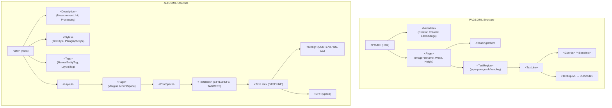

# มาตรฐาน PAGE XML และ ALTO XML เชิงเปรียบเทียบสำหรับงาน OCR/HTR เอกสารไทยโบราณ

กระบวนการแปลงเอกสารโบราณให้เป็นดิจิทัล (Digitization) และการรู้จำอักขระลายมือเขียนโบราณ (Handwritten Text Recognition - HTR) หรืออักขระพิมพ์ (Optical Character Recognition - OCR) ไม่เพียงแต่ต้องจัดเก็บข้อมูลตัวอักษรที่ถอดความได้ (Transcription Text) เท่านั้น แต่ยังจำเป็นต้องจัดเก็บข้อมูลโครงสร้างทางกายภาพ (Physical Layout) พิกัดตำแหน่งบนภาพ (Coordinates) ลำดับการอ่าน (Reading Order) ตลอดจนเมตาดาต้าของกระบวนการประมวลผล (Processing Metadata) เพื่อให้ข้อมูลดังกล่าวสามารถนำไปพัฒนาต่อยอดในมนุษยศาสตร์ดิจิทัล (Digital Humanities) และใช้เป็นข้อมูลสอน (Ground Truth) สำหรับโมเดลปัญญาประดิษฐ์ได้อย่างมีประสิทธิภาพ

มาตรฐาน XML ที่เป็นเสาหลักของวงการวิจัย HTR และระบบห้องสมุดดิจิทัลในปัจจุบันมีสองรูปแบบหลัก ได้แก่ **PAGE XML** และ **ALTO XML** บทวิเคราะห์ฉบับนี้จะเปรียบเทียบมาตรฐานทั้งสองในเชิงลึก ทั้งด้านประวัติความเป็นมา โครงสร้าง Schema การจัดเก็บพิกัด เหตุผลที่ eScriptorium เลือกใช้ PAGE XML รวมถึงการจัดการความท้าทายเฉพาะของภาษาไทยและอักษรท้องถิ่น (Non-Latin Scripts)

---

## 1. ประวัติและพัฒนาการของมาตรฐาน

### 1.1 ALTO XML (Analyzed Layout and Text Object)
ALTO XML ถูกออกแบบขึ้นในช่วงปี 2001–2003 ภายใต้โครงการวิจัย **METAe (The Metadata Engine Project)** ซึ่งได้รับทุนสนับสนุนจากสหภาพยุโรป (EU-funded) โดยมีนักวิจัยหลักอย่าง Alexander Egger, Birgit Stehno และ Gregor Retti เป็นผู้ร่วมบุกเบิก วัตถุประสงค์หลักคือการสร้างรูปแบบมาตรฐานเพื่อจัดเก็บตำแหน่งของคำ (Word Coordinates) และเค้าโครงหน้ากระดาษ (Layout) เพื่อแสดงผลไฮไลต์ข้อความ (Text Highlighting) ซ้อนทับบนภาพหนังสือพิมพ์และเอกสารสแกนในห้องสมุดดิจิทัล

*   **บทบาทของ CCS GmbH (2004–2007):** บริษัท Content Conversion Specialists (CCS) ประเทศเยอรมนี ได้นำ ALTO มาพัฒนาต่อจนประกาศรุ่น **ALTO v1.0** ในปี 2004 และดูแลจนถึงรุ่น v1.4 ในปี 2007 ทำให้มันกลายเป็นมาตรฐานพฤตินัย (De facto Standard) สำหรับโครงการสแกนเอกสารขนาดใหญ่ในยุโรป
*   **การโอนย้ายไปยัง Library of Congress (2009):** ในเดือนสิงหาคม ปี 2009 มาตรฐาน ALTO ได้รับการโอนย้ายความดูแลไปยัง **หอสมุดรัฐสภาอเมริกัน (Library of Congress - LoC)** อย่างเป็นทางการ มีการแต่งตั้งคณะกรรมการบรรณาธิการนานาชาติ (ALTO Editorial Board) เพื่อดูแลโครงสร้าง Schema ผ่าน GitHub Repository ในฐานะมาตรฐานเปิด (Open Standard) รุ่นล่าสุดในปัจจุบันคือ **ALTO v4.4** (เมษายน 2023)

### 1.2 PAGE XML (Page Analysis and Ground-truth Elements)
PAGE XML พัฒนาขึ้นโดยสถาบันวิจัย **PRImA Research Lab (Pattern Recognition & Image Analysis)** ณ **University of Salford** เมืองแมนเชสเตอร์ สหราชอาณาจักร (UK) โดยมี Stefan Pletschacher และ Apostolos Antonacopoulos เป็นผู้เขียนและพัฒนาหลัก มาตรฐานนี้ถือกำเนิดขึ้นในช่วงปี 2008–2010 ภายใต้โครงการ **IMPACT Project (Improving Access to Text)** ของสหภาพยุโรป ซึ่งเผชิญปัญหาการจัดการข้อมูลชุดฝึกฝน (Datasets) ขนาดใหญ่ของหนังสือเก่าที่กระดาษเสื่อมสภาพ บิดเบี้ยว หรือขาดเสียหาย

*   **การเผยแพร่ผ่าน ICPR 2010:** มาตรฐานนี้ถูกนำเสนออย่างเป็นทางการในงานประชุมวิชาการ **ICPR 2010** (20th International Conference on Pattern Recognition) ผ่านบทความวิทยาศาสตร์ที่อธิบายถึงข้อดีของการแยกแยะโครงสร้างแบบยืดหยุ่นสูง
*   **บทบาทในการแข่งขัน ICDAR (2010–2013):** PAGE XML ถูกเลือกให้เป็นมาตรฐานกลางสำหรับการแข่งขัน **ICDAR Page Segmentation Competition** เพื่อประเมินประสิทธิภาพอัลกอริทึมวิเคราะห์เค้าโครงหน้ากระดาษ (Layout Analysis)
*   **การกำหนดเวอร์ชันตามวันที่ (Date-based Versioning):** PAGE XML แตกต่างจากมาตรฐานอื่นตรงที่ไม่มีเลขรุ่นหลัก/ย่อย (Major/Minor) แต่จะฝังวันที่อัปเดตลงใน Namespace URI โดยตรง เช่น `http://schema.primaresearch.org/PAGE/gts/pagecontent/2019-07-15` โดยเวอร์ชันที่ใช้แพร่หลายที่สุดในปัจจุบันคือรุ่น **2019-07-15** และรุ่นล่าสุดคือ **2024-07-15**

---

## 2. การเปรียบเทียบโครงสร้าง Schema และองค์ประกอบสำคัญ

แม้มาตรฐานทั้งสองจะบันทึกโครงสร้างทางกายภาพเหมือนกัน แต่แนวคิดการออกแบบ (Design Philosophy) และโครงสร้างลำดับชั้น (Hierarchy) มีความแตกต่างกันอย่างมีนัยสำคัญ ดังรายละเอียดและตารางเปรียบเทียบต่อไปนี้:

### 2.1 โครงสร้างระดับบนและเมตาดาต้า
*   **PAGE XML (PcGts):** มี Root Element คือ `<PcGts>` (Page Content Ground Truth and Storage) ภายในบรรจุสองอิลิเมนต์หลักคือ `<Metadata>` และ `<Page>` 
    *   `<Metadata>` บันทึกข้อมูลจำเพาะเชิงประวัติ เช่น ผู้สร้างไฟล์ (`<Creator>`), วันที่สร้าง (`<Created>`), วันที่แก้ไขล่าสุด (`<LastChange>`), และความคิดเห็นทั่วไป (`<Comments>`)
*   **ALTO XML (alto):** มี Root Element คือ `<alto>` และแบ่งโครงสร้างภายในออกเป็น 4 ส่วนอย่างชัดเจน ได้แก่:
    1.  `<Description>`: บันทึกหน่วยวัดพิกัด (`<MeasurementUnit>` เช่น pixel, mm10, inch1200) ข้อมูลภาพต้นฉบับ (`<sourceImageInformation>`) และบันทึกกระบวนการประมวลผลก่อน-หลังอย่างละเอียด (`<Processing>` เช่น ซอฟต์แวร์ประมวลผล ค่าพารามิเตอร์การลบจุดรบกวน (Binarization Step))
    2.  `<Styles>`: บันทึกข้อมูลสไตล์ เช่น รูปแบบฟอนต์ ขนาด ตัวหนา/ตัวเอียง (`<TextStyle>`) และการจัดย่อหน้า ระยะห่างบรรทัด (`<ParagraphStyle>`) เพื่อนำไปอ้างอิงใช้งานด้านล่างด้วยแอตทริบิวต์ `STYLEREFS`
    3.  `<Tags>`: ประกาศหมวดหมู่ป้ายกำกับล่วงหน้า เช่น ป้ายกำกับระบุโครงสร้าง ย่อยโครงสร้าง หรือแท็กเอนทิตีมีนาม (Named Entities เช่น บุคคล สถานที่ องค์กร ในแท็ก `<NamedEntityTag>`) เพื่อนำไปอ้างอิงใช้ด้วยแอตทริบิวต์ `TAGREFS`
    4.  `<Layout>`: บรรจุขอบเขตและการแบ่งหน้าเอกสาร



### 2.2 โครงสร้างระดับหน้า (Page Level Partitioning)
*   **PAGE XML:** โครงสร้างบริเวณเนื้อหา (Regions) เช่น ข้อความ รูปภาพ จะอยู่ภายใต้ `<Page>` โดยตรง และใช้แท็ก `<Border>` เพื่อตีกรอบพื้นที่ใช้สอยจริงของหน้ากระดาษ (ลบส่วนขอบสแกนที่เป็นสีดำออก) นอกจากนี้ยังมีระบบลำดับการอ่าน `<ReadingOrder>` ที่ประกอบด้วย `<OrderedGroup>` และ `<UnorderedGroup>` เพื่อระบุลำดับการไหลของข้อความที่ตัดข้ามคอลัมน์ได้อย่างอิสระ
*   **ALTO XML:** บังคับแบ่งหน้ากระดาษออกเป็น 5 ส่วนตามมาตรฐานสิ่งพิมพ์ดั้งเดิม ได้แก่ ขอบเขตพื้นที่ว่างโดยรอบ 4 ทิศ (`<TopMargin>`, `<LeftMargin>`, `<RightMargin>`, `<BottomMargin>`) และพื้นที่พิมพ์กึ่งกลาง (`<PrintSpace>`) บล็อกข้อมูลทั้งหมดต้องบรรจุอยู่ภายใน PrintSpace หรือ Margin เหล่านี้เท่านั้น ซึ่งทำให้ขาดความยืดหยุ่นในเอกสารโบราณที่ไม่มีระยะขอบชัดเจน

### 2.3 ประเภทอาณาบริเวณ (Region Types)
จุดเด่นที่ทำให้ PAGE XML แตกต่างจาก ALTO XML อย่างเด่นชัดคือ จำนวนประเภทอาณาบริเวณที่หลากหลายและตอบโจทย์งานวิจัยมากกว่า:
*   **ALTO XML:** มี Block Types หลักเพียง 4 ประเภท ได้แก่:
    1.  `<TextBlock>`: บล็อกข้อความ
    2.  `<Illustration>`: บล็อกรูปภาพ
    3.  `<GraphicalElement>`: องค์ประกอบเส้น เช่น เส้นแบ่งคอลัมน์ เส้นประคั่น
    4.  `<ComposedBlock>`: บล็อกซ้อนบล็อกเพื่อรวมกลุ่มเนื้อหา
*   **PAGE XML:** มี Region Types มากกว่า 15 ประเภท ครอบคลุมเกือบทุกส่วนประกอบในเอกสารประวัติศาสตร์ เช่น:
    *   `<TextRegion>`: แยกประเภทย่อยได้ผ่านแอตทริบิวต์ `type` (เช่น heading, paragraph, footnote, marginalia, page-number)
    *   `<ImageRegion>` และ `<GraphicRegion>`: แยกรูปภาพจริงกับสัญลักษณ์/โลโก้
    *   `<TableRegion>`: บล็อกตารางข้อมูล
    *   `<ChartRegion>` / `<MathsRegion>` / `<ChemRegion>`: กราฟ แผนภูมิ สูตรคณิตศาสตร์ และสูตรเคมี
    *   `<MusicRegion>`: บล็อกโน้ตดนตรี
    *   `<SeparatorRegion>`: เส้นแบ่งหน้า
    *   `<NoiseRegion>`: บริเวณจุดรบกวน รอยเปื้อน รอยขาด เพื่อสั่งให้ซอฟต์แวร์ HTR ข้ามการประมวลผล
    *   `<MapRegion>`: พื้นที่แสดงแผนที่โบราณ

### 2.4 ลำดับชั้นเนื้อหาข้อความ (Text Hierarchy)
*   **PAGE XML:** ลำดับชั้นคือ `<TextRegion>` $\rightarrow$ `<TextLine>` $\rightarrow$ `<Word>` $\rightarrow$ `<Glyph>` 
    *   การเก็บข้อความจะอยู่ภายใต้แท็ก `<TextEquiv>` (Text Equivalence) ซึ่งบรรจุแท็กย่อย `<Unicode>` และ `<PlainText>` แท็ก TextEquiv สามารถปรากฏได้ในทุกระดับชั้น (ตั้งแต่ระดับ Region จนถึงระดับอักขระเดี่ยว)
*   **ALTO XML:** ลำดับชั้นคือ `<TextBlock>` $\rightarrow$ `<TextLine>` $\rightarrow$ `<String>` $\rightarrow$ `<Glyph>` (เพิ่มระดับ Glyph ในเวอร์ชัน 4.0 ขึ้นไป)
    *   การเก็บข้อความจะใช้แอตทริบิวต์ `CONTENT` บนแท็ก `<String>` โดยไม่มีแท็กครอบข้อความโดยตรง 
    *   มีแท็กบังคับระบุช่องว่างระหว่างคำทางกายภาพคือ `<SP>` (Space) และแท็กระบุคำที่ถูกตัดครึ่งบรรทัดด้วยยัติภังค์ `<HYP>` (Hyphen) ซึ่ง PAGE XML ไม่มีโครงสร้างเฉพาะสำหรับช่องว่างและยัติภังค์เหล่านี้ (ถือเป็น Implicit Information ในสายอักขระ Unicode)

---

## 3. ระบบพิกัดและการระบุตำแหน่ง (Coordinate System)

การระบุพิกัดตำแหน่งของข้อความและองค์ประกอบภาพระหว่าง ALTO XML และ PAGE XML มีความแตกต่างกันอย่างสิ้นเชิงในแง่ของความแม่นยำทางคณิตศาสตร์:

### 3.1 Bounding Box (พิกัดกล่องสี่เหลี่ยมของ ALTO)
โครงสร้างแบบดั้งเดิมของ ALTO อิงอยู่บน **Bounding Box** ซึ่งระบุด้วยแอตทริบิวต์เชิงตัวเลข 4 ค่าบนระนาบ 2 มิติ (โดยมีพิกัด 0,0 อยู่ที่มุมบนซ้ายของภาพ แกน X ขยายไปทางขวา แกน Y ขยายลงด้านล่าง):
*   `HPOS` (Horizontal Position): ระยะห่างจากขอบซ้ายของหน้าภาพไปยังมุมบนซ้ายของกล่อง
*   `VPOS` (Vertical Position): ระยะห่างจากขอบบนของหน้าภาพไปยังมุมบนซ้าย of กล่อง
*   `WIDTH`: ความกว้างของกล่องข้อความ
*   `HEIGHT`: ความสูงของกล่องข้อความ

```text
(0,0) มุมบนซ้ายภาพ
  +----------------------------------------------------> แกน X
  |
  |     HPOS
  |   |<---->+----------------------------+
  |   |      |                            |
  |   | VPOS |                            |
  |   v      |       Bounding Box         | HEIGHT
  |          |       (ALTO Style)         |
  |          |                            |
  |          +----------------------------+
  |                      WIDTH
  v
แกน Y
```

**ข้อจำกัด:** Bounding Box ของ ALTO บังคับให้ขอบกล่องขนานกับแกน X และ Y เสมอ ไม่สามารถรับมือกับบรรทัดที่เอียง (Skewed) บิดเบี้ยว หรือคดโค้งได้เลย เมื่อกล่องสี่เหลี่ยมตั้งตรงครอบคลุมข้อความที่เอียง พื้นที่ว่างในกล่องจะดึงข้อมูลพิกเซลของบรรทัดข้างเคียงเข้ามาด้วย ก่อให้เกิดสัญญาณรบกวนในการฝึกสอนโมเดล

### 3.2 Polygon-based Coordinates (พิกัดหลายเหลี่ยมของ PAGE XML)
PAGE XML ปฏิวัติการเก็บตำแหน่งพิกัดโดยใช้ **Bounding Polygon** ผ่านแท็ก `<Coords>` ซึ่งเก็บแอตทริบิวต์ `points` ในรูปแบบสายอักขระของจุดพิกัดหลาย ๆ จุดต่อกัน:

$$\text{points} = "x_1,y_1\ x_2,y_2\ x_3,y_3\ \dots\ x_n,y_n"$$

โดยแต่ละจุดจะสร้างเส้นเชื่อมต่อกันจนเป็นรูปปิดหลายเหลี่ยม (Closed Polygon) ที่มีรูปทรงอิสระ (Arbitrary Shape)

```text
                (x2, y2)
                +-------+
 (x1, y1)      /         \
    +---------+           + (x3, y3)
     \                     \
      \    Polygon Coords   + (x4, y4)
       \    (PAGE XML)     /
        +-----------------+
     (x6, y6)          (x5, y5)
```

**ข้อดี:** พิกัดรูปหลายเหลี่ยมช่วยให้กล่องขอบเขตสามารถลากเส้นคดเคี้ยว ซิกแซก หรือโค้งงอตามสรีระของอักขระโบราณหรือการบิดเบี้ยวของแผ่นลานลอนคลื่นได้โดยไม่กินพื้นที่ของบรรทัดข้างเคียง

### 3.3 เส้นฐาน (Baseline)
ในระดับบรรทัดข้อความ (`<TextLine>`) PAGE XML จะบรรจุองค์ประกอบที่สองนอกเหนือจาก `<Coords>` นั่นคือ `<Baseline>` ซึ่งเก็บในรูปแบบพิกัดเส้นเปิด (Polyline):

$$\text{points} = "x_1,y_1\ x_2,y_2\ \dots\ x_m,y_m"$$

*   **ความหมาย:** Baseline คือเส้นฐานสมมติที่ตัวอักษรตั้งอยู่ (ไม่รวมสระล่างหรือส่วนหางที่ย้อยลงมาใต้บรรทัด)
*   **ความสำคัญ:** โมเดล HTR ยุคใหม่ไม่ได้อ่านกล่องสี่เหลี่ยมทื่อ ๆ อีกต่อไป แต่จะใช้วิธีกวาดสายตาอ่านพิกเซลตามแนวคดโค้งของเส้น Baseline ซึ่งช่วยให้การรู้จำตัวอักษรลายมือเขียน (Handwriting) ที่มักเขียนลาดเอียงขึ้นลงมีความแม่นยำสูงขึ้นมาก

> [!NOTE]
> แม้มาตรฐาน ALTO XML ตั้งแต่เวอร์ชัน 4.0 จะเริ่มปรับตัวโดยอนุญาตให้ใช้รูปทรงโพลีกอนผ่านแท็ก `<Shape><Polygon>` และขยายคุณสมบัติ `<BASELINE>` ให้รองรับหลายจุดในเวอร์ชัน 4.2 แต่โครงสร้างดั้งเดิมและซอฟต์แวร์ประมวลผลส่วนใหญ่ของ ALTO ก็ยังคงยึดติดอยู่กับการคำนวณแบบ Bounding Box เป็นหลัก ต่างจาก PAGE XML ที่ออกแบบและสนับสนุนโครงสร้างโพลีกอนมาตั้งแต่ต้น

---

## 4. ทำไม eScriptorium และระบบ HTR สมัยใหม่เลือก PAGE XML เป็นค่าเริ่มต้น

ภาพรวมของการถอดความและฝึกสอนโมเดลยอดนิยมระดับโลก เช่น **eScriptorium** (ที่ทำงานร่วมกับเอนจิน **Kraken**) และ **Transkribus** เลือกใช้ PAGE XML เป็นรูปแบบจัดเก็บข้อมูลภายใน (Native Format) และกำหนดให้เป็นค่าเริ่มต้นด้วยเหตุผลเชิงเทคนิคดังนี้:

1.  **สอดคล้องกับสถาปัตยกรรมโมเดล HTR แบบ Baseline-driven:**
    ซอฟต์แวร์ Kraken ใช้ระบบแบ่งส่วนภาพบรรทัด (Segmentation) โดยตรวจหาเส้น Baseline เป็นหลัก การบันทึกพิกัดของ eScriptorium จึงต้องการข้อมูลเส้น Baseline โครงสร้างของ PAGE XML ที่มีแท็ก `<Baseline>` แยกเป็นอิสระคู่กับ `<Coords>` จึงตรงกับสถาปัตยกรรมนี้ 100%
2.  **ประสิทธิภาพในขั้นตอนการสอนโมเดล (Training Ground Truth):**
    ในขั้นตอนการเตรียม Ground Truth สำหรับอัลกอริทึมปัญญาประดิษฐ์ โมเดลจำเป็นต้องดึงภาพบรรทัดเฉพาะส่วนมาแปลงเป็น Tensor ข้อมูล (Line Images Extraction) พิกัด Polygon ของ PAGE XML ช่วยให้สามารถตัดภาพบรรทัดออกเป็นรูปทรงฟันปลาเพื่อหลบเลี่ยงไม่ให้พิกเซลของบรรทัดบนและล่างชนกัน ทำให้ข้อความที่จะส่งเข้าสถาปัตยกรรมโครงข่ายประสาทเทียม (CNN-LSTM) สะอาด ปราศจากพิกเซลแปลกปลอม
3.  **ความยืดหยุ่นและการขยายคุณสมบัติผ่าน Custom Attribute:**
    PAGE XML ออกแบบแอตทริบิวต์ `custom` บน Regions และ Lines มาอย่างเป็นระบบ ซอฟต์แวร์ต่าง ๆ สามารถฝังโครงสร้างข้อมูลภายใน (Internal Properties) ลงไปได้โดยไม่ทำลายมาตรฐาน Schema เช่น eScriptorium สามารถฝังโครงสร้างแท็กเฉพาะโปรเจกต์ หรือ Transkribus สามารถเก็บข้อมูลสถานะการตรวจสอบผ่าน `custom="status {checked:true;}"`

---

## 5. เปรียบเทียบโค้ดตัวอย่างการเก็บพิกัดและข้อความภาษาไทย

เพื่อให้เห็นภาพการทำงานจริงในระดับโครงสร้างไฟล์ ด้านล่างนี้คือตัวอย่างเปรียบเทียบไฟล์ PAGE XML และ ALTO XML ที่เก็บข้อมูลข้อความภาษาไทยประโยคเดียวกัน: **"สมเด็จพระบวรราชเจ้ามหาเสนานุรักษ์"**

### 5.1 ตัวอย่าง PAGE XML (ฉบับสมบูรณ์)
แสดงการเก็บพิกัดในรูปของ Polygon และเส้น Baseline คู่กับการบรรจุข้อความถอดความในแท็ก `<Unicode>`:

```xml
<?xml version="1.0" encoding="UTF-8"?>
<PcGts xmlns="http://schema.primaresearch.org/PAGE/gts/pagecontent/2019-07-15"
       xmlns:xsi="http://www.w3.org/2001/XMLSchema-instance"
       xsi:schemaLocation="http://schema.primaresearch.org/PAGE/gts/pagecontent/2019-07-15
                           http://schema.primaresearch.org/PAGE/gts/pagecontent/2019-07-15/pagecontent.xsd">
    <Metadata>
        <Creator>eScriptorium/Kraken HTR</Creator>
        <Created>2026-06-04T21:55:00</Created>
        <LastChange>2026-06-04T21:58:00</LastChange>
        <Comments>ตัวอย่างการบันทึกเอกสารไทยโบราณระดับบรรทัดด้วย PAGE XML</Comments>
    </Metadata>
    <Page imageFilename="thai_palmleaf_001.jpg" imageWidth="2400" imageHeight="800">
        <ReadingOrder>
            <OrderedGroup id="ro_1">
                <RegionRefIndexed index="0" regionRef="reg_text_01"/>
            </OrderedGroup>
        </ReadingOrder>
        <TextRegion id="reg_text_01" type="paragraph">
            <Coords points="100,50 2300,50 2300,750 100,750"/>
            <TextLine id="l_01">
                <!-- พิกัดรูปหลายเหลี่ยม (Polygon Coords) ของบรรทัด วาดขอบบนล่างหลบสระ -->
                <Coords points="110,180 2290,180 2290,265 2100,265 2100,290 110,290"/>
                <!-- เส้นฐาน (Baseline) ลากตรงใต้ระดับพยัญชนะหลัก -->
                <Baseline points="110,250 2290,250"/>
                <TextEquiv conf="0.98">
                    <Unicode>สมเด็จพระบวรราชเจ้ามหาเสนานุรักษ์</Unicode>
                </TextEquiv>
            </TextLine>
        </TextRegion>
    </Page>
</PcGts>
```

### 5.2 ตัวอย่าง ALTO XML (ฉบับสมบูรณ์)
แสดงการเก็บข้อมูลพิกัดแบบ Bounding Box โดยพึ่งพาแอตทริบิวต์ `HPOS`, `VPOS`, `WIDTH`, `HEIGHT` บนแท็ก `<TextLine>` และข้อความถอดความถูกฝังอยู่บนแอตทริบิวต์ `CONTENT` ของแท็ก `<String>`:

```xml
<?xml version="1.0" encoding="UTF-8"?>
<alto xmlns="http://www.loc.gov/standards/alto/ns-v4#"
      xmlns:xsi="http://www.w3.org/2001/XMLSchema-instance"
      xsi:schemaLocation="http://www.loc.gov/standards/alto/ns-v4#
                          http://www.loc.gov/standards/alto/v4/alto-4-4.xsd">
    <Description>
        <MeasurementUnit>pixel</MeasurementUnit>
        <sourceImageInformation>
            <fileName>thai_palmleaf_001.jpg</fileName>
        </sourceImageInformation>
        <Processing ID="PROC_HTR_01">
            <ocrProcessingStep>
                <processingStepDescription>Handwritten Text Recognition</processingStepDescription>
                <processingSoftware>
                    <softwareCreator>Kraken</softwareCreator>
                    <softwareName>Kraken HTR Engine</softwareName>
                    <softwareVersion>4.3.1</softwareVersion>
                </processingSoftware>
            </ocrProcessingStep>
        </Processing>
    </Description>
    <Layout>
        <Page ID="p_001" WIDTH="2400" HEIGHT="800" PHYSICAL_IMG_NR="1">
            <PrintSpace HPOS="100" VPOS="50" WIDTH="2200" HEIGHT="700">
                <TextBlock ID="tb_01" HPOS="100" VPOS="50" WIDTH="2200" HEIGHT="700">
                    <!-- TextLine และ String ใช้ Bounding Box พิกัด X, Y, W, H และเก็บข้อความใน CONTENT -->
                    <TextLine ID="tl_01" HPOS="110" VPOS="180" WIDTH="2180" HEIGHT="110" BASELINE="250">
                        <String ID="str_01" CONTENT="สมเด็จพระบวรราชเจ้ามหาเสนานุรักษ์" 
                                HPOS="110" VPOS="180" WIDTH="2180" HEIGHT="110" WC="0.98"/>
                    </TextLine>
                </TextBlock>
            </PrintSpace>
        </Page>
    </Layout>
</alto>
```

---

## 6. การจัดการภาษาไทย อักษรท้องถิ่น และข้อจำกัดเชิงเทคนิค

การทำ Digitalization ภาษาไทยและอักษรตระกูลอินเดียใต้ที่ใช้ในเอกสารโบราณ (เช่น อักษรขอมไทย อักษรธรรมล้านนา ในใบลานและสมุดข่อย) มีความท้าทายเฉพาะเจาะจงทางภาษาศาสตร์และกายภาพอักษรที่ระบบ XML ต้องรับมือ:

### 6.1 โครงสร้างอักษร 4 ระดับ (4-Level Stacking) กับปัญหาความสูงของบรรทัด
ภาษาไทยไม่ใช่ภาษาเชิงเส้นในแนวนอน (Linear Sequence) แต่เป็นภาษาที่มีการวางตำแหน่งอักขระซ้อนกันในแนวดิ่ง (Stacking Character Structure) แบ่งออกเป็น 4 ระดับ ได้แก่:
1.  **ระดับเหนือวรรณยุกต์ (Level 1):** วรรณยุกต์ (่ ้ ๊ ๋) และทัณฑฆาต (์)
2.  **ระดับสระบน (Level 2):** สระบน (ิ ี ึ ื) ไม้หันอากาศ (ั) และไม้ไต่คู้ (็)
3.  **ระดับพยัญชนะหลัก (Level 3):** พยัญชนะ ก-ฮ และสระในแนวระดับเดียวกัน (เ แ โ ใ ไ ะ า ำ) นี่คือระดับแกนกลางที่สายตากวาดอ่าน
4.  **ระดับสระล่าง (Level 4):** สระล่าง (ุ ู) และเครื่องหมายสะกดหรือพินทุ (ฺ)

ความสูงของบรรทัดภาษาไทยจึงมีความแปรปรวน (Variable Line Height) สูงมาก ขึ้นอยู่กับว่าส่วนผสมของคำนั้นมีองค์ประกอบครบ 4 ระดับหรือไม่

```text
ระดับ 1:  เหนือวรรณยุกต์   --->      ้            ่
ระดับ 2:  สระบน           --->      ี            ี
ระดับ 3:  พยัญชนะหลัก     --->   พ  ี  ่  น  ี  ่  ห  น  ี  ท  ี  ่  น  ี  ่
ระดับ 4:  สระล่าง         --->      ู            ู
```

### 6.2 ปัญหา Bounding Box Overlapping (การซ้อนทับกันข้ามบรรทัด)
เมื่อเอกสารโบราณมีการจารหรือพิมพ์บรรทัดที่เบียดชิดกัน (Tight Leading) การใช้ Bounding Box (ALTO) จะนำไปสู่ปัญหาการซ้อนทับ (Overlap) ของขอบเขตบรรทัด:
*   สระล่าง (ระดับ 4 เช่น ุ ู) ของบรรทัดบน จะยื่นย้อยลงมาชนหรือซ้อนทับกับ วรรณยุกต์และสระบน (ระดับ 1 และ 2 เช่น ่ ้ ี) ของบรรทัดล่าง
*   หากวาดสี่เหลี่ยมครอบคลุมแต่ละบรรทัด พื้นที่ทับซ้อน (Intersection Area) จะมีข้อมูลอักขระของทั้งสองบรรทัดรวมอยู่ด้วย
*   เมื่อนำไปส่งต่อให้ Machine Learning เรียนรู้ (Training) จะเกิดสภาวะ **"Attention Confusion"** หรือความสับสนของระบบความใส่ใจในตัวแบบ โมเดลจะไม่สามารถตัดสินใจได้ว่าสระล่างที่ยื่นมานั้นเป็นของบรรทัดบน หรือสระบนที่ชูขึ้นไปนั้นเป็นของบรรทัดล่าง ส่งผลให้โมเดลมีพฤติกรรมทำนายตัวอักษรมั่วข้ามบรรทัด หรือความแม่นยำร่วงดิ่งลง

**ทางออกใน XML:** การใช้พิกัดรูปหลายเหลี่ยม (Polygon) ใน PAGE XML ช่วยให้เราสามารถจุดตำแหน่งขอบเขตแบบฟันปลาซิกแซกเพื่อเบี่ยงหรือหลบหลีกยอดอักษรของบรรทัดล่างและฐานอักษรของบรรทัดบนได้อย่างประณีต ขจัดปัญหา Overlap ได้เด็ดขาด

### 6.3 ข้อจำกัดของแท็ก `<Word>` และความไม่มีช่องว่างแบ่งคำ
ภาษาไทยเขียนต่อเนื่องกันเป็นประโยคโดยไม่มีเครื่องหมายแบ่งคำ (Space-delimited) แต่จะใช้ช่องว่างเพื่อจบประโยคหรือวลีเท่านั้น (Continuous Script) ปัญหาทางภาษาศาสตร์ที่ตามมาคือ:
*   **ความกำกวมในการตัดคำ (Word Segmentation Ambiguity):** เช่น คำว่า "ตากลม" สามารถสะกดแยกคำได้สองวิถีตามบริบท คือ "ตา-กลม" (ดวงตากลมอวบ) หรือ "ตาก-ลม" (ผึ่งลม)
*   **ขอบเขตพิกเซลบนภาพที่แยกยาก:** พยัญชนะไทยเขียนต่อเนื่องกัน ปลายหางของพยัญชนะหนึ่งอาจไปพัวพันกับสระบนหรือฐานของพยัญชนะถัดไป ทำให้การลากกล่องพิกัดเพื่อกำหนดเขตคำในภาพไม่สามารถแยกออกจากกันได้อย่างเด็ดขาด

**แนวปฏิบัติที่ดีที่สุด (Best Practice):**
ไม่ควรพยายามทำ Word Segmentation (ลากกล่องคำย่อย) ในระดับไฟล์โครงสร้างทางกายภาพ HTR อย่าง PAGE XML หรือ ALTO XML เป็นอันขาด เนื่องจากจะสร้างภาระงานแก่ผู้จัดทำข้อมูล (Manual Annotators) เกินจำเป็น และนำไปสู่ข้อมูลพิกัดระดับคำที่ผิดพลาด
> [!IMPORTANT]
> ให้กำหนดขอบเขตและจัดทำ Ground Truth ที่ระดับ **`<TextLine>` (บรรทัดข้อความ)** เท่านั้น โดยพิมพ์ข้อความ Unicode ต่อเนื่องกันไปภายใต้แท็ก `<TextEquiv>` ของบรรทัด จากนั้นเมื่อต้องการประมวลผลคำเพื่อสร้างดรรชนีสืบค้น (Search Indexing) ให้ส่งข้อความทั้งหมดไปตัดคำในภายหลังด้วยซอฟต์แวร์ NLP (Natural Language Processing) หรือแปลงโครงสร้างผลลัพธ์เป็นมาตรฐาน **TEI XML (Text Encoding Initiative)** สำหรับการเข้ารหัสเชิงความหมายวิชาการ

### 6.4 แนวปฏิบัติในการทำ Normalization และจัดการอักขระพิเศษ
1.  **การจัดการสระอำ (ำ):**
    ในระบบรหัสอักขระ Unicode สระอำ สามารถเกิดขึ้นได้ 2 รูปแบบในระบบฐานข้อมูล:
    *   **NFC (Normalization Form Canonical Composition):** จัดเก็บเป็นรหัสอักขระตัวเดียวเบ็ดเสร็จ คือ `U+0E33` (THAI CHARACTER SARA AM)
    *   **NFD (Normalization Form Canonical Decomposition):** จัดเก็บแยกชิ้นส่วนเป็น นิคหิต `U+0E4D` (THAI CHARACTER NIKHAHIT) ตามด้วย ลากข้าง `U+0E32` (THAI CHARACTER SARA AA)
    *   *แนวปฏิบัติ:* ต้องทำ Normalization ข้อความทั้งหมดให้เป็นรูปแบบ **NFC (U+0E33)** เสมอก่อนบันทึกลงในแท็ก `<Unicode>` ของ PAGE XML เพื่อป้องกันระบบสืบค้นข้อความทำงานผิดพลาดและป้องกันความไม่สอดคล้องกันในชุดข้อมูลฝึกฝน
2.  **การวาดเส้น Baseline ในภาษาไทย:**
    กฎทองคำของการลากเส้น Baseline สำหรับอักษรไทยคือ **"ให้ลากผ่านใต้ฐานของพยัญชนะหลัก (ระดับ 3) และห้ามเลี้ยวหลบสระล่างเป็นอันขาด"**
    *   เมื่อเจอสระล่าง (ุ ู) หรือพินทุ (ฺ) ให้ลากเส้นตรงทะลุผ่านเครื่องหมายเหล่านั้นไปเลย เสมือนว่ามีพยัญชนะหลักเป็นโครงสร้างแบกรับเท่านั้น เพื่อให้โมเดล HTR เรียนรู้รูปแบบตำแหน่งความสูงของสระล่างและพยัญชนะหลักได้อย่างสม่ำเสมอ
3.  **การถอดความอักขระพิเศษ (พยัญชนะไม่มีฐาน ญ ฐ):**
    พยัญชนะ ญ (`U+0E0D`) และ ฐ (`U+0E10`) เมื่อต้องผสมกับสระล่าง (ุ ู) หรือพินทุ (ฺ) ส่วนฐานล่างจะถูกตัดออกไปตามการแสดงผลทางหน้าจอ (เช่น "กุญชร" ฐาน ญ หายไป)
    *   *แนวปฏิบัติ:* ในการถอดความลง XML **ห้าม** ไปสืบเสาะหารหัสอักขระพิเศษที่ตัดฐานมาใช้เด็ดขาด ให้พิมพ์รหัส ญ หรือ ฐ มาตรฐานร่วมกับสระล่างไปตามลำดับการสะกดปกติ ปล่อยให้เป็นหน้าที่ของ Font Rendering Engine (เช่น HarfBuzz) ทำการแปลง Glyph แสดงผลบนจอภาพด้วยตัวเอง

---

## 7. ตารางสรุปเปรียบเทียบคุณสมบัติ (Head-to-Head Comparison)

| มิติการเปรียบเทียบ | PAGE XML (Date-based Schema) | ALTO XML (v4.4ล่าสุด) |
| :--- | :--- | :--- |
| **จุดประสงค์หลัก** | การทำโมเดล Ground Truth และวิเคราะห์เอกสารโบราณ | การส่งมอบ เผยแพร่ และเก็บรักษาเอกสารในคลังดิจิทัล |
| **องค์กรผู้ดูแล** | PRImA Research Lab, University of Salford (UK) | Library of Congress (LoC) & Editorial Board |
| **หน่วยวัดพิกัด** | พิกเซล (pixel) เสมอ | พิกเซล, 1/10 มิลลิเมตร, 1/1200 นิ้ว |
| **ความแม่นยำพิกัด** | สูงมาก (Polygon อิสระเป็นหลักมาตั้งแต่เริ่มต้น) | ปานกลาง-ต่ำ (เน้น Bounding Box กล่องสี่เหลี่ยมขนานแกน) |
| **ประเภทอาณาบริเวณ (Regions)**| ครอบคลุมสูงมาก (15+ ชนิด มี Noise, Table, Maths) | ต่ำ (มี 4 บล็อกหลัก ต้องใช้ ComposedBlock ประยุกต์) |
| **การเก็บข้อความ** | แท็กลูก `<TextEquiv><Unicode>` บนองค์ประกอบใดก็ได้ | แอตทริบิวต์ `CONTENT` บนแท็ก `<String>` |
| **ระบบพิกัดเส้นฐาน (Baseline)**| โครงสร้างแท็ก `<Baseline>` ระบุพิกัดเส้นเปิดอย่างอิสระ | เดิมเป็นค่าเดี่ยว ปัจจุบันเป็น List of points ในแอตทริบิวต์ |
| **ลำดับการอ่าน (Reading Order)**| มีแท็กระบุแบบกลุ่ม/แบบเรียงลำดับ มาตั้งแต่ต้น | เพิ่งเพิ่มแท็ก `<ReadingOrder>` เข้ามาในเวอร์ชัน 4.3 |
| **เมตาดาต้ากระบวนการ** | บันทึกเฉพาะข้อมูลทั่วไป (ผู้สร้าง วันเวลาที่แก้ไข) | บันทึกรายละเอียดเชิงลึก (ซอฟต์แวร์ อัลกอริทึม การตั้งค่า) |
| **การบันทึกช่องว่าง/ยัติภังค์** | เป็นข้อมูลทางอ้อมภายในข้อความถอดความ | มีแท็กเฉพาะเจาะจงทางกายภาพภาพคือ `<SP>` และ `<HYP>` |
| **ความเหมาะสมกับ HTR ไทย** | **แนะนำสูงสุด** (ลดปัญหา Overlap, แม่นยำระดับพิกเซล) | ไม่แนะนำให้ใช้เทรน (สร้างปัญหา Overlap และสลับบรรทัด) |
| **การเชื่อมต่อมาตรฐาน METS** | ทำงานร่วมกันได้ยากกว่า (ต้องการระบบแปลงไฟล์) | ทำงานร่วมกันได้สมบูรณ์แบบ (METS+ALTO เป็นคู่มาตรฐานสากล) |
| **การรองรับใน eScriptorium** | รองรับในระดับ Native (Import/Export สม่ำเสมอ) | รองรับ Import/Export (แต่อาจพบพิกัดเคลื่อนจากการสเกล) |

---

## 8. สรุปและคำแนะนำเชิงปฏิบัติการ

สำหรับทีมงานวิจัยที่ต้องเริ่มต้นสร้างโครงการ HTR สำหรับเอกสารโบราณภาษาไทยและอักษรท้องถิ่นจากศูนย์ ขอแนะนำแนวทางปฏิบัติการเลือกใช้มาตรฐาน XML ในวงจรการทำงาน (Pipeline) ดังต่อไปนี้:

```text
  [ เอกสารต้นฉบับ/ภาพสแกน ]
            |
            v
  [ eScriptorium / Transkribus ]  <--- (ประมวลผล/จัดทำข้อมูลสอนในรูปแบบ PAGE XML)
            |
            v
  [ ฝึกสอนโมเดล Kraken HTR ]      <--- (ใช้ข้อมูล Baseline/Polygon จาก PAGE XML)
            |
            v
  [ ส่งออกผลลัพธ์การรู้จำ ]
      /            \
     v              v
[ วิจัยวิชาการ ]   [ ห้องสมุดดิจิทัล ]
     |              |
     v              v
 [ TEI XML ]    [ ALTO XML + METS ]
```

1.  **ในขั้นตอนจัดเตรียมข้อมูลสอน (Ground Truth Creation) และฝึกฝนโมเดล (HTR Training):**
    ให้เลือกใช้ **PAGE XML** เป็นมาตรฐานหลักเพียงหนึ่งเดียวเสมอ เนื่องจากโครงสร้างพิกัดโพลีกอน (Polygon) และเส้นฐาน (Baseline) สามารถรองรับความสูงของบรรทัดภาษาไทย 4 ระดับ และหลบหลีกการชนกันของขอบเขตบรรทัดได้สมบูรณ์ที่สุด
2.  **ในขั้นตอนการนำเสนอและจัดเก็บรักษาถาวร (Long-term Archiving & Digital Library Delivery):**
    เมื่อถอดความเสร็จสิ้นและต้องการนำขึ้นเผยแพร่ร่วมกับระบบสืบค้นห้องสมุดดิจิทัลระดับชาติ ให้ใช้เครื่องมือแปลงรูปแบบ (Conversion Tools เช่น `ocr-fileformat` ของหอสมุด Mannheim หรือไลบรารี `ocrd-page-to-alto`) เพื่อแปลงไฟล์จาก PAGE XML ไปเป็น **ALTO XML** คู่กับ **METS** ซึ่งมีความปลอดภัยและเป็นมาตรฐานที่สถาบันสารสนเทศทั่วโลกรองรับในระยะยาว
3.  **แนวทางการเก็บข้อความภาษาไทย:**
    ละทิ้งการลากพิกัดแยกคำย่อย และหลีกเลี่ยงการใช้แท็ก `<Word>` หรือ `<String>` สำหรับภาษาไทย ให้เก็บข้อมูลข้อความต่อเนื่องระดับบรรทัด `<TextLine>` ภายใต้แท็ก `<Unicode>` เสมอ เพื่อลดความผิดพลาดด้านรูปภาพและขจัดปัญหารอยต่อพิกัดภาพของภาษาที่ไม่มีช่องว่างแบ่งคำ
