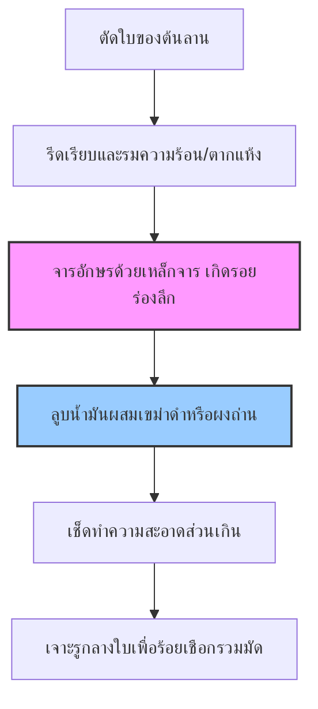

# มาตรฐานและคู่มือปฏิบัติการถ่ายภาพและการสแกนดิจิทัลสำหรับคัมภีร์ใบลานและสมุดพับโบราณ
*(Digital Imaging and Acquisition Standards for Fragile Palm-Leaf Manuscripts and Folding Books)*

---

## 1. บทนำและความสำคัญ (Introduction & Significance)

ในกระบวนการรู้จำข้อความลายมือเขียนโบราณด้วยคอมพิวเตอร์ หรือ **HTR (Handwritten Text Recognition)** คุณภาพของข้อมูลภาพนำเข้า (Input Images) คือตัวกำหนดประสิทธิภาพที่สำคัญที่สุดของระบบ ดังแนวคิดทางคอมพิวเตอร์วิทัศน์ที่ว่า:

> [!IMPORTANT]
> **"คุณภาพของภาพถ่าย = คุณภาพของโมเดล AI" (Image Quality = Model Quality)**  
> หากภาพถ่ายต้นฉบับมีอาการเบลอ มืด เอียง มีเงาสะท้อน หรือมีความละเอียดต่ำ ตัวแบบจำลองโครงข่ายประสาทเทียม (Deep Neural Networks) จะเกิดความคลาดเคลื่อนในการจดจำเส้นตัวอักษรอย่างรุนแรง ไม่ว่าโมเดลนั้นจะถูกออกแบบมาอย่างล้ำสมัยเพียงใด การลงทุนเวลาและทรัพยากรในการจัดทำภาพถ่ายที่ได้มาตรฐานตั้งแต่ขั้นแรก (Upstream) จะช่วยลดขั้นตอนการทำความสะอาดภาพ (Preprocessing) และลดความเหนื่อยยากในการตรวจแก้ข้อความปริวรรต (Post-OCR / Annotation Correction) ลงได้มากกว่า **50%**

คู่มือฉบับนี้กำหนดมาตรฐานการปฏิบัติงานทางกายภาพและดิจิทัลในการแปลงเอกสารโบราณให้เป็นระบบดิจิทัล (Digitization) สำหรับคัมภีร์ใบลาน (Palm Leaf Manuscripts) และสมุดพับโบราณ (Folding Books) โดยเฉพาะ เพื่อรองรับการนำเข้าข้อมูลสู่ระบบ HTR เช่น Kraken และ eScriptorium

---

## 2. ลักษณะทางกายภาพของเอกสารโบราณและความท้าทายต่อระบบ HTR

เพื่อความเข้าใจในการตั้งค่าอุปกรณ์ถ่ายภาพและการสแกน ผู้ปฏิบัติงานจำเป็นต้องเข้าใจโครงสร้างทางวัสดุศาสตร์และข้อจำกัดเฉพาะของเอกสารโบราณแต่ละประเภท:

### 2.1 คัมภีร์ใบลาน (Palm Leaf Manuscripts)

ใบลานทำขึ้นจากใบของต้นลาน (*Corypha umbraculifera*) ซึ่งมีโครงสร้างเรียวยาวและยืดหยุ่น กระบวนการเขียนทางโบราณราชประเพณีจะใช้ **เหล็กจาร (Steel Stylus)** กรีดหรือขูดลงบนพื้นผิวใบลานให้เป็นรอยลึก (Engraving) จากนั้นจึงใช้ **เขม่าดำ (Carbon Black / Soot)** ผสมน้ำมันธรรมชาติ เช่น น้ำมันมะพร้าว หรือน้ำมันที่ได้จากเม็ดทิงกิฮ์ (Tingkih/Candle nut oil) ลูบทับลงบนผิวใบลานเพื่อส่งให้หมึกดำฝังแน่นอยู่ในร่องจาร



#### ประเด็นท้าทายสำหรับการวิเคราะห์ด้วย AI:
* **ริ้วเสี้ยนใบไม้ธรรมชาติ (Natural Fibre Grain):** พื้นผิวใบลานจะมีริ้วท่อน้ำเลี้ยงขนานแนวนอนวิ่งยาวไปตามความยาวของใบ ซึ่งเมื่อผ่านการลูบน้ำมันสมุนไพร เส้นริ้วเหล่านี้อาจมีความเข้มสีใกล้เคียงกับรอยหมึกจาร ทำให้ AI ในระบบ Segmentation สับสนระหว่าง "เส้นบรรทัดอักษร" กับ "ริ้วเสี้ยนไม้"
* **รูเจาะร้อยเชือก (String Holes):** วงกลมเปล่าตรงกลางหรือข้างใบลานสำหรับการร้อยสายสนอง (เชือกร้อยมัดคัมภีร์) มีรูปทรงกลมมน ซึ่ง AI มักจะทำนายผิดพลาดว่าเป็นพยัญชนะไทย เช่น "อ" หรือ "ว" หรือเครื่องหมายวรรคตอนโบราณ
* **การสะสมของคราบสิ่งสกปรกและเชื้อรา (Fungus & Mould):** สภาพอากาศร้อนชื้นทำให้เกิดราดำ (Black Mold) หรือราเขียวปะปนบนเนื้อลาน ซึ่งมีค่าความสว่างพิกเซล (Grayscale value) ต่ำใกล้เคียงกับเขม่าดำของอักษร
* **พยัญชนะซ้อนในแนวตั้ง (Vertical Complex Glyphs):** อักษรโบราณ เช่น อักษรขอมไทย อักษรธรรมล้านนา และอักษรธรรมอีสาน มักมีการเขียน "ตัวเชิง" (Subscript / Gantungan) หรือพยัญชนะซ้อนกัน 2-3 ชั้นในแนวตั้ง ซึ่งอาจยื่นล้ำลงไปเกาะเกี่ยวกับตัวอักษรของบรรทัดถัดไป

---

### 2.2 สมุดพับโบราณ / สมุดไทย (Folding Books)

สมุดไทยหรือสมุดข่อยมีลักษณะโครงสร้างที่กางพับสลับไปมาคล้ายหีบเพลง (Accordion Fold) โครงสร้างเนื้อกระดาษทำจากเยื่อของต้นข่อย (*Streblus asper*) หรือเยื่อไม้สา มีความหนาและหยาบกว่ากระดาษทั่วไป แบ่งออกเป็น 2 ชนิดหลัก:

1. **สมุดไทยขาว:** เขียนด้วยหมึกจีน หมึกเขม่า หรือน้ำหมึกสีดำ/สีน้ำเงินเข้ม
2. **สมุดไทยดำ:** ชุบด้วยยางรักหรือยางมะขวิดผสมผงถ่านจนดำสนิท แล้วเขียนด้วยดินสอพอง น้ำทอง น้ำเงิน หรือหมึกสีขาวสว่าง

#### ประเด็นท้าทายสำหรับการวิเคราะห์ด้วย AI:
* **ความโค้งของรอยพับตรงกลาง (Center Fold Distortion):** เมื่อกางสมุดพับออก บริเวณรอยต่อของแต่ละรอยพับจะมีความโค้งมน ส่งผลให้แนวระนาบของอักขระเกิดการเบี้ยว (Warping) และเงาสะท้อนจากแสงไฟจะตกกระทบไม่สม่ำเสมอ เกิดปัญหาหน้ากระดาษมืดเฉพาะจุด
* **การยุบตัวและการสึกหรอที่สันพับ:** สันพับมักเปื่อยยุ่ย ฉีกขาด หรือมีฝุ่นผงตกค้างสะสม ซึ่งรบกวนขอบเขตข้อความ (Layout Bounding Box)
* **การเขียนทับซ้อนและเขียนแทรก (Palimpsest & Insertions):** มักพบการเขียนบันทึกเพิ่มเติมในที่ว่างระหว่างบรรทัดด้วยลายมือและหมึกคนละชนิดในยุคหลัง ทำให้โมเดล Baseline Detection ทำงานผิดพลาด

---

## 3. มาตรฐานการเตรียมอุปกรณ์และสภาพแวดล้อม (Equipment & Setup Specifications)

การจัดวางสภาพแวดล้อมทางกายภาพที่ถูกต้องสามารถขจัดปัญหาความบิดเบี้ยวเชิงมิติและแสงเงาได้อย่างมีนัยสำคัญ

```
            [กล้อง DSLR / Mirrorless 24MP+]
                         │
                         ▼ (มองตรง 90 องศาลงมา)
                  ┌──────────────┐
                  │ แผ่นกระจกใส  │ <── ทับวัสดุให้ราบเรียบเบามือ
  โคมไฟ LED 45° ──> ╓════════════╖ <── โคมไฟ LED 45°
                  ║   ใบลาน/สมุด ║
                  ╚════════════╝
     ──────────────────────────────────────────────
               [แผ่นรองพื้นหลังสีเทา neutral]
```

### 3.1 การเลือกติดตั้งกล้องและแท่นถ่ายภาพ (Camera & Repro Stand Setup)
* **ใช้แท่นก๊อปปี้สแตนด์ (Copy Stand / Repro Stand):** ห้ามใช้การถือกล้องด้วยมือเปล่าหรือใช้ขาตั้งกล้องแบบสามขาธรรมดา (Tripod) เพราะทำให้เกิดปัญหากล้องไม่ขนานกับวัตถุ (Perspective Tilting) กล้องต้องยึดแน่นอยู่บนเสาก๊อปปี้สแตนด์และชี้ลงตรงๆ ทำมุม **90 องศาฉากขนาน** กับแท่นวางวัตถุ
* **เลนส์กล้อง:** แนะนำให้ใช้เลนส์ประเภทมาโคร (Macro Lens) หรือเลนส์ทางยาวโฟกัสเดี่ยว (Prime Lens เช่น 50mm หรือ 90mm) เพื่อลดความบิดเบี้ยวที่ขอบภาพ (Lens Distortion) เมื่อเทียบกับเลนส์ซูมทั่วไป

### 3.2 ระบบแสงสว่างและการควบคุมทิศทางแสง (Lighting & Raking Light Technique)
* **การจัดไฟแบบสมมาตรมุม 45 องศา (Symmetric 45-degree Lighting):** เป็นวิธีมาตรฐานสำหรับการสแกนปกติ โดยติดตั้งโคมไฟ LED แบบกระจายแสงนุ่มนวล (Diffused LED Lights) จำนวน 2 โคม วางเฉียง 45 องศาทั้งด้านซ้ายและขวาของแท่นวาง เพื่อเกลี่ยแสงให้เท่ากันทั่วหน้ากระดาษ ขจัดเงาจากรอยยับหรือผิวที่ขรุขระของเอกสาร
* **เทคนิคแสงเฉียงจัดเงา (Raking Light Technique):**  
  * **จุดประสงค์:** ใช้ในกรณีที่ตัวอักษรจารบนใบลานจืดจาง เขม่าหลุดลอกเกือบหมด หรือกรณีจารแห้ง (Un-inked engraving) ซึ่งไม่สามารถอ่านได้ด้วยแสงส่องตรงธรรมดา
  * **วิธีปฏิบัติ:** ปรับมุมโคมไฟด้านใดด้านหนึ่งลงต่ำมาก ทำมุมเฉียงพาดผ่านระนาบผิวใบลานเพียง **10 ถึง 20 องศา** แสงเฉียงนี้จะเดินทางผ่านข้ามผิวด้านบน แต่จะเกิดการตกกระทบในหลุมร่องของรอยจาร ทำให้เกิด "เงามืด" (Shadow Cast) ภายในส่วนโค้งลึกของตัวอักษร ช่วยขับให้ลายเส้นตัวเขียนปรากฏเด่นชัดขึ้นมาตัดกับสีของผิวใบลานสีน้ำตาล
  * *ข้อพึงระวัง:* การจัดแสงเฉียงนี้ต้องทำด้วยความระมัดระวัง เพื่อป้องกันไม่ให้เกิดเงาทอดยาวเกินไปจากขอบหรือเศษเสี้ยนใบลานฉีกขาด ซึ่งอาจลวงตา AI ให้ประมวลผลเพี้ยน

### 3.3 การปรับระนาบและการประคองรูปเล่ม (Optical Flattening & Cradle Support)
* **แผ่นกระจกทับใสพิเศษ (Optical Glass Plate):** ใบลานที่มีลักษณะโค้งหรืองอตามธรรมชาติเนื่องจากความแห้งกรอบ ให้ใช้แผ่นกระจกออปติคอลใสที่มีขอบมนและหนาพอสมควร ทับลงไปเบาๆ บนใบลานเพื่อจัดระเบียบให้เรียบตรงระนาบเดียวกัน ห้ามใช้แรงกดทับรุนแรงเด็ดขาดเพราะอาจทำให้ใบลานหัก
* **แท่นประคองรูปเล่มสมุดไทย (V-Shape Cradle):** การกางสมุดพับโบราณจนแบน 180 องศาบนโต๊ะอาจทำให้รอยพับหักชำรุดถาวรได้ ควรใช้แท่นรองประคองรูปตัววีที่ทำมุมประมาณ 100-120 องศา ร่วมกับกระจกรูปทรงตัววีทับเบาๆ เพื่อถ่ายภาพข้อความทีละหน้า

---

## 4. ข้อกำหนดคุณสมบัติทางเทคนิคของภาพ (Technical Specifications)

ค่าพารามิเตอร์การถ่ายภาพจำเป็นต้องควบคุมให้มีมาตรฐานเดียวกันตลอดทั้งคอลเลกชันเพื่อป้อนเข้าสู่ระบบ HTR Pipeline:

### 4.1 ความละเอียดเชิงภาพ (Resolution & DPI)

| รูปแบบการใช้งาน | DPI ขั้นต่ำ | DPI แนะนำ | วัตถุประสงค์เชิงลึก |
|---|---|---|---|
| **การเข้าถึงระบบ HTR (OCR)** | 300 DPI | **400 - 600 DPI** | เพื่อให้ AI สกัดคุณลักษณะของอักขระเดี่ยวและขยาย baseline ได้คมชัด |
| **การอนุรักษ์ระยะยาว (Archival Preservation)** | 600 DPI | **1200 DPI** | เพื่อเก็บรายละเอียดรอยฉีกขาด เชื้อรา และลายนิ้วมือโบราณ |

#### สูตรการคำนวณและตรวจสอบค่า DPI จากระยะถ่ายภาพ:

$$\text{DPI} = \frac{\text{Image Width (pixels)}}{\text{Physical Width of Manuscript (inches)}}$$

*(หมายเหตุ: 1 นิ้ว = 2.54 เซนติเมตร)*

**ตัวอย่างการคำนวณกรณีศึกษา:**
* ใบลานไทยกว้างประมาณ 60 เซนติเมตร ($60 \div 2.54 = 23.62$ นิ้ว)
* ใช้กล้องถ่ายรูปสเปก 24 ล้านพิกเซล (มิติภาพถ่ายจริง $6000 \times 4000$ พิกเซล)
* นำมาคำนวณหาค่า DPI ที่ได้จริง:
  $$\text{DPI} = \frac{6000 \text{ px}}{23.62 \text{ in}} \approx 254 \text{ DPI}$$
  *ผลการวิเคราะห์:* ค่าความละเอียด 254 DPI นี้ **ต่ำกว่ามาตรฐานขั้นต่ำ (300 DPI)** สำหรับใช้ฝึกสอนโมเดล HTR  
  *แนวทางแก้ไขในการทำงาน:* ผู้ถ่ายภาพต้องปรับระดับหัวกล้องบนก๊อปปี้สแตนด์ให้ต่ำลงมาใกล้ตัวใบลานมากขึ้น เพื่อให้ตัวใบลานขยายเต็มพื้นที่รับภาพของเซนเซอร์กล้อง (Sensor area) หรือปรับใช้กล้องความละเอียดสูงขึ้นเป็น 45-50 ล้านพิกเซล

### 4.2 รูปแบบไฟล์และระบบบีบอัด (File Format & Compression)

* **TIFF (Tag Image File Format):** ให้บันทึกเป็นไฟล์ภาพต้นฉบับคุณภาพสูงสุดแบบไม่มีการบีบอัดสูญเสีย (Uncompressed / LZW lossless) เพื่อนำเข้าสู่คลังเอกสารโบราณแห่งชาติ
* **PNG (Portable Network Graphics):** แนะนำให้ใช้สำหรับไฟล์งานที่ส่งเข้าสู่ระบบ eScriptorium/Kraken เนื่องจากประมวลผลได้รวดเร็วและไม่สูญเสียความคมชัดของขอบเส้นตัวอักษร
* **JPEG (Joint Photographic Experts Group):** อนุญาตให้ใช้งานได้ก็ต่อเมื่อตั้งค่าความละเอียดคุณภาพภาพถ่ายไว้ **ไม่ต่ำกว่า 90% (Quality ≥ 90%)** ห้ามใช้ไฟล์ JPEG ที่บีบอัดต่ำกว่า 80% เนื่องจากกระบวนการบีบอัดภาพของ JPEG จะสร้างจุดเบลอรบกวน (Compression Artifacts) บริเวณรอบขอบตัวอักษร ทำให้โมเดลอักขระแปลความผิดพลาด

### 4.3 โหมดสีของภาพ (Color Mode Setting)

> [!CAUTION]
> **ห้ามถ่ายภาพในโหมด Grayscale หรือขาวดำตั้งแต่เริ่มแรกเด็ดขาด**  
> แม้ว่าในขั้นตอนการฝึกฝนแบบจำลอง HTR ภาพจะถูกแปลงเป็นขาวดำ (Binarization) แต่ในขั้นตอนการจัดเตรียมภาพ (Preprocessing) ข้อมูลสี RGB (24-bit หรือ 48-bit) มีคุณค่ามหาศาลในการแยกหมึกคาร์บอนสีดำออกจากคราบราดำ รอยเปื้อนสีเหลืองของเนื้อลานแห้ง หรือรอยตรายางห้องสมุดสีน้ำเงิน/แดง ด้วยการแยกสีผ่านช่องสัญญาณภาพ (Color Channels separation)

---

## 5. การสอบเทียบค่าสีและมิติ (Color & Scale Calibration)

ความสม่ำเสมอของสเปกตรัมแสงและมาตราส่วนทางกายภาพมีความสำคัญต่อความแม่นยำในการวัดมิติของตัวอักษร

1. **การติดตั้งแถบเทียบสีและไม้บรรทัดมาตราส่วน (Color Checker & Scale Bar):** วางแผ่นเทียบสีสากล (เช่น X-Rite ColorChecker) ควบคู่กับแผ่นวัดระดับเซนติเมตรและมิลลิเมตร (Scale bar) ไว้เคียงข้างเอกสารในเฟรมภาพระนาบระดับความลึกเดียวกัน
2. **การสอบเทียบสีเฟรมแรก (Calibration Shot):** ถ่ายภาพที่มี Color Checker วางเคียงข้างในการกดชัตเตอร์ครั้งแรกของแต่ละเซสชันจัดแสง
3. **การประยุกต์ใช้โปรไฟล์สี (ICC Profile):** ใช้ซอฟต์แวร์ประมวลผล RAW (เช่น Adobe Camera Raw หรือซอฟต์แวร์เปิดเผยรหัส Capture One) เพื่อเทียบพิกัดสีขาวดำและสีหลักให้ถูกต้อง เพื่อแก้ไขปัญหาภาพติดโทนเหลืองหรือเขียว (Color cast reduction)

---

## 6. จรรยาบรรณและการอนุรักษ์เอกสารโบราณเปราะบาง (Conservation & Ethics)

การแปลงเอกสารโบราณให้เป็นระบบดิจิทัลต้องคำนึงถึงความปลอดภัยของโบราณวัตถุเป็นลำดับแรกสูงสุดเสมอ:

* **การสัมผัสทางกายภาพ:** ปฏิบัติตามหลักจรรยาบรรณผู้เก็บรักษา ห้ามลากจูงหรือดึงรั้งใบลาน ค่อยๆ พลิกเปิดใบลานทีละใบโดยจับเฉพาะตรงบริเวณขอบใบด้านที่ไม่มีการเขียนอักษรหรือตรงบริเวณใกล้รูเจาะ
* **การล้างทำความสะอาดมือ:** ผู้ปฏิบัติงานต้องล้างมือให้สะอาดและเช็ดให้แห้งสนิททุกครั้งก่อนจับเอกสาร ไม่แนะนำการสวมถุงมือยางแพทย์เนื่องจากเหงื่อสะสมข้างในจะเปียกชื้น และไม่แนะนำถุงมือผ้าฝ้ายทั่วไปหากต้องใช้การเปิดแผ่นบางๆ เพราะถุงมือหนาอาจไปลดประสาทสัมผัสปลายนิ้ว (Tactile sensitivity) จนทำให้เผลอฉีกเอกสารขาด ควรใช้มือเปล่าที่สะอาดและแห้งสนิทที่สุด
* **อุณหภูมิและความชื้นสัมพัทธ์:** สภาพห้องสตูดิโอถ่ายภาพควรมีการควบคุมอุณหภูมิให้อยู่ในช่วง **20°C - 24°C** และความชื้นสัมพัทธ์คงที่ที่ **50% - 55% RH** เพื่อป้องกันใบลานบิดตัวหรือแห้งกรอบจากแสงความร้อนหลอดไฟสปอตไลท์รุ่นเก่า (แนะนำให้ใช้แสง LED ไฟเย็นเท่านั้น)

---

## 7. มาตรฐานการตั้งชื่อไฟล์และโครงสร้างข้อมูล (File Naming & Metadata Standards)

การตั้งชื่อไฟล์อย่างมีแบบแผนระเบียบวินัย (Structured Naming Conventions) ช่วยให้ท่อประมวลผลข้อมูล (Data Pipeline) ของ AI สามารถจับคู่รูปภาพ แฟ้มพจนานุกรม และ Ground Truth ได้อย่างถูกต้องโดยอัตโนมัติ

### 7.1 โครงสร้างการตั้งชื่อมาตรฐานที่แนะนำ:

```
[รหัสระบุชุดคัมภีร์]_[รหัสลำดับหน้าคัมภีร์]_[ระบุส่วนด้านแผ่น].[สกุลไฟล์]
```

#### รายละเอียดพารามิเตอร์:
* **รหัสระบุชุดคัมภีร์ (Collection/Manuscript ID):** ตัวพิมพ์ใหญ่อักษรภาษาอังกฤษผสมตัวเลข 3-5 หลัก เช่น `PL001` (ใบลานชุดที่ 1), `THA023` (สมุดไทยชุดที่ 23)
* **รหัสลำดับหน้าคัมภีร์ (Page Number):** ใช้เลขหลักศูนย์นำหน้าให้มีจำนวน 3 หลักเสมอ (`001`, `002` ... `145` จนถึง `999`) เพื่อป้องกันปัญหาระบบปฏิบัติการ Linux หรือ macOS เรียงลำดับชื่ออักษรผิดพลาด (เช่น เรียงหน้า 10 มาก่อนหน้า 2)
* **ระบุส่วนด้านแผ่น (Side designation):**
  * สำหรับใบลาน: ระบุเป็น `recto` (ด้านหน้าใบ) หรือ ย่อสั้นเป็น `r`, และ `verso` (ด้านหลังใบ) หรือ ย่อสั้นเป็น `v`
  * สำหรับสมุดพับโบราณ: ระบุเป็น `front` (ด้านหน้าพับ) หรือ `back` (ด้านหลังพับ)

#### ตัวอย่างการตั้งชื่อไฟล์เปรียบเทียบตามมาตรฐาน:

| ชื่อไฟล์ที่ถูกต้อง (Standard Compliant) | คำอธิบายรายละเอียดภาพ |
| :--- | :--- |
| `PL001_001_recto.tiff` | ใบลานมัดคัมภีร์ที่ 1, ใบที่ 1, ด้านหน้า, บันทึกเป็นไฟล์ต้นฉบับ TIFF |
| `PL001_001_verso.png` | ใบลานมัดคัมภีร์ที่ 1, ใบที่ 1, ด้านหลัง, แปลงเป็นไฟล์ใช้งาน PNG |
| `FB023_012_front.tiff` | สมุดพับไทยชุดที่ 23, แผ่นพับที่ 12, หน้าด้านหน้า |

> [!WARNING]
> **กฎเหล็กต้องห้ามเด็ดขาดในการตั้งชื่อไฟล์ภาพ HTR:**
> 1. **ห้ามใช้ช่องว่าง (White space)** ให้ทดแทนด้วยเครื่องหมายอันเดอร์สโกว์ (`_`) เท่านั้น
> 2. **ห้ามพิมพ์ข้อความภาษาไทย** ลงในชื่อไฟล์เด็ดขาด เนื่องจากระบบ Docker หรือรหัสประมวลผลฝั่งเซิร์ฟเวอร์ AI มักจะเกิดปัญหาเข้ารหัสภาษาผิดพลาด (Character encoding mismatch) ทำให้โปรแกรมแครช
> 3. **ห้ามใช้ชื่อไฟล์ดั้งเดิมจากกล้อง** เช่น `DSC_0034.JPG` หรือ `IMG_34292.JPG` เพราะไม่สามารถระบุลำดับเนื้อเรื่องของเอกสารได้เลย

---

## 8. กรณีศึกษาถอดบทเรียนโครงการอนุรักษ์เอกสารโบราณนานาชาติ

การนำเทคนิคระดับสูงของโครงการวิจัยระดับสากลมาประยุกต์ใช้ ช่วยยกระดับความแม่นยำระบบ HTR ของไทย:

### 8.1 ถอดบทเรียนโครงการ AMADI Balinese Lontar Dataset (อินโดนีเซีย)

```
[ภาพถ่ายใบลานดิบสีเทา] ──> [Bilateral Filtering (ลบเสี้ยนรักษาขอบคม)] ──> [Sauvola Binarization] ──> [ได้เส้นอักษรดำสะอาดขจัดริ้วเสี้ยน]
```

* **ความท้าทายหลัก:** คัมภีร์ใบลานบาหลี (Lontar) มีเสี้ยนริ้วเนื้อไม้อัดแน่นเป็นแนวยาวพาดสอดขนานไปกับข้อเขียน อาลักษณ์บาหลีชโลมผิวด้วยเขม่าดำผสมน้ำมันมะพร้าวและน้ำมันทิงกิฮ์ (Tingkih/Candle nut) ซึ่งส่งผลให้เสี้ยนใยไม้ปรากฏเป็นริ้วเข้มจน AI สับสน
* **นวัตกรรมกู้คืนพิกเซล:** คณะวิจัยโครงการ AMADI นำโดย ดร. เมด วินดู อันตารา เกสิมัน ประсบความสำเร็จในการประยุกต์ใช้สองขั้นตอนลบสิ่งรบกวนดังนี้:
  1. **Bilateral Filtering (การกรองแบบรักษารอยขอบ):** เพื่อทำหน้าที่ลบเลือนเกลี่ยลดความสว่างของริ้วเส้นไม้แนวนอนที่มีลักษณะสม่ำเสมอให้จางหายไป โดยไม่ทำให้ขอบเส้นจารอักษรมีความเบลอ (Edge-preserving smoothing)
  2. **Sauvola Adaptive Thresholding:** เป็นวิธีแปลงภาพขาวดำระดับท้องถิ่นที่อิงตามสูตรคณิตศาสตร์:
     $$T = m \times \left(1 + k \times \left(\frac{s}{R} - 1\right)\right)$$
     *(โดย $m$ คือค่าเฉลี่ยความสว่างพื้นที่, $s$ คือค่าเบี่ยงเบนมาตรฐานของพื้นที่ล้อมรอบหน้าต่างกว้าง $25\times25$ พิกเซล, $k=0.2$, และ $R=128$)*  
     วิธีนี้ช่วยดึงหมึกจารอักษรที่จางเบาให้เด่นชัดขึ้นท่ามกลางคราบสิ่งเปรอะเปื้อนและรอยเงาโค้งงอของใบลาน
* **การนำมาใช้ประโยชน์กับใบลานไทย:** แผ่นคัมภีร์ใบลานของไทย (ทั้งอักษรขอมไทยและอักษรธรรมล้านนา) ล้วนมีลักษณะโครงสร้างเนื้อพืชประเภทเดียวกัน การนำขั้นตอน Bilateral Filter ร่วมกับ Sauvola Binarization มารองรับก่อนนำภาพเข้ารันบน Kraken/eScriptorium จะช่วยลดสัญญาณรบกวน (Noise) ลงอย่างมหาศาล

---

### 8.2 ถอดบทเรียนโครงการ EFEO-Khmer-Epigraphy (ฝรั่งเศส-กัมพูชา)

```
[ถ่ายภาพเสาหินรอบทิศ] ──> [3D Photogrammetry Mesh] ──> [สกัดค่าความลึกแกน Z (Z-Depth Map)] ──> [สร้างแผ่นภาพลายเส้น 2D] ──> [ป้อนเข้าโมเดล HTR]
```

* **ความท้าทายหลัก:** จารึกอักษรเขมรโบราณบนศิลาทรายมีอาการสึกกร่อนรุนแรง และมีคราบตะไคร่น้ำและราดำฝังตัวบนผิวสัมผัส ภาพถ่าย 2 มิติทั่วไปไม่สามารถแยกแยะคอนทราสต์ของอักษรที่ผุพังออกจากสีหินได้เลย
* **นวัตกรรมกู้คืนพิกเซล:** สถาบันฝรั่งเศสแห่งปลายบูรพาทิศ (EFEO) ประยุกต์ใช้เทคโนโลยี **3D Photogrammetry** ถ่ายภาพรอบศิลาจารึกกว่า 120 มุม เพื่อคำนวณสร้างแบบจำลอง 3 มิติ (3D Mesh) จากนั้นทำกระบวนการ **Z-Depth Slicing (Mesh to 2D Heightmap)** สกัดพิกัดความลึกแนวแกน Z ของรอยขูดสลักตัวหนังสือ วิธีนี้จะคัดกรองขจัดปัจจัยรบกวนทางสี (Color noise) เช่น คราบตะไคร่น้ำและคราบราดำออกไป 100% จนได้ภาพลายเส้นของรอยขูดสลักอักษรขาวดำ 2D ที่สมบูรณ์
* **การนำมาใช้ประโยชน์กับใบลานไทย:** ในกรณีคัมภีร์ใบลานของไทยที่ผ่านอัคคีภัยจนมีสภาพไหม้เกรียมเป็นถ่านสีดำสนิท หากสังเกตด้วยตาเปล่าจะไม่สามารถแยกข้อเขียนออกได้ แต่โครงสร้างร่องลึกทางกายภาพของเหล็กจารยังคงอยู่ การสแกนวิเคราะห์เชิงลึก (3D Depth) หรือการจัดแสงเงาในทิศทางเฉพาะ (Raking light) ร่วมกับการประมวลผลความต่างเชิงลึก จะช่วยดึงรายละเอียดข้อความโบราณกลับคืนมาและป้อนเข้าสู่ระบบ HTR ได้สำเร็จ

---

## 9. รายการตรวจสอบควบคุมคุณภาพ (Quality Control Checklist)

ก่อนที่ทีมงานวิศวกรวิทัศน์จะอัปโหลดภาพถ่าย/สแกนเข้าสู่ระบบ eScriptorium หรือ Kraken HTR Pipeline ผู้ประมวลผลจำเป็นต้องตรวจสอบภาพตามตาราง Checklist นี้อย่างเคร่งครัด:

| ข้อที่ | รายการตรวจสอบคุณภาพ (Quality Control Items) | สถานะ (ผ่าน/ไม่ผ่าน) | หมายเหตุ / วิธีแก้ไขกรณีไม่ผ่าน |
| :---: | :--- | :---: | :--- |
| **1** | **ความคมชัดระดับพิกเซล (No Motion Blur/Out of Focus):** เส้นสายตัวอักษรจารมีขอบคมชัดตลอดทั้งหน้า ไม่มีการสั่นไหวของกล้อง | [ ] | หากไม่คมชัด ให้ตั้งระยะโฟกัสใหม่ และกะเกณฑ์ความเร็วชัตเตอร์ที่สม่ำเสมอ |
| **2** | **ความสม่ำเสมอของแสง (No Hotspots or Shadows):** ไม่มีเงาสะท้อนขาวจ้าจากแสงสะท้อนเลนส์ และไม่มีมุมภาพที่มืดจนเกินไป | [ ] | ปรับระยะห่างโคมไฟไฟ LED ซ้าย-ขวา หรือเพิ่มแผ่นกรองแสง Diffuser |
| **3** | **ระนาบขนานตรง (Perspective Orthogonality):** แนวตัวอักษรขนานตรงตามเส้นบรรทัด ใบลานไม่งอเอียง | [ ] | ปรับระดับก๊อปปี้สแตนด์ให้ฉากตรง 90 องศา หรือใช้กระจกใสกดปรับระนาบ |
| **4** | **ความละเอียดของภาพ (Resolution Compliant):** ตรวจสอบพารามิเตอร์การคำนวณแล้วได้ไม่ต่ำกว่า 300 DPI (แนะนำที่ 400-600 DPI) | [ ] | เลื่อนระดับกล้องเข้ามาใกล้ขอบใบลานมากยิ่งขึ้นเพื่อขยายพื้นที่พิกเซลภาพ |
| **5** | **ไม่บดบังองค์ประกอบสำคัญ (No Occlusions):** ไม่มีลายนิ้วมือของผู้จับ หรือมุมเหล็กฉากหนีบ บดบังข้อความอักขระและรูเจาะร้อยเชือก | [ ] | ใช้ไม้คลิปขนาดเล็กยึดขอบนอก หรือปรับตำแหน่งการประคองเอกสาร |
| **6** | **มาตรฐานระบบสีถูกต้อง (Color Space Standards):** บันทึกเป็นโหมดสี RGB เสมอ ไม่ใช้โหมด Grayscale หรือ Monochrome จากหน้ากล้อง | [ ] | เข้าไปเช็คใน Setting ไฟล์ควบคุมของกล้องดิจิทัลหรือเครื่องสแกนเนอร์ |
| **7** | **รูปแบบไฟล์ถูกต้องการบันทึก (File Format Compliance):** แฟ้มบันทึกข้อมูลมีสกุลเป็น `.tiff` หรือ `.png` (หรือ `.jpg` คุณภาพสูงสุด) | [ ] | ห้ามบีบอัดรูปภาพด้วยแอปพลิเคชันส่งรูปทั่วไปที่จะทอนคุณภาพภาพลง |
| **8** | **โครงสร้างการตั้งชื่อ (Naming Standard Compliant):** ตั้งชื่อเป็นระบบสากล ไม่มีภาษาไทย ไม่มีช่องว่าง และใส่หลักเลขหน้าครบสามตำแหน่ง | [ ] | ตัวอย่าง: `PL001_001_recto.tiff` ห้ามใช้ชื่อมั่วจากอุปกรณ์บันทึก |

---

## 10. ภาคผนวก: สคริปต์สั้น Python สำหรับตรวจสอบมาตรฐานไฟล์ภาพถ่าย
*(Python script for verifying image parameters and naming conventions before import)*

เพื่อลดข้อผิดพลาดในระบบคลังข้อมูลขนาดใหญ่ ทีมงานสามารถรันสคริปต์ตรวจสอบต่อไปนี้ใน Python เพื่อสแกนภาพถ่ายในระบบโดยอัตโนมัติ:

```python
import os
import re
from PIL import Image

def verify_imaging_standards(folder_path):
    """
    ตรวจสอบความละเอียดของรูปภาพ (DPI), โหมดสี (RGB) และรูปแบบชื่อไฟล์ตามมาตรฐาน HTR
    """
    # ตัวตรวจสอบรูปแบบชื่อไฟล์: เช่น PL001_001_recto.png หรือ FB002_142_front.tiff
    filename_pattern = re.compile(r'^[A-Z0-9]+_\d{3}_(recto|verso|front|back)\.(tiff|png|jpg)$', re.IGNORECASE)
    
    print(f"=== เริ่มต้นตรวจสอบสเปกไฟล์ภาพใน: {folder_path} ===")
    
    files = [f for f in os.listdir(folder_path) if os.path.isfile(os.path.join(folder_path, f))]
    total_files = len(files)
    passed_files = 0
    
    for filename in files:
        file_path = os.path.join(folder_path, filename)
        
        # 1. ตรวจสอบโครงสร้างการตั้งชื่อไฟล์
        if not filename_pattern.match(filename):
            print(f"[ERROR] ชื่อไฟล์ผิดมาตรฐาน: '{filename}'")
            print("  -> แนะนำแก้ไขตามรูปแบบ: [รหัสชุด]_[เลขหน้า3หลัก]_[ด้าน].[สกุลไฟล์]")
            continue
            
        try:
            with Image.open(file_path) as img:
                # 2. ตรวจสอบโหมดสี
                color_mode = img.mode
                if color_mode not in ('RGB', 'RGBA'):
                    print(f"[ERROR] '{filename}' ใช้โหมดสี {color_mode} (มาตรฐานต้องเป็น RGB)")
                    continue
                
                # 3. ตรวจสอบความละเอียด DPI
                dpi = img.info.get('dpi')
                if dpi:
                    current_dpi = int(min(dpi))
                    if current_dpi < 300:
                        print(f"[WARNING] '{filename}' มีความละเอียดต่ำเกินไป: {current_dpi} DPI (มาตรฐานขั้นต่ำคือ 300 DPI)")
                else:
                    print(f"[INFO] '{filename}' ไม่พบข้อมูล DPI เมทาดาตาในตัวไฟล์")
                
                passed_files += 1
                
        except Exception as e:
            print(f"[ERROR] ไม่สามารถเปิดอ่านพิกเซลไฟล์ '{filename}' ได้เนื่องจาก: {str(e)}")
            
    print(f"\nสรุปการตรวจสอบ: ผ่านเกณฑ์มาตรฐาน {passed_files} จากทั้งหมด {total_files} ไฟล์")

# ตัวอย่างการเรียกใช้งานสคริปต์
# verify_imaging_standards("D:/01_APP/HTR_Research/data/raw_images")
```
